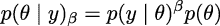

# 第十章

推断引擎

> 第一个原则是，你绝不能欺骗自己——而你最容易被自己欺骗。——理查德·费曼

到目前为止，我们主要关注模型构建、结果解释和模型批评。我们已经依赖 `pm.sample` 函数的魔力为我们计算后验分布。现在我们将集中学习该函数背后推断引擎的一些细节。

概率编程工具的整个目的，比如 PyMC，就是用户不必关心采样是如何进行的，但理解我们如何从后验分布中获取样本对完全理解推断过程非常重要，也有助于我们了解这些方法在何时何种情况下失败，以及如何应对。如果你不关心这些方法是如何工作的，你可以跳过本章的大部分内容，但我强烈建议你至少阅读*诊断样本*这一节，因为这一节提供了一些指导方针，帮助你检查后验样本是否可靠。计算后验分布的方法有很多。在本章中，我们将讨论一些通用思想，并重点介绍 PyMC 中实现的最重要的方法。我们将学习：

+   推断引擎

+   美特罗波利斯-哈斯廷斯算法

+   哈密尔顿蒙特卡洛

+   序贯蒙特卡洛

+   诊断样本

## 10.1 推断引擎

虽然贝叶斯方法在概念上简单，但在数学和数值计算上具有挑战性。主要原因是边际似然性，贝叶斯定理中的分母，通常表现为一个难以求解或计算上开销较大的积分。因此，后验通常是通过数值方法使用**马尔可夫链****蒙特卡洛**（**MCMC**）家族的算法来估计的。这些方法有时被称为推断引擎，因为至少在理论上，它们能够近似任何概率模型的后验分布。尽管在实际应用中推断并不总是那么理想，但这些方法的存在促使了概率编程语言（如 PyMC）的发展。

概率编程语言的目标是将模型构建过程与推理过程分离，以便于模型构建、评估以及模型修改/扩展的迭代步骤。通过将推理过程（而非模型构建过程）视为黑箱，像 PyMC 这样的概率编程语言用户可以专注于他们的具体问题，而将计算细节交给 PyMC 来处理。这正是我们迄今为止所做的事情。因此，你可能会偏向于认为这是显而易见或自然的方法。但需要注意的是，在概率编程语言出现之前，使用概率模型的人员也习惯于编写自己的采样方法，这些方法通常是根据他们的模型量身定制的，或者他们习惯于简化模型，使其适应某些数学近似。事实上，在某些学术圈子里，这种情况仍然存在。这种量身定制的方法可能更优雅，甚至可以为非常特定的模型提供更高效的后验计算方法，但它也容易出错且耗时，即使对于专家来说也是如此。此外，这种量身定制的方法并不适用于大多数希望利用概率模型解决问题的实践者。像 PyMC 这样的软件邀请来自不同背景的人们使用概率模型，降低了数学和计算的入门门槛。我个人认为这非常棒，也是在邀请我们更多地了解统计建模中的最佳实践，以避免自欺欺人。

之前的章节主要介绍了贝叶斯建模的基础知识；现在我们将从概念层面学习，自动推理是如何实现的，何时以及为什么会失败，失败时该怎么办。

然而，在讨论 MCMC 方法之前，让我先解释另外两种方法，这些方法有时也很有用，并且提供一种直观的理解，说明为什么我们通常使用 MCMC 作为通用方法。

## 10.2 网格法

网格法是一种简单的暴力法。即使你无法计算整个后验分布，你也许能够逐点计算先验和似然性；这是一个相当常见的情况，甚至可以说是最常见的情形。

假设我们想计算一个单参数模型的后验分布。网格逼近方法如下：

1.  为参数定义一个合理的区间（先验应该会给你一些提示）。

1.  在该区间上放置一个点的网格（通常是等距的）。

1.  对于网格中的每个点，计算似然性与先验的乘积。

可选地，我们可以对计算值进行归一化，即将`posterior`数组中的每个值除以曲线下的总面积，确保总面积为 1。

以下代码块实现了硬币翻转模型的网格法：

**代码 10.1**

```py
def posterior_grid(grid_points=50, heads=6, tails=9): 
    """ 
    A grid implementation for the coin-flipping problem 
    """ 
    grid = np.linspace(0, 1, grid_points) 
    prior = np.repeat(1/grid_points, grid_points)  # uniform prior 
    likelihood = pz.Binomial(n=heads+tails, p=grid).pdf(heads) 
    posterior = likelihood * prior 
    posterior /= posterior.sum() * (1/grid_points) 
    return grid, posterior
```

*图 10.1*展示了我们在均匀先验下，抛硬币 13 次并观察到 3 次正面的后验。由于我们仅使用了 10 个点的网格，曲线显得非常崎岖。如果增加点的数量，曲线会变得更加平滑，计算结果也会更准确，但成本也会更高。


**图 10.1**：使用网格方法计算的后验

网格方法的最大弊端是，当参数的数量（也称为维度）增多时，这种方法的扩展性较差。我们可以通过一个简单的例子来说明这一点。假设我们想要采样一个单位区间（参见*图 10.2*），就像抛硬币问题一样，我们使用四个等距的点；这意味着分辨率为 0.25 单位。现在，假设我们有一个二维问题（*图 10.2*中的正方形），并且我们想用相同分辨率的网格；我们需要 16 个点。最后，对于三维问题，我们需要 64 个点（参见*图 10.2*中的立方体）。在这个例子中，我们需要 16 倍的资源来从一个边长为 1 的立方体中采样，相比于从一个边长为 1、分辨率为 0.25 的线段中采样。如果我们决定改为分辨率为 0.1 单位，我们将需要为线段采样 10 个点，为立方体采样 1,000 个点。


**图 10.2**：1 维、2 维和 3 维中具有相同分辨率的网格

除了点的数量增长速度外，还有一个现象，并非网格方法或任何其他方法的特性，而是高维空间的特性。随着参数数量的增加，后验概率大部分集中在参数空间的某个区域，而这个区域相对于采样体积来说变得越来越小。这是一个普遍存在的现象，通常被称为“维度灾难”，或者数学家们更喜欢称之为“测度集中”。

维度灾难是指一些相关现象，这些现象在低维空间中不存在，但在高维空间中存在。以下是一些这些现象的例子：

+   随着维度的增加，任何两个样本之间的欧几里得距离趋向于类似其他样本对之间的距离。也就是说，在高维空间中，大多数点之间的距离基本上是相同的。

+   对于超立方体，大部分的体积位于其角落，而非中心。对于超球体，大部分的体积位于其表面，而非中心。

+   在高维空间中，多元高斯分布的大部分质量并不集中在均值（或众数）附近，而是位于一个壳层中，这个壳层从均值向尾部扩展，随着维度的增加而远离均值。这个壳层被称为典型集。

有关说明这些概念的代码示例，请访问本书的仓库：[`github.com/aloctavodia/BAP3`](https://github.com/aloctavodia/BAP3)。

对于我们当前的讨论，所有这些事实意味着，如果我们不明智地选择评估后验分布的位置，我们将大部分时间都花在计算对后验贡献几乎为零的值上，从而浪费宝贵的资源。因此，网格方法并不是一个明智的选择来评估后验分布，因此作为高维问题的一般方法并不十分有用。

## 10.3 二次方法

二次近似，也称为 Laplace 方法或正态近似，包含将后验分布近似为高斯分布。为此，我们首先找到后验分布的模型；在数值上，我们可以使用优化方法来实现。然后我们计算 Hessian 矩阵，从中可以估算标准差。如果你在想，Hessian 矩阵是一个二阶偏导数的方阵。就我们关心的内容来说，我们可以用它来获得标准差，通常是协方差矩阵的标准差。

Bambi 可以使用二次方法为我们解决贝叶斯模型。在以下代码块中，我们首先定义一个硬币投掷问题的模型，这是我们之前为网格方法定义的相同模型，然后使用 Bambi 中称为 `laplace` 的二次方法进行拟合：

**代码 10.2**

```py
data = pd.DataFrame(data, columns=["w"]) 
priors = {"Intercept": bmb.Prior("Uniform", lower=0, upper=1)} 
model = bmb.Model("w ∼ 1", data=data, family="bernoulli", priors=priors, 
                  link="identity") 
results = model.fit(draws=4000, inference_method="laplace")
```

*图 10.3* 显示了计算得到的后验分布和精确的后验分布。请注意，Bambi 在使用此方法时还返回样本。它首先将后验分布近似为高斯分布（或多元高斯分布），然后从中采样。


**图 10.3**：后验的二次近似

二次/Laplace 方法在 Bambi 中主要是出于教学目的。尽管如此，一个不错的特点是 Bambi 会考虑边界。例如，在硬币投掷问题中，我们知道解必须位于区间 [0, 1] 内。即使在背后使用高斯分布时，Bambi 也能确保这一点。Bambi 通过在一个无界的参数空间中拟合高斯分布，然后将其转换到适当的有界空间，从而实现这一点。

二次/Laplace 方法虽然本身非常有限，但可以作为更高级方法的构建块。例如，**集成嵌套** **拉普拉斯近似**（**INLA**）可以非常高效地拟合多种模型。

## 10.4 马尔可夫方法

有一类相关的方法，统称为**马尔可夫链** **蒙特卡洛**（**MCMC**）方法。这些是随机方法，只要我们能逐点计算似然函数和先验分布，就可以从真实的后验分布中获取样本。你可能记得，这正是我们在网格方法中需要的条件，但与网格方法不同，MCMC 方法能够高效地从高维空间中的高概率区域采样。

MCMC 方法根据各个区域的相对概率访问参数空间的每个区域。如果区域 A 的概率是区域 B 的两倍，那么我们从 A 中获得的样本将是从 B 中获得样本的两倍。因此，即使我们无法通过解析方式计算整个后验分布，我们仍然可以使用 MCMC 方法从中抽取样本。理论上，MCMC 将给我们来自正确分布的样本——关键在于，这一理论保证只在渐进意义上成立，也就是说，在无限数量的样本下！实际上，我们总是有有限数量的样本，因此我们需要检查这些样本是否可信。我们将要学习这一点，但不要急于求成；首先，让我们对 MCMC 方法的工作原理有些直观的了解。这将有助于我们稍后理解诊断方法。为了理解 MCMC 方法，我们将把这个方法拆分为“两个 MC 部分”：蒙特卡洛部分和马尔科夫链部分。

### 10.4.1 蒙特卡洛

随机数的使用解释了“蒙特卡洛”这个名字的一部分。蒙特卡洛方法是一类非常广泛的算法，通过随机抽样来计算或模拟给定的过程。蒙特卡洛是位于摩纳哥公国的一家非常著名的赌场。蒙特卡洛方法的开发者之一，Stanislaw Ulam，有一个叔叔曾在那儿赌博。Stan 的关键思想是，尽管许多问题难以精确求解或甚至无法精确表达，但它们可以通过从中抽取样本有效地进行研究。事实上，故事是这样传的：最初的动机是为了回答关于在纸牌接龙游戏中获得特定手牌的概率问题。

解决这个问题的一种方法是遵循分析组合问题。另一种方法，Stanislaw 认为，是玩几局纸牌接龙，并计算我们玩过的手牌中有多少和我们感兴趣的特定手牌相匹配！也许这对你来说听起来很显而易见，或者至少相当合理；你甚至可能用过重采样方法来解决统计问题。但请记住，这个心理实验是在大约 70 年前进行的，那时第一台实用计算机才开始被开发出来！

蒙特卡洛方法的首次应用是解决一个核物理问题，这是当时工具无法轻松应对的难题。如今，甚至个人计算机也足够强大，能够使用蒙特卡洛方法解决许多有趣的问题；因此，这些方法被广泛应用于科学、工程、工业和艺术等多个领域。使用蒙特卡洛方法计算感兴趣量的经典教学示例是对*π*值的数值估计。实际上，对于这个特定的计算，存在更好的方法，但它在教学中的价值依然存在。

我们可以通过以下过程估算*π*的值：

1.  随机地将*N*个点投掷到边长为 2*R*的正方形中。

1.  在方形内部画一个半径为*R*的圆，并计算圆内的点数*M*。

1.  计算  作为比例 4。

这里有几点说明：

+   圆的面积与圆内点数(*M*)成正比，方形的面积与总点数(*N*)成正比。

+   我们知道，如果满足以下关系式，则一个点在圆内：。

+   方形的面积是(2*R*)²，圆的面积是*πR*²。因此，我们知道方形面积与圆面积的比值是*π*。

使用几行 Python 代码，我们可以运行这个简单的蒙特卡罗模拟并计算*π*，同时也能计算我们估算值相对于真实*π*值的相对误差。一次运行的结果如**图 10.4**所示。


**图 10.4**：*π*的蒙特卡罗近似

### 10.4.2 马尔可夫链

马尔可夫链是一个数学对象，由一系列状态和描述如何在状态之间转换的转移概率组成。你可以自己创建一个马尔可夫链；比如，抛硬币，如果得到正面，就向右走一步，否则向左走一步。这是一个简单的一维马尔可夫链。如果一个链是马尔可夫链，那么从任何状态转移到其他状态的概率只依赖于当前状态。

作为从业者，你只需要知道马尔可夫链提供了一个框架来研究 MCMC 采样器的性质（以及其他一些有用的应用）。它们并不难理解，至少是最基本的性质并不难理解。但对于你作为模型构建者来说，深入细节并没有太大意义，因此我们不会进一步讨论。如果你有兴趣，可以查看 Blitzstein [2019]，那是一个很好的入门介绍。

最流行的 MCMC 方法可能是美特罗波利斯-哈斯廷斯算法，接下来我们将讨论它。

### 10.4.3 美特罗波利斯-哈斯廷斯算法

对于某些分布，例如高斯分布，我们有非常高效的算法可以从中获得样本，但对于其他分布则不一定是这样。美特罗波利斯-哈斯廷斯算法使我们能够从任何概率分布中获得样本，只要我们能够计算出与之成比例的值，因此可以忽略归一化因子。这非常有用，因为很多时候更困难的部分恰恰是计算归一化因子。这在贝叶斯统计中尤为明显，在贝叶斯统计中，计算边际似然可能是一个决定性的难点。

为了概念性地理解这种方法，我们将使用以下类比。假设我们有兴趣找到湖泊中的水量，并且找出湖泊中最深的部分。湖水非常浑浊，因此我们无法通过看水底来估算深度，湖泊又非常大，所以使用网格近似方法似乎不是一个好主意。为了制定抽样策略，我们寻求了两位好朋友的帮助：Markovia 和 Monty。经过一次富有成效的讨论，他们提出了以下算法，它需要一艘船——不用太奢华，我们甚至可以使用一只木筏和一根非常长的木棍。这比声呐便宜，而且我们已经把所有的钱都花在船上了！看看这些步骤：

1.  在湖中选择一个随机位置，并将船移到那里。

1.  使用木棍测量湖泊的深度。

1.  将船移动到另一个点并进行新的测量。

1.  通过以下方式比较这两种方法：

    1.  如果新位置比第一个位置更深，记下新位置的深度并从第 3 步重复。

    1.  如果这个位置比第一个位置更浅，我们有两个选择：接受或拒绝。接受意味着我们记录下新位置的深度并从第 3 步重复。拒绝意味着我们返回第一个位置，并再次（是的，重新！）记录第一个位置的深度值。

决定是否接受或拒绝新位置的规则称为 Metropolis-Hastings 标准，基本上说的是，我们必须按与新旧位置深度比值成正比的概率接受新位置。

如果我们按照这个迭代过程进行，不仅能得到湖泊的总体水量和最深的点，还能得到湖底整个曲率的近似值。正如你可能已经猜到的那样，在这个类比中，湖底的曲率就是后验分布，最深的点是众数。根据我们的朋友 Markovia 说，迭代次数越多，近似值就越好。事实上，理论保证在某些一般条件下，如果我们获取无限多个样本，我们最终会得到精确的答案。幸运的是，在实践中，对于许多问题，我们可以通过有限且相对较少的样本获得非常准确的近似值。

上述解释足以帮助我们概念性地理解 Metropolis-Hastings 算法。接下来的几页将提供更详细和正式的解释，以防你想深入了解。

Metropolis-Hastings 算法有以下步骤：

1.  为参数 *x*[*i*] 选择一个初始值。这可以通过随机选择或根据经验猜测来完成。

1.  通过从 *Q*(*x*[*i*+1]|*x*[*i*]) 中抽样，选择一个新的参数值 *x*[*i*+1]。我们可以把这一步看作是对状态 *x*[*i*] 的某种扰动。

1.  使用 Metropolis-Hastings 标准计算接受新参数值的概率：

    

1.  如果在步骤 3 中计算的概率大于从 [0, 1] 区间的均匀分布中取出的值，我们就接受新的状态；否则，我们保持在旧的状态中。

1.  我们从步骤 2 开始迭代，直到我们有足够的样本。

这里有几个需要注意的事项：

+   *Q* 被称为提议分布。它可以是我们想要的任何分布，但我们通常选择一个容易采样的分布，比如高斯分布或均匀分布。

+   注意，*Q* 不是先验、似然或模型的任何部分。它是 MCMC 方法的一个组成部分，而不是模型的一部分。

+   如果 *Q* 是对称的，则 *q*(*x*[*i*]|*x*[*i*+1]) 和 *q*(*x*[*i*+1]|*x*[*i*]) 会相互抵消。因此，我们只需要评估比值 。

+   步骤 3 和步骤 4 表明我们总是会接受转向一个更可能的状态。较不可能的参数值会按概率接受，给定新参数值 *x*[*i*+1] 和旧参数值 *x*[*i*] 之间的比率。接受提议步骤的这一标准，相较于网格方法，给我们提供了一种更高效的采样方法，同时保证了正确的采样。

+   目标分布（贝叶斯统计中的后验分布）是通过一组采样的参数值来近似的。如果我们接受，就将 *x*[*i*+1] 添加到新采样值的列表中。如果我们拒绝，就将 *x*[*i*] 添加到列表中，即使这个值是重复的。

在这个过程的最后，我们将得到一组数值。如果一切都按正确的方式完成，这些样本将是后验分布的近似。我们追踪中出现频率最高的数值将是根据后验分布最可能的值。此过程的一个优点是，分析后验分布就像操作一组数值数组一样简单，正如你在之前的章节中所做的那样。

以下代码演示了 metropolis 算法的一个非常基础的实现。它并不是为了求解一个实际问题，而是为了展示如果我们知道如何逐点计算概率密度，我们可以从概率分布中采样。请注意，以下实现没有涉及任何贝叶斯的内容；它没有先验，甚至没有数据！请记住，MCMC 方法是非常通用的算法，可以应用于广泛的问题。

metropolis 函数的第一个参数是一个 PreliZ 分布；我们假设我们不知道如何直接从这个分布中获取样本：

**代码 10.3**

```py
def metropolis(dist, draws=1000): 
    """A very simple Metropolis implementation""" 
    trace = np.zeros(draws) 
    old_x = 0.5 
    old_prob = dist.pdf(old_x) 

    delta = np.random.normal(0, 0.5, draws) 
    for i in range(draws): 
        new_x = old_x + delta[i] 
        new_prob = dist.pdf(new_x) 
        acceptance = new_prob / old_prob 
        if acceptance >= np.random.random(): 
            trace[i] = new_x 
            old_x = new_x 
            old_prob = new_prob 
        else: 
            trace[i] = old_x 
    return trace
```

我们的简单 metropolis 算法的结果如 *图 10.5* 所示。黑线表示真实分布，而条形表示我们计算的样本。


**图 10.5**：来自简单的 metropolis 算法的样本

算法的效率在很大程度上依赖于提议分布；如果提议的状态与当前状态相差很远，拒绝的概率就会非常高；如果提议的状态非常接近当前状态，我们就会非常缓慢地探索参数空间。在这两种情况下，我们需要的样本数量都远远多于较不极端的情况。通常，提议分布是一个多变量高斯分布，其协方差矩阵在调节阶段确定。PyMC 通过遵循一个经验法则来自适应地调节协方差，即一维高斯分布的理想接受率大约是 50%，而 n 维高斯目标分布的理想接受率大约是 23%。

MCMC 方法通常需要一些时间才能开始从目标分布中获取样本。所以，在实践中，人们会进行烧入步骤，即消除前一部分样本。进行烧入是一个实际的技巧，而不是马尔可夫理论的一部分；实际上，对于无限样本来说，这并不是必需的。因此，去除前一部分样本只是一个*临时*的技巧，用于在只能计算有限样本的情况下获得更好的结果。拥有理论保证或指导总是比没有它们要好，但对于任何实际问题，理解理论与实践之间的区别非常重要。记住，我们不应当因为将数学对象与这些对象的近似混淆而感到困惑。球体、高斯分布、马尔可夫链以及所有数学对象只存在于理念的柏拉图世界中，而不在我们不完美的现实世界中。

到这一点，我希望你已经对 Metropolis-Hastings 方法有了一个清晰的概念理解。你可能需要回头再读这一部分几遍；这完全没问题。主要思想简单但也很微妙。

### 10.4.4 哈密顿蒙特卡洛

MCMC 方法，包括 Metropolis-Hastings，提供了理论上的保证：如果我们获取足够多的样本，就能准确地近似正确的分布。然而，在实践中，可能需要比我们拥有的时间更多的时间来获取足够的样本。因此，已经提出了 Metropolis-Hastings 算法的替代方案。

许多替代方法，比如 Metropolis-Hastings 算法本身，最初是为了解决统计力学中的问题而开发的。统计力学是物理学的一个分支，研究原子和分子系统的性质，因此可以通过物理系统的类比以非常自然的方式进行解释。一个这样的修改被称为**哈密顿蒙特卡洛**，或者**混合蒙特卡洛**（**HMC**）。简单来说，哈密顿量是描述物理系统总能量的量。术语*混合*也被使用，因为它最初被构想为 Metropolis-Hastings 与分子力学的混合，分子力学是用于分子系统的广泛应用的模拟技术。

从概念上讲，我们可以将 HMC 方法视为一种 Metropolis-Hastings 方法，只不过其提议分布不是随机的。为了在不涉及数学细节的情况下对 HMC 有一个概念性的理解，我们可以再次使用湖泊和船只的类比。我们不再随机地移动船只，而是沿着湖底的曲率来移动船只。为了决定船只的移动方向，我们让一个球从当前位置开始滚到湖底。我们的球是一个非常特殊的球：它不仅是完美的球形，而且没有摩擦力，因此不会被水或泥土减速。我们扔下这个球，让它滚动一小段时间，直到我们突然停止它。然后，我们使用 Metropolis 准则接受或拒绝这个提议的步骤，就像我们在传统的 Metropolis-Hastings 方法中所做的那样。接着，整个过程会被重复多次。幸运的是，这种修改后的程序会增加接受新位置的机会，即使这些新位置相对于之前的位置远得多。

根据参数空间的曲率进行移动被证明是一种更聪明的移动方式，因为它避免了 Metropolis-Hastings 方法的主要缺点之一：高效探索样本空间需要拒绝大多数提出的步骤。相反，使用 HMC 方法，即使是参数空间中较远的点，也能获得较高的接受率，从而实现非常高效的采样方法。

让我们走出这个假想实验，回到现实世界。我们必须为这种非常巧妙的基于哈密顿量的提议付出代价。我们需要计算我们函数的梯度。梯度是导数概念在多维空间中的推广；计算函数在某一点的导数告诉我们函数在哪个方向上增大，在哪个方向上减小。我们可以使用梯度信息来模拟球体在弯曲空间中的运动；事实上，我们使用与经典物理学中模拟经典力学系统（如滚动的球体、行星系统中的轨道、分子震动）相同的运动定律和数学工具。

计算梯度使我们面临一个权衡：每一步 HMC 的计算成本比 Metropolis-Hastings 步骤高，但 HMC 的接受概率远高于 Metropolis。为了平衡这个权衡，使其有利于 HMC，我们需要调整 HMC 模型的一些参数（类似于调整 Metropolis-Hastings 采样器的提议分布宽度）。当这种调整是手动进行时，需要通过反复试验，并且还需要经验丰富的用户，这使得这个过程比我们希望的更加依赖于用户的经验，缺乏普遍适用性。幸运的是，现代的概率编程语言配备了高效的自适应哈密顿蒙特卡洛方法，比如 PyMC 中的 NUTS 采样器。这个方法已经证明在求解贝叶斯模型时非常有用和高效，且无需人工干预（或者至少可以最小化人工干预）。

哈密顿蒙特卡洛方法的一个局限是，它们仅适用于连续分布；原因是我们无法对离散分布计算梯度。PyMC 通过将 NUTS 分配给连续参数，将其他采样器分配给其他参数（例如，将 PGBART 分配给 BART 随机变量，将 Metropolis 分配给离散变量）来解决这个问题。

基于 JAX 的采样

JAX 是一个旨在提供高性能数值计算和自动微分的库，用于复杂的数学运算。PyMC 使用的是 NUTS 的 Python 版本。但你也可以使用基于 JAX 的采样器实现。根据你的模型，这些采样器可能比 PyMC 默认的 NUTS 采样器快得多。为了使用它们，我们需要为`pm.sample()`指定`nuts_sampler`参数。当前支持的选项有`"nutpie"`、`"blackjax"`和`"numpyro"`。这三种采样器默认不与 PyMC 一起安装，所以你需要手动安装它们。对于 CPU，nutpie 可能是最快的选择：[`github.com/pymc-devs/nutpie`](https://github.com/pymc-devs/nutpie)。在本书中，我们使用了 nutpie 从高斯过程（GPs）中采样——请参见*第八章*中的 Jupyter 笔记本。

我强烈推荐你配合这个非常酷的应用程序来阅读本节内容，作者是 Chi Feng：[`chi-feng.github.io/mcmc-demo`](https://chi-feng.github.io/mcmc-demo)。

## 10.5 序列蒙特卡洛

Metropolis-Hastings 和 NUTS（以及其他哈密顿蒙特卡洛变体）的一大局限是，如果后验分布具有多个峰值且这些峰值之间被非常低概率的区域分隔，这些方法可能会陷入单一模式，错过其他峰值！

许多为克服这个多重极小值问题而开发的方法基于温度化的思想。这个思想再次借鉴了统计力学的概念。一个物理系统可以占据的状态数取决于系统的温度；在 0 开尔文（最低可能温度）下，所有系统都陷入一个单一状态。而在另一极端，对于无限温度，所有可能的状态都是等概率的。通常，我们关注的是处于某个中间温度的系统。对于贝叶斯模型，通过对贝叶斯定理进行某种变化，可以直观地应用这个温度化思想。



参数*β*被称为逆温度或温度化参数。注意，当*β* = 0 时，我们得到*p*(*y*|*θ*)^(*β*) = 1，因此温度化后验*p*(*θ*|*y*)[*β*]仅仅是先验*p*(*θ*)，而当*β* = 1 时，*温度化*后验就是实际的完整后验。由于从先验分布进行采样通常比从后验分布采样更容易（通过增加*β*的值），我们从一个较容易的分布开始采样，并逐渐将其转变为我们真正关心的更复杂的分布。

有许多方法利用了这个思想，其中之一被称为**顺序蒙特卡罗**（**SMC**）。PyMC 中实现的 SMC 方法可以总结如下（也见*图 10.6*）：

1.  将*β*初始化为 0。

1.  从温度化后验中生成*N*个样本*S*[*β*]。

1.  将*β*稍微增加一点。

1.  计算一组*N*的权重*W*。这些权重是根据新的温度化后验计算得出的。

1.  通过根据*W*对*S*[*b*]进行重采样，获得*S*[*w*]。

1.  运行*N*个 Metropolis 链，每个链都从*S*[*w*]中的不同样本开始。

1.  从步骤 3 开始重复，直到*β* ≥ 1。


**图 10.6**：SMC 的示意图

重采样步骤通过移除概率较低的样本并用概率较高的样本替换它们来工作。Metropolis 步骤扰动这些样本，帮助探索参数空间。

温度化方法的效率很大程度上取决于*β*的中间值，这通常被称为降温计划。*β*的两个连续值之间的差异越小，两个连续的温度化后验就会越接近，因此从一个阶段到下一个阶段的过渡就会更容易。但如果步长太小，我们将需要许多中间阶段，超过某个点，这将导致浪费大量计算资源，而并未真正提高结果的准确性。

幸运的是，SMC 可以自动计算*β*的中间值。具体的降温计划将根据问题的难度进行调整；较难采样的分布将需要比简单分布更多的阶段。

在*图 10.6* 的顶部，我们有九个样本或粒子（灰色点），它们来自先验，表示为覆盖所有内容的非常宽的分布（阶段 0）。对于后续阶段，我们根据其加权后验密度重新加权前一个阶段的样本。然后，我们根据这些权重进行重采样。因此，一些粒子会被丢失并被其他样本替代，所以总数保持不变。接着，我们对样本进行突变，也就是说，我们对粒子应用一个或多个 MCMC 步骤。然后我们增加 *β* 并重复这一过程。当我们达到 *β* = 1 时，粒子（或样本）将按照后验分布进行分布。

除了*β*的中间值外，还有两个参数是根据前一个阶段的接受率动态计算的：每个马尔可夫链的步数和提议分布的宽度。

## 10.6 诊断样本

在本书中，我们使用数值方法计算几乎所有模型的后验。你在使用贝叶斯方法处理自己问题时，很可能也会遇到这种情况。由于我们使用有限数量的样本来近似后验，因此检查我们是否有有效样本是非常重要的；否则，从中得出的任何分析都会完全失真。我们可以执行几个测试，其中一些是视觉测试，其他的是定量测试。这些测试旨在发现样本的问题，但无法证明我们拥有正确的分布；它们只能提供样本似乎合理的证据。如果我们发现样本有问题，还有很多解决方案可以尝试。我们将在诊断过程中讨论这些解决方法。

为了使解释更具体，我们将使用最简模型，包含两个参数：一个全局参数 *a* 和一个组参数 *b*。仅此而已，这些模型甚至没有似然/数据！

**代码 10.4**

```py
with pm.Model() as model_c: 
    a = pm.HalfNormal('a', 10) 
    b = pm.Normal('b', 0, a, shape=10) 
    idata_cm = pm.sample(tune=2000) 

with pm.Model() as model_nc: 
    a = pm.HalfNormal('a', 10) 

    b_offset = pm.Normal('b_offset', mu=0, sigma=1, shape=10) 
    b = pm.Deterministic('b', 0 + b_offset * a) 
    idata_ncm = pm.sample(tune=2000)
```

`model_c`和`model_nc`模型之间的区别在于，对于前者，我们直接拟合组级参数，而对于后者，我们将组级参数建模为一个平移和缩放的高斯分布。

这两个模型可能看起来对你来说过于人工化，或者只是奇怪。然而，需要注意的是，这两个模型的结构本质上与我们在*第四章 4* 中已经讨论过的居中和非居中参数化是相同的。

根据该章节的讨论，我们应该期待从`model_nc`获得比`model_c`更好的样本。让我们检查我们的预期是否成立。

## 10.7 收敛性

理论上，MCMC 方法在我们采集无限样本时是可以保证收敛的。实际上，我们需要检查所采样本是否合理且有限。通常，当我们收集到证据表明样本在某种意义上是*稳定*的时，我们就认为采样器已收敛。一个简单的测试方法是多次运行相同的 MCMC 模拟，并检查每次是否得到相同的结果。这也是为什么 PyMC 默认运行更多链条的原因。对于现代计算机来说，这是几乎没有成本的，因为我们有多个核心。而且，它们不会浪费资源，因为我们可以将不同链条的样本合并来计算摘要、绘图等。

有许多方法可以检查不同链条在实际应用中的等效性，无论是通过视觉方式还是正式测试。我们在这里不会深入探讨技术细节；我们只会展示一些例子，希望它们足以让你培养出解读诊断结果的直觉。

### 10.7.1 轨迹图

检查收敛性的一种方法是通过视觉检查链条是否相似。例如，我们可以使用 ArviZ 的 `plot_trace` 函数。为了更好地理解在检查这些图表时应该注意什么，我们将比较之前定义的两个模型的结果。

变量 `b` 是 10 维的。为了清晰和简洁，我们只展示其中一个维度。你可以随时在自己的计算机上将所有维度可视化。*图 10.7* 显示了许多问题。在左列中，我们有四个 KDE，每个链条一个。我们可以看到它们看起来不同。这表明每条链条采样的后验区域略有不同。在右列中，我们有轨迹本身。我们也有四条线，每条链条一条，虽然它们有些凌乱，但我们仍然可以看到，有一条链条从第一步就卡在 0 附近，直到几乎第 400 步才有所变化。我们在第 800 步左右也看到类似的情况。

当我们将*图 10.7*与*图 10.8*进行比较时，问题变得更加明显。对于后者，我们看到四条链的 KDE 看起来相互之间更为相似，而轨迹图看起来模糊得多，更像是*噪声*，很难看到明显的模式。我们希望曲线能够自由地漫游。当这种情况发生时，我们说我们有**良好的** **混合**。我们这么表达是因为很难区分一条链与另一条链；它们是混合的。这是好事，因为这意味着即使我们从不同的起点启动四条（或更多）独立链条，它们也都描述了相同的分布。这并不是收敛的证明，但至少我们没有看到非收敛或糟糕混合的证据。


**图 10.7**：`model_c` 的轨迹图

*图 10.7* 还有一些黑色垂直线条出现在顶部，而*图 10.8* 中没有这些线条。这些是发散点；本章稍后有专门的部分讨论这些问题。


**图 10.8**：`model_nc` 的轨迹图

### 10.7.2 排名图

轨迹图可能很难解读，特别是当我们有多个链时，因为容易忽略一些细节。一个替代方案是使用排名图 [Vehtari et al., 2021]。为了构建某一参数的排名图，我们首先将所有链中的所有样本进行排序，并分配一个整数：这是第 0 个样本，这是第 1 个样本，这是第 2 个样本，依此类推。然后，我们将所有排名根据原始链进行分组。最后，我们绘制与链数相等的直方图。如果所有链都来自相同的分布，我们可以预期所有链都有相同数量的低排名、高排名、中等排名等。换句话说，排名的直方图应该是均匀的。

要获取排名图，我们可以调用 ArviZ 的 `plot_trace` 函数，并使用 `kind="rank_bars"` 参数。图 10.9 和图 10.10 是这类图的示例。


**图 10.9**：`model_c` 的排名图


**图 10.10**：`model_nc` 的排名图

左边是我们之前展示过的相同的 KDE 图。右边是排名图。再次强调，`model_nc` 的结果看起来好多了；与均匀分布的偏差非常小。另一方面，我们可以从 *图 10.9* 中看到一些问题；例如，参数 `a` 的排名在 500 或更低的地方看起来非常差，参数 `b` 在排名大约为 2000 处也很糟糕。其他区域也存在问题。

### 10.7.3  (R hat)

比较独立链的一种定量方法是使用  统计量。此测试的思路是计算链之间的方差与链内部的方差之比。理想情况下，我们应该期望值为 1。作为经验法则，值小于 1.01 也是可以接受的；较高的值则表示缺乏收敛性。我们可以使用 `az.r_hat` 函数计算该值（参见 *表 10.1*）。 诊断量也可以通过默认的 `az.summary` 函数计算，或者通过 `az.plot_forest`（使用 `r_hat=True` 参数）来选择性计算。

|  | *a* | *b*[0] | *b*[1] | *b*[2] | *b*[3] | *b*[4] | *b*[5] | *b*[6] | *b*[7] | *b*[8] | *b*[9] |
| --- | --- | --- | --- | --- | --- | --- | --- | --- | --- | --- | --- |
| model_c | 1.2 | 1.17 | 1.05 | 1.17 | 1.17 | 1.15 | 1.11 | 1.09 | 1.17 | 1.18 | 1.17 |
| model_nc | 1.0 | 1.0 | 1.0 | 1.0 | 1.0 | 1.0 | 1.0 | 1.0 | 1.0 | 1.0 | 1.0 |

**表 10.1**：`model_c` 和 `model_ncm` 模型的  值

大约 1.1 的值在建模初期可能是可以接受的，特别是当你只是检查一个似然是否合理，或仅仅是尝试找出你真正想要构建的模型时。此外，对于参数较多的模型来说，1.01 的阈值可能过于严格。原因是即使你确实已经达到了收敛，你仍然可能偶然得到一些超过这个阈值的  值。例如，PyMC-BART 包括 `plot_convergence` 函数。该函数旨在检查 BART 随机变量的收敛性。使用 BART 模型时，每个观察值都会得到一个 ，而且这个数量可能很多。因此，`plot_convergence` 显示了  值的累积分布以及一个阈值，这个阈值会自动计算并考虑到观察值的数量，从而进行多重比较的校正。

*图 10.11* 显示了此类图的示例。在右侧，我们展示了  的累积分布，并有一条灰色虚线表示调整后的阈值。理想情况下，整个累积曲线应位于虚线的左侧。在 *图 10.11* 的左侧子图中，我们展示了 **有效样本量**（**ESS**）。我们将在下一节解释 ESS。


**图 10.11**：使用 `pmb.plot_convergence(.)` 计算的诊断图

## 10.8 有效样本量（ESS）

MCMC 样本可能是相关的。原因是我们使用当前的位置生成一个新位置，并在考虑旧位置的基础上接受或拒绝下一个位置。这种依赖性对于调优良好的现代方法（如哈密顿蒙特卡洛）通常较低，但有时也可能较高。我们可以使用 `az.plot_autocorrelation` 计算并绘制自相关图。但通常，更有用的度量是计算 **有效样本量**（**ESS**）。我们可以将这个数字看作是样本中有用的抽样次数。由于自相关，这个数字通常会低于实际的样本数。我们可以使用 `az.ess` 函数来计算它（见 *表 10.2*）。ESS 诊断也可以通过 `az.summary` 函数默认计算，或者通过 `az.plot_forest` 函数（使用 `ess=True` 参数）来选择性计算。

|  | *a* | *b*[0] | *b*[1] | *b*[2] | *b*[3] | *b*[4] | *b*[5] | *b*[6] | *b*[7] | *b*[8] | *b*[9] |
| --- | --- | --- | --- | --- | --- | --- | --- | --- | --- | --- | --- |
| model_cm | 14 | 339 | 3893 | 5187 | 4025 | 5588 | 4448 | 4576 | 4025 | 4249 | 4973 |
| model_ncm | 2918 | 4100 | 4089 | 3942 | 3806 | 4171 | 3632 | 4653 | 3975 | 4092 | 3647 |

**表 10.2**：`model_c` 和 `model_ncm` 模型的 ESS 值

一般规则是我们至少需要一个有效样本量为 400（每条链 100 ESS）。如果得到的值低于这个数值，我们的估计不仅可能过于嘈杂，甚至像  这样的诊断图也可能变得不可靠。

MCMC 样本的质量可能会因后验分布的不同区域而异。例如，至少对于某些问题，采样分布的中心部分可能比尾部部分更容易。因此，我们可能希望计算后验分布不同区域的 ESS 值。`az.ess()`返回的默认值是中心区域的 ESS，它估计分布中心的解析精度。如果你对某个参数的均值或中位数感兴趣，应该检查这个 ESS 值。如果你想报告后验区间或关注稀有事件，应检查尾部 ESS 值，它是在 5%和 95%分位数处计算的最小 ESS 值。如果你对特定分位数感兴趣，可以使用`az.ess(., method='quantile')`来请求这些具体的值。我们甚至可以使用`az.plot_ess(., kind="quantiles")`函数同时绘制多个分位数的 ESS，如*图 10.12*所示，针对参数`a`。


**图 10.12**：参数`a`的 ESS 分位数

最后，当我们运行模型并发现 ESS 值非常低时，第一反应可能是增加样本数。有时候这就足够了。但有时即使增加 10 倍样本也不够。我们可以使用`az.plot_ess(., kind="evolution")`，而不是通过反复试验。这将为我们提供一个样本与 ESS 的图，如*图 10.13*所示。我们可以利用这些信息来估计需要多少样本才能达到给定的 ESS 值。例如，在*图 10.13*中，我们可以看到仅通过增加样本数，`model_c`中参数`a`的 ESS 值没有太大希望变得理想。与此相比，`model_nc`的 ESS 值对于大部分样本接近实际样本数。


**图 10.13**：参数`a`的 ESS 演变

## 10.9 蒙特卡罗标准误差

即使我们有一个非常低的和一个非常高的 ESS 值，MCMC 的样本仍然是有限的，因此我们在估计后验参数时会引入误差。幸运的是，我们可以估算这个误差，它被称为**蒙特卡罗标准误差**（**MCSE**）。MCSE 的估算考虑到样本之间并非真正独立。我们希望得到的结果精度受限于这个值。如果某个参数的 MCSE 为 0.2，那么报告该参数为 2.54 是没有意义的。相反，如果我们重复模拟（使用不同的随机种子），我们应该预期 68%的结果会落在 2.54±0.2 的范围内。同样，对于 95%的结果，它们应该落在 2.54±0.4 的范围内。在这里，我假设 MCSE 服从正态分布，并利用高斯分布的性质：大约 68%的值位于一个标准差以内，约 95%的值位于两个标准差以内。

、ESS 和 MCSE 是相关的。实际上，我们应该使用 ESS 作为无量纲诊断，以确保我们拥有足够的有效样本。它是无量纲的，因为无论一个参数从 0 到 1，另一个从 0 到 100，都不影响 ESS 的比较。我们可以比较它们的 ESS 值。对于 ESS，值越大越好，最低值至少为 400。如果达到最低值，我们检查是否有足够低的 。我们还可以通过可视化的排名图或轨迹图来检查（我们还应检查发散，因为稍后我们将进行解释）。如果一切正常，我们再检查 MCSE 是否足够低，适用于我们希望报告的参数和精度。希望对于大多数问题，MCSE 都会远低于我们所需的精度。

过多的数字可能会有害

在报告文本、表格或图表时，重要的是要意识到过多的数字会让数字难以读取和理解。数字如 0.9 比 0.909297 更容易阅读，也更容易记住。此外，当报告的数字位数超过实际需要时，技术受众可能会认为你暗示着比实际存在的更高的显著性。因此，你会误导这些受众，让他们试图从本无意义的差异中寻找含义。最后，过多的数字会让你的图表、表格和图形看起来凌乱且视觉上令人不堪重负。所以，请时刻记住要考虑你的受众的数据兴趣和上下文。

## 10.10 发散

我们现在将探讨发散（divergences），这是一种 NUTS 特有的诊断方法，因为它基于方法的内部机制，而不是生成样本的属性。发散是一种强大且敏感的诊断方法，它表明采样器很可能已经发现了后验分布中的一个高曲率区域，该区域无法被正确探索。发散的一个优点是，它们通常出现在问题参数空间区域附近，因此我们可以利用它们来识别问题可能所在的位置。

让我们通过视觉辅助工具讨论发散：


**图 10.14**：`model_c` 和 `model_nc` 模型中选定参数的配对图

如你所见，*图 10.14* 显示了以下三个子图：

+   左侧子图：我们展示的是`model_c`模型的两个参数的散点图；即，`b`参数的一个维度（我们随便挑了一个 – 你可以选择不同的维度），以及`a`参数的对数值。我们取对数是因为`a`被限制为正值（它是一个尺度参数）。在采样之前，PyMC 会将所有有界的参数转换为无界的参数。对于像`a`这样的参数，转换方法是取对数。我们在这里也做同样的处理，因为我们想理解采样器究竟在“看到”什么。好了，我们有一个散点图，其中灰色点表示样本。看看这个参数的形状，这种形状被称为 Neal 的漏斗形状，在层次模型中很常见。黑色点表示发散，它们散布在各处，但我们可以看到，许多黑点集中在漏斗的尖端附近。这个几何形状对大多数 MCMC 方法来说是有问题的，因为很难调整采样器，使其既能在漏斗尖端和顶部获取良好的样本，又能适应这种几何形状。一种是更“球形”的区域，采样器可以上下左右自由移动，另一种是“更窄”的区域，采样器必须主要沿上下方向移动，左右方向的移动则非常有限。

+   中间的子图：我们基本上与之前的情况相同，但对于`model_nc`模型，现在漏斗形状更加明显。但我们没有出现发散。而且我们从前面的章节已经知道，这个模型的样本实际上更好。到底发生了什么？理解这一点的关键在于模型的定义。你会注意到，对于这个模型，`b`并没有被采样：`b`是一个确定性变量，是`b_offset`和`a`的组合，这两个参数在最后一个子图中被绘制出来。

+   右侧子图：我们有`b_offset`与`a`的关系，可以看到几何形状更“球形”。正是这一点，而不是中间的子图，才是采样器“看到”的内容。因为这种几何形状更容易采样，所以我们没有出现发散，整体的诊断结果也更好。

改变模型的参数化是去除发散的一种方法，但除非你已经知道模型的另一种参数化方法，否则找到合适的参数化可能非常耗时。一个常见且容易尝试的替代方案是改变`target_accept`的值，这是`pm.sample`的一个参数。有时候，你可能需要同时更换参数化方法和`target_accept`的值。那么，什么是`target_accept`呢？它是控制 PyMC 中 NUTS 采样器调优的一个参数。它控制提议样本的接受率，默认值为 0.8。也就是说，接受 80%的提议样本。NUTS 采样器通过自适应调整哈密顿动力学仿真中的步长来实现目标接受率。80%是一个不错的默认值，但对于某些模型，你可能想尝试更大的值，如 0.90、0.95、0.99，甚至是 0.999，如果你不想完全失去希望的话。

## 10.11 保持冷静，继续尝试

当诊断显示问题时，我们应该怎么做？我们应该尝试修复它们。有时候，PyMC 会提供一些关于如何修改的建议。注意这些建议，你可以节省大量的调试时间。在这里，我列出了几个常见的操作，你可以采取：

+   检查拼写错误或其他低级错误。即使是专家，也很常犯这种“低级”错误。如果你拼错了一个变量名，很可能模型根本无法运行。但有时候，错误更加微妙，你仍然得到一个语法上有效的模型，它能运行，但语义却是错误的。

+   增加样本数量。这可能对一些轻微的问题有所帮助，比如当你接近目标 ESS（或 MCSE）时，或者当^*R*略高于 1.01 但差距不大时。

+   从轨迹的开始部分移除一些样本。当检查轨迹图时，你可能会观察到，前几步的部分样本相比于其余部分具有明显较高或较低的值，而其他部分看起来正常。如果是这种情况，简单地移除这些前几步的样本可能就足够了。这被称为预热，这在过去是非常常见的做法。现代的采样器已经减少了对它的需求。此外，PyMC 已经会丢弃调优阶段的样本，所以这个建议现在不再像以前那样有用。

+   修改采样器参数，例如增加调优阶段的长度，或者增加 NUTS 采样器的`target_accept`参数。

+   转换数据。例如，对于线性回归模型，居中协变量（减去其均值）通常能加速采样器，并且减少采样问题。

+   花些时间思考你的先验分布。你不应该为了加速采样器或者去除不良诊断而调整先验。你应该用先验来编码已有的知识。但通常情况下，当你这么做时，也会让采样器的工作变得更加容易。使用像 PreliZ 和先验预测检查这样的工具，帮助你编码更好的先验分布。

+   重新参数化模型，即用一种不同但等效的方式表达模型。这并不总是容易的，但对于一些常见模型，如层级模型，你已经知道一些替代的参数化方法。

## 10.12 总结

在本章中，我们对一些最常用的计算后验分布的方法进行了概念性的讲解。我们特别强调了 MCMC 方法，这些方法旨在适用于任何给定的模型（或者至少广泛的模型范围），因此有时被称为通用推断引擎。这些方法是任何概率编程语言的核心，因为它们允许自动推断，从而让用户专注于迭代的模型设计和结果的解释。

我们还讨论了用于诊断样本的数值和视觉测试。没有良好的后验分布近似，贝叶斯框架的所有优势和灵活性都会消失。因此，在进行任何其他类型的分析之前，评估样本的质量是一个至关重要的步骤。

## 10.13 练习

1.  使用网格方法与其他先验；例如，尝试 `prior = (grid <= 0.5).astype(int)` 或 `prior = abs(grid - 0.5)`，或者尝试定义你自己的奇特先验。还可以尝试使用其他数据，例如增加数据的总量，或使数据在正反面次数上更加均匀或不均匀。

1.  在估计 *π* 的代码中，保持 `N` 固定并重新运行几次。注意到结果有所不同，因为我们使用的是随机数，但也要检查误差大致相同的顺序。尝试改变 `N` 点的数量，并重新运行代码。你能估算出 `N` 点的数量和误差之间的关系吗？为了更好的估算，你可能想修改代码，将误差作为 `N` 的函数进行计算。你还可以用相同的 `N` 运行几次代码，计算平均误差和误差的标准差。你可以使用 Matplotlib 的 `plt.errorbar()` 函数绘制这些结果。尝试使用一组 `N` 值，如 100、1000 和 10000；也就是一个数量级的差异。

1.  修改你传递给 metropolis 函数的 `dist` 参数；尝试使用 *第一章* 中的先验值。将此代码与网格方法进行比较；哪一部分需要修改，才能使用它来解决贝叶斯推断问题？

1.  将你在之前练习中的答案与 Thomas Wiecki 的代码进行比较：[`twiecki.github.io/blog/2015/11/10/mcmc-sampling/`](http://twiecki.github.io/blog/2015/11/10/mcmc-sampling/)

1.  重温至少几个前面章节中的模型，并运行我们在本章中看到的所有诊断工具。

1.  重温所有前几章的代码，找出那些存在偏差的地方，并尽量减少这些偏差。

## 加入我们的社区 Discord 空间

加入我们的 Discord 社区，与志同道合的人一起学习，超过 5000 名成员在此一起成长： [`packt.link/bayesian`](https://packt.link/bayesian)


