# 第一章. 矩阵操作

在本章中，我们将探讨一个基本而优雅的数学数据结构——**矩阵**。大多数计算机科学和数学毕业生已经熟悉矩阵及其应用。在机器学习的背景下，矩阵用于实现多种机器学习技术，如线性回归和分类。我们将在后面的章节中更深入地研究这些技术。

虽然这个章节一开始可能看起来主要是理论性的，但很快我们会看到矩阵是快速组织和索引多维度数据的非常有用的抽象。机器学习技术使用的数据包含多个维度的大量样本值。因此，矩阵可以用来存储和处理这些样本数据。

使用矩阵的一个有趣应用是谷歌搜索，它建立在**PageRank**算法之上。尽管这个算法的详细解释超出了本书的范围，但值得知道的是，谷歌搜索本质上是在寻找一个极其庞大的数据矩阵的**特征向量**（更多信息，请参阅《大规模超文本搜索引擎的解剖结构》）。矩阵在计算机科学中有各种应用。尽管我们在这本书中不讨论谷歌搜索使用的特征向量矩阵运算，但在实现机器学习算法的过程中，我们会遇到各种矩阵运算。在本章中，我们将描述我们可以对矩阵执行的有用操作。

# 介绍 Leiningen

在本书的整个过程中，我们将使用 Leiningen([`leiningen.org/`](http://leiningen.org/))来管理第三方库和依赖项。Leiningen，或`lein`，是标准的 Clojure 包管理和自动化工具，具有用于管理 Clojure 项目的几个强大功能。

要获取如何安装 Leiningen 的说明，请访问项目网站[`leiningen.org/`](http://leiningen.org/)。`lein`程序的第一次运行可能需要一段时间，因为它在第一次运行时会下载和安装 Leiningen 的二进制文件。我们可以使用`lein`的`new`子命令创建一个新的 Leiningen 项目，如下所示：

```py
$ lein new default my-project

```

之前的命令创建了一个新的目录，`my-project`，它将包含 Clojure 项目的所有源文件和配置文件。这个文件夹包含`src`子目录中的源文件和一个单独的`project.clj`文件。在这个命令中，`default`是新项目要使用的项目模板的类型。本书中的所有示例都使用上述`default`项目模板。

`project.clj`文件包含与项目相关的所有配置，并将具有以下结构：

```py
(defproject my-project "0.1.0-SNAPSHOT"
  :description "FIXME: write description"
  :url "http://example.com/FIXME"
  :license 
  {:name "Eclipse Public License"
   :url "http://www.eclipse.org/legal/epl-v10.html"}
  :dependencies [[org.clojure/clojure "1.5.1"]])
```

### 小贴士

**下载示例代码**

您可以从您在[`www.packtpub.com`](http://www.packtpub.com)的账户中下载您购买的所有 Packt 书籍的示例代码文件。如果您在其他地方购买了这本书，您可以访问[`www.packtpub.com/support`](http://www.packtpub.com/support)并注册，以便将文件直接通过电子邮件发送给您。

第三方 Clojure 库可以通过向带有`:dependencies`键的向量中添加声明来包含在项目中。例如，Clojars 上的 core.matrix Clojure 库包（[`clojars.org/net.mikera/core.matrix`](https://clojars.org/net.mikera/core.matrix)）为我们提供了包声明`[net.mikera/core.matrix "0.20.0"]`。我们只需将此声明粘贴到`:dependencies`向量中，即可将 core.matrix 库包作为依赖项添加到我们的 Clojure 项目中，如下面的代码所示：

```py
  :dependencies [[org.clojure/clojure "1.5.1"]
                 [net.mikera/core.matrix "0.20.0"]])
```

要下载`project.clj`文件中声明的所有依赖项，只需运行以下`deps`子命令：

```py
$ lein deps

```

Leiningen 还提供了一个**REPL**（**读取-评估-打印循环**），它简单来说是一个包含在`project.clj`文件中声明的所有依赖项的交互式解释器。此 REPL 还将引用我们在项目中定义的所有 Clojure 命名空间。我们可以使用以下`lein`的`repl`子命令来启动 REPL。这将启动一个新的 REPL 会话：

```py
$ lein repl

```

# 矩阵表示

矩阵简单来说就是按行和列排列的数据矩形数组。大多数编程语言，如 C#和 Java，都直接支持矩形数组，而其他语言，如 Clojure，则使用异构的数组-数组表示法来表示矩形数组。请注意，Clojure 没有直接支持处理数组，并且惯用的 Clojure 代码使用*向量*来存储和索引元素数组。正如我们稍后将会看到的，矩阵在 Clojure 中表示为一个向量，其元素是其他向量。

矩阵支持多种算术运算，如加法和乘法，这些构成了数学中一个重要的领域，称为**线性代数**。几乎每种流行的编程语言至少有一个线性代数库。Clojure 通过让我们从多个此类库中选择，并且所有这些库都有一个与矩阵一起工作的单一标准化 API 接口，从而更进一步。

*core.matrix*库是一个多功能的 Clojure 库，用于处理矩阵。Core.matrix 还包含处理矩阵的规范。关于 core.matrix 的一个有趣的事实是，虽然它提供了此规范的默认实现，但它还支持多个实现。core.matrix 库托管和开发在 GitHub 上[`github.com/mikera/core.matrix`](http://github.com/mikera/core.matrix)。

### 注意

可以通过在`project.clj`文件中添加以下依赖项将 core.matrix 库添加到 Leiningen 项目中：

```py
[net.mikera/core.matrix "0.20.0"]
```

对于即将到来的示例，命名空间声明应类似于以下声明：

```py
(ns my-namespace
  (:use clojure.core.matrix))
```

注意，在 Clojure 中使用 `:import` 来包含库命名空间通常是不推荐的。相反，使用 `:require` 形式进行别名命名空间是首选的。然而，对于下一节中的示例，我们将使用前面的命名空间声明。

在 Clojure 中，一个矩阵简单地说就是一个向量的向量。这意味着矩阵被表示为一个其元素是其他向量的向量。向量是一个元素数组，检索元素的时间几乎恒定，与具有线性查找时间的列表不同。然而，在矩阵的数学上下文中，向量仅仅是具有单行或单列的矩阵。

要从一个向量的向量创建一个矩阵，我们使用以下 `matrix` 函数，并将一个向量的向量或一个引用列表传递给它。请注意，矩阵的所有元素都内部表示为 `double` 数据类型（`java.lang.Double`），以增加精度。

```py
user> (matrix [[0 1 2] [3 4 5]])    ;; using a vector
[[0 1 2] [3 4 5]]
user> (matrix '((0 1 2) (3 4 5)))   ;; using a quoted list
[[0 1 2] [3 4 5]]
```

在前面的示例中，矩阵有两行三列，或者更简洁地说是一个 2 x 3 矩阵。应注意，当矩阵由向量的向量表示时，表示矩阵各个行的所有向量应该具有相同的长度。

创建的矩阵以向量的形式打印出来，这不是最佳的可视化表示方法。我们可以使用 `pm` 函数如下打印矩阵：

```py
user> (def A (matrix [[0 1 2] [3 4 5]]))
#'user/A
user> (pm A)
[[0.000 1.000 2.000]
 [3.000 4.000 5.000]]
```

这里，我们定义了一个矩阵 *A*，它用以下方式在数学上表示。请注意，使用大写变量名只是为了说明，因为所有 Clojure 变量都按照惯例以小写形式书写。

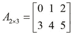

矩阵 *A* 由元素 a[i,j] 组成，其中 *i* 是矩阵的行索引，*j* 是列索引。我们可以用以下方式用括号表示数学上的矩阵 *A*：

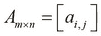

我们可以使用 `matrix?` 函数来检查一个符号或变量是否实际上是一个矩阵。`matrix?` 函数将对实现 core.matrix 规范的所有矩阵返回 `true`。有趣的是，`matrix?` 函数也会对普通向量的向量返回 `true`。

core.matrix 的默认实现是用纯 Clojure 编写的，这会影响处理大型矩阵时的性能。core.matrix 规范有两个流行的贡献实现，即使用纯 Java 实现的 **vectorz-clj** ([`github.com/mikera/vectorz-clj`](http://github.com/mikera/vectorz-clj)) 和通过本地库实现的 **clatrix** ([`github.com/tel/clatrix`](http://github.com/tel/clatrix))。虽然还有其他几个库实现了 core.matrix 规范，但这两个库被视为最成熟的。

### 注意

Clojure 有三种类型的库，即 core、contrib 和第三方库。core 和 contrib 库是标准 Clojure 库的一部分。core 和 contrib 库的文档可以在 [`clojure.github.io/`](http://clojure.github.io/) 找到。core 和 contrib 库之间的唯一区别是，contrib 库不是与 Clojure 语言一起分发的，必须单独下载。

任何人都可开发第三方库，并通过 Clojars ([`clojars.org/`](https://clojars.org/)) 提供这些库。Leiningen 支持所有这些库，并且在这些库之间没有太大的区别。

contrib 库通常最初是作为第三方库开发的。有趣的是，core.matrix 首先作为一个第三方库开发，后来被提升为 contrib 库。

clatrix 库使用 **基本线性代数子程序**（**BLAS**）规范来接口它所使用的本地库。BLAS 也是矩阵和向量线性代数操作的稳定规范，这些操作主要被本地语言使用。在实践中，clatrix 的性能显著优于 core.matrix 的其他实现，并定义了几个用于处理矩阵的实用函数。你应该注意，clatrix 库将矩阵视为可变对象，而 core.matrix 规范的其他实现则习惯上将矩阵视为不可变类型。

在本章的大部分内容中，我们将使用 clatrix 来表示和操作矩阵。然而，我们可以有效地重用 core.matrix 中的函数，这些函数在通过 clatrix 创建的矩阵上执行矩阵操作（如加法和乘法）。唯一的区别是，我们不应该使用 `core.matrix` 命名空间中的 `matrix` 函数来创建矩阵，而应该使用 clatrix 库中定义的函数。

### 注意

可以通过在 `project.clj` 文件中添加以下依赖项将 clatrix 库添加到 Leiningen 项目中：

```py
[clatrix "0.3.0"]
```

对于即将到来的示例，命名空间声明应类似于以下声明：

```py
(ns my-namespace
  (:use clojure.core.matrix)
  (:require [clatrix.core :as cl]))
```

请记住，我们可以在同一个源文件中使用 `clatrix.core` 和 `clojure.core.matrix` 命名空间，但一个好的做法是将这两个命名空间导入到别名命名空间中，以防止命名冲突。

我们可以使用以下 `cl/matrix` 函数从 clatrix 库创建矩阵。请注意，clatrix 产生的矩阵表示与 core.matrix 略有不同，但更具有信息量。如前所述，可以使用 `pm` 函数将矩阵打印为向量向量：

```py
user> (def A (cl/matrix [[0 1 2] [3 4 5]]))
#'user/A
user> A
 A 2x3 matrix
 -------------
 0.00e+00  1.00e+00  2.00e+00 
 3.00e+00  4.00e+00  5.00e+00 
user> (pm A)
[[0.000 1.000 2.000]
 [3.000 4.000 5.000]]
nil
```

我们还可以使用`matrix`函数的重载版本，它将矩阵实现名称作为第一个参数，后面跟着矩阵作为向量的常规定义，来创建矩阵。实现名称指定为一个关键字。例如，默认的持久向量实现指定为`:persistent-vector`，而 clatrix 实现指定为`:clatrix`。我们可以通过指定这个关键字参数来调用`matrix`函数，创建不同实现的矩阵，如下述代码所示。在第一次调用中，我们使用`:persistent-vector`关键字调用`matrix`函数来指定默认的持久向量实现。同样，我们使用`:clatrix`关键字调用`matrix`函数来创建 clatrix 实现。

```py
user> (matrix :persistent-vector [[1 2] [2 1]])
[[1 2] [2 1]]
user> (matrix :clatrix [[1 2] [2 1]])
 A 2x2 matrix
 -------------
 1.00e+00  2.00e+00 
 2.00e+00  1.00e+00
```

一个有趣的观点是，clatrix 将向量数组和数字的向量都视为`matrix`函数的有效参数，这与 core.matrix 的处理方式不同。例如，`[0 1]`生成一个 2 x 1 的矩阵，而`[[0 1]]`生成一个 1 x 2 的矩阵。core.matrix 的`matrix`函数没有这个功能，并且始终期望传递一个向量数组的向量。然而，使用`[0 1]`或`[[0 1]]`调用`cl/matrix`函数将创建以下矩阵而不会出现任何错误：

```py
user> (cl/matrix [0 1])
 A 2x1 matrix
 -------------
 0.00e+00 
 1.00e+00 
user> (cl/matrix [[0 1]])
 A 1x2 matrix
 -------------
 0.00e+00  1.00e+00 
```

与`matrix?`函数类似，我们可以使用`cl/clatrix?`函数来检查一个符号或变量是否来自 clatrix 库的矩阵。实际上，`matrix?`函数检查的是核心矩阵规范或协议的实现，而`cl/clatrix?`函数检查的是特定类型。如果`cl/clatrix?`函数对一个特定变量返回`true`，则`matrix?`也应该返回`true`；然而，这个公理的反面并不成立。如果我们使用`matrix`函数而不是`cl/matrix`函数创建一个矩阵并调用`cl/clatrix?`，它将返回`false`；这在下述代码中显示：

```py
user> (def A (cl/matrix [[0 1]]))
#'user/A
user> (matrix? A)
true
user> (cl/clatrix? A)
true
user> (def B (matrix [[0 1]]))
#'user/B
user> (matrix? B)
true
user> (cl/clatrix? B)
false
```

矩阵的大小是一个重要的属性，通常需要计算。我们可以使用`row-count`函数来找到矩阵中的行数。实际上，这仅仅是组成矩阵的向量的长度，因此，我们也可以使用标准的`count`函数来确定矩阵的行数。同样，`column-count`函数返回矩阵中的列数。考虑到矩阵由等长的向量组成，列数应该是任何内部向量，或者说任何矩阵行的长度。我们可以在 REPL 中对以下示例矩阵的`count`、`row-count`和`column-count`函数的返回值进行检查：

```py
user> (count (cl/matrix [0 1 2]))
3
user> (row-count (cl/matrix [0 1 2]))
3
user> (column-count (cl/matrix [0 1 2]))
1
```

要使用矩阵的行和列索引检索元素，请使用以下 `cl/get` 函数。除了执行操作的矩阵外，此函数还接受两个参数作为矩阵的索引。请注意，在 Clojure 代码中，所有元素都是相对于 *0* 进行索引的，这与矩阵的数学表示法不同，后者将 *1* 视为矩阵中第一个元素的位置。

```py
user> (def A (cl/matrix [[0 1 2] [3 4 5]]))
#'user/A
user> (cl/get A 1 1)
4.0
user> (cl/get A 3)
4.0
```

如前例所示，`cl/get` 函数还有一个接受单个索引值作为函数参数的替代形式。在这种情况下，元素通过行优先遍历进行索引。例如，`(cl/get A 1)` 返回 `3.0`，而 `(cl/get A 3)` 返回 `4.0`。我们可以使用以下 `cl/set` 函数来更改矩阵的元素。此函数接受与 `cl/get` 相似的参数——一个矩阵、一个行索引、一个列索引，以及最后要设置在矩阵指定位置的新元素。实际上，`cl/set` 函数会修改或修改它提供的矩阵。

```py
user> (pm A)
[[0.000 1.0002.000]
 [3.000 4.0005.000]]
nil
user> (cl/set A 1 2 0)
#<DoubleMatrix [0.000000, 1.000000, … , 0.000000]>
user> (pm A)
[[0.000 1.000 2.000]
 [3.000 4.000 0.000]]
nil
```

Clatrix 库还提供了两个用于函数组合的便捷函数：`cl/map` 和 `cl/map-indexed`。这两个函数都接受一个函数和一个矩阵作为参数，并将传递的函数应用于矩阵中的每个元素，其方式类似于标准的 `map` 函数。此外，这两个函数都返回新的矩阵，并且不会修改它们作为参数提供的矩阵。请注意，传递给 `cl/map-indexed` 的函数应该接受三个参数——行索引、列索引以及元素本身：

```py
user> (cl/map-indexed 
      (fn [i j m] (* m 2)) A)
 A 2x3 matrix
 -------------
 0.00e+00  2.00e+00  4.00e+00 
 6.00e+00  8.00e+00  1.00e+01 
user> (pm (cl/map-indexed (fn [i j m] i) A))
[[0.000 0.000 0.000]
 [1.000 1.000 1.000]]
nil
user> (pm (cl/map-indexed (fn [i j m] j) A))
[[0.000 1.000 2.000]
 [0.000 1.000 2.000]]
nil
```

# 生成矩阵

如果矩阵的行数和列数相等，则我们称该矩阵为 *方阵*。我们可以通过使用 `repeat` 函数重复单个元素来轻松生成一个简单的方阵，如下所示：

```py
(defn square-mat
  "Creates a square matrix of size n x n 
  whose elements are all e"
  [n e]
  (let [repeater #(repeat n %)]
    (matrix (-> e repeater repeater))))
```

在前例中，我们定义了一个闭包来重复值 *n* 次，这显示为 `repeater`。然后我们使用 *thread* 宏 (`->`) 将元素 `e` 通过闭包传递两次，最后将 `matrix` 函数应用于 thread 宏的结果。我们可以扩展此定义，以便我们可以指定用于生成的矩阵的矩阵实现；这是如下完成的：

```py
(defn square-mat
  "Creates a square matrix of size n x n whose 
  elements are all e. Accepts an option argument 
  for the matrix implementation."
  [n e & {:keys [implementation] 
          :or {implementation :persistent-vector}}]
  (let [repeater #(repeat n %)]
    (matrix implementation (-> e repeater repeater))))
```

`square-mat` 函数被定义为接受可选的关键字参数，这些参数指定了生成的矩阵的矩阵实现。我们将 core.matrix 的默认 `:persistent-vector` 实现指定为 `:implementation` 关键字的默认值。

现在，我们可以使用这个函数来创建方阵，并在需要时指定矩阵实现：

```py
user> (square-mat 2 1)
[[1 1] [1 1]]
user> (square-mat 2 1 :implementation :clatrix)
 A 2x2 matrix
 -------------
 1.00e+00  1.00e+00
 1.00e+00  1.00e+00
```

经常使用的一种特殊类型的矩阵是单位矩阵。**单位矩阵**是一个对角线元素为 *1* 而其他所有元素为 *0* 的方阵。我们正式定义单位矩阵 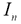 如下：

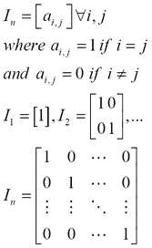

我们可以使用之前提到的 `cl/map-indexed` 函数来实现一个创建单位矩阵的函数，如下代码片段所示。我们首先使用之前定义的 `square-mat` 函数创建一个 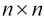 大小的正方形矩阵 `init`，然后使用 `cl/map-indexed` 将所有对角线元素映射为 `1`：

```py
(defn id-mat
  "Creates an identity matrix of n x n size"
  [n]
  (let [init (square-mat :clatrix n 0)
       identity-f (fn [i j n]
                     (if (= i j) 1 n))]
    (cl/map-indexed identity-f init)))
```

core.matrix 库也有自己的这个函数版本，命名为 `identity-matrix`：

```py
user> (id-mat 5)
 A 5x5 matrix
 -------------
 1.00e+00  0.00e+00 0.00e+00 0.00e+00 0.00e+00
 0.00e+00  1.00e+00 0.00e+00 0.00e+00 0.00e+00
 0.00e+00  0.00e+00 1.00e+00 0.00e+00 0.00e+00
 0.00e+00  0.00e+00 0.00e+00 1.00e+00 0.00e+00 
 0.00e+00  0.00e+00 0.00e+00 0.00e+00 1.00e+00 
user> (pm (identity-matrix 5))
[[1.000 0.000 0.000 0.000 0.000]
 [0.000 1.000 0.000 0.000 0.000]
 [0.000 0.000 1.000 0.000 0.000]
 [0.000 0.000 0.000 1.000 0.000]
 [0.000 0.000 0.000 0.000 1.000]]
nil
```

我们还会遇到另一个常见场景，即需要生成一个包含随机数据的矩阵。让我们实现以下函数来生成随机矩阵，就像之前定义的 `square-mat` 函数一样，使用 `rand-int` 函数。请注意，`rand-int` 函数接受一个参数 `n`，并返回一个介于 `0` 和 `n` 之间的随机整数：

```py
(defn rand-square-mat 
  "Generates a random matrix of size n x n"
  [n]
  ;; this won't work
  (matrix (repeat n (repeat n (rand-int 100))))) 
```

但这个函数生成的矩阵的所有元素都是单个随机数，这并不太有用。例如，如果我们用任何整数作为参数调用 `rand-square-mat` 函数，它将返回一个包含单个不同随机数的矩阵，如下代码片段所示：

```py
user> (rand-square-mat 4)
[[94 94] [94 94] [94 94] [94 94]]
```

相反，我们应该使用 `rand-int` 函数映射 `square-mat` 函数生成的正方形矩阵的每个元素，为每个元素生成一个随机数。不幸的是，`cl/map` 只能与由 clatrix 库创建的矩阵一起使用，但我们可以通过使用 `repeatedly` 函数返回的惰性序列轻松地复制这种行为。请注意，`repeatedly` 函数接受一个惰性生成序列的长度和一个用作该序列生成器的函数作为参数。因此，我们可以实现使用 clatrix 和 core.matrix 库生成随机矩阵的函数如下：

```py
(defn rand-square-clmat
  "Generates a random clatrix matrix of size n x n"
  [n]
  (cl/map rand-int (square-mat :clatrix n 100)))

(defn rand-square-mat
  "Generates a random matrix of size n x n"
  [n]
  (matrix
   (repeatedly n #(map rand-int (repeat n 100)))))
```

这个实现按预期工作，新矩阵的每个元素现在都是一个独立生成的随机数。我们可以在 REPL 中通过调用以下修改后的 `rand-square-mat` 函数来验证这一点：

```py
user> (pm (rand-square-mat 4))
[[97.000 35.000 69.000 69.000]
 [50.000 93.000 26.000  4.000]
 [27.000 14.000 69.000 30.000]
 [68.000 73.000 0.0007 3.000]]
nil
user> (rand-square-clmat 4)
 A 4x4 matrix
 -------------
 5.30e+01  5.00e+00  3.00e+00  6.40e+01 
 6.20e+01  1.10e+01  4.10e+01  4.20e+01 
 4.30e+01  1.00e+00  3.80e+01  4.70e+01 
 3.00e+00  8.10e+01  1.00e+01  2.00e+01
```

我们还可以使用 clatrix 库中的 `cl/rnorm` 函数生成随机元素矩阵。这个函数生成一个具有可选指定均值和标准差的正态分布随机元素矩阵。矩阵是正态分布的，意味着所有元素都均匀分布在指定的均值周围，其分布由标准差指定。因此，低标准差会产生一组几乎等于均值的值。

`cl/rnorm` 函数有几个重载版本。让我们在 REPL 中检查其中几个：

```py
user> (cl/rnorm 10 25 10 10)
 A 10x10 matrix
 ---------------
-1.25e-01  5.02e+01 -5.20e+01  .  5.07e+01  2.92e+01  2.18e+01 
-2.13e+01  3.13e+01 -2.05e+01  . -8.84e+00  2.58e+01  8.61e+00 
 4.32e+01  3.35e+00  2.78e+01  . -8.48e+00  4.18e+01  3.94e+01 
 ... 
 1.43e+01 -6.74e+00  2.62e+01  . -2.06e+01  8.14e+00 -2.69e+01 
user> (cl/rnorm 5)
 A 5x1 matrix
 -------------
 1.18e+00 
 3.46e-01 
-1.32e-01 
 3.13e-01 
-8.26e-02 
user> (cl/rnorm 3 4)
 A 3x4 matrix
 -------------
-4.61e-01 -1.81e+00 -6.68e-01  7.46e-01 
 1.87e+00 -7.76e-01 -1.33e+00  5.85e-01 
 1.06e+00 -3.54e-01  3.73e-01 -2.72e-02 
```

在前面的例子中，第一次调用指定了均值、标准差以及矩阵的行数和列数。第二次调用指定了一个单个参数 *n* 并生成一个 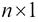 大小的矩阵。最后，第三次调用指定了矩阵的行数和列数。

`core.matrix`库还提供了一个`compute-matrix`函数来生成矩阵，这对 Clojure 程序员来说会感觉非常自然。此函数需要一个表示矩阵大小的向量，以及一个接受与矩阵维度数量相等的参数的函数。实际上，`compute-matrix`足够灵活，可以用来生成单位矩阵，以及随机元素矩阵。

我们可以使用`compute-matrix`函数实现以下函数来创建单位矩阵以及随机元素矩阵：

```py
(defn id-computed-mat
  "Creates an identity matrix of size n x n 
  using compute-matrix"
  [n]
  (compute-matrix [n n] #(if (= %1 %2) 1 0)))

(defn rand-computed-mat
  "Creates an n x m matrix of random elements 
  using compute-matrix"
  [n m]
  (compute-matrix [n m] 
   (fn [i j] (rand-int 100))))
```

# 添加矩阵

Clojure 语言不直接支持矩阵操作，但通过`core.matrix`规范实现。在 REPL 中尝试添加两个矩阵，如下面的代码片段所示，只会抛出一个错误，指出在期望整数的地方找到了向量：

```py
user> (+ (matrix [[0 1]]) (matrix [[0 1]]))
ClassCastException clojure.lang.PersistentVector cannot be cast to java.lang.Number  clojure.lang.Numbers.add (Numbers.java:126)
```

这是因为`+`函数作用于数字而不是矩阵。要添加矩阵，我们应该使用`core.matrix.operators`命名空间中的函数。在包含`core.matrix.operators`之后，命名空间声明应该看起来像以下代码片段：

```py
(ns my-namespace
  (:use clojure.core.matrix)
  (:require [clojure.core.matrix.operators :as M]))
```

注意，这些函数实际上被导入到一个别名命名空间中，因为像`+`和`*`这样的函数名与默认 Clojure 命名空间中的函数名冲突。在实践中，我们应该始终尝试通过`:require`和`:as`过滤器使用别名命名空间，并避免使用`:use`过滤器。或者，我们可以在命名空间声明中使用`:refer-clojure`过滤器简单地不引用冲突的函数名，如下面的代码所示。然而，这应该谨慎使用，并且仅作为最后的手段。

对于本节中的代码示例，我们将使用之前的声明以提高清晰度：

```py
(ns my-namespace
  (:use clojure.core.matrix)
  (:require clojure.core.matrix.operators)
  (:refer-clojure :exclude [+ - *])) 
```

我们可以使用`M/+`函数对两个或多个矩阵执行矩阵加法。要检查任意数量矩阵的相等性，我们使用`M/==`函数：

```py
user> (def A (matrix [[0 1 2] [3 4 5]]))
#'user/A
user> (def B (matrix [[0 0 0] [0 0 0]]))
#'user/B
user> (M/== B A)
false
user> (def C (M/+ A B))
#'user/C
user> C
[[0 1 2] [3 4 5]]
user> (M/== C A)
true
```

如果两个矩阵 *A* 和 *B* 满足以下等式，则称它们是相等的：


因此，前面的等式解释了两个或多个矩阵相等当且仅当满足以下条件：

+   每个矩阵都有相同数量的行和列

+   所有具有相同行和列索引的元素都相等

以下是一个简单而优雅的矩阵相等实现。它基本上是使用标准的`reduce`和`map`函数比较向量相等性：

```py
(defn mat-eq
  "Checks if two matrices are equal"
  [A B]
  (and (= (count A) (count B))
       (reduce #(and %1 %2) (map = A B))))
```

我们首先使用`count`和`=`函数比较两个矩阵的行长度，然后使用`reduce`函数比较内部向量元素。本质上，`reduce`函数反复将一个接受两个参数的函数应用于序列中的连续元素，并在序列中的所有元素都被应用函数“减少”后返回最终结果。

或者，我们也可以使用类似的组合使用 `every?` 和 `true?` Clojure 函数。使用表达式 `(every? true? (map = A B))`，我们可以检查两个矩阵的相等性。请记住，`true?` 函数在传入 `true` 时返回 `true`（否则返回 `false`），而 `every?` 函数在给定的谓词函数对给定序列中的所有值返回 `true` 时返回 `true`。

要加两个矩阵，它们必须有相等数量的行和列，和本质上是一个由具有相同行和列索引的元素之和组成的矩阵。两个矩阵 *A* 和 *B* 的和已经正式定义为以下：

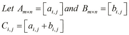

使用标准的 `mapv` 函数实现矩阵加法几乎是显而易见的，它只是 `map` 函数的一个变体，返回一个向量。我们将 `mapv` 应用到矩阵的每一行以及整个矩阵上。请注意，此实现旨在用于向量（向量中的向量），尽管它可以很容易地与 core.matrix 中的 `matrix` 和 `as-vec` 函数一起使用来操作矩阵。我们可以实现以下函数，使用标准 `mapv` 函数执行矩阵加法：

```py
(defn mat-add
  "Add two matrices"
  [A B]
  (mapv #(mapv + %1 %2) A B))
```

我们同样可以很容易地将 `mat-add` 函数推广到任意数量的矩阵，使用 `reduce` 函数。如下面的代码所示，我们可以扩展 `mat-add` 的先前定义，使其使用 `reduce` 函数适用于任意数量的矩阵：

```py
(defn mat-add
  "Add two or more matrices"
  ([A B]
     (mapv #(mapv + %1 %2) A B))
  ([A B & more]
     (let [M (concat [A B] more)]
       (reduce mat-add M))))
```

在一个  矩阵 *A* 上有一个有趣的单一运算，即矩阵的迹，表示为 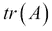。矩阵的迹本质上是其对角元素的求和：

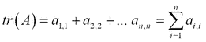

使用前面描述的 `cl/map-indexed` 和 `repeatedly` 函数实现矩阵的迹函数相当简单。我们在这里省略了它，以便作为你的练习。

# 矩阵乘法

乘法是矩阵上的另一个重要二元运算。在更广泛的意义上，**矩阵乘法**这一术语指的是几种将矩阵相乘以产生新矩阵的技术。

让我们在 REPL 中定义三个矩阵 *A*、*B* 和 *C* 以及一个单一值 *N*。这些矩阵具有以下值：

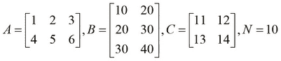

我们可以使用 core.matrix 库中的 `M/*` 函数来乘以矩阵。除了用于乘以两个矩阵外，此函数还可以用于乘以任意数量的矩阵以及标量值。我们可以在 REPL 中尝试以下 `M/*` 函数来乘以两个给定的矩阵：

```py
user> (pm (M/* A B))
[[140.000 200.000]
 [320.000 470.000]]
nil
user> (pm (M/* A C))
RuntimeException Mismatched vector sizes  clojure.core.matrix.impl.persistent-vector/... 
user> (def N 10)
#'user/N
user> (pm (M/* A N))
[[10.000 20.000 30.000]
 [40.000 50.000 60.000]]
nil
```

首先，我们计算了两个矩阵的乘积。这个操作被称为**矩阵-矩阵乘法**。然而，矩阵 *A* 和 *C* 的乘法是不行的，因为这两个矩阵的大小不兼容。这把我们带到了矩阵乘法的第一个规则：要乘以两个矩阵 *A* 和 *B*，*A* 中的列数必须等于 *B* 中的行数。结果矩阵具有与 *A* 相同的行数和与 *B* 相同的列数。这就是为什么 REPL 不同意乘以 *A* 和 *C*，而是简单地抛出一个异常。

对于大小为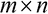的矩阵 *A* 和大小为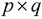的矩阵 *B*，这两个矩阵的乘积只有在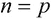的情况下才存在，而 *A* 和 *B* 的乘积是一个大小为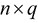的新矩阵。

矩阵 *A* 和 *B* 的乘积是通过将 *A* 中行的元素与 *B* 中相应的列相乘，然后将结果值相加，为 *A* 的每一行和 *B* 的每一列产生一个单一值来计算的。因此，结果乘积具有与 *A* 相同的行数和与 *B* 相同的列数。

我们可以这样定义两个兼容大小的矩阵的乘积：

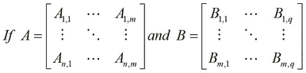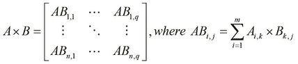

以下是如何使用 *A* 和 *B* 中的元素来计算两个矩阵的乘积的说明：

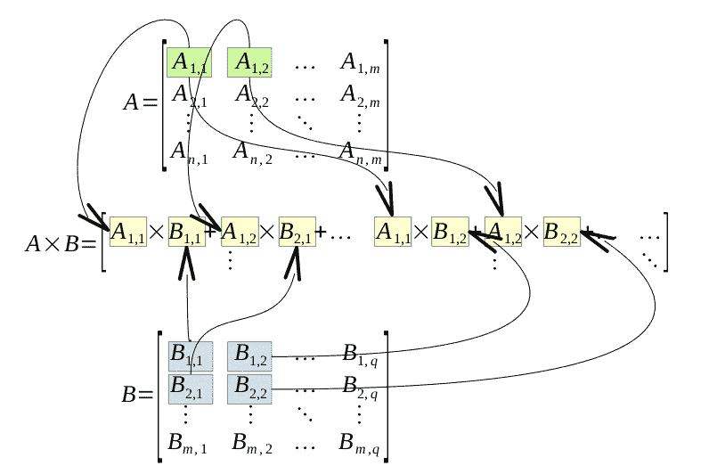

这看起来稍微有些复杂，所以让我们用一个例子来演示前面的定义，使用我们之前定义的矩阵 *A* 和 *B*。以下计算实际上与 REPL 产生的值一致：

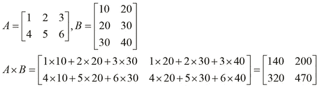

注意，矩阵乘法不是交换运算。然而，这个操作确实表现出函数的关联性质。对于乘积兼容大小的矩阵 *A*、*B* 和 *C*，以下性质始终成立，只有一个例外，我们稍后会揭露：

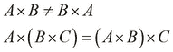

一个明显的推论是，一个方阵与另一个相同大小的方阵相乘会产生一个结果矩阵，其大小与两个原始矩阵相同。同样，方阵的平方、立方以及其他幂次运算会产生相同大小的矩阵。

另一个有趣的性质是，方阵在乘法中有一个单位元素，即与乘积兼容大小的单位矩阵。但是，单位矩阵本身也是一个方阵，这使我们得出结论，*方阵与单位矩阵的乘法是一个交换操作*。因此，矩阵乘法不是交换的规则实际上在其中一个矩阵是单位矩阵而另一个是方阵时并不成立。这可以由以下等式形式化总结：

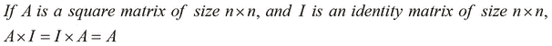

矩阵乘法的简单实现的时间复杂度为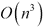，对于一个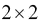矩阵需要八个乘法操作。时间复杂度指的是特定算法运行到完成所需的时间。因此，线性代数库使用更有效的算法，如*Strassen 算法*，来实现矩阵乘法，该算法只需要七个乘法操作，并将复杂度降低到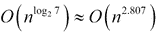。

Clatrix 库对矩阵乘法的实现性能显著优于默认的持久向量实现，因为它与本地库进行了接口。在实践中，我们可以使用像 criterium 这样的基准测试库来对 Clojure 进行此比较（[`github.com/hugoduncan/criterium`](http://github.com/hugoduncan/criterium)）。或者，我们也可以通过定义一个简单的函数来乘以两个矩阵，然后使用我们之前定义的`rand-square-mat`和`rand-square-clmat`函数将不同实现的大矩阵传递给它，简要比较这两种实现的性能。我们可以定义一个函数来测量乘以两个矩阵所需的时间。

此外，我们还可以定义两个函数来乘以使用我们之前定义的`rand-square-mat`和`rand-square-clmat`函数创建的矩阵，如下所示：

```py
(defn time-mat-mul
  "Measures the time for multiplication of two matrices A and B"
  [A B]
  (time (M/* A B)))

(defn core-matrix-mul-time []
  (let [A (rand-square-mat 100)
        B (rand-square-mat 100)]
    (time-mat-mul A B)))

(defn clatrix-mul-time []
  (let [A (rand-square-clmat 100)
        B (rand-square-clmat 100)]
    (time-mat-mul A B)))
```

我们可以看到，core.matrix 实现平均需要一秒钟来计算两个随机生成矩阵的乘积。然而，clatrix 实现平均不到一毫秒，尽管第一次调用的通常需要 35 到 40 毫秒来加载本地 BLAS 库。当然，这个值可能会根据计算它的硬件略有不同。尽管如此，除非有有效的理由，例如硬件不兼容或避免额外的依赖，否则在处理大型矩阵时，clatrix 是首选。

接下来，让我们看看 *标量乘法*，它涉及将单个值 *N* 或标量与矩阵相乘。结果矩阵的大小与原始矩阵相同。对于一个 2 x 2 矩阵，我们可以定义标量乘法如下：

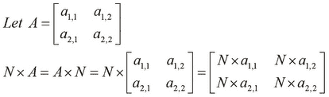

对于矩阵 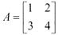 和 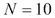，其乘积如下：

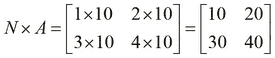

注意，我们还可以使用 core.matrix 库中的 `scale` 函数来执行标量乘法：

```py
user> (pm (scale A 10))
[[10.000 20.000 30.000]
 [40.000 50.000 60.000]]
nil
user> (M/== (scale A 10) (M/* A 10))
true
```

最后，我们将简要地看一下矩阵乘法的一种特殊形式，称为 **矩阵-向量乘法**。向量可以简单地看作是一个只有一行的矩阵，它与大小与乘积兼容的方阵相乘，产生一个与原始向量大小相同的新向量。将大小为 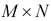 的矩阵 *A* 和向量 *V* 的转置 *V'*（大小为 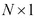）相乘，产生一个大小为 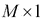 的新向量 *V"*。如果 *A* 是一个方阵，那么 *V"* 的大小与转置 *V'* 相同。

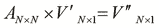

# 矩阵转置和求逆

另一个常用的基本矩阵操作是矩阵的 *转置*。矩阵 *A* 的转置表示为 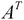 或 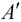。定义矩阵转置的一个简单方法是通过反射矩阵到其 *主对角线*。主对角线是指由行和列索引相等的元素组成的对角线。我们还可以通过交换矩阵的行和列来描述矩阵的转置。我们可以使用 core.matrix 中的以下 `transpose` 函数来执行此操作：

```py
user> (def A (matrix [[1 2 3] [4 5 6]]))
#'user/A
user> (pm (transpose A))
[[1.000 4.000]
 [2.000 5.000]
 [3.000 6.000]]
nil
```

我们可以定义以下三种获取矩阵转置的可能方法：

+   原始矩阵沿主对角线进行反射

+   矩阵的行变成其转置的列

+   矩阵的列变成其转置的行

因此，矩阵中的每个元素在其转置中行和列都交换了，反之亦然。这可以用以下方程正式表示：

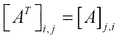

这引出了可逆矩阵的概念。如果一个方阵存在另一个方阵作为其逆矩阵，并且与原矩阵相乘时产生单位矩阵，则称该方阵是可逆的。一个大小为  的矩阵 *A*，如果以下等式成立，则称其有一个逆矩阵 *B*：

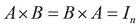

让我们使用 core.matrix 的 `inverse` 函数来测试这个等式。请注意，core.matrix 库的默认持久实现没有实现逆操作，所以我们使用 clatrix 库中的矩阵。在以下示例中，我们使用 `cl/matrix` 函数从 clatrix 库创建一个矩阵，使用 `inverse` 函数确定其逆，然后使用 `M/*` 函数将这两个矩阵相乘：

```py
user> (def A (cl/matrix [[2 0] [0 2]]))
#'user/A
user> (M/* (inverse A) A)
 A 2x2 matrix
 -------------
 1.00e+00  0.00e+00 
 0.00e+00  1.00e+00
```

在前面的例子中，我们首先定义了一个矩阵 *A*，然后将其与其逆矩阵相乘以产生相应的单位矩阵。当我们使用双精度数值类型作为矩阵的元素时，一个有趣的观察是，并非所有矩阵与它们的逆矩阵相乘都会产生单位矩阵。

对于某些矩阵，可以观察到一些小的误差，这是由于使用 32 位表示浮点数的限制造成的；如下所示：

```py
user> (def A (cl/matrix [[1 2] [3 4]]))
#'user/A
user> (inverse A)
 A 2x2 matrix
 -------------
-2.00e+00  1.00e+00 
 1.50e+00 -5.00e-01
```

为了找到一个矩阵的逆，我们首先必须定义该矩阵的 *行列式*，这仅仅是从给定矩阵中确定的一个值。首先，行列式仅存在于方阵中，因此，逆矩阵仅存在于行数和列数相等的矩阵中。矩阵的行列式表示为 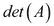 或 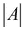。行列式为零的矩阵被称为 *奇异矩阵*。对于一个矩阵 *A*，我们定义其行列式如下：

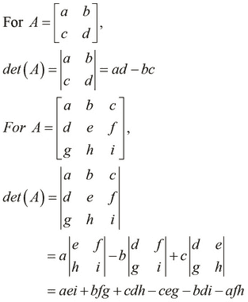

我们可以使用前面的定义来表示任何大小的矩阵的行列式。一个有趣的观察是，单位矩阵的行列式始终是 *1*。作为一个例子，我们将如下找到给定矩阵的行列式：

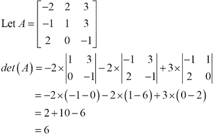

对于一个 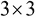 矩阵，我们可以使用 *萨鲁斯规则* 作为计算矩阵行列式的另一种方法。要使用此方案计算矩阵的行列式，我们首先将矩阵的前两列写在第三列的右侧，使得一行中有五列。接下来，我们加上从上到下对角线的乘积，并减去从下到上对角线的乘积。这个过程可以用以下图表说明：

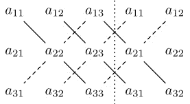

通过使用萨鲁斯规则，我们正式地将矩阵 *A* 的行列式表达如下：


我们可以使用 core.matrix 的以下 `det` 函数在 REPL 中计算矩阵的行列式。请注意，此操作不是由 core.matrix 的默认持久向量实现实现的。

```py
user> (def A (cl/matrix [[-2 2 3] [-1 1 3] [2 0 -1]]))
#'user/A
user> (det A)
6.0
```

现在我们已经定义了矩阵的行列式，让我们用它来定义矩阵的逆。我们已经讨论了可逆矩阵的概念；找到矩阵的逆就是确定一个矩阵，当它与原矩阵相乘时会产生一个单位矩阵。

对于矩阵的逆存在，其行列式必须不为零。接下来，对于原矩阵中的每个元素，我们找到去掉所选元素的行和列的矩阵的行列式。这会产生一个与原矩阵大小相同的矩阵（称为原矩阵的*余子式矩阵*）。余子式矩阵的转置称为原矩阵的*伴随矩阵*。通过将伴随矩阵除以原矩阵的行列式，可以得到逆矩阵。现在，让我们正式定义一个  矩阵 *A* 的逆。我们用 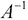 表示矩阵 *A* 的逆，它可以正式表示如下：

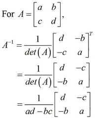

以一个例子来说明，让我们找到一个样本  矩阵的逆。实际上，我们可以验证，当与原矩阵相乘时，逆矩阵会产生一个单位矩阵，如下面的例子所示：


同样，我们按照以下方式定义一个  矩阵的逆：

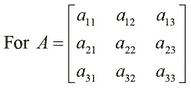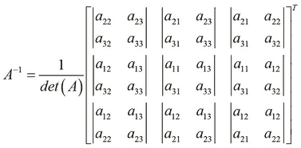

现在，让我们计算一个  矩阵的逆：

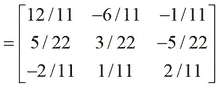

我们提到奇异和非方阵没有逆，我们可以看到当`inverse`函数接收到这样的矩阵时，会抛出错误。如下面的 REPL 输出所示，如果给定的矩阵不是方阵，或者给定的矩阵是奇异的，`inverse`函数将抛出错误：

```py
user> (def A (cl/matrix [[1 2 3] [4 5 6]]))
#'user/A
user> (inverse A)
ExceptionInfo throw+: {:exception "Cannot invert a non-square matrix."}  clatrix.core/i (core.clj:1033)
user> (def A (cl/matrix [[2 0] [2 0]]))
#'user/A
user> (M/* (inverse A) A)
LapackException LAPACK DGESV: Linear equation cannot be solved because the matrix was singular.  org.jblas.SimpleBlas.gesv (SimpleBlas.java:274)
```

# 使用矩阵进行插值

让我们尝试一个示例来演示我们如何使用矩阵。这个例子使用矩阵在给定的一组点之间插值曲线。假设我们有一个代表某些数据的给定点集。目标是追踪点之间的平滑线，以产生一个估计数据形状的曲线。尽管这个例子中的数学公式可能看起来很复杂，但我们应该知道，这种技术实际上只是线性回归模型正则化的一种形式，被称为 **Tichonov 正则化**。现在，我们将专注于如何在这个技术中使用矩阵，我们将在第二章 理解线性回归 中深入探讨正则化。

我们首先定义一个插值矩阵 *L*，它可以用来确定给定数据点的估计曲线。它本质上是一个向量 *[-1, 2, -1]* 在矩阵的列中斜向移动。这种矩阵被称为 **带宽矩阵**：

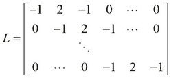

我们可以使用以下 `compute-matrix` 函数简洁地定义矩阵 *L*。注意，对于给定的大小 *n*，我们生成一个大小如 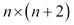 的矩阵：

```py
(defn lmatrix [n]
  (compute-matrix :clatrix [n (+ n 2)]
                  (fn [i j] ({0 -1, 1 2, 2 -1} (- j i) 0))))
```

在前面的例子中，匿名闭包使用一个映射来决定指定行和列索引处的元素值。例如，行索引 *2* 和列索引 *3* 的元素是 *2*，因为 `(- j i)` 是 *1*，映射中的键 *1* 的值是 *2*。我们可以通过以下方式在 REPL 中验证生成的矩阵与 `lmatrix` 矩阵具有相似的结构：

```py
user> (pm (lmatrix 4))
[[-1.000 2.000 -1.000  0.000  0.000  0.000]
[ 0.000 -1.000  2.000 -1.000  0.000  0.000]
[ 0.000  0.000 -1.000  2.000 -1.000  0.000]
[ 0.000  0.000  0.000 -1.000  2.000 -1.000]]
nil
```

接下来，我们定义如何表示我们打算进行插值的数值点。每个点都有一个观测值 *x*，它被传递给某个函数以产生另一个观测值 *y*。在这个例子中，我们简单地为一个 *x* 选择一个随机值，并为 *y* 选择另一个随机值。我们重复执行此操作以产生数据点。

为了表示与兼容大小的 *L* 矩阵一起的数据点，我们定义了一个名为 `problem` 的简单函数，该函数返回问题定义的映射。这包括 *L* 矩阵、*x* 的观测值、*x* 的隐藏值（对于这些值，我们必须估计 *y* 的值以创建曲线），以及 *y* 的观测值。

```py
(defn problem
  "Return a map of the problem setup for a
  given matrix size, number of observed values 
  and regularization parameter"
  [n n-observed lambda]
  (let [i (shuffle (range n))]
    {:L (M/* (lmatrix n) lambda)
     :observed (take n-observed i)
     :hidden (drop n-observed i)
     :observed-values (matrix :clatrix
                              (repeatedly n-observed rand))}))
```

函数的前两个参数是 *L* 矩阵中的行数 `n` 和观测的 *x* 值数 `n-observed`。函数接受第三个参数 `lambda`，这实际上是我们的模型的正则化参数。此参数决定了估计曲线的准确性，我们将在后面的章节中更详细地研究它与此模型的相关性。在前面的函数返回的映射中，*x* 和 *y* 的观测值具有键 `:observed` 和 `:observed-values`，而 *x* 的隐藏值具有键 `:hidden`。同样，键 `:L` 映射到兼容大小的 *L* 矩阵。

现在我们已经定义了我们的问题（或模型），我们可以在给定的点上绘制一条平滑的曲线。这里的“平滑”是指曲线上的每个点都是其直接邻居的平均值，以及一些高斯噪声。因此，所有这些噪声曲线上的点都服从高斯分布，其中所有值都围绕某个平均值散布，并带有由某个标准差指定的范围。

如果我们将矩阵 *L* 分别在观测点和隐藏点上进行 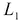 和 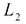 的划分，我们可以定义一个公式来确定曲线如下。以下方程可能看起来有些令人畏惧，但如前所述，我们将在接下来的章节中研究这个方程背后的推理。曲线可以用一个矩阵来表示，该矩阵可以通过以下方式计算，使用矩阵 *L*：


我们使用原始观测的 *y* 值，即 ，来估计隐藏的 *x* 值，使用从插值矩阵 *L* 计算出的两个矩阵。这两个矩阵仅使用矩阵的转置和逆函数来计算。由于此方程右侧的所有值要么是矩阵要么是向量，我们使用矩阵乘法来找到这些值的乘积。

之前的方程可以使用我们之前探索过的函数来实现。实际上，代码只包含这个方程，以作为我们之前定义的 `problem` 函数返回的映射的前缀表达式。我们现在定义以下函数来解决 `problem` 函数返回的问题：

```py
(defn solve
  "Return a map containing the approximated value 
y of each hidden point x"
  [{:keys [L observed hidden observed-values] :as problem}]
  (let [nc  (column-count L)
        nr  (row-count L)
        L1  (cl/get L (range nr) hidden)
        L2  (cl/get L (range nr) observed)
        l11 (M/* (transpose L1) L1)
        l12 (M/* (transpose L1) L2)]
    (assoc problem :hidden-values
      (M/* -1 (inverse l11) l12 observed-values))))
```

前面的函数计算了 *y* 的估计值，并简单地使用 `assoc` 函数将它们添加到原始映射中，键为 `:hidden-values`。

要在心理上可视化曲线的计算值相当困难，因此我们现在将使用 *Incanter* 库（[`github.com/liebke/incanter`](http://github.com/liebke/incanter)）来绘制估计曲线和原始点。这个库本质上提供了一个简单且符合习惯的 API 来创建和查看各种类型的图表和图表。

### 注意

可以通过在 `project.clj` 文件中添加以下依赖项将 Incanter 库添加到 Leiningen 项目中：

```py
[incanter "1.5.4"]
```

对于即将到来的示例，命名空间声明应类似于以下内容：

```py
(ns my-namespace
  (:use [incanter.charts :only [xy-plot add-points]]
        [incanter.core   :only [view]])
  (:require [clojure.core.matrix.operators :as M]
            [clatrix.core :as cl]))
```

现在，我们定义一个简单的函数，它将使用 Incanter 库中的函数，如 `xy-plot` 和 `view`，来绘制给定数据的图表：

```py
(defn plot-points
  "Plots sample points of a solution s"
  [s]
  (let [X (concat (:hidden s) (:observed s))
        Y (concat (:hidden-values s) (:observed-values s))]
    (view
     (add-points
      (xy-plot X Y) (:observed s) (:observed-values s)))))
```

由于这是我们第一次接触 Incanter 库，让我们讨论一些用于实现 `plot-points` 的函数。我们首先将所有 *x* 轴上的值绑定到 `X`，将所有 *y* 轴上的值绑定到 `Y`。然后，我们使用 `xy-plot` 函数将点绘制为曲线，该函数接受两个参数，用于在 *x* 和 *y* 轴上绘制，并返回一个图表或图表。接下来，我们使用 `add-points` 函数将原始观察到的点添加到图表中。`add-points` 函数需要三个参数：原始图表、*x* 轴组件的所有值的向量，以及 *y* 轴组件的所有值的向量。此函数也返回一个类似于 `xy-plot` 函数的图表，我们可以使用 `view` 函数查看此图表。请注意，我们也可以等效地使用线程宏（`->`）来组合 `xy-plot`、`add-points` 和 `view` 函数。

现在，我们可以直观地使用 `plot-points` 函数在随机数据上可视化估计曲线，如下面的函数所示：

```py
(defn plot-rand-sample []
  (plot-points (solve (problem 150 10 30))))
```

当我们执行 `plot-rand-sample` 函数时，会显示以下值的图表：


# 摘要

在本章中，我们通过 core.matrix 和 clatrix 库介绍了矩阵。以下是我们所涵盖的要点：

+   我们已经讨论了如何通过 core.matrix 和 clatrix 来表示、打印和从矩阵中获取信息。我们还讨论了如何使用一些随机数据生成矩阵。

+   我们已经讨论了一些矩阵的基本操作，例如相等、加法、乘法、转置和逆运算。

+   我们还介绍了一个多功能的 Incanter 库，它用于通过矩阵使用示例来可视化数据图表。

接下来，我们将研究一些使用线性回归进行预测的基本技术。正如我们将看到的，其中一些技术实际上是基于简单的矩阵运算。线性回归实际上是一种监督学习类型，我们将在下一章中讨论。
