# 第三章. 数据分类

在本章中，我们将探讨**分类**，这是监督学习中的另一个有趣问题。我们将检查一些用于分类数据的技术，并研究我们如何在 Clojure 中利用这些技术。

分类可以定义为根据一些经验训练数据识别观测数据的类别或类别的问题。训练数据将包含可观测特征或独立变量的值。它还将包含这些观测值的已知类别。在某种程度上，分类与回归相似，因为我们根据另一组值预测一个值。然而，对于分类，我们感兴趣的不仅仅是观测值的类别，而是基于给定的值集预测一个值。例如，如果我们从一个输出值范围在*0*到*5*的集合中训练一个线性回归模型，训练好的分类器可以预测一组输入值的输出值为*10*或*-1*。然而，在分类中，输出变量的预测值始终属于一组离散的值。

分类模型的独立变量也被称为模型的*解释变量*，而因变量也被称为观测值的*结果*、*类别*或*类别*。分类模型的结果始终是离散值，即来自一组预定的值。这是分类与回归之间的一项主要区别，因为在回归建模中，我们预测的变量可以有一个连续的范围。请注意，在分类的上下文中，“类别”和“类别”这两个术语可以互换使用。

实现分类技术的算法被称为分类器。一个**分类器**可以正式定义为将一组值映射到类别或类别的函数。分类仍然是计算机科学中的一个活跃研究领域，今天在软件中使用了几个突出的分类器算法。分类有几个实际应用，例如数据挖掘、机器视觉、语音和手写识别、生物分类和地理统计学。

# 理解二分类和多分类

我们首先将研究一些关于数据分类的理论方面。与其他监督机器学习技术一样，目标是根据样本数据估计一个模型或分类器，并使用它来预测一组给定的结果。分类可以被视为确定一个函数，该函数将样本数据的特征映射到特定的类别。预测的类别是从一组预定的类别中选择出来的。因此，与回归类似，对给定独立变量的观测值进行分类的问题与确定给定训练数据的最优拟合函数是相似的。

在某些情况下，我们可能只对单个类别感兴趣，即观测值是否属于特定类别。这种分类形式被称为**二进制分类**，模型的输出变量可以是*0*或*1*的值。因此，我们可以说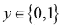，其中*y*是分类模型的输出或因变量。当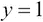时，结果被认为是负的，反之，当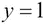时，结果被认为是正的。

从这个角度来看，当提供了模型独立变量的某些观测值时，我们必须能够确定正结果的概率。因此，给定样本数据的估计模型具有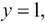的概率，可以表示如下：

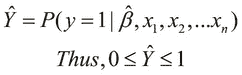

在前面的方程中，参数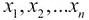代表估计分类模型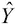的独立变量，而项代表该模型的估计参数向量。

这种分类的一个例子是决定一封新邮件是否为垃圾邮件，这取决于发件人或邮件中的内容。另一个简单的二进制分类例子是根据某一天的观测湿度以及当天的最低和最高温度来确定该日降雨的可能性。这个例子中的训练数据可能类似于以下表格中的数据：

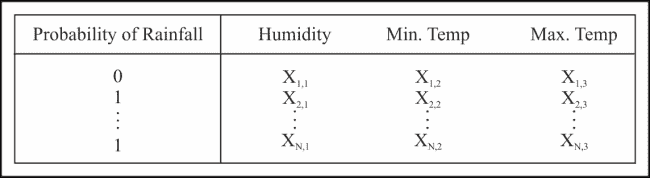

我们可以使用来建模二进制分类的数学函数是**sigmoid**或**logistic**函数。如果特征*X*的输出有一个估计的参数向量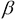，我们可以定义正结果的估计概率*Y*（作为 sigmoid 函数）如下：

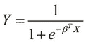

为了可视化前面的方程，我们可以通过将*Z*替换为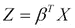来简化它，如下所示：

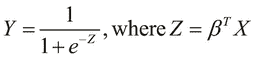

我们还可以使用其他几个函数来模拟数据。然而，二分类器的样本数据可以很容易地转换，使其可以用 S 型函数进行模拟。使用逻辑函数对分类问题进行建模的过程称为**逻辑回归**。前面方程中定义的简化 S 型函数产生了以下图表：

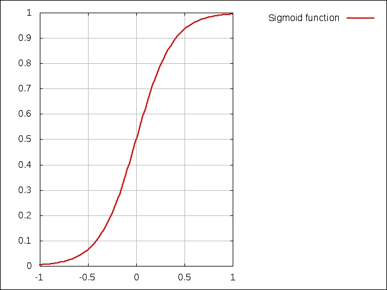

注意，如果术语*Z*具有负值，则图表会反转，并且是前一个图表的镜像。我们可以通过以下图表可视化 S 型函数相对于术语*Z*的变化：

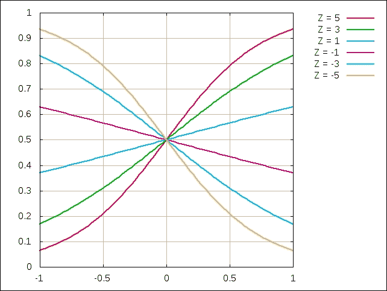

在前面的图表中，展示了不同值下的 S 型函数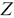；其范围从*-5*到*5*。请注意，对于二维情况，术语是独立变量*x*的线性函数。有趣的是，对于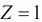和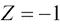，S 型函数看起来或多或少像一条直线。当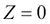时，该函数简化为一条直线，可以用常数*y*值（在这种情况下，方程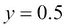）表示。

我们观察到，估计的输出*Y*始终在*0*和*1*之间，因为它代表给定观察值的正结果概率。此外，输出*Y*的范围不受术语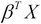符号的影响。因此，回顾起来，S 型函数是二分类的有效表示。

要使用逻辑函数从训练数据估计分类模型，我们可以将逻辑回归模型的成本函数定义为以下：

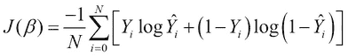

前面的方程本质上总结了模型输出变量实际值和预测值之间的差异，就像线性回归一样。然而，由于我们处理的是介于*0*和*1*之间的概率值，我们使用前面的对数函数来有效地衡量实际值和预测输出值之间的差异。请注意，术语*N*表示训练数据中的样本数量。我们可以将梯度下降应用于此成本函数，以确定一组观察值的局部最小值或预测类别。此方程可以正则化，产生以下成本函数：


注意，在这个公式中，第二个求和项被添加为一个正则化项，就像我们在第二章中讨论的那样，*理解线性回归*。这个项基本上防止了估计模型在样本数据上的欠拟合和过拟合。注意，项 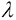 是正则化参数，必须根据我们希望模型有多准确来适当选择。

**多类分类**，这是分类的另一种形式，将分类结果预测为特定预定义值集中的值。因此，结果是从 *k* 个离散值中选择，即 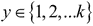。该模型为每个可能的观察值类别产生 *k* 个概率。这使我们得到了多类分类的以下正式定义：


因此，在多类分类中，我们预测 *k* 个不同的值，其中每个值表示输入值属于特定类别的概率。有趣的是，二分类可以被视为多类分类的一种特殊情况，其中只有两个可能的类别，即 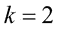 和 。

作为多类分类的一个特殊情况，我们可以说，具有最大概率的类别是结果，或者简单地说，给定观察值集合的预测类别。这种多类分类的特殊化称为**一对多**分类。在这里，从给定的观察值集合中确定具有最大（或最小）发生概率的单个类别，而不是找到我们模型中所有可能类别的发生概率。因此，如果我们打算从特定类别集合中预测单个类别，我们可以定义结果 *C* 如下：

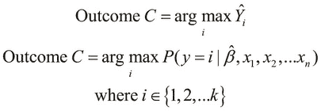

例如，假设我们想要确定一个鱼包装厂的分类模型。在这种情况下，鱼被分为两个不同的类别。比如说，我们可以将鱼分类为海鲈鱼或三文鱼。我们可以通过选择足够大的鱼样本并分析它们在某些选定特征上的分布来为我们的模型创建一些训练数据。比如说，我们已经确定了两个特征来分类数据，即鱼的长度和皮肤的亮度。

第一特征，即鱼的长度的分布可以如下可视化：

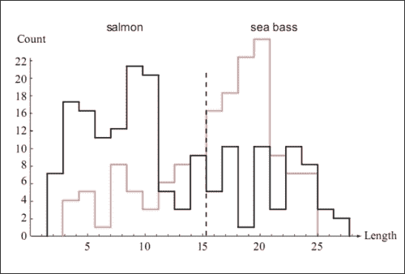

同样，样本数据中鱼皮光亮度的分布可以通过以下图来可视化：

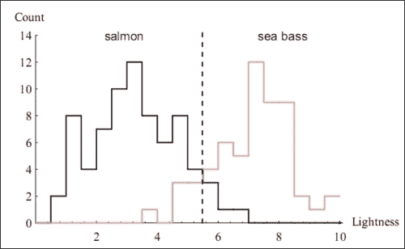

从前面的图中，我们可以看出，仅指定鱼的长度的信息不足以确定其类型。因此，这个特征在分类模型中的系数较小。相反，由于鱼皮的光亮度在确定鱼类型方面起着更大的作用，这个特征将在估计的分类模型的参数向量中具有更大的系数。

一旦我们建模了一个给定的分类问题，我们可以将训练数据划分为两个（或更多）集合。在向量空间中分割这两个集合的表面被称为所制定分类模型的**决策边界**。决策边界一侧的所有点属于一个类别，而另一侧的点属于另一个类别。一个明显的推论是，根据不同类别的数量，一个给定的分类模型可以有几个这样的决策边界。

我们现在可以将这两个特征结合起来训练我们的模型，这会产生两个鱼类别之间的估计决策边界。这个边界可以在训练数据的散点图上如下可视化：

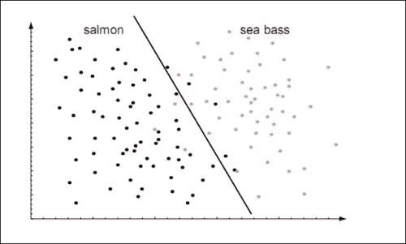

在前面的图中，我们通过使用直线来近似分类模型，因此，我们有效地将分类建模为线性函数。我们也可以将数据建模为多项式函数，因为它会产生更准确的分类模型。这样的模型产生的决策边界可以如下可视化：

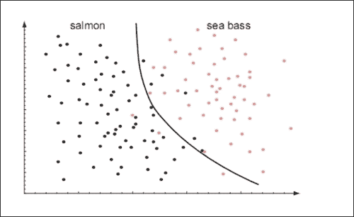

决策边界将样本数据划分为两个维度，如图中所示。当样本数据具有更多特征或维度时，决策边界将变得更加复杂，难以可视化。例如，对于三个特征，决策边界将是一个三维表面，如图中所示。请注意，为了清晰起见，未显示样本数据点。此外，假设图中绘制的两个特征在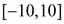范围内变化，第三个特征在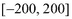范围内变化。

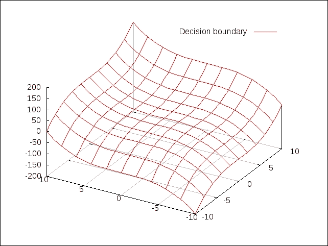

# 理解贝叶斯分类

我们现在将探讨用于分类数据的贝叶斯技术。**贝叶斯** 分类器本质上是一种基于贝叶斯条件概率定理构建的概率分类器。基于贝叶斯分类的模型假设样本数据具有高度独立的特征。这里的“独立”意味着模型中的每个特征可以独立于模型中的其他特征变化。换句话说，模型的特征是互斥的。因此，贝叶斯分类器假设特定特征的呈现与否完全独立于分类模型中其他特征的呈现与否。

术语 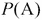 用于表示条件或特征 *A* 发生的概率。其值始终是介于 *0* 和 *1* 之间的分数值，包括两端。它也可以表示为百分比值。例如，概率 *0.5* 也可以写作 *50%* 或 *50 percent*。假设我们想要找到从给定样本中发生特征 *A* 或 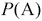 的概率。因此， 的值越高，特征 *A* 发生的可能性就越高。我们可以将概率  正式表示如下：

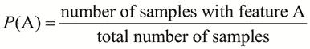

如果 *A* 和 *B* 是我们分类模型中的两个条件或特征，那么我们使用术语 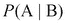 来表示当已知 *B* 已经发生时 *A* 的发生。这个值被称为 *A* 在 *B* 条件下的 **条件概率**，术语  也可以读作 *A* 在 *B* 条件下的概率。在术语  中，*B* 也被称为 *A* 的证据。在条件概率中，两个事件 *A* 和 *B* 可能相互独立，也可能不独立。然而，如果 *A* 和 *B* 确实是相互独立的条件，那么概率  等于 *A* 和 *B* 单独发生概率的乘积。我们可以将这个公理表达如下：

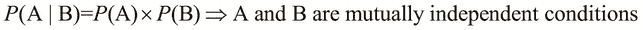

贝叶斯定理描述了条件概率和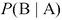与概率和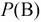之间的关系。它使用以下等式正式表达：

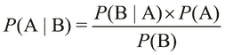

当然，为了使前面的关系成立，概率和都必须大于**0**。

让我们重新回顾一下我们之前描述的鱼包装厂的分类示例。问题是，我们需要根据鱼的外部特征来确定它是不是海鲈鱼还是三文鱼。现在，我们将使用贝叶斯分类器来实现这个问题的解决方案。然后，我们将使用贝叶斯定理来建模我们的数据。

假设每种鱼类都有三个独立且不同的特征，即皮肤的光泽度、长度和宽度。因此，我们的训练数据将类似于以下表格：

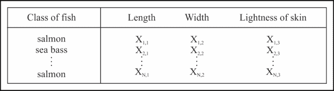

为了简化实现，让我们使用 Clojure 符号来表示这些特征。我们需要首先生成以下数据：

```py
(defn make-sea-bass []
  ;; sea bass are mostly long and light in color
  #{:sea-bass
    (if (< (rand) 0.2) :fat :thin)
    (if (< (rand) 0.7) :long :short)
    (if (< (rand) 0.8) :light :dark)})

(defn make-salmon []
  ;; salmon are mostly fat and dark
  #{:salmon
    (if (< (rand) 0.8) :fat :thin)
    (if (< (rand) 0.5) :long :short)
    (if (< (rand) 0.3) :light :dark)})

(defn make-sample-fish []
  (if (< (rand) 0.3) (make-sea-bass) (make-salmon)))

(def fish-training-data
  (for [i (range 10000)] (make-sample-fish)))
```

在这里，我们定义了两个函数，`make-sea-bass`和`make-salmon`，以创建一组符号来表示两种鱼类的类别。我们方便地使用`:salmon`和`:sea-bass`关键字来表示这两个类别。同样，我们也可以使用 Clojure 关键字来枚举鱼的特征。在这个例子中，皮肤的光泽度是`:light`或`:dark`，长度是`:long`或`:short`，宽度是`:fat`或`:thin`。此外，我们定义了`make-sample-fish`函数来随机创建一个由之前定义的特征集表示的鱼。

注意，我们定义这两种鱼类的类别，使得海鲈鱼通常较长且皮肤颜色较浅，而三文鱼通常较肥且颜色较深。此外，我们在`make-sample-fish`函数中生成了更多的三文鱼而不是海鲈鱼。我们只在数据中添加这种偏差，以提供更具说明性的结果，并鼓励读者尝试更真实的数据分布。在第二章中介绍的 Incanter 库中可用的*Iris*数据集，是可用于研究分类的真实世界数据集的例子。

现在，我们将实现以下函数来计算特定条件的概率：

```py
(defn probability
  "Calculates the probability of a specific category
   given some attributes, depending on the training data."
  [attribute & {:keys
                [category prior-positive prior-negative data]
                :or {category nil
                     data fish-training-data}}]
  (let [by-category (if category
                      (filter category data)
                      data)
        positive (count (filter attribute by-category))
        negative (- (count by-category) positive)
        total (+ positive negative)]
    (/ positive negative)))
```

我们实际上通过出现次数的基本定义来实现概率。

在前一段代码中定义的`probability`函数需要一个参数来表示我们想要计算其发生概率的属性或条件。此外，该函数还接受几个可选参数，例如用于计算此值的`fish-training-data`序列，默认为我们之前定义的，以及一个类别，这可以简单地理解为另一个条件。参数`category`和`attribute`实际上与中的条件*A*和*B*相对应。`probability`函数通过使用`filter`函数过滤训练数据来确定条件的总积极发生次数。然后，它通过计算样本数据中由`(count by-category)`表示的积极值和总值的差来确定消极发生次数。最后，该函数返回条件积极发生次数与给定数据中总发生次数的比率。

让我们使用`probability`函数来了解我们的训练数据如下：

```py
user> (probability :dark :category :salmon)
1204/1733
user> (probability :dark :category :sea-bass)
621/3068
user> (probability :light :category :salmon)
529/1733
user> (probability :light :category :sea-bass)
2447/3068
```

如前述代码所示，三文鱼外观为暗色的概率很高，具体为`1204/1733`。与海鲈鱼为暗色和三文鱼为亮色的概率相比，海鲈鱼为亮色和三文鱼为暗色的概率也较低。

假设我们对鱼的特征的观察值是它皮肤暗，长，且胖。在这些条件下，我们需要将鱼分类为海鲈鱼或三文鱼。从概率的角度来看，我们需要确定在鱼是暗、长、胖的情况下，鱼是三文鱼或海鲈鱼的概率。正式来说，这个概率由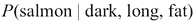和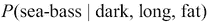这两个术语表示，针对鱼的任何一个类别。如果我们计算这两个概率，我们可以选择这两个概率中较高的类别来确定鱼的类别。

使用贝叶斯定理，我们定义术语和如下：

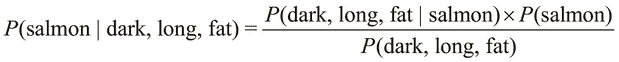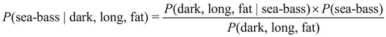

术语和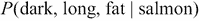可能有点令人困惑，但这两个术语之间的区别在于指定条件的出现顺序。术语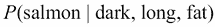表示深色、长而胖的鱼是三文鱼的概率，而术语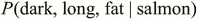表示三文鱼是深色、长而胖的鱼的概率。

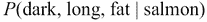概率可以从给定的训练数据中计算如下。由于假设鱼的三个特征是相互独立的，因此术语仅仅是每个单个特征发生概率的乘积。相互独立意味着这些特征的方差或分布不依赖于分类模型中的任何其他特征。

术语也称为给定类别的**证据**，在本例中是类别“三文鱼”。我们可以将概率表示为模型独立特征的概率乘积；如下所示：

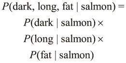

有趣的是，术语、和可以很容易地从训练数据和之前实现的`probability`函数中计算出来。同样，我们可以找到鱼是三文鱼或的概率。因此，在的定义中，唯一没有考虑到的术语是。实际上，我们可以使用概率中的一个简单技巧来完全避免计算这个术语。

由于鱼是深色、长而胖的，它可能是三文鱼或海鲈鱼。这两种鱼类的发生概率都是互补的，也就是说，它们共同解释了我们模型中可能出现的所有条件。换句话说，这两个概率的总和为*1*。因此，我们可以正式地表达术语，，如下所示：


上述等式右侧的两个术语都可以从训练数据中确定，这些术语类似于 、 以及等等。因此，我们可以直接从我们的训练数据中计算出  概率。我们通过以下等式来表示这个概率：


现在，让我们使用训练数据和之前定义的 `probability` 函数来实现前面的等式。首先，给定鱼的外观是深色、长和胖，鱼是鲑鱼的证据可以表示如下：

```py
(defn evidence-of-salmon [& attrs]
  (let [attr-probs (map #(probability % :category :salmon) attrs)
        class-and-attr-prob (conj attr-probs
                                  (probability :salmon))]
    (float (apply * class-and-attr-prob))))
```

为了明确起见，我们实现一个函数来计算从给定训练数据中术语  的概率。术语 、、 和  的等式将作为此实现的基线。

在前面的代码中，我们使用 `probability` 函数确定 *i* 的所有属性或条件的术语  和 。然后，我们使用 `apply` 和 `*` 函数的组合乘以所有这些术语。由于所有计算出的概率都是 `probability` 函数返回的比率，我们使用 `float` 函数将最终比率转换为浮点值。我们可以在 REPL 中尝试此函数如下：

```py
user> (evidence-of-salmon :dark)
0.4816
user> (evidence-of-salmon :dark :long)
0.2396884
user> (evidence-of-salmon)
0.6932
```

如 REPL 输出所示，训练数据中所有鱼中有 48.16% 的鱼是皮肤较暗的鲑鱼。同样，所有鱼中有 23.96% 的鱼是深色长鲑鱼，而所有鱼中有 69.32% 的鱼是鲑鱼。`(evidence-of-salmon :dark :long)` 调用返回的值可以表示为 ，同样，`(evidence-of-salmon)` 也返回 。

类似地，我们可以定义一个`evidence-of-sea-bass`函数，该函数根据鱼的一些观察到的特征来确定海鲈鱼出现的证据。由于我们只处理两个类别，，我们可以在 REPL 中轻松验证这个等式。有趣的是，观察到一个小错误，但这个错误与训练数据无关。实际上，这个小错误是一个浮点数舍入错误，这是由于浮点数的限制造成的。在实践中，我们可以使用十进制或`BigDecimal`（来自`java.lang`）数据类型来避免这种情况，而不是使用浮点数。我们可以使用 REPL 中的`evidence-of-sea-bass`和`evidence-of-salmon`函数来验证这一点，如下所示：

```py
user> (+ (evidence-of-sea-bass) (evidence-of-salmon))
1.0000000298023224
```

我们可以将`evidence-of-salmon`和`evidence-of-sea-bass`函数泛化，以便我们能够根据一些观察特征确定任何类别的概率；以下代码展示了这一点：

```py
(defn evidence-of-category-with-attrs
  [category & attrs]
  (let [attr-probs (map #(probability % :category category) attrs)
        class-and-attr-prob (conj attr-probs
                                  (probability category))]
    (float (apply * class-and-attr-prob))))
```

前面代码中定义的函数返回的值与以下`evidence-of-salmon`和`evidence-of-sea-bass`函数返回的值一致：

```py
user> (evidence-of-salmon :dark :fat)
0.38502988
user> (evidence-of-category-with-attrs :salmon :dark :fat)
0.38502988
```

使用`evidence-of-salmon`和`evidence-of-sea-bass`函数，我们可以按照以下方式计算以`probability-dark-long-fat-is-salmon`为单位的概率：

```py
(def probability-dark-long-fat-is-salmon
  (let [attrs [:dark :long :fat]
        sea-bass? (apply evidence-of-sea-bass attrs)
        salmon? (apply evidence-of-salmon attrs)]
    (/ salmon?
       (+ sea-bass? salmon?))))
```

我们可以在 REPL 中检查`probability-dark-long-fat-is-salmon`值，如下所示：

```py
user> probability-dark-long-fat-is-salmon
0.957091799207812
```

`probability-dark-long-fat-is-salmon`值表明，一条深色、长而胖的鱼有 95.7%的概率是鲑鱼。

使用前面定义的`probability-dark-long-fat-is-salmon`函数作为模板，我们可以泛化它所执行的计算。让我们首先定义一个简单的数据结构，它可以被传递。在 Clojure 的惯用风格中，我们方便地使用映射来完成这个目的。使用映射，我们可以在我们的模型中表示一个类别及其出现的证据和概率。此外，给定几个类别的证据，我们可以计算特定类别出现的总概率，如下面的代码所示：

```py
(defn make-category-probability-pair
  [category attrs]
  (let [evidence-of-category (apply
  evidence-of-category-with-attrs
                              category attrs)]
    {:category category
     :evidence evidence-of-category}))

(defn calculate-probability-of-category
  [sum-of-evidences pair]
  (let [probability-of-category (/ (:evidence pair)
                                   sum-of-evidences)]
    (assoc pair :probability probability-of-category)))
```

`make-category-probability-pair`函数使用我们在前面代码中定义的`evidence-category-with-attrs`函数来计算类别的证据及其条件或属性。然后，它以映射的形式返回这个值，以及类别本身。此外，我们还定义了`calculate-probability-of-category`函数，该函数使用`sum-of-evidences`参数和`make-category-probability-pair`函数返回的值来计算类别及其条件的总概率。

我们可以将前面两个函数组合起来，确定给定一些观察值的所有类别的总概率，然后选择概率最高的类别，如下所示：

```py
(defn classify-by-attrs
  "Performs Bayesian classification of the attributes,
   given some categories.
   Returns a map containing the predicted category and
   the category's
   probability of occurrence."
  [categories & attrs]
  (let [pairs (map #(make-category-probability-pair % attrs)
                   categories)
        sum-of-evidences (reduce + (map :evidence pairs))
        probabilities (map #(calculate-probability-of-category
                              sum-of-evidences %)
                           pairs)
        sorted-probabilities (sort-by :probability probabilities)
        predicted-category (last sorted-probabilities)]
    predicted-category))
```

前述代码中定义的`classify-by-attrs`函数将所有可能的类别映射到`make-category-probability-pair`函数，给定一些条件或我们模型特征的观察值。由于我们处理的是`make-category-probability-pair`返回的序列对，我们可以使用`reduce`、`map`和`+`函数的简单组合来计算此序列中所有证据的总和。然后，我们将`calculate-probability-of-category`函数映射到类别-证据对的序列，并选择概率最高的类别-证据对。我们通过按概率升序排序序列来实现这一点，并选择排序序列中的最后一个元素。

现在，我们可以使用`classify-by-attrs`函数来确定一个观察到的鱼（外观为暗、长、胖）是鲑鱼的概率。它也由我们之前定义的`probability-dark-long-fat-is-salmon`值表示。这两个表达式都产生了相同的概率，即 95.7%，表示外观为暗、长、胖的鱼是鲑鱼。我们将在以下代码中实现`classify-by-attrs`函数：

```py
user> (classify-by-attrs [:salmon :sea-bass] :dark :long :fat)
{:probability 0.957091799207812, :category :salmon, :evidence 0.1949689}
user> probability-dark-long-fat-is-salmon
0.957091799207812
```

`classify-by-attrs`函数还返回给定观察条件`:dark`、`:long`和`:fat`的预测类别（即`:salmon`）。我们可以使用此函数来了解更多关于训练数据的信息，如下所示：

```py
user> (classify-by-attrs [:salmon :sea-bass] :dark)
{:probability 0.8857825967670728, :category :salmon, :evidence 0.4816}
user> (classify-by-attrs [:salmon :sea-bass] :light)
{:probability 0.5362699908806723, :category :sea-bass, :evidence 0.2447}
user> (classify-by-attrs [:salmon :sea-bass] :thin)
{:probability 0.6369809383442954, :category :sea-bass, :evidence 0.2439}
```

如前述代码所示，外观为暗的鱼主要是鲑鱼，外观为亮的鱼主要是海鲈鱼。此外，体型瘦的鱼很可能是海鲈鱼。以下值实际上与我们之前定义的训练数据相符：

```py
user> (classify-by-attrs [:salmon] :dark)
{:probability 1.0, :category :salmon, :evidence 0.4816}
user> (classify-by-attrs [:salmon])
{:probability 1.0, :category :salmon, :evidence 0.6932}
```

注意，仅使用`[:salmon]`作为参数调用`classify-by-attrs`函数会返回任何给定鱼是鲑鱼的概率。一个明显的推论是，给定一个单一类别，`classify-by-attrs`函数总是以完全的确定性预测提供的类别，即概率为*1.0*。然而，该函数返回的证据取决于传递给它的观察特征以及我们用来训练模型的样本数据。

简而言之，前面的实现描述了一个可以使用一些样本数据进行训练的贝叶斯分类器。它还分类了我们的模型特征的某些观察值。

我们可以通过构建我们之前示例中概率的定义来描述一个通用的贝叶斯分类器。为了快速回顾，这个术语可以正式表达如下：


在前一个等式中，我们处理一个单一类别，即鲑鱼，以及三个相互独立特征，即鱼皮的长度、宽度和亮度。我们可以将这个等式推广到 *N* 个特征，如下所示：


在这里，术语 *Z* 是分类模型的证据，我们在前一个方程中进行了描述。我们可以使用求和和乘积符号来更简洁地描述前一个等式，如下所示：


前一个等式描述了单个类别 *C* 的发生概率。如果我们给定多个类别可供选择，我们必须选择发生概率最高的类别。这引出了贝叶斯分类器的基本定义，其形式表达如下：


在前一个方程中，函数  描述了一个贝叶斯分类器，它选择发生概率最高的类别。请注意，术语  代表我们分类模型的各个特征，而术语  代表这些特征的观测值集合。此外，方程右侧的变量 *c* 可以取分类模型中所有不同类别的值。

我们可以通过 **最大后验概率** (**MAP**) 估计进一步简化贝叶斯分类器的先前的方程，这可以被视为贝叶斯统计中特征的正规化。简化的贝叶斯分类器可以形式表达如下：


这个定义本质上意味着 *classify* 函数确定给定特征的最高发生概率的类别。因此，前一个方程描述了一个可以使用一些样本数据进行训练，然后用于预测给定观测值集合类别的贝叶斯分类器。我们现在将专注于使用现有的贝叶斯分类器实现来建模给定的分类问题。

`clj-ml`库([`github.com/joshuaeckroth/clj-ml`](https://github.com/joshuaeckroth/clj-ml))包含几个实现算法，我们可以从中选择来模拟给定的分类问题。实际上，这个库只是流行的**Weka**库([`www.cs.waikato.ac.nz/ml/weka/`](http://www.cs.waikato.ac.nz/ml/weka/))的 Clojure 包装器，Weka 是一个包含多个机器学习算法实现的 Java 库。它还有几个用于评估和验证生成的分类模型的方法。然而，我们将专注于本章中`clj-ml`库的分类器实现。

### 备注

可以通过在`project.clj`文件中添加以下依赖项将`clj-ml`库添加到 Leiningen 项目中：

```py
[cc.artifice/clj-ml "0.4.0"]
```

对于即将到来的示例，命名空间声明应类似于以下声明：

```py
(ns my-namespace
  (:use [clj-ml classifiers data]))
```

现在，我们将通过一个贝叶斯分类器的实现来介绍`clj-ml`库，以模拟我们之前涉及鱼包装厂的问题。首先，让我们精炼我们的训练数据，使用数值而不是我们之前描述的关键字来表示模型的各种特征。当然，我们将在训练数据中保持部分性，使得鲑鱼大多是肥的和深色的，而海鲈鱼大多是长的和浅色的。以下代码实现了这一点：

```py
(defn rand-in-range
  "Generates a random integer within the given range"
  [min max]
  (let [len      (- max min)
        rand-len (rand-int len)]
    (+ min rand-len)))

;; sea bass are mostly long and light in color
(defn make-sea-bass []
  (vector :sea-bass
          (rand-in-range 6 10)          ; length
          (rand-in-range 0 5)           ; width
          (rand-in-range 4 10)))        ; lightness of skin

;; salmon are mostly fat and dark
(defn make-salmon []
  (vector :salmon
          (rand-in-range 0 7)           ; length
          (rand-in-range 4 10)          ; width
          (rand-in-range 0 6)))         ; lightness of skin
```

在这里，我们定义了`rand-in-range`函数，该函数简单地生成给定值范围内的随机整数。然后我们重新定义了`make-sea-bass`和`make-salmon`函数，使用`rand-in-range`函数来生成鱼的三个特征（长度、宽度和皮肤颜色深浅）的值，这些值在`0`到`10`之间。皮肤颜色较浅的鱼，这个特征的值会更高。请注意，我们重用了`make-sample-fish`函数的定义和`fish-dataset`变量的定义来生成我们的训练数据。此外，鱼是由一个向量而不是一个集合来表示的，正如在`make-sea-bass`和`make-salmon`函数的早期定义中所述。

我们可以使用`clj-ml`库中的`make-classifier`函数创建一个分类器，该函数位于`clj-ml.classifiers`命名空间中。我们可以通过将两个关键字作为参数传递给函数来指定要使用的分类器类型。由于我们打算使用贝叶斯分类器，我们将关键字`:bayes`和`:naive`传递给`make-classifier`函数。简而言之，我们可以使用以下声明来创建一个贝叶斯分类器。请注意，以下代码中使用的关键字`:naive`表示一个朴素贝叶斯分类器，它假设我们模型中的特征是独立的：

```py
(def bayes-classifier (make-classifier :bayes :naive))
```

`clj-ml` 库的分类器实现使用通过 `clj-ml.data` 命名空间中的函数定义或生成的数据集。我们可以使用 `make-dataset` 函数将 `fish-dataset` 序列（一个向量序列）转换为这样的数据集。此函数需要一个数据集的任意字符串名称、每个集合项的模板以及要添加到数据集中的项目集合。提供给 `make-dataset` 函数的模板很容易用映射表示，如下所示：

```py
(def fish-template
  [{:category [:salmon :sea-bass]}
   :length :width :lightness])

(def fish-dataset
  (make-dataset "fish" fish-template fish-training-data))
```

在前面的代码中定义的 `fish-template` 映射只是简单地说明，作为一个向量表示的鱼，由鱼的类别、长度、宽度和皮肤的亮度组成，顺序如下。请注意，鱼的类别是用 `:salmon` 或 `:sea-bass` 描述的。现在我们可以使用 `fish-dataset` 来训练由 `bayes-classifier` 变量表示的分类器。

虽然该 `fish-template` 映射定义了鱼的全部属性，但它仍然缺少一个重要的细节。它没有指定这些属性中哪一个代表鱼的类别或分类。为了指定向量中的一个特定属性以代表整个观察值集合的类别，我们使用 `dataset-set-class` 函数。此函数接受一个参数，指定属性的索引，并用于在向量中代表观察值集合的类别。请注意，此函数实际上会修改或修改它提供的数据集。然后我们可以使用 `classifier-train` 函数来训练我们的分类器，该函数接受一个分类器和数据集作为参数；如下代码所示：

```py
(defn train-bayes-classifier []
  (dataset-set-class fish-dataset 0)
  (classifier-train bayes-classifier fish-dataset))
```

前面的 `train-bayes-classifier` 函数只是调用了 `dataset-set-class` 和 `classifier-train` 函数来训练我们的分类器。当我们调用 `train-bayes-classifier` 函数时，分类器会使用以下提供的数据进行训练，然后打印到 REPL 输出：

```py
user> (train-bayes-classifier)
#<NaiveBayes Naive Bayes Classifier

                     Class
Attribute        salmon  sea-bass
                  (0.7)    (0.3)
=================================
length
  mean            2.9791   7.5007
  std. dev.       1.9897   1.1264
  weight sum        7032     2968
  precision            1        1

width
  mean            6.4822   1.9747
  std. dev.        1.706    1.405
  weight sum        7032     2968
  precision            1        1

lightness
  mean            2.5146   6.4643
  std. dev.       1.7047   1.7204
  weight sum        7032     2968
  precision            1        1

>
```

此输出为我们提供了关于训练数据的一些基本信息，例如我们模型中各种特征的均值和标准差。现在我们可以使用这个训练好的分类器来预测我们模型特征的观察值的类别。

让我们先定义我们打算分类的观察值。为此，我们使用以下 `make-instance` 函数，该函数需要一个数据集和一个与提供的数据集数据模板相匹配的观察值向量：

```py
(def sample-fish
  (make-instance fish-dataset [:salmon 5.0 6.0 3.0]))
```

在这里，我们只是使用 `make-instance` 函数定义了一个样本鱼。现在我们可以如下预测由 `sample-fish` 表示的鱼的类别：

```py
user> (classifier-classify bayes-classifier sample-fish)
:salmon
```

如前述代码所示，鱼被分类为`salmon`。请注意，尽管我们在定义`sample-fish`时提供了鱼的类别为`:salmon`，但这只是为了符合`fish-dataset`定义的数据模板。实际上，我们可以将`sample-fish`的类别指定为`:sea-bass`或第三个值，例如`:unknown`，以表示一个未定义的值，分类器仍然会将`sample-fish`分类为`salmon`。

当处理给定分类模型的各种特征的连续值时，我们可以指定一个贝叶斯分类器来使用连续特征的离散化。这意味着模型的各种特征的值将通过概率密度估计转换为离散值。我们可以通过简单地向`make-classifier`函数传递一个额外的参数`{:supervised-discretization true}`来指定此选项。这个映射实际上描述了可以提供给指定分类器的所有可能选项。

总之，`clj-ml`库提供了一个完全可操作的贝叶斯分类器，我们可以用它来对任意数据进行分类。尽管我们在前面的例子中自己生成了训练数据，但这些数据也可以从网络或数据库中获取。

# 使用 k-最近邻算法

一种可以用来对一组观测值进行分类的简单技术是**k-最近邻**（简称**k-NN**）算法。这是一种**懒惰学习**的形式，其中所有计算都推迟到分类阶段。在分类阶段，k-NN 算法仅使用训练数据中的少数几个值来近似观测值的类别，其他值的读取则推迟到实际需要时。

虽然我们现在在分类的背景下探索 k-NN 算法，但它也可以通过简单地选择预测值作为一组观测特征值的依赖变量的最近值的平均值来应用于回归。有趣的是，这种建模回归的技术实际上是对**线性插值**（更多信息，请参阅*An introduction to kernel and nearest-neighbor nonparametric regression*）的推广。

k-NN 算法读取一些训练数据，并懒惰地分析这些数据，也就是说，只有在需要时才会分析。除了训练数据外，该算法还需要一组观测值和一个常数*k*作为参数来对观测值集进行分类。为了对这些观测值进行分类，算法预测与观测值集最近的*k*个训练样本中最频繁的类别。这里的“最近”是指，在训练数据的欧几里得空间中，代表观测值集的点与具有最小欧几里得距离的点。

一个明显的推论是，当时，预测的类别是观察值集合最近的单个邻居的类别。k-NN 算法的这个特殊情况被称为**最近邻**算法。

我们可以使用`clj-ml`库的`make-classifier`函数创建一个使用 k-NN 算法的分类器。这样的分类器通过将`:lazy`和`:ibk`作为`make-classifier`函数的参数来指定。我们现在将使用这样的分类器来模拟我们之前的鱼包装厂示例，如下所示：

```py
(def K1-classifier (make-classifier :lazy :ibk))

(defn train-K1-classifier []
  (dataset-set-class fish-dataset 0)
  (classifier-train K1-classifier fish-dataset))
```

前述代码定义了一个 k-NN 分类器为`K1-classifier`，以及一个`train-K1-classifier`函数，使用`fish-dataset`（我们在前述代码中定义）来训练分类器。

注意，`make-classifier`函数默认将常数*k*或更确切地说，邻居的数量设置为*1*，这意味着单个最近邻。我们可以选择性地通过将`:num-neighbors`键作为键值对传递给`make-classifier`函数来指定常数*k*，如下述代码所示：

```py
(def K10-classifier (make-classifier
                     :lazy :ibk {:num-neighbors 10}))
```

我们现在可以调用`train-K1-classifier`函数来按照以下方式训练分类器：

```py
user> (train-K1-classifier)
#<IBk IB1 instance-based classifier
using 1 nearest neighbour(s) for classification
>
```

我们现在可以使用`classifier-classify`函数来对之前定义的`sample-fish`表示的鱼进行分类，使用的是由`K1-classifier`变量表示的分类器：

```py
user> (classifier-classify K1-classifier sample-fish)
:salmon
```

如前述代码所示，k-NN 分类器预测鱼类为鲑鱼，这与我们之前使用贝叶斯分类器做出的预测一致。总之，`clj-ml`库提供了一个简洁的实现，使用 k-NN 算法来预测一组观察值的类别。

`clj-ml`库提供的 k-NN 分类器默认使用这些特征的值均值和标准差对分类模型的特征进行归一化。我们可以通过传递一个包含`:no-normalization`键的映射条目到`make-classifier`函数的选项映射中，来指定一个选项给`make-classifier`函数以跳过这个归一化阶段。

# 使用决策树

我们还可以使用决策树来建模给定的分类问题。实际上，决策树是从给定的训练数据构建的，我们可以使用这个决策树来预测一组给定观察值的类别。构建决策树的过程大致基于信息论中的信息熵和信息增益的概念（更多信息，请参阅*决策树归纳*）。它也常被称为**决策树学习**。不幸的是，对信息论进行详细研究超出了本书的范围。然而，在本节中，我们将探讨一些将在机器学习环境中使用的信息论概念。

决策树是一种树或图，描述了决策及其可能后果的模型。决策树中的一个内部节点代表一个决策，或者更确切地说，在分类的上下文中，代表特定特征的某种条件。它有两个可能的结果，分别由节点的左右子树表示。当然，决策树中的节点也可能有超过两个的子树。决策树中的每个叶节点代表我们分类模型中的一个特定类别或后果。

例如，我们之前的涉及鱼包装工厂的分类问题可能有以下决策树：


之前展示的决策树使用两个条件来分类鱼是鲑鱼还是海鲢。内部节点代表基于我们分类模型特征的两种条件。请注意，决策树只使用了我们分类模型的三个特征中的两个。因此，我们可以说这棵树是*剪枝*的。我们将在本节中简要探讨这项技术。

要使用决策树对一组观测值进行分类，我们从根节点开始遍历树，直到达到代表观测值集合预测类别的叶节点。从决策树预测一组观测值类别的这种技术始终相同，无论决策树是如何构建的。对于之前描述的决策树，我们可以通过首先比较鱼的长度，然后比较其皮肤的亮度来对鱼进行分类。第二次比较只有在鱼的长度大于**6**（如决策树中带有表达式**Length < 6**的内部节点所指定）时才需要。如果鱼的长度确实大于**6**，我们使用鱼的皮肤亮度来决定它是鲑鱼还是海鲢。

实际上，有几种算法用于从一些训练数据中构建决策树。通常，树是通过根据属性值测试将训练数据中的样本值集合分割成更小的子集来构建的。这个过程在每个子集上重复进行，直到分割给定样本值子集不再向决策树添加内部节点。正如我们之前提到的，决策树中的内部节点可能有多于两个的子树。

现在我们将探讨**C4.5**算法来构建决策树（更多信息，请参阅*《C4.5：机器学习程序》*）。这个算法使用信息熵的概念来决定必须对样本值集合进行分割的特征和相应的值。**信息熵**被定义为给定特征或随机变量的不确定性度量（更多信息，请参阅“通信的数学理论”）。

对于给定特征或属性 *f*，其值在 *1* 到 *m* 的范围内，我们可以定义该特征的信息熵如下：


在前面的方程中，术语表示特征 *f* 相对于值 *i* 的出现次数。基于特征信息熵的定义，我们定义归一化信息增益。在以下等式中，术语 *T* 指的是提供给算法的样本值或训练数据集：


从信息熵的角度来看，给定属性的先前的信息增益定义是当从模型中给定的特征集中移除属性 *f* 时，整个值集的信息熵的变化。

算法从训练数据中选择的特征 *A*，使得特征 *A* 在特征集中具有最大的可能信息增益。我们可以借助以下等式来表示这一点：


在前面的方程中，表示特征 *a* 所知可能具有的所有可能值集。集表示特征 *a* 具有值 *v* 的观察值集，而术语表示该值集的信息熵。

使用前面的方程从训练数据中选择具有最大信息增益的特征，我们可以通过以下步骤描述 C4.5 算法：

1.  对于每个特征 *a*，找到在特征 *a* 上划分样本数据时的归一化信息增益。

1.  选择具有最大归一化信息增益的特征 *A*。

1.  根据所选特征 *A* 创建一个内部决策节点。从这个步骤创建的两个子树要么是叶节点，要么是进一步划分的新样本值集。

1.  在上一步产生的每个样本值分区集上重复此过程。我们重复前面的步骤，直到样本值子集中的所有特征都具有相同的信息熵。

一旦创建了一个决策树，我们可以选择性地对该树进行**剪枝**。剪枝简单地说就是从树中移除任何多余的决策节点。这可以被视为通过正则化决策树来防止估计的决策树模型欠拟合或过拟合的一种形式。

**J48**是 C4.5 算法在 Java 中的开源实现，`clj-ml`库包含一个有效的 J48 决策树分类器。我们可以使用`make-classifier`函数创建一个决策树分类器，并向此函数提供`:decision-tree`和`:c45`关键字作为参数来创建一个 J48 分类器，如下述代码所示：

```py
(def DT-classifier (make-classifier :decision-tree :c45))

(defn train-DT-classifier []
  (dataset-set-class fish-dataset 0)
  (classifier-train DT-classifier fish-dataset))
```

前述代码中定义的`train-DT-classifier`函数简单地将`DT-classifier`分类器用我们之前鱼包装厂示例中的训练数据训练。`classifier-train`函数还会打印以下训练好的分类器：

```py
user> (train-DT-classifier)
#<J48 J48 pruned tree
------------------
width <= 3: sea-bass (2320.0)
width > 3
|   length <= 6
|   |   lightness <= 5: salmon (7147.0/51.0)
|   |   lightness > 5: sea-bass (95.0)
|   length > 6: sea-bass (438.0)

Number of Leaves  : 4

Size of the tree : 7
>
```

上述输出很好地说明了训练好的决策树的外观，以及决策树的大小和叶节点数量。显然，决策树有三个不同的内部节点。树的根节点基于鱼的宽度，后续节点基于鱼的长度，最后一个决策节点基于鱼皮肤的亮度。

现在，我们可以使用决策树分类器来预测鱼的类别，我们使用以下`classifier-classify`函数来进行这个分类：

```py
user> (classifier-classify DT-classifier sample-fish)
:salmon
```

如前述代码所示，分类器将代表`sample-fish`的鱼的类别预测为`:salmon`关键字，就像之前示例中使用的其他分类器一样。

`clj-ml`库提供的 J48 决策树分类器实现，在训练分类器时将剪枝作为最后一步。我们可以通过在传递给`make-classifier`函数的选项映射中指定`:unpruned`键来生成未经修剪的树，如下述代码所示：

```py
(def UDT-classifier (make-classifier
                     :decision-tree :c45 {:unpruned true}))
```

之前定义的分类器在用给定的训练数据训练决策树时不会进行剪枝。我们可以通过定义和调用`train-UDT-classifier`函数来检查未经修剪的树的外观，该函数简单地使用`classifier-train`函数和`fish-dataset`训练数据来训练分类器。此函数可以定义为与`train-UDT-classifier`函数类似，并在调用时产生以下输出：

```py
user> (train-UDT-classifier)
#<J48 J48 unpruned tree
------------------
width <= 3: sea-bass (2320.0)
width > 3
|   length <= 6
|   |   lightness <= 5
|   |   |   length <= 5: salmon (6073.0)
|   |   |   length > 5
|   |   |   |   width <= 4
|   |   |   |   |   lightness <= 3: salmon (121.0)
|   |   |   |   |   lightness > 3
|   |   |   |   |   |   lightness <= 4: salmon (52.0/25.0)
|   |   |   |   |   |   lightness > 4: sea-bass (50.0/24.0)
|   |   |   |   width > 4: salmon (851.0)
|   |   lightness > 5: sea-bass (95.0)
|   length > 6: sea-bass (438.0)

Number of Leaves  : 8

Size of the tree : 15
```

如前述代码所示，未经修剪的决策树与修剪后的决策树相比，拥有更多的内部决策节点。现在我们可以使用以下`classifier-classify`函数来预测一条鱼的类别，使用的是训练好的分类器：

```py
user> (classifier-classify UDT-classifier sample-fish)
:salmon
```

有趣的是，未经修剪的树也预测了代表`sample-fish`的鱼的类别为`:salmon`，因此与之前描述的修剪决策树预测的类别一致。总之，`clj-ml`库为我们提供了一个基于 C4.5 算法的决策树分类器的有效实现。

`make-classifier`函数支持 J48 决策树分类器的一些有趣选项。我们已经探讨了`:unpruned`选项，它表示决策树没有被剪枝。我们可以将`:reduced-error-pruning`选项指定给`make-classifier`函数，以强制使用减少误差剪枝（更多信息，请参阅“基于树大小的悲观决策树剪枝”），这是一种基于减少模型整体误差的剪枝形式。我们还可以指定给`make-classifier`函数的另一个有趣选项是剪枝决策树时可以移除的最大内部节点或折叠数。我们可以使用`:pruning-number-of-folds`选项来指定此选项，并且默认情况下，`make-classifier`函数在剪枝决策树时不会施加此类限制。此外，我们还可以通过指定`:only-binary-splits`选项给`make-classifier`函数，来指定决策树中的每个内部决策节点只有两个子树。

# 摘要

在本章中，我们探讨了分类以及可以用来对给定分类问题进行建模的各种算法。尽管分类技术非常有用，但当样本数据具有大量维度时，它们的性能并不太好。此外，特征可能以非线性方式变化，正如我们将在第四章“构建神经网络”中描述的那样。我们将在接下来的章节中进一步探讨这些方面以及监督学习的替代方法。以下是本章中我们关注的一些要点：

+   我们描述了两种广泛的分类类型，即二分类和多分类。我们还简要研究了逻辑函数以及如何通过逻辑回归来使用它来建模分类问题。

+   我们研究和实现了贝叶斯分类器，它使用用于建模分类的概率模型。我们还描述了如何使用`clj-ml`库的贝叶斯分类器实现来对给定的分类问题进行建模。

+   我们还探讨了简单的 k-最近邻算法以及我们如何利用`clj-ml`库来利用它。

+   我们研究了决策树和 C4.5 算法。`clj-ml`库为我们提供了一个基于 C4.5 算法的可配置分类器实现，我们描述了如何使用此实现。

在下一章中，我们将探讨人工神经网络。有趣的是，我们可以使用人工神经网络来建模回归和分类问题，我们也将研究这些神经网络的方面。
