# 第五章. 选择和评估数据

在上一章中，我们学习了**人工神经网络**（**ANNs**）以及它们如何有效地对非线性样本数据进行建模。到目前为止，我们已经讨论了几种可以用来对给定的训练数据集进行建模的机器学习技术。在本章中，我们将探讨以下主题，重点关注如何从样本数据中选择合适的特征：

+   我们将研究评估或量化制定模型与提供的训练数据拟合准确性的方法。当我们需要扩展或调试现有模型时，这些技术将非常有用。

+   我们还将探索如何使用`clj-ml`库在给定的机器学习模型上执行此过程。

+   在本章的末尾，我们将实现一个包含模型评估技术的有效垃圾邮件分类器。

“**机器学习诊断**”这个术语通常用来描述一种可以运行的测试，以获得关于机器学习模型中哪些工作得好，哪些工作得不好的洞察。诊断生成的信息可以用来提高给定模型的表现。一般来说，在设计机器学习模型时，建议并行地为模型制定一个诊断。为给定模型实现诊断可能需要与制定模型本身相同的时间，但实现诊断是值得投入时间的，因为它有助于快速确定模型中需要改变什么才能改进它。因此，机器学习诊断有助于在调试或改进制定的学习模型方面节省时间。

机器学习的另一个有趣方面是，如果我们不知道我们试图拟合的数据的性质，我们就无法对可以使用哪种机器学习模型来拟合样本数据做出任何假设。这个公理被称为**没有免费午餐**定理，可以总结如下：

> “如果没有关于学习算法性质的前置假设，没有任何学习算法比其他任何（甚至随机猜测）更优越或更劣。”

# 理解欠拟合和过拟合

在之前的章节中，我们讨论了最小化一个机器学习模型的误差或损失函数。估计模型的总体误差低是合适的，但低误差通常不足以确定模型与提供的训练数据拟合得有多好。在本节中，我们将重新审视**过拟合**和**欠拟合**的概念。

如果估计模型在预测中表现出较大的误差，则称其为**欠拟合**。理想情况下，我们应该努力最小化模型中的这个误差。然而，具有低误差或成本函数的公式化模型也可能表明模型不理解模型给定特征之间的潜在关系。相反，模型是*记忆*提供的数据，这甚至可能导致对随机噪声的建模。在这种情况下，该模型被称为**过拟合**。过拟合模型的一般症状是未能从未见过的数据中正确预测输出变量。欠拟合模型也被称为表现出**高偏差**，而过拟合模型则被认为具有**高方差**。

假设我们在模型中建模一个单一的自变量和因变量。理想情况下，模型应该拟合训练数据，同时在尚未观察到的训练数据上泛化。

在欠拟合模型中，可以使用以下图表表示因变量与自变量之间的方差：

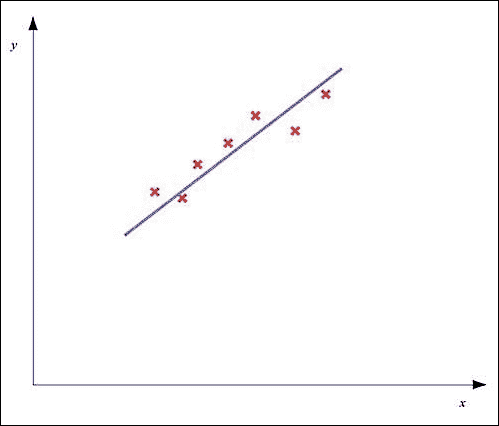

在前图中，红色交叉表示样本数据中的数据点。如图所示，欠拟合模型将表现出较大的总体误差，我们必须通过适当选择模型的特征和使用正则化来尝试减少这个误差。

另一方面，模型也可能过拟合，在这种情况下，模型的总体误差值很低，但估计的模型无法从先前未见过的数据中正确预测因变量。可以使用以下图表来表示过拟合模型：

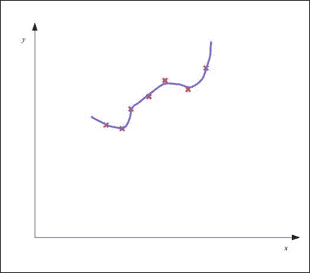

如前图所示，估计的模型图紧密但不适当地拟合了训练数据，因此总体误差较低。但是，模型无法对新数据做出正确响应。

描述样本数据的良好拟合模型的总体误差将很低，并且可以从模型中独立变量的先前未见过的值正确预测因变量。一个适当拟合的模型应该有一个类似于以下图表的图形：

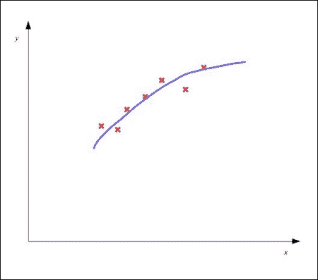

神经网络也可能在提供的样本数据上欠拟合或过拟合。例如，具有少量隐藏节点和层的神经网络可能是一个欠拟合模型，而具有大量隐藏节点和层的神经网络可能表现出过拟合。

## 评估模型

我们可以绘制模型的因变量和自变量的方差图，以确定模型是欠拟合还是过拟合。然而，随着特征数量的增加，我们需要更好的方法来可视化模型在训练数据上对模型因变量和自变量关系的泛化程度。

我们可以通过确定模型在某些不同数据上的成本函数来评估训练好的机器学习模型。因此，我们需要将可用的样本数据分成两个子集——一个用于训练模型，另一个用于测试模型。后者也被称为我们模型的**测试集**。

然后计算测试集中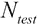样本的成本函数。这为我们提供了一个度量，即当模型用于之前未见过的数据时，模型的整体误差。这个值由估计模型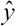的术语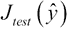表示，也被称为该公式的**测试误差**。训练数据中的整体误差被称为模型的**训练误差**，由术语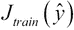表示。线性回归模型的测试误差可以按以下方式计算：

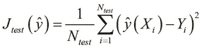

同样，二元分类模型中的测试误差可以正式表示如下：

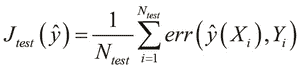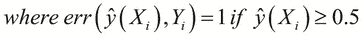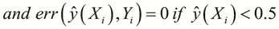

确定模型特征以使测试误差低的问题被称为**模型选择**或**特征选择**。此外，为了避免过拟合，我们必须测量模型在训练数据上的泛化程度。测试误差本身是对模型在训练数据上泛化误差的乐观估计。然而，我们还必须测量模型在尚未被模型看到的数据上的泛化误差。如果模型在未见过的数据上也有低误差，我们可以确信该模型没有过拟合数据。这个过程被称为**交叉验证**。

因此，为了确保模型能够在未见过的数据上表现良好，我们需要额外的一组数据，称为**交叉验证集**。交叉验证集中样本的数量由术语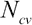表示。通常，样本数据被划分为训练集、测试集和交叉验证集，使得训练数据中的样本数量显著多于测试集和交叉验证集。因此，泛化误差，或者说交叉验证误差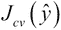，表明估计模型与未见数据拟合得有多好。请注意，当我们使用交叉验证和测试集对估计模型进行修改时，我们不会修改估计模型。我们将在本章的后续部分更详细地研究交叉验证。正如我们稍后将会看到的，我们还可以使用交叉验证来确定从某些样本数据中模型的特征。

例如，假设我们的训练数据中有 100 个样本。我们将这些样本数据分成三个集合。前 60 个样本将用于估计一个适合数据的模型。在剩下的 40 个样本中，20 个将用于交叉验证估计的模型，其余的 20 个将用于最终测试交叉验证后的模型。

在分类的背景下，一个给定分类器准确性的良好表示是*混淆矩阵*。这种表示通常用于根据监督机器学习算法可视化给定分类器的性能。这个矩阵中的每一列代表由给定分类器预测属于特定类别的样本数量。混淆矩阵的行代表样本的实际类别。混淆矩阵也称为训练分类器的**列联表**或**误差矩阵**。

例如，假设在给定的分类模型中有两个类别。这个模型的混淆矩阵可能如下所示：

|   | 预测类别 |
| --- | --- |
| A | B |
| --- | --- |
| **实际类别** | A | 45 | 15 |
| B | 30 | 10 |

在混淆矩阵中，我们模型中的预测类别由垂直列表示，实际类别由水平行表示。在先前的混淆矩阵示例中，总共有 100 个样本。在这些样本中，来自类别 A 的 45 个样本和来自类别 B 的 10 个样本被预测为正确的类别。然而，15 个类别 A 的样本被错误地分类为类别 B，同样，30 个类别 B 的样本被预测为类别 A。

让我们考虑一个使用与上一个示例相同数据的不同分类器的混淆矩阵：

|   | 预测类别 |
| --- | --- |
| A | B |
| --- | --- |
| **实际类别** | A | 45 | 5 |
| B | 0 | 50 |

在先前的混淆矩阵中，分类器正确地将类别 B 的所有样本分类。此外，只有 5 个类别 A 的样本被错误分类。因此，与上一个示例中使用的分类器相比，这个分类器更好地理解了两种数据类别的区别。在实践中，我们必须努力训练一个分类器，使其混淆矩阵中除对角线元素外的所有元素值都接近于*0*。

## 理解特征选择

如我们之前提到的，我们需要从样本数据中确定一个合适的特征集，这是我们建立模型的基础。我们可以使用交叉验证来确定从训练数据中应使用哪个特征集，这可以解释如下。

对于每个特征变量集或组合，我们根据所选特征集确定模型的训练和交叉验证错误。例如，我们可能想要添加由模型独立变量导出的多项式特征。我们根据用于建模训练数据的最高多项式度数评估每个特征集的训练和交叉验证错误。我们可以绘制这些错误函数的方差随多项式度数的变化，类似于以下图表：

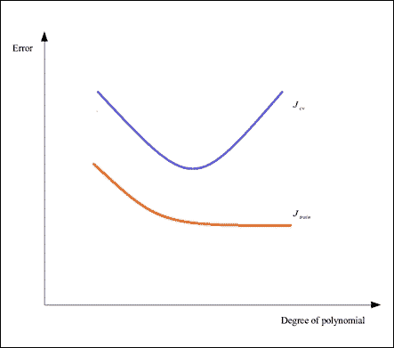

从前面的图表中，我们可以确定哪个特征集会产生欠拟合或过拟合的估计模型。如果所选模型在图表左侧具有高训练和交叉验证错误值，则表示模型对提供的训练数据欠拟合。另一方面，如图表右侧所示，低训练错误和高交叉验证错误表明模型过拟合。理想情况下，我们必须选择具有最低可能训练和交叉验证错误值的特征集。

# 调整正则化参数

为了产生更好的训练数据拟合，我们可以使用正则化来避免过度拟合数据的问题。给定模型的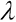值必须根据模型的行为适当选择。请注意，高正则化参数可能导致高训练错误，这是不希望看到的效果。我们可以在公式化的机器学习模型中调整正则化参数，以产生以下图表，显示错误值随模型中正则化参数值的变化：

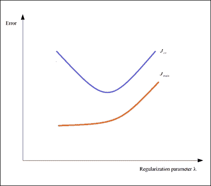

因此，如图所示，我们也可以通过改变正则化参数来最小化模型中的训练和交叉验证错误。如果模型在这两个错误值上都有高值，我们必须考虑降低正则化参数的值，直到对于提供的样本数据，这两个错误值都显著降低。

# 理解学习曲线

另一种可视化机器学习模型性能的有用方法是使用学习曲线。**学习曲线**本质上是在模型训练和交叉验证的样本数量上绘制错误值的图表。例如，一个模型可能具有以下训练和交叉验证错误的学习曲线：

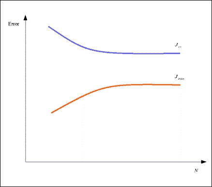

学习曲线可以用来诊断欠拟合和过拟合模型。例如，训练误差可能会观察到随着提供给模型的样本数量的增加而迅速增加，并收敛到一个接近交叉验证的值。此外，我们模型中的误差值也有显著的高值。表现出这种误差随样本数量变化的变异性模型是欠拟合的，其学习曲线类似于以下图表：

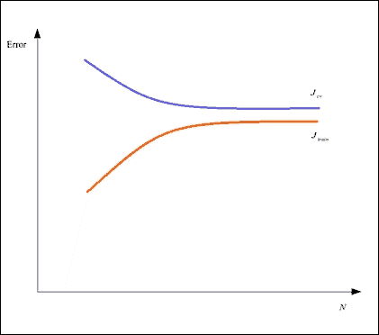

另一方面，模型的训练误差可能会随着提供给模型的样本数量的增加而缓慢增加，并且模型中训练误差和交叉验证误差之间可能存在很大的差异。这种模型被称为过拟合，其学习曲线类似于以下图表：

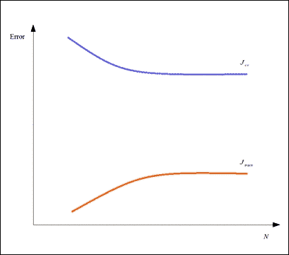

因此，学习曲线是确定给定机器学习模型中哪些地方不起作用以及需要改变的好辅助工具。

# 改进模型

一旦我们确定了模型在给定的样本数据上是欠拟合还是过拟合，我们必须决定如何改进模型对独立变量和因变量之间关系的理解。以下简要讨论几种这些技术：

+   添加或删除一些功能。正如我们稍后将要探讨的，这种技术可以用来改善欠拟合和过拟合的模型。

+   调整正则化参数的值 。像添加或删除特征一样，这种方法可以应用于欠拟合和过拟合的模型。

+   收集更多的训练数据。这种方法是改善过拟合模型的一个相当明显的解决方案，因为它需要制定一个更通用的模型来拟合训练数据。

+   添加模型中其他特征的多项式项作为特征。这种方法可以用来改善欠拟合模型。例如，如果我们正在模拟两个独立的特征变量，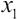和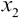，我们可以添加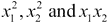作为额外的特征来改善模型。多项式项可以是更高的次数，例如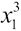和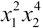，尽管这可能会导致训练数据过拟合。

# 使用交叉验证

如我们之前简要提到的，交叉验证是一种常见的验证技术，可以用来评估机器学习模型。交叉验证本质上衡量的是估计模型将如何泛化一些给定数据。这些数据与提供给我们的模型训练数据不同，被称为模型的**交叉验证集**，或简单地称为**验证集**。给定模型的交叉验证也称为**旋转估计**。

如果估计模型在交叉验证期间表现良好，我们可以假设该模型可以理解其各种独立和依赖变量之间的关系。交叉验证的目的是提供一个测试，以确定所提出的模型是否在训练数据上过度拟合。从实施的角度来看，交叉验证是机器学习系统的一种单元测试。

单轮交叉验证通常涉及将所有可用的样本数据划分为两个子集，然后在其中一个子集上进行训练，在另一个子集上进行验证和/或测试。必须使用不同的数据集进行多个这样的交叉验证轮次，或称为“折”，以减少给定模型的整体交叉验证误差的方差。任何特定的交叉验证误差度量都应该计算为不同折在交叉验证中的平均误差。

对于给定的机器学习模型或系统，我们可以实现多种类型的交叉验证作为诊断。以下简要探讨其中几种：

+   一种常见类型是*k-折交叉验证*，其中我们将交叉验证数据划分为*k*个相等的子集。然后，在数据的一个子集上执行模型的训练，在另一个子集上进行交叉验证。

+   *k-折交叉验证*的一种简单变体是*2-折交叉验证*，也称为*留出法*。在*2-折交叉验证中，训练和交叉验证数据子集的比例几乎相等。

+   **重复随机子采样**是交叉验证的另一种简单变体，其中首先对样本数据进行随机化或洗牌，然后将其用作训练和交叉验证数据。这种方法特别不依赖于交叉验证中使用的折数。

+   *k-折交叉验证*的另一种形式是**留一法交叉验证*，其中仅使用可用样本数据中的一个记录进行交叉验证。留一法交叉验证本质上等同于*k-折交叉验证*，其中*k*等于样本数据中的样本或观察数量。

交叉验证基本上将估计模型视为一个黑盒，即它不对模型的实现做出任何假设。我们还可以使用交叉验证来通过确定在给定样本数据上产生最佳拟合模型的特征集来选择给定模型中的特征。当然，分类有一些局限性，可以总结如下：

+   如果需要给定的模型进行内部特征选择，我们必须对给定模型中每个选定的特征集进行交叉验证。这可能会根据可用样本数据的数量而变得计算成本高昂。

+   如果样本数据恰好或几乎完全相等，交叉验证就不是很有效。

总结来说，对于任何我们构建的机器学习系统，实现交叉验证都是一个好的实践。此外，我们可以根据我们试图建模的问题以及收集到的样本数据的性质来选择合适的交叉验证技术。

### 注意

对于接下来的示例，命名空间声明应类似于以下声明：

```py
(ns my-namespace
  (:use [clj-ml classifiers data]))
```

我们可以使用 `clj-ml` 库来交叉验证我们在第三章，*分类数据*中为鱼包装厂构建的分类器。本质上，我们使用 `clj-ml` 库构建了一个分类器，用于确定一条鱼是鲑鱼还是海鲈鱼。为了回顾，一条鱼被表示为一个包含鱼类别和鱼的各种特征的值的向量。鱼的属性是它的长度、宽度和皮肤的光泽。我们还描述了一个样本鱼的模板，其定义如下：

```py
(def fish-template
  [{:category [:salmon :sea-bass]}
   :length :width :lightness])
```

在前面的代码中定义的 `fish-template` 向量可以用来使用一些样本数据训练一个分类器。现在，我们暂时不必担心我们使用了哪种分类算法来建模给定的训练数据。我们只能假设这个分类器是使用 `clj-ml` 库中的 `make-classifier` 函数创建的。这个分类器存储在 `*classifier*` 变量中，如下所示：

```py
(def *classifier* (make-classifier ...))
```

假设分类器已经使用一些样本数据进行训练。我们现在必须评估这个训练好的分类模型。为此，我们必须首先创建一些用于交叉验证的样本数据。为了简化，在这个例子中我们将使用随机生成的数据。我们可以使用我们定义在第三章，*分类数据*中的 `make-sample-fish` 函数来生成这些数据。这个函数简单地创建一个包含一些随机值的新的向量，代表一条鱼。当然，我们不应该忘记 `make-sample-fish` 函数有一个内置的偏置，因此我们使用这个函数创建的多个样本中创建一个有意义的模式，如下所示：

```py
(def fish-cv-data
  (for [i (range 3000)] (make-sample-fish)))
```

我们需要使用来自 `clj-ml` 库的数据集，并且我们可以使用 `make-dataset` 函数来创建一个，如下面的代码所示：

```py
(def fish-cv-dataset
  (make-dataset "fish-cv" fish-template fish-cv-data))
```

为了交叉验证分类器，我们必须使用来自 `clj-ml.classifiers` 命名空间的 `classifier-evaluate` 函数。这个函数本质上在给定数据上执行 *k-fold* 交叉验证。除了分类器和交叉验证数据集之外，这个函数还需要指定作为最后一个参数的数据的折数。此外，我们首先需要使用 `dataset-set-class` 函数设置 `fish-cv-dataset` 记录的类字段。我们可以定义一个单独的函数来执行这些操作，如下所示：

```py
(defn cv-classifier [folds]
  (dataset-set-class fish-cv-dataset 0)
  (classifier-evaluate *classifier* :cross-validation
                       fish-cv-dataset folds))
```

我们将在分类器上使用 10 折交叉验证。由于`classifier-evaluate`函数返回一个映射，我们将此返回值绑定到一个变量以供进一步使用，如下所示：

```py
user> (def cv (cv-classifier 10))
#'user/cv
```

我们可以使用`:summary`关键字获取并打印前面交叉验证的摘要，如下所示：

```py
user> (print (:summary cv))

Correctly Classified Instances        2986              99.5333 %
Incorrectly Classified Instances        14               0.4667 %
Kappa statistic                          0.9888
Mean absolute error                      0.0093
Root mean squared error                  0.0681
Relative absolute error                  2.2248 %
Root relative squared error             14.9238 %
Total Number of Instances             3000     
nil
```

如前述代码所示，我们可以查看我们训练好的分类器的多个性能统计指标。除了正确和错误分类的记录外，此摘要还描述了分类器中的**均方根误差**（**RMSE**）和其他几个误差度量。为了更详细地查看分类器中正确和错误分类的实例，我们可以使用`:confusion-matrix`关键字打印交叉验证的混淆矩阵，如下所示：

```py
user> (print (:confusion-matrix cv))
=== Confusion Matrix ===

    a    b   <-- classified as
 2129    0 |    a = salmon
    9  862 |    b = sea-bass
nil
```

如前例所示，我们可以使用`clj-ml`库的`classifier-evaluate`函数对任何给定的分类器执行*k*折交叉验证。尽管在使用`classifier-evaluate`函数时我们被限制只能使用`clj-ml`库中的分类器，但我们必须努力在我们构建的任何机器学习系统中实现类似的诊断。

# 构建垃圾邮件分类器

现在我们已经熟悉了交叉验证，我们将构建一个包含交叉验证的工作机器学习系统。当前的问题将是**垃圾邮件分类**，其中我们必须确定一封给定邮件是否为垃圾邮件的可能性。本质上，这个问题归结为二元分类，并做了一些调整以使机器学习系统对垃圾邮件更加敏感（更多信息，请参阅*垃圾邮件计划*）。请注意，我们不会实现一个与电子邮件服务器集成的分类引擎，而是将专注于使用一些数据训练引擎和分类给定邮件的方面。

这种在实际中的使用方法可以简要说明如下。用户将接收并阅读一封新邮件，并决定是否将该邮件标记为垃圾邮件。根据用户的决定，我们必须使用新邮件作为数据来训练邮件服务的垃圾邮件引擎。

为了以更自动化的方式训练我们的垃圾邮件分类器，我们只需简单地收集数据以供分类器使用。我们需要大量的数据才能有效地用英语训练一个分类器。幸运的是，垃圾邮件分类的样本数据在互联网上很容易找到。对于这个实现，我们将使用来自**Apache SpamAssassin**项目的数据。

### 备注

Apache SpamAssassin 项目是一个用 Perl 实现的垃圾邮件分类引擎的开源实现。对于我们的实现，我们将使用该项目中的样本数据。您可以从 [`spamassassin.apache.org/publiccorpus/`](http://spamassassin.apache.org/publiccorpus/) 下载这些数据。在我们的示例中，我们使用了 `spam_2` 和 `easy_ham_2` 数据集。一个容纳我们的垃圾邮件分类器实现的 Clojure Leiningen 项目将要求这些数据集被提取并放置在 `corpus/` 文件夹的 `ham/` 和 `spam/` 子目录中。`corpus/` 文件夹应放置在 Leiningen 项目的根目录中，与 `project.clj` 文件相同的文件夹。

我们垃圾邮件分类器的特征将是所有之前遇到的单词在垃圾邮件和正常邮件中的出现次数。术语 **ham** 指的是“非垃圾邮件”。因此，在我们的模型中实际上有两个独立的变量。此外，每个单词都有一个与电子邮件中出现的概率相关联，这可以通过它在垃圾邮件和正常邮件中出现的次数以及分类器处理的电子邮件总数来计算。新电子邮件将通过找到电子邮件标题和正文中所有已知单词，然后以某种方式结合这些单词在垃圾邮件和正常邮件中的出现概率来进行分类。

对于我们分类器中的给定单词特征，我们必须通过考虑分类器分析的电子邮件总数来计算单词出现的总概率（更多信息，请参阅 *更好的贝叶斯过滤*）。此外，一个未见过的术语在意义上是中性的，即它既不是垃圾邮件也不是正常邮件。因此，未经训练的分类器中任何单词出现的初始概率是 0.5。因此，我们使用 **贝叶斯概率** 函数来模拟特定单词的出现。

为了分类新电子邮件，我们还需要结合其中找到的所有已知单词的出现概率。对于这个实现，我们将使用 **费舍尔方法**，或 **费舍尔组合概率测试**，来结合计算出的概率。尽管这个测试的数学证明超出了本书的范围，但重要的是要知道这种方法本质上是在给定模型中将几个独立概率估计为 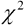（发音为 **卡方**）分布（更多信息，请参阅 *研究工作者统计方法*）。这种分布有一个相关的自由度数。可以证明，具有等于组合概率数 *k* 两次的自由度的  分布可以正式表示如下：

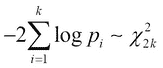

这意味着使用具有自由度的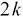分布，电子邮件是垃圾邮件或正常邮件的概率的**累积分布函数**（**CDF**）可以结合起来反映一个总概率，当有大量值接近 1.0 的概率时，这个总概率会很高。因此，只有当电子邮件中的大多数单词之前都曾在垃圾邮件中找到时，电子邮件才会被分类为垃圾邮件。同样，大量正常邮件的关键词也会表明该电子邮件实际上是一封正常邮件。另一方面，电子邮件中垃圾邮件关键词出现的次数较少时，其概率会更接近 0.5，在这种情况下，分类器将不确定该电子邮件是垃圾邮件还是正常邮件。

### 注意

对于接下来的示例，我们需要从`clojure.java.io`和`Incanter`库中分别获取`file`和`cdf-chisq`函数。示例的命名空间声明应类似于以下声明：

```py
(ns my-namespace
  (:use [clojure.java.io :only [file]]
        [incanter.stats :only [cdf-chisq]])
```

使用前面描述的 Fisher 方法训练的分类器将非常敏感于新的垃圾邮件。我们用给定电子邮件是垃圾邮件的概率来表示我们模型的因变量。这个概率也被称为电子邮件的**垃圾邮件分数**。低分数表示电子邮件是正常邮件，而高分数表示电子邮件是垃圾邮件。当然，我们还需要在我们的模型中包含一个第三类来表示未知值。我们可以为这些类别的分数定义一些合理的限制，如下所示：

```py
(def min-spam-score 0.7)
(def max-ham-score 0.4)

(defn classify-score [score]
  [(cond
    (<= score max-ham-score) :ham
    (>= score min-spam-score) :spam
    :else :unsure)
   score])
```

如前所述，如果电子邮件的分数为 0.7 或更高，则它是垃圾邮件。分数为 0.5 或更低的电子邮件表示它是正常邮件。此外，如果分数介于这两个值之间，我们无法有效地决定电子邮件是垃圾邮件还是正常邮件。我们使用关键词`:ham`、`:spam`和`:unsure`来表示这三个类别。

垃圾邮件分类器必须读取几封电子邮件，确定电子邮件文本和标题中的所有单词或*标记*，并将这些信息作为经验知识存储起来以供以后使用。我们需要存储特定单词在垃圾邮件和正常邮件中出现的次数。因此，分类器遇到的每个单词都代表一个特征。为了表示单个单词的信息，我们将使用具有三个字段的记录，如下面的代码所示：

```py
(defrecord TokenFeature [token spam ham])

(defn new-token [token]
  (TokenFeature. token 0 0))

(defn inc-count [token-feature type]
  (update-in token-feature [type] inc))
```

在前面的代码中定义的 `TokenFeature` 记录可以用来存储我们垃圾邮件分类器所需的信息。`new-token` 函数简单地通过调用记录构造函数为给定标记创建一个新的记录。显然，一个单词在垃圾邮件和非垃圾邮件中最初都被看到零次。我们还需要更新这些值，因此我们定义了 `inc-count` 函数来使用 `update-in` 函数对记录进行更新。请注意，`update-in` 函数期望一个函数作为最后一个参数应用于记录中的特定字段。我们已经在实现中处理了一小部分可变状态，因此让我们通过代理来委托对这个状态的访问。我们还想跟踪垃圾邮件和非垃圾邮件的总数；因此，我们将这些值也用代理包装起来，如下面的代码所示：

```py
(def feature-db
  (agent {} :error-handler #(println "Error: " %2)))

(def total-ham (agent 0))
(def total-spam (agent 0))
```

在前面的代码中定义的 `feature-db` 代理将用于存储所有单词特征。我们使用 `:error-handler` 关键字参数为这个代理定义了一个简单的错误处理器。代理的 `total-ham` 和 `total-spam` 函数将分别跟踪垃圾邮件和非垃圾邮件的总数。现在，我们将定义几个函数来访问这些代理，如下所示：

```py
(defn clear-db []
  (send feature-db (constantly {}))
  (send total-ham  (constantly 0))
  (send total-spam (constantly 0)))

(defn update-feature!
  "Looks up a TokenFeature record in the database and
  creates it if it doesn't exist, or updates it."
  [token f & args]
  (send feature-db update-in [token]
        #(apply f (if %1 %1 (new-token token))
                args)))
```

如果你对 Clojure 中的代理不熟悉，我们可以使用 `send` 函数来改变代理中包含的值。这个函数期望一个参数，即应用于其封装值的函数。代理在其包含的值上应用这个函数，如果没有错误，则更新它。`clear-db` 函数简单地使用初始值初始化我们定义的所有代理。这是通过使用 `constantly` 函数来完成的，该函数将一个值包装在一个返回相同值的函数中。`update-feature!` 函数修改 `feature-db` 映射中给定标记的值，并在提供的标记不在 `feature-db` 映射中时创建一个新的标记。由于我们只将增加给定标记的出现次数，因此我们将 `inc-count` 函数作为参数传递给 `update-feature!` 函数。

现在，让我们定义分类器如何从给定的电子邮件中提取单词。我们将使用正则表达式来完成这项工作。如果我们想从给定的字符串中提取所有单词，我们可以使用正则表达式 `[a-zA-Z]{3,}`。我们可以在 Clojure 中使用字面量语法来定义这个正则表达式，如下面的代码所示。请注意，我们也可以使用 `re-pattern` 函数来创建正则表达式。我们还将定义所有应该从中提取标记的 MIME 头字段。我们将使用以下代码来完成所有这些：

```py
(def token-regex #"[a-zA-Z]{3,}")

(def header-fields
  ["To:"
   "From:"
   "Subject:"
   "Return-Path:"])
```

为了匹配与 `token-regex` 定义的正则表达式相匹配的标记，我们将使用 `re-seq` 函数，该函数返回给定字符串中所有匹配标记的字符串序列。对于电子邮件的 MIME 头部，我们需要使用不同的正则表达式来提取标记。例如，我们可以按照以下方式从 `"From"` MIME 头部提取标记：

```py
user> (re-seq #"From:(.*)\n"
              "From: someone@host.org\n")
(["From: someone@host.org\n" " someone@host.org"])
```

### 注意

注意正则表达式末尾的换行符，它用于指示电子邮件中 MIME 头部的结束。

我们可以继续提取由前述代码中定义的正则表达式匹配得到的值中的单词。让我们定义以下几个函数，使用这种逻辑从给定电子邮件的头和正文中提取标记：

```py
(defn header-token-regex [f]
  (re-pattern (str f "(.*)\n")))

(defn extract-tokens-from-headers [text]
  (for [field header-fields]
    (map #(str field %1)  ; prepends field to each word from line
         (mapcat (fn [x] (->> x second (re-seq token-regex)))
                 (re-seq (header-token-regex field)
                         text)))))

(defn extract-tokens [text]
  (apply concat
         (re-seq token-regex text)
         (extract-tokens-from-headers text)))
```

在前述代码中定义的 `header-token-regex` 函数返回一个用于给定头部的正则表达式，例如 `"From:(.*)\n"` 用于 `"From"` 头部。`extract-tokens-from-headers` 函数使用这个正则表达式来确定电子邮件各种头部字段中的所有单词，并将头部名称附加到头部文本中找到的所有标记上。`extract-tokens` 函数将正则表达式应用于电子邮件的文本和头部，然后使用 `apply` 和 `concat` 函数将结果列表展平成一个单一的列表。注意，`extract-tokens-from-headers` 函数对于在 `header-fields` 中定义但不在提供的电子邮件头部中出现的头部返回空列表。让我们通过以下代码在 REPL 中尝试这个函数：

```py
user> (def sample-text
        "From: 12a1mailbot1@web.de
         Return-Path: <12a1mailbot1@web.de>
         MIME-Version: 1.0")

user> (extract-tokens-from-headers sample-text)
(() ("From:mailbot" "From:web")
 () ("Return-Path:mailbot" "Return-Path:web"))
```

使用 `extract-tokens-from-headers` 函数和 `token-regex` 定义的正则表达式，我们可以从电子邮件的头和文本中提取所有由三个或更多字符组成的单词。现在，让我们定义一个函数，将 `extract-tokens` 函数应用于给定的电子邮件，并使用 `update-feature!` 函数更新特征映射，其中包括电子邮件中找到的所有单词。我们将借助以下代码来完成所有这些工作：

```py
(defn update-features!
  "Updates or creates a TokenFeature in database
  for each token in text."
  [text f & args]
  (doseq [token (extract-tokens text)]
    (apply update-feature! token f args)))
```

使用前述代码中的 `update-features!` 函数，我们可以使用给定的电子邮件来训练我们的垃圾邮件分类器。为了跟踪垃圾邮件和正常邮件的总数，我们必须根据给定的电子邮件是垃圾邮件还是正常邮件，将 `inc` 函数发送到 `total-spam` 或 `total-ham` 代理。我们将借助以下代码来完成这项工作：

```py
(defn inc-total-count! [type]
  (send (case type
          :spam total-spam
          :ham total-ham)
        inc))

(defn train! [text type]
  (update-features! text inc-count type)
  (inc-total-count! type))
```

在前一段代码中定义的 `inc-total-count!` 函数更新了我们特征数据库中垃圾邮件和正常邮件的总数。`train!` 函数简单地调用 `update-features!` 和 `inc-total-count!` 函数，使用给定的邮件及其类型来训练我们的垃圾邮件分类器。注意，我们将 `inc-count` 函数传递给 `update-features!` 函数。现在，为了将新邮件分类为垃圾邮件或正常邮件，我们首先必须定义如何使用我们的训练特征数据库从给定的邮件中提取已知特征。我们将借助以下代码来完成这项工作：

```py
(defn extract-features
  "Extracts all known tokens from text"
  [text]
  (keep identity (map #(@feature-db %1) (extract-tokens text))))
```

在前面的代码中定义的`extract-features`函数通过解除引用存储在`feature-db`中的映射，并将其作为函数应用于`extract-tokens`函数返回的所有值来查找给定电子邮件中的所有已知特征。由于映射闭包`#(@feature-db %1)`可以为不在`feature-db`代理中的所有标记返回`()`或`nil`，因此我们需要从提取的特征列表中删除所有空值。为此，我们将使用`keep`函数，该函数期望一个应用于集合中非 nil 值的函数以及从其中过滤出所有 nil 值的集合。由于我们不想转换电子邮件中的已知特征，我们将传递`identity`函数，该函数将返回其参数本身作为`keep`函数的第一个参数。

现在我们已经从一个给定的电子邮件中提取了所有已知特征，我们必须计算这些特征在垃圾邮件中出现的所有概率。然后，我们必须使用我们之前描述的费舍尔方法将这些概率结合起来，以确定新电子邮件的垃圾邮件分数。让我们定义以下函数来实现贝叶斯概率和费舍尔方法：

```py
(defn spam-probability [feature]
  (let [s (/ (:spam feature) (max 1 @total-spam))
        h (/ (:ham feature) (max 1 @total-ham))]
      (/ s (+ s h))))

(defn bayesian-spam-probability
  "Calculates probability a feature is spam on a prior
  probability assumed-probability for each feature,
  and weight is the weight to be given to the prior
  assumed (i.e. the number of data points)."
  [feature & {:keys [assumed-probability weight]
              :or   {assumed-probability 1/2 weight 1}}]
  (let [basic-prob (spam-probability feature)
        total-count (+ (:spam feature) (:ham feature))]
    (/ (+ (* weight assumed-probability)
          (* total-count basic-prob))
       (+ weight total-count))))
```

在前面的代码中定义的`spam-probability`函数使用垃圾邮件和非垃圾邮件中单词出现的次数以及分类器处理的垃圾邮件和非垃圾邮件的总数来计算给定单词特征在垃圾邮件中出现的概率。为了避免除以零错误，我们在执行除法之前确保垃圾邮件和非垃圾邮件的数量至少为 1。`bayesian-spam-probability`函数使用`spam-probability`函数返回的这个概率来计算一个加权平均值，初始概率为 0.5 或*1/2*。

我们现在将实现费舍尔方法，该方法用于结合由`bayesian-spam-probability`函数返回的所有已知特征的概率。我们将借助以下代码来完成这项工作：

```py
(defn fisher
  "Combines several probabilities with Fisher's method."
  [probs]
  (- 1 (cdf-chisq
         (* -2 (reduce + (map #(Math/log %1) probs)))
         :df (* 2 (count probs)))))
```

在前面的代码中定义的`fisher`函数使用`Incanter`库中的`cdf-chisq`函数来计算由表达式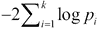转换的几个概率的 CDF。我们使用`:df`可选参数指定此函数的自由度。我们现在需要将`fisher`函数应用于电子邮件是垃圾邮件或非垃圾邮件的贝叶斯概率组合，并将这些值组合成一个最终的垃圾邮件分数。这两个概率必须结合，使得只有高概率的高频次出现才表明垃圾邮件或非垃圾邮件的可能性很高。已经证明，这样做最简单的方法是平均垃圾邮件的概率和垃圾邮件的负概率（或 1 减去垃圾邮件的概率）。我们将借助以下代码来完成这项工作：

```py
(defn score [features]
  (let [spam-probs (map bayesian-spam-probability features)
        ham-probs (map #(- 1 %1) spam-probs)
        h (- 1 (fisher spam-probs))
        s (- 1 (fisher ham-probs))]
     (/ (+ (- 1 h) s) 2)))
```

因此，`score` 函数将返回给定电子邮件的最终垃圾邮件分数。让我们定义一个函数来从给定的电子邮件中提取已知单词特征，将这些特征的出现的概率结合起来产生电子邮件的垃圾邮件分数，并最终将这个垃圾邮件分数分类为正常邮件或垃圾邮件，分别用关键词 `:ham` 和 `:spam` 表示，如下面的代码所示：

```py
(defn classify
  "Returns a vector of the form [classification score]"
  [text]
   (-> text
       extract-features
       score
       classify-score))
```

到目前为止，我们已经实现了如何训练我们的垃圾邮件分类器以及如何使用它来分类一封新的电子邮件。现在，让我们定义一些函数来从项目的 `corpus/` 文件夹中加载样本数据，并使用这些数据来训练和交叉验证我们的分类器，如下所示：

```py
(defn populate-emails
  "Returns a sequence of vectors of the form [filename type]"
  []
  (letfn [(get-email-files [type]
            (map (fn [f] [(.toString f) (keyword type)])
                 (rest (file-seq (file (str "corpus/" type))))))]
    (mapcat get-email-files ["ham" "spam"])))
```

在前面的代码中定义的 `populate-emails` 函数返回一个向量序列，代表我们样本数据中来自 `ham/` 文件夹的所有正常邮件和来自 `spam/` 文件夹的所有垃圾邮件。这个返回序列中的每个向量都有两个元素。这个向量中的第一个元素是给定电子邮件的相对文件路径，第二个元素是 `:spam` 或 `:ham`，这取决于电子邮件是否为垃圾邮件。请注意，使用 `file-seq` 函数将目录中的文件作为序列读取。

现在，我们将使用 `train!` 函数将所有电子邮件的内容输入到我们的垃圾邮件分类器中。为此，我们可以使用 `slurp` 函数将文件内容读取为字符串。对于交叉验证，我们将使用 `classify` 函数对提供的交叉验证数据中的每封电子邮件进行分类，并返回一个表示交叉验证测试结果的映射列表。我们将通过以下代码来完成这项工作：

```py
(defn train-from-corpus! [corpus]
  (doseq [v corpus]
    (let [[filename type] v]
      (train! (slurp filename) type))))

(defn cv-from-corpus [corpus]
  (for [v corpus]
    (let [[filename type] v
          [classification score] (classify (slurp filename))]
      {:filename filename
       :type type
       :classification classification
       :score score})))
```

在前面的代码中定义的 `train-from-corpus!` 函数将使用 `corpus/` 文件夹中找到的所有电子邮件来训练我们的垃圾邮件分类器。`cv-from-corpus` 函数使用训练好的分类器将提供的电子邮件分类为垃圾邮件或正常邮件，并返回一个表示交叉验证过程结果的映射序列。`cv-from-corpus` 函数返回的序列中的每个映射包含电子邮件的文件、电子邮件的实际类型（垃圾邮件或正常邮件）、电子邮件的预测类型和电子邮件的垃圾邮件分数。现在，我们需要在样本数据的两个适当划分的子集上调用这两个函数，如下所示：

```py
(defn test-classifier! [corpus cv-fraction]
  "Trains and cross-validates the classifier with the sample
  data in corpus, using cv-fraction for cross-validation.
  Returns a sequence of maps representing the results
  of the cross-validation."
    (clear-db)
    (let [shuffled (shuffle corpus)
          size (count corpus)
          training-num (* size (- 1 cv-fraction))
          training-set (take training-num shuffled)
          cv-set (nthrest shuffled training-num)]
      (train-from-corpus! training-set)
      (await feature-db)
      (cv-from-corpus cv-set)))
```

在前面的代码中定义的 `test-classifier!` 函数将随机打乱样本数据，并选择指定比例的随机数据作为我们的分类器的交叉验证集。然后，`test-classifier!` 函数调用 `train-from-corpus!` 和 `cv-from-corpus` 函数来训练和交叉验证数据。请注意，使用 `await` 函数是为了等待 `feature-db` 代理完成通过 `send` 函数发送给它的所有函数的应用。

现在我们需要分析交叉验证的结果。我们必须首先确定由 `cv-from-corpus` 函数返回的给定电子邮件的实际和预期类别中的错误分类和遗漏的电子邮件数量。我们将使用以下代码来完成这项工作：

```py
(defn result-type [{:keys [filename type classification score]}]
  (case type
    :ham  (case classification
            :ham :correct
            :spam :false-positive
            :unsure :missed-ham)
    :spam (case classification
            :spam :correct
            :ham :false-negative
            :unsure :missed-spam)))
```

`result-type` 函数将确定交叉验证过程中错误分类和遗漏的电子邮件数量。现在，我们可以将 `result-type` 函数应用于 `cv-from-corpus` 函数返回的结果中的所有映射，并使用以下代码帮助打印交叉验证结果的摘要：

```py
(defn analyze-results [results]
  (reduce (fn [map result]
            (let [type (result-type result)]
              (update-in map [type] inc)))
          {:total (count results) :correct 0 :false-positive 0
           :false-negative 0 :missed-ham 0 :missed-spam 0}
          results))

(defn print-result [result]
  (let [total (:total result)]
    (doseq [[key num] result]
      (printf "%15s : %-6d%6.2f %%%n"
              (name key) num (float (* 100 (/ num total)))))))
```

在前面的代码中定义的 `analyze-results` 函数简单地将 `result-type` 函数应用于 `cv-from-corpus` 函数返回的序列中的所有映射值，同时保持错误分类和遗漏的电子邮件总数。`print-result` 函数简单地将分析结果打印为字符串。最后，让我们定义一个函数，使用 `populate-emails` 函数加载所有电子邮件，然后使用这些数据来训练和交叉验证我们的垃圾邮件分类器。由于 `populate-emails` 函数在没有电子邮件时将返回一个空列表或 `nil`，我们将检查这个条件以避免在程序后续阶段失败：

```py
(defn train-and-cv-classifier [cv-frac]
  (if-let [emails (seq (populate-emails))]
    (-> emails
        (test-classifier! cv-frac)
        analyze-results
        print-result)
    (throw (Error. "No mails found!"))))
```

在前面代码中显示的 `train-and-cv-classifier` 函数中，我们首先调用 `populate-emails` 函数，并使用 `seq` 函数将结果转换为序列。如果序列有任何元素，我们训练并交叉验证分类器。如果没有找到电子邮件，我们简单地抛出一个错误。请注意，`if-let` 函数用于检查 `seq` 函数返回的序列是否有任何元素。

我们已经拥有了创建和训练垃圾邮件分类器所需的所有部分。最初，由于分类器尚未看到任何电子邮件，任何电子邮件或文本被分类为垃圾邮件的概率是 0.5。这可以通过以下代码验证，该代码最初将任何文本分类为 `:unsure` 类型：

```py
user> (classify "Make money fast")
[:unsure 0.5]
user> (classify "Job interview today! Programmer job position for GNU project")
[:unsure 0.5]
```

我们现在使用 `train-and-cv-classifier` 函数训练分类器并交叉验证它。我们将使用所有可用样本数据的一分之一作为我们的交叉验证集。这如下面的代码所示：

```py
user> (train-and-cv-classifier 1/5)
          total : 600   100.00 %
        correct : 585    97.50 %
 false-positive : 1       0.17 %
 false-negative : 1       0.17 %
     missed-ham : 9       1.50 %
    missed-spam : 4       0.67 %
nil
```

交叉验证我们的垃圾邮件分类器断言它适当地分类了电子邮件。当然，仍然存在一小部分错误，这可以通过使用更多的训练数据来纠正。现在，让我们尝试使用我们的训练好的垃圾邮件分类器对一些文本进行分类，如下所示：

```py
user> (classify "Make money fast")
[:spam 0.9720416490829515]
user> (classify "Job interview today! Programmer job position for GNU project")
[:ham 0.19095646757667556]
```

有趣的是，文本`"Make money fast"`被归类为垃圾邮件，而文本“Job interview … GNU project”被归类为正常邮件，如前面的代码所示。让我们看看训练好的分类器是如何使用`extract-features`函数从某些文本中提取特征的。由于分类器最初没有读取任何标记，因此当分类器未训练时，此函数显然会返回一个空列表或`nil`，如下所示：

```py
user> (extract-features "some text to extract")
(#clj_ml5.spam.TokenFeature{:token "some", :spam 91, :ham 837}
 #clj_ml5.spam.TokenFeature{:token "text", :spam 907, :ham 1975}
 #clj_ml5.spam.TokenFeature{:token "extract", :spam 3, :ham 5})
```

如前面的代码所示，每个`TokenFeature`记录将包含给定单词在垃圾邮件和正常邮件中出现的次数。此外，单词`"to"`不被识别为特征，因为我们只考虑由三个或更多字符组成的单词。

现在，让我们检查我们的垃圾邮件分类器对垃圾邮件的敏感性。我们首先需要选择一些文本或特定的术语，这些文本或术语既不被归类为垃圾邮件，也不被归类为正常邮件。对于本例中选定的训练数据，单词`"Job"`符合这一要求，如下面的代码所示。让我们使用`train!`函数用单词`"Job"`训练分类器，同时指定文本类型为正常邮件。我们可以这样做，如下所示：

```py
user> (classify "Job")
[:unsure 0.6871002132196162]
user> (train! "Job" :ham)
#<Agent@1f7817e: 1993>
user> (classify "Job")
[:unsure 0.6592140921409213]
```

在用给定的文本作为正常邮件训练分类器后，观察到该术语被归类为垃圾邮件的概率略有下降。如果术语`"Job"`出现在更多正常邮件中，分类器最终会将该单词归类为正常邮件。因此，分类器对新的正常邮件的反应并不明显。相反，如以下代码所示，分类器对垃圾邮件的敏感性很高：

```py
user> (train! "Job" :spam)
#<Agent@1f7817e: 1994>
user> (classify "Job")
[:spam 0.7445135045480734]
```

在单个垃圾邮件中观察到特定单词的出现会显著增加分类器预测该术语属于垃圾邮件的概率。术语`"Job"`随后将被我们的分类器归类为垃圾邮件，至少直到它在足够多的正常邮件中出现。这是由于我们正在建模的卡方分布的性质。

我们还可以通过向分类器提供更多训练数据来提高我们垃圾邮件分类器的整体错误率。为了演示这一点，让我们只用样本数据中的一分之一来交叉验证分类器。因此，分类器将实际上用可用的九分之八的数据进行训练，如下所示：

```py
user> (train-and-cv-classifier 1/10)
          total : 300   100.00 %
        correct : 294    98.00 %
 false-positive : 0       0.00 %
 false-negative : 1       0.33 %
     missed-ham : 3       1.00 %
    missed-spam : 2       0.67 %
nil
```

如前面的代码所示，当我们使用更多训练数据时，漏检和错误分类的邮件数量有所减少。当然，这只是一个示例，我们应收集更多邮件作为训练数据输入到分类器中。使用样本数据的一部分进行交叉验证是一种良好的实践。

总结来说，我们有效地构建了一个使用费舍尔方法训练的垃圾邮件分类器。我们还实现了一个交叉验证诊断，这相当于对我们分类器的一种单元测试。

### 注意

注意，`train-and-cv-classifier`函数产生的确切值将取决于用作训练数据的垃圾邮件和正常邮件。

# 摘要

在本章中，我们探讨了可以用来诊断和改进给定机器学习模型的技巧。以下是我们已经涵盖的一些其他要点：

+   我们重新审视了样本数据欠拟合和过拟合的问题，并讨论了如何评估一个已制定模型以诊断它是否欠拟合或过拟合。

+   我们已经探讨了交叉验证及其如何被用来确定一个已制定模型对之前未见过的数据的响应效果。我们还看到，我们可以使用交叉验证来选择模型的特征和正则化参数。我们还研究了几种可以针对给定模型实现的交叉验证方法。

+   我们简要探讨了学习曲线及其如何被用来诊断欠拟合和过拟合模型。

+   我们已经探讨了`clj-ml`库提供的工具，用于对给定分类器进行交叉验证。

+   最后，我们构建了一个操作性的垃圾邮件分类器，该分类器结合交叉验证来确定分类器是否适当地将电子邮件分类为垃圾邮件。

在接下来的章节中，我们将继续探索更多的机器学习模型，并且我们还将详细研究**支持向量机**（**SVMs**）。
