# 第二章：垃圾邮件过滤

在本章中，我们将开始使用我们在第一章“机器学习建模基础”中安装的两个包，即 Accord.NET for ML 和 Deedle for data manipulation，在 C#中构建真实的**机器学习**（**ML**）模型。在本章中，我们将构建一个用于垃圾邮件过滤的分类模型。我们将使用包含垃圾邮件和正常邮件（非垃圾邮件）的原始电子邮件数据集来训练我们的 ML 模型。我们将开始遵循上一章中讨论的 ML 模型开发步骤。这将帮助我们更好地理解 ML 建模的工作流程和方法，并使它们变得自然而然。在我们努力构建垃圾邮件分类模型的同时，我们还将讨论文本数据集的特征工程技术和分类模型的初步验证方法，并比较逻辑回归分类器和朴素贝叶斯分类器在垃圾邮件过滤中的应用。熟悉这些模型构建步骤、基本的文本特征工程技术和基本的分类模型验证方法将为使用**自然语言处理**（**NLP**）进行更高级的特征工程以及在第三章“Twitter 情感分析”中构建多类分类模型奠定基础。

在本章中，我们将涵盖以下主题：

+   垃圾邮件过滤项目的定义问题

+   数据准备

+   邮件数据分析

+   邮件数据特征工程

+   逻辑回归与朴素贝叶斯在垃圾邮件过滤中的应用

+   分类模型验证

# 垃圾邮件过滤项目的定义问题

让我们先定义一下本章将要解决的问题。你可能已经熟悉了垃圾邮件是什么；垃圾邮件过滤是像 Gmail、Yahoo Mail 和 Outlook 这样的电子邮件服务的基本功能。垃圾邮件可能会让用户感到烦恼，但它们带来了更多的问题和风险。例如，垃圾邮件可能被设计成索要信用卡号码或银行账户信息，这些信息可能被用于信用卡欺诈或洗钱。垃圾邮件也可能被用来获取个人信息，如社会保障号码或用户 ID 和密码，然后可以用来进行身份盗窃和其他各种犯罪。拥有垃圾邮件过滤技术是电子邮件服务保护用户免受此类犯罪侵害的关键步骤。然而，拥有正确的垃圾邮件过滤解决方案是困难的。你希望过滤掉可疑邮件，但同时，你又不希望过滤太多，以至于非垃圾邮件被放入垃圾邮件文件夹，用户永远不会查看。为了解决这个问题，我们将让我们的机器学习模型从原始电子邮件数据集中学习，并使用主题行将可疑邮件分类为垃圾邮件。我们将查看两个性能指标来衡量我们的成功：精确率和召回率。我们将在以下章节中详细讨论这些指标。

总结我们的问题定义：

+   问题是啥？我们需要一个垃圾邮件过滤解决方案，以防止我们的用户成为欺诈活动的受害者，同时提高用户体验。

+   为什么这是一个问题？在过滤可疑邮件和不过度过滤之间取得平衡，使得非垃圾邮件仍然进入收件箱，是困难的。我们将依赖机器学习模型来学习如何从统计上分类这类可疑邮件。

+   解决这个问题的方法有哪些？我们将构建一个分类模型，根据邮件的主题行标记潜在的垃圾邮件。我们将使用精确率和召回率作为平衡过滤邮件数量的方式。

+   成功的标准是什么？我们希望有高的召回率（实际垃圾邮件被检索的百分比与垃圾邮件总数的比例），同时不牺牲太多的精确率（被预测为垃圾邮件的正确分类垃圾邮件的百分比）。

# 数据准备

既然我们已经清楚地陈述并定义了我们打算使用机器学习解决的问题，我们就需要数据。没有数据，就没有机器学习。通常，在数据准备步骤之前，您需要额外的一步来收集和整理所需的数据，但在这本书中，我们将使用一个预先编译并标记的公开可用的数据集。在本章中，我们将使用 CSDMC2010 SPAM 语料库数据集（[`csmining.org/index.php/spam-email-datasets-.html`](http://csmining.org/index.php/spam-email-datasets-.html)）来训练和测试我们的模型。您可以点击链接并下载网页底部的压缩数据。当您下载并解压缩数据后，您将看到两个名为`TESTING`和`TRAINING`的文件夹，以及一个名为`SPAMTrain.label`的文本文件。`SPAMTrain.label`文件包含了`TRAINING`文件夹中每封电子邮件的编码标签——`0`代表垃圾邮件，`1`代表非垃圾邮件（非垃圾邮件）。我们将使用这个文本文件以及`TRAINING`文件夹中的电子邮件数据来构建垃圾邮件分类模型。

一旦您下载了数据并将其放置在可以从中加载的位置，您需要为未来的特征工程和模型构建步骤准备它。我们现在有一个包含多个包含有关单个电子邮件信息的 EML 文件和包含标记信息的文本文件的原始数据集。为了使这个原始数据集可用于使用电子邮件主题行构建垃圾邮件分类模型，我们需要执行以下任务：

1.  **从 EML 文件中提取主题行**：为准备我们的数据以供未来任务使用，第一步是从单个 EML 文件中提取主题和正文。我们将使用一个名为`EAGetMail`的包来加载和提取 EML 文件中的信息。您可以使用 Visual Studio 中的包管理器来安装此包。请查看代码的第 4 到 6 行以了解如何安装此包。使用`EAGetMail`包，您可以轻松地加载和提取 EML 文件的主题和正文内容（第 24-30 行）。一旦您从电子邮件中提取了主题和正文，您需要将每行数据作为一行追加到一个 Deedle 数据框中。请查看以下代码中的`ParseEmails`函数（从第 18 行开始），以了解如何创建一个 Deedle 数据框，其中每行包含每封电子邮件的索引号、主题行和正文内容。

1.  **将提取的数据与标签合并**：在从单个 EML 文件中提取主题和正文内容之后，我们还需要做一件事。我们需要将编码后的标签（0 表示垃圾邮件，1 表示正常邮件）映射到我们在上一步创建的 DataFrame 的每一行。如果您用任何文本编辑器打开`SPAMTrain.label`文件，您会看到编码的标签位于第一列，相应的电子邮件文件名位于第二列，由空格分隔。使用 Deedle 框架的`ReadCsv`函数，您可以通过指定空格作为分隔符轻松地将这些标签数据加载到 DataFrame 中（请参阅代码中的第 50 行）。一旦您将标记数据加载到 DataFrame 中，您只需使用 Deedle 框架的`AddColumn`函数将此 DataFrame 的第一列添加到我们在上一步创建的另一个 DataFrame 中。查看以下代码的第 49-52 行，了解我们如何将标签信息与提取的电子邮件数据合并。

1.  **将合并后的数据导出为 CSV 文件**：现在我们有一个包含邮件和标签数据的 DataFrame，是时候将这个 DataFrame 导出为 CSV 文件以供将来使用。如以下代码的第 54 行所示，导出 DataFrame 到 CSV 文件只需要一行代码。使用 Deedle 框架的`SaveCsv`函数，您可以轻松地将 DataFrame 保存为 CSV 文件。

此数据准备步骤的代码如下：

```py
// Install-Package Deedle
// Install-Package FSharp.Core
using Deedle;
// if you don't have EAGetMail package already, install it 
// via the Package Manager Console by typing in "Install-Package EAGetMail"
using EAGetMail;
using System;
using System.Collections.Generic;
using System.IO;
using System.Linq;
using System.Text;
using System.Threading.Tasks;

namespace EmailParser
{
    class Program
    {
        private static Frame<int, string> ParseEmails(string[] files)
        {
            // we will parse the subject and body from each email
            // and store each record into key-value pairs
            var rows = files.AsEnumerable().Select((x, i) =>
            {
                // load each email file into a Mail object
                Mail email = new Mail("TryIt");
                email.Load(x, false);

                // extract the subject and body
                string emailSubject = email.Subject;
                string textBody = email.TextBody;

                // create key-value pairs with email id (emailNum), subject, and body
                return new { emailNum = i, subject = emailSubject, body = textBody };
            });

            // make a data frame from the rows that we just created above
            return Frame.FromRecords(rows);
        }

        static void Main(string[] args)
        {
            // Get all raw EML-format files
            // TODO: change the path to point to your data directory
            string rawDataDirPath = "<path-to-data-directory>";
            string[] emailFiles = Directory.GetFiles(rawDataDirPath, "*.eml");

            // Parse out the subject and body from the email files
            var emailDF = ParseEmails(emailFiles);
            // Get the labels (spam vs. ham) for each email
            var labelDF = Frame.ReadCsv(rawDataDirPath + "\\SPAMTrain.label", hasHeaders: false, separators: " ", schema: "int,string");
            // Add these labels to the email data frame
            emailDF.AddColumn("is_ham", labelDF.GetColumnAt<String>(0));
            // Save the parsed emails and labels as a CSV file
            emailDF.SaveCsv("transformed.csv");

            Console.WriteLine("Data Preparation Step Done!");
            Console.ReadKey();
        }
    }
}
```

在运行此代码之前，您需要将第 44 行中的`<path-to-data-directory>`替换为您存储数据的实际路径。运行此代码后，应创建一个名为`transformed.csv`的文件，它将包含四列（`emailNum`、`subject`、`body`和`is_ham`）。我们将使用此输出数据作为以下步骤构建用于垃圾邮件过滤项目的机器学习模型的输入。不过，您可以自由发挥创意，尝试使用 Deedle 框架和`EAGetMail`包以不同的方式调整和准备这些数据。我们在这里展示的代码是准备原始邮件数据以供将来使用的一种方法，以及您可以从原始邮件数据中提取的一些信息。使用`EAGetMail`包，您可以提取其他特征，例如发件人的电子邮件地址和邮件中的附件，这些额外特征可能有助于提高您的垃圾邮件分类模型。

此数据准备步骤的代码也可以在以下仓库中找到：[`github.com/yoonhwang/c-sharp-machine-learning/blob/master/ch.2/EmailParser.cs`](https://github.com/yoonhwang/c-sharp-machine-learning/blob/master/ch.2/EmailParser.cs).

# 邮件数据分析

在数据准备步骤中，我们将原始数据集转换成了一个更易于阅读和使用的数据集。现在我们有一个文件可以查看，以确定哪些电子邮件是垃圾邮件，哪些不是。此外，我们还可以轻松地找到垃圾邮件和非垃圾邮件的主题行。使用这个转换后的数据，让我们开始查看数据的实际样子，看看我们能否在数据中找到任何模式或问题。

由于我们处理的是文本数据，我们首先想查看的是垃圾邮件和非垃圾邮件之间单词分布的差异。为了做到这一点，我们需要将之前步骤输出的数据转换成单词出现的矩阵表示。让我们一步一步地来做，以我们数据中的前三个主题行为例。我们拥有的前三个主题行如下所示：

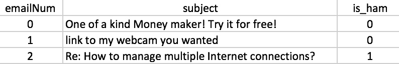

如果我们将这些数据转换成这样，即每一列对应每个主题行中的每个单词，并将每个单元格的值编码为`1`，如果给定的主题行包含该单词，否则为`0`，那么得到的矩阵看起来可能如下所示：

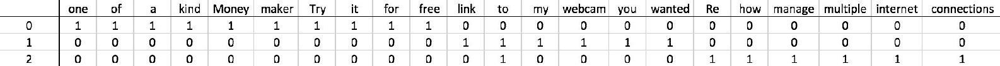

这种特定的编码方式被称为**独热编码**，我们只关心特定单词是否出现在主题行中，而不关心每个单词在主题行中实际出现的次数。在上述情况下，我们还移除了所有的标点符号，例如冒号、问号和感叹号。为了程序化地完成这项工作，我们可以使用正则表达式将每个主题行分割成只包含字母数字字符的单词，然后使用独热编码构建一个数据框。执行此编码步骤的代码如下所示：

```py
private static Frame<int, string> CreateWordVec(Series<int, string> rows)
{
    var wordsByRows = rows.GetAllValues().Select((x, i) =>
    {
        var sb = new SeriesBuilder<string, int>();

        ISet<string> words = new HashSet<string>(
            Regex.Matches(
                // Alphanumeric characters only
                x.Value, "\\w+('(s|d|t|ve|m))?"
            ).Cast<Match>().Select(
                // Then, convert each word to lowercase
                y => y.Value.ToLower()
            ).ToArray()
        );

        // Encode words appeared in each row with 1
        foreach (string w in words)
        {
            sb.Add(w, 1);
        }

        return KeyValue.Create(i, sb.Series);
    });

    // Create a data frame from the rows we just created
    // And encode missing values with 0
    var wordVecDF = Frame.FromRows(wordsByRows).FillMissing(0);

    return wordVecDF;
}
```

拥有这种独热编码的单词矩阵表示形式使我们的数据分析过程变得更加容易。例如，如果我们想查看垃圾邮件中前十位频繁出现的单词，我们只需简单地对垃圾邮件独热编码单词矩阵的每一列求和，然后取求和值最高的十个单词。这正是我们在以下代码中所做的：

```py
var hamTermFrequencies = subjectWordVecDF.Where(
    x => x.Value.GetAs<int>("is_ham") == 1
).Sum().Sort().Reversed.Where(x => x.Key != "is_ham");

var spamTermFrequencies = subjectWordVecDF.Where(
    x => x.Value.GetAs<int>("is_ham") == 0
).Sum().Sort().Reversed;

// Look at Top 10 terms that appear in Ham vs. Spam emails
var topN = 10;

var hamTermProportions = hamTermFrequencies / hamEmailCount;
var topHamTerms = hamTermProportions.Keys.Take(topN);
var topHamTermsProportions = hamTermProportions.Values.Take(topN);

System.IO.File.WriteAllLines(
    dataDirPath + "\\ham-frequencies.csv",
    hamTermFrequencies.Keys.Zip(
        hamTermFrequencies.Values, (a, b) => string.Format("{0},{1}", a, b)
    )
);

var spamTermProportions = spamTermFrequencies / spamEmailCount;
var topSpamTerms = spamTermProportions.Keys.Take(topN);
var topSpamTermsProportions = spamTermProportions.Values.Take(topN);

System.IO.File.WriteAllLines(
    dataDirPath + "\\spam-frequencies.csv",
    spamTermFrequencies.Keys.Zip(
        spamTermFrequencies.Values, (a, b) => string.Format("{0},{1}", a, b)
    )
);
```

如您从这段代码中可以看到，我们使用了 Deedle 数据框的`Sum`方法对每一列的值进行求和，并按降序排序。我们为垃圾邮件和 ham 邮件各做一次。然后，我们使用`Take`方法获取在垃圾邮件和 ham 邮件中出现频率最高的前十个单词。运行此代码将生成两个 CSV 文件：`ham-frequencies.csv`和`spam-frequencies.csv`。这两个文件包含有关垃圾邮件和 ham 邮件中单词出现次数的信息，我们将在后续的特征工程和模型构建步骤中使用这些信息。

现在，让我们可视化一些数据以进行进一步分析。首先，看一下以下关于数据集中 ham 电子邮件中前十位频繁出现的术语的图表：

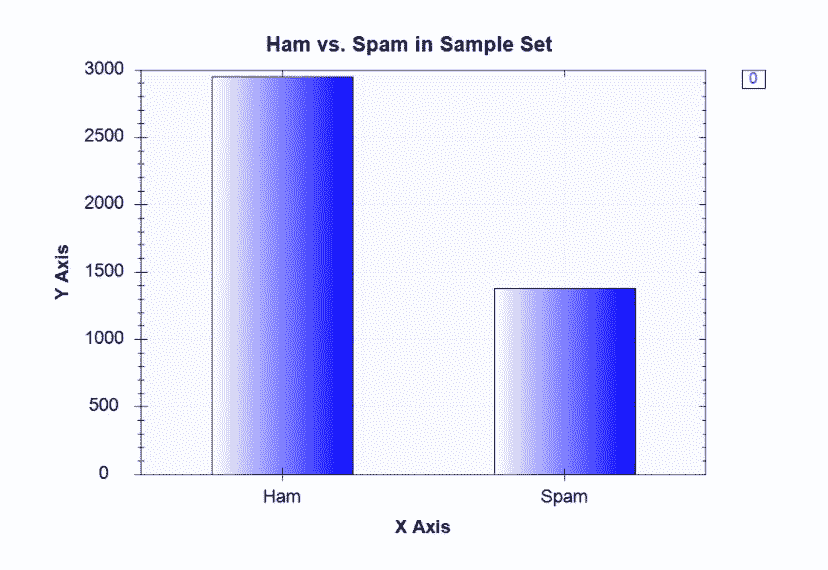

一个条形图，用于展示正常邮件中频率最高的前十项术语

如从该条形图中可以看出，在数据集中，正常邮件的数量多于垃圾邮件，这与现实世界的情况相符。我们通常在我们的收件箱中收到比垃圾邮件更多的正常邮件。我们使用了以下代码来生成此条形图，以可视化数据集中正常邮件和垃圾邮件的分布：

```py
var barChart = DataBarBox.Show(
    new string[] { "Ham", "Spam" },
    new double[] {
        hamEmailCount,
        spamEmailCount
    }
);
barChart.SetTitle("Ham vs. Spam in Sample Set");
```

使用 Accord.NET 框架中的`DataBarBox`类，我们可以轻松地将数据可视化在条形图中。现在让我们可视化正常邮件和垃圾邮件中频率最高的前十项术语。你可以使用以下代码生成正常邮件和垃圾邮件中前十项术语的条形图：

```py
var hamBarChart = DataBarBox.Show(
    topHamTerms.ToArray(),
    new double[][] {
        topHamTermsProportions.ToArray(),
        spamTermProportions.GetItems(topHamTerms).Values.ToArray()
    }
);
hamBarChart.SetTitle("Top 10 Terms in Ham Emails (blue: HAM, red: SPAM)");

var spamBarChart = DataBarBox.Show(
    topSpamTerms.ToArray(),
    new double[][] {
        hamTermProportions.GetItems(topSpamTerms).Values.ToArray(),
        topSpamTermsProportions.ToArray()
    }
);
spamBarChart.SetTitle("Top 10 Terms in Spam Emails (blue: HAM, red: SPAM)");
```

类似地，我们使用了`DataBarBox`类来显示条形图。当你运行此代码时，你会看到以下条形图，用于展示正常邮件中频率最高的前十项术语：


一个展示正常邮件中频率最高的前十项术语的图表

垃圾邮件中频率最高的前十项术语的条形图如下所示：

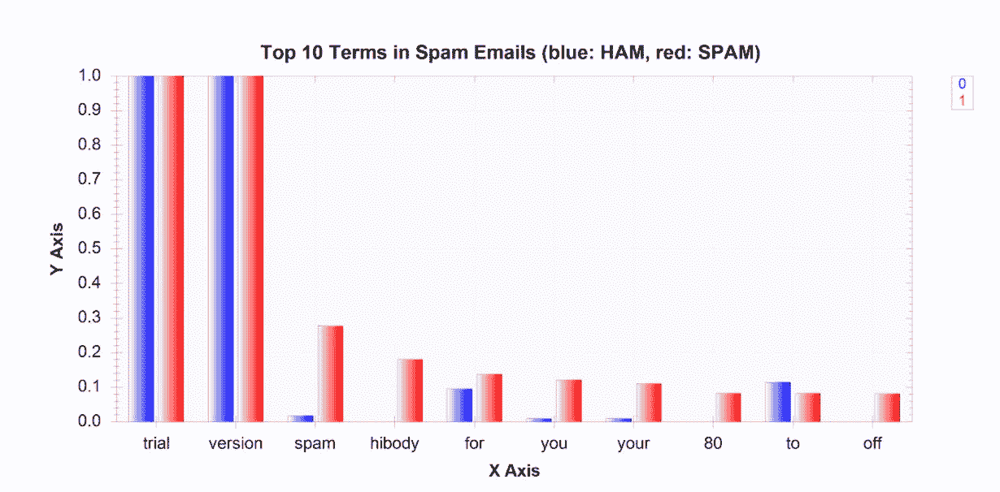

一个条形图，用于展示垃圾邮件中频率最高的前十项术语

如预期的那样，垃圾邮件中的单词分布与非垃圾邮件有很大的不同。例如，如果你看右边的图表，单词**垃圾邮件**和**hibody**在垃圾邮件中频繁出现，但在非垃圾邮件中并不常见。然而，有些事情并不合理。如果你仔细观察，单词**试用**和**版本**出现在所有的垃圾邮件和正常邮件中，这很不可能是真的。如果你在文本编辑器中打开一些原始的 EML 文件，你可以很容易地发现并非所有的邮件都包含这两个单词在它们的主题行中。那么，发生了什么？我们的数据是否在之前的数据准备或数据分析步骤中受到了污染？ 

进一步的研究表明，我们使用的其中一个软件包导致了这个问题。我们使用的`EAGetMail`软件包，用于加载和提取电子邮件内容，当我们使用他们的试用版时，会自动将`(Trial Version)`附加到主题行的末尾。既然我们已经知道了这个数据问题的根本原因，我们需要回去修复它。一个解决方案是回到数据准备步骤，并更新我们的`ParseEmails`函数，使用以下代码，该代码简单地从主题行中删除附加的`(Trial Version)`标志：

```py
private static Frame<int, string> ParseEmails(string[] files)
{
    // we will parse the subject and body from each email
    // and store each record into key-value pairs
    var rows = files.AsEnumerable().Select((x, i) =>
    {
        // load each email file into a Mail object
        Mail email = new Mail("TryIt");
        email.Load(x, false);

        // REMOVE "(Trial Version)" flags
        string EATrialVersionRemark = "(Trial Version)"; // EAGetMail appends subjects with "(Trial Version)" for trial version
        string emailSubject = email.Subject.EndsWith(EATrialVersionRemark) ? 
            email.Subject.Substring(0, email.Subject.Length - EATrialVersionRemark.Length) : email.Subject;
        string textBody = email.TextBody;

        // create key-value pairs with email id (emailNum), subject, and body
        return new { emailNum = i, subject = emailSubject, body = textBody };
    });

    // make a data frame from the rows that we just created above
    return Frame.FromRecords(rows);
}
```

在更新此代码并再次运行之前的数据准备和分析代码后，单词分布的条形图变得更加有意义。

以下条形图显示了修复并移除`(Trial Version)`标志后的正常邮件中频率最高的前十项术语：

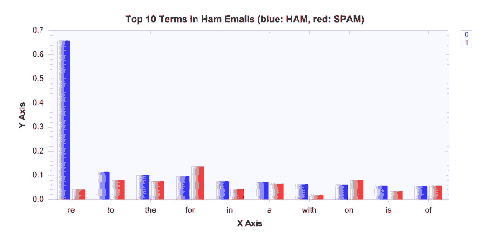

以下条形图显示了修复并移除`(Trial Version)`标志后的垃圾邮件中频率最高的前十项术语：

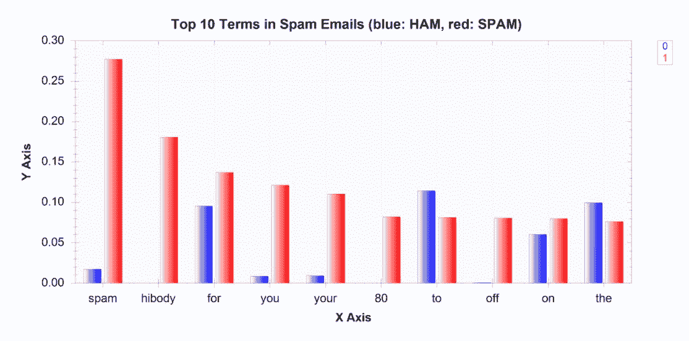

这是在构建机器学习模型时数据分析步骤重要性的一个很好的例子。在数据准备和数据分析步骤之间迭代是非常常见的，因为我们通常在分析步骤中发现数据问题，并且我们通常可以通过更新数据准备步骤中使用的部分代码来提高数据质量。现在我们已经有了以矩阵形式表示主题行中使用的单词的干净数据，是时候开始着手构建机器学习模型所使用的实际特征了。

# 邮件数据的特征工程

在上一步中，我们简要地查看了一下垃圾邮件和正常邮件的单词分布，并注意到了一些事情。首先，大多数最频繁出现的单词是常用词，意义不大。例如，像 *to*、*the*、*for* 和 *a* 这样的单词是常用词，我们的机器学习算法从这些单词中不会学到很多东西。这类单词被称为**停用词**，通常会被忽略或从特征集中删除。我们将使用 NLTK 的停用词列表来过滤掉特征集中的常用词。您可以从这里下载 NLTK 的停用词列表：[`github.com/yoonhwang/c-sharp-machine-learning/blob/master/ch.2/stopwords.txt`](https://github.com/yoonhwang/c-sharp-machine-learning/blob/master/ch.2/stopwords.txt)。过滤掉这些停用词的一种方法如下所示：

```py
// Read in stopwords list
ISet<string> stopWords = new HashSet<string>(
    File.ReadLines("<path-to-your-stopwords.txt>")
);
// Filter out stopwords from the term frequency series
var spamTermFrequenciesAfterStopWords = spamTermFrequencies.Where(
    x => !stopWords.Contains(x.Key)
);
```

在过滤掉这些停用词后，非垃圾邮件的新十大高频词如下：

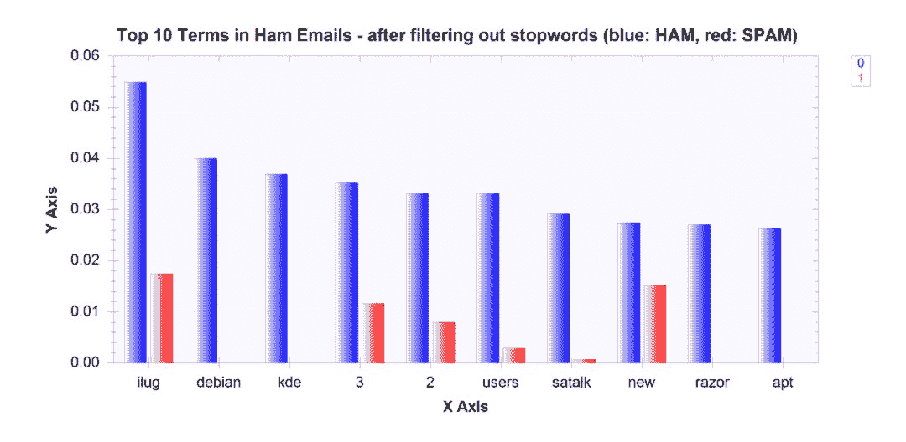

在过滤掉停用词后，垃圾邮件的前十大高频词如下所示：

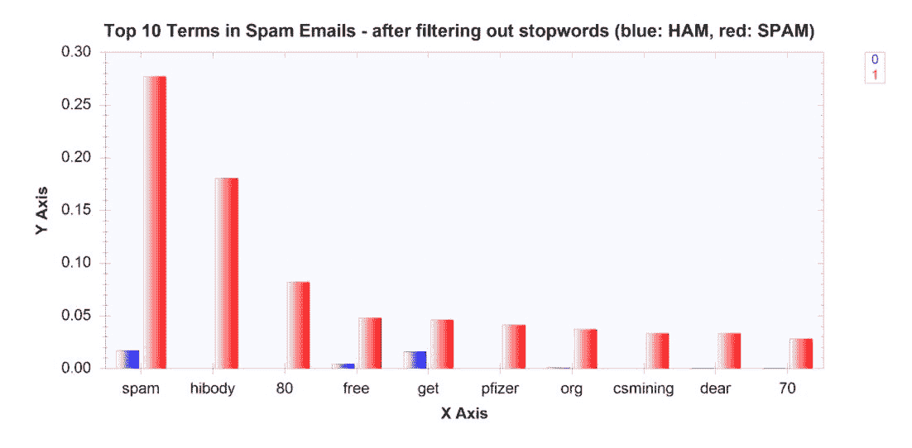

如您从这些条形图中可以看到，从特征集中过滤掉这些停用词使得更有意义的单词出现在高频出现的单词列表中。然而，我们还可以注意到另一件事。数字似乎出现在一些高频出现的单词中。例如，数字 **3** 和 **2** 成为了垃圾邮件中前十位高频出现的单词。数字 **80** 和 **70** 成为了垃圾邮件中前十位高频出现的单词。然而，很难确定这些数字是否会在训练机器学习模型以将电子邮件分类为垃圾邮件或正常邮件时做出很大贡献。有多种方法可以从特征集中过滤掉这些数字，但在这里我们将向您展示一种方法。我们更新了之前步骤中使用的 `regex`，以匹配仅包含字母字符的单词，而不是字母数字字符。以下代码显示了如何更新 `CreateWordVec` 函数以从特征集中过滤掉数字：

```py
private static Frame<int, string> CreateWordVec(Series<int, string> rows)
{
    var wordsByRows = rows.GetAllValues().Select((x, i) =>
    {
        var sb = new SeriesBuilder<string, int>();

        ISet<string> words = new HashSet<string>(
            Regex.Matches(
                // Alphabetical characters only
                x.Value, "[a-zA-Z]+('(s|d|t|ve|m))?"
            ).Cast<Match>().Select(
                // Then, convert each word to lowercase
                y => y.Value.ToLower()
            ).ToArray()
        );

        // Encode words appeared in each row with 1
        foreach (string w in words)
        {
            sb.Add(w, 1);
        }

        return KeyValue.Create(i, sb.Series);
    });

    // Create a data frame from the rows we just created
    // And encode missing values with 0
    var wordVecDF = Frame.FromRows(wordsByRows).FillMissing(0);

    return wordVecDF;
}
```

一旦我们从特征集中过滤掉这些数字，垃圾邮件的单词分布看起来如下：

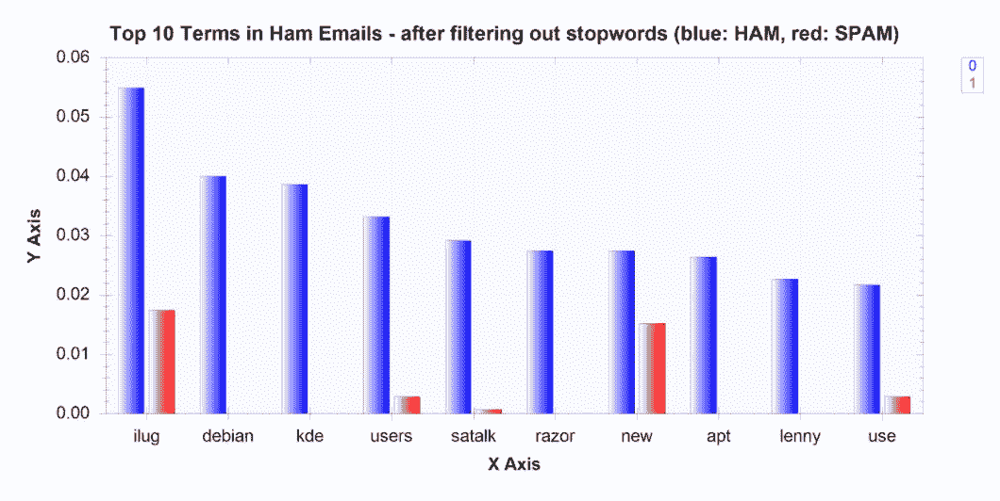

并且在过滤掉特征集中的数字后，垃圾邮件的单词分布如下所示：

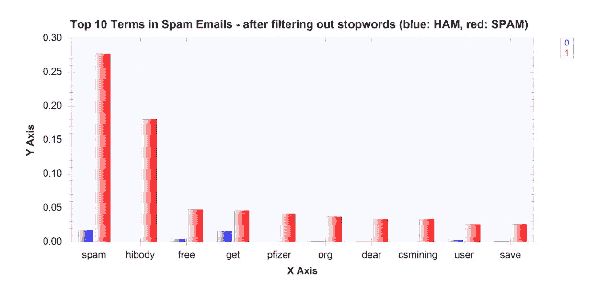

如从这些条形图中可以看出，我们列出了更有意义的词语，并且垃圾邮件和正常邮件的词语分布似乎有更大的区别。那些在垃圾邮件中频繁出现的词语似乎在正常邮件中很少出现，反之亦然。

数据分析和特征工程步骤的完整代码可以在以下仓库中找到：[`github.com/yoonhwang/c-sharp-machine-learning/blob/master/ch.2/DataAnalyzer.cs`](https://github.com/yoonhwang/c-sharp-machine-learning/blob/master/ch.2/DataAnalyzer.cs)。运行此代码后，将生成条形图，显示垃圾邮件和正常邮件中的词语分布，以及两个 CSV 文件——一个用于包含出现次数的词语列表（正常邮件），另一个用于包含出现次数的词语列表（垃圾邮件）。在下一节构建分类模型进行垃圾邮件过滤时，我们将使用这个词频输出进行特征选择过程。

# 逻辑回归与朴素贝叶斯在电子邮件垃圾邮件过滤中的应用

我们已经走了很长的路，终于用 C# 构建了我们第一个机器学习模型。在本节中，我们将训练逻辑回归和朴素贝叶斯分类器，将电子邮件分类为垃圾邮件和正常邮件。我们将运行这两个学习算法的交叉验证，以估计并更好地理解我们的分类模型在实际应用中的表现。如前一章简要讨论的，在 k 折交叉验证中，训练集被分成 *k* 个大小相等的子集，其中一个 *k* 个子集被保留作为验证集，其余的 *k-1* 个子集用于训练模型。然后重复这个过程 *k* 次，其中每个迭代使用不同的子集或折作为验证集进行测试，然后将相应的 *k* 个验证结果平均报告为一个估计值。

首先，让我们看看如何使用 Accord.NET 框架在 C# 中通过逻辑回归实现交叉验证算法的实例化。代码如下：

```py
var cvLogisticRegressionClassifier = CrossValidation.Create<LogisticRegression, IterativeReweightedLeastSquares<LogisticRegression>, double[], int>(
    // number of folds
    k: numFolds,
    // Learning Algorithm
    learner: (p) => new IterativeReweightedLeastSquares<LogisticRegression>()
    {
        MaxIterations = 100,
        Regularization = 1e-6
    },
    // Using Zero-One Loss Function as a Cost Function
    loss: (actual, expected, p) => new ZeroOneLoss(expected).Loss(actual),
    // Fitting a classifier
    fit: (teacher, x, y, w) => teacher.Learn(x, y, w),
    // Input with Features
    x: input,
    // Output
    y: output
);

// Run Cross-Validation
var result = cvLogisticRegressionClassifier.Learn(input, output);
```

让我们更深入地看看这段代码。我们可以通过提供要训练的模型类型、拟合模型的算法类型、输入数据类型和输出数据类型，使用静态 `Create` 函数创建一个新的 `CrossValidation` 算法。在这个例子中，我们创建了一个新的 `CrossValidation` 算法，其中 `LogisticRegression` 作为模型，`IterativeReweightedLeastSquares` 作为学习算法，双精度数组作为输入类型，整数作为输出类型（每个标签）。你可以尝试不同的学习算法来训练逻辑回归模型。在 Accord.NET 中，你可以选择随机梯度下降算法 (`LogisticGradientDescent`) 作为拟合逻辑回归模型的学习算法。

对于参数，你可以指定 k 折交叉验证的折数（*k*），具有自定义参数的学习方法（`learner`），你选择的损失/成本函数（`loss`），以及一个知道如何使用学习算法（`fit`）、输入（`x`）和输出（`y`）来拟合模型的功能。为了本节说明的目的，我们为 k 折交叉验证设置了一个相对较小的数字，`3`。此外，我们为最大迭代次数选择了相对较小的数字，`100`，以及相对较大的数字，1e-6 或 1/1,000,000，用于`IterativeReweightedLeastSquares`学习算法的正则化。对于损失函数，我们使用了一个简单的零一损失函数，其中对于正确预测分配 0，对于错误预测分配 1。这是我们学习算法试图最小化的成本函数。所有这些参数都可以进行不同的调整。你可以选择不同的损失/成本函数，k 折交叉验证中使用的折数，以及学习算法的最大迭代次数和正则化数字。你甚至可以使用不同的学习算法来拟合逻辑回归模型，例如`LogisticGradientDescent`，它迭代地尝试找到一个损失函数的局部最小值。

我们可以将这种方法应用于使用 k 折交叉验证训练朴素贝叶斯分类器。使用朴素贝叶斯学习算法运行 k 折交叉验证的代码如下：

```py
var cvNaiveBayesClassifier = CrossValidation.Create<NaiveBayes<BernoulliDistribution>, NaiveBayesLearning<BernoulliDistribution>, double[], int>(
    // number of folds
    k: numFolds,
    // Naive Bayes Classifier with Binomial Distribution
    learner: (p) => new NaiveBayesLearning<BernoulliDistribution>(),
    // Using Zero-One Loss Function as a Cost Function
    loss: (actual, expected, p) => new ZeroOneLoss(expected).Loss(actual),
    // Fitting a classifier
    fit: (teacher, x, y, w) => teacher.Learn(x, y, w),
    // Input with Features
    x: input,
    // Output
    y: output
);

// Run Cross-Validation
var result = cvNaiveBayesClassifier.Learn(input, output);
```

之前用于逻辑回归模型的代码与这段代码之间的唯一区别是我们选择的不同模型和学习算法。我们不是使用`LogisticRegression`和`IterativeReweightedLeastSquares`，而是使用了`NaiveBayes`作为模型，并使用`NaiveBayesLearning`作为学习算法来训练我们的朴素贝叶斯分类器。由于我们的所有输入值都是二元的（要么是 0，要么是 1），我们为我们的朴素贝叶斯分类器模型使用了`BernoulliDistribution`。

训练和验证具有 k 折交叉验证的分类模型的完整代码可以在以下仓库中找到：[`github.com/yoonhwang/c-sharp-machine-learning/blob/master/ch.2/Modeling.cs`](https://github.com/yoonhwang/c-sharp-machine-learning/blob/master/ch.2/Modeling.cs)。当你运行此代码时，你应该会看到一个类似以下输出的结果：

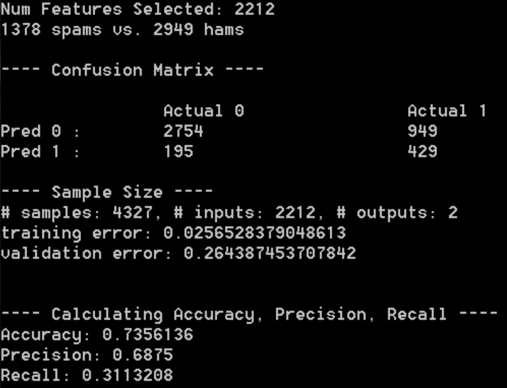

在下一节中，我们将更详细地探讨这些数字代表什么，其中我们将讨论模型验证方法。为了尝试不同的机器学习模型，只需修改代码中的第 68-88 行。你可以用我们之前讨论过的逻辑回归模型代码替换这些行，或者你也可以尝试拟合你选择的不同学习算法。

# 分类模型验证

我们在上一节中使用了 C#和 Accord.NET 框架构建了我们非常第一个机器学习模型。然而，我们还没有完成。如果我们更仔细地查看之前的控制台输出，有一件事相当令人担忧。训练错误率大约是 0.03，但验证错误率大约是 0.26。这意味着我们的分类模型在训练集中正确预测了 100 次中的 87 次，但在验证或测试集中的模型预测只有 100 次中的 74 次是正确的。这是一个典型的过拟合例子，其中模型与训练集拟合得太紧密，以至于其对未预见数据集的预测是不可靠的和不可预测的。如果我们将这个模型用于生产中的垃圾邮件过滤系统，实际过滤垃圾邮件的性能将是不可靠的，并且与我们在训练集中看到的不同。

过拟合通常是因为模型对于给定的数据集来说过于复杂，或者使用了过多的参数来拟合模型。我们在上一节中构建的朴素贝叶斯分类器模型中存在的过拟合问题很可能是由于模型的复杂性和我们用来训练模型的特征数量。如果你再次查看上一节末尾的控制台输出，你可以看到我们用来训练朴素贝叶斯模型的特征数量是 2,212。考虑到我们的样本集中只有大约 4,200 封电子邮件记录，而且其中只有大约三分之二（或者说大约 3,000 条记录）被用来训练我们的模型（这是因为我们使用了三折交叉验证，并且每次迭代中只有其中的两个折被用作训练集），这实在太多了。为了修复这个过拟合问题，我们将不得不减少我们用来训练模型的特征数量。为了做到这一点，我们可以过滤掉那些出现频率不高的术语。执行此操作的代码位于上一节完整代码的第 48-53 行，如下所示：

```py
// Change number of features to reduce overfitting
int minNumOccurrences = 1;
string[] wordFeatures = indexedSpamTermFrequencyDF.Where(
    x => x.Value.GetAs<int>("num_occurences") >= minNumOccurrences
).RowKeys.ToArray();
Console.WriteLine("Num Features Selected: {0}", wordFeatures.Count());
```

如你所见，我们在上一节中构建的朴素贝叶斯分类器模型使用了在垃圾邮件中至少出现一次的所有单词。如果你查看垃圾邮件中的单词频率，大约有 1,400 个单词只出现了一次（查看在数据分析步骤中创建的`spam-frequencies.csv`文件）。直观上看，这些出现次数低的单词只会产生噪声，而不是为我们的模型提供很多学习信息。这立即告诉我们，当我们最初在上一节中构建我们的分类模型时，我们的模型会暴露于多少噪声。

既然我们已经知道了这个过拟合问题的原因，让我们来修复它。让我们尝试使用不同的阈值来选择特征。我们已经尝试了 5、10、15、20 和 25 作为垃圾邮件中最低出现次数（即我们将`minNumOccurrences`设置为 5、10、15 等等）并使用这些阈值训练了朴素贝叶斯分类器。

首先，具有至少五次出现的朴素贝叶斯分类器结果如下：


具有至少 10 次出现的朴素贝叶斯分类器结果如下：

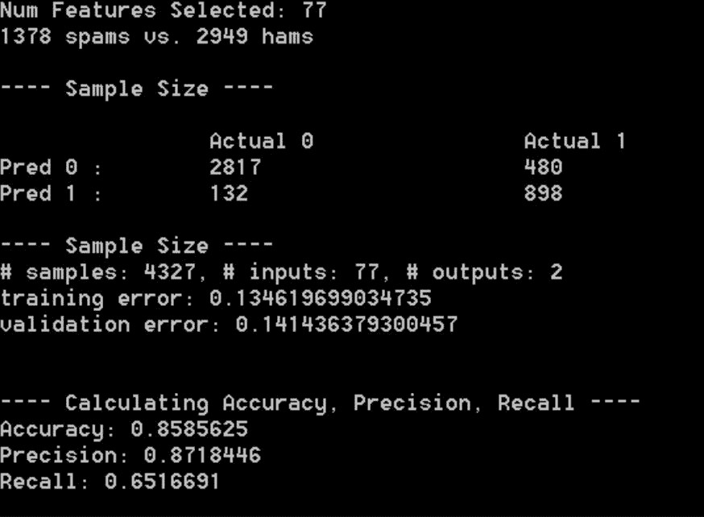

具有至少 15 次出现的朴素贝叶斯分类器结果如下：

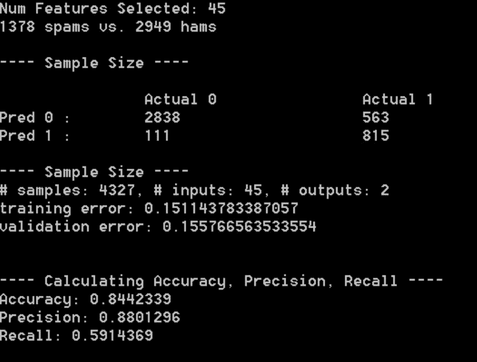

最后，具有至少 20 次出现的朴素贝叶斯分类器结果如下：


从这些实验结果中可以看出，随着我们增加最小单词出现次数并相应地减少用于训练模型的特征数量，`训练错误`和`验证错误`之间的差距减小，训练错误开始看起来更接近验证错误。当我们解决了过拟合问题，我们可以对模型在不可预见的数据和在生产系统中的表现更有信心。我们使用逻辑回归分类模型进行了相同的实验，结果与朴素贝叶斯分类器发现的结果相似。逻辑回归模型的实验结果如下所示。

首先，具有至少五次出现的逻辑回归分类器结果如下：


具有至少十次出现的逻辑回归分类器结果如下：


具有至少 15 次出现的逻辑回归分类器结果如下：

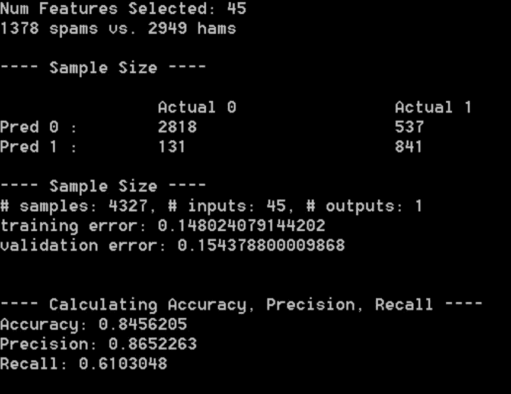

具有至少 20 次出现的逻辑回归分类器结果如下：

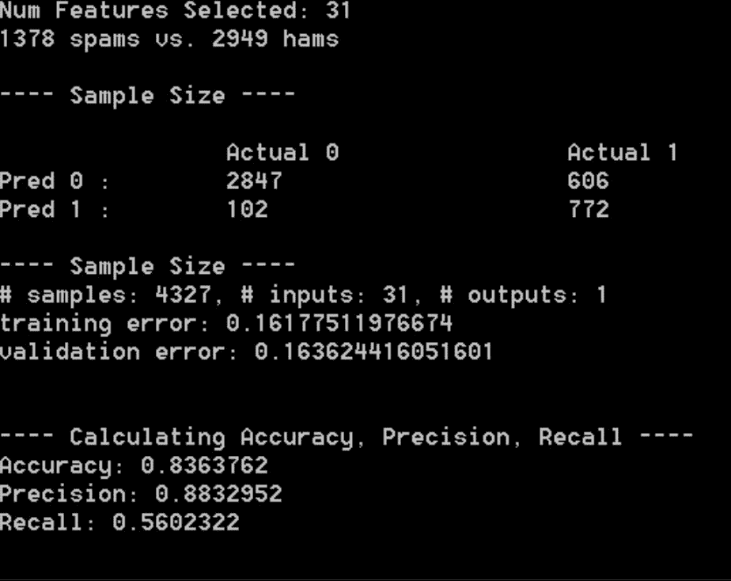

现在我们已经讨论了如何处理过拟合问题，还有一些模型性能指标我们想要查看：

+   **混淆矩阵**：混淆矩阵是一个表格，它告诉我们预测模型的总体性能。每一列代表每个实际类别，每一行代表每个预测类别。在二元分类问题的案例中，混淆矩阵将是一个 2 x 2 的矩阵，其中第一行代表负预测，第二行代表正预测。第一列代表实际负值，第二列代表实际正值。以下表格说明了二元分类问题的混淆矩阵中每个单元格代表的内容：

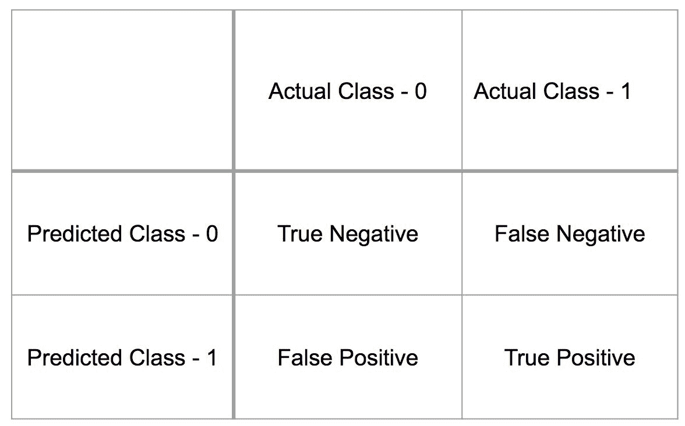

+   **真负**（**TN**）是指模型正确预测了类别 0；**假负**（**FN**）是指模型预测为**0**，但实际类别是**1**；**假正**（**FP**）是指模型预测为类别**1**，但实际类别是**0**；而**真正**（**TP**）是指模型正确预测了类别**1**。从表中可以看出，混淆矩阵描述了整体模型性能。在我们的例子中，如果我们查看之前截图中的最后一个控制台输出，其中显示了我们的逻辑回归分类模型的控制台输出，我们可以看到 TNs 的数量为`2847`，FNs 的数量为`606`，FPs 的数量为`102`，TPs 的数量为`772`。有了这些信息，我们可以进一步计算**真正正率**（**TPR**）、**真正负率**（**TNR**）、**假正率**（**FPR**）和**假负率**（**FNR**）如下：

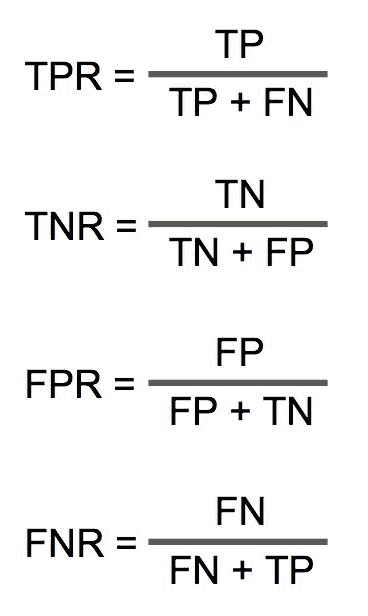

使用前面的例子，我们例子中的真正正率（TPR）为 0.56，真正负率（TNR）为 0.97，假正率（FPR）为 0.03，假负率（FNR）为 0.44。

+   **准确率**: 准确率是指正确预测的比例。使用之前例子混淆矩阵中的相同符号，准确率可以计算如下：

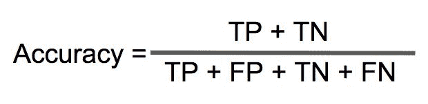

准确率是一个常用的模型性能指标，但有时它并不能很好地代表整体模型性能。例如，如果样本集大部分不平衡，比如说在我们的样本集中有五个垃圾邮件和 95 封正常邮件，那么一个简单地将所有邮件分类为正常邮件的分类器将不得不达到 95%的准确率。然而，它永远不会捕获垃圾邮件。这就是为什么我们需要查看混淆矩阵和其他性能指标，如精确率和召回率：

+   **精确率**: 精确率是指正确预测的正例数量与总预测正例数量的比例。使用与之前相同的符号，我们可以计算精确率如下：


如果您查看之前截图中的最后一个控制台输出，我们的逻辑回归分类模型结果中的精确率是通过将混淆矩阵中的 TPs 数量，即 772，除以 TPs 和 FPs 的总和，即 772 和 102，得到的，结果为 0.88。

+   **召回率**: 召回率是指正确预测的正例数量与实际正例总数量的比例。这是告诉我们模型检索了多少实际正例的一种方式。使用与之前相同的符号，我们可以计算召回率如下：

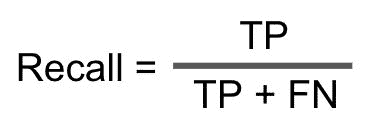

如果你查看上一张截图中的最后一个控制台输出，即我们的逻辑回归分类模型结果，召回率是通过将混淆矩阵中 TP（真阳性）的数量，772，除以 TP（真阳性）和 FN（假阴性）的总和，772 和 606，得到的，结果是 0.56。

使用这些性能指标，数据科学家的责任是选择最优模型。精确率和召回率之间总会存在权衡。一个精确率高于其他模型的模型将具有较低的召回率。在我们的垃圾邮件过滤问题中，如果你认为正确过滤掉垃圾邮件更重要，并且你可以牺牲一些通过用户收件箱的垃圾邮件，那么你可能希望优化精确率。另一方面，如果你认为过滤掉尽可能多的垃圾邮件更重要，即使你可能会过滤掉一些非垃圾邮件，那么你可能希望优化召回率。选择正确的模型不是一个容易的决定，思考需求和成功标准对于做出正确的选择至关重要。

总结来说，以下是我们可以从交叉验证结果和混淆矩阵中计算性能指标的代码：

+   **训练与验证（测试）错误**：用于识别过拟合问题（第 48-52 行）：

```py
// Run Cross-Validation
var result = cvNaiveBayesClassifier.Learn(input, output);

// Training Error vs. Test Error
double trainingError = result.Training.Mean;
double validationError = result.Validation.Mean;
```

+   **混淆矩阵**：真阳性与假阳性，以及真阴性与假阴性（第 95-108 行）：

```py
// Confusion Matrix
GeneralConfusionMatrix gcm = result.ToConfusionMatrix(input, output);

float truePositive = (float)gcm.Matrix[1, 1];
float trueNegative = (float)gcm.Matrix[0, 0];
float falsePositive = (float)gcm.Matrix[1, 0];
float falseNegative = (float)gcm.Matrix[0, 1];
```

+   **准确率与精确率与召回率**：用于衡量机器学习模型的正确性（第 122-130 行）：

```py
// Accuracy vs. Precision vs. Recall
float accuracy = (truePositive + trueNegative) / numberOfSamples;
float precision = truePositive / (truePositive + falsePositive);
float recall = truePositive / (truePositive + falseNegative);
```

# 摘要

在本章中，我们使用 C#构建了我们第一个机器学习模型，它可以用于垃圾邮件过滤。我们首先定义并清楚地说明了我们试图解决的问题以及成功标准。然后，我们从原始电子邮件数据中提取相关信息，并将其转换成我们可以用于数据分析、特征工程和机器学习模型构建步骤的格式。在数据分析步骤中，我们学习了如何应用独热编码，并构建了用于主题行中使用的单词的矩阵表示。我们还从我们的数据分析过程中识别出一个数据问题，并学习了我们通常如何在数据准备和分析步骤之间来回迭代。然后，我们通过过滤掉停用词和使用正则表达式来分割非字母数字或非字母词来进一步改进我们的特征集。有了这个特征集，我们使用逻辑回归和朴素贝叶斯分类器算法构建了我们第一个分类模型，简要介绍了过拟合的危险，并学习了如何通过查看准确率、精确率和召回率来评估和比较模型性能。最后，我们还学习了精确率和召回率之间的权衡，以及如何根据这些指标和业务需求来选择模型。

在下一章中，我们将进一步扩展我们在使用文本数据集构建分类模型方面的知识和技能。我们将从分析一个包含超过两个类别的数据集开始，使用 Twitter 情感数据。我们将学习二分类模型和多分类模型之间的区别。我们还将讨论一些用于特征工程的 NLP 技术，以及如何使用随机森林算法构建多分类分类模型。
