# 第三章：Twitter 情感分析

在本章中，我们将扩展我们在 C#中构建分类模型的知识。除了我们在上一章中使用过的 Accord.NET 和 Deedle 这两个包，我们还将开始使用 Stanford CoreNLP 包来应用更高级的自然语言处理（NLP）技术，例如分词、词性标注和词元化。使用这些包，本章的目标是构建一个多类分类模型，用于预测推文的情感。我们将使用一个包含不仅只有单词，还有表情符号的原始 Twitter 数据集，并使用它来训练一个用于情感预测的机器学习（ML）模型。我们将遵循构建 ML 模型时遵循的相同步骤。我们将从问题定义开始，然后进行数据准备和分析，特征工程，以及模型开发和验证。在我们的特征工程步骤中，我们将扩展我们对 NLP 技术的知识，并探讨如何将分词、词性标注和词元化应用于构建更高级的文本特征。在模型构建步骤中，我们将探索一个新的分类算法，即随机森林分类器，并将其性能与朴素贝叶斯分类器进行比较。最后，在我们的模型验证步骤中，我们将扩展我们对混淆矩阵、精确率和召回率的了解，这些我们在上一章中已经介绍过，并讨论**接收者操作特征**（ROC）曲线和**曲线下面积**（AUC）是什么，以及这些概念如何用于评估我们的 ML 模型。

在本章中，我们将涵盖以下内容：

+   使用 Stanford CoreNLP 包设置环境

+   Twitter 情感分析项目的定义问题

+   使用 Stanford CoreNLP 进行数据准备

+   使用词元作为标记的数据分析

+   使用词元化和表情符号进行特征工程

+   朴素贝叶斯与随机森林的比较

+   使用 ROC 曲线和 AUC 指标进行模型验证

# 设置环境

在我们深入 Twitter 情感分析项目之前，让我们设置我们的开发环境，我们将使用 Stanford CoreNLP 包来完成本章的所有工作。要准备好包含 Stanford CoreNLP 包的环境，需要多个步骤，所以最好按以下步骤进行：

1.  第一步是在 Visual Studio 中创建一个新的控制台应用程序（.NET Framework）项目。确保你使用的是 4.6.1 或更高版本的.NET Framework。如果你安装了较旧版本，请访问[`docs.microsoft.com/en-us/dotnet/framework/install/guide-for-developers`](https://docs.microsoft.com/en-us/dotnet/framework/install/guide-for-developers)并遵循安装指南。以下是一个项目设置页面的截图（注意：你可以在顶部栏中选择你的.NET Framework 版本）：

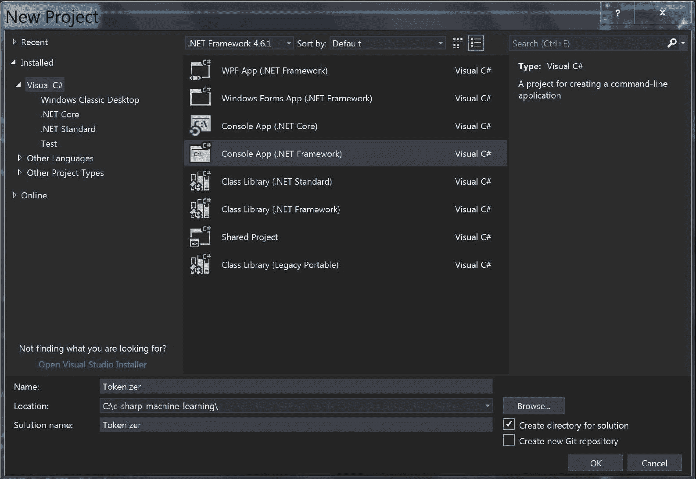

1.  现在，让我们安装 Stanford CoreNLP 包。你可以在你的包管理控制台中输入以下命令：

```py
Install-Package Stanford.NLP.CoreNLP
```

我们在本章中将使用的是 `Stanford.NLP.CoreNLP` 3.9.1 版本。随着时间的推移，版本可能会发生变化，你可能需要更新你的安装。

1.  我们只需再做一些事情，我们的环境就准备好开始使用这个包了。我们需要安装 CoreNLP 模型 JAR 文件，它包含用于解析、POS 标记、**命名实体识别**（**NER**）和其他一些工具的各种模型。点击此链接下载并解压 Stanford CoreNLP：[`stanfordnlp.github.io/CoreNLP/`](https://stanfordnlp.github.io/CoreNLP/). 下载并解压后，你将看到那里有多个文件。我们感兴趣的特定文件是 `stanford-corenlp-<版本号>-models.jar`。我们需要从该 jar 文件中提取内容到一个目录中，以便我们可以在我们的 C# 项目中加载所有模型文件。你可以使用以下命令从 `stanford-corenlp-<版本号>-models.jar` 中提取内容：

```py
jar xf stanford-corenlp-<version-number>-models.jar 
```

当你从模型 jar 文件中提取完所有模型文件后，你现在就可以开始在 C# 项目中使用 Stanford CoreNLP 包了。

现在，让我们检查我们的安装是否成功。以下代码是对本例的轻微修改 ([`sergey-tihon.github.io/Stanford.NLP.NET/StanfordCoreNLP.html`](https://sergey-tihon.github.io/Stanford.NLP.NET/StanfordCoreNLP.html)) :

```py
using System;
using System.IO;
using java.util;
using java.io;
using edu.stanford.nlp.pipeline;
using Console = System.Console;

namespace Tokenizer
{
    class Program
    {
        static void Main()
        {
            // Path to the folder with models extracted from Step #3
            var jarRoot = @"<path-to-your-model-files-dir>";

            // Text for processing
            var text = "We're going to test our CoreNLP installation!!";

            // Annotation pipeline configuration
            var props = new Properties();
            props.setProperty("annotators", "tokenize, ssplit, pos, lemma");
            props.setProperty("ner.useSUTime", "0");

            // We should change current directory, so StanfordCoreNLP could find all the model files automatically
            var curDir = Environment.CurrentDirectory;
            Directory.SetCurrentDirectory(jarRoot);
            var pipeline = new StanfordCoreNLP(props);
            Directory.SetCurrentDirectory(curDir);

            // Annotation
            var annotation = new Annotation(text);
            pipeline.annotate(annotation);

            // Result - Pretty Print
            using (var stream = new ByteArrayOutputStream())
            {
                pipeline.prettyPrint(annotation, new PrintWriter(stream));
                Console.WriteLine(stream.toString());
                stream.close();
            }

            Console.ReadKey();
        }
    }
}
```

如果你的安装成功，你应该会看到以下类似的输出：

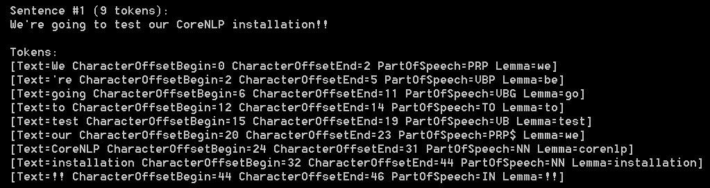

让我们更仔细地看看这个输出。标记是作为单个语义单元组合的字符序列。通常，标记是*单词*或*术语*。在每一行标记输出中，我们可以看到原始文本，例如 `We`，`'re` 和 `going`。`PartOfSpeech` 标签指的是每个单词的类别，例如名词、动词和形容词。例如，我们例子中第一个标记 `We` 的 `PartOfSpeech` 标签是 `PRP`，它代表*人称代词*。我们例子中第二个标记 `'re` 的 `PartOfSpeech` 标签是 `VBP`，它代表*动词，非第三人称单数现在时*。完整的 POS 标签列表可以在以下位置找到 ([`www.ling.upenn.edu/courses/Fall_2003/ling001/penn_treebank_pos.html`](http://www.ling.upenn.edu/courses/Fall_2003/ling001/penn_treebank_pos.html)) 或在以下屏幕截图：

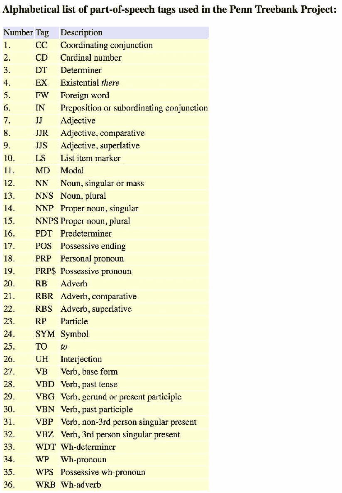

POS 标签列表

最后，在我们标记化示例中的 `Lemma` 标签指的是给定单词的标准形式。例如，`am` 和 `are` 的词元是 `be`。在我们的例子中，第三个标记中的单词 `going` 的词元是 `go`。我们将在以下章节中讨论如何使用词元化进行特征工程。

# Twitter 情感分析问题定义

让我们通过明确定义我们将构建的模型及其预测内容来开始我们的 Twitter 情感分析项目。你可能已经听说过“情感分析”这个术语。情感分析本质上是一个计算过程，用于确定给定的文本表达的是积极、中性还是消极情感。社交媒体内容的情感分析可以用于多种方式。例如，营销人员可以使用它来识别营销活动有多有效，以及它如何影响消费者对某个产品或公司的看法和态度。情感分析还可以用于预测股市变化。对某个公司的正面新闻和整体正面情感往往推动其股价上涨，而对于某个公司的新闻和社交媒体中的情感分析可以用来预测股价在不久的将来会如何变动。为了实验如何构建情感分析模型，我们将使用来自 CrowdFlower 的 Data for Everyone 库的预编译和标记的航空情感 Twitter 数据集（[`www.figure-eight.com/data-for-everyone/`](https://www.figure-eight.com/data-for-everyone/)）。然后，我们将应用一些 NLP 技术，特别是词素化、词性标注和词形还原，从原始推文数据中构建有意义的文本和表情符号特征。由于我们想要预测每条推文的三个不同情感（积极、中性和消极），我们将构建一个多类分类模型，并尝试不同的学习算法——朴素贝叶斯和随机森林。一旦我们构建了情感分析模型，我们将主要通过以下三个指标来评估其性能：精确度、召回率和 AUC。

让我们总结一下 Twitter 情感分析项目的需求定义：

+   问题是什么？我们需要一个 Twitter 情感分析模型来计算识别推文中的情感。

+   为什么这是一个问题？识别和衡量用户或消费者对某个主题（如产品、公司、广告等）的情感，通常是衡量某些任务影响力和成功的重要工具。

+   解决这个问题的方法有哪些？我们将使用斯坦福 CoreNLP 包来应用各种 NLP 技术，如分词、词性标注和词形还原，从原始 Twitter 数据集中构建有意义的特征。有了这些特征，我们将尝试不同的学习算法来构建情感分析模型。我们将使用精确度、召回率和 AUC 指标来评估模型的性能。

+   成功的标准是什么？我们希望有高精确率，同时不牺牲太多的召回率，因为正确地将一条推文分类到三个情感类别（正面、中立和负面）比更高的检索率更重要。此外，我们希望有高 AUC 值，我们将在本章后面的部分详细讨论。

# 使用斯坦福 CoreNLP 进行数据准备

既然我们已经知道了本章的目标，现在是时候深入数据了。与上一章类似，我们将使用预编译和预标记的 Twitter 情感数据。我们将使用来自 CrowdFlower 的 Data for Everyone 库的数据集([`www.figure-eight.com/data-for-everyone/`](https://www.figure-eight.com/data-for-everyone/))，你可以从这个链接下载数据：[`www.kaggle.com/crowdflower/twitter-airline-sentiment`](https://www.kaggle.com/crowdflower/twitter-airline-sentiment)。这里的数据是关于大约 15,000 条关于美国航空公司的推文。这些 Twitter 数据是从 2015 年 2 月抓取的，然后被标记为三个类别——正面、负面和中立。链接提供了两种类型的数据：CSV 文件和 SQLite 数据库。我们将在这个项目中使用 CSV 文件。

一旦你下载了这些数据，我们需要为未来的分析和模型构建做准备。数据集中我们感兴趣的两大列是`airline_sentiment`和`text`。`airline_sentiment`列包含关于情感的信息——一条推文是否有积极、消极或中性的情感——而`text`列包含原始的 Twitter 文本。为了使这些原始数据便于我们未来的数据分析和管理模型构建步骤，我们需要完成以下任务：

+   **清理不必要的文本**：很难证明文本的某些部分提供了许多见解和信息，供我们的模型学习，例如 URL、用户 ID 和原始数字。因此，准备我们原始数据的第一个步骤是清理不包含太多信息的无用文本。在这个例子中，我们移除了 URL、Twitter 用户 ID、数字和标签符号。我们使用`Regex`将此类文本替换为空字符串。以下代码展示了我们用来过滤这些文本的`Regex`表达式：

```py
// 1\. Remove URL's
string urlPattern = @"https?:\/\/\S+\b|www\.(\w+\.)+\S*";
Regex rgx = new Regex(urlPattern);
tweet = rgx.Replace(tweet, "");

// 2\. Remove Twitter ID's
string userIDPattern = @"@\w+";
rgx = new Regex(userIDPattern);
tweet = rgx.Replace(tweet, "");

// 3\. Remove Numbers
string numberPattern = @"[-+]?[.\d]*[\d]+[:,.\d]*";
tweet = Regex.Replace(tweet, numberPattern, "");

// 4\. Replace Hashtag
string hashtagPattern = @"#";
tweet = Regex.Replace(tweet, hashtagPattern, "");
```

如你所见，有两种方式可以替换匹配`Regex`模式的字符串。你可以实例化一个`Regex`对象，然后用另一个字符串替换匹配的字符串，如前两个案例所示。你也可以直接调用静态的`Regex.Replace`方法来达到同样的目的，如最后两个案例所示。静态方法会在每次调用`Regex.Replace`方法时创建一个`Regex`对象，所以如果你在多个地方使用相同的模式，第一种方法会更好：

+   **将相似的表情符号分组并编码**：表情符号，如笑脸和悲伤脸，在推文中经常被使用，并提供了关于每条推文情感的见解。直观地，一个用户会用笑脸表情符号来推文关于积极事件，而另一个用户会用悲伤脸表情符号来推文关于负面事件。然而，不同的笑脸表现出相似的正向情感，可以分组在一起。例如，带括号的笑脸`:)`与带大写字母`D`的笑脸`:D`具有相同的意义。因此，我们希望将这些相似的表情符号分组在一起，并将它们编码为一个组，而不是让它们分别在不同的组中。我们将使用 Romain Paulus 和 Jeffrey Pennington 分享的 R 代码([`nlp.stanford.edu/projects/glove/preprocess-twitter.rb`](https://nlp.stanford.edu/projects/glove/preprocess-twitter.rb))，将其翻译成 C#，然后将其应用于我们的原始 Twitter 数据集。以下是如何将 R 中编写的表情符号`Regex`代码翻译成 C#，以便我们可以将相似的表情符号分组并编码：

```py
// 1\. Replace Smiley Faces
string smileyFacePattern = String.Format(@"{0}{1}[)dD]+|[)dD]+{1}{0}", eyesPattern, nosePattern);
tweet = Regex.Replace(tweet, smileyFacePattern, " emo_smiley ");

// 2\. Replace LOL Faces
string lolFacePattern = String.Format(@"{0}{1}[pP]+", eyesPattern, nosePattern);
tweet = Regex.Replace(tweet, lolFacePattern, " emo_lol ");

// 3\. Replace Sad Faces
string sadFacePattern = String.Format(@"{0}{1}\(+|\)+{1}{0}", eyesPattern, nosePattern);
tweet = Regex.Replace(tweet, sadFacePattern, " emo_sad ");

// 4\. Replace Neutral Faces
string neutralFacePattern = String.Format(@"{0}{1}[\/|l*]", eyesPattern, nosePattern);
tweet = Regex.Replace(tweet, neutralFacePattern, " emo_neutral ");

// 5\. Replace Heart
string heartPattern = "<3";
tweet = Regex.Replace(tweet, heartPattern, " emo_heart ");
```

+   **将其他有用的表达式分组并编码**：最后，还有一些可以帮助我们的模型检测推文情感的表达式。重复的标点符号，如`!!!`和`???`，以及长单词，如`wayyyy`和`soooo`，可以提供一些关于推文情感的额外信息。我们将分别将它们分组并编码，以便我们的模型可以从这些表达式中学习。以下代码展示了如何编码这样的表达式：

```py
// 1\. Replace Punctuation Repeat
string repeatedPunctuationPattern = @"([!?.]){2,}";
tweet = Regex.Replace(tweet, repeatedPunctuationPattern, " $1_repeat ");

// 2\. Replace Elongated Words (i.e. wayyyy -> way_emphasized)
string elongatedWordsPattern = @"\b(\S*?)(.)\2{2,}\b";
tweet = Regex.Replace(tweet, elongatedWordsPattern, " $1$2_emphasized ");
```

如代码所示，对于重复的标点符号，我们在字符串后附加一个后缀`_repeat`。例如，`!!!`将变成`!_repeat`，而`???`将变成`?_repeat`。对于长单词，我们在字符串后附加一个后缀`_emphasized`。例如，`wayyyy`将变成`way_emphasized`，而`soooo`将变成`so_emphasized`。

将原始数据集处理成单个 Twitter 文本，并导出处理后的 Twitter 文本到另一个数据文件的全代码可以在本存储库中找到：[`github.com/yoonhwang/c-sharp-machine-learning/blob/master/ch.3/DataProcessor.cs`](https://github.com/yoonhwang/c-sharp-machine-learning/blob/master/ch.3/DataProcessor.cs)。让我们简要地浏览一下代码。它首先将原始`Tweets.csv`数据集读入一个 Deedle 数据框（第 76-82 行）。然后，它调用一个名为`FormatTweets`的方法，该方法包含一个包含所有原始 Twitter 文本的列序列。第 56-65 行的`FormatTweets`方法代码如下所示：

```py
private static string[] FormatTweets(Series<int, string> rows)
{
    var cleanTweets = rows.GetAllValues().Select((x, i) =>
    {
        string tweet = x.Value;
        return CleanTweet(tweet);
    });

    return cleanTweets.ToArray();
}
```

`FormatTweets`方法遍历序列中的每个元素，即原始推文，并调用`CleanTweet`方法。在`CleanTweet`方法中，每条原始推文都会与之前定义的所有`Regex`模式进行匹配，然后按照之前讨论的方式进行处理。第 11-54 行的`CleanTweet`方法如下所示：

```py
private static string CleanTweet(string rawTweet)
{
      string eyesPattern = @"[8:=;]";
      string nosePattern = @"['`\-]?";

      string tweet = rawTweet;
      // 1\. Remove URL's
      string urlPattern = @"https?:\/\/\S+\b|www\.(\w+\.)+\S*";
      Regex rgx = new Regex(urlPattern);
      tweet = rgx.Replace(tweet, "");
      // 2\. Remove Twitter ID's
      string userIDPattern = @"@\w+";
      rgx = new Regex(userIDPattern);
      tweet = rgx.Replace(tweet, "");
      // 3\. Replace Smiley Faces
      string smileyFacePattern = String.Format(@"{0}{1}[)dD]+|[)dD]+{1}{0}", eyesPattern, nosePattern);
      tweet = Regex.Replace(tweet, smileyFacePattern, " emo_smiley ");
      // 4\. Replace LOL Faces
      string lolFacePattern = String.Format(@"{0}{1}[pP]+", eyesPattern, nosePattern);
      tweet = Regex.Replace(tweet, lolFacePattern, " emo_lol ");
      // 5\. Replace Sad Faces
      string sadFacePattern = String.Format(@"{0}{1}\(+|\)+{1}{0}", eyesPattern, nosePattern);
      tweet = Regex.Replace(tweet, sadFacePattern, " emo_sad ");
      // 6\. Replace Neutral Faces
      string neutralFacePattern = String.Format(@"{0}{1}[\/|l*]", eyesPattern, nosePattern);
      tweet = Regex.Replace(tweet, neutralFacePattern, " emo_neutral ");
      // 7\. Replace Heart
      string heartPattern = "<3";
      tweet = Regex.Replace(tweet, heartPattern, " emo_heart ");
      // 8\. Replace Punctuation Repeat
      string repeatedPunctuationPattern = @"([!?.]){2,}";
      tweet = Regex.Replace(tweet, repeatedPunctuationPattern, " $1_repeat ");
      // 9\. Replace Elongated Words (i.e. wayyyy -> way_emphasized)
      string elongatedWordsPattern = @"\b(\S*?)(.)\2{2,}\b";
      tweet = Regex.Replace(tweet, elongatedWordsPattern, " $1$2_emphasized ");
      // 10\. Replace Numbers
      string numberPattern = @"[-+]?[.\d]*[\d]+[:,.\d]*";
      tweet = Regex.Replace(tweet, numberPattern, "");
      // 11\. Replace Hashtag
      string hashtagPattern = @"#";
      tweet = Regex.Replace(tweet, hashtagPattern, "");

      return tweet;
}
```

一旦所有原始的 Twitter 推文都被清理和加工处理，结果就会被添加到原始的 Deedle 数据框中作为一个单独的列，其列名为`tweet`。以下代码（第 89 行）展示了如何将字符串数组添加到数据框中：

```py
rawDF.AddColumn("tweet", processedTweets);
```

当您已经走到这一步时，我们唯一需要做的额外步骤就是导出处理后的数据。使用 Deedle 数据框的`SaveCsv`方法，您可以轻松地将数据框导出为 CSV 文件。以下代码展示了我们如何将处理后的数据导出为 CSV 文件：

```py
rawDF.SaveCsv(Path.Combine(dataDirPath, "processed-training.csv"));
```

现在我们有了干净的 Twitter 文本，让我们对其进行分词并创建推文的矩阵表示。类似于我们在第二章中做的，*垃圾邮件过滤*，我们将字符串分解成单词。然而，我们将使用我们在本章前一部分安装的 Stanford CoreNLP 包，并利用我们在前一部分编写的示例代码。分词推文并构建其矩阵表示的代码如下：

```py
private static Frame<int, string> CreateWordVec(Series<int, string> rows, ISet<string> stopWords, bool useLemma=false)
        {
            // Path to the folder with models extracted from `stanford-corenlp-<version>-models.jar`
            var jarRoot = @"<path-to-model-files-dir>";

            // Annotation pipeline configuration
            var props = new Properties();
            props.setProperty("annotators", "tokenize, ssplit, pos, lemma");
            props.setProperty("ner.useSUTime", "0");

            // We should change current directory, so StanfordCoreNLP could find all the model files automatically
            var curDir = Environment.CurrentDirectory;
            Directory.SetCurrentDirectory(jarRoot);
            var pipeline = new StanfordCoreNLP(props);
            Directory.SetCurrentDirectory(curDir);

            var wordsByRows = rows.GetAllValues().Select((x, i) =>
            {
                var sb = new SeriesBuilder<string, int>();

                // Annotation
                var annotation = new Annotation(x.Value);
                pipeline.annotate(annotation);

                var tokens = annotation.get(typeof(CoreAnnotations.TokensAnnotation));
                ISet<string> terms = new HashSet<string>();

                foreach (CoreLabel token in tokens as ArrayList)
                {
                    string lemma = token.lemma().ToLower();
                    string word = token.word().ToLower();
                    string tag = token.tag();
                    //Console.WriteLine("lemma: {0}, word: {1}, tag: {2}", lemma, word, tag);

                    // Filter out stop words and single-character words
                    if (!stopWords.Contains(lemma) && word.Length > 1)
                    {
                        if (!useLemma)
                        {
                            terms.Add(word);
                        }
                        else
                        {
                            terms.Add(lemma);
                        }
                    }
                }

                foreach (string term in terms)
                {
                    sb.Add(term, 1);
                }

                return KeyValue.Create(i, sb.Series);
            });

            // Create a data frame from the rows we just created
            // And encode missing values with 0
            var wordVecDF = Frame.FromRows(wordsByRows).FillMissing(0);

            return wordVecDF;
        }
```

如您从代码中可以看到，这段代码与上一节中的示例代码的主要区别在于，这段代码会遍历每条推文并将标记存储到 Deedle 的数据框中。正如在第二章中，*垃圾邮件过滤*，我们使用独热编码来分配矩阵中每个术语的值（0 或 1）。在这里需要注意的一点是我们有创建包含词元或单词的矩阵的选项。单词是从每条推文中分解出来的原始未修改的术语。例如，字符串`I am a data scientist`，如果您使用单词作为标记，将会分解成`I`、`am`、`a`、`data`和`scientist`。词元是每个标记中单词的标准形式。例如，相同的字符串`I am a data scientist`，如果您使用词元作为标记，将会分解成`I`、`be`、`a`、`data`和`scientist`。请注意`be`是`am`的词元。我们将在*使用词元化和表情符号进行特征工程*部分讨论词元是什么以及词元化是什么。

分词和创建推文矩阵表示的完整代码可以在以下链接找到：[`github.com/yoonhwang/c-sharp-machine-learning/blob/master/ch.3/TwitterTokenizer.cs`](https://github.com/yoonhwang/c-sharp-machine-learning/blob/master/ch.3/TwitterTokenizer.cs)。在这段代码中有几点需要注意。首先，让我们看看它是如何计算每种情感样本数量的。以下代码片段（第 122-127 行）展示了我们如何计算每种情感的样本数量：

```py
// Look at the sentiment distributions in our sample set
var sampleSetDistribution = rawDF.GetColumn<string>(
    "airline_sentiment"
).GroupBy<string>(x => x.Value).Select(x => x.Value.KeyCount);
sampleSetDistribution.Print();
```

如您从这段代码中可以看到，我们首先获取情感列，`airline_sentiment`，并按值对其进行分组，其中值可以是`中立`、`负面`或`正面`。然后，它计算出现的次数并返回计数。

在`TwitterTokenizer`代码中需要注意的第二件事是我们如何用整数值编码情感。以下是在完整代码的第 149-154 行中看到的内容：

```py
tweetLemmaVecDF.AddColumn(
    "tweet_polarity", 
    rawDF.GetColumn<string>("airline_sentiment").Select(
        x => x.Value == "neutral" ? 0 : x.Value == "positive" ? 1 : 2
    )
);
tweet_polarity, to the term matrix data frame. We are taking the values of the airline_sentiment column and encoding 0 for neutral, 1 for positive, and 2 for negative. We are going to use this newly added column in our future model building steps.
```

最后，请注意我们是如何两次调用`CreateWordVec`方法的——一次没有词形还原（第 135-144 行），一次有词形还原（第 147-156 行）。如果我们创建一个没有词形还原的单热编码的术语矩阵，我们实际上是将所有单词作为术语矩阵中的单个标记。正如您所想象的，这将比有词形还原的矩阵大得多，稀疏性也更高。我们留下了这两段代码供您探索两种选项。您可以尝试使用以单词为列的矩阵构建 ML 模型，并与以词元为列的模型进行比较。在本章中，我们将使用词元矩阵而不是单词矩阵。

当您运行此代码时，它将输出一个条形图，显示样本集中的情感分布。如您在以下图表中看到的，在我们的样本集中大约有 3,000 条中性推文，2,000 条积极推文和 9,000 条消极推文。图表如下：

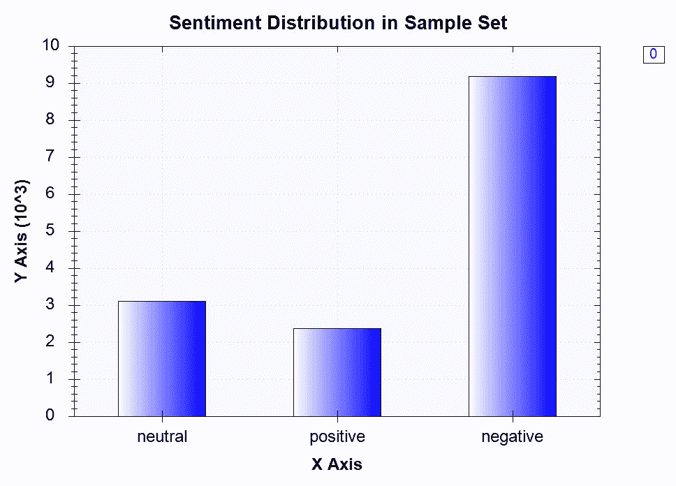

# 使用词元作为标记的数据分析

现在是时候查看实际数据，并寻找术语频率分布与推文不同情感之间的任何模式或差异了。我们将使用上一步的输出，并获取每个情感中最常出现的七个标记的分布。在这个例子中，我们使用了一个包含词元的术语矩阵。您可以自由地运行相同的分析，使用以单词为列的术语矩阵。分析推文中每个情感中最常使用的 N 个标记的代码可以在以下位置找到：[`github.com/yoonhwang/c-sharp-machine-learning/blob/master/ch.3/DataAnalyzer.cs`](https://github.com/yoonhwang/c-sharp-machine-learning/blob/master/ch.3/DataAnalyzer.cs)。

在这段代码中有一点需要注意。与上一章不同，我们需要为三个情感类别——中性、消极和积极——计算术语频率。以下是从完整代码中摘录的代码片段（第 54-73 行）：

```py
var neutralTermFrequencies = ColumnWiseSum(
    tweetLemmaDF.Where(
        x => x.Value.GetAs<int>("tweet_polarity") == 0
    ),
    "tweet_polarity"
).Sort().Reversed;

var positiveTermFrequencies = ColumnWiseSum(
    tweetLemmaDF.Where(
        x => x.Value.GetAs<int>("tweet_polarity") == 1
    ),
    "tweet_polarity"
).Sort().Reversed;

var negativeTermFrequencies = ColumnWiseSum(
    tweetLemmaDF.Where(
        x => x.Value.GetAs<int>("tweet_polarity") == 2
    ),
    "tweet_polarity"
).Sort().Reversed;
```

如您从代码中可以看到，我们为每个情感类别调用了`ColumnWiseSum`方法，这个方法的代码如下：

```py
private static Series<string, double> ColumnWiseSum(Frame<int, string> frame, string exclude)
{
    var sb = new SeriesBuilder<string, double>();
    foreach(string colname in frame.ColumnKeys)
    {
        double frequency = frame[colname].Sum();
        if (!colname.Equals(exclude))
        {
            sb.Add(colname, frequency);
        }
    }

    return sb.ToSeries();
}
```

如您从这段代码中看到的，它遍历每一列或术语，并计算该列内的所有值。由于我们使用了单热编码，简单的列求和将给我们 Twitter 数据集中每个术语的出现次数。一旦我们计算了所有列求和，我们就将它们作为 Deedle 系列对象返回。有了这些结果，我们按频率对术语进行排名，并将这些信息存储在三个单独的文件中，分别是`neutral-frequencies.csv`、`negative-frequencies.csv`和`positive-frequencies.csv`。我们将在后面的章节中使用术语频率输出进行特征工程和模型构建。

当您运行代码时，它将生成以下图表：

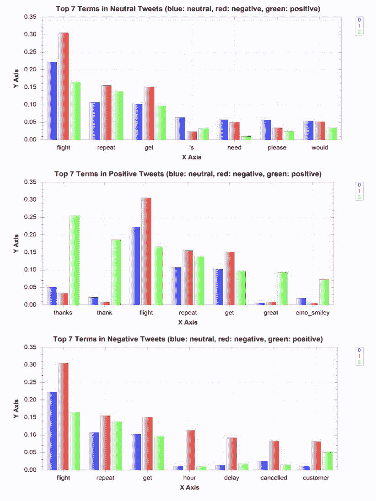

如您从图表中可以看到，不同情感之间的分布存在一些明显的差异。例如，**谢谢**和**很好**是积极推文中出现频率最高的七个词中的两个，而**延误**和**取消**则是消极推文中出现频率最高的七个词中的两个。直观上看，这些是有道理的。您通常会在表达对某人或某事的积极感受时使用**谢谢**和**很好**。另一方面，**延误**和**取消**与飞行或航空领域的负面事件相关。也许有些用户的航班延误或取消，他们就在推特上表达了自己的挫败感。另一个值得注意的有趣现象是，`emo_smiley`这个术语在积极推文中被列为出现频率最高的七个词中的第七位。如果您还记得，在上一个步骤中，我们将所有笑脸表情符号（如`:)`、`:D`等）分组并编码为`emo_smiley`。这告诉我们，表情符号可能在我们的模型学习如何分类每条推文的情感方面发挥重要作用。现在我们已经对数据的外观以及每种情感出现的术语有了大致的了解，让我们来谈谈在本章中我们将采用的特征工程技术。

# 使用词元化和表情符号进行特征工程

在上一节中，我们简要地讨论了词元。让我们更深入地了解一下什么是词元以及什么是词元化。根据一个词在句子中的使用方式和位置，这个词会以不同的形式出现。例如，单词`like`可以以`likes`或`liked`的形式出现，这取决于前面的内容。如果我们只是简单地将句子分词成单词，那么我们的程序将会把`like`、`likes`和`liked`看作是三个不同的标记。然而，这可能不是我们想要的。这三个词具有相同的意义，当我们构建模型时，将它们作为特征集中的同一个标记分组会很有用。这就是词元化的作用。词元是一个词的基本形式，词元化是根据每个词在句子中的使用部分将每个词转换成词元。在上面的例子中，`like`是`likes`和`liked`的词元，将`likes`和`liked`系统地转换成`like`就是词元化。

下面是一个使用 Stanford CoreNLP 进行词元化的例子：

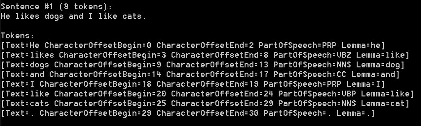

在这里，您可以看到`likes`和`like`都被词元化为`like`。这是因为这两个词在句子中都被用作动词，而动词形式的词元是`like`。让我们再看另一个例子：

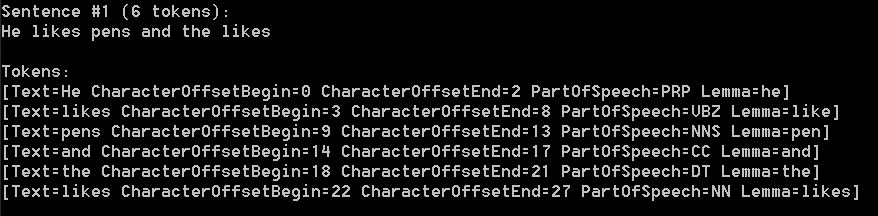

在这里，第一个 `likes` 和第二个 `likes` 有不同的词干。第一个有一个 `like` 作为其词干，而第二个有一个 `likes` 作为其词干。这是因为第一个被用作动词，而第二个被用作名词。正如您可以从这些例子中看到的那样，根据句子的不同部分，相同单词的词干可能会有所不同。对您的文本数据集进行词形还原可以大大减少特征空间的稀疏性和维度，并有助于模型在没有过多噪声的情况下更好地学习。

类似于词形还原，我们也把相似的表情符号分到了同一个组。这是基于这样的假设：相似的表情符号具有相似的含义。例如，`:)` 和 `:D` 几乎具有相同的含义，如果不是完全相同。在另一种情况下，根据用户的不同，冒号和括号的顺序可能不同。一些用户可能会输入 `:)`，但另一些用户可能会输入 `(:`。然而，这两者之间唯一的区别是冒号和括号的顺序，而含义是相同的。在所有这些情况下，我们都希望我们的模型能够学习到相同的情感，并且不会产生任何噪声。将相似的表情符号分组到同一个组，就像我们在上一步所做的那样，有助于减少模型的不必要噪声，并帮助它们从这些表情符号中学习到最多。

# 高斯贝叶斯与随机森林

现在终于到了训练我们的机器学习模型来预测推文的情感的时候了。在本节中，我们将尝试使用朴素贝叶斯和随机森林分类器。我们将要做两件与上一章不同的事情。首先，我们将把我们的样本集分成训练集和验证集，而不是运行 k 折交叉验证。这也是一种常用的技术，其中模型只从样本集的一个子集中学习，然后它们用未在训练时观察到的其余部分进行测试和验证。这样，我们可以测试模型在不可预见的数据集上的表现，并模拟它们在实际世界中的行为。我们将使用 Accord.NET 包中的 `SplitSetValidation` 类，将我们的样本集分成训练集和验证集，并为每个集合预先定义比例，并将学习算法拟合到训练集。

其次，我们的目标变量不再是二进制（0 或 1），与之前的第二章*垃圾邮件过滤*不同。相反，它可以取 0、1 或 2 的任何值，其中 0 代表中性情感推文，1 代表积极情感推文，2 代表消极情感推文。因此，我们现在处理的是一个多类分类问题，而不是二类分类问题。在评估我们的模型时，我们必须采取不同的方法。我们必须修改上一章中的准确率、精确率和召回率的计算代码，以计算本项目三个目标情感类别中的每个类别的这些数字。此外，当我们查看某些指标时，例如 ROC 曲线和 AUC，我们将在下一节讨论这些指标，我们必须使用一对一的方法。

首先，让我们看看如何在 Accord.NET 框架中使用 `SplitSetValidation` 类实例化我们的学习算法。以下是如何使用朴素贝叶斯分类器算法实例化一个 `SplitSetValidation` 对象的方法：

```py
var nbSplitSet = new SplitSetValidation<NaiveBayes<BernoulliDistribution>, double[]>()
{
    Learner = (s) => new NaiveBayesLearning<BernoulliDistribution>(),

    Loss = (expected, actual, p) => new ZeroOneLoss(expected).Loss(actual),

    Stratify = false,

    TrainingSetProportion = 0.8,

    ValidationSetProportion = 0.2
};
var nbResult = nbSplitSet.Learn(input, output);
SplitSetValidation object—TrainingSetProportionand ValidationSetProportion. As the name suggests, you can define what percentage of your sample set is should be used for training with the TrainingSetProportionparameter and what percentage of your sample set to be used for validation with the ValidationSetProportion parameter. Here in our code snippet, we are telling our program to use 80% of our sample for training and 20% for validation. In the last line of the code snippet, we fit a Naive Bayes classification model to the train set that was split from the sample set. Also, note here that we used BernoulliDistribution for our Naive Bayes classifier, as we used one-hot encoding to encode our features and all of our features have binary values, similar to what we did in the previous chapter.
```

与我们使用朴素贝叶斯分类器实例化 `SplitSetValidation` 对象的方式类似，你还可以按照以下方式实例化另一个对象：

```py
var rfSplitSet = new SplitSetValidation<RandomForest, double[]>()
{
    Learner = (s) => new RandomForestLearning()
    {
        NumberOfTrees = 100, // Change this hyperparameter for further tuning

        CoverageRatio = 0.5, // the proportion of variables that can be used at maximum by each tree

        SampleRatio = 0.7 // the proportion of samples used to train each of the trees

    },

    Loss = (expected, actual, p) => new ZeroOneLoss(expected).Loss(actual),

    Stratify = false,

    TrainingSetProportion = 0.7,

    ValidationSetProportion = 0.3
};
var rfResult = rfSplitSet.Learn(input, output);
```

我们将之前的代码替换为随机森林作为模型，以及 `RandomForestLearning` 作为学习算法。如果你仔细观察，会发现一些我们可以调整的 `RandomForestLearning` 的超参数。第一个是 `NumberOfTrees`。这个超参数允许你选择要进入你的随机森林中的决策树的数量。一般来说，随机森林中的树越多，性能越好，因为你实际上在森林中构建了更多的决策树。然而，性能的提升是以训练和预测时间为代价的。随着你在随机森林中增加树的数量，训练和预测将需要更多的时间。这里需要注意的其他两个参数是 `CoverageRatio` 和 `SampleRatio`。`CoverageRatio` 设置了每个树中使用的特征集的比例，而 `SampleRatio` 设置了每个树中使用的训练集的比例。较高的 `CoverageRatio` 和 `SampleRatio` 会提高森林中单个树的表现，但也会增加树之间的相关性。树之间的低相关性有助于减少泛化误差；因此，在单个树预测能力和树之间的相关性之间找到一个良好的平衡对于构建一个好的随机森林模型至关重要。调整和实验这些超参数的各种组合可以帮助你避免过拟合问题，并在训练随机森林模型时提高你的模型性能。我们建议你构建多个具有不同超参数组合的随机森林分类器，并实验它们对模型性能的影响。

我们用来训练朴素贝叶斯和随机森林分类模型并输出验证结果的完整代码可以在以下链接找到：[`github.com/yoonhwang/c-sharp-machine-learning/blob/master/ch.3/TwitterSentimentModeling.cs`](https://github.com/yoonhwang/c-sharp-machine-learning/blob/master/ch.3/TwitterSentimentModeling.cs)。让我们更仔细地看看这段代码。在第 36-41 行，它首先读取我们数据准备步骤中构建的标记矩阵文件`tweet-lemma.csv`。然后在第 43-51 行，我们读取我们数据分析步骤中构建的词频文件`positive-frequencies.csv`和`negative-frequencies.csv`。类似于我们在上一章中做的，我们在第 64 行基于词的出现次数进行特征选择。在这个例子中，我们尝试了 5、10、50、100 和 150 作为样本推文中词出现次数的最小阈值。从第 65 行开始，我们迭代这些阈值，并开始训练和评估朴素贝叶斯和随机森林分类器。每次在训练集上训练一个模型后，它就会对在训练时间内未观察到的验证集进行运行。

以下是在训练集和验证集上运行训练好的朴素贝叶斯模型以测量样本内和样本外性能的完整代码（第 113-135 行）的一部分：

```py
// Get in-sample & out-sample prediction results for NaiveBayes Classifier
var nbTrainedModel = nbResult.Model;

int[] nbTrainSetIDX = nbSplitSet.IndicesTrainingSet;
int[] nbTestSetIDX = nbSplitSet.IndicesValidationSet;

Console.WriteLine("* Train Set Size: {0}, Test Set Size: {1}", nbTrainSetIDX.Length, nbTestSetIDX.Length);

int[] nbTrainPreds = new int[nbTrainSetIDX.Length];
int[] nbTrainActual = new int[nbTrainSetIDX.Length];
for (int i = 0; i < nbTrainPreds.Length; i++)
{
   nbTrainActual[i] = output[nbTrainSetIDX[i]];
   nbTrainPreds[i] = nbTrainedModel.Decide(input[nbTrainSetIDX[i]]);
}

int[] nbTestPreds = new int[nbTestSetIDX.Length];
int[] nbTestActual = new int[nbTestSetIDX.Length];
for (int i = 0; i < nbTestPreds.Length; i++)
{
   nbTestActual[i] = output[nbTestSetIDX[i]];
   nbTestPreds[i] = nbTrainedModel.Decide(input[nbTestSetIDX[i]]);
}
```

以下是在训练集和验证集上运行训练好的随机森林模型以测量样本内和样本外性能的完整代码（第 167-189 行）的一部分：

```py
// Get in-sample & out-sample prediction results for RandomForest Classifier
var rfTrainedModel = rfResult.Model;

int[] rfTrainSetIDX = rfSplitSet.IndicesTrainingSet;
int[] rfTestSetIDX = rfSplitSet.IndicesValidationSet;

Console.WriteLine("* Train Set Size: {0}, Test Set Size: {1}", rfTrainSetIDX.Length, rfTestSetIDX.Length);

int[] rfTrainPreds = new int[rfTrainSetIDX.Length];
int[] rfTrainActual = new int[rfTrainSetIDX.Length];
for (int i = 0; i < rfTrainPreds.Length; i++)
{
    rfTrainActual[i] = output[rfTrainSetIDX[i]];
    rfTrainPreds[i] = rfTrainedModel.Decide(input[rfTrainSetIDX[i]]);
}

int[] rfTestPreds = new int[rfTestSetIDX.Length];
int[] rfTestActual = new int[rfTestSetIDX.Length];
for (int i = 0; i < rfTestPreds.Length; i++)
{
    rfTestActual[i] = output[rfTestSetIDX[i]];
    rfTestPreds[i] = rfTrainedModel.Decide(input[rfTestSetIDX[i]]);
}
```

让我们更仔细地看看这些。为了简洁起见，我们只看随机森林模型的情况，因为朴素贝叶斯分类器的情况将相同。在第 168 行，我们首先从学习结果中获取训练好的模型。然后，在第 170-171 行，我们从`SplitSetValidation`对象中获取样本内（训练集）和样本外（测试/验证集）的索引，以便我们可以迭代每一行或记录并做出预测。我们迭代这个过程两次——一次在第 175-181 行的样本内训练集上，再次在第 183-189 行的样本外验证集上。

一旦我们在训练集和测试集上获得了预测结果，我们就将这些结果通过一些验证方法进行验证（第 138-141 行用于朴素贝叶斯分类器，第 192-196 行用于随机森林分类器）。我们为这个项目专门编写了两种方法来验证模型——`PrintConfusionMatrix`和`DrawROCCurve`。`PrintConfusionMatrix`是我们在第二章，“垃圾邮件过滤”中使用的更新版本，现在它打印的是一个 3 x 3 的混淆矩阵，而不是 2 x 2 的混淆矩阵。另一方面，`DrawROCCurve`方法为这个项目引入了一些新的概念和新的模型验证方法。让我们在下一节更详细地讨论这些新的评估指标，这是我们在这个项目中使用的。

# 模型验证——ROC 曲线和 AUC

如前所述，我们在本章中使用不同的模型验证指标：ROC 曲线和 AUC。ROC 曲线是在各种阈值下，真实正率与假正率的关系图。曲线上的每个点代表在某个概率阈值下对应的真实正率和假正率对。它通常用于从不同的模型候选者中选择最佳和最优化模型。

ROC 曲线下的面积（AUC）衡量模型区分两个类别的好坏。在二元分类的情况下，AUC 衡量模型区分正结果和负结果的好坏。由于我们在这个项目中处理的是一个多类分类问题，我们使用一对一的方法来构建 ROC 曲线并计算 AUC。例如，一条 ROC 曲线可以将正面推文作为正面结果，将中立和负面推文作为负面结果，而另一条 ROC 曲线可以将中立推文作为正面结果，将正面和负面推文作为负面结果。如图表所示，我们为每个构建的模型绘制了三个 ROC 图表——一个用于中立与剩余（正面和负面）的对比，一个用于正面与剩余（中立和负面）的对比，以及一个用于负面与剩余（中立和正面）的对比。AUC 数值越高，模型越好，因为它表明模型有更大的可能性区分正类别和负类别。

以下图表显示了具有**10**个最小词频的朴素贝叶斯分类器的 ROC 曲线：

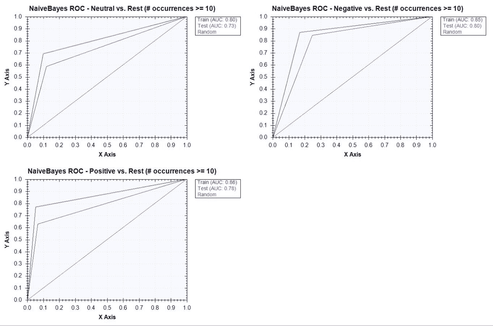

以下图表显示了具有**50**个最小词频的朴素贝叶斯分类器的 ROC 曲线：

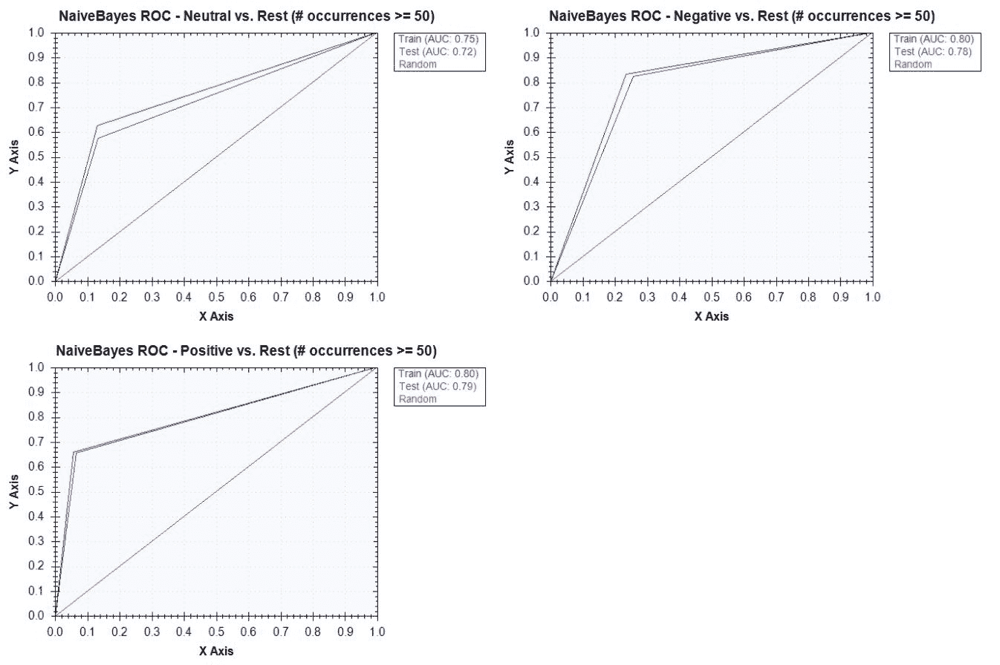

以下图表显示了具有**150**个最小词频的朴素贝叶斯分类器的 ROC 曲线：

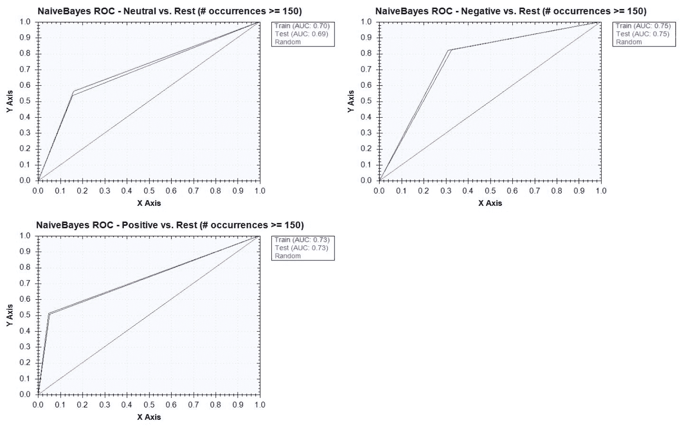

如您从图表中可以看到，我们也可以通过观察训练和测试结果曲线之间的差距来从 ROC 图表中检测过拟合问题。差距越大，模型过拟合的程度就越高。如果您看第一个案例，我们只过滤掉那些在推文中出现次数少于十次的术语，两个曲线之间的差距就很大。随着我们提高阈值，我们可以看到差距减小。当我们选择最终模型时，我们希望训练 ROC 曲线和测试/验证 ROC 曲线尽可能小。由于这种分辨率是以模型性能为代价的，我们需要找到这个权衡的正确截止线。

让我们现在看看我们的随机森林分类器中的一个样本。以下是从拟合随机森林分类器中得到的一个样本结果：

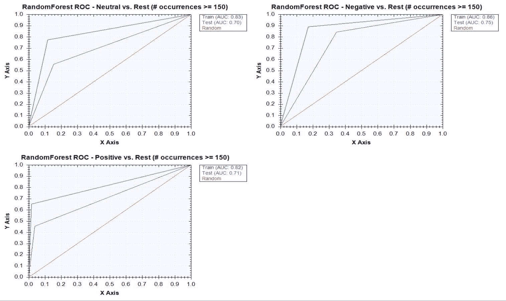

集成方法，例如随机森林，通常在分类问题中表现良好，通过集成更多树可以提高准确率。然而，它们也有一些局限性，其中之一在前面的随机森林分类器示例结果中已经展示。对于所有基于决策树模型而言，随机森林模型倾向于过拟合，尤其是在它试图从许多分类变量中学习时。正如从随机森林分类器的 ROC 曲线中可以看到的，训练集和测试集 ROC 曲线之间的差距很大，尤其是与朴素贝叶斯分类器的 ROC 曲线相比。具有最小词频出现阈值 150 的朴素贝叶斯分类器在训练集和测试集 ROC 曲线之间几乎没有差距，而相同阈值下的随机森林分类器在两个 ROC 曲线之间显示出较大的差距。在处理存在大量分类变量的数据集时，我们需要小心选择模型，并特别注意调整超参数，例如`NumberOfTrees`、`CoverageRatio`和`SampleRatio`*，*以优化随机森林模型。

# 摘要

在本章中，我们为 Twitter 情感分析构建和训练了更高级的分类模型。我们将前一章学到的知识应用于一个具有更复杂文本数据的多元分类问题。我们首先通过设置我们的环境开始，使用斯坦福 CoreNLP 包进行分词、词性标注和词形还原，在数据准备和分析步骤中。然后，我们将原始 Twitter 数据集通过分词和词形还原转换为一个独热编码矩阵。在数据准备步骤中，我们还讨论了如何使用正则表达式将相似的表情符号分组，并从推文中移除不必要的文本，例如 URL、Twitter ID 和原始数字。在数据分析步骤中，我们进一步分析了常用术语和表情符号的分布，并看到词形还原和将相似的表情符号分组如何有助于减少数据集中的噪声。在之前的步骤中获取数据和洞察后，我们尝试使用朴素贝叶斯和随机森林分类器构建多元分类模型。在构建这些模型的过程中，我们介绍了一种常用的模型验证技术，即将样本集分为两个子集，训练集和验证集，使用训练集来拟合模型，使用验证集来评估模型性能。我们还介绍了新的模型验证指标，ROC 曲线和 AUC，我们可以使用这些指标在模型候选者中选择最佳和最优化模型。

在下一章中，我们将转换方向，开始构建回归模型，其中目标变量是连续变量。我们将使用外汇汇率数据集来构建时间序列特征，并探索一些其他用于回归问题的机器学习模型。我们还将讨论评估回归模型性能与分类模型性能的不同之处。
