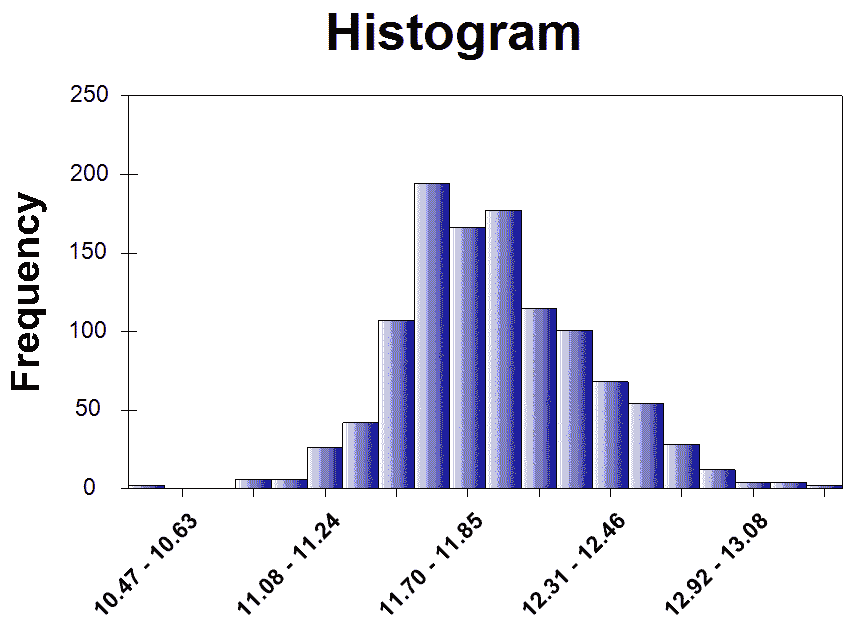

# 第五章：房屋和财产的公允价值

在本章中，我们将扩展我们在 C#中构建回归机器学习（ML）模型的知识和技能。在上一章中，我们在外汇汇率数据集上构建了线性回归和线性支持向量机模型，其中所有特征都是连续变量。然而，我们将处理一个更复杂的数据集，其中一些特征是分类变量，而其他一些是连续变量。

在本章中，我们将使用一个包含房屋众多属性且变量类型混合的房价数据集。使用这些数据，我们将开始研究两种常见的分类变量类型（有序与无序）以及住房数据集中一些分类变量的分布。我们还将研究数据集中一些连续变量的分布以及使用对数变换对显示偏态分布的变量的好处。然后，我们将学习如何编码和工程化这些分类特征，以便我们可以拟合机器学习模型。与上一章我们探索支持向量机（SVM）基础知识不同，我们将为我们的 SVM 模型应用不同的核方法，并观察它如何影响模型性能。

与上一章类似，我们将使用**均方根误差**（**RMSE**）、R²以及实际值与预测值的对比图来评估我们的机器学习模型的性能。在本章结束时，你将更好地理解如何处理分类变量，如何为回归模型编码和工程化这些特征，如何应用各种核方法来构建支持向量机（SVM）模型，以及如何构建预测房屋公允价值的模型。

在本章中，我们将涵盖以下主题：

+   房屋/财产公允价值项目的问题定义

+   分类变量与连续变量的数据分析

+   特征工程和编码

+   线性回归与带核的支持向量机

+   使用 RMSE、R²和实际值与预测值对比图进行模型验证

# 问题定义

让我们从了解我们将要构建的机器学习模型的具体内容开始这一章。当你寻找要购买的房屋或财产时，你会考虑你看到的这些房屋或财产的众多属性。你可能正在查看卧室和浴室的数量，你能在你的车库中停放多少辆车，社区，房屋的材料或装饰，等等。所有这些房屋或财产的属性都进入了你决定为特定财产支付的价格，或者你如何与卖家协商价格的决定。然而，理解并估计财产的公允价值是非常困难的。通过拥有一个预测每个财产公允价值或最终价格的模型，你可以在与卖家协商时做出更明智的决定。

为了构建预测房屋公平价值的模型，我们将使用一个包含 79 个解释变量的数据集，这些变量涵盖了美国爱荷华州艾姆斯市几乎所有住宅的属性及其 2006 年至 2010 年的最终销售价格。这个数据集由杜鲁门州立大学的迪安·德·科克([`ww2.amstat.org/publications/jse/v19n3/decock.pdf`](https://ww2.amstat.org/publications/jse/v19n3/decock.pdf))编制，可以通过此链接下载：[`www.kaggle.com/c/house-prices-advanced-regression-techniques/data`](https://www.kaggle.com/c/house-prices-advanced-regression-techniques/data)。利用这些数据，我们将构建包含关于房屋面积或不同部分尺寸、房屋使用的风格和材料、房屋不同部分的状况和表面处理以及描述每栋房屋信息的其他各种属性的特征。使用这些特征，我们将探索不同的回归机器学习模型，如线性回归、线性支持向量机以及具有多项式和高斯核的**支持向量机（SVMs**）。然后，我们将通过查看 RMSE、R²以及实际值与预测值之间的图表来评估这些模型。

为了总结我们对房屋和财产公平价值项目的定义问题：

+   问题是什么？ 我们需要一个回归模型来预测美国爱荷华州艾姆斯市的住宅公平价值，这样我们就可以在购买房屋时更好地理解和做出更明智的决策。

+   为什么这是一个问题？ 由于决定房屋或财产公平价值具有复杂性和众多变量，拥有一个能够预测并告知购房者他们所看房屋预期价值的机器学习模型是有利的。

+   解决这个问题的方法有哪些？ 我们将使用一个包含 79 个解释变量的预编译数据集，这些变量包含了美国爱荷华州艾姆斯市住宅的信息，并构建和编码混合类型（既是分类变量也是连续变量）的特征。然后，我们将探索使用不同核函数的线性回归和支持向量机来预测房屋的公平价值。我们将通过查看 RMSE、R²以及实际值与预测值之间的图表来评估模型候选者。

+   成功的标准是什么？ 我们希望我们的房价预测尽可能接近实际的房屋销售价格，因此我们希望获得尽可能低的 RMSE（均方根误差），同时不损害我们的拟合优度指标 R²，以及实际值与预测值之间的图表。

# 分类变量与连续变量

现在，让我们开始查看实际的数据集。您可以点击以下链接：[`www.kaggle.com/c/house-prices-advanced-regression-techniques/data`](https://www.kaggle.com/c/house-prices-advanced-regression-techniques/data) 下载`train.csv`和`data_description.txt`文件。我们将使用`train.csv`文件来构建模型，而`data_description.txt`文件将帮助我们更好地理解数据集的结构，特别是关于我们已有的分类变量。

如果你查看训练数据文件和描述文件，你可以很容易地找到一些具有特定名称或代码的变量，它们代表每栋房屋属性的特定类型。例如，`Foundation`变量可以取`BrkTil`、`CBlock`、`PConc`、`Slab`、`Stone`和`Wood`中的任何一个值，其中这些值或代码分别代表房屋建造时所用的地基类型——砖和瓦、混凝土块、浇筑混凝土、板、石头和木材。另一方面，如果你查看数据中的`TotalBsmtSF`变量，你可以看到它可以取任何数值，并且这些值是连续的。如前所述，这个数据集包含混合类型的变量，我们在处理既有分类变量又有连续变量的数据集时需要谨慎处理。

# 非序数分类变量

让我们首先看看一些分类变量及其分布。我们将首先查看的建筑属性是建筑类型。显示建筑类型分布的柱状图的代码如下：

```py
// Categorical Variable #1: Building Type
Console.WriteLine("\nCategorical Variable #1: Building Type");
var buildingTypeDistribution = houseDF.GetColumn&lt;string&gt;(
    "BldgType"
).GroupBy&lt;string&gt;(x =&gt; x.Value).Select(x =&gt; (double)x.Value.KeyCount);
buildingTypeDistribution.Print();

var buildingTypeBarChart = DataBarBox.Show(
    buildingTypeDistribution.Keys.ToArray(),
    buildingTypeDistribution.Values.ToArray()
);
buildingTypeBarChart.SetTitle("Building Type Distribution (Categorical)");
```

当你运行这段代码时，它将显示一个类似于以下的柱状图：


如您从这张柱状图中可以看出，我们数据集中大多数的建筑类型是 1Fam，这代表着*独立单户住宅*建筑类型。第二常见的建筑类型是 TwnhsE，代表着*联排别墅端单元*建筑类型。

让我们再看看一个分类变量，地块配置（数据集中的`LotConfig`字段）。绘制地块配置分布柱状图的代码如下：

```py
// Categorical Variable #2: Lot Configuration
Console.WriteLine("\nCategorical Variable #1: Building Type");
var lotConfigDistribution = houseDF.GetColumn&lt;string&gt;(
    "LotConfig"
).GroupBy&lt;string&gt;(x =&gt; x.Value).Select(x =&gt; (double)x.Value.KeyCount);
lotConfigDistribution.Print();

var lotConfigBarChart = DataBarBox.Show(
    lotConfigDistribution.Keys.ToArray(),
    lotConfigDistribution.Values.ToArray()
);
lotConfigBarChart.SetTitle("Lot Configuration Distribution (Categorical)");
```

当你运行这段代码时，它将显示以下柱状图：


如您从这张柱状图中可以看出，内部地块是我们数据集中最常见的地块配置，其次是角地块。

# 序数分类变量

我们刚才查看的两个分类变量没有自然的顺序。一种类型并不在另一种类型之前，或者一种类型并不比另一种类型更重要。然而，有些分类变量具有自然顺序，我们称这样的分类变量为序数分类变量。例如，当你将材料的品质从 1 到 10 进行排名时，其中 10 代表最佳，1 代表最差，这就存在一个自然顺序。让我们看看这个数据集中的一些序数分类变量。

我们将要查看的第一个有序分类变量是`OverallQual`属性，它代表房屋的整体材料和装修。查看该变量分布的代码如下：

```py
// Ordinal Categorical Variable #1: Overall material and finish of the house
Console.WriteLine("\nOrdinal Categorical #1: Overall material and finish of the house");
var overallQualDistribution = houseDF.GetColumn&lt;string&gt;(
    "OverallQual"
).GroupBy&lt;int&gt;(
    x =&gt; Convert.ToInt32(x.Value)
).Select(
    x =&gt; (double)x.Value.KeyCount
).SortByKey().Reversed;
overallQualDistribution.Print();

var overallQualBarChart = DataBarBox.Show(
    overallQualDistribution.Keys.Select(x =&gt; x.ToString()),
    overallQualDistribution.Values.ToArray()
);
overallQualBarChart.SetTitle("Overall House Quality Distribution (Ordinal)");
```

当你运行这段代码时，它将按从 10 到 1 的顺序显示以下条形图：


如预期的那样，在*非常优秀*（编码为 10）或*优秀*（编码为 9）类别中的房屋数量比在*高于平均水平*（编码为 6）或*平均水平*（编码为 5）类别中的房屋数量要少。

我们将要查看的另一个有序分类变量是`ExterQual`变量，它代表外部质量。查看该变量分布的代码如下：

```py
// Ordinal Categorical Variable #2: Exterior Quality
Console.WriteLine("\nOrdinal Categorical #2: Exterior Quality");
var exteriorQualDistribution = houseDF.GetColumn&lt;string&gt;(
    "ExterQual"
).GroupBy&lt;string&gt;(x =&gt; x.Value).Select(
    x =&gt; (double)x.Value.KeyCount
)[new string[] { "Ex", "Gd", "TA", "Fa" }];
exteriorQualDistribution.Print();

var exteriorQualBarChart = DataBarBox.Show(
    exteriorQualDistribution.Keys.Select(x =&gt; x.ToString()),
    exteriorQualDistribution.Values.ToArray()
);
exteriorQualBarChart.SetTitle("Exterior Quality Distribution (Ordinal)");
```

当你运行这段代码时，它将显示以下条形图：


与`OverallQual`变量不同，`ExterQual`变量没有用于排序的数值。在我们的数据集中，它有以下几种值：`Ex`、`Gd`、`TA`和`FA`，分别代表优秀、良好、平均/典型和公平。尽管这个变量没有数值，但它显然有一个自然排序，其中优秀类别（Ex）代表外部材料质量的最佳，良好类别（Gd）代表外部材料质量的第二佳。在特征工程步骤中，我们将讨论如何为我们的未来模型构建步骤编码此类变量。

# 连续变量

我们已经查看了我们数据集中的两种类型的分类变量。然而，数据集中还有另一种类型的变量；连续变量。与分类变量不同，连续变量可以取无限多个值。例如，房屋地下室面积的平方英尺可以是任何正数。一栋房屋可以有 0 平方英尺的地下室面积（或没有地下室），或者一栋房屋可以有 1,000 平方英尺的地下室面积。我们将要查看的第一个连续变量是`1stFlrSF`，它代表一楼平方英尺。以下代码展示了我们如何为`1stFlrSF`构建直方图：

```py
// Continuous Variable #1-1: First Floor Square Feet
var firstFloorHistogram = HistogramBox
.Show(
    houseDF.DropSparseRows()["1stFlrSF"].ValuesAll.ToArray(),
    title: "First Floor Square Feet (Continuous)"
)
.SetNumberOfBins(20);
```

当你运行这段代码时，将显示以下直方图：


从这张图表中明显可以看出，它在正方向上有一个长尾，换句话说，分布是右偏的。数据中的偏斜性可能会在我们构建机器学习模型时对我们产生不利影响。处理数据集中这种偏斜性的一种方法是对数据进行一些转换。一种常用的转换方法是对数转换，即取给定变量的对数值。在这个例子中，以下代码展示了我们如何对`1stFlrSF`变量应用对数转换并显示转换变量的直方图：

```py
// Continuous Variable #1-2: Log of First Floor Square Feet
var logFirstFloorHistogram = HistogramBox
.Show(
    houseDF.DropSparseRows()["1stFlrSF"].Log().ValuesAll.ToArray(),
    title: "First Floor Square Feet - Log Transformed (Continuous)"
)
.SetNumberOfBins(20);
```

当你运行这段代码时，你将看到以下直方图：


如您从这张图表中可以看到，与之前查看的同一变量的直方图相比，分布看起来更加对称，更接近我们熟悉的钟形。对数变换通常用于处理数据集中的偏斜，并使分布更接近正态分布。让我们看看我们数据集中的另一个连续变量。以下代码用于展示 `GarageArea` 变量的分布，它代表车库的面积（平方英尺）：

```py
// Continuous Variable #2-1: Size of garage in square feet
var garageHistogram = HistogramBox
.Show(
    houseDF.DropSparseRows()["GarageArea"].ValuesAll.ToArray(),
    title: "Size of garage in square feet (Continuous)"
)
.SetNumberOfBins(20);
```

当你运行此代码时，你会看到以下直方图：


与 `1stFlrSF` 的前一个案例类似，它也是右偏斜的，尽管看起来偏斜的程度小于 `1stFlrSF`。我们使用了以下代码对 `GarageArea` 变量应用对数变换：

```py
// Continuous Variable #2-2: Log of Value of miscellaneous feature
var logGarageHistogram = HistogramBox
.Show(
    houseDF.DropSparseRows()["GarageArea"].Log().ValuesAll.ToArray(),
    title: "Size of garage in square feet - Log Transformed (Continuous)"
)
.SetNumberOfBins(20);
```

当你运行此代码时，将显示以下直方图图表：


如预期的那样，当对变量应用对数变换时，分布看起来更接近正态分布。

# 目标变量 - 销售价格

在我们进行特征工程步骤之前，还有一个变量需要查看；即目标变量。在这个房屋公允价值项目中，我们的预测目标变量是 `SalePrice`，它代表美国爱荷华州艾姆斯市从 2006 年到 2010 年销售的每套住宅的最终销售价格（以美元计）。由于销售价格可以取任何正数值，因此它是一个连续变量。让我们首先看看我们是如何为销售价格变量构建直方图的：

```py
// Target Variable: Sale Price
var salePriceHistogram = HistogramBox
.Show(
    houseDF.DropSparseRows()["SalePrice"].ValuesAll.ToArray(),
    title: "Sale Price (Continuous)"
)
.SetNumberOfBins(20);
```

当你运行此代码时，将显示以下直方图图表：


与之前连续变量的案例类似，*SalePrice* 的分布具有较长的右尾，并且严重向右偏斜。这种偏斜通常会对回归模型产生不利影响，因为一些模型，例如线性回归模型，假设变量是正态分布的。正如之前所讨论的，我们可以通过应用对数变换来解决这个问题。以下代码展示了我们如何对销售价格变量进行对数变换并构建直方图：

```py
// Target Variable: Sale Price - Log Transformed
var logSalePriceHistogram = HistogramBox
.Show(
    houseDF.DropSparseRows()["SalePrice"].Log().ValuesAll.ToArray(),
    title: "Sale Price - Log Transformed (Continuous)"
)
.SetNumberOfBins(20);
```

当你运行此代码时，你会看到以下针对对数变换后的销售价格变量的直方图：



如预期的那样，`SalePrice` 变量的分布看起来与正态分布非常接近。我们将使用这个对数变换后的 `SalePrice` 变量作为我们未来模型构建步骤的目标变量。

此数据分析步骤的完整代码可以在以下链接中找到：[`github.com/yoonhwang/c-sharp-machine-learning/blob/master/ch.5/DataAnalyzer.cs`](https://github.com/yoonhwang/c-sharp-machine-learning/blob/master/ch.5/DataAnalyzer.cs)。

# 特征工程和编码

现在我们已经查看过我们的数据集以及分类、连续和目标变量的分布，让我们开始为我们的机器学习模型构建特征。正如我们之前讨论的，我们数据集中的分类变量有特定的字符串值来表示每种变量类型。然而，正如你可能已经清楚的那样，我们不能使用字符串类型来训练我们的机器学习模型。所有变量的值都需要是数值型的，以便能够用于拟合模型。处理具有多种类型或类别的分类变量的一种方法是通过创建虚拟变量。

# 虚拟变量

虚拟变量是一个变量，它取 0 或 1 的值来指示给定的类别或类型是否存在。例如，在`BldgType`变量的情况下，它有五个不同的类别`1Fam`、`2FmCon`、`Duplx`、`TwnhsE`和`Twnhs`，我们将创建五个虚拟变量，其中每个虚拟变量代表在给定记录中这些五个类别中的每一个的存在或不存在。以下是如何进行虚拟变量编码的一个示例：


如您从本例中可以看到，建筑类型中每个类别的存在和不存在都被编码为单独的虚拟变量，值为`0`或`1`。例如，对于 ID 为`1`的记录，建筑类型是`1Fam`，这在新变量`BldgType_1Fam`中编码为值 1，而在其他四个新变量`BldgType_2fmCon`、`BldgType_Duplex`、`BldgType_TwnhsE`和`BldgType_Twnhs`中编码为 0。另一方面，对于 ID 为`10`的记录，建筑类型是`2fmCon`，这在新变量`BldgType_2fmCon`中编码为值 1，而在其他四个新变量`BldgType_1Fam`、`BldgType_Duplex`、`BldgType_TwnhsE`和`BldgType_Twnhs`中编码为 0。

对于本章，我们为以下列表中的分类变量创建了虚拟变量：

```py
string[] categoricalVars = new string[]
{
    "Alley", "BldgType", "BsmtCond", "BsmtExposure", "BsmtFinType1", "BsmtFinType2",
    "BsmtQual", "CentralAir", "Condition1", "Condition2", "Electrical", "ExterCond",
    "Exterior1st", "Exterior2nd", "ExterQual", "Fence", "FireplaceQu", "Foundation",
    "Functional", "GarageCond", "GarageFinish", "GarageQual", "GarageType",
    "Heating", "HeatingQC", "HouseStyle", "KitchenQual", "LandContour", "LandSlope", 
    "LotConfig", "LotShape", "MasVnrType", "MiscFeature", "MSSubClass", "MSZoning", 
    "Neighborhood", "PavedDrive", "PoolQC", "RoofMatl", "RoofStyle", 
    "SaleCondition", "SaleType", "Street", "Utilities"
};
```

以下代码显示了我们所编写的一种创建和编码虚拟变量的方法：

```py
private static Frame&lt;int, string&gt; CreateCategories(Series&lt;int, string&gt; rows, string originalColName)
{

    var categoriesByRows = rows.GetAllValues().Select((x, i) =&gt;
    {
        // Encode the categories appeared in each row with 1
        var sb = new SeriesBuilder&lt;string, int&gt;();
        sb.Add(String.Format("{0}_{1}", originalColName, x.Value), 1);

        return KeyValue.Create(i, sb.Series);
    });

    // Create a data frame from the rows we just created
    // And encode missing values with 0
    var categoriesDF = Frame.FromRows(categoriesByRows).FillMissing(0);

    return categoriesDF;
}
```

如您从该方法的第 8 行中可以看到，我们在新创建的虚拟变量前加上原始分类变量的名称，并在其后加上每个类别。例如，属于`1Fam`类别的`BldgType`变量将被编码为`BldgType_1Fam`。然后，在第 15 行的`CreateCategories`方法中，我们将所有其他值编码为 0，以表示在给定的分类变量中不存在此类类别。

# 特征编码

现在我们知道了哪些分类变量需要编码，并为这些分类变量创建了一个虚拟变量编码方法，是时候构建一个包含特征及其值的 DataFrame 了。让我们首先看看以下代码片段中我们是如何创建特征 DataFrame 的：

```py
var featuresDF = Frame.CreateEmpty&lt;int, string&gt;();

foreach(string col in houseDF.ColumnKeys)
{
    if (categoricalVars.Contains(col))
    {
        var categoryDF = CreateCategories(houseDF.GetColumn&lt;string&gt;(col), col);

        foreach (string newCol in categoryDF.ColumnKeys)
        {
            featuresDF.AddColumn(newCol, categoryDF.GetColumn&lt;int&gt;(newCol));
        }
    }
    else if (col.Equals("SalePrice"))
    {
        featuresDF.AddColumn(col, houseDF[col]);
        featuresDF.AddColumn("Log"+col, houseDF[col].Log());
    }
    else
    {
        featuresDF.AddColumn(col, houseDF[col].Select((x, i) =&gt; x.Value.Equals("NA")? 0.0: (double) x.Value));
    }
}
featuresDF(in line 1), and start adding in features one by one. For those categorical variables for which we are going to create dummy variables, we are calling the encoding method, CreateCategories, that we wrote previously and then adding the newly created dummy variable columns to the featuresDF data frame (in lines 5-12).  For the SalePrice variable, which is the target variable for this project, we are applying log transformation and adding it to the featuresDF data frame (in lines 13-17). Lastly, we append all the other continuous variables, after replacing the NA values with 0s, to the featuresDF data frame (in lines 18-20).
```

一旦我们为模型训练创建了并编码了所有特征，我们就将这个`featuresDF` DataFrame 导出为`.csv`文件。以下代码显示了如何将 DataFrame 导出为`.csv`文件：

```py
string outputPath = Path.Combine(dataDirPath, "features.csv");
Console.WriteLine("Writing features DF to {0}", outputPath);
featuresDF.SaveCsv(outputPath);
```

现在我们有了所有必要的特征，我们可以开始构建机器学习模型来预测房屋的公允价值。特征编码和工程的全代码可以在以下链接中找到：[`github.com/yoonhwang/c-sharp-machine-learning/blob/master/ch.5/FeatureEngineering.cs`](https://github.com/yoonhwang/c-sharp-machine-learning/blob/master/ch.5/FeatureEngineering.cs)。

# 线性回归与核支持向量机

在我们开始训练机器学习模型之前，我们需要将我们的数据集分成训练集和测试集。在本节中，我们将通过随机子选择和按预定义比例划分索引来将样本集分成训练集和测试集。我们将用于将数据集分成训练集和测试集的代码如下：

```py
// Split the sample set into train and test sets
double trainProportion = 0.8;

int[] shuffledIndexes = featuresDF.RowKeys.ToArray();
shuffledIndexes.Shuffle();

int trainSetIndexMax = (int)(featuresDF.RowCount * trainProportion);
int[] trainIndexes = shuffledIndexes.Where(i =&gt; i &lt; trainSetIndexMax).ToArray();
int[] testIndexes = shuffledIndexes.Where(i =&gt; i &gt;= trainSetIndexMax).ToArray();

var trainSet = featuresDF.Where(x =&gt; trainIndexes.Contains(x.Key));
var testSet = featuresDF.Where(x =&gt; testIndexes.Contains(x.Key));

Console.WriteLine("\nTrain Set Shape: ({0}, {1})", trainSet.RowCount, trainSet.ColumnCount);
Console.WriteLine("Test Set Shape: ({0}, {1})", testSet.RowCount, testSet.ColumnCount);
featuresDF data frame that we created in the previous feature engineering and encoding step into train and test sets.
```

一旦我们准备好了这些训练和测试数据框，我们需要从数据框中过滤掉不必要的列，因为训练和测试数据框目前有诸如`SalePrice`和`Id`等列的值。然后，我们将不得不将这两个数据框转换为双精度数组数组，这些数组将被输入到我们的学习算法中。过滤掉训练和测试数据框中不需要的列以及将两个数据框转换为数组数组的代码如下：

```py
string targetVar = "LogSalePrice";
string[] features = featuresDF.ColumnKeys.Where(
    x =&gt; !x.Equals("Id") && !x.Equals(targetVar) && !x.Equals("SalePrice")
).ToArray();

double[][] trainX = BuildJaggedArray(
    trainSet.Columns[features].ToArray2D&lt;double&gt;(),
    trainSet.RowCount,
    features.Length
);
double[][] testX = BuildJaggedArray(
    testSet.Columns[features].ToArray2D&lt;double&gt;(),
    testSet.RowCount,
    features.Length
);

double[] trainY = trainSet[targetVar].ValuesAll.ToArray();
double[] testY = testSet[targetVar].ValuesAll.ToArray();
```

# 线性回归

本章将要探索的第一个机器学习模型用于房屋价格预测项目是线性回归模型。你应该已经熟悉使用 Accord.NET 框架在 C#中构建线性回归模型。我们使用以下代码构建线性回归模型：

```py
Console.WriteLine("\n**** Linear Regression Model ****");
// OLS learning algorithm
var ols = new OrdinaryLeastSquares()
{
    UseIntercept = true,
    IsRobust = true
};

// Fit a linear regression model
MultipleLinearRegression regFit = ols.Learn(
    trainX,
    trainY
);

// in-sample predictions
double[] regInSamplePreds = regFit.Transform(trainX);
// out-of-sample predictions
double[] regOutSamplePreds = regFit.Transform(testX);
```

本章的线性回归模型代码与上一章代码的唯一区别是传递给`OrdinaryLeastSquares`学习算法的`IsRobust`参数。正如其名所示，它使学习算法拟合一个更稳健的线性回归模型，这意味着它对异常值不太敏感。当我们有非正态分布的变量时，就像本项目的情况一样，在拟合线性回归模型时，这通常会导致问题，因为传统的线性回归模型对非正态分布的异常值很敏感。将此参数设置为`true`有助于解决这个问题。

# 线性支持向量机

在本章中，我们将要实验的第二种学习算法是线性支持向量机。以下代码展示了我们如何构建线性支持向量机模型：

```py
Console.WriteLine("\n**** Linear Support Vector Machine ****");
// Linear SVM Learning Algorithm
var teacher = new LinearRegressionNewtonMethod()
{
    Epsilon = 0.5,
    Tolerance = 1e-5,
    UseComplexityHeuristic = true
};

// Train SVM
var svm = teacher.Learn(trainX, trainY);

// in-sample predictions
double[] linSVMInSamplePreds = svm.Score(trainX);
// out-of-sample predictions
double[] linSVMOutSamplePreds = svm.Score(testX);
```

如你可能已经注意到的，并且与上一章类似，我们使用`LinearRegressionNewtonMethod`作为学习算法来拟合线性支持向量机。

# 多项式核支持向量机

我们接下来要实验的下一个模型是具有多项式核的 SVM。我们不会过多地介绍核方法，简单来说，核是输入特征变量的函数，可以将原始变量转换并投影到一个新的特征空间，这个空间更易于线性分离。多项式核考虑了原始输入特征的组合，这些输入特征变量的组合通常在回归分析中被称为**交互变量**。使用不同的核方法会使 SVM 模型在相同的数据集上学习并表现出不同的行为。

以下代码展示了如何构建具有多项式核的 SVM 模型：

```py
Console.WriteLine("\n**** Support Vector Machine with a Polynomial Kernel ****");
// SVM with Polynomial Kernel
var polySVMLearner = new FanChenLinSupportVectorRegression&lt;Polynomial&gt;()
{
    Epsilon = 0.1,
    Tolerance = 1e-5,
    UseKernelEstimation = true,
    UseComplexityHeuristic = true,
    Kernel = new Polynomial(3)
};

// Train SVM with Polynomial Kernel
var polySvm = polySVMLearner.Learn(trainX, trainY);

// in-sample predictions
double[] polySVMInSamplePreds = polySvm.Score(trainX);
// out-of-sample predictions
double[] polySVMOutSamplePreds = polySvm.Score(testX);
```

我们使用`FanChenLinSupportVectorRegression`学习算法来构建具有多项式核的支持向量机。在这个例子中，我们使用了 3 次多项式，但您可以尝试不同的次数。然而，次数越高，越有可能过拟合训练数据。因此，当您使用高次多项式核时，必须谨慎行事。

# 具有高斯核的 SVM

另一种常用的核方法是高斯核。简单来说，高斯核考虑了输入特征变量之间的距离，对于接近或相似的特征给出较高的值，而对于距离较远的特征给出较低的值。高斯核可以帮助将线性不可分的数据集转换为一个更易于线性分离的特征空间，并可以提高模型性能。

以下代码展示了如何构建具有高斯核的 SVM 模型：

```py
Console.WriteLine("\n**** Support Vector Machine with a Gaussian Kernel ****");
// SVM with Gaussian Kernel
var gaussianSVMLearner = new FanChenLinSupportVectorRegression&lt;Gaussian&gt;()
{
    Epsilon = 0.1,
    Tolerance = 1e-5,
    Complexity = 1e-4,
    UseKernelEstimation = true,
    Kernel = new Gaussian()
};

// Train SVM with Gaussian Kernel
var gaussianSvm = gaussianSVMLearner.Learn(trainX, trainY);

// in-sample predictions
double[] guassianSVMInSamplePreds = gaussianSvm.Score(trainX);
// out-of-sample predictions
double[] guassianSVMOutSamplePreds = gaussianSvm.Score(testX);
```

与多项式核的情况类似，我们使用了`FanChenLinSupportVectorRegression`学习算法，但将核替换为`Gaussian`方法。

到目前为止，我们已经讨论了如何为 SVM 使用不同的核方法。现在，我们将比较这些模型在房价数据集上的性能。您可以在以下链接找到我们构建和评估模型所使用的完整代码：[`github.com/yoonhwang/c-sharp-machine-learning/blob/master/ch.5/Modeling.cs`](https://github.com/yoonhwang/c-sharp-machine-learning/blob/master/ch.5/Modeling.cs)。

# 模型验证

在我们开始查看上一节中构建的线性回归和 SVM 模型的性能之前，让我们回顾一下上一章中讨论的指标和诊断图。我们将查看 RMSE、R²以及实际值与预测值对比的图表来评估我们模型的性能。本节中我们将用于模型评估的代码如下：

```py
private static void ValidateModelResults(string modelName, double[] regInSamplePreds, double[] regOutSamplePreds, double[][] trainX, double[] trainY, double[][] testX, double[] testY)
{
    // RMSE for in-sample 
    double regInSampleRMSE = Math.Sqrt(new SquareLoss(trainX).Loss(regInSamplePreds));
    // RMSE for out-sample 
    double regOutSampleRMSE = Math.Sqrt(new SquareLoss(testX).Loss(regOutSamplePreds));

    Console.WriteLine("RMSE: {0:0.0000} (Train) vs. {1:0.0000} (Test)", regInSampleRMSE, regOutSampleRMSE);

    // R² for in-sample 
    double regInSampleR2 = new RSquaredLoss(trainX[0].Length, trainX).Loss(regInSamplePreds);
    // R² for out-sample 
    double regOutSampleR2 = new RSquaredLoss(testX[0].Length, testX).Loss(regOutSamplePreds);

    Console.WriteLine("R²: {0:0.0000} (Train) vs. {1:0.0000} (Test)", regInSampleR2, regOutSampleR2);

    // Scatter Plot of expected and actual
    var scatterplot = ScatterplotBox.Show(
        String.Format("Actual vs. Prediction ({0})", modelName), testY, regOutSamplePreds
    );

}
```

我们使用这种方法构建模型的方式如下：

```py
ValidateModelResults("Linear Regression", regInSamplePreds, regOutSamplePreds, trainX, trainY, testX, testY);
ValidateModelResults("Linear SVM", linSVMInSamplePreds, linSVMOutSamplePreds, trainX, trainY, testX, testY);
ValidateModelResults("Polynomial SVM", polySVMInSamplePreds, polySVMOutSamplePreds, trainX, trainY, testX, testY);
ValidateModelResults("Guassian SVM", guassianSVMInSamplePreds, guassianSVMOutSamplePreds, trainX, trainY, testX, testY);
ValidateModelResults method. When you run this code, you will see the following output on your console:
```


当查看拟合优度、R²和 RMSE 值时，线性 SVM 模型似乎与数据集的拟合最佳，具有高斯核的 SVM 模型似乎与数据集的拟合次之。查看这个输出，多项式核的 SVM 模型似乎不适合预测房价公允价值。现在，让我们查看诊断图来评估我们的模型在预测房价方面的表现。

下面的图显示了线性回归模型的诊断图：


这个线性回归模型的诊断图看起来很好。大多数点似乎都位于对角线上，这表明线性回归模型的预测值与实际值很好地对齐。

下面的图显示了线性 SVM 模型的诊断图：


如前所述的 R²指标值所预期的那样，线性 SVM 模型的拟合效果看起来很好，尽管似乎有一个预测值与实际值相差甚远。大多数点似乎都位于对角线上，这表明线性 SVM 模型的预测值与实际值很好地对齐。

下面的图显示了具有多项式核的 SVM 模型的诊断图：


这个具有多项式核的 SVM 模型的诊断图表明，该模型的拟合效果并不好。大多数预测值都位于大约 12 的直线上。这与其他指标很好地一致，我们在其中看到 RMSE 和 R²指标在我们尝试的四个模型中是最差的。

下面的图显示了具有高斯核的 SVM 模型的诊断图：


这个具有高斯核的 SVM 模型的诊断图结果相当令人惊讶。从 RMSE 和 R²指标来看，我们原本预期使用高斯核的 SVM 模型拟合效果会很好。然而，这个模型的大部分预测都位于一条直线上，没有显示出任何对角线的模式。查看这个诊断图，我们不能得出结论说具有高斯核的 SVM 模型拟合效果良好，尽管 R²指标显示了模型拟合良好的强烈正信号。

通过查看指标数值和诊断图，我们可以得出结论，线性回归模型和线性 SVM 模型似乎在预测房价公允价值方面表现最佳。这个项目向我们展示了查看诊断图的重要性。仅仅关注单个指标可能很有吸引力，但始终最好使用多个验证指标来评估模型，查看诊断图，如实际值与预测值的图，对于回归模型尤其有帮助。

# 摘要

在本章中，我们扩展了关于构建回归模型的知识和技能。我们使用了美国爱荷华州艾姆斯市的住宅房屋的销售价格数据来构建预测模型。与其他章节不同，我们有一个更复杂的数据库，其中的变量具有混合类型，包括分类和连续变量。我们研究了分类变量，其中没有自然顺序（非序数）和有自然顺序（序数）的类别。然后我们研究了连续变量，其分布具有长的右尾。我们还讨论了如何使用对数变换来处理数据中具有高偏度的变量，以调节偏度并使这些变量的分布更接近正态分布。

我们讨论了如何处理数据集中的分类变量。我们学习了如何为每种类型的分类变量创建和编码虚拟变量。使用这些特征，我们尝试了四种不同的机器学习模型——线性回归、线性支持向量机、具有多项式核的支持向量机和具有高斯核的支持向量机。我们简要讨论了核方法的目的和用法以及它们如何用于线性不可分的数据集。使用 RMSE、R²以及实际值与预测值的图表，我们评估了我们构建的四个模型在预测美国爱荷华州艾姆斯市房屋公平价值方面的性能。在我们的模型验证步骤中，我们看到了一个案例，其中验证指标的结果与诊断图的结果相矛盾，我们学到了查看多个指标和诊断图的重要性，以确保我们模型的表现。

在下一章中，我们将再次转换方向。到目前为止，我们一直在学习如何使用和构建监督学习算法。然而，在下一章中，我们将学习无监督学习，特别是聚类算法。我们将讨论如何使用聚类算法通过在线零售数据集来深入了解客户细分。
