# 第八章：手写数字识别

我们已经探讨了如何使用多类分类模型构建推荐模型。在本章中，我们将扩展我们构建多类分类模型的知识和经验，使用图像数据集。图像识别是一个众所周知的**机器学习**（**ML**）问题，也是当前积极研究的一个主题。一个与我们的生活高度相关的图像识别问题就是识别手写字母和数字。手写图像识别系统的应用实例之一就是邮局使用的地址识别系统。利用这项技术，邮局现在可以自动且更快地识别手写的地址，从而加速和提高整体邮寄服务。

在本章中，我们将构建用于手写数字识别的机器学习模型。我们将从一个包含超过 40,000 个手写数字图像的灰度像素信息的数据集开始。我们将查看每个像素中值的分布，并讨论这个灰度图像数据集的稀疏性。然后，我们将讨论何时以及如何应用降维技术，特别是**主成分分析**（**PCA**），以及我们如何从这项技术中受益于我们的图像识别项目。我们将探索不同的学习算法，例如逻辑回归和朴素贝叶斯，并也将介绍如何使用 Accord.NET 框架构建**人工神经网络**（**ANN**），这是深度学习技术的核心。然后，我们将通过查看各种评估指标来比较这些机器学习模型的预测性能，并讨论哪个模型在手写数字识别项目中表现最佳。

本章将涵盖以下主题：

+   手写数字识别项目的问题定义

+   图像数据集的数据分析

+   特征工程与降维

+   用于手写数字识别的机器学习模型

+   评估多类分类模型

# 问题定义

图像识别技术可以应用于我们的日常生活中，并且很容易找到。在邮局，图像识别系统被用来程序化地理解手写的地址。社交网络服务，如 Facebook，使用图像识别技术进行自动的人脸标签建议，例如，当你想在照片中标记人时。此外，正如本书第一章简要提到的，微软的 Kinect 使用图像识别技术进行动作感应游戏。在这些实际应用中，我们将尝试构建一个手写数字识别系统。正如你可以想象的，这样的数字图像识别模型和系统可以用于邮局自动的手写地址识别。在我们有能力教会机器识别和理解手写数字之前，人们必须逐个查看信件以找出每个信件的目的地和起源。然而，现在我们能够训练机器理解手写地址，邮寄过程变得更加容易和快捷。

为了构建一个手写数字识别模型，我们将使用**MNIST**数据集，该数据集包含超过 60,000 张手写数字图像。**MNIST**数据集包含 28 x 28 像素的灰度图像。您可以在以下链接中找到更多信息：[`yann.lecun.com/exdb/mnist/`](http://yann.lecun.com/exdb/mnist/)。对于这个项目，我们将使用一个清洗和处理的 MNIST 数据集，您可以在以下链接中找到：[`www.kaggle.com/c/digit-recognizer/data`](https://www.kaggle.com/c/digit-recognizer/data)。有了这些数据，我们首先将查看数字在数据集中的分布情况，以及特征集的稀疏程度。然后，我们将使用 PCA 进行降维，并可视化不同类别之间特征分布的差异。使用这个 PCA 转换后的数据，我们将训练几个机器学习模型来比较它们的预测性能。除了逻辑回归和朴素贝叶斯分类算法之外，我们还将尝试使用人工神经网络（ANN），因为它已知在图像数据集上表现良好。我们将查看准确率、精确率与召回率的比较，以及**曲线下面积**（**AUC**），以比较不同机器学习模型的预测性能。

为了总结我们对手写数字识别项目的定义问题：

+   问题是什么？我们需要一个手写数字识别模型，可以将每个手写图像分类到相应的数字类别，以便它可以用于地址识别系统等应用。

+   为什么这是一个问题？没有这样的模型，识别和组织信件地址需要大量的人工劳动。如果我们有一种技术可以识别写在信件上的手写数字，它可以显著减少完成相同任务所需的人工劳动量。

+   解决这个问题的方法有哪些？我们将使用包含大量手写数字图像示例的公开数据。利用这些数据，我们将构建能够将每张图像分类为 10 个数字之一的机器学习模型。

+   成功的标准是什么？我们希望有一个机器学习模型能够准确地将每张图像与相应的数字对应起来。由于这个模型最终将用于地址识别，我们希望有高精确率，即使我们必须牺牲召回率。

# 图像数据集的数据分析

让我们从研究这个图像数据集开始。如前所述，我们将使用以下链接中的数据：[`www.kaggle.com/c/digit-recognizer/data`](https://www.kaggle.com/c/digit-recognizer/data)。您可以从链接下载`train.csv`数据，并将其存储在一个可以从中加载到您的 C#环境中的位置。

# 目标变量分布

我们首先要关注的是目标变量的分布。我们的目标变量编码在`label`列中，可以取 0 到 9 之间的值，代表图像所属的数字。以下代码片段展示了我们如何根据目标变量聚合数据，并计算每个数字的示例数量：

```py
var digitCount = featuresDF.AggregateRowsBy<string, int>(
    new string[] { "label" },
    new string[] { "pixel0" },
    x => x.ValueCount
).SortRows("pixel0");

digitCount.Print();

var barChart = DataBarBox.Show(
    digitCount.GetColumn<string>("label").Values.ToArray(),
    digitCount["pixel0"].Values.ToArray()
).SetTitle(
    "Digit Count"
);
```

与其他章节一样，我们在 Deedle 的数据框中使用了`AggregateRowsBy`方法，按目标变量`label`聚合数据，计算每个标签的记录数，并按计数排序。与之前的章节类似，我们使用`DataBarBox`类来显示数据集中目标变量分布的条形图。以下是在运行此代码时您将看到的条形图：

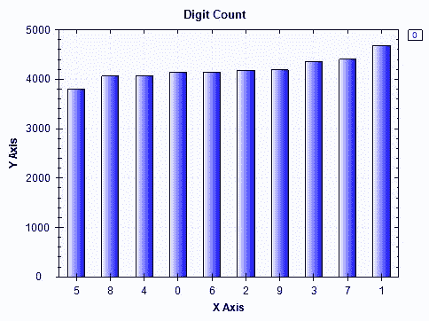

在控制台输出中，您将看到以下内容：

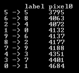

如从条形图和这个控制台输出中可以看出，数字`1`在数据集中出现得最多，而数字`5`出现得最少。然而，数据集中没有一类占大多数示例，目标变量在各个类别中分布得相当均衡。

# 手写数字图像

在我们开始研究特征集之前，让我们先看看手写数字的实际图像。在我们的数据集的每一条记录中，我们都有 28 x 28 图像中每个图像的 784 个像素的灰度值。为了从这个扁平化的数据集中构建图像，我们首先需要将每个 784 像素值的数组转换为二维数组。以下代码展示了我们编写的用于从扁平化数组创建图像的辅助函数：

```py
private static void CreateImage(int[] rows, string digit)
{
    int width = 28;
    int height = 28;
    int stride = width * 4;
    int[,] pixelData = new int[width, height];

    for (int i = 0; i < width; ++i)
    {
        for (int j = 0; j < height; ++j)
        {
            byte[] bgra = new byte[] { (byte)rows[28 * i + j], (byte)rows[28 * i + j], (byte)rows[28 * i + j], 255 };
            pixelData[i, j] = BitConverter.ToInt32(bgra, 0);
        }
    }

    Bitmap bitmap;
    unsafe
    {
        fixed (int* ptr = &pixelData[0, 0])
        {
            bitmap = new Bitmap(width, height, stride, PixelFormat.Format32bppRgb, new IntPtr(ptr));
        }
    }
    bitmap.Save(
        String.Format(@"\\Mac\Home\Documents\c-sharp-machine-learning\ch.8\input-data\{0}.jpg", digit)
    );
}
```

从此代码中可以看出，它首先初始化一个二维整数数组`pixelData`，该数组将存储像素数据。由于我们知道每个图像是一个 28 x 28 的图像，我们将取展平数据中的前 28 个像素作为二维整数数组的第一行，第二组 28 个像素作为第二行，依此类推。在`for`循环内部，我们将每个像素的值转换为名为`bgra`的**蓝-绿-红-透明度**（**BGRA**）字节数组。由于我们知道图像是灰度的，我们可以使用相同的值作为蓝色、绿色和红色组件。一旦我们将展平的像素数据转换为 28 x 28 的二维整数数组，我们现在就可以构建手写数字图像了。我们使用`Bitmap`类来重建这些手写数字图像。以下代码展示了我们如何使用此辅助函数为每个数字构建图像：

```py
ISet<string> exportedLabels = new HashSet<string>();
for(int i = 0; i < featuresDF.RowCount; i++)
{
    exportedLabels.Add(featuresDF.Rows[i].GetAs<string>("label"));

    CreateImage(
        featuresDF.Rows[i].ValuesAll.Select(x => (int)x).Where((x, idx) => idx > 0).ToArray(),
        featuresDF.Rows[i].GetAs<string>("label")
    );

    if(exportedLabels.Count() >= 10)
    {
        break;
    }
}
```

当您运行此代码时，您将在本地驱动器上看到以下图像被存储：

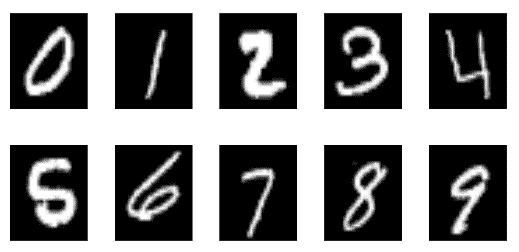

您可以使用相同的代码生成更多图像，这将帮助您更好地理解手写数字的原始图像是什么样的。

# 图像特征 - 像素

让我们现在看看图像特征。在我们的数据集中，每个图像中的每个像素都有代表灰度值的整数。了解每个像素可以取的值范围，以及我们是否可以在不同手写数字类别的像素数据分布中找到任何明显的差异，将是有帮助的。

我们首先将查看像素数据的单个分布。以下代码片段展示了您如何计算数据集中每个像素的四分位数：

```py
List<string> featureCols = new List<string>();
foreach (string col in featuresDF.ColumnKeys)
{
    if (featureCols.Count >= 20)
    {
        break;
    }

    if (col.StartsWith("pixel"))
    {
        if (featuresDF[col].Max() > 0)
        {
            featureCols.Add(col);

            Console.WriteLine(String.Format("\n\n-- {0} Distribution -- ", col));
            double[] quantiles = Accord.Statistics.Measures.Quantiles(
                featuresDF[col].ValuesAll.ToArray(),
                new double[] { 0, 0.25, 0.5, 0.75, 1.0 }
            );
            Console.WriteLine(
                "Min: \t\t\t{0:0.00}\nQ1 (25% Percentile): \t{1:0.00}\nQ2 (Median): \t\t{2:0.00}\nQ3 (75% Percentile): \t{3:0.00}\nMax: \t\t\t{4:0.00}",
                quantiles[0], quantiles[1], quantiles[2], quantiles[3], quantiles[4]
            );
        }

    }
}
```

与前几章的情况类似，我们在`Accord.Statistics.Measures`中使用了`Quantiles`方法来获取每个像素的四分位数。如您从前几章中回忆起来，四分位数是将数据分为四个部分的值。换句话说，第一四分位数（`Q1`）代表最小值和平均值之间的中间点，即 25%的分位数。第二四分位数（`Q2`）代表平均值，第三四分位数（`Q3`）代表中位数和最大值之间的中间点，即 75%的分位数。在这个代码示例中，我们只计算了具有非零值的第一个 20 个像素的四分位数，如您在 4-7 行和第 11 行中看到的那样。当您运行此代码时，您将得到如下所示的输出：

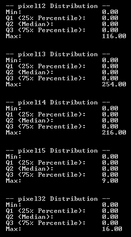

在这里，我们只显示了前五个分布。如您从输出中看到的那样，大多数像素值都是 0。如果您查看我们在上一节中重建的图像，图像中的大多数像素是黑色的，只有一小部分像素用于显示数字。这些黑色像素在我们的像素数据中被编码为`0`，因此许多像素具有 0 值是预期的。

让我们构建一些散点图，以便我们能够更好地从视觉上理解这些数据。以下代码构建了每个手写数字的前 20 个非零像素特征的分布散点图：

```py
string[] featureColumns = featureCols.ToArray();

foreach (string label in digitCount.GetColumn<string>("label").Values)
{
    var subfeaturesDF = featuresDF.Rows[
        featuresDF.GetColumn<string>("label").Where(x => x.Value == label).Keys
    ].Columns[featureColumns];

    ScatterplotBox.Show(
        BuildXYPairs(
            subfeaturesDF.Columns[featureColumns].ToArray2D<double>(),
            subfeaturesDF.RowCount,
            subfeaturesDF.ColumnCount
        )
    ).SetTitle(String.Format("Digit: {0} - 20 sample Pixels", label));
}
```

如果你仔细查看这段代码，我们首先从`featureCols`列表对象中构建了一个`featureColumns`字符串数组。`List`对象`featureCols`是具有非零值的前 20 个像素的列表，这是在计算四分位数时从先前代码中构建的。我们使用了与上一章中相同的辅助函数`BuildXYPairs`，将数据框转换为 x-y 对的数组，其中`x`值是每个像素的索引，`y`值是实际的像素值。使用这个辅助函数，我们使用`ScatterplotBox`类来显示一个散点图，该图显示了每个 20 个样本像素的像素分布。

以下是一个 0 位数的散点图：

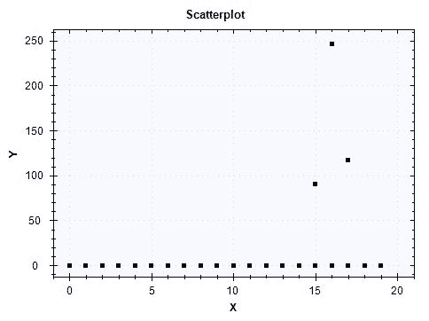

在 0 位数类别中的所有图像中，前 20 个像素的大多数值都是 0。在这 20 个我们在散点图中展示的像素中，只有三个像素的值不是 0。让我们看看不同数字类别中这些像素的分布情况。

以下散点图适用于一位数类别：

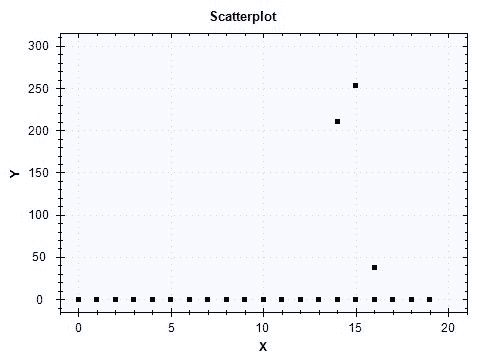

与 0 位数类别的情况类似，在这 20 个我们在散点图中展示的像素中，大多数像素的值都是 0，只有三个像素的值不是 0。与 0 位数类别的先前散点图相比，像素数据的分布对于 1 位数类别略有不同。

以下内容适用于两位数类别：

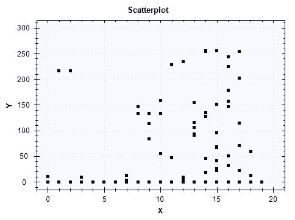

这个散点图显示了这里展示的 20 个像素的不同分布。其中大多数像素的值在 0 到 255 之间，只有少数像素在所有图像中都是 0。这种特征集分布的差异将有助于我们的机器学习模型学习如何正确地分类手写数字。

最后，我们将查看一个额外的散点图，我们将看到目标变量是如何分布在两个不同的像素上的。我们使用了以下代码来生成一个示例二维散点图：

```py
double[][] twoPixels = featuresDF.Columns[
    new string[] { featureColumns[15], featureColumns[16] }
].Rows.Select(
    x => Array.ConvertAll<object, double>(x.Value.ValuesAll.ToArray(), o => Convert.ToDouble(o))
).ValuesAll.ToArray();

ScatterplotBox.Show(
    String.Format("{0} vs. {1}", featureColumns[15], featureColumns[16]), 
    twoPixels,
    featuresDF.GetColumn<int>("label").Values.ToArray()
);
```

为了说明目的，我们选择了第十五和第十六个索引的特征，它们实际上是`pixel43`和`pixel44`。当你运行这段代码时，你会看到以下散点图：

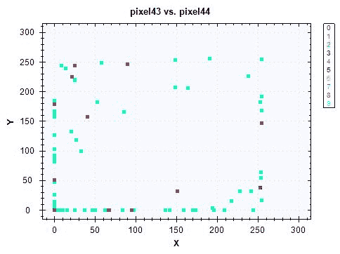

我们可以看到不同类别之间的一些区别，但由于`pixel43`和`pixel44`的大多数像素值都是 0，因此通过查看这个散点图很难在不同目标类别之间画出清晰的界限。在下一节中，我们将探讨如何使用 PCA 及其主成分来创建这个散点图的另一个版本，这有助于我们在可视化数据时识别不同目标类别之间的更清晰的界限。

此数据分析步骤的完整代码可以在以下链接中找到：[`github.com/yoonhwang/c-sharp-machine-learning/blob/master/ch.8/DataAnalyzer.cs`](https://github.com/yoonhwang/c-sharp-machine-learning/blob/master/ch.8/DataAnalyzer.cs).

# 特征工程和降维

到目前为止，我们已经查看了解释变量和像素数据的分布。在本节中，我们将开始讨论为我们的机器学习步骤构建训练集和测试集，然后我们将讨论如何使用 PCA 进行降维以及使用主成分可视化数据。

# 将样本集分割为训练集和测试集

在这一步中，我们将要做的第一个任务是随机将我们的数据集分割为训练集和测试集。让我们首先看看代码：

```py
double trainSetProportiona = 0.7;

var rnd = new Random();
var trainIdx = featuresDF.RowKeys.Where((x, i) => rnd.NextDouble() <= trainSetProportiona);
var testIdx = featuresDF.RowKeys.Where((x, i) => !trainIdx.Contains(i));

var trainset = featuresDF.Rows[trainIdx];
var testset = featuresDF.Rows[testIdx];

var trainLabels = trainset.GetColumn<int>("label").Values.ToArray();

string[] nonZeroPixelCols = trainset.ColumnKeys.Where(x => trainset[x].Max() > 0 && !x.Equals("label")).ToArray();

double[][] data = trainset.Columns[nonZeroPixelCols].Rows.Select(
    x => Array.ConvertAll<object, double>(x.Value.ValuesAll.ToArray(), o => Convert.ToDouble(o))
).ValuesAll.ToArray();
```

如前述代码所示，我们将大约 70%的数据用于训练，其余的用于测试。在这里，我们使用`Random`类生成随机数，使用记录的索引将样本集分割为训练集和测试集。一旦我们构建了训练集和测试集，我们就移除了所有图像中值为 0 的列或像素（第 12 行）。这是因为如果一个特征在不同目标类别之间没有变化，它对那些目标类别没有信息，这些信息是机器学习模型需要学习的。

现在我们有了训练集和测试集，让我们检查训练集和测试集中目标类别的分布。以下代码可用于聚合：

```py
var digitCount = trainset.AggregateRowsBy<string, int>(
    new string[] { "label" },
    new string[] { "pixel0" },
    x => x.ValueCount
).SortRows("pixel0");

digitCount.Print();

var barChart = DataBarBox.Show(
    digitCount.GetColumn<string>("label").Values.ToArray(),
    digitCount["pixel0"].Values.ToArray()
).SetTitle(
    "Train Set - Digit Count"
);

digitCount = testset.AggregateRowsBy<string, int>(
    new string[] { "label" },
    new string[] { "pixel0" },
    x => x.ValueCount
).SortRows("pixel0");

digitCount.Print();

barChart = DataBarBox.Show(
    digitCount.GetColumn<string>("label").Values.ToArray(),
    digitCount["pixel0"].Values.ToArray()
).SetTitle(
    "Test Set - Digit Count"
);
```

当你运行此代码时，你将在训练集中看到目标变量分布的以下图表：

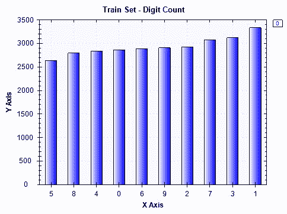

然后，以下是测试集的显示结果：

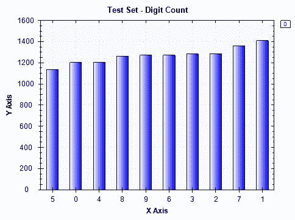

这些分布看起来与我们之前在数据分析步骤中分析整体数据集中的目标变量分布时看到的情况相似。现在让我们开始讨论如何将 PCA 应用于我们的训练集。

# 通过 PCA 进行降维

当我们分析数据时，我们注意到许多特征或像素值是 0。在这种情况下，应用 PCA 可以帮助减少数据的维度，同时最大限度地减少从减少的维度中损失的信息。简单来说，PCA 通过原始特征的线性组合来解释数据集及其结构。因此，每个主成分都是特征的线性组合。让我们开始看看如何使用 Accord.NET 框架在 C#中运行 PCA。

以下是如何初始化和训练 PCA 的方法：

```py
var pca = new PrincipalComponentAnalysis(
    PrincipalComponentMethod.Standardize
);
pca.Learn(data);
```

一旦使用数据训练了`PrincipalComponentAnalysis`，它就包含了每个主成分的线性组合的所有信息，并且可以应用于转换其他数据。我们在应用 PCA 之前使用`PrincipalComponentMethod.Standardize`来标准化我们的数据。这是因为 PCA 对每个特征的规模很敏感。因此，我们在应用 PCA 之前想要标准化我们的数据集。

为了将 PCA 转换其他数据，你可以使用`Transform`方法，如下面的代码片段所示：

```py
double[][] transformed = pca.Transform(data);
```

现在我们已经学习了如何将 PCA 应用于我们的数据集，让我们来看看前两个主成分，看看我们是否能在目标变量分布中找到任何明显的模式。以下代码展示了我们如何构建前两个成分的散点图，并使用目标类别进行颜色编码：

```py
double[][] first2Components = transformed.Select(x => x.Where((y, i) => i < 2).ToArray()).ToArray();

ScatterplotBox.Show("Component #1 vs. Component #2", first2Components, trainLabels);
```

一旦运行此代码，你将看到以下散点图：

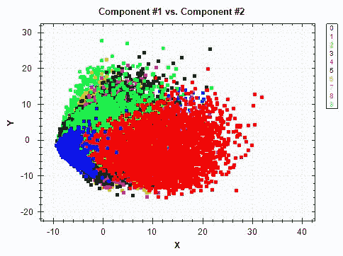

当你将此图表与我们在数据分析步骤中查看的`pixel43`和`pixel44`之间的图表进行比较时，这看起来相当不同。从第一个两个主成分的散点图中，我们可以看到目标类别更加明显。尽管这些两个成分并不能完美分离，但我们可以看出，如果我们将更多的成分结合到我们的分析和建模中，将更容易将一个目标类别从另一个中分离出来。

PCA 的另一个重要方面是我们应该关注的，即每个主成分解释的方差量。让我们看看以下代码：

```py
DataSeriesBox.Show(
    pca.Components.Select((x, i) => (double)i),
    pca.Components.Select(x => x.CumulativeProportion)
).SetTitle("Explained Variance");

System.IO.File.WriteAllLines(
    Path.Combine(dataDirPath, "explained-variance.csv"),
    pca.Components.Select((x, i) => String.Format("{0},{1:0.0000}", i, x.CumulativeProportion))
);
```

我们可以通过使用`CumulativeProportion`属性来检索由每个 PCA 成分解释的数据中方差的累积比例。为了获取每个 PCA 成分解释的个别比例，你可以使用每个 PCA 成分的`Proportion`属性。然后，我们将使用`DataSeriesBox`类来绘制折线图，以显示每个成分解释的方差累积比例。

当你运行此代码时，它将生成以下图表：

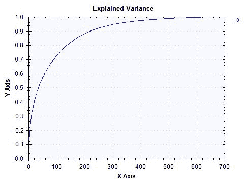

如您从该图表中可以看到，数据集中的约 90%的方差可以通过前 200 个成分来解释。使用 600 个成分，我们可以解释我们数据集中几乎 100%的方差。与原始数据集中作为特征的 784 个像素总数相比，这是数据维度的大幅减少。根据你想要为你的机器学习模型捕获多少方差，你可以使用此图表来决定最适合你的建模过程的成分数量。

最后，我们需要导出训练集和测试集，以便我们可以使用它们进行以下模型构建步骤。你可以使用以下代码来导出 PCA 转换后的训练集和测试集：

```py
Console.WriteLine("exporting train set...");
var trainTransformed = pca.Transform(
    trainset.Columns[nonZeroPixelCols].Rows.Select(
        x => Array.ConvertAll<object, double>(x.Value.ValuesAll.ToArray(), o => Convert.ToDouble(o))
    ).ValuesAll.ToArray()
);

System.IO.File.WriteAllLines(
    Path.Combine(dataDirPath, "pca-train.csv"),
    trainTransformed.Select((x, i) => String.Format("{0},{1}", String.Join(",", x), trainset["label"].GetAt(i)))
);

Console.WriteLine("exporting test set...");
var testTransformed = pca.Transform(
    testset.Columns[nonZeroPixelCols].Rows.Select(
        x => Array.ConvertAll<object, double>(x.Value.ValuesAll.ToArray(), o => Convert.ToDouble(o))
    ).ValuesAll.ToArray()
);
System.IO.File.WriteAllLines(
    Path.Combine(dataDirPath, "pca-test.csv"),
    testTransformed.Select((x, i) => String.Format("{0},{1}", String.Join(",", x), testset["label"].GetAt(i)))
);
```

此特征工程和降维步骤的完整代码可以在以下链接中找到：[`github.com/yoonhwang/c-sharp-machine-learning/blob/master/ch.8/FeatureEngineering.cs`](https://github.com/yoonhwang/c-sharp-machine-learning/blob/master/ch.8/FeatureEngineering.cs)。

# 机器学习模型用于手写数字识别

现在我们已经为构建机器学习模型准备好了所有东西，让我们开始构建这些模型。在本节中，我们将介绍如何根据 PCA 结果子选择特征，然后讨论我们如何为手写数字识别模型构建逻辑回归和朴素贝叶斯分类器。我们将介绍一个新的学习模型——神经网络，并解释如何使用 Accord.NET 框架为这个项目构建一个神经网络。

# 加载数据

构建用于手写数字识别的机器学习模型的第一步是加载我们在上一节构建的数据。您可以使用以下代码来加载我们之前创建的训练集和测试集：

```py
// Load the data into a data frame
string trainDataPath = Path.Combine(dataDirPath, "pca-train.csv");
Console.WriteLine("Loading {0}\n\n", trainDataPath);
var trainDF = Frame.ReadCsv(
    trainDataPath,
    hasHeaders: false,
    inferTypes: true
);

string testDataPath = Path.Combine(dataDirPath, "pca-test.csv");
Console.WriteLine("Loading {0}\n\n", testDataPath);
var testDF = Frame.ReadCsv(
    testDataPath,
    hasHeaders: false,
    inferTypes: true
);

string[] colnames = trainDF.ColumnKeys.Select(
    (x, i) => i < trainDF.ColumnKeys.Count() - 1 ? String.Format("component-{0}", i + 1) : "label"
).ToArray();

trainDF.RenameColumns(colnames);
testDF.RenameColumns(colnames);
```

在本章中，我们将使用累积解释我们数据集约 70%方差的特征进行不同模型的实验。查看以下代码，了解我们是如何筛选出感兴趣的特征成分的：

```py
// Capturing 70% of the variance
string[] featureCols = colnames.Where((x, i) => i <= 90).ToArray();

double[][] trainInput = BuildJaggedArray(
    trainDF.Columns[featureCols].ToArray2D<double>(), trainDF.RowCount, featureCols.Length
);
int[] trainOutput = trainDF.GetColumn<int>("label").ValuesAll.ToArray();

double[][] testInput = BuildJaggedArray(
    testDF.Columns[featureCols].ToArray2D<double>(), testDF.RowCount, featureCols.Length
);
int[] testOutput = testDF.GetColumn<int>("label").ValuesAll.ToArray();
```

如您从代码的第一行所见，我们正在将前 91 个成分（直到第九十个索引）作为我们模型的特征。如果您还记得之前的步骤或查看成分解释的累积方差比例的图表，您会看到前 91 个成分捕捉了我们数据集约 70%的方差。然后，我们创建一个二维的 double 数组，我们将用它来训练和测试我们的机器学习模型。以下代码展示了我们编写的辅助函数`BuildJaggedArray`，该函数将数据框转换为二维数组：

```py
private static double[][] BuildJaggedArray(double[,] ary2d, int rowCount, int colCount)
{
    double[][] matrix = new double[rowCount][];
    for(int i = 0; i < rowCount; i++)
    {
        matrix[i] = new double[colCount];
        for(int j = 0; j < colCount; j++)
        {
            matrix[i][j] = double.IsNaN(ary2d[i, j]) ? 0.0 : ary2d[i, j];
        }
    }
    return matrix;
}
```

# 逻辑回归分类器

我们将要实验的第一个用于手写数字识别的学习算法是逻辑回归。我们编写了一个名为`BuildLogitModel`的方法，它接受模型输入和输出，训练一个逻辑回归分类器，然后评估性能。以下代码展示了这个方法的编写方式：

```py
private static void BuildLogitModel(double[][] trainInput, int[] trainOutput, double[][] testInput, int[] testOutput)
{
    var logit = new MultinomialLogisticLearning<GradientDescent>()
    {
        MiniBatchSize = 500
    };
    var logitModel = logit.Learn(trainInput, trainOutput);

    int[] inSamplePreds = logitModel.Decide(trainInput);
    int[] outSamplePreds = logitModel.Decide(testInput);

    // Accuracy
    double inSampleAccuracy = 1 - new ZeroOneLoss(trainOutput).Loss(inSamplePreds);
    double outSampleAccuracy = 1 - new ZeroOneLoss(testOutput).Loss(outSamplePreds);
    Console.WriteLine("* In-Sample Accuracy: {0:0.0000}", inSampleAccuracy);
    Console.WriteLine("* Out-of-Sample Accuracy: {0:0.0000}", outSampleAccuracy);

    // Build confusion matrix
    int[][] confMatrix = BuildConfusionMatrix(
        testOutput, outSamplePreds, 10
    );
    System.IO.File.WriteAllLines(
        Path.Combine(
            @"<path-to-dir>", 
            "logit-conf-matrix.csv"
        ),
        confMatrix.Select(x => String.Join(",", x))
    );

    // Precision Recall
    PrintPrecisionRecall(confMatrix);
    DrawROCCurve(testOutput, outSamplePreds, 10, "Logit");
}
```

与上一章类似，我们正在使用`MultinomialLogisticLearning`类来训练一个逻辑回归分类器。一旦这个模型被训练，我们就开始通过各种评估指标进行评估，我们将在下一节中更详细地讨论这些指标。

# 朴素贝叶斯分类器

我们接下来要实验的第二种模型是一个朴素贝叶斯分类器。类似于之前涉及逻辑回归分类器的案例，我们编写了一个辅助函数`BuildNBModel`，它接受输入和输出，训练一个朴素贝叶斯分类器，然后评估训练好的模型。代码如下：

```py
private static void BuildNBModel(double[][] trainInput, int[] trainOutput, double[][] testInput, int[] testOutput)
{
    var teacher = new NaiveBayesLearning<NormalDistribution>();
    var nbModel = teacher.Learn(trainInput, trainOutput);

    int[] inSamplePreds = nbModel.Decide(trainInput);
    int[] outSamplePreds = nbModel.Decide(testInput);

    // Accuracy
    double inSampleAccuracy = 1 - new ZeroOneLoss(trainOutput).Loss(inSamplePreds);
    double outSampleAccuracy = 1 - new ZeroOneLoss(testOutput).Loss(outSamplePreds);
    Console.WriteLine("* In-Sample Accuracy: {0:0.0000}", inSampleAccuracy);
    Console.WriteLine("* Out-of-Sample Accuracy: {0:0.0000}", outSampleAccuracy);

    // Build confusion matrix
    int[][] confMatrix = BuildConfusionMatrix(
        testOutput, outSamplePreds, 10
    );
    System.IO.File.WriteAllLines(
        Path.Combine(
            @"<path-to-dir>",
            "nb-conf-matrix.csv"
        ),
        confMatrix.Select(x => String.Join(",", x))
    );

    // Precision Recall
    PrintPrecisionRecall(confMatrix);
    DrawROCCurve(testOutput, outSamplePreds, 10, "NB");
}
```

如您可能从上一章回忆起来，我们正在使用`NaiveBayesLearning`类来训练一个朴素贝叶斯分类器。我们使用`NormalDistribution`，因为我们的机器学习模型的所有特征都是来自之前 PCA 步骤的主成分，而这些成分的值是连续的。

# 神经网络分类器

我们将要实验的最后一种学习算法是人工神经网络（ANN）。正如你可能已经知道的，神经网络模型是所有深度学习技术的核心。神经网络模型在图像数据集上表现良好，因此我们将比较该模型与其他模型的性能，以查看通过使用神经网络相对于其他分类模型我们能获得多少性能提升。为了使用 Accord.NET 框架在 C# 中构建神经网络模型，你首先需要安装 `Accord.Neuro` 包。你可以在 **NuGet 包管理器控制台**中使用以下命令安装 `Accord.Neuro` 包：

```py
Install-Package Accord.Neuro
```

现在我们来看看如何使用 Accord.NET 框架在 C# 中构建神经网络模型。代码如下：

```py
private static void BuildNNModel(double[][] trainInput, int[] trainOutput, double[][] testInput, int[] testOutput)
{
    double[][] outputs = Accord.Math.Jagged.OneHot(trainOutput);

    var function = new BipolarSigmoidFunction(2);
    var network = new ActivationNetwork(
        new BipolarSigmoidFunction(2), 
        91, 
        20,
        10
    );

    var teacher = new LevenbergMarquardtLearning(network);

    Console.WriteLine("\n-- Training Neural Network");
    int numEpoch = 10;
    double error = Double.PositiveInfinity;
    for (int i = 0; i < numEpoch; i++)
    {
        error = teacher.RunEpoch(trainInput, outputs);
        Console.WriteLine("* Epoch {0} - error: {1:0.0000}", i + 1, error);
    }
    Console.WriteLine("");

    List<int> inSamplePredsList = new List<int>();
    for (int i = 0; i < trainInput.Length; i++)
    {
        double[] output = network.Compute(trainInput[i]);
        int pred = output.ToList().IndexOf(output.Max());
        inSamplePredsList.Add(pred);
    }

    List<int> outSamplePredsList = new List<int>();
    for (int i = 0; i < testInput.Length; i++)
    {
        double[] output = network.Compute(testInput[i]);
        int pred = output.ToList().IndexOf(output.Max());
        outSamplePredsList.Add(pred);
    }
}
```

让我们仔细看看这段代码。我们首先将训练标签从一维数组转换为二维数组，其中列是目标类别，如果给定的记录属于给定的目标类别，则值为 1，如果不属于，则值为 0。我们使用 `Accord.Math.Jagged.OneHot` 方法对训练标签进行独热编码。然后，我们使用 `ActivationNetwork` 类构建神经网络。`ActivationNetwork` 类接受三个参数：激活函数、输入计数和层的信息。对于激活函数，我们使用 sigmoid 函数，`BipolarSigmoidFunction`。输入计数很简单，因为它是我们将要用于训练此模型的特征数量，即 91。对于此模型，我们只使用了一个包含 20 个神经元的隐藏层。对于更深的神经网络，你可以使用多个隐藏层，并且也可以在每个隐藏层中实验不同的神经元数量。最后，`ActivationNetwork` 构造函数的最后一个参数代表输出计数。由于目标变量是数字类别，它可以取 0 到 9 之间的值，因此我们需要 10 个输出神经元。一旦构建了这个网络，我们就可以使用 `LevenbergMarquardtLearning` 学习算法来训练网络。

一旦我们设置了网络和学习算法，我们实际上就可以开始训练神经网络模型了。正如你可能已经知道的，神经网络模型在其学习阶段需要多次（epochs）通过数据集运行以获得更好的可预测性。你可以使用 `RunEpoch` 方法在每个 epoch 中训练和更新神经网络模型。为了节省时间，我们只运行了 10 个 epoch 来训练我们的神经网络模型。然而，我们建议你尝试增加这个值，因为它可以提高你的神经网络模型的性能。以下展示了随着我们训练和更新神经网络模型在每个 epoch 中，错误度量是如何降低的：

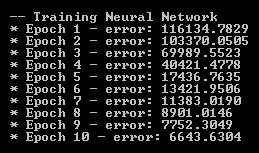

如此输出所示，错误度量在每个 epoch 中显著降低。在此需要注意的是，错误度量减少的量在每个额外的 epoch 中减少。当你构建具有大量 epochs 的神经网络模型时，你可以监控每次运行的增益量，并在没有更多显著性能增益时决定停止。

用于模型构建步骤的完整代码可以在以下链接找到：[`github.com/yoonhwang/c-sharp-machine-learning/blob/master/ch.8/Modeling.cs`](https://github.com/yoonhwang/c-sharp-machine-learning/blob/master/ch.8/Modeling.cs)。

# 评估多类分类模型

在本节中，我们将评估上一节中构建的三个模型。我们将回顾之前用于分类模型的验证指标，并比较每个模型之间的性能。

# 混淆矩阵

首先，让我们看看混淆矩阵。以下代码展示了如何使用预测输出和实际输出构建混淆矩阵：

```py
private static int[][] BuildConfusionMatrix(int[] actual, int[] preds, int numClass)
{
    int[][] matrix = new int[numClass][];
    for (int i = 0; i < numClass; i++)
    {
        matrix[i] = new int[numClass];
    }

    for (int i = 0; i < actual.Length; i++)
    {
        matrix[actual[i]][preds[i]] += 1;
    }

    return matrix;
}
```

此方法与我们之前章节中编写的方法类似，不同之处在于它返回的是一个二维数组，而不是字符串数组。我们将在下一节中使用这个二维数组输出来计算精确率和召回率。

逻辑回归分类器的混淆矩阵如下：

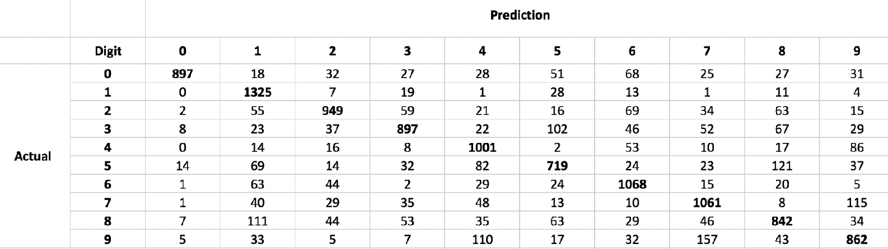

对于朴素贝叶斯分类器，你将得到一个类似于以下表格的混淆矩阵：


最后，对于神经网络模型，混淆矩阵如下：

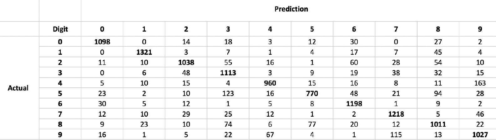

从这些混淆矩阵中，神经网络模型优于其他两个模型，逻辑回归模型似乎位居第二。

# 准确率和精确率/召回率

我们将要查看的第二项指标是准确度度量。我们使用`ZeroOneLoss`来计算损失，然后从`1`中减去以获得准确度数值。计算准确度度量的代码如下：

```py
// Accuracy
double inSampleAccuracy = 1 - new ZeroOneLoss(trainOutput).Loss(inSamplePreds);
double outSampleAccuracy = 1 - new ZeroOneLoss(testOutput).Loss(outSamplePreds);
Console.WriteLine("* In-Sample Accuracy: {0:0.0000}", inSampleAccuracy);
Console.WriteLine("* Out-of-Sample Accuracy: {0:0.0000}", outSampleAccuracy);
```

我们将要查看的第三和第四项指标是精确率和召回率。与之前不同，目标预测有 10 个类别。因此，我们将为每个目标类别分别计算精确率和召回率。代码如下：

```py
private static void PrintPrecisionRecall(int[][] confMatrix)
{
    for (int i = 0; i < confMatrix.Length; i++)
    {
        int totalActual = confMatrix[i].Sum();
        int correctPredCount = confMatrix[i][i];

        int totalPred = 0;
        for(int j = 0; j < confMatrix.Length; j++)
        {
            totalPred += confMatrix[j][i];
        }

        double precision = correctPredCount / (float)totalPred;
        double recall = correctPredCount / (float)totalActual;

        Console.WriteLine("- Digit {0}: precision - {1:0.0000}, recall - {2:0.0000}", i, precision, recall);
    }

}
```

如此代码所示，此`PrintPrecisionRecall`方法的输入是我们从上一节构建的混淆矩阵。在此方法中，它遍历每个目标类别并计算精确率和召回率。

以下是我们计算逻辑回归模型的准确度、精确率和召回率时的输出：

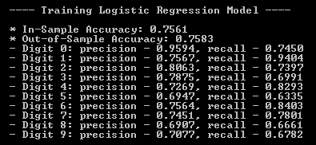

对于朴素贝叶斯模型，我们得到以下指标结果：

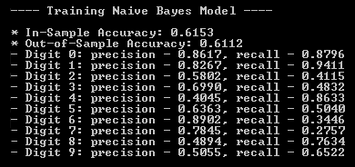

最后，对于神经网络模型，性能结果如下：

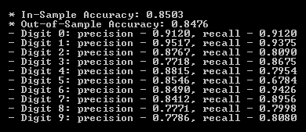

如您可能已经注意到的，从这些结果来看，神经网络模型优于其他两个模型。与逻辑回归和朴素贝叶斯模型相比，神经网络模型的整体准确率和精确率/召回率都是最高的。逻辑回归模型似乎在我们构建的三个模型中位居第二。

# 一对多 AUC

我们将要讨论的最后一种评估指标是**接收者操作特征**（**ROC**）曲线和 AUC。在本章中，当我们构建 ROC 曲线和 AUC 时，我们需要做的一件事是，为每个目标类别构建一个。让我们先看看代码：

```py
private static void DrawROCCurve(int[] actual, int[] preds, int numClass, string modelName)
{
    ScatterplotView spv = new ScatterplotView();
    spv.Dock = DockStyle.Fill;
    spv.LinesVisible = true;

    Color[] colors = new Color[] {
        Color.Blue, Color.Red, Color.Orange, Color.Yellow, Color.Green,
        Color.Gray, Color.LightSalmon, Color.LightSkyBlue, Color.Black, Color.Pink
    };

    for (int i = 0; i < numClass; i++)
    {
        // Build ROC for Train Set
        bool[] expected = actual.Select(x => x == i ? true : false).ToArray();
        int[] predicted = preds.Select(x => x == i ? 1 : 0).ToArray();

        var trainRoc = new ReceiverOperatingCharacteristic(expected, predicted);
        trainRoc.Compute(1000);

        // Get Train AUC
        double auc = trainRoc.Area;
        double[] xVals = trainRoc.Points.Select(x => 1 - x.Specificity).ToArray();
        double[] yVals = trainRoc.Points.Select(x => x.Sensitivity).ToArray();

        // Draw ROC Curve
        spv.Graph.GraphPane.AddCurve(
            String.Format(
                "Digit: {0} - AUC: {1:0.00}",
                i, auc
            ),
            xVals, yVals, colors[i], SymbolType.None
        );
        spv.Graph.GraphPane.AxisChange();
    }

    spv.Graph.GraphPane.Title.Text = String.Format(
        "{0} ROC - One vs. Rest",
        modelName
    );

    Form f1 = new Form();
    f1.Width = 700;
    f1.Height = 500;
    f1.Controls.Add(spv);
    f1.ShowDialog();
}
```

从我们编写的`DrawROCCurve`方法中可以看出，我们通过一个`for`循环遍历每个目标类别，并通过编码将每个标签与目标类别匹配时标记为`1`，不匹配时标记为`0`。完成编码后，我们可以使用`ReceiverOperatingCharacteristic`类来计算 AUC 并构建 ROC 曲线。

下面的图表是逻辑回归模型的 ROC 曲线：

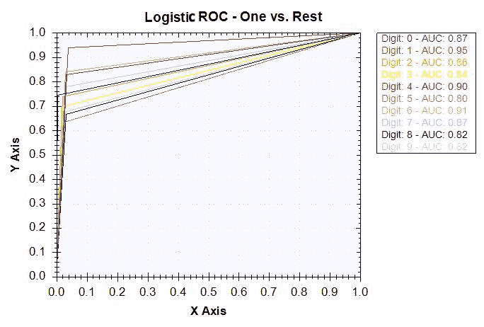

对于朴素贝叶斯模型，ROC 曲线如下所示：

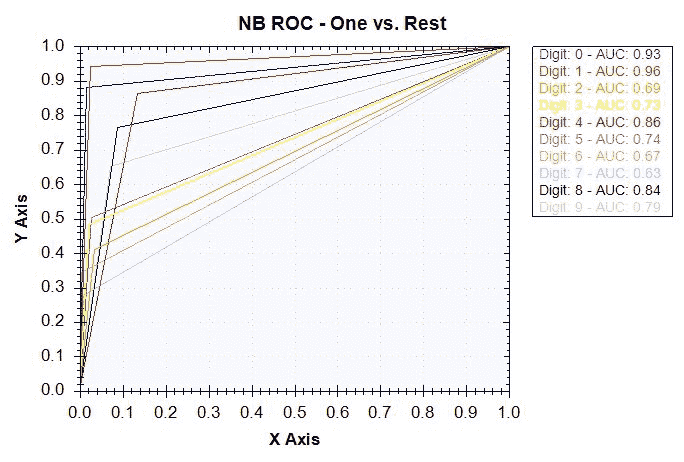

最后，神经网络模型的 ROC 曲线如下所示：

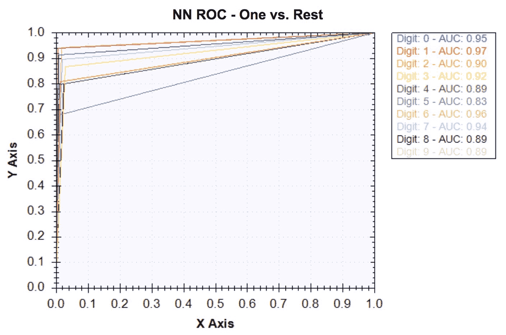

如我们所预期的，从之前我们查看的指标来看，神经网络模型的结果最好，逻辑回归模型位居第二。对于朴素贝叶斯模型，有一些数字它没有很好地计算。例如，朴素贝叶斯模型在分类数字 6 和 7 时遇到了困难。然而，对于所有目标类别，神经网络模型的 AUC 数值都接近 1，这表明模型已经很好地训练来识别手写图像中的数字。

通过查看混淆矩阵、准确率、精确率和召回率以及 ROC 曲线，我们可以得出结论，在本章训练的三个分类器中，神经网络模型表现最好。这再次证实了神经网络在图像数据集和图像识别问题上的良好表现。

# 摘要

在本章中，我们构建了我们第一个图像识别模型，该模型可以识别灰度图像中的手写数字。我们本章开始时讨论了这种类型的模型如何在现实生活中的广泛应用，以及我们计划如何构建手写数字识别模型。然后，我们开始研究数据集。我们首先查看目标类别的分布，以查看样本集是否是一个平衡良好的集合。当我们分析像素数据时，我们注意到大多数像素值都是 0，我们可以通过从像素数据重建图像来直观地理解这一点。在特征工程步骤中，我们讨论了如何使用 PCA 进行降维。

在对这些 PCA 转换后的特征进行处理后，我们开始构建各种机器学习模型。在已经熟悉的逻辑回归和朴素贝叶斯模型的基础上，我们引入了一个新的机器学习模型——神经网络。我们学习了如何使用`BipolarSigmoidFunction`作为激活函数初始化`ActivationNetwork`模型。然后，我们使用`LevenbergMarquardtLearning`学习算法在 10 个周期内开始训练神经网络。我们观察到每个额外周期中误差度量是如何减少的，并讨论了误差率增加的额外周期是如何逐渐减少的。在模型评估步骤中，我们结合了多个分类模型的验证指标。对于本章构建的机器学习模型，我们考虑了混淆矩阵、预测准确率、精确率和召回率，以及 ROC 曲线和 AUC。我们注意到神经网络模型优于其他两个模型，这再次证实了神经网络模型非常适合图像数据。

在下一章中，我们将转换方向，开始构建用于异常检测的模型。我们将使用 PCA 进行网络攻击检测项目。利用网络入侵数据集，我们将讨论如何使用 PCA 来检测网络攻击，并运行多个实验以找到通知我们潜在网络攻击的最佳阈值。
