# 第一章：设置 Anaconda 环境

欢迎来到*使用 OpenCV 和 Python 3 的计算机视觉项目*。如果你是 OpenCV 和计算机视觉的新手，这本书你可能想看看。

在本章中，我们将安装本书中将要使用到的所有必需工具。我们将处理 Python 3、OpenCV 和 TensorFlow。

你可能想知道：为什么我应该使用 Python 3，而不是 Python 2？你问题的答案可以在 Python 自己的网站上找到：

"Python 2 是遗留的，Python 3 是语言的现在和未来。"

我们在这里展望未来，如果我们想要使我们的代码具有前瞻性，最好使用 Python 3。如果你使用的是 Python 2，这里的一些代码示例可能无法运行，因此我们将安装 Python 3 并使用它来完成本书的所有项目。

在本章中，我们将涵盖以下主题：

+   介绍和安装 Python 和 Anaconda

+   安装额外的库

+   探索 Jupyter Notebook

# 介绍和安装 Python 和 Anaconda

我们首先需要 Python 3。安装它的最佳方式是下载 Continuum Analytics 和 Anaconda 发行版。

Anaconda 是一个功能齐全的 Python 发行版，附带大量包，包括数值分析、数据科学和计算机视觉。它将使我们的生活变得更加容易，因为它为我们提供了基础 Python 发行版中不存在的库。

Anaconda 最好的部分是它为我们提供了`conda`包管理器，以及`pip`，这使得为我们的 Python 发行版安装外部包变得非常容易。

让我们开始吧。

# 安装 Anaconda

我们将首先设置 Anaconda 和 Python 发行版，按照以下步骤进行：

1.  访问 Anaconda 网站，使用以下链接[www.anaconda.com/download](https://www.anaconda.com/download/)。你应该会看到一个类似于以下截图的着陆页：


1.  接下来，选择你的操作系统，下载包含 Python 3.7 的最新版本的 Anaconda 发行版。点击下载按钮，如图所示：

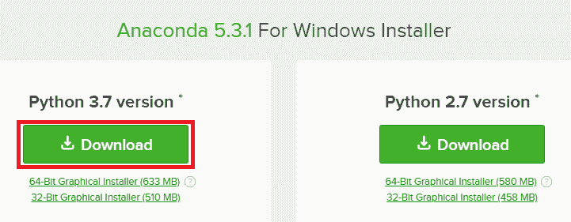

Windows 的安装程序是图形化的；然而，你可能需要为 macOS 或 Linux 使用命令行安装程序。

安装设置文件非常简单，所以我们不会在这里逐个步骤说明。

1.  当你正确安装了所有软件并定义了路径变量后，前往命令提示符，通过输入`where python`命令来确保一切正常。这会显示 Python 安装的所有目录。你应该会看到类似于以下截图的内容：

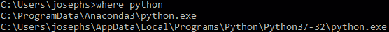

如前一个截图所示，我们看到 Python 的第一个实例在我们的 Anaconda 发行版中。这意味着我们可以继续我们的 Python 程序。

在 macOS 或 Linux 中，命令将是`which python`而不是`where python`。

1.  现在，让我们确保我们拥有我们的其他工具。我们的第一个工具将是 IPython，它本质上是一种用于多种编程语言的交互式计算命令壳。我们将使用`where ipython`命令来检查它，如图所示：

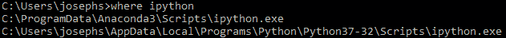

1.  下一个我们将检查的包是`pip`工具，它是 Python 安装程序包。我们使用`where pip`命令来完成此操作，如图所示：

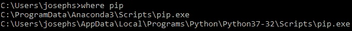

1.  下一个要检查的工具是`conda`包，它是 Anaconda 内置的包管理器。这是通过`where conda`命令完成的，如图所示：

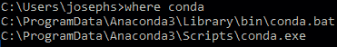

我们现在应该可以使用 Python 了。

如果你运行`which python`在 macOS 或 Linux 上，并且它显示类似`user/bin/Python`的内容，这意味着 Python 可能未安装或不是我们路径中的第一项，因此我们应该根据我们的系统进行修改。

在下一节中，我们将介绍安装额外的库，如 OpenCV、TensorFlow、dlib 和 Tesseract，这些库将用于本书中的项目。

# 安装额外的库

我们将在本节中安装的所有包对我们即将到来的项目至关重要。所以，让我们开始吧。

# 安装 OpenCV

要获取 OpenCV，请访问以下链接：[anaconda.org/conda-forge/opencv](https://anaconda.org/conda-forge/opencv)。技术上，我们不需要访问网站来安装此包。该网站仅显示 OpenCV 的各种版本以及我们可以在其上安装的所有不同系统。

将网站上的安装命令复制并粘贴到命令提示符中，然后运行，如图所示：

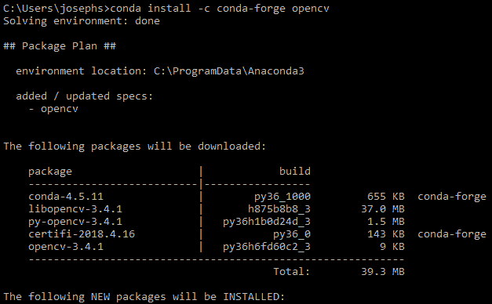

上述命令是一个简单、平台无关的方法来获取 OpenCV。还有其他获取它的方法；然而，使用此命令可以确保我们安装的是最新版本。

# 安装 dlib

我们需要从 Anaconda 发行版安装 dlib，类似于 OpenCV。正如安装 OpenCV 一样，安装 dlib 是一个简单的过程。

运行以下命令：

```py
conda install -c menpo dlib
```

你将得到以下输出：

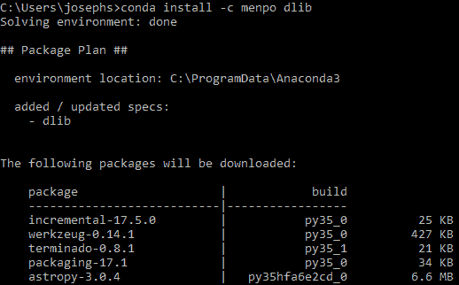

这将花费大约 10 到 20 秒的时间运行。如果一切顺利，我们应该可以使用 dlib 了。

# 安装 Tesseract

Tesseract 是 Google 的光学字符识别库，并且不是原生的 Python 包。因此，有一个 Python 绑定，它调用可执行文件，然后可以手动安装。

访问 Tesseract 的 GitHub 仓库，该仓库位于以下链接：[`github.com/tesseract-ocr/tesseract`](https://github.com/tesseract-ocr/tesseract)。

滚动到 GitHub 自述文件中的*安装 Tesseract*部分。在这里，我们有两个选项：

+   通过预构建的二进制包安装

+   从源代码构建

我们想要通过预构建的二进制包来安装它，因此点击该链接。我们也可以从源代码构建，如果我们想的话，但这并不真正提供任何优势。Tesseract Wiki 解释了在各个不同的操作系统上安装它的步骤。

由于我们使用的是 Windows，并且我们想要安装一个预构建的版本，请点击 UB Mannheim 的 Tesseract 链接，在那里您可以找到所有最新的设置文件。从网站上下载最新的设置文件。

下载完成后，运行安装程序或执行命令。然而，这并不会将 Tesseract 添加到您的路径中。我们需要确保它在您的路径中；否则，当您在 Python 中调用 Tesseract 时，您将收到一个错误消息。

因此，我们需要找出 Tesseract 的位置并修改我们的路径变量。为此，在命令提示符中输入`where tesseract`命令，如下截图所示：

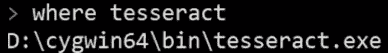

一旦您有了二进制包，使用`pip`命令将 Python 绑定应用到这些包上。使用以下命令：

```py
$ pip install tesseract
$ pip install pytesseract
```

现在应该可以使用 Tesseract 了。

# 安装 TensorFlow

最后但同样重要的是，我们将安装 TensorFlow，这是一个用于跨各种任务的数据流编程的软件库。它通常用于机器学习应用，如神经网络。

要安装它，请访问以下链接的 TensorFlow 网站：[tensorflow.org/install/](https://www.tensorflow.org/install/)。网站包含所有主要操作系统的说明。

由于我们使用的是 Windows，安装过程非常简单。我们只需在命令提示符中运行`pip install tensorflow`命令，如下截图所示：

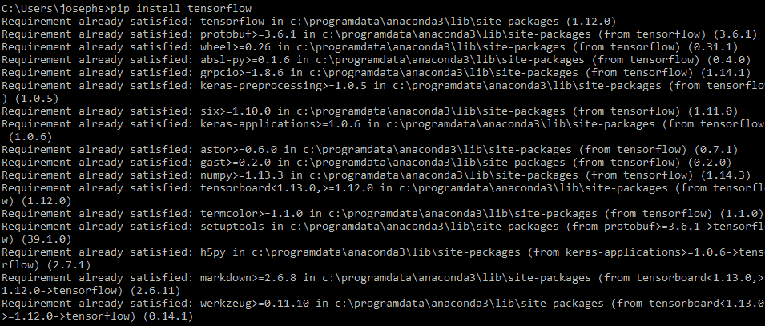

如前一个截图所示，TensorFlow 已经安装在系统上，因此它表示要求已满足。现在我们应该可以使用 TensorFlow 了。

使用以下命令安装`tensorflow-hub`：

```py
pip install tensorflow-hub
```

接下来，使用以下命令安装`tflearn`：

```py
pip install tflearn
```

最后，Keras 是一个高级接口，可以使用以下命令安装：

```py
pip install keras
```

我们已经安装了 OpenCV、TensorFlow、dlib 和 Tesseract，因此我们应该可以使用我们书籍的工具了。我们的下一步将是探索 Jupyter Notebook，这应该很有趣！

# 探索 Jupyter Notebook

现在我们已经安装了库，我们准备好开始使用 Jupyter Notebook 了。Jupyter Notebook 是一种创建交互式代码和小部件的好方法。它允许我们创建带有实时代码和实验的交互式演示，就像我们现在所做的那样。

如果使用 Anaconda 正确设置了一切，我们可能已经安装了 Jupyter。让我们现在看看 Jupyter Notebook。

在你的代码文件所在的目录中打开命令提示符，然后运行 `jupyter notebook` 命令。这将打开一个在命令执行目录中的网络浏览器。这应该会得到一个类似于以下截图的界面：

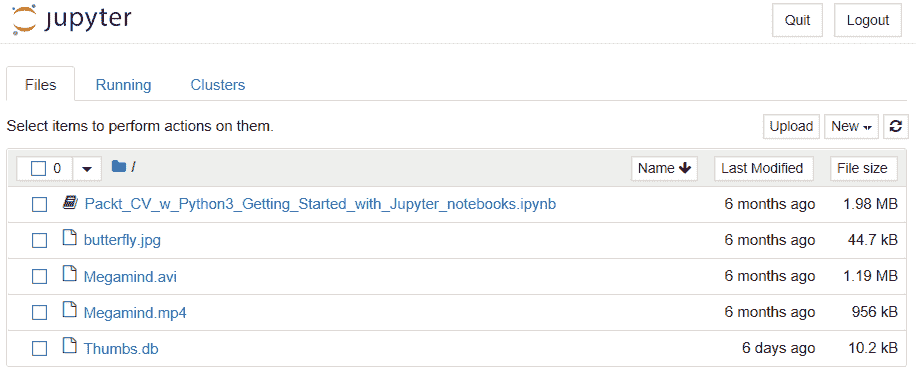

接下来，打开 `.ipynb` 文件，以便你可以探索 Jupyter Notebook 的基本功能。一旦打开，我们应该看到一个类似于以下截图的页面：

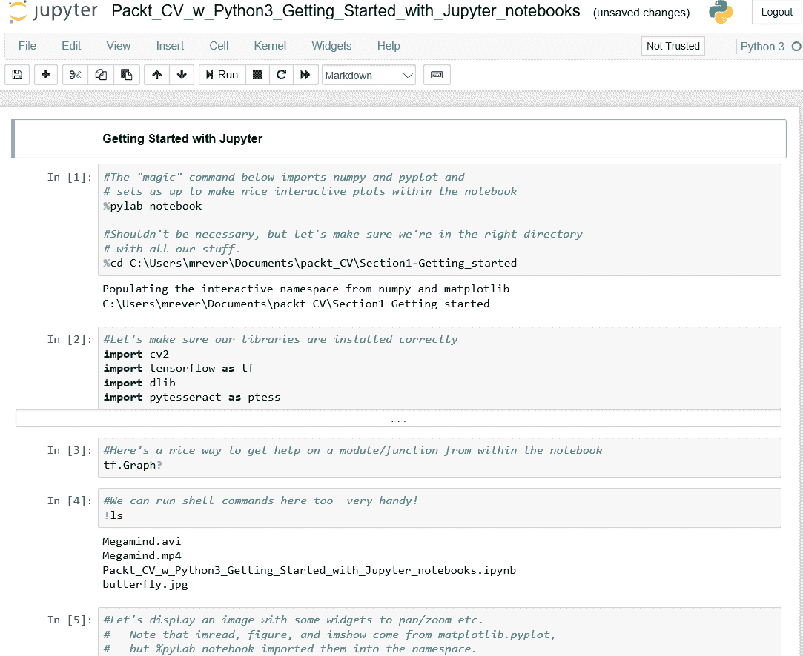

如所示，有一些块（称为 *cells*），我们可以在这里输入 Python 命令和 Python 代码。我们还可以输入其他命令，也称为 *magic commands*，这些命令本身不是 Python 的一部分，但允许我们在 Jupyter 或 IPython（Python 的交互式外壳）中做一些很酷的事情。开头 `%` 的意思是该命令是一个 magic command。

这里最大的优点是我们可以执行单个代码行，而不是一次输入整个代码块。

如果你刚开始使用 Jupyter Notebook，请访问以下链接：[`www.cheatography.com/weidadeyue/cheat-sheets/jupyter-notebook/`](https://www.cheatography.com/weidadeyue/cheat-sheets/jupyter-notebook/)。在这里，他们列出了 Jupyter Notebook 的键盘快捷键，这对于快速代码测试非常有用。

让我们回顾一下前面截图中的某些命令，并看看它们的作用，如下所示：

1.  如第一个单元格所示，`%pylab notebook` 命令导入了许多非常有用且常见的库，特别是 NumPy 和 PyPlot，而无需我们显式调用导入命令。它还简化了 Notebook 的设置。

1.  同样在第一个单元格中，我们指定我们将要工作的目录，如下所示：

```py
%cd C:\Users\<user_name>\Documents\<Folder_name>\Section1-Getting_started
```

这导致了以下输出：

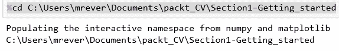

到目前为止，一切顺利！

1.  下一个单元格显示了如何导入我们的库。我们将导入 OpenCV、TensorFlow、dlib 和 Tesseract，只是为了确保一切正常，没有出现任何令人不快的惊喜。这是通过以下代码块完成的：

```py
import cv2
import tensorflow as tf
import dlib
import pytesseract as ptess
```

如果在这里收到错误信息，请按照说明仔细重新安装库。有时事情确实会出错，这取决于我们的系统。

1.  图表中的第三个单元格包含导入 TensorFlow 图模块的命令。这可以在 Notebook 内部获取函数帮助时派上用场，如下所示：

```py
tf.Graph?
```

我们将在 第七章 中讨论这个函数，*使用 TensorFlow 进行深度学习图像分类*。

1.  Jupyter Notebooks 的另一个优点是，我们可以在单元格中直接运行 shell 命令。如图表中的第四个单元格所示（此处重复），`ls` 命令显示了我们从该目录中工作的所有文件：

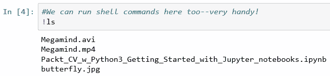

1.  在这本书中，我们将处理很多图像，所以我们会希望在笔记本中直接查看图像。使用 `imread()` 函数从你的目录中读取图像文件。之后，你的下一步是创建一个 `figure()` 小部件来显示图像。最后，使用 `imshow()` 函数实际显示图像。

整个过程总结在下面的截图里：

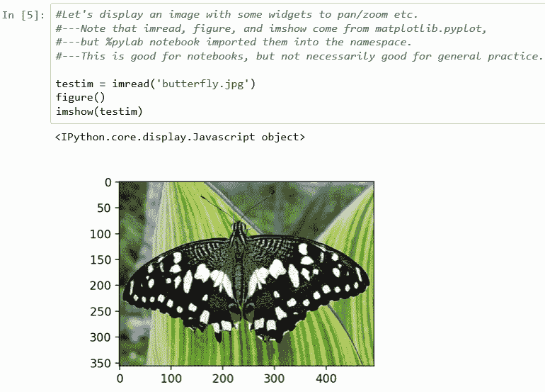

这很棒，因为我们有灵活的部件。

1.  通过抓住右下角，我们可以将其缩小到一个合理的尺寸，以便查看带有像素轴的颜色图像。我们还有平移选项可用。点击它，我们可以平移图像并框选放大。按主页按钮将重置原始视图。

我们将想要查看我们的图像、处理后的图像等等——如前所述，这是一个非常方便且简单的方法。我们还可以使用 PyLab 内联，这在某些情况下很有用，我们将会看到。

1.  正如我们所知，计算机视觉的一部分是处理视频。要在笔记本中播放视频，我们需要导入一些库并使用 IPython 的 HTML 功能，如下面的截图所示：

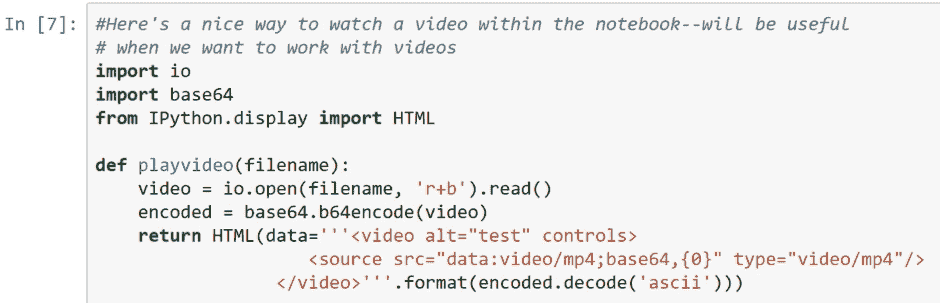

实际上，我们是在使用我们的网络浏览器的播放功能。所以，这并不是真正的 Python 在做这件事，而是我们的网络浏览器，它使得 Jupyter Notebook 和我们的浏览器之间能够实现交互性。

这里，我们定义了 `playvideo()` 函数，它接受视频文件名作为输入，并返回一个包含我们视频的 HTML 对象。

1.  在 Jupyter 中执行以下命令来播放 *Megamind* 视频。这只是电影 *Megamind* 的一段剪辑，如果我们下载所有源代码，它就会随 OpenCV 一起提供：

```py
playvideo(' ./Megamind.mp4')
```

1.  你会看到一个黑色盒子，如果你向下滚动，你会找到一个播放按钮。点击这个按钮，电影就会播放，如下面的截图所示：


这可以用来播放我们自己的视频。你只需要将命令指向你想播放的视频。

一旦所有这些运行起来，你应该能够良好地运行我们在接下来的章节中将要查看的项目。

# 摘要

在本章中，我们学习了 Anaconda 发行版和安装 Python 的不同方法。我们学习了如何使用 Anaconda 发行版设置 Python。

接下来，我们看了如何在 Anaconda 中安装各种库，以便我们更容易运行各种程序。最后，我们学习了 Jupyter Notebook 的基础知识及其工作原理。

在下一章（第二章），我们将探讨如何使用 TensorFlow 进行图像字幕生成。
