# 第四章：使用 TensorFlow 进行人体姿态估计

在本章中，我们将介绍如何使用 DeeperCut 算法通过 TensorFlow 进行人体姿态估计。我们将学习使用 DeeperCut 和 ArtTrack 模型进行单人和多人姿态检测。稍后，我们还将学习如何使用该模型与视频一起使用，并重新训练它以用于我们项目中的定制图像。

在本章中，我们将涵盖以下主题：

+   使用 DeeperCut 和 ArtTrack 进行姿态估计

+   单人姿态检测

+   多人姿态检测

+   视频和重新训练

# 使用 DeeperCut 和 ArtTrack 进行姿态估计

人体姿态估计是从图像或视频中估计身体（姿态）配置的过程。它包括地标（点），这些点类似于脚、脚踝、下巴、肩膀、肘部、手、头部等关节。我们将使用深度学习自动完成这项工作。如果您考虑面部，地标相对刚性，或者说相对恒定，例如眼睛相对于鼻子的相对位置，嘴巴相对于下巴，等等。

以下照片提供了一个示例：

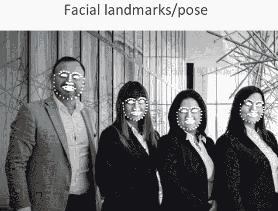

虽然身体结构保持不变，但我们的身体不是刚性的。因此，我们需要检测身体的不同部位相对于其他部位的位置。例如，相对于膝盖检测脚部是非常具有挑战性的，与面部检测相比。此外，我们可以移动我们的手和脚，这可能导致各种各样的姿势。以下图片提供了一个示例：

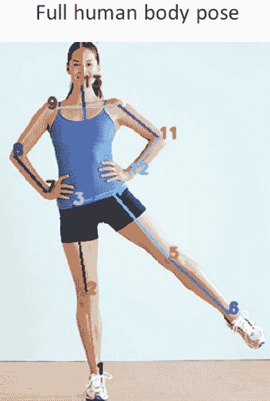

这在我们从世界各地不同研究小组在计算机视觉方面的突破之前是非常困难的。已经开发了不同的代码来执行姿态估计，但我们将介绍一个名为**DeeperCut**的算法。

您可以参考 MPII 人体姿态模型([pose.mpi-inf.mpg.de](http://pose.mpi-inf.mpg.de))以获取详细信息。

DeeperCut 是由德国马克斯·普朗克学会的一个研究小组开发的，与斯坦福大学合作，他们发布了他们的算法并发表了论文。建议查看他们的论文《DeepCut：用于多人姿态估计的联合子集划分和标记》，该论文概述了 DeeperCut 之前的早期算法，其中他们讨论了如何检测身体部位以及他们如何运行优化算法以获得良好的结果。您还可以参考他们后续的论文《DeeperCuts》：*一个更深、更强、更快的多人姿态估计模型*，该论文由同一组作者发表，这将涵盖许多技术细节。我们肯定不会得到精确的结果，但您可以用合理的概率确定一些事情。

在 GitHub 页面[`github.com/eldar/pose-tensorflow`](https://github.com/eldar/pose-tensorflow)，有他们代码的公开实现，包括 DeeperCut 和一个新版本 ArtTrack。这是在野外进行的人体姿态跟踪，你可以在下面的照片中看到输出结果：

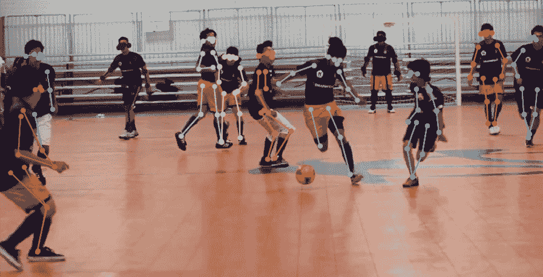

我们将运行一个修改后的代码版本，它被设计在 Jupyter Notebook 环境中运行，并且适用于所有学习目的，因此它应该比直接从 GitHub 获取要简单一些。我们将学习如何运行代码并在我们的项目中使用它。所有预训练的模型都包含在这里：[`github.com/eldar/pose-tensorflow.`](https://github.com/eldar/pose-tensorflow)

# 单人姿态检测

现在我们已经了解了人体姿态估计和新的 DeeperCut 算法的概述，我们可以运行单人姿态检测的代码，并在 Jupyter Notebook 中检查它。

我们将从单人检测开始。在开始之前，我们需要确保我们使用的是一个干净的内核。你可以重启你的内核，或者你可以使用快捷键来完成同样的操作。当你处于命令模式时，你可以按下*0*键两次，这与实际编辑单元格时的编辑模式相反。

让我们从以下示例中的单人检测代码开始：

```py
!pip install pyyaml easydict munkres
```

感叹号表示执行一个 shell 命令。这将安装一些你可能没有的库，如果你在你的系统中安装了 Python 3，你可能需要将命令更改为`pip 3`。

在下一个单元格中，我们将调用`%pylab notebook`函数，这将允许我们在笔记本中使用一些有用的控件查看图像，以及加载一些数值库，例如`numpy`等。我们将进行一些通用导入，例如`os`、`sys`和`cv2`。为了进行注释，我们将使用`imageio`的`imread`函数并从`randint`获取一切。你不需要导入`numpy`，因为我们已经使用了`%pylab notebook`，但如果你想在笔记本外复制粘贴此代码，你需要它。然后，我们需要导入`tensorflow`，它已经包含了一些来自`pose-tensorflow`仓库的粘合工具。代码，仅供参考，如下所示：

```py
%pylab notebook
import os
import sys
import cv2
from imageio import imread
from random import randint
import numpy as np
import tensorflow as tf
from config import load_config
from nnet.net factory import pose_net
```

然后我们执行前面的单元格。

我们现在将设置姿态预测，如下面的代码所示：

```py
def setup_pose_prediction(cfg):
    inputs = tf.placeholder(tf.float32, shape=[cfg.batch_size, None, None, 3])

    outputs = pose_net(cfg).test(inputs)

    restorer = tf.train.Saver()

    sess = tf.Session()

    sess.run(tf.global_variables_initializer())
    sess.run(tf.local_variables_initializer())

    # Restore variables from disk.
    restorer.restore(sess, cfg.init_weights)

    return sess, inputs, outputs
```

它将启动会话并加载我们的模型。我们将使用一个预训练模型，您可以从 GitHub 仓库快速访问它。`tf.Session()`将启动 TensorFlow 会话并将其保存到`sess`变量中，我们将返回它。请注意，当您运行此函数时，它将保持 TensorFlow 会话开启，所以如果您想继续做其他事情，比如加载新模型，那么您将不得不关闭会话或重新启动。在这里这很有用，因为我们将要查看多张图片，如果每次都加载会话，将会更慢。然后，我们将获取配置，它加载相应的模型和变量，并将返回运行模型所需的必要值。

然后，我们使用`extract_cnn_outputs`函数提取 CNN 输出。在输出中，我们将获得联合位置，以了解一切相对于其他事物的确切位置。我们希望得到一个有序的二维数组，其中我们知道脚踝、手或肩膀的位置的 X 和 Y 坐标。以下是一个示例：

```py
def extract_cnn_output(outputs_np, cfg, pairwise_stats = None):
    scmap = outputs_np['part_prob']
    scmap = np.squeeze(scmap)
    locref = None
    pairwise_diff = None
    if cfg.location_refinement:
        locref = np.squeeze(outputs_np['locref'])
        shape = locref.shape
        locref = np.reshape(locref, (shape[0], shape[1], -1, 2))
        locref *= cfg.locref_stdev
    if cfg.pairwise_predict:
        pairwise_diff = np.squeeze(outputs_np['pairwise_pred'])
        shape = pairwise_diff.shape
        pairwise_diff = np.reshape(pairwise_diff, (shape[0], shape[1], -1, 2))
        num_joints = cfg.num_joints
        for pair in pairwise_stats:
            pair_id = (num_joints - 1) * pair[0] + pair[1] - int(pair[0] < pair[1])
            pairwise_diff[:, :, pair_id, 0] *= pairwise_stats[pair]["std"][0]
            pairwise_diff[:, :, pair_id, 0] += pairwise_stats[pair]["mean"][0]
            pairwise_diff[:, :, pair_id, 1] *= pairwise_stats[pair]["std"][1]
            pairwise_diff[:, :, pair_id, 1] += pairwise_stats[pair]["mean"][1]
    return scmap, locref, pairwise_diff
```

这将把神经网络输出（有点难以理解）转换成我们可以实际使用的格式。然后，我们将输出传递给其他东西，或者在这种情况下可视化它。`argmax_pose_predict`与我们之前所做的是互补的。它是一个辅助函数，将帮助我们理解输出，以下是一个示例：

```py
def argmax_pose_predict(scmap, offmat, stride):
    """Combine scoremat and offsets to the final pose."""
    num_joints = scmap.shape[2]
    pose = []
    for joint_idx in range(num_joints):
        maxloc = np.unravel_index(np.argmax(scmap[:, :, joint_idx]),
                                  scmap[:, :, joint_idx].shape)
        offset = np.array(offmat[maxloc][joint_idx])[::-1] if offmat is not None else 0
        pos_f8 = (np.array(maxloc).astype('float') * stride + 0.5 * stride +
                  offset)
        pose.append(np.hstack((pos_f8[::-1],
                               [scmap[maxloc][joint_idx]])))
    return np.array(pose)
```

现在，让我们执行定义函数的那个单元格。它将立即运行。

以下代码将加载配置文件，即`demo/pose_cfg.yaml`，`setup_pose_prediction(cfg)`将返回`sess`、`inputs`和`outputs`。以下是一个示例：

```py
cfg = load_config("demo/pose_cfg.yaml")
sess, inputs, outputs = setup_pose_prediction(cfg)
```

当我们运行前面的代码时，它将保持 TensorFlow 会话开启，建议只运行一次以避免错误，或者您可能需要重新启动内核。因此，如果命令被执行，我们理解模型已经被加载，正如您在以下输出中看到的那样：

```py
INFO:tensorflow:restoring parameters from models/mpii/mpii-single-resnet-101
```

现在，我们将看到如何实际应用该模型：

```py
file_name = "testcases/standing-lef-lift.jpg"
image = np.array(imread(file_name))
image_batch = np.expand_dims(image, axis=0).astype(float)
outputs_np = sess.run(outputs, feed_dict={inputs: image_batch})
scmap, locref, pairwise_diff = extract_cnn_output(outputs_np, cfg)
pose = argmax_pose_predict(scmap, locref, cfg.stride)
```

对于我们的模型，我们必须给我们的文件命名。因此，我们有一个名为`testcases`的目录，里面有一系列不同姿势的人的股票照片，我们将使用这些照片进行测试。然后，我们需要以合适的格式加载`standing-leg-lift.jpg`图像。我们将把图像转换成 TensorFlow 实际需要的格式。输入类似于`image_batch`，它将在`0`轴上扩展维度。所以，只需创建 TensorFlow 可以使用的数组。然后，`outputs_np`将运行会话，在下一行提取 CNN 输出，然后进行实际的姿态预测。`pose`变量在这里使用最好。然后我们应该执行单元格并按*Esc*按钮进入命令模式。然后，我们需要创建一个新的单元格；输入`pose`并按*C*trl *+ E*nter*。然后我们将得到以下 2D 数组输出：

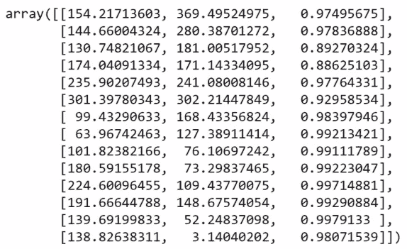

输出给出了与手腕、脚踝、膝盖、头部、下巴、肩膀等关节对应的`x`和`y`坐标。从这些坐标中，我们得到`x`坐标、`y`坐标和匹配分数。我们不需要亚像素级别的精度，所以我们可以将其四舍五入到最接近的整数。在下面的示例中，你可以看到我们已经用数字标记了对应的关节，并在它们之间画了线：

```py
pose2D = pose[:, :2]
image_annot = image.copy()

for index in range(5):
    randcolor = tuple([randint(0, 255) for i in range(3)])
    thickness = int(min(image_annot[:,:,0].shape)/250) + 1
    start_pt = tuple(pose2D[index].astype('int'))
    end_pt = tuple(pose2D[index+1].astype('int'))
    image_annot = cv2.line(image_annot, start_pt, end_pt, randcolor, thickness)
for index in range(6,11): #next bunch are arms/shoulders (from one hand to other)
    randcolor = tuple([randint(0,255) for i in range(3)])
    thickness = int(min(image_annot[:,:,0].shape)/250) + 1
    start_pt = tuple(pose2D[index].astype('int'))
    end_pt = tuple(pose2D[index+1].astype('int'))
    image_annot = cv2.line(image_annot, start_pt, end_pt, randcolor, thickness)
#connect Line from chin to top of head
image_annot = cv2.line(image_annot,
                       tuple(pose2D[12].astype('int')), tuple(pose2D[13].astype('int'))
                       tuple([randint(0,255) for i in range(3)]), thickness)
```

我们需要在这里创建一个`pose2D`标签，然后我们将从前两列中提取 x 和 y 坐标。我们将使用`image.copy()`来制作一个副本，因为我们希望我们的注释图像与原始图像分开。

我们将运行以下代码来显示原始图像：

```py
figure()
imshow(image)
```

现在，我们将学习如何注释原始图像。我们将创建图像的一个副本，然后我们将遍历前六个关节并在它们之间画线。它从脚踝开始，标记为`1`，然后穿过臀部，最后下降到另一只脚踝。数字`6`到`11`将是手臂和肩膀，最后两个点是下巴和头顶。我们现在将使用`pose2D`中的所有这些点用线连接起来。实际上，我们没有`腰部`和`衣领`的点，但我们可以很容易地从臀部和肩膀的中点估计它们，这对于完成骨骼很有用。

让我们看看以下代码，它帮助我们估计中点：

```py
# There no actual joints on waist or coLLar,
# but we can estimate them from hip/shoulder midpoints
waist = tuple(((pose2D[2]+pose2D[3])/2).astype('int'))
collar = tuple(((pose2D[8]+pose2D[9])/2).astype('int'))
# draw the "spine"
image_annot = cv2.line(image_annot, waist, collar,
                       tuple([randint(0,255) for i in range(3)]), thickness)
image_annot = cv2.line(image_annot, tuple(pose2D[12].astype('int')), collar,
                       tuple([randint(0,255) for i in range(3)]), thickness)
# now Label the joints with numbers
font = cv2.FONT_HERSHEY_SIMPLEX
fontsize = min(image_annot[:,:,0].shape)/750 #scale the font size to the image size
for idx, pt in enumerate(pose2D):
    randcolor = tuple([randint(0,255) for i in range(3)])
image_annot = cv2.putText(image_annot, str(idx+1),
                          tup1e(pt.astype('int')),font, fontsize,
                          randcolor,2,cv2.LINE_AA)
figure()
imshow(image_annot)
```

现在，我们可以通过从腰部到衣领，再从衣领到下巴画点来绘制脊柱。我们还可以标记这些关节，以显示我们连接的确切位置，这有助于你的定制应用。我们将标记关节，创建图形，显示注释图像，并处理随机颜色。以下截图显示了输出看起来像什么：

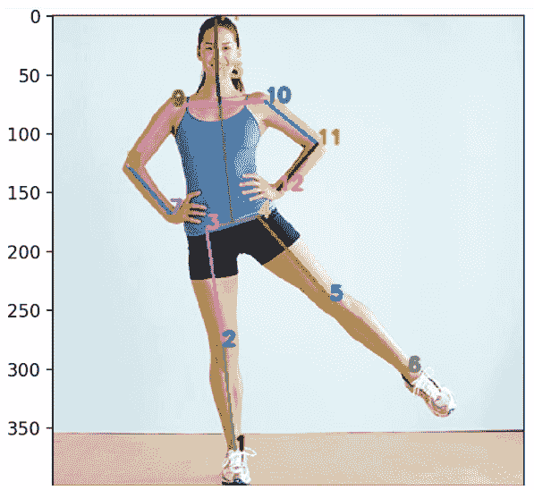

在这里，1 是右脚踝，但它可能是左脚踝，取决于人的面向方向。所以，除了 13（在这里有点遮挡）和 14（稍微超出图像）之外，所有的链接都已经连接。这个的好处是，即使其他关节被遮挡（例如，如果它们在屏幕外或被某物覆盖），它也可能工作。你会注意到图像很简单，有一个平坦的背景，平坦的地板，简单的姿态和衣服。代码也可以处理更复杂的图像，如果你在阅读细节时遇到任何困难，可以使用这里的工具并放大查看。

让我们尝试使用不同的图像并分析我们的结果，如下所示：

```py
file_name = "testcases/mountain_pose.jpg"
image = np.array(imread(file_name))
image_batch = np.expand_dims(image, axis=0).astype(float)
outputs_np = sess.run(outputs, feed_dict={inputs: image_batch})
scmap, locref, pairwise_diff = extract_cnn_output(outputs_np, cfg)
pose = argmax_pose_predict(scmap, locref, cfg.stride)
```

下面是我们将要测试的图片：

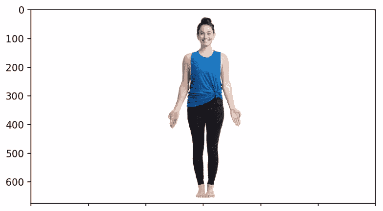

当我们再次运行我们的模型，使用不同的图像时，我们得到以下输出：

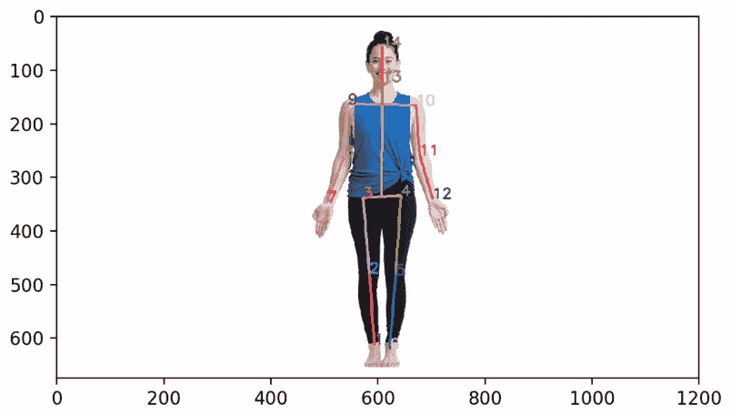

如果我们拍一个交叉双臂的人的图像，我们会得到以下截图：

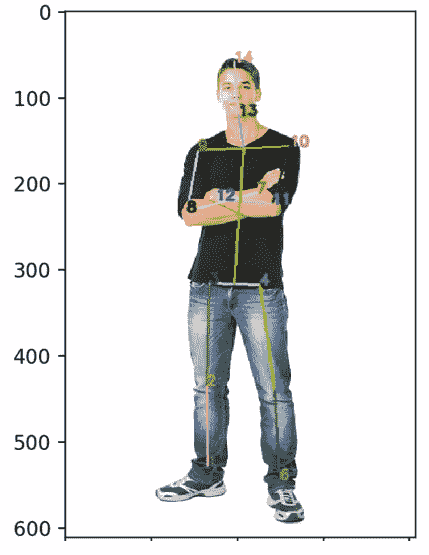

即使双臂交叉，结果仍然非常好。

现在，让我们看看一些比较困难的图像。这可能不会给我们一个完整的运动捕捉姿态估计解决方案的准确结果，但仍然非常令人印象深刻。

选择`acrobatic.jpeg`，如下所示：

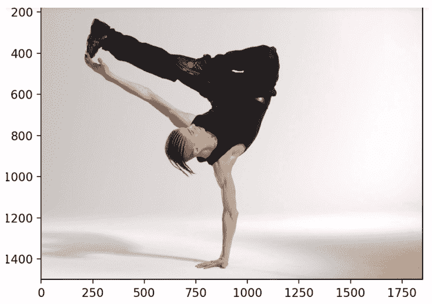

当我们运行这张照片时，得到的输出如下所示：

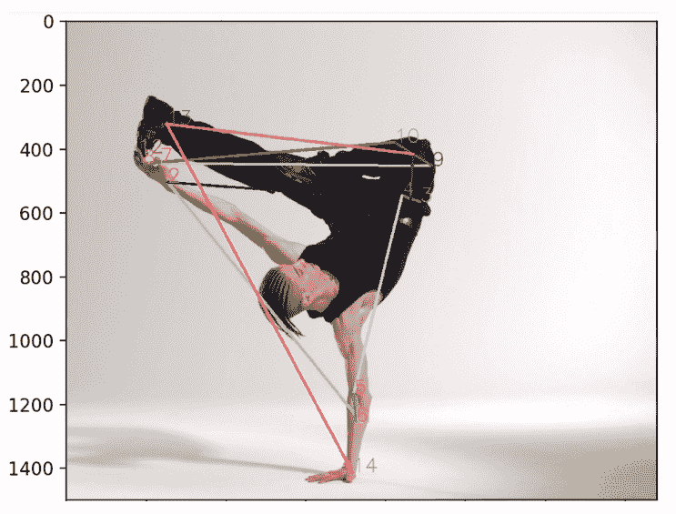

看起来它找到了关节，或多或少，但没有正确连接它们。它显示这个人的头在他的手上，手触地。我们可以看到结果并不那么好。但我们不能期望所有图像都能得到准确的结果，即使这是最先进的技术。

# 多人姿态检测

现在，让我们从单人姿态检测转到多人姿态检测。在单人姿态检测中，我们看到代码会取一个单个人的图像，并生成带有所有关节标记的姿态估计。我们现在将学习一个更高级的模型，称为 ArtTrack，它将允许我们计数人数，找到人，并估计他们的姿态。

让我们看看多人姿态检测的代码，以下是一个示例：

```py
import os
import sys
import numpy as np
import cv2 I
from imageio import imread, imsave
from config import load_config
from dataset.factory import create as create_dataset
from nnet import predict
from dataset.pose_dataset import data_to_input
from multiperson.detections import extract_detections
from multiperson.predict import SpatialModel, eval_graph, get_person_conf_mu1ticut
# from muLtiperson.visuaLize import PersonDraw, visuaLize_detections
```

这有点复杂。我们将首先使用当前目录下的`!ls`命令列出我们的目录，在那里你会找到一个名为`compile.sh`的文件。

我们需要运行这个文件，因为这个模块中包含一些二进制依赖项。但是这是一个 shell 脚本文件，你可能在 macOS 或 Linux 上遇到一些问题。因此，为了生成那些特定于操作系统的文件/命令，你需要运行这个脚本。对于 Windows，那些二进制文件已经生成好了。所以，如果你使用的是 Python 和 TensorFlow 的最新版本，那么文件将是兼容的，二进制文件应该可以正常工作。

如果它不起作用，您将需要下载并安装 Visual Studio Community。您可以在[`github.com/eldar/pose-tensorflow`](https://github.com/eldar/pose-tensorflow)的`demo`代码部分找到一些关于多人姿态的安装说明。

一旦一切运行正常，我们就可以开始我们的示例。此外，正如我们之前已经讨论过的，我们需要确保重启内核。这是因为如果您已经打开了会话来运行不同的项目，TensorFlow 可能无法计算代码，因为已经加载了之前的模型。始终从一个全新的内核开始是一个好的做法。

我们将运行我们的 `%pylab notebook` 来进行可视化和数值计算。代码的工作方式与我们之前已经覆盖的类似，其中我们有一些模板代码并加载了一个预训练模型。预训练模型已经包含在内，所以我们不需要下载它。由于 TensorFlow 的原因，代码将在一秒内执行，我们将导入模块并加载存储库。此外，我们还需要分别加载模型并进行预测。如果我们按下 C*trl *+ S*hift *+ *-*，我们可以将预测分别放入不同的单元格中，使其看起来更整洁。

当我们运行第一个单元格时，我们得到以下输出：

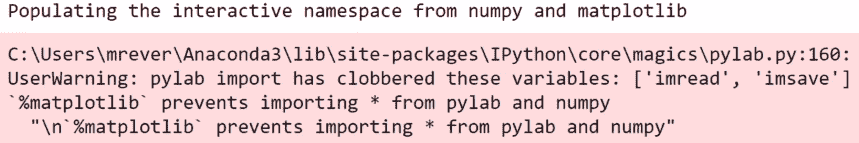

这不是一个大的错误消息，这是因为在这里定义了 `imread`；笔记本覆盖了它，只给你一个警告消息。我们可以重新运行那段代码来忽略警告并得到整洁的输出。

在这个单元格中，我们将加载 ArtTrack/DeeperCut 作者提供的多人配置文件。

以下行加载了数据集：

```py
cf = load_config("demo/pose_cfg_multi.yaml) 
```

然后，以下行创建模型并加载它：

```py
dataset = create_dataset(cfg)
sm = SpatialModel(cfg)
sm.load()
sess, inputs, outputs = predict.setup_pose_prediction(cfg)
```

当我们执行这个操作时，我们得到以下输出：

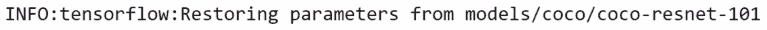

我们将在这里保持会话开启，这样我们就可以继续运行不同的事情，并快速浏览不同的帧。

我们现在将运行一些测试案例，这些案例实际上有多个人，如下所示：

```py
file_name = "testcases/bus_people.jpg"
image = np.array(imread(file_name))
image_batch = data_to_input(image)
# Compute prediction with the CNN
outputs_np = sess.run(outputs, feed_dict={inputs: image_batch})
scmap, locref, pairwise_diff = predict.extract_cnn_output(outputs_np, cfg, dataset
detections = extract_detections(cfg, scmap, locref, pairwise_diff)
unLab, pos_array, unary_array, pwidx_array, pw_array = eval_graph(sm, detections)
person_conf_multi = get_person_conf_multicut(sm, unLab, unary_array, pos_array)
image_annot = image.copy()
for pose2D in person_conf_mu1ti:
    font = cv2.FONT_HERSHEY_SIMPLEX
    fontsize = min(image_annot[:,:,0].shape)/1000
```

我们需要将 `np.array` 转换为平面数组网络，以便使用 `sess.run` 进行预测，然后使用模型工具提取 CNN 输出和 `detections`。我们在这里不会标记骨骼，而是用数字标记关节。

当我们运行代码时，我们得到以下输出：

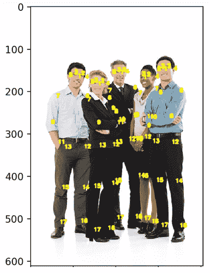

这是一张多人的简单图像，穿着朴素的衣服，背景平坦。这实际上起作用了。然而，数字与之前不同。之前，数字 1 对应右脚踝，向上通过 2、3、4、5 和 6，然后 7 是右腕，以此类推。所以，数字不同，而且更多，这实际上检测到了更多的关节，因为面部有多个数字，所以这里有多点。让我们放大查看细节，如下面的图片所示：

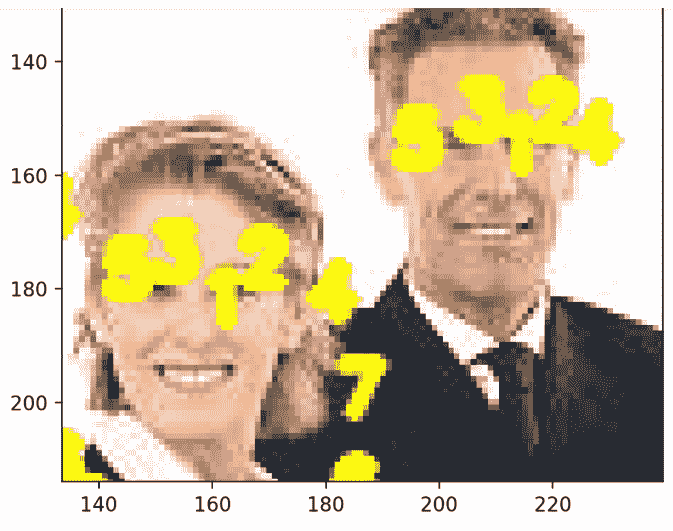

在这里，我们有了面部特征点 1、2、3、4 和 5，因此这可以与第六章中提到的 dlib 检测器结合使用，即*dlib 的面部特征追踪和分类*。如果我们想了解某人的面部表情，除了全身特征检测器和它们的姿态，这里也可以做到。我们还可以得到一个非常详细的描述，说明人们面向哪个方向，以及他们在图像中确切在做什么。

让我们尝试另一个`exercise_class.jpeg`图像，它给出了以下输出：

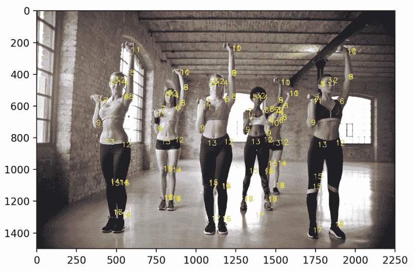

在这里，我们可以看到最右侧的女士膝盖上有多个点。这仍然是一个不错的结果。

让我们再试一张图片，这是我们之前在 GitHub 页面上看到的，`gym.png`。

你可以看到以下输出：

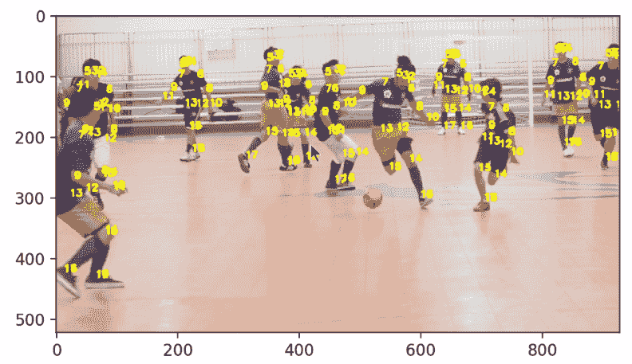

这个模型确实检测到了这里的身体部位。所以，让我们尝试使用这个模型来检测单个人的姿态。你认为它会起作用吗？答案是*是的，它确实起作用了*。你可能想知道为什么我们有这个模型，还要使用之前的模型。这个模型在计算上稍微高效一些，所以如果你知道只有一个人，实际上你不需要它，因为这个算法提供了人数。

你可以从可用的照片中选择单个人的照片。例如，我们将选择`mountain_pose.jpg`，它给出了以下输出：

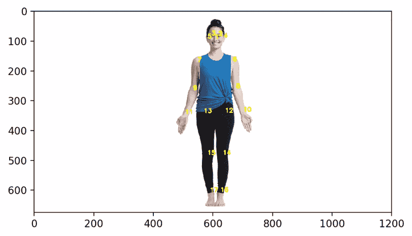

这也将显示人数，如下面的代码所示：

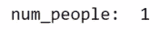

但是，如果你为单个人使用多人检测器，它可能会过度拟合，并检测到图像中实际不存在的人数。所以，如果你已经知道只有一个人，那么仍然使用原始模型而不是 ArtTrack 模型可能仍然是一个好主意。但如果它确实起作用，尝试两者，或者使用最适合你应用的方法。然而，这可能在复杂图像和复杂多样的姿态上可能不会完美工作。

让我们尝试最后一个`island_dance.jpeg`图像。以下截图显示了结果：

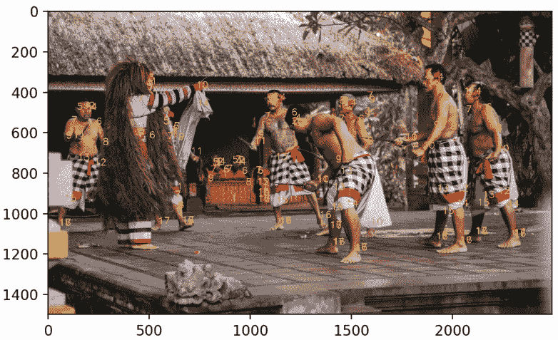

# 重新训练人体姿态估计模型

我们现在将讨论如何处理视频以及重新训练我们的人类姿态估计网络。我们已经涵盖了人脸检测以及如何将模型应用于视频。打开视频相当直接，OpenCV 提供了相应的机制。它基本上是逐帧执行相同的事情。以下示例显示了相应的代码：

```py
predictor_path = "./shape_predictor_68_face_landmarks.dat"
detector = dlib.get_fronta1_face_detector()
predictor = dlib.shape_predictor(predictor_path)

#Uncomment Line below if you want to use your webcam
#cap = cv2.VideoCapture(0) #0 is the first camera on your computer, change if you
#more than one camera

#Comment out the Line below if using webcam
cap = cv2.VideoCapture('./rollerc.mp4')
figure(100)
font = cv2.FONT_HERSHEY_SIMPLEX
```

首先，我们需要创建一个 `cv2` 捕获设备，然后打开文件，在读取文件的同时，我们应该加载图像并在图像上运行网络。请参考以下代码：

```py
font = cv2.FONT_HERSHEY_SIMPLEX
while(True):
    #Capture frame-by-frame
    ret, img = cap.read()
    img.flags['WRITEABLE']=True #just in case

    try:
        dets = detector(img, 1)
        shape = predictor(img, dets[0])
    except:
        print('no face detected', end='\r')
        cap.release()
        break
#similar to previous example, except frame-by-frame here
    annotated=img.copy()
    head_width = shape.part(16).x-shape.part(6).x
    fontsize = head_width/650
    for pt in range(68):
        x,y = shape.part(pt).x, shape.part(pt).y
        annotated=cv2.putText(annotated, str(pt), (x,y), font, fontsize, (255,255,255), 2, cv2.LINE_AA)

#Let's see our results
    fig=imshow(cv2.cvtColor(annotated,cv2.COLOR_BGR2RGB)) #OpenCV uses BGR format

    display.c1ear_output(wait=True)
    display.display(gcf())

#When everything is done, release the capture
cap.release()
```

使用一个好的 GPU，我们应该能够以每秒几帧的速度进行计算，如果不是 30 到 60 FPS，这取决于你的硬件。你应该几乎能够实时完成。

对于训练你的模型，你首先需要确保你有良好的硬件和大量的时间。首先，你需要下载 ImageNet 和 ResNet 模型。然后，你需要查看[`github.com/eldar/pose-tensorflow/blob/master/models/README.md`](https://github.com/eldar/pose-tensorflow/blob/master/models/README.md)页面上的步骤和说明。你需要大量的数据，因此你可以使用他们提供的数据。使用你自己的数据可能既耗时又难以获得，但这是可能的。你可以参考提供的上一个链接以获取完整的说明。

这里使用的说明在某些地方使用了 MATLAB 来转换数据，尽管在 Python 中也有方法可以做到这一点，并用 MS COCO 数据集训练模型。这与我们在第二章中做的类似，即使用 TensorFlow 进行图像标题生成，同时也提供了如何使用自己的数据集训练模型的说明。这需要大量的工作和计算能力。你可以尝试这样做，或者使用预训练模型中已经提供的内容，这些内容可以做很多事情。

# 摘要

在本章中，我们学习了人类姿态估计的基础知识，然后在我们的项目中使用了 DeeperCut 和 ArtTrack 模型进行人类姿态估计。使用这些模型，我们进行了单人和多人的姿态检测。在章节的末尾，我们学习了如何使用模型处理视频，并对定制图像重新训练了模型。

在下一章第五章，《使用 scikit-learn 和 TensorFlow 进行手写数字识别》中，我们将学习如何使用 scikit-learn 和 TensorFlow 进行手写数字识别。
