# 第七章：使用 TensorFlow 进行深度学习图像分类

在本章中，我们将学习如何使用 TensorFlow 进行图像分类。首先，我们将使用预训练模型，然后我们将使用自定义图像进行模型训练。

在本章的结尾，我们将利用 GPU 来帮助我们加速计算。

在本章中，我们将涵盖以下内容：

+   TensorFlow 的深度介绍

+   使用预训练模型（Inception）进行图像分类

+   使用我们的自定义图像进行再训练

+   使用 GPU 加速计算

# 技术要求

除了 Python 知识和图像处理及计算机视觉的基础知识外，你还需要以下库：

+   TensorFlow

+   NVIDIA CUDA®深度神经网络

本章中使用的代码已添加到以下 GitHub 仓库中：

[`github.com/PacktPublishing/Computer-Vision-Projects-with-OpenCV-and-Python-3`](https://github.com/PacktPublishing/Computer-Vision-Projects-with-OpenCV-and-Python-3)

# TensorFlow 简介

在本章中，我们将更深入地了解 TensorFlow，并看看我们如何可以使用其深度学习方法构建一个通用的图像分类器。

这将是我们在第二章“使用 scikit-learn 和 TensorFlow 进行手写数字识别”中学到的内容的扩展，在那里我们学习了如何对手写数字进行分类。然而，这种方法要强大得多，因为它将适用于人们的通用图像、动物、食物、日常物品等等。

首先，让我们简单谈谈 TensorFlow 做什么，以及 TensorFlow 的一般工作流程。

首先，什么是张量？维基百科这样描述：

*"在数学中，张量是描述几何向量、标量和其他张量之间线性关系的几何对象...给定一个参考向量基，张量可以表示为一个有组织的多维数值数组。"*

然而，根据 TensorFlow 的制作者谷歌的说法，张量是任何多维数组，无论数据类型如何。本质上，根据谷歌的说法，张量基本上可以指任何东西。

谷歌将这个词泛化得如此之广，以至于它实际上并没有太多意义，我个人也不喜欢这样（来自工程和物理背景）。然而，TensorFlow 如此强大且有用，我打算克服这一点。只是要注意，如果你对误用单词*tensor*感到担忧，请不要担心，因为谷歌无论如何都在滥用这个词。

目前，我们只需要知道在 TensorFlow 中，张量是一种数据；通常是多维数组，但它可以是基本上任何东西，例如图像或文本。考虑到这一点，TensorFlow 通常是一个高性能数值库。它主要面向机器学习，但这并不意味着它仅用于机器学习。

TensorFlow 也可以用于模拟、解决复杂的偏微分方程以及几乎所有数值问题。我们只关注机器学习，特别是本章中的深度学习。我们将用它来实现其主要目的，但请注意，它通常用于构建和分析复杂的数值模型。

在我们开始构建分类器之前，我想分享一下我们通常如何使用 TensorFlow 进行非常基础的用法。如下开始：

1.  我们将要更改目录，并确保我们可以使用以下代码加载关键库和显示图像等：

```py
#Get started with needed libraries/settings/directory
%pylab inline
%cd C:\Users\mrever\Documents\packt_CV\tensclass
```

1.  接下来，我们使用标准惯例导入`tensorflow`和`numpy`：

```py
import tensorflow as tf
import numpy as np
```

由于我们执行了`pylab inline`，所以我们不需要显式地导入`numpy`，但通常来说这是一个好习惯。如果我们想将一些代码复制到其他脚本中，我们需要确保已经导入了`numpy`。

1.  让我们从简单的 TensorFlow 示例开始。我们只是将要执行一些非常基础的算术。在 TensorFlow 中定义一些常量，如下所示：

```py
#Arithmetic with TensorFlow

a = tf.constant(2)
b = tf.constant(3)
```

这些常量可以是标量，就像我们定义的那样，也可以是向量或矩阵。我们只是将它们相加。当我们这样做时，我们可以定义我们的常量。

1.  我们定义了常量，然后我们使用`with`子句创建了一个 TensorFlow 会话。当它离开`with`子句时，我们会关闭 TensorFlow 会话，如下所示：

```py
with tf.Session() as sess:
    print("a=2, b=3")
    print("a+b=" + str(sess.run(a+b)))
    print("a*b=" + str(sess.run(a*b)))
```

`Session`的重要性取决于我们使用的资源，例如，如果我们使用 GPU 并希望释放它，但在这个部分，我们只是将讨论使用 CPU 的`Session`。

在我们的`Session`中，TensorFlow 在合理的地方进行了操作符重载。它理解`a+b`的含义，其中`a`和`b`都是 TensorFlow 常量。它还理解乘法（`*`）、减法（`-`）、除法（`/`）等算术运算。

1.  现在，我们将使用不同的方法做同样的事情，通过创建`placeholder`变量，如下所示：

```py
a = tf.placeholder(tf.int16)
b = tf.placeholder(tf.int16)
```

通常，我们需要构建我们的模型。这就是 TensorFlow 的基础，它基本上是一个输入-输出模型。因此，我们有输入，这可能是一组数字、图像、单词或任何东西。我们通常需要在输入数据之前找到占位符，然后定义和构建我们的模型。

1.  在我们的例子中，我们只是定义了加法，就像我们通常定义的那样，如下所示：

```py
add = tf.add(a, b)
mul = tf.multiply(a, b)
```

这可能是一些更复杂的事情，比如构建一个神经网络，一个**卷积神经网络**（**CNN**）等等。

我们将稍后看到一些例子，但现在我们定义我们的输入、我们的模型、我们的操作等，并创建一个所谓的*图*，它将我们的输入映射到所需的输出。

1.  同样，我们将创建一个`session`，然后我们将运行我们的操作：

```py
with tf.Session() as sess:
    print("a+b=" + str(sess.run(add, feed_dict={a: 2, b: 3})))
    print("a*b=" + str(sess.run(mul, feed_dict={a: 2, b: 3}))) 
```

在这种情况下，我们必须告诉它值是什么，然后它就会按照我们预期的那样执行，如下所示：

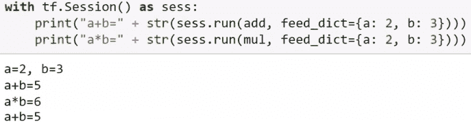

没有什么特别激动人心的——这只是让我们对 TensorFlow 正在做什么有一个基本的了解。我们将利用一些高级库来完成本章，但如果我们想要在未来更进一步，这是很重要的。

同样，我们将进行矩阵乘法。如前所述，常数可以不仅仅是标量。在这种情况下，我们定义矩阵，一个 2x2 的矩阵和一个 2x1 的矩阵，按照以下步骤：

1.  我们定义我们的矩阵如下：

```py
#Matrix multiplication
matrix1 = tf.constant([[1., 2.],[9.0,3.14159]])
matrix2 = tf.constant([[3.],[4.]])
```

1.  然后，我们告诉它进行矩阵乘法，如下所示：

```py
product = tf.matmul(matrix1, matrix2)
```

1.  我们创建我们的会话：

```py
with tf.Session() as sess:
    result = sess.run(product)
    print(result)
```

现在我们运行它，然后打印结果。输出如下：

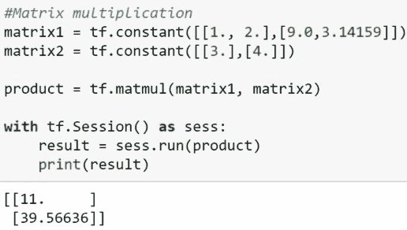

再次强调，这非常基础，但在未来非常重要。我们不会在本课中定义我们的完整网络，因为这非常复杂，执行起来也非常耗时，但只是简要提及创建我们自己的 CNN 的一般步骤。

我们将创建所谓的层，定义我们的输入，然后创建一系列层并将它们堆叠起来，定义它们是如何连接的。然后我们找到输出层，然后我们必须定义一些其他事情，比如我们如何训练以及我们如何评估它。

这个代码如下：

```py
#creating a convolutional neural network (skeleton--not complete code!)

# create a convolutional (not fully connected) layer...
conv1 = tf.layers.conv2d(x, 32, 5, activation=tf.nn.relu)
# and down-sample
conv1 = tf.layers.max_pooling2d(conv1, 2, 2)

# create second layer
conv2 = tf.layers.conv2d(conv1, 64, 3, activation=tf.nn.relu)
conv2 = tf.layers.max_pooling2d(conv2, 2, 2)

# flatten to 1D
fc1 = tf.contrib.layers.flatten(conv2)

# create fully-connected layer
fc1 = tf.layers.dense(fc1, 1024)

# final (output/prediction) layer
out = tf.layers.dense(fc1, n_classes)

#...training code etc.
```

再次强调，这只是为了我们的知识。深度学习是一个困难的课题，确定必要的架构以及如何精确训练，这超出了本章的范围（尽管我会邀请你了解更多关于它的内容）。在这里，我们只是看看我们如何利用已经完成的工作——但如果你想要更进一步，这就是你开始的地方。

在下一节中，我们将看到如何使用预训练的模型 Inception 来执行图像分类。

# 使用 Inception 进行图像分类

在本节中，我们将使用来自 Google 的预训练模型 Inception 来执行图像分类。然后我们将继续构建我们自己的模型——或者至少对模型进行一些再训练，以便在我们的图像上进行训练并对我们的物体进行分类。

现在，我们想看看我们如何使用已经训练好的模型，从头开始重新生成将花费很多时间。让我们从代码开始。

让我们回到 Jupyter Notebook。Notebook 文件可以在以下链接找到：[`github.com/PacktPublishing/Computer-Vision-Projects-with-OpenCV-and-Python-3/Chapter04`](https://github.com/PacktPublishing/Computer-Vision-Projects-with-OpenCV-and-Python-3/Chapter04)。

为了运行代码，我们需要从 TensorFlow 的网站上下载一个文件，如下链接所示：[`download.tensorflow.org/models/image/imagenet/inception-2015-12-05.tgz`](http://download.tensorflow.org/models/image/imagenet/inception-2015-12-05.tgz)。这是 Inception 模型。

该模型是在 2015 年训练的。它包含几个定义模型的文件，称为 *graph*，它定义了输入图像和输出分类之间的输入输出关系。

它还包含一些标签数据，因为输出不是类别名称；它是数字。这是从谷歌自己的 TensorFlow 示例中修改的，以便更容易理解和在 Jupyter Notebook 中运行，并减少代码量。然而，我们需要进行更改。

下载文件并完全解压。在 Windows 上，读者可能会使用 7-Zip，这将生成一个 TGZ 文件。确保然后解压缩 TGZ 文件以获取 TXT、PBTXT 和 PB 文件，特别是 PB 文件，因为它是实际包含训练模型的文件。

我们创建了一个名为 `inceptiondict` 的文件，而不是使用谷歌自己复杂的文件来映射类别数字到类别名称。

让我们看看 `inceptiondict` 文件：

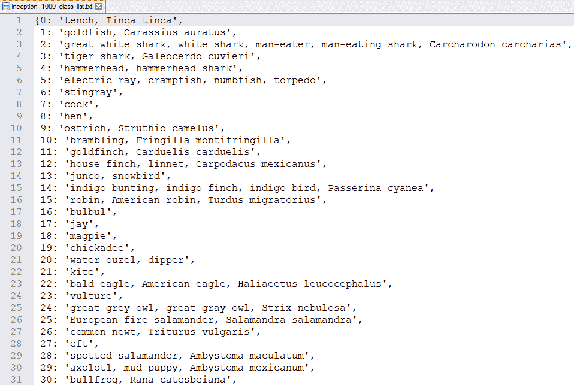

这个文件有千个类别。自己训练这个模型将花费非常长的时间，但我们不必这样做；我们可以利用这一点，并在后面构建在此基础上。

如果我们想知道在这个预构建模型中我们能够识别哪些类型的图像，这个文件很有趣。文件中有很多动物，一些常见物品，水果，乐器，不同种类的鱼；它甚至能够识别日本的游戏 *shoji*。

我们将这个文件导入为一个名为 `inceptiondict` 的字典，它将数字映射到相应的类别描述；例如，类别 `1` 映射到描述 `"goldfish, Carassius auratus"`。

让我们探索主要代码。首先，我们将文件导入为 `inceptiondict`：

```py
#The main code:
#"image" is a filename for the image we want to classify

#load our inception-id to English description dictionary
from inceptiondict import inceptiondict
```

现在，我们有了 `run_inference_on_image` 函数，其中 `image` 是一个文件名。它不是文件数据——我们还没有加载它——只是我们想要分类的图像的文件名。

然后，我们检查文件名是否存在，如果不存在则创建一个错误。如果存在，我们将使用 TensorFlow 自身的加载机制来读取该文件名，如下所示：

```py
def run_inference_on_image(image):

    #load image (making sure it exists)
    if not tf.gfile.Exists(image):
        tf.logging.fatal('File does not exist %s', image)
    image_data = tf.gfile.FastGFile(image, 'rb').read()
```

我们之前讨论过图文件。将 `classify_image_graph_def.pb` 这个关键的文件从 TGZ 文件解压到当前目录。使用 TensorFlow 自身的文件加载机制以二进制方式打开它，然后我们将从这个文件创建我们的图定义，如下所示：

```py
    # Load our "graph" file--
    # This graph is a pretrained model that maps an input image
    # to one (or more) of a thousand classes.
    # Note: generating such a model from scratch is VERY computationally
    # expensive
    with tf.gfile.FastGFile('classify_image_graph_def.pb', 'rb') as f:
        graph_def = tf.GraphDef()
        graph_def.ParseFromString(f.read())
        _ = tf.import_graph_def(graph_def, name='')
```

在这里，我们只是加载预训练模型。谷歌已经为我们完成了艰苦的工作，我们将从那里读取。

然后，就像我们之前做的那样，我们需要创建我们的 TensorFlow 会话。我们通过以下 `with` 语句来完成：

```py
   #create a TF session to actually apply our model
    with tf.Session() as sess:
        # Some useful tensors:
        # 'softmax:0': A tensor containing the normalized prediction across
        # 1000 labels.
        # 'pool_3:0': A tensor containing the next-to-last layer containing 2048
        # float description of the image.
        # 'DecodeJpeg/contents:0': A tensor containing a string providing JPEG
        # encoding of the image.
        # Runs the softmax tensor by feeding the image_data as input to the graph.
        softmax_tensor = sess.graph.get_tensor_by_name('softmax:0')
        predictions = sess.run(softmax_tensor,
                           {'DecodeJpeg/contents:0': image_data})
        predictions = np.squeeze(predictions)

        #The output here is a 1000 length vector, each element between 0 and 1, 
        #that sums to 1\. Each element may be thought of as a probability
        #that the image corresponds to a given class (object type, e.g. bird, 
        #plane, and so on).
```

这个模型已经具有多个称为张量的层。我们需要提取 `softmax` 层。

我们模型的输出不仅仅是检测到 100% 的东西；它为每一个东西都给出一个概率。例如，我们可能会有 90% 的概率认为我们的图像是某种猫，20% 的概率认为它是一只松鼠，0.01% 的概率是椅子或其他东西。是的，有时你确实会得到一些非常离谱的分类，尽管通常这些概率都非常小。

为每一千个类别中的每一个都计算了一部分概率。当然，其中绝大多数都是零或非常非常接近零。

我们想要提取倒数第二层，其中包含 2048 个对图像和输入图像的 JPEG 编码的详细描述。请注意，我们没有以二维或三维向量（或他们称之为张量）的形式加载原始图像数据——我们仍然以 JPEG 编码的形式拥有它。我们只是在定义变量以提取输出和找到输入。

NumPy 的 `squeeze` 函数可以去除所有单维。所以，如果我们有一个 1 行 1000 列的矩阵，这将把它转换成 1000 行 1 列。

好的，所以，我们理解了会话中的输入和输出。仅仅为了理解，我们只想提取前五个预测，并且我们将过滤掉概率小于 10% 的预测。最多我们只能得到五个预测，但通常会更少，因为我们忽略了低于 10% 的任何东西，如下所示：

```py
        #We only care about the top 5 (at most) predictions, and ones that have
        #at least a 10% probability of a match
        num_top_predictions= 5
        top_k = predictions.argsort()[-num_top_predictions:][::-1]
        for node_id in top_k:
            human_string = inceptiondict[node_id]
            score = predictions[node_id]
            if score > 0.1:
                print('%s (score = %.5f)' % (human_string, score))
```

我们运行模型并得到图像的输出，然后按我们的前五个排序。然后我们遍历这些顶级预测，通过运行输出的 `node_id` 通过我们的 `inceptiondict` 字典将其转换为人类字符串。我们读取 `score`，然后只有当 `score` 大于 10% 时才打印输出。

我们只是在定义函数，我们并没有运行它，所以这应该运行得非常快。

现在，我们将对这个图像运行这个程序。在 `sample_imgs` 子目录中有一些样本图像。我们想要测试这个，所以只需取消注释以下这些行中的一行来定义我们的 `image` 变量：

```py
#uncomment out one of these lines to test

image='sample_imgs/cropped_panda.jpg'
# image='sample_imgs/dog.jpg'
# image='sample_imgs/bicycle2.jpg'
# image='sample_imgs/garbagecan.jpg'
# image='sample_imgs/bunny.jpg'
# image='sample_imgs/trombone.jpg'
# image='sample_imgs/treasurechest.jpg'
# image='sample_imgs/hotdog.jpg'
figure()
imshow(imread(image))
run_inference_on_image(image)
```

然后，我们将创建一个图形，使用 `imshow` 函数查看我们看到的内容，然后使用 `run_inference_on_image` 函数，该函数将输出结果。

要运行前面的代码块并使用 `cropped_panda.jpg` 图片，取消注释熊猫图片行。我们可以在以下输出中看到图片。它以大约 90% 的概率将其分类为 `panda`、`giant panda` 或其他同义词，如下所示：

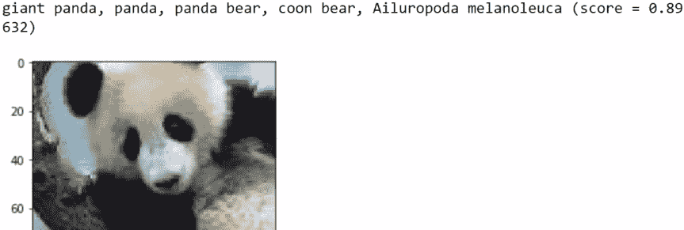

让我们在其他东西上试一试。比如我们的 `bicycle2.jpg` 文件？在取消注释 `bicycle2.jpg` 行的同时，注释掉 `cropped_panda.jpg` 行，我们得到以下输出：

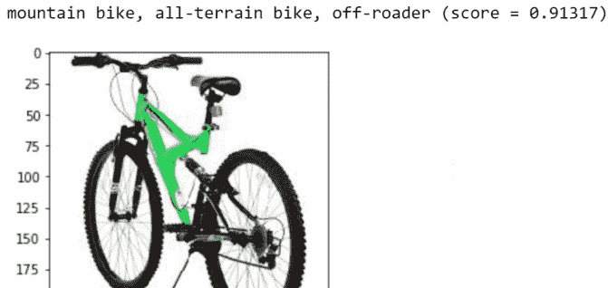

它以 91% 的概率将图片分类为 `mountain bike`。

我们在这里变得有点具体了。现在让我们用 `garbagecan.jpg` 文件来试一试：

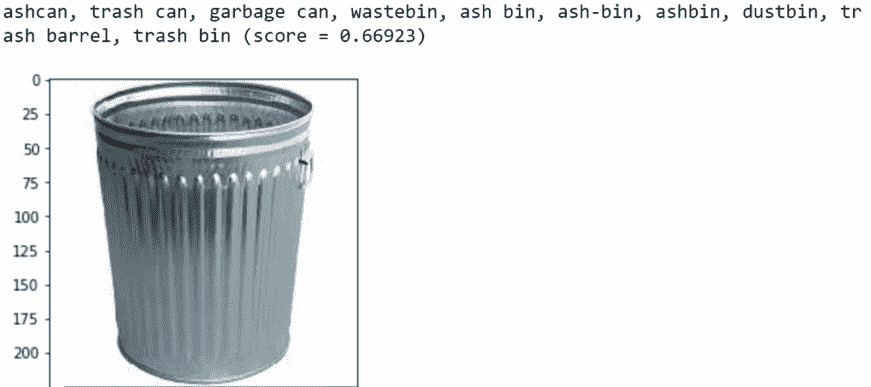

在这里它的置信度并不高，只有大约 67%的概率被分类。有时这就是我们能做的最好了，但这并不太糟糕。这是最可能的结果。

让我们尝试`bunny.jpg`文件：

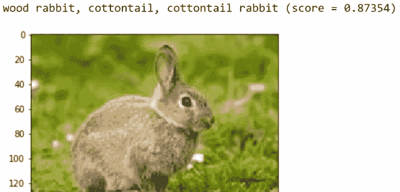

好吧，我们有 87%的把握认为这是一只兔子。看起来相当不错。

现在，让我们尝试`trombone.jpg`文件：

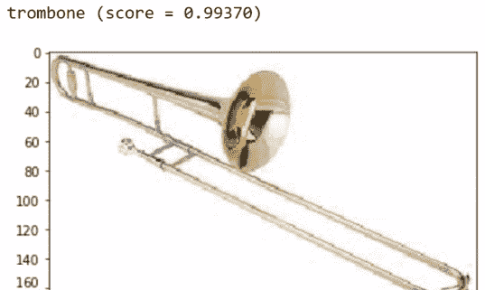

哇，非常确定。这张图片是长号的可能性超过 99%——非常好。

如果你是一个热门电视剧的粉丝，你可能想知道分类器是否能识别出热狗。答案是肯定的：

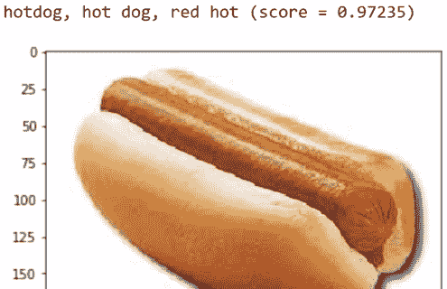

它确实识别出了一个`热狗`，置信度为 97%。

最后，我们将我们的分类器运行在`dog.jpg`图片上，如下所示：

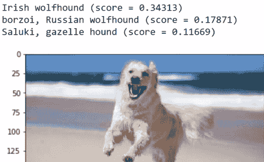

显然，训练这个模型的人是一个狗爱好者，所以他们定义了多个不同的狗类。我们得到了`爱尔兰猎狼犬`、`俄罗斯猎狼犬`、`瞪羚猎犬`和其他一些返回的结果。它似乎认为它属于那些类别之一！

这工作得相当好。如果我们需要的恰好是那些 1000 个类别之一，那么我们在这里就做得很好。你应该能够将 Jupyter Notebook 中的代码适应你的需求。希望深度学习和图像分类不再像以前那样令人生畏。

因此，我们将继续到下一部分，我们将使用我们自己的图片进行一些重新训练，并分类那些尚未在谷歌训练数据库中的对象。

# 使用我们自己的图片重新训练

在本节中，我们将超越我们使用预构建分类器所做的工作，并使用我们自己的图片和标签。

我首先应该提到的是，这并不是真正从头开始用深度学习进行训练——训练整个系统需要多个层次和算法，这非常耗时——但我们可以利用一种叫做**迁移学习**的技术，其中我们使用与大量图像训练的前几层，如下面的图所示：

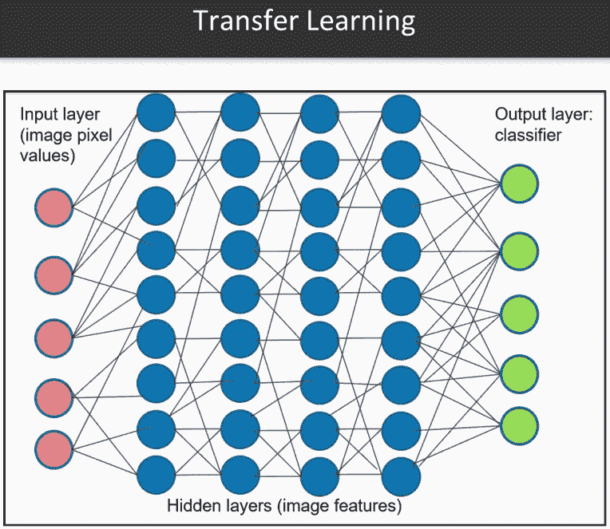

深度学习的一个注意事项是，拥有几百或几千张图片是不够的。你需要数十万甚至数百万个样本才能得到好的结果，而收集这么多数据是非常耗时的。此外，在个人电脑上运行它，我预计大多数人都在使用，在计算上是不切实际的。

但好消息是，我们可以从我们的现有模型中提取层，并在最后进行一些调整，从而得到非常好的结果。我们通过使用在数十万或数百万张图片上训练的输入特征来利用预训练，并将它们转移到模型以前从未见过的图像类型。

要做到这一点，我们从 TensorFlow Hub ([`www.tensorflow.org/hub/`](https://www.tensorflow.org/hub/)) 借用了一些代码。但是，我们必须做一些调整，以便它能够以更少的代码运行，并且可以轻松地将其放入我们的 Jupyter Notebook 中并运行。

为了开始，我们需要一些用于训练的图片，以及不同的训练方法。谷歌很友好地提供了一个名为 `flower_photos` 的样本，链接如下：[`download.tensorflow.org/example_images/flower_photos.tgz`](http://download.tensorflow.org/example_images/flower_photos.tgz)。再次强调，它是一个 TGZ 文件，所以请下载文件并彻底解压。

你将得到一个 `flower_photos` 目录，其中将包含不同种类花朵的子目录，如郁金香、蒲公英等，这些种类并未包含在最初的 1,000 个类别中。这些目录名将作为这些图片的标签。我们只需要解压它们，然后在我们的代码中输入花朵照片。

获取大量照片的一个便宜方法是使用 Chrome 的 Fatkun 批量下载插件 ([`chrome.google.com/webstore/detail/fatkun-batch-download-ima/nnjjahlikiabnchcpehcpkdeckfgnohf?hl=en`](https://chrome.google.com/webstore/detail/fatkun-batch-download-ima/nnjjahlikiabnchcpehcpkdeckfgnohf?hl=en))。使用这个插件，我们可以去像 Google 图片搜索这样的地方，搜索我们想要的任何类型的对象——动物、食物等等——并且可以快速地抓取数百张图片。

Firefox 或你使用的任何网络浏览器都有类似的插件。只要你不介意使用这类图片，如果它们能满足你的需求，那么这是一种很好的做法。

在你完成花朵照片的处理后，我建议你抓取自己的图片。想想你想要训练的内容，想想你认为会有用的内容。尽量获取每个类别的至少 100 张图片，并抓取多个类别。

为了说明目的，我决定对一些玩具进行分类。也许你正在经营一家玩具店，正在清点库存，或者你是一位收藏家，想要了解里面具体有什么——你只是有一堆照片，想要对它们进行分类。

我创建了四个子文件夹，分别命名为 `barbie`、`gi joe`、`my little pony` 和 `transformers`，如下所示：

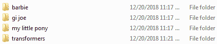

每个文件夹都包含每种类型超过 100 张的图片。文件名并不重要——只是目录名将被用于标签。

因此，你可以测试它是否工作，你需要将一些图片分离出来。如果你在训练过的图片上进行测试，那么你就是在作弊——你实际上不知道你的模型是否已经泛化。所以，请确保从该目录中提取一些图片，并将它们暂时放入一个单独的目录中。

重新训练的代码在 Jupyter Notebook 文件中本身就有介绍，所以我们不会从头到尾讲解。我们创建了一个名为`retrained.py`的文件，它是基于 TensorFlow Hub 版本，但更容易集成到现有代码中，并且许多变量已经处理好了。

我们需要做的只是导入`retrain`函数，然后在我们`toy_images`文件夹上重新训练，如下所示：

```py
#pull the function from our custom retrain.py file
from retrain import retrain

#Now we'll train our model and generate our model/graph file 'output_graph.pb'
retrain('toy_images')
```

这通常需要一段时间。如果你在`flower_photos`目录上运行代码，那可能需要半小时，尤其是在 CPU 上而不是 GPU 上。`toy_images`示例将花费更少的时间，因为图像数量较少。

在机器学习中进行训练通常是耗时最多的部分；这就是为什么你的电脑会长时间占用。将图像通过分类器运行是很快的，就像我们之前看到的，但训练可能需要几分钟、几小时、几天，甚至可能更长。在这种情况下，我们可能需要半小时，这取决于有多少图像。

几分钟后，我们的`retrained`函数成功运行，输出如下：

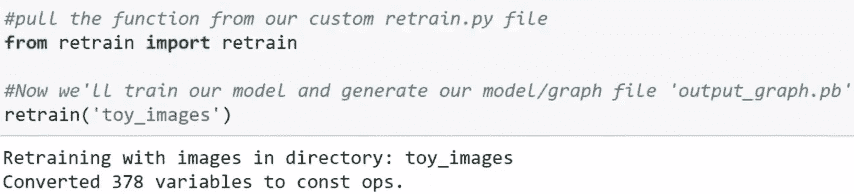

我已经降低了`retrain`函数的一些详细程度，否则它会输出很多没有太多意义的消息。如果你想检查代码是否成功运行，可以进入代码中将其调高，但只要一切设置正确，它应该会正常运行。

让我们确认它是否工作：

```py
#Confirm that it worked
!ls *.pb

#should see file "output_graph.pb"
```

我们将寻找那个`.pb`（Python 二进制文件）文件，它将是我们所做工作的输出。所以，那就是模型，输入输出模型，或者通常在 TensorFlow 中称为图。

运行代码后，我们应该得到以下输出：

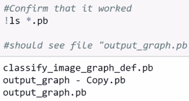

我们有一个名为`output_graph.pb`的文件。那就是我们刚刚创建的；你应该能在你的目录中看到这个文件。

运行你的图像的代码并不那么复杂。加载我们的`output_graph.pb`图文件与我们之前加载 Inception 模型时所做的类似，如下所示：

```py
#Let's load some code that will run our model on a specified image

def load_graph(model_file):
    graph = tf.Graph()
    graph_def = tf.GraphDef()

    with open(model_file, "rb") as f:
        graph_def.ParseFromString(f.read())
    with graph.as_default():
        tf.import_graph_def(graph_def)

    return graph
```

`read_tensor_from_image_file`函数有助于从图像文件中读取数据，如下所示：

```py
def read_tensor_from_image_file(file_name,
                                input_height=299,
                                input_width=299,
                                input_mean=0,
                                input_std=255):
    input_name = "file_reader"
    output_name = "normalized"
    file_reader = tf.read_file(file_name, input_name)
    if file_name.endswith(".png"):
        image_reader = tf.image.decode_png(
                file_reader, channels=3, name="png_reader")
    elif file_name.endswith(".gif"):
        image_reader = tf.squeeze(
                tf.image.decode_gif(file_reader, name="gif_reader"))
    elif file_name.endswith(".bmp"):
        image_reader = tf.image.decode_bmp(file_reader, name="bmp_reader")
    else:
        image_reader = tf.image.decode_jpeg(
                file_reader, channels=3, name="jpeg_reader")
    float_caster = tf.cast(image_reader, tf.float32)
    dims_expander = tf.expand_dims(float_caster, 0)
    resized = tf.image.resize_bilinear(dims_expander, [input_height, input_width])
    normalized = tf.divide(tf.subtract(resized, [input_mean]), [input_std])
    sess = tf.Session()
    result = sess.run(normalized)

    return result
```

这里有一些默认值，但它们并不重要。图像不一定需要是`299`乘以`299`。我们这里只处理 JPEG 文件，但如果我们有 PNG、GIF 或 BMP 格式的文件，模型也能处理。我们只需解码图像，将它们放入我们的变量中，并存储和返回它们。

如前所述，标签来自目录。以下代码将加载创建的`output_labels.txt`，它将从`output_labels.txt`中加载，这将是我们的一种字典，由我们的子目录名称定义：

```py
def load_labels(label_file):
    label = []
    proto_as_ascii_lines = tf.gfile.GFile(label_file).readlines()
    for l in proto_as_ascii_lines:
        label.append(l.rstrip())
    return label
```

以下代码显示了`label_image`函数。为了找到你已知的图像，给出正确的文件名，但有一个默认值以防万一：

```py
def label_image(file_name=None):
    if not file_name:
        file_name = "test/mylittlepony2.jpg"
    model_file = "./output_graph.pb"
    label_file = "./output_labels.txt"
    input_height = 299
    input_width = 299
    input_mean = 0
    input_std = 255
    input_layer = "Placeholder"
    output_layer = "final_result"
```

我为了简单起见硬编码了这些。如果你想改变东西，你可以，但我认为把它写在那里会让事情更容易阅读和理解。

我们加载我们的图文件，从图像文件中读取数据，并从我们创建的新模型中读取层名称，如下所示：

```py
    graph = load_graph(model_file)
    t = read_tensor_from_image_file(
            file_name,
            input_height=input_height,
            input_width=input_width,
            input_mean=input_mean,
            input_std=input_std)

    input_name = "import/" + input_layer
    output_name = "import/" + output_layer
    input_operation = graph.get_operation_by_name(input_name)
    output_operation = graph.get_operation_by_name(output_name)
```

我们将只读取输入和输出层。

我们定义了我们的会话，并从`output_operation`获取结果。再次，我们将它排序到`top_k`变量中，并打印结果：

```py
    with tf.Session(graph=graph) as sess:
        results = sess.run(output_operation.outputs[0], {
                input_operation.outputs[0]: t
        })
    results = np.squeeze(results)

    top_k = results.argsort()[-5:][::-1]
    labels = load_labels(label_file)
    for i in top_k:
        print(labels[i], results[i])
```

课程种类繁多，但实际上我们将会看到这里始终只有一个结果。

让我们再次尝试我们的代码。正如讨论的那样，我们将一些图像分离到一个单独的目录中，因为我们不想在训练图像上测试，那样证明不了什么。

让我们在我们的第一个`transformers1.jpg`图像上测试重新训练的模型。模型将显示图像并告诉我们分类结果：

```py
#label_image will load our test image and tell us what class/type it is

#uncomment one of these lines to test
#
test_image='test/transformers1.jpg'
# test_image='test/transformers2.jpg'
# test_image='test/transformers3.jpg'

# test_image='test/mylittlepony1.jpg'
# test_image='test/mylittlepony2.jpg'
# test_image='test/mylittlepony3.jpg'

# test_image='test/gijoe1.jpg'
# test_image='test/gijoe2.jpg'
# test_image='test/gijoe3.jpg'

# test_image='test/barbie1.jpg'
# test_image='test/barbie2.jpg'
# test_image='test/barbie3.jpg'

#display the image
figure()
imshow(imread(test_image))

#and tell us what the classification result is
label_image(test_image)
```

上述代码的输出如下：

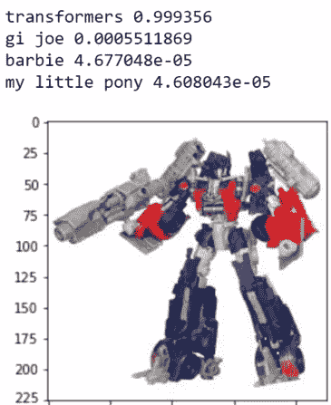

模型以非常高的概率将图像分类为`transformers`。由于我们的图像足够独特，并且类别较少，它将工作得非常好。我们看到有 99.9%的概率这张照片是变形金刚，有很小概率是 G.I. Joe，而且肯定不是芭比或小马宝莉。

我们可以使用*Ctrl + */*来在 Jupyter Notebook 中注释和取消注释代码行，并按*Ctrl + Enter*再次使用`transformer2.jpg`图片运行代码：

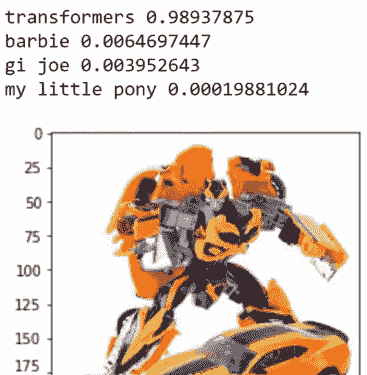

输出再次是`transformers`。这次模型认为它比 G.I. Joe 稍微更有可能是芭比，但概率微不足道。

让我们再次尝试使用`mylittlepony1.jpg`图片：

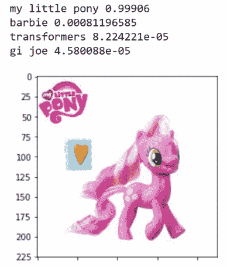

是的，它确实看起来像`my little pony`子文件夹中的其他图片。

让我们再拍一张照片，`mylittlepony3.jpg`：

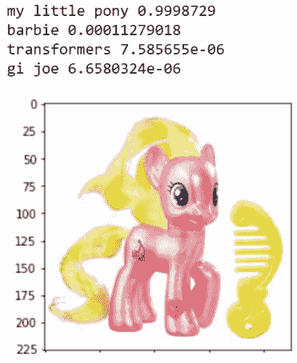

再次，没有问题对图像进行分类。让我们也看看`gijoe2.jpg`：

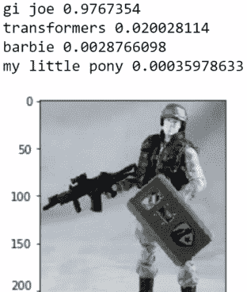

有很高的概率是`gi joe`，`transformers`和`barbie`比`my little pony`更可能，但再次，所有这些概率都是微不足道的——它肯定是一个`gi joe`。

最后，让我们在`barbie1.jpg`上尝试：

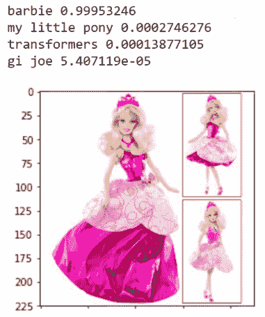

再次，肯定被分类为`barbie`，`my little pony`是第二可能的选择，可能是因为颜色；芭比和小马宝莉玩具上通常有更多的粉色和紫色。

现在我们知道如何使用我们自己的图像来重新训练一个现有的模型。不需要太多的编码或 CPU 时间，我们可以为我们的目的创建一个定制的图像分类器。

在下一节中，我们将讨论如何在你的 GPU 的帮助下加速计算。

# 使用 GPU 加速计算

在本节中，我们将简要讨论如何使用 GPU 加速计算。好消息是 TensorFlow 实际上在利用 GPU 方面非常聪明，所以如果你已经设置好了一切，那么这相当简单。

让我们看看如果 GPU 设置正确，事物看起来会是什么样子。首先，按照以下方式导入 TensorFlow：

```py
import tensorflow
```

接下来，我们打印`tensorflow.Session()`。这仅仅给我们提供了关于我们的 CPU 和 GPU（如果它已正确设置）的信息：

```py
print(tensorflow.Session())
```

输出如下：

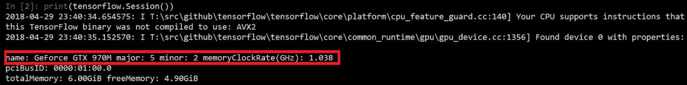

如我们从输出中可以看到，我们使用的是一块配备 GeForce GTX 970M 的笔记本电脑，它是 CUDA 兼容的。这是运行带有 GPU 的 TensorFlow 所必需的。如果一切设置正确，你将看到与前面输出非常相似的消息，包括你的 GPU，你的卡型号以及它的内存等详细信息。

TensorFlow 在这方面很聪明。我们可以自己覆盖它，但只有当我们知道自己在做什么，并且愿意投入额外的工作时，这才有好主意。除非我们知道自己在做什么，否则我们不会获得改进的性能，所以还是保留默认设置。

后续章节在 CPU 上运行良好，只是速度不是特别快。

关于 TensorFlow 使用 GPU 的坏消息是，设置它并不完全直接。例如，我们之前介绍了`pip`命令，比如`pip install tensorflow`和`pip install tensorflow-gpu`，这是一个起点，但我们仍然需要安装 CUDA。

我已安装版本 9.0。如果你有一块 Quadro GPU 或某种工作站，Tesla，或者那些专用卡，你应该使用 CUDA 版本 9.1。它是平台相关的，取决于你有什么样的 GPU，以及更具体地说，你有什么样的操作系统，所以我们不能在这里详细介绍。

需要知道的重要一点是，我们不仅需要安装`tensorflow-gpu`，我们还需要安装 CUDA。从 NVIDIA 网站下载并安装适用于您的操作系统的 CUDA（[`developer.nvidia.com/cuda-toolkit`](https://developer.nvidia.com/cuda-toolkit)）。

此外，TensorFlow 还需要**NVIDIA CUDA®深度神经网络**（**cuDNN**）库，这是一个 Windows 的大 DLL 文件，或 Linux 的共享对象（`.SO`）文件。macOS 的情况也类似。它只是一个文件，需要放在你的路径中。我通常将其复制到我的`CUDA`目录中。

如果你确实有一块，尝试安装 CUDA，尝试安装 cuDNN，并尝试让 TensorFlow 运行起来。希望这能加速你的计算。

# 摘要

在本章中，我们学习了如何使用基于 TensorFlow 的预训练模型来分类图像。然后我们重新训练我们的模型以处理自定义图像。

最后，我们简要概述了如何通过在 GPU 上执行计算来加速分类过程。

通过本书中涵盖的示例，你将能够使用 Python、OpenCV 和 TensorFlow 来执行你的自定义项目。
