# 第二章：将您的浏览器变成 Photoshop

很可能你已经使用过 Photoshop 或者至少听说过它。只需几点击，你就可以轻松地修改图像、增强它或者进行某种预处理。实际上，使用 JavaScript 来做并不难。对于大多数功能，你只需要几行代码。这一章主要关于滤波和图像分割。在这里，我们将讨论许多流行的技术和它们的应用。此外，我们将介绍一个新的 JavaScript 库——tracking.js ([`trackingjs.com`](http://trackingjs.com))。它主要用于对象跟踪应用，但也有许多与主题相关的实用工具。了解如何同时使用我们在第一章中介绍的 JSFeat 库和 tracking.js 库是非常有趣的。我们将看到如何做到这一点。此外，我们还将比较它们在图像滤波方面的优势。我们将从新库的安装开始，然后从最简单的到最令人兴奋的滤波示例进行讲解。

在本章中，我们将涵盖以下主题：

+   介绍 tracking.js 库

+   滤波是什么以及如何使用它

+   基本边缘检测

+   高级图像处理

# 介绍 tracking.js 库

让我快速回顾一下 tracking.js 库。这是一个伟大的库，可以帮助你进行对象检测、跟踪和图像滤波。你可以从[`trackingjs.com`](http://trackingjs.com)下载它。在本节中，我们将关注库的安装以及如何同时使用 JSFeat 和 tracking.js 库。

## 安装和图像加载

实际上，JavaScript 库的安装非常直接。你只需要将一个脚本文件添加到你的`<head>`标签中：

```py
<script src="img/tracking.js"></script>
```

图像加载是通过上下文完成的，就像我们在上一章中做的那样：

```py
var imageData = context.getImageData(0, 0, cols, rows);
```

与 JSFeat 库相比，tracking.js 使用数组，并且不会为图像创建新对象（如你所记得的，对于 JSFeat 来说，它是`matrix_t`函数）。在这种情况下，我们如何应用一个简单的操作？以下是将彩色图像转换为灰度的示例：

```py
var gray = tracking.Image.grayscale(imageData.data, cols, rows, true);
```

最后一个参数表示你是否需要以 RGBA 格式（`true`）返回数组，或者只以单通道灰度（`false`）返回。在这种情况下，我们收到一个`Uint8ClampedArray`，我们可以轻松地将其转换为`ImageData`构造函数并将其放入画布上下文：

```py
context.putImageData(new ImageData(gray, cols, rows), 0, 0);
```

简单，不是吗？我们唯一应该提到的是，对于大多数操作，tracking.js 返回`Float32Array`。通常，你可以将其转换为无符号字节数组而不会丢失任何信息。

## JSFeat 和 tracking.js 图像格式之间的转换

在某些情况下，JSFeat 和 tracking.js 库可以相互补充。为了从它们一起使用中受益，你可能需要将 JSFeat 矩阵转换为数组，反之亦然。关键的区别是，即使是灰度数据，tracking.js 有时也会使用四个数组元素：R、G、B、A。

要将矩阵用作数组，我们只需从矩阵中获取`mat.data`。在下面的代码中，我们从`ImageData`构造函数中加载矩阵，并将`mat.data`传递给 tracking.js 的灰度函数：

```py
var dataBuffer = new jsfeat.data_t(cols * rows, imageData.data.buffer);
var mat = new jsfeat.matrix_t(cols, rows, jsfeat.U8C4_t, dataBuffer);
var gray = tracking.Image.grayscale(mat.data, cols, rows, true);
```

由于`mat`变量包含四个通道，我们不需要将其转换为不同的格式。但如果我们想将灰度变量用作矩阵呢？

```py
var buf = new Array(gray.length / 4);
for (var i = 0, j = 0; i < gray.length; i += 4, ++j) {
    buf[j] = gray[i];
}
var matGray = new jsfeat.matrix_t(cols, rows, jsfeat.U8C1_t,
        new jsfeat.data_t(cols * rows, buf));
```

在这种情况下，我们跳过 G、B、A 元素，只将 R 元素添加到缓冲区中。有了这个缓冲区，我们就可以填充一个通道矩阵。

如您所见，转换过程很简单，只需记住 tracking.js 通常使用 4 通道数据。

# 什么是滤波以及如何使用它？

图像滤波始终是您在计算机视觉应用中使用的一个强大工具。它允许您在照片上应用许多令人兴奋的效果，例如图像校正、噪声减少、浮雕效果等。实际上，图像滤波是图像处理领域的一个巨大子部分。在本节中，我们将讨论图像滤波的概念，并讨论一个基本操作——卷积，它在所有计算机视觉应用中都被广泛使用。此外，我们将看到如何实现不同的效果，如模糊等。

## 图像卷积

大多数滤波操作的核心是图像卷积。对其理解将赋予您制作自己图像滤波器的力量。

图像卷积的思路是您希望将基于邻近像素的变换应用到原始图像的每个像素上。为此，您有一个核——一个简单的 2D 矩阵，这是我们变换矩阵。对于原始图像的每个像素，我们取乘积之和，每个乘积只是结果图像的新值。为了计算它，核的每个元素应该乘以相应的图像像素，其中核的中心必须乘以图像的当前像素。整个过程称为卷积。

要看到一个卷积的实际例子，我们应该转向最受欢迎的过滤器之一，它使用**高斯核**。这个过滤器本身被称为高斯滤波器（或高斯模糊），它用于图像平滑、噪声去除以及边缘检测。大多数边缘检测算法对噪声敏感，在使用边缘检测之前使用高斯滤波有助于去除不必要的噪声。

在下面的图中，我们展示了使用高斯核进行卷积的例子：

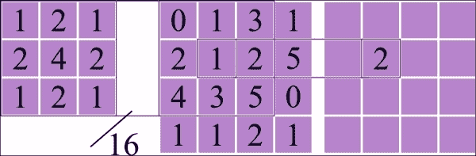

从左到右：高斯核、原始矩阵和结果矩阵。

要计算结果矩阵中`(2, 2)`位置的值，我们进行卷积：

*(1*0 + 2*1 + 1*3 + 2*2 + 4*1 + 2*2 + 1*4 + 2*3 + 1*5) / 16 = 2*

看看原始矩阵的邻居如何影响结果？简单来说，核矩阵代表了变换过程的权重。

2D 卷积需要四个循环来计算，所以在这种情况下，最好不要使用大的核；否则，我们的滤波过程会太慢。通常，在图像处理中，使用的核大小从*3x3*到*7x7*，而且，正如我们已经提到的，核应该有一个中心，并且维度应该是奇数。有方法可以提高卷积操作的性能，我们将在下一节分析其中一种方法。

## 高斯滤波和分离卷积

通常，我们不想使用像在图像上应用 2D 核这样重的处理方法。为了加快计算速度，我们可以使用不同的方法。对于大多数计算机视觉应用，我们只需要某种模糊和边缘检测方法。在这种情况下，那里使用的 2D 核可能表示为两个独立的 1D 核。这种操作表明，通过应用两个独立的行和列滤波器，你可以得到相同的结果。这个过程被称为分离卷积。以下是一个高斯核的例子：

```py
[0.25]                       [0.0625, 0.125,  0.0625]
[0.5 ] X [0.25, 0.5, 0.25] = [0.125,  0.0625, 0.125 ]
[0.25]                       [0.0625, 0.125,  0.25  ]
```

如果一个 2D 矩阵可以表示为两个向量的外积，那么这个 2D 矩阵是可分离的。

理论就到这里吧！我们甚至都没有在代码中看到高斯滤波的应用。此外，将 JSFeat 和 tracking.js 库结合起来是一个很好的点。

要获取高斯核，我们将使用 JSFeat：

```py
var kernelSize = 3, sigma = 0, kernelArray = [], dataType = jsfeat.F32_t;
jsfeat.math.get_gaussian_kernel(kernelSize, sigma, kernelArray, dataType);
```

你可以得到不同大小的高斯核。核的大小越大，图像就会越模糊。之前，我们看到了只有 3 个元素大小的核。接下来，sigma 指定了你的模糊宽度。如果你将其设置为 0，那么函数会根据给定的核大小本身计算最优值。结果将写入`kernelArray`变量，当然，数据类型是浮点型，因为我们正在执行浮点运算。函数执行后，`kernelArray`将包含以下内容：

```py
[0.25, 0.5, 0.25]
```

要获取完整的 2D 核，我们可以使用之前章节中提到的`multiply`函数：

```py
var gaussianKernel = new jsfeat.data_t(kernelArray.length, kernelArray);
var A = new jsfeat.matrix_t(1, kernelSize, jsfeat.F32C1_t, gaussianKernel),
        B = new jsfeat.matrix_t(kernelSize, 1, jsfeat.F32C1_t, gaussianKernel),
        C = new jsfeat.matrix_t(kernelSize, kernelSize, jsfeat.F32C1_t);
jsfeat.matmath.multiply(C, A, B);
```

你可以按`C`键来查看它代表高斯核。

要使用 1D 核，我们需要逐个将滤波器应用到原始图像上。不幸的是，JSFeat 库并没有提供这样的功能。但 tracking.js 提供了！我们将如下操作：

```py
var buf = tracking.Image.horizontalConvolve(gray, cols, rows, kernelArray, true);
buf = tracking.Image.verticalConvolve(buf, cols, rows, kernelArray, true);
```

记住，如果你想返回一个 RGBA 数组，你需要将最后一个参数设置为`true`。使用前面的代码，我们得到了一个模糊的图像，但如果我们单独应用每个滤波器会怎样？为了得到更清晰的结果，我们需要选择一个更大的核大小：

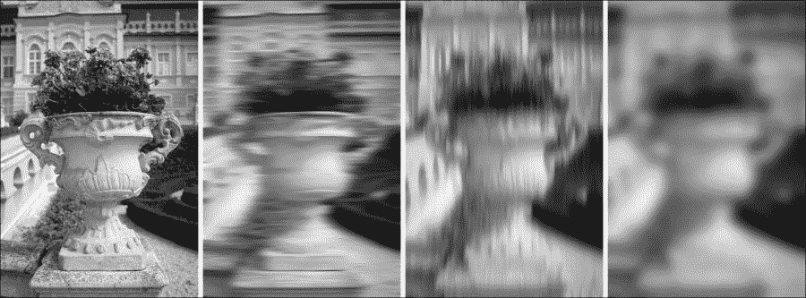

从左到右，我们看到一个灰度图像，然后我们看到了对其应用的水平滤波器，接着是对同一灰度图像的垂直滤波器。最后，如果我们对原始图像应用这两个滤波器，就像我们在代码中所做的那样，我们将收到一个像最后一个那样的模糊图像。最终，分离卷积是有效的！当你能够将一个 2D 核表示为两个 1D 核时，使用它是非常棒的。

值得注意的是，你可以不使用单独的过滤器应用高斯滤波器。对于 JSFeat 库，请参阅以下代码：

```py
jsfeat.imgproc.gaussian_blur(matGray, matBlurred, kernelSize);
```

对于 tracking.js，请参阅以下代码：

```py
var blurred = tracking.Image.blur(gray, cols, rows, kernelSize);
```

对于最后一个，结果返回`Float32Array`。所以如果你想正确显示它，你需要将其转换为`Uint8ClampedArray`类型。此外，这是你看到的第一个返回 RGBA 值的函数，你在这里不能只返回一个通道数组。

这里是不同核大小的示例：

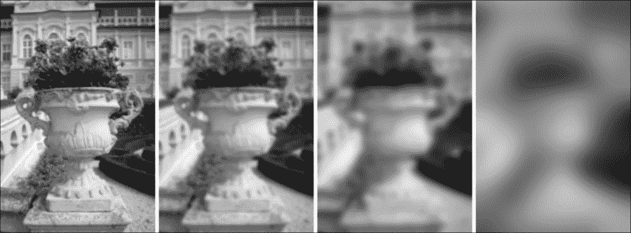

如你所见，我们选择的核大小越大，从图像中获得的信息就越少，模糊效果也就越明显。

当你需要减少图像噪声和细节时，高斯滤波器非常有用。此外，它通常用于减小图像大小，以获得小尺寸的更好图像近似。

## 盒式模糊

有一种不同的模糊方法需要讨论。有时，你只需要对高斯模糊操作进行粗略的近似，一个比高斯更快的过滤器。此外，你可以牺牲一些模糊质量。在这种情况下，你可以使用盒式模糊过滤器。

这只是一个常规的均值操作。它有一个简单的核，直径为 3 个元素：

```py
[1/9, 1/9, 1/9]
[1/9, 1/9, 1/9]
[1/9, 1/9, 1/9]
```

因此，对于直径 = *d* 它将如下所示：

```py
[1/n, 1/n, ..., 1/n]
[1/n, 1/n, ..., 1/n]
[..., ..., ..., ...]
[1/n, 1/n  ..., 1/n]
```

其中，*n = d * d* 是核中元素的数量。

它比高斯模糊简单，但产生的结果更差。它通常用作高斯模糊的近似。使用 JSFeat 库，它可以如下应用：

```py
jsfeat.imgproc.box_blur_gray(matGray, blurred, kernelRadius);
```

这里，我们使用`kernelRadius`参数而不是直径（矩阵大小）。如果你使用以下方法，可以得到相同的结果：

```py
[1/3, 1/3, 1/3]
```

使用 tracking.js 库分离过滤器向量。实际上，如果你使用三倍较小的核进行三次盒式模糊，可以得到与高斯滤波器非常接近的结果。例如，如果高斯核大小等于 33 个值，那么盒式模糊的核大小应该是 11（或半径 = 5）：

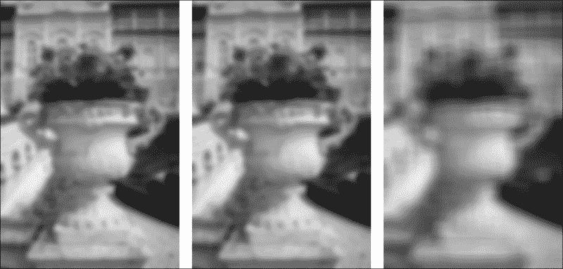

第一张图像应用了高斯滤波器，下一张应用了三次盒式模糊，最后一张具有与高斯核相同核大小的盒式模糊。你能说出前两张图像之间的区别吗？这真的是不可能指出。此外，我们看到最后一张图像的盒式模糊去除了更多细节，并产生了更差的结果。只有在你需要加快计算速度时才使用盒式模糊过滤器。但为什么它这么快呢？计算积分图像中有着魔法。

## 整数图像

当你需要快速计算图像参数时，积分非常有用。例如，你可以使用任何核大小相同的时间量来计算盒式模糊过滤器的滤波图像。这不是很神奇吗？此外，它还用于对象检测。

计算积分图像只是一个简单的算法，它生成矩阵矩形子集中的值的总和。对于 JSFeat 库，它可以这样计算：

```py
var matCopy1 = new jsfeat.matrix_t(matGray.cols + 1, matGray.rows + 1, jsfeat.F32C1_t);
var matCopy2 = new jsfeat.matrix_t(matGray.cols + 1, matGray.rows + 1, jsfeat.F32C1_t);
var matCopy3 = new jsfeat.matrix_t(matGray.cols + 1, matGray.rows + 1, jsfeat.F32C1_t);

jsfeat.imgproc.compute_integral_image(matGray, matCopy1.data, matCopy2.data, matCopy3.data);
```

第一个矩阵将包含积分图像或图像子集的常规总和，下一个矩阵将包含这些总和的平方，最后一个将包含倾斜的积分图像。所有输入矩阵的尺寸应该比原始图像大 1 像素。为了显示结果，我们需要对其进行归一化，例如，右下角的元素将包含矩阵中所有像素值的总和。我们无法显示结果矩阵，因为图像可能的最大像素值是 255。我们需要将每个像素除以矩阵中的最大值，并将其乘以 255。以下是结果：

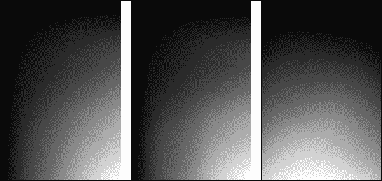

我们得到了预期的结果——对于前两个矩阵，最大值位于右下角，倾斜的结果在最后一个矩阵中呈现。

你可以自己应用积分进行盒式模糊！以下是如何做到这一点的简单解释：

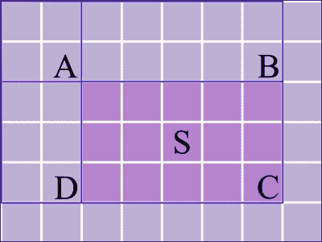

我们需要计算 ABCD 矩形的总和。从积分图像中，我们知道哪些总和存储在 *A*、*B*、*C* 和 *D* 位置。矩形的总和可以使用以下公式计算：

*S = C 中的值 – B 中的值 – D 中的值 + A 中的值*

这可以应用于任何大小的盒式模糊过滤器，这也是它为什么这么快的原因。首先，我们需要计算一个积分图像，这是通过一次遍历所有像素值来完成的，然后我们只需为每个像素计算 *S*。

# 基本边缘检测

对于大多数计算机视觉应用，你处理一个图像，但你实际上并不需要从它那里获取所有信息。例如，有时你只需要获取形状信息以找到合适的目标。在图像处理领域有一个巨大的主题叫做**边缘检测**。与该主题相关的方法，搜索像素亮度发生剧烈变化的位置。提取的信息旨在捕捉图像属性的变化。为了更好地理解这个概念，并看到如何从图像中提取基本边缘信息，我们将从 Sobel 滤波器开始讨论不同的边缘滤波器（或算子）。

## Sobel 滤波器

Sobel 算子或 Sobel 滤波器是常见且广泛使用的。它有助于检测图像中的边缘和过渡。Sobel 算子在使用过程中使用两个核——一个用于亮度水平变化，另一个用于垂直变化。它的核值不是集中在当前像素上，而是集中在它的相邻像素上。

典型的 Sobel 核看起来像这样：

```py
[-1, 0, 1]   [1]                [-1, -2, -1]   [-1]
[-2, 0, 2] = [2] X [-1, 0, 1]   [ 0,  0,  0] = [ 0] X [1, 2, 1]
[-1, 0, 1]   [1]                [ 1,  2,  1]   [ 1]
```

正如你所见，核可以分解为两个独立的过滤器，这在处理时间上是有好处的。你可以在库中以不同的方式运行这个过滤器。由于 tracking.js 提供了更多可分离过滤器的功能，让我们看看它的几个例子：

```py
var sobelSignVector = [-1, 0, 1];
var sobelScaleVector = [1, 2, 1];
var horizontal = tracking.Image.separableConvolve(gray, cols, rows, sobelScaleVector, sobelSignVector, true);
var vertical = tracking.Image.separableConvolve(gray, cols, rows, sobelSignVector, sobelScaleVector, true);
```

这是另一种在 tracking.js 库中应用可分离滤波器的方法。我们使用`separableConvolve`函数，而对于第四和第五个参数，它使用 Sobel 向量。

这些结果通常被称为导数，因为它们测量了值的改变。我们可以在 JSFeat 中如下计算这些导数：

```py
jsfeat.imgproc.sobel_derivatives(matGray, imgGxGy);
```

其中`imgGxGy`返回一个 2 通道矩阵，第一个通道表示水平导数，第二个通道表示垂直导数。

要得到 Sobel 滤波器的结果，我们需要将这两个结果结合起来；这是通过以下方程完成的：

```py
var value = Math.sqrt(h * h + v * v);
```

这里，value 变量是每个像素的值，它是通过使用水平和垂直导数的像素值来计算的。

要直接在图像上运行 Sobel 算子，你可能更喜欢使用以下 tracking.js 函数：

```py
var sobelImg = tracking.Image.sobel(gray, cols, rows);
```

你需要记住它返回一个 RGBA 数组，并且你需要对其进行归一化，因为它包含大于 255 的值。

最终结果将看起来像这样：

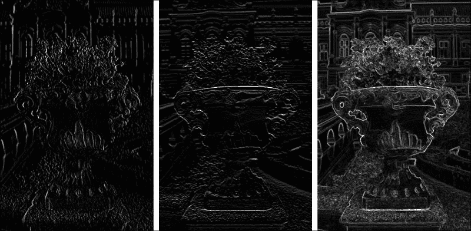

从左到右，我们看到水平导数，然后是垂直导数，最后是应用 Sobel 滤波器后的结果。正如你所见，图像的边缘有很好的可视化。要获取边缘，不仅仅是图像像素的变化，我们需要深入一点。但让我们讨论几个你可能想在边缘检测中使用的其他有用的算子。

## 其他算子

你需要记住在计算机视觉中，通常没有做事情的最佳方式。有几个算子需要提及；在某些情况下，它们可以产生比 Sobel 滤波器更好的结果。例如，Prewitt 算子：

```py
[-1, 0, 1]   [1]                 [-1, -1, -1]   [-1]
[-1, 0, 1] = [1] X [-1, 0, 1]   [ 0,  0,  0] = [ 0] X [1, 1, 1]
[-1, 0, 1]   [1]                 [ 1,  1,  1]   [ 1]
```

有时，这是一个很好的起点，但它对结果值的平均太多，还记得盒子模糊滤镜吗？与高斯模糊相比，核的中心权重更大。如果我们想那样做，Sobel 滤波器是首选。然而，有时你需要为中心保存更多一点的信息。如果你需要，你可以使用 Scharr 滤波器：

```py
[ -3, 0,  3]   [ 3]                [-3, -10, -3]   [-1]
[-10, 0, 10] = [10] X [-1, 0, 1]   [ 0,   0,  0] = [ 0] X [3, 10, 3]
[ -3, 0,  3]   [ 3]                [ 3,  10,  3]   [ 1]
```

看看，中心现在权重更大了。实际上，很难区分 Prewitt、Sobel 和 Sharr 算子之间的差异，这就是为什么我们没有在这里提供视觉示例。最好是进行一些实验并检查你确切需要哪个滤波器。

# 高级图像处理

我们谈了很多关于滤镜的内容，但它们通常只需要某种矩阵核，就是这样。如果你认为图像滤波中应该有更多酷的东西，你完全正确！首先，我们将看到如何应用边缘检测以及它是如何工作的。在最后一部分，我们将回顾直方图均衡化算法，如果你经常使用 Photoshop，你可能很熟悉它。

## Canny 边缘检测器

让我们保持好奇心；如果在 Sobel 滤波器之后对图像进行阈值处理会怎样？阈值处理是通过迭代灰度图像的所有像素并检查其值是否超过阈值值来完成的：

```py
for (var i = 0; i < arr.length; i++)
    arr[i] = arr[i] > threshold ? 255 : 0;
```

这就是阈值的样子。如果它高于阈值，就将其设置为`255`，如果不高于阈值，就设置为`0`。

这里有一些不同阈值的示例，每个图像的较高阈值值都比前一个高：

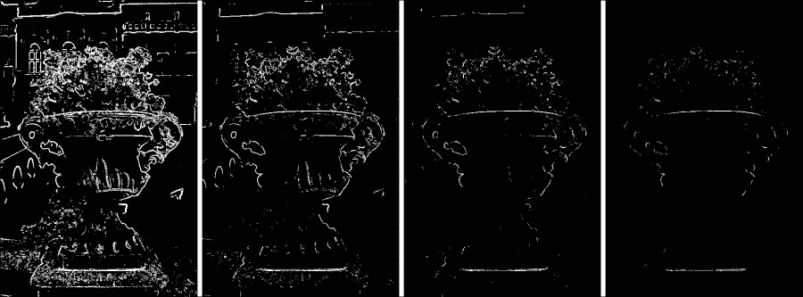

看看？我们设置的阈值越高，得到的边缘就越少。这是 Canny 边缘检测算法的第一步。

当您需要从图像中仅处理最重要的信息（通常是形状信息），并且需要在不丢失图像重要结构属性的情况下移除不必要的数据时，使用边缘检测器是非常聪明的。如今，Canny 边缘检测器被最广泛使用。

您可以使用 JSFeat 库运行整个算法：

```py
var canny = new jsfeat.matrix_t(cols, rows, jsfeat.U8C1_t);
jsfeat.imgproc.gaussian_blur(matGray, canny, kernelSize);
jsfeat.imgproc.canny(canny, canny, lowThresh, highThresh);
```

在开始 Canny 算法之前，我们通常应用高斯模糊以减少噪声。您选择的核大小越大，得到的边缘和噪声就越少。通常情况下，会根据经验选择较低和较高的阈值。

在较低阈值下，算法会移除（或抑制）所有像素（弱像素），就像我们在玩 Sobel 滤波器阈值时做的那样。值大于较高阈值的像素被标记为强像素。在最后阶段，除了弱像素外，算法还会抑制所有未连接到那些强像素的像素。一般来说，您的较低阈值越小，您得到的噪声就越多；您的较高阈值越大，您得到的对象边缘就越少。这如图所示：

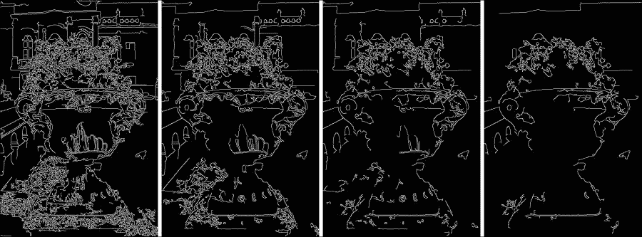

该算法检测对象边界或边缘。对于第一张图像，我们分别选择了 50 和 300 作为较低和较高的阈值，并且没有使用高斯模糊。对于第二张图像，我们应用了高斯滤波器。结果，许多噪声边缘被移除。如果我们把较低阈值提高到 100，那么我们将得到第三张图像的结果。在这种情况下，从地面移除了大部分噪声数据。在提高较高阈值后，我们得到较少的对象边缘，这在第四张图像中可以看到。您可以调整参数；只需记住，当您提高任何阈值时，您将获得较少的信息。

Canny 滤波器只返回背景为`0`和边缘为`255`。边缘的厚度为 1 像素，这在需要找到对象时非常重要。Canny 边缘检测器包含在许多计算机视觉框架中，其应用非常广泛。它对各种环境条件具有适应性，并且非常鲁棒。

## 直方图均衡化

有时候，您可能想要提高图像的对比度。当重要数据由接近的对比度值表示时，这有助于更好地查看细节。这种帮助来自于操作图像直方图的方法。图像直方图显示了每个色调值对应的像素数量。假设您有一个数组，如下所示：

```py
var arr = [30, 100, 10, 30, 30, 100, 50, 255];
```

你可能想要重新分配值，如果它们有更好的强度值分布。让我们使用 JSFeat 提供的直方图均衡化方法：

```py
var matGray = new jsfeat.matrix_t(arr.length, 1, jsfeat.U8C1_t,
        new jsfeat.data_t(arr.length, arr));
var equalized = new jsfeat.matrix_t(arr.length, 1, jsfeat.U8C1_t);
jsfeat.imgproc.equalize_histogram(matGray, equalized);
```

直方图均衡化只是一个普通的函数。第一个参数表示输入矩阵，第二个参数表示输出均衡化矩阵。使用我们的数组，均衡化的结果是`equalized.data`：

```py
[128, 223, 32, 128, 128, 223, 159, 255]
```

原始（左）和均衡化（右）数组的直方图将看起来像这样：

```py
 10: 1      32: 1
 30: 3     128: 3
 50: 1     159: 1
100: 2     223: 2
255: 1     255: 1
```

直方图均衡化函数将旧值映射到新值，在整个值域 0-255 上实现更好的分布。在先前的例子中，大多数值都位于值域的第一部分，重新分配后，值之间的差异增加了。从视觉上看，这有助于区分图像中的不同对象。

下面是使用图像的示例：

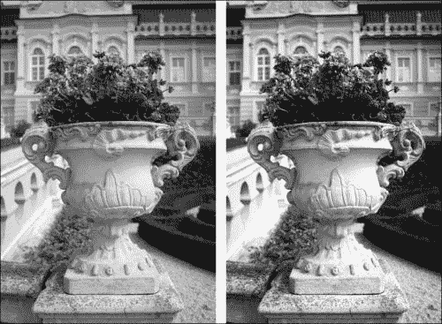

左边 – 原始灰度图像，右边 – 均衡化后的图像。

如你所见，对比度现在好多了，图像本身看起来也更引人注目。草地和植物变得更暗，建筑更亮。输入和输出图像的直方图如下：

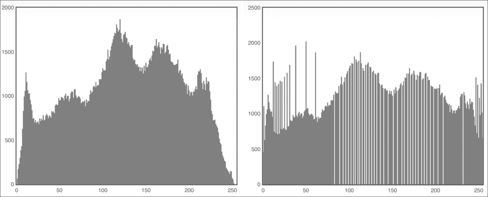

由于更好的分布，直方图均衡化使得直方图略微平坦，因此直方图值没有如此清晰的中心。

直方图均衡化不仅可以用于更好的图像查看，还可以用于提取更好的图像信息。通常，当图像的背景和前景没有高对比度时很有用。你应该知道的最大缺点是，此函数可能会增加图像噪声。无论如何，直方图均衡化确实非常有用，例如在医学成像和照片校正中。

# 摘要

在本章中，你首先学习了如何安装 tracking.js 以及如何使用 JSFeat。现在你知道如何使用图像卷积操作创建自己的图像过滤器。此外，通过可分离卷积，你可以创建常规滤波器的更快实现。当你需要减少噪声时，你通常会使用高斯滤波器或方框模糊滤波器，当你需要一个更快的算法时。边缘检测？没问题，你可以实现它并在你的应用程序中使用它，无论是你需要边缘还是整个关于图像亮度变化的详细信息。最后但同样重要的是，你现在知道如何使用直方图均衡化来提高图像对比度。看看我们在这样一个小章节中涵盖了多少内容！关于图像处理和滤波还有很多主题，我们只是讨论了其中的一小部分。最终，我们将准备好在目标检测中使用这些知识。

在下一章中，你将学习如何使用不同的跟踪技术检测各种对象，例如颜色检测和特征估计。此外，我们还将能够创建自己的跟踪器。那里见！
