# 第三章：使用 Kaggle 笔记本学习和工作

Kaggle 笔记本——*直到最近还被称为内核，所以如果我在偶尔使用这些术语时互换使用，请见谅*——是浏览器中的 Jupyter 笔记本，可以免费运行。这意味着您可以从任何有互联网连接的设备执行实验，尽管比手机大一点的设备可能是个好主意。环境的规格说明（截至本文写作时）如下所示：

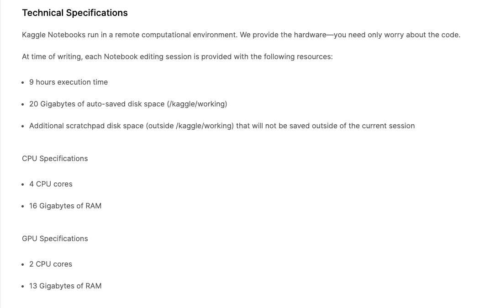

不再拖延，让我们直接进入正题。我们首先要做的是弄清楚如何设置笔记本。

## 设置内核

创建笔记本有两种主要方法：从主页或从数据集级别。

要进行第一种方法的操作，请转到 [`www.kaggle.com/`](https://www.kaggle.com/) 着陆页左侧菜单的**代码**部分，并按下**新建笔记本**按钮。如果您计划进行涉及上传自己的数据集的实验，这是一个首选方法。

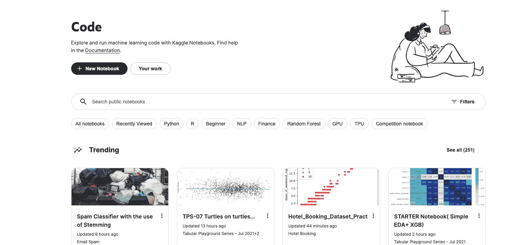

或者，您可以访问您感兴趣的数据集页面，并点击那里的**新建笔记本**按钮：

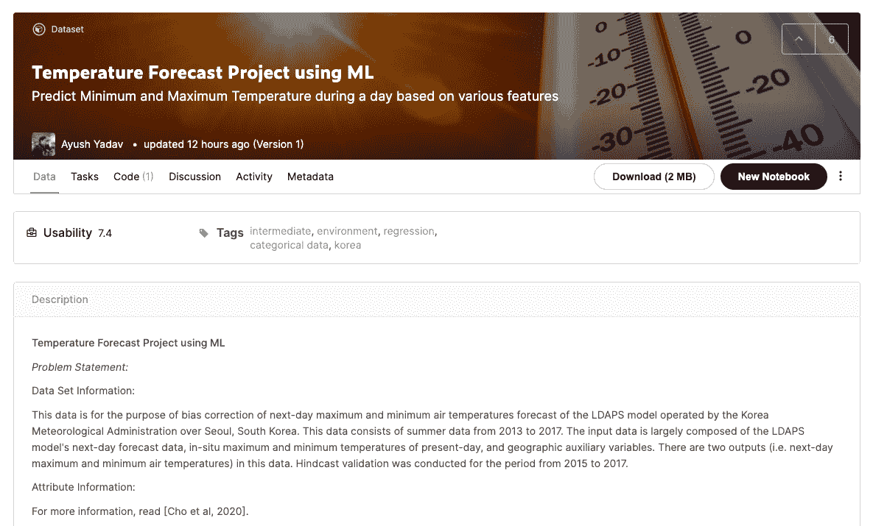

无论您选择哪种方法，在点击**新建笔记本**后，您将被带到您的笔记本页面：

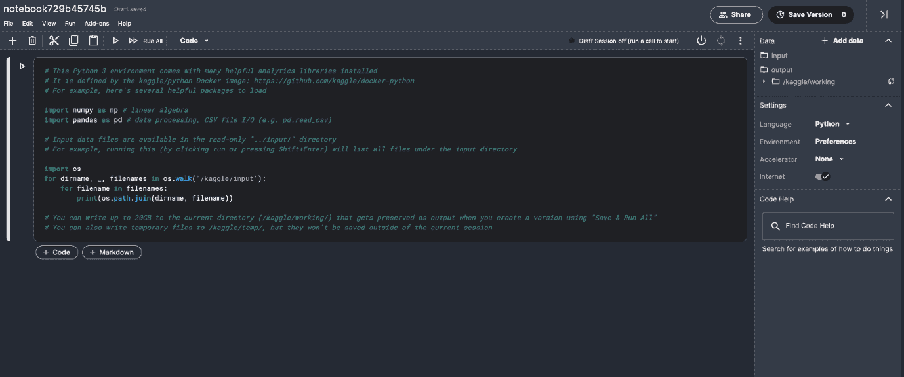

默认情况下，新笔记本初始化时语言设置为**Python**——如果您想使用 R，请点击右侧的**语言**下拉菜单，您的笔记本将切换到**R**：

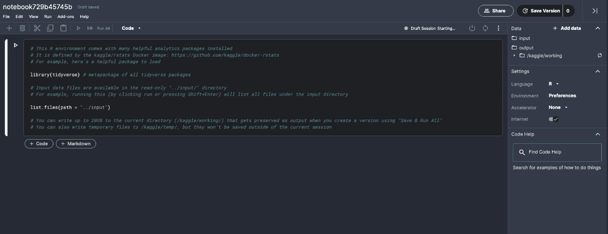

使用笔记本的一个重要方面：您始终可以取一个现有的（由某人创建）并克隆它以修改和调整以满足您的需求。这可以通过在内核页面上按下**复制并编辑**按钮来实现，尽管在 Kaggle 术语中，这个过程被称为**分支**：

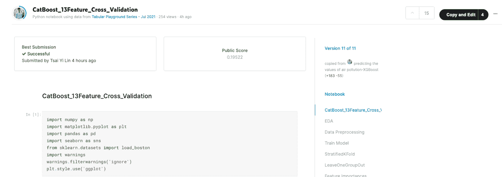

关于礼仪的注意事项：如果您参加过 Kaggle 比赛，您可能已经注意到排行榜被高分笔记本的分支所淹没。在别人的工作上建立没有错——但如果您这样做，请记得点赞原始作者。

您创建的笔记本默认是私有的（即只有您可见）。如果您想让它对其他人可用，您可以选择

## 升级到 GCP

有时候，Kaggle 免费提供的资源可能不足以满足您的任务需求，您可能需要迁移到一个更强大的机器。您可以自己设置整个环境——或者您可以在笔记本框架内保持，但更换底层机器。这就是 Google Cloud AI Notebooks 的作用所在。

为了将您的笔记本迁移到 GCP 环境，请转到左侧侧边栏菜单并点击**升级到 Google Cloud AI 笔记本**：

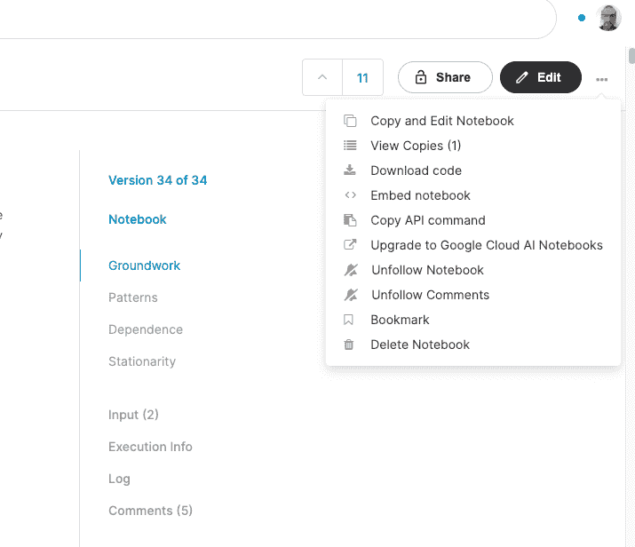

您将看到提示：

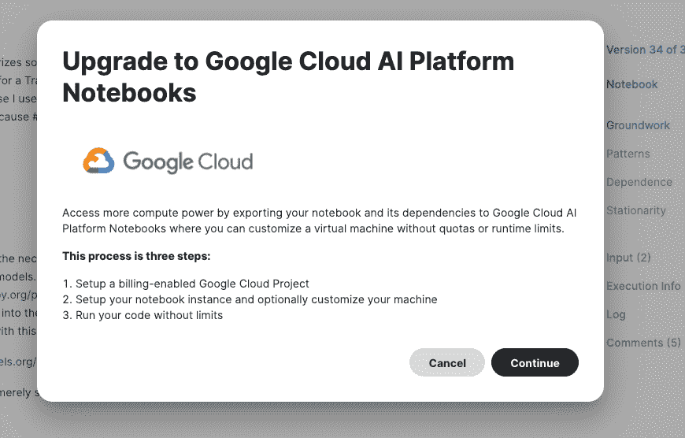

之后，你将被重定向到**谷歌云平台**控制台，在那里你需要配置你的计费选项——与 Kaggle 不同，GCP 不是免费的。如果是你第一次使用，你需要完成一个教程，它会引导你完成必要的步骤：

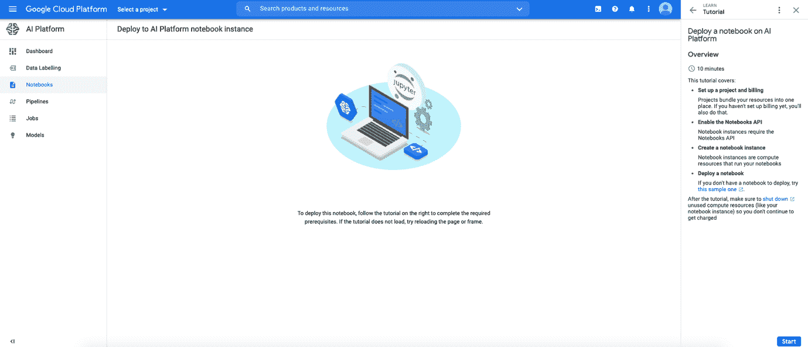

## 超越一步

如本章前面所述，Kaggle 笔记本是教育和参与比赛的一个极好的工具，但它们还服务于另一个极其有用的目的，即作为你作品集的一部分，可以用来展示你的数据科学技能。

在构建你的数据科学作品集时，有许多潜在的考虑因素（品牌建设、受众覆盖、向潜在雇主展示等），但如果没有人能找到它们，那么这些因素都不重要。因为 Kaggle 是谷歌的一部分，笔记本由世界上最受欢迎的搜索引擎索引——所以如果有人正在寻找与你代码相关的主题，它将出现在他们的搜索结果中。

下面我举一个“个人”的例子：几年前，我为一个比赛写了一个笔记本——我想解决的问题是对抗验证（对于那些不熟悉这个话题的人来说：一个相当简单的方法是，通过构建一个训练有素的二元分类器来区分训练集和测试集，以查看它们是否有相似的分布）。在撰写这一章时，我尝试了这种方法，结果令人惊讶，它出现在搜索结果的高位（注意我在查询中并没有提到 Kaggle 或任何个人细节，如名字）：

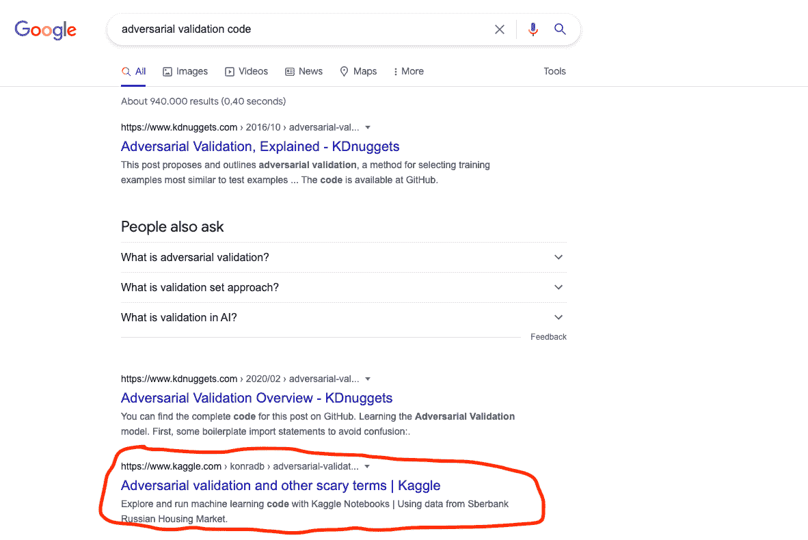

接下来，让我们看看使用笔记本展示技能集的其他好处：就像比赛、数据集和讨论一样，笔记本可以获得投票/奖牌，从而在进步系统和排名中定位你。你可以远离比赛赛道，仅通过专注于社区所欣赏的高质量代码，成为专家/大师/宗师。最新的进步要求版本可以在[`www.kaggle.com/progression`](https://www.kaggle.com/progression)找到，下面我们给出与笔记本相关的快照：

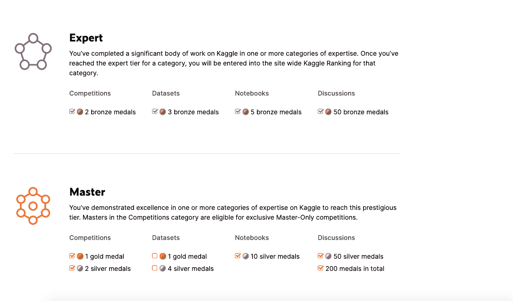

你的 Kaggle 个人资料带有关注者/被关注选项，并为你提供了链接其他专业网络（如 LinkedIn 或 GitHub）的可能性，这样你就可以利用在社区中获得的联系：

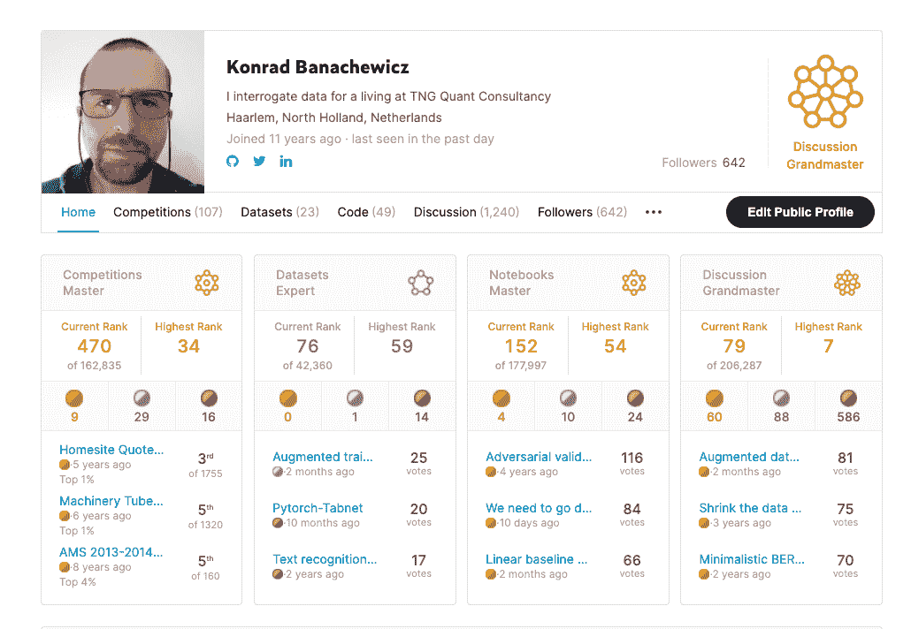

在这个时代，对“社区建设”的宣称持怀疑态度是很常见的——但在 Kaggle 的情况下，这竟然是真的。他们在数据科学领域的品牌认知度无人能及，无论是对于从业者还是那些真正做足功课的招聘者来说。在实践中，这意味着一个（足够不错的）Kaggle 个人资料已经可以让你迈过门槛——正如我们都知道的，这通常是最难的一步。

## Kaggle 课程

Kaggle 的许多事情都是关于获取知识，无论是你在比赛中学习到的知识，还是你在不断增长的存储库中找到的数据集，或者是展示一个以前未知的模型类别，总有新东西可以探索。这个集合中最新的补充是汇集在*Kaggle Learn*标签下的课程：[`www.kaggle.com/learn`](https://www.kaggle.com/learn)。这些是 Kaggle 作为“获得独立数据科学项目所需技能的最快方式”进行营销的微课程，核心统一主题是在各种主题上提供快速入门课程。每门课程都分为小章节，随后是编码实践问题。

下面，我们提供它们内容的简要总结：

+   **Python**: [`www.kaggle.com/learn/python`](https://www.kaggle.com/learn/python) 你将学习函数、布尔变量、循环、列表和字典的基础知识。

+   **机器学习入门/中级机器学习**: [`www.kaggle.com/learn/intro-to-machine-learning`](https://www.kaggle.com/learn/intro-to-machine-learning) 这两门课程最好看作是一个两集系列：第一集介绍了机器学习中使用的不同类别的模型，随后讨论了不同模型共有的主题，如欠拟合/过拟合或模型验证。第二集则深入到特征工程，处理缺失值和处理分类变量。

+   **Pandas**: [`www.kaggle.com/learn/pandas`](https://www.kaggle.com/learn/pandas): 这门课程提供了对现代数据科学中最基本工具之一的快速介绍。你首先学习如何创建/读取/写入数据，然后转向数据清洗（索引、选择、组合、分组等）。

+   **数据可视化**: [`www.kaggle.com/learn/data-visualization`](https://www.kaggle.com/learn/data-visualization) 每个人都知道一张图片可以值千言万语——如果你想学习如何创建这样的图像来总结你的数据科学成果，这门课程就是为你准备的。你将学会如何处理从折线图到热图和散点图的每一件事。

+   **特征工程**: [`www.kaggle.com/learn/feature-engineering`](https://www.kaggle.com/learn/feature-engineering) 这门短期课程展示了关于编码分类数据、通用特征生成和选择的基本理念。

+   **数据清洗**: [`www.kaggle.com/learn/data-cleaning`](https://www.kaggle.com/learn/data-cleaning) 另一门短期课程，有助于解决学术课程中最明显的遗漏之一：让学生意识到现实生活中的数据有多混乱。

+   **SQL 入门/高级 SQL** [`www.kaggle.com/learn/intro-to-sql`](https://www.kaggle.com/learn/intro-to-sql) 在这门课程的组合中，你将学习如何使用 SQL 提取数据。从基本的 SELECT 变体开始，你将学习 GROUP BY、HAVING，一直到 JOINs/UNIONs，并探索分析函数和嵌套数据。

+   **地理空间分析** [`www.kaggle.com/learn/geospatial-analysis`](https://www.kaggle.com/learn/geospatial-analysis) 本课程将教你如何使用 GeoPandas 创建你的第一张地图，并介绍创建交互式和分县图的方法。还将介绍邻近分析的基础知识。

+   **深度学习入门** [`www.kaggle.com/learn/intro-to-deep-learning`](https://www.kaggle.com/learn/intro-to-deep-learning) 本课程提供了一个对现代深度学习中最重要方法论的快速介绍。使用结构化数据，你将熟悉梯度下降、批量归一化等基本概念，并将这些知识应用于二分类的典型问题。

+   **计算机视觉** [`www.kaggle.com/learn/computer-vision`](https://www.kaggle.com/learn/computer-vision) 和 **自然语言处理** [`www.kaggle.com/learn/natural-language-processing`](https://www.kaggle.com/learn/natural-language-processing) 是两门快速课程，介绍了深度学习成功应用的两个最重要的领域，产生了令人印象深刻的最新技术水平。介绍了迁移学习和数据增强的关键主题，为你提供了立即投入实践的工具。

+   **游戏人工智能** [`www.kaggle.com/learn/intro-to-game-ai-and-reinforcement-learning`](https://www.kaggle.com/learn/intro-to-game-ai-and-reinforcement-learning) 本课程是对 Kaggle 在学习模块中引入的技术重点部分的完美总结。你将编写一个游戏智能体，调整其性能，并使用最小化算法。

+   **机器学习可解释性** [`www.kaggle.com/learn/machine-learning-explainability`](https://www.kaggle.com/learn/machine-learning-explainability) 建立模型很有趣，但在现实世界中，并非每个人都是数据科学家，所以你可能会发现自己需要向他人解释你所做的工作。这就是模型可解释性迷你课程发挥作用的地方：你将学习使用三种不同的方法来评估你的特征的相关性：置换重要性、SHAP 和部分依赖图。

+   **人工智能伦理** [`www.kaggle.com/learn/intro-to-ai-ethics`](https://www.kaggle.com/learn/intro-to-ai-ethics) 这最后一门课程是对提案的一个非常有趣的补充：它讨论了指导人工智能系统道德设计的实用工具。你将学习如何识别人工智能模型中的偏差，检验人工智能公平性的概念，并了解如何通过传达机器学习模型信息来提高透明度。

除了 Kaggle 创建的原始内容外，该平台还提供了多种其他使用内核的学习机会。一个值得提及的突出例子是极受欢迎的 fast.ai 课程：[`www.kaggle.com/general/63077`](https://www.kaggle.com/general/63077)

在本章中，我们讨论了 Kaggle 内核：这是一个多用途、开放的编码环境，可用于教育、实验以及推广你的数据科学项目组合。
