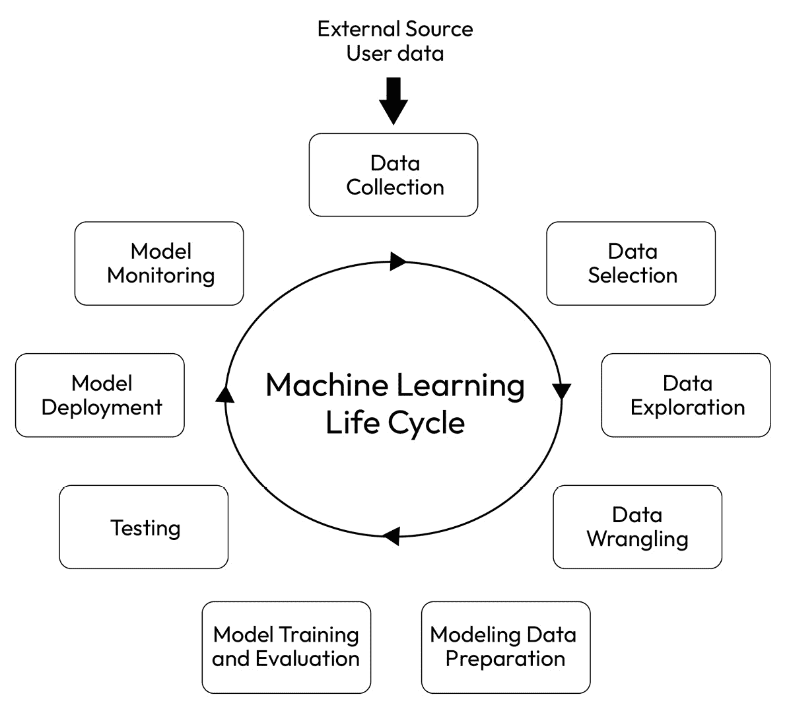
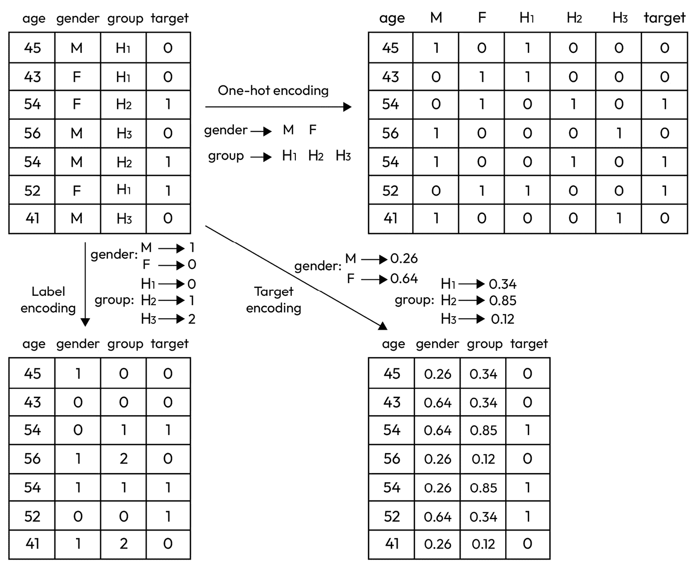
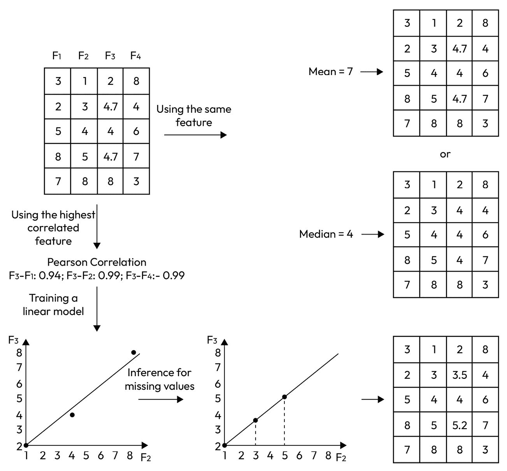
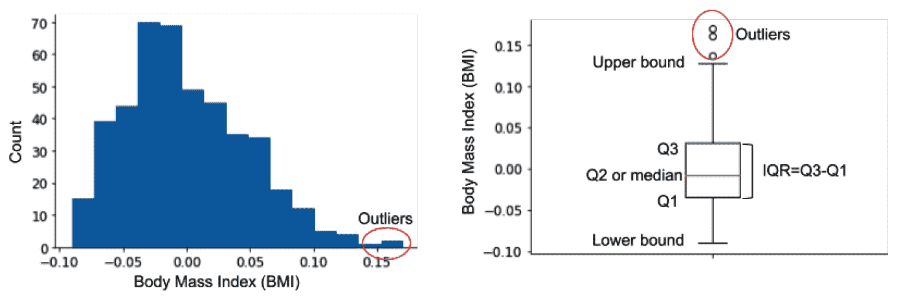

# 第二章：机器学习生命周期

在实践中，机器学习建模，无论是在工业级别还是在学术研究中，都不仅仅是写几行 Python 代码来在公共数据集上训练和评估一个模型。学习编写 Python 程序来使用 Python 和`scikit-learn`或使用`PyTorch`的深度学习模型训练机器学习模型，是成为机器学习开发者和专家的起点。在本章中，你将了解机器学习生命周期的组件以及如何在规划机器学习建模时考虑这个生命周期，这有助于你设计一个有价值且可扩展的模型。

本章将涵盖以下主题，包括机器学习生命周期的核心组件：

+   在我们开始建模之前

+   数据收集

+   数据选择

+   数据探索

+   数据清洗

+   数据建模准备

+   模型训练和评估

+   测试代码和模型

+   模型部署和监控

到本章结束时，你将学会如何为你的项目设计机器学习生命周期，以及为什么将你的项目模块化到生命周期的组件中有助于你在协作模型开发中。你还将了解机器学习生命周期不同组件的一些技术和它们的 Python 实现，例如数据清洗和模型训练与评估。

# 技术要求

以下要求应考虑在本章中，因为它们将帮助你更好地理解概念，在项目中使用它们，并使用提供的代码进行实践：

+   Python 库要求：

    +   `sklearn` >= 1.2.2

    +   `numpy` >= 1.22.4

    +   `pandas` >= 1.4.4

    +   `matplotlib` >= 3.5.3

你可以在 GitHub 上找到本章的代码文件，地址为[`github.com/PacktPublishing/Debugging-Machine-Learning-Models-with-Python/tree/main/Chapter02`](https://github.com/PacktPublishing/Debugging-Machine-Learning-Models-with-Python/tree/main/Chapter02)。

# 在我们开始建模之前

在收集数据作为机器学习生命周期的起点之前，你需要了解你的目标。你需要知道你想要解决什么问题，然后定义一些较小的子问题，这些子问题可以通过机器学习来解决。例如，在像“*我们如何减少返回制造工厂的易碎产品数量？*”这样的问题中，子问题可能如下：

+   *我们如何在包装前检测裂缝？*

+   *我们如何设计更好的包装来保护产品并减少运输造成的裂缝？*

+   我们能否使用更好的材料来降低**开裂**的风险？

+   我们能否对产品进行一些小的设计改动，这些改动不会改变其功能，但可以降低**开裂**的风险？

一旦您已经确定了您的子问题，您就可以找出如何使用机器学习来解决每个问题，并针对定义的子问题进行机器学习生命周期。每个子问题可能需要特定的数据处理和机器学习建模，其中一些可能比其他问题更容易解决。

*图 2.1* 展示了机器学习生命周期中的主要步骤。其中一些名称并非普遍定义。例如，数据探索有时会被包含在数据处理中。但所有这些步骤都是必需的，即使在不同资源中它们的名称可能不同：



图 2.1 – 机器学习生命周期

当您依赖已经在 Python 中可用的数据集，例如通过 `scikit-learn` 或 `PyTorch`，或者一个在公共存储库中准备好的用于建模的数据集时，您不需要担心早期步骤，如数据收集、选择和处理。这些步骤已经为您处理好了。或者如果您只是进行建模练习，不想在生产系统中提供您的模型，您也不需要担心模型部署和监控。但理解所有这些步骤的意义、重要性和好处，有助于您开发或设计一个具有持续改进功能的技术，为用户提供服务。这也有助于您更好地理解作为机器学习开发者的角色，或者找到这个领域的第一份工作或更好的工作。

# 数据收集

机器学习生命周期的第一步是数据收集。这可能涉及从不同的公共或商业数据库收集数据，将用户数据存储回您的数据库或任何您拥有的数据存储系统，或者甚至使用那些为您处理数据收集和标注的商业实体。如果您依赖免费资源，您可能需要考虑数据在您本地或云存储系统中所占的空间以及您在后续步骤中收集和分析数据所需的时间。但对于付费数据，无论是商业资源中提供的还是数据收集、生成和标注公司生成的，在决定付费之前，您需要评估数据对建模的价值。

# 数据选择

根据相应项目的目标，我们需要选择用于模型训练和测试所需的数据。例如，你可能可以访问一个或多个医院中癌症患者的相关信息，例如他们的年龄、性别、是否吸烟，如果有的话，他们的遗传信息，如果有的话，他们的 MRI 或 CT 扫描，他们用药的历史，他们对癌症药物的反应，他们是否进行了手术，他们的处方，无论是手写还是 PDF 格式，以及更多。当你想要构建一个使用他们的 CT 扫描来预测患者对治疗反应的机器学习模型时，你需要为每位患者选择与你想使用他们的信息（如年龄、性别和吸烟状况）构建模型时不同的数据。如果你正在构建一个监督学习模型，你还需要选择那些你有输入和输出数据的患者。

注意

在半监督学习模型中，可以将带有和没有输出的数据点结合起来。

为你的模型选择相关数据并不是一项容易的任务，因为将数据区分成对模型目标来说是*相关*和*不相关*的信息并不一定以这种二进制方式可用。想象一下，你需要从一个化学、生物或物理数据库中提取数据，这可能是一组来自不同较小数据集的数据，论文的补充材料，甚至是从科学文章中来的数据。或者，你可能想要从患者的病历或甚至从经济或社会学调查的书面答案中提取信息。在所有这些例子中，为你的模型分离数据，或从相关数据库中查询相关数据，并不像搜索一个关键词那么简单。每个关键词可能有同义词，无论是普通英语还是技术术语，可能以不同的方式书写，有时相关信息可能存在于数据文件或关系数据库的不同列中。适当的数据选择和查询系统为你提供了提高模型的机会。

你可以受益于文献综述，并在需要时向专家咨询，以扩展你使用的关键词。你可以从已知的数据选择方法中受益，对于你拥有的特定任务，甚至可以许可工具或付费服务来帮助你提取更多与你的目标相关的数据。还有高级的自然语言处理技术可以帮助你在查询系统中从文本中提取信息。我们将在*第十三章*，*高级深度学习技术*，和*第十四章*，*机器学习最新进展介绍*中讨论这些内容。

# 数据探索

在这个阶段，您可以选择数据并探索数据的数量、质量、稀疏性和格式。如果您在监督学习中具有分类输出，您可以找到每个类别的数据点数量，特征分布，输出变量的置信度（如果有的话），以及从*数据选择*阶段获取的数据的其他特征。这个过程有助于您识别需要修复的数据问题，这些问题将在生命周期中的下一个步骤*数据整理*中解决，或者通过修改您的*数据选择*过程来提高数据的机会。

# 数据整理

您的数据需要经过结构化和丰富过程，并在必要时进行转换和清理。所有这些方面都是数据整理的一部分。

## 结构化

原始数据可能以不同的格式和大小出现。您可能可以访问手写笔记、Excel 表格，甚至包含需要提取并放入正确格式以供进一步分析和用于建模的信息的表格图像。这个过程并不是将所有数据转换成类似表格的格式。在数据结构化的过程中，您需要小心信息丢失。例如，您可能有一些按特定顺序排列的特征，如基于时间、日期或通过设备传入的信息序列。

## 丰富

在对数据进行结构和格式化之后，您需要评估您是否拥有构建该周期机器学习模型所需的数据。在继续整理过程之前，您可能发现添加或生成新数据的机会。例如，您可能会发现，在用于识别制造管道中产品图像裂缝的数据中，只有 50 张标签为裂缝产品图像的图像，而总共有 10,000 张图像。您可能能够找到其他裂缝产品的图像，或者您可以使用称为**数据增强**的过程生成新的图像。

数据增强

数据增强是一系列通过使用我们手头上的原始数据集，计算性地生成新数据点的技术。例如，如果您旋转您的肖像，或者通过向图像添加高斯噪声来改变图像的质量，新的图像仍然会显示您的脸。但这可能有助于使您的模型更具泛化能力。我们将在*第五章* *提高机器学习模型性能*中讨论不同的数据增强技术。

## 数据转换

数据集的特征和输出可能是不同类型的变量，包括以下内容：

+   **定量**或**数值**：

    +   **离散**：例如，一个社区中的房屋数量

    +   **连续**：例如，患者的年龄或体重

+   **定性**或**分类**：

    +   **名义（无顺序）**：例如，不同颜色的汽车

    +   **有序（有序的定性变量）**：例如，学生的成绩，如 A、B、C 或 D

当我们训练一个机器学习模型时，模型需要在优化过程的每次迭代中使用数值来计算损失函数。因此，我们需要将分类变量转换为数值替代品。有多种特征编码技术，其中三种是独热编码、目标编码（Micci-Barreca，2001）和标签编码。一个包含年龄、性别、组和目标等四个列和七个行（七个示例数据点）的示例矩阵的独热、标签和目标编码计算如图 2.2 所示。2*：



图 2.2 – 使用具有四个特征和七个数据点的简单示例数据集进行独热、目标和标签编码的手动计算

这是一个用于预测患者对药物反应的假设数据集，目标列作为输出。变量类别缩写为 F：女性，M：男性，H1：医院 1，H2：医院 2，和 H3：医院 3。在现实中，需要考虑更多的变量，并且需要更多的数据点来有一个可靠的药物反应预测模型，并评估男性组和女性组之间或不同医院之间患者对药物反应是否存在偏差。

这些技术各有其优点和缺点。例如，独热编码增加了特征的数量（即数据集的维度）并增加了过拟合的机会。标签编码将整数值分配给每个类别，这些值不一定有意义。例如，将男性视为 1，女性视为 0 是任意的，并且没有任何实际意义。目标编码是一种考虑每个类别相对于目标的概率的替代方法。您可以在 Micci-Barreca，2001 中阅读此过程的数学细节。以下代码片段提供了这些方法的 Python 实现。

让我们定义一个用于特征编码的合成 DataFrame：

```py
import pandas as pdorig_df = pd.DataFrame({
    'age': [45, 43, 54, 56, 54, 52, 41],
    'gender': ['M', 'F', 'F', 'M', 'M', 'F', 'M'],
    'group': ['H1', 'H1', 'H2', 'H3', 'H2', 'H1', 'H3'],
    'target': [0, 0, 1, 0, 1, 1, 0]})
```

首先，我们将使用标签编码对定义的 DataFrame 中的分类特征进行编码：

```py
# encoding using label encodingfrom sklearn.preprocessing import LabelEncoder
# initializing LabelEncoder
le = LabelEncoder()
# encoding gender and group columns
label_encoded_df = orig_df.copy()
label_encoded_df['gender'] = le.fit_transform(
    label_encoded_df.gender)
label_encoded_df['group'] = le.fit_transform(
    label_encoded_df.group)
```

然后，我们将尝试对分类特征进行独热编码：

```py
# encoding using one hot encodingfrom sklearn.preprocessing import OneHotEncoder
# initializing OneHotEncoder
ohe = OneHotEncoder(categories = 'auto')
# encoding gender column
gender_ohe = ohe.fit_transform(
    orig_df['gender'].values.reshape(-1,1)).toarray()
gender_ohe_df = pd.DataFrame(gender_ohe)
# encoding group column
group_ohe = ohe.fit_transform(
    orig_df['group'].values.reshape(-1,1)).toarray()
group_ohe_df = pd.DataFrame(group_ohe)
# generating the new dataframe with one hot encoded features
onehot_encoded_df = pd.concat(
    [orig_df, gender_ohe_df, group_ohe_df], axis =1)
onehot_encoded_df = onehot_encoded_df.drop(
    ['gender', 'group'], axis=1)
onehot_encoded_df.columns = [
    'age','target','M', 'F','H1','H2', 'H3']
```

现在，我们将安装`category_encoders`库后，在 Python 中实现目标编码，作为第三种编码方法，如下所示：

```py
# encoding using target encodingfrom category_encoders import TargetEncoder
# initializing LabelEncoder
te = TargetEncoder()
# encoding gender and group columns
target_encoded_df = orig_df.copy()
target_encoded_df['gender'] = te.fit_transform(
    orig_df['gender'], orig_df['target'])
target_encoded_df['group'] = te.fit_transform(
    orig_df['group'], orig_df['target'])
```

有序变量也可以通过`OrdinalEncoder`类作为`sklearn.preprocessing`的一部分进行转换。有序变量和名义变量转换之间的区别在于有序变量中类别顺序背后的含义。例如，如果我们正在编码学生的成绩，A、B、C 和 D 可以转换为 1、2、3 和 4，或者 4、3、2 和 1，但将它们转换为 1、3、4 和 2 将不可接受，因为这改变了成绩顺序背后的含义。

输出变量也可以是分类变量。您可以使用标签编码将名义输出转换为数值变量，以便用于分类模型。

## 清洗

数据结构化后，需要对其进行清洗。清洗数据有助于提高数据质量，使其更接近建模准备状态。清洗过程的一个例子是在数据中填充缺失值。例如，如果您想使用患者的居住习惯来预测他们患糖尿病的风险，并使用他们对调查的回应，您可能会发现一些参与者没有回答有关他们吸烟习惯的问题。

### 特征插补以填充缺失值

我们手头的数据集的特征可能包含缺失值。大多数机器学习模型及其相应的 Python 实现都无法处理缺失值。在这些情况下，我们需要删除具有缺失特征值的数据点，或者以某种方式填充这些缺失值。我们可以使用特征插补技术来计算数据集中缺失的特征值。这些方法的示例如图 *2.3* 所示：



图 2.3 – 计算缺失特征值的特征插补技术

如您所见，我们既可以使用相同特征的其它值，并用可用的值的均值或中位数来替换缺失值，也可以使用与缺失值特征高度相关的、低缺失值或无缺失值的其它特征。在后一种情况下，我们可以使用与目标缺失值特征相关性最高的特征来构建线性模型。线性模型将相关特征视为输入，将缺失值特征视为输出，然后使用线性模型的预测来计算缺失值。

当我们使用相同特征的值的统计摘要，如均值或中位数时，我们正在减少特征值的方差，因为这些摘要值将被用于相同特征的所有缺失值 (*图 2.3*)。另一方面，当我们使用具有缺失值特征和低缺失值或无缺失值的高相关特征之间的线性模型时，我们假设它们之间存在线性关系。或者，我们可以在特征之间构建更复杂的模型来进行缺失值计算。所有这些方法都有其优点和局限性，您需要根据特征值的分布、具有缺失特征值的数据点的比例、特征之间的相关范围、低缺失值或无缺失值特征的存在以及其他相关因素，选择最适合您数据集的方法。

我们在*图 2.3*中使用了四个特征和五个数据点的非常简单的案例来展示所讨论的特征插补技术。但在现实中，我们需要构建具有超过四个特征的模型。我们可以使用 Python 库，如`scikit-learn`，通过使用相同特征值的平均值来进行特征插补，如下所示。首先，我们将导入所需的库：

```py
import numpy as npfrom sklearn.impute import SimpleImputer
```

然后，我们必须定义一个二维输入列表，其中每个内部列表显示数据点的特征值：

```py
X = [[5, 1, 2, 8],    [2, 3, np.nan, 4],
    [5, 4, 4, 6],
    [8, 5, np.nan, 7],
    [7, 8, 8, 3]]
```

现在，我们已经准备好通过指定需要考虑哪些值作为缺失值以及使用哪种插补策略来拟合`SimpleImputer`函数：

```py
# strategy options: mean, median, most_frequent, constantimp = SimpleImputer(missing_values=np.nan, strategy='mean')
imp.fit(X)
# calculate missing values of the input
X_no_missing = imp.transform(X)
```

我们还可以使用`scikit-learn`来创建一个线性回归模型，该模型计算缺失的特征值：

```py
import numpy as npfrom sklearn.linear_model import LinearRegression as LR
# defining input variables for feature 2 and 3
f2 = np.array([1, 4, 8]).reshape((-1, 1))
f3 = np.array([2, 4, 8])
# initializing a linear regression model with sklearn LinearRegression
model = LR()
# fitting the linear regression model using f2 and f3 as input and output variables, respectively
model.fit(f2, f3)
# predicting missing values of feature 3
model.predict(np.array([3, 5]).reshape((-1, 1)))
```

### 异常值移除

我们数据集中的数值变量可能具有远离其他数据的值。它们可能是与数据点中的其他值不相似的真实值，或者是由数据生成过程中的错误引起的，例如在实验测量过程中。您可以使用箱线图（*图 2.4*）直观地看到并检测到它们。图中的圆圈是 Python 中绘图函数（如`matplotlib.pyplot.boxplot`）自动检测到的异常值（*图 2.4*）。尽管可视化是探索我们的数据和理解数值变量分布的好方法，但我们仍需要一个无需绘制数据集中所有变量值的定量方法来检测异常值。

检测异常值的最简单方法是使用变量值分布的分位数。超出上下界限的数据点被认为是异常值（*图 2.4*）。下限和上限可以计算为 Q1 - a.IQR 和 Q3 - a.IQR，其中 a 是一个介于 1.5 和 3 之间的实数值。a 的常用值，也是绘制箱线图时的默认值，是 1.5，但使用更高的值会使异常识别过程不那么严格，并让更少的数据点被检测为异常。例如，将异常检测的严格性从默认值（即 a = 1.5）更改为 a = 3，*图 2.4*中的所有数据点都不会被检测为异常。这种异常识别方法是非参数的，这意味着它对数据点的分布没有任何假设。因此，它可以应用于非正态分布，例如*图 2.4*中显示的数据：



图 2.4 – 直方图和箱线图中的异常值

在前面的图中，图表是使用`scikit-learn`包中糖尿病数据集的特征值生成的，该数据集是通过`sklearn.datasets.load_diabetes()`加载的。

### 数据缩放

特征的值，无论是原始数值还是经过转换后的，可能具有不同的范围。如果机器学习模型的特征值得到适当的缩放和归一化，许多模型的表现会更好，或者至少它们的优化过程会更快地收敛。例如，如果您有一个范围从 0.001 到 0.05 的特征，另一个范围从 1,000 到 5,000 的特征，将它们都调整到合理的范围，如[0, 1]或[-1, 1]，可以帮助提高收敛速度或模型性能。您需要确保您实施的缩放和归一化不会导致特征值中的数据点失去差异，这意味着基于经过转换的特征的数据点不会失去它们之间的差异。

缩放的目标是改变变量的值域。在归一化中，值的分布形状也可能发生变化。您可以在项目中使用`scikit-learn`中提供的这些方法的示例和相应的类来改进您特征的缩放和分布（*表 2.1*）。使用这些类中的每一个进行缩放后得到的缩放变量具有特定的特征。例如，使用`scikit-learn`的`StandardScaler`类后，变量的值将围绕零中心，标准差为 1。

其中一些技术，例如鲁棒缩放，可以使用`scikit-learn`的`RobustScaler`类实现，不太可能受到异常值的影响（*表 2.1*）。在鲁棒缩放中，根据我们提供的定义，异常值不会影响中位数和*IQR*的计算，因此不会影响缩放过程。异常值本身可以使用计算出的中位数和*IQR*进行缩放。在缩放之前或之后，根据所使用的机器学习方法和任务，可以选择保留或删除异常值。但重要的是在尝试为建模准备数据时检测它们，并意识到它们，如果需要，可以对其进行缩放或删除：

| **Python 类** | **数学定义** | **值限制** |
| --- | --- | --- |
| `sklearn.preprocessing.StandardScaler()` | Z = (X - u) / su: 均值 | 无限制>99%的数据在-3 和 3 之间 |
| `sklearn.preprocessing.MinMaxScaler()` | X_scaled = (X-Xmin)/(Xmax-Xmin) | [0,1] |
| `sklearn.preprocessing.MaxAbsScaler()` | X_scaled = X/&#124;X&#124;max | [-1,1] |
| `sklearn.preprocessing.RobustScaler()` | Zrobust = (X - Q2) / IQRQ2: 中位数 IQR: 四分位距 | 无限制大多数数据在-3 和 3 之间 |

表 2.1 – 缩放和归一化特征值的 Python 类示例

在开始机器学习建模之前，会先进行数据整理，然后进行其他形式的数据探索性分析。领域专业知识也有助于识别需要更好地理解其主题领域的解释模式的模式。为了提高机器学习建模的成功率，你可能需要进行特征工程来构建新的特征或通过表示学习学习新的特征。这些新特征可能像体质指数（BMI）那样简单，体质指数定义为某人以千克为单位体重的平方与以米为单位身高平方的比率。或者，它们可能是通过复杂过程或额外机器学习建模学习到的新特征和表示。我们将在*第十四章*“*机器学习最新进展介绍”中稍后讨论这一点。

# 数据建模准备

在机器学习生命周期的这个阶段，我们需要最终确定用于建模的特征和数据点，以及我们的模型评估和测试策略。

## 特征选择和提取

在之前的步骤中进行了归一化和缩放的原始特征现在可以进一步处理，以提高拥有高性能模型的概率。一般来说，特征可以通过*特征选择*方法进行子选择，这意味着一些特征被丢弃，或者可以用来生成新的特征，这传统上被称为*特征提取*。

### 特征选择

特征选择的目的是减少特征的数量或数据的维度，并保留信息丰富的特征。例如，如果我们有 20,000 个特征和 500 个数据点，那么当用于构建监督学习模型时，大多数原始的 20,000 个特征可能不是信息性的。以下列表解释了一些简单的特征选择技术：

+   保留数据点间具有高方差或 MAD 的特征

+   保留数据点间具有最高唯一值数量的特征

+   保留高度相关特征组中的代表性特征

这些过程可以使用所有数据点或仅使用训练数据来进行，以避免训练数据和测试数据之间潜在的信息泄露。

### 特征提取

线性或非线性地结合原始特征可能会为构建预测模型提供更有信息量的特征。这个过程被称为特征提取，可以根据领域知识或通过不同的统计或机器学习模型进行。例如，你可以使用主成分分析或等距映射以线性或非线性方式分别降低你的数据的维度。然后，你可以在你的训练和测试过程中使用这些新特征。以下代码片段提供了这两种方法的 Python 实现。

首先，让我们导入所需的库并加载`scikit-learn`数字数据集：

```py
import numpy as npimport matplotlib.pyplot as plt
from sklearn.decomposition import PCA
from sklearn.manifold import Isomap
from sklearn.datasets import load_digits
# loading digit dataset from sklearn
X, _ = load_digits(return_X_y=True)
print('Number of features: {}'.format(X.shape[1]))
```

现在，让我们使用`isomap`和`pca`，它们都可在`scikit-learn`中找到：

```py
# fitting isomap and build new dataframe of feature with 5 componentsembedding = Isomap(n_components=5)
X_transformed_isomap = embedding.fit_transform(X)
print('Number of features: {}'.format(
    X_transformed_isomap.shape[1]))
# fitting pca and build new dataframe of feature with 5 components
pca = PCA(n_components=5)
X_transformed_pca = pca.fit_transform(X)
print('Number of features: {}'.format(
    X_transformed_pca.shape[1]))
# plotting ratio of variance explained by the first n, being between 1 and 5, components
plt.bar(x = np.arange(0, len(
    pca.explained_variance_ratio_)),
    height = np.cumsum(pca.explained_variance_ratio_))
plt.ylabel('Explained variance ratio')
plt.xlabel('Number of components')
plt.show()
```

你可以从每种方法中选择多少个组件可以通过不同的技术来确定。例如，解释方差比是选择主成分数量的常用方法。这些是通过主成分分析确定的，并且共同解释了超过特定百分比的总方差，例如在数据集中解释了 70%的总方差。

还有更多高级技术，它们是自监督预训练和表示学习的一部分，用于识别新特征。在这些技术中，使用大量数据来计算新特征、表示或嵌入。例如，可以使用英文维基百科来提出更好的英文单词表示，而不是为每个单词执行独热编码。我们将在*第十四章*中讨论自监督学习模型，*机器学习最新进展介绍*。

## 设计评估和测试策略

在训练模型以识别其参数或最佳超参数之前，我们需要指定我们的测试策略。如果你在一个大型组织中工作，模型测试可以由另一个团队在单独的数据集上完成。或者，你可以指定一个或多个数据集，这些数据集与你的训练集分开，或者将你的数据的一部分分开，以便你可以单独测试它。你还需要列出你希望在测试阶段评估模型性能的方法。例如，你可能需要指定你想要使用的性能图表或度量，如**接收者操作特征曲线**（**ROC**）和**精确率-召回率**（**PR**）曲线，或其他标准，以选择新的分类模型。

一旦定义了测试策略，你就可以使用剩余的数据来指定训练集和验证集。验证集和训练集不需要是一系列固定的数据点。我们可以使用*k*-折**交叉验证**（**CV**）将数据集分成*k*个块，每次使用一个块作为验证集，其余的作为训练集。然后，可以使用所有*k*个块的平均性能作为验证集来计算验证性能。训练性能对于根据模型的目标找到模型参数的最佳值非常重要。你还可以使用验证性能来识别最佳超参数值。如果你指定了一个验证集或使用*k*-折 CV，你可以使用不同超参数组合的验证性能来识别最佳组合。然后，可以使用最佳超参数集在所有数据上训练模型，排除测试数据，以便在测试阶段提出最终要测试的模型。

对于每个应用程序，关于折叠数（即 *k*）或要分离为验证集和测试集的数据点分数的一些常见做法。对于小型数据集，通常使用 60%、30% 和 10% 分别指定数据点的训练、验证和测试分数。但是，数据点的数量及其多样性都是决定验证集和测试集中数据点数量或在 CV 中指定 *k* 的重要因素。您还可以使用可用的 Python 类，这些类使用您选择的 *k* 进行训练和验证，如下所示：

```py
from sklearn.model_selection import cross_val_score,KFoldfrom sklearn.neighbors import KNeighborsClassifier
from sklearn.datasets import load_breast_cancer
# loading breast cancer dataset
X, y = load_breast_cancer(return_X_y=True)
# defining the k-fold CV
k_CV = KFold(n_splits=5)
# initializing a k nearest neighbor model
knn = KNeighborsClassifier()
# outputting validation performances using average precision across different folds of the designed CV
scores = cross_val_score(
    estimator = knn, X = X, y = y, cv = k_CV,
    scoring = 'average_precision')
print("Average cross validation score: {}".format(
    round(scores.mean(),4)))
```

这将返回以下输出：

```py
Average Cross Validation score: 0.9496
```

注意

最好，在每个阶段准备的数据不应该只是简单地存放在云端或硬盘上，或者在每个生命周期的前一步之后添加到数据库中。将报告附加到数据上以跟踪每个步骤的历史努力，并为团队或组织内的其他个人或团队提供这些信息是有益的。适当的报告，如关于数据清洗的，可以提供寻求反馈的机会，以帮助您改进为机器学习建模提供的数据。

# 模型训练和评估

如果您使用 `scikit-learn` 或 `PyTorch` 和 TensorFlow 进行神经网络建模，训练和验证或测试模型的过程包括以下三个主要步骤：

1.  **初始化模型**：初始化模型是关于指定方法、其超参数以及用于建模的随机状态。

1.  **训练模型**：在模型训练中，*步骤 1* 中初始化的模型用于训练数据以训练机器学习模型。

1.  **推理、分配和性能评估**：在这个步骤中，训练好的模型可以用于监督学习中的推理（例如，预测输出）或，例如，将新数据点分配给无监督学习中已识别的聚类。在监督学习中，您可以使用这些预测来评估模型性能。

这些步骤对于监督学习和无监督学习模型都是相似的。在 *步骤 1* 和 *步骤 2* 中，两种类型的模型都可以进行训练。以下代码片段提供了使用 `scikit-learn` 实现这三个步骤的 Python 实现，用于随机森林分类器和 *k*-均值聚类。

首先，让我们导入所需的库并加载 `scikit-learn` 乳腺癌数据集：

```py
from sklearn.datasets import load_breast_cancerfrom sklearn.model_selection import train_test_split
from sklearn import metrics
# loading breast cancer dataset
X, y = load_breast_cancer(return_X_y=True)
X_train, X_test, y_train, y_test = train_test_split(X, y,
    test_size=0.30, random_state=5)
```

现在，我们可以使用随机森林来训练和测试一个监督学习模型：

```py
from sklearn.ensemble import RandomForestClassifier# initializing a random forest model
rf_model = RandomForestClassifier(n_estimators=10,
    max_features=10, max_depth=4)
# training the random forest model using training set
rf_model.fit(X_train, y_train)
# predicting values of test set using the trained random forest model
y_pred_rf = rf_model.predict(X_test)
# assessing performance of the model on test setprint("Balanced accuracy of the predictions:",
    metrics.balanced_accuracy_score(y_test, y_pred_rf))
```

此代码在测试集上打印出以下性能：

```py
Balanced accuracy of the predictions: 0.9572
```

我们还可以构建一个 *k*-均值聚类模型，如下所示：

```py
from sklearn import cluster# initializing a random forest model
kmeans_model = cluster.KMeans(n_clusters=2, n_init = 10)
# training the kmeans clustering model using training set
kmeans_model.fit(X_train)
# assigning new observations, that are test set datapoints here, to the identified clusters
y_pred_kmeans = kmeans_model.predict(X_test)
```

如果您在机器学习建模方面没有足够的经验，*表 2.2* 中提供的方法和相应的 Python 类可能是一个好的起点：

| **类型** | **方法** | **Python 类** |
| --- | --- | --- |
| 分类 | 逻辑回归 | `sklearn.linear_model.LogisticRegression()` |
| K-最近邻 | `sklearn.neighbors.KNeighborsClassifier()` |
| 支持向量机分类器 | `sklearn.svm.SVC()` |
| 随机森林分类器 | `sklearn.ensemble.RandomForestClassifier()` |
| XGBoost 分类器 | `xgboost.XGBClassifier()` |
| LightGBM 分类器 | `Lightgbm.LGBMClassifier()` |
| 回归 | 线性回归 | `sklearn.linear_model.LinearRegression()` |
| 支持向量机回归器 | `sklearn.svm.SVR()` |
| 随机森林回归器 | `sklearn.ensemble.RandomForestRegressor()` |
| XGBoost 回归器 | `xgboost.XGBRegressor()` |
| LightGBM 回归器 | `Lightgbm.LGBMRegressor()` |
| 聚类 | K-均值聚类 | `sklearn.cluster.KMeans()` |
| 聚类层次 | `sklearn.cluster.AgglomerativeClustering()` |
| DBSCAN 聚类 | `sklearn.cluster.DBSCAN()` |
| UMAP | `umap.UMAP()` |

表 2.2 – 对于你的监督学习或聚类问题的表格数据，开始方法和它们的 Python 类

注意

UMAP 是一种降维方法，它提供了低维可视化，例如一系列数据点的 2D 图。在低维空间中形成的数据点组也可以用作可靠的聚类。

# 测试代码和模型

尽管选定的机器学习模型在生命周期这一阶段可以使用一个或多个数据集进行进一步测试，但在这个阶段还需要进行一系列测试以确保这一点：

+   确保部署过程和将模型投入生产的流程顺利进行

+   确保模型在性能和计算成本方面按预期工作

+   确保在生产中使用模型不会产生法律和财务影响

在这个阶段可以使用的此类测试包括：

+   **单元测试**：这些是快速测试，确保我们的代码运行正确。这些测试不仅针对机器学习建模，甚至不是针对这个阶段。在整个生命周期中，你需要设计单元测试以确保你的数据处理和建模代码按预期运行。

+   **A/B 测试**：这种测试可以帮助你、你的团队以及你的组织决定是否选择或拒绝一个模型。这种测试的想法是评估两种可能的场景，例如两个模型，或者前端设计的两种不同版本，并检查哪一个更有利。但是，你需要通过决定*需要测量什么*和你的*选择标准*来定量评估结果。

+   `scikit-learn`、`PyTorch`或 TensorFlow 的更改，这个测试确保你的代码运行，并检查这些更改对模型性能和预测的影响。

+   **安全测试**：安全测试是工业级编程和建模的重要部分。你需要确保你的代码和依赖项没有漏洞。然而，你需要设计一个测试来应对高级对抗性攻击。我们将在*第三章*中讨论，*向负责任 AI 调试*。

+   **负责任的 AI 测试**：我们需要设计测试来评估负责任 AI 的重要因素，例如透明度、隐私和公平性。我们将在下一章中讨论负责任 AI 的一些重要方面。

虽然这些测试需要在这个阶段设计，但类似的测试可以作为生命周期之前步骤的一部分进行整合。例如，你可以在生命周期的所有步骤中进行安全测试，特别是如果你正在使用不同的工具或代码库。可能还有其他测试，例如检查模型的内存大小和预测运行时间，或者生产中的数据格式和结构以及部署的模型中预期的数据是否相同。

# 模型部署和监控

如果你刚开始接触部署，你可能认为它是如何为你的模型最终用户开发前端、移动应用程序或 API。但在这本书中，我们不想讨论这个话题。在这里和未来的章节中，我们想要涵盖部署的两个重要方面：提供生产环境中模型所需的操作以及将模型集成到应该为用户带来利益的过程中。

当你部署你的模型时，你的代码应该在指定的环境中正常运行，并且能够访问所需的硬件，例如 GPU，并且用户的数据需要以正确的格式可用，以便你的模型能够工作。我们在生命周期测试阶段讨论的一些测试确保你的模型在生产环境中按预期运行。

当我们谈论在生产环境中提供模型时，它要么在幕后被用于用户的利益，例如 Netflix 和 Amazon Prime 使用他们的机器学习模型为你推荐电影，要么被用户直接作为独立进程或作为更大系统的一部分使用，例如当机器学习模型在医院中用于帮助临床医生进行疾病诊断。这两种不同用例的考虑因素并不相同。如果你想将模型部署在医院中供临床医生直接使用，你需要考虑设置适当的生产环境所需的全部困难和规划，以及所有软件依赖项。你还需要确保他们的本地系统满足必要的硬件要求。或者，你可以通过 Web 应用程序提供你的模型。在这种情况下，你需要确保上传到你的数据库中的数据的保密性和安全性。

当涉及到收集必要的信息和反馈时，模型辅导是机器学习生命周期中的一个关键部分。这些反馈可以用来改进或纠正用于建模的数据，或者改进模型的训练和测试。监控机器学习模型有助于我们确保生产中的模型能够根据预期提供预测。可能导致机器学习模型预测不可靠的三个问题是数据方差、数据漂移和概念漂移。数据漂移和概念漂移被认为是两种不同类型的模型漂移。模型漂移涉及数据中不同类型的改变，无论是特征还是输出变量，这些改变使得模型对新用户数据的预测变得无关或无效。

我们将在本书的后续章节中更详细地讨论模型部署和监控，以及机器学习生命周期中的工程方面，例如*第十章*，*版本控制和可重复的机器学习建模*。

# 摘要

在本章中，我们讨论了机器学习生命周期的不同组成部分，从数据收集和选择到模型训练和评估，最后到模型部署和监控。我们还展示了如何模块化机器学习生命周期的数据处理、建模和部署方面，有助于识别改进机器学习模型的机会。

在下一章中，你将了解关于改进机器学习模型性能之外的概念，例如无偏建模和公平性，以及为了实现负责任的 AI 系统而进行的问责制和透明度。

# 问题

1.  你能提供两个数据清洗过程的例子吗？

1.  你能解释一下 one-hot 编码和标签编码方法之间的区别吗？

1.  你如何使用分布的分位数来检测其异常值？

1.  当考虑到在医生本地部署模型与在银行系统中部署聊天机器人背后的模型之间的差异时，你脑海中浮现的是什么？

# 参考文献

+   Micci-Barreca, Daniele. 《用于分类和预测问题中高基数分类属性的前处理方案》。ACM SIGKDD Explorations Newsletter 3.1 (2001): 27-32。

+   Basu, Anirban. 《软件质量保证、测试和度量》，PRENTICE HALL，2015 年 1 月 1 日。
