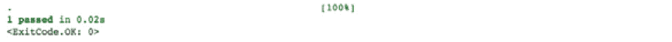
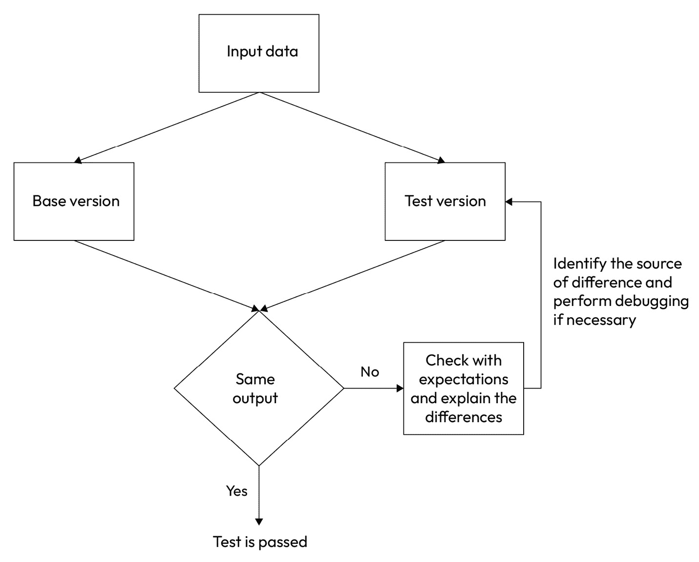

# 第八章：使用测试驱动开发控制风险

与创建基于我们模型的模型和技术相关的风险，例如选择不可靠的模型，是存在的。问题是，我们能否避免这些风险并更好地管理与机器学习建模相关的风险？在本章中，我们将讨论编程策略，如单元测试，这些策略不仅可以帮助我们开发和选择更好的模型，还可以降低建模相关的风险。

在本章中，我们将涵盖以下主题：

+   驱动式开发

+   机器学习差异测试

+   跟踪机器学习实验

到本章结束时，您将学会如何通过单元测试和差异测试来降低不可靠建模和软件开发的风险，以及如何使用机器学习实验跟踪可靠地构建模型训练和评估的先前尝试。

# 技术要求

在本章中，以下要求应予以考虑，因为它们将帮助您更好地理解概念，在您的项目中使用它们，并使用提供的代码进行实践：

+   Python 库要求：

    +   `pytest` >= 7.2.2

    +   `ipytest` >= 0.13.0

    +   `mlflow` >= 2.1.1

    +   `aif360` >= 0.5.0

    +   `shap` >= 0.41.0

    +   `sklearn` >= 1.2.2

    +   `numpy` >= 1.22.4

    +   `pandas` >= 1.4.4

+   您还需要了解模型偏差和偏差度量定义的基本知识，例如**差异影响** **比率**（**DIR**）

您可以在 GitHub 上找到本章的代码文件，网址为[`github.com/PacktPublishing/Debugging-Machine-Learning-Models-with-Python/tree/main/Chapter08`](https://github.com/PacktPublishing/Debugging-Machine-Learning-Models-with-Python/tree/main/Chapter08)。

# 驱动式开发用于机器学习建模

减少开发不可靠模型并将其推送到生产的风险的一种方法是通过测试驱动开发。我们的目标是设计单元测试（即设计用于测试软件单个组件的测试），以降低代码修订在同一或不同生命周期中的风险。为了更好地理解这个概念，我们需要了解单元测试是什么，以及我们如何在 Python 中设计和使用它们。

## 单元测试

单元测试旨在测试我们设计和编写的代码和软件中最小的组件或单元。在机器学习建模中，我们可能有多个模块负责机器学习生命周期的不同步骤，例如数据整理和清洗或模型评估。单元测试帮助我们避免错误和失误，并在编写代码时无需担心是否犯了不会被早期发现的错误。早期发现代码中的问题成本较低，并有助于我们避免错误累积，从而使调试过程更加容易。Pytest 是一个 Python 测试框架，它帮助我们设计不同的测试，包括单元测试，在机器学习编程中使用。

### 使用 Pytest

Pytest 是一个易于使用的 Python 库，我们可以通过以下步骤来设计单元测试：

1.  确定我们想要为哪个组件设计单元测试。

1.  定义一个小操作来用于测试该组件。例如，如果该模块是数据处理的一部分，测试可以设计使用一个非常小的玩具数据集，无论是真实的还是合成的。

1.  为相应的组件设计一个以 `"test_"` 开头的函数。

1.  对于我们想要设计单元测试的所有代码组件，重复 *步骤 1* 到 *3*。最好尽可能覆盖更多组件。

设计的测试可以用来测试代码中的更改。我们将在这里使用 Pytest 实践单元测试设计，针对一个计算 DIR 并使用 DIR 的输入阈值进行偏差检测以返回“无偏数据”或“有偏数据”的函数：

```py
import pandas as pdfrom aif360.sklearn.metrics import disparate_impact_ratio
def dir_grouping(data_df: pd.DataFrame,
    sensitive_attr: str, priviledge_group,
    dir_threshold = {'high': 1.2, 'low': 0.8}):
        """
        Categorizing data as fair or unfair according to DIR
        :param data_df: Dataframe of dataset
        :param sensitive_attr: Sensitive attribute under investigation
        :priviledge_group: The category in the sensitive attribute that needs to be considered as priviledged
        :param dir_threshold:
        """
    dir = disparate_impact_ratio(data_df,
        prot_attr=sensitive_attr,
        priv_group=priviledge_group, pos_label=True)
    if dir < dir_threshold['high'] and dir > dir_threshold[
        'low']:
        assessment = "unbiased data"
    else:
        assessment = "biased data"
    return assessment
```

现在我们已经定义了这个函数的示例用法，用于我们的单元测试设计，我们可以选择数据集的前 100 行并计算 DIR：

```py
# calculating DIR for a subset of adult income data in shap libraryimport shap
X,y = shap.datasets.adult()
X = X.set_index('Sex')
X_subset = X.iloc[0:100,]
```

根据计算出的 DIR，这个数据子集在 `'Sex'` 属性方面是有偏的。为了设计单元测试，我们需要导入 `pytest` 库。但如果你使用 Jupyter 或 Colab 笔记本进行原型设计，你可以使用 `ipytest` 来测试你的代码：

```py
import pytest# you can use ipytest if you are using Jupyter or Colab notebook
import ipytest
ipytest.autoconfig()
```

如果我们在 Jupyter 或 Colab Notebook 中使用 `pytest` 并想使用 `ipytest` 运行测试，我们必须添加 `%%ipytest -qq`。然后，我们可以定义我们的单元测试函数，`test_dir_grouping()`，如下所示：

```py
%%ipytest -qqdef test_dir_grouping():
    bias_assessment = dir_grouping(data_df = X_subset,
        sensitive_attr = 'Sex',priviledge_group = 1,
        dir_threshold = {'high':1.2, 'low': 0.8})
    assert bias_assessment == "biased data"
```

`assert` 命令检查 `dir_grouping()` 函数的结果是否为“有偏数据”，正如我们之前的分析所预期的那样，对于数据集的前 100 行。如果结果不同，则测试失败。

当你为软件组件准备好所有单元测试时，你可以在 `test_dir_grouping` 中运行 `pytest`，如前面的代码所示，在名为 `test_script.py` 的 Python 脚本中，你只能测试该脚本，如下所示：

```py
pytest test_script.py
```

或者，你可以在特定目录中运行 `pytest`。如果你有一个包含许多不同模块的代码库，你可以根据你的主要函数和类的分组来组织你的测试，然后测试每个目录，如下所示：

```py
# "testdir" could be a directory containing test scriptspytest testdir/
```

相反，如果你简单地运行 `pytest`，它将在当前目录及其子目录中执行所有名为 `test_*.py` 或 `\*_test.py` 的文件中的所有测试：

```py
pytest
```

你也可以使用 Python 解释器通过 `pytest` 执行测试：

```py
python -m pytest
```

如果你正在使用 Jupyter 或 Colab Notebook 并且使用了 `ipytest`，你可以按照以下方式运行 Pytest：

```py
ipytest.run()
```

现在，假设我们以这种方式执行设计的 `test_dir_grouping()` 函数。当测试通过时，我们将看到如下消息，它告诉我们 100% 的测试通过了。这是因为我们只测试了一个测试，并且测试通过了（*图 8**.1*）：



图 8.1 – 当设计的测试通过时 Pytest 的输出

如果我们在`dir_grouping()`函数中错误地将`assessment = "biased data"`改为`assessment = "unbiased data"`，我们会得到以下结果，这告诉我们 100%的测试失败了。这是因为我们只有一个测试，在这种情况下失败了（*图 8**.2*）：


图 8.2 – 运行 Pytest 后的失败信息

`pytest`中的失败信息包含一些补充信息，我们可以使用这些信息来调试我们的代码。在这种情况下，它告诉我们，在`test_dir_grouping()`中，它试图断言`test_dir_grouping()`的输出，即“unbiased data”，与“biased data”。

#### Pytest 夹具

当我们为数据分析和学习建模编程时，我们需要使用来自不同变量或数据对象的数据，这些数据可能来自我们本地机器或云中的文件，是从数据库中查询的，或者来自测试中的 URL。夹具通过消除在测试中重复相同代码的需要来帮助我们完成这些过程。将夹具函数附加到测试上将在每个测试运行之前运行它，并将数据返回给测试。在这里，我们使用了 Pytest 文档页面上提供的夹具示例（来源：[`docs.pytest.org/en/7.1.x/how-to/fixtures.html`](https://docs.pytest.org/en/7.1.x/how-to/fixtures.html)）。首先，让我们定义两个非常简单的类，称为`Fruit`和`FruitSalad`：

```py
# Example of using Pytest fixtures available in https://docs.pytest.org/en/7.1.x/how-to/fixtures.html
class Fruit:
    def __init__(self, name):
        self.name = name
        self.cubed = False
    def cube(self):
        self.cubed = True
class FruitSalad:
    def __init__(self, *fruit_bowl):
        self.fruit = fruit_bowl
        self._cube_fruit()
    def _cube_fruit(self):
        for fruit in self.fruit:
            fruit.cube()
```

当我们使用`pytest`时，它会查看测试函数签名中的参数，并寻找与这些参数具有相同名称的夹具。Pytest 然后运行这些夹具，捕获它们返回的内容，并将这些对象作为参数传递给测试函数。我们通过使用`@pytest.fixture`装饰器来通知 Pytest 一个函数是夹具。在以下示例中，当我们运行测试时，`test_fruit_salad`请求`fruit_bowl`，Pytest 执行`fruit_bowl`并将返回的对象传递给`test_fruit_salad`：

```py
# Arrange@pytest.fixture
def fruit_bowl():
    return [Fruit("apple"), Fruit("banana")]
def test_fruit_salad(fruit_bowl):
    # Act
    fruit_salad = FruitSalad(*fruit_bowl)
    # Assert
    assert all(fruit.cubed for fruit in fruit_salad.fruit)
```

这里有一些夹具的特性，可以帮助我们设计测试：

+   夹具可以请求其他夹具。这有助于我们设计更小的夹具，甚至可以将它们作为其他夹具的一部分来构建更复杂的测试。

+   夹具可以在不同的测试中重复使用。它们就像函数一样，在不同的测试中使用，并返回它们自己的结果。

+   一个测试或夹具可以同时请求多个夹具。

+   夹具可以在每个测试中请求多次。

在测试驱动开发中，我们的目标是编写生产就绪的代码，这些代码能够通过设计的单元测试。通过设计的单元测试对代码中的模块和组件进行更高覆盖，可以帮助你在安心的情况下修订与机器学习生命周期任何组件相关的代码。

在本节中，你学习了单元测试，但其他技术可以帮助我们在可靠的编程和机器学习模型开发中，例如差异测试。我们将在下一节介绍这一内容。

# 机器学习差异测试

差异测试试图检查同一软件的两个版本，视为基准版本和测试版本，在相同的输入上进行比较，然后比较输出。这个过程帮助我们确定输出是否相同，并识别意外的差异（Gulzar 等人，2019 年；*图 8**.3*）：



图 8.3 – 差异测试的简化流程图，作为测试同一数据上同一过程两个实现输出的过程

在差异测试中，基准版本已经过验证，并被认为是批准版本，而测试版本需要与基准版本进行比较，以产生正确的输出。在差异测试中，我们还可以旨在评估基准版本和测试版本输出之间的观察到的差异是否是预期的或可以解释的。

在机器学习建模中，我们还可以在比较同一数据上同一算法的两个不同实现时从差异测试中受益。例如，我们可以用它来比较使用`scikit-learn`和 Spark `MLlib`构建的模型，作为机器学习建模的两个不同库。如果我们需要使用`scikit-learn`重新创建一个模型并将其添加到我们的管道中，而原始模型是在 Spark `MLlib`中构建的，我们可以使用差异测试来评估输出并确保没有差异或差异是预期的（Herbold 和 Tunkel，2023 年）。*表 8.1*提供了`scikit-learn`和 Spark `MLlib`中可用类的一些算法示例。这种方法已被更广泛地用于比较不同深度学习框架之间的模型，例如 TensorFlow 和 PyTorch：

| **方法** | **scikit-learn** | **Spark MLlib** |
| --- | --- | --- |
| 逻辑回归 | `LogisticRegression` | `LogisticRegression` |
| 朴素贝叶斯 | `GaussianNB, MultinomialNB` | `NaiveBayes` |
| 决策树 | `DecisionTree Classifier` | `DecisionTreeClassifier` |
| 随机森林 | `RandomForest Classifier` | `RandomForestClassifier` |
| 支持向量机 | `LinearSVC` | `LinearSVC` |
| 多层感知器 | `MLPClassifier` | `MultilayerPerceptron Classifier` |
| 梯度提升 | `GradientBoosting Classifier` | `GBTClassifier` |

表 8.1 – scikit-learn 和 Spark MLlib 中一些重叠的算法及其类名

除了单元测试和差异测试之外，实验跟踪是我们可以在机器学习项目中受益的另一种技术。

# 跟踪机器学习实验

跟踪我们的机器学习实验将帮助我们减少得出无效结论和选择不可靠模型的风险。机器学习中的实验跟踪是关于保存实验信息——例如，使用的数据——测试性能和用于性能评估的指标，以及用于建模的算法和超参数。以下是使用机器学习实验跟踪工具的一些重要考虑因素：

+   你能否将工具集成到你的 **持续集成/持续部署**（**CI/CD**）管道和机器学习建模框架中？

+   你能重现你的实验吗？

+   你能否轻松地搜索实验以找到最佳模型或具有不良或意外行为的模型？

+   它是否会引起任何安全或隐私问题？

+   工具是否帮助你更好地在机器学习项目中协作？

+   工具是否允许你跟踪硬件（例如，内存）消耗？

*表 8.2* 中提供了常用的机器学习实验跟踪工具及其 URL：

| **工具** | **URL** |
| --- | --- |
| MLflow Tracking | [`mlflow.org/docs/latest/tracking.html`](https://mlflow.org/docs/latest/tracking.html) |
| DVC | [`dvc.org/doc/use-cases/experiment-tracking`](https://dvc.org/doc/use-cases/experiment-tracking) |
| Weights & Biases | [`wandb.ai/site/experiment-tracking`](https://wandb.ai/site/experiment-tracking) |
| Comet ML | [`www.comet.com/site/products/ml-experiment-tracking/`](https://www.comet.com/site/products/ml-experiment-tracking/) |
| ClearML | [`clear.ml/clearml-experiment/`](https://clear.ml/clearml-experiment/) |
| Polyaxon | [`polyaxon.com/product/#tracking`](https://polyaxon.com/product/#tracking) |
| TensorBoard | [`www.tensorflow.org/tensorboard`](https://www.tensorflow.org/tensorboard) |
| Neptune AI | [`neptune.ai/product/experiment-tracking`](https://neptune.ai/product/experiment-tracking) |
| SageMaker | [`aws.amazon.com/sagemaker/experiments/`](https://aws.amazon.com/sagemaker/experiments/) |

表 8.2 – 教学机器学习实验的工具示例

在这里，我们想要在 Python 中练习 **MLflow Tracking**。首先，我们需要导入所需的库：

```py
import pandas as pdimport numpy as np
from sklearn.metrics import mean_squared_error, roc_auc_score
from sklearn.model_selection import train_test_split
from sklearn.ensemble import RandomForestClassifier as RF
from sklearn.datasets import load_breast_cancer
import mlflow
import mlflow.sklearn
np.random.seed(42)
```

然后，我们必须定义一个函数来评估我们想要测试的模型的结果：

```py
def eval_metrics(actual, pred, pred_proba):    rmse = np.sqrt(mean_squared_error(actual, pred))
    roc_auc = roc_auc_score(actual, pred_proba)
    return rmse, roc_auc
```

接下来，我们必须从 `scikit-learn` 加载乳腺癌数据集以进行建模：

```py
X, y = load_breast_cancer(return_X_y=True)# split the data into training and test sets. (0.7, 0.3) split
X_train, X_test, y_train, y_test = train_test_split(X, y,
    test_size = 0.3, random_state=42)
```

现在，我们准备使用 `mlflow` 定义一个实验：

```py
experiment_name = "mlflow-randomforest-cancer"existing_exp = mlflow.get_experiment_by_name(
    experiment_name)
if not existing_exp:
    experiment_id = mlflow.create_experiment(
        experiment_name, artifact_location="...")
else:
    experiment_id = dict(existing_exp)['experiment_id']
mlflow.set_experiment(experiment_name)
```

现在，我们必须检查三个不同的决策树数量，或者三个不同的估计器数量，在加载的乳腺癌数据集上构建、训练和测试三个不同的随机森林模型。这三个运行的所有信息都将存储在指定的实验中，但作为不同的运行。正如你可以在下面的代码中看到的那样，我们使用了 `mlflow` 的不同功能：

+   `mlflow.start_run`：作为实验的一部分启动一个运行

+   `mlflow.log_param`：为了记录模型作为超参数的估计器数量

+   `mlflow.log_metric`：为了记录在定义的测试集上模型性能的计算指标

+   `mlflow.sklearn.log_model`：为了记录模型：

```py
for idx, n_estimators in enumerate([5, 10, 20]):    rf = RF(n_estimators = n_estimators, random_state = 42)
    rf.fit(X_train, y_train)
    pred_probs = rf.predict_proba(X_test)
    pred_labels = rf.predict(X_test)
    # calculating rmse and roc-auc for the randorm forest
    # model predictions on the test set
    rmse, roc_auc = eval_metrics(actual = y_test,
        pred = pred_labels,pred_proba = [
            iter[1]for iter in pred_probs])
    # start mlflow
    RUN_NAME = f"run_{idx}"
    with mlflow.start_run(experiment_id=experiment_id,
        run_name=RUN_NAME) as run:
            # retrieve run id
            RUN_ID = run.info.run_id
        # track parameters
        mlflow.log_param("n_estimators", n_estimators)
        # track metrics
        mlflow.log_metric("rmse", rmse)
        # track metrics
        mlflow.log_metric("roc_auc", roc_auc)
        # track model
        mlflow.sklearn.log_model(rf, "model")
```

我们还可以检索已存储的实验，如下所示：

```py
from mlflow.tracking import MlflowClientesperiment_name = "mlflow-randomforest-cancer"
client = MlflowClient()
# retrieve experiment information
experiment_id = client.get_experiment_by_name(
    esperiment_name).experiment_id
```

然后，我们可以获取该实验中不同运行的详细信息：

```py
# retrieve runs information (parameter: 'n_estimators',    metric: 'roc_auc')
experiment_info = mlflow.search_runs([experiment_id])
# extracting run ids for the specified experiment
runs_id = experiment_info.run_id.values
# extracting parameters of different runs
runs_param = [client.get_run(run_id).data.params[
    "n_estimators"] for run_id in runs_id]
# extracting roc-auc across different runs
runs_metric = [client.get_run(run_id).data.metrics[
    "roc_auc"] for run_id in runs_id]
```

我们可以根据用于模型测试的指标来识别最佳运行，例如本例中的 ROC-AUC：

```py
df = mlflow.search_runs([experiment_id],    order_by=["metrics.roc_auc"])
best_run_id = df.loc[0,'run_id']
best_model_path = client.download_artifacts(best_run_id,
    "model")
best_model = mlflow.sklearn.load_model(best_model_path)
print("Best model: {}".format(best_model))
```

这将产生以下输出：

```py
Best mode: RandomForestClassifier(n_estimators=5,    random_state=42)
```

如果需要，我们还可以删除运行或实验的运行，如下所示。但你需要确保你确实希望删除此类信息：

```py
# delete runs (make sure you are certain about deleting the runs)for run_id in runs_id:
    client.delete_run(run_id)
# delete experiment (make sure you are certain about deleting the experiment)
client.delete_experiment(experiment_id)
```

在本节中，你学习了在机器学习环境中进行实验跟踪。你将在下一两章中学习更多关于你在机器学习项目中用于风险控制的技术。

# 摘要

在本章中，你学习了使用单元测试进行驱动开发以控制你的机器学习开发项目中的风险。你学习了使用 `pytest` 库在 Python 中的单元测试。我们还简要回顾了差分测试的概念，这有助于你比较你的机器学习模块和软件的不同版本。稍后，你学习了模型实验跟踪作为一项重要工具，它不仅有助于你的模型实验和选择，还有助于你在机器学习项目中进行风险控制。你练习了使用 `mlflow` 作为广泛使用的机器学习实验跟踪工具之一。现在，你知道如何通过测试驱动开发和实验跟踪来开发可靠的模型和编程模块。

在下一章中，你将学习关于测试模型、评估其质量以及监控其在生产中的性能的策略。你将了解模型监控、集成测试和模型管道及基础设施测试的实用方法。

# 问题

1.  `pytest` 如何帮助你开发机器学习项目中的代码模块？

1.  `pytest` fixtures 如何帮助你使用 `pytest`？

1.  什么是差分测试，何时需要它？

1.  什么是 `mlflow` 以及它如何帮助你在机器学习建模项目中？

# 参考文献

+   Herbold, Steffen, 和 Steffen Tunkel. *机器学习中的差分测试：超越深度学习的分类算法分析*. 实证软件工程 28.2 (2023): 34。

+   Lichman, M. (2013). *UCI 机器学习仓库* [[`archive.ics.uci.edu/ml`](https://archive.ics.uci.edu/ml)]。Irvine, CA：加州大学信息与计算机科学学院。

+   Gulzar, Muhammad Ali, Yongkang Zhu, 和 Xiaofeng Han. *差分测试的感知与实践*. 2019 IEEE/ACM 第 41 届国际软件工程会议：软件工程实践（ICSE-SEIP）。IEEE，2019。
