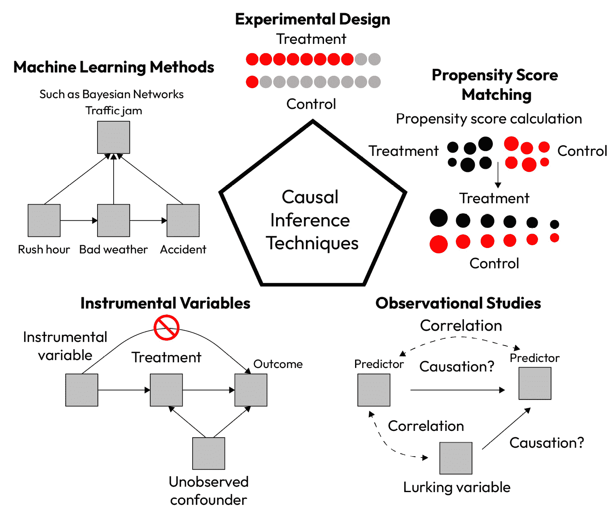
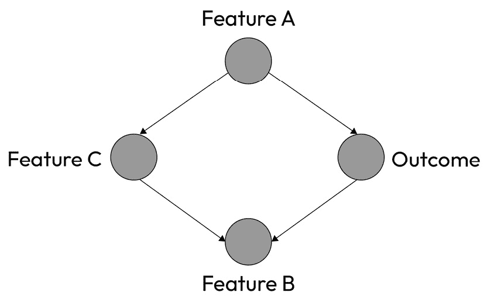
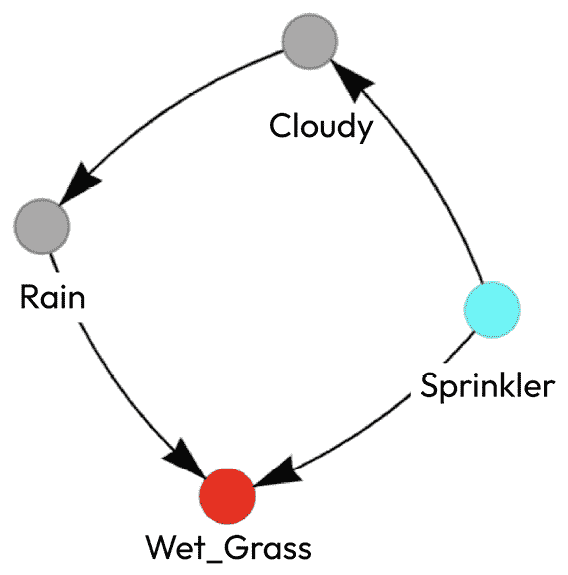

# 第十五章：相关性与因果性

在本书的前几章中，你学习了如何训练、评估和构建高性能和低偏差的机器学习模型。然而，我们用来练习本书中引入的概念的算法和示例方法并不一定能在监督学习设置中为你提供特征和输出变量之间的因果关系。在本章中，我们将讨论因果推理和建模如何帮助你提高模型在生产中的可靠性。

在本章中，我们将涵盖以下主题：

+   相关性作为机器学习模型的一部分

+   因果建模以降低风险和提高性能

+   在机器学习模型中评估因果关系

+   使用 Python 进行因果建模

到本章结束时，你将了解因果建模和推理相对于相关性建模和练习可用 Python 功能来识别特征和输出变量之间因果关系的益处。

# 技术要求

为了更好地理解概念、在项目中使用它们以及使用提供的代码进行练习，你需要以下内容：

+   Python 库需求：

    +   `dowhy` == 0.5.1

    +   `bnlearn` == 0.7.16

    +   `sklearn` >= 1.2.2

    +   `d3blocks` == 1.3.0

+   你还需要了解机器学习模型训练、验证和测试的基本知识

本章的代码文件可在 GitHub 上找到，地址为[`github.com/PacktPublishing/Debugging-Machine-Learning-Models-with-Python/tree/main/Chapter15`](https://github.com/PacktPublishing/Debugging-Machine-Learning-Models-with-Python/tree/main/Chapter15)。

# 相关性作为机器学习模型的一部分

大多数机器学习建模和数据分析项目在监督学习设置和统计建模中导致特征和输出变量之间的相关性关系。尽管这些关系不是因果的，但识别因果关系具有很高的价值，即使在我们试图解决的多数问题中它不是必需的。例如，我们可以将医学诊断定义为“*根据患者的医疗历史，识别最有可能导致患者症状的疾病*”（Richens 等人，2020 年）。

识别因果关系解决在识别变量之间误导性关系时的问题。仅仅依赖相关性而不是因果关系可能会导致虚假和奇怪的关联，如下所示（[`www.tylervigen.com/spurious-correlations`](https://www.tylervigen.com/spurious-correlations)；[`www.buzzfeednews.com/article/kjh2110/the-10-most-bizarre-correlations`](https://www.buzzfeednews.com/article/kjh2110/the-10-most-bizarre-correlations)）：

+   美国在科学、太空和技术上的支出与吊死、勒死和窒息自杀相关

+   美国电子游戏产生的总收入与在美国授予的计算机科学博士学位相关

+   美国从挪威进口的原油与在铁路列车碰撞中丧生的驾驶员相关

+   吃有机食品与自闭症相关

+   肥胖与债务泡沫相关

你可以在这些例子的来源中找到更多这些虚假的相关性。

依赖于相关性而非因果关系可能会降低技术发展和改进过程中不同方面的可靠性，例如 A/B 测试。例如，理解“如果我们能让更多的访客进行搜索，我们将看到购买和收入的增加”([`conversionsciences.com/correlation-causation-impact-ab-testing/`](https://conversionsciences.com/correlation-causation-impact-ab-testing/))有助于正确的决策和对技术发展的投资。

现在你已经了解了仅仅依赖相关关系的问题，让我们来讨论在机器学习环境中因果建模的含义。

# 因果建模以降低风险和提高性能

因果建模有助于消除变量之间不可靠的相关关系。消除这种不可靠的关系可以降低机器学习在不同应用领域（如医疗保健）中错误决策的风险。医疗保健中的决策，如诊断疾病和为患者指定有效的治疗方案，对生活质量及生存有直接影响。因此，决策需要基于可靠的模型和关系，其中因果建模和推理可以帮助我们（Richens et al., 2020; Prosperi et al., 2020; Sanchez et al., 2022）。

因果建模技术有助于消除模型中的偏差，如混淆和碰撞偏差（Prosperi et al., 2020）(*图 15*.1)。这种偏差的一个例子是吸烟作为黄手指与肺癌之间关系的混淆因素（Prosperi et al., 2020）。如图*图 15*.1 所示，碰撞变量的存在导致某些输入变量与结果之间存在相关但偏差和虚假的关联。此外，在建模中缺少可能造成混淆的一些变量可能导致我们得出其他变量与结果相关的结论：


图 15.1 – 混淆和碰撞偏差的示意图

接下来，我们将介绍因果建模中的一些概念和技术，例如因果推理以及如何在机器学习模型中测试因果关系。

# 评估机器学习模型中的因果关系

在机器学习建模中计算特征与结果之间的相关性在许多领域和行业中已经成为一种常见的方法。例如，我们可以简单地计算皮尔逊相关系数来识别与目标变量相关的特征。在我们的许多机器学习模型中，也有一些特征对结果的预测不是作为因果因素，而是作为相关预测因素。我们可以使用 Python 中可用的功能来区分这些相关和因果特征。以下是一些示例：

+   **实验设计**：建立因果关系的一种方式是通过进行实验，测量因果特征变化对目标变量的影响。然而，这样的实验研究可能并不总是可行或道德的。

+   **特征重要性**：我们可以使用在*第六章*《机器学习建模中的可解释性和可解释性》中介绍的可解释性技术来识别特征重要性，并利用这些信息来区分相关性和因果关系。

+   **因果推断**：因果推断方法旨在识别变量之间的因果关系。你可以使用因果推断来确定一个变量的变化是否会导致另一个变量的变化。

我们在*第六章*《机器学习建模中的可解释性和可解释性》中讨论了不同的可解释性技术，如 SHAP、LIME 和反事实解释。你可以使用这些技术来识别模型中非因果的特征。例如，SHAP 值低的特征很可能在所研究的模型中不是因果特征。如果根据 LIME，在局部近似中有低重要性的特征，那么它很可能与模型的输出无关。或者，如果改变一个特征对模型输出的影响很小或没有影响，通过反事实分析，那么它很可能不是一个因果特征。

我们还可以使用另一种技术，称为**置换特征重要性**，它也被认为是可解释性技术的一部分，用于识别低概率的因果特征。在这种方法中，我们改变一个特征的价值，并测量这种变化对模型性能的影响。然后我们可以识别出低影响的特征，这些特征很可能不是因果特征。

我们已经在*第六章*《机器学习建模中的可解释性和可解释性》中实践了可解释性技术。接下来我们将专注于本章剩余部分的因果推断。

## 因果推断

在因果推断中，我们的目标是识别和理解数据集或模型中变量之间的因果关系。在这个过程中，我们可能会依赖不同的统计和机器学习技术来分析数据并推断变量之间的因果关系。*图 15.2*展示了五种这样的方法：**实验设计**、**观察性研究**、**倾向得分匹配**、**工具变量**和**基于机器学习的方法**：



图 15.2 – 五种因果推断技术

在**实验设计**中，你设计实验来比较具有不同治疗变量或基于特定特征或特征的条件的样本的结局变量。*表 15.1*中提供了治疗和结果变量的示例，以帮助您理解这两个术语之间的区别：

| **治疗变量** | **结果变量** |
| --- | --- |
| 教育水平 | 收入水平 |
| 吸烟 | 肺癌 |
| 体力活动 | 心血管健康 |
| 家庭收入 | 学术表现 |

表 15.1 – 因果建模中治疗和结果变量的示例

在**观察性研究中**，我们使用观察数据，而不是受控实验，并试图通过控制混杂变量来识别因果关系。**倾向得分匹配**根据观察变量的概率来匹配治疗组和对照组。**工具变量**用于克服观察性研究中常见的难题，即治疗和结果变量由其他变量（或混杂变量）共同决定，而这些变量未包含在模型中。这种方法从识别一个与治疗变量相关但与结果变量不相关的工具变量开始，除了通过其对治疗变量的影响之外。**基于机器学习的方法**是其他技术类别，其中使用贝叶斯网络和决策树等机器学习方法来识别变量和结果之间的因果关系。

### 贝叶斯网络

您可以从贝叶斯网络中受益，在因果建模和识别变量之间的因果关系时。贝叶斯网络是图形模型，通过**有向无环图**（**DAGs**）展示变量之间的关系，其中每个变量（包括输入特征和输出）都是一个节点，方向显示变量之间的关系（*图 15.3*）：



图 15.3 – 示例贝叶斯网络的说明

这个网络告诉我们，**特征 A**和**特征 B**的值越高，结果发生的可能性就越大。请注意，特征可以是数值的或分类的。尽管从特征 A 到结果的方向（*图 15.3*）不一定意味着因果关系，但贝叶斯网络可以用来估计变量对结果的因果效应，同时控制混杂变量。

从概率的角度来看，网络可以用来简化所有变量的联合概率，包括特征和结果，如下所示：

p(F A, F B, F C, Outcome) = p(Outcome| F A, F B)p(F B| F C)p(F C| F A)p(F A)

在这里，p(Outcome| F A, F B)是给定特征 A 和 B 值的**条件概率分布**（**CPD**），p(F B| F C)是给定特征 C 的特征 B 的 CPD，p(F C| F A)是给定特征 A 的特征 C 的 CPD，p(F A)是特征 A 的概率，它不是其他特征的函数，因为在图中没有指向它的边。这些 CPD 可以帮助我们估计一个特征值的变化对另一个特征的影响。它告诉我们，在给定一个或多个变量发生的情况下，一个变量的发生可能性。你将在本章结束时学习如何以数据驱动的方式为给定的数据集创建贝叶斯网络，以及如何使用 Python 识别网络的 CPD。

Python 中有几种可用于因果推断的方法。我们将在下一节中介绍这些方法。

# 使用 Python 进行因果建模

几个 Python 库为你提供了使用因果方法和进行因果推断的易于使用的功能。以下是一些：

+   `dowhy` ([`pypi.org/project/dowhy/`](https://pypi.org/project/dowhy/))

+   `pycausalimpact` ([`pypi.org/project/pycausalimpact/`](https://pypi.org/project/pycausalimpact/))

+   `causalnex` ([`pypi.org/project/causalnex/`](https://pypi.org/project/causalnex/))

+   `econml` ([`pypi.org/project/econml/`](https://pypi.org/project/econml/))

+   `bnlearn` ([`pypi.org/project/bnlearn/`](https://pypi.org/project/bnlearn/))

在接下来的几个小节中，我们将回顾`dowhy`和`bnlearn`。

## 使用 dowhy 进行因果效应估计

首先，我们想要练习一种倾向得分匹配方法，这种方法在你有一个治疗变量在心中时很有用——例如，当你想要确定药物对患者的效果，并在模型中有其他变量，如他们的饮食、年龄、性别等时。在这里，我们将使用`scikit-learn`的乳腺癌数据集，其中目标变量是一个二元结果，告诉我们来自乳腺癌患者的细胞是恶性还是良性。在这里，我们将使用平均*半径*特征——即从中心到边缘上的点的平均距离——作为治疗变量。

首先，我们必须在 Python 中导入所需的库和模块：

```py
import pandas as pdimport numpy as np
from sklearn.datasets import load_breast_cancer
import dowhy
from dowhy import CausalModel
```

然后，我们必须加载乳腺癌数据集并将其转换为 DataFrame：

```py
breast_cancer = load_breast_cancer()data = pd.DataFrame(breast_cancer.data,
    columns=breast_cancer.feature_names)
data['target'] = breast_cancer.target
```

现在，我们需要将治疗变量的数值（平均半径）转换为二进制，因为倾向得分匹配仅接受二进制治疗变量：

```py
data['mean radius'] = data['mean radius'].gt(data[    'mean radius'].values.mean()).astype(int)
data=data.astype({'mean radius':'bool'}, copy=False)
```

我们还需要列出共同原因列表，在这种情况下，我们将所有其他数据集中的属性视为共同原因：

```py
common_causes_list = data.columns.values.tolist()common_causes_list.remove('mean radius')
common_causes_list.remove('target')
```

现在，我们可以通过指定数据、治疗、结果变量和共同原因来使用 `dowhy` 的 `CausalModel()` 构建模型。`CausalModel()` 对象帮助我们估计 `treatment` 变量（平均半径）对结果变量（`target`）的因果效应：

```py
model = CausalModel(    data=data,
    treatment='mean radius',
    outcome='target',
    common_causes=common_causes_list
)
```

现在，我们可以估计指定治疗变量（平均半径）对目标变量的因果效应。请注意，我们在这里使用的倾向得分匹配仅适用于离散治疗变量：

```py
identified_est = model.identify_effect()estimate = model.estimate_effect(identified_est,
    method_name='backdoor.propensity_score_matching')
```

`estimate` 值为 -0.279，这意味着当平均半径作为治疗变量时，结果发生的概率降低了约 28%。这个倾向得分是在给定一组观察到的协变量条件下接受治疗的条件概率。后门调整控制了混杂变量，这些变量与治疗和结果变量都有关联。

我们还可以使用 `refute_estimate()` 函数来评估我们对因果变量及其对结果数据驱动估计效应的假设的有效性。例如，我们可以使用 `'placebo_treatment_refuter'` 方法，该方法将指定的治疗变量替换为一个独立的随机变量。如果我们对治疗和结果之间因果关系的假设是正确的，那么新的估计值将接近零。以下是使用 `'placebo_treatment_refuter'` 检查我们假设有效性的代码：

```py
refute_results = model.refute_estimate(identified_estimand,    estimate, method_name='placebo_treatment_refuter',
    placebo_type='permute', num_simulations=40)
```

这导致新的效应为 0.0014，这保证了我们假设的有效性。然而，此命令的另一个输出 *p*-值估计为 0.48，这显示了统计置信水平。

`refute_estimate()` 函数返回的低 *p*-值并不意味着治疗变量不具有因果性。低 *p*-值表明估计的因果效应对特定假设的敏感性。反驳结果的显著性并不暗示治疗变量和结果变量之间不存在因果关系。

## 使用 bnlearn 通过贝叶斯网络进行因果推理

在 Python 和 R 编程语言中都存在的用于贝叶斯网络学习和推理的库之一是 `bnlearn`。我们可以使用这个库学习给定数据集的贝叶斯网络，然后使用学习到的图来推断因果关系。

为了使用 `bnlearn` 进行练习，我们必须安装并导入这个库，然后加载作为其一部分存在的 Sprinkler 数据集：

```py
import bnlearn as bndf = bn.import_example('sprinkler')
```

接下来，我们必须拟合一个 `structure_learning()` 模型来生成贝叶斯网络或 DAG：

```py
DAG = bn.structure_learning.fit(df)
```

然后，我们必须定义节点属性并可视化 DAG，如下所示：

```py
# Set some colors to the edges and nodesnode_properties = bn.get_node_properties(DAG)
node_properties['Sprinkler']['node_color']='#00FFFF'
node_properties['Wet_Grass']['node_color']='#FF0000'
node_properties['Rain']['node_color']='#A9A9A9'
node_properties['Cloudy']['node_color']='#A9A9A9'
# Plotting the Bayesian Network
bn.plot(DAG,
    node_properties=node_properties,
    interactive=True,
    params_interactive={'notebook':True,
        'cdn_resources': 'remote'})
```

这导致了*图 15.4*中显示的网络。如图所示，`'Sprinkler'`可能是多云天气和湿草的因果变量。湿草可能由雨和水龙头引起。但存在量化这些依赖性的功能：



图 15.4 – 使用 bnlearn 学习 Sprinkler 数据集的 DAG

你可以使用`independence_test()`如下测试变量的依赖性：

```py
bn.independence_test(DAG, df, test = 'chi_square',    prune = True)
```

*表 15.2*包括了前一个命令的输出总结，清楚地显示了 DAG 中成对变量依赖性的显著性：

| **来源** | **目标** | **p-value（来自** **chi_square test）** | **chi-square** |
| --- | --- | --- | --- |
| 多云 | 雨 | 1.080606e-87 | 394.061629 |
| 水龙头 | 湿草 | 1.196919e-23 | 100.478455 |
| 水龙头 | 多云 | 8.383708e-53 | 233.906474 |
| 雨 | 湿草 | 3.886511e-64 | 285.901702 |

表 15.2 – 使用 bnlearn.independence_test()在 Sprinkler 数据集上的总结

你也可以使用`bnlearn.parameter_learning.fit()`如下学习 CPD：

```py
model_mle = bn.parameter_learning.fit(DAG, df,    methodtype='maximumlikelihood')
# Printing the learned Conditional Probability Distribution (CPDs)
bn.print_CPD(model_mle)
```

*图 15.5*显示了`Cloudy`、`Rain`和`Sprinkler`变量的 CPD。这些 CPD 与已识别的 DAG（*图 15.4*）相结合，不仅提供了识别变量之间潜在因果关系所需的信息，而且还可以对这些关系进行定量评估：


图 15.5 – bnlearn 为 Sprinkler 数据集识别的 CPD 示例

在本章中，你练习了使用因果建模，但这个主题还有更多内容。这是机器学习中最重要的话题之一，你将受益于对这个主题的更多了解。

# 摘要

在本章中，你学习了相关关系和因果关系之间的区别，因果建模的重要性，以及贝叶斯网络等因果推理技术。随后，我们通过 Python 实践帮助你开始在你的项目中使用因果建模和推理，以便你能识别出数据集中变量之间更可靠的关系，并设计出可靠的模型。

在下一章中，你将学习在构建可靠的机器学习模型时，如何保护隐私并确保安全，同时最大化使用私有和专有数据的益处。

# 问题

1.  在监督学习模型中，你能否有一个与输出高度相关但不是因果的特征？

1.  实验设计和观察研究在因果推理中有何区别？

1.  使用工具变量进行因果推理有哪些要求？

1.  贝叶斯网络中的关系是否必然可以被认为是因果的？

# 参考文献

+   Schölkopf, Bernhard. *机器学习的因果性*. 概率与因果推理：朱迪亚·佩尔的工作. 2022. 765-804.

+   Kaddour, Jean, 等人. *因果机器学习：综述与开放问题*. arXiv 预印本 arXiv:2206.15475 (2022).

+   Pearl, Judea. *贝叶斯* *网络*. (2011).

+   Richens, Jonathan G., Ciarán M. Lee, 和 Saurabh Johri. *利用因果机器学习提高医疗诊断的准确性*. Nature communications 11.1 (2020): 3923.

+   Prosperi, Mattia, 等人. *在可操作的医疗保健中，机器学习的因果推理和反事实预测*. Nature Machine Intelligence 2.7 (2020): 369-375.

+   Sanchez, Pedro, 等人. *因果机器学习在医疗和精准医学中的应用*. Royal Society Open Science 9.8 (2022): 220638.
