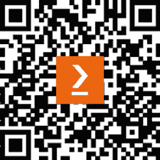

# 前言

在六年前，在我第一次发现 Kaggle 之前，我正在寻找我职业生涯中的新路径。几年后，我坚定地在一个新工作中站稳了脚跟，Kaggle 帮助我找到了这份工作。在发现这个美妙网站之前，我在不同的网站上四处寻找，阅读文章，下载和分析数据集，尝试 GitHub 或其他网站上的代码片段，参加在线培训，并阅读书籍。有了 Kaggle，我找到了不仅仅是信息来源；我找到了一个有着相同机器学习兴趣，更广泛地说，对数据科学感兴趣，并希望学习、分享知识、解决难题的社区。我还发现，在这个社区中，如果您愿意，您可以经历一个加速的学习曲线，因为您可以向最好的学习，有时与他们竞争，有时与他们合作。您也可以从经验较少的人那里学习；在这些年在平台上的日子里，我仍然从众人和专家那里学习。

这种持续挑战与富有成效的合作的结合，使 Kaggle 成为一个独特的平台，新旧贡献者都能感到同样受欢迎，并找到学习或分享的机会。在我加入这个平台的前几个月里，我主要从大量的数据集和笔记本中学习，分析竞赛数据，为活跃或过去的竞赛提供解决方案，并在讨论线程中发表意见。我很快就开始了贡献，主要是笔记本，并发现了分享自己的发现并从平台上其他人的反馈中获得回报是多么的有意义。这本书就是关于分享这份喜悦以及我在与社区分享我的发现、想法和解决方案的过程中所学到的知识。

本书旨在向您介绍数据分析的广阔世界，重点关注您如何使用 Kaggle 笔记本资源来帮助您在这个领域达到精通。我们将从简单概念到更高级的概念进行覆盖。本书也是一次个人旅程，将带您走上一条与我进行实验和学习分析数据集以及准备竞赛时相似的路径。

# 本书面向对象

本书旨在面向对数据科学和机器学习有浓厚兴趣，并希望利用 Kaggle 笔记本来提高技能以及提升 Kaggle 笔记本排名的广大读者。更确切地说，本书面向以下人群：

+   在 Kaggle 旅程上的绝对初学者

+   想要发展各种数据采集、准备、探索和可视化技能的资深贡献者

+   想要从 Kaggle 早期笔记本大师那里学习如何提升 Kaggle 排名的专家

+   已经使用 Kaggle 进行学习和竞争的专业人士，并希望了解更多关于数据分析的知识

# 本书涵盖内容

*第一章*，*介绍 Kaggle 及其基本功能*，是对 Kaggle 及其主要功能的快速介绍，包括比赛、数据集、代码（以前称为内核或笔记本）、讨论和额外资源、模型和学习。

*第二章*，*为您的 Kaggle 环境做好准备*，包含了更多关于 Kaggle 上代码功能的具体信息，包括计算环境、如何使用在线编辑器、如何分叉和修改现有示例，以及如何使用 Kaggle 上的源代码控制功能来保存或运行一个新的笔记本。

*第三章*，*开始我们的旅行 – 在泰坦尼克号灾难中幸存*，介绍了一个简单的数据集，这将帮助你为我们在书中进一步发展的技能打下基础。大多数 Kagglers 都会从这个比赛开始他们在平台上的旅程。我们介绍了 Python 中用于数据分析的工具（pandas 和 NumPy）、数据可视化（Matplotlib、Seaborn 和 Plotly），以及如何创建你的笔记本视觉身份的建议。我们将对特征进行单变量和多变量分析，分析缺失数据，并使用各种技术生成新的特征。你还将首次深入了解数据，并使用分析结合模型基准和迭代改进，在构建模型时从探索到准备。

*第四章*，*在伦敦休息一下，喝杯啤酒或咖啡*，结合了多个表格和地图数据集来探索地理数据。我们开始于两个数据集：第一个数据集包含英国酒吧的空间分布（*英格兰的每个酒吧*），第二个数据集包含全球星巴克咖啡店的空间分布（*全球星巴克位置*）。

我们首先分别分析它们，调查缺失数据并了解我们如何通过使用替代数据源来填补缺失数据。然后我们共同分析数据集，并专注于一个小区域，即伦敦，我们将叠加数据。我们还将讨论如何将具有不同空间分辨率的数据对齐。关于风格、展示组织以及讲故事方面的更多见解将被提供。

*第五章*，*回到工作岗位并优化发展中国家的微型贷款*，更进一步，开始分析来自 Kaggle 数据分析比赛的*数据科学为善：Kiva 众筹*的数据。在这里，我们将多个贷款历史、人口统计、国家发展和地图数据集结合起来，讲述如何改善发展中国家微型贷款的分配。本章的一个重点将是创建一个统一且个性化的演示风格，包括配色方案、章节装饰和图形风格。另一个重点将是创建一个基于数据并支持笔记本论点的连贯故事。我们以对替代数据分析比赛数据集*Meta Kaggle*的快速调查结束本章，在那里我们驳斥了关于社区感知趋势的一个假设。

*第六章*，*你能预测蜜蜂亚种吗？*，教你如何探索图像数据集。本分析所使用的数据集是*蜜蜂图像数据集：标注的蜜蜂图像*。我们将图像分析技术与表格数据分析与可视化技术相结合，创建了一个丰富且富有洞察力的分析，并为构建多类图像分类的机器学习流程做准备。你将学习如何输入和显示图像集，如何分析图像、元数据，如何进行图像增强，以及如何处理不同的缩放选项。我们还将展示如何从一个基线模型开始，然后根据训练和验证错误分析，迭代地优化模型。

*第七章*，*文本分析就是你所需要的*，使用了来自文本分类比赛的`Jigsaw Unintended Bias in Toxicity Classification`数据集。数据来自在线帖子，在我们使用它来构建模型之前，我们需要对文本数据进行数据质量评估和清洗。然后我们将探索数据，分析单词频率和词汇特点，对句法和语义分析进行一些了解，进行情感分析和主题建模，并为训练模型做准备。我们将检查我们数据集中语料库的标记化或嵌入解决方案所提供的词汇覆盖范围，并应用数据处理来提高这一词汇覆盖范围。

*第八章*，*分析声学信号以预测下一次模拟地震*，将探讨如何处理时间序列数据，同时分析`LANL`地震`EDA`和预测比赛的`Earthquake`数据集。

在对特征进行分析后，使用各种类型的模态分析来揭示信号中的隐藏模式，我们将学习如何使用快速傅里叶变换、希尔伯特变换和其他变换来生成此时间序列模型的特征。然后我们将学习如何使用各种信号处理函数生成多个特征。读者将了解分析信号数据的基础知识，以及如何使用各种信号处理变换来构建模型。

*第九章*，*你能找出哪部电影是深度伪造的吗？*，讨论了如何在著名的 Kaggle 竞赛的大型视频数据集*Deepfake Detection Challenge*上执行图像和视频分析。分析将从培训和数据处理开始，读者将学习如何操作`.mp4`格式，从视频中提取图像，检查视频元数据信息，对提取的图像进行预处理，并使用计算机视觉技术或预训练模型在图像中找到对象，包括身体、上半身、面部、眼睛或嘴巴。最后，我们将准备构建一个模型，为这个深度伪造检测竞赛提供一个解决方案。

*第十章*，*利用 Kaggle 模型释放生成式 AI 的力量*，将提供独特和专家见解，介绍我们如何使用 Kaggle 模型结合大型语言模型（**LLMs**）的语义力量与 LangChain 和向量数据库，以释放生成式 AI 的力量，并使用 Kaggle 平台原型化最新一代 AI 应用。

*第十一章*，*结束我们的旅程：如何保持相关性和领先地位*，提供了如何不仅成为 Kaggle 笔记本顶级贡献者，同时保持这一地位，并在创建具有良好结构和巨大影响力的优质笔记本方面的见解。

# 要充分利用本书

您应该对 Python 有基本的了解，并熟悉 Jupyter 笔记本。理想情况下，您还需要一些关于 pandas 和 NumPy 等库的基本知识。

章节包含理论和代码。如果您想在书中运行代码，最简单的方法是遵循 GitHub 项目中每个笔记本的`README.md`介绍页面上的链接，fork 笔记本，并在 Kaggle 上运行它。Kaggle 环境预先安装了所有需要的 Python 库。或者，您可以从 GitHub 项目下载笔记本，上传到 Kaggle，为每个特定示例附加书中提到的数据集资源，并运行它们。另一种选择是下载 Kaggle 上的数据集，安装您自己的本地环境，并在那里运行笔记本。然而，在这种情况下，您将需要更多关于如何在本地设置`conda`环境和使用`pip install`或`conda install`安装 Python 库的先进知识。

| **章节练习要求** | **版本号** |
| --- | --- |
| Python | 3.9 或更高版本 |

在本书中开发的全部练习都使用当前 Python 版本，即编写本书时的 3.10 版本。

## 下载示例代码文件

本书代码包托管在 GitHub 上，网址为 [`github.com/PacktPublishing/Developing-Kaggle-Notebooks`](https://github.com/PacktPublishing/Developing-Kaggle-Notebooks)。我们还有其他来自我们丰富图书和视频目录的代码包，可在 [`github.com/PacktPublishing/`](https://github.com/PacktPublishing/) 找到。查看它们！

## 下载彩色图像

我们还提供了一份包含本书中使用的截图/图表彩色图像的 PDF 文件。您可以从这里下载：[`packt.link/gbp/9781805128519`](https://packt.link/gbp/9781805128519)。

## 使用的约定

本书使用了多种文本约定。

`CodeInText`：表示文本中的代码单词、数据库表名、文件夹名、文件名、文件扩展名、路径名、虚拟 URL、用户输入和 Twitter 昵称。例如：“为每个数据集运行`info()`函数。”

代码块设置如下：

```py
for sentence in selected_text["comment_text"].head(5):
    print("\n")
    doc = nlp(sentence)
    for ent in doc.ents:
        print(ent.text, ent.start_char, ent.end_char, ent.label_)
    displacy.render(doc, style="ent",jupyter=True) 
```

任何命令行输入或输出都应如下编写：

```py
!pip install kaggle 
```

**粗体**：表示新术语、重要单词或屏幕上出现的单词。例如，菜单或对话框中的单词在文本中显示如下。例如：“您将需要启动一个笔记本，然后从**文件**菜单中选择**设置为实用脚本**菜单项。”

警告或重要注意事项看起来像这样。

小贴士和技巧看起来像这样。

# 联系我们

我们欢迎读者的反馈。

**总体反馈**：请发送电子邮件至 `feedback@packtpub.com`，并在邮件主题中提及书的标题。如果您对此书的任何方面有疑问，请通过电子邮件联系我们的 `questions@packtpub.com`。

**勘误表**：尽管我们已经尽一切努力确保内容的准确性，但错误仍然可能发生。如果您在此书中发现错误，我们将不胜感激，如果您能向我们报告，我们将非常感谢。请访问 [`www.packtpub.com/submit-errata`](http://www.packtpub.com/submit-errata)，点击“提交勘误”，并填写表格。

**盗版**：如果您在互联网上以任何形式遇到我们作品的非法副本，如果您能提供位置地址或网站名称，我们将不胜感激。请通过电子邮件联系我们的 `copyright@packtpub.com` 并附上材料的链接。

**如果您有兴趣成为作者**：如果您在某个主题上具有专业知识，并且您有兴趣撰写或为本书做出贡献，请访问 [`authors.packtpub.com`](http://authors.packtpub.com)。

# 下载本书的免费 PDF 副本

感谢您购买此书！

您喜欢在旅途中阅读，但无法携带您的印刷书籍到处走吗？

您的电子书购买是否与您选择的设备不兼容？

别担心，现在，随着每本 Packt 书籍，您都可以免费获得该书的 DRM 免费 PDF 版本。

在任何地方、任何设备上阅读。直接从您最喜欢的技术书籍中搜索、复制和粘贴代码到您的应用程序中。

优惠不会就此结束，您还可以获得独家折扣、时事通讯和每日免费内容的访问权限。

按照以下简单步骤获取优惠：

1.  扫描二维码或访问以下链接



[`packt.link/free-ebook/9781805128519`](https://packt.link/free-ebook/9781805128519)

1.  提交您的购买证明

1.  就这样！我们将直接将您的免费 PDF 和其他优惠发送到您的电子邮件中

# 分享您的想法

一旦您阅读了《Developing Kaggle Notebooks》，我们非常乐意听到您的想法！请[点击此处直接访问此书的亚马逊评论页面](https://packt.link/r/1805128515)并分享您的反馈。

您的评论对我们和科技社区非常重要，并将帮助我们确保我们提供高质量的内容。
