# 第四章：在伦敦休息一下，喝一杯啤酒或咖啡

我们继续使用数据探索世界的旅程，在本章中通过探索两个具有地理分布信息的数据库来继续我们的旅程。第一个数据集是 *《英格兰每家酒吧》*（见 *参考文献 1*）。这个数据集包含了几乎每个英格兰酒吧的唯一标识符、名称、地址、邮编以及关于地理位置的信息。第二个数据集称为 *《全球星巴克位置》*（见 *参考文献 3*），它包含了店铺编号、名称、所有权细节，以及全球所有星巴克店铺的街道地址、城市和地理信息（纬度和经度）。

除了合并这两个数据集，我们还将添加额外的地理支持数据。我们将学习如何处理缺失数据，如果需要的话，如何进行插补，如何可视化地理数据，如何裁剪和合并多边形数据，如何生成自定义地图，以及如何在它们之上创建多个图层。这些只是我们在本章中将学习的一些技巧，但简而言之，以下主题将被涵盖：

+   英格兰酒吧和全球星巴克的数据分析

+   伦敦酒吧和星巴克的联合地理分析

本章探索地理分析工具和技术的前提是为了分析酒吧和星巴克咖啡店在地理上的交织情况，回答诸如“如果有人在伦敦市中心的一家酒吧里喝了几品脱的啤酒，然后想喝咖啡，他们需要走多远才能到达最近的星巴克咖啡店？”或者，再举一个例子，“对于当前的星巴克店铺，哪些酒吧比其他任何星巴克咖啡店更靠近这个店铺？”当然，这些并不是我们试图回答的唯一问题，但我们想让你一窥我们将在本章结束时实现的目标。

# 英格兰的酒吧

*《英格兰每家酒吧》* 数据集（*参考文献 1*）包含了关于英格兰 51,566 家酒吧的数据，包括酒吧名称、地址、邮政编码、地理位置（通过经度和纬度以及东西向和南北向），以及地方当局。我创建了一个笔记本，*《英格兰每家酒吧 – 数据探索》*（*参考文献 2*），用于调查这些数据。当前章节中的代码片段主要来自这个笔记本。在阅读本书的同时并行查看笔记本可能会更容易理解。

## 数据质量检查

对于数据质量检查，我们将使用 `info()` 和 `describe()` 函数来获得初步了解。这两个函数可以被认为是开始的地方。然后，我们还可以使用我们在上一章中定义的自定义数据质量统计函数。因为我们将继续使用它们，所以我们将它们分组在一个实用脚本中。我称这个实用脚本为 `data_quality_stats`，并在本模块中定义了 `missing_data`、`most_frequent_values` 和 `unique_values` 函数。

要使用此实用脚本中定义的函数，我们首先需要将其添加到笔记本中。从**文件**菜单，我们将选择**添加实用脚本**菜单项，然后通过在编辑窗口右侧的**添加数据**面板中选择它来添加实用脚本：


图 4.1：将实用脚本添加到笔记本中

然后，我们将`import`添加到笔记本的第一个单元格之一：

```py
from data_quality_stats import missing_data, most_frequent_values, unique_values 
```

让我们检查应用此函数到我们的`pub_df`数据框后的结果。*图 4.2*显示了缺失值：

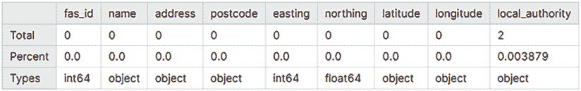

图 4.2：缺失值

我们可以看到有两个地方当局的缺失值。除此之外，似乎没有其他缺失值。我们需要对缺失值保持警惕，因为一些可能被隐藏；例如，一个缺失值可能根据惯例被替换为特定值（例如，使用“-1”表示正数的空值或“NA”表示分类情况）。

*图 4.3*展示了最频繁的值：

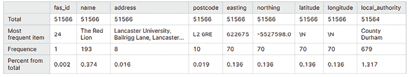

图 4.3：最频繁的值

如果我们现在查看最频繁的值，我们可以观察到，对于**纬度**和**经度**，都有 70 个项的值为**\N**。有趣的是，**东经**和**北纬**也有 70 个最频繁的值。东经和北纬是地理笛卡尔坐标：东经指的是向东测量的距离，而北纬指的是向北测量的距离。根据**通用横轴墨卡托**（**UTM**）坐标系统，北纬是到赤道的距离；在同一坐标系统中，东经是到“虚假东经”的距离，它在每个 UTM 区域内唯一定义。我们还可以观察到，最常见的酒吧名称是**The Red Lion**，并且在**兰卡斯特大学**有**8**家酒吧。至于唯一值，我们可以观察到地址的数量比邮编多，纬度和经度的数量也比邮编多。

*图 4.4*展示了唯一值：

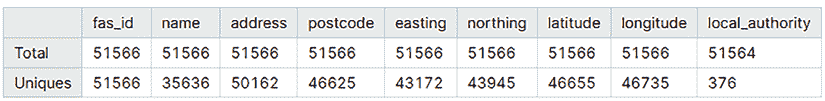

图 4.4：唯一值

**地址**的唯一值数量大于**邮编**的唯一值（同一邮编上有更多地址）。不同地方当局的总数是**376**。此外，请注意，唯一名称的数量少于唯一地址的数量（可能是因为有几个流行的酒吧名称）。

让我们更详细地检查两个缺失的地方当局值。这很奇怪，因为只有两个缺失值，这是不预期的。我们还知道，纬度和经度都有 70 个缺失值，这些值被标记为**\N**。看看包含此缺失地方当局信息的行：

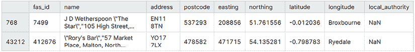

图 4.5：缺少地方当局信息的行

看起来信息缺失是因为当 pandas 使用的解析器读取 CSV 文件时遇到序列**\”,”**，它无法区分逗号分隔符（**,**）。因此，对于这两行，它将**名称**与**地址**合并，然后每列向左移动一个位置，从而破坏了从**地址**到**地方当局**的每一列。

我们有两个选项来解决这个问题：

+   一个选项是尝试向解析器提供一个分隔符列表。在我们的情况下，这会有些棘手，因为我们只有一个逗号分隔符。此外，如果我们尝试使用多字符分隔符，我们需要切换到不同的引擎，Python，因为默认引擎不支持多字符分隔符。

+   第二个选项，也是首选的选项，是编写一小段代码来修复我们发现的两个行中的问题。

这里是修复两个行问题的代码片段。我们使用两个行的索引（我们可以在*图 4.5*中看到它们 – 第一列，没有名称）来识别它们，并在这些行上执行校正：

```py
columns = ['local_authority', 'longitude', 'latitude', 'northing', 'easting', 'postcode', 'address']
# use the rows indexes to locate the rows
for index in [768, 43212]:
    for idx in range(len(columns) - 1):
        # we use `at` to make sure the changes are done on the actual dataframe, not on a copy of it
        pub_df.at[index, columns[idx]] = pub_df.loc[index][columns[idx + 1]]

    # split the corrupted name and assign the name and address
    name_and_addresse = pub_df.loc[index]['name'].split("\",\"")
    pub_df.at[index, 'name'] = name_and_addresse[0]
    pub_df.at[index, 'address'] = name_and_addresse[1] 
```

在*图 4.6*中，我们可以看到名称和地址现在已经被分割并分配到正确的列中，其余的列都向右移动了：

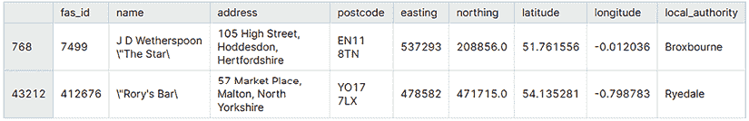

图 4.6：校正后带有地方当局信息的行

如果我们再次检查缺失的数据，它将显示没有其他数据缺失。我们已经知道，实际上有 70 个缺失的纬度和经度；它们只是被标记为**\N**。如果我们单独检查具有此值的纬度或经度列，然后检查两个列都有相同值的行，我们可以得出结论，只有 70 行总共有这种异常。对于相同的行，我们看到**北纬**和**东经**有唯一值，而这些值是不正确的。

因此，我们将无法从**东经**和**北纬**重建经纬度。当检查这些行的相应邮政编码、地址和地方当局时，我们可以看到有多个地点，分布在多个地方当局区域。这 70 行中有 65 个不同的邮政编码。由于我们确实有邮政编码，我们将能够使用它们来重建经纬度。

为了这个目的，我们将**开放邮编地理**数据集（见*参考文献 4*）纳入我们的分析。此数据集包含超过 250 万行，以及许多其他列，除了邮编、纬度和经度。我们从**开放邮编地理**数据集中读取 CSV 文件，仅选择四个列（**邮编**、**国家**、**纬度**和**经度**），并过滤掉任何邮编不在我们原始数据集中酒吧邮编列表中的行。对于 70 行缺失地理数据的行，我们将`经度`和`纬度`的值设置为`None`：

```py
post_code_df = pd.read_csv("/kaggle/input/open-postcode-geo/open_postcode_geo.csv", header=None, low_memory=False)
post_code_df = post_code_df[[0, 6, 7, 8]]
post_code_df.columns = ['postcode', 'country', 'latitude', 'longitude'] 
```

我们将两个结果数据集（酒吧和邮编）合并，并在*左*列中用*右*列的值填充**纬度**和**经度**的缺失值：

```py
pub_df = pub_df.merge(post_code_df, on="postcode", how="left")
pub_df['latitude'] = pub_df['latitude_x'].fillna(pub_df['latitude_y'])
pub_df['longitude'] = pub_df['longitude_x'].fillna(pub_df['longitude_y'])
pub_df = pub_df.drop(["country", "latitude_x", "latitude_y", "longitude_x", "longitude_y"], axis=1) 
```

现在，我们已经将目标行中的所有缺失数据替换为有效的经纬度值。*图 4.7*是组合数据集的快照。

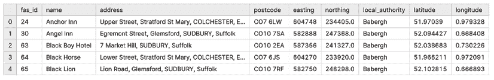

图 4.7：组合数据集快照（英格兰和开放邮编中的每个酒吧）

现在数据插补完成后，我们可以继续进行数据探索。

## 数据探索

我们将首先探索每个酒吧名称和地方当局的频率。为了表示这些信息，我们将重用上一章中开发的`colormap`和`plot`函数。我创建了一个实用脚本，它以与数据统计实用脚本相同的方式导入：

```py
from plot_utils import set_color_map, plot_count, show_wordcloud 
```

导入后，我们将提取县和市（如果地址行包含两个以上的逗号）并分析这些地方的单词频率。市是通过以下简单代码提取的：

```py
def get_city(text):
    try:
        split_text = text.split(",")
        if len(split_text) > 3:
            return split_text[-2]
    except:
        return None
pub_df["address_city"] = pub_df["address"].apply(lambda x: get_city(x)) 
```

在*图 4.8*中，我们显示了每个地方当局的前 10 家酒吧：

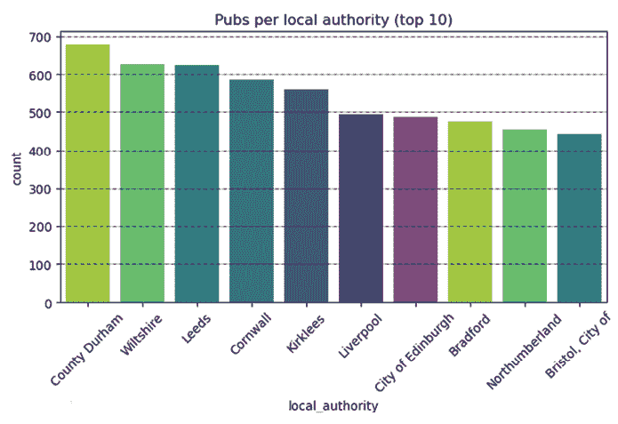

图 4.8：地方当局酒吧数量（前 10 名）

*图 4.9*显示了每个县的前 10 家酒吧。我们通过从地址中检索逗号之后的最后一个子字符串来提取县。在某些情况下，它不是一个县，而是一个大城市，如伦敦：

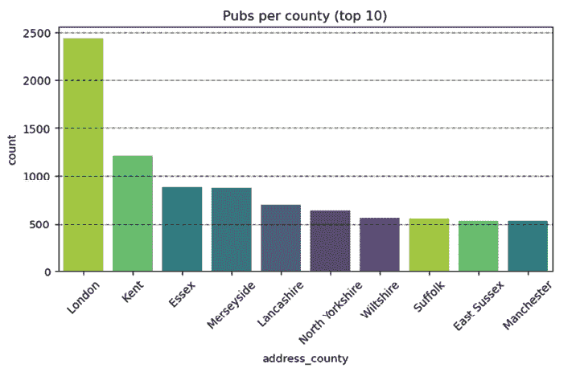

图 4.9：各县酒吧数量（前 10 名）

*图 4.10*显示了酒吧名称和地址中单词的分布：


图 4.10：酒吧名称（左）和地址（右）的单词分布

由于我们有了酒吧的地理位置，我们希望可视化这些信息。我们可以使用`folium` Python 库和`folium 插件` `MarkerCluster`来表示酒吧的位置。Folium（它包装了一些最受欢迎的 Leaflet 外部插件）是显示地理分布信息的一个极好方式。

显示英国地图的代码如下：

```py
import folium
from folium.plugins import MarkerCluster
uk_coords = [55, -3]
uk_map = folium.Map(location = uk_coords, zoom_start = 6)
uk_map 
```

要添加标记，我们可以添加以下代码（不包括初始化 folium 地图层的代码）：

```py
locations_data = np.array(pub_map_df[["latitude", "longitude"]].astype(float))
marker_cluster = MarkerCluster(locations = locations_data)
marker_cluster.add_to(uk_map)
uk_map 
```

我们还可以为`MarkerCluster`添加除了位置之外的信息弹出，以及自定义图标。

*图 4.11* 展示了基于 OpenStreetMap 的英国群岛 folium（leaflet）地图，没有酒吧信息层：

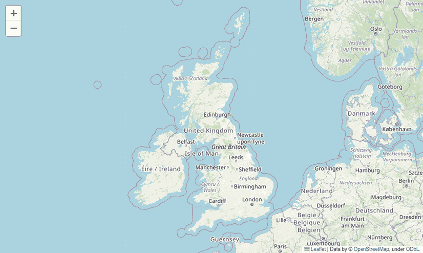

图 4.11：没有酒吧信息层的英国群岛地图

*图 4.12* 展示了添加了酒吧信息层的英国群岛地图，使用了 MarkerCluster 插件。使用 MarkerCluster 后，标记会动态替换，并显示一个组件来显示某个区域内的标记数量。当放大某个区域时，MarkerCluster 的显示会动态变化，显示标记分布的更详细视图：

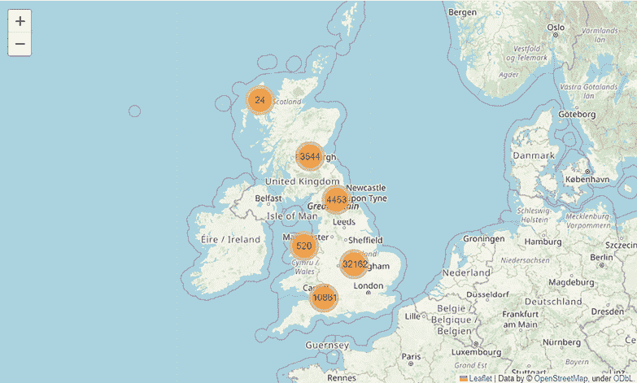

图 4.12：添加了酒吧信息层的英国群岛地图

*图 4.13* 展示了之前地图的放大版本。我们放大查看的区域是英国大陆的南部：

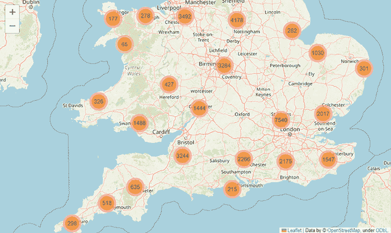

图 4.13：添加了酒吧信息层的英国群岛地图，放大查看南部地区，包括伦敦地区

*图 4.14* 放大查看伦敦地区。随着我们放大，簇被分成更小的组，这些组作为单独的标记出现：

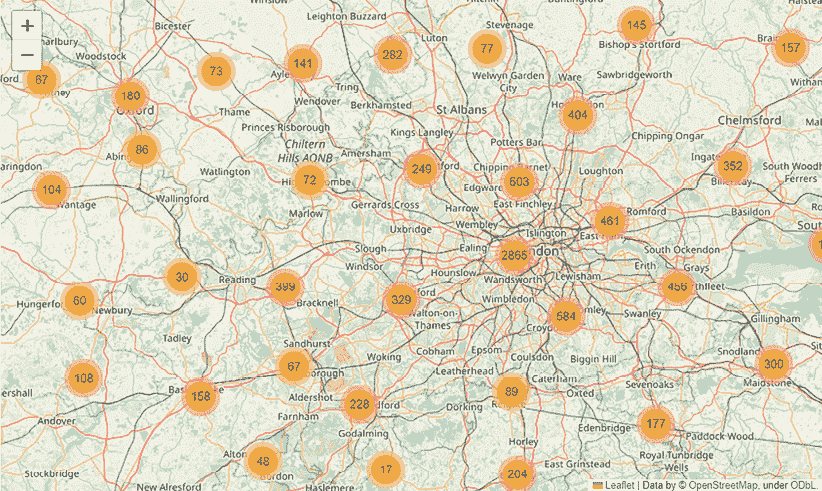

图 4.14：伦敦地区的放大视图

另一种可视化酒吧浓度的方法是使用热力图。热力图可以很好地直观地展示数据的空间分布。它们通过颜色阴影显示分布密度，如*图 4.15*所示。热力图有助于连续显示数据点的密度，并且使用热力图更容易评估不同位置的强度。因为热力图使用插值技术来在数据点之间创建平滑过渡，所以它们可以提供数据分布的更直观表示。您可以看到两个缩放级别，分别是整个大不列颠的酒吧分布热力图视图（左侧）和大陆西南角的视图（右侧）：


图 4.15：使用 folium 和 Heatmap 显示位置密度分布的地图

注意，没有包括北爱尔兰的酒吧。这是因为酒吧数据的收集将其排除在外，因为它不是大不列颠的一部分。

另一种表示酒吧数据空间分布的方法是使用与酒吧位置相关的 Voronoi 多边形（或 Voronoi 图）。**Voronoi 多边形**代表**Delaunay 剖分**的伴随图。让我们解释一下我们刚才介绍的两个概念：Voronoi 多边形和 Delaunay 剖分。

如果我们在平面上有一个点的分布，我们可以使用 Delaunay 剖分来生成这些点的三角剖分。这个图是一组三角形，其边连接所有点，且不交叉。如果我们画出 Delaunay 图中边的中位线，这些新线段交点形成的网络就是 Voronoi 多边形网格。在*图 4.16*中，我们展示了一组点及其相关的 Voronoi 图：

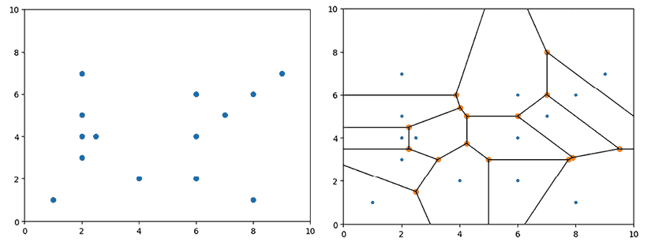

图 4.16：平面上一组点及其由此组点生成的 Voronoi 多边形

这个 Voronoi 多边形图有一个有趣的性质。在一个 Voronoi 多边形内部，所有点都更接近多边形的权重中心（这是原始图的一个顶点）而不是任何相邻多边形的权重中心。因此，从我们的酒吧地理位置绘制的 Voronoi 多边形将准确地表示酒吧的集中度，并且也会以良好的近似显示某个酒吧“覆盖”的面积。我们将使用由 Voronoi 多边形形成的 Voronoi 图来显示每个酒吧覆盖的虚拟区域。

首先，我们使用`scipy.spatial`模块中的*Voronoi*函数提取 Voronoi 多边形：

```py
from scipy.spatial import Voronoi, voronoi_plot_2d
locations_data = np.array(pub_map_df[["longitude", "latitude"]].astype(float))
pub_voronoi = Voronoi(locations_data) 
```

我们可以使用`voronoi_plot_2d`函数（见*图 4.17*）来表示与酒吧（来自`pub_voronoi`）相关的 Voronoi 多边形。然而，这个图有几个问题。首先，有许多多边形很难区分。然后，酒吧的位置（图中用点表示）不太清晰。另一个问题是边界上的多边形没有与领土对齐，产生了不必要且不反映真实面积“覆盖”的伪影。我们将应用一系列变换来消除图中提到的这些问题。

以下代码创建了一个与*图 4.17*中所示的 Voronoi 多边形图像：

```py
fig = voronoi_plot_2d(pub_voronoi,
                     show_vertices=False)
plt.xlim([-8, 3])
plt.ylim([49, 60])
plt.show() 
```

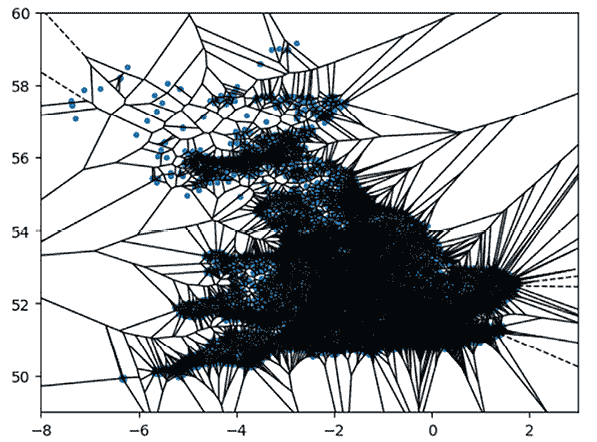

图 4.17：Voronoi 多边形的 2D 图，扩展到领土外（未裁剪）

如果我们只想在英国内部领土边界内表示每个多边形“覆盖”的地理区域，我们必须将来自酒吧位置的 Voronoi 多边形与描述领土边界的多边形裁剪。

幸运的是，我们有访问 Kaggle 的权限，可以获取各种国家的形状文件数据文件格式。对于我们的目的，我们将从*GADM Data for UK*数据集（见*参考文献 5*）导入英国 ESRI 形状文件数据。此数据集提供增量详细的形状文件数据，从外部边界（级别 0）到国家级别（级别 1）和县级别（级别 2）的整个领土。可以使用几个库读取形状文件；在这种情况下，我更喜欢使用`geopandas`库。这个库具有多个对我们分析有用的功能。选择这个库的一个优点是，虽然它增加了操作和可视化地理空间数据的功能，但它保持了`pandas`库的用户友好性和多功能性。我们以增量分辨率加载领土信息文件：

```py
import geopandas as gpd
uk_all = gpd.read_file("/kaggle/input/gadm-data-for-uk/GBR_adm0.shp")
uk_countries = gpd.read_file("/kaggle/input/gadm-data-for-uk/GBR_adm1.shp")
uk_counties = gpd.read_file("/kaggle/input/gadm-data-for-uk/GBR_adm2.shp") 
```

使用`geopandas`的`read_file`函数加载数据。这返回一个`GeoDataFrame`对象，这是一种特殊的 DataFrame 类型。它是与`pandas`一起使用的 DataFrame 对象的扩展，包括地理空间数据。如果 DataFrame 通常包括整数、浮点、文本和日期类型的列，那么 GeoDataFrame 也将包括具有特定于空间分析数据的列，例如与地理空间区域表示相关的多边形。

在使用它来裁剪 Voronoi 多边形之前检查地理空间数据是有用的。让我们可视化三种不同分辨率的地理空间数据。我们可以使用与每个**GeoDataFrame**关联的绘图函数来完成此操作：

```py
fig, ax = plt.subplots(1, 3, figsize = (15, 6))
uk_all.plot(ax = ax[0], color = color_list[2], edgecolor = color_list[6])
uk_countries.plot(ax = ax[1], color = color_list[1], edgecolor = color_list[6])
uk_counties.plot(ax = ax[2], color = color_list[0], edgecolor = color_list[6])
plt.suptitle("United Kingdom territory (all, countries and counties level)")
plt.show() 
```

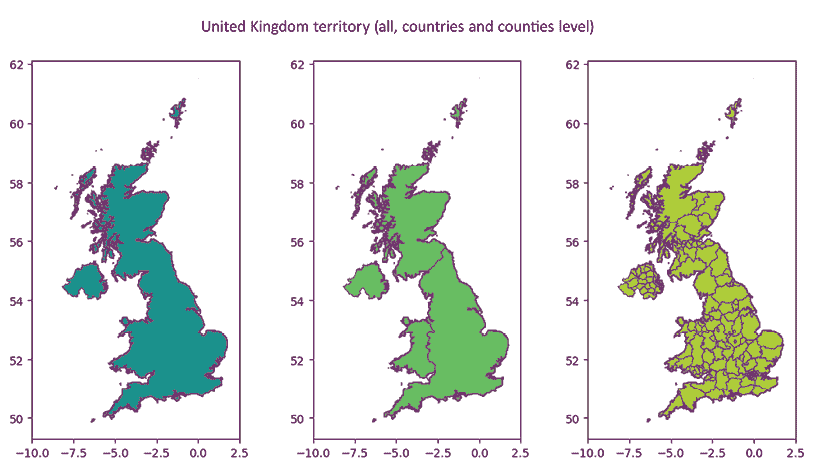

图 4.18：整个领土、国家级别和县级别的英国形状文件数据（从左到右）

我们已经观察到酒吧仅存在于英格兰、苏格兰和威尔士，而不在北爱尔兰。如果我们使用英国级别的数据裁剪酒吧的 Voronoi 多边形，我们可能会遇到这样的情况：包含英格兰和威尔士西部海岸酒吧的 Voronoi 多边形可能会溢出到北爱尔兰的领土。这可能会导致不希望出现的伪影。为了避免这种情况，我们可以按以下方式处理数据：

+   仅从国家级别的形状文件中提取英格兰、苏格兰和威尔士的数据。

+   使用`geopandas`的`dissolve`方法合并三个国家的多边形数据。

```py
uk_countries_selected = uk_countries.loc[~uk_countries.NAME_1.isin(["Northern Ireland"])]
uk_countries_dissolved = uk_countries_selected.dissolve()
fig, ax = plt.subplots(1, 1, figsize = (6, 6))
uk_countries_dissolved.plot(ax = ax, color = color_list[1], edgecolor = color_list[6])
plt.suptitle("Great Britain territory (without Northern Ireland)")
plt.show() 
```

结果内容如下所示：

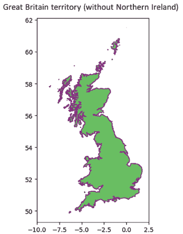

图 4.19：过滤北爱尔兰并使用 dissolve 合并多边形后的英格兰、苏格兰和威尔士的形状文件数据

现在，我们有了来自三个国家的正确裁剪多边形。在裁剪多边形之前，我们需要从 Voronoi 对象中提取它们。以下代码正是这样做的：

```py
def extract_voronoi_polygon_list(voronoi_polygons):
    voronoi_poly_list = []
    for region in voronoi_polygons.regions:
        if -1 in region:
            continue
else:
            pass
if len(region) != 0:
            voronoi_poly_region = Polygon(voronoi_polygons.vertices[region])
            voronoi_poly_list.append(voronoi_poly_region)
        else:
            continue
return voronoi_poly_list
voronoi_poly_list = extract_voronoi_polygon_list(pub_voronoi) 
```

这样，我们就拥有了执行裁剪操作所需的一切。我们首先将 Voronoi 多边形列表转换为 `GeoDataFrame` 对象，类似于我们将用于裁剪的 `uk_countries_dissolved` 对象。我们裁剪多边形，以便在表示时，多边形不会超出边界。为了正确执行裁剪操作且不出现错误，我们必须使用与裁剪对象相同的投影。我们使用 `geopandas` 库中的 `clip` 函数。这个操作非常耗时和占用 CPU 资源。在 Kaggle 基础设施上，运行我们列表中的 45,000 个多边形的整个操作（使用 CPU）需要 35 分钟：

```py
voronoi_polygons = gpd.GeoDataFrame(voronoi_poly_list, columns = ['geometry'], crs=uk_countries_dissolved.crs)
start_time = time.time()
voronoi_polys_clipped = gpd.clip(voronoi_polygons, uk_countries_dissolved)
end_time = time.time()
print(f"Total time: {round(end_time - start_time, 4)} sec.") 
```

以下代码绘制了整个裁剪多边形的集合：

```py
fig, ax = plt.subplots(1, 1, figsize = (20, 20))
plt.style.use('bmh')
uk_all.plot(ax = ax, color = 'none', edgecolor = 'dimgray')
voronoi_polys_clipped.plot(ax = ax, cmap = cmap_custom, edgecolor = 'black', linewidth = 0.25)
plt.title("All pubs in England - Voronoi polygons with each pub area")
plt.show() 
```

在 *图 4.20* 中，我们可以看到结果图。有些区域酒吧集中度较高（多边形较小），而在某些区域（例如苏格兰的一些地区），两个酒吧之间的距离较大。

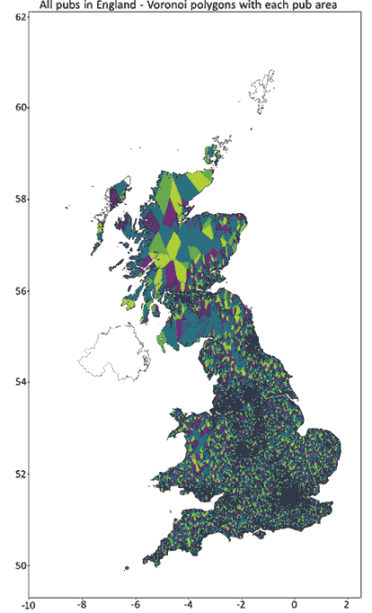

图 4.20：来自酒吧地理分布的 Voronoi 多边形，使用所选三个国家（英格兰、威尔士和苏格兰）的溶解国家级数据裁剪

另一种展示酒吧空间分布的方法是在地方当局级别汇总数据，并在该地方当局酒吧分布的地理中心周围构建 Voronoi 多边形。每个新的 Voronoi 多边形中心是当前地方当局中每个酒吧的经纬度平均值。得到的多边形网格不重建地方当局的空间分布，但它以很好的精度表示了相对酒吧分布。得到的结果 Voronoi 多边形集使用之前相同的裁剪多边形进行裁剪。更准确地说，在我们使用裁剪多边形之前，通过溶解国家级形状文件数据获得了轮廓。我们可以使用分级颜色图来表示每平方单位的酒吧密度。让我们看看创建和可视化这个网格的代码。

首先，我们创建一个数据集，其中包含每个地方当局的酒吧数量以及酒吧位置的经纬度平均值：

```py
pub_df["latitude"] = pub_df["latitude"].apply(lambda x: float(x))
pub_df["longitude"] = pub_df["longitude"].apply(lambda x: float(x))
pubs_df = pub_df.groupby(["local_authority"])["name"].count().reset_index()
pubs_df.columns = ["local_authority", "pubs"]
lat_df = pub_df.groupby(["local_authority"])["latitude"].mean().reset_index()
lat_df.columns = ["local_authority", "latitude"]
long_df = pub_df.groupby(["local_authority"])["longitude"].mean().reset_index()
long_df.columns = ["local_authority", "longitude"]
pubs_df = pubs_df.merge(lat_df)
pubs_df = pubs_df.merge(long_df)
mean_loc_data = np.array(pubs_df[["longitude", "latitude"]].astype(float)) 
```

然后，我们计算与这个分布相关的 Voronoi 多边形：

```py
mean_loc_data = np.array(pubs_df[["longitude", "latitude"]].astype(float))
pub_mean_voronoi = Voronoi(mean_loc_data)
mean_pub_poly_list = extract_voronoi_polygon_list(pub_mean_voronoi)
mean_voronoi_polygons = gpd.GeoDataFrame(mean_pub_poly_list, columns = ['geometry'], crs=uk_countries_dissolved.crs) 
```

我们使用之前用于裁剪的相同多边形裁剪得到的多边形（选择英格兰、威尔士和苏格兰并溶解形状文件到一个单独的形状文件）：

```py
mean_voronoi_polys_clipped = gpd.clip(mean_voronoi_polygons, uk_countries_dissolved) 
```

以下代码绘制了在地方当局级别（Voronoi 多边形的中心是地方当局区域内所有酒吧的平均经纬度）聚合的酒吧地理分布的 Voronoi 多边形，使用溶解的国家级数据（选择了三个国家：英格兰、苏格兰和威尔士）裁剪。我们使用绿色颜色渐变来表示每平方单位的酒吧密度（见 *图 4.21*）：

```py
fig, ax = plt.subplots(1, 1, figsize = (10,10))
plt.style.use('bmh')
uk_all.plot(ax = ax, color = 'none', edgecolor = 'dimgray')
mean_voronoi_polys_clipped.plot(ax = ax, cmap = "Greens_r")
plt.title("All pubs in England\nPubs density per local authority\nVoronoi polygons for mean of pubs positions")
plt.show() 
```

我们使用沃罗诺伊多边形来可视化酒吧的地理分布。在*图 4.20*中，我们用不同的颜色显示每个多边形。因为沃罗诺伊多边形内部点比任何其他相邻多边形中心更靠近多边形中心，所以每个多边形大约覆盖了位于多边形中心的酒吧所覆盖的区域。在*图 4.21*中，我们使用沃罗诺伊多边形围绕每个地方当局内酒吧分布的几何中心构建。然后我们使用颜色渐变来表示每个地方当局的酒吧相对密度。通过使用这些原始的视觉化技术，我们能够更直观地表示酒吧的空间分布。

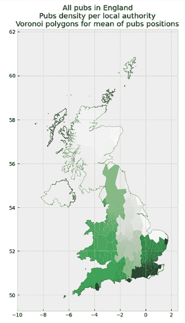

图 4.21：与地方当局区域酒吧密度成比例的颜色强度的沃罗诺伊多边形

在接下来的章节中，我们将继续研究这些数据，当我们把酒吧数据集的数据与星巴克数据集的数据混合时。我们打算结合两个数据集的信息，使用沃罗诺伊多边形区域来评估伦敦地区酒吧和星巴克之间的相对距离。

通过操作为酒吧和星巴克咖啡店生成的沃罗诺伊多边形，我们将分析酒吧和星巴克之间的相对空间分布，生成地图，例如，我们可以看到一组离星巴克最近的酒吧。沃罗诺伊多边形的几何属性将证明在这样做时极为有用。

考虑到这一点，让我们继续前进，探索星巴克数据集。

# 全球星巴克

我们从笔记本*星巴克全球位置 - 数据探索*（见*参考文献 6*）开始对*星巴克全球位置*数据集进行详细的**探索性数据分析**（**EDA**）。（请参阅当前节中的文本）。你可能希望与当前节中的文本并行跟进笔记本。在此数据集中使用的工具是从`data_quality_stats`和`plot_style_utils`实用脚本中导入的。在开始我们的分析之前，重要的是要解释一下，用于此分析的数据集来自 Kaggle，并且是在 6 年前收集的。

## 初步数据分析

数据集有 25,600 行。一些字段只有少数缺失值。**纬度**和**经度**各缺失 1 个值，而**街道地址**缺失 2 个值，**城市**缺失 15 个值。缺失数据最多的字段是**邮编**（5.9%）和**电话号码**（26.8%）。在*图 4.22*中，我们可以看到数据的样本：

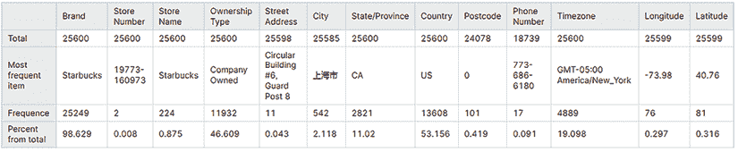

图 4.22：星巴克全球位置数据集的前几行

通过查看最频繁的值报告，我们可以了解一些有趣的事情：

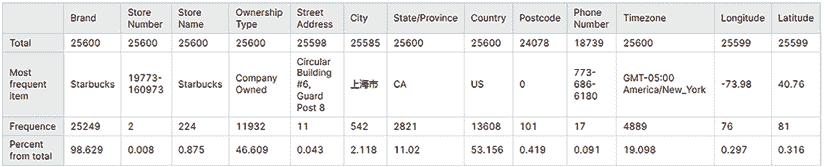

图 4.23：全球星巴克位置数据集中最频繁的值

如预期的那样，拥有最多星巴克咖啡店的州是 CA（美国）。就城市而言，最多的店铺位于上海。有一个独特的地址，最多有 11 家店铺。此外，大多数店铺按时区划分都位于纽约时区。

## 单变量和双变量数据分析

对于这个数据集，我选择了一种颜色图，将星巴克的颜色与绿色和棕色调混合，就像他们提供给客户的优质烘焙咖啡的颜色：

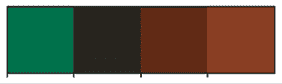

图 4.24：笔记本颜色图，将星巴克颜色与烘焙咖啡的色调混合

我们将使用前面的自定义颜色图进行单变量分析图。在下面的图中，我们展示了按国家代码划分的咖啡店分布。大多数星巴克位于美国，有超过 13,000 条记录，其次是中国、加拿大和日本：

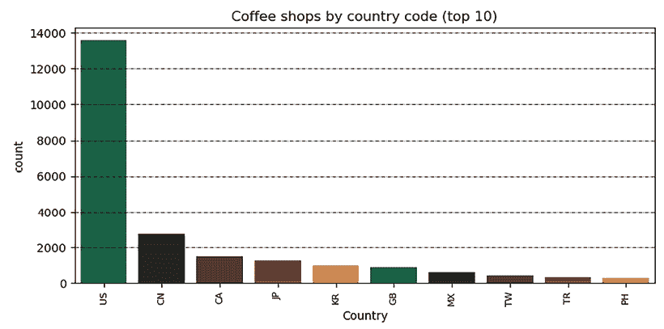

图 4.25：按国家代码划分的咖啡店。美国最多，其次是中国、加拿大和日本

如果我们查看*图 4.26*中的按州/省分布，我们可以看到第一名是加利福尼亚州，有超过 25,000 家。第二名是德克萨斯州，有超过 1,000 家咖啡店，第三名是英格兰，少于 1,000 家。按时区分布显示，最代表性的是美国东海岸时区（纽约时区）。

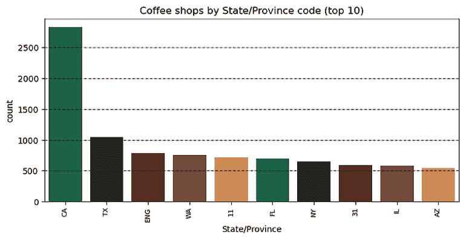

图 4.26：按州/省代码划分的咖啡店。加利福尼亚州（CA）拥有最多的咖啡店，其次是德克萨斯州（TX）

此外，大多数咖啡店位于纽约（美国东海岸）时区：

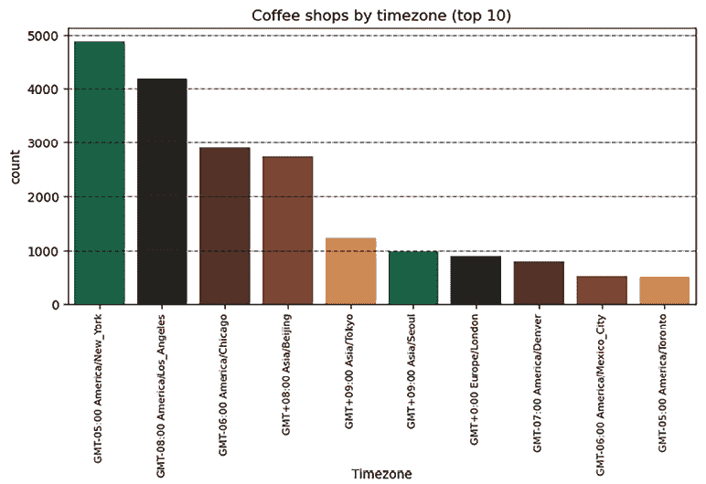

图 4.27：按时区代码划分的咖啡店，大多数位于纽约（美国东海岸）时区

接下来，星巴克咖啡店的拥有情况在*图 4.28*中展示。我们可以观察到，大多数咖啡店是公司拥有的（12,000 家），其次是特许经营（超过 9,000 家），合资企业（4,000 家），以及特许经营店（少于 1,000 家）：

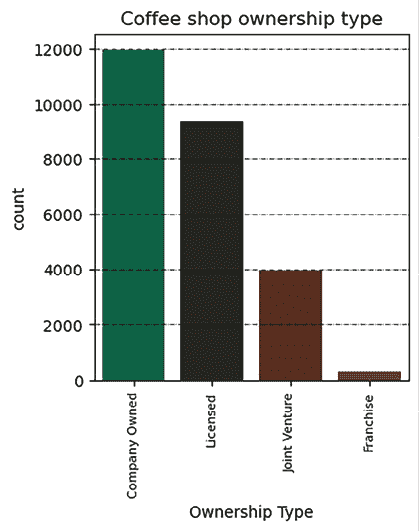

图 4.28：咖啡店所有权类型

接下来，我们将看到所有权类型如何根据国家而变化。让我们用国家来表示公司所有权。下面的图显示了前 10 个国家的咖啡店数量。由于数据偏斜（概率分布的不对称性度量），我们使用对数尺度。换句话说，在少数几个国家中，有许多咖啡店，而在其他国家中，咖啡店的数量要少得多。美国有两种所有权类型：公司拥有和特许经营。中国主要是合资企业和公司拥有，特许经营的数量较少。在日本，大多数店铺是合资企业，特许经营和公司拥有的数量几乎相等。

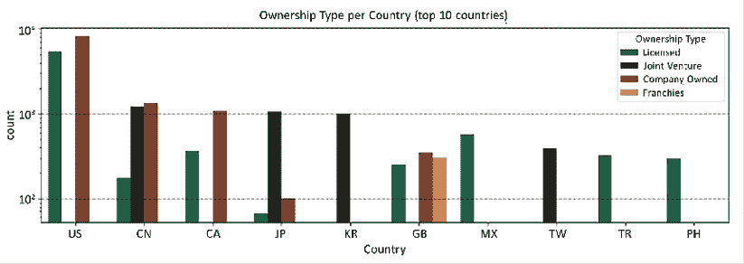

图 4.29：按所有权类型分组的各国咖啡店数量

在以下图中，我们展示了按所有权类型分组的每个城市的咖啡店数量。因为城市的名称以多种形式书写（使用小写和大写的本土字符），我首先统一了表示法（并将所有内容与英文名称对齐）。前几个城市是上海、首尔和北京。上海和首尔有合资咖啡店，而北京只有公司拥有的星巴克咖啡店。

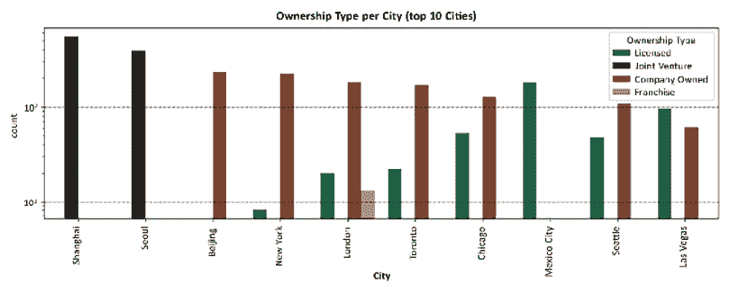

图 4.30：按所有权类型分组的城市咖啡店数量

我们对星巴克咖啡店数据集进行了单变量和双变量分析。现在，我们对特征分布和相互作用有了很好的理解。接下来，让我们进行另一项地理空间分析，使用并扩展我们之前在英格兰酒吧分析中测试过的工具。

## 地理空间分析

我们首先观察星巴克在全球的分布。我们使用 folium 库和 MarkerCluster 在动态地图上表示整个世界咖啡店的空间分布。代码如下所示：

```py
coffee_df = coffee_df.loc[(~coffee_df.Latitude.isna()) & (~coffee_df.Longitude.isna())]
locations_data = np.array(coffee_df[["Latitude", "Longitude"]])
popups = coffee_df.apply(lambda row: f"Name: {row['Store Name']}", axis=1)
marker_cluster = MarkerCluster(
    locations = locations_data,
)
world_coords = [0., 0.]
world_map = folium.Map(location = world_coords, zoom_start = 1)
marker_cluster.add_to(world_map) 
world_map 
```

Folium/leaflet 地图可浏览。我们可以平移、放大和缩小。在*图 4.31*中，我们展示了全球咖啡店的分布：

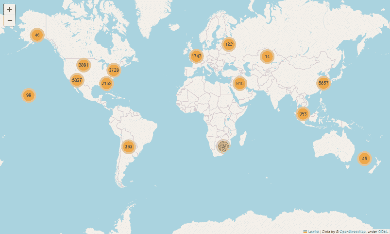

图 4.31：使用 folium 在 leaflets 上展示的全球星巴克咖啡店分布

在*图 4.32*中，我们展示了北美大陆美国和加拿大地区的放大视图。显然，东海岸和西海岸在美国星巴克咖啡店分布中占主导地位。

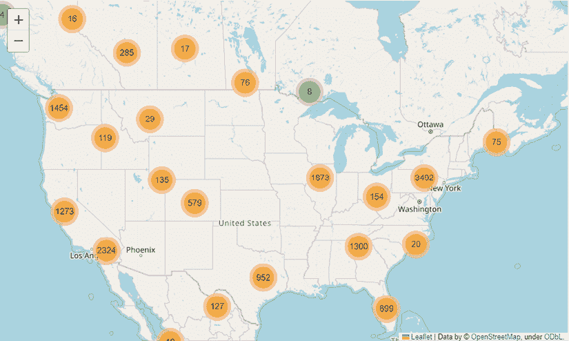

图 4.32：美国星巴克咖啡店分布

另一种表示星巴克咖啡店空间分布的方法是使用`geopandas`绘图功能。首先，我们将展示每个国家的店铺数量。为此，我们将按国家汇总咖啡店：

```py
coffee_agg_df = coffee_df.groupby(["Country"])["Brand"].count().reset_index()
coffee_agg_df.columns = ["Country", "Shops"] 
```

要使用`geopandas`表示地理空间分布，我们需要使用`ISO3`国家代码（三位字母的国家代码）。在星巴克分布数据集中，我们只有`ISO2`（两位字母的国家代码）。我们可以包含一个包含等效性的数据集，或者我们可以导入一个 Python 包，它会为我们进行转换。我们将选择第二种解决方案并使用`pip install`，然后导入`country-conversion` Python 包：

```py
import geopandas as gpd
import matplotlib
import country_converter as cc
# convert ISO2 to ISO3 country codes - to be used with geopandas plot of countries
coffee_agg_df["iso_a3"] = coffee_agg_df["Country"].apply(lambda x: cc.convert(x, to='ISO3')) 
```

然后，使用`geopandas`，我们加载了一个包含所有国家多边形形状的数据集，分辨率为低。然后我们将两个数据集（包含店铺和多边形）合并：

```py
world = gpd.read_file(gpd.datasets.get_path('naturalearth_lowres'))
world_shop = world.merge(coffee_agg_df, on="iso_a3", how="right") 
```

在显示国家多边形之前，我们将填充颜色调整为按比例表示当前国家星巴克咖啡店的数量，我们将显示一个带有所有国家的线框图，这样我们也可以在地图上看到没有星巴克的国家：

```py
world_shop.loc[world_shop.Shops.isna(), "Shops"] = 0
f, ax = plt.subplots(1, 1, figsize=(12, 5))
world_cp = world.copy() 
```

使用`geopandas`，我们可以应用对数色标，这有助于更有效地表示具有偏斜分布的各国星巴克咖啡店的总数。它确保了颜色方案的均匀分布，使我们能够区分拥有较少咖啡店的国家和在这方面处于顶端的国家。我们还绘制了一些纬度线：

```py
# transform, in the copied data, the projection in Cylindrical equal-area,
# which preserves the areas 
world_cp= world_cp.to_crs({'proj':'cea'})
world_cp["area"] = world_cp['geometry'].area / 10**6 # km²
world["area"] = world_cp["area"]='black', linewidth=0.25, ax=ax) 
# draw countries polygons with log scale colormap
world_shop.plot(column='Shops', legend=True,\
           norm=matplotlib.colors.LogNorm(vmin=world_shop.Shops.min(),\
                                          vmax=world_shop.Shops.max()), 
           cmap="rainbow",
           ax=ax)
plt.grid(color="black", linestyle=":", linewidth=0.1, axis="y", which="major")
plt.xlabel("Longitude"); plt.ylabel("Latitude")
plt.title("Starbucks coffee shops distribution at country level")
plt.show() 
```

这张地图很有信息量，但这些国家的面积、人口和人口密度差异很大。为了更好地理解星巴克咖啡店的密度，我们还将绘制每百万公民拥有的店铺数量（针对每个国家）以及每 1,000 平方公里的店铺数量。

![图片 B20963_04_33.png]

图 4.33：geopandas 地图显示世界级别的咖啡店密度（对数刻度）

对于前面的地图，我们选择`geopandas`正是因为它允许我们在对数尺度上用颜色强度表示区域。

在`world`数据集中，我们有人口估计数据，但没有国家面积信息。为了计算每平方公里的星巴克密度，我们需要包括面积。我们可以包含一个新的数据集，包含国家面积，或者我们可以使用`geopandas`的功能从多边形中获取面积。由于当前使用的墨卡托投影是为了以可读的方式显示地图，面积计算并不正确。

我们将复制`world`数据集，以确保在墨卡托投影中变换时不会扭曲多边形。然后，我们将使用`Cylindrical equal-area`投影在副本上应用变换。这种投影保留了面积，这正是我们计算所需的。变换完成后，我们将面积连接到`world`数据集：

```py
world_cp = world.copy()
# transform, in the copied data, the projection in Cylindrical equal-area,
# which preserves the areas 
world_cp= world_cp.to_crs({'proj':'cea'})
world_cp["area"] = world_cp['geometry'].area / 10**6 # km²
world["area"] = world_cp["area"] 
```

让我们来验证一下我们计算面积是否正确。我们选取了几个国家，并验证这些国家的面积是否与官方记录相符：

```py
world.loc[world.iso_a3.isin(["GBR", "USA", "ROU"])] 
```

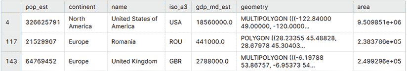

图 4.34：美国、罗马尼亚和英国的面积验证

如您所见，对于所有国家，使用的方法计算出的面积产生了与官方记录相符的正确表面。

现在，我们已经拥有了准备和显示按国家、面积和人口相对密度显示星巴克密度的所有必要信息。计算星巴克密度的代码如下：

```py
world_shop = world.merge(coffee_agg_df, on="iso_a3", how="right")
world_shop["Shops / Population"] = world_shop["Shops"] / world_shop["pop_est"] * 10**6 # shops/1 million population
world_shop["Shops / Area"] = world_shop["Shops"] / world_shop["area"] * 10**3\. # shops / 1000 Km² 
```

然后，使用以下代码，我们在国家层面上绘制每百万人口拥有的星巴克分布：

```py
f, ax = plt.subplots(1, 1, figsize=(12, 5))
# show all countries contour with black and color while
world.plot(column=None, color="white", edgecolor='black', linewidth=0.25, ax=ax) 
# draw countries polygons
world_shop.plot(column='Shops / Population', legend=True,\
           cmap="rainbow",
           ax=ax)
plt.grid(color="black", linestyle=":", linewidth=0.1, axis="y", which="major")
plt.xlabel("Longitude"); plt.ylabel("Latitude")
plt.title("Starbucks coffee shops / 1 million population - distribution at country level")
plt.show() 
```

我们在*图 4.35*中展示了使用前面代码绘制的图表。每百万人口星巴克数量最多的国家是美国、加拿大和阿联酋，其次是台湾、韩国、英国和日本。

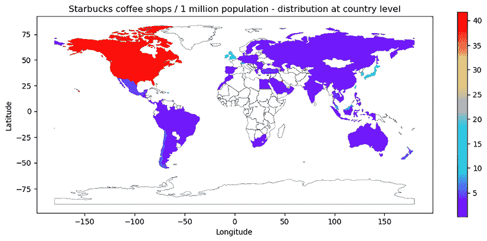

图 4.35：每百万人的星巴克数量 – 每个国家分布

对于每个国家，每 1,000 平方公里的星巴克咖啡店数量在以下图表中显示：

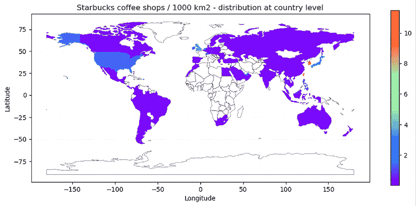

图 4.36：每 1,000 平方公里的星巴克数量 – 每个国家分布

我们可以看到，咖啡店最高集中度在韩国、台湾、日本和英国等国家。

让我们快速总结一下本节内容。我们分析了包含英国酒吧和全球星巴克数据的两个数据集，以了解这两个数据集中的数据分布情况。我们还介绍了用于地理空间数据处理和分析的几种技术和工具。我们学习了如何绘制 shapefile 数据，如何从 shapefile 中提取多边形，如何使用另一组多边形剪切多边形集，以及如何生成 Voronoi 多边形。这些都是为本章分析的主要部分所做的准备，我们将结合两个数据集，学习如何生成多图层地图，其中两个数据集的信息被创造性地结合。我们的目标是双重的：向您介绍分析地理空间数据的高级方法，并创造性地使用介绍的方法，看看我们如何从结合后的数据源中获得洞察。

# 伦敦的酒吧和星巴克

到目前为止，我们的分析主要集中在单独的“英格兰每家酒吧”和“全球星巴克位置”数据集上。为了支持与这两个单独数据集相关的某些数据分析任务，我们还添加了两个额外的数据集，一个是邮政编码的地理位置数据，用于替换缺失的经纬度数据，另一个是英国的 shapefile 数据，用于剪切从酒吧位置生成的 Voronoi 多边形，使它们与岛屿的陆地轮廓对齐。

在本节中，我们将结合分别分析的两个主要数据源的信息，并应用在本初步分析期间开发的方法，支持我们的研究目标。这将侧重于一个较小的区域，在伦敦，我们既有酒吧的高密度，也有星巴克咖啡店的高度集中。我们可以假设星巴克的地理空间集中度小于酒吧的集中度。

我们希望看到最近的星巴克在哪里，这样我们就可以在喝了几品脱啤酒后用咖啡清醒一下。我们已经了解到 Voronoi 多边形有一个有趣的特性——多边形内的任何点都离其中心比离任何相邻中心更近。我们将代表伦敦地区的酒吧位置，叠加在同一地区星巴克位置生成的 Voronoi 多边形上。

与本节相关的笔记本是`Coffee or Beer in London – Your Choice!`，（见*参考文献 11*）。您可能会发现跟随本节中的文本一起查看笔记本很有用。

## 数据准备

我们首先从两个数据集`Every Pub in England`和`Starbucks Locations Worldwide`中读取 CSV 文件。我们还现在从`GDM Data for the UK`读取`GBR_adm2.shp`形状文件（包含大不列颠地方当局边界数据）以及`Open Postcode Geo`的数据。在这个最后文件中，我们只过滤四个列（邮编、国家、纬度和经度）。

从酒吧数据中，我们只选择那些地方当局为伦敦 32 个自治市之一的数据条目。我们将伦敦市添加到这个子集中，因为伦敦市不是自治市之一。伦敦市位于伦敦市中心，一些酒吧就位于那里，我们希望将其包括在内。我们使用相同的列表来过滤 shapefile 数据中的数据。为了检查我们是否正确选择了所有 shapefile 数据，我们显示了自治市（以及伦敦市）的多边形：

```py
boroughs_df = counties_df.loc[counties_df.NAME_2.isin(london_boroughs)]
boroughs_df.plot(color=color_list[0], edgecolor=color_list[4])
plt.show() 
```

在以下图中，观察发现伦敦市缺失（左）。我们在形状文件名称中有伦敦，所以我们将只将形状文件数据中的伦敦替换为伦敦市。在更正后（右），我们可以看到通过统一伦敦市的表示法，我们现在在我们的地图上正确地表示了所有地方当局。现在，我们已经选择了我们想要包括在我们对伦敦地区酒吧和星巴克咖啡店的分析中的所有区域。

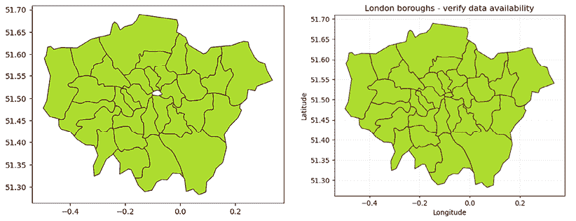

图 4.37：伦敦自治市（左）和伦敦自治市及伦敦市（右）

我们还选择了相同子区域的星巴克咖啡店数据。对于星巴克数据，选择在以下代码中显示：

```py
coffee_df = coffee_df.loc[(coffee_df.City.isin(london_boroughs + ["London"])) &\
             (coffee_df.Country=="GB")] 
```

我们将国家信息纳入过滤标准，因为伦敦和许多其他伦敦自治市的名称在北美被发现，许多城市从大不列颠借用名称。

根据我们对酒吧数据的先前分析，我们知道一些酒吧缺少经纬度，标记为**\\N**。对这些酒吧行执行相同的转换，包括与`Open Postcode Geo`数据合并和清理，如前一小节所述。这个过程将涉及根据邮编匹配分配经纬度数据。

然后，使用以下代码，我们检查使用先前标准选择的酒吧和星巴克是否都在伦敦自治市区的边界内（或非常接近这些边界）：

```py
def verify_data_availability():
    f, ax = plt.subplots(1, 1, figsize=(10, 10))
    boroughs_df.plot(color="white", edgecolor=color_list[4], ax=ax)
    plt.scatter(x=pub_df["longitude"],y=pub_df["latitude"], color=color_list[0], marker="+", label="Pubs")
    plt.scatter(x=coffee_df["Longitude"],y=coffee_df["Latitude"], color=color_list[5], marker="o", label="Starbucks")
    plt.xlabel("Longitude"); plt.ylabel("Latitude"); plt.title("London boroughs - verify data availability")
    plt.grid(color="black", linestyle=":", linewidth=0.1, axis="both", which="major")
    plt.legend()
    plt.show() 
```

我们观察到有两个星巴克与伦敦相当遥远。我们对选定的星巴克设置了一个额外的条件：

```py
coffee_df = coffee_df.loc[coffee_df.Latitude<=51.7] 
```

在生成的图中，您将看到伦敦自治市区和伦敦市内的酒吧（交叉点）和星巴克（点），在过滤掉这些地方当局区域外的项目并纠正错误归属后。

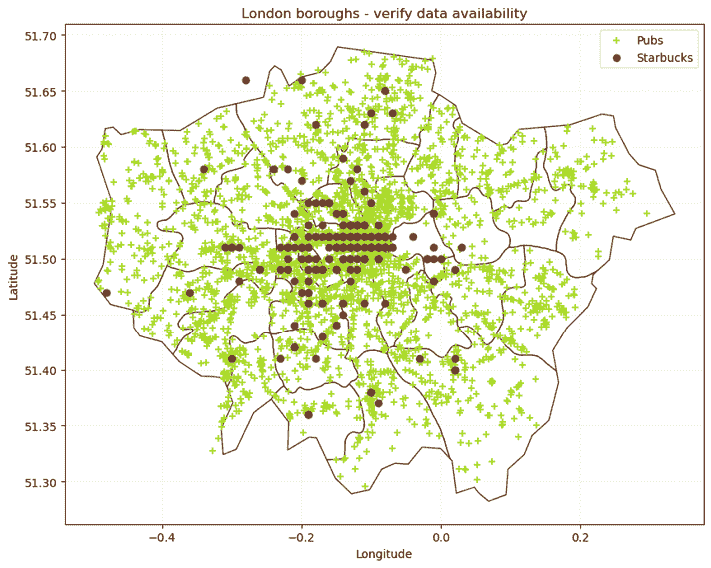

图 4.38：过滤项目后的伦敦自治市区和伦敦市内的酒吧（交叉点）和星巴克（点）

仍然有一些点在边界之外，但到目前为止，我们应该没问题。一旦我们使用地方当局多边形来裁剪每个酒吧和咖啡店相关的 Voronoi 多边形，这些点将被过滤掉。我们观察到有关星巴克对齐的一个奇怪现象。所有星巴克商店似乎都是水平对齐的。这是因为星巴克的定位只给出了两位小数（星巴克咖啡店来自一个全球地理定位数据集，其中位置以较小的精度给出），而酒吧给出了六位小数。因此，星巴克商店看起来是对齐的。它们的定位被四舍五入到两位小数，由于咖啡店位置接近，它们看起来是对齐的，尤其是在纬度线上。

## 地理空间分析

现在，让我们用伦敦及其自治市区的酒吧和星巴克商店的 Voronoi 多边形来表示。我们首先使用之前用于我们在《英格兰每家酒吧》数据分析中使用的相同代码来生成这些多边形。首先，让我们处理该区域的酒吧。由于我们现在使用了`geospatial_utils`实用脚本，笔记本中的代码现在更加紧凑。以下代码生成包含 Voronoi 多边形集合的对象，然后可视化该集合：

```py
pub_voronoi = get_voronoi_polygons(pub_df)
plot_voronoi_polygons(pub_voronoi, 
                      title="Voronoi polygons from pubs locations in London",
                      lat_limits=[51.2, 51.7],
                      long_limits=[-0.5, 0.3]) 
```

为了做到这一点，前面的代码使用了在`geospatial_utils`中定义的两个函数。

第一个函数`get_voronoi_polygons`从一个点列表中创建一个 Voronoi 多边形列表，其中*x*和*y*坐标分别代表经度和纬度。为此，它使用`scipy.spatial`库中的 Voronoi 函数：

```py
def get_voronoi_polygons(data_df, latitude="latitude", longitude="longitude"):
    """
    Create a list of Voronoi polygons from a list of points
    Args
        data_df: dataframe containing lat/long
        latitude: latitude feature
        longitude: longitude feature
    Returns
        Voronoi polygons graph (points, polygons) from the seed points in data_df
        (a scipy.spatial.Voronoi object)
    """

    locations_data = np.array(data_df[[latitude, longitude]].astype(float))
    data_voronoi = [[x[1], x[0]] for x in locations_data]
    voronoi_polygons = Voronoi(data_voronoi)
    print(f"Voronoi polygons: {len(voronoi_polygons.points)}")
    return voronoi_polygons 
```

第二个函数`plot_voronoi_polygons`绘制一个`spacy.spatial.Voronoi`对象，这是一个 Voronoi 多边形的集合：

```py
def plot_voronoi_polygons(voronoi_polygons, title, lat_limits, long_limits):
    """
    Plot Voronoi polygons (visualization tool)
    Args
        voronoi_polygons: Voronoi polygons object (a scipy.spatial.Voronoi object)
        title: graph title
        lat_limits: graph latitude (y) limits
        long_limits: graph longitude (x) limits
    Returns
        None
    """
# do not show the vertices, only show edges and centers
    fig = voronoi_plot_2d(voronoi_polygons,
                     show_vertices=False)
    plt.xlim(long_limits)
    plt.ylim(lat_limits)    
    plt.title(title)
    plt.show() 
```

生成多边形集合首先被提取为前一个部分中已定义的`extract_voronoi_polygon_list`函数的列表，然后使用伦敦自治市区的外部边界进行裁剪，该边界是通过溶解`borroughs_df` GeoDataFrame 获得的：

```py
boroughs_dissolved = boroughs_df.dissolve()
voronoi_polys_clipped = clip_polygons(voronoi_poly_list, boroughs_df) 
```

`clip_polygons`函数的代码在`geospatial_utils`实用脚本中定义。在`clip_polygons`函数中，我们使用一个多边形列表`poly_clipping`来裁剪另一个列表`poly_list_origin`中的多边形。我们将原始多边形列表`poly_list_origin`转换为一个`geopandas` DataFrame。我们使用 geopandas 的`clip`函数执行裁剪操作。裁剪后的多边形列表`polygons_clipped`由`clip_polygons`函数返回：

```py
def clip_polygons(poly_list_origin, poly_clipping):
    """
    Clip a list of polygons using an external polygon
    Args:
        poly_list_origin: list of polygons to clip
        poly_clipping: polygon used to clip the original list

    Returns:
        The original list of polygons, with the polygons clipped using the clipping polygon
    """
#convert the initial polygons list to a geodataframe
    polygons_gdf = gpd.GeoDataFrame(poly_list_origin, columns = ['geometry'], crs=poly_clipping.crs)
    start_time = time.time()
    polygons_clipped = gpd.clip(polygons_gdf, poly_clipping)
    end_time = time.time()
    print(f"Total time: {round(end_time - start_time, 4)} sec.")
    return polygons_clipped 
```

下图显示了伦敦酒吧位置的 Voronoi 多边形（左）和地区边界（右）：

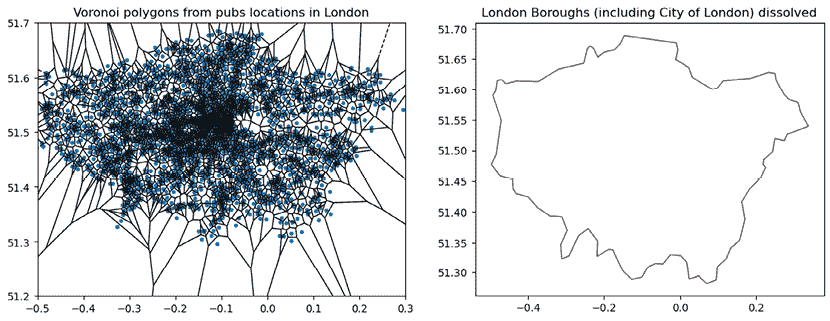

图 4.39：伦敦地区和伦敦市（左）的酒吧 Voronoi 多边形以及伦敦地区边界（右）。我们使用边界多边形来裁剪 Voronoi 多边形

下图显示了地区的边界和酒吧的位置，以及与这些位置相关的 Voronoi 多边形。我们可以观察到，酒吧密度最高的区域位于伦敦市及其西部的邻近地区，除了塔桥区，该区只有一家酒吧。

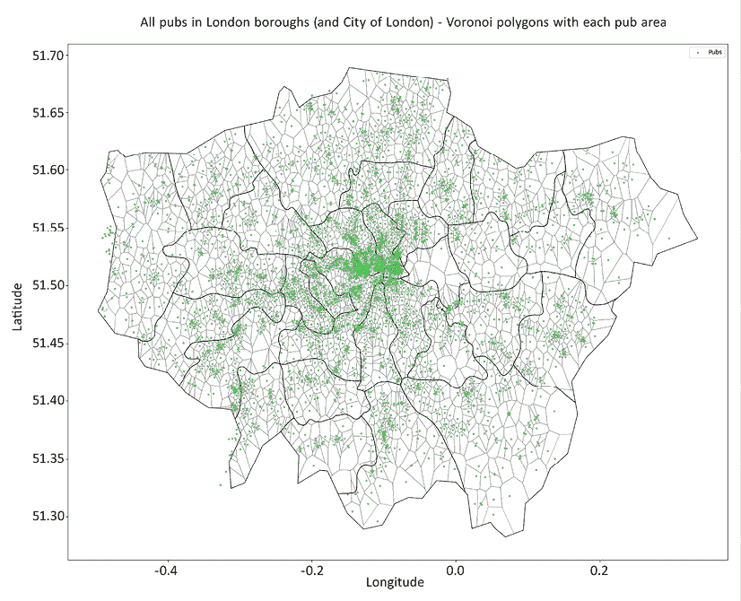

图 4.40：伦敦地区和伦敦市（裁剪后）的酒吧 Voronoi 多边形，显示酒吧位置和地区边界

接下来，我们对星巴克咖啡店的位置执行相同的操作。我们生成 Voronoi 多边形，并使用通过溶解所有地区多边形获得的相同的伦敦地区边界多边形进行裁剪。下图显示了地区的边界和星巴克商店的位置，以及与这些位置相关的 Voronoi 多边形：

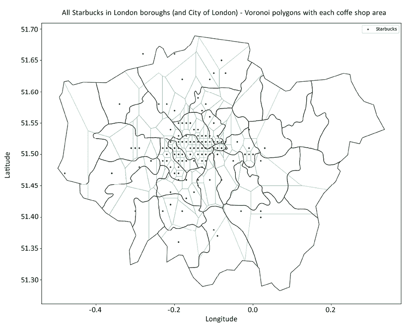

图 4.41：伦敦地区和伦敦市（裁剪后）的星巴克 Voronoi 多边形，显示商店的位置和地区边界

生成 Voronoi 多边形对象、可视化它、从中提取多边形列表以及然后裁剪的代码如下。首先，让我们看看生成 Voronoi 多边形的代码：

```py
coffee_voronoi = get_voronoi_polygons(coffee_df, latitude="Latitude", longitude="Longitude")
plot_voronoi_polygons(coffee_voronoi, 
                      title="Voronoi polygons from Starbucks locations in London",
                      lat_limits=[51.2, 51.7],
                      long_limits=[-0.5, 0.3]) 
```

接下来是提取 Voronoi 多边形对象中的多边形列表以及使用地区边界裁剪多边形的代码：

```py
coffee_voronoi_poly_list = extract_voronoi_polygon_list(coffee_voronoi)
coffee_voronoi_polys_clipped = clip_polygons(coffee_voronoi_poly_list, boroughs_df) 
```

使用`within_polygon`函数，我们可以识别位于多边形内的位置。该函数在`geospatial_utils`模块中实现。该函数使用来自`shapely.geometry`库模块的`Point`对象的`within`属性。我们对给定多边形的所有点（在我们的案例中，是酒吧）的经纬度创建的点执行操作，获取点相对于参考多边形的状态（`within`，`outside`）：

```py
def within_polygon(data_original_df, polygon, latitude="latitude", longitude="longitude"):
    """
    Args
        data_original_df: dataframe with latitude / longitude
        polygon: polygon (Polygon object)
        latitude: feature name for latitude n data_original_df
        longitude: feature name for longitude in data_original_df
    Returns
        coordinates of points inside polygon
        coordinates of points outside polygon
        polygon transformed into a geopandas dataframe
    """
    data_df = data_original_df.copy()
    data_df["in_poly"] = data_df.apply(lambda x: Point(x[longitude], x[latitude]).within(polygon), axis=1)
    data_in_df = data_df[[longitude, latitude]].loc[data_df["in_poly"]==True]
    data_out_df = data_df[[longitude, latitude]].loc[data_df["in_poly"]==False]
    data_in_df.columns = ["long", "lat"]
    data_out_df.columns = ["long", "lat"]
    sel_polygon_gdf = gpd.GeoDataFrame([polygon], columns = ['geometry'])
    return data_in_df, data_out_df, sel_polygon_gdf 
```

以下代码应用了`within_polygon`函数：

```py
data_in_df, data_out_df, sel_polygon_gdf = within_polygon(pub_df, coffee_voronoi_poly_list[6]) 
```

在以下图中，所选区域内的酒吧（在笔记本中与书籍相关联，使用浅棕色和深绿色填充色显示）比任何其他相邻的星巴克咖啡店更靠近所选区域的星巴克咖啡店位置。其余酒吧以浅绿色显示。我们可以对所有的多边形（以及自治市的区域）重复此过程。

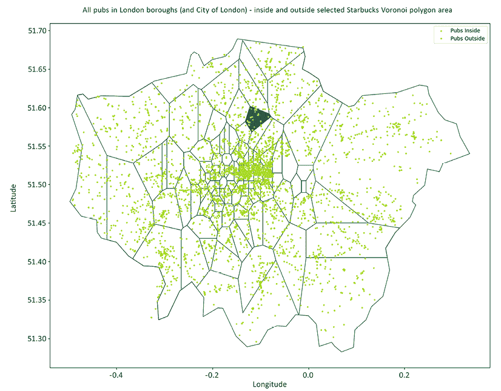

图 4.42：星巴克 Voronoi 多边形区域内外酒吧

我们也可以使用 folium 地图来表示相同的物品，酒吧和星巴克咖啡店。这些地图将允许交互，包括放大、缩小和平移。我们可以在基础图上添加多个图层。让我们首先将伦敦自治市表示为地图的第一层。在其上方，我们将显示伦敦区域的酒吧。每个酒吧也将有一个弹出窗口，显示酒吧名称和地址。我们可以从多个地图瓦片提供商中选择。

由于我更喜欢清晰的背景，我选择了两个瓦片来源：“Stamen toner”和“CartoDB positron”。对于这两种选项，瓦片都是黑白或浅色，因此重叠层可以更容易地看到。以下是在伦敦区域显示瓦片（使用“Stamen toner”）、伦敦自治市轮廓（地图的第一层）以及每个酒吧位置（在地图上的第二层）的代码。每个酒吧都将有一个弹出窗口，显示酒吧名称和地址：

```py
# map with zoom on London area
m = folium.Map(location=[51.5, 0], zoom_start=10, tiles="Stamen Toner")
# London boroughs geo jsons
for _, r in boroughs_df.iterrows():
    simplified_geo = gpd.GeoSeries(r['geometry']).simplify(tolerance=0.001)
    geo_json = simplified_geo.to_json()
    geo_json = folium.GeoJson(data=geo_json,
                           style_function=lambda x: {'fillColor': color_list[1],
                                                    'color': color_list[2],
                                                    'weight': 1})
    geo_json.add_to(m)
# pubs as CircleMarkers with popup with Name & Address info    
for _, r in pub_df.iterrows():
    folium.CircleMarker(location=[r['latitude'], r['longitude']],
                        fill=True,
                        color=color_list[4],
                        fill_color=color_list[5],
                        weight=0.5,
                        radius=4,
                        popup="<strong>Name</strong>: <font color='red'>{}</font> <br> <strong>Address</strong>: {}".format(r['name'], r['address'])).add_to(m)
# display map
m 
```

以下图显示了使用前面代码创建的地图。在此地图上，我们显示以下信息叠加层：

+   伦敦自治市和伦敦市地图区域使用“Stamen Toner”瓦片

+   伦敦自治市和伦敦市边界

+   前述区域中的酒吧，使用`CircleMarker`显示

+   可选地，对于每个酒吧，如果选中，一个弹出窗口显示酒吧名称和地址


图 4.43：带有伦敦自治市边界和伦敦区域酒吧位置的 Leaflet 地图

在笔记本中，我展示了更多带有星巴克 Voronoi 多边形和位置的图片，以及具有多层层多边形和标记的地图。

另一个我们可以执行的有用操作是计算多边形的面积。用于计算 GeoDataFrame 中所有多边形面积的函数是`get_polygons_area`，它也在`geospatial_utils`中定义。它在一个 GeoDataFrame 的副本上应用了`cylindrical equal area`投影的转换。这个投影将保留面积。然后我们向原始 GeoDataFrame 添加`area`列：

```py
def get_polygons_area(data_gdf):
    """
    Add a column with polygons area to a GeoDataFrame
    A Cylindrical equal area projection is used to calculate 
    polygons area

    Args
        data_gdf: a GeoDataFrame
    Returns
        the original data_gdf with an `area` column added
    """
# copy the data, to not affect initial data projection
    data_cp = data_gdf.copy()
    # transform, in the copied data, the projection in Cylindrical equal-area,
# which preserves the areas 
    data_cp = data_cp.to_crs({'proj':'cea'})
    data_cp["area"] = data_cp['geometry'].area / 10**6 # km²
    data_gdf["area"] = data_cp["area"]
    # returns the initial data, with added area columns
return data_gdf 
```

我们计算自治市的面积，然后计算每个自治市酒吧的数量。然后，我们将酒吧/自治市数量除以自治市面积，以获得酒吧密度（每平方公里酒吧数）：

```py
boroughs_df = get_polygons_area(boroughs_df)
agg_pub_df = pub_df.groupby("local_authority")["name"].count().reset_index()
agg_pub_df.columns = ["NAME_2", "pubs"]
boroughs_df = boroughs_df.merge(agg_pub_df) 
```

我们现在需要用一个连续的颜色尺度来表示密度，但我们希望使用自定义颜色映射中的颜色。我们可以创建自己的连续颜色映射，并使用颜色列表中的几个颜色作为种子：

```py
vmin = boroughs_df.pubs.min()
vmax = boroughs_df.pubs.max()
norm=plt.Normalize(vmin, vmax)
custom_cmap = matplotlib.colors.LinearSegmentedColormap.from_list("", ["white", color_list[0], color_list[2]]) 
```

对于酒吧密度图，我们希望使用这个自定义颜色映射，并采用对数刻度。我们可以通过以下代码实现：

```py
fig, ax = plt.subplots(1, 1, figsize = (10, 5))
ax.set_facecolor("white")
boroughs_df.plot(ax = ax, column="pubs per sq.km", 
                 norm=matplotlib.colors.LogNorm(vmin=boroughs_df["pubs per sq.km"].min(),\
                                          vmax=boroughs_df["pubs per sq.km"].max()),
                 cmap = custom_cmap, edgecolor = color_list[3], 
                 linewidth = 1, legend=True),
plt.xlabel("Longitude"); plt.ylabel("Latitude");
plt.title("Pubs density (pubs / sq.km) in London")
plt.show() 
```

下图显示了每个地区的酒吧数量（左侧）和每个地区的酒吧密度（右侧）：

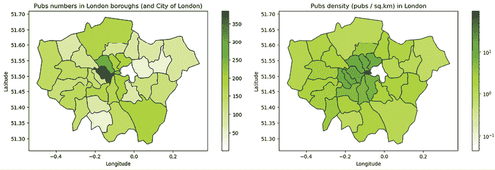

图 4.44：伦敦每个地区的酒吧数量（左侧）和对数刻度下的酒吧密度（右侧）

在与本节相关的笔记本中，“伦敦的咖啡或啤酒——你的选择！”（参见参考文献 11），我还展示了每个 Starbucks Voronoi 多边形区域的酒吧数量和酒吧密度。本节中展示的各种技术可能已经为您提供了分析和可视化地理空间数据的起始工具集。

# 摘要

在本章中，我们学习了如何处理地理信息和地图，如何操作几何数据（裁剪和合并多边形数据，聚类数据以生成细节较少的地图，以及从地理空间数据中移除子集），并在地图上叠加多个数据层。我们还学习了如何使用 `geopandas` 和自定义代码修改和提取 shapefile 中的信息，以及创建或计算地理空间特征，如地形面积或地理空间对象密度。此外，我们提取了可重用的函数并将它们分组到两个实用脚本中，这是 Kaggle 术语中的独立 Python 模块。这些实用脚本可以像任何其他库一样导入，并与您的笔记本代码集成。

在下一章中，我们将尝试使用一些地理空间分析的工具和技术，用于数据分析竞赛。

# 参考文献

1.  英格兰每家酒吧，Kaggle 数据集：[`www.kaggle.com/datasets/rtatman/every-pub-in-england`](https://www.kaggle.com/datasets/rtatman/every-pub-in-england)

1.  英格兰每家酒吧的数据探索，Kaggle 笔记本：[`github.com/PacktPublishing/Developing-Kaggle-Notebooks/blob/develop/Chapter-04/every-pub-in-england-data-exploration.ipynb`](https://github.com/PacktPublishing/Developing-Kaggle-Notebooks/blob/develop/Chapter-04/every-pub-in-england-data-exploration.ipynb)

1.  星巴克全球位置，Kaggle 数据集：[`www.kaggle.com/datasets/starbucks/store-locations`](https://www.kaggle.com/datasets/starbucks/store-locations)

1.  Open Postcode Geo，Kaggle 数据集：[`www.kaggle.com/datasets/danwinchester/open-postcode-geo`](https://www.kaggle.com/datasets/danwinchester/open-postcode-geo)

1.  英国 GADM 数据，Kaggle 数据集：[`www.kaggle.com/datasets/gpreda/gadm-data-for-uk`](https://www.kaggle.com/datasets/gpreda/gadm-data-for-uk)

1.  星巴克全球门店 – 数据探索，Kaggle 笔记本：[`github.com/PacktPublishing/Developing-Kaggle-Notebooks/blob/develop/Chapter-04/starbucks-location-worldwide-data-exploration.ipynb`](https://github.com/PacktPublishing/Developing-Kaggle-Notebooks/blob/develop/Chapter-04/starbucks-location-worldwide-data-exploration.ipynb)

1.  Leaflet 地图中的多边形叠加：[`stackoverflow.com/questions/59303421/polygon-overlay-in-leaflet-map`](https://stackoverflow.com/questions/59303421/polygon-overlay-in-leaflet-map)

1.  Geopandas 区域：[`geopandas.org/en/stable/docs/reference/api/geopandas.GeoSeries.area.html`](https://geopandas.org/en/stable/docs/reference/api/geopandas.GeoSeries.area.html)

1.  Scipy 空间 Voronoi – 提取 Voronoi 多边形并展示它们：[`docs.scipy.org/doc/scipy/reference/generated/scipy.spatial.Voronoi.html`](https://docs.scipy.org/doc/scipy/reference/generated/scipy.spatial.Voronoi.html)

1.  使用 GeoPandas 获取多边形面积：[`gis.stackexchange.com/questions/218450/getting-polygon-areas-using-geopandas`](https://gis.stackexchange.com/questions/218450/getting-polygon-areas-using-geopandas)

1.  在伦敦喝咖啡还是啤酒 – 你的选择！，Kaggle 笔记本：[`github.com/PacktPublishing/Developing-Kaggle-Notebooks/blob/develop/Chapter-04/coffee-or-beer-in-london-your-choice.ipynb`](https://github.com/PacktPublishing/Developing-Kaggle-Notebooks/blob/develop/Chapter-04/coffee-or-beer-in-london-your-choice.ipynb)

# 加入我们书籍的 Discord 空间

加入我们的 Discord 社区，与志同道合的人相聚，并在以下地点与超过 5000 名成员一起学习：

[`packt.link/kaggle`](https://packt.link/kaggle)


