# 第七章：文本分析一切所需

在本章中，我们将学习如何分析文本数据并创建机器学习模型来帮助我们。我们将使用*Jigsaw 无意中在毒性分类中的偏差*数据集（参见*参考文献 1*）。这个竞赛的目标是构建检测毒性和减少可能错误地与毒性评论相关联的少数族裔的不当偏见的模型。通过这个竞赛，我们引入了**自然语言处理**（**NLP**）领域。 

竞赛中使用的数据来源于由 Aja Bogdanoff 和 Christa Mrgan 于 2015 年创立的 Civil Comments 平台（参见*参考文献 2*），旨在解决在线讨论中的礼貌问题。当平台于 2017 年关闭时，他们选择保留约 200 万条评论，供研究人员理解并改善在线对话中的礼貌。Jigsaw 组织赞助了这项工作，并随后开始了一场语言毒性分类竞赛。在本章中，我们将把纯文本转换为有意义的、模型准备好的数字，以便根据评论的毒性将它们分类到不同的组别。

简而言之，本章将涵盖以下主题：

+   对*Jigsaw 无意中在毒性分类中的偏差*竞赛数据集的数据进行探索

+   介绍 NLP 特定的处理和分析技术，包括词频、分词、词性标注、命名实体识别和词嵌入

+   对文本数据的预处理进行迭代优化以准备模型基线

+   为这次文本分类竞赛创建一个模型基线

# 数据中有什么？

来自*Jigsaw 无意中在毒性分类中的偏差*竞赛数据集的数据包含训练集中的 180 万行和测试集中的 97,300 行。测试数据仅包含一个**评论**列，不包含目标（预测值）列。训练数据除了**评论**列外，还包括另外 43 列，包括目标特征。目标是介于 0 和 1 之间的数字，代表预测此竞赛的目标注释。此目标值表示评论的毒性程度（`0`表示零/无毒性，`1`表示最大毒性），其他 42 列是与评论中存在某些敏感主题相关的标志。主题与五个类别相关：种族和民族、性别、性取向、宗教和残疾。更详细地说，以下是每个类别的标志：

+   **种族和民族**：`亚洲人`、`黑人`、`犹太人`、`拉丁美洲人`、`其他种族或民族`和`白人`

+   **性别**：`女性`、`男性`、`跨性别`和`其他性别`

+   **性取向**：`双性恋`、`异性恋`、`同性恋/女同性恋`和`其他性取向`

+   **宗教**：`无神论者`、`佛教徒`、`基督徒`、`印度教徒`、`穆斯林`和`其他宗教`

+   **残疾**：`智力或学习障碍`、`其他残疾`、`身体残疾`和`精神或心理疾病`

还有一些特征（即数据集中的列）用于识别评论：`created_data`、`publication_id`、`parent_id`和`article_id`。还提供了与评论相关的一些用户反馈信息特征：`rating`、`funny`、`wow`、`sad`、`likes`、`disagree`和`sexual_explicit`。最后，还有两个与注释相关的字段：`identity_annotator_count`和`toxicity_annotator_count`。

让我们从对目标特征和敏感特征的快速分析开始。

## 目标特征

我们首先想看看目标特征的分布。让我们看看*图 7.1*中这些值的分布直方图：

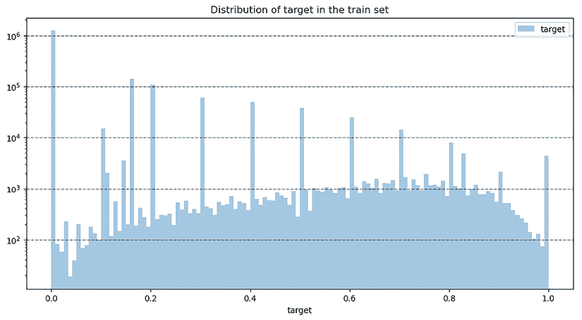

图 7.1：目标值分布（训练数据，190 万列）

对于这个直方图，我们在*Y*轴上使用了对数刻度；这样做的原因是我们想看到值向 0 的偏斜分布。当我们这样做时，我们观察到我们有一个双峰分布：峰值在约 0.1 的间隔处，振幅减小，并且出现频率较低，趋势缓慢上升，叠加。大部分的目标值（超过 100 万）都是`0`。

## 敏感特征

我们将查看之前列出的敏感特征的分布（种族和民族、性别、性取向、宗教和残疾）。由于分布的偏斜（与目标类似，我们在`0`处有集中），我们将在*Y*轴上再次使用对数刻度。

*图 7.2*展示了种族和民族特征值的分布。这些值看起来不连续且非常离散，直方图显示了几个分离的峰值：

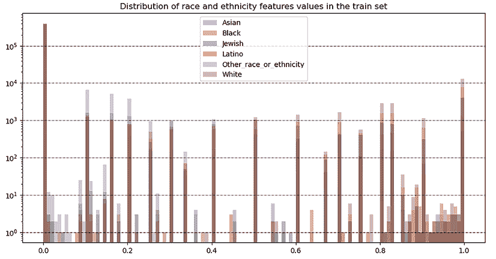

图 7.2：种族和民族特征值的分布

我们可以在*图 7.3*中观察到性别特征值有类似的分布：

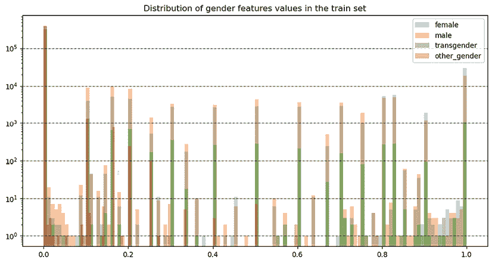

图 7.3：性别特征值分布

在*图 7.4*中，我们展示了额外毒性特征值（`severe_toxicity`、`obscene`、`identity_attack`、`insult`或`threat`）的分布。如您所见，分布更加均匀，并且`insult`有增加的趋势：

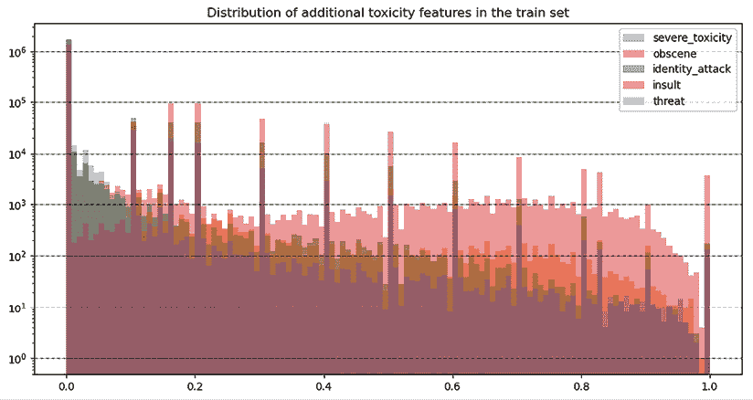

图 7.4：额外毒性特征值的分布

让我们也看看目标值与种族或民族、性别、性取向、宗教和残疾特征值之间的相关性。我们在此不展示所有特征的相关矩阵，但您可以在与本章节相关的笔记本中检查它。在这里，我们只展示了与目标相关的第一个 16 个特征，按相关性因素排序：

```py
train_corr['target'].sort_values(ascending=False)[1:16] 
```

让我们看看*图 7.5*中按相关性因素与目标排序的前 15 个特征：


图 7.5：其他特征与目标特征的前 15 个相关因素

接下来，在*图 7.6*中，我们展示了这些选定特征与目标特征之间的相关矩阵：

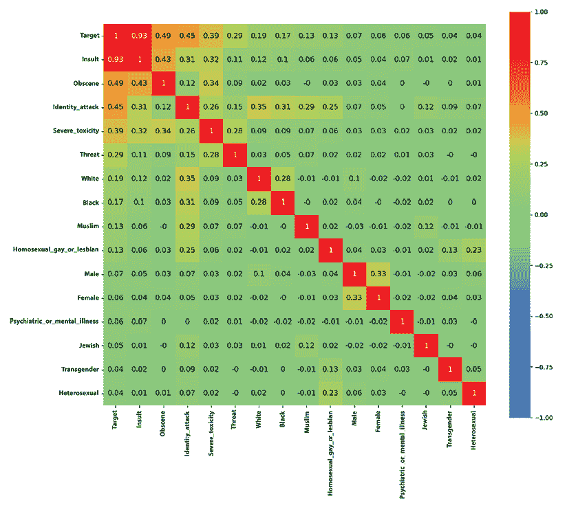

图 7.6：目标与相关性最高的 15 个特征之间的相关矩阵

我们可以观察到`target`与`insult`（0.93）、`obscene`（0.49）和`identity_attack`（0.45）高度相关。此外，`severe_toxicity`与`insult`和`obscene`呈正相关。`identity_attack`与`white`、`black`、`muslim`和`homosexual_gay_or_lesbian`有轻微的相关性。

我们研究了`target`特征（预测特征）和敏感特征的分布。现在我们将转向本章分析的主要主题：评论文本。我们将应用几种 NLP 特定的分析技术。

# 分析评论文本

NLP 是人工智能的一个领域，它涉及使用计算技术使计算机能够理解、解释、转换甚至生成人类语言。NLP 使用多种技术、算法和模型来处理和分析大量文本数据集。在这些技术中，我们可以提到：

+   **分词**：将文本分解成更小的单元，如单词、词的一部分或字符

+   **词形还原或词干提取**：将单词还原为词典形式或去除最后几个字符以得到一个共同形式（词干）

+   **词性标注**（**POS**）**标记**：将语法类别（例如，名词、动词、专有名词和形容词）分配给序列中的每个单词

+   **命名实体识别**（**NER**）：识别和分类实体（例如，人名、组织名和地名）

+   **词嵌入**：使用高维空间来表示单词，在这个空间中，每个单词的位置由其与其他单词的关系决定

+   **机器学习模型**：在标注数据集上训练模型以学习语言数据中的模式和关系

NLP 应用可以包括情感分析、机器翻译、问答、文本摘要和文本分类。

在对 NLP 进行快速介绍之后，让我们检查实际的评论文本。我们将构建几个词云图（使用整个数据集的 20,000 条评论子集）。我们首先查看整体单词分布（参见本章相关的笔记本），然后查看目标值高于 0.75 和低于 0.25 的单词分布：

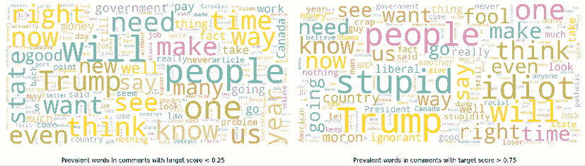

图 7.7：低目标分数<0.25（左）和高目标分数>0.75（右）的评论中的常见单词（1-gram）

`目标`与`侮辱`高度相关，我们预计在两个特征的词云中会看到相当接近的单词分布。这一假设得到了证实，*图 7.8*很好地说明了这一点（无论是低分还是高分）：

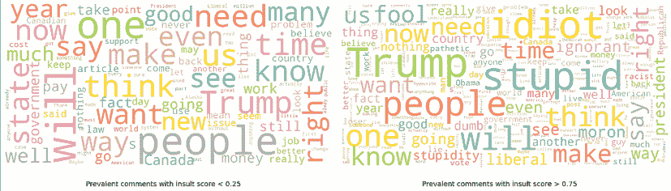

图 7.8：低侮辱分数<0.25（左）和高侮辱分数>0.75（右）的评论中的常见单词（1-gram）

如您所见，分布显示了**目标**和**侮辱**的低分和高分中高频相似单词。

在相关的笔记本中还有更多关于`威胁`、`淫秽`和其他特征的词云。这些词云为我们提供了对最频繁单词的良好初始直觉。我们将在*构建词汇表*和*检查词汇覆盖范围*部分对整个语料库词汇中的单词频率进行更详细的分析。目前，我们可以观察到，我们进行的分析仅限于单个单词的频率，而没有捕捉到这些单词在整个语料库中的分组情况——换句话说，各种单词是如何一起使用的，以及基于此，如何识别语料库中的主要主题。这种旨在揭示整个语料库潜在语义结构的处理称为**主题建模**。在此方法中，对单词共现模式的分析使我们能够揭示文本中存在的潜在主题。

相关笔记本中主题建模实现灵感的来源是一系列关于使用潜在狄利克雷分配进行主题建模的文章和教程（见*参考文献*5-10）。

## 主题建模

我们首先通过预处理评论文本，使用`gensim`库来消除特殊字符、常用词、连接词（或停用词）以及长度小于 2 的单词：

```py
def preprocess(text):
    result = []
    for token in gensim.utils.simple_preprocess(text):
        if token not in gensim.parsing.preprocessing.STOPWORDS and len(token) > 2:
            result.append(token)
    return result 
```

以下代码将定义的`preprocess`函数应用于所有评论：

```py
%%time
preprocessed_comments = train_subsample['comment_text'].map(preprocess) 
```

然后，我们使用`gensim`/`corpora`中的`dictionary`创建一个单词字典。我们还过滤极端值，以消除不常见的单词并限制词汇表的大小：

```py
%%time
dictionary = gensim.corpora.Dictionary(preprocessed_comments)
dictionary.filter_extremes(no_below=10, no_above=0.5, keep_n=75000) 
```

在这些限制下，我们接下来生成一个从字典中生成的*词袋*（`bow`）语料库。然后，我们对这个语料库应用**TF-IDF**（**词频-逆文档频率**），它为文档在文档集合或语料库中的重要性提供了一个数值表示。

`tf`组件衡量一个单词在文档中出现的频率。`idf`组件显示一个单词在整个文档语料库中的重要性（在我们的案例中，是整个评论集合）。这个因素随着一个术语在文档中出现的频率增加而降低。因此，在`tfidf`转换之后，一个单词和一个文档的系数对于在语料库级别不常见但在当前文档中频率较高的单词来说更大：

```py
%%time
bow_corpus = [dictionary.doc2bow(doc) for doc in preprocessed_comments]
tfidf = models.TfidfModel(bow_corpus)
corpus_tfidf = tfidf[bow_corpus] 
```

然后，我们应用*潜在狄利克雷分配*（`lda`），这是一种基于该语料库中单词频率生成主题的主题模型，使用`gensim`的并行处理实现（`LdaMulticore`）：

```py
%%time
lda_model = gensim.models.LdaMulticore(corpus_tfidf, num_topics=20,
                                    id2word=dictionary, passes=2, workers=2) 
```

让我们用 5 个单词来表示前 10 个主题：

```py
topics = lda_model.print_topics(num_words=5)
for i, topic in enumerate(topics[:10]):
    print("Train topic {}: {}".format(i, topic)) 
```

主题单词以与主题相关的相对权重显示，如下所示：

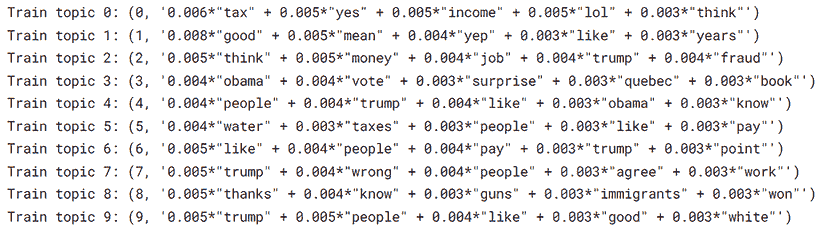

图 7.9：前 10 个主题，每个主题选择 5 个（最相关）单词

一旦我们提取了主题，我们就可以遍历文档并识别当前文档（在我们的案例中，是评论）中包含哪些主题。在*图 7.10*中，我们展示了单个文档的占主导地位的主题（以及相对权重）（以下是用以生成选定评论的主题列表的代码）：

```py
for index, score in sorted(lda_model[bd5], key=lambda tup: -1*tup[1]):
    print("\nScore: {}\t \nTopic: {}".format(score, lda_model.print_topic(index, 5))) 
```

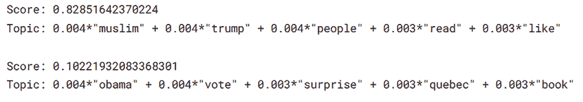

图 7.10：与一个评论相关联（每个都有相对重要性）的主题

我们更喜欢使用**pyLDAvis**可视化工具来表示主题。在*图 7.11*中，我们展示了该工具的屏幕截图（在笔记本中，我们为训练数据生成了 20 个主题，并为测试数据单独生成了主题）。*图 7.11*中的仪表板显示了**主题间距离图**。在这里，主题的相对维度（或影响力）由圆盘的大小表示，主题的相对距离由它们的相互距离表示。在右侧，对于当前选定的主题（在左侧面板中），我们可以看到每个主题前 30 个最相关的术语。

色彩较浅的圆盘（笔记本中的蓝色）代表整体单词频率。颜色较深的圆盘（笔记本中的红色）代表所选主题内的估计单词频率。我们可以使用滑块来调整相关性指标（在图片中，这设置为`1`）。我们可以通过改进预处理步骤（例如，我们可以添加更多特定于该语料库的停用词）、调整字典形成的参数以及控制`tfidf`和`lda`的参数来进一步细化此分析。由于 LDA 过程的复杂性，我们还通过从训练数据中子采样来减小语料库的大小。

如以下屏幕截图所示，在 pyLDAvis 工具生成的主题建模仪表板的左侧面板中，我们看到**主题间距离图**——在语料库中主题影响力的相对维度和相对主题的距离：

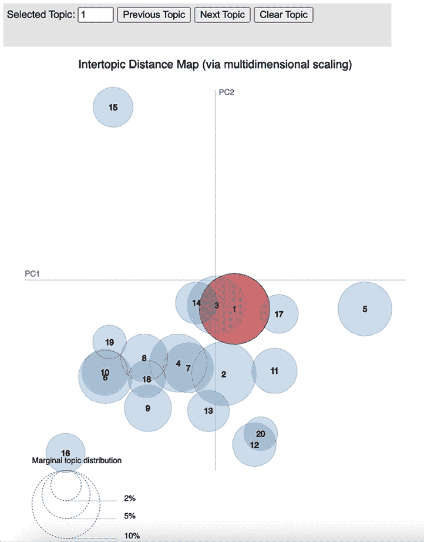

图 7.11：使用 pyLDAvis 工具生成的主题建模仪表板（左侧面板）

在使用 pyLDAvis 工具生成的主题建模仪表板的右侧面板中，对于选定的主题，我们可以看到每个主题中最相关的 30 个术语，蓝色代表语料库中的整体词频，红色代表所选主题内的估计词频：

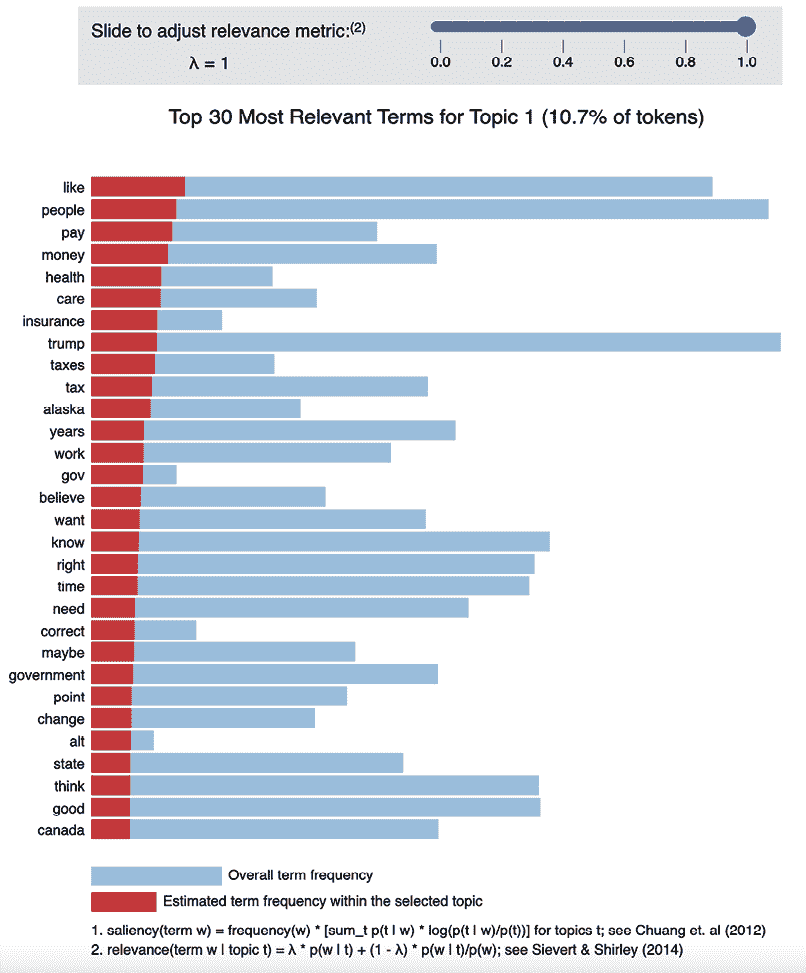

图 7.12：使用 pyLDAvis 工具生成的主题建模仪表板（右侧面板）

我们可以对整个语料库进行重复分析，但这将需要比 Kaggle 上可用的计算资源更多的资源。

通过以上内容，我们已经使用`lda`方法探索了评论文本语料库中的主题。通过这个程序，我们揭示了文本语料库中的一个隐藏（或潜在）结构。现在我们可以更好地理解不仅单词的频率，而且单词在评论中的关联方式，从而形成评论者讨论的主题。让我们继续从不同的角度探索语料库。我们将对每个评论进行分析，使用 NER 来确定文本中存在哪些类型的概念。然后，我们将开始关注句法元素，并使用 POS 标记来提取名词、动词、形容词和其他词性。

我们回顾这些 NLP 技术的原因有两个。首先，我们希望让你一窥 NLP 中可用的工具和技术之丰富。其次，对于更复杂的机器学习模型，你可以包括使用这些方法导出的特征。例如，除了从文本中提取的其他特征外，你还可以添加通过 NER 或 POS 标记获得的特征。

## 命名实体识别

让我们在一组评论上执行 NER。NER 是一种信息提取任务，旨在识别和提取非结构化数据（文本）中的命名实体。命名实体包括人名、组织、地理位置、日期和时间、数量和货币。有几种可用的方法来识别和提取命名实体，其中最常用的是`spacy`和`transformers`。在我们的案例中，我们将使用`spacy`来执行 NER。我们更喜欢`spacy`，因为它与 transformers 相比需要的资源更少，但仍然能给出良好的结果。在此需要注意的是，`spacy`也支持包括英语、葡萄牙语、西班牙语、俄语和中文在内的 23 种语言。

首先，我们使用`spacy.load`函数初始化一个`nlp`对象：

```py
import spacy
nlp = spacy.load('en_core_web_sm') 
```

这将加载`'en_core_web_sm'`（`sm`代表小型）`spacy`管道，该管道包括`tok2vec`、`tagger`、`parser`、`senter`、`ner`、`attribute_ruler`和`lemmatizer`组件。我们不会使用此管道提供的所有功能；我们感兴趣的是`nlp`组件。

然后，我们创建了一个评论选择。我们筛选出包含名称 `奥巴马` 或 `特朗普` 且字符数少于 100 的文档。出于演示目的，我们不希望操作大型句子；如果我们使用较小的句子进行操作，将更容易跟随演示。下一个代码片段将执行选择：

```py
selected_text = train.loc[train['comment_text'].str.contains("Trump") | train['comment_text'].str.contains("Obama")] 
selected_text["len"] = selected_text['comment_text'].apply(lambda x: len(x))
selected_text = selected_text.loc[selected_text.len < 100]
selected_text.shape 
```

我们可以通过两种方式可视化应用 NER 的结果。一种方式是打印出文本中每个识别实体的起始和结束字符以及实体标签。另一种方式是使用来自 `spacy` 的 `displacy` 渲染，它将为每个实体添加选定的颜色，并在实体文本旁边添加实体名称（见 *图 7.13*）。

以下代码用于使用 `nlp` 提取实体以及使用 `displacy` 准备可视化。在显示使用 `displacy` 注释的文本之前，我们打印出每个实体文本，然后是其位置（起始和结束字符位置）和实体标签：

```py
for sentence in selected_text["comment_text"].head(5):
    print("\n")
    doc = nlp(sentence)
    for ent in doc.ents:
        print(ent.text, ent.start_char, ent.end_char, ent.label_)
    displacy.render(doc, style="ent",jupyter=True) 
```

`spacy` `nlp` 中预定义了多个标签。我们可以用一段简单的代码提取每个标签的含义：

```py
import spacy
nlp = spacy.load("en_core_web_sm")
labels = nlp.get_pipe("ner").labels
for label in labels:
    print(f"{label} - {spacy.explain(label)}") 
```

这里是标签列表及其含义：

+   **CARDINAL**: 不属于其他类型的数字

+   **DATE**: 绝对或相对日期或时间段

+   **EVENT**: 命名的飓风、战役、战争、体育赛事等

+   **FAC**: 建筑物、机场、高速公路、桥梁等

+   **GPE**: 国家、城市或州

+   **LANGUAGE**: 任何命名语言

+   **LAW**: 被制成法律的命名文件

+   **LOC**: 非 GPE 地点、山脉或水体

+   **MONEY**: 货币价值，包括单位

+   **NORP**: 国籍或宗教或政治团体

+   **ORDINAL**: `第一`、`第二`等

+   **ORG**: 公司、机构、机构等

+   **PERCENT**: 百分比，包括 `%`

+   **PERSON**: 人，包括虚构人物

+   **PRODUCT**: 物体、车辆、食品等（不包括服务）

+   **QUANTITY**: 重量或距离等度量

+   **TIME**: 低于一天的时间

+   **WORK_OF_ART**: 书籍、歌曲等的标题

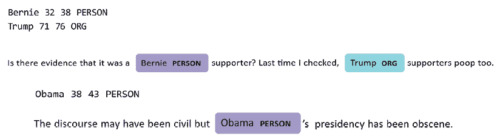

图 7.13：使用 spacy 和 displacy 进行 NER 结果的可视化

在前面的截图顶部示例中，Bernie（Sanders）被正确识别为人物（**PERSON**），而（Donald）Trump 被识别为组织（**ORG**）。这可能是因为前总统 Trump 在作为商人时，经常将他的名字作为他创立的几个组织的名称的一部分。

在底部示例中，奥巴马（也是一位前总统，在争议性政治辩论中经常成为话题）被正确识别为**人物**。在两种情况下，我们还展示了提取的实体列表，包括每个识别实体的起始和结束位置。

## 词性标注

通过 NER 分析，我们识别了各种实体（如人、组织、地点等）的特定名称。这些帮助我们将各种术语与特定的语义组关联起来。我们可以进一步探索评论文本，以便了解每个单词的 POS（如名词或动词），并理解每个短语的句法。

让我们首先使用`nltk`（一个替代的`nlp`库）从我们在 NER 实验中使用的相同短语小集中提取词性。我们在这里选择`nltk`是因为，除了比 spacy 更节省资源外，它还提供了高质量的结果。我们还想能够比较两者的结果（`spacy`和`nltk`）：

```py
for sentence in selected_text["comment_text"].head(5):
    print("\n")
    tokens = twt().tokenize(sentence)
    tags = nltk.pos_tag(tokens, tagset = "universal")
    for tag in tags:
        print(tag, end=" ") 
```

结果将如下所示：

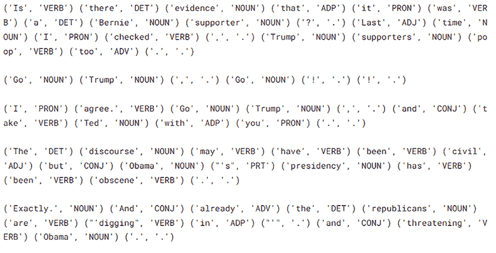

图 7.14：使用 nltk 进行 POS 标记

我们也可以使用 spacy 执行相同的分析：

```py
for sentence in selected_text["comment_text"].head(5):
    print("\n")
    doc = nlp(sentence)
    for token in doc:
        print(token.text, token.pos_, token.ent_type_, end=" | ") 
```

结果将如下所示：

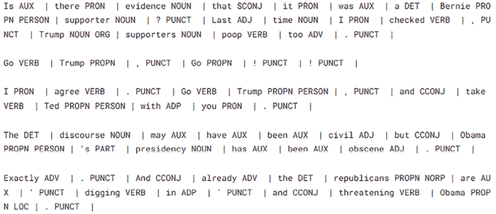

图 7.15：使用 spacy 进行 POS 标记

让我们比较一下*图 7.14*和*图 7.15*中的两个输出。这两个库生成的 POS 结果略有不同。其中一些差异是由于实际词性在类别上的映射不同。对于`nltk`，单词“is”代表一个`AUX`（辅助），而`spacy`中的相同“is”则是一个动词。`spacy`区分专有名词（人名、地名等）和普通名词（`NOUN`），而`nltk`则不进行区分。

对于一些具有非标准结构的短语，两个输出都将动词“Go”错误地识别为名词（`nltk`）和专有名词（`spacy`）。在`spacy`的情况下，这是可以预料的，因为“Go”在逗号后面被大写。spacy 区分了并列连词（**CCONJ**）和从属连词（**SCONJ**），而`nltk`只会识别出存在连词（**CONJ**）。

使用与我们在前一小节中用于突出 NER 的相同 spacy 库扩展，我们也可以表示短语和段落的句法结构。在*图 7.16*中，我们展示了一个这样的表示示例。在笔记本中，我们使用带有“dep”（依存）标志的`displacy`展示了所有注释（短语集）的可视化。

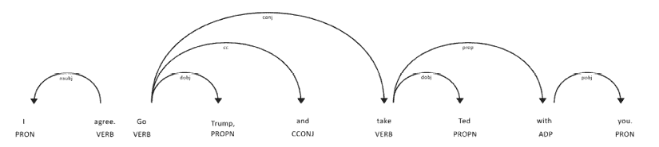

图 7.16：使用 spacy 进行 POS 标记，并使用依存关系显示词性之间的短语结构

我们看到了如何使用依存关系来显示实体及其各自的类别，以及如何使用相同的函数来显示词性和短语结构。从*参考文献 11*中汲取灵感，我们扩展了那里给出的代码示例（并从使用`nltk`转换为使用`spacy`进行 POS 提取，因为 nltk 与 spacy 不完全兼容）以便我们可以以与表示命名实体相同的方式显示词性。

这里给出了从*参考文献 11*修改后的代码（代码解释将在代码块之后进行）：

```py
import re
def visualize_pos(sentence):
    colors = {"PRON": "blueviolet",
              "VERB": "lightpink",
              "NOUN": "turquoise",
              "PROPN": "lightgreen",
              "ADJ" : "lime",
              "ADP" : "khaki",
              "ADV" : "orange",
              "AUX" : "gold",
              "CONJ" : "cornflowerblue",
              "CCONJ" : "magenta",
              "SCONJ" : "lightmagenta",
              "DET" : "forestgreen",
              "NUM" : "salmon",
              "PRT" : "yellow",
              "PUNCT": "lightgrey"}

    pos_tags = ["PRON", "VERB", "NOUN", "PROPN", "ADJ", "ADP",
                "ADV", "AUX", "CONJ", "CCONJ", "SCONJ",  "DET", "NUM", "PRT", "PUNCT"]

    # Fix for issues in the original code
    sentence = sentence.replace(".", " .")
    sentence = sentence.replace("'", "")
    # Replace nltk tokenizer with spacy tokenizer and POS tagging
    doc = nlp(sentence)
    tags = []
    for token in doc:
        tags.append((token.text, token.pos_))

    # Get start and end index (span) for each token
    span_generator = twt().span_tokenize(sentence)
    spans = [span for span in span_generator]
    # Create dictionary with start index, end index, 
# pos_tag for each token
    ents = []
    for tag, span in zip(tags, spans):
        if tag[1] in pos_tags:
            ents.append({"start" : span[0], 
                         "end" : span[1], 
                         "label" : tag[1] })
    doc = {"text" : sentence, "ents" : ents}
    options = {"ents" : pos_tags, "colors" : colors}

    displacy.render(doc, 
                    style = "ent", 
                    options = options, 
                    manual = True,
                   ) 
```

让我们更好地理解前面的代码。在`visualise_pos`函数中，我们首先定义了词性与颜色之间的映射（词性如何被突出显示）。然后，我们定义了我们将考虑的词性。接着，我们使用一些特殊字符的替换来纠正原始代码（来自*参考文献 11*）中存在的一个错误。我们还使用 spacy 分词器，并在`tags`列表中添加了使用`nlp`从`spacy`提取的每个`pos`的文本和词性。然后，我们计算每个`pos`的位置，并创建一个字典，包含`pos`标记和它们在文本中的位置，以便能够用不同的颜色突出显示它们。最后，我们使用`displacy`渲染所有突出显示的`pos`的文档。

在*图 7.17*中，我们展示了将此程序应用于我们的样本评论的结果。现在我们可以更容易地看到 spacy 的一些错误。在第二条评论中，它错误地将第二个“Go”解释为专有名词（**PROPN**）。这在某种程度上是可以解释的，因为通常在逗号之后，只有专有名词才会用大写字母书写。

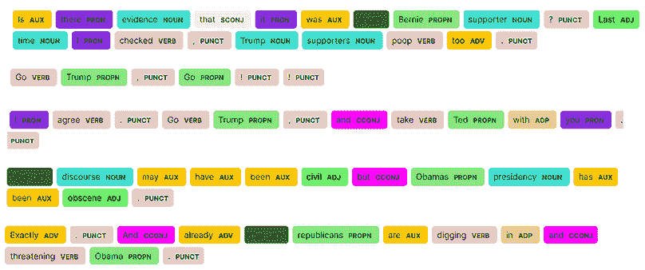

图 7.17：使用 spacy 进行词性标注和依赖关系，并使用从参考文献 8 修改的程序来在文本中突出显示词性

我们还可以观察到其他错误。在第一条评论中，“Trump”被标记为**名词**——即一个简单的名词。术语“republicans”被分类为**PROPN**，这在美国政治背景下可能是准确的，因为在美国政治中，“Republicans”被视为专有名词。然而，在我们的上下文中，这是不准确的，因为它代表了一个复数形式的简单名词，指代一群倡导共和政府的人。

我们回顾了几种自然语言处理（NLP）技术，这些技术帮助我们更好地理解文本中存在的词语分布、主题、词性（POS）和概念。可选地，我们也可以使用这些技术来生成特征，以便包含在机器学习模型中。

在下一节中，我们将开始分析，目的是为评论分类准备一个监督式 NLP 模型。

# 准备模型

模型准备，根据我们将要实施的方法，可能更复杂或更简单。在我们的情况下，我们选择从简单的深度学习架构开始构建第一个基线模型（这是比赛时的标准方法），包括一个词嵌入层（使用预训练的词嵌入）和一个或多个双向长短期记忆（LSTM）层。这种架构在这次比赛发生时是一个常见的选择，对于文本分类问题的基线来说仍然是一个好的选择。**LSTM**代表**长短期记忆**。它是一种循环神经网络架构，旨在捕捉和记住序列数据中的长期依赖关系。它特别适用于文本分类问题，因为它能够处理和模拟文本序列中的复杂关系和依赖关系。

为了做到这一点，我们需要对评论数据进行一些预处理（在准备构建主题建模模型时我们也进行了预处理）。这次，我们将逐步执行预处理步骤，并监控这些步骤如何影响结果，不是模型的结果，而是表现良好的语言模型的一个先决条件，即词嵌入的词汇覆盖范围。

然后，我们将使用第一个基线模型中的词嵌入来扩展我们模型的泛化能力，以便不在训练集中但在测试集中的单词能够从存在于词嵌入中的单词的邻近性中受益。最后，为了确保我们的方法有效，我们需要预训练的词嵌入具有尽可能大的词汇覆盖范围。因此，我们还将测量词汇覆盖范围并建议改进它的方法。

现在，我们首先构建初始词汇表。

## 构建词汇表

我们之前使用单词频率、与目标值相关的单词分布以及其他特征、主题建模、命名实体识别（NER）和词性标注（POS tagging）对整个评论语料库的一个子集进行了实验。在接下来的实验中，我们将开始使用整个数据集。我们将使用具有 300 个嵌入大小的词嵌入。

词嵌入是单词的数值表示。它们将单词映射到向量。嵌入大小指的是这些向量的组成部分（或维度）的数量。这个过程使计算机能够理解和比较单词之间的关系。因为所有单词首先都使用词嵌入进行转换（在词嵌入空间中，单词之间的关系由向量之间的关系表示），所以具有相似意义的单词将在词嵌入空间中由对齐的向量表示。

在测试时，新词，不在训练数据中出现的词，也将被表示在词嵌入空间中，并且算法将利用它们与训练数据中存在的其他词的关系。这将增强我们用于文本分类的算法。

此外，我们将字符数（或注释长度）设置为固定值；我们选择了 220 这个维度。对于较短的注释，我们将填充注释序列（即添加空格），而对于较长的注释序列，我们将截断它们（到 220 个字符）。这个程序将确保我们会有相同维度的机器学习模型的输入。让我们首先定义一个用于构建词汇表的函数。在构建这些函数时，我们使用了来自*参考文献 12*和*13*的来源。

以下代码用于构建词汇表（即注释中存在的单词的语料库）。我们对每个注释进行分割，并将所有数据收集到一个句子列表中。然后我们解析所有这些句子以创建一个包含词汇的字典。每次解析到的单词如果在字典中作为键存在，我们就增加与该键关联的值。我们得到的是一个包含词汇表中每个单词计数（或总体频率）的词汇表字典：

```py
def build_vocabulary(texts):
    """
    Build the vocabulary from the corpus
    Credits to: [9] [10]
    Args:
        texts: list of list of words
    Returns:
        dictionary of words and their count
    """
    sentences = texts.apply(lambda x: x.split()).values
    vocab = {}
    for sentence in tqdm(sentences):
        for word in sentence:
            try:
                vocab[word] += 1
except KeyError:
                vocab[word] = 1
return vocab 
```

我们通过连接`train`和`test`创建整体词汇表：

```py
# populate the vocabulary
df = pd.concat([train ,test], sort=False)
vocabulary = build_vocabulary(df['comment_text']) 
```

我们可以检查词汇表中的前 10 个元素，以了解这个词汇表的样子：

```py
# display the first 10 elements and their count
print({k: vocabulary[k] for k in list(vocabulary)[:10]}) 
```

以下图像显示了运行前面代码的结果。它显示了文本中最常用的单词。正如预期的那样，最常用的单词是英语中最常用的一些单词。

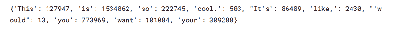

图 7.18：未经任何预处理的词汇表 – 大写和小写单词，以及可能拼写错误的表达

我们将在每次执行额外的（有时重复的）文本转换时重复使用之前引入的`build_vocabulary`函数。我们执行连续的文本转换，以确保在使用预训练的词嵌入时，我们对注释中词汇表的预训练词嵌入中的单词有良好的覆盖。更大的覆盖范围将确保我们构建的模型有更高的准确性。让我们继续加载一些预训练的词嵌入。

## 嵌入索引和嵌入矩阵

我们现在将构建一个字典，以词嵌入中的单词作为键，以它们的嵌入表示的数组作为值。我们称这个字典为嵌入索引。然后我们也将构建嵌入矩阵，它是嵌入的矩阵表示。我们将使用 GloVe 的预训练嵌入（300 维）进行我们的实验。**GloVe**代表**全局词表示向量**，是一种无监督算法，它产生词嵌入。它通过分析非常大的文本语料库中的全局文本统计来创建向量表示，并捕捉单词之间的语义关系。

以下代码加载预训练的词嵌入：

```py
def load_embeddings(file):
    """
    Load the embeddings
    Credits to: [9] [10]
    Args:
        file: embeddings file
    Returns:
        embedding index
    """
def get_coefs(word,*arr): 
        return word, np.asarray(arr, dtype='float32')
    embeddings_index = dict(get_coefs(*o.split(" ")) for o in open(file, encoding='latin'))
    return embeddings_index
%%time
GLOVE_PATH = '../input/glove840b300dtxt/'
print("Extracting GloVe embedding started")
embed_glove = load_embeddings(os.path.join(GLOVE_PATH,'glove.840B.300d.txt'))
print("Embedding completed") 
```

获得的嵌入结构大小为 2.19 百万项。接下来，我们将使用我们刚刚创建的词索引和嵌入索引来创建嵌入矩阵：

```py
def embedding_matrix(word_index, embeddings_index):
    '''
    Create the embedding matrix
    credits to: [9] [10] 
    Args:
        word_index: word index (from vocabulary)
        embedding_index: embedding index (from embeddings file)
    Returns:
        embedding matrix
    '''
    all_embs = np.stack(embeddings_index.values())
    emb_mean, emb_std = all_embs.mean(), all_embs.std()
    EMBED_SIZE = all_embs.shape[1]
    nb_words = min(MAX_FEATURES, len(word_index))
    embedding_matrix = np.random.normal(emb_mean, emb_std, (nb_words, EMBED_SIZE))
    for word, i in tqdm(word_index.items()):
        if i >= MAX_FEATURES:
            continue
        embedding_vector = embeddings_index.get(word)
        if embedding_vector is not None:
            embedding_matrix[i] = embedding_vector
    return embedding_matrix 
```

我们使用`MAX_FEATURES`参数来限制嵌入矩阵的维度。

## 检查词汇覆盖率

我们介绍了读取词嵌入和计算嵌入矩阵的功能。现在我们将继续介绍用于评估词嵌入中词汇覆盖率的函数。词汇覆盖率越大，我们构建的模型精度越好。

为了检查嵌入对词汇的覆盖率，我们将使用以下函数：

```py
def check_coverage(vocab, embeddings_index):
    '''
    Check the vocabulary coverage by the embedding terms
    credits to: [9] [10]
    Args:
        vocab: vocabulary
        embedding_index: embedding index (from embeddings file)
    Returns:
        list of unknown words; also prints the vocabulary coverage of embeddings and 
        the % of comments text covered by the embeddings
    '''
    known_words = {}
    unknown_words = {}
    nb_known_words = 0
    nb_unknown_words = 0
for word in tqdm(vocab.keys()):
        try:
            known_words[word] = embeddings_index[word]
            nb_known_words += vocab[word]
        except:
            unknown_words[word] = vocab[word]
            nb_unknown_words += vocab[word]
            pass
print('Found embeddings for {:.3%} of vocabulary'.format(len(known_words)/len(vocab)))
    print('Found embeddings for {:.3%} of all text'.format(nb_known_words/(nb_known_words + nb_unknown_words)))
    unknown_words = sorted(unknown_words.items(), key=operator.itemgetter(1))[::-1]
    return unknown_words 
```

上述代码遍历所有词汇项（即评论文本中存在的单词）并计算未知单词（即文本中但不在嵌入单词列表中的单词）。然后，它计算词汇中存在于词嵌入索引中的单词百分比。这个百分比以两种方式计算：对词汇中的每个单词进行无权重计算，以及根据文本中的单词频率进行加权计算。

我们将反复应用此函数，在每个预处理步骤之后检查词汇覆盖率。让我们从检查初始词汇的词汇覆盖率开始，此时我们还没有对评论文本进行任何预处理。

## 逐步提高词汇覆盖率

我们应用`check_coverage`函数来检查词汇覆盖率，传递两个参数：词汇和嵌入矩阵。在以下符号中，**oov**代表**词汇外**：

```py
print("Verify the initial vocabulary coverage")
oov_glove = check_coverage(vocabulary, embed_glove) 
```

第一次迭代的成果并不理想。尽管我们覆盖了几乎 90%的文本，但词汇表中只有 15.5%的单词被词嵌入覆盖：

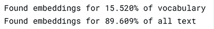

图 7.19：词汇覆盖率 – 第一次迭代

我们还可以查看未覆盖术语的列表。因为在`oov_glove`中，我们按在语料库中出现的次数降序存储了未覆盖的术语，因此，通过选择此列表中的前几个术语，我们可以看到未包含在词嵌入中的最重要的单词。在*图 7.20*中，我们显示了此列表中的前 10 个术语——前 10 个未覆盖的单词。在这里，“未覆盖”指的是出现在词汇表中的单词（存在于评论文本中），但不在词嵌入索引中（不在预训练的词嵌入中）：

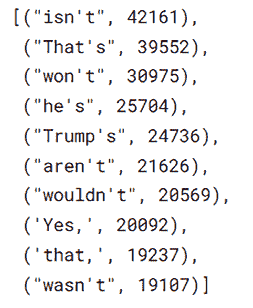

图 7.20：第一轮迭代中，词汇表中未覆盖的词汇中最常见的 10 个单词

通过快速检查*图 7.20*中的列表，我们看到一些常用词要么是缩写词，要么是非标准口语英语的口语化形式。在网上评论中看到这样的形式是正常的。我们将执行几个预处理步骤，试图通过纠正我们发现的问题来提高词汇覆盖率。在每一步之后，我们还将再次测量词汇覆盖率。

### 转换为小写

我们将首先将所有文本转换为小写，并将其添加到词汇表中。在词嵌入中，单词将全部为小写：

```py
def add_lower(embedding, vocab):
    '''
    Add lower case words
    credits to: [9] [10]
    Args:
        embedding: embedding matrix
        vocab: vocabulary
    Returns:
        None
        modify the embeddings to include the lower case from vocabulary
    '''
    count = 0
for word in tqdm(vocab):
        if word in embedding and word.lower() not in embedding:  
            embedding[word.lower()] = embedding[word]
            count += 1
print(f"Added {count} words to embedding") 
```

我们将此小写转换应用于训练集和测试集，然后我们重新构建词汇表并计算词汇覆盖率：

```py
train['comment_text'] = train['comment_text'].apply(lambda x: x.lower())
test['comment_text'] = test['comment_text'].apply(lambda x: x.lower())
print("Check coverage for vocabulary with lower case")
oov_glove = check_coverage(vocabulary, embed_glove)
add_lower(embed_glove, vocabulary) # operates on the same vocabulary
oov_glove = check_coverage(vocabulary, embed_glove) 
```

*图 7.21*显示了应用小写转换后新的词汇覆盖率：

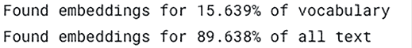

图 7.21：词汇覆盖率——第二次迭代，所有单词的小写

我们可以在单词百分比和文本百分比覆盖率上观察到一些小的改进。让我们继续通过从注释文本中移除缩写词来继续操作。

### 移除缩写词

接下来，我们将移除缩写词。这些是单词和表达式的修改形式。我们将使用一个预定义的通常遇到的缩写词字典。这些将映射到存在于嵌入中的单词上。由于空间有限，我们在这里只包括缩写词字典中的一些项目示例，但整个资源可以在与本章相关的笔记本中找到：

```py
contraction_mapping = {"ain't": "is not", "aren't": "are not","can't": "cannot", "'cause": "because", "could've": "could have", "couldn't": "could not", "didn't": "did not",  "doesn't": "does not", "don't": "do not", "hadn't": "had not", "hasn't": "has not",
...
} 
```

使用以下函数，我们可以获取 GloVe 嵌入中已知缩写词的列表：

```py
def known_contractions(embed):
    '''
    Add know contractions
    credits to: [9] [10]
    Args:
        embed: embedding matrix
    Returns:
        known contractions (from embeddings)
    '''
    known = []
    for contract in tqdm(contraction_mapping):
        if contract in embed:
            known.append(contract)
    return known 
```

我们可以使用下一个函数从词汇表中清除已知的缩写词——即，使用缩写词字典来替换它们：

```py
def clean_contractions(text, mapping):
    '''
    Clean the contractions

    credits to: [9] [10]
    Args:
        text: current text
        mapping: contraction mappings
    Returns: modify the comments to use the base form from contraction mapping
    '''
    specials = ["’", "‘", "´", "`"]
    for s in specials:
        text = text.replace(s, "'")
    text = ' '.join([mapping[t] if t in mapping else t for t in text.split(" ")])
    return text 
```

在我们对训练集和测试集应用`clean_contractions`并再次应用构建词汇表和测量词汇覆盖率的函数后，我们得到了关于词汇覆盖率的新统计数据：


图 7.22：词汇覆盖率——第三轮迭代，使用缩写词字典替换缩写词后的结果

通过检查没有覆盖的表达式并增强它，使其等于语料库中未覆盖的表达式与单词或单词组相等，可以进一步细化缩写字典。每个单词都表示在嵌入向量中。

### 移除标点和特殊字符

接下来，我们将移除标点和特殊字符。以下列表和函数对此步骤很有用。首先，我们列出未知标点：

```py
punct_mapping = "/-'?!.,#$%\'()*+-/:;<=>@[\\]^_`{|}~" + '""“”’' + '∞θ÷α•à−βø³π'₹´°£€\×™√²—–&'
punct_mapping += '©^®` <→°€™' ♥←ק″′Â█½à…"✶"–●â►−¢²¬░¶↑±¿▾═¦║―¥▓—'─▒: ¼⊕▼▪†■’▀¨▄♫⭐é¯♦¤▲踾Ñ'∞∙）↓、│（»，♪╩╚³・╦╣╔╗▬❤ïع≤‡√'
def unknown_punct(embed, punct):
    '''
    Find the unknown punctuation
    credits to: [9] [10] 
    Args:
        embed: embedding matrix
        punct: punctuation
    Returns:
        unknown punctuation
    '''
    unknown = ''
for p in punct:
        if p not in embed:
            unknown += p
            unknown += ' '
return unknown 
```

然后我们清理特殊字符和标点：

```py
puncts = {"‘": "'", "´": "'", "°": "", "€": "euro", "—": "-", "–": "-", "’": "'", "_": "-", "`": "'", '“': '"', '”': '"', '“': '"', "£": "pound",
          '∞': 'infinity', 'θ': 'theta', '÷': '/', 'α': 'alpha', '•': '.', 'à': 'a', '−': '-', 'β': 'beta', '∅': '', '³': '3', 'π': 'pi', '…': ' '}
def clean_special_chars(text, punct, mapping):
    '''
    Clean special characters
    credits to: [9] [10]
    Args:
        text: current text
        punct: punctuation
        mapping: punctuation mapping
    Returns:
        cleaned text
    '''
for p in mapping:
        text = text.replace(p, mapping[p])
    for p in punct:
        text = text.replace(p, f' {p} ') 
    return text 
```

让我们在*图 7.23*中再次检查词汇覆盖率。这次，通过词嵌入，我们将词汇覆盖率从大约 15%提高到 54%。此外，文本覆盖率从 90%提高到 99.7%。

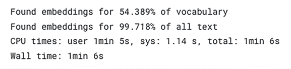

图 7.23：词汇覆盖率 – 第四次迭代，在清理标点和特殊字符之后

查看未覆盖的前 20 个单词，我们发现有一些带重音的小词、特殊字符和习语。我们将标点字典扩展到包括最频繁的特殊字符，并在我们再次运行`build_vocabulary`和`check_coverage`之后，我们得到了词汇覆盖率的新状态：

```py
more_puncts = {'▀': '.', '▄': '.', 'é': 'e', 'è': 'e', 'ï': 'i','⭐': 'star', 'ᴀ': 'A',  'ᴀɴᴅ': 'and', '»': ' '}
train['comment_text'] = train['comment_text'].apply(lambda x: clean_special_chars(x, punct_mapping, more_puncts))
test['comment_text'] = test['comment_text'].apply(lambda x: clean_special_chars(x, punct_mapping, more_puncts))
%%time
df = pd.concat([train ,test], sort=False)
vocab = build_vocabulary(df['comment_text'])
print("Check coverage after additional punctuation replacement")
oov_glove = check_coverage(vocab, embed_glove) 
```

这次有一个微小的改进，但我们可以继续处理频繁的表达式或频繁的特殊字符替换，直到我们得到显著的改进。

通过添加额外的嵌入源到当前的预训练嵌入中，可以进一步改善注释语料库的词汇覆盖率。让我们试试这个。我们使用了来自`GloVe`的预训练嵌入。我们也可以使用 Facebook 的`FastText`。`FastText`是一个非常实用的行业标准库，在许多公司的日常搜索和推荐引擎中广泛使用。让我们加载嵌入并使用组合嵌入向量重新创建嵌入索引。

在我们将两个词嵌入字典合并后，一个包含 2.19 百万个条目，另一个包含 2.0 百万个条目（两者都具有 300 维的向量维度），我们得到了一个包含 2.8 百万个条目的字典（由于两个字典中有很多共同词汇）。然后我们重新计算了词汇覆盖率。在*图 7.24*中，我们展示了这一操作的结果。

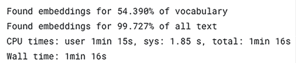

图 7.24：词汇覆盖率 – 第五次迭代，在将 FastText 预训练词嵌入添加到初始 GloVe 嵌入字典之后

总结一下我们的过程，我们的意图是构建一个基于预训练词嵌入的基线解决方案。我们介绍了两种预训练词嵌入算法，`GloVe` 和 `FastText`。预训练意味着我们使用了已经训练好的算法；我们没有从我们的数据集的评论语料库中计算词嵌入。为了有效，我们需要确保我们用这些词嵌入覆盖了评论文本词汇表的良好范围。最初，覆盖率相当低（词汇表的 15% 和整个文本的 86%）。通过转换为小写、删除缩写、删除标点符号和替换特殊字符，我们逐渐提高了这些统计数据。在最后一步，我们通过添加来自替代源的预训练嵌入来扩展嵌入字典。最终，我们能够确保词汇表的 56% 覆盖率和整个文本的 99.75% 覆盖率。

下一步是创建一个基线模型，并在单独的笔记本中完成。我们只会重用当前笔记本中实验的一部分函数。

# 构建基线模型

这些天，每个人至少都会通过微调 Transformer 架构来构建一个基线模型。自从 2017 年的论文《Attention Is All You Need》（参考文献 14）以来，这些解决方案的性能一直在持续提升，对于像 *Jigsaw Unintended Bias in Toxicity Classification* 这样的比赛，一个基于 Transformer 的最新解决方案可能会轻易地将你带入金牌区域。

在这个练习中，我们将从一个更经典的基线开始。这个解决方案的核心是基于 Christof Henkel（Kaggle 昵称：Dieter）、Ane Berasategi（Kaggle 昵称：Ane）、Andrew Lukyanenko（Kaggle 昵称：Artgor）、Thousandvoices（Kaggle 昵称）和 Tanrei（Kaggle 昵称）的贡献；参见参考文献 *12*、*13*、*15*、*16*、*17* 和 *18*。

该解决方案包括四个步骤。在第一步，我们将训练数据和测试数据加载为 `pandas` 数据集，然后对这两个数据集进行预处理。预处理主要基于我们之前执行的预处理步骤，因此我们在这里不会重复这些步骤。

在第二步，我们执行分词并准备数据以呈现给模型。分词过程如下所示（我们这里不展示整个过程）：

```py
 logger.info('Fitting tokenizer')
    tokenizer = Tokenizer() 
    tokenizer.fit_on_texts(list(train[COMMENT_TEXT_COL]) + list(test[COMMENT_TEXT_COL]))
    word_index = tokenizer.word_index
    X_train = tokenizer.texts_to_sequences(list(train[COMMENT_TEXT_COL]))
    X_test = tokenizer.texts_to_sequences(list(test[COMMENT_TEXT_COL]))
    X_train = pad_sequences(X_train, maxlen=MAX_LEN)
    X_test = pad_sequences(X_test, maxlen=MAX_LEN) 
```

我们在这里使用了一个基本的分词器来自 `keras.preprocessing.text`。分词后，每个输入序列都会用预定义的 `MAX_LEN` 进行填充，这个长度是根据整个评论语料库的平均/中位长度以及可用的内存和运行时限制选定的。

在第三步，我们构建嵌入矩阵和模型结构。构建嵌入矩阵的代码主要基于我们在前几节中已经介绍过的过程。在这里，我们只是将其系统化：

```py
def build_embedding_matrix(word_index, path):
    '''
     Build embeddings
    '''
    logger.info('Build embedding matrix')
    embedding_index = load_embeddings(path)
    embedding_matrix = np.zeros((len(word_index) + 1, EMB_MAX_FEAT))
    for word, i in word_index.items():
        try:
            embedding_matrix[i] = embedding_index[word]
        except KeyError:
            pass
except:
            embedding_matrix[i] = embeddings_index["unknown"]

    del embedding_index
    gc.collect()
    return embedding_matrix
def build_embeddings(word_index):
    '''
     Build embeddings
    '''
    logger.info('Load and build embeddings')
    embedding_matrix = np.concatenate(
        [build_embedding_matrix(word_index, f) for f in EMB_PATHS], axis=-1) 
    return embedding_matrix 
```

该模型是一个具有词嵌入层、`SpatialDropout1D`层、两个双向 LSTM 层、`GlobalMaxPooling1D`与`GlobalAveragePooling1D`的拼接、两个具有`'relu'`激活的密集层，以及一个具有`'sigmoid'`激活的目标输出的密集层的深度学习架构。

在词嵌入层中，输入被转换，使得每个词都由其对应的向量表示。经过这种转换后，模型捕捉到了输入中词语之间的语义距离信息。`SpatialDropout1D`层通过在训练过程中随机停用神经元来帮助防止过拟合（系数给出了每个 epoch 停用神经元的百分比）。双向 LSTM 层的作用是处理输入序列的前向和反向，增强上下文理解以获得更好的预测。`GlobalAveragePooling1D`层的作用是计算整个序列中每个特征的均值，在 1D（顺序）数据中降低维度同时保留关键信息。这相当于揭示了序列的潜在表示。密集层的输出是模型的预测。有关实现的更多细节，请参阅*参考文献 17*和*参考文献 18*：

```py
def build_model(embedding_matrix, num_aux_targets, loss_weight):
    '''
        Build model
    '''
    logger.info('Build model')
    words = Input(shape=(MAX_LEN,))
    x = Embedding(*embedding_matrix.shape, weights=[embedding_matrix], trainable=False)(words)
    x = SpatialDropout1D(0.3)(x)
    x = Bidirectional(CuDNNLSTM(LSTM_UNITS, return_sequences=True))(x)
    x = Bidirectional(CuDNNLSTM(LSTM_UNITS, return_sequences=True))(x)
    hidden = concatenate([GlobalMaxPooling1D()(x),GlobalAveragePooling1D()(x),])
    hidden = add([hidden, Dense(DENSE_HIDDEN_UNITS, activation='relu')(hidden)])
    hidden = add([hidden, Dense(DENSE_HIDDEN_UNITS, activation='relu')(hidden)])
    result = Dense(1, activation='sigmoid')(hidden)
    aux_result = Dense(num_aux_targets, activation='sigmoid')(hidden)

    model = Model(inputs=words, outputs=[result, aux_result])
    model.compile(loss=[custom_loss,'binary_crossentropy'], loss_weights=[loss_weight, 1.0], optimizer='adam')
    return model 
```

在第四步，我们进行训练，准备提交，并提交。为了减少运行时使用的内存，我们使用临时存储，并在删除未使用的分配数据后进行垃圾回收。我们运行模型两次，指定数量的`NUM_EPOCHS`（代表训练数据通过算法的一个完整遍历），然后使用可变权重平均测试预测。然后我们提交预测：

```py
def run_model(X_train, y_train, y_aux_train, embedding_matrix, word_index, loss_weight):
    '''
        Run model
    '''
    logger.info('Run model')

    checkpoint_predictions = []
    weights = []
    for model_idx in range(NUM_MODELS):
        model = build_model(embedding_matrix, y_aux_train.shape[-1], loss_weight)
        for global_epoch in range(NUM_EPOCHS):
            model.fit(
                X_train, [y_train, y_aux_train],
                batch_size=BATCH_SIZE, epochs=1, verbose=1,
                callbacks=[LearningRateScheduler(lambda epoch: 1.1e-3 * (0.55 ** global_epoch))]
            )
            with open('temporary.pickle', mode='rb') as f:
                X_test = pickle.load(f) # use temporary file to reduce memory
            checkpoint_predictions.append(model.predict(X_test, batch_size=1024)[0].flatten())
            del X_test
            gc.collect()
            weights.append(2 ** global_epoch)
        del model
        gc.collect()

    preds = np.average(checkpoint_predictions, weights=weights, axis=0)
    return preds
def submit(sub_preds):
    logger.info('Prepare submission')
    submission = pd.read_csv(os.path.join(JIGSAW_PATH,'sample_submission.csv'), index_col='id')
    submission['prediction'] = sub_preds
    submission.reset_index(drop=False, inplace=True)
    submission.to_csv('submission.csv', index=False) 
```

使用这种解决方案（完整代码请见*参考文献 16*），我们可以通过延迟提交获得核心得分 0.9328，从而在私有排行榜的上半部分获得排名。接下来，我们将展示如何通过使用基于 Transformer 的解决方案，我们可以获得更高的分数，进入银牌甚至金牌区域。

# 基于 Transformer 的解决方案

在竞赛期间，BERT 和一些其他 Transformer 模型已经可用，并提供了几个高分解决方案。在这里，我们不会尝试复制它们，但我们会指出最易于实现的实现。

在*参考文献 20*中，齐申·哈结合了几种解决方案，包括 BERT-Small V2、BERT-Large V2、XLNet 和 GPT-2（使用竞赛数据作为数据集进行微调的模型）来获得 0.94656 的私有排行榜得分（延迟提交），这将使你进入前 10 名（包括金牌和奖项区域）。

仅使用 BERT-Small 模型（参见*参考文献 21*）的解决方案将产生 0.94295 的私有排行榜分数。使用 BERT-Large 模型（参见*参考文献 22*）将导致 0.94388 的私有排行榜分数。这两个解决方案都将位于银牌区域（在私有排行榜中分别位于 130 和 80 左右，作为晚提交）。

# 摘要

在本章中，我们学习了如何处理文本数据，使用各种方法来探索这类数据。我们首先分析了我们的目标和文本数据，对文本数据进行预处理以便将其包含在机器学习模型中。我们还探讨了各种 NLP 工具和技术，包括主题建模、命名实体识别（NER）和词性标注（POS tagging），然后准备文本以构建基线模型，通过迭代过程逐步提高目标集（在这种情况下，目标是提高竞赛数据集中文本语料库中词汇的词嵌入覆盖范围）的数据质量。

我们介绍了并讨论了一个基线模型（基于几位 Kaggle 贡献者的工作）。这个基线模型架构包括一个词嵌入层和双向 LSTM 层。最后，我们查看了一些基于 Transformer 架构的最先进解决方案，无论是作为单一模型还是组合使用，以获得排行榜上部的分数（银牌和金牌区域）。

在下一章中，我们将开始处理信号数据。我们将介绍各种信号模态（声音、图像、视频、实验或传感器数据）特定的数据格式。我们将分析来自*LANL 地震预测* Kaggle 竞赛的数据。

# 参考文献

1.  Jigsaw 毒性分类中的无意偏差，Kaggle 竞赛数据集：[`www.kaggle.com/c/jigsaw-unintended-bias-in-toxicity-classification/`](https://www.kaggle.com/c/jigsaw-unintended-bias-in-toxicity-classification/)

1.  Aja Bogdanoff，告别文明评论，Medium：`medium.com/@aja_15265/saying-goodbye-to-civil-comments-41859d3a2b1d`

1.  Gabriel Preda，Jigsaw 评论文本探索：[`github.com/PacktPublishing/Developing-Kaggle-Notebooks/blob/develop/Chapter-07/jigsaw-comments-text-exploration.ipynb`](https://github.com/PacktPublishing/Developing-Kaggle-Notebooks/blob/develop/Chapter-07/jigsaw-comments-text-exploration.ipynb)

1.  Gabriel Preda，Jigsaw 简单基线：[`github.com/PacktPublishing/Developing-Kaggle-Notebooks/blob/develop/Chapter-07/jigsaw-simple-baseline.ipynb`](https://github.com/PacktPublishing/Developing-Kaggle-Notebooks/blob/develop/Chapter-07/jigsaw-simple-baseline.ipynb)

1.  Susan Li, Python 中的主题建模和潜在狄利克雷分配（LDA）：[`towardsdatascience.com/topic-modeling-and-latent-dirichlet-allocation-in-python-9bf156893c24`](https://towardsdatascience.com/topic-modeling-and-latent-dirichlet-allocation-in-python-9bf156893c24)

1.  Aneesha Bakharia, 提高主题模型的解释能力：[`towardsdatascience.com/improving-the-interpretation-of-topic-models-87fd2ee3847d`](https://towardsdatascience.com/improving-the-interpretation-of-topic-models-87fd2ee3847d)

1.  Carson Sievert, Kenneth Shirley, LDAvis：一种可视化和解释主题的方法：[`www.aclweb.org/anthology/W14-3110`](https://www.aclweb.org/anthology/W14-3110)

1.  Lucia Dosin, 主题建模实验 – PyLDAvis：[`www.objectorientedsubject.net/2018/08/experiments-on-topic-modeling-pyldavis/`](https://www.objectorientedsubject.net/2018/08/experiments-on-topic-modeling-pyldavis/)

1.  Renato Aranha, 在 Elon 推文上的主题建模（LDA）：[`www.kaggle.com/errearanhas/topic-modelling-lda-on-elon-tweets`](https://www.kaggle.com/errearanhas/topic-modelling-lda-on-elon-tweets)

1.  潜在狄利克雷分配，维基百科：[`en.wikipedia.org/wiki/Latent_Dirichlet_allocation`](https://en.wikipedia.org/wiki/Latent_Dirichlet_allocation)

1.  Leonie Monigatti, 使用 NLTK 和 SpaCy 可视化词性标签：[`towardsdatascience.com/visualizing-part-of-speech-tags-with-nltk-and-spacy-42056fcd777e`](https://towardsdatascience.com/visualizing-part-of-speech-tags-with-nltk-and-spacy-42056fcd777e)

1.  Ane, Quora 预处理 + 模型：[`www.kaggle.com/anebzt/quora-preprocessing-model`](https://www.kaggle.com/anebzt/quora-preprocessing-model)

1.  Christof Henkel (Dieter), 如何：在使用嵌入时进行预处理：[`www.kaggle.com/christofhenkel/how-to-preprocessing-when-using-embeddings`](https://www.kaggle.com/christofhenkel/how-to-preprocessing-when-using-embeddings)

1.  Ashish Vaswani, Noam Shazeer, Niki Parmar, Jakob Uszkoreit, Llion Jones, Aidan N. Gomez, Lukasz Kaiser, Illia Polosukhin, 注意力即是全部：[`arxiv.org/abs/1706.03762`](https://arxiv.org/abs/1706.03762)

1.  Christof Henkel (Dieter), keras 基线 lstm + attention 5 折：[`www.kaggle.com/christofhenkel/keras-baseline-lstm-attention-5-fold`](https://www.kaggle.com/christofhenkel/keras-baseline-lstm-attention-5-fold)

1.  Andrew Lukyanenko, 在 keras 上使用 CNN 的折叠：[`www.kaggle.com/code/artgor/cnn-in-keras-on-folds`](https://www.kaggle.com/code/artgor/cnn-in-keras-on-folds)

1.  Thousandvoices, 简单 LSTM：[`www.kaggle.com/code/thousandvoices/simple-lstm/s`](https://www.kaggle.com/code/thousandvoices/simple-lstm/s)

1.  Tanrei, 使用身份参数的简单 LSTM 解决方案：[`www.kaggle.com/code/tanreinama/simple-lstm-using-identity-parameters-solution`](https://www.kaggle.com/code/tanreinama/simple-lstm-using-identity-parameters-solution)

1.  Gabriel Preda, Jigsaw Simple Baseline: [`www.kaggle.com/code/gpreda/jigsaw-simple-baseline`](https://www.kaggle.com/code/gpreda/jigsaw-simple-baseline)

1.  Qishen Ha, Jigsaw_predict: [`www.kaggle.com/code/haqishen/jigsaw-predict/`](https://www.kaggle.com/code/haqishen/jigsaw-predict/)

1.  Gabriel Preda, Jigsaw_predict_BERT_small: [`www.kaggle.com/code/gpreda/jigsaw-predict-bert-small`](https://www.kaggle.com/code/gpreda/jigsaw-predict-bert-small)

1.  Gabriel Preda, Jigsaw_predict_BERT_large: [`www.kaggle.com/code/gpreda/jigsaw-predict-bert-large`](https://www.kaggle.com/code/gpreda/jigsaw-predict-bert-large)

# 加入我们书籍的 Discord 空间

加入我们的 Discord 社区，与志同道合的人相聚，并在以下地点与超过 5000 名成员一起学习：

[`packt.link/kaggle`](https://packt.link/kaggle)


