# 第二章：什么是 MLOps，为什么它对每个机器学习团队都如此重要？

**机器学习运维** (**MLOps**) 是现代机器学习团队的关键实践，它融合了技术和操作的最佳实践。在其核心，MLOps 旨在解决将机器学习模型投入生产和促进数据科学家与 IT 团队之间更好协作的挑战。随着技术的快速进步和对机器学习解决方案的日益依赖，MLOps 正成为可持续和可扩展机器学习策略的支柱。本章将深入探讨 MLOps 的本质，详细阐述其重要性、其各种成熟度级别以及 Google 的 Vertex AI 在促进 MLOps 中的作用。到本章结束时，你将具备对 MLOps 原则的稳健理解，以及 Vertex AI 中可用于实施这些原则的工具。

在本章中，我们将涵盖以下主题：

+   为什么 MLOps 很重要？

+   MLOps 成熟度级别

+   Vertex AI 如何帮助实施 MLOps？

让我们开始这段启发性的旅程，掌握 Vertex AI 上的 MLOps。

# 为什么 MLOps 很重要？

随着机器学习模型在当今世界的开发和集成变得越来越普遍，对稳健的操作框架的需求比以往任何时候都更加迫切。MLOps 旨在通过简化开发、部署和监控机器学习模型的整个流程来满足这一需求。在本节中，我们将从以下方面讨论 MLOps 的重要性：

+   **标准化和自动化** **机器学习工作流程**

    MLOps 旨在标准化和自动化机器学习生命周期的各个阶段，从数据摄取和预处理到模型训练、评估和部署。通过这样做，它最小化了人为错误的可能性，促进了可重复性，并提高了整体效率。Google 的 Vertex AI 为机器学习工作流程的每个阶段提供托管服务，这有助于组织实现一致性、自动化流程并降低运营成本。

+   **监控和管理** **模型性能**

    MLOps 的一个关键方面是持续监控和管理已部署模型的表现。这是至关重要的，因为由于数据分布的变化、不可预见的边缘情况或用户行为的演变，机器学习模型的有效性可能会随时间推移而降低。Google 的 Vertex AI 通过提供监控模型性能的工具并在性能阈值被突破时生成警报来支持 MLOps。此外，它还支持与其他 Google Cloud 生态系统中的监控和日志记录服务的无缝集成。

+   **确保可扩展性和灵活性**

    MLOps 通过提供一个框架来促进机器学习解决方案的扩展，该框架可以轻松适应增加的数据量、更复杂的模型和额外的基础设施需求。Google 的 Vertex AI 旨在处理这些需求，提供一系列自动扩展、支持分布式训练和预测以及允许用户为特定用例选择最佳硬件配置的服务和工具。

+   **安全和合规性**

    MLOps 强调在机器学习工作流程中安全性和合规性的重要性，确保满足数据隐私和监管要求。Google 的 Vertex AI 通过提供安全的模型训练、存储和部署环境来支持这些目标。它与 Google Cloud 的**身份和访问管理**（**IAM**）集成，可以实现对资源访问的精细控制，同时加密选项保护数据在静态和传输过程中的安全。

在开发机器学习模型时，可能会采取许多捷径或忽略复杂性，这些都会随着时间的推移积累“债务”，导致系统维护困难或未来的失败。随着在生产中部署的机器学习解决方案的发展，开发者可能会添加更多功能以提高准确性和为用户提供整体价值。每个功能通常都有其自己的预处理、归一化和配置参数的具体方式。随着时间的推移，管理这些配置和相关变更可能会变得越来越复杂，解决方案可能会积累大量的技术债务。MLOps 提供了必要的实践和工具来管理和减轻这些债务，确保可持续和可扩展的机器学习部署。

总结来说，MLOps 在简化机器学习工作流程、增强协作以及确保模型安全、可扩展和良好维护方面发挥着至关重要的作用。Google 的 Vertex AI 凭借其全面的工具和服务套件，使组织能够拥抱 MLOps 并释放其机器学习解决方案的潜力。

现在，让我们来看看在行业中常见的典型 MLOps 实施的不同成熟度或复杂度级别。请记住，我们将讨论的架构只是不同复杂度级别的代表性样本。在现实世界中，你会看到这些实施方式的许多不同变体，每种实施方式都像使用它的组织一样独特。

# 实施不同的 MLOps 成熟度级别

大多数新的机器学习团队和组织在构建和改进他们的 MLOps 策略时，都会经历一个分阶段的 MLOps 旅程。他们通常从一个完全手动、一步一步的过程开始，其中数据科学/数据工程团队采取极其手动、临时的方法来构建和部署模型。一旦部署并稳定了几个模型，就会逐渐明显地看出这种手动过程的可扩展性不高，团队需要实施一些流程和自动化。

在这一点上，随着生产中出现问题，这种临时方法不易审计或重现也变得明显。随着机器学习解决方案的使用增加，它从仅仅是一个实验转变为组织越来越依赖的东西。合规团队和领导层也开始要求使模型部署过程更加有组织和可审计，以确保符合公司的 IT 政策。在这个阶段，团队领导需要根据他们可用的资源以及他们正在工作的项目解决方案路线图，制定一个高级 MLOps 策略和实施路线图。一些组织决定提前构建整个 MLOps 堆栈，而其他组织可能决定一步一步地通过不同的成熟度级别。

现在，让我们看看大多数机器学习（ML）组织通常经历的不同的成熟度级别。

## MLOps 成熟度级别 0

这是组织刚开始尝试机器学习解决方案，还没有准备好一个成熟的 MLOps 策略的阶段，关于随着他们扩大机器学习采用的标准流程和工具看起来会是什么样子。在这个阶段，情况如下所示：

+   组织为每个业务单元只部署了 1-2 个模型到生产环境中

+   人工智能/机器学习（AI/ML）的开发由一个由数据科学家组成的小型集中团队处理

+   重点是部署速度而不是一致的过程

+   机器学习工具的选择尚不明确，领导层希望在承诺特定的机器学习平台之前弄清楚哪些有效，哪些无效

+   大多数，如果不是所有步骤都是手工完成的

下面的图表显示了成熟度级别 0 的 MLOps 解决方案的不同关键组件：

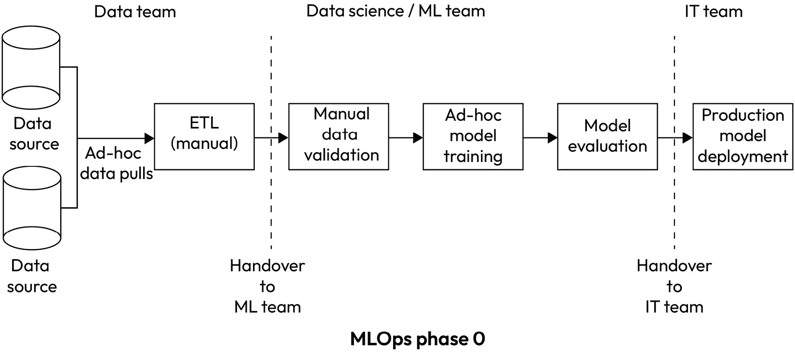

图 2.1 – MLOps 解决方案：成熟度级别 0

如前图所示，在 MLOps 成熟度级别 0，大多数从一项流程到下一项流程的交接都是手工完成的。这通过不需要构建和测试广泛的自动化流程，确保了快速的生产部署（当需要时）。显然，缺点是团队每次需要运行管道时都需要花费大量时间。因此，机器学习工程团队需要制定一个路线图/策略，随着时间的推移逐步增加自动化。

## MLOps 成熟度级别 1 – 自动化基本机器学习步骤

MLOps 成熟度级别 1 的一个关键特征是完全自动化的数据和机器学习模型训练管道。在这个阶段，通过点击一个按钮或一个 API 调用，可以触发完整的数据获取和模型重新训练。

对于最接近解决方案开发团队的团队来说，最显著的瓶颈之一是数据获取和模型训练过程。在*MLOps 成熟度水平 0*部分，大多数关于数据摄取和模型构建的步骤都是手动完成的，即使重复类似步骤并稍微修改参数也容易出错。因此，数据和机器学习模型训练管道最终成为第一个需要自动化的组件。这也得益于大多数数据和机器学习管道工作都是在同一团队内完成的；也就是说，数据管道工作由数据团队完成，而机器学习模型设计和构建由数据科学/机器学习团队完成。这减少了团队之间的自动化依赖。显然，仍然需要依赖 IT 团队确保适当的编排和自动化工具的可用性。

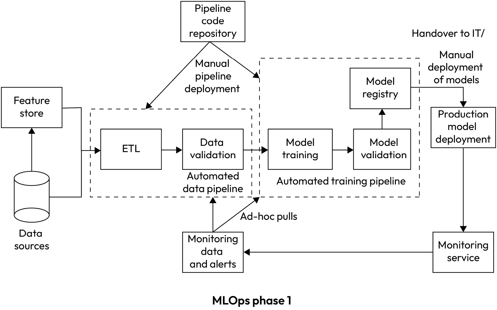

图 2.2 – MLOps 成熟度水平 1

如前图所示，在 MLOps 管道中，大多数组件在此成熟度水平下都是自动化的。

自动化的机器学习管道组件如下：

+   **数据导入**：导入最新数据的过程几乎完全自动化，并通过外部触发器启动，这些触发器指示新数据的可用性。

+   **特征/数据工程**：在先前的数据传输步骤完成后自动触发。

+   **数据验证**：在此阶段，数据验证主要通过在数据/特征工程步骤结束时触发的编排脚本来处理。

+   **模型训练**：一旦数据验证成功完成，编排层就会触发模型训练步骤，使用新可用的数据重建模型。

+   **模型验证**：通过编排脚本来自动基准测试模型的预测性能，确保模型在获得生产部署批准之前满足业务和技术要求。

+   **在集中式模型注册表中注册新模型**：一旦模型经过验证，它就会被推送到一个集中式模型注册表，该注册表保存所有批准的模型的目录。

在此阶段引入的其他新组件，以支持自动化，如下所示：

+   **代码仓库**：为确保数据和管道执行的一致性，创建一个集中式仓库来托管管道代码/逻辑非常重要。为此，企业使用他们内部的 Git 实现，如 GitHub 或 GitLab，或者基于云的代码仓库工具，如**Google Cloud Platform**（**GCP**）云源代码仓库。（本书的范围不包括对这些工具的详细说明。）

+   **特征存储**：特征集中目录/存储库，可以使实验自动化/可重复性更容易且更一致。这可以通过使用独立的专用工具，如**FEAST**或 Vertex AI 特征存储，或者使用标准数据仓库工具的定制实现来完成。Vertex AI 特征存储在*第十一章*，“使用 Vertex AI 的 MLOps 治理”中详细讨论。

在这些基本的 MLOps 组件到位后，您的解决方案将更加高效，并且更不容易出现人为错误。

## MLOps 成熟度级别 2 – 自动化模型部署

MLOps 成熟度级别 2 的关键特征是持续部署能力，可以自动将任何新的机器学习模型部署到生产环境中，并在模型精度检测到变化时，根据监控服务的触发器创建新的机器学习模型。

以下图示描绘了一个具有成熟度级别 2 的代表性 MLOps 实现。

图 2.3 – MLOps 成熟度级别 2

在成熟度级别 2 的架构中，数据采集和机器学习建模部分一旦实现自动化，下一个明显的瓶颈就是模型构建端与模型部署端的集成。这包括两个部分：

+   将经过验证步骤的新训练模型部署到生产中的过程。例如，通过验证测试的新模型应自动部署到生产中。

+   将监控服务收集的数据转化为可操作的见解，并触发模型更新。例如，生产中传入的特征值的变化可以触发使用新数据的机器学习模型的重新训练。

在这个阶段引入的另一个新组件是为了支持自动化，即元数据存储。这是在数据采集、特征生成、模型开发和部署的每个步骤中生成的所有元数据的存储库。在自动化部署和重新训练过程中，它作为模型开发历史记录的来源变得很重要。例如，为了监控生产中的模型以检测数据漂移或训练偏差，监控过程需要访问模型的 历史，以获取其训练的数据集。与自动化无关的另一个用例是元数据存储可以启用模型审计。如果在模型开发过程中，所有关于数据和模型的关键参数都被记录到元数据存储中，那么它可以向模型审计员提供关于模型的端到端可见性。以下图例展示了这一点，您可以看到模型的旅程：

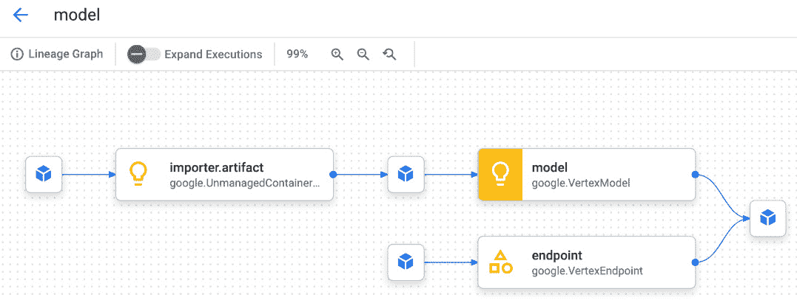

图 2.4 – Vertex AI 元数据存储

现在我们来看一下您如何使用 Vertex AI 来实现端到端的 MLOps 解决方案。

# Vertex AI 如何帮助实现 MLOps？

Google Cloud Vertex AI 是一个平台，提供工具和资源，以端到端的方式实现 ML 开发生命周期。

Vertex AI 通过提供自动模型构建和部署、模型版本控制和跟踪、以及在生产中监控和管理模型等功能来帮助 MLOps。此外，它还提供协作工具和资源共享，使团队能够共同进行大型和分布式 ML 项目。

Vertex AI 还可以帮助 MLOps 的其他方面，例如以下内容：

+   **数据管理**：Vertex AI 可以帮助进行数据准备、标注和管理，这对于构建准确的 ML 模型至关重要

+   **实验**：Vertex AI 可以帮助跟踪和管理实验，包括比较和选择最佳模型

+   **模型治理**：Vertex AI 可以帮助管理模型访问权限和监控模型漂移和合规性

+   **持续集成和持续交付**（**CI/CD**）：Vertex AI 可以帮助自动化构建、测试和部署模型的过程，这对于保持模型更新并确保其在生产中始终运行顺畅非常重要

+   **可扩展性**：Vertex AI 可以帮助扩展 ML 模型以处理大量数据和流量，这对于在生产中维持模型性能至关重要

+   **监控**：Vertex AI 可以帮助监控和衡量生产中 ML 模型的性能，这对于了解模型工作情况良好与否以及识别改进领域至关重要

总体而言，Vertex AI 通过提供在 GCP 上管理整个 ML 生命周期的全面平台，从开发到部署和维护，简化了在生产中构建、部署和管理 ML 模型的过程。

此表显示了哪些 Vertex AI 工具或功能可以帮助您实现典型 MLOps 管道中的哪些组件：

| **MLOps 组件** | **Vertex AI 工具** | **其他 GCP 工具** |
| --- | --- | --- |
| 特征管理 | Vertex AI 特征存储 | N/A |
| 数据管理 | Vertex AI 数据集 | BigQueryGoogle Cloud Storage |
| 数据探索与分析 | Vertex AI 工作台 | 数据融合 |
| 元数据存储 | Vertex AI 元数据存储 | N/A |
| 工作流编排 | Vertex AI 管道 | 基于 **Google Kubernetes Engine** （**GKE**）的 Kubeflow Composer（Airflow） |
| 模型注册 | Vertex AI 模型注册 | N/A |
| 模型开发 | Vertex AI 训练 Vertex AI 实验 | N/A |
| 模型服务/预测服务 | Vertex AI 批量预测 Vertex AI 端点 | 在 GCE 或 GKE 上的自定义部署 |
| 监控 | Vertex AI 监控 | N/A |

表 2.1 – MLOps 到 GCP 产品映射

让我们详细看看这些 Vertex AI 工具。

**Vertex AI 工作台**是一个基于 Jupyter Notebook 的完全托管开发环境，支持整个数据科学工作流程。主要功能包括以下内容：

+   与大多数 Google Cloud 数据源集成，例如 BigQuery 和 Google Cloud Storage

+   创建和使用高度可扩展的 Jupyter **虚拟机**（**VM**）实例的能力

+   通过 **软件开发** **套件**（**SDK**）触发和使用大多数 GCP 服务的能力

+   在 Dataproc（托管 Spark 服务）中启动集群和作业创建的能力

+   笔记本调度

以下截图显示了 Vertex AI 工作台仪表板，列出了所有部署的 Jupyter Notebook 实例：

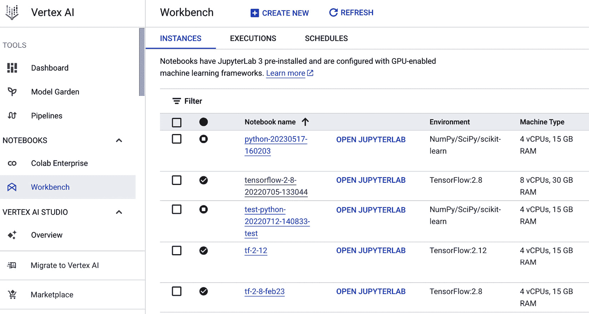

图 2.5 – Vertex AI 工作台仪表板

**Vertex AI 数据管理**正如其名所示，是 Vertex AI 的原生数据集管理服务。它允许用户执行以下操作：

+   将数据导入 Vertex AI 并管理数据集

+   管理标签和多个注释集

+   当与元数据存储结合使用时，它有助于跟踪数据血缘以进行故障排除和审计

+   生成数据统计和可视化

以下截图显示了 Vertex AI 数据集仪表板，列出了使用该工具创建的所有数据集：

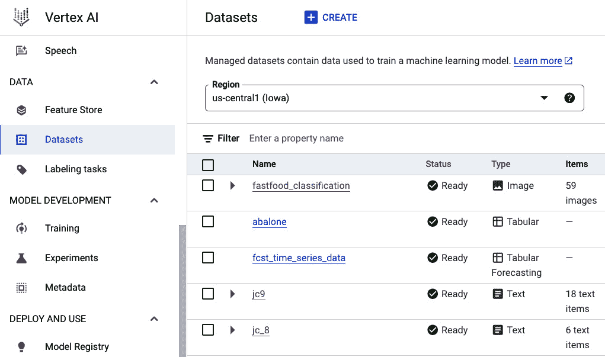

图 2.6 – Vertex AI 数据集仪表板

**Vertex AI 特征存储**是 Vertex AI 的一部分，是一个托管特征目录服务。主要功能包括以下内容：

+   导入和组织特征值的能力

+   以批量或实时模式提供特征值的能力

+   监测特征值随时间的变化并生成警报的能力

以下截图显示了 Vertex AI 特征存储仪表板，列出了工具中存在的所有特征和实体。

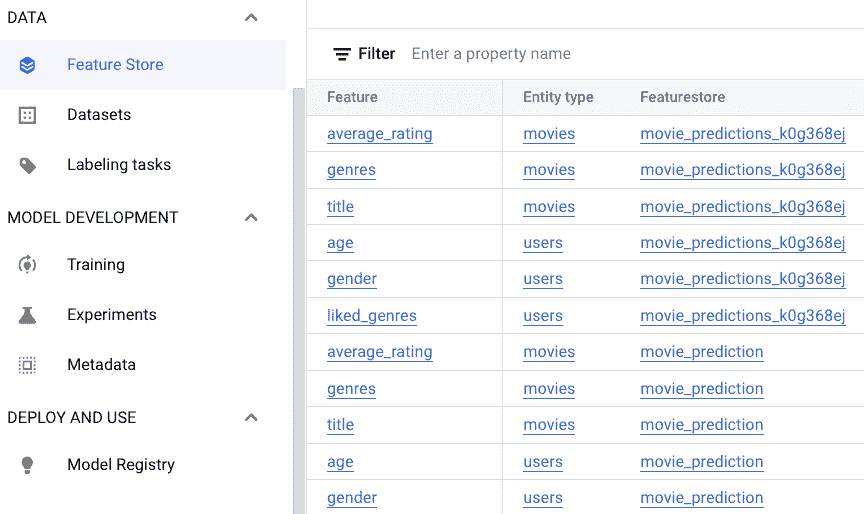

图 2.7 – Vertex AI 特征存储仪表板

**Vertex AI 管道**是 Vertex AI 平台中的托管 Kubeflow 服务，它帮助您编排复杂的数据和机器学习工作流程。主要功能包括以下内容：

+   支持 Kubeflow 管道 SDK

+   支持 **TensorFlow** **扩展**（**TFX**）

+   将垂直可扩展组件作为容器部署的能力

+   与所有 Vertex AI 工具和大多数 Google Cloud 服务进行原生集成

以下截图显示了 Vertex AI 管道仪表板，列出了所有最近执行的管道。

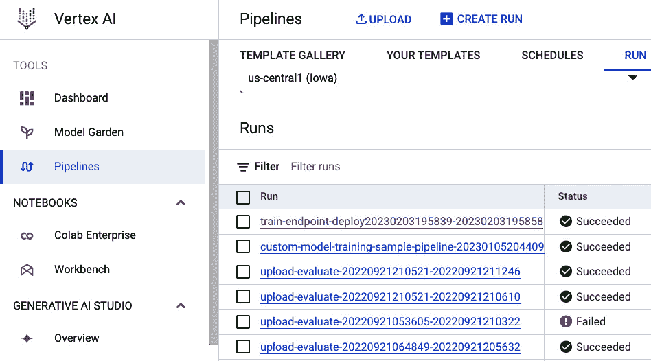

图 2.8 – Vertex AI 管道仪表板

**Vertex ML 元数据存储**可以存储机器学习管道中的关键参数/工件，以实现以下功能：

+   对机器学习模型进行血缘跟踪和审计

+   模型可重现性

+   实验分析

+   跟踪机器学习工件的下游使用情况，以实现更好的治理和合规性

下面的截图显示了 Vertex AI 元数据存储仪表板。下图展示了描述机器学习管道世系的元数据存储样本工件。

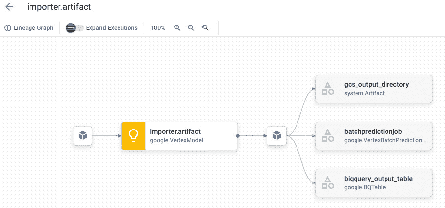

图 2.9 – Vertex AI 元数据存储

**Vertex AI 模型注册表**是一个集中注册所有机器学习模型的注册表，无论它们是自定义模型还是使用 AutoML 功能生成的模型。主要功能包括以下内容：

+   完全管理的模型注册表

+   为批量或实时预测服务提供无缝模型部署

+   能够比较模型

下图展示了 Vertex AI 模型注册表的仪表板，其中包含已注册模型的列表。

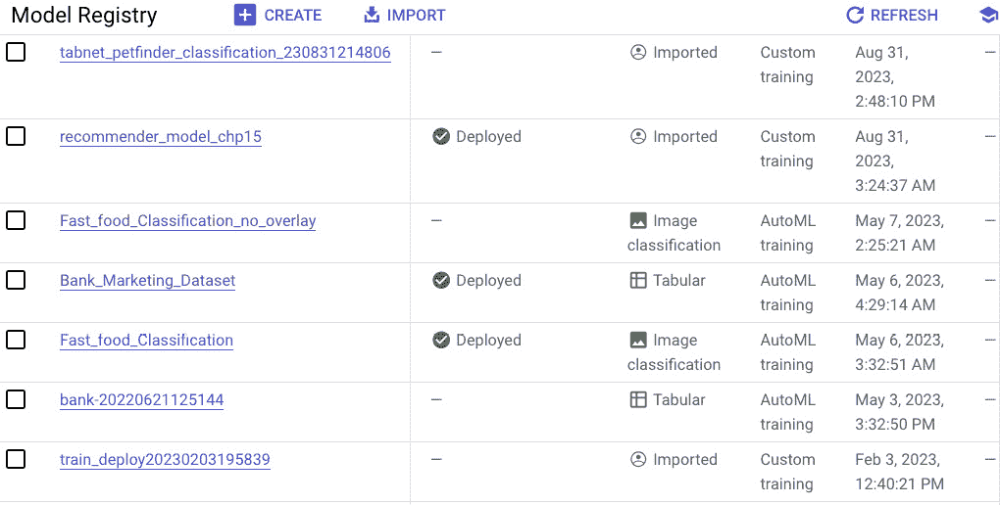

图 2.10 – Vertex AI 模型注册表

**Vertex AI 训练**是 Vertex AI 中的核心管理训练服务，使用户能够在不管理底层基础设施的情况下运行复杂的机器学习模型训练作业。主要功能包括以下内容：

+   原生支持 TensorFlow、XGBoost 和 scikit-learn 自定义模型

+   能够使用自定义容器部署训练作业

+   自动化各种用例的机器学习

+   能够在极其可扩展的按需集群上部署模型

+   管理 TensorBoard

**Vertex AI 实验**是一个管理的实验编排功能，它使数据科学团队能够启动多个具有略微不同超参数的类似训练作业，作为模型设计的一部分。

下图展示了 Vertex AI 实验仪表板，其中包含已执行的训练实验列表。

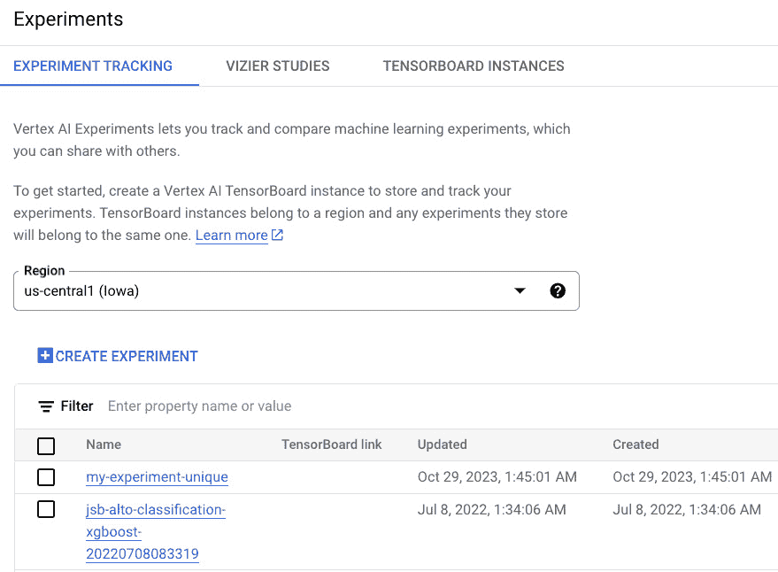

图 2.11 – Vertex AI 实验仪表板

**Vertex AI 批量预测**为上传到模型注册表的模型提供完全管理的批量预测。

下图展示了 Vertex AI 批量预测仪表板，其中包含在平台上运行的批量预测作业列表。

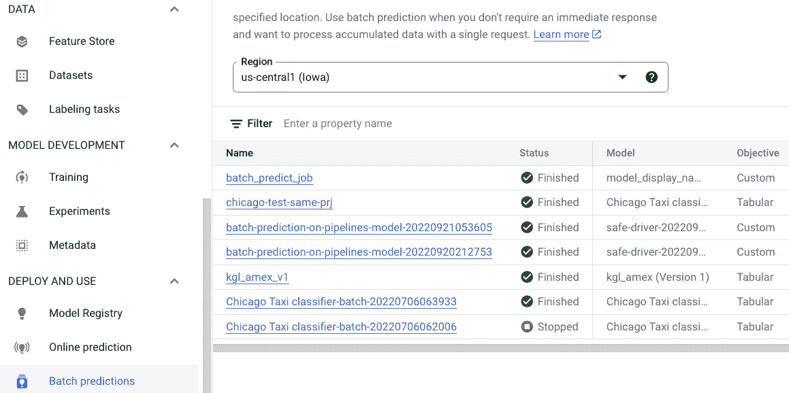

图 2.12 – Vertex AI 批量预测仪表板

**Vertex AI 端点**是针对实时预测用例的管理模型服务能力。主要功能包括以下内容：

+   可配置的服务基础设施

+   自动扩展功能

+   能够检测与预测延迟增加、容量瓶颈等问题相关的性能问题数量

下图展示了 Vertex AI 端点的仪表板。

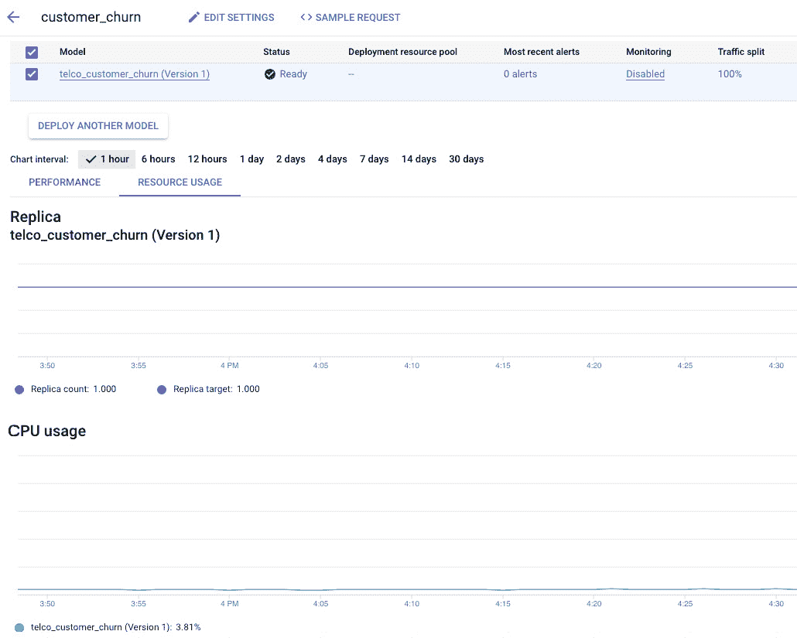

图 2.13 – Vertex AI 监控仪表板

**Vertex AI 监控**帮助自动化生产中部署模型的监控，以主动识别性能问题。主要功能包括以下内容：

+   漂移检测

+   训练-服务偏差检测

如您所见，Google Cloud Vertex AI 提供了一套全面且强大的工具，可以帮助您简化整个 ML 开发生命周期，从数据管理到模型部署和监控。

# 摘要

在本章中，我们深入探讨了 MLOps 的核心概念，并探讨了 MLOps 解决方案在现实场景中展现出的各种成熟度水平。我们还讨论了作为 Vertex AI 平台一部分的可用工具和资源，这些工具旨在帮助简化并自动化构建、部署和维护 ML 模型的过程。

在阅读本章后，我们希望您能够更好地阐述 MLOps 实践的基本原理，并为您的组织制定一个高级 MLOps 策略，考虑到您组织的独特需求和目标，并了解 Vertex AI 作为 GCP 的一部分如何在您的组织 MLOps 策略中发挥关键作用。

在下一章中，我们将介绍 Google Cloud 提供的数据存储选项，以支持您的 ML 解决方案的训练需求。我们还将讨论可用于帮助您在特征工程活动中转换大规模数据集的工具。

# 第二部分：Google Cloud 上自定义模型的机器学习工具

在本部分，您将了解 Google Cloud 提供的关键 ML 工具概述。您将学习关于 Google Vertex AI 中存储和转换数据、训练 ML 模型、模型优化、模型可解释性等不同选项。此外，您还将了解 Vertex AI 提供的部署工具、自动化工具和治理工具，这些工具用于 ML 编排。

本部分包含以下章节：

+   *第三章*, *一切关于数据 – 存储和转换 ML 数据集的选项*

+   *第四章*, *Vertex AI 工作台 – 满足 AI/ML 开发需求的单一工具*

+   *第五章*, *构建 ML 模型的无代码选项*

+   *第六章*, *构建 ML 模型的低代码选项*

+   *第七章*, *使用 Vertex AI 训练完全自定义的 ML 模型*

+   *第八章*, *ML 模型可解释性*

+   *第九章*, *模型优化 – 超参数调整和 NAS*

+   *第十章*, *Vertex AI 部署和自动化工具 – 通过托管 Kubeflow 管道进行编排*

+   *第十一章*, *使用 Vertex AI 的 MLOps 治理*
