# 第四章：Vertex AI Workbench – AI/ML 开发需求的一站式工具

**机器学习**（**ML**）项目在本质上很复杂，需要与普通软件应用完全不同的开发环境。当数据量巨大时，数据科学家可能需要使用几个大数据工具来快速处理或预处理数据，而一个**深度学习**（**DL**）模型可能需要几个 GPU 来进行快速训练和实验。此外，还需要专门的计算资源来托管生产环境中的模型，以及更多资源来将其扩展到企业级。获取这些资源和工具成本很高，即使我们设法购买并设置好，也需要大量的努力和技术知识才能将它们整合到项目流程中。即便如此，仍然存在停机时间和数据安全的风险。

现在，基于云的解决方案非常流行，并且为我们处理所有的技术难题、扩展性和安全性方面的问题。这些解决方案让机器学习开发者能够更多地专注于项目开发和实验，无需担心基础设施和其他底层问题。作为一家以人工智能（**AI**）为先导的公司，谷歌将所有用于机器学习项目开发的重要资源都整合在一个名为 Vertex AI 的统一框架下。在本章中，我们将学习关于 Vertex AI Workbench 的内容，这是一个针对 Jupyter Notebook 内核的托管解决方案，可以帮助我们更快地将机器学习项目从原型推向生产。

本章涵盖以下主题：

+   什么是 Jupyter Notebook？

+   Vertex AI Workbench

+   Vertex AI Workbench 的自定义容器

+   在 Vertex AI 中安排笔记本

# 什么是 Jupyter Notebook？

Jupyter Notebook 是一个开源的基于网络的程序，用于编写和分享实时代码、文档、可视化等内容。Jupyter Notebook 在机器学习从业者中非常受欢迎，因为它们提供了动态运行代码和协作的灵活性，提供了快速的可视化，还可以用于演示。大多数数据科学家和机器学习从业者更喜欢 Jupyter Notebook 作为他们探索、可视化和预处理数据的主要工具，这些数据科学家和从业者使用强大的 Python 库，如 pandas 和 NumPy。Jupyter Notebook 对于**探索性数据分析**（**EDA**）非常有用，因为它们允许我们动态地运行小的代码块，并快速绘制图表来理解数据统计。笔记本还可以用于进行快速的机器学习建模实验。关于 Jupyter Notebook 的另一个优点是，它允许我们编写 Markdown 单元格。使用 Markdown，我们可以解释笔记本中的每个代码块，并将其转变为教程。Jupyter Notebook 在机器学习社区中很受欢迎，用于在 GitHub 和 Kaggle 等平台上分享和协作项目。

## 开始使用 Jupyter Notebook

Jupyter Notebook 应用程序可以通过简单的`pip`命令（如下所示）在本地系统中安装。对于快速实验，我们还可以利用基于 Web 的笔记本内核，如 Colab 和 Kaggle，那里一切都已经设置好，我们可以直接运行 Python 代码。由于这些内核是公开的，如果我们有保密数据，我们无法使用它们，我们不得不在我们的系统上安装 Jupyter Notebook 应用程序。

我们可以通过以下`pip`命令在我们的本地系统上安装 Jupyter 应用程序：

```py
$ pip install jupyter
```

应用程序安装完成后，可以通过在终端输入以下命令来启动，它将在浏览器标签页中自动打开 Jupyter 应用程序：

```py
$ jupyter notebook
```

如果它没有自动打开浏览器标签页，我们可以通过输入以下 URL 来启动应用程序：[`localhost:8888/tree`](http://localhost:8888/tree)。默认情况下，Jupyter 服务器在端口`8888`上启动，但如果该端口不可用，它会找到下一个可用的端口。如果我们有兴趣使用自定义端口，我们可以通过传递自定义端口号来启动 Jupyter。

这里是启动 Jupyter 应用程序在自定义端口`9999`的终端命令：

```py
$ jupyter notebook --port 9999
```

注意

在某些情况下，当我们尝试手动点击上述 URL 时，Jupyter 服务器可能会要求我们提供一个令牌（可能是在非默认浏览器的情况下）。在这种情况下，我们可以从提供令牌的 URL 中复制 URL。或者，我们可以在终端中运行`jupyter notebook list`命令来获取令牌。

一旦我们能够在浏览器中启动应用程序服务器，Jupyter 服务器看起来就像这样：

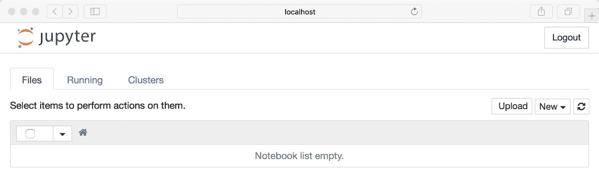

图 4.1 – Jupyter 应用程序服务器 UI

现在，我们可以通过点击**新建**按钮来启动一个 Jupyter Notebook 实例。它创建一个新的笔记本，并将其保存在我们从终端启动 Jupyter Notebook 的同一目录中。我们现在可以在新标签页中打开那个笔记本并开始运行脚本。以下截图显示了一个空白的笔记本：

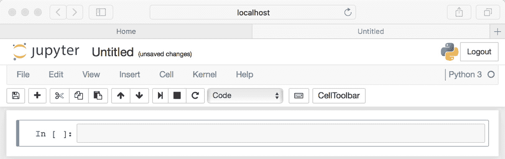

图 4.2 – Jupyter Notebook 实例

如前一个截图所示，Web UI 提供了多种操作笔记本、代码、单元格、内核等选项。一个笔记本单元格可以执行代码，或者可以通过更改下拉菜单中的类型将其转换为 Markdown 单元格。还有将笔记本导出为不同格式（如 HTML、PDF、Markdown、LaTeX 等）的选项，以便创建报告或演示文稿。在本书的进一步内容中，我们将大量使用笔记本进行数据处理、建模等。

现在我们对 Jupyter Notebook 的一般概念有了基本的了解，让我们看看 Vertex AI Workbench 如何提供一个更丰富的基于 Jupyter Notebook 环境的体验。

# Vertex AI Workbench

在进行 ML 项目工作时，如果我们在一个本地环境中运行 Jupyter Notebook，或者使用类似 Colab 或 Kaggle 的基于网络的内核，我们可以快速进行一些实验，并从 ML 算法中获得一些初始准确度或结果。但是，当我们进行大规模实验、启动长时间运行的任务、托管模型以及模型监控时，我们会遇到障碍。此外，如果与项目相关的数据需要在安全和隐私方面有更细粒度的权限（对谁可以查看/访问数据的精细控制），在本地或类似 Colab 的环境中是不切实际的。所有这些挑战只需迁移到云端就可以解决。Google Cloud 中的 Vertex AI 工作台是一个基于 JupyterLab 的环境，可以用于典型数据科学项目的所有开发需求。JupyterLab 环境与 Jupyter Notebook 环境非常相似，因此我们将在整本书中使用这些术语交替使用。

Vertex AI 工作台提供了创建 *托管笔记本实例* 以及 *用户管理笔记本实例* 的选项。用户管理笔记本实例赋予用户更多控制权，而托管笔记本则附带一些关键额外功能。我们将在本节后面进一步讨论这些功能。Vertex AI 工作台笔记本套件的一些关键特性包括以下内容：

+   完全托管**-**Vertex AI 工作台提供了一个基于 Jupyter Notebook 的完全托管环境，该环境提供企业级规模，无需管理基础设施、安全和用户管理功能。

+   交互式体验 - 由于托管笔记本可以轻松与其他 Google Cloud 服务（如存储系统、大数据解决方案等）交互，因此数据探索和模型实验变得更加容易。

+   从原型到生产 AI - Vertex AI 笔记本可以轻松与其他 Vertex AI 工具和 Google Cloud 服务交互，从而提供一个从开发到部署的端到端 ML 项目运行环境，转换过程最小化。

+   多内核支持 - 工作台在单个托管笔记本实例中提供多内核支持，包括 TensorFlow、PyTorch、Spark 和 R 等工具的内核。每个内核都预装了有用的 ML 库，并允许我们根据需要安装额外的库。

+   笔记本排程 - Vertex AI 工作台允许我们根据需要和定期排程笔记本运行。此功能在快速设置和运行大规模实验时非常有用。此功能通过托管笔记本实例提供。关于此功能的更多信息将在后续章节中提供。

在此背景下，我们现在可以开始在 Vertex AI 工作台上使用 Jupyter Notebook。下一节将提供有关在 Vertex AI 上开始使用笔记本的基本指南。

## 开始使用 Vertex AI 工作台

前往 Google Cloud 控制台，从左侧面板的产品菜单或使用顶部搜索栏打开 **Vertex AI**。在 Vertex AI 中，点击 **Workbench**，它将打开一个与 *图 4*.3* 非常相似的页面。更多相关信息可在官方文档中找到 ([`cloud.google.com/vertex-ai/docs/workbench/introduction`](https://cloud.google.com/vertex-ai/docs/workbench/introduction))。

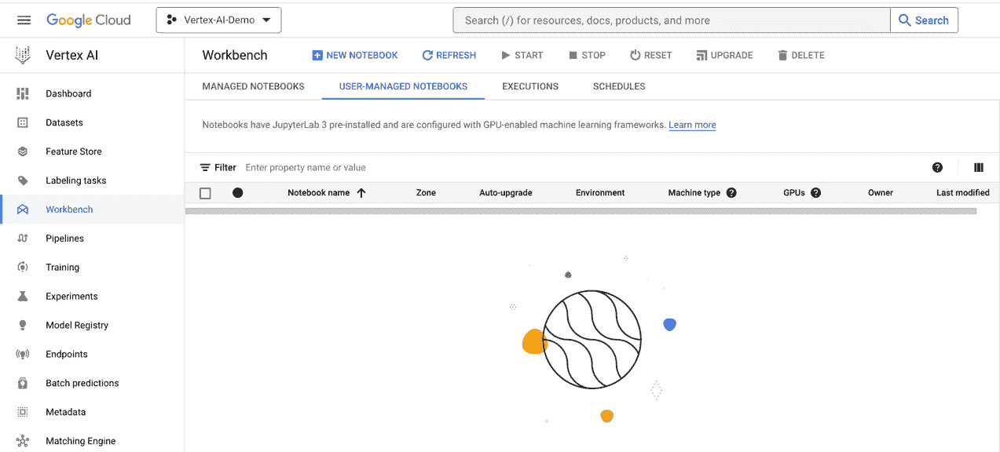

图 4.3 – Google Cloud 控制台中 Vertex AI 工作台 UI

如我们所见，Vertex AI Workbench 主要是作为服务的 Jupyter Notebook，同时具有使用托管以及用户托管笔记本的灵活性。用户托管笔记本适用于需要相对更高控制度的定制化环境的使用场景。关于用户托管笔记本的另一件好事是我们可以根据我们的开发需求选择合适的 Docker 容器；这些笔记本还允许我们通过重启来更改实例的类型/大小。

要为特定项目选择最佳的 Jupyter Notebook 选项，了解两种解决方案之间的常见差异很重要。*表 4.1* 描述了完全托管和用户托管笔记本之间的某些常见差异：

| **Vertex AI 管理笔记本** | **Vertex AI 用户管理笔记本** |
| --- | --- |
| 提供集成和功能，为我们提供一个端到端基于笔记本的生产环境，无需手动设置任何内容。 | 高度可定制的虚拟机实例（带有预构建的深度学习镜像），非常适合需要大量控制环境的用户。 |
| 可以在笔记本内部进行横向和纵向扩展（对于 vCPU 和 RAM），无需重新启动环境。 | 改变实例的大小/内存需要在 Workbench UI 中停止实例，并每次重新启动它。 |
| 管理笔记本让我们能够在不离开 Jupyter 环境的情况下浏览来自 **Google Cloud Storage** （**GCS**） 和 BigQuery 的数据（带有 GCS 和 BigQuery 集成）。 | 在用户管理笔记本中不支持 UI 级别的数据浏览。然而，我们可以使用笔记本中的 Python 读取数据并查看它。 |
| 支持一次性和重复性计划的自动化笔记本运行。执行器运行计划任务并保存结果，即使实例处于关闭状态。 | 在用户管理环境中尚不支持自动化运行。 |
| 对网络和安全的控制较少。 | 可根据需要实施所需的网络和安全功能以及 VPC 服务控制。 |
| 在设置笔记本时对基于深度学习的环境控制不多。 | 用户托管实例在创建笔记本时提供多个深度学习虚拟机选项。 |

表 4.1 – 管理和用户管理笔记本实例之间的差异

让我们创建一个用户管理的笔记本来检查可用的选项：

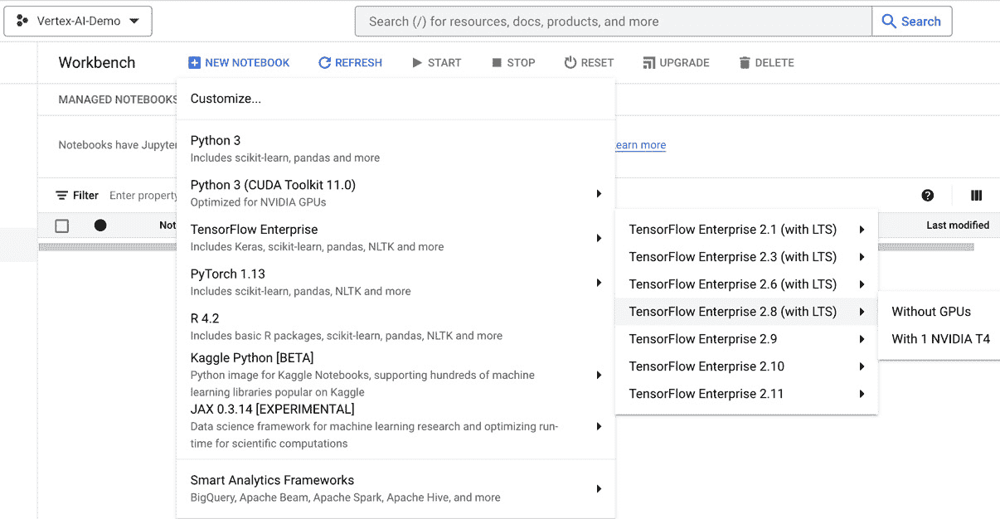

图 4.4 – Jupyter Notebook 内核配置

如前一个屏幕截图所示，用户管理的笔记本实例提供了几个自定义图像选项供选择。除了支持 TensorFlow Enterprise、PyTorch、JAX 等工具之外，它还允许我们决定是否想要使用 GPU（当然，根据需要可以稍后更改）。这些自定义图像为所需的框架预装了所有有用的库，并提供在实例内安装任何第三方软件包的灵活性。

选择合适的镜像后，我们可以获得更多选项来自定义笔记本名称、笔记本区域、操作系统、环境、机器类型、加速器等（参见以下屏幕截图）：

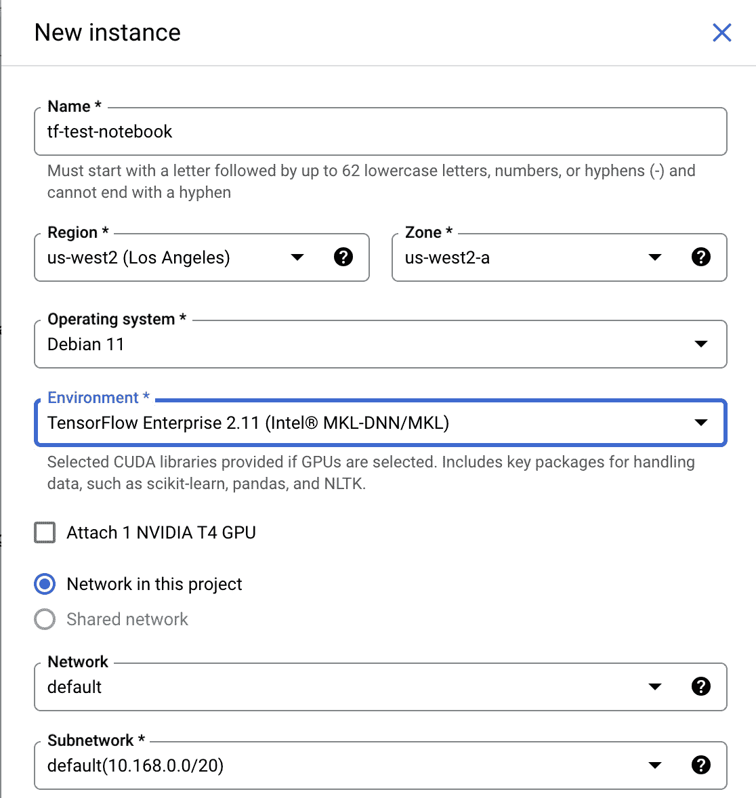

图 4.5 – 配置新的用户管理的 Jupyter Notebook

一旦我们点击 **创建** 按钮，创建笔记本实例可能需要几分钟。一旦准备好，我们可以使用 Workbench 内提供的链接在浏览器标签页中启动 Jupyter 实例（参见 *图 4**.6*）。我们还有在不用它时暂时停止笔记本的选项（以降低成本）：

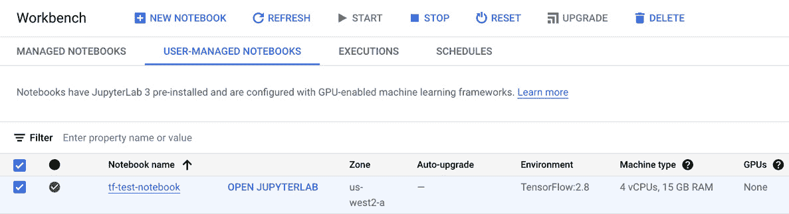

图 4.6 – 运行的 Jupyter Notebook 实例

这个 Jupyter 实例可以被所有有权访问 Workbench 的团队成员访问，这有助于与其他团队成员协作和分享进度。一旦我们点击 **打开 JupyterLab**，它将在新标签页中打开一个熟悉的 Jupyter 环境（参见 *图 4**.7*）：

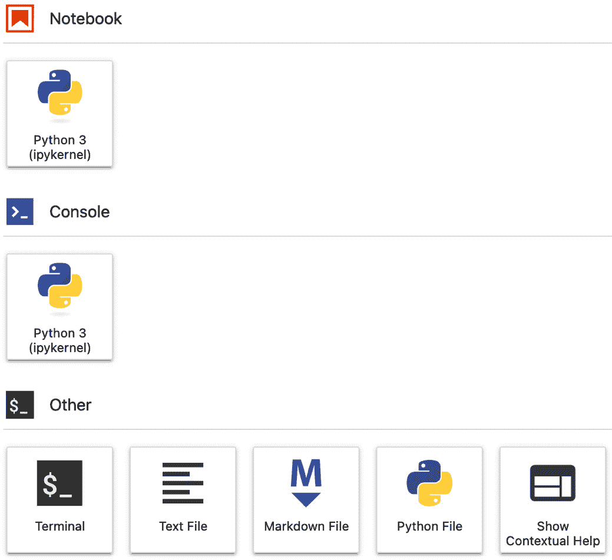

图 4.7 – Vertex AI Workbench 中的用户管理的 JupyterLab 实例

由 Google 管理的 JupyterLab 实例看起来也非常相似（参见 *图 4**.8*）：

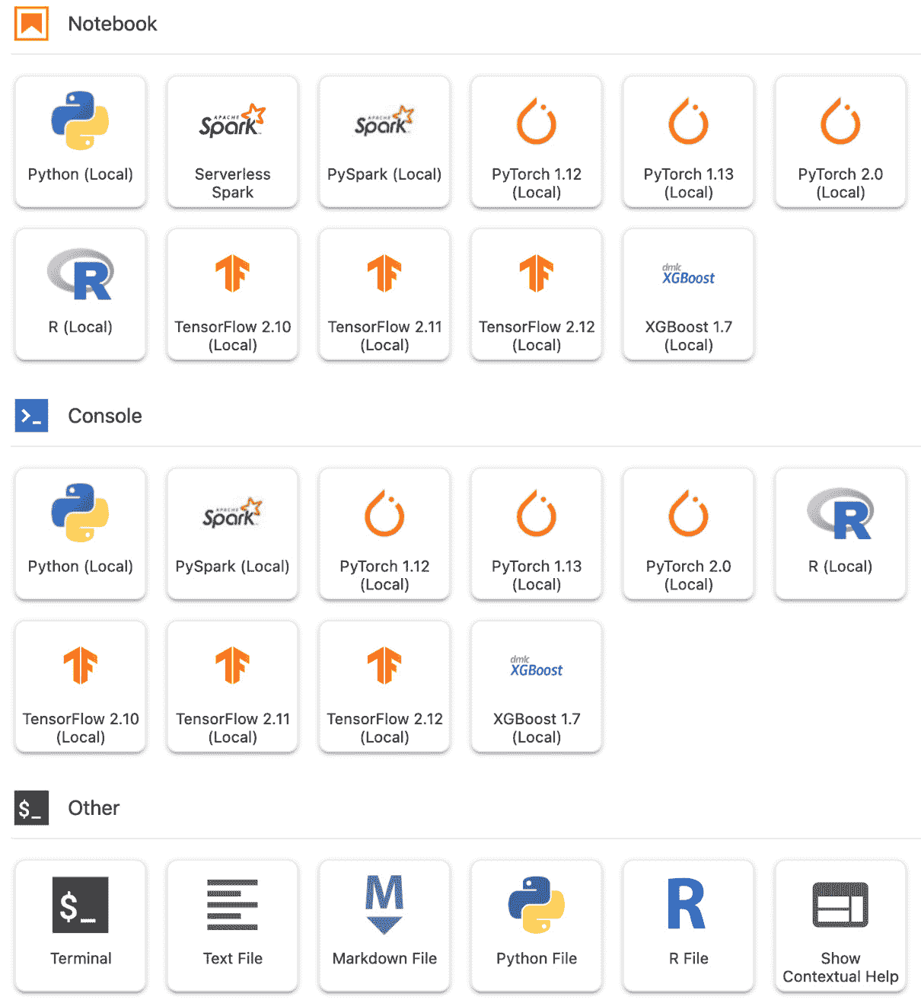

图 4.8 – Vertex AI Workbench 中的由 Google 管理的 JupyterLab 实例

现在我们可以通过浏览器访问笔记本实例，我们可以启动一个新的 Jupyter Notebook 或终端，开始项目。一旦为服务账户提供了足够的权限，我们就可以通过 SDK 从 Jupyter Notebook 本身访问许多有用的 Google Cloud 服务，如 BigQuery、GCS、Dataflow 等。这使得 Vertex AI Workbench 成为每个机器学习开发需求的终极工具。

注

当我们不再使用 Vertex AI Workbench 实例或计划长时间不使用时，我们应该停止这些实例。这将帮助我们避免因长时间不必要的运行而产生费用。

在接下来的部分，我们将学习如何使用定制容器创建笔记本以及如何使用 Vertex AI 工作台安排笔记本。

# 适用于 Vertex AI 工作台的定制容器

Vertex AI 工作台还提供了基于定制容器的笔记本实例创建的灵活性。基于定制容器的笔记本的主要优势是它允许我们根据我们的特定需求自定义笔记本环境。假设我们想要使用当前作为预定义内核不可用的新的 TensorFlow 版本（或任何其他库）。我们可以创建一个包含所需版本的定制 Docker 容器，并使用此容器启动一个 Workbench 实例。定制容器由托管和非托管笔记本都支持。

以下是如何使用定制容器启动用户管理的笔记本实例的步骤：

1.  第一步是根据要求创建一个定制容器。大多数情况下，派生容器（基于现有深度学习容器镜像的容器）设置起来会很容易。请参阅以下示例 Dockerfile；在这里，我们首先拉取现有的 TensorFlow GPU 镜像，然后从源安装新的 TensorFlow 版本：

    ```py
    FROM gcr.io/deeplearning-platform-release/tf-gpu:latest
    RUN pip install -y tensorflow
    ```

1.  接下来，构建并推送容器镜像到**容器注册库**，使其对**Google Compute Engine**（GCE）服务账户可访问。请参阅以下源代码以构建和推送容器镜像：

    ```py
    export PROJECT=$(gcloud config list project --format     "value(core.project)")
    docker build . -f Dockerfile.example -t "gcr.io/${PROJECT}/tf-custom:latest"
    docker push "gcr.io/${PROJECT}/tf-custom:latest"
    ```

    注意，服务账户应提供足够的权限来构建和推送镜像到容器注册库，并且相应的 API 应该被启用。

1.  前往**用户管理笔记本**页面，点击**新建笔记本**按钮，然后选择**自定义**。提供笔记本名称并选择合适的**区域**和**区域值**。

1.  在**环境**字段中，选择**定制容器**。

1.  在**Docker 容器镜像**字段中，输入定制镜像的地址；在我们的例子中，它看起来像这样：

    ```py
    gcr.io/${PROJECT}/tf-custom:latest
    ```

1.  进行剩余的适当选择并点击**创建**按钮。

现在我们已经准备就绪。在启动笔记本时，我们可以选择定制容器作为内核，并开始在定制环境中工作。

现在我们可以成功启动 Vertex AI 笔记本，并在需要时创建基于定制容器的环境。在下一节中，我们将学习如何在 Vertex AI 中安排笔记本运行。

# 在 Vertex AI 中安排笔记本

Jupyter Notebook 环境非常适合进行一些初步实验。但是，当涉及到启动长时间运行的任务、具有不同输入参数（如超参数调整任务）的多个训练试验或向训练任务添加加速器时，我们通常会将代码复制到 Python 文件中，并使用自定义 Docker 容器或托管管道（如 Vertex AI 管道）来启动实验。考虑到这种情况，为了最小化工作重复，Vertex AI 管理笔记本实例为我们提供了在临时或重复基础上安排笔记本的功能。此功能允许我们在 Vertex AI 上逐个执行安排好的笔记本单元格。它为我们提供了无缝扩展处理能力和选择适合任务的硬件的灵活性。此外，我们还可以传递不同的输入参数以进行实验。

## 配置笔记本执行

让我们尝试配置笔记本执行以检查它提供的各种选项。想象我们正在构建一个玩具应用，它接受两个参数–`user_name` 和 `frequency`–当执行时，它会将 `user_name` 参数打印出与 `frequency` 参数相同次数。现在，让我们启动一个托管笔记本并创建我们的应用，如下所示：

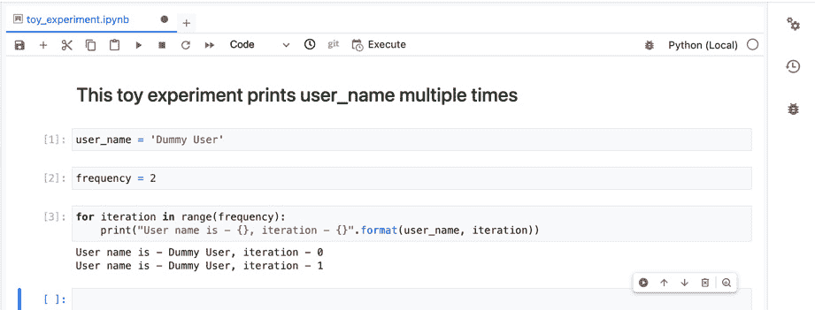

图 4.9 – Jupyter Notebook 内的一个简单 Python 应用

接下来，将所有参数放入单个单元格中，然后点击右上角的齿轮形按钮。将此单元格标记为 *parameters*。请参阅以下截图：

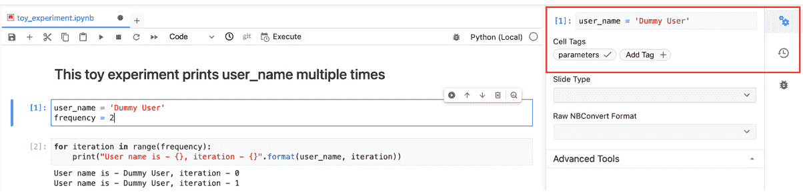

图 4.10 – 在 Jupyter Notebook 单元格内标记参数

我们的玩具应用现在已准备就绪。一旦您从工具栏中点击 **执行** 按钮，它就会提供自定义机器类型、加速器、环境（可以是自定义 Docker 容器）和执行类型–单次或重复执行的选项。请参阅以下截图：

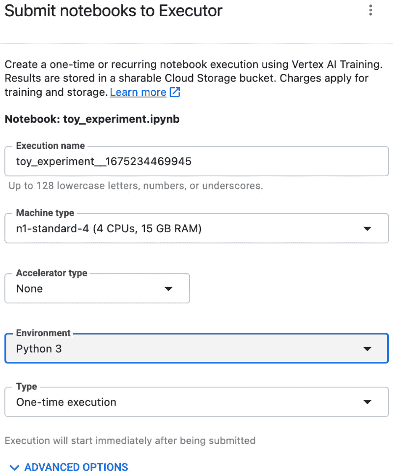

图 4.11 – 配置笔记本执行以用于 Python 应用

接下来，让我们通过点击 **高级选项** 来更改我们的单次执行参数。在这里，我们可以为参数名称和值提供键值对。请参阅以下截图：

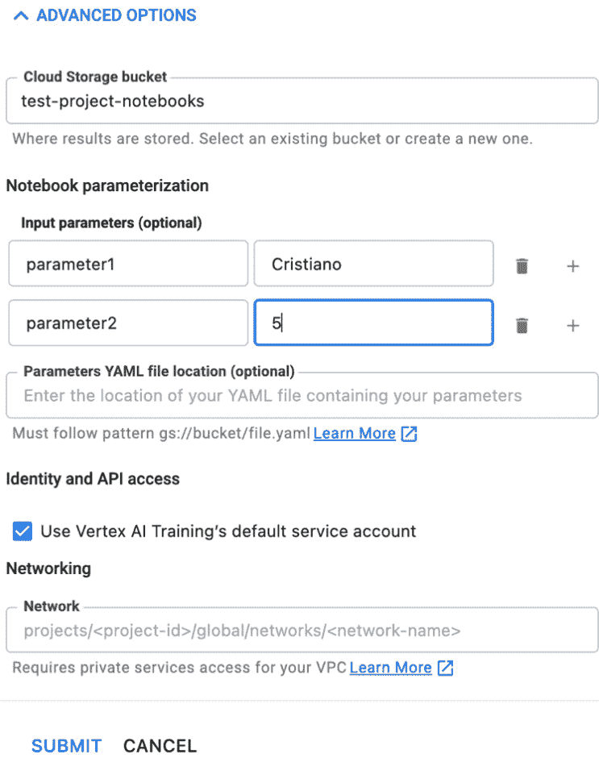

图 4.12 – 为单次执行设置参数

最后，点击 **提交** 按钮。然后，它将显示以下对话框：

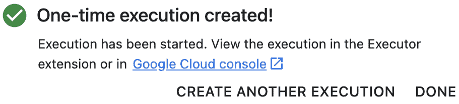

图 4.13 – 已安排的单次执行

现在我们已经在 Vertex AI 上成功安排了笔记本运行，并带有自定义参数。我们可以在 Vertex AI UI 的 **执行** 部分找到它：

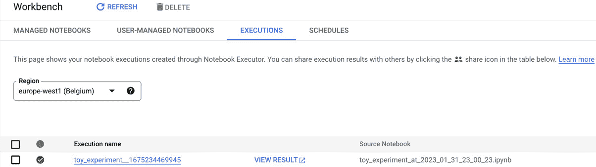

图 4.14 – 检查已执行笔记本实例的 EXECUTIONS 部分

我们现在可以通过点击**查看结果**来检查结果。查看以下截图了解它是如何覆盖输入参数的：

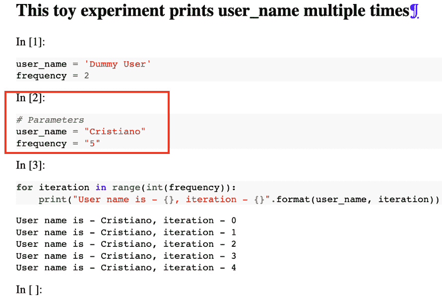

图 4.15 – 检查执行结果

同样，我们可以在不将代码移出笔记本的情况下安排大型一次性或重复性实验，并利用云平台的可扩展性。

我们刚刚看到了在 Vertex AI Workbench 中配置和安排笔记本运行是多么容易。这种能力使我们能够在保持笔记本中的代码的同时进行无缝实验。这也有助于在开发环境中设置重复性作业。

# 摘要

在本章中，我们学习了 Vertex AI Workbench，这是一个在 Google Cloud 上启动 Jupyter Notebook 应用程序的托管平台。我们讨论了在云环境中有笔记本相比于本地环境的优势。在云中拥有 Jupyter Notebook 使其非常适合协作、扩展、增加安全性和启动长时间运行的任务。我们还讨论了 Vertex AI Workbench 的一些附加功能，这些功能在处理 ML 项目开发的不同方面时非常有用。

在阅读本章之后，我们应该能够成功部署、管理和使用 Vertex AI 平台上的 Jupyter Notebook 来满足我们的 ML 开发需求。由于我们理解了托管和用户托管笔记本实例之间的区别，我们应该能够为我们的开发需求选择最佳解决方案。我们还应该能够根据需要创建基于自定义 Docker 容器的笔记本。最重要的是，我们现在应该能够根据需求安排笔记本运行，以进行重复性以及一次性执行。笔记本调度对于并行启动具有不同输入参数的多个模型训练实验也非常有用。现在我们已经对 Vertex AI Workbench 有了良好的背景知识，这将使我们更容易跟随即将到来的章节中的代码示例。
