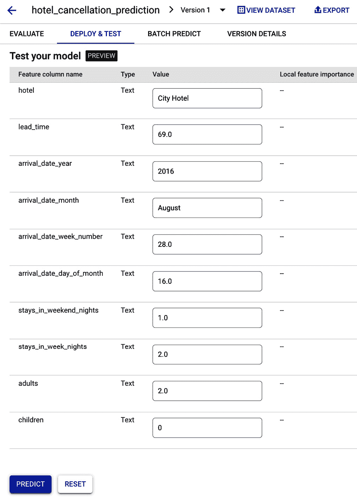

# 第五章：无代码构建机器学习模型选项

近年来，机器学习领域经历了深刻的变革，摆脱了专家数据科学家和工程师的领域，赋予更广泛的受众以力量。无代码机器学习平台的兴起引领了一个新时代，不同技能和背景的个人可以借助人工智能的力量解决复杂挑战，而无需编写任何代码。这种机器学习的民主化不仅加速了开发过程，还为企业和个人 alike 开辟了无数机会。

在本章中，我们将深入探讨无代码机器学习的基础，揭示 Google Cloud Vertex AI 提供的卓越工具和服务。我们将探讨用户如何利用预构建的机器学习模型、AutoML 功能和可视化界面轻松构建复杂且高度精确的模型。从计算机视觉到自然语言处理和表格数据分析，Google Cloud Vertex AI 覆盖了广泛的用例，使人工智能应用开发对每个人来说都变得民主化。

本章我们将涵盖的关键主题包括以下内容：

+   什么是 AutoML？

+   什么是 Vertex AI AutoML？

+   使用 Vertex AI AutoML 创建和部署模型

+   从部署的 Vertex AI 模型获取预测

让我们先看看 Google Cloud 提供的不同解决方案，以促进无需代码的模型创建。

# Google Cloud 中的机器学习建模选项

Google Cloud 在 Vertex AI 和更广泛的 **Google Cloud Platform** (**GCP**) 内提供多种解决方案，用于构建和消费机器学习模型。这些解决方案在所需的数据科学和编码技能方面差异很大，满足高级 ML 工程师、相对不太技术化的商业分析师以及介于这两者之间的人员。以下三个主要的 GCP 模型创建解决方案如下：

+   **Big Query ML (BQML)**：这是 BigQuery 平台的一部分，只需了解 SQL，用户就可以训练和使用模型在结构化数据上生成预测。关于 BQML 的更多细节将在 *第六章* 中介绍，*低代码构建机器学习模型*。

+   **Vertex AI AutoML**：这允许用户在无需编码甚至 SQL 知识的情况下构建模型，并且主要基于 GUI。然而，如果需要，它有可编程访问的 API。

+   **Vertex AI 定制训练**：此选项为用户提供在模型训练和部署方面的完全灵活性，但也要求具备基本的编码能力。

下表显示了 Google Cloud 中创建机器学习模型的不同选项的比较：

|  | **BQML** | **Vertex AI AutoML** | **Vertex AI 定制** |
| --- | --- | --- | --- |
| 编码要求 | 非常低 | 无 | 高 |
| 需要的机器学习工程专业知识 | 低 | 低 | 中等到高，取决于模型类型 |
| 数据大小限制 | 是。适用标准 BigQuery 配额和限制。 | 是。数据集限制因所使用的数据集类型而异（请参阅 GCP 文档了解当前限制）。 | 对于未管理的数据集，GCP 不设置限制。 |
| 支持的模型类型 |

+   线性回归

+   逻辑回归

+   KMEANS

+   矩阵分解

+   主成分分析

+   自动编码器

+   自动 ML 分类器

+   自动 ML 回归器

+   提升树分类器

+   提升树回归器

+   随机森林分类器

+   随机森林回归器

+   DNN 分类器

+   DNN 回归器

+   DNN 线性组合分类器

+   DNN 线性组合回归器

+   ARIMA PLUS

+   ARIMA PLUS XREG

+   TENSORFLOW

+   TENSORFLOW LITE

+   ONNX

+   XGBOOST

| 图像：

+   分类

+   目标检测

文本：

+   分类

+   实体提取

+   情感分析

视频：

+   行为识别

+   分类

+   目标跟踪

表格：

+   回归

+   分类

+   时间序列预测

| 构建任何类型机器学习的完全灵活性 |
| --- |
| 模型开发速度 | 快速。需要一些数据准备，但训练可以大部分自动化。 | 快速。最小化数据准备和完全自动化的模型训练。 | 较慢。需要更多的数据准备。需要显著的设计和训练管理。 |
| 对模型生成的灵活性/控制 | 中等 | 低 | 高 |
| 工具是否支持特征工程？ | 是 | 否 | 是 |

表 5.1 – Google Cloud 中机器学习模型创建选项

如前表所示，Vertex AI AutoML 是作为 Google Cloud 的一部分提供的无代码模型创建选项的关键。当 AutoML 最初作为 GCP 的一部分推出时，它曾经是一个独立的产品。现在，它是 Vertex AI 平台整体的一部分，并且遗留的 AutoML 产品正在计划中，将逐步淘汰。现在，让我们了解什么是 AutoML 以及您如何使用 GCP 中可用的 AutoML 功能。

# 什么是 AutoML？

AutoML 指的是自动化构建机器学习模型的过程的方法，包括数据预处理、特征工程、模型选择、超参数调整和模型部署。AutoML 旨在使机器学习对非专业人士更加易于访问和高效，通过减少构建模型中涉及的手动工作，为专家节省时间和资源。市场上不同类型的 AutoML 产品提供不同级别的自动化。有些只是自动化了训练和超参数部分，而有些则通过自动化数据预处理和特征生成的步骤实现了端到端的自动化。

AutoML 工具允许用户指定他们的要求，例如准确性、可解释性或训练时间，然后根据这些标准自动选择和训练最佳模型。它可以用于各种类型的机器学习任务，包括在结构化和非结构化数据集上的分类、回归和时间序列预测。近年来，AutoML 技术得到了快速发展，现在能够以最小的人为干预处理许多复杂的机器学习用例。然而，您需要小心过度依赖 AutoML。它不是机器学习和数据科学深入理解的替代品，而是一种可以帮助使这些过程更高效和易于访问的工具。当由不了解机器学习基础的人使用时，AutoML 工具可能存在风险，因为它们可以生成看似高性能的模型，同时仍然存在数据泄露和过拟合等常见问题。因此，现在我们已经对 AutoML 的概念有了基本的了解，它是与模型开发相关的，让我们来看看 Vertex AI 中可用的 AutoML 功能。

# Vertex AI AutoML

Google Cloud 中的 AutoML 工具比 Vertex AI 存在的时间要长得多，Vertex AI 的推出主要是为了统一 GCP 中存在的多数独立的机器学习产品。GCP AutoML 利用 NASNet 等模型，并不断从 Alphabet 团队其他部门（如 Google DeepMind）的 AI 研究中受益。以下列出了该主题的一些有趣论文：

+   *可扩展图像识别的可迁移架构学习*。[`arxiv.org/pdf/1707.07012.pdf`](https://arxiv.org/pdf/1707.07012.pdf)

+   *图像分类器架构正则化进化搜索*。[`arxiv.org/pdf/1802.01548.pdf`](https://arxiv.org/pdf/1802.01548.pdf)

+   *大规模图像分类器进化*。[`arxiv.org/pdf/1703.01041.pdf`](https://arxiv.org/pdf/1703.01041.pdf)

Vertex AI AutoML 支持的使用案例如下：

+   表格数据：

    +   分类（本章节有介绍示例）

    +   回归

    +   时间序列预测

+   图像数据：

    +   图像分类（例如，在第 *第八章* 中有介绍）

    +   目标检测

+   自然语言：

    +   文本分类

    +   实体提取

    +   情感分析

## 如何使用表格数据创建 Vertex AI AutoML 模型

在以下使用案例中，我们将向您展示如何使用包含酒店预订数据的公共数据集构建分类模型的步骤。该模型的目标将是预测特定酒店预订被客户取消的概率，帮助酒店更好地规划未来客房的入住情况，并在他们预计有大量取消的日期可能允许超预订：

+   您可以在此处访问酒店预订数据集：[`www.kaggle.com/datasets/jessemostipak/hotel-booking-demand`](https://www.kaggle.com/datasets/jessemostipak/hotel-booking-demand)

+   您可以从本书附带的 GitHub 仓库下载数据：[`github.com/PacktPublishing/The-Definitive-Guide-to-Google-Vertex-AI`](https://github.com/PacktPublishing/The-Definitive-Guide-to-Google-Vertex-AI)

# 将数据导入到 Vertex AI AutoML 中使用

在计划使用 Vertex AI AutoML 功能时，第一步是导入您打算用于训练的 Vertex AI 数据集：

1.  在 Google Cloud 控制台中导航到 **Vertex AI** | **数据集**，然后点击 **创建** 以开始创建新的 Vertex AI 数据集。


图 5.1 – 创建 Vertex AI 数据集

1.  输入数据集的名称，选择 **表格** 作为数据类型，选择 **回归/分类**，然后点击 **创建**。


图 5.2 – 选择数据集类型和模型目标

1.  上传您之前从 GitHub 仓库下载的名为 `hotel_reservation_data.csv` 的文件。

![img/B17792_05_3.jpg]

图 5.3 – 指定数据源

1.  输入您希望存储导入文件的 GCS 位置的路径。如果您之前还没有创建 GCS 存储桶，请点击 `us-central1`。对于所有其他提示，您可以选择默认选项（*图 5.4*.4*）。

注意

在 GCP 上创建的资源位置一致性很重要，因此在这本书中，我们将尽量使用 `us-central1` 作为位置。


图 5.4 – 选择云存储位置

1.  接下来，在您希望存储导入文件的存储桶中创建一个文件夹。点击右上角的 **Folder+** 符号，然后为文件夹提供一个名称。然后，点击 **创建**。最后，突出显示刚刚创建的文件夹并点击 **选择**。

图 5.5 – 创建存储数据集的文件夹

1.  一旦选择了存储桶和文件夹路径，请点击屏幕底部的 **继续**，这将开始将 CSV 文件导入到 Vertex AI 数据集中。

1.  数据导入完成后，您将被带到 `hotel_cancellation_prediction` 或 <*您为数据集指定的名称*> 路径。在这里，所有特征统计信息都将为空。要生成这些统计信息，您可以点击 **生成统计信息**，这将启动分析特征数据并计算详细统计信息的过程。

![img/B17792_05_6.jpg]

图 5.6 – 为数据集生成统计信息

1.  此过程完成后，您可以通过点击特定的特征来查看更多详细信息，例如以下内容：

    +   独特值计数

    +   字段中数据缺失的百分比

    +   特征值分布


图 5.7 – 分析数据集的关键统计数据

上述截图显示了解释特征/字段“`market_segment`”分布的图表。

现在，让我们看看如何使用上面讨论的数据集来训练一个 **AutoML 分类** 模型。

## 训练用于表格/结构化数据的 AutoML 模型

现在，让我们看看如何使用 Vertex AI AutoML 在表格数据上训练机器学习模型：

1.  在您想要用于训练模型的数据集的 **ANALYZE** 选项卡中，点击 **TRAIN NEW MODEL** | **其他**。


图 5.8 – 训练新模型

1.  由于我们正在尝试根据预订的取消可能性对预订进行分类，因此选择模型目标为 **分类**。选择 **AutoML** 作为训练方法，它使用无代码的自动化训练选项。然后，点击 **继续**。


图 5.9 – 指定模型类型

1.  在接下来的 `is_canceled`。

1.  如果您希望将 **测试** 结果导出到 BigQuery 以进行进一步分析，请选择 **导出测试数据集到 BigQuery** 选项，并提供一个 BigQuery 表路径，以便存储这些结果。Vertex AI 将在训练运行后创建该表。

1.  如果您希望 Vertex AI 随机将数据分割成 **训练**、**验证** 和 **测试** 数据集，请保留默认选项 **随机**。如果您想要控制样本分配到 **训练**、**验证** 和 **测试** 数据集，请选择 **手动** 选项。在这种情况下，您需要提供一个列，其中提供 **训练**/**验证**/**测试** 分配。


图 5.10 – 配置模型训练选项

1.  在接下来的 `reservation_status`

1.  `reservation_status_date`


图 5.11 – 选择要删除的特征

此外，请确保 Vertex AI 默认为每个字段正确设置了转换类型。为了用于模型训练，表格数据必须经过针对每个数据特征的特定转换过程。这个过程表明了特定数据特征的功能。支持的转换类型如下：

+   **分类**: 当在 Vertex AI 中使用分类特征训练模型时，该特征会经过数据转换，有助于模型训练过程。Vertex AI 对该特征应用以下转换，并使用任何提供有用信息的转换：

    +   分类字符串保持不变，没有对大小写、标点、拼写、时态和其他属性进行修改。

    +   类别名称被转换为字典查找索引，并为每个索引生成一个嵌入。

    +   在训练数据集中出现次数少于五次的类别被认为是**未知**类别。**未知**类别被分配一个唯一的查找索引，并为该类别生成嵌入。

+   **文本**：经过文本转换的特征被视为自由文本，通常由文本标记组成。文本被分词成单词，并从这些单词中生成 1-gram 和 2-gram。然后，每个*n*-gram 被转换为字典查找索引，并为每个索引生成嵌入。最后，使用平均值将所有元素的嵌入组合成一个单一的嵌入。

+   `float32`类型的数据不包括在训练和预测过程中。

+   值被转换为`float32`。

+   计算值的*z*-分数。

+   值基于分位数进行分桶，桶大小为 100。

+   当值大于或等于 0 时，计算(`value+1`)的对数。如果值小于 0，则不应用此转换，该值被视为缺失值。

+   当值大于或等于 0 时，计算(`value+1`)的对数的*z*-分数。如果值小于 0，则不应用此转换，该值被视为缺失值。

+   被分配一个布尔值来指示该值是否为`null`。

+   **时间戳**：以下数据转换应用于特征，任何提供有用信息的都会用于训练：

    +   确定时间戳的年、月、日和星期几，并将它们视为分类列

    +   无效的数值，例如超出典型时间戳范围或极端值，不会被移除或特殊处理

    +   对数值列的转换应用于特征

    +   包含无效时间戳输入的行，例如无效的时间戳字符串，不包括在训练和预测过程中

1.  如果您想向模型提供额外的权重以重新平衡数据集，您可以提供一个包含分配给每个数据样本的权重的额外列。

1.  如以下截图所示，默认情况下，优化目标是设置为最大化 AUC ROC 曲线。


图 5.12 – 选择优化目标

虽然不是必需的，但您有选项更改优化目标。

对于分类问题，有五种不同的目标：

+   **AUC ROC**：在 AutoML 中，此目标最大化接收者操作特征曲线下的面积。这是二分类的默认选择，也可以选择以区分类别。

+   **对数损失**：此目标旨在最小化模型的对数损失。当目标是尽可能准确地预测概率时使用，并且是 AutoML 中多类分类模型唯一支持的目标。

+   **AUC PR**：此目标旨在最大化精度-召回曲线下的面积。它优化了对较少见类别的预测结果。

+   **在特定召回率下的精度**：此目标旨在在特定召回率值下最大化精度。

+   **在特定精度下的召回率**：此目标旨在在特定精度值下最大化召回率。

对于回归问题，有三个不同的目标：

+   **RMSE**：此目标旨在最小化均方根误差。它能够更准确地捕捉极端值。

+   **MAE**：此目标旨在最小化平均绝对误差。它将极端值视为对模型影响较小的异常值。

+   **RMSLE**：此目标旨在最小化均方根对数误差。它对相对大小而不是绝对值的误差进行惩罚，并且在预测值和实际值都相当大时特别有用。

1.  提供您希望训练运行的最大时间。最小需要为一小时。在第一次运行期间，很难知道模型需要多长时间才能达到最高可能的准确度，并且您可能需要对新数据集和模型类型进行一些实验设置。

最佳实践

对于大多数小型数据集（< 1 百万个数据样本和< 20 个特征），两到四小时是一个良好的起点。如果**启用早期停止**选项开启，无论您为训练预留了多少小时，一旦 AutoML 确定进一步训练的轮次无法在模型目标上实现进一步改进，训练将停止。

1.  最后，如图下截图所示，点击**开始训练**以启动训练过程。几小时后，您将有一个崭新的模型可供评估。


图 5.13 – 开始模型训练

一旦模型训练完成，让我们看看您如何评估 AutoML 创建的模型。

### 评估训练后的模型

每次训练机器学习模型时，评估其性能以确定其是否适用于现实世界应用至关重要。模型评估指标是基于模型对在训练期间未使用的部分数据集（称为测试数据集）的性能计算的。这种评估提供了模型如何泛化到新、未见数据的信息，并有助于识别任何问题或改进领域：

1.  前往 Vertex AI 中的**模型注册**，如图下截图所示，找到您刚刚训练的模型。点击该模型，然后在下一屏幕上，点击您刚刚训练的模型版本。


图 5.14 – 模型注册

1.  在**评估**选项卡上，您将看到 AutoML 使用在训练期间提供的测试数据集生成的测试结果详情。


图 5.15 – 模型评估指标

这里是根据模型类型在 Vertex AI **评估**标签页中通常显示的关键信息：

+   置信度阈值：当与分类模型一起工作时，预测会被赋予一个置信度分数来表示预测类别正确的确定性水平。这个分数是一个数值评估，决定了模型对预测准确性的确信程度。例如，考虑一个预测客户是否会取消酒店预订的机器学习模型：

    +   为了将分数转换为二元决策，使用了一个分数阈值。分数阈值是模型说“*是的，置信度分数足够高，可以得出结论，客户将取消他们的预订*”或“*不，置信度分数不足以预测客户将取消预订*”的值。分数阈值应根据特定用例确定，低分数阈值会增加误分类的风险。

+   精确度和召回率：在分类模型中，精确度和召回率是评估和总结模型如何捕捉信息以及避免错误的重要指标：

    +   精确度：精确度回答了问题，“*在所有预测的酒店预订取消中，实际取消了多少？*”它衡量模型正预测的准确性——即所有预测正例中真实正例的百分比。

    +   召回率：召回率回答了问题，“*在所有取消的酒店预订中，模型正确预测了多少？*”它衡量模型识别真实正例的能力——即所有实际正例中真实正例的百分比。

根据具体用例，你可能需要优化精确度或召回率。例如，如果你想最小化错误负例的数量（即被取消但模型未识别的酒店预订），那么你应该追求高召回率。如果你想减少错误正例的数量（即未被取消但被预测为取消的酒店预订），那么你应该追求高精确度。

除了精确度和召回率之外，还有其他几个分类指标可以用来评估机器学习模型的性能。以下是一些最常用的指标：

+   **AUC PR**：PR 曲线下的面积衡量了在不同分数阈值下精确度和召回率之间的权衡。AUC PR 的范围从零到一，其中更高的值表示质量更高的模型。

+   **AUC ROC**：ROC 曲线下的面积衡量了模型在所有可能的分数阈值下的性能。AUC ROC 的范围从零到一，其中更高的值表示质量更高的模型。

+   **准确率**：模型产生的分类预测中正确的比例。这是一个简单直观的指标，提供了对模型性能的整体衡量。

+   **对数损失**：对数损失，也称为交叉熵，是评估模型预测与实际目标值之间一致性的关键指标。该指标通过衡量模型的预测与实际世界结果之间的接近程度来量化模型性能的有效性。该指标的范围从零到无穷大，较低的日志损失表示质量更高的模型，展示了其做出更准确和自信预测的能力。

+   **F1 分数**：在寻求精确度和召回率之间的平衡，尤其是在类别分布不平衡的场景中，F1 分数成为一个有价值的指标。这个分数代表精确度和召回率的调和平均值，其范围从零到一。更高的 F1 分数表示质量更高的模型，表明它在具有挑战性的类别分布场景中能够有效地实现精确度和召回率。

通过使用这些指标，您可以更全面地了解模型的表现，并做出更明智的决策来改进它。

**评估**标签页还展示了两个额外的有用信息：

+   **混淆矩阵**：混淆矩阵是一种可视化工具，它显示了模型正确预测结果的频率，以及当模型错误预测结果时，矩阵显示了模型预测的内容。混淆矩阵是一种有助于理解模型可能在哪些方面“混淆”两个结果，以及诊断模型准确性和性能的有用方法。


图 5.16 – 混淆矩阵

+   **特征重要性**：模型特征重要性以每个特征的百分比表示，百分比越高表示对模型训练的影响越强。通过查看特征重要性值，我们可以更好地理解模型中不同特征的相对重要性以及它们如何有助于预测的准确性。以下截图显示了我们所训练的模型的特征重要性图。


图 5.17 – 特征重要性

因此，我们已经训练了一个模型并评估了其关键性能指标。现在，让我们看看如何部署它以及如何使用它来生成预测。

# 使用最近训练的模型生成预测

一旦 AutoML 模型训练完成，您可以使用以下两种方法之一生成预测：

+   **批量预测**：如名称所示，批量预测是为一批输入生成的异步预测。当不需要实时响应且您想提交单个请求处理多个数据实例时，会使用此功能。在 Vertex AI 中，可以直接向 Vertex AI 模型注册表中的模型提交批量预测请求，而无需将其部署到端点。

+   **在线预测**：如果您需要实时推理 – 例如，在响应应用程序输入时 – 您需要使用 Vertex AI 在线预测选项。要使用在线预测，您必须首先将模型部署到端点。此步骤配置基础设施资源，并使用指定的模型部署预测服务机制，使其能够以低延迟提供预测。部署模型的步骤将在下一节中展示。

重要提示

在 Vertex AI 端点上部署的模型将持续产生费用，无论其使用情况如何。这可能会根据底层 VM 类型快速增加，尤其是如果您正在使用 GPU。

在下一节中，我们将部署我们在 Vertex AI 上训练的 ML 模型以生成在线预测。

# 在 Vertex AI 中部署模型

现在，让我们带您了解在 Vertex AI 上部署训练模型以启用实时预测的步骤：

1.  前往 **模型注册表**，点击模型，然后点击您想要部署的模型版本，在 **部署 & 测试** 选项卡上，点击 **部署** **到端点**。


图 5.18 – 启动模型部署

1.  输入要创建的 API 端点的期望名称，然后点击 **继续**。


1.  您可以保留所有默认选项不变以进行快速测试部署，但这些都是您需要了解的设置：

    +   **流量分配**：如果同一 API 端点部署了多个模型版本，此选项允许用户定义分配给特定版本的流量百分比。例如，在部署新模型时，您可能只想将 2% 的整体传入数据路由到新模型以进行测试，同时继续将剩余的 98% 数据发送到现有模型的版本。在将模型部署到新端点时，您需要将此值保留为 100%，因为没有其他模型来分担工作负载。

    +   **最小计算节点数**：这是始终可用的最小计算节点数，用于处理推理请求。即使没有正在处理的请求，这些节点也将持续部署并产生费用。

    +   **最大计算节点数**：在自动扩展过程中，随着 incoming 请求数量的增加，Vertex AI 将自动增加已部署节点的数量，直到达到这个数量。

    +   **机器类型**：这涉及到支持在线推理的节点配置，包括 CPU 和内存。

    +   **可解释性选项**：如果你希望每次推理都生成**特征重要性**值，请选择此选项。

    +   在做出所需更改后，点击**继续**。


图 5.20 – 指定模型部署配置

1.  在**模型监控**页面上，暂时关闭监控。我们将在*第十一章**，Vertex AI 的 MLOps 治理中详细讲解模型监控。点击**部署**。这将启动新端点的端点创建过程，然后是模型部署过程。

模型部署完成后，我们可以使用模型生成以下所示的实时预测。

# 生成预测

模型部署完成后，你将在**部署 & 测试**标签页中看到列出的端点。下面将有一个**测试你的模型**表格，列出生成预测所需的所有特征值。字段将基于用于 AutoML 训练的数据自动填充起始值，但你可以输入不同的值并点击**预测**来生成预测。



图 5.21 – 测试已部署的模型

一旦模型处理完提供的特征值，它将返回与每个标签相关的置信度分数。置信度分数最高的就是预测的标签。


图 5.22 – 预测结果

现在让我们看看开发者可以使用 Vertex AI 模型进行编程的选项。

## 以编程方式生成预测

要访问 Vertex AI 预测服务，你可以使用 Python 的 Vertex AI SDK，或者 Python、Java 和 Node.js 的可用客户端库。查看[`cloud.google.com/vertex-ai/docs/start/client-libraries`](https://cloud.google.com/vertex-ai/docs/start/client-libraries)中的*安装 Vertex AI 客户端库*，了解如何安装 Java 或 Node.js 的客户端库。你可以在[`github.com/GoogleCloudPlatform/vertex-ai-samples`](https://github.com/GoogleCloudPlatform/vertex-ai-samples)找到大量 Vertex AI 样本笔记本，包括社区生成和由 Google Cloud 团队发布的。

如果你的首选编程语言没有客户端库，你可以使用 Vertex AI REST API。

### 使用 REST API 提交预测请求

尽管 Vertex AI 中的**部署与测试**标签使通过少量样本测试模型变得容易，但在大多数典型用例中，模型的 API 端点将通过将输入样本发送到 API 并从其接收 JSON 响应来程序化访问。Vertex AI 通过生成示例代码来简化开始过程，如下面的截图所示。


图 5.23 – 一个样本 REST 请求

我们将使用 GCP 的本地 Cloud Shell 向 Vertex AI 中部署的模型提交一个样本预测请求。第一步是打开云壳，如下面的截图所示。


图 5.24 – 打开云壳

一旦 Cloud Shell 打开，将包含输入数据样本的 JSON 文件上传到 Cloud Shell 环境。我们将作为对 API 的请求的一部分提交此 JSON 有效负载。


图 5.25 – 上传 JSON 有效负载

在 Cloud Shell 中，复制并粘贴以下行以设置环境变量，在替换`endpoint_id`、`project_id`以及您上传的输入 JSON 文件的路径后。

注意，您需要替换`endpoint-id`、`project-id`以及您刚刚从各自的 GCP 环境中上传的 JSON 文件的本地路径：

```py
ENDPOINT_ID="<your-endpoint-id"
PROJECT_ID="<your-project-id>"
INPUT_DATA_FILE="<path-to-input-json-file.json>"
```

现在，在 Cloud Shell 中运行以下命令（您可以从我们之前讨论的**示例请求**屏幕中复制并粘贴该命令）：

```py
curl \
-X POST \
-H "Authorization: Bearer $(gcloud auth print-access-token)" \
-H "Content-Type: application/json" \
https://us-central1-aiplatform.googleapis.com/v1/projects/${PROJECT_ID}/locations/us-central1/endpoints/${ENDPOINT_ID}:predict \
-d "@${INPUT_DATA_FILE}"
```

一旦预测请求发送到 Vertex AI，它将通过端点托管的数据模型运行数据，如果一切顺利，您将收到 API 的 JSON 响应。

这是从 Vertex AI 端点收到的响应：

```py
  "predictions": [
    {"scores": [
        0.89472222328186035,
        0.1052777245640755],
      "classes": ["0","1"]},
    {"classes": ["0","1"],
      "scores": [
        0.88255965709686279,
        0.117440328001976]}],
      "deployedModelId": "3558930023110934528",
      "model": "projects/217932574390/locations/us-central1/models/6845069012347387904",
      "modelDisplayName": "hotel_cancellation_prediction,"
      "modelVersionId": "1"}
```

响应包含三个主要部分 – `predictions`、`deployedModelId`和`model`。

`predictions`部分包含模型实际做出的预测。在这种情况下，因为我们提交了两个样本进行预测，所以做出了两个预测，每个预测都有一个分数集和预测类别。分数代表模型对每个类别的信心，而类别代表模型对每个预测预测的标签或类别。

+   第一次预测的得分为类别`"0"`的 0.8947 和类别`"1"`的 0.1053，这表明模型高度确信第一次预测属于类别`"0"`。

+   第二次预测的得分为类别`"0"`的 0.8826 和类别`"1"`的 0.1174，这也表明模型确信第二次预测属于类别`"0"`，但比第一次预测的确定性要低。

`deployedModelId`是已部署模型的唯一标识符。这对于跟踪在不同时间或不同位置部署的同一模型的多个版本非常有用。

`模型`部分提供了有关用于做出预测的模型的信息。它包括模型的 ID、位置和显示名称，以及用于这些预测的模型版本（在本例中为版本 1）。这些信息有助于调试和排除模型或其预测中存在的问题。

在前面的端到端示例中，我们向您展示了如何构建用于表格/结构化数据的 AutoML 分类模型。在随后的章节中，我们还将提供如何使用图像数据构建 AutoML Vision 模型（*第十六章*）和文本数据构建 AutoML NLP 模型（*第十七章*）的示例。

# 摘要

在本章中，我们讨论了无代码平台在民主化人工智能和机器学习方面的变革性影响，使得没有专业编码知识的个人也能开发复杂的模型。您还了解了通过 Google Cloud 的 Vertex AI 工具集可用的无代码机器学习选项，以及我们探讨了使用 AutoML 模型构建、评估、部署和生成预测的步骤。本章为对利用 Google Cloud 的机器学习能力感兴趣但不想编写代码的用户提供了实用指南。

在下一章中，我们将探讨一些低代码选项来构建机器学习模型。虽然与本书中讨论的无代码选项相比，这需要一些额外的技术技能，但它也会让您对模型构建有更多的精细控制。
