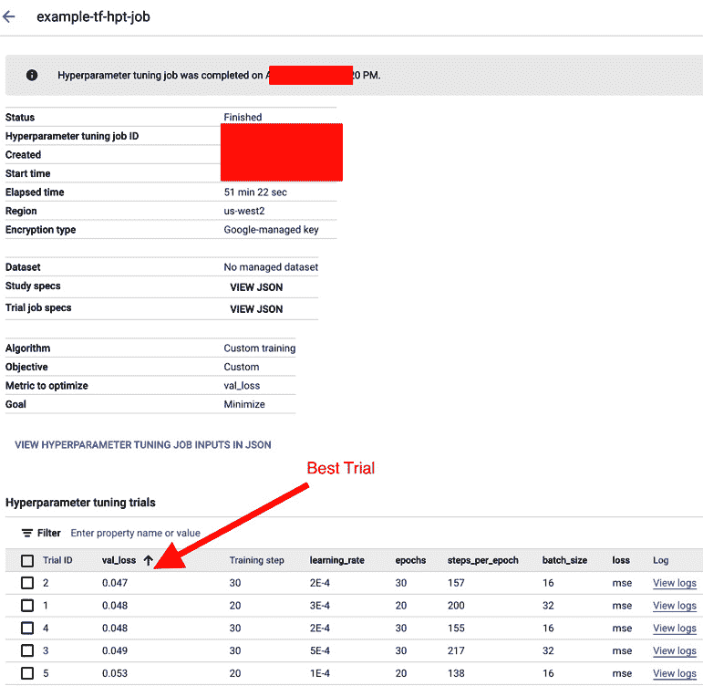

# 第九章：模型优化 – 超参数调整和 NAS

我们现在已经非常熟悉 Vertex AI 提供的一些与数据管理、无代码和低代码模型训练以及启动大规模定制模型训练作业（具有元数据跟踪和监控功能）相关的服务。作为机器学习从业者，我们知道我们训练的第一个模型很可能不是针对特定用例和数据集的最佳模型。因此，为了找到最佳模型（即最准确且偏差最小的模型），我们通常使用不同的模型优化技术。**超参数调整**（**HPT**）和**神经架构搜索**（**NAS**）是两种这样的模型优化技术。在本章中，我们将学习如何使用 Vertex AI 在 Google Cloud 上配置和启动模型优化实验。

在本章中，我们将首先了解模型优化技术（如 HPT）的重要性，然后学习如何在 Google Vertex AI 中快速设置和启动 HPT 作业。我们还将了解 NAS 的工作原理以及它与 HPT 的不同之处。本章涵盖的主题如下：

+   什么是 HPT 以及为什么它很重要？

+   在 Vertex AI 上设置 HPT 作业

+   NAS 是什么，它与 HPT 有何不同？

+   Vertex AI 上的 NAS 概述

# 技术要求

本章中展示的代码示例可以在以下 GitHub 仓库中找到：[`github.com/PacktPublishing/The-Definitive-Guide-to-Google-Vertex-AI/tree/main/Chapter09`](https://github.com/PacktPublishing/The-Definitive-Guide-to-Google-Vertex-AI/tree/main/Chapter09)

# 什么是 HPT 以及为什么它很重要？

超参数调整，或简称 HPT，是一种在机器学习项目中非常常用的模型优化技术。在本节中，我们将了解超参数、调整它们的重要性以及寻找机器学习算法最佳超参数的不同方法。

## 什么是超参数？

当我们训练一个机器学习系统时，我们基本上有三类数据 – 输入数据、模型参数和模型超参数。输入数据指的是与我们要解决的问题相关的训练或测试数据。模型参数是我们修改的变量，我们试图调整它们以适应训练数据。另一方面，模型超参数是控制训练过程本身的变量。这些超参数在我们开始训练模型之前是固定的。例如，学习率、优化器、批量大小、神经网络中的隐藏层数量以及基于树的算法中的最大深度都是模型超参数的例子。

## 为什么选择 HPT？

你的机器学习模型将表现如何很大程度上取决于你在训练之前选择的超参数。超参数的值可以对模型性能指标（如准确率）、训练时间、偏差、公平性等方面产生重大影响。超参数调整或 HPT 是一种模型优化技术，它为学习算法选择一组最优的超参数。相同的机器学习算法可能需要完全不同的超参数值来泛化不同的数据模式。每个 HPT 作业都与一个目标函数相关联，它试图优化（最小化或最大化）该目标函数，并返回实现该最优值的超参数值。这个目标函数可以类似于模型训练目标（例如，损失函数）或者可以是一个完全新的指标。

当我们的最终模型（即 XGBoost）固定，并且我们有固定的测试集，我们想要优化所选模型的超参数时，我们会运行模型优化操作，如 HPT 或 NAS。一个典型的 HPT 作业运行多个试验，使用不同的超参数集，并返回导致最佳试验的超参数。这里的最佳试验代表优化与 HPT 作业相关的目标函数的试验。

## 搜索算法

在运行超参数优化（HPT）时，我们必须决定在超参数空间中运行哪种搜索算法。根据我们的需求，我们可以从多种不同的搜索算法中进行选择。以下是一些常用的方法：

+   网格搜索

+   随机搜索

+   贝叶斯优化

让我们讨论这些方法！

### 网格搜索

传统的 HPT 执行方式是网格搜索，这基本上是在手动指定的搜索空间上进行穷举搜索。网格搜索必须提供一个性能指标，它试图计算所有可能的超参数组合集，这些组合在保留的验证集（或训练集上的交叉验证）上测量。由于它运行所有提供的超参数范围的组合，因此设置这些范围时必须小心，并使用离散值。由于网格搜索独立运行所有试验，因此它可以并行化以获得更快的输出。

### 随机搜索

与网格搜索尝试所有组合的顺序和穷举搜索不同，随机搜索在每次试验中从提供的搜索空间中随机选择超参数。由于它随机选择超参数值，它也可以泛化到连续空间，如上所述。随机搜索再次高度可并行化，因为所有试验都是独立的。尽管它很简单，但随机搜索是测试新优化或搜索技术的重要基线之一。

### 贝叶斯优化

与网格搜索和随机搜索不同，贝叶斯优化方法构建了一个将超参数值映射到 HPT 目标函数的概率模型。因此，在每次新的试验中，它都会更好地了解它应该采取的方向，以找到给定目标函数在固定验证集上的最优超参数。它试图平衡探索和利用，并且已经证明在更少的试验中可以获得比先前技术更好的结果。但是，由于它从正在进行的试验中学习，它通常迭代地运行试验（因此它不太并行化）。

现在我们已经对 HPT 有了很好的理解，让我们了解如何在 Vertex AI 上设置和启动 HPT 作业。

# 在 Vertex AI 上设置 HPT 作业

在本节中，我们将学习如何使用 Vertex AI 设置 HPT 作业。我们将使用*第七章*，*使用 Vertex AI 训练完全自定义的机器学习模型*中相同的神经网络模型实验，并优化其超参数以获得最佳模型设置。

第一步是在 Vertex AI Workbench 中创建一个新的 Jupyter Notebook 并导入有用的库：

```py
import numpy as np
import glob
import matplotlib.pyplot as plt
import os
import google.cloud.aiplatform as aiplatform
from google.cloud.aiplatform import hyperparameter_tuning as hpt
from datetime import datetime
TIMESTAMP = datetime.now().strftime("%Y%m%d%H%M%S")
%matplotlib inline
```

接下来，我们设置项目配置：

```py
PROJECT_ID='************'
REGION='us-west2'
SERVICE_ACCOUNT='417xxxxxxxxx7-compute@developer.gserviceaccount.com'
BUCKET_URI='gs://my-training-artifacts'
```

然后，我们初始化 Vertex AI SDK：

```py
aiplatform.init(project=PROJECT_ID, location=REGION, \
    staging_bucket=BUCKET_URI)
```

下一步是将完整的训练应用程序代码容器化。我们将把完整的训练代码放入一个 Python 文件中，即`task.py`。`task.py`文件应该包含整个流程，包括以下内容：

+   加载和准备训练数据

+   定义模型架构

+   训练模型（运行具有给定超参数作为参数的试验）

+   保存模型（可选）

+   将训练试验输出传递给`hypertune()`方法

训练脚本应该有一个它想要调整的超参数列表，定义为参数：

```py
def get_args():
    '''Parses args. Must include all hyperparameters you want to tune.'''
    parser = argparse.ArgumentParser()
    parser.add_argument(
      '--epochs',
      required=True,
      type=int,
      help='training epochs')
    parser.add_argument(
      '--steps_per_epoch',
      required=True,
      type=int,
      help='steps_per_epoch')
```

同样，我们还有其他重要的超参数，如学习率、批量大小、损失函数等：

```py
    parser.add_argument(
      '--learning_rate',
      required=True,
      type=float,
      help='learning rate')
    parser.add_argument(
      '--batch_size',
      required=True,
      type=int,
      help='training batch size')
    parser.add_argument(
      '--loss',
      required=True,
      type=str,
      help='loss function')
    args = parser.parse_args()
    return args
```

脚本应该有一个函数用于加载和准备训练集和验证集：

```py
def make_datasets_unbatched():
    # Load train, validation and test sets
    dest = 'gs://data-bucket-417812395597/'
    train_x = np.load(BytesIO(
        file_io.read_file_to_string(dest+'train_x', \
            binary_mode=True)
    ))
    train_y = np.load(BytesIO(
        file_io.read_file_to_string(dest+'train_y', \
            binary_mode=True)
    ))
```

同样，验证集和测试数据部分也被加载：

```py
    val_x = np.load(BytesIO(
        file_io.read_file_to_string(dest+'val_x', \
            binary_mode=True)
    ))
    val_y = np.load(BytesIO(
        file_io.read_file_to_string(dest+'val_y', \
            binary_mode=True)
    ))
    test_x = np.load(BytesIO(
        file_io.read_file_to_string(dest+'test_x', \
            binary_mode=True)
    ))
    test_y = np.load(BytesIO(
        file_io.read_file_to_string(dest+'test_y', \
            binary_mode=True)
    ))
    return train_x, train_y, val_x, val_y, test_x, test_y
```

前一个函数从 GCS 加载已准备好的数据集。我们可以参考*第七章*，*使用 Vertex AI 训练完全自定义的机器学习模型*，以全面了解数据准备部分。

接下来，我们定义**TensorFlow**（**TF**）模型架构：

```py
def tf_model():
    black_n_white_input = tensorflow.keras.layers.Input(shape=(80, 80, 1))
    enc = black_n_white_input
```

我们接下来定义模型的编码器部分：

```py
    #Encoder part
    enc = tensorflow.keras.layers.Conv2D(
        32, kernel_size=3, strides=2, padding='same'
    )(enc)
    enc = tensorflow.keras.layers.LeakyReLU(alpha=0.2)(enc)
    enc = tensorflow.keras.layers.BatchNormalization(momentum=0.8)(enc)
    enc = tensorflow.keras.layers.Conv2D(
        64, kernel_size=3, strides=2, padding='same'
    )(enc)
    enc = tensorflow.keras.layers.LeakyReLU(alpha=0.2)(enc)
    enc = tensorflow.keras.layers.BatchNormalization(momentum=0.8)(enc)
```

同样，我们将定义另外两个编码器层，具有递增的过滤器数量、3 的内核大小和 2 的步长，以便我们可以将图像压缩到重要的特征：

```py
    enc = tensorflow.keras.layers.Conv2D(
        128, kernel_size=3, strides=2, padding='same'
    )(enc)
    enc = tensorflow.keras.layers.LeakyReLU(alpha=0.2)(enc)
    enc = tensorflow.keras.layers.BatchNormalization(momentum=0.8)(enc)
    enc = tensorflow.keras.layers.Conv2D(
        256, kernel_size=1, strides=2, padding='same'
    )(enc)
    enc = tensorflow.keras.layers.LeakyReLU(alpha=0.2)(enc)
    enc = tensorflow.keras.layers.Dropout(0.5)(enc)
```

在同一函数内定义 TF 模型的解码器部分：

```py
    #Decoder part
    dec = enc
    dec = tensorflow.keras.layers.Conv2DTranspose(
        256, kernel_size=3, strides=2, padding='same'
    )(dec)
    dec = tensorflow.keras.layers.Activation('relu')(dec)
    dec = tensorflow.keras.layers.BatchNormalization(momentum=0.8)(dec)
    dec = tensorflow.keras.layers.Conv2DTranspose(
        128, kernel_size=3, strides=2, padding='same'
    )(dec)
    dec = tensorflow.keras.layers.Activation('relu')(dec)
    dec = tensorflow.keras.layers.BatchNormalization(momentum=0.8)(dec)
```

如我们所见，解码器的设计几乎与编码器部分相反。在这里，我们通过使用多层转置卷积和逐步减少通道到 3 来从压缩特征中重新创建图像，以生成最终的彩色图像输出：

```py
    dec = tensorflow.keras.layers.Conv2DTranspose(
        64, kernel_size=3, strides=2, padding='same'
    )(dec)
    dec = tensorflow.keras.layers.Activation('relu')(dec)
    dec = tensorflow.keras.layers.BatchNormalization(momentum=0.8)(dec)
    dec = tensorflow.keras.layers.Conv2DTranspose(
        32, kernel_size=3, strides=2, padding='same'
    )(dec)
    dec = tensorflow.keras.layers.Activation('relu')(dec)
    dec = tensorflow.keras.layers.BatchNormalization(momentum=0.8)(dec)
    dec = tensorflow.keras.layers.Conv2D(
        3, kernel_size=3, padding='same'
    )(dec)
```

添加一个`tanh`激活函数以获得最终的彩色输出图像：

```py
    color_image = tensorflow.keras.layers.Activation('tanh')(dec)
    return black_n_white_input, color_image
```

还添加了一个函数来构建和编译 TF 模型：

```py
# Build the and compile TF model
def build_and_compile_tf_model(loss_fn, learning_rate):
    black_n_white_input, color_image = tf_model()
    model = tensorflow.keras.models.Model(
        inputs=black_n_white_input,
        outputs=color_image
    )
    _optimizer = tensorflow.keras.optimizers.Adam(
        learning_rate=learning_rate,
        beta_1=0.5
    )
    model.compile(
        loss=loss_fn,
        optimizer=_optimizer
    )
    return model
```

最后，添加一个`main`函数来训练模型，并将超参数调整指标值提供给`hypertune()`函数。在我们的案例中，我们将优化验证数据集上的损失。请参见以下代码片段：

```py
def main():
    args = get_args()
```

设置配置并加载数据：

```py
    NUM_WORKERS = strategy.num_replicas_in_sync
    # Global batch size should be scaled as per the number     # of workers used in training.    GLOBAL_BATCH_SIZE = args.batch_size * NUM_WORKERS
    MODEL_DIR = os.getenv("AIP_MODEL_DIR")
    train_x, train_y, val_x, val_y, _, _ = \
        make_datasets_unbatched()
```

现在，让我们构建 TF 模型并将其拟合到训练数据上：

```py
    with strategy.scope():
        # Creation of dataset, and model building/compiling need to be within
        # `strategy.scope()`.
        model = build_and_compile_tf_model(args.loss, \
            args.learning_rate)
    history = model.fit(
        train_x,
        train_y,
        batch_size=GLOBAL_BATCH_SIZE,
        epochs=args.epochs,
        steps_per_epoch=args.steps_per_epoch,
        validation_data=(val_x, val_y),
    )
    model.save(MODEL_DIR)
```

使用`hypertune`定义并报告超参数调整指标给 HPT 算法：

```py
    # DEFINE HPT METRIC
    hp_metric = history.history['val_loss'][-1]
    hpt = hypertune.HyperTune()
    hpt.report_hyperparameter_tuning_metric(
      hyperparameter_metric_tag='val_loss',
      metric_value=hp_metric,
      global_step=args.epochs)
```

如果我们将所有这些放入一个单独的 Python 文件中，我们的`task.py`文件应该看起来像以下这样：

```py
%%writefile task.py
# Single, Mirror and Multi-Machine Distributed Training
```

加载我们任务的所有依赖项：

```py
import tensorflow as tf
import tensorflow
from tensorflow.python.client import device_lib
import argparse
import os
import sys
from io import BytesIO
import numpy as np
from tensorflow.python.lib.io import file_io
import hypertune
```

解析参数，其中我们定义了用于调整的超参数：

```py
def get_args():
    '''Parses args. Must include all hyperparameters you want to tune.'''
    parser = argparse.ArgumentParser()
    parser.add_argument(
      '--epochs',
      required=True,
      type=int,
      help='training epochs')
    parser.add_argument(
      '--steps_per_epoch',
      required=True,
      type=int,
      help='steps_per_epoch')
```

定义一些与超参数相关的更多参数，用于调整学习率、批大小和损失函数：

```py
    parser.add_argument(
      '--learning_rate',
      required=True,
      type=float,
      help='learning rate')
    parser.add_argument(
      '--batch_size',
      required=True,
      type=int,
      help='training batch size')
    parser.add_argument(
      '--loss',
      required=True,
      type=str,
      help='loss function')
    args = parser.parse_args()
    return args
```

设置用于训练的配置：

```py
print('Python Version = {}'.format(sys.version))
print('TensorFlow Version = {}'.format(tf.__version__))
print('TF_CONFIG = {}'.format(os.environ.get('TF_CONFIG', \
    'Not found')))
print('DEVICES', device_lib.list_local_devices())
```

根据要求定义基于训练分布策略的配置设置——可以是单一、镜像或多工作者策略：

```py
DISTRIBUTE='single'
if DISTRIBUTE == 'single':
    if tf.test.is_gpu_available():
        strategy = tf.distribute.OneDeviceStrategy(device="/gpu:0")
    else:
        strategy = tf.distribute.OneDeviceStrategy(device="/cpu:0")
# Single Machine, multiple compute device
elif DISTRIBUTE == 'mirror':
    strategy = tf.distribute.MirroredStrategy()
# Multiple Machine, multiple compute device
elif DISTRIBUTE == 'multi':
    strategy = tf.distribute.experimental.MultiWorkerMirroredStrategy()print('num_replicas_in_sync = {}'.format(strategy.num_replicas_in_sync))
```

从 GCS 存储桶加载数据并准备训练、验证和测试分区：

```py
# Preparing dataset
BUFFER_SIZE = 10000
def make_datasets_unbatched():
    # Load train, validation and test sets
    dest = 'gs://data-bucket-417812395597/'
    train_x = np.load(BytesIO(
        file_io.read_file_to_string(dest+'train_x', \
            binary_mode=True)
    ))
    train_y = np.load(BytesIO(
        file_io.read_file_to_string(dest+'train_y', \
            binary_mode=True)
    ))
```

类似地，加载验证和测试分区：

```py
    val_x = np.load(BytesIO(
        file_io.read_file_to_string(dest+'val_x', \
            binary_mode=True)
    ))
    val_y = np.load(BytesIO(
        file_io.read_file_to_string(dest+'val_y', \
            binary_mode=True)
    ))
    test_x = np.load(BytesIO(
        file_io.read_file_to_string(dest+'test_x', \
            binary_mode=True)
    ))
    test_y = np.load(BytesIO(
        file_io.read_file_to_string(dest+'test_y', \
            binary_mode=True)
    ))
    return train_x, train_y, val_x, val_y, test_x, test_y
```

定义将黑白图像转换为彩色图像的 TF 模型架构：

```py
def tf_model():
    black_n_white_input = tensorflow.keras.layers.Input(shape=(80, 80, 1))
    enc = black_n_white_input
```

定义模型编码器部分：

```py
    #Encoder part
    enc = tensorflow.keras.layers.Conv2D(
        32, kernel_size=3, strides=2, padding='same'
    )(enc)
    enc = tensorflow.keras.layers.LeakyReLU(alpha=0.2)(enc)
    enc = tensorflow.keras.layers.BatchNormalization(momentum=0.8)(enc)
    enc = tensorflow.keras.layers.Conv2D(
        64, kernel_size=3, strides=2, padding='same'
    )(enc)
    enc = tensorflow.keras.layers.LeakyReLU(alpha=0.2)(enc)
    enc = tensorflow.keras.layers.BatchNormalization(momentum=0.8)(enc)
```

类似地，我们将定义两个额外的编码器层，具有递增的过滤器数量、3 的核大小和 2 的步长，以便我们可以将图像压缩到重要的特征：

```py
    enc = tensorflow.keras.layers.Conv2D(
        128, kernel_size=3, strides=2, padding='same'
    )(enc)
    enc = tensorflow.keras.layers.LeakyReLU(alpha=0.2)(enc)
    enc = tensorflow.keras.layers.BatchNormalization(momentum=0.8)(enc)
    enc = tensorflow.keras.layers.Conv2D(
        256, kernel_size=1, strides=2, padding='same'
    )(enc)
    enc = tensorflow.keras.layers.LeakyReLU(alpha=0.2)(enc)
    enc = tensorflow.keras.layers.Dropout(0.5)(enc)
```

定义模型的解码器部分：

```py
     #Decoder part
    dec = enc
    dec = tensorflow.keras.layers.Conv2DTranspose(
        256, kernel_size=3, strides=2, padding='same'
    )(dec)
    dec = tensorflow.keras.layers.Activation('relu')(dec)
    dec = tensorflow.keras.layers.BatchNormalization(momentum=0.8)(dec)
    dec = tensorflow.keras.layers.Conv2DTranspose(
        128, kernel_size=3, strides=2, padding='same'
    )(dec)
    dec = tensorflow.keras.layers.Activation('relu')(dec)
    dec = tensorflow.keras.layers.BatchNormalization(momentum=0.8)(dec)
```

如我们所见，解码器设计几乎与编码器部分相反。在这里，我们通过使用多层转置卷积重新创建图像，并逐步减少通道到 3 以生成最终的彩色图像输出：

```py
    dec = tensorflow.keras.layers.Conv2DTranspose(
        64, kernel_size=3, strides=2, padding='same'
    )(dec)
    dec = tensorflow.keras.layers.Activation('relu')(dec)
    dec = tensorflow.keras.layers.BatchNormalization(momentum=0.8)(dec)
    dec = tensorflow.keras.layers.Conv2DTranspose(
        32, kernel_size=3, strides=2, padding='same'
    )(dec)
    dec = tensorflow.keras.layers.Activation('relu')(dec)
    dec = tensorflow.keras.layers.BatchNormalization(momentum=0.8)(dec)
    dec = tensorflow.keras.layers.Conv2D(
        3, kernel_size=3, padding='same'
    )(dec)
```

最后，使用`tanh`激活函数生成彩色图像输出：

```py
    color_image = tensorflow.keras.layers.Activation('tanh')(dec)
    return black_n_white_input, color_image
```

以下函数将为我们构建和编译 TF 模型：

```py
`# Build the and compile TF model
def build_and_compile_tf_model(loss_fn, learning_rate):
    black_n_white_input, color_image = tf_model()
    model = tensorflow.keras.models.Model(
        inputs=black_n_white_input,
        outputs=color_image
    )
    _optimizer = tensorflow.keras.optimizers.Adam(
        learning_rate=learning_rate,
        beta_1=0.5
    )
    model.compile(
        loss=loss_fn,
        optimizer=_optimizer
    )
    return model
```

现在，让我们定义主函数以开始执行我们的训练和调整任务。在这里，`num_replicas_in_sync`参数定义了在多工作者训练策略中不同工作者上并行运行多少个训练任务：

```py
def main():
    args = get_args()
    NUM_WORKERS = strategy.num_replicas_in_sync
    # Here the batch size scales up by number of workers since
    # `tf.data.Dataset.batch` expects the global batch size.
    GLOBAL_BATCH_SIZE = args.batch_size * NUM_WORKERS
    MODEL_DIR = os.getenv("AIP_MODEL_DIR")
```

加载训练和验证数据以开始训练我们的 TF 模型：

```py
    train_x, train_y, val_x, val_y, _, _ = \
        make_datasets_unbatched()
    with strategy.scope():
        # Creation of dataset, and model building/compiling need to be within
        # `strategy.scope()`.
        model = build_and_compile_tf_model(args.loss, \
            args.learning_rate)
    history = model.fit(
        train_x,
        train_y,
        batch_size=GLOBAL_BATCH_SIZE,
        epochs=args.epochs,
        steps_per_epoch=args.steps_per_epoch,
        validation_data=(val_x, val_y),
    )
    model.save(MODEL_DIR)
```

最后，使用`hypertune`包定义 HPT 指标：

```py
    # DEFINE HPT METRIC
    hp_metric = history.history['val_loss'][-1]
    hpt = hypertune.HyperTune()
    hpt.report_hyperparameter_tuning_metric(
      hyperparameter_metric_tag='val_loss',
      metric_value=hp_metric,
      global_step=args.epochs)
if __name__ == "__main__":
    main()
```

接下来，我们在 GCS 中创建一个用于存储 HPT 作业中试验结果等工件的中转存储桶：

```py
BUCKET_URI = "gs://hpt-staging"  # @param {type:"string"}
if BUCKET_URI == "" or BUCKET_URI is None or BUCKET_URI == "gs://[your-bucket-name]":
    BUCKET_URI = "gs://" + PROJECT_ID + "aip-" + TIMESTAMP
! gsutil mb -l {REGION} -p {PROJECT_ID} {BUCKET_URI}
GCS_OUTPUT_BUCKET = BUCKET_URI + "/output/"
```

下一步是将`task.py`文件中定义的整个训练代码容器化。超参数调整作业将使用此容器以不同的超参数作为参数启动不同的试验：

```py
%%writefile Dockerfile
FROM gcr.io/deeplearning-platform-release/tf2-gpu.2-8
WORKDIR /
# Installs hypertune library
RUN pip install cloudml-hypertune
# Copies the trainer code to the Docker image.
COPY task.py .
# Sets up the entry point to invoke the trainer.
ENTRYPOINT ["python", "-m", "task"]
```

我们的 Dockerfile 已经准备好了——让我们构建并推送 Docker 镜像到**Google Container Registry**（**GCR**）：

```py
PROJECT_NAME="*******-project"
IMAGE_URI = (
    f"gcr.io/{PROJECT_NAME}/example-tf-hptune:latest"
)
! docker build ./ -t $IMAGE_URI
! docker push $IMAGE_URI
```

现在我们已经准备好了包含所有所需训练代码的容器镜像。让我们配置 HPT 作业。

首先，我们定义我们希望试验运行的机器类型。机器规格将取决于模型的大小和训练数据集的大小。由于这是一个小实验，我们将使用 `n1-standard-8` 机器来运行它：

```py
# The spec of the worker pools including machine type and Docker image
# Be sure to replace PROJECT_ID in the `image_uri` with your project.
worker_pool_specs = [
    {
        "machine_spec": {
            "machine_type": "n1-standard-8",
            "accelerator_type": None,
            "accelerator_count": 0,
        },
        "replica_count": 1,
        "container_spec": {
            "image_uri": f"gcr.io/{PROJECT_NAME}/example-tf-hptune:latest"
        },
    }
]
```

注意，在工作者池规格中，我们还传递了我们创建的训练镜像的路径。

接下来，我们将定义我们的作业将使用以找到最佳超参数的参数空间：

```py
# Dictionary representing parameters to optimize.
# The dictionary key is the parameter_id, which is passed into your training
# job as a command line argument,
# And the dictionary value is the parameter specification of the metric.
parameter_spec = {
    "learning_rate": hpt.DoubleParameterSpec(min=0.0001, \
        max=0.001, scale="log"),
    "epochs": hpt.DiscreteParameterSpec(values=[10, 20, \
        30], scale=None),
    "steps_per_epoch": hpt.IntegerParameterSpec(min=100, \
        max=300, scale="linear"),
    "batch_size": hpt.DiscreteParameterSpec(values=[16,32,\
        64], scale=None),
    "loss": hpt.CategoricalParameterSpec(["mse"]), # we can add other loss values
}
```

参数空间应根据最佳实践和先验知识仔细定义，以便 HPT 作业不必在无关紧要的超参数范围内执行不必要的试验。

接下来，我们需要定义指标规格。在我们的案例中，因为我们正在尝试优化验证损失值，我们希望最小化它。在准确度的情况下，我们应该最大化我们的指标：

```py
metric_spec = {"val_loss": "minimize"}
```

Vertex AI HPT 作业默认使用贝叶斯优化方法来找到我们设置的最好超参数。我们还有使用其他优化方法的选择。由于贝叶斯优化在大多数情况下效果最好，我们将在实验中使用它。

接下来，我们定义将运行我们的超参数调整试验的自定义作业：

```py
my_custom_job = aiplatform.CustomJob(
    display_name="example-tf-hpt-job",
    worker_pool_specs=worker_pool_specs,
    staging_bucket=GCS_OUTPUT_BUCKET,
)
```

最后，我们定义将使用前面定义的自定义作业启动试验的 HPT 作业：

```py
hp_job = aiplatform.HyperparameterTuningJob(
    display_name="example-tf-hpt-job",
    custom_job=my_custom_job,
    metric_spec=metric_spec,
    parameter_spec=parameter_spec,
    max_trial_count=5,
    parallel_trial_count=3,
)
```

注意，`max_trial_count` 和 `parallel_trial_count` 参数在这里非常重要：

+   `max_trial_count`：您需要为服务将运行的试验数量设置一个上限。更多的试验通常会导致更好的结果，但会有一个收益递减的点，在此之后，额外的试验对您试图优化的指标的影响很小或没有影响。最佳实践是从较小的试验数量开始，在扩展之前了解您选择的超参数的影响程度。

+   `parallel_trial_count`：如果您使用并行试验，服务将提供多个训练处理集群。增加并行试验的数量可以减少超参数调整作业运行所需的时间；然而，这可能会降低作业的整体效果。这是因为默认的调整策略使用先前试验的结果来告知后续试验值分配。如果我们保持并行试验计数等于最大试验数，那么所有试验都将并行启动，并且我们将最终运行一个“随机参数搜索”，因为没有从先前试验的性能中学习的空间。

现在我们已经准备好了，我们可以启动 HPT 任务：

```py
hp_job.run()
```

一旦启动作业，它就会提供一个链接到云控制台 UI，在那里我们可以监控我们的 HPT 试验和作业的进度。云控制台 UI 的外观类似于 *图 9**.1* 中所示。



图 9.1 – 在云控制台 UI 中监控 HPT 任务

现在我们已经成功理解和启动了在 Vertex AI 上的 HPT 作业，让我们跳到下一部分，了解 NAS 模型优化技术。

# 什么是 NAS 以及它与 HPT 有何不同？

**人工神经网络**或**ANNs**今天被广泛用于解决复杂的机器学习问题。大多数时候，这些网络架构是由机器学习专家手工设计的，这并不总是最优的。**神经架构搜索**或**NAS**是一种自动化设计神经网络架构的过程的技术，通常比手工设计的网络表现更好。

虽然 HPT 和 NAS 都被用作模型优化技术，但它们的工作方式存在某些差异。HPT 假设一个给定的架构，并专注于优化导致最佳模型的超参数。HPT 优化超参数，如学习率、优化器、批量大小、激活函数等。另一方面，NAS 专注于优化特定于架构的参数（在某种程度上，它自动化了设计神经网络架构的过程）。NAS 优化参数，如层数、单元数、层之间的连接类型等。使用 NAS，我们可以根据准确性、延迟、内存、这些特性的组合或自定义指标来搜索最优的神经网络架构。

NAS 通常与比 HPT 更大的搜索空间一起工作，并控制网络架构的不同方面。然而，解决的根本问题是与 HPT 优化相同的。有许多基于 NAS 的优化方法，但在高层次上，任何 NAS 方法都有三个主要组件，如下所示：

+   搜索空间

+   优化方法

+   评估方法

让我们更深入地了解这些组件的每一个。

## 搜索空间

此组件控制要考虑的可能神经网络架构的集合。搜索空间通常是特定于问题的，例如，与视觉相关的问题可能会有**卷积神经网络**（**CNN**）层的可能性。然而，识别最佳架构的过程是通过 NAS 自动化的。仔细设计这些搜索空间仍然依赖于人类的专业知识。

## 优化方法

此组件决定如何导航搜索空间以找到给定应用的最佳可能架构。许多不同的优化方法已经应用于 NAS，例如**强化学习**（**RL**）、贝叶斯优化、基于梯度的优化、进化搜索等。这些方法中的每一种都有其评估架构的独特方式，但高层次的目标是专注于提供更好性能的搜索空间区域。这一方面的 NAS 与 HPT 优化方法相当相似。

## 评估方法

评估方法是用于评估所选优化方法设计的架构质量的一个组件。评估神经架构的一个简单方法是对其进行完全训练，但这种方法在计算上相当昂贵。作为替代，为了使神经架构搜索（NAS）更高效，已经开发出了部分训练和评估方法。为了提供更便宜的神经网络质量启发式度量，一些评估方法已经被开发出来。这些评估方法非常特定于 NAS，并利用神经网络的基本结构来估计网络的质量。这些方法的一些例子包括权重共享、超网络、网络形态学等。这些针对 NAS 的特定评估方法在实际上比完全训练便宜得多。

我们现在对 NAS 优化方法及其工作原理有了很好的理解。接下来，让我们探索 Vertex AI 提供的产品及其在 Google Cloud 上启动 NAS 的功能。

# Vertex AI NAS 概述

Vertex AI NAS 是一种优化技术，可以用来为给定的机器学习用例找到最佳的神经网络架构。基于 NAS 的优化在准确性方面寻找最佳网络，但也可以通过其他约束来增强，例如延迟、内存或根据需求定制的指标。一般来说，可能的神经网络搜索空间可以相当大，NAS 可能支持高达 10²⁰ 的搜索空间。在过去的几年里，NAS 已经能够成功生成一些最先进的计算机视觉网络架构，包括 NASNet、MNasNet、EfficientNet、SpineNet、NAS-FPN 等。

虽然看起来可能很复杂，但 NAS 功能非常灵活且易于使用。初学者可以利用预构建的模块来探索搜索空间、训练脚本和 Jupyter 笔记本，以在自定义数据集上开始探索 Vertex AI NAS。如果您是专家，您可能开发自定义训练脚本、自定义搜索空间、自定义评估方法，甚至为非视觉用例开发应用程序。

Vertex AI 可以用来探索针对我们定制架构和用例的完整 NAS 功能集。以下是 Vertex AI 为我们提供的一些帮助，以便更方便地实现 NAS：

+   Vertex AI 提供了一种特定的 NAS 语言，可以利用它来定义一个自定义搜索空间，以尝试所需的可能神经网络架构集合，并将此空间与我们的自定义训练脚本集成。

+   预构建的最先进的搜索空间和训练器，可以立即使用并在 GPU 上运行。

+   一个预定义的 NAS 控制器，它从我们自定义定义的搜索空间中采样，以找到最佳的神经网络架构。

+   一组预构建的库和 Docker 镜像，可以用来在自定义硬件设置上计算延迟、FLOPS（每秒浮点运算次数）或内存使用情况。

+   Google Cloud 提供教程来解释 NAS 的使用方法。它还提供了设置 NAS 以高效运行 PyTorch 应用程序的示例和指导。

+   预构建工具用于设计代理任务。

+   有库支持可以利用，以报告自定义定义的指标并对它们进行分析。

+   Google Cloud 控制台在监控和管理 NAS 作业方面非常有帮助。我们还获得了一些易于使用的示例笔记本，以启动搜索。

+   基于每个项目或每个作业的 CPU/GPU 资源使用管理，借助预构建库。

+   一个 NAS 客户端，用于构建 Docker 镜像、启动 NAS 作业以及恢复基于 Python 的旧 NAS 搜索作业。

+   客户支持是基于 Google Cloud 控制台用户界面的。

这些功能可以帮助我们在不花费太多努力的情况下设置定制的 NAS 作业。现在让我们讨论一些与 NAS 一起工作的最佳实践。

## NAS 最佳实践

这里需要注意的重要事项是，NAS 不是一个我们应该应用于所有机器学习问题的优化方法。在决定为我们的用例运行 NAS 作业之前，有一些事情需要牢记。以下是一些最佳实践：

+   NAS 不适用于调整模型的超参数。它只执行架构搜索，不建议比较这两种方法的成果。在某些配置中，HPT 可以在 NAS 之后进行。

+   NAS 不建议用于较小的或高度不平衡的数据集。

+   NAS 成本高昂，除非我们可以在没有极高期望的情况下花费几千美元，否则它不适合我们。

+   你应该首先尝试其他传统和常规的机器学习方法和技术，如超参数调整。只有当你没有看到传统方法带来进一步收益时，才应使用神经架构搜索。

由于预构建资源和公开发布的代码示例，在 Vertex AI 上设置 NAS 作业并不复杂。有了这些预构建功能、示例和最佳实践，我们应该能够设置一个定制的 NAS 作业，帮助我们找到满足项目目标的最佳架构。

# 摘要

在本章中，我们讨论了将模型优化技术应用于我们的应用程序以获得最佳性能的重要性。我们学习了两种模型优化方法——HPT 和 NAS，以及它们的相似之处和不同之处。我们还通过代码示例学习了如何在 Vertex AI 上设置和启动大规模 HPT 作业。此外，我们还讨论了一些最佳实践，以充分利用 HPT 和 NAS。

在阅读本章之后，你应该对“模型优化”这个术语及其在开发机器学习应用程序中的重要性有一个公正的理解。此外，你现在应该对使用 Google Cloud 上的 Vertex AI 工具快速设置从小型到大型规模的超参数调整实验充满信心。你还应该对 NAS、它与 HPT 的区别以及设置 NAS 作业的最佳实践有一个公正的理解。

现在我们已经了解了模型优化技术的重要性以及常见的方法，我们具备了开发高质量模型的良好基础。接下来，让我们学习如何部署这些模型，以便它们可以被下游应用所使用。
