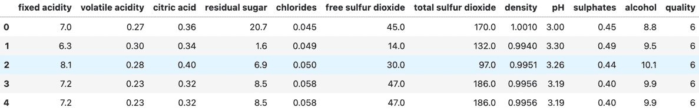
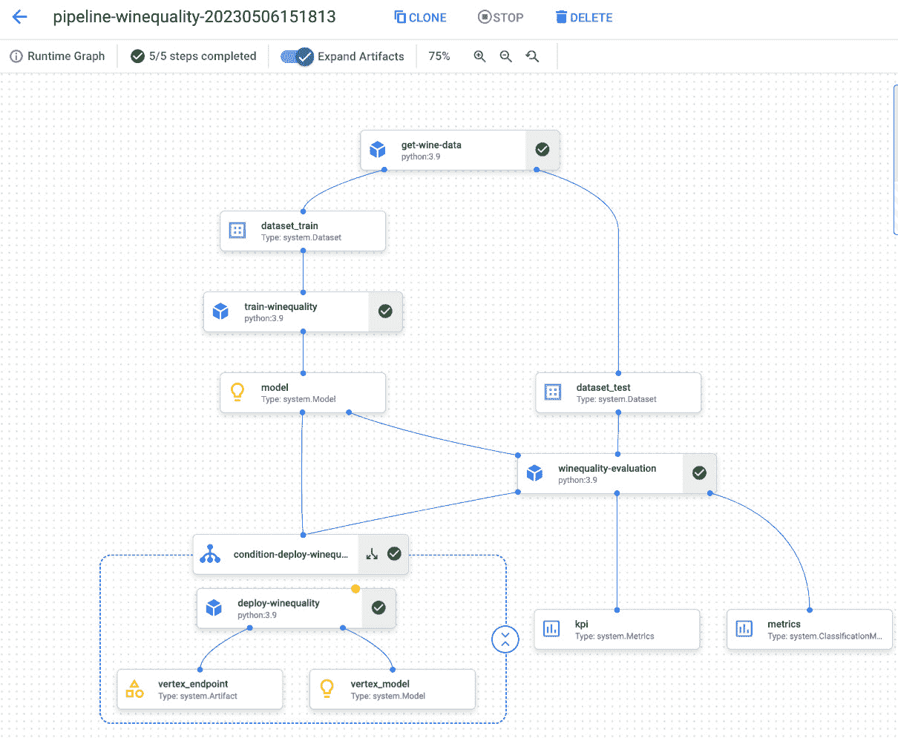
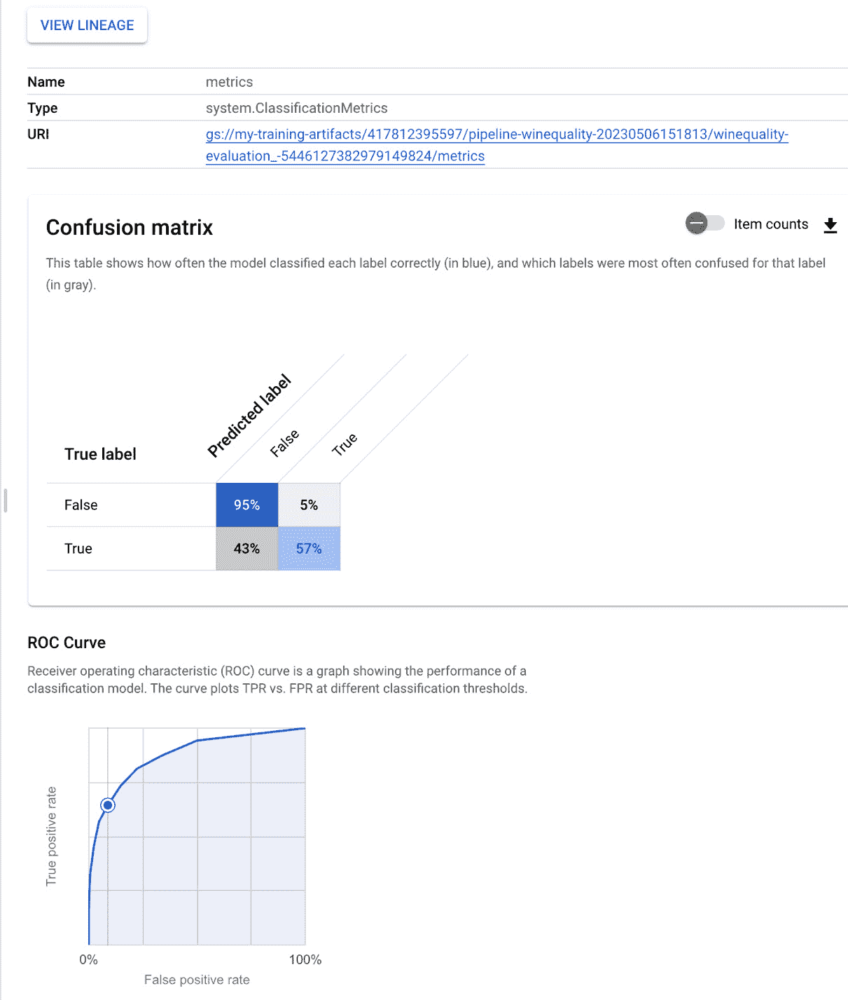
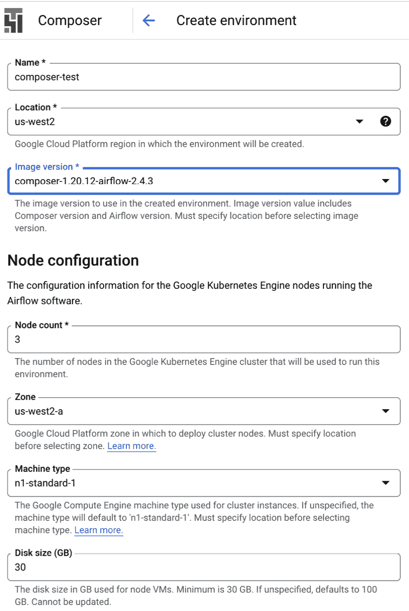
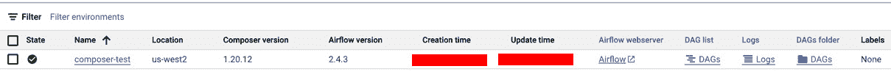
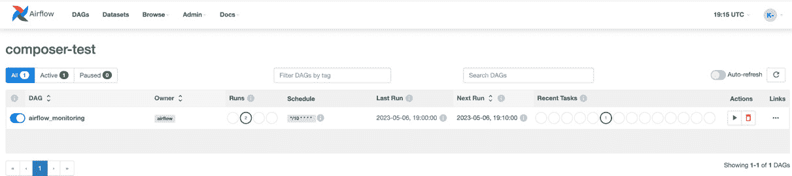
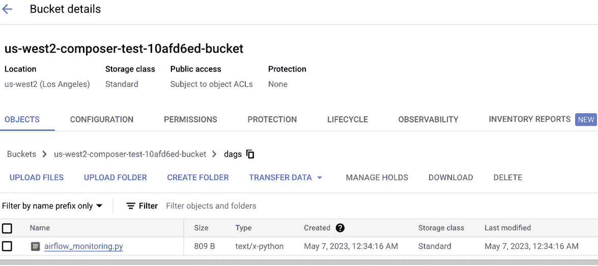
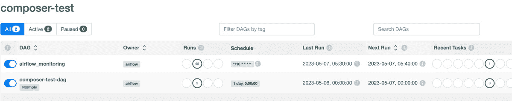
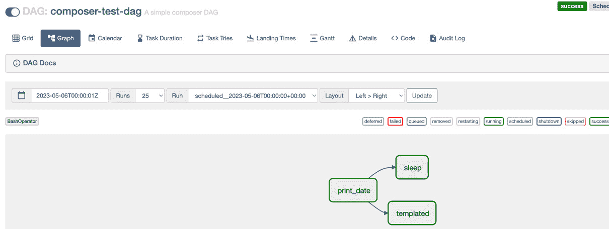

# 第十章：Vertex AI 部署和自动化工具 – 通过托管 Kubeflow 管道进行编排

在典型的**机器学习**（**ML**）解决方案中，我们通常会有很多应用程序和服务作为端到端工作流程的一部分。如果我们尝试使用一些定制的脚本和 cron 作业将这些服务和应用程序拼接在一起，管理工作流程就会变得非常棘手。因此，利用一些编排服务来仔细管理、扩展和监控复杂的工作流程变得非常重要。编排是将多个应用程序或服务拼接在一起以构建端到端解决方案工作流程的过程。Google Cloud 提供了多个编排服务，例如 Cloud Scheduler、Workflows 和 Cloud Composer，以大规模管理复杂的工作流程。Cloud Scheduler 非常适合单一、重复的任务，Workflows 更适合复杂的多服务编排，而 Cloud Composer 非常适合数据驱动的负载。

ML 工作流程有很多步骤，从数据准备到模型训练、评估等。除此之外，监控和版本跟踪变得更加具有挑战性。在本章中，我们将学习关于 GCP 工具如何有效地编排 ML 工作流程。本章涵盖的主要主题如下：

+   使用 Vertex AI 管道（托管 Kubeflow 管道）编排 ML 工作流程

+   使用 Cloud Composer（托管 Airflow）编排 ML 工作流程

+   Vertex AI 管道与 Cloud Composer 的比较

+   在 Vertex AI 上获取预测

+   管理 Vertex AI 上部署的模型

# 技术要求

本章中展示的代码示例可以在以下 GitHub 仓库中找到：[`github.com/PacktPublishing/The-Definitive-Guide-to-Google-Vertex-AI/tree/main/Chapter10`](https://github.com/PacktPublishing/The-Definitive-Guide-to-Google-Vertex-AI/tree/main/Chapter10)

# 使用 Vertex AI 管道（托管 Kubeflow 管道）编排 ML 工作流程

ML 解决方案复杂且涉及许多步骤，包括数据准备、特征工程、模型选择、模型训练、测试、评估和部署。除此之外，在生产过程中跟踪和版本控制与 ML 模型相关的许多方面也非常重要。GCP 上的 Vertex AI 管道让我们能够以易于组合、共享和重现的方式对 ML 工作流程进行编码。Vertex AI 管道可以以完全托管的方式运行 Kubeflow 以及基于**TensorFlow Extended**（**TFX**）的 ML 管道。在本节中，我们将学习如何开发用于 ML 开发的 Kubeflow 管道作为 Vertex AI 管道。 

Kubeflow 是一个 Kubernetes 原生解决方案，它简化了 ML 管道的编排，使得实验变得简单且可重复。此外，管道是可共享的。它提供了对执行监控、工作流程调度、元数据记录和版本控制等框架的支持。Kubeflow 管道是 ML 工作流程的描述，它将工作流程的多个小组件组合成一个**有向无环图**（DAG）。在幕后，它将在容器上运行管道组件，这提供了可移植性、可重复性和封装。每个管道组件是 ML 工作流程中的一步，执行特定的任务。一个组件的输出可能成为另一个组件的输入，依此类推。每个管道组件由代码组成，打包成执行管道中一步的 Docker 镜像，并在一个或多个 Kubernetes Pod 上运行。Kubeflow 管道可以用于 ETL 和 CI/CD 任务，但它们更常用于运行 ML 工作流程。

Vertex AI SDK 允许我们从 Jupyter Notebook 内部以编程方式创建和上传 Kubeflow 管道，但我们也可以使用控制台 UI 来处理管道。Vertex AI UI 允许我们可视化管道执行图。它还允许我们跟踪、监控和比较不同的管道执行。

## 使用 Python 开发 Vertex AI 管道

在本节中，我们将使用 Vertex AI SDK 在 Jupyter Notebook 中开发和启动一个简单的基于 Kubeflow 的 Vertex 管道。在这个例子中，我们将使用开源的葡萄酒质量数据集。让我们开始吧！

打开一个 Jupyter Notebook 并安装一些有用的库：

```py
!pip3 install google-cloud-aiplatform
!pip3 install kfp --upgrade
!pip install google_cloud_pipeline_components
```

在一个新的单元格中，导入用于 Vertex 管道开发的库：

```py
from typing import NamedTuple
import typing
import pandas as pd
from kfp.v2 import dsl
from kfp.v2.dsl import (Artifact, Dataset, Input, Model, Output, Metrics, ClassificationMetrics, component, OutputPath, InputPath)
from kfp.v2 import compiler
from google.cloud import bigquery
from google.cloud import aiplatform
from google.cloud.aiplatform import pipeline_jobs
from google_cloud_pipeline_components import aiplatform as gcc_aip
```

创建一个时间戳变量。它将有助于为管道对象创建唯一的名称：

```py
from datetime import datetime
TIMESTAMP =datetime.now().strftime("%Y%m%d%H%M%S")
```

现在，我们将设置一些与项目相关的配置，例如`project_id`、区域、暂存桶和服务账户：

```py
PROJECT_ID='417xxxxxxx97'
REGION='us-west2'
SERVICE_ACCOUNT='417xxxxxxx97-compute@developer.gserviceaccount.com'
BUCKET_URI='gs://my-training-artifacts'
```

在本节中，我们将使用葡萄酒质量数据集。葡萄酒质量数据集由 Cortez, Paulo, Cerdeira, A., Almeida, F., Matos, T. 和 Reis, J. (2009) 创建。您可以在以下链接查看：[`doi.org/10.24432/C56S3T`](https://doi.org/10.24432/C56S3T)。 (UCI 机器学习仓库。)

接下来，我们在笔记本单元格中加载并检查葡萄酒质量数据集，以了解数据和列：

```py
df_wine = pd.read_csv("http://archive.ics.uci.edu/ml/machine-learning-databases/wine-quality/winequality-white.csv", delimiter=";")
df_wine.head()
```

此代码片段的输出显示在**图 10.1**中。



图 10.1 – 葡萄酒质量数据集概述

这里是特征列的快速概述：

+   `挥发性酸度`：`挥发性酸度`列表示气态酸的含量

+   `固定酸度`：葡萄酒中发现的固定酸量，可以是酒石酸、琥珀酸、柠檬酸、苹果酸等等

+   `残糖`：此列表示葡萄酒发酵后剩余的糖量

+   `柠檬酸`：柠檬酸的含量，它天然存在于水果中

+   `氯化物`：葡萄酒中的盐含量

+   `游离二氧化硫`：二氧化硫，或 SO2，可以防止葡萄酒氧化和变质

+   `总二氧化硫`：葡萄酒中 SO2 的总含量

+   `pH 值`：pH 值用于检查葡萄酒的酸度

+   `密度`：表示葡萄酒的密度

+   `硫酸盐`：硫酸盐有助于保持葡萄酒的新鲜度，并保护其免受氧化和细菌侵害

+   `酒精`：葡萄酒中酒精的百分比

策略是预测葡萄酒质量，给定所有前面的参数。我们将将其转换为分类问题，如果葡萄酒的质量指标值 >=7，则称其为*最佳质量*。

## 管道组件

在这个练习中，我们将为我们的任务定义四个管道组件：

+   数据加载组件

+   模型训练组件

+   模型评估组件

+   模型部署组件

在这里，第一个组件加载数据，第二个组件使用这些数据来训练模型。第三个组件在测试数据集上评估训练好的模型。第四个组件将训练好的模型自动部署为 Vertex AI 端点。我们将对自动模型部署设置条件，例如，如果模型 ROC >= 0.8，则部署模型，否则不部署。

现在，让我们逐一定义这些组件。以下是一个加载并拆分数据到训练和测试分区的第一个组件。

要创建一个 Kubeflow 组件，我们可以用`@component`装饰器包装我们的函数。在这里，我们可以定义基本镜像，以及需要安装的依赖项：

备注

在实际项目或生产管道中，建议在包名称旁边写出版本号，以避免任何版本相关的冲突。

```py
@component(
    packages_to_install=["pandas", "pyarrow", "scikit-learn==1.0.0"],
    base_image="python:3.9",
    output_component_file="load_data_component.yaml"
)
```

在这里，我们定义一个函数，用于加载数据并将其拆分为训练集和测试集：

```py
def get_wine_data(
    url: str,
    dataset_train: Output[Dataset],
    dataset_test: Output[Dataset]
):
    import pandas as pd
    import numpy as np
    from sklearn.model_selection import train_test_split as tts
    df_wine = pd.read_csv(url, delimiter=";")
    df_wine['best_quality'] = [1 if x>=7 else 0 for x in df_wine.quality]
    df_wine['target'] = df_wine.best_quality
    df_wine = df_wine.drop(
        ['quality', 'total sulfur dioxide', 'best_quality'],
         axis=1,
    )
```

我们将保留大约 30%的数据用于测试，其余的用于训练，并将它们保存为 CSV 文件：

```py
    train, test = tts(df_wine, test_size=0.3)
    train.to_csv(
        dataset_train.path + ".csv",
        index=False,
        encoding='utf-8-sig',
    )
    test.to_csv(
        dataset_test.path + ".csv",
        index=False,
        encoding='utf-8-sig',
    )
```

要定义一个组件，我们可以用`@component`装饰器包装我们的 Python 函数。它允许我们传递基本镜像路径、要安装的包，如果需要将组件写入文件，还可以指定 YAML 文件路径。组件的 YAML 文件定义使其具有可移植性和可重用性。我们可以简单地创建一个包含组件定义的 YAML 文件，并在项目的任何位置加载此组件。请注意，我们还可以使用包含所有自定义依赖项的自定义容器镜像。

第一个组件实际上加载了葡萄酒质量数据集表，创建了之前讨论的二进制分类输出，删除了不必要的列，并将其最终分为训练文件和测试文件。在这里，训练和测试数据集文件是该组件的输出工件，可以在随后运行的组件中重用。

现在，让我们定义第二个组件，该组件在第一个组件生成的训练数据集上训练一个随机森林分类器。

第一步是装饰器，包括依赖项：

```py
@component(
    packages_to_install = [
        "pandas",
        "scikit-learn"
    ],
    base_image="python:3.9",
    output_component_file="model_training_component.yml",
)
```

接下来，我们定义我们的训练函数，它将模型拟合到训练数据上，并将其保存为 Pickle 文件。在这里，我们的输出工件将是一个模型，我们还可以将其与一些元数据相关联，如下面的函数所示。在这个函数内部，我们可以通过将元数据键和值放入 `model.metadata` 字典中来将模型工件与元数据关联。

```py
def train_winequality(
    dataset:  Input[Dataset],
    model: Output[Model],
):
    from sklearn.ensemble import RandomForestClassifier
    import pandas as pd
    import pickle
    data = pd.read_csv(dataset.path+".csv")
    model_rf = RandomForestClassifier(n_estimators=10)
    model_rf.fit(
        data.drop(columns=["target"]),
        data.target,
    )
    model.metadata["framework"] = "RF"
    file_name = model.path + f".pkl"
    with open(file_name, 'wb') as file:
        pickle.dump(model_rf, file)
```

此组件在训练数据集上训练随机森林分类器模型，并将模型保存为 Pickle 文件。

接下来，让我们定义模型评估的第三个组件。我们以 `@component` 装饰器开始：

```py
@component(
    packages_to_install = [
        "pandas",
        "scikit-learn"
    ],
    base_image="python:3.9",
    output_component_file="model_evaluation_component.yml",
)
```

现在，我们定义实际的 Python 函数用于模型评估：

```py
def winequality_evaluation(
    test_set:  Input[Dataset],
    rf_winequality_model: Input[Model],
    thresholds_dict_str: str,
    metrics: Output[ClassificationMetrics],
    kpi: Output[Metrics]
) -> NamedTuple("output", [("deploy", str)]):
    from sklearn.ensemble import RandomForestClassifier
    import pandas as pd
    import logging
    import pickle
    from sklearn.metrics import roc_curve, confusion_matrix, accuracy_score
    import json
    import typing
```

这里是一个小的函数，用于控制模型的部署。只有当新模型的准确度高于某个阈值时，我们才部署新模型：

```py
    def threshold_check(val1, val2):
        cond = "false"
        if val1 >= val2 :
            cond = "true"
        return cond
    data = pd.read_csv(test_set.path+".csv")
    model = RandomForestClassifier()
    file_name = rf_winequality_model.path + ".pkl"
    with open(file_name, 'rb') as file:
        model = pickle.load(file)
    y_test = data.drop(columns=["target"])
    y_target=data.target
    y_pred = model.predict(y_test)
```

现在我们有了模型输出，我们可以计算准确度分数和 `roc_curve`，并将它们作为元数据记录：

```py
    y_scores =  model.predict_proba(
        data.drop(columns=["target"])
    )[:, 1]
    fpr, tpr, thresholds = roc_curve(
         y_true=data.target.to_numpy(),
        y_score=y_scores, pos_label=True
    )
    metrics.log_roc_curve(
        fpr.tolist(),
        tpr.tolist(),
        thresholds.tolist()
    )
    metrics.log_confusion_matrix(
       ["False", "True"],
       confusion_matrix(
           data.target, y_pred
       ).tolist(),
    )
```

最后，我们检查模型准确度，看它是否满足部署条件。我们从这里返回部署条件标志：

```py
    accuracy = accuracy_score(data.target, y_pred.round())
    thresholds_dict = json.loads(thresholds_dict_str)
    rf_winequality_model.metadata["accuracy"] = float(accuracy)
    kpi.log_metric("accuracy", float(accuracy))
    deploy = threshold_check(float(accuracy), int(thresholds_dict['roc']))
    return (deploy,)
```

此组件使用组件 1（测试数据集）和组件 2（训练模型）的输出作为输入，并执行模型评估。此组件执行以下操作：

+   加载测试数据集

+   从 Pickle 文件中加载训练好的模型

+   将 ROC 曲线和混淆矩阵作为输出工件记录

+   检查模型准确度是否大于阈值

最后，我们定义模型部署组件。如果部署条件为 `true`，则该组件会自动将训练好的模型作为 Vertex AI 端点部署：

```py
@component(
    packages_to_install=["google-cloud-aiplatform", "scikit-learn",  "kfp"],
    base_image="python:3.9",
    output_component_file="model_winequality_component.yml"
)
```

接下来，我们定义一个函数，当部署条件为真时，将部署葡萄酒质量模型。这个函数将被之前定义的 `@component` 装饰器包装起来，这样我们就可以在最终的管道定义中使用它：

```py
def deploy_winequality(
    model: Input[Model],
    project: str,
    region: str,
    serving_container_image_uri : str,
    vertex_endpoint: Output[Artifact],
    vertex_model: Output[Model]
):
    from google.cloud import aiplatform
    aiplatform.init(project=project, location=region)
    DISPLAY_NAME  = "winequality"
    MODEL_NAME = "winequality-rf"
    ENDPOINT_NAME = "winequality_endpoint"
```

在这里，我们定义一个函数来创建我们模型的端点，以便我们可以用它进行推理：

```py
    def create_endpoint():
        endpoints = aiplatform.Endpoint.list(
        filter='display_name="{}"'.format(ENDPOINT_NAME),
        order_by='create_time desc',
        project=project,
        location=region,
        )
        if len(endpoints) > 0:
            endpoint = endpoints[0]  # most recently created
        else:
            endpoint = aiplatform.Endpoint.create(
            display_name=ENDPOINT_NAME, project=project, location=region
        )
    endpoint = create_endpoint()
```

在这里，我们以编程方式导入我们保存的模型：

```py
    #Import a model programmatically
    model_upload = aiplatform.Model.upload(
        display_name = DISPLAY_NAME,
        artifact_uri = model.uri.replace("model", ""),
        serving_container_image_uri =  serving_container_image_uri,
        serving_container_health_route=f"/v1/models/{MODEL_NAME}",
        serving_container_predict_route=f"/v1/models/{MODEL_NAME}:predict",
        serving_container_environment_variables={
        "MODEL_NAME": MODEL_NAME,
    },
    )
```

最后，我们将上传的模型部署到所需的机器类型上，并按照所需的流量分配：

```py
    model_deploy = model_upload.deploy(
        machine_type="n1-standard-4",
        endpoint=endpoint,
        traffic_split={"0": 100},
        deployed_model_display_name=DISPLAY_NAME,
    )
    # Save data to the output params
    vertex_model.uri = model_deploy.resource_name
```

现在我们管道的核心组件已经准备好了，我们可以继续定义我们的 Vertex Pipeline。

首先，我们需要为我们的管道提供一个唯一的名称：

```py
DISPLAY_NAME = 'pipeline-winequality job{}'.format(TIMESTAMP)
```

管道定义是我们将这些组件拼接在一起以定义我们的机器学习工作流程（或执行图）的部分。在这里，我们可以控制哪些组件先运行，以及哪个组件的输出应该被馈送到另一个组件。以下脚本定义了我们实验的一个简单管道。

我们可以使用 `@dsl.pipeline` 装饰器来定义一个 Kubeflow 管道。我们可以在装饰器中传递一个 `pipeline_root` 参数，如下面的代码所示：

```py
@dsl.pipeline(
    pipeline_root=BUCKET_URI,
    name="pipeline-winequality",
)
def pipeline(
    url: str = "http://archive.ics.uci.edu/ml/machine-learning-databases/wine-quality/winequality-white.csv",
    project: str = PROJECT_ID,
    region: str = REGION,
    display_name: str = DISPLAY_NAME,
    api_endpoint: str = REGION+"-aiplatform.googleapis.com",
    thresholds_dict_str: str = '{"roc":0.8}',
    serving_container_image_uri: str = "us-docker.pkg.dev/vertex-ai/prediction/sklearn-cpu.0-24:latest"
    ):
```

我们可以在这里创建执行 DAG 并定义预定义组件的执行顺序。某些组件可能是相互依赖的，其中一个组件的输出是另一个组件的输入。依赖组件按顺序执行，而独立的组件可以并行执行：

```py
    # adding first component
    data_op = get_wine_data(url)
    # second component uses output of first component as input
    train_model_op = train_winequality(data_op.outputs["dataset_train"])
    # add third component (uses outputs of comp1 and comp2 as input)
    model_evaluation_op = winequality_evaluation(
        test_set=data_op.outputs["dataset_test"],
        rf_winequality_model=train_model_op.outputs["model"],
        # We deploy the model only if the model performance is above the threshold
        thresholds_dict_str = thresholds_dict_str,
    )
```

这是决定是否部署此模型的条件：

```py
    # condition to deploy the model
    with dsl.Condition(
        model_evaluation_op.outputs["deploy"]=="true",
        name="deploy-winequality",
    ):
        deploy_model_op = deploy_winequality(
        model=train_model_op.outputs['model'],
        project=project,
        region=region,
        serving_container_image_uri = serving_container_image_uri,
        )
```

在这里，我们使用 `@dsl.pipeline` 装饰器来定义我们的流水线。请注意，在先前的定义中，前三个组件很简单，但第四个组件是使用 `dsl.Condition()` 定义的。只有当这个条件满足时，我们才会运行模型部署组件。因此，这就是我们控制何时部署模型的方法。如果我们的模型符合业务标准，我们可以选择自动部署它。

接下来，我们可以编译我们的流水线：

```py
compiler.Compiler().compile(
    pipeline_func=pipeline,
    package_path='ml_winequality.json',
)
```

最后，我们可以将我们的流水线作业提交到 Vertex AI：

```py
pipeline_job = pipeline_jobs.PipelineJob(
    display_name="winequality-pipeline",
    template_path="ml_winequality.json",
    enable_caching=False,
    location=REGION,
)
pipeline_job.run()
```

此脚本将在 Vertex AI 中启动我们的流水线。它还将为我们提供一个控制台 URL，以便监控流水线作业。

我们也可以通过在控制台中转到 **Vertex AI** 选项卡并点击 **流水线** 选项卡来定位流水线运行。*图 10.2* 是 Vertex AI 中我们示例作业的执行图截图。



图 10.2 – 从 Google Cloud 控制台 UI 观看的示例 Vertex 流水线的执行图

如我们所见，这个执行图包含了我们定义的所有四个组件。它还包括由组件生成的一切工件。如果我们点击 **指标** 工件，我们可以在控制台 UI 的右侧面板中看到输出值。它看起来类似于 *图 10.3*。



图 10.3 – 与我们的流水线执行相关的元数据和工件

这就是我们可以使用 Google Cloud 控制台 UI 跟踪我们的 ML 相关工作流的执行和指标的方法。一旦我们的流水线准备就绪，我们还可以使用 Vertex AI Pipelines 的本地调度器、Cloud Scheduler（我们可以定义一个计划）、Cloud Functions（基于事件的触发器）等服务来安排其执行。

现在，我们对如何在 Google Cloud 上作为 Vertex AI Pipelines 开发 Kubeflow 流水线有了很好的理解。我们现在应该能够从头开始开发和启动我们的自定义流水线。在下一节中，我们将了解 Cloud Composer 作为工作流编排的另一种解决方案。

# 使用 Cloud Composer（托管 Airflow）编排 ML 工作流

Cloud Composer 是建立在 Apache Airflow 开源项目之上的 Google Cloud 上的工作流程编排服务。主要区别在于 Composer 是完全托管，并且可以非常容易地与其他 GCP 工具集成。使用 Cloud Composer，我们可以编写、执行、调度或监控我们的跨多云和混合环境也得到支持的工作流程。Composer 管道是 DAG，可以使用 Python 轻松定义和配置。它附带丰富的连接器库，让我们可以一键部署我们的工作流程。在 Google Cloud 控制台上的工作流程图形表示使得监控和故障排除非常方便。我们的 DAG 自动同步确保我们的作业始终按计划进行。

Cloud Composer 通常被数据科学家和数据工程师用于构建复杂的数据管道（ETL 或 ELT 管道）。它也可以用作 ML 工作流程的编排器。由于 Apache 项目附带数百个操作员和传感器，Cloud Composer 对于数据相关的工作流程来说非常方便，这使得我们可以用很少的代码轻松地在多个云环境中进行通信。它还允许我们定义故障处理机制，例如在管道失败时发送电子邮件或 Slack 通知。

现在，让我们了解如何开发基于 Cloud Composer 的管道。

## 创建 Cloud Composer 环境

我们可以按照以下步骤使用 Google Cloud 控制台 UI 创建 Cloud Composer 环境：

1.  启用 Cloud Composer API。

1.  从控制台左侧面板中选择 **Composer**，然后点击 **创建** 以开始创建 Composer 环境（见 *图 10.4*）。



图 10.4 – 在 Google Cloud 控制台上创建 Composer 环境

1.  点击 **创建**。创建环境大约需要 15-20 分钟。一旦完成，环境页面将如下所示（见 *图 10.5*）。



图 10.5 – 即可使用的 Cloud Composer 环境

1.  点击 **Airflow** 以查看 Airflow 网页 UI。Airflow 网页 UI 如 *图 10.6* 所示。



图 10.6 – 使用我们的工作流程的 Airflow 网页 UI

如前一个屏幕截图所示，已经有一个 DAG 在运行 – `airflow_monitoring.py` 文件。见 *图 10.7*。



图 10.7 – 我们可以放置基于 Python 的 DAG 以进行执行的 GCS 位置

现在我们 Composer 的设置已经准备好了，我们可以快速检查它是否按预期工作。为了快速测试，我们将使用 Airflow 教程中的一个演示 DAG，并将其放入这个桶的**dags**文件夹中。如果一切正常，我们放入这个桶中的任何 DAG 都应该会自动与 Airflow 同步。

下面的代码是从 Airflow 教程中的一个演示 DAG：

```py
from datetime import timedelta
from textwrap import dedent
# The DAG object; we'll need this to instantiate a DAG
from airflow import DAG
# Operators; we need this to operate!
from airflow.operators.bash import BashOperator
from airflow.utils.dates import days_ago
# These args will get passed on to each operator
# You can override them on a per-task basis during operator initialization
```

在创建操作符时，将使用以下具有一些默认参数的字典。默认情况下，这些参数将传递给每个操作符，但根据需要，我们也可以在操作符中覆盖一些这些参数：

```py
default_args = {
    'owner': 'airflow',
    'depends_on_past': False,
    'email': ['airflow@example.com'],
    'email_on_failure': False,
    'email_on_retry': False,
    'retries': 1,
    'retry_delay': timedelta(minutes=5),
    # 'queue': 'bash_queue',
    # 'execution_timeout': timedelta(seconds=300),
    # 'on_failure_callback': some_function,
    # 'on_success_callback': some_other_function,
    # 'on_retry_callback': another_function,
    # 'sla_miss_callback': yet_another_function,
}
```

这是我们定义我们的 DAG 的地方，执行步骤按照所需或要求的顺序：

```py
with DAG(
    'composer-test-dag',
    default_args=default_args,
    description='A simple composer DAG',
    schedule_interval=timedelta(days=1),
    start_date=days_ago(2),
    tags=['example'],
) as dag:
```

在这里，我们定义了我们的代码将要执行的不同任务：

```py
    # t1, t2 and t3 are examples of tasks created by instantiating operators
    t1 = BashOperator(
        task_id='print_date',
        bash_command='date',
    )
    t2 = BashOperator(
        task_id='sleep',
        depends_on_past=False,
        bash_command='sleep 5',
        retries=3,
    )
```

您可以使用以下属性来记录您的任务：`doc_md`（Markdown）、`doc`（纯文本）、`doc_rst`、`doc_json`和`doc_yaml`，这些属性将在 UI 的**任务实例****详情**页面上显示：

```py
    t1.doc_md = dedent(
    )
    dag.doc_md = __doc__
    dag.doc_md = """a documentation placed anywhere"""
    templated_command = dedent(
        """
    
        echo "{{ ds }}"
        echo "{{ macros.ds_add(ds, 7)}}"
        echo "{{ params.my_param }}"
    
    """
    )
```

现在让我们定义`t3`任务：

```py
    t3 = BashOperator(
        task_id='templated',
        depends_on_past=False,
        bash_command=templated_command,
        params={'my_param': 'Parameter I passed in'},
    )
```

在这里，我们定义了任务的执行顺序。`t1`需要在`t2`和`t3`之前执行，但`t2`和`t3`可以并行执行：

```py
    t1 >> [t2, t3]
```

一旦我们将这个`.py`文件上传到 dags 文件夹中的 GCS 桶，Airflow 将自动同步它。如果您刷新 Airflow web UI，它应该显示另一个 DAG，如图*图 10*.*8*所示。



图 10.8 – Airflow web UI 中 GCS 位置中存在的所有 DAG

如果我们能在 Airflow UI 中看到我们的 DAG 正在运行，这验证了我们的安装运行正常。现在，让我们打开这个 DAG 来检查实际的执行图。它应该看起来与*图 10*.*9*中显示的类似。



图 10.9 – Airflow web UI 中我们工作流程的执行图

尽管这是一个非常简单的 DAG，但它让我们了解到使用 Cloud Composer 与 Airflow 一起工作是多么容易。我们通过 Cloud Composer 获得的日志记录和监控水平相当惊人。Cloud Composer 让数据工程师的生活变得非常容易，这样他们就可以专注于定义复杂的数据管道，而不用担心基础设施和 Airflow 管理。

我们现在对如何使用 Vertex AI Pipelines 和 Cloud Composer（托管 Airflow 服务）作为 ML 工作流程的编排器有了很好的了解。现在让我们总结一下这两者之间的一些相似之处和不同之处。

# Vertex AI Pipelines 与 Cloud Composer

在本节中，我们将讨论 Vertex AI Pipelines 和 Cloud Composer 在编排 ML 工作流程方面的关键相似之处和不同之处。基于这种比较，我们可以为我们的下一个 ML 项目选择最佳解决方案。以下是一个总结两个编排器在 ML 相关任务重要方面的要点列表：

+   在任务（作曲家）或容器化组件（Vertex AI Pipelines）方面，它们都易于使用，并将整体 ML 工作流程划分为更小的执行单元。

+   在组件之间传递数据的方式相似，如果数据量很大，可能需要一个中间存储系统。

+   Vertex AI Pipelines 提供了一系列可用的预构建组件，这些组件是开源的，因此开发者可以避免编写大量的模板代码。另一方面，在基于 Composer 的管道的情况下，我们需要编写整个工作流程。

+   根据设置环境的简便性，Vertex AI Pipelines 稍微容易一些。

+   它们都运行在 Kubernetes 上，但在 Vertex AI Pipelines 的情况下，无需担心集群、Pods 等。

+   Cloud Composer 非常适合数据相关任务。我们还可以将 ML 管道作为数据任务实现，但我们会失去许多 ML 相关功能，例如血缘跟踪、指标、实验比较和分布式训练。这些功能是 Vertex AI Pipelines 的默认功能。

+   数据工程师可能会更习惯于 Composer 管道，而 ML 工程师可能会更习惯于 Vertex AI Pipelines。

+   在许多情况下，Vertex AI Pipelines 的使用成本可能更低，因为我们只为我们使用的部分付费。另一方面，在 Composer 的情况下，一些 Pods 总是处于运行状态。

+   如果需要，一些 Vertex AI Pipelines 的功能也可以与 Composer 一起使用。

+   使用 Vertex AI Pipelines 不需要了解 Kubernetes，但使用 Cloud Composer 时，了解 Kubernetes 的常见方面很重要。

在阅读了这些比较点之后，我们可能会觉得选择我们下一个机器学习（ML）用例的最佳编排器变得容易。然而，这两个编排器都易于使用，并且在各个组织中普遍用于管理它们复杂的数据/ML 相关工作流程。

现在我们已经对 Google Cloud 上的 ML 编排工具及其优缺点有了很好的理解，我们准备开始开发生产级的 ML 管道。接下来，让我们学习如何在 Vertex AI 上获取预测。

# 在 Vertex AI 上获取预测

在本节中，我们将学习如何在 Vertex AI 上从我们的机器学习模型中获取预测。根据用例，预测请求可以是两种类型之一——在线预测（实时）和批量预测。在线预测是对模型端点发出的同步请求。在线预测是那些需要通过 API 调用及时请求输出以更新最终用户信息的应用程序所需要的。例如，Google Maps API 提供了近实时的交通更新，并需要在线预测请求。另一方面，批量预测是异步请求。如果我们的用例只需要批量预测，我们可能不需要将模型部署到端点，因为 Vertex AI 的 `batchprediction` 服务也允许我们从 GCS 位置中的保存模型执行批量预测，甚至不需要创建端点。批量预测适用于那些对响应时间不敏感且可以接受延迟响应的用例（例如，电子商务公司可能希望预测未来六个月左右的销售额）。使用批量预测，我们可以通过单个请求对大量数据进行预测。

## 获取在线预测

在模型可以被用来处理在线预测请求之前，我们必须将其部署到端点。模型部署本质上意味着将模型及其所需的基础设施（内存和计算）保持在内存中，以便能够以低延迟提供预测。根据用例和扩展需求，我们也可以将多个模型部署到单个端点，或者将单个模型部署到多个端点。

当你使用 Vertex AI API 部署模型时，你需要完成以下步骤：

1.  创建端点。

1.  获取端点 ID。

1.  将模型部署到端点。

我们可以使用以下 Python 示例函数来创建 Vertex AI 端点。这个函数取自官方文档（[`cloud.google.com/vertex-ai/docs/general/deployment#api`](https://cloud.google.com/vertex-ai/docs/general/deployment#api)）：

```py
def create_endpoint_sample(
    project: str,
    display_name: str,
    location: str,
):
    aiplatform.init(project=project, location=location)
    endpoint = aiplatform.Endpoint.create(
        display_name=display_name,
        project=project,
        location=location,
    )
    print(endpoint.display_name)
    print(endpoint.resource_name)
    return endpoint
```

第二步是获取端点 ID，这样我们就可以用它来部署我们的模型。以下 shell 命令将给出我们项目位置内所有端点的列表。如果我们有端点名称，我们可以通过端点名称进行过滤：

```py
gcloud ai endpoints list \
  --region=LOCATION \
  --filter=display_name=ENDPOINT_NAME
```

现在我们已经获得了端点 ID，我们可以将我们的模型部署到这个端点。在部署模型的过程中，我们可以指定多个副本的参数、加速器数量、加速器类型等。以下是一个示例 Python 函数，可以用来将模型部署到指定的端点。这个示例取自 Google Cloud 文档（[`cloud.google.com/vertex-ai/docs/general/deployment#api`](https://cloud.google.com/vertex-ai/docs/general/deployment#api)）：

```py
def deploy_model_with_dedicated_resources_sample(
    project,
    location,
    model_name: str,
    machine_type: str,
    endpoint: Optional[aiplatform.Endpoint] = None,
    deployed_model_display_name: Optional[str] = None,
    traffic_percentage: Optional[int] = 0,
    traffic_split: Optional[Dict[str, int]] = None,
    min_replica_count: int = 1,
    max_replica_count: int = 1,
    accelerator_type: Optional[str] = None,
    accelerator_count: Optional[int] = None,
    explanation_metadata: Optional[explain.ExplanationMetadata] = None,
    explanation_parameters: Optional[explain.ExplanationParameters] = None,
    metadata: Optional[Sequence[Tuple[str, str]]] = (),
    sync: bool = True,
):
```

在这里，我们初始化 Vertex AI SDK 并将我们的模型部署到端点：

```py
    aiplatform.init(project=project, location=location)
    model = aiplatform.Model(model_name=model_name)
    model.deploy(
        endpoint=endpoint, deployed_model_display_name=deployed_model_display_name,
        traffic_percentage=traffic_percentage,
        traffic_split=traffic_split,
        machine_type=machine_type,
        min_replica_count=min_replica_count,
        max_replica_count=max_replica_count,
        accelerator_type=accelerator_type,
        accelerator_count=accelerator_count,
        explanation_metadata=explanation_metadata,
        explanation_parameters=explanation_parameters,
        metadata=metadata,
        sync=sync,
    )
    model.wait()
    print(model.display_name)
    print(model.resource_name)
    return model
```

一旦我们的模型部署到端点，它就准备好提供在线预测。现在我们可以向此端点发出在线预测请求。请参见以下示例请求：

```py
def endpoint_predict_sample(
    project: str, location: str, instances: list, endpoint: str
):
    aiplatform.init(project=project, location=location)
    endpoint = aiplatform.Endpoint(endpoint)
    prediction = endpoint.predict(instances=instances)
    print(prediction)
    return prediction
```

`instances[]`对象是必需的，并且必须包含要获取预测的实例列表。请参见以下示例：

```py
{
  "instances": [
    [0.0, 1.1, 2.2],
    [3.3, 4.4, 5.5],
    ...
  ]
}
```

响应体也类似。它可能看起来像以下示例。此示例与先前的模型无关；只是为了理解目的：

```py
{
  "predictions": [
    {
      "label": "tree",
      "scores": [0.2, 0.8]
    },
    {
      "label": "bike",
      "scores": [0.85, 0.15]
    }
  ],
  "deployedModelId": 123456789012345678
}
```

当处理输入时出现错误时的响应如下：

```py
{"error": "Divide by zero"}
```

我们现在对如何使用 Vertex AI 端点获取在线预测有了很好的了解。但并非每个用例都需要按需或在线预测。有时我们想要对大量数据进行预测，但结果并不需要立即得到。在这种情况下，我们可以利用批量预测。让我们进一步讨论如何使用 Vertex AI 获取批量预测。

## 获取批量预测

如前所述，批量预测请求是异步的，不需要将模型始终部署到端点。要发出批量预测请求，我们指定一个输入源和一个输出位置（可以是云存储或 BigQuery），其中 Vertex AI 存储预测结果。输入源位置必须包含我们的输入实例，格式之一为：TFRecord、JSON Lines、CSV、BigQuery 等。

TFRecord 输入实例可能看起来像以下示例：

```py
{"instances": [
    { "b64": "b64EncodedASCIIString" },
    { "b64": "b64EncodedASCIIString" }
  ]}
```

可以通过 Vertex AI API 编程方式或使用 Google Cloud 控制台 UI 请求批量预测。由于我们可以向批量预测请求传递大量数据，因此它们可能需要很长时间才能完成，具体取决于数据量和模型大小。

使用 Python 的 Vertex AI API 的一个示例批量预测请求可能看起来像以下 Python 函数。此示例代码取自官方文档（[`cloud.google.com/vertex-ai/docs/predictions/get-batch-predictions`](https://cloud.google.com/vertex-ai/docs/predictions/get-batch-predictions)）：

```py
def create_batch_prediction_job_dedicated_resources_sample(
    project: str,
    location: str,
    model_resource_name: str,
    job_display_name: str,
    gcs_source: Union[str, Sequence[str]],
    gcs_destination: str,
    instances_format: str = "jsonl",
    machine_type: str = "n1-standard-2",
    accelerator_count: int = 1,
    accelerator_type: Union[str, aiplatform_v1.AcceleratorType] = "NVIDIA_TESLA_K80",
    starting_replica_count: int = 1,
    max_replica_count: int = 1,
    sync: bool = True,
):
```

在这里，我们初始化 Vertex AI SDK，并在我们的部署模型上调用批量预测：

```py
    aiplatform.init(project=project, location=location)
    my_model = aiplatform.Model(model_resource_name)
    batch_prediction_job = my_model.batch_predict(
        job_display_name=job_display_name,
        gcs_source=gcs_source,
        gcs_destination_prefix=gcs_destination,
        instances_format=instances_format,
        machine_type=machine_type,
        accelerator_count=accelerator_count,
        accelerator_type=accelerator_type,
        starting_replica_count=starting_replica_count,
        max_replica_count=max_replica_count,
        sync=sync,
    )
    batch_prediction_job.wait()
    print(batch_prediction_job.display_name)
    print(batch_prediction_job.resource_name)
    print(batch_prediction_job.state)
    return batch_prediction_job
```

一旦批量预测请求完成，输出将保存在指定的云存储或 BigQuery 位置。

一个`jsonl`输出文件可能看起来像以下示例输出：

```py
{ "instance": [1, 2, 3, 4], "prediction": [0.1,0.9]}
{ "instance": [5, 6, 7, 8], "prediction": [0.7,0.3]}
```

我们现在对 Vertex AI 上的在线和批量预测工作原理有了相当的了解。将批量预测与在线预测（消除部署需求）分开的想法可以节省大量的资源和成本。接下来，让我们讨论一些与 Google Vertex AI 上部署的模型相关的重要考虑因素。

# 管理 Vertex AI 上的部署模型

当我们将机器学习模型部署到端点时，我们将它与物理资源（计算）关联起来，以便它可以在低延迟下提供在线预测。根据需求，我们可能希望将多个模型部署到单个端点，或者将单个模型部署到多个端点。让我们了解这两种场景。

## 多个模型 - 单个端点

假设我们已经在生产环境中将一个模型部署到端点，并且我们已经找到了一些改进该模型的好主意。现在，假设我们已经训练了一个改进的模型，我们想要部署，但我们也不希望对我们的应用程序进行任何突然的更改。在这种情况下，我们可以将我们的最新模型添加到现有端点，并开始用新模型服务非常小的流量百分比。如果一切看起来都很完美，我们可以逐渐增加流量，直到它服务全部 100% 的流量。

## 单个模型 - 多个端点

当我们想要为不同的应用环境（如测试和生产）部署具有不同资源的模型时，这很有用。其次，如果我们的某个应用程序有高性能需求，我们可以使用高性能机器的端点来提供服务，而我们可以使用低性能机器为其他应用程序提供服务，以优化运营成本。

## 计算资源和扩展

Vertex AI 会分配计算节点来处理在线和批量预测。当我们部署我们的机器学习模型到端点时，我们可以自定义用于服务模型的虚拟机类型。如果需要，我们可以选择使用 GPU 或 TPUs 等加速器。具有更多计算资源的机器配置可以以更低的延迟处理预测，因此可以同时处理更多的预测请求。但是，这样的机器将比计算资源较低的机器成本更高。因此，根据用例和需求选择最合适的机器非常重要。

当我们部署用于在线预测的模型时，我们还可以配置一个预测节点以自动扩展。但是，批量预测的预测节点不会自动扩展。默认情况下，如果我们部署带有或没有专用 GPU 资源的模型，Vertex AI 将自动调整副本的数量，以便 CPU 或 GPU 使用率（以较高的为准）匹配默认的 60% 目标值。在这些条件下，Vertex AI 将进行扩展，即使这可能不是达到每秒查询数（**QPS**）和延迟目标所必需的。我们可以监控端点以跟踪 CPU 和加速器使用率、请求数量、延迟以及当前和目标副本数量等指标。

为了从成本角度确定预测容器的理想机器类型，我们可以将其部署到虚拟机实例上，并通过发送预测请求来基准测试实例，直到虚拟机达到大约 90%的 CPU 使用率。通过在多个不同的机器上重复进行这个实验，我们可以根据 QPS 值确定预测服务的成本。

# 摘要

在本章中，我们学习了两种流行的机器学习工作流程编排工具——Vertex AI Pipelines（托管 Kubeflow）和 Cloud Composer（托管 Airflow）。我们还为示例用例实现了一个 Vertex Pipeline，并且类似地，我们也使用 Cloud Composer 开发并执行了一个示例 DAG。Vertex AI Pipelines 和 Cloud Composer 都是 GCP 上的托管服务，使得设置和启动复杂的机器学习和数据相关的工作流程变得非常容易。最后，我们学习了在 Vertex AI 上为我们的自定义模型进行在线和批量预测，包括一些与模型部署相关的最佳实践。

阅读本章后，你应该对在 GCP 上执行机器学习工作流程编排的不同方式及其相似之处和不同之处有一个很好的理解。现在，你应该能够编写自己的机器学习工作流程，并通过 Vertex AI Pipelines 或 Cloud Composer 在 GCP 上编排它们。最后，你应该对使用 Vertex AI 进行在线和批量预测也充满信心。

现在我们已经对在 GCP 上部署机器学习模型以及编排机器学习工作流程有了很好的理解，我们可以开始为不同的用例开发生产级别的管道。沿着相似的方向，我们将在下一章学习一些机器学习治理的最佳实践和工具。
