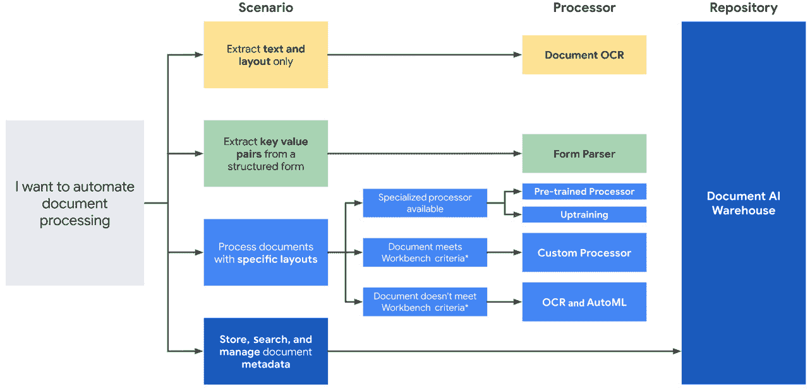
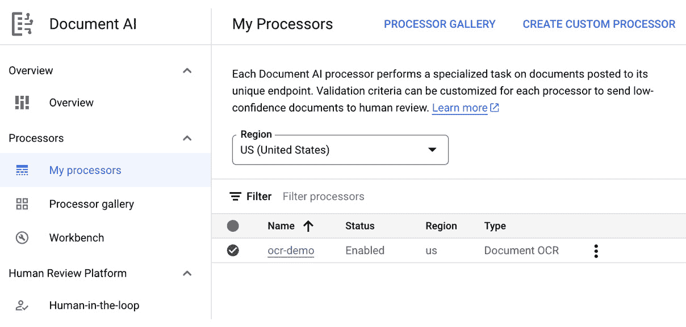
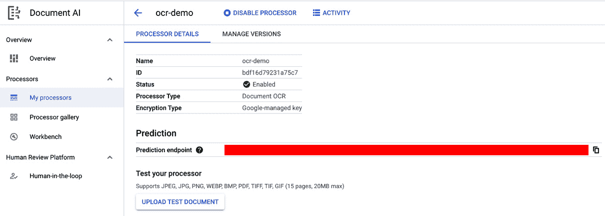
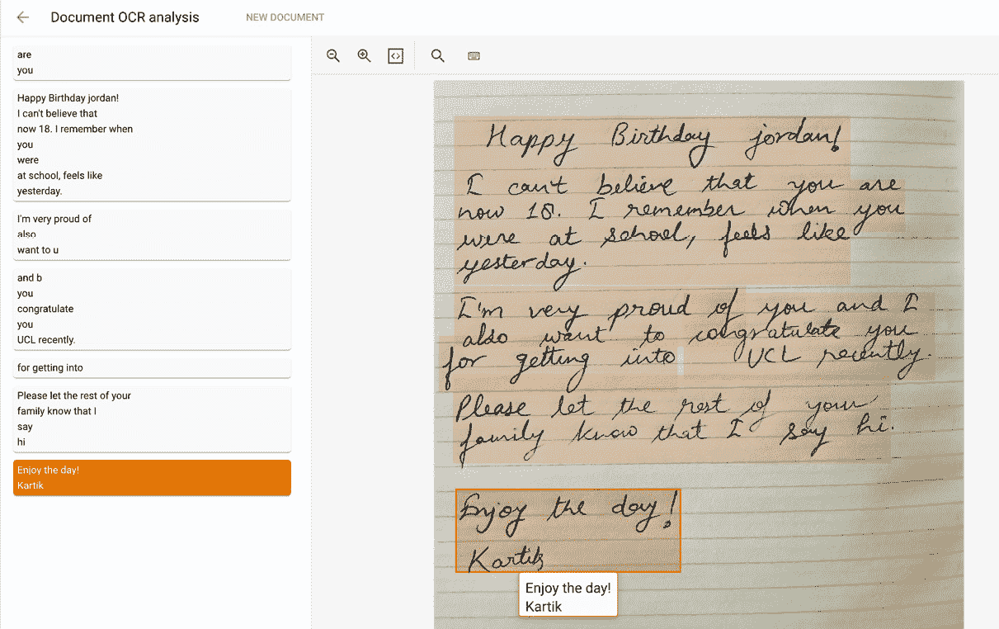
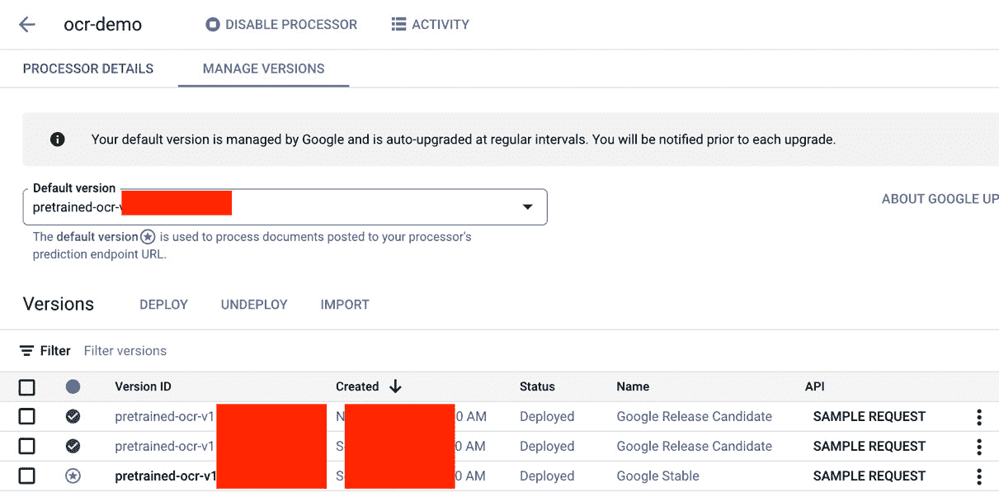
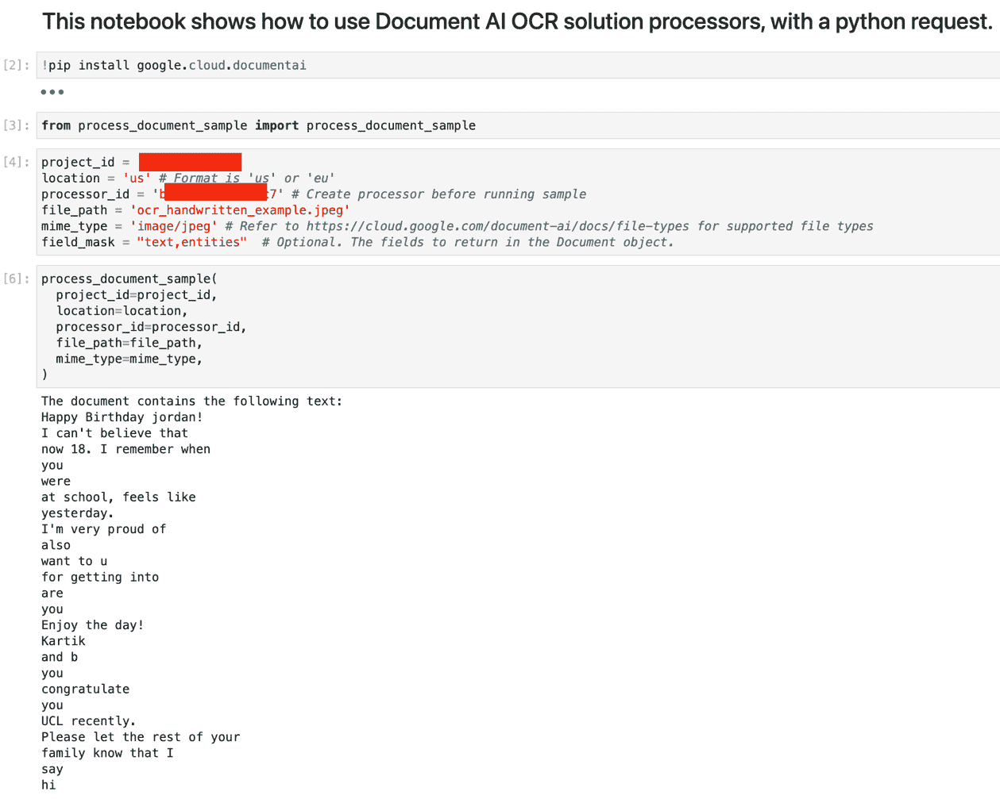
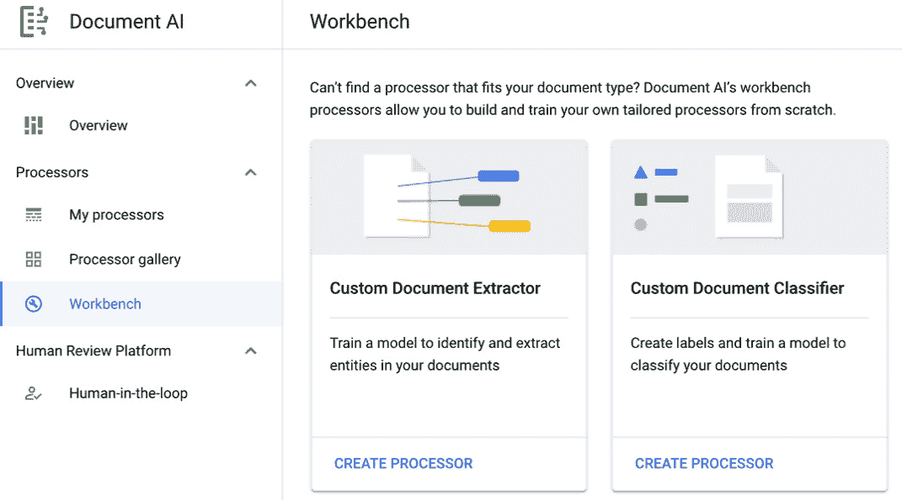
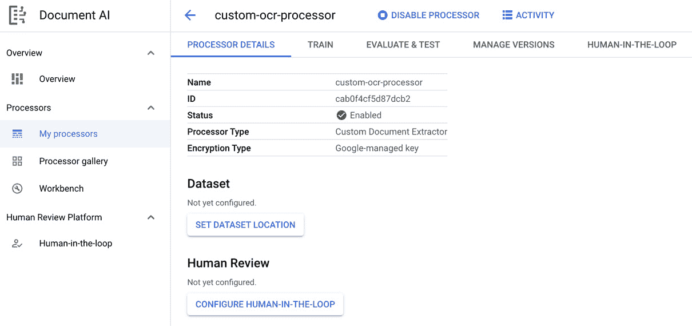

# 第十三章：文档人工智能 - 处理文档的端到端解决方案

几乎每家企业都依赖于某种形式的文档来日常传达信息。这可能包括电子邮件、合同、表格、PDF 等等。由于这些数据是非结构化的，许多企业往往无法充分利用这些数据带来的价值。如果有一种方法可以将这些大量文档数据转换为机器可读格式，它可以帮助完成许多有用的任务，例如自动化业务流程、进行数据分析、应用人工智能和机器学习，等等。考虑到数据量的大小，通常不可能手动解析这些文档来提取信息。像**光学字符识别**（**OCR**）这样的工具可以帮助部分自动化将文档转换为文本格式的任务，但仍然是非结构化的，并且需要更多的努力才能使其有用。

文档人工智能是 Google Cloud 提供的一项托管服务，它将非结构化内容（不同类型的文档）转换为结构化数据。它是一个端到端基于云的平台，用于以结构化的方式提取和分类信息，例如键值对，以便使这些数据易于使用。文档人工智能是一个复杂的解决方案，涉及许多基于人工智能和机器学习的算法，如 OCR、图像识别、**自然语言处理**（**NLP**）、实体提取、机器翻译等等。

在本章中，我们将学习如何在 GCP 上使用文档人工智能来提取任何业务问题的有用信息。本章将涵盖以下主要内容：

+   什么是文档人工智能？

+   现有文档人工智能处理器的概述

+   创建自定义文档人工智能处理器

# 技术要求

本章中展示的代码示例可以在以下 GitHub 仓库中找到：[`github.com/PacktPublishing/The-Definitive-Guide-to-Google-Vertex-AI/tree/main/Chapter13`](https://github.com/PacktPublishing/The-Definitive-Guide-to-Google-Vertex-AI/tree/main/Chapter13)。

# 什么是文档人工智能？

文档人工智能是一种端到端的人工智能解决方案，用于从任何类型的非结构化文档中提取和分类有用的信息，包括扫描图像、PDF、表格、电子邮件和合同。文档人工智能的解决方案包括用于提取和其他文档相关任务的预训练机器学习模型，并且它还提供了灵活性，可以重新训练现有模型和训练自定义模型，而无需编写大量代码。文档人工智能是一个统一的解决方案，可以帮助企业管理整个非结构化文档生命周期，确保高精度和低成本，以加速部署以满足客户期望。

Google Cloud 文档人工智能平台的一些关键特性如下：

+   **Google 的最先进人工智能**：文档人工智能平台建立在 Google 在计算机视觉（包括 OCR）、NLP 和语义搜索等各个领域的行业领先人工智能创新之上，使该平台非常准确且有用。

+   **统一的控制台**：它有一个统一的控制台，让我们可以快速访问所有相关的模型和工具，包括 OCR 和表单解析器。文档 AI 工作台让我们可以轻松地创建自定义或微调现有模型。文档 AI 仓库让我们可以存储、搜索和管理文档，甚至触发工作流。

+   **Google 知识图谱**：我们可以利用 Google 的知识图谱技术来验证和丰富解析信息，如地址和电话号码，与互联网上的实体进行对比。

+   **人机协作 AI**：此功能可以帮助我们在确保人工审核的情况下实现更高的准确性。除了准确性之外，它还可以帮助使用专门构建的工具来解释预测。

现在，让我们来看看文档 AI 处理器。

## 文档 AI 处理器

文档 AI 处理器是文档文件和执行文档处理相关任务的底层机器学习模型之间的接口。处理器可以用来分类、拆分、解析或分析文档。文档 AI 处理器可以分为以下三个类别：

+   **通用**：这些是预构建的处理器，可以应用于任何用例。OCR 是一个通用处理器示例，它是用例或文档无关的。

+   **专用**：这些也是预构建的处理器，专门构建来与某些固定类型的文档良好地工作。由于这些是专用的，它们在执行任务时通常非常准确。专用处理器在识别验证、贷款应用、合同以及与发票和收据等付款相关文档相关的用例中更有用。

+   **自定义**：这些可以根据用例和需求创建。有时，我们可能需要微调现有模型或训练自定义模型。自定义处理器提供了根据客户需求使用解决方案的灵活性。

*图 13*.1 可以帮助确定哪种处理器更适合特定的用例：



图 13.1 – Google Cloud 上的文档处理概述

既然我们从理论层面已经对文档 AI 平台有了很好的理解，接下来，我们将通过一些练习来了解如何使用这个解决方案来解决业务问题。

# 现有文档 AI 处理器的概述

如前所述，文档 AI 平台为通用用途以及一些专用用途提供了预构建的解析器。由于这些处理器是预构建的，它们可以轻松地用于任何相关用例，几乎不需要任何努力。在举例说明这些处理器的工作原理之前，让我们首先查看作为 Google Cloud 文档 AI 平台一部分的可用处理器列表：

+   **文档 OCR**：识别和提取超过 200 种语言中的机器打印文本和手写文本

+   **表单解析器**：除了 OCR 文本外，还提取键值对（实体和复选框）、表格和通用实体

+   **智能文档质量处理器**：根据文档的可读性评估文档质量并提供质量评分

+   **文档分割器**：根据逻辑边界自动分割文档

Document AI 为我们提供了许多专业化的处理器。以下是一些常见的专业预构建处理器的示例：

+   **合同解析器**：从法律合同中提取文本和值，如协议日期、生效日期和各方

+   **法国驾照解析器**：从法国驾照中提取姓名、文件 ID、出生日期等字段。

+   **美国护照解析器**：从美国护照图像中提取重要字段，如姓名、出生日期和文件 ID

+   **工资单解析器**：从工资单文档中提取姓名、公司名称和金额等信息

+   **发票解析器**：提取发票号码、供应商名称、金额、税额、到期日等信息

现在，让我们尝试在示例文档上使用这些解析器之一。

## 使用 Document AI 处理器

使用 Document AI 处理器开始处理文档有三个主要步骤：

1.  **选择处理器**：为特定用例选择最佳处理器对于获得最佳结果至关重要。Document AI 解决方案的文档可以帮助确定给定用例的最佳解析器。

1.  **创建处理器**：创建处理器意味着将预构建处理器部署到端点，以便它可以接受请求。

1.  **处理文档**：在此步骤中，我们将文档处理请求发送到端点以获取提取的结构化信息。

现在，让我们按照上述步骤尝试其中一个解析器。在这个例子中，我们将尝试通用的 Document OCR 解析器，从示例文档中提取文本信息。

第一步是打开 Google Cloud 控制台，转到**Document AI**，然后在左侧面板中点击**处理器画廊**。**处理器画廊**包含所有带有类别的预构建文档处理器。转到**文档 OCR**解析器，并点击**创建处理器**按钮。它将要求我们提供处理器名称和部署区域。几秒钟后，我们应该能在**我的处理器**标签中看到这个处理器，如图*图 13.2*所示：



图 13.2 – 在 Google Cloud 的 Document AI 中创建自定义处理器

通过点击处理器的名称，我们可以获取预测端点和其他有用信息（见*图 13.2*）：



图 13.3 – Google Cloud 控制台 UI 中的 Document AI 处理器详细信息

如前一个屏幕截图所示的控制台 UI，也提供了直接上传文档并测试结果的选择。让我们通过上传一个示例文档来试试这个功能。为了使事情更加复杂和有趣，我在一张纸上用我糟糕的笔迹写了一些东西。让我们看看它在上面是如何工作的（见图 *13**.4*）：



图 13.4 – 在示例手写图像上的文档 OCR 分析结果

如我们所见，文档 OCR 在手写文档上工作得很好。

现在，让我们在一个 Jupyter Notebook 单元中尝试这个功能，通过使用 Python 进行 API 请求来获取输出。在控制台中转到 **管理版本** 选项卡时，你可以从不同的训练 API 版本中选择使用（见图 *13**.5*）：



图 13.5 – 管理文档 AI 处理器的版本

*图 13**.6* 展示了如何在笔记本中通过 Python 请求从文档 OCR 解决方案中获取响应。完整的代码可在本章的 GitHub 仓库中找到：



图 13.6 – 使用 Python 请求从文档 AI 处理器获取预测

在这个 Jupyter Notebook 的屏幕截图中，我们正在使用 `process_document_sample` 函数。这个函数可在 Google Cloud 的公共 GitHub 示例中找到。此函数也可在本章的 GitHub 仓库中找到。我为这个函数运行了以下代码片段：

```py
def process_document_sample(
    project_id: str,
    location: str,
    processor_id: str,
    file_path: str,
    mime_type: str,
    field_mask: str = None,
):
```

如果你使用的是除 `us` 之外的位置，你必须设置 `api_endpoint`：

```py
    opts = ClientOptions(api_endpoint=f"{location}-documentai.googleapis.com")
    client = documentai.DocumentProcessorServiceClient(client_options=opts)    name = client.processor_path(project_id, location, processor_id)
    # Read the file into memory
    with open(file_path, "rb") as image:
        image_content = image.read()
```

现在，我们必须将二进制数据加载到文档 AI 的 `RawDocument` 对象中：

```py
    raw_document = documentai.RawDocument(content=image_content, mime_type=mime_type)
    # Configure the process request
    request = documentai.ProcessRequest(
        name=name, raw_document=raw_document, field_mask=field_mask
    )
    result = client.process_document(request=request)    document = result.document
    # Read the text recognition output from the processor
    print("The document contains the following text:")
    print(document.text)
```

通过这样，我们就有了一个很好的了解如何使用预构建的文档 AI 处理器，并通过在底层机器学习模型上使用 API 调用来获取结果。在下一节中，我们将学习如何在预构建处理器不完全符合用例时创建自定义处理器。

# 创建自定义文档 AI 处理器

如果我们无法找到适合我们用例的预构建处理器，文档 AI 工作台允许我们从零开始构建和训练自己的定制处理器，并且几乎不需要任何努力。如果我们进入文档 AI 中的 **工作台** 选项卡，我们将获得以下创建自定义处理器的选项（见图 *13**.7*）：



图 13.7 – 用于创建基于模型的自定义处理器的文档 AI 工作台

在这个练习中，我们将使用**自定义文档提取器**解决方案来创建自定义处理器。一旦我们点击**创建处理器**，我们就可以在**我的处理器**标签页中找到这个处理器。如果我们点击处理器，我们将获得训练、评估和测试自定义处理器的选项，以及管理自定义模型部署版本的选项。训练一个版本后，我们还可以配置**人工反馈**功能。参见*图 13*.8 中的这些选项：



图 13.8 – Google Cloud 控制台 UI 中的自定义文档 AI 处理器详细信息

正如你所见，创建一个自定义处理器需要一个训练数据集，这样我们就可以在我们的特定用例相关文档上微调现有的机器学习模型。只有当预构建的通用解决方案在文本提取准确性方面不能满足我们的业务期望时，我们才应该选择自定义处理器。这是因为创建自己的训练数据集可能是一个复杂的过程，因为它需要人工努力。如果我们已经有一个好的数据集可用，那么使用文档 AI 平台训练自定义处理器只需几步点击即可。

一旦我们的自定义处理器完成训练并在测试中显示出良好的结果，我们就可以将其作为模型版本部署。然后，可以通过 API 调用在生产中使用这个版本，就像预构建处理器被使用一样。

# 摘要

本章强调了这样一个事实：每个企业或公司都使用多种形式的文档（如电子邮件、合同、表格、PDF 和图像）来共享和存储信息。文档 AI 是 Google Cloud 上的端到端解决方案，它使我们能够以结构化的方式提取这些信息，以便可以轻松地用于训练机器学习模型或执行其他下游任务，从而从这些文档中的信息中获取大量价值。

通过完成本章，你现在应该对文档 AI 及其对每个企业的重要性充满信心。你也应该对文档 AI 中的预构建处理器有一个良好的理解，并且应该能够轻松地将它们集成到应用程序中。最后，如果预构建处理器不能满足你的期望，你可以选择构建自定义处理器以满足你的用例目标。

我们现在对 Google Cloud 上的文档 AI 有了很好的理解。在下一章中，我们将学习更多与视觉、自然语言处理和语音相关的 Google 产品。
