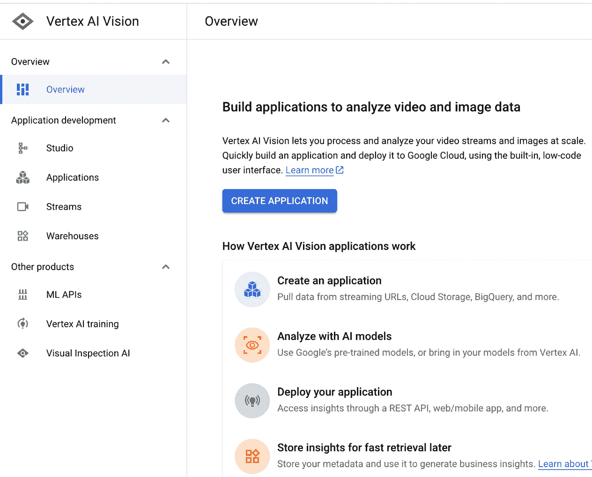
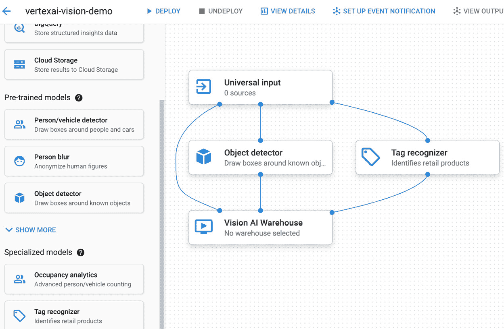
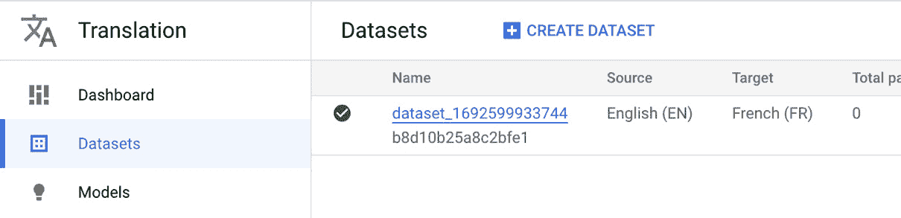
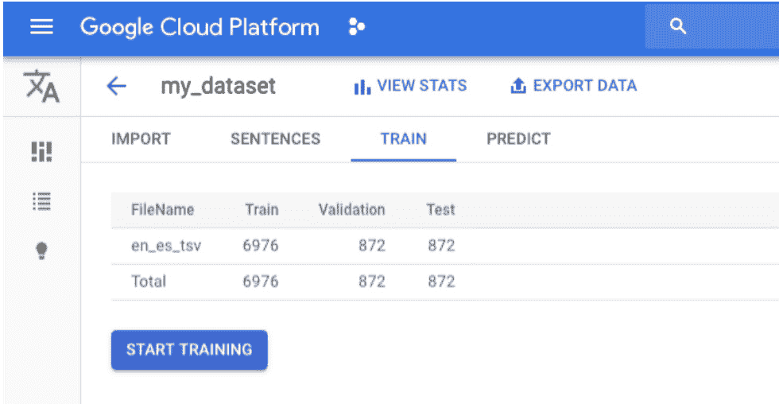
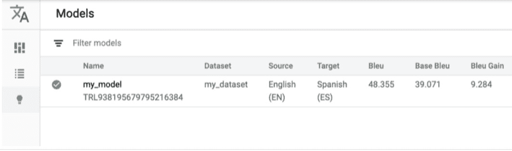

# 第十四章：视觉、NLP 和语音的 ML API

Google 的研究团队将他们数十年的研究和经验投入到为许多复杂问题创造最先进解决方案的过程中。其中一些解决方案，包括视觉 AI、翻译 AI、自然语言 AI 和语音 AI，相当通用，可以轻松地用于从复杂和非结构化数据中获取见解。这些解决方案以服务的形式提供，因此作为客户，我们无需担心管理这些产品的基础设施、可用性或扩展。许多流行的 Google 产品，如地图、照片、Gmail、YouTube 等，每天都在使用这些产品来提供 AI 驱动的体验。

在本章中，我们将探讨一些这些流行的产品，并了解可以使用它们解决哪些问题。本章将涵盖的主要主题如下：

+   Google Cloud 上的 Vision AI

+   Google Cloud 上的翻译 AI

+   Google Cloud 上的自然语言 AI

+   Google Cloud 上的语音 AI

# Google Cloud 上的 Vision AI

计算机视觉是**人工智能**（**AI**）的一个领域，它使计算机和系统能够从视觉数据（如数字图像和视频）中提取见解。理解图像和视频是一个复杂的过程，但随着该领域不断的研究，人工智能研究社区已经引领了许多智能的方法，从非结构化数据（如图像和视频）中提取信息。从数字图像和视频中提取的信息可以被企业利用，以大规模采取行动和提供推荐。Google Cloud 提供了以下两个产品作为解决计算机视觉问题的平台：

+   视觉 AI

+   视频 AI

现在，让我们深入探讨这些产品中的每一个。

## 视觉 AI

Google Vision AI 提供了一个平台，使用预训练的 API、AutoML 或自定义模型来创建基于视觉的应用程序。使用 Vision AI，我们只需几分钟就能创建图像和视频分析解决方案。这个产品允许我们使用 AutoML 训练我们的自定义分类或目标检测模型，同时也允许我们训练完全自定义的模型。Vision AI 为常见的视觉任务提供了预训练的 API，例如目标检测、手写识别、图像元数据创建等。在 Google Vision AI 平台下有三个常见的提供产品：

+   Vertex AI 视觉

+   自定义 ML 模型

+   视觉 API

让我们更深入地了解一下它们。

### Vertex AI 视觉

Vertex AI 视觉是一个全托管端到端应用开发环境，使用它可以快速原型化符合我们业务需求的眼动解决方案。Vertex AI 视觉可以帮助我们在几分钟内解决复杂问题并创建有价值的解决方案，从而节省大量开发成本。Vertex AI 视觉允许我们以大规模摄取实时视频和图像流，以支持实时生产用例。应用开发界面也非常简单，并允许我们通过拖放功能快速构建应用。

让我们看看 Google Cloud 控制台中的 Vertex AI 视觉界面。请确保首先启用视觉 API，然后从左侧面板导航到 Vertex AI 视觉。或者，您也可以在顶部搜索它。界面应该看起来类似于以下内容：



图 14.1 – Vertex AI 视觉界面

现在，我们可以通过点击**创建应用**按钮开始构建我们的应用，之后我们将被要求为应用提供一个唯一的名称。一旦我们点击**创建**，我们将进入应用开发工作室，在那里我们可以找到根据应用需求使用预训练或专用模型的不同选项。界面非常简单，并允许我们通过拖放功能构建应用。

以下截图显示了一个简单的对象检测和标签识别应用，该应用从 GCS 存储桶获取输入。执行此任务后，它将输出写入到视觉人工智能仓库位置。我们已为此应用配置了批量预测，因此输入源是包含图像的 GCS 存储桶，但我们还有其他输入类型选项，例如流或实时预测用例。让我们看看工作室界面和我们的示例应用：



图 14.2 – Vertex AI 视觉工作室用于快速应用创建

此应用图可以一键部署，我们可以在几分钟内开始在生产环境中使用它。Vertex AI 视觉提供了一些强大的预训练模型以及一些准备就绪的专用模型，可以部署使用。它还为我们提供了灵活性，可以使用 Vertex 定制训练导入或创建自定义模型。在部署视觉应用时，我们还可以选择流输出类型，以便我们可以为我们的应用启用模型监控。

### 自定义机器学习模型

视觉人工智能支持为更专业的用例创建自定义机器学习模型。我们可以使用以下方法之一来创建专用模型：

+   **AutoML**：Vertex AI 中的 AutoML 易于使用的图形界面使我们能够以最小的努力和技术知识来训练我们的自定义模型。使用 AutoML，我们可以通过简单地上传训练文件来训练图像或视频智能模型。我们还可以根据我们的要求优化模型以降低延迟、大小和精度。在撰写本文时，AutoML 支持图像数据的目标检测和分类模型，以及视频数据的目标跟踪、动作识别和分类。

+   **自定义训练**：当 AutoML 不支持我们的用例时，自定义训练非常有用。它需要更多的努力和技术深度。自定义训练让我们可以选择所需的模型开发框架、用于启动训练作业的 VM 类型以及基于训练需求的各种类型的加速器。使用自定义训练，我们可以为不同的复杂用例训练我们的专业模型，并将它们部署到实时、流或批量预测用例中。

接下来，我们将学习关于视觉 API 的内容。

### 视觉 API

视觉 API 提供了强大的预训练机器学习模型，用于从图像中读取打印或手写文本、检测对象、将图像分类到数百万个预定义类别、标记显式内容等任务。视觉 API 模型可以通过 REST 和 RPC API 进行消费。例如，从图像中检测文本的解决方案可以与其他解决方案（如翻译）结合，以创建更复杂的批量、流或实时预测任务的生产解决方案。官方视觉 API 文档提供了大量的代码示例，用于快速原型设计视觉解决方案。

## 视频 AI

视频 AI 专门设计用于大规模分析视频数据，以理解给定输入视频中的固有内容、对象、地点或动作。它可以通过流视频注释和基于对象的触发机制来支持实时用例，从而从数据中获得洞察。视频 AI 可以在镜头、帧或视频级别从视频中提取有用的元数据。以下是一些 Video AI 的常见用例：

+   **内容审核**：大规模识别视频中显示的不适当内容。

+   **推荐**：我们可以使用视频智能 AI 的输出，并结合用户观看历史，以大规模提供内容推荐。

+   **媒体归档**：我们可以使用从视频智能 API 中提取的元数据来高效地存储媒体，以便在需要时更快地检索。

+   **广告**：我们可以在视频中识别放置上下文广告的最佳位置。

这里有两种在 Google Cloud 上开始开发视频 AI 解决方案的常见方法：

+   AutoML 视频智能

+   视频智能 API

让我们更深入地了解一下。

### AutoML 视频智能

有时候，我们会遇到一些用例，在这些用例中，我们希望在视频内识别某些类型的对象或事件，而这些对象或事件并不是视频智能 API 本身所涵盖的。在这种情况下，我们可以开发自己的定制模型来识别和跟踪视频中的各种新对象。AutoML 通过其图形用户界面，使得在没有太多机器学习经验的情况下训练定制视频智能模型变得更加容易。

在撰写本文时，AutoML 视频智能支持以下用例：

+   **动作识别**：在这个用例中，解决方案分析视频并返回在动作发生的时间框架内执行的一系列预定义动作。它可以识别诸如足球进球、击掌等动作。

+   **分类**：分类模型可以将视频分类到一系列预定义的类别中，如体育视频、卡通、电影等。

+   **对象跟踪**：我们可以训练一个模型来持续跟踪视频中的某些对象——例如，我们可以在一场实时进行的足球比赛中跟踪足球。

如果 AutoML 不符合我们的需求，我们总是可以回到 Vertex AI 定制模型开发，并训练适合我们用例的定制视频智能模型。定制训练让我们能够定义自己的定制模型架构、训练模型所使用的虚拟机类型以及用于训练的类型加速器。然而，这需要更多的技术深度和努力来开发解决方案。

现在我们对图像和视频智能解决方案有了很好的了解，让我们来看看翻译 AI 解决方案，它也可以与各种图像和视频用例结合，以解决更复杂的企业问题。

# Translation AI on Google Cloud

如其名所示，Google Cloud 上的翻译 AI 是一个可以用来创建具有多语言内容的应用程序的服务，它提供快速和动态的机器翻译。多语言内容可以帮助企业将产品推向全球市场并与全球受众互动。其实时翻译功能提供无缝体验。让我们来看看 Google Cloud 上的翻译相关服务。

Google Cloud 提供三种翻译产品：

+   Cloud Translation API

+   AutoML Translation

+   Translation Hub

让我们深入了解这些产品中的每一个。

## Cloud Translation API

Google Research 在一段时间内开发了几个**神经机器翻译**（NMT）模型，并在有更好的训练数据或改进的技术时不断改进它们。Cloud Translation API 利用这些预训练模型或自定义机器学习模型将文本从各种源语言翻译成目标语言。使用 Cloud Translation API，我们可以通过仅使用 API 调用程序来动态地以编程方式翻译我们网站或应用程序的内容。默认情况下，这些预训练模型在训练过程中不使用任何客户数据。对于提供全球服务或产品的企业或公司来说，拥有语言翻译能力以更有效地理解和参与受众是非常重要的。作为一个产品，Cloud Translation API 通过 API 调用解决了识别源语言并将其翻译成所需目标语言的问题。它支持超过 100 种语言，但如果它仍然不能满足您的需求，如果您有训练数据，有方法来训练您的自定义模型。现在，让我们看看为自定义模型提供的 AutoML Translation 服务。

## AutoML Translation

如前所述，Cloud Translation API 本身支持超过 100 种语言的翻译，但如果需要支持额外的语言，我们有灵活性来训练我们的自定义模型，前提是我们有足够的训练数据。当需要支持特定领域的翻译时，训练自定义模型也有帮助——例如，如果我们在一个金融领域工作，我们希望翻译解决方案提供更符合金融语言的特定结果。

AutoML Translation 本身训练最先进的机器学习模型架构，而无需我们投入精力开发我们的模型架构。我们只需要准备我们所需的输入-输出句子对，然后 AutoML 将自动找到最佳架构并为我们训练一个自定义翻译模型。

让我们检查它如何在 Cloud Console UI 中工作。如果我们从 Cloud Console 左侧的面板转到**翻译**标签，我们会找到一个创建数据集的标签，如图*图 14*.3 所示。在这里，我们需要为我们的数据集提供具有源语言和目标语言的唯一名称。一旦创建了数据集，如图*图 14*.3 所示，我们就可以开始向其中添加句子对：



图 14.3 – 创建翻译数据集

添加一些数据后，我们可以通过点击数据集来查看数据集的统计信息，如图*图 14*.4 所示。如图所示，我们有用于训练、验证和测试对的拆分。一旦 AutoML 模型被训练，我们可以在测试数据集上检查指标，以检查我们的自定义模型有多好：



图 14.4 – 审查语言翻译的数据集

可以通过点击**开始训练**按钮开始模型训练，如图 *图 14.4* 所示。一旦训练完成，我们可以在**模型**标签页中找到我们的训练模型，它显示了测试分区上的评估指标：



图 14.5 – 带评估指标的定制训练翻译模型

模型训练成功后，我们可以使用不同的方法获取翻译输出，例如通过 REST API 调用，或者通过使用不同的开发语言调用 API，包括 Python、Java、Go 等。

以下代码片段展示了使用 Python 语言对一个定制翻译模型进行的一次示例 API 调用。这个示例可以在 Google Translation AI 的官方文档页面上找到。

以下代码展示了如何设置翻译服务客户端和其他配置：

```py
from google.cloud import translate
def translate_text_with_model(
    text: str = "YOUR_TEXT_FOR_TRANSLATION",
    project_id: str = "GCP_PROJECT_ID",
    model_id: str = "CUSTOM_MODEL_ID",
) -> translate.TranslationServiceClient:
    """Translates a given text using custom model."""
    client = translate.TranslationServiceClient()
    location = "us-central1"
    path = f"projects/{project_id}/locations/{location}"
    model_path = f"{path}/models/{model_id}"
```

在这里，我们使用适当的语言代码调用 API：

```py
    # With supported language codes: https://cloud.google.com/translate/docs/languages
    response = client.translate_text(
        request={
            "contents": [text],
            "target_language_code": "ja",
            "model": model_path,
            "source_language_code": "en",
            "parent": parent,
            "mime_type": "text/plain",  # mime types: text/plain, text/html
        }
    )
```

在这里，我们正在检查模型的响应：

```py
    # print the translation output for each input text
    for translation in response.translations:
        print(f"Translated text output: {translation.translated_text}")
    return response
```

Cloud Translation API 本身或通过 AutoML 翻译增强以支持定制模型，更适合需要动态或近乎实时翻译的用例。现在，让我们了解 Translation Hub，它可能更适合大规模翻译需求。

## Translation Hub

假设有一个组织需要快速将大量文档翻译成多种不同的语言。Translation Hub 对于此类用例更为合适，因为它是一个完全管理的解决方案，我们不需要为这项任务构建任何网络应用程序或设置基础设施。使用 Translation Hub 的另一个优点是，在将文档翻译成多种不同语言的同时，它保留了文档的基本结构和布局。设置起来相当简单，并且内置于 Cloud Translation API 和 AutoML 翻译解决方案中。

让我们讨论一下使用 Translation Hub 的好处。

### 自助翻译

在过去，翻译文档的唯一方式是手动操作，这相当慢，并且需要熟练的多语言专业人员。另一方面，Translation Hub 利用 AI 领域的进步，以超快的速度提供超过 100 种语言的翻译。我们还可以将人工审查作为后处理步骤，以改进来自 AI 模型的任何翻译。这样，Translation Hub 可以节省大量时间和成本。

### 文档翻译

假设我们拥有 PDF 或 DOCX 格式的文档 – 我们可以直接将它们传递给 Translation Hub，并且不需要事先从它们中提取文本。此外，Translation Hub 保留了文档的原始结构和格式（段落分隔、标题等），这非常有帮助。

### 简化管理

就像其他谷歌云产品一样，我们可以在云控制台 UI 中管理用户访问和门户访问。我们还可以轻松创建翻译资源，如术语表和翻译记忆。

### 持续改进

假设我们有在回路中的人类来后处理翻译；我们可以使用翻译记忆在翻译中心保留这些后编辑的翻译。这些翻译记忆可以以后再次使用。此外，我们可以将这些人工审查的翻译记忆导出为数据集，并训练一个更精确的定制翻译模型。

### 基于页面的定价

翻译中心定价非常直接，因为它根据从翻译 API 或基于 AutoML 的定制模型翻译的页面数量收费。部署和维护定制模型没有额外费用，但定制模型的训练是单独收费的。

有了这些，我们已经看到基于云的翻译对于处理大量文档并希望在其母语中触及全球受众的组织非常有用。接下来，让我们了解一下谷歌云上的自然语言 AI 产品。

# 谷歌云上的自然语言 AI

几乎每个组织都以文本文档、表格、合同、PDF、网页、用户评论等形式处理大量文本数据。谷歌云提供自然语言 AI，它利用机器学习模型从非结构化文本数据中提取洞察。自然语言 AI 是一个端到端产品，可以帮助在谷歌云上提取、分析和存储文本。

谷歌提供以下三种自然语言解决方案：

+   文本分析 AutoML

+   自然语言 API

+   医疗保健自然语言 API

让我们逐一深入了解这些解决方案。

## 文本分析 AutoML

想象一下，有一家电子商务公司收到与各种问题相关的客户查询，包括支付失败、送货地址更新、产品质量问题等。由于大多数这些查询都是客户在文本框中键入的，因此需要将这些查询分类到一组固定的类别中，以便将它们路由到正确的解决团队。当此类查询的数量很大时，手动对这些查询进行分类变得相当困难。这个过程可以通过训练一个能够自动将问题分类到适当类别的分类模型来使用机器学习进行自动化。

谷歌云上的 AutoML 支持训练机器学习模型来理解和分析文本数据。使用 AutoML 的主要优势是我们不需要编写任何复杂的模型架构、模型训练或评估代码。使用 AutoML，我们可以不编写任何代码就训练和评估机器学习模型。我们只需访问谷歌云控制台的 AutoML 页面，上传所需格式的数据集，然后开始训练机器学习模型。

AutoML 目前支持以下三类文本分析用例：

+   **分类**：文本分类是指训练接受文本句子或段落作为输入并将它们映射到固定类别集的输出作为输出的机器学习模型。Vertex AI 还支持多标签分类，这意味着单个输入句子也可以被分类到多个类别中。

+   **实体提取**：实体提取模型扫描文本输入以查找和标记预定义的实体。这些实体可能包括城市、国家、姓名、地址、疾病名称等。实体提取模型首先在固定的一组标记实体上训练，然后用于识别未见过的文本段落或句子中的实体。

+   **情感分析**：情感分析模型分析文本数据以识别其中的情感。它将文本输入分类为正、负、中性等类别。情感分析可以帮助识别来自反馈表客户的情感。

现在我们已经了解了 AutoML 如何帮助我们，让我们来讨论自然语言 API。

## 自然语言 API

Google Cloud 上的自然语言 API 为各种文本分析用例，如情感分析、实体提取、分类等，提供了预构建的业界领先解决方案。由于这些解决方案与 API 请求一起工作，因此它们可以快速轻松地集成到任何应用中。Google 提供了客户端库，以便开发者使用每种支持语言的风格和约定来使用自然语言 API 解决方案，从而为开发者提供更好的体验。官方文档页面上可以找到一个使用客户端库的快速示例（[`cloud.google.com/natural-language/docs/sentiment-analysis-client-libraries`](https://cloud.google.com/natural-language/docs/sentiment-analysis-client-libraries)）。

自然语言 API 目前提供以下功能以支持不同的文本分析用例：

+   情感分析

+   实体提取

+   实体情感分析

+   句法分析

+   内容分类

自然语言 API 是一个 REST API，因此支持 JSON 响应和请求格式。一个示例 JSON 请求可以写成如下：

```py
{
  "document":
{
            "type":"PLAIN_TEXT",
           "language_code": "EN",
           "content": "This is a sample REST API request to the Natural Language API on Google Cloud."
    },
  "encodingType":"UTF8"
}
```

同样，一个情感分析查询的示例响应可能看起来非常类似于以下内容：

```py
{
  "documentSentiment": {
    "score": 0.1,
    "magnitude": 3.6
  },
  "language_code": "en",
   "sentences": [
    {
      "text": {
        "content": "This is a sample request text for the Natural Language API just to check how it works. In the JSON response you should see the output very close to the neutral sentiment."
        "beginOffset": 0
      },
      "sentiment": {
        "magnitude": 0.8,
        "score": 0.1
      }
    },
   ...
}
```

在这里，情感分数从-1（负面）到+1（正面）不等，接近零的是中性。幅度显示了情感强度，它可以取从 0 到+inf 的任何值。

## 医疗自然语言 API

医疗自然语言 API 可以用来从非结构化医疗文本中提取实时洞察。存在于病历、出院总结和保险索赔文件中的非结构化医疗文本可以使用医疗自然语言 API 解析成医疗知识实体的结构化数据表示。一旦生成这种结构化输出，我们就可以将其传递给各种下游应用或创建自动化流程。

**Healthcare Natural Language API** 的关键特性如下：

+   您可以提取重要的医学概念，如药物、程序、疾病、医疗设备和如此等等

+   您可以从文本中提取医学见解，这些见解可以与 Google Cloud 上的分析产品集成

+   您可以将医学概念映射到标准约定，例如 RxNorm、ICD-10、MeSH 等

以下是从 Healthcare Natural Language API 获取的示例响应 JSON：

```py
{
    "entityMentions": [
        {
            "mentionId": "1",
            "type": "PROBLEM",
            "text": {
                "content": "COPD",
                "beginOffset": 38
            },
            "linkedEntities": [
                {
                    "entityId": "UMLS/C0024223"
                }
            ],
            "temporalAssessment": {
                "value": "CURRENT",
                "confidence": 0.95
            },
            "certaintyAssessment": {
                "value": "LIKELY",
                "confidence": 0.99
            },
            "subject": {
                "value": "PATIENT",
                "confidence": 0.98
            },
            "confidence": 0.999
        },
        {
            "mentionId": "2",
            "type": "SEVERITY",
            "text": {
```

这种实体提取和实体关系提取功能对于医疗保健公司非常有帮助。现在我们已经涵盖了与自然语言相关的产品服务，让我们接下来看看与语音相关的产品。

# Google Cloud 上的语音 AI

另一种重要的捕捉和存储信息的形式是语音。Google 进行了数十年的研究，为许多语音和音频数据相关用例提供了最先进的解决方案。大量的关键信息以音频通话和录音消息的形式存在，因此转录和从中提取有用见解变得非常重要。此外，还有一些需要文本到语音功能功能的语音助手相关用例。Google Cloud 提供多种语音理解和转录解决方案。为了帮助组织应对这些用例，Google 创建了以下与语音数据相关的产品服务：

+   语音转文本

+   文本转语音

现在，让我们详细了解每个产品。

## 语音转文本

对于许多组织来说，大量有用的数据以非结构化形式存在，例如音频记录、客户语音通话、视频等。因此，分析这类数据以提取可操作的见解变得非常重要。要利用此类数据，必须有一种方法能够准确地将语音数据转录成文本格式。一旦我们的数据被转换为文本格式，我们就可以训练多个 NLP 模型，从中获取有用的业务见解。沿着类似的路线，Google 提供语音转文本作为产品服务，以解决准确将语音数据转换为文本的问题。它可以帮助组织从客户互动中获得更好的见解，并通过启用语音的力量提供更好的体验。

语音转文本的一些关键用例如下：

+   **提升客户服务**：语音转文本可以帮助组织通过在呼叫中心启用**交互式语音响应**（IVR）和代理对话来改善客户互动。他们还可以从对话数据中提取见解并执行分析。语音转文本提供了专门用于非常准确转录低质量电话的 ML 模型。

+   **启用语音控制**：当应用于**物联网**（IoT）设备时，语音控制可以显著提升用户体验。用户现在可以通过语音命令（如*增加* *音量*）与设备互动。

+   **多媒体内容**：语音转文本允许音频和视频在近乎实时的基础上进行转录，这样我们就可以添加字幕以提高受众的覆盖范围和体验。视频转录还可以帮助我们为视频内容添加字幕或建立索引。这个功能已经被 YouTube 使用。

Google 语音转文本的一些关键功能，这些功能使得之前讨论的用例成为可能，如下所示：

+   **语音自适应**：语音识别模型可以通过提供一些提示来定制以识别罕见单词或短语。它还可以将口语数字转换为格式良好的地址。

+   **流式语音识别**：语音识别 API 支持实时转录，音频可能直接来自麦克风或预先录制的文件。

+   **全局词汇**：语音转文本支持超过 100 种语言，以支持全球用户基础。

+   **多通道识别**：视频会议的多通道录音也可以进行标注以保留顺序。

+   **噪声鲁棒性**：语音转文本可以处理嘈杂的录音并提供非常准确的转录。

+   **领域自适应**：语音转文本还提供了一些领域自适应模型。例如，电话录音通常是低质量的音频文件，谷歌有专门处理电话录音并提供非常准确转录的模型。

+   **内容过滤**：语音转文本具有检测和删除不适当单词的功能。

+   **说话人分割**：说话人分割是一个涉及识别多说话人对话中哪个说话人说了一句话的问题。谷歌提供了专门的说话人分割模型。

所有这些功能使语音转文本成为一个非常强大且通用的工具，可以轻松集成到任何商业用例中。由于这项服务有 API 支持，我们甚至不需要编写一行代码就可以开始使用这个解决方案。接下来，让我们了解另一个重要的语音相关解决方案：文本转语音。

## 文本转语音

如其名所示，文本转语音服务将文本转换为自然声音的语音。它可以帮助通过智能和逼真的响应来改善客户互动。我们可以通过根据客户的语言和声音偏好提供响应来个性化客户沟通。我们还可以通过物联网设备（例如，谷歌助手）进行语音交互来吸引用户。

Google 文本转语音的一些关键用例如下：

+   **语音机器人**：我们可以在我们的联系中心提供智能语音响应，而不是播放预先录制的音频，从而提供更好的客户体验。语音机器人可以为顾客提供更熟悉和个性化的感觉。

+   **语音生成**：我们可以使我们的物联网设备像人类一样说话，以实现更好的沟通。文本转语音可以与语音识别和自然语言解决方案结合，提供更好的端到端类似人类的对话体验。

+   **电子节目指南**（**EPGs**）：文本转语音解决方案可以为电子节目指南提供动力，大声朗读文本以提供更好的用户体验。我们可以启用博客大声朗读新闻。

为了指导这些有趣的用例，Google 已经在其文本转语音产品中开发了以下关键功能：

+   **语言和声音选择**：文本转语音目前支持超过 200 种不同类型的语音，并支持 40 多种语言。

+   **WaveNet 语音**：Google Deepmind 的开创性研究使 WaveNet 能够生成 90 多种极其类似人类的语音，缩小了与人类表现的差距。

+   **自定义语音**：通过提供一些语音录音，我们可以在 Google 文本转语音模型中启用自己的声音。此功能目前处于测试阶段。

+   **音调调整**：我们可以调整所选声音的音调。

+   **说话速度调整**：我们获得了增加或减少说话速度的功能。

+   **音频格式**：文本转语音支持多种音频格式以提供输出。

+   **音频配置文件**：我们还可以优化播放音频的设备类型，例如电话线路、耳机等。

警告

自定义语音目前是 Vertex AI 中的一个私有功能，因此在我们联系销售团队成员之前，我们将无法实现自定义语音。[`cloud.google.com/contact`](https://cloud.google.com/contact)

带有所有这些功能，Google 文本转语音可以轻松集成到可以发送 REST 或 gRPC 类请求的应用程序中。文本转语音 API 可以与许多不同类型的设备集成，包括手机、平板电脑、PC 和其他物联网设备。

# 摘要

并非所有重要数据都以结构化格式存在。大量重要信息以非结构化形式存在，如音频、视频、文档、录音等。机器学习取得的进展使我们能够大规模分析这些非结构化数据源，提取可操作的见解并指导关键业务决策。Google 对这个机器学习研究问题进行了广泛的研究，以提出语音、视觉、NLP、语音等领域的最先进解决方案。

在本章中，我们了解了谷歌为理解并从非结构化数据格式中提取信息提供的不同服务，包括音频、视频、图像、文档、电话录音等。阅读本章后，我们现在应该对这些服务有一个很好的理解，包括它们的关键特性和潜在的应用场景。在详细讨论之后，我们现在应该能够找到新的应用场景，将这些解决方案应用于自动化或增强组织内的各种业务流程。在接下来的几章中，我们将学习如何在谷歌云上构建现实世界的机器学习解决方案，例如推荐系统、视觉和 NLP 解决方案。

# 第四部分：使用谷歌云构建现实世界的机器学习解决方案

在本部分，你将探索使用谷歌云中 Vertex AI 提供的工具开发现实世界机器学习解决方案的示例。这些示例将向你展示如何使用谷歌云中的机器学习工具构建推荐系统、基于视觉的定制应用和基于 NLP 的定制解决方案。

本部分包含以下章节：

+   *第十五章*, *推荐系统 – 预测用户想看哪些电影*

+   *第十六章*, *基于视觉的缺陷检测系统 – 机器现在能看见*

+   *第十七章*, *自然语言模型 – 检测虚假新闻文章*
