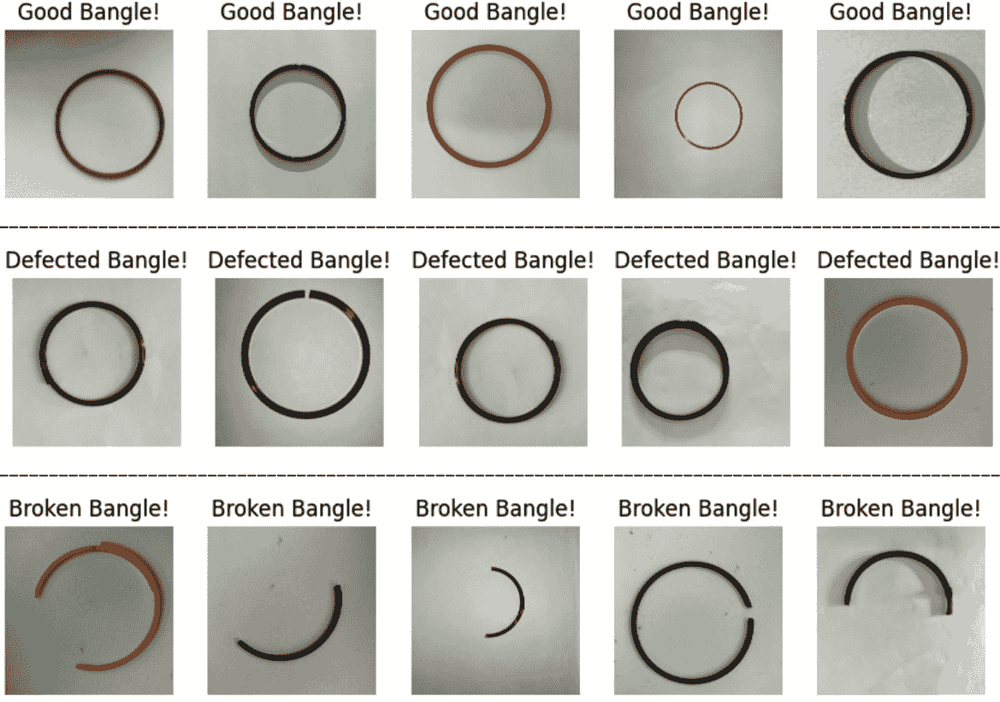
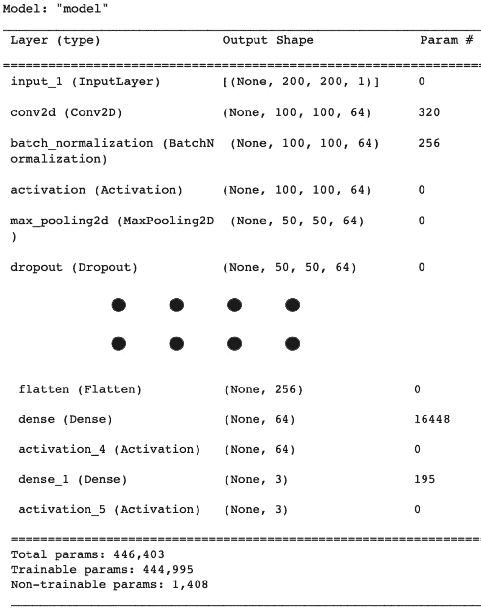
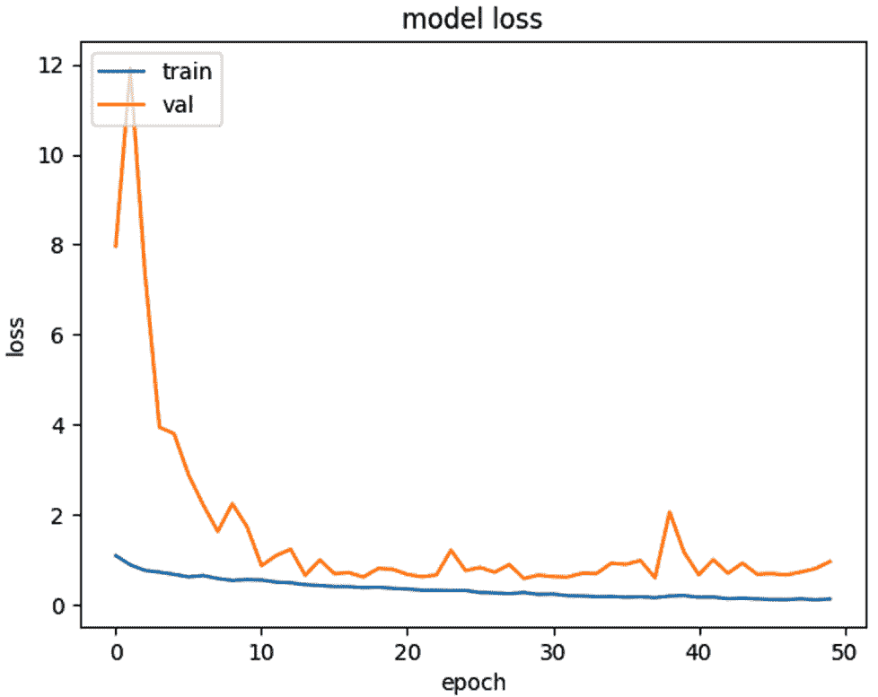
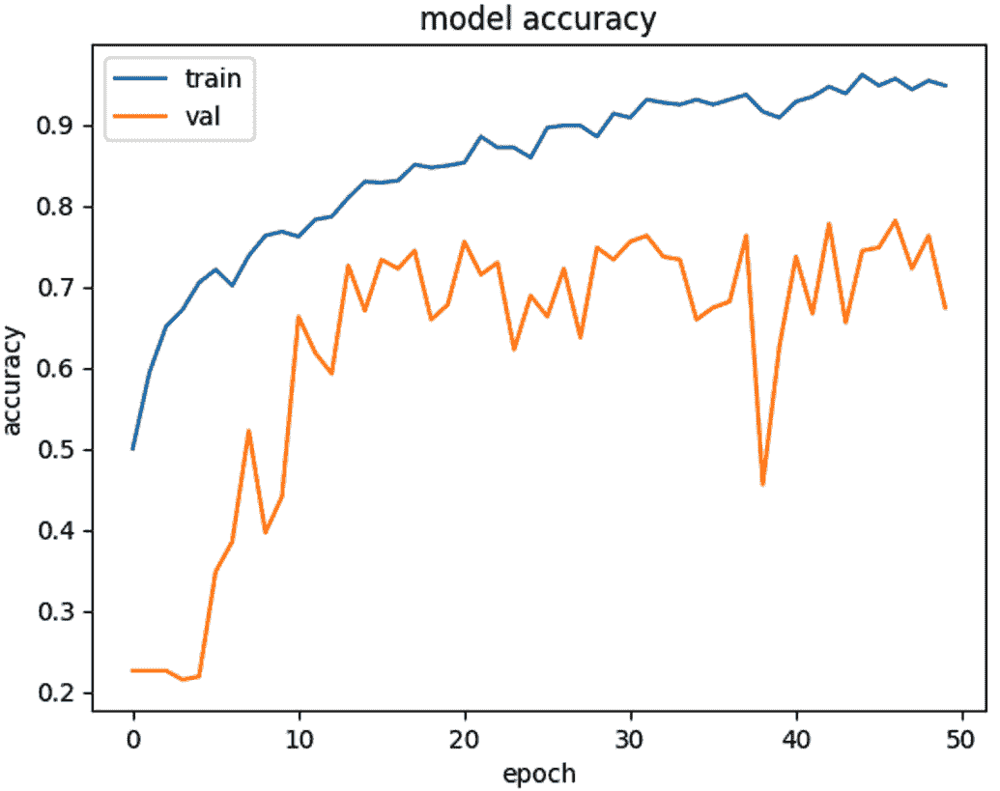
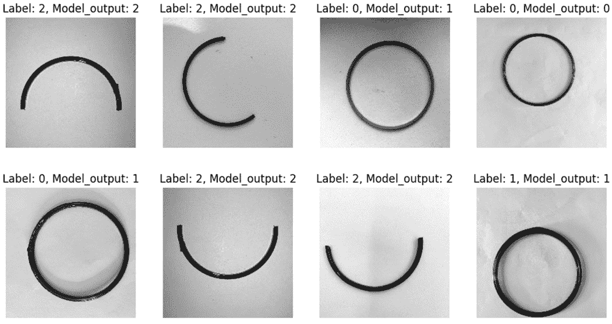

# 第十六章：基于视觉的缺陷检测系统 – 机器现在也能“看”了！

**计算机视觉**（**CV**）是人工智能的一个领域，它关注于赋予机器分析并从数字图像、视频和其他视觉输入中提取有意义信息的能力，以及根据提取的信息采取行动或做出推荐。在计算机视觉领域数十年的研究导致了基于机器学习（**ML**）的强大视觉算法的发展，这些算法能够将图像分类到一些预定义的类别中，从图像中检测对象，从数字图像中理解书面内容，以及检测视频中正在执行的动作。这样的视觉算法赋予了企业和组织分析大量数字内容（图像和视频）的能力，并自动化流程以做出即时决策。

基于计算机视觉（CV）的算法已经改变了我们日常与智能设备互动的方式 – 例如，我们现在只需展示我们的面部就可以解锁智能手机，而现在的照片编辑应用可以使我们看起来更年轻或更老。应用基于 CV 的机器学习（ML）算法的另一个重要用例是缺陷检测。机器学习算法可以用来分析视觉输入并在产品图像中检测缺陷，这对制造业来说非常有用。

在本章中，我们将使用 Google Cloud 上的深度学习开发一个实际的缺陷检测解决方案。我们还将了解如何部署我们的基于视觉的缺陷检测模型作为 Vertex AI 端点，以便它可以用于在线预测。

本章涵盖了以下主要内容：

+   基于视觉的缺陷检测

+   将视觉模型部署到 Vertex AI 端点

+   从视觉模型获取在线预测

# 技术要求

本章中使用的代码示例可以在以下 GitHub 地址找到：[`github.com/PacktPublishing/The-Definitive-Guide-to-Google-Vertex-AI/tree/main/Chapter16`](https://github.com/PacktPublishing/The-Definitive-Guide-to-Google-Vertex-AI/tree/main/Chapter16).

# 基于视觉的缺陷检测

现在的计算机视觉（CV）能够通过分析物体的数字照片或视频来检测物体表面的视觉缺陷或设计上的不一致性（例如汽车车身上的凹痕或划痕）。制造业可以利用计算机视觉算法自动检测并移除低质量或存在缺陷的产品，防止其被包装并送达客户。使用基于 CV 的算法在数字内容中检测缺陷有许多可能的方法。一个简单的想法是将缺陷检测视为一个分类问题，其中可以训练一个视觉模型来分类图像，如“良好”或“缺陷”。一个更复杂的缺陷检测系统还将定位图像中存在缺陷的确切区域。可以使用目标检测算法来解决识别和定位视觉缺陷的问题。

在本节中，我们将逐步构建和训练一个简单的缺陷检测系统。在这个例子中，我们将使用机器学习分类作为检测视觉缺陷产品的机制。让我们探索这个例子。

## 数据集

对于这个实验，我们从 Kaggle 下载了一个开源数据集。该数据集包含超过一千张彩色玻璃手镯的图像。这些图像包含不同大小和颜色的手镯，可以根据其制造质量和损坏情况分为三大类——好的、有缺陷的和破损的。有缺陷的手镯可能存在制造缺陷，如恒定的宽度或不当的圆形形状，而破损的手镯则可能缺少圆形的一部分。在这个实验中，我们将利用这些图像中的某些图像来训练一个机器学习分类模型，并在一些未见过的样本上进行测试。图像已经按照上述类别分开，因此不需要手动数据标注。本实验中使用的数据集可以从与该实验对应的 Jupyter Notebook 中提供的 Kaggle 链接下载。代码样本的 GitHub 位置在本章的 *技术要求* 部分开头给出。

我们已经将数据集下载并解压到了与我们的 Jupyter Notebook 相同的目录中。现在，我们可以开始查看一些图像样本了。现在让我们进入编码部分。

## 导入有用的库

第一步是导入实验中需要的有用 Python 包。在这里，`cv2` 指的是 OpenCV 库，它为处理图像和其他 CV 任务提供了许多预构建的功能：

```py
import numpy as np
import glob
import matplotlib.pyplot as plt
import cv2
from tqdm import tqdm_notebook
import tensorflow
from sklearn.model_selection import train_test_split
from sklearn.metrics import classification_report, confusion_matrix
%matplotlib inline
```

接下来，让我们查看数据集。

## 加载数据并进行验证

现在，让我们将所有图像文件路径加载到三个单独的列表中，每个类别一个列表——好的、有缺陷的和破损的。保留三个单独的列表将使跟踪图像标签更容易。我们还将打印出每个类别中图像的确切数量：

```py
good_bangle_paths = glob.glob("dataset/good/*.jpg")
defected_bangle_paths = glob.glob("dataset/defect/*.jpg")
broken_bangle_paths = glob.glob("dataset/broken/*.jpg")
print(len(good_bangle_paths), len(defected_bangle_paths), \
    len(broken_bangle_paths))
```

下面是输出结果：

```py
520 244 316
```

我们总共有 520 张高质量图像、244 张有缺陷的图像和 316 张破损的手镯图像。接下来，让我们通过使用 `matplotlib` 绘制来验证每个类别的一些样本：

## 检查一些样本

在这一步，我们将从之前讨论的每个列表中随机选择一些图像路径，并使用它们的类别名称作为标题进行绘制。

让我们绘制一些好的手镯图像：

```py
plt.figure(figsize=(10, 10))
for ix, img_path in enumerate( \
    np.random.choice(good_bangle_paths, size=5)
):
    img = cv2.imread(img_path)
    img = cv2.cvtColor(img, cv2.COLOR_BGR2RGB)
    plt.subplot(550 + 1 + ix)
    plt.imshow(img)
    plt.axis('off')
    plt.title('Good Bangle!')
plt.show()
print("-"*101)
```

同样，我们将绘制一些随机的有缺陷的手镯碎片：

```py
plt.figure(figsize=(10, 10))
for ix, img_path in enumerate( \
    np.random.choice(defected_bangle_paths, size=5)
):
    img = cv2.imread(img_path)
    img = cv2.cvtColor(img, cv2.COLOR_BGR2RGB)
    plt.subplot(550 + 1 + ix)
    plt.imshow(img)
    plt.axis('off')
    plt.title('Defected Bangle!')
plt.show()
print("-"*101)
```

最后，我们还将以类似的方式绘制一些破损的手镯图像，这样我们就可以直观地看到所有三个类别，并更多地了解数据：

```py
plt.figure(figsize=(10, 10))
for ix, img_path in enumerate( \
    np.random.choice(broken_bangle_paths, size=5)
):
    img = cv2.imread(img_path)
    img = cv2.cvtColor(img, cv2.COLOR_BGR2RGB)
    plt.subplot(550 + 1 + ix)
    plt.imshow(img)
    plt.axis('off')
    plt.title('Broken Bangle!')
plt.show()
```

前述脚本的输出显示在 *图 16.1* 中。其中每一行代表上述每个类别的一些随机样本。类别名称出现在图像的标题中。



图 16.1 – 每个类别的手镯图像样本 – 好的、有缺陷的和破损的

如前图所示，好的手镯看起来像是一个完美的圆形，宽度均匀，有缺陷的手镯可能有一些不均匀的宽度或表面，而破损的手镯很容易辨认，因为它们缺少圆形的一部分。因此，区分好的手镯和有缺陷的手镯可能有点挑战性，但算法区分这两种类别与破损的手镯应该更容易。让我们看看在接下来的几节中情况会如何。

## 数据准备

在这一步，我们将为基于**TensorFlow**（**TF**）的深度学习模型准备数据。基于 TF 的模型要求所有输入具有相同的形状，因此第一步将是使所有输入图像具有相同的形状。我们还将稍微降低图像的质量，以便在读取它们和在训练期间对它们进行计算时更加内存高效。我们必须记住一件事 – 我们不能显著降低数据质量，以至于模型难以找到任何视觉线索来检测有缺陷的表面。对于这个实验，我们将每个图像调整到 200x200 的分辨率。其次，因为我们只关心寻找缺陷，所以图像的颜色对我们来说并不重要。因此，我们将所有彩色图像转换为灰度图像，因为这样可以减少图像的通道从 3 到 1；因此，图像大小变为原始大小的三分之一。最后，我们将它们转换为 NumPy 数组，因为 TF 模型要求输入张量是 NumPy 数组。

以下是我们将为数据集中的每一张图片执行的预处理步骤：

+   使用 OpenCV 库读取彩色图像

+   将图像调整到固定大小（200 x 200）

+   将图像转换为灰度（黑白）

+   将图像列表转换为 NumPy 数组

+   添加一个通道维度，这是卷积层所要求的

让我们先按照以下步骤处理好的手镯图像：

```py
good_bangles = []
defected_bangles = []
broken_bangles = []
for img_path in tqdm_notebook(good_bangle_paths):
    img = cv2.imread(img_path)
    img = cv2.resize(img, (200, 200))
    img = cv2.cvtColor(img, cv2.COLOR_BGR2GRAY)
    good_bangles.append(img)
good_bangles = np.array(good_bangles)
good_bangles = np.expand_dims(good_bangles, axis=-1)
```

同样，我们将预处理有缺陷的手镯图像：

```py
for img_path in tqdm_notebook(defected_bangle_paths):
    img = cv2.imread(img_path)
    img = cv2.resize(img, (200, 200))
    img = cv2.cvtColor(img, cv2.COLOR_BGR2GRAY)
    defected_bangles.append(img)
defected_bangles = np.array(defected_bangles)
defected_bangles = np.expand_dims(defected_bangles, axis=-1)
```

最后，我们将遵循相同的预处理步骤来处理破损的手镯图像。我们还将打印每个图像类别的最终 NumPy 数组形状：

```py
for img_path in tqdm_notebook(broken_bangle_paths):
    img = cv2.imread(img_path)
    img = cv2.resize(img, (200, 200))
    img = cv2.cvtColor(img, cv2.COLOR_BGR2GRAY)
    broken_bangles.append(img)
broken_bangles = np.array(broken_bangles)
broken_bangles = np.expand_dims(broken_bangles, axis=-1)
print(good_bangles.shape, defected_bangles.shape, \
    broken_bangles.shape)
```

每个图像数组现在将具有 200x200x1 的形状，第一个维度将代表图像的总数。以下是前一个脚本的输出：

```py
(520, 200, 200, 1) (244, 200, 200, 1) (316, 200, 200, 1)
```

现在，让我们将数据分成训练和测试分区。

## 将数据分割为训练和测试

由于我们的数据现在已准备好且与 TF 模型格式兼容，我们只需执行最后一步重要步骤，即将数据分成两个分区——训练和测试。*训练*分区将在模型训练期间用于学习目的，而*测试*分区将保持分开，不会对模型参数的更新做出贡献。一旦模型训练完成，我们将检查它在未见过的测试数据分区上的表现如何。

由于我们的测试数据也应该包含每个类别的样本，我们将每个图像类别分成训练和测试分区，最后将所有训练和测试分区合并在一起。我们将利用每个类别数组中的前 75%的图像用于训练，其余的 25%图像用于测试，如下面的代码片段所示：

```py
good_bangles_train = good_bangles[:int( \
    len(good_bangles)*0.75),]
good_bangles_test = good_bangles[int( \
    len(good_bangles)*0.75):,]
defected_bangles_train = defected_bangles[:int( \
    len(defected_bangles)*0.75),]
defected_bangles_test = defected_bangles[int( \
    len(defected_bangles)*0.75):,]
broken_bangles_train = broken_bangles[:int( \
    len(broken_bangles)*0.75),]
broken_bangles_test = broken_bangles[int( \
    len(broken_bangles)*0.75):,]
print(good_bangles_train.shape, good_bangles_test.shape)
```

之前定义的代码还打印出训练和测试分区的形状，仅用于数据验证目的。以下为输出：

```py
(390, 200, 200, 1) (130, 200, 200, 1)
```

我们的训练和测试数据现在几乎准备好了；我们只需要为模型训练创建相应的标签。在下一步中，我们将为两个分区创建标签数组。

## 训练和测试数据的最终准备

现在我们已经有了三对训练和测试分区（每个类别一对），让我们将它们合并成一对训练和测试分区，用于模型训练和测试。在连接这些 NumPy 数组之后，我们还将进行重新洗牌，以确保每个类别的图像都混合得很好。这是很重要的，因为在训练过程中，我们只会向模型发送小批量数据，所以为了模型的平稳训练，每个批次都应该包含来自所有类别的样本。由于测试数据是分开的，所以不需要洗牌。

此外，我们还需要创建相应的标签数组。由于机器学习算法只支持数值数据，我们需要将我们的输出类别编码成一些数值。我们可以用三个数字来表示我们的三个类别——0、1 和 2。

我们将使用以下标签映射规则来编码我们的类别：

+   **良好 - 0**

+   **缺陷 - 1**

+   **损坏 -** **2**

下面的代码片段将所有训练分区连接成一个单一的训练分区，并使用前面提到的映射规则创建一个标签数组：

```py
all_train_images = np.concatenate((good_bangles_train, \
    defected_bangles_train, broken_bangles_train), axis=0)
all_train_labels = np.concatenate((
    np.array([0]*len(good_bangles_train)),
    np.array([1]*len(defected_bangles_train)),
    np.array([2]*len(broken_bangles_train))),
    axis=0
)
```

同样地，我们将所有测试分区连接成一个单一的测试分区。我们还将为我们的测试分区创建一个标签数组，这将帮助我们检查训练模型的准确度指标。在这里，我们也会打印出训练和测试分区的最终形状，如下面的代码所示：

```py
all_test_images = np.concatenate((good_bangles_test, \
    defected_bangles_test, broken_bangles_test), axis=0)
all_test_labels = np.concatenate((
    np.array([0]*len(good_bangles_test)),
    np.array([1]*len(defected_bangles_test)),
    np.array([2]*len(broken_bangles_test))),
    axis=0
)
print(all_train_images.shape, all_train_labels.shape)
print(all_test_images.shape, all_test_labels.shape)
```

此脚本的输出显示，我们总共有 810 张训练图像和 270 张测试图像，如下面的输出所示：

```py
(810, 200, 200, 1) (810,)
(270, 200, 200, 1) (270,)
```

如前所述，确保我们的训练分区被充分打乱是非常重要的，以确保每个类别的图像都充分混合，并且每个批次都将有一个良好的多样性。在打乱时需要注意的重要事情是，我们还需要相应地打乱标签数组，以避免任何数据标签不匹配。为此，我们定义了一个 Python 函数，该函数可以同时打乱两个给定的数组：

```py
def unison_shuffled_copies(a, b):
    assert len(a) == len(b)
    p = np.random.permutation(len(a))
    return a[p], b[p]
all_train_images, all_train_labels = unison_shuffled_copies( \
    all_train_images, all_train_labels)
all_test_images, all_test_labels = unison_shuffled_copies( \
    all_test_images, all_test_labels)
```

我们的训练和测试数据集现在都已准备就绪。我们现在可以转向模型架构。

## TF 模型架构

在本节中，我们将定义基于 TF 的深度学习分类模型的模型架构。由于我们在本实验中处理图像，我们将利用**卷积神经网络**（**CNN**）层来从训练图像中学习和提取重要特征。CNN 在计算机视觉领域已被证明非常有用。一般来说，几个 CNN 层堆叠在一起以提取低级（细节）和高级（形状相关）的特征信息。我们也将以类似的方式创建一个基于 CNN 的特征提取架构，并结合几个全连接层。最终的完全连接层应该有三个神经元来为每个类别生成输出，并使用一个**sigmoid**激活层将输出以概率分布的形式呈现。

### 一个卷积块

我们现在将定义一个可重复使用的卷积块，我们可以重复使用它来创建我们的最终模型架构。在卷积块中，我们将有每个卷积层后面跟着**批归一化**（**BN**）、**ReLU**激活、一个最大池化层和一个 dropout 层。在这里，BN 和 dropout 层是为了正则化目的，以确保我们的 TF 模型平稳学习。以下 Python 代码片段定义了我们的卷积块：

```py
def convolution_block(data, filters, kernel, strides):
    data = tensorflow.keras.layers.Conv2D(
        filters=filters,
        kernel_size=kernel,
        strides=strides,
    )(data)
    data = tensorflow.keras.layers.BatchNormalization()(data)
    data = tensorflow.keras.layers.Activation('relu')(data)
    data = tensorflow.keras.layers.MaxPooling2D(strides=strides)(data)
    data = tensorflow.keras.layers.Dropout(0.2)(data)
    return data
```

现在，让我们通过使用这个卷积块来定义我们的完整模型架构。

### TF 模型定义

我们现在可以定义我们的最终 TF 模型架构，该架构可以利用之前步骤中定义的卷积块进行几次迭代。我们首先定义一个输入层，告诉模型在训练期间期望的输入图像的大小。如前所述，我们数据集中的每个图像大小为 200x200x1。以下 Python 代码定义了我们的网络基于卷积的特征提取部分：

```py
input_data = tensorflow.keras.layers.Input(shape=(200, 200, 1))
data = input_data
data = convolution_block(data, filters=64, kernel=2, strides=2)
data = convolution_block(data, filters=128, kernel=2, strides=2)
data = convolution_block(data, filters=256, kernel=2, strides=2)
data = convolution_block(data, filters=256, kernel=2, strides=1)
```

接下来，我们将使用一个`Flatten()`层将所有特征汇总到一个单一维度，并应用全连接层来细化这些特征。最后，我们使用另一个具有三个神经元的全连接层，后面跟着一个`softmax`激活，为三个类别生成概率输出。然后我们定义我们的模型对象，包括输入和输出层，并打印出模型的摘要以供参考：

```py
data = tensorflow.keras.layers.Flatten()(data)
data = tensorflow.keras.layers.Dense(64)(data)
data = tensorflow.keras.layers.Activation('relu')(data)
data = tensorflow.keras.layers.Dense(3)(data)
output_data = tensorflow.keras.layers.Activation('softmax')(data)
model = tensorflow.keras.models.Model(inputs=input_data, \
    outputs=output_data)
model.summary()
```

此代码片段打印出模型摘要，其外观类似于*图 16**.2*（对于完整的摘要，请参阅 Jupyter Notebook）：



图 16.2：基于 TF 的缺陷检测架构的模型摘要

我们的 TF 模型图现在已准备就绪，因此我们可以现在编译并拟合我们的模型。

## 编译模型

在这一步中，我们可以定义适当的损失函数、优化算法和度量标准。由于我们有一个多标签分类问题，我们将利用*分类交叉熵*作为损失函数。我们将使用默认值的*Adam*优化器，并将`'accuracy'`作为度量标准：

```py
model.compile(
    loss='sparse_categorical_crossentropy',
    optimizer='adam',
    metrics=['accuracy']
)
```

现在，我们已经准备好在之前整理的数据集上开始训练我们的模型。

## 训练模型

现在，我们已经准备好启动模型的训练，因为我们的数据和模型对象都已设置。我们计划以 64 个批次的规模训练模型 50 个 epoch。在每个 epoch 之后，我们将持续检查模型在训练和测试分区上的损失和准确率：

```py
history = model.fit(
    x=all_train_images,
    y=all_train_labels,
    batch_size=64,
    epochs=50,
    validation_data=(all_test_images, all_test_labels),
)
```

训练日志中包含损失和准确率值，其外观将类似于以下内容：

```py
Epoch 1/50
13/13 [==============================] - 6s 311ms/step - loss: 1.1004 - accuracy: 0.5000 - val_loss: 7.9670 - val_accuracy: 0.2259
Epoch 2/50
13/13 [==============================] - 3s 260ms/step - loss: 0.8947 - accuracy: 0.5938 - val_loss: 11.9169 - val_accuracy: 0.2259
-     -    -    -
Epoch 50/50
13/13 [==============================] - 3s 225ms/step - loss: 0.1369 - accuracy: 0.9481 - val_loss: 0.9686 - val_accuracy: 0.6741
```

一旦训练完成，我们就可以开始验证我们模型的成果。

## 绘制训练进度

在这一步中，我们将利用之前步骤中定义的`history`变量来绘制训练损失、测试损失、训练准确率和测试准确率随 epoch 进展的进度图。这些图表可以帮助我们了解我们的模型训练是否正在正确的方向上进行。我们还可以检查获得合理测试集准确率所需的理想 epoch 数量。

让我们先绘制一个图表，将 epoch 编号放在*X*轴上，损失值放在*Y*轴上，以显示模型的训练和验证损失：

```py
plt.plot(history.history['loss'])
plt.plot(history.history['val_loss'])
plt.title('model loss')
plt.ylabel('loss')
plt.xlabel('epoch')
plt.legend(['train', 'val'], loc='upper left')
plt.show()
```

此代码片段的输出显示在*图 16.3*中。从图中我们可以看到，随着训练的进行，训练和验证损失在下降，这告诉我们我们的模型训练正在正确的方向上进行，并且我们的模型正在学习。



图 16.3 – 训练和验证损失

接下来，我们还可以绘制模型在训练和测试分区上的准确率随训练进度变化的情况，如下面的代码所示：

```py
plt.plot(history.history['accuracy'])
plt.plot(history.history['val_accuracy'])
plt.title('TF model accuracy trend.')
plt.ylabel('TF model accuracy')
plt.xlabel('epoch number')
plt.legend(['train', 'val'], loc='upper left')
plt.show()
```

生成的图表可以在*图 16.4*中看到。我们可以看到，随着模型开始过拟合，训练准确率持续增加并接近 100%，而验证准确率增加到约 70%并围绕该值波动。这意味着我们当前的设置能够在测试集上实现约 70%的准确率。通过增加网络的容量（添加几个更多层），或者改进我们从图像中提取特征的方式，我们可以进一步提高这个准确率值。对于我们的实验，这个准确率是可以接受的，我们将继续使用它。



图 16.4 – 随着训练 epoch 的推移的训练和验证准确率

由于我们的模型训练现在已经完成，我们可以开始对未见数据做出预测。让我们首先检查测试集上的结果。

## 结果

接下来，我们来检查未见测试集上的 TF 模型结果。在检查数字之前，让我们首先绘制一些测试图像及其真实标签和模型输出。

### 检查几个随机测试图像的结果

让我们先通过从测试集中选择一些随机图像，对它们进行预测，并将模型预测与实际标签一起绘制出来来验证模型的输出结果。我们将在图像标题中放入标签和预测信息，如下面的 Python 代码片段所示：

```py
for iteration in range(2):
    plt.figure(figsize=(12, 12))
    for idx, img_idx in enumerate(np.random.permutation( \
        len(all_test_images))[:4]
    ):
        img = all_test_images[img_idx]
        label = all_test_labels[img_idx]
        pred = model.predict(np.array([img]), verbose=0)
        model_output = np.argmax(pred)
        plt.subplot(440 + 1 + idx)
        plt.imshow(img, cmap='gray')
        plt.title(f'Label: {label}, Model_output: \
            {model_output}')
        plt.axis('off')
    plt.show()
```

这段代码的输出结果展示在*图 16**.4*中。我们可以看到，模型在类别 0 和类别 1 之间有些混淆，但由于形状上的大线索，很容易识别类别 2。提醒一下，这里的类别 0 代表好的手镯，类别 1 代表有缺陷的手镯，类别 2 代表破损的手镯。



图 16.5 – 对良好、有缺陷和破损手镯进行分类的模型结果

如*图 16**.5*所示，我们的模型在识别类别 2 方面做得很好，但在类别 0 和类别 1 之间有些混淆，这是由于非常微小的视觉线索。接下来，让我们检查整个测试集上的指标，以了解我们分类器的质量。

### 分类报告

要生成整个测试集的分类报告，我们首先需要为整个测试集生成模型输出。我们将选择概率最大的类别作为模型预测（注意，当我们有高度不平衡的数据集时，选择输出类别可能不是最佳选择）。以下是在整个测试集上生成模型输出的 Python 代码：

```py
test_pred = model.predict(all_test_images)
test_outputs = [np.argmax(pred) for pred in test_pred]
```

我们现在可以打印出我们模型的分类报告：

```py
print(
    classification_report(all_test_labels,
                      test_outputs,
                      target_names=['Good', 'Defected', 'Broken'],
    )
)
```

以下为分类报告的输出：

```py
              precision    recall  f1-score   support
        Good       0.88      0.52      0.65       130
    Defected       0.62      0.69      0.65        61
      Broken       0.58      0.92      0.71        79
    accuracy                           0.67       270
   macro avg       0.69      0.71      0.67       270
weighted avg       0.73      0.67      0.67       270
```

分类报告表明，我们的模型在类别 0 和类别 1 上的 F1 分数约为 0.65，在类别 2 上的分数约为 0.71。正如所料，模型在识别破损手镯图像方面做得更好。因此，模型对“破损”类别的召回率非常好，约为 92%。总的来说，我们的模型表现不错，但仍有改进的潜力。

提高这个模型的准确率可以是一个很好的练习。以下是一些可能有助于提高模型整体准确率的提示：

+   使用更高分辨率的图像（比 200x200 更好的分辨率）

+   深度模型（更多和更大的 CNN 层以获得更好的特征）

+   数据增强（使模型更健壮）

+   更好的网络（使用注意力机制或其他特征提取策略进行更好的特征提取）

最后，让我们打印出混淆矩阵：

```py
confusion_matrix(all_test_labels, test_outputs,)
```

这里是输出结果：

```py
array([[67, 21, 42],
       [ 8, 42, 11],
       [ 1,  5, 73]])
```

混淆矩阵可以帮助我们确定模型犯了什么类型的错误。换句话说，当模型错误地将类别 0 分类时，它会将其混淆为哪个类别？

这样，我们为缺陷检测任务训练自定义 TF 模型的练习就完成了。现在，我们有一个平均性能的已训练 TF 模型。现在，让我们看看如何将此模型部署到 Google Vertex AI。

# 将视觉模型部署到 Vertex AI 端点

在上一节中，我们完成了基于 TF 的视觉模型训练实验，用于从产品图像中识别缺陷。现在我们有一个可以识别有缺陷或破损手镯图像的模型。为了使该模型在下游应用中使用，我们需要将其部署到端点，以便我们可以查询该端点，按需获取新输入图像的输出。在部署模型时，有一些重要的事项需要考虑，例如预期的流量、预期的延迟和预期的成本。基于这些因素，我们可以选择最佳的基础设施来部署我们的模型。如果对低延迟有严格的要求，我们可以将模型部署到具有加速器（如**图形处理单元（GPU**）或**张量处理单元（TPU**））的机器上。相反，如果我们没有在线或按需预测的必要性，那么我们不需要将模型部署到端点。离线批量预测请求可以在不部署模型到端点的情况下处理。

## 将模型保存到 Google Cloud Storage (GCS)

在我们的案例中，我们感兴趣的是将我们的模型部署到 Vertex AI 端点，只是为了看看它的工作原理。第一步是将我们的训练好的 TF 模型保存到 GCS：

```py
model.save(
    filepath='gs://my-training-artifacts/tf_model/',
    overwrite=True,
)
```

模型保存后，下一步就是将此模型工件上传到 Vertex AI 模型注册表。一旦我们的模型上传到模型注册表，就可以轻松部署，无论是使用 Google Cloud 控制台 UI 还是 Python 脚本。

## 将 TF 模型上传到 Vertex 模型注册表

在这一步，我们将使用 Vertex AI SDK 将我们的 TF 模型上传到模型注册表。或者，我们也可以使用控制台 UI 来完成同样的操作。为此，我们需要提供模型显示名称、上传模型到的区域、保存模型工件的 URI 以及服务容器镜像。请注意，服务容器镜像必须安装了框架的适当版本的依赖项，例如 TF。Google Cloud 提供了一系列预构建的服务容器，可以立即用于模型服务。在我们的案例中，我们也将使用支持 TF 2.11 的服务预构建容器。

让我们设置一些配置：

```py
PROJECT_ID='417812395597'
REGION='us-central1'
ARTIFACT_URI='gs://my-training-artifacts/tf_model/'
MODEL_DISPLAY_NAME='tf-bangle-defect-detector-v1'
SERVING_IMAGE='us-docker.pkg.dev/vertex-ai/prediction/tf2-cpu.2-11:latest'
```

现在，我们可以继续上传模型工件到模型注册表，如下面的 Python 代码所示：

```py
aiplatform.init(project=PROJECT_ID, location=REGION)
model = aiplatform.Model.upload(
    display_name=MODEL_DISPLAY_NAME,
    artifact_uri=ARTIFACT_URI,
    serving_container_image_uri=SERVING_IMAGE,
    sync=True,
)
model.wait()
print("Model Display Name: ", model.display_name)
print("Model Resource Name: ", model.resource_name)
```

下面是输出结果：

```py
Model Display Name:  tf-bangle-defect-detector-v1
Model Resource Name:  projects/417812395597/locations/us-central1/models/3991356951198957568
```

我们现在已经成功将我们的 TF 模型上传到注册表。我们可以使用模型显示名称或模型资源 ID 来定位我们的模型，如前所述。接下来，我们需要一个端点来部署我们的模型。

## 创建 Vertex AI 端点

在这一步，我们将创建一个 Vertex AI 端点，用于处理我们的模型预测请求。同样，端点也可以使用 Google Cloud 控制台 UI 来创建，但在这里，我们将使用 Vertex AI SDK 进行编程操作。

这里是一个可以用来创建端点的示例函数：

```py
def create_vertex_endpoint(
    project_id: str,
    display_name: str,
    location: str,
):
    aiplatform.init(project=project_id, location=location)
    endpoint = aiplatform.Endpoint.create(
        display_name=display_name,
        project=project_id,
        location=location,
    )
    print("Endpoint Display Name: ", endpoint.display_name)
    print("Endpoint Resource Name: ", endpoint.resource_name)
    return endpoint
```

让我们使用这个函数来为我们的模型创建一个端点：

```py
ENDPOINT_DISPLAY_NAME='tf-bangle-defect-detector-endpoint'
vertex_endpoint = create_vertex_endpoint(
    project_id=PROJECT_ID,
    display_name=ENDPOINT_DISPLAY_NAME,
    location=REGION,
)
```

此代码片段给出以下输出，并确认端点已创建（请注意，此端点目前为空，没有任何模型）：

```py
Endpoint Display Name:  tf-bangle-defect-detector-endpoint
Endpoint Resource Name:  projects/417812395597/locations/us-central1/endpoints/4516901519043330048
```

我们可以使用以下命令列出区域内的所有端点，以验证其是否已成功创建：

```py
gcloud ai endpoints list --region={REGION}
```

此命令给出以下输出：

```py
ENDPOINT_ID          DISPLAY_NAME
4516901519043330048  tf-bangle-defect-detector-endpoint
```

我们的端点现在已设置，因此我们可以继续部署模型。

## 将模型部署到 Vertex AI 端点

我们现在已经在模型注册表中有了我们的 TF 模型，并且我们也创建了一个 Vertex AI 端点。我们现在已经准备好将我们的模型部署到这个端点上了。此操作也可以使用 Google Cloud 控制台 UI 来执行，但在这里，我们将使用 Vertex AI SDK 进行编程操作。首先，让我们从注册表中获取我们模型的详细信息：

```py
## List Model versions
models = aiplatform.Model.list( \
    filter=f"display_name={MODEL_DISPLAY_NAME}")
print("Number of models:", len(models))
print("Version ID:", models[0].version_id)
Output:
Number of models: 1
Version ID: 1
```

现在，让我们将我们的模型部署到端点上：

```py
MODEL = models[0]
DEPLOYED_MODEL_DISPLAY_NAME='tf-bangle-defect-detector-deployed-v1'
MACHINE_TYPE='n1-standard-16'
#Deploy the model to the Vertex AI endpoint
response = vertex_endpoint.deploy(
    model=MODEL,
    deployed_model_display_name=DEPLOYED_MODEL_DISPLAY_NAME,
    machine_type=MACHINE_TYPE,
)
```

一旦此代码片段执行完成且没有错误，我们的模型应该准备好接受在线预测的请求。部署的模型信息也应显示在 Google Cloud 控制台 UI 中。我们还可以使用以下函数来验证部署的模型：

```py
vertex_endpoint.gca_resource.deployed_models[0]
```

这应该会打印出与部署模型相关的资源。输出将类似于以下内容：

```py
id: "4885783272115666944"
model: "projects/417812395597/locations/us-central1/models/3991356951198957568"
display_name: "tf-bangle-defect-detector-deployed-v1"
create_time {
    seconds: 1694242166
    nanos: 923666000
}
dedicated_resources {
    machine_spec {
        machine_type: "n1-standard-16"
    }
    min_replica_count: 1
    max_replica_count: 1
}
model_version_id: "1"
```

我们现在已经验证了我们的 TF 模型已成功部署。现在，我们已经准备好调用此端点进行预测。在下一节中，我们将了解具有部署模型的端点如何提供在线预测。

# 从视觉模型获取在线预测

在上一节中，我们将基于 TF 的自定义模型部署到 Vertex AI 端点，以便我们可以将其嵌入到任何下游应用程序中，进行按需或在线预测。在本节中，我们将了解如何使用 Python 编程方式调用此端点进行在线预测。然而，预测请求也可以通过使用 `curl` 命令并发送包含输入数据的 JSON 文件来实现。

在制作预测请求时，有一些事情需要考虑；最重要的是相应地预处理输入数据。在第一部分，当我们训练模型时，我们对图像数据集进行了一些预处理，使其与模型兼容。同样，在请求预测时，我们也应该遵循完全相同的数据准备步骤。否则，由于输入格式不兼容，模型请求可能会失败，或者由于训练-服务偏差，它可能会给出不良的结果。我们已经有预处理的测试图像，因此我们可以直接在预测请求中传递它们。

由于我们将输入图像传递到请求 JSON 中，我们需要将其编码为 JSON 可序列化格式。因此，我们将以`base64`格式将我们的输入图像发送到模型进行编码。查看以下示例代码，以创建单个测试图像的负载示例：

```py
import base64
Instances = [
    {
      "input_1": {
        "b64": base64.b64encode(all_test_images[0]).decode("utf-8")
      }
    }
]
```

让我们设置一些配置来调用端点：

```py
from google.protobuf import json_format
from google.protobuf.struct_pb2 import Value
ENDPOINT_ID="4516901519043330048"
client_options = {"api_endpoint": "us-central1-aiplatform.googleapis.com"}
client = aiplatform.gapic.PredictionServiceClient( \
    client_options=client_options)
instances = [
    json_format.ParseDict(instance_dict, Value()) for \
        instance_dict in Instances
]
parameters_dict = {}
parameters = json_format.ParseDict(parameters_dict, Value())
```

现在，我们可以继续向我们的 Vertex AI 端点发送预测请求。请注意，我们的参数字典是空的，这意味着我们将得到原始模型预测结果。在一个更定制化的设置中，我们也可以传递一些参数，例如*阈值*，以对模型预测进行相应的后处理。查看以下 Python 代码以请求预测：

```py
endpoint = client.endpoint_path(
    project=PROJECT_ID, location=REGION, endpoint=ENDPOINT_ID
)
response = client.predict(
    endpoint=endpoint, instances=instances, \
    parameters=parameters
)
print("response")
print(" deployed_model_id:", response.deployed_model_id)
predictions = response.predictions
```

同样，我们可以在`instances`变量中传递多个图像，并从端点获取按需或在线预测结果。

# 摘要

在本章中，我们创建了一个端到端基于视觉的解决方案，用于从图像中检测视觉缺陷。我们看到了如何使用基于 CNN 的深度学习架构从图像中提取有用的特征，然后使用这些特征进行分类等任务。在训练和测试我们的模型之后，我们继续将其部署到 Vertex AI 端点，使其能够为任何数量的下游应用提供在线或按需预测请求。

完成本章后，你应该对如何处理基于视觉的问题以及如何利用机器学习来解决这些问题充满信心。你现在应该能够训练自己的基于视觉的分类模型来解决现实世界的商业问题。在完成将自定义模型部署到 Vertex AI 端点的第二部分和从 Vertex 端点获取在线预测的第三部分后，你现在应该能够通过将它们部署到 Google Vertex AI，使你的自定义视觉模型适用于任何下游商业应用。我们希望本章是一个良好的学习体验，包含了一个动手的实战示例。下一章也将展示一个与真实世界 NLP 相关的实战用例。
