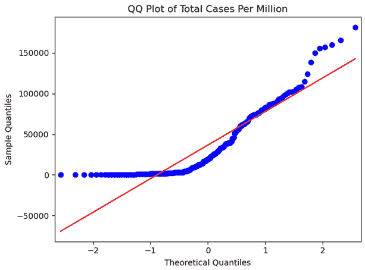
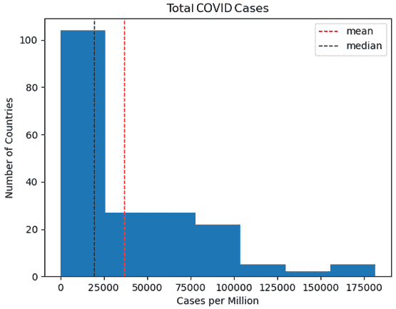
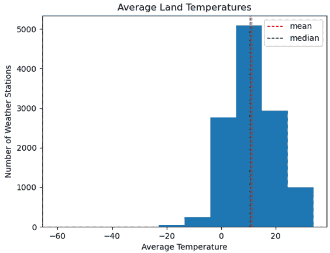
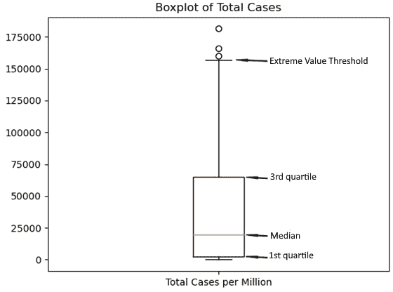
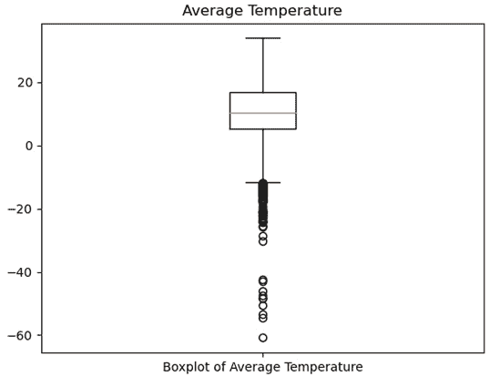
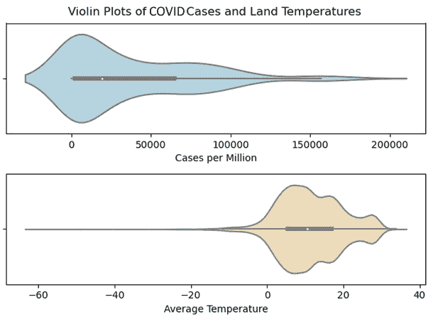

# 第一章：*第一章*：检查特征和目标的分布

机器学习写作和指导通常是算法导向的。有时，这给人一种印象，我们只需要选择正确的模型，组织变革的见解就会随之而来。但开始机器学习项目的最佳地方是对我们将使用的特征和目标分布的理解。

对于我们作为分析师几十年来一直重视的数据学习，留出空间是非常重要的——研究变量的分布、识别异常值以及检查双变量关系——即使我们越来越关注我们预测的准确性。

我们将在本书的前三章中探索用于此目的的工具，同时考虑对模型构建的影响。

在本章中，我们将使用常见的 NumPy 和 pandas 技术来更好地了解我们数据的属性。在我们进行任何预测分析之前，我们想知道关键特征的分布情况。我们还想知道每个连续特征的集中趋势、形状和分布范围，以及分类特征的每个值的计数。我们将利用非常方便的 NumPy 和 pandas 工具来生成汇总统计信息，例如均值、最小值和最大值，以及标准差。

之后，我们将创建关键特征的可视化，包括直方图和箱线图，以帮助我们更好地了解每个特征的分布，而不仅仅是通过查看汇总统计信息。我们将暗示特征分布对数据转换、编码和缩放以及我们在后续章节中用相同数据进行建模的影响。

具体来说，在本章中，我们将涵盖以下主题：

+   数据子集

+   为分类特征生成频率

+   为连续特征生成汇总统计信息

+   在单变量分析中识别极端值和异常值

+   使用直方图、箱线图和小提琴图来检查连续特征的分布

# 技术要求

本章将大量依赖 pandas、NumPy 和 Matplotlib 库，但你不需要对这些库有任何先前的知识。如果你从科学发行版，如 Anaconda 或 WinPython 安装了 Python，那么这些库可能已经安装好了。如果你需要安装其中之一来运行本章中的代码，你可以在终端中运行`pip install [package name]`。

# 数据子集

几乎我参与的每一个统计建模项目都需要从分析中移除一些数据。这通常是因为缺失值或异常值。有时，我们限制分析数据集的理论原因。例如，我们拥有从 1600 年以来的天气数据，但我们的分析目标仅涉及 1900 年以来的天气变化。幸运的是，pandas 中的子集工具非常强大且灵活。在本节中，我们将使用美国**国家青年纵向调查**（**NLS**）的数据。

注意

青年 NLS 是由美国劳工统计局进行的。这项调查始于 1997 年，当时出生在 1980 年至 1985 年之间的一批个人，每年通过 2017 年进行年度跟踪。对于这个配方，我从调查的数百个数据项中提取了关于成绩、就业、收入和对政府态度的 89 个变量。可以从存储库下载 SPSS、Stata 和 SAS 的单独文件。NLS 数据可在[`www.nlsinfo.org/investigator/pages/search`](https://www.nlsinfo.org/investigator/pages/search)公开使用。

让我们使用 pandas 开始子集数据：

1.  我们将首先加载 NLS 数据。我们还设置了一个索引：

    ```py
    import pandas as pd
    import numpy as np
    nls97 = pd.read_csv("data/nls97.csv")
    nls97.set_index("personid", inplace=True)
    ```

1.  让我们从 NLS 数据中选择几个列。以下代码创建了一个新的 DataFrame，其中包含一些人口统计和就业数据。pandas 的一个有用特性是，新的 DataFrame 保留了旧 DataFrame 的索引，如下所示：

    ```py
    democols = ['gender','birthyear','maritalstatus',
     'weeksworked16','wageincome','highestdegree']
    nls97demo = nls97[democols]
    nls97demo.index.name
    'personid'
    ```

1.  我们可以使用切片通过位置选择行。`nls97demo[1000:1004]`选择从冒号左侧的整数（在这种情况下是`1000`）指示的行开始，直到但不包括冒号右侧的整数（在这种情况下是`1004`）指示的行。`1000`行是第 1,001 行，因为索引是从 0 开始的。由于我们将结果 DataFrame 进行了转置，所以每一行都作为输出中的一个列出现：

    ```py
    nls97demo[1000:1004].T
    personid      195884       195891        195970\
    gender        Male         Male          Female
    birthyear     1981         1980          1982
    maritalstatus NaN          Never-married Never-married
    weeksworked16 NaN          53            53
    wageincome    NaN          14,000        52,000   
    highestdegree 4.Bachelors  2.High School 4.Bachelors
    personid       195996  
    gender         Female  
    birthyear      1980  
    maritalstatus  NaN  
    weeksworked16  NaN  
    wageincome     NaN
    highestdegree  3.Associates    
    ```

1.  我们还可以通过在第二个冒号之后设置步长值来跳过区间内的行。步长的默认值是 1。以下步长的值是 2，这意味着在`1000`和`1004`之间的每隔一行将被选中：

    ```py
    nls97demo[1000:1004:2].T
    personid        195884       195970
    gender          Male         Female
    birthyear       1981         1982
    maritalstatus   NaN          Never-married
    weeksworked16   NaN          53
    wageincome      NaN          52,000
    highestdegree   4.Bachelors  4\. Bachelors
    ```

1.  如果我们在冒号左侧不包含值，行选择将从第一行开始。请注意，这返回的 DataFrame 与`head`方法返回的相同：

    ```py
    nls97demo[:3].T
    personid       100061         100139          100284
    gender         Female         Male            Male
    birthyear      1980           1983            1984
    maritalstatus  Married        Married         Never-married
    weeksworked16  48             53              47
    wageincome     12,500         120,000         58,000
    highestdegree  2.High School  2\. High School  0.None
    nls97demo.head(3).T
    personid       100061         100139         100284
    gender         Female         Male           Male
    birthyear      1980           1983           1984
    maritalstatus  Married        Married        Never-married
    weeksworked16  48             53             47
    wageincome     12,500         120,000        58,000
    highestdegree  2.High School  2.High School  0\. None
    ```

1.  如果我们在冒号左侧使用负数-n，将返回 DataFrame 的最后 n 行。这返回的 DataFrame 与`tail`方法返回的相同：

    ```py
     nls97demo[-3:].T
    personid       999543          999698        999963
    gender         Female         Female         Female
    birthyear      1984           1983           1982
    maritalstatus  Divorced       Never-married  Married
    weeksworked16  0              0              53
    wageincome     NaN            NaN            50,000
    highestdegree  2.High School  2.High School  4\. Bachelors
     nls97demo.tail(3).T
    personid       999543         999698         999963
    gender         Female         Female         Female
    birthyear      1984           1983           1982
    maritalstatus  Divorced       Never-married  Married
    weeksworked16  0              0              53
    wageincome     NaN            NaN            50,000
    highestdegree  2.High School  2.High School  4\. Bachelors
    ```

1.  我们可以使用`loc`访问器通过索引值选择行。回想一下，对于`nls97demo` DataFrame，索引是`personid`。我们可以向`loc`访问器传递一个索引标签列表，例如`loc[[195884,195891,195970]]`，以获取与这些标签相关的行。我们还可以传递索引标签的下限和上限，例如`loc[195884:195970]`，以检索指定的行：

    ```py
     nls97demo.loc[[195884,195891,195970]].T
    personid       195884       195891         195970
    gender         Male         Male           Female
    birthyear      1981         1980           1982
    maritalstatus  NaN          Never-married  Never-married
    weeksworked16  NaN          53             53
    wageincome     NaN          14,000         52,000
    highestdegree  4.Bachelors  2.High School  4.Bachelors
     nls97demo.loc[195884:195970].T
    personid       195884       195891         195970
    gender         Male         Male           Female
    birthyear      1981         1980           1982
    maritalstatus  NaN          Never-married  Never-married
    weeksworked16  NaN          53             53
    wageincome     NaN          14,000         52,000
    highestdegree  4.Bachelors  2.High School  4.Bachelors
    ```

1.  要按位置选择行，而不是按索引标签，我们可以使用`iloc`访问器。我们可以传递一个位置数字列表，例如`iloc[[0,1,2]]`，到访问器以获取那些位置的行。我们可以传递一个范围，例如`iloc[0:3]`，以获取介于下限和上限之间的行，不包括上限所在的行。我们还可以使用`iloc`访问器来选择最后 n 行。`iloc[-3:]`选择最后三行：

    ```py
     nls97demo.iloc[[0,1,2]].T
    personid       100061         100139         100284
    gender         Female         Male           Male
    birthyear      1980           1983           1984
    maritalstatus  Married        Married        Never-married
    weeksworked16  48             53             47
    wageincome     12,500         120,000        58,000
    highestdegree  2.High School  2.High School  0\. None
     nls97demo.iloc[0:3].T
    personid       100061         100139         100284
    gender         Female         Male           Male
    birthyear      1980           1983           1984
    maritalstatus  Married        Married        Never-married
    weeksworked16  48             53             47
    wageincome     12,500         120,000        58,000
    highestdegree  2.High School  2.High School  0\. None
     nls97demo.iloc[-3:].T
    personid       999543         999698         999963
    gender         Female         Female         Female
    birthyear      1984           1983           1982
    maritalstatus  Divorced       Never-married  Married
    weeksworked16  0              0              53
    wageincome     NaN            NaN            50,000
    highestdegree  2.High School  2.High School  4\. Bachelors
    ```

通常，我们需要根据列值或几个列的值来选择行。在 pandas 中，我们可以通过布尔索引来完成此操作。这里，我们向`loc`访问器或方括号运算符传递布尔值向量（可以是序列）。布尔向量需要与 DataFrame 的索引相同。

1.  让我们尝试使用 NLS DataFrame 上的`nightlyhrssleep`列。我们想要一个布尔序列，对于每晚睡眠 6 小时或更少（第 33 个百分位数）的人为`True`，如果`nightlyhrssleep`大于 6 或缺失则为`False`。`sleepcheckbool = nls97.nightlyhrssleep<=lowsleepthreshold`创建布尔序列。如果我们显示`sleepcheckbool`的前几个值，我们将看到我们得到了预期的值。我们还可以确认`sleepcheckbool`的索引等于`nls97`的索引：

    ```py
    nls97.nightlyhrssleep.head()
    personid
    100061     6
    100139     8
    100284     7
    100292     nan
    100583     6
    Name: nightlyhrssleep, dtype: float64
    lowsleepthreshold = nls97.nightlyhrssleep.quantile(0.33)
    lowsleepthreshold
    6.0
    sleepcheckbool = nls97.nightlyhrssleep<=lowsleepthreshold
    sleepcheckbool.head()
    personid
    100061    True
    100139    False
    100284    False
    100292    False
    100583    True
    Name: nightlyhrssleep, dtype: bool
    sleepcheckbool.index.equals(nls97.index)
    True
    ```

由于`sleepcheckbool`序列与`nls97`的索引相同，我们可以直接将其传递给`loc`访问器以创建一个包含每晚睡眠 6 小时或更少的人的 DataFrame。这里有一些 pandas 的魔法。它为我们处理索引对齐：

```py
lowsleep = nls97.loc[sleepcheckbool]
lowsleep.shape
(3067, 88)
```

1.  我们本可以在一步中创建数据的`lowsleep`子集，这是我们通常会做的，除非我们需要布尔序列用于其他目的：

    ```py
    lowsleep = nls97.loc[nls97.nightlyhrssleep<=lowsleepthreshold]
    lowsleep.shape
    (3067, 88)
    ```

1.  我们可以向`loc`访问器传递更复杂的条件并评估多个列的值。例如，我们可以选择`nightlyhrssleep`小于或等于阈值且`childathome`（在家居住的儿童数量）大于或等于`3`的行：

    ```py
    lowsleep3pluschildren = \
      nls97.loc[(nls97.nightlyhrssleep<=lowsleepthreshold)
        & (nls97.childathome>=3)]
    lowsleep3pluschildren.shape
    (623, 88)
    ```

`nls97.loc[(nls97.nightlyhrssleep<=lowsleepthreshold) & (nls97.childathome>3)]`中的每个条件都放在括号内。如果省略括号，将生成错误。`&`运算符相当于标准 Python 中的`and`，意味着必须`两个`条件都为`True`，行才能被选中。如果我们想选择如果任一条件为`True`的行，我们可以使用`|`表示`or`。

1.  最后，我们可以同时选择行和列。逗号左边的表达式选择行，而逗号右边的列表选择列：

    ```py
    lowsleep3pluschildren = \
      nls97.loc[(nls97.nightlyhrssleep<=lowsleepthreshold)
        & (nls97.childathome>=3),
        ['nightlyhrssleep','childathome']]
    lowsleep3pluschildren.shape
    (623, 2)
    ```

在上一两节中，我们使用了三种不同的工具从 pandas DataFrame 中选择列和行：`[]`括号操作符和两个 pandas 特定访问器`loc`和`iloc`。如果你是 pandas 的新手，这可能会有些令人困惑，但经过几个月后，你会清楚地知道在哪种情况下使用哪种工具。如果你带着相当多的 Python 和 NumPy 经验来到 pandas，你可能会发现`[]`操作符最为熟悉。然而，pandas 文档建议不要在生产代码中使用`[]`操作符。`loc`访问器用于通过布尔索引或索引标签选择行，而`iloc`访问器用于通过行号选择行。

这一部分是关于使用 pandas 选择列和行的简要入门。尽管我们没有对此进行过多详细说明，但涵盖了你需要了解的大部分内容，包括了解本书其余部分中 pandas 特定材料所需的一切。我们将在下一两节中开始应用这些知识，通过为我们的特征创建频率和汇总统计。

# 生成类别特征的频率

分类别特征可以是名义的或有序的。**名义**特征，例如性别、物种名称或国家，具有有限的可能值，可以是字符串或数值，但没有内在的数值意义。例如，如果国家用 1 代表阿富汗，2 代表阿尔巴尼亚，以此类推，数据是数值的，但对这些值进行算术运算是没有意义的。

**有序**特征也有有限的可能值，但与名义特征不同，值的顺序很重要。**李克特量表**评分（从 1 表示非常不可能到 5 表示非常可能）是一个有序特征的例子。尽管如此，通常不会进行算术运算，因为值之间没有统一和有意义的距离。

在我们开始建模之前，我们希望对可能使用的类别特征的所有可能值进行计数。这通常被称为单向频率分布。幸运的是，pandas 使这变得非常容易。我们可以快速从 pandas DataFrame 中选择列，并使用`value_counts`方法为每个类别值生成计数：

1.  让我们加载 NLS 数据，创建一个只包含数据前 20 列的 DataFrame，并查看数据类型：

    ```py
    nls97 = pd.read_csv("data/nls97.csv")
    nls97.set_index("personid", inplace=True)
    nls97abb = nls97.iloc[:,:20]
    nls97abb.dtypes
    loc and iloc accessors. The colon to the left of the comma indicates that we want all the rows, while :20 to the right of the comma gets us the first 20 columns.
    ```

1.  上一段代码中的所有对象类型列都是类别特征。我们可以使用`value_counts`来查看`maritalstatus`每个值的计数。我们还可以使用`dropna=False`来让`value_counts`显示缺失值（`NaN`）：

    ```py
    nls97abb.maritalstatus.value_counts(dropna=False)
    Married          3066
    Never-married    2766
    NaN              2312
    Divorced         663
    Separated        154
    Widowed          23
    Name: maritalstatus, dtype: int64
    ```

1.  如果我们只想得到缺失值的数量，我们可以链式调用`isnull`和`sum`方法。`isnull`在`maritalstatus`缺失时返回包含`True`值的布尔序列，否则返回`False`。然后`sum`计算`True`值的数量，因为它将`True`值解释为 1，将`False`值解释为 0：

    ```py
    nls97abb.maritalstatus.isnull().sum()
    2312
    ```

1.  你可能已经注意到，`maritalstatus`的值默认按频率排序。你可以通过排序索引按值进行字母排序。我们可以利用`value_counts`返回一个以值为索引的序列这一事实来做到这一点：

    ```py
    marstatcnt = nls97abb.maritalstatus.value_counts(dropna=False)
    type(marstatcnt)
    <class 'pandas.core.series.Series'>
    marstatcnt.index
    Index(['Married', 'Never-married', nan, 'Divorced', 'Separated', 'Widowed'], dtype='object')
    ```

1.  要对索引进行排序，我们只需调用`sort_index`：

    ```py
    marstatcnt.sort_index()
    Divorced         663
    Married          3066
    Never-married    2766
    Separated        154
    Widowed          23
    NaN              2312
    Name: maritalstatus, dtype: int64
    ```

1.  当然，我们也可以通过`nls97.maritalstatus.value_counts(dropna=False).sort_index()`一步得到相同的结果。我们还可以通过将`normalize`设置为`True`来显示比率而不是计数。在下面的代码中，我们可以看到 34%的回应是`Married`（注意我们没有将`dropna`设置为`True`，所以缺失值已被排除）：

    ```py
    nls97.maritalstatus.\
      value_counts(normalize=True, dropna=False).\
         sort_index()

    Divorced             0.07
    Married              0.34
    Never-married        0.31
    Separated            0.02
    Widowed              0.00
    NaN                  0.26
    Name: maritalstatus, dtype: float64
    ```

1.  当一列有有限数量的值时，pandas 的类别数据类型可以比对象数据类型更有效地存储数据。由于我们已经知道所有对象列都包含类别数据，我们应该将这些列转换为类别数据类型。在下面的代码中，我们创建了一个包含对象列名称的列表，`catcols`。然后，我们遍历这些列，并使用`astype`将数据类型更改为`category`：

    ```py
    catcols = nls97abb.select_dtypes(include=["object"]).columns
    for col in nls97abb[catcols].columns:
    ...      nls97abb[col] = nls97abb[col].astype('category')
    ... 
    nls97abb[catcols].dtypes
    gender                   category
    maritalstatus            category
    weeklyhrscomputer        category
    weeklyhrstv              category
    highestdegree            category
    govprovidejobs           category
    govpricecontrols         category
    dtype: object
    ```

1.  让我们检查我们的类别特征中的缺失值。`gender`没有缺失值，`highestdegree`的缺失值非常少。但`govprovidejobs`（政府应该提供工作）和`govpricecontrols`（政府应该控制价格）的绝大多数值都是缺失的。这意味着这些特征可能对大多数建模没有用：

    ```py
    nls97abb[catcols].isnull().sum()
    gender               0
    maritalstatus        2312
    weeklyhrscomputer    2274
    weeklyhrstv          2273
    highestdegree        31
    govprovidejobs       7151
    govpricecontrols     7125
    dtype: int64
    ```

1.  我们可以通过将`value_counts`调用传递给`apply`来一次生成多个特征的频率。我们可以使用`filter`来选择我们想要的列——在这种情况下，所有名称中包含`*gov*`的列。注意，由于我们没有将`dropna`设置为`False`，因此已经省略了每个特征的缺失值：

    ```py
     nls97abb.filter(like="gov").apply(pd.value_counts, normalize=True)
                     govprovidejobs    govpricecontrols
    1\. Definitely              0.25                0.54
    2\. Probably                0.34                0.33
    3\. Probably not            0.25                0.09
    4\. Definitely not          0.16                0.04
    ```

1.  我们可以在数据的一个子集上使用相同的频率。例如，如果我们只想查看已婚人士对政府角色问题的回答，我们可以通过在`filter`之前放置`nls97abb[nls97abb.maritalstatus=="Married"]`来执行这个子集操作：

    ```py
     nls97abb.loc[nls97abb.maritalstatus=="Married"].\
     filter(like="gov").\
       apply(pd.value_counts, normalize=True)
                     govprovidejobs    govpricecontrols
    1\. Definitely              0.17                0.46
    2\. Probably                0.33                0.38
    3\. Probably not            0.31                0.11
    4\. Definitely not          0.18                0.05
    ```

1.  在这种情况下，由于只有两个`*gov*`列，可能更容易执行以下操作：

    ```py
     nls97abb.loc[nls97abb.maritalstatus=="Married",
       ['govprovidejobs','govpricecontrols']].\
       apply(pd.value_counts, normalize=True)
                      govprovidejobs     govpricecontrols
    1\. Definitely               0.17                 0.46
    2\. Probably                 0.33                 0.38
    3\. Probably not             0.31                 0.11
    4\. Definitely not           0.18                 0.05
    ```

尽管如此，使用`filter`通常会更简单，因为在具有相似名称的特征组上执行相同的清理或探索任务并不罕见。

有时候，我们可能希望将连续或离散特征建模为分类特征。NLS DataFrame 包含 `highestgradecompleted`。从 5 年级到 6 年级的增长可能不如从 11 年级到 12 年级的增长对目标的影响重要。让我们创建一个二进制特征——即当一个人完成了 12 年级或以上时为 1，如果他们完成的少于这个数则为 0，如果 `highestgradecompleted` 缺失则为缺失。

1.  不过，我们首先需要做一些清理工作。`highestgradecompleted` 有两个逻辑缺失值——一个 pandas 识别为缺失的实际 NaN 值和一个调查设计者意图让我们在大多数情况下也视为缺失的 95 值。让我们在继续之前使用 `replace` 来修复它：

    ```py
    nls97abb.highestgradecompleted.\
      replace(95, np.nan, inplace=True)
    ```

1.  我们可以使用 NumPy 的 `where` 函数根据 `highestgradecompleted` 的值分配 `highschoolgrad` 的值。如果 `highestgradecompleted` 为空（`NaN`），我们将 `NaN` 分配给我们的新列 `highschoolgrad`。如果 `highestgradecompleted` 的值不为空，下一个子句检查值是否小于 12，如果是，则将 `highschoolgrad` 设置为 0，否则设置为 1。我们可以通过使用 `groupby` 来获取 `highschoolgrad` 每个级别的 `highestgradecompleted` 的最小值和最大值来确认新列 `highschoolgrad` 包含我们想要的值：

    ```py
    nls97abb['highschoolgrad'] = \
      np.where(nls97abb.highestgradecompleted.isnull(),np.nan, \
      np.where(nls97abb.highestgradecompleted<12,0,1))

    nls97abb.groupby(['highschoolgrad'], dropna=False) \
      ['highestgradecompleted'].agg(['min','max','size'])
                      min       max       size
    highschoolgrad                
    0                   5        11       1231
    1                  12        20       5421
    nan               nan       nan       2332
     nls97abb['highschoolgrad'] = \
    ...  nls97abb['highschoolgrad'].astype('category')
    ```

虽然 12 作为将我们的新特征 `highschoolgrad` 分类为类的阈值在概念上是合理的，但如果我们打算将 `highschoolgrad` 作为目标使用，这可能会带来一些建模挑战。存在相当大的类别不平衡，`highschoolgrad` 等于 1 的类别是 0 类的四倍多。我们应该探索使用更多组来表示 `highestgradecompleted`。

1.  使用 pandas 实现这一点的其中一种方法是使用 `qcut` 函数。我们可以将 `qcut` 的 `q` 参数设置为 `6` 以创建尽可能均匀分布的六个组。现在这些组更接近平衡：

    ```py
    nls97abb['highgradegroup'] = \
      pd.qcut(nls97abb['highestgradecompleted'], 
       q=6, labels=[1,2,3,4,5,6])

    nls97abb.groupby(['highgradegroup'])['highestgradecompleted'].\
        agg(['min','max','size'])
                      min         max      size
    highgradegroup                
    1                   5          11       1231
    2                  12          12       1389
    3                  13          14       1288
    4                  15          16       1413
    5                  17          17        388
    6                  18          20        943
    nls97abb['highgradegroup'] = \
        nls97abb['highgradegroup'].astype('category')
    ```

1.  最后，我发现通常生成所有分类特征的频率并将其保存下来很有帮助，这样我就可以稍后参考。每当我对数据进行一些可能改变这些频率的更改时，我都会重新运行那段代码。以下代码遍历所有数据类型为分类数据的列，并运行 `value_counts`：

    ```py
     freqout = open('views/frequencies.txt', 'w') 
     for col in nls97abb.select_dtypes(include=["category"]):
          print(col, "----------------------",
            "frequencies",
          nls97abb[col].value_counts(dropna=False).sort_index(),
            "percentages",
          nls97abb[col].value_counts(normalize=True).\
            sort_index(),
          sep="\n\n", end="\n\n\n", file=freqout)

     freqout.close()
    ```

这些是在您的数据中生成分类特征的单一频率的关键技术。真正的明星是 `value_counts` 方法。我们可以一次创建一个 Series 的频率使用 `value_counts`，也可以使用 `apply` 对多个列进行操作，或者遍历多个列并在每次迭代中调用 `value_counts`。我们已经在本节中查看了一些示例。接下来，让我们探讨一些检查连续特征分布的技术。

# 生成连续和离散特征的摘要统计量

获取连续或离散特征的分布感比分类特征要复杂一些。连续特征可以取无限多个值。一个连续特征的例子是体重，因为某人可能重 70 公斤，或者 70.1，或者 70.01。离散特征具有有限个值，例如看到的鸟的数量，或者购买苹果的数量。思考它们之间差异的一种方式是，离散特征通常是已经被计数的东西，而连续特征通常是通过测量、称重或计时来捕捉的。

连续特征通常会被存储为浮点数，除非它们被限制为整数。在这种情况下，它们可能以整数的形式存储。例如，个人的年龄是连续的，但通常会被截断为整数。

对于大多数建模目的，连续特征和离散特征被同等对待。我们不会将年龄建模为分类特征。我们假设年龄在 25 岁到 26 岁之间的间隔与 35 岁到 36 岁之间的间隔具有大致相同的意义，尽管在极端情况下这种假设会失效。人类 1 岁到 2 岁之间的间隔与 71 岁到 72 岁之间的间隔完全不同。数据分析师和科学家通常对连续特征和目标之间的假设线性关系持怀疑态度，尽管当这种关系成立时建模会更容易。

要了解连续特征（或离散特征）的分布，我们必须检查其中心趋势、形状和分布范围。关键摘要统计量包括均值和中位数用于中心趋势，偏度和峰度用于形状，以及范围、四分位数范围、方差和标准差用于分布范围。在本节中，我们将学习如何使用 pandas，辅以**SciPy**库，来获取这些统计量。我们还将讨论建模的重要影响。

在本节中，我们将使用 COVID-19 数据。数据集包含每个国家的总病例和死亡数，以及截至 2021 年 6 月的人口统计数据。

注意

*我们的世界数据*在[`ourworldindata.org/coronavirus-source-data`](https://ourworldindata.org/coronavirus-source-data)提供 COVID-19 公共使用数据。本节中使用的数据是在 2021 年 7 月 9 日下载的。数据中的列比我包含的要多。我根据国家创建了地区列。

按照以下步骤生成摘要统计量：

1.  让我们将 COVID `.csv`文件加载到 pandas 中，设置索引，并查看数据。有 221 行和 16 列。我们设置的索引`iso_code`为每一行包含一个唯一值。我们使用`sample`来随机查看两个国家，而不是前两个（我们为`random_state`设置了一个值，以便每次运行代码时都能得到相同的结果）：

    ```py
    import pandas as pd
    import numpy as np
    import scipy.stats as scistat
    covidtotals = pd.read_csv("data/covidtotals.csv",
        parse_dates=['lastdate'])
    covidtotals.set_index("iso_code", inplace=True)
    covidtotals.shape
    (221, 16)
    covidtotals.index.nunique()
    221
    covidtotals.sample(2, random_state=6).T
    iso_code                         ISL               CZE
    lastdate                  2021-07-07        2021-07-07
    location                     Iceland           Czechia
    total_cases                    6,555         1,668,277
    total_deaths                      29            30,311
    total_cases_mill              19,209           155,783
    total_deaths_mill                 85             2,830
    population                   341,250        10,708,982
    population_density                 3               137
    median_age                        37                43
    gdp_per_capita                46,483            32,606
    aged_65_older                     14                19
    total_tests_thous                NaN               NaN
    life_expectancy                   83                79
    hospital_beds_thous                3                 7
    diabetes_prevalence                5                 7
    region                Western Europe    Western Europe
    ```

只需看这两行，我们就可以看到冰岛和捷克在病例和死亡人数方面的显著差异，即使在人口规模方面也是如此。（`total_cases_mill` 和 `total_deaths_mill` 分别表示每百万人口中的病例和死亡人数。）数据分析师非常习惯于思考数据中是否还有其他因素可以解释捷克比冰岛病例和死亡人数显著更高的原因。从某种意义上说，我们总是在进行特征选择。

1.  让我们来看看每列的数据类型和空值数量。几乎所有列都是连续的或离散的。我们有关于病例和死亡的数据，分别有 192 行和 185 行。我们必须要做的一个重要数据清洗任务是确定我们能对那些对于我们的目标有缺失值的国家的数据做些什么。我们将在稍后讨论如何处理缺失值：

    ```py
    covidtotals.info()
    <class 'pandas.core.frame.DataFrame'>
    Index: 221 entries, AFG to ZWE
    Data columns (total 16 columns):
     #   Column             Non-Null Count         Dtype 
    ---  -------            --------------  --------------
     0   lastdate             221 non-null  datetime64[ns]
     1   location             221 non-null          object
     2   total_cases          192 non-null         float64
     3   total_deaths         185 non-null         float64
     4   total_cases_mill     192 non-null         float64
     5   total_deaths_mill    185 non-null         float64
     6   population           221 non-null         float64
     7   population_density   206 non-null         float64
     8   median_age           190 non-null         float64
     9   gdp_per_capita       193 non-null         float64
     10  aged_65_older        188 non-null         float64
     11  total_tests_thous     13 non-null         float64
     12  life_expectancy      217 non-null         float64
     13  hospital_beds_thous  170 non-null         float64
     14  diabetes_prevalence  200 non-null         float64
     15  region               221 non-null          object
    dtypes: datetime64ns, float64(13), object(2)
    memory usage: 29.4+ KB
    ```

1.  现在，我们已经准备好检查一些特征的分部情况。我们可以通过使用 `describe` 方法来获取我们想要的绝大部分的摘要统计信息。平均值和中位数（50%）是分布中心的良好指标，各有其优势。注意到平均值和中位数之间的显著差异，作为偏斜的指示也是很好的。例如，我们可以看到每百万病例的平均值几乎是中位数的两倍，分别是 36.7 千和 19.5 千。这是一个明显的正偏斜指标。死亡人数每百万的情况也是如此。

病例和死亡人数的四分位距也相当大，两种情况下的第 75 百分位数值大约是第 25 百分位数值的 25 倍。我们可以将这一点与 65 岁及以上人口比例和糖尿病患病率进行比较，其中第 75 百分位数分别是第 25 百分位数的四倍或两倍。我们可以立即得出结论，这两个可能的特征（`aged_65_older` 和 `diabetes_prevalence`）必须做大量工作来解释我们目标中的巨大方差：

```py
 keyvars = ['location','total_cases_mill','total_deaths_mill',
...  'aged_65_older','diabetes_prevalence']
 covidkeys = covidtotals[keyvars]
 covidkeys.describe()
total_cases_mill total_deaths_mill aged_65_older diabetes_prevalence
count        192.00       185.00    188.00     200.00
mean      36,649.37       683.14      8.61       8.44
std       41,403.98       861.73      6.12       4.89
min            8.52         0.35      1.14       0.99
25%        2,499.75        43.99      3.50       5.34
50%       19,525.73       293.50      6.22       7.20
75%       64,834.62     1,087.89     13.92      10.61
max      181,466.38     5,876.01     27.05      30.53
```

1.  我有时发现查看十分位数值有助于更好地了解分布。`quantile` 方法可以接受一个百分位数值，例如 `quantile(0.25)` 表示第 25 百分位数，或者一个列表或元组，例如 `quantile((0.25,0.5))` 表示第 25 和第 50 百分位数。在下面的代码中，我们使用 NumPy 的 `arange` 函数（`np.arange(0.0, 1.1, 0.1)`) 生成一个从 0.0 到 1.0，增量是 0.1 的数组。如果我们使用 `covidkeys.quantile([0.0,0.1,0.2,0.3,0.4,0.5,0.6,0.7,0.8,0.9,1.0])`，我们会得到相同的结果：

    ```py
     covidkeys.quantile(np.arange(0.0, 1.1, 0.1))
          total_cases_mill  total_deaths_mill  aged_65_older  diabetes_prevalence
    0.00         8.52       0.35       1.14     0.99
    0.10       682.13      10.68       2.80     3.30
    0.20     1,717.39      30.22       3.16     4.79
    0.30     3,241.84      66.27       3.86     5.74
    0.40     9,403.58      145.06      4.69     6.70
    0.50     19,525.73     293.50      6.22     7.20
    0.60     33,636.47     556.43      7.93     8.32
    0.70     55,801.33     949.71     11.19    10.08
    0.80     74,017.81    1,333.79    14.92    11.62
    0.90     94,072.18    1,868.89    18.85    13.75
    1.00    181,466.38    5,876.01    27.05    30.53
    ```

对于病例、死亡和糖尿病患病率，大部分的范围（最小值和最大值之间的距离）位于分布的最后 10%。这一点对于死亡尤其如此。这暗示了可能存在建模问题，并邀请我们仔细查看异常值，我们将在下一节中这样做。

1.  一些机器学习算法假设我们的特征具有正态分布（也称为高斯分布），它们分布对称（具有低偏度），并且它们的尾部相对正常（既不过度高也不过度低的高斯峰）。我们迄今为止看到的统计数据已经表明，我们的两个可能的目标——即总人口中的总病例数和死亡人数——具有很高的正偏度。让我们通过计算一些特征的偏度和峰度来对此进行更细致的分析。对于高斯分布，我们期望偏度为 0 附近，峰度为 3。`total_deaths_mill`的偏度和峰度值值得关注，而`total_cases_mill`和`aged_65_older`特征具有过低的峰度（瘦尾巴）：

    ```py
    covidkeys.skew()
    total_cases_mill        1.21
    total_deaths_mill       2.00
    aged_65_older           0.84
    diabetes_prevalence     1.52
    dtype: float64
     covidkeys.kurtosis()
    total_cases_mill        0.91
    total_deaths_mill       6.58
    aged_65_older          -0.56
    diabetes_prevalence     3.31
    dtype: float64
    ```

1.  我们还可以通过遍历`keyvars`列表中的特征并运行`scistat.shapiro(covidkeys[var].dropna())`来显式测试每个分布的正态性。请注意，我们需要使用`dropna`删除缺失值以运行测试。p 值小于 0.05 表明我们可以拒绝正态性的零假设，这对于四个特征中的每一个都是如此：

    ```py
    for var in keyvars[1:]:
          stat, p = scistat.shapiro(covidkeys[var].dropna())
          print("feature=", var, "     p-value=", '{:.6f}'.format(p))

    feature= total_cases_mill       p-value= 0.000000
    feature= total_deaths_mill      p-value= 0.000000
    feature= aged_65_older          p-value= 0.000000
    feature= diabetes_prevalence    p-value= 0.000000
    ```

这些结果应该让我们在考虑参数模型，如线性回归时停下来思考。没有任何分布近似正态分布。然而，这并不是决定性的。这并不像在具有正态分布特征时使用某些模型（比如 k-最近邻）而在不具有时使用非参数模型那么简单。

在做出任何建模决策之前，我们希望进行额外的数据清洗。例如，我们可能决定删除异常值或确定数据转换是合适的。我们将在本书的几个章节中探索转换，例如对数和多项式转换。

本节向您展示了如何使用 pandas 和 SciPy 来了解连续和离散特征的分布情况，包括它们的中心趋势、形状和分布范围。为任何可能包含在我们建模中的特征或目标生成这些统计数据是有意义的。这也指引我们进一步的工作方向，以准备我们的数据进行分析。我们需要识别缺失值和异常值，并找出我们将如何处理它们。我们还应该可视化连续特征的分布。这很少不会带来额外的见解。我们将在下一节学习如何识别异常值，并在下一节创建可视化。

# 在单变量分析中识别极端值和异常值

异常值可以被视为具有特征值或特征值之间关系非常不寻常的观测值，以至于它们无法解释数据中其他关系。这对于建模很重要，因为我们不能假设异常值将对我们的参数估计产生中性影响。有时，我们的模型会努力构建参数估计，以解释异常观测值中的模式，这可能会损害模型对所有其他观测值的解释或预测能力。如果你曾经花了好几天时间尝试解释一个模型，最终发现一旦移除几个异常值，你的系数和预测就完全改变了，请举手。

我应该快速补充一下，目前还没有关于异常值的统一定义。我提供前面的定义是为了在本书中使用，因为它有助于我们区分异常值，正如我描述的那样，以及极端值。这两个概念之间有相当大的重叠，但许多极端值并不是异常值。这是因为这样的值反映了特征中的自然和可解释的趋势，或者因为它们反映了与数据中观察到的特征之间的相同关系。反之亦然。有些异常值不是极端值。例如，一个目标值可能正好位于分布的中间，但具有相当意外的预测值。

因此，对于我们的建模来说，很难在没有参考多元关系的情况下说一个特定的特征或目标值是异常值。但是，当我们在单变量分析中看到位于中心左侧或右侧的值时，这至少应该引起我们的注意。这应该促使我们进一步调查该值，包括检查其他特征值。我们将在下一章中更详细地探讨多元关系。在这里，以及在下节关于可视化的内容中，我们将专注于在查看单个变量时识别极端值和异常值。

识别极端值的一个良好起点是查看其与分布中间的距离。实现这一目标的一种常见方法是将每个值与**四分位数范围**（**IQR**）的距离进行计算，即第一个四分位数值与第三个四分位数值之间的距离。我们通常将任何高于第三四分位数 1.5 倍或低于第一四分位数的值标记出来。我们可以使用这种方法来识别 COVID-19 数据中的异常值。

让我们开始吧：

1.  首先，让我们导入我们将需要的库。除了 pandas 和 NumPy，我们还将使用 Matplotlib 和 statsmodels 来创建图表。我们还将加载 COVID 数据并选择所需的变量：

    ```py
    import pandas as pd
    import numpy as np
    import matplotlib.pyplot as plt
    import statsmodels.api as sm
    covidtotals = pd.read_csv("data/covidtotals.csv")
    covidtotals.set_index("iso_code", inplace=True)
    keyvars = ['location','total_cases_mill','total_deaths_mill',
      'aged_65_older','diabetes_prevalence','gdp_per_capita']
    covidkeys = covidtotals[keyvars]
    ```

1.  让我们来看看`total_cases_mill`。我们得到第一和第三四分位数，并计算四分位数范围，`1.5*(thirdq-firstq)`。然后，我们计算它们的阈值以确定高和低极端值，分别是`interquartilerange+thirdq`和`firstq-interquartilerange`（如果你熟悉箱线图，你会注意到这是用于箱线图须的相同计算；我们将在下一节中介绍箱线图）：

    ```py
    thirdq, firstq = covidkeys.total_cases_mill.quantile(0.75), covidkeys.total_cases_mill.quantile(0.25)
    interquartilerange = 1.5*(thirdq-firstq)
    extvalhigh, extvallow = interquartilerange+thirdq, firstq-interquartilerange
    print(extvallow, extvalhigh, sep=" <--> ")
    -91002.564625 <--> 158336.930375
    ```

1.  这个计算表明，任何`total_cases_mill`的值，如果高于 158,337，都可以被认为是极端的。我们可以忽略低端的极端值，因为它们将是负数：

    ```py
    covidtotals.loc[covidtotals.total_cases_mill>extvalhigh].T
    iso_code                   AND         MNE         SYC
    lastdate            2021-07-07  2021-07-07  2021-07-07
    location            Andorra     Montenegro  Seychelles
    total_cases          14,021        100,392      16,304
    total_deaths            127          1,619          71
    total_cases_mill    181,466        159,844     165,792
    total_deaths_mill     1,644          2,578         722
    population           77,265        628,062      98,340
    population_density      164             46         208
    median_age              NaN             39          36
    gdp_per_capita          NaN         16,409      26,382
    aged_65_older           NaN             15           9
    total_tests_thous       NaN            NaN         NaN
    life_expectancy          84             77          73
    hospital_beds_thous     NaN              4           4
    diabetes_prevalence       8             10          11
    region              Western        Eastern        East 
                         Europe         Europe      Africa
    ```

1.  安道尔、黑山和塞舌尔的所有`total_cases_mill`都超过了阈值。这促使我们探索这些国家可能异常的其他方式，以及我们的特征是否能够捕捉到这一点。我们不会在这里深入多元分析，因为我们将那部分内容放在下一章中，但开始思考为什么这些极端值可能或可能没有意义是个好主意。在整个数据集上有一个平均值可能有助于我们：

    ```py
    covidtotals.mean()
    total_cases               963,933
    total_deaths              21,631
    total_cases_mill          36,649
    total_deaths_mill         683
    population                35,134,957
    population_density        453
    median_age                30
    gdp_per_capita            19,141
    aged_65_older             9
    total_tests_thous         535
    life_expectancy           73
    hospital_beds_thous       3
    diabetes_prevalence       8 
    ```

这三个国家与其他国家的主要区别在于它们的人口非常少。令人惊讶的是，每个国家的人口密度都比平均水平低得多。这与你预期的相反，值得我们在这本书的整个分析中进一步考虑。

IQR 计算的替代方法

使用四分位数范围来识别极端值的另一种方法是使用与平均值几个标准差的位置，比如说 3 个。这种方法的一个缺点是，它比使用四分位数范围更容易受到极端值的影响。

我认为为我的数据中的所有关键目标和特征生成这种分析是有帮助的，因此让我们自动化识别极端值的方法。我们还应该将结果输出到文件中，这样我们就可以在我们需要时使用它们：

1.  让我们定义一个函数，`getextremevalues`，它遍历我们的 DataFrame（除了包含位置列的第一个列之外的所有列），计算该列的四分位数范围，选择所有高于该列高阈值或低于低阈值的观测值，然后将结果追加到一个新的 DataFrame（`dfout`）中：

    ```py
    def getextremevalues(dfin):
          dfout = pd.DataFrame(columns=dfin.columns, 
                               data=None)
          for col in dfin.columns[1:]:
            thirdq, firstq = dfin[col].quantile(0.75), \
              dfin[col].quantile(0.25)
            interquartilerange = 1.5*(thirdq-firstq)
            extvalhigh, extvallow = \
              interquartilerange+thirdq, \
              firstq-interquartilerange
            df = dfin.loc[(dfin[col]>extvalhigh) | (dfin[col]<extvallow)]
            df = df.assign(varname = col,
              threshlow = extvallow,
              threshhigh = extvalhigh)
            dfout = pd.concat([dfout, df])
        return dfout
    ```

1.  现在，我们可以将我们的`covidkeys` DataFrame 传递给`getextremevalues`函数，以获取包含每个列的极端值的 DataFrame。然后，我们可以显示每个列的极端值数量，这告诉我们人口中每百万人的总死亡数（`total_deaths_mill`）有四个极端值。现在，我们可以将数据输出到 Excel 文件中：

    ```py
    extremevalues = getextremevalues(covidkeys)
    extremevalues.varname.value_counts()
    gdp_per_capita         9
    diabetes_prevalence    8
    total_deaths_mill      4
    total_cases_mill       3
    Name: varname, dtype: int64
    extremevalues.to_excel("views/extremevaluescases.xlsx")
    ```

1.  让我们更仔细地看看每百万极端死亡值。我们可以查询我们刚刚创建的 DataFrame，以获取`total_deaths_mill`的`threshhigh`值，该值为`2654`。我们还可以获取具有极端值的那些国家的其他关键特征，因为我们已经将那些数据包含在新的 DataFrame 中：

    ```py
    extremevalues.loc[extremevalues.varname=="total_deaths_mill",
        'threshhigh'][0]
    2653.752
    extremevalues.loc[extremevalues.varname=="total_deaths_mill",
          keyvars].sort_values(['total_deaths_mill'], ascending=False)
          location              total_cases_mill  total_deaths_mill
    PER   Peru                    62,830            5,876
    HUN   Hungary                 83,676            3,105
    BIH   Bosnia and Herzegovina  62,499            2,947
    CZE   Czechia                 155,783           2,830
         _65_older  diabetes_prevalence  gdp_per_capita  
    PER      7              6                12,237
    HUN     19              8                26,778
    BIH     17             10                11,714
    CZE     19              7                32,606
    ```

秘鲁、匈牙利、波斯尼亚和黑塞哥维那以及捷克共和国的`total_deaths_mill`值超过了极端值阈值。这三个国家中的一个突出特点是，它们 65 岁或以上人口百分比远高于平均水平（该特征的均值为 9，正如我们在先前的表中显示的那样）。尽管这些是死亡极端值，但老年人口百分比与 COVID 死亡之间的关系可能解释了其中很大一部分，并且可以在不过度拟合这些极端案例的情况下做到这一点。我们将在下一章中介绍一些提取这些策略的方法。

到目前为止，我们讨论了异常值和极端值，但没有提及分布形状。我们迄今为止所暗示的是，极端值是一个罕见值——比分布中心附近的值要罕见得多。但是，当特征分布接近正态分布时，这最有意义。另一方面，如果一个特征具有均匀分布，那么一个非常高的值并不比任何其他值罕见。

在实践中，我们会考虑相对于特征分布的极端值或异常值。**分位数-分位数**（**Q-Q**）图可以通过允许我们相对于理论分布（正态分布、均匀分布、对数分布或其他）图形化地查看它来提高我们对该分布的感觉：让我们看一下：

1.  让我们创建一个与正态分布相关的每百万总病例的 Q-Q 图。我们可以使用`statsmodels`库来完成这个任务：

    ```py
    sm.qqplot(covidtotals[['total_cases_mill']]. \
      sort_values(['total_cases_mill']).dropna(),line='s')
    )
    plt.show()
    ```

这会产生以下图表：



图 1.1 – 每百万总病例的 Q-Q 图

这个 Q-Q 图清楚地表明，各国总病例的分布不是正态分布。我们可以通过数据点与红线偏离的程度来看到这一点。这是一个我们预期来自具有某些正偏斜的分布的 Q-Q 图。这与我们已为总病例特征计算出的摘要统计一致。它进一步强化了我们正在形成的认识，即我们需要对参数模型保持谨慎，我们可能需要考虑的不仅仅是单个或两个异常观测值。

让我们看看一个分布略接近正态分布的特征的 Q-Q 图。在 COVID 数据中没有很好的候选者，所以我们将使用美国国家海洋和大气管理局 2019 年陆地温度的数据。

数据备注

陆地温度数据集包含了来自全球超过 12,000 个站点的 2019 年平均温度读数（摄氏度），尽管大多数站点位于美国。原始数据是从全球历史气候学网络综合数据库中检索的。美国国家海洋和大气管理局已将其公开供公众使用，网址为 [`www.ncdc.noaa.gov/data-access/land-based-station-data/land-based-datasets/global-historical-climatology-network-monthly-version-`](https://www.ncdc.noaa.gov/data-access/land-based-station-data/land-based-datasets/global-historical-climatology-network-monthly-version-4)2。

1.  首先，让我们将数据加载到 pandas DataFrame 中，并对温度特征 `avgtemp` 运行一些描述性统计。我们必须向正常的 `describe` 输出中添加一些百分位数统计，以更好地了解值的范围。`avgtemp` 是每个 12,095 个气象站一年的平均温度。所有站点的平均温度为 11.2 摄氏度。中位数为 10.4。然而，有一些非常低的值，包括 14 个平均温度低于 -25 的气象站。这导致了一中度负偏斜，尽管偏斜和峰度都更接近正态分布的预期：

    ```py
    landtemps = pd.read_csv("data/landtemps2019avgs.csv")
    landtemps.avgtemp.describe(percentiles=[0.05, 0.1, 0.25, 0.5, 0.75, 0.9, 0.95])
    count        12,095.0
    mean             11.2
    std               8.6
    min             -60.8
    5%               -0.7
    10%               1.7
    25%               5.4
    50%              10.4
    75%              16.9
    90%              23.1
    95%              27.0
    max              33.9
    Name: avgtemp, dtype: float64
     landtemps.loc[landtemps.avgtemp<-25,'avgtemp'].count()
    14
    landtemps.avgtemp.skew()
    -0.2678382583481768
    landtemps.avgtemp.kurtosis()
    2.1698313707061073
    ```

1.  现在，让我们看一下平均温度的 Q-Q 图：

    ```py
    sm.qqplot(landtemps.avgtemp.sort_values().dropna(), line='s')
    plt.tight_layout()
    plt.show()
    ```

这产生了以下图表：


图 1.2 – 平均温度的 Q-Q 图

在大多数范围内，平均温度的分布看起来非常接近正态分布。例外的是极低温度，这导致了一小部分负偏斜。在高端也有一些偏离正态分布的情况，尽管这并不是一个大问题（你可能已经注意到，具有负偏斜的特征的 Q-Q 图具有雨伞状形状，而具有正偏斜的特征，如总病例数，则具有更多碗状形状）。

我们在理解可能特征和目标分布以及识别极端值和异常值的相关努力中取得了良好的开端。当我们构建、改进和解释模型时，这些重要信息对我们来说至关重要。但我们还可以做更多的事情来提高我们对数据的直觉。一个好的下一步是构建关键特征的可视化。

# 使用直方图、箱线图和提琴图来检查特征分布

我们已经生成了构成直方图或箱线图数据点的许多数字。但当我们看到数据以图形方式表示时，我们往往能更好地理解数据。我们看到观测值围绕着平均值聚集，我们注意到尾部的尺寸，我们看到似乎极端的值。

## 使用直方图

按以下步骤创建直方图：

1.  在本节中，我们将同时处理 COVID 数据和温度数据。除了我们迄今为止使用的库之外，我们还必须导入 Seaborn，以便比在 Matplotlib 中更容易地创建一些图表：

    ```py
    import pandas as pd
    import numpy as np
    import matplotlib.pyplot as plt
    import seaborn as sns
    landtemps = pd.read_csv("data/landtemps2019avgs.csv")
    covidtotals = pd.read_csv("data/covidtotals.csv", parse_dates=["lastdate"])
    covidtotals.set_index("iso_code", inplace=True)
    ```

1.  现在，让我们创建一个简单的直方图。我们可以使用 Matplotlib 的`hist`方法创建每百万人口中总病例的直方图。我们还将绘制均值和中位数的线条：

    ```py
    plt.hist(covidtotals['total_cases_mill'], bins=7)
    plt.axvline(covidtotals.total_cases_mill.mean(), color='red',
       linestyle='dashed', linewidth=1, label='mean')
    plt.axvline(covidtotals.total_cases_mill.median(), color='black',
       linestyle='dashed', linewidth=1, label='median')
    plt.title("Total COVID Cases")
    plt.xlabel('Cases per Million')
    plt.ylabel("Number of Countries")
    plt.legend()
    plt.show()
    ```

这产生了以下图表：



图 1.3 – 总 COVID 病例

这个直方图突出显示的总体分布的一个方面是，大多数国家（192 个中的 100 多个）都在第一个区间内，即每百万人口 0 例到 25,000 例之间。在这里，我们可以看到正偏斜，由于极端高值，均值被拉向右边。这与我们在上一节中使用 Q-Q 图发现的情况一致。

1.  让我们创建一个来自陆地温度数据集的平均温度直方图：

    ```py
    plt.hist(landtemps['avgtemp'])
    plt.axvline(landtemps.avgtemp.mean(), color='red', linestyle='dashed', linewidth=1, label='mean')
    plt.axvline(landtemps.avgtemp.median(), color='black', linestyle='dashed', linewidth=1, label='median')
    plt.title("Average Land Temperatures")
    plt.xlabel('Average Temperature')
    plt.ylabel("Number of Weather Stations")
    plt.legend()
    plt.show()
    ```

这产生了以下图表：



图 1.4 – 平均陆地温度

来自陆地温度数据集的平均陆地温度直方图看起来相当不同。除了少数几个高度负值外，这种分布看起来更接近正态分布。在这里，我们可以看到均值和众数非常接近，分布看起来相当对称。

1.  我们应该看一下分布最左端的观测值。它们都在南极洲或加拿大最北部。在这里，我们必须怀疑是否应该将具有如此极端值的观测值包含在我们构建的模型中。然而，仅基于这些结果就做出这样的决定还为时过早。我们将在下一章中回到这个问题，当我们检查用于识别异常值的多变量技术时：

    ```py
     landtemps.loc[landtemps.avgtemp<-25,['station','country','avgtemp']].\
    ...  sort_values(['avgtemp'], ascending=True)
          station               country          avgtemp
    827   DOME_PLATEAU_DOME_A   Antarctica      -60.8
    830   VOSTOK                Antarctica      -54.5
    837   DOME_FUJI             Antarctica      -53.4
    844   DOME_C_II             Antarctica      -50.5
    853   AMUNDSEN_SCOTT        Antarctica      -48.4
    842   NICO                  Antarctica      -48.4
    804   HENRY                 Antarctica      -47.3
    838   RELAY_STAT            Antarctica      -46.1
    828   DOME_PLATEAU_EAGLE    Antarctica      -43.0
    819   KOHNENEP9             Antarctica      -42.4
    1299  FORT_ROSS             Canada          -30.3
    1300  GATESHEAD_ISLAND      Canada          -28.7
    811   BYRD_STATION          Antarctica      -25.8
    816   GILL                  Antarctica      -25.5
    ```

同时可视化集中趋势、离散度和异常值的一个极好方法是使用箱线图。

## 使用箱线图

**箱线图**显示了四分位距，其中触须代表四分位距的 1.5 倍，以及超出该范围的数据点，这些数据点可以被认为是极端值。如果这个计算看起来很熟悉，那是因为我们之前在本章中用来识别极端值的就是这个计算！让我们开始吧：

1.  我们可以使用 Matplotlib 的`boxplot`方法创建每百万人口中总病例的箱线图。我们可以画箭头来表示四分位距（第一四分位数、中位数和第三四分位数）以及极端值阈值。阈值上方的三个圆圈可以被认为是极端值。从四分位距到极端值阈值的线通常被称为触须。通常在四分位距上方和下方都有触须，但在这个情况下，低于第一四分位数阈值的值将是负数：

    ```py
    plt.boxplot(covidtotals.total_cases_mill.dropna(), labels=['Total Cases per Million'])
    plt.annotate('Extreme Value Threshold', xy=(1.05,157000), xytext=(1.15,157000), size=7, arrowprops=dict(facecolor='black', headwidth=2, width=0.5, shrink=0.02))
    plt.annotate('3rd quartile', xy=(1.08,64800), xytext=(1.15,64800), size=7, arrowprops=dict(facecolor='black', headwidth=2, width=0.5, shrink=0.02))
    plt.annotate('Median', xy=(1.08,19500), xytext=(1.15,19500), size=7, arrowprops=dict(facecolor='black', headwidth=2, width=0.5, shrink=0.02))
    plt.annotate('1st quartile', xy=(1.08,2500), xytext=(1.15,2500), size=7, arrowprops=dict(facecolor='black', headwidth=2, width=0.5, shrink=0.02))
    plt.title("Boxplot of Total Cases")
    plt.show()
    ```

这产生了以下图表：



图 1.5 – 总病例数的箱线图

仔细观察四分位数范围是有帮助的，特别是中位数在范围内的位置。对于这个箱线图，中位数位于范围的低端。这就是我们在正偏分布中看到的情况。

1.  现在，让我们为平均温度创建一个箱线图。所有的极端值现在都位于分布的低端。不出所料，鉴于我们已经看到的平均温度特征，中位数线比我们之前的箱线图更接近四分位数范围的中心（这次我们不会注释图表——我们上次这样做是为了解释目的）：

    ```py
     plt.boxplot(landtemps.avgtemp.dropna(), labels=['Boxplot of Average Temperature'])
     plt.title("Average Temperature")
     plt.show()
    ```

这产生了以下图表：



图 1.6 – 平均温度的箱线图

直方图帮助我们了解分布的分布情况，而箱线图则使识别异常值变得容易。我们可以通过小提琴图在一个图表中很好地了解分布的分布情况和异常值。

## 使用小提琴图

小提琴图结合了直方图和箱线图，在一个图表中显示。它们显示了四分位数范围、中位数和触须，以及所有值范围内的观测频率。

让我们开始吧：

1.  我们可以使用 Seaborn 为每百万个 COVID 病例和平均温度特征创建 violin 图。我在这里使用 Seaborn 而不是 Matplotlib，因为我更喜欢其默认的 violin 图选项：

    ```py
    import seaborn as sns
    fig = plt.figure()
    fig.suptitle("Violin Plots of COVID Cases and Land Temperatures")
    ax1 = plt.subplot(2,1,1)
    ax1.set_xlabel("Cases per Million")
    sns.violinplot(data=covidtotals.total_cases_mill, color="lightblue", orient="h")
    ax1.set_yticklabels([])
    ax2 = plt.subplot(2,1,2)
    ax2.set_xlabel("Average Temperature")
    sns.violinplot(data=landtemps.avgtemp, color="wheat",  orient="h")
    ax2.set_yticklabels([])
    plt.tight_layout()
    plt.show()
    ```

这产生了以下图表：



图 1.7 – COVID 病例和陆地温度的小提琴图

中间带有白色圆点的黑色条形表示四分位数范围，而白色圆点代表中位数。当小提琴图水平时，每个点的高度（即当小提琴图水平时）给出了相对频率。四分位数范围右侧的细黑线表示每百万个案例，平均温度的左右两侧是触须。极端值显示在触须之外的分布部分。

如果我要为数值特征创建一个图表，我会创建一个小提琴图。小提琴图让我能够在一个图表中看到集中趋势、形状和分布。空间不允许在这里展示，但我通常喜欢创建所有连续特征的 violin 图，并将它们保存到 PDF 文件中以供以后参考。

# 摘要

在本章中，我们探讨了探索数据的一些常用技术。我们学习了如何在需要时检索数据的子集以供我们的分析使用。我们还使用了 pandas 方法来生成关于均值、四分位数范围和偏度等特征的关键统计数据。这让我们对每个特征的分布的中心趋势、分布范围和形状有了更好的理解。这也使我们能够更好地识别异常值。最后，我们使用了 Matplotlib 和 Seaborn 库来创建直方图、箱线图和小提琴图。这为我们提供了关于特征分布的额外见解，例如尾部长度和与正态分布的偏离程度。

可视化是本章讨论的单变量分析工具的绝佳补充。直方图、箱线图和小提琴图显示了每个特征分布的形状和分布范围。从图形上看，它们显示了通过检查一些汇总统计数据可能遗漏的内容，例如分布中的隆起（或隆起）位置以及极端值所在的位置。当我们探索特征与目标之间的双变量和多变量关系时，这些可视化将同样有用，我们将在*第二章*“检查特征与目标之间的双变量和多变量关系”中进行探讨。
