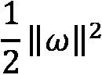

# 第八章：*第八章*：支持向量回归

**支持向量回归**（**SVR**）在线性回归模型的假设不成立时可以是一个极佳的选择，例如当我们的特征与目标之间的关系过于复杂，无法用权重的线性组合来描述时。甚至更好，SVR 允许我们无需扩展特征空间来建模这种复杂性。

支持向量机识别出最大化两个类别之间边界的超平面。支持向量是距离边界最近的数据点，它们*支持*这个边界，如果可以这样表达的话。这证明它在回归建模中与在分类中一样有用。SVR 找到包含最多数据点的超平面。我们将在本章的第一节中讨论它是如何工作的。

与普通最小二乘回归不同，SVR 不是最小化平方残差的和，而是在一个可接受的误差范围内最小化系数。像岭回归和 Lasso 回归一样，这可以减少模型方差和过拟合的风险。SVR 在处理中小型数据集时效果最佳。

该算法也非常灵活，允许我们指定可接受的误差范围，使用核来建模非线性关系，并调整超参数以获得最佳的偏差-方差权衡。我们将在本章中展示这一点。

在本章中，我们将涵盖以下主题：

+   SVR 的关键概念

+   基于线性模型的支持向量回归

+   使用核进行非线性 SVR

# 技术要求

在本章中，我们将使用 scikit-learn 和`matplotlib`库。您可以使用`pip`安装这些包。

# SVR 的关键概念

我们将从这个部分开始讨论支持向量机在分类中的应用。在这里我们不会深入细节，将支持向量分类的详细讨论留给*第十三章*，*支持向量机分类*。但首先从支持向量机在分类中的应用开始，将很好地过渡到 SVR 的解释。

正如我在本章开头讨论的那样，支持向量机找到最大化类别之间边界的超平面。当只有两个特征存在时，这个超平面仅仅是一条线。考虑以下示例图：


图 8.1 – 基于两个特征的支持向量机分类

图中的两个类别，用红色圆圈和蓝色正方形表示，可以使用两个特征，x1 和 x2，进行**线性可分**。粗体线是决策边界。它是每个类别离边界数据点最远的线，或者说是最大边界。这些点被称为支持向量。

由于前一个图中的数据是线性可分的，我们可以无问题地使用所谓的**硬间隔分类**；也就是说，我们可以对每个类别的所有观测值位于决策边界正确一侧的要求非常严格。但如果我们数据点的样子像下面这个图所示的呢？


图 8.2 – 具有软间隔的支持向量机分类

这些数据点不是线性可分的。在这种情况下，我们可以选择**软间隔分类**并忽略异常值红色圆圈。

我们将在*第十三章*“支持向量机分类”中更详细地讨论支持向量分类，但这也说明了支持向量机的一些关键概念。这些概念可以很好地应用于涉及连续目标值的模型。这被称为**支持向量回归**或**SVR**。

在构建 SVR 模型时，我们决定可接受的预测误差量，ɛ。在一个特征模型中，预测值  在 ɛ 范围内的误差不会被惩罚。这有时被称为 epsilon-insensitive tube。SVR 最小化系数，使得所有数据点都落在该范围内。这在下图中得到说明：


图 8.3 – 具有可接受误差范围的 SVR

更精确地说，SVR 在满足误差 ε 不超过给定量的约束条件下，最小化系数的平方。

它在满足  的约束条件下最小化 ，其中  是权重（或系数）向量， 是实际目标值与预测值的差， 是可接受的误差量。

当然，期望所有数据点都落在期望范围内是不合理的。但我们仍然可以寻求最小化这种偏差。让我们用 ξ 表示偏离边缘的距离。这给我们一个新的目标函数。

我们在满足  的约束条件下最小化 ，其中 *C* 是一个超参数，表示模型对边缘外误差的容忍度。*C* 的值为 0 表示它根本不容忍那些大误差。这等价于原始目标函数：


图 8.4 – 具有超出可接受范围的点的 SVR

在这里，我们可以看到 SVR 的几个优点。有时，我们的误差不超过一定量比选择一个具有最低绝对误差的模型更重要。如果我们经常略微偏离但很少大幅偏离，可能比我们经常准确但偶尔严重偏离更重要。由于这种方法也最小化了我们的权重，它具有与正则化相同的优点，我们减少了过拟合的可能性。

## 非线性 SVR 和核技巧

我们尚未完全解决 SVR 中线性可分性的问题。为了简单起见，我们将回到一个涉及两个特征的分类问题。让我们看看两个特征与分类目标的关系图。目标有两个可能的值，由点和正方形表示。x1 和 x2 是数值，具有负值：


图 8.5 – 使用两个特征无法线性分离的类别标签

在这种情况下，我们该如何识别类别之间的边界呢？通常情况下，在更高的维度上可以识别出边界。在这个例子中，我们可以使用多项式变换，如下面的图表所示：


图 8.6 – 使用多项式变换建立边界

现在有一个第三维度，它是 x1 和 x2 平方的和。所有的点都高于平方。这与我们在上一章中使用多项式变换来指定非线性回归模型的方式相似。

这种方法的缺点之一是我们可能会迅速拥有太多特征，导致模型无法良好地表现。这时，**核技巧**就非常实用了。SVR 可以通过使用核函数隐式地扩展特征空间，而不实际创建更多特征。这是通过创建一个值向量来完成的，这些值可以用来拟合非线性边界。

虽然这允许我们拟合如前述图表中所示的一个假设的多项式变换，但 SVR 中最常用的核函数是**径向基函数**（**RBF**）。RBF 之所以受欢迎，是因为它比其他常见的核函数更快，并且因为它的伽马参数使其非常灵活。我们将在本章的最后部分探讨如何使用它。

但现在，让我们从一个相对简单的线性模型开始，看看 SVR 的实际应用。

# 线性模型的 SVR

我们通常有足够的领域知识，可以采取比仅仅最小化训练数据中的预测误差更细致的方法。利用这些知识，我们可能允许模型接受更多的偏差，当少量的偏差在实质上并不重要时，以减少方差。在使用 SVR 时，我们可以调整超参数，如 epsilon（可接受的误差范围）和*C*（调整该范围之外错误的容忍度），以改善模型的表现。

如果线性模型可以在你的数据上表现良好，线性 SVR 可能是一个不错的选择。我们可以使用 scikit-learn 的`LinearSVR`类构建一个线性 SVR 模型。让我们尝试使用我们在上一章中使用的汽油税数据创建一个线性 SVR 模型：

1.  我们需要使用与上一章相同的许多库来创建训练和测试 DataFrame，并预处理数据。我们还需要从 scikit-learn 和 scipy 中分别导入`LinearSVR`和`uniform`模块：

    ```py
    import pandas as pd
    import numpy as np
    from sklearn.model_selection import train_test_split
    from sklearn.preprocessing import StandardScaler
    from sklearn.svm import LinearSVR
    from scipy.stats import uniform
    from sklearn.impute import SimpleImputer
    from sklearn.pipeline import make_pipeline
    from sklearn.compose import ColumnTransformer
    from sklearn.compose import TransformedTargetRegressor
    from sklearn.impute import KNNImputer
    from sklearn.model_selection import cross_validate, \
      KFold, GridSearchCV, RandomizedSearchCV
    import sklearn.metrics as skmet
    import matplotlib.pyplot as plt
    ```

1.  我们还需要导入`OutlierTrans`类，这是我们首先在第七章中讨论的，*线性回归模型*，用于处理异常值：

    ```py
    import os
    import sys
    sys.path.append(os.getcwd() + "/helperfunctions")
    from preprocfunc import OutlierTrans
    ```

1.  接下来，我们加载汽油税数据并创建训练和测试 DataFrame。我们创建了数值和二进制特征的列表，以及一个单独的`motorization_rate`列表。正如我们在上一章查看数据时所见，我们需要对`motorization_rate`进行一些额外的预处理。

这个数据集包含了 2014 年每个国家的汽油税数据，以及燃料收入依赖性和衡量民主制度强度的指标：`polity`、`democracy_polity`和`autocracy_polity`。`democracy_polity`是一个二进制`polity`变量，对于`polity`得分高的国家取值为 1。`autocracy_polity`对于`polity`得分低的国家取值为 1。`polity`特征是衡量一个国家民主程度的一个指标：

```py
fftaxrate14 = pd.read_csv("data/fossilfueltaxrate14.csv")
fftaxrate14.set_index('countrycode', inplace=True)
num_cols = ['fuel_income_dependence',
  'national_income_per_cap', 'VAT_Rate',  
  'gov_debt_per_gdp', 'polity','goveffect',
  'democracy_index']
dummy_cols = 'democracy_polity','autocracy_polity',
  'democracy', 'nat_oil_comp','nat_oil_comp_state']
spec_cols = ['motorization_rate']
target = fftaxrate14[['gas_tax_imp']]
features = fftaxrate14[num_cols + dummy_cols + spec_cols]
X_train, X_test, y_train, y_test =  \
  train_test_split(features,\
    target, test_size=0.2, random_state=0)
```

1.  让我们看看训练数据的摘要统计。我们需要标准化数据，因为数据范围差异很大，SVR 在标准化数据上表现更好。注意，`motorization_rate`有很多缺失值。我们可能想在这个特征上做得比简单的插补更好。对于虚拟列，我们有相当多的非缺失计数：

    ```py
    X_train.shape
    (123, 13)
    X_train[num_cols + spec_cols].\
      agg(['count','min','median','max']).T
                          count min    median   max
    fuel_income_dependence  121 0.00   0.10     34.23
    national_income_per_cap 121 260.00 6,110.00 104,540.00
    VAT_Rate                121 0.00   16.00    27.00
    gov_debt_per_gdp        112 1.56   38.45    194.76
    polity                  121 -10.00 6.00     10.00
    goveffect               123 -2.04  -0.10    2.18
    democracy_index         121 0.03   0.54     0.93
    motorization_rate       100 0.00   0.20     0.81
    X_train[dummy_cols].apply(pd.value_counts, normalize=True).T
                                        0.00         1.00
    democracy_polity                    0.42         0.58
    autocracy_polity                    0.88         0.12
    democracy                           0.41         0.59
    nat_oil_comp                        0.54         0.46
    nat_oil_comp_state                  0.76         0.24
    X_train[dummy_cols].count()
    democracy_polity           121
    autocracy_polity           121
    democracy                  123
    nat_oil_comp               121
    nat_oil_comp_state         121
    ```

1.  我们需要构建一个列转换器来处理不同的数据类型。我们可以使用`SimpleImputer`来处理分类特征和数值特征，除了`motorization_rate`。我们将在稍后使用 KNN 插补来处理`motorization_rate`特征：

    ```py
    standtrans = make_pipeline(OutlierTrans(2), 
     SimpleImputer(strategy="median"), StandardScaler())
    cattrans = make_pipeline(SimpleImputer(strategy="most_frequent"))
    spectrans = make_pipeline(OutlierTrans(2), StandardScaler())
    coltrans = ColumnTransformer(
      transformers=[
        ("stand", standtrans, num_cols),
        ("cat", cattrans, dummy_cols),
        ("spec", spectrans, spec_cols)
      ]
    )
    ```

1.  现在，我们已经准备好拟合我们的线性 SVR 模型。我们将为`epsilon`选择`0.2`的值。这意味着我们对实际值 0.2 标准差范围内的任何误差都感到满意（我们使用`TransformedTargetRegressor`来标准化目标）。我们将把*C*——决定模型对 epsilon 之外值容忍度的超参数——保留在其默认值 1.0。

在我们拟合模型之前，我们仍然需要处理`motorization_rate`的缺失值。我们将在列转换之后将 KNN 填充器添加到管道中。由于`motorization_rate`将是列转换后唯一的具有缺失值的特征，KNN 填充器只会改变该特征的价值。

我们需要使用目标转换器，因为列转换器只会改变特征，而不会改变目标。我们将把刚刚创建的管道传递给目标转换器的`regressor`参数以进行特征转换，并指出我们只想对目标进行标准缩放。

注意，线性 SVR 的默认损失函数是 L1，但我们可以选择 L2：

```py
svr = LinearSVR(epsilon=0.2, max_iter=10000, 
  random_state=0)
pipe1 = make_pipeline(coltrans, 
  KNNImputer(n_neighbors=5), svr)
ttr=TransformedTargetRegressor(regressor=pipe1,
  transformer=StandardScaler())
ttr.fit(X_train, y_train)
```

1.  我们可以使用`ttr.regressor_`来访问管道中的所有元素，包括`linearsvr`对象。这就是我们如何获得`coef_`属性。与 0 显著不同的系数是`VAT_Rate`以及专制和国家级石油公司虚拟变量。我们的模型估计，在其他条件相同的情况下，增值税率和汽油税之间存在正相关关系。它估计拥有专制或国家级石油公司与汽油税之间存在负相关关系：

    ```py
    coefs = ttr.regressor_['linearsvr'].coef_
    np.column_stack((coefs.ravel(), num_cols + dummy_cols + spec_cols))
    array([['-0.03040694175014407', 'fuel_income_dependence'],
           ['0.10549935644031803', 'national_income_per_cap'],
           ['0.49519936241642026', 'VAT_Rate'],
           ['0.0857845735264331', 'gov_debt_per_gdp'],
           ['0.018198547504343885', 'polity'],
           ['0.12656984468734492', 'goveffect'],
           ['-0.09889163752261303', 'democracy_index'],
           ['-0.036584519840546594', 'democracy_polity'],
           ['-0.5446613604546718', 'autocracy_polity'],
           ['0.033234557366924815', 'democracy'],
           ['-0.2048732386478349', 'nat_oil_comp'],
           ['-0.6142887840649164', 'nat_oil_comp_state'],
           ['0.14488410358761755', 'motorization_rate']], dtype='<U32')
    ```

注意，我们在这里没有进行任何特征选择。相反，我们依赖于 L1 正则化将特征系数推向接近 0。如果我们有更多的特征，或者我们更关心计算时间，那么仔细思考我们的特征选择策略就很重要了。

1.  让我们在该模型上进行一些交叉验证。平均绝对误差和 r-squared 值并不理想，这当然受到了小样本量的影响：

    ```py
    kf = KFold(n_splits=3, shuffle=True, random_state=0)
    ttr.fit(X_train, y_train)
    scores = cross_validate(ttr, X=X_train, y=y_train,
      cv=kf, scoring=('r2', 'neg_mean_absolute_error'),
        n_jobs=1)
    print("Mean Absolute Error: %.2f, R-squared: %.2f" %
      (scores['test_neg_mean_absolute_error'].mean(),
      scores['test_r2'].mean()))
    Mean Absolute Error: -0.26, R-squared: 0.57
    ```

我们还没有进行任何超参数调整。我们不知道我们的`epsilon`和*C*的值是否是模型的最佳值。因此，我们需要进行网格搜索来尝试不同的超参数值。我们将从穷举网格搜索开始，这通常不切实际（除非你有一个性能相当高的机器，否则我建议不要运行接下来的几个步骤）。在穷举网格搜索之后，我们将进行随机网格搜索，这通常对系统资源的影响要小得多。

1.  我们将首先创建一个没有指定`epsilon`超参数的`LinearSVR`对象，并重新创建管道。然后，我们将创建一个字典`svr_params`，其中包含用于检查`epsilon`和*C*的值，分别称为`regressor_linearsvr_epsilon`和`regressor_linearsvr_C`。

记住我们从前一章的网格搜索中提到的，键的名称必须与我们的管道步骤相对应。在这个例子中，我们可以通过转换目标对象的`regressor`属性来访问我们的管道。管道中有一个`linearsvr`对象，具有`epsilon`和*C*的属性。

我们将`svr_params`字典传递给`GridSearchCV`对象，并指示我们希望评分基于 r-squared（如果我们想基于平均绝对误差进行评分，我们也可以这样做）。

然后，我们将运行网格搜索对象的`fit`方法。我应该重复之前提到的警告，你可能不希望运行穷举网格搜索，除非你使用的是高性能机器，或者你不在乎在去拿一杯咖啡的时候让它运行。请注意，在我的机器上每次运行大约需要 26 秒：

```py
svr = LinearSVR(max_iter=100000, random_state=0)
pipe1 = make_pipeline(coltrans, 
  KNNImputer(n_neighbors=5), svr)
ttr=TransformedTargetRegressor(regressor=pipe1,
  transformer=StandardScaler())
svr_params = {
  'regressor__linearsvr__epsilon': np.arange(0.1, 1.6, 0.1),
  'regressor__linearsvr__C': np.arange(0.1, 1.6, 0.1)
}
gs = GridSearchCV(ttr,param_grid=svr_params, cv=3, 
  scoring='r2')
%timeit gs.fit(X_train, y_train)
26.2 s ± 50.7 ms per loop (mean ± std. dev. of 7 runs, 1 loop each)
```

1.  现在，我们可以使用网格搜索的`best_params_`属性来获取与最高分数相关的超参数。我们可以通过`best_scores_`属性查看这些参数的分数。这告诉我们，我们以 0.1 的*C*值和 0.2 的`epsilon`值获得了最高的 r-squared 值，即 0.6：

    ```py
    gs.best_params_
    {'regressor__linearsvr__C': 0.1, 'regressor__linearsvr__epsilon': 0.2}
    gs.best_score_
    0.599751107082899
    ```

了解为我们的超参数选择哪些值是很好的。然而，穷举网格搜索在计算上相当昂贵。让我们尝试随机搜索。

1.  我们将指示`epsilon`和*C*的随机值应来自介于 0 和 1.5 之间的均匀分布。然后，我们将该字典传递给`RandomizedSearchCV`对象。这比穷举网格搜索快得多——每次迭代略超过 1 秒。这给我们提供了比穷举网格搜索更高的`epsilon`和*C*值——即，分别为 0.23 和 0.7。然而，r-squared 值略低：

    ```py
    svr_params = {
     'regressor__linearsvr__epsilon': uniform(loc=0, scale=1.5),
     'regressor__linearsvr__C': uniform(loc=0, scale=1.5)
    }
    rs = RandomizedSearchCV(ttr, svr_params, cv=3, scoring='r2')
    %timeit rs.fit(X_train, y_train)
    1.21 s ± 24.5 ms per loop (mean ± std. dev. of 7 runs, 1 loop each)
    rs.best_params_
    {'regressor__linearsvr__C': 0.23062453444814285,
     'regressor__linearsvr__epsilon': 0.6976844872643301}
    rs.best_score_
    0.5785452537781279
    ```

1.  让我们查看基于随机网格搜索最佳模型的预测。随机网格搜索对象的`predict`方法可以为我们生成这些预测：

    ```py
    pred = rs.predict(X_test)
    preddf = pd.DataFrame(pred, columns=['prediction'],
      index=X_test.index).join(X_test).join(y_test)
    preddf['resid'] = preddf.gas_tax_imp-preddf.prediction
    ```

1.  现在，让我们看看我们残差的分布：

    ```py
    plt.hist(preddf.resid, color="blue", bins=np.arange(-0.5,1.0,0.25))
    plt.axvline(preddf.resid.mean(), color='red', linestyle='dashed', linewidth=1)
    plt.title("Histogram of Residuals for Gas Tax Model")
    plt.xlabel("Residuals")
    plt.ylabel("Frequency")
    plt.xlim()
    plt.show()
    ```

这产生了以下图表：


图 8.7 – 加油税线性 SVR 模型的残差分布

在这里，存在一点偏差（整体上有些过度预测）和一些正偏斜。

1.  让我们再查看一下预测值与残差之间的散点图：

    ```py
    plt.scatter(preddf.prediction, preddf.resid, color="blue")
    plt.axhline(0, color='red', linestyle='dashed', linewidth=1)
    plt.title("Scatterplot of Predictions and Residuals")
    plt.xlabel("Predicted Gas Tax")
    plt.ylabel("Residuals")
    plt.show()
    ```

这产生了以下图表：


图 8.8 – 加油税线性 SVR 模型的预测值与残差的散点图

这些残差是有问题的。我们在预测值的低和高范围内总是过度预测（预测值高于实际值）。这不是我们想要的，也许在提醒我们存在未考虑的非线性关系。

当我们的数据是线性可分时，线性支持向量回归（SVR）可以是一个高效的选择。它可以用在许多我们本会使用线性回归或带有正则化的线性回归的相同情况下。它的相对效率意味着我们对于使用包含超过 10,000 个观测值的数据集并不像使用非线性 SVR 那样担忧。然而，当线性可分性不可能时，我们应该探索非线性模型。

# 使用核函数进行非线性 SVR

回想一下本章开头我们讨论的内容，我们可以使用核函数来拟合一个非线性ε敏感管。在本节中，我们将使用我们在上一章中使用过的土地温度数据运行非线性 SVR。但首先，我们将使用相同的数据构建一个线性 SVR 以进行比较。

我们将把气象站的平均温度建模为纬度和海拔的函数。按照以下步骤进行：

1.  我们将首先加载熟悉的库。唯一的新类是来自 scikit-learn 的`SVR`：

    ```py
    import pandas as pd
    import numpy as np
    from sklearn.model_selection import train_test_split
    from sklearn.preprocessing import StandardScaler
    from sklearn.svm import LinearSVR, SVR
    from scipy.stats import uniform
    from sklearn.impute import SimpleImputer
    from sklearn.pipeline import make_pipeline
    from sklearn.compose import TransformedTargetRegressor
    from sklearn.impute import KNNImputer
    from sklearn.model_selection import RandomizedSearchCV
    import sklearn.metrics as skmet
    import matplotlib.pyplot as plt
    import os
    import sys
    sys.path.append(os.getcwd() + "/helperfunctions")
    from preprocfunc import OutlierTrans
    ```

1.  接下来，我们将加载土地温度数据并创建训练和测试数据框。我们还将查看一些描述性统计。海拔高度有多个缺失值，两个特征的范围差异很大。还有一些异常低的平均温度：

    ```py
    landtemps = pd.read_csv("data/landtempsb2019avgs.csv")
    landtemps.set_index('locationid', inplace=True)
    feature_cols = ['latabs','elevation']
    landtemps[['avgtemp'] + feature_cols].\
      agg(['count','min','median','max']).T
                   count       min     median     max
    avgtemp        12,095     -61      10         34
    latabs         12,095      0       41         90
    elevation      12,088     -350     271        4,701
    X_train, X_test, y_train, y_test =  \
      train_test_split(landtemps[feature_cols],\
      landtemps[['avgtemp']], test_size=0.1, random_state=0)
    ```

1.  让我们从平均温度的线性 SVR 模型开始。我们可以对处理异常值保持相当保守，只有当四分位数范围超过三倍时，才将它们设置为缺失值。（我们在*第七章*，*线性回归模型*）中创建了`OutlierTrans`类。）我们将使用 KNN 插补缺失的海拔值并缩放数据。记住，我们需要使用目标转换器来缩放目标变量。

正如我们在上一节中所做的那样，我们将使用一个字典，`svr_params`，来表示我们想要从均匀分布中采样超参数的值——即`epsilon`和*C*。我们将把这个字典传递给`RandomizedSearchCV`对象。

在运行`fit`之后，我们可以得到`epsilon`和*C*的最佳参数，以及最佳模型的平均绝对误差。平均绝对误差相当不错，大约为 2.8 度：

```py
svr = LinearSVR(epsilon=1.0, max_iter=100000)
knnimp = KNNImputer(n_neighbors=45)
pipe1 = make_pipeline(OutlierTrans(3), knnimp, StandardScaler(), svr)
ttr=TransformedTargetRegressor(regressor=pipe1,
  transformer=StandardScaler())
svr_params = {
 'regressor__linearsvr__epsilon': uniform(loc=0, scale=1.5),
 'regressor__linearsvr__C': uniform(loc=0, scale=20)
}
rs = RandomizedSearchCV(ttr, svr_params, cv=10, scoring='neg_mean_absolute_error')
rs.fit(X_train, y_train)
rs.best_params_
{'regressor__linearsvr__C': 15.07662849482442,
 'regressor__linearsvr__epsilon': 0.06750238486004034}
rs.best_score_
-2.769283402595076
```

1.  让我们看看预测结果：

    ```py
    pred = rs.predict(X_test)
    preddf = pd.DataFrame(pred, columns=['prediction'],
      index=X_test.index).join(X_test).join(y_test)
    preddf['resid'] = preddf.avgtemp-preddf.prediction
    plt.scatter(preddf.prediction, preddf.resid, color="blue")
    plt.axhline(0, color='red', linestyle='dashed', linewidth=1)
    plt.title("Scatterplot of Predictions and Residuals")
    plt.xlabel("Predicted Gas Tax")
    plt.ylabel("Residuals")
    plt.show()
    ```

这产生了以下图表：


图 8.9 – 土地温度线性 SVR 模型的预测值和残差散点图

在预测值的上限范围内有相当多的过度预测。我们通常在预测的汽油税值 15 到 25 度之间低估值。也许我们可以通过非线性模型来提高拟合度。

1.  运行非线性 SVR 不需要做太多改变。我们只需要创建一个`SVR`对象并选择一个核函数。通常选择`rbf`。（除非你使用的是良好的硬件，或者你不在乎暂时做其他事情然后回来获取结果，否则你可能不想在你的机器上拟合这个模型。）看看下面的代码：

    ```py
    svr = SVR(kernel='rbf')
    pipe1 = make_pipeline(OutlierTrans(3), knnimp, StandardScaler(), svr)
    ttr=TransformedTargetRegressor(regressor=pipe1,
      transformer=StandardScaler())
    svr_params = {
     'regressor__svr__epsilon': uniform(loc=0, scale=5),
     'regressor__svr__C': uniform(loc=0, scale=20),
     'regressor__svr__gamma': uniform(loc=0, scale=100)
     }
    rs = RandomizedSearchCV(ttr, svr_params, cv=10, scoring='neg_mean_absolute_error')
    rs.fit(X_train, y_train)
    rs.best_params_
    {'regressor__svr__C': 5.3715128489311255,
     'regressor__svr__epsilon': 0.03997496426101643,
     'regressor__svr__gamma': 53.867632383007994}
    rs.best_score_
    -2.1319240416548775
    ```

在平均绝对误差方面有明显的改进。在这里，我们可以看到`gamma`和 C 超参数为我们做了很多工作。如果我们对平均偏差 2 度左右没有异议，这个模型就能达到这个目标。

在*第十三章**，支持向量机分类*中，我们详细讨论了 gamma 和 C 超参数。我们还探讨了除了 rbf 核以外的其他核函数。

1.  让我们再次查看残差，看看我们的误差分布是否有问题，就像我们的线性模型那样：

    ```py
    pred = rs.predict(X_test)
    preddf = pd.DataFrame(pred, columns=['prediction'],
      index=X_test.index).join(X_test).join(y_test)
    preddf['resid'] = preddf.avgtemp-preddf.prediction
    plt.scatter(preddf.prediction, preddf.resid, color="blue")
    plt.axhline(0, color='red', linestyle='dashed', linewidth=1)
    plt.title("Scatterplot of Predictions and Residuals")
    plt.xlabel("Predicted Gas Tax")
    plt.ylabel("Residuals")
    plt.show()
    ```

这产生了以下图表：


图 8.10 – 非线性 SVR 模型预测值和残差的散点图

这些残差看起来比线性模型的残差要好得多。

这说明了使用核函数如何在不增加特征空间的情况下增加我们模型的复杂性。通过使用`rbf`核并调整 C 和`gamma`超参数，我们解决了线性模型中看到的欠拟合问题。这是非线性 SVR 的一个巨大优点。缺点，正如我们之前看到的，是对系统资源的需求很大。包含 12,000 个观测值的数据库是非线性 SVR 可以轻松处理的极限，尤其是在进行最佳超参数的网格搜索时。

# 摘要

本章中的示例展示了 SVR 的一些优点。该算法允许我们调整超参数来解决欠拟合或过拟合问题。这可以在不增加特征数量的情况下完成。与线性回归等方法相比，SVR 对异常值也不那么敏感。

当我们可以用线性 SVR 构建一个好的模型时，这是一个完全合理的选择。它比非线性模型训练得快得多。然而，我们通常可以通过非线性 SVR 来提高性能，就像我们在本章的最后部分看到的那样。

这一讨论引出了我们在下一章将要探讨的内容，我们将探讨两种流行的非参数回归算法：k 近邻和决策树回归。这两个算法对特征和目标分布几乎没有假设。与 SVR 类似，它们可以在不增加特征空间的情况下捕捉数据中的复杂关系。
