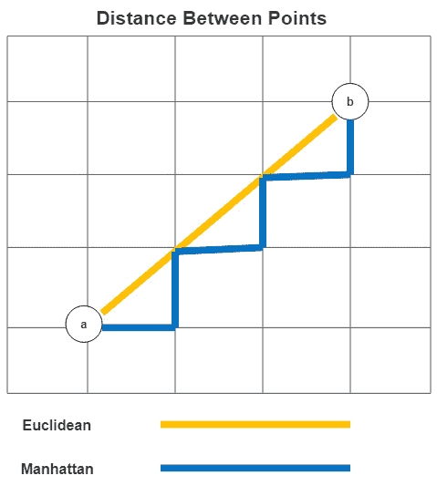

# 第九章：*第九章*：K 近邻、决策树、随机森林和梯度提升回归

对于支持向量机而言，K 近邻和决策树模型最著名的用途是分类模型。然而，它们也可以用于回归，并且相对于经典的线性回归，它们具有一些优势。K 近邻和决策树可以很好地处理非线性，并且不需要对特征的高斯分布做出任何假设。此外，通过调整**K 近邻**（**KNN**）的*k*值或决策树的最大深度，我们可以避免对训练数据拟合得太精确。

这使我们回到了前两章的主题——如何在不过度拟合的情况下增加模型复杂度，包括考虑非线性。我们已经看到，允许一些偏差可以减少方差，并给我们提供更可靠的模型性能估计。我们将继续在本章中探索这种平衡。

具体来说，我们将涵盖以下主要内容：

+   K 近邻回归的关键概念

+   K 近邻回归

+   决策树和随机森林回归的关键概念

+   决策树和随机森林回归

+   使用梯度提升回归

# 技术要求

在本章中，我们将使用 scikit-learn 和`matplotlib`库。我们还将使用 XGBoost。你可以使用`pip`来安装这些包。

# K 近邻回归的关键概念

KNN 算法的部分吸引力在于它相当直接且易于解释。对于每个需要预测目标的观测，KNN 会找到*k*个训练观测，其特征与该观测最相似。当目标是分类时，KNN 会选择*k*个训练观测中最频繁的目标值。（我们通常在分类问题中选择一个奇数作为*k*，以避免平局。）

当目标是数值时，KNN 会给出*k*个训练观测的目标平均值。通过*训练*观测，我指的是那些具有已知目标值的观测。KNN 实际上并不进行真正的训练，因为它被称为懒惰学习器。我将在本节稍后详细讨论这一点。

*图 9.1*展示了使用 K 近邻进行分类，其中*k*的值为 1 和 3：当*k*为 1 时，我们的新观测将被分配红色标签。当*k*为 3 时，它将被分配蓝色标签：


图 9.1 – K 近邻，k 值为 1 和 3

但我们所说的相似或最近的观测意味着什么？有几种方法可以衡量相似度，但一个常见的衡量标准是欧几里得距离。欧几里得距离是两点之间平方差的和。这可能会让你想起勾股定理。从点 a 到点 b 的欧几里得距离如下：


曼哈顿距离是欧几里得距离的一个合理替代方案。从点 a 到点 b 的曼哈顿距离如下：


曼哈顿距离有时也被称为出租车距离。这是因为它反映了两个点在网格路径上的距离。*图 9.2* 展示了曼哈顿距离，并将其与欧几里得距离进行了比较：



图 9.2 – 欧几里得和曼哈顿距离度量

当特征在类型或尺度上非常不同时，使用曼哈顿距离可以获得更好的结果。然而，我们可以将距离度量的选择视为一个经验问题；也就是说，我们可以尝试两者（或其他距离度量），并看看哪个给我们提供了性能最好的模型。我们将在下一节通过网格搜索来演示这一点。

如你所怀疑的，KNN 模型的敏感性取决于 *k* 的选择。*k* 的值较低时，模型会试图识别观测值之间的细微差别。当然，在 *k* 值非常低的情况下，过拟合的风险很大。但在 *k* 值较高时，我们的模型可能不够灵活。我们再次面临方差-偏差权衡。较低的 *k* 值导致偏差较小而方差较大，而较高的 *k* 值则相反。

对于 *k* 的选择没有明确的答案。一个很好的经验法则是从观测值的平方根开始。然而，正如我们对距离度量的处理一样，我们应该测试模型在不同 *k* 值下的性能。

如我之前提到的，K 近邻是一种懒惰学习算法。在训练时间不进行任何计算。学习主要发生在测试期间。这有一些缺点。当数据中有许多实例或维度时，KNN 可能不是一个好的选择，而且预测速度很重要。它也往往在稀疏数据（即具有许多 0 值的数据集）的情况下表现不佳。

K 近邻是非参数算法。不对底层数据的属性做出假设，例如线性或正态分布的特征。当线性模型不起作用时，它通常能给出相当不错的结果。我们将在下一节构建 KNN 回归模型。

# K 近邻回归

如前所述，当普通最小二乘法的假设不成立，且观测值和维度数量较少时，K 近邻算法可以成为线性回归的一个很好的替代方案。它也非常容易指定，因此即使我们最终模型中不使用它，它也可以用于诊断目的。

在本节中，我们将使用 KNN 构建一个国家层面的女性与男性收入比模型。我们将基于劳动力参与率、教育成就、青少年出生频率和最高级别的女性政治参与率。这是一个很好的数据集进行实验，因为小样本量和特征空间意味着它不太可能消耗你的系统资源。特征数量较少也使得它更容易解释。缺点是可能难以找到显著的结果。话虽如此，让我们看看我们发现了什么。

注意

我们将在本章中一直使用收入差距数据集。该数据集由联合国开发计划署在[`www.kaggle.com/datasets/undp/human-development`](https://www.kaggle.com/datasets/undp/human-development)上提供供公众使用。每个国家都有一个记录，包含按性别划分的 2015 年的综合就业、收入和教育数据。

让我们开始构建我们的模型：

1.  首先，我们必须导入我们在前两章中使用的一些相同的`sklearn`库。我们还必须导入`KNeighborsRegressor`和来自*第五章*的老朋友——*特征选择*——即`SelectFromModel`。我们将使用`SelectFromModel`来将特征选择添加到我们将构建的管道中：

    ```py
    import pandas as pd
    import numpy as np
    from sklearn.model_selection import train_test_split
    from sklearn.preprocessing import StandardScaler
    from sklearn.impute import SimpleImputer
    from sklearn.pipeline import make_pipeline
    from sklearn.model_selection import RandomizedSearchCV
    from sklearn.neighbors import KNeighborsRegressor
    from sklearn.linear_model import LinearRegression
    from sklearn.feature_selection import SelectFromModel
    import seaborn as sns
    import matplotlib.pyplot as plt
    ```

1.  我们还需要在*第七章*的*线性回归模型*中创建的`OutlierTrans`类。我们将使用它根据四分位数范围来识别异常值，正如我们在*第三章*的*识别和修复缺失值*中首先讨论的那样：

    ```py
    import os
    import sys
    sys.path.append(os.getcwd() + "/helperfunctions")
    from preprocfunc import OutlierTrans
    ```

1.  接下来，我们必须加载收入数据。我们还需要构建一个女性与男性收入比、教育年限比、劳动力参与比和人类发展指数比的序列。这些指标中的任何一项的值较低都表明男性可能具有优势，假设这些特征与女性与男性收入比之间存在正相关关系。例如，我们预计收入比会提高——也就是说，接近 1.0——当劳动力参与比接近 1.0 时——也就是说，当女性的劳动力参与率等于男性的时候。

1.  我们必须删除目标`incomeratio`缺失的行：

    ```py
    un_income_gap = pd.read_csv("data/un_income_gap.csv")
    un_income_gap.set_index('country', inplace=True)
    un_income_gap['incomeratio'] = \
      un_income_gap.femaleincomepercapita / \
        un_income_gap.maleincomepercapita
    un_income_gap['educratio'] = \
      un_income_gap.femaleyearseducation / \
         un_income_gap.maleyearseducation
    un_income_gap['laborforcepartratio'] = \
      un_income_gap.femalelaborforceparticipation / \
         un_income_gap.malelaborforceparticipation
    un_income_gap['humandevratio'] = \
      un_income_gap.femalehumandevelopment / \
         un_income_gap.malehumandevelopment
    un_income_gap.dropna(subset=['incomeratio'], inplace=True)
    ```

1.  让我们看看一些数据行：

    ```py
    num_cols = ['educratio','laborforcepartratio',
    'humandevratio','genderinequality','maternalmortality',
      'adolescentbirthrate','femaleperparliament',
    'incomepercapita']
    gap_sub = un_income_gap[['incomeratio'] + num_cols]
    gap_sub.head()
    incomeratio  educratio  laborforcepartratio  humandevratio\
    country
    Norway         0.78    1.02    0.89    1.00
    Australia      0.66    1.02    0.82    0.98
    Switzerland    0.64    0.88    0.83    0.95
    Denmark        0.70    1.01    0.88    0.98
    Netherlands    0.48    0.95    0.83    0.95
    genderinequality  maternalmortality  adolescentbirthrate\
    country
    Norway        0.07    4.00    7.80
    Australia     0.11    6.00    12.10
    Switzerland   0.03    6.00    1.90
    Denmark       0.05    5.00    5.10
    Netherlands   0.06    6.00    6.20
                 femaleperparliament  incomepercapita  
    country                                            
    Norway       39.60    64992
    Australia    30.50    42261
    Switzerland  28.50    56431
    Denmark      38.00    44025
    Netherlands  36.90    45435
    ```

1.  让我们也看看一些描述性统计：

    ```py
    gap_sub.\
      agg(['count','min','median','max']).T
                        count  min    median    max
    incomeratio         177.00 0.16   0.60      0.93
    educratio           169.00 0.24   0.93      1.35
    laborforcepartratio 177.00 0.19   0.75      1.04
    humandevratio       161.00 0.60   0.95      1.03
    genderinequality    155.00 0.02   0.39      0.74
    maternalmortality   174.00 1.00   60.00     1,100.00
    adolescentbirthrate 177.00 0.60   40.90     204.80
    femaleperparliament 174.00 0.00   19.35     57.50
    incomepercapita     177.00 581.00 10,512.00 123,124.00
    ```

我们有 177 个观测值和目标变量`incomeratio`。一些特征，如`humandevratio`和`genderinequality`，有超过 15 个缺失值。我们将在那里需要填充一些合理的值。我们还需要进行一些缩放，因为一些特征的范围与其他特征非常不同，从一端的`incomeratio`和`incomepercapita`到另一端的`educratio`和`humandevratio`。

注意

数据集有妇女和男人的单独人类发展指数。该指数是健康、知识获取和生活水平的衡量标准。我们之前计算的`humandevratio`特征将妇女的得分除以男人的得分。`genderinequality`特征是那些对妇女有不成比例影响的国家的健康和劳动力市场政策的指数。`femaleperparliament`是最高国家立法机构中女性所占的百分比。

1.  我们还应该查看特征与目标之间的相关性热图。在我们建模时，记住更高的相关性（无论是负的还是正的）是一个好主意。更高的正相关用较暖的颜色表示。`laborforcepartratio`、`humandevratio`和`maternalmortality`都与我们的目标正相关，后者有些令人惊讶。`humandevratio`和`laborforcepartratio`也是相关的，因此我们的模型可能难以区分每个特征的影响。一些特征选择将帮助我们弄清楚哪个特征更重要。（我们需要使用包装器或嵌入式特征选择方法来很好地揭示这一点。我们将在*第五章*，*特征选择*）中详细讨论这些方法。）看看以下代码：

    ```py
    corrmatrix = gap_sub.corr(method="pearson")
    corrmatrix
    sns.heatmap(corrmatrix, xticklabels=corrmatrix.columns,
    yticklabels=corrmatrix.columns, cmap="coolwarm")
    plt.title('Heat Map of Correlation Matrix')
    plt.tight_layout()
    plt.show()
    ```

这会产生以下图表：


图 9.3 – 相关系数矩阵

1.  接下来，我们必须设置训练和测试数据框：

    ```py
    X_train, X_test, y_train, y_test =  \
      train_test_split(gap_sub[num_cols],\
      gap_sub[['incomeratio']], test_size=0.2, random_state=0)
    ```

现在，我们已经准备好设置 KNN 回归模型。我们还将构建一个管道来处理异常值，基于每个特征的中间值进行插补，缩放特征，并使用 scikit-learn 的`SelectFromModel`进行一些特征选择：

1.  我们将使用线性回归进行特征选择，但我们可以选择任何会返回特征重要性值的算法。我们将特征重要性阈值设置为平均特征重要性的 80%。平均值是默认值。我们的选择在这里相当随意，但我喜欢保留那些低于平均特征重要性水平的特征的想法，当然还有那些重要性更高的特征：

    ```py
    knnreg = KNeighborsRegressor()
    feature_sel = SelectFromModel(LinearRegression(), threshold="0.8*mean")
    pipe1 = make_pipeline(OutlierTrans(3), \
      SimpleImputer(strategy="median"), StandardScaler(), \
      feature_sel, knnreg)
    ```

1.  现在，我们已经准备好进行网格搜索以找到最佳参数。首先，我们将创建一个字典，`knnreg_params`，以表明我们希望 KNN 模型从 3 到 19 选择*k*的值，跳过偶数。我们还希望网格搜索找到最佳的距离度量 – 欧几里得、曼哈顿或闵可夫斯基：

    ```py
    knnreg_params = {
     'kneighborsregressor__n_neighbors': \
         np.arange(3, 21, 2),
     'kneighborsregressor__metric': \
         ['euclidean','manhattan','minkowski']
    }
    ```

1.  我们将把这些参数传递给`RandomizedSearchCV`对象，然后拟合模型。我们可以使用`RandomizedSearchCV`的`best_params_`属性来查看特征选择和 KNN 回归选择的超参数。这些结果表明，对于 KNN 的*k*最佳超参数值是 11，对于距离度量是曼哈顿：

最佳模型具有-0.05 的负均方误差。考虑到样本量小，这相当不错。它小于`incomeratio`的中位数值的 10%，而`incomeratio`的中位数值为 0.6：

```py
rs = RandomizedSearchCV(pipe1, knnreg_params, cv=4, n_iter=20, \
  scoring='neg_mean_absolute_error', random_state=1)
rs.fit(X_train, y_train)
rs.best_params_
{'kneighborsregressor__n_neighbors': 11,
 'kneighborsregressor__metric': 'manhattan'}
rs.best_score_
-0.05419731104389228
```

1.  让我们来看看在管道的特征选择步骤中选定的特征。只选择了两个特征 – `laborforcepartratio` 和 `humandevratio`。请注意，这一步不是运行我们的模型的必要步骤。它只是帮助我们解释它：

    ```py
    selected = rs.best_estimator_['selectfrommodel'].get_support()
    np.array(num_cols)[selected]
    array(['laborforcepartratio', 'humandevratio'], dtype='<U19')
    ```

1.  如果你使用的是*scikit-learn* 1.0 或更高版本，这会容易一些。在这种情况下，你可以使用`get_feature_names_out`方法：

    ```py
    rs.best_estimator_['selectfrommodel'].\
      get_feature_names_out(np.array(num_cols))
    array(['laborforcepartratio', 'humandevratio'], dtype=object)
    ```

1.  我们还应该看看一些其他的前几名结果。有一个使用`euclidean`距离的模型，其表现几乎与最佳模型一样好：

    ```py
    results = \
      pd.DataFrame(rs.cv_results_['mean_test_score'], \
        columns=['meanscore']).\
      join(pd.DataFrame(rs.cv_results_['params'])).\
      sort_values(['meanscore'], ascending=False)
    results.head(3).T
    13       1      3
    Meanscore   -0.05   -0.05   -0.05
    regressor__kneighborsregressor__n_neighbors  11  13  9
    regressor__kneighborsregressor__metric  manhattan  manhattan  euclidean
    ```

1.  让我们看看这个模型的残差。我们可以使用`RandomizedSearchCV`对象的`predict`方法在测试数据上生成预测。残差在 0 附近很好地平衡。有一点负偏斜，但这也不算坏。峰度低，但我们对此没有太多尾巴的情况感到满意。这很可能反映了异常值残差不多：

    ```py
    pred = rs.predict(X_test)
    preddf = pd.DataFrame(pred, columns=['prediction'],
      index=X_test.index).join(X_test).join(y_test)
    preddf['resid'] = preddf.incomeratio-preddf.prediction
    preddf.resid.agg(['mean','median','skew','kurtosis'])
    mean            -0.01
    median          -0.01
    skew            -0.61
    kurtosis         0.23
    Name: resid, dtype: float64
    ```

1.  让我们绘制残差图：

    ```py
    plt.hist(preddf.resid, color="blue")
    plt.axvline(preddf.resid.mean(), color='red', linestyle='dashed', linewidth=1)
    plt.title("Histogram of Residuals for Gax Tax Model")
    plt.xlabel("Residuals")
    plt.ylabel("Frequency")
    plt.xlim()
    plt.show()
    ```

这产生了以下图表：


图 9.4 – 使用 KNN 回归的收入的比率模型的残差

当我们绘制残差时，它们看起来也很不错。然而，有几个国家，我们的预测误差超过了 0.1。在这两种情况下，我们都高估了。 （虚线红色线是平均残差量。）

1.  让我们也看看散点图。在这里，我们可以看到两个大的高估值位于预测范围的两端。总的来说，残差在预测的收入比率范围内相对恒定。我们可能只是想对两个异常值做些处理：

    ```py
    plt.scatter(preddf.prediction, preddf.resid, color="blue")
    plt.axhline(0, color='red', linestyle='dashed', linewidth=1)
    plt.title("Scatterplot of Predictions and Residuals")
    plt.xlabel("Predicted Income Gap")
    plt.ylabel("Residuals")
    plt.show()
    ```

这产生了以下图表：


图 9.5 – 使用 KNN 回归的收入的比率模型的预测值和残差的散点图

我们应该更仔细地看看那些残差较高的国家。我们的模型在预测阿富汗或荷兰的收入比率方面做得不好，在两种情况下都高估了很多。回想一下，我们的特征选择步骤给我们提供了一个只有两个预测因子（`laborforcepartratio` 和 `humandevratio`）的模型。

对于阿富汗，劳动力参与率（女性相对于男性的参与率）非常接近最低的 0.19，而人类发展比率处于最低水平。这仍然不能使我们接近预测非常低的收入比率（女性相对于男性的收入），这个比率也是最低的。

对于荷兰来说，劳动力参与率 0.83 比中位数 0.75 高出不少，但人类发展比率正好是中位数。这就是为什么我们的模型预测的收入比率略高于 0.6 的中位数。荷兰的实际收入比率出人意料地低：

```py
preddf.loc[np.abs(preddf.resid)>=0.1,
  ['incomeratio', 'prediction', 'resid', 
   'laborforcepartratio', 'humandevratio']].T
country                     Afghanistan    Netherlands
incomeratio                  0.16           0.48
prediction                   0.32           0.65
resid                       -0.16          -0.17
laborforcepartratio          0.20           0.83
humandevratio                0.60           0.95
```

在这里，我们可以看到 KNN 回归的一些优点。我们可以在不花费大量时间指定模型的情况下，对难以建模的数据获得不错的预测。除了某些插补和缩放之外，我们没有进行任何转换或创建交互效应。我们也不必担心非线性。KNN 回归可以很好地处理这一点。

但这种方法可能扩展得不是很好。在这个例子中，一个懒惰的学习者是可以的。然而，对于更工业级的工作，我们通常需要转向一个具有许多 KNN 优点但没有一些缺点的算法。我们将在本章的剩余部分探讨决策树和随机森林回归。

# 决策树和随机森林回归的关键概念

决策树是一个非常有用的机器学习工具。它们具有与 KNN 相似的一些优点——它们是非参数的，易于解释，并且可以处理广泛的数据——但没有一些限制。

决策树根据数据集中观测值的特征值对观测值进行分组。这是通过一系列二元决策来完成的，从根节点的一个初始分割开始，以每个分组的叶子节点结束。所有沿着从根节点到该叶子的分支具有相同值或相同值范围的观测值，都会得到相同的预测值。当目标是数值时，这就是该叶子节点训练观测值的平均目标值。*图 9.6*展示了这一点：


图 9.6 – 每晚睡眠小时数的决策树模型

这是一个基于每周工作时间、孩子数量、家庭中其他成年人数量以及个人是否在学校注册的每周睡眠小时数的个人模型。（这些结果基于假设数据。）根节点基于每周工作时间，将数据分为工作时间超过 30 小时和 30 小时或以下的观察结果。括号中的数字是该节点达到的训练数据百分比。60%的观察结果工作时间超过 30 小时。在树的左侧，我们的模型进一步通过孩子数量和家中其他成年人的数量来分割数据。在树的另一侧，代表工作时间少于或等于 30 小时的观察结果，唯一的额外分割是通过学校注册情况。

我现在意识到，并非所有读者都能看到这个颜色。我们可以从每个叶子节点向上导航树，描述树是如何分割数据的。15%的观测值在家中没有其他成年人，有超过 1 个孩子，每周工作时间超过 30 小时。这些观测值的平均每晚睡眠时间为 4.5 小时。这将是对具有相同特征的新观测值的预测值。

你可能想知道决策树算法是如何选择数值特征的阈值。例如，为什么每周工作时间大于 30 小时或孩子数量大于 1 小时？算法从根节点开始，在每个级别上选择分割，以最小化平方误差之和。更精确地说，选择的分割可以最小化：


你可能已经注意到了与线性回归优化的相似之处。但是，决策树回归相对于线性回归有几个优点。决策树可以用来模拟线性关系和非线性关系，而无需我们修改特征。我们还可以使用决策树避免特征缩放，因为算法可以处理我们特征中的非常不同的范围。

决策树的主要缺点是它们的方差很高。根据我们数据的特点，每次拟合决策树时，我们可能会得到一个非常不同的模型。我们可以使用集成方法，如袋装法或随机森林，来解决这个问题。

## 使用随机森林回归

随机森林，可能不出所料，是决策树的集合。但这并不能区分随机森林和自助聚合，通常称为袋装法。袋装法通常用于减少具有高方差的机器学习算法的方差，如决策树。在袋装法中，我们从数据集中生成随机样本。然后，我们在每个样本上运行我们的模型，例如决策树回归，并对预测进行平均。

然而，使用袋装法生成的样本可能相关，并且产生的决策树可能有很多相似之处。这种情况在只有少数特征可以解释大部分变化时更为可能。随机森林通过限制每个树可以选定的特征数量来解决此问题。一个很好的经验法则是将可用特征的数量除以 3，以确定每个决策树每个分割要使用的特征数量。例如，如果有 21 个特征，我们会在每个分割中使用 7 个。我们将在下一节中构建决策树和随机森林回归模型。

# 决策树和随机森林回归

在本节中，我们将使用决策树和随机森林构建一个回归模型，使用与本章前面相同的工作收入差距数据。 我们还将使用调整来识别给我们带来最佳性能模型的超参数，就像我们在 KNN 回归中所做的那样。 让我们开始吧：

1.  我们必须加载与 KNN 回归相同的许多库，以及来自 scikit-learn 的`DecisionTreeRegressor`和`RandomForestRegressor`：

    ```py
    import pandas as pd
    import numpy as np
    from sklearn.model_selection import train_test_split
    from sklearn.impute import SimpleImputer
    from sklearn.pipeline import make_pipeline
    from sklearn.model_selection import RandomizedSearchCV
    from sklearn.tree import DecisionTreeRegressor, plot_tree
    from sklearn.ensemble import RandomForestRegressor
    from sklearn.linear_model import LinearRegression
    from sklearn.feature_selection import SelectFromModel
    ```

1.  我们还必须导入我们用于处理异常值的类：

    ```py
    import os
    import sys
    sys.path.append(os.getcwd() + "/helperfunctions")
    from preprocfunc import OutlierTrans
    ```

1.  我们必须加载之前使用过的相同收入差距数据，并创建测试和训练数据框：

    ```py
    un_income_gap = pd.read_csv("data/un_income_gap.csv")
    un_income_gap.set_index('country', inplace=True)
    un_income_gap['incomeratio'] = \
      un_income_gap.femaleincomepercapita / \
        un_income_gap.maleincomepercapita
    un_income_gap['educratio'] = \
      un_income_gap.femaleyearseducation / \
         un_income_gap.maleyearseducation
    un_income_gap['laborforcepartratio'] = \
      un_income_gap.femalelaborforceparticipation / \
         un_income_gap.malelaborforceparticipation
    un_income_gap['humandevratio'] = \
      un_income_gap.femalehumandevelopment / \
         un_income_gap.malehumandevelopment
    un_income_gap.dropna(subset=['incomeratio'], 
      inplace=True)
    num_cols = ['educratio','laborforcepartratio',
      'humandevratio', 'genderinequality', 
      'maternalmortality', 'adolescentbirthrate', 
      'femaleperparliament', 'incomepercapita']
    gap_sub = un_income_gap[['incomeratio'] + num_cols]
    X_train, X_test, y_train, y_test =  \
      train_test_split(gap_sub[num_cols],\
      gap_sub[['incomeratio']], test_size=0.2, 
        random_state=0)
    ```

让我们从相对简单的决策树开始 – 一个没有太多层级的树。 一个简单的树可以很容易地在一页上展示。

## 带有解释的决策树示例

在我们构建决策树回归器之前，让我们先看看一个最大深度设置为低值的快速示例。 随着深度的增加，决策树解释和绘图变得更加困难。 让我们开始吧：

1.  我们首先实例化一个决策树回归器，限制深度为三，并要求每个叶节点至少有五个观测值。 我们创建一个仅预处理数据的管道，并将结果 NumPy 数组`X_train_imp`传递给决策树回归器的`fit`方法：

    ```py
    dtreg_example = DecisionTreeRegressor(
      min_samples_leaf=5,
      max_depth=3)
    pipe0 = make_pipeline(OutlierTrans(3),
      SimpleImputer(strategy="median"))
    X_train_imp = pipe0.fit_transform(X_train)
    dtreg_example.fit(X_train_imp, y_train)
    plot_tree(dtreg_example, 
      feature_names=X_train.columns,
      label="root", fontsize=10)
    ```

这生成了以下图表：


图 9.7 – 最大深度为 3 的决策树示例

我们不会遍历这棵树上的所有节点。 通过描述通往几个叶节点的路径，我们可以了解如何解释决策树回归图的一般方法：

+   **解释劳动力参与率 <= 0.307 的叶节点：**

根节点分割是基于劳动力参与率小于或等于 0.601 的。 (回想一下，劳动力参与率是女性参与率与男性参与率的比率。) 有 34 个国家属于这一类别。 (分割测试的真实值在左侧。虚假值在右侧。) 之后还有另一个基于劳动力参与率的分割，这次分割点为 0.378。 有 13 个国家的值小于或等于这个值。 最后，我们到达了劳动力参与率小于或等于 0.307 的最左侧的叶节点。 有六个国家的劳动力参与率如此之低。 这六个国家的平均收入比率为 0.197。 然后，我们的决策树回归器将预测劳动力参与率小于或等于 0.307 的测试实例的收入比率为 0.197。

+   **解释劳动力参与率在 0.601 到 0.811 之间，且 humandevratio <= 0.968 的叶节点：**

有 107 个国家的劳动力参与率大于 0.601。这显示在树的右侧。当劳动力参与率小于或等于 0.811 时，还有一个二进制分割，进一步基于人类发展比率小于或等于 0.968 进行分割。这带我们到一个有 31 个国家的叶子节点，这些国家的人类发展比率小于或等于 0.968，劳动力参与率小于或等于 0.811，但大于 0.601。决策树回归器将预测这 31 个国家的收入比率平均值，为 0.556，对于所有测试实例，其人类发展比率和劳动力参与率的值都在这些范围内。

有趣的是，我们还没有进行任何特征选择，但这次构建决策树模型的初步尝试已经表明，仅用两个特征就可以预测收入比率：`laborforcepartratio`和`humandevratio`。

尽管这个模型的简单性使得它非常容易解释，但我们还没有完成寻找最佳超参数所需的工作。让我们接下来做这件事。

## 构建和解释我们的实际模型

按照以下步骤进行：

1.  首先，我们实例化一个新的决策树回归器并创建一个使用它的管道。我们还为一些超参数创建了一个字典——也就是说，对于最大树深度和每个叶子的最小样本数（观察值）。请注意，我们不需要对我们的特征或目标进行缩放，因为在决策树中这不是必要的：

    ```py
    dtreg = DecisionTreeRegressor()
    feature_sel = SelectFromModel(LinearRegression(),
      threshold="0.8*mean")
    pipe1 = make_pipeline(OutlierTrans(3),
      SimpleImputer(strategy="median"),
      feature_sel, dtreg)
    dtreg_params={
     "decisiontreeregressor__max_depth": np.arange(2, 20),
     "decisiontreeregressor__min_samples_leaf": np.arange(5, 11)
    }
    ```

1.  接下来，我们必须根据上一步的字典设置一个随机搜索。我们的决策树的最佳参数是 5 个最小样本和 9 的最大深度：

    ```py
    rs = RandomizedSearchCV(pipe1, dtreg_params, cv=4, n_iter=20,
      scoring='neg_mean_absolute_error', random_state=1)
    rs.fit(X_train, y_train.values.ravel())
    rs.best_params_
    {'decisiontreeregressor__min_samples_leaf': 5,
     'decisiontreeregressor__max_depth': 9}
    rs.best_score_
    -0.05268976358459662
    ```

正如我们在上一节中讨论的，决策树在回归方面具有许多 KNN 的优点。它们容易解释，并且对底层数据没有太多假设。然而，决策树仍然可以与大型数据集合理地工作。决策树的一个不那么重要但仍然有用的优点是，它们不需要特征缩放。

但决策树确实有高方差。通常值得牺牲决策树的可解释性以换取相关方法，例如随机森林，这可以显著减少方差。我们在上一节中概念性地讨论了随机森林算法。我们将在下一节中使用收入差距数据尝试它。

## 随机森林回归

回想一下，随机森林可以被视为具有袋装法的决策树；它们通过减少样本之间的相关性来改进袋装法。这听起来很复杂，但它的实现与决策树一样简单。让我们看看：

1.  我们将首先实例化一个随机森林回归器并为超参数创建一个字典。我们还将为预处理和回归器创建一个管道：

    ```py
    rfreg = RandomForestRegressor()
    rfreg_params = {
     'randomforestregressor__max_depth': np.arange(2, 20),
     'randomforestregressor__max_features': ['auto', 'sqrt'],
     'randomforestregressor__min_samples_leaf':  np.arange(5, 11)
    }
    pipe2 = make_pipeline(OutlierTrans(3), 
      SimpleImputer(strategy="median"),
      feature_sel, rfreg)
    ```

1.  我们将把管道和超参数字典传递给`RandomizedSearchCV`对象以运行网格搜索。在得分方面有轻微的改进：

    ```py
    rs = RandomizedSearchCV(pipe2, rfreg_params, cv=4, n_iter=20,
      scoring='neg_mean_absolute_error', random_state=1)
    rs.fit(X_train, y_train.values.ravel())
    rs.best_params_
    {'randomforestregressor__min_samples_leaf': 5,
     'randomforestregressor__max_features': 'auto',
     'randomforestregressor__max_depth': 9}
    rs.best_score_
    -0.04930503752638253
    ```

1.  让我们看看残差：

    ```py
    pred = rs.predict(X_test)
    preddf = pd.DataFrame(pred, columns=['prediction'],
      index=X_test.index).join(X_test).join(y_test)
    preddf['resid'] = preddf.incomegap-preddf.prediction
    plt.hist(preddf.resid, color="blue", bins=5)
    plt.axvline(preddf.resid.mean(), color='red', linestyle='dashed', linewidth=1)
    plt.title("Histogram of Residuals for Income Gap")
    plt.xlabel("Residuals")
    plt.ylabel("Frequency")
    plt.xlim()
    plt.show()
    ```

这会产生以下图表：


图 9.8 – 随机森林模型在收入比率上的残差直方图

1.  让我们也看看残差与预测的散点图：

    ```py
    plt.scatter(preddf.prediction, preddf.resid, color="blue")
    plt.axhline(0, color='red', linestyle='dashed', linewidth=1)
    plt.title("Scatterplot of Predictions and Residuals")
    plt.xlabel("Predicted Income Gap")
    plt.ylabel("Residuals")
    plt.show()
    ```

这会产生以下图表：


图 9.9 – 随机森林模型在收入比率上的预测与残差散点图

1.  让我们仔细看看一个显著的异常值，我们在这里严重高估了：

    ```py
    preddf.loc[np.abs(preddf.resid)>=0.12,
      ['incomeratio','prediction','resid',
      'laborforcepartratio', 'humandevratio']].T
    country              Netherlands
    incomeratio                 0.48
    prediction                  0.66
    resid                      -0.18
    laborforcepartratio         0.83
    humandevratio               0.95
    ```

我们在荷兰仍然有困难，但残差的相对均匀分布表明这是异常的。实际上，这是一个好消息，从我们预测新实例收入比率的能力来看，表明我们的模型并没有过于努力地拟合这个不寻常的案例。

# 使用梯度提升回归

我们有时可以通过使用梯度提升来改进随机森林模型。与随机森林类似，梯度提升是一种集成方法，它结合了学习者，通常是树。但与随机森林不同，每棵树都是根据前一棵树的错误来学习的。这可以显著提高我们建模复杂性的能力。

虽然梯度提升不太容易过拟合，但我们必须比随机森林模型更加小心地进行超参数调整。我们可以减慢学习率，也称为收缩。我们还可以调整估计器的数量（树的数量）。学习率的选择影响所需估计器的数量。通常，如果我们减慢学习率，我们的模型将需要更多的估计器。

有几种工具可以用于实现梯度提升。我们将使用其中的两个：来自 scikit-learn 的梯度提升回归和 XGBoost。

在本节中，我们将处理房价数据。我们将尝试根据房屋及其附近房屋的特征，预测华盛顿州金斯县的房价。

注意

该数据集关于金斯县的房价可以由公众在[`www.kaggle.com/datasets/harlfoxem/housesalesprediction`](https://www.kaggle.com/datasets/harlfoxem/housesalesprediction)下载。它包含多个卧室、浴室和楼层，房屋和地块的平方英尺，房屋状况，15 个最近房屋的平方英尺，以及更多作为特征。

让我们开始构建模型：

1.  我们将首先导入所需的模块。其中两个新模块来自 XGBoost，分别是`GradientBoostingRegressor`和`XGBRegressor`：

    ```py
    import pandas as pd
    import numpy as np
    from sklearn.model_selection import train_test_split
    from sklearn.impute import SimpleImputer
    from sklearn.pipeline import make_pipeline
    from sklearn.preprocessing import OneHotEncoder
    from sklearn.preprocessing import MinMaxScaler
    from sklearn.compose import ColumnTransformer
    from sklearn.model_selection import RandomizedSearchCV
    from sklearn.ensemble import GradientBoostingRegressor
    from xgboost import XGBRegressor
    from sklearn.linear_model import LinearRegression
    from sklearn.feature_selection import SelectFromModel
    import matplotlib.pyplot as plt
    from scipy.stats import randint
    from scipy.stats import uniform
    import os
    import sys
    sys.path.append(os.getcwd() + "/helperfunctions")
    from preprocfunc import OutlierTrans
    ```

1.  让我们加载房价数据并查看一些实例：

    ```py
    housing = pd.read_csv("data/kc_house_data.csv")
    housing.set_index('id', inplace=True)
    num_cols = ['bedrooms', 'bathrooms', 'sqft_living', 
      'sqft_lot', 'floors', 'view', 'condition', 
      'sqft_above', 'sqft_basement', 'yr_built', 
      'yr_renovated', 'sqft_living15', 'sqft_lot15']
    cat_cols = ['waterfront']
    housing[['price'] + num_cols + cat_cols].\
      head(3).T
    id              7129300520  6414100192  5631500400
    price           221,900     538,000     180,000
    bedrooms        3           3           2
    bathrooms       1           2           1
    sqft_living     1,180       2,570       770
    sqft_lot        5,650       7,242       10,000
    floors          1           2           1
    view            0           0           0
    condition       3           3           3
    sqft_above      1,180       2,170       770
    sqft_basement   0           400         0
    yr_built        1,955       1,951       1,933
    yr_renovated    0           1,991       0
    sqft_living15   1,340       1,690       2,720
    sqft_lot15      5,650       7,639       8,062
    waterfront      0           0           0
    ```

1.  我们还应该查看一些描述性统计。我们没有缺失值。我们的目标变量`price`有一些极端值，不出所料。这可能会在建模中引起问题。我们还需要处理一些特征的极端值：

    ```py
    housing[['price'] + num_cols].\
      agg(['count','min','median','max']).T
                    count   min      median    max
    price          21,613   75,000   450,000   7,700,000
    bedrooms       21,613   0        3         33
    bathrooms      21,613   0        2         8
    sqft_living    21,613   290      1,910     13,540
    sqft_lot       21,613   520      7,618     1,651,359
    floors         21,613   1        2         4
    view           21,613   0        0         4
    condition      21,613   1        3         5
    sqft_above     21,613   290      1,560     9,410
    sqft_basement  21,613   0        0         4,820
    yr_built       21,613   1,900    1,975     2,015
    yr_renovated   21,613   0        0         2,015
    sqft_living15  21,613   399      1,840     6,210
    sqft_lot15     21,613   651      7,620     871,200
    ```

1.  让我们创建一个房价直方图：

    ```py
    plt.hist(housing.price/1000)
    plt.title("Housing Price (in thousands)")
    plt.xlabel('Price')
    plt.ylabel("Frequency")
    plt.show()
    ```

这生成了以下图表：


图 9.10 – 房价直方图

1.  如果我们使用目标变量的对数变换来进行建模，可能会更有运气，正如我们在*第四章**，编码、转换和缩放特征*中尝试的那样，使用 COVID 总病例数据。

    ```py
    housing['price_log'] = np.log(housing['price'])
    plt.hist(housing.price_log)
    plt.title("Housing Price Log")
    plt.xlabel('Price Log')
    plt.ylabel("Frequency")
    plt.show()
    ```

这产生了以下图表：


图 9.11 – 房价对数直方图

1.  这看起来更好。让我们看看价格和价格对数的偏度和峰度。对数看起来有很大的改进：

    ```py
    housing[['price','price_log']].agg(['kurtosis','skew'])
                     price       price_log
    kurtosis         34.59            0.69
    skew              4.02            0.43
    ```

1.  我们还应该查看一些相关性。居住面积平方英尺、地面以上面积平方英尺、最近 15 个家庭的居住面积平方英尺以及浴室数量是与价格最相关的特征。居住面积平方英尺和地面以上居住面积平方英尺高度相关。我们可能需要在模型中在这两者之间做出选择：

    ```py
    corrmatrix = housing[['price_log'] + num_cols].\
       corr(method="pearson")
    sns.heatmap(corrmatrix, 
      xticklabels=corrmatrix.columns,
      yticklabels=corrmatrix.columns, cmap="coolwarm")
    plt.title('Heat Map of Correlation Matrix')
    plt.tight_layout()
    plt.show()
    ```

这产生了以下图表：


图 9.12 – 房地产特征的相关矩阵

1.  接下来，我们创建训练和测试数据框：

    ```py
    target = housing[['price_log']]
    features = housing[num_cols + cat_cols]
    X_train, X_test, y_train, y_test =  \
      train_test_split(features,\
      target, test_size=0.2, random_state=0)
    ```

1.  我们还需要设置我们的列转换。对于所有数值特征，即除了`waterfront`之外的所有特征，我们将检查极端值，然后缩放数据：

    ```py
    ohe = OneHotEncoder(drop='first', sparse=False)
    standtrans = make_pipeline(OutlierTrans(2),
      SimpleImputer(strategy="median"),
      MinMaxScaler())
    cattrans = make_pipeline(ohe)
    coltrans = ColumnTransformer(
      transformers=[
        ("stand", standtrans, num_cols),
        ("cat", cattrans, cat_cols)
      ]
    )
    ```

1.  现在，我们已准备好设置预处理和模型的管道。我们将实例化一个`GradientBoostingRegressor`对象并设置特征选择。我们还将创建一个超参数字典，用于我们在下一步中进行的随机网格搜索：

    ```py
    gbr = GradientBoostingRegressor(random_state=0)
    feature_sel = SelectFromModel(LinearRegression(),
      threshold="0.6*mean")
    gbr_params = {
     'gradientboostingregressor__learning_rate': uniform(loc=0.01, scale=0.5),
     'gradientboostingregressor__n_estimators': randint(500, 2000),
     'gradientboostingregressor__max_depth': randint(2, 20),
     'gradientboostingregressor__min_samples_leaf': randint(5, 11)
    }
    pipe1 = make_pipeline(coltrans, feature_sel, gbr)
    ```

1.  现在，我们已准备好运行随机网格搜索。考虑到`price_log`的平均值约为 13，我们得到了相当不错的均方误差分数：

    ```py
    rs1 = RandomizedSearchCV(pipe1, gbr_params, cv=5, n_iter=20,
      scoring='neg_mean_squared_error', random_state=0)
    rs1.fit(X_train, y_train.values.ravel())
    rs1.best_params_
    {'gradientboostingregressor__learning_rate': 0.118275177212,
     'gradientboostingregressor__max_depth': 2,
     'gradientboostingregressor__min_samples_leaf': 5,
     'gradientboostingregressor__n_estimators': 1577}
    rs1.best_score_
    -0.10695077555421204
    y_test.mean()
    price_log   13.03
    dtype: float64
    ```

1.  不幸的是，平均拟合时间相当长：

    ```py
    print("fit time: %.3f, score time: %.3f"  %
      (np.mean(rs1.cv_results_['mean_fit_time']),\
      np.mean(rs1.cv_results_['mean_score_time'])))
    fit time: 35.695, score time: 0.152
    ```

1.  让我们尝试使用 XGBoost：

    ```py
    xgb = XGBRegressor()
    xgb_params = {
     'xgbregressor__learning_rate': uniform(loc=0.01, scale=0.5),
     'xgbregressor__n_estimators': randint(500, 2000),
     'xgbregressor__max_depth': randint(2, 20)
    }
    pipe2 = make_pipeline(coltrans, feature_sel, xgb)
    ```

1.  我们没有获得更好的分数，但平均拟合时间和分数时间有了显著提高：

    ```py
    rs2 = RandomizedSearchCV(pipe2, xgb_params, cv=5, n_iter=20,
      scoring='neg_mean_squared_error', random_state=0)
    rs2.fit(X_train, y_train.values.ravel())
    rs2.best_params_
    {'xgbregressor__learning_rate': 0.019394900218177573,
     'xgbregressor__max_depth': 7,
     'xgbregressor__n_estimators': 1256}
    rs2.best_score_
    -0.10574300757906044
    print("fit time: %.3f, score time: %.3f"  %
      (np.mean(rs2.cv_results_['mean_fit_time']),\
      np.mean(rs2.cv_results_['mean_score_time'])))
    fit time: 3.931, score time: 0.046
    ```

XGBoost 由于许多原因已经成为一个非常受欢迎的梯度提升工具，其中一些你已经在本例中看到了。它可以快速产生非常好的结果，而且模型指定很少。我们确实需要仔细调整我们的超参数以获得首选的方差-偏差权衡，但这也适用于其他梯度提升工具，正如我们所看到的。

# 摘要

在本章中，我们探讨了最受欢迎的一些非参数回归算法：K 最近邻算法、决策树和随机森林。使用这些算法构建的模型可以表现良好，但也存在一些限制。我们讨论了这些技术的优缺点，包括维度和观测限制，以及对于 KNN 模型所需训练时间的担忧。我们讨论了决策树的关键挑战，即高方差，以及随机森林模型如何解决这一问题。我们还探讨了梯度提升回归树，并讨论了它们的一些优点。我们继续提高我们在超参数调整方面的技能，因为每个算法都需要一种不同的策略。

在接下来的几章中，我们将讨论监督学习算法，其中目标变量是分类的。首先，我们将从可能最熟悉的分类算法——逻辑回归开始讨论。
