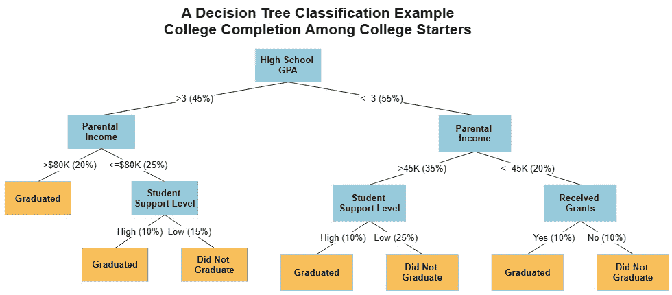
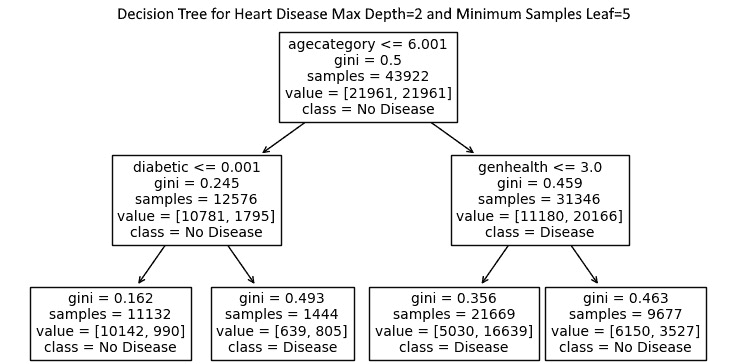
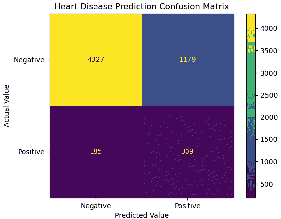
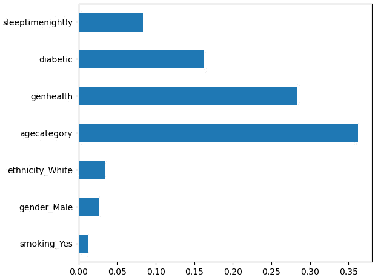

# 第十一章：*第十一章*：决策树和随机森林分类

决策树和随机森林是非常流行的分类模型。这部分的理由是它们易于训练和解释。它们也非常灵活。我们可以建模复杂性，而无需必然增加特征空间或转换特征。我们甚至不需要对多类问题应用算法做任何特殊处理，这是我们在逻辑回归中必须做的。

另一方面，决策树可能不如其他分类模型稳定，对训练数据中的微小变化相当敏感。当存在显著的类别不平衡（一个类别的观测值比另一个类别多得多）时，决策树也可能存在偏差。幸运的是，这些问题可以通过诸如袋装法来减少方差和过采样来处理不平衡的技术来解决。我们将在本章中探讨这些技术。

在本章中，我们将涵盖以下主题：

+   关键概念

+   决策树模型

+   实现随机森林

+   实现梯度提升

# 技术要求

除了我们迄今为止一直在使用的 scikit-learn 模块之外，我们还将使用来自 Imbalanced-learn 的 SMOTENC。我们将使用 SMOTENC 来解决类别不平衡问题。可以使用`pip install -U imbalanced-learn`命令安装 Imbalanced-learn 库。本章中的所有代码都使用 scikit-learn 版本 0.24.2 和 1.0.2 进行了测试。

# 关键概念

决策树是一个非常有用的机器学习工具。它们是非参数的，易于解释，并且可以处理各种类型的数据。不假设特征与目标之间关系的线性，也不假设误差项的正态性。甚至不需要对数据进行缩放。决策树还经常能够很好地捕捉预测变量和目标之间的复杂关系。

决策树算法的灵活性和其建模数据中复杂和未预见的关联的能力，归功于用于分割数据的**递归分割**过程。决策树根据其特征值对观测值进行分组。这是通过一系列二进制决策来完成的，从根节点处的初始分割开始，以每个分组的叶子节点结束。每个分割都是基于提供关于目标最多信息的特征和特征值。更精确地说，分割的选择基于它是否产生最低的 Gini 不纯度得分。我们将在稍后更详细地讨论 Gini 不纯度。

沿着从根节点到叶子的分支，具有相同值或相同值范围的全部新观测值，都会得到相同的预测目标值。当目标是分类时，这就是该叶子节点训练观测值中目标的最频繁值。

以下图表提供了一个相当直接的决策树示例，其中包含虚构的数据和大学完成情况模型的结果。对于这个决策树，通过高中学业成绩将那些成绩在 3.0 或以下和成绩高于 3.0 的人分开，发现与其他可用特征以及其他阈值相比，这种初始分割会导致最低的不纯度。因此，高中学业成绩是我们的根节点，也称为深度 0：



图 11.1 – 完成大学教育的决策树

根节点处的二分分割导致树左侧的观测值占 45%，右侧的占 55%。在深度 1，两侧都有基于父母收入的二分分割，尽管阈值不同；左侧为$80k，右侧为$45k。对于高中学业成绩大于 3 且父母收入高于$80k 的情况，没有更多的分割。在这里，我们得到了**毕业**的预测。这是一个叶子节点。

我们可以从每个叶子节点向上导航树，描述树是如何分割数据的，就像我们对父母收入高于$80k 和高中学业成绩高于 3.0 的个人所做的那样。例如，决策树预测那些从学校获得低水平支持、父母收入超过$45k 和高中学业成绩低于或等于 3 的个人不会毕业。

那么，决策树算法是如何施展这种魔法的？它是如何选择特征和阈值或类值的？为什么是父母收入大于$80k 或$45k？为什么对于父母收入低于或等于$45k 的情况，在深度 2（分割 3）处收到补助，而对于其他叶子节点的深度 2 则是学生支持水平？甚至有一个叶子节点在深度 2 都没有进一步的分割。

一种衡量二分分割对类信息提供的信息的方法是它帮助我们区分类内和类外成员资格的程度。我们经常使用基尼不纯度计算来进行这种评估，尽管有时也使用熵。基尼不纯度统计量告诉我们每个节点上类成员资格分割得有多好。这可以在以下公式中看到：


在这里，是属于*k*类和*m*个类的概率，而*m*是类的数量。如果一个节点上的类成员资格相等，那么基尼不纯度为 0.5。当完全纯净时，它为 0。

尝试手动计算 Gini 不纯度可能会有所帮助，以更好地理解它是如何工作的。我们可以为以下图中显示的非常简单的决策树做这件事。这里只有两个叶节点——一个是为高中 GPA 大于 3 的个人，另一个是为高中 GPA 小于或等于 3 的个人。 （再次强调，这些计数是为了说明目的而编造的。我们假设*图 11.1*中使用的百分比是基于 100 人中的计数。）请看以下图表：


图 11.2 - 具有一个分割和 Gini 不纯度计算的决策树

根据这个模型，对于 GPA 高的个人，**Graduated**会被预测，因为其中大多数，45 人中的 40 人，都毕业了。Gini 不纯度相对较低，这是好的。我们可以使用前面的公式计算该节点的 Gini 不纯度：


我们的模型会预测高中 GPA 小于或等于 3 的个人**未毕业**，因为这些人中的大多数都没有从大学毕业。然而，这里的纯度要低得多。该节点的 Gini 不纯度值如下：


决策树算法计算从给定点开始的所有可能分割的 Gini 不纯度值的加权总和，并选择得分最低的分割。如果使用熵而不是 Gini 不纯度，算法将遵循类似的过程。在本章中，我们将使用 scikit-learn 的**分类和回归树**（**CART**）算法来构建决策树。该工具默认使用 Gini 不纯度，尽管我们可以让它使用熵。

决策树是我们所说的贪婪学习器。算法选择在当前级别给出最佳 Gini 不纯度或熵得分的分割。它不会检查该选择如何影响随后可用的分割，也不会基于该信息重新考虑当前级别的选择。这使得算法比其他情况下更有效率，但它可能不会提供全局最优解。

决策树的主要缺点是它们的方差高。它们可能会过度拟合训练数据中的异常观测值，因此在新数据上表现不佳。根据我们数据的特点，我们每次拟合决策树时都可能得到一个非常不同的模型。我们可以使用集成方法，如 bagging 或随机森林，来解决这个问题。

## 使用随机森林进行分类

随机森林，可能不会令人惊讶，是一系列决策树的集合。但这并不能区分随机森林和自助聚合（通常称为 bagging）。Bagging 通常用于减少具有高方差的机器学习算法（如决策树）的方差。使用 bagging，我们从数据集中生成随机样本，比如说 100 个。然后，我们在每个样本上运行我们的模型，例如决策树分类器，并对预测进行平均。

然而，使用 bagging 生成的样本可能存在相关性，并且产生的决策树可能有很多相似之处。这种情况在只有少数特征可以解释大部分变化时更为可能。随机森林通过限制每个分割可以选定的特征数量来解决这一问题。对于决策树分类模型的一个好的经验法则是取可用特征数的平方根来确定要使用的特征数。例如，如果有 25 个特征，我们会在每个分割中使用 5 个。

让我们更精确地描述构建随机森林所涉及的步骤：

1.  从训练数据中随机采样实例（样本具有与原始数据集相同的观测数。）

1.  随机选择样本中的特征（每次选择的好数量是可用特征总数的平方根。）

1.  从*步骤 2*中随机选择的特征中确定一个特征，分割会导致具有最大纯度的节点。

1.  **内部循环**：重复执行*步骤 2*和*步骤 3*，直到构建出一个决策树。

1.  **外部循环**：重复所有步骤，包括内部循环，直到创建出所需数量的树。所有树的结果由投票决定；也就是说，基于所有树对于给定特征值的最高频率类别标签来预测类别。

这个过程的另一个有趣副作用是它为我们生成了测试数据。所谓的自助抽样过程——即带替换的抽样——会导致许多实例被排除在一个或多个树之外，通常多达三分之一。这些实例，被称为**袋外**样本，可以用来评估模型。

基于许多不相关的决策树进行分类预测，对方差（降低它！）有积极的影响，这是你可以预期的。随机森林模型通常比决策树模型更具泛化能力。它们不太容易过拟合，也不太可能被异常数据所影响。但这也带来了一定的代价。构建一百个或更多的决策树比只构建一个需要更多的系统资源。我们也失去了决策树易于解释的优点；解释每个特征的重要性变得更加困难。

## 使用梯度提升决策树

从概念上讲，梯度提升决策树与随机森林相似。它们依赖于多个决策树来提高模型性能。但它们是顺序执行的，每个树都从前一个树学习。每个新的树都从前一个迭代的残差开始工作。

梯度提升决策树的学习速率由*ɑ*超参数决定。你可能想知道为什么我们不希望我们的模型尽可能快地学习。更快的学习速率更有效率，对系统资源的消耗也更少。然而，我们可以通过降低学习速率构建一个更具泛化能力的模型。过度拟合的风险更小。最佳学习速率最终是一个经验问题。我们需要进行一些超参数调整来找到它。我们将在本章的最后部分进行这项工作。

正如随机森林的情况一样，我们可以通过进行二元分类问题的步骤来提高我们对梯度提升的直觉：

1.  根据样本中目标变量的平均值对目标进行初步预测。对于二元目标，这是一个比例。将此预测分配给所有观测值。（我们在这里使用类别成员概率的对数。）

1.  计算每个实例的残差，对于类内实例，将是 1 减去初始预测，对于类外实例，是 0 减去预测，或-预测。

1.  构建一个决策树来预测残差。

1.  基于决策树模型生成新的预测。

1.  根据新的预测（按学习率缩放）调整每个实例的先前预测。如前所述，我们使用学习率是因为我们不希望预测移动得太快。

1.  如果未达到最大树的数量或残差非常小，则回退到*步骤 3*。

虽然这是梯度提升工作原理的简化解释，但它确实为我们提供了算法所做工作的良好感觉。希望这也有助于你理解为什么梯度提升变得如此受欢迎。该算法反复调整以适应先前错误，但这样做相对高效，并且比单独的决策树有更小的过度拟合风险。

在本章的其余部分，我们将讨论决策树、随机森林和梯度提升的示例。我们将讨论如何调整超参数以及如何评估这些模型。我们还将讨论每种方法的优缺点。

# 决策树模型

在本章中，我们将再次使用心脏病数据。这将是一个很好的方法来比较我们的逻辑回归模型的结果与决策树等非参数模型的结果。按照以下步骤进行：

1.  首先，我们加载到目前为止一直在使用的相同库。新的模块是来自 scikit-learn 的`DecisionTreeClassifier`和来自 Imbalance Learn 的`SMOTENC`，这将帮助我们处理不平衡数据：

    ```py
    import pandas as pd
    import numpy as np
    from sklearn.model_selection import train_test_split
    from sklearn.preprocessing import OneHotEncoder
    from imblearn.pipeline import make_pipeline
    from sklearn.compose import ColumnTransformer
    from sklearn.model_selection import RandomizedSearchCV
    from imblearn.over_sampling import SMOTENC
    from sklearn.tree import DecisionTreeClassifier, plot_tree
    from scipy.stats import randint
    import sklearn.metrics as skmet
    import os
    import sys
    sys.path.append(os.getcwd() + "/helperfunctions")
    from preprocfunc import MakeOrdinal,\
      ReplaceVals
    ```

1.  让我们加载心脏病数据。我们将把我们的目标`heartdisease`转换为`0`和`1`的整数。我们不会重复之前章节中从数据中生成的频率和描述性统计信息。如果你没有完成*第十章*，*逻辑回归*，快速查看它们可能是有帮助的：

    ```py
    healthinfo = pd.read_csv("data/healthinfosample.csv")
    healthinfo.set_index("personid", inplace=True)
    healthinfo.heartdisease.value_counts()
    No     27467
    Yes     2533
    Name: heartdisease, dtype: int64
    healthinfo['heartdisease'] = \
      np.where(healthinfo.heartdisease=='No',0,1).\
      astype('int')
    healthinfo.heartdisease.value_counts()
    0    27467
    1     2533
    Name: heartdisease, dtype: int64
    ```

注意类别不平衡。不到 10%的观察结果患有心脏病。我们将在模型中处理这个问题。

1.  让我们再看看年龄类别特征的值，因为它有点不寻常。它包含年龄范围的字符数据。我们将使用我们加载的`MakeOrdinal`类将其转换为有序特征。例如，`18-24`的值将给我们一个`0`的值，而`50-54`的值在转换后将变为`6`：

    ```py
    healthinfo.agecategory.value_counts().\
      sort_index().reset_index()
              index  agecategory
    0         18-24         1973
    1         25-29         1637
    2         30-34         1688
    3         35-39         1938
    4         40-44         2007
    5         45-49         2109
    6         50-54         2402
    7         55-59         2789
    8         60-64         3122
    9         65-69         3191
    10        70-74         2953
    11        75-79         2004
    12  80 or older         2187
    ```

1.  我们应该按数据类型组织我们的特征，这样将使一些任务更容易。我们还将设置一个字典来重新编码`genhealth`和`diabetic`特征：

    ```py
    num_cols = ['bmi','physicalhealthbaddays',
       'mentalhealthbaddays','sleeptimenightly']
    binary_cols = ['smoking','alcoholdrinkingheavy',
      'stroke','walkingdifficult','physicalactivity',
      'asthma','kidneydisease','skincancer']
    cat_cols = ['gender','ethnicity']
    spec_cols1 = ['agecategory']
    spec_cols2 = ['genhealth','diabetic']
    rep_dict = {
      'genhealth': {'Poor':0,'Fair':1,'Good':2,
        'Very good':3,'Excellent':4},
      'diabetic': {'No':0,
        'No, borderline diabetes':0,'Yes':1,
        'Yes (during pregnancy)':1}           
    }
    ```

1.  现在，让我们创建训练和测试数据框：

    ```py
    X_train, X_test, y_train, y_test =  \
      train_test_split(healthinfo[num_cols + 
        binary_cols + cat_cols + spec_cols1 +
        spec_cols2],\
      healthinfo[['heartdisease']], test_size=0.2,
        random_state=0)
    ```

1.  接下来，我们将设置列转换。我们将使用我们的自定义类将`agecategory`特征编码为有序，并将`genhealth`和`diabetic`的特征的字符值替换为数值。

我们不会转换数值列，因为在使用决策树时通常不需要缩放这些特征。我们也不会担心异常值，因为决策树对它们的敏感性低于逻辑回归。我们将设置`remainder`为`passthrough`，以便转换器将剩余的列（数值列）原样通过：

```py
ohe = OneHotEncoder(drop='first', sparse=False)
spectrans1 = make_pipeline(MakeOrdinal())
spectrans2 = make_pipeline(ReplaceVals(rep_dict))
bintrans = make_pipeline(ohe)
cattrans = make_pipeline(ohe)
coltrans = ColumnTransformer(
  transformers=[
    ("bin", bintrans, binary_cols),
    ("cat", cattrans, cat_cols),
    ("spec1", spectrans1, spec_cols1),
    ("spec2", spectrans2, spec_cols2),
  ],
    remainder = 'passthrough'
)
```

1.  在运行模型之前，我们需要做一些工作。正如你将在下一步看到的，我们需要知道单变量编码器将返回多少个特征。同时，我们也应该获取新的特征名称。我们稍后还需要它们。（我们只需要对数据的一个小随机样本进行列转换器拟合即可。）看看下面的代码：

    ```py
    coltrans.fit(X_train.sample(1000))
    new_binary_cols = \
      coltrans.\
      named_transformers_['bin'].\
      named_steps['onehotencoder'].\
      get_feature_names(binary_cols)
    new_cat_cols = \
      coltrans.\
      named_transformers_['cat'].\
      named_steps['onehotencoder'].\
      get_feature_names(cat_cols)
    ```

1.  让我们查看特征名称：

    ```py
    new_cols = np.concatenate((new_binary_cols, 
      new_cat_cols, np.array(spec_cols1 + spec_cols2 +
      num_cols)))
    new_cols
    array(['smoking_Yes', 'alcoholdrinkingheavy_Yes',
           'stroke_Yes', 'walkingdifficult_Yes',
           'physicalactivity_Yes', 'asthma_Yes',
           'kidneydisease_Yes', 'skincancer_Yes',
           'gender_Male', 'ethnicity_Asian',
           'ethnicity_Black', 'ethnicity_Hispanic',
           'ethnicity_Other', 'ethnicity_White',
           'agecategory', 'genhealth', 'diabetic', 'bmi',
           'physicalhealthbaddays', 'mentalhealthbaddays',
           'sleeptimenightly'], dtype=object)
    ```

1.  在我们拟合决策树之前，我们需要处理我们的不平衡数据集。我们可以使用来自 Imbalanced-learn 的`SMOTENC`模块来对心脏病类别进行过采样。这将生成足够的心脏病类别的代表性实例，以平衡类别成员资格。

接下来，我们必须实例化一个决策树分类器，并指出叶子节点需要至少有五个观察结果，并且树的深度不能超过两个。然后，我们将使用列转换器转换训练数据并拟合模型。

我们将在本节稍后进行一些超参数调整。现在，我们只想生成一个易于解释和可视化的决策树。

`SMOTENC`需要知道哪些列是分类的。当我们设置列转换器时，我们首先编码二进制列，然后是分类列。因此，二进制列数加上分类列数给出了那些列索引的终点。然后，我们必须传递一个范围，从 0 开始，到分类列数结束，到`SMOTENC`的`categorical_features`参数。

现在，我们可以创建一个包含列转换、过采样和决策树分类器的管道，并对其进行拟合：

```py
catcolscnt = new_binary_cols.shape[0] + \
  new_cat_cols.shape[0]
smotenc = \
  SMOTENC(categorical_features=np.arange(0,catcolscnt),
  random_state=0)
dtc_example = DecisionTreeClassifier(
  min_samples_leaf=5, max_depth=2)
pipe0 = make_pipeline(coltrans, smotenc, dtc_example)
pipe0.fit(X_train, y_train.values.ravel())
```

注意

当我们担心我们的模型在捕捉一个类别的变化方面做得不好，因为我们有太多少的该类实例，相对于一个或多个其他类别时，过采样可以是一个好的选择。过采样会复制该类别的实例。

**合成少数过采样技术**（**SMOTE**）是一个使用 KNN 来复制实例的算法。本章中 SMOTE 的实现来自 Imbalanced-learn，特别是 SMOTENC，它可以处理分类数据。

当类不平衡比这个数据集更严重时，通常会进行过采样，比如 100 到 1。尽管如此，我认为在本章中演示如何使用 SMOTE 和类似工具是有帮助的。

1.  运行拟合后，我们可以查看哪些特征被识别为重要。`agecategory`、`genhealth`和`diabetic`是此简单模型中的重要特征：

    ```py
    feature_imp = \
      pipe0.named_steps['decisiontreeclassifier'].\
      tree_.compute_feature_importances(normalize=False)
    feature_impgt0 = feature_imp>0
    feature_implabs = np.column_stack((feature_imp.\
      ravel(), new_cols))
    feature_implabs[feature_impgt0]
    array([[0.10241844433036575, 'agecategory'],
           [0.04956947743193013, 'genhealth'],
           [0.012777650193266089, 'diabetic']],
          dtype=object)
    ```

1.  接下来，我们可以生成决策树的图形：

    ```py
    plot_tree(pipe0.named_steps['decisiontreeclassifier'],
      feature_names=new_cols, 
      class_names=['No Disease','Disease'], fontsize=10)
    ```

这会产生以下图形：



图 11.3 – 以心脏病为目标的心脏病决策树示例

初始的二分分割，在根节点（也称为深度 0），是基于`agecategory`是否小于或等于`6`。 (回想一下，`agecategory`最初是一个字符特征。编码后的初始值`50-54`得到`6`的值。) 如果根节点语句为真，它将导致下一级节点向左。如果语句为假，它将导致下一级节点向右。样本数是该节点到达的观察数。因此，`diabetic<=0.001`（即非糖尿病患者）节点上的样本值`12576`反映了从父节点中得到的语句为真的实例数；也就是说，有`12576`个实例的年龄类别值小于或等于`6`。

每个节点内的`value`列表给我们提供了训练数据中每个类别的实例。在这种情况下，第一个值是无疾病观察值的计数。第二个值是有心脏病观察值的计数。例如，在`diabetic<=0.001`节点上，有`10781`个无疾病观察值和`1795`个疾病观察值。

决策树在叶子模式下预测最频繁的类别。因此，这个模型会预测 54 岁或以下且不是糖尿病患者的个体没有疾病（`agecategory<=6`和`diabetic<=0.001`）。在训练数据中，该组有`10142`个无疾病观察结果，`990`个疾病观察结果。这给我们一个具有非常好的基尼不纯度`0.162`的叶子节点。

如果一个人有糖尿病，即使他们 54 岁或以下，我们的模型也会预测心脏病。然而，这种预测并不那么确定。基尼不纯度为`0.493`。相比之下，预测 54 岁以上（`agecategory<=6.001`为假）且健康状况不佳（`genhealth<=3.0`）的个体的疾病，其基尼不纯度显著较低。

我们的模型预测 54 岁以上且一般健康状况等于`4`的人没有疾病。（当我们进行列转换时，我们将一般健康状况值`Excellent`编码为`4`。）然而，较差的基尼不纯度分数表明，我们的模型并不完全有信心做出那个预测。

1.  让我们看看这个模型的某些指标。该模型有不错的敏感性，但不是很好，大约 70%的时间预测有心脏病。当我们做出积极预测时，精确度相当低。只有 19%的时间我们做出的积极预测是正确的：

    ```py
    pred = pipe0.predict(X_test)
    print("accuracy: %.2f, sensitivity: %.2f, specificity: %.2f, precision: %.2f"  %
      (skmet.accuracy_score(y_test.values.ravel(), pred),
      skmet.recall_score(y_test.values.ravel(), pred),
      skmet.recall_score(y_test.values.ravel(), pred,
        pos_label=0),
      skmet.precision_score(y_test.values.ravel(), pred)))
    accuracy: 0.72, sensitivity: 0.70, specificity: 0.73, precision: 0.19
    ```

这个模型在超参数方面做出了一些相当随意的决定，将最大深度设置为`2`，并将叶子的最小样本数设置为`5`。我们应该探索这些超参数的替代值，以获得性能更好的模型。让我们进行随机网格搜索以找到这些值。

1.  让我们设置一个包含列转换、过采样和决策树分类器的管道。我们还将创建一个包含最小叶子大小和最大树深度超参数范围的字典。请注意，对于每个字典键，`decisiontreeclassifier`后面有两个下划线：

    ```py
    dtc = DecisionTreeClassifier(random_state=0)
    pipe1 = make_pipeline(coltrans, smotenc, dtc)
    dtc_params = {
     'decisiontreeclassifier__min_samples_leaf': randint(100, 1200),
     'decisiontreeclassifier__max_depth': randint(2, 11)
    }
    ```

1.  现在，我们可以运行随机网格搜索。我们将运行 20 次迭代以测试我们超参数的多个值：

    ```py
    rs = RandomizedSearchCV(pipe1, dtc_params, cv=5,
      n_iter=20, scoring="roc_auc")
    rs.fit(X_train, y_train.values.ravel())
    rs.best_params_
    {'decisiontreeclassifier__max_depth': 9,
     'decisiontreeclassifier__min_samples_leaf': 954}
    rs.best_score_
    0.7964540832005679
    ```

1.  让我们看看每次迭代的得分：

    ```py
    results = \
      pd.DataFrame(rs.cv_results_['mean_test_score'], \
        columns=['meanscore']).\
      join(pd.DataFrame(rs.cv_results_['params'])).\
      sort_values(['meanscore'], ascending=False).\
      rename(columns=\
        {'decisiontreeclassifier__max_depth':'maxdepth',
         'decisiontreeclassifier__min_samples_leaf':\
         'samples'})
    ```

这产生了以下输出。表现最好的模型与我们之前构建的模型相比，`max_depth`有显著增加。我们的模型在叶子中每个叶子的最小实例数也更高：

```py
    meanscore  maxdepth  samples
15      0.796         9      954
13      0.796         8      988
4       0.795         7      439
19      0.795         9      919
12      0.794         9      856
3       0.794         9      510
2       0.794         9     1038
5       0.793         8      575
0       0.793        10     1152
10      0.793         7     1080
6       0.793         6     1013
8       0.793        10      431
17      0.793         6      896
14      0.792         6      545
16      0.784         5      180
1       0.778         4      366
11      0.775         4      286
9       0.773         4      138
18      0.768         3      358
7       0.765         3      907 
```

1.  让我们生成一个混淆矩阵：

    ```py
    pred2 = rs.predict(X_test)
    cm = skmet.confusion_matrix(y_test, pred2)
    cmplot = \
      skmet.ConfusionMatrixDisplay(confusion_matrix=cm,
      display_labels=['Negative', 'Positive'])
    cmplot.plot()
    cmplot.ax_.\
      set(title='Heart Disease Prediction Confusion Matrix', 
      xlabel='Predicted Value', ylabel='Actual Value') 
    ```

这产生了以下图表：



图 11.4 – 决策树模型的冠心病混淆矩阵

这张图你可能立刻注意到的一个问题是我们的精确度有多低。绝大多数时间我们预测为阳性，我们都是错误的。

1.  让我们查看准确率、灵敏度、特异性和精确度分数，看看模型在没有超参数调整的情况下，这些指标是否有很大改进。我们在灵敏度上表现明显更差，现在为 63%，而之前为 70%。然而，我们在特异性上做得稍微好一些。我们现在在测试数据上正确预测负面的概率为 79%，而之前的模型为 73%：

    ```py
    print("accuracy: %.2f, sensitivity: %.2f, specificity: %.2f, precision: %.2f"  %
      (skmet.accuracy_score(y_test.values.ravel(), pred2),
       skmet.recall_score(y_test.values.ravel(), pred2),
       skmet.recall_score(y_test.values.ravel(), pred2,
         pos_label=0),
       skmet.precision_score(y_test.values.ravel(), 
         pred2)))
    accuracy: 0.77, sensitivity: 0.63, specificity: 0.79, precision: 0.21
    ```

决策树是分类模型的良好起点。它们对底层数据几乎没有假设，并且不需要太多的预处理。注意，在这个例子中我们没有进行任何缩放或异常值检测，因为在决策树中这通常不是必要的。我们还得到一个相当容易理解或解释的模型，只要我们限制深度数量。

我们通常可以通过随机森林来提高我们的决策树模型的性能，原因我们在本章开头已经讨论过。一个关键的原因是，当使用随机森林而不是决策树时，方差会降低。

在下一节中，我们将探讨随机森林。

# 实现随机森林

让我们尝试使用随机森林来提高我们的心脏病模型：

1.  首先，让我们加载与上一节相同的库，但这次我们将导入随机森林分类器：

    ```py
    import pandas as pd
    import numpy as np
    from imblearn.pipeline import make_pipeline
    from sklearn.ensemble import RandomForestClassifier
    from sklearn.model_selection import RandomizedSearchCV
    from scipy.stats import randint
    import sklearn.metrics as skmet
    import os
    import sys
    sys.path.append(os.getcwd() + "/helperfunctions")
    import healthinfo as hi
    ```

我们还加载了`healthinfo`模块；它加载健康信息数据并执行我们的预处理。这里没有太多花哨的东西。我们之前步骤中使用的预处理代码只是复制到了当前工作目录的`helperfunctions`子文件夹中。

1.  现在，让我们获取由`healthinfo`模块处理过的数据，以便我们可以使用它来为我们的随机森林分类器：

    ```py
    X_train = hi.X_train
    X_test = hi.X_test
    y_train = hi.y_train
    y_test = hi.y_test
    ```

1.  让我们实例化一个随机森林分类器并为网格搜索创建一个管道。我们还将创建一个用于搜索的超参数字典。除了我们用于决策树的`max_depth`和`min_samples_leaf`超参数外，随机森林的一个重要超参数是`n_estimators`。这表示用于该搜索迭代的树的数量。我们还将添加`entropy`作为标准，除了我们迄今为止使用的`gini`：

    ```py
    rfc = RandomForestClassifier(random_state=0)
    pipe1 = make_pipeline(hi.coltrans, hi.smotenc, rfc)
    rfc_params = {
     'randomforestclassifier__min_samples_leaf':
        randint(100, 1200),
     'randomforestclassifier__max_depth': 
        randint(2, 11),
     'randomforestclassifier__n_estimators': 
        randint(100, 3000),
     'randomforestclassifier__criterion': 
        ['gini','entropy']
    }
    rs = RandomizedSearchCV(pipe1, rfc_params, cv=5, 
      n_iter=20, scoring="roc_auc")
    rs.fit(X_train, y_train.values.ravel())
    ```

1.  我们可以使用随机网格搜索对象的`best_params_`和`best_score_`属性来找到最佳参数和相应的分数。最佳模型有`1023`棵树和最大深度为`9`。

在这里，我们可以看到`roc_auc`分数相对于上一节中的决策树模型有所提高：

```py
rs.best_params_
{'randomforestclassifier__criterion': 'gini',
 'randomforestclassifier__max_depth': 9,
 'randomforestclassifier__min_samples_leaf': 667,
 'randomforestclassifier__n_estimators': 1023}
rs.best_score_
0.8210934290375318
```

1.  随机森林的结果比单个决策树的结果更难以解释，但一个好的起点是查看特征重要性。前三个特征与我们在决策树中看到的是相同的——即`agecategory`、`genhealth`和`diabetic`：

    ```py
    feature_imp = \
      rs.best_estimator_['randomforestclassifier'].\
      feature_importances_
    feature_implabs = np.column_stack((feature_imp.\
      ravel(), hi.new_cols))
    pd.DataFrame(feature_implabs,
      columns=['importance','feature']).\
      sort_values(['importance'], ascending=False)
             importance       feature
    14       0.321            agecategory
    15       0.269            genhealth
    16       0.159            diabetic
    13       0.058            ethnicity_White
    0        0.053            smoking_Yes
    18       0.033            physicalhealthbaddays
    8        0.027            gender_Male
    3        0.024            walkingdifficult_Yes
    20       0.019            sleeptimenightly
    11       0.010            ethnicity_Hispanic
    17       0.007            bmi
    19       0.007            mentalhealthbaddays
    1        0.007            alcoholdrinkingheavy_Yes
    5        0.003            asthma_Yes
    10       0.002            ethnicity_Black
    4        0.001            physicalactivity_Yes
    7        0.001            skincancer_Yes
    2        0.000            stroke_Yes
    6        0.000            kidneydisease_Yes
    9        0.000            ethnicity_Asian
    12       0.000            ethnicity_Other
    ```

1.  让我们看看一些指标。与先前的模型相比，敏感性有所提高，但在其他任何指标上都没有太大变化。我们保持了相同的相对良好的特异性分数。总体而言，这是我们迄今为止最好的模型：

    ```py
    print("accuracy: %.2f, sensitivity: %.2f, specificity: %.2f, precision: %.2f"  %
      (skmet.accuracy_score(y_test.values.ravel(), pred),
      skmet.recall_score(y_test.values.ravel(), pred),
      skmet.recall_score(y_test.values.ravel(), pred,
        pos_label=0),
      skmet.precision_score(y_test.values.ravel(), pred)))
    accuracy: 0.77, sensitivity: 0.69, specificity: 0.78, precision: 0.22
    ```

我们可能仍然能够提高我们模型性能指标。我们至少应该尝试一些梯度提升。正如我们在本章的*使用梯度提升决策树*部分所讨论的，梯度提升决策树有时可能比随机森林产生更好的模型。这是因为每个树都是从先前树的错误中学习的。

# 实现梯度提升

在本节中，我们将尝试使用梯度提升来改进我们的随机森林模型。我们必须注意的一个问题是过拟合，这在梯度提升决策树中可能比在随机森林中更成问题。这是因为随机森林的树不会从其他树中学习，而梯度提升中，每个树都是基于先前树的学习的。我们在这里选择的超参数至关重要。让我们开始吧：

1.  我们将首先导入必要的库。我们将使用与随机森林相同的模块，但我们将从`ensemble`导入`GradientBoostingClassifier`而不是`RandomForestClassifier`：

    ```py
    import pandas as pd
    import numpy as np
    from imblearn.pipeline import make_pipeline
    from sklearn.model_selection import RandomizedSearchCV
    from sklearn.ensemble import GradientBoostingClassifier
    import sklearn.metrics as skmet
    from scipy.stats import uniform
    from scipy.stats import randint
    import matplotlib.pyplot as plt
    import os
    import sys
    sys.path.append(os.getcwd() + "/helperfunctions")
    import healthinfo as hi
    ```

1.  现在，让我们获取由`healthinfo`模块处理过的数据，用于我们的随机森林分类器：

    ```py
    X_train = hi.X_train
    X_test = hi.X_test
    y_train = hi.y_train
    y_test = hi.y_test
    ```

1.  接下来，我们将实例化一个梯度提升分类器实例，并将其添加到一个管道中，包括我们用于预处理健康数据的步骤（这些步骤在我们导入的模块中）。

我们将创建一个包含梯度提升分类器超参数的字典。这些包括熟悉的每个叶子的最小样本数、最大深度以及估计器的数量超参数。我们还将添加用于检查学习率的值：

```py
gbc = GradientBoostingClassifier(random_state=0)
pipe1 = make_pipeline(hi.coltrans, hi.smotenc, gbc)
gbc_params = {
 'gradientboostingclassifier__min_samples_leaf':
     randint(100, 1200),
 'gradientboostingclassifier__max_depth':
     randint(2, 20),
 'gradientboostingclassifier__learning_rate':
     uniform(loc=0.02, scale=0.25),
 'gradientboostingclassifier__n_estimators':
     randint(100, 1200)
}
```

1.  现在，我们准备进行网格搜索。（注意，这可能在您的机器上运行需要一些时间。）在我们运行的七次迭代中，最佳模型的学习率为`0.25`，估计器或树的数量为`308`。它有一个相当不错的`roc_auc`分数为`0.82`：

    ```py
    rs = RandomizedSearchCV(pipe1, gbc_params, cv=5, 
      n_iter=7, scoring="roc_auc")
    rs.fit(X_train, y_train.values.ravel())
    rs.best_params_
    {'gradientboostingclassifier__learning_rate': 0.2528,
     'gradientboostingclassifier__max_depth': 3,
     'gradientboostingclassifier__min_samples_leaf': 565,
     'gradientboostingclassifier__n_estimators': 308}
    rs.best_score_
    0.8162378796382679
    ```

1.  让我们看看特征重要性：

    ```py
    feature_imp = pd.Series(rs.\
      best_estimator_['gradientboostingclassifier'].\
      feature_importances_, index=hi.new_cols)
    feature_imp.loc[feature_imp>0.01].\
        plot(kind='barh')
    plt.tight_layout()    
    plt.title('Gradient Boosting Feature Importance')
    ```

这会产生以下图表：



图 11.5 – 梯度提升特征重要性

1.  让我们看看一些指标。有趣的是，我们得到了出色的准确性和特异性，但敏感性却非常糟糕。这可能是因为过拟合：

    ```py
    pred = rs.predict(X_test)
    print("accuracy: %.2f, sensitivity: %.2f, specificity: %.2f, precision: %.2f"  %
      (skmet.accuracy_score(y_test.values.ravel(), pred),
      skmet.recall_score(y_test.values.ravel(), pred),
      skmet.recall_score(y_test.values.ravel(), pred,
        pos_label=0),
      skmet.precision_score(y_test.values.ravel(), pred)))
    accuracy: 0.91, sensitivity: 0.19, specificity: 0.97, precision: 0.40
    ```

虽然我们的结果参差不齐，但梯度提升决策树通常是一个很好的分类模型选择。这尤其适用于我们正在建模特征与目标之间的复杂关系时。当决策树是一个合适的选择，但我们担心决策树模型的高方差时，梯度提升决策树至少与随机森林一样是一个好的选择。

现在，让我们总结一下本章学到的内容。

# 摘要

本章探讨了如何使用决策树来解决分类问题。尽管本章中的所有示例都涉及二元目标，但我们使用的算法也可以处理多类问题。与从逻辑回归到多项式逻辑回归的转变不同，当我们的目标值超过两个时，为了有效地使用这些算法，我们通常不需要做出太多改变。

我们探讨了两种处理决策树高方差的方法。一种方法是使用随机森林，这是一种袋装方法。这将减少我们预测中的方差。另一种方法是使用梯度提升决策树。提升可以帮助我们捕捉数据中的非常复杂的关系，但存在非平凡的过拟合风险。考虑到这一点，调整我们的超参数尤为重要。

在下一章中，我们将探讨另一个著名的分类算法：K 最近邻算法。
