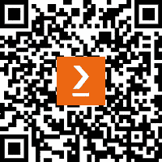

# 前言

在今天以数据驱动为核心的时代，每天以文本、图像、音频和视频等多种形式产生超过 2.5 万亿字节的数据，数据成为 AI 革命的基石。然而，大多数可用于训练监督机器学习模型的实际数据缺乏标签，或者我们遇到有限的标注数据。这构成了一个重大挑战，因为在生成 AI 时代，标注数据对于训练任何监督机器学习模型和微调大型语言模型至关重要。

为了解决标注数据的稀缺性，并促进为训练监督机器学习模型和微调大型语言模型准备标注数据，本书介绍了使用 Python 库和方法进行程序化数据标注的各种方法，包括半监督学习和无监督学习。

本书指导您使用各种 Python 库、OpenAI API、LangChain 和 Azure Machine Learning，加载和分析表格数据、图像、视频、音频和文本。它探讨了弱监督、伪标签和 K-means 聚类等技术，用于分类和标记，同时提供数据增强方法以提高准确性。利用 Azure OpenAI API 和 LangChain，本书展示了使用自然语言自动化数据分析的过程，无需具备任何编程技能。它还涵盖了使用 OpenAI 和**大型语言模型**（**LLMs**）对文本数据进行分类和标记的方法。本书涵盖了各种开源数据标注工具，以及 Azure Machine Learning，并比较了这些工具的优缺点。

本书结合了来自各个行业的真实案例，以说明这些方法在表格、文本、图像、视频和音频数据中的应用。

在本书结束时，您将掌握使用 Python 和 OpenAI LLMs 探索不同类型数据的技能。您将学习如何准备带有标签的数据，无论是用于训练机器学习模型还是为了从数据中提取洞察力，以用于跨行业的商业用例。

# 本书面向对象

本书面向希望了解数据标注方法和模型训练算法的 AI 工程师、机器学习工程师、数据科学家和数据工程师。数据爱好者以及 Python 开发者可以利用本书学习使用 Python 库进行数据探索和标注。

# 本书涵盖内容

*第一章*，*探索机器学习数据*，概述了使用各种 Python 库进行数据分析和方法可视化的方法。此外，它深入探讨了使用 OpenAI LLMs 通过自然语言解锁数据洞察的方法。

*第二章*, *为分类标注数据*，涵盖了为训练分类模型标注表格数据的过程。探讨了各种方法，如 Snorkel Python 函数，半监督学习，以及使用 K-means 聚类进行数据聚类。

*第三章*, *为回归标注数据*，讨论了为训练回归模型标注表格数据。技术包括利用汇总统计，创建伪标签，采用数据增强方法，以及利用 K-means 聚类。

*第四章*, *探索图像数据*，涵盖了使用各种 Python 库对图像数据的分析和可视化，以及从图像中提取特征。

*第五章*, *使用规则标注图像数据*，讨论了基于启发式和图像属性（如宽高比）标注图像，以及使用预训练分类器（如 YOLO）进行图像分类。

*第六章*, *使用数据增强标注图像数据*，探讨了用于训练支持向量机和卷积神经网络（CNNs）的图像数据增强方法，以及图像数据标注。

*第七章**,* *标注文本数据*，涵盖了生成式 AI 以及标注文本数据的各种方法。这包括 Azure OpenAI 的实际用例，使用 Snorkel 和 K-means 聚类进行文本分类和情感分析。

*第八章*, *探索视频数据*，专注于加载视频数据，提取特征，可视化视频数据，以及使用 K-means 聚类对视频数据进行聚类。

*第九章*, *标注视频数据*，深入探讨了使用 CNN 标注视频数据，使用分水岭算法分割视频数据，使用自动编码器捕获重要特征，并辅以实际案例。

*第十章*, *探索音频数据*，提供了音频数据的基础知识，包括加载和可视化音频数据，提取特征，以及音频数据的实际应用。

*第十一章*, *标注音频数据*，涵盖了使用 OpenAI 的 Whisper 模型转录音频数据，标注转录内容，为音频数据分类创建频谱图，增强音频数据，以及使用 Azure 认知服务进行语音处理。

*第十二章*, *动手探索数据标注工具*，涵盖了各种数据标注工具，包括开源工具如 Label Studio、CVAT、pyOpenAnnotate 和 Azure 机器学习。还包括对图像、文本、音频和视频数据标注工具的比较。

# 要充分利用本书

基础 Python 知识对充分利用本书内容有益，但并非必需。

| **本书涵盖的软件/硬件** | **操作系统要求** |
| --- | --- |
| Python 3.9+ | Windows、macOS 或 Linux |
| Azure OpenAI 订阅 |
| ECMAScript 11 |

**如果您正在使用本书的数字版，我们建议您亲自输入代码或从本书的 GitHub 仓库（下一节中提供链接）获取代码。这样做将帮助您避免与代码的复制和粘贴相关的任何潜在错误** **。**

# 下载示例代码文件

您可以从 GitHub 下载本书的示例代码文件，网址为[`github.com/PacktPublishing/Data-Labeling-in-Machine-Learning-with-Python`](https://github.com/PacktPublishing/Data-Labeling-in-Machine-Learning-with-Python)。如果代码有更新，它将在 GitHub 仓库中更新。

我们还有其他来自我们丰富的图书和视频目录的代码包，可在[`github.com/PacktPublishing/`](https://github.com/PacktPublishing/)找到。查看它们吧！

# 使用的约定

本书使用了多种文本约定。

`文本中的代码`：表示文本中的代码单词、数据库表名、文件夹名、文件名、文件扩展名、路径名、虚拟 URL、用户输入和 Twitter 昵称。以下是一个示例：“现在让我们通过调用`noise`、`scale`和`rotation`增强函数来生成增强数据，如下所示。”

代码块设置如下：

```py
# Train a linear regression model on the labeled data
regressor = LinearRegression()
regressor.fit(train_data, train_labels)
```

当我们希望您注意代码块中的特定部分时，相关的行或项目将以粗体显示：

```py
news_headline="Label the following news headline into 1 of the following categories: Business, Tech, Politics, Sport, Entertainment\n\n Headline 1: Trump is ready to contest in nov 2024 elections\nCategory:",
response = openai.Completion.create(
engine=model_deployment_name,
prompt= news_headline,
temperature=0,
```

任何命令行输入或输出都应如下所示：

```py
pip install keras
```

**粗体**：表示新术语、重要单词或您在屏幕上看到的单词。例如，菜单或对话框中的单词以**粗体**显示。以下是一个示例：“更改**系统偏好设置** | **安全和隐私** | **常规**，然后选择**打开方式**。”

小贴士或重要提示

看起来是这样的。

# 联系我们

我们始终欢迎读者的反馈。

**一般反馈**：如果您对本书的任何方面有疑问，请通过 mailto:customercare@packtpub.com 给我们发邮件，并在邮件主题中提及书名。

**勘误表**：尽管我们已经尽最大努力确保内容的准确性，但错误仍然可能发生。如果您在这本书中发现了错误，我们将不胜感激，如果您能向我们报告，我们将不胜感激。请访问[www.packtpub.com/support/errata](http://www.packtpub.com/support/errata)并填写表格。

**盗版**：如果您在互联网上以任何形式遇到我们作品的非法副本，我们将不胜感激，如果您能提供位置地址或网站名称，我们将不胜感激。请通过 mailto:copyright@packt.com 与我们联系，并提供材料的链接。

**如果您有兴趣成为作者**：如果您在某个主题上具有专业知识，并且您有兴趣撰写或为本书做出贡献，请访问[authors.packtpub.com](http://authors.packtpub.com)

# 分享您的想法

一旦您阅读了*使用 Python 进行机器学习和人工智能数据标注*，我们非常乐意听听您的想法！请[点击此处直接进入此书的亚马逊评论页面](https://packt.link/r/1-804-61054-2)并分享您的反馈。

您的评论对我们和科技社区都非常重要，并将帮助我们确保我们提供高质量的内容。

# 下载本书的免费 PDF 副本

感谢您购买此书！

您喜欢在路上阅读，但无法随身携带您的印刷书籍吗？

您的电子书购买是否与您选择的设备不兼容？

别担心，现在，每购买一本 Packt 书籍，您都可以免费获得该书的 DRM 免费 PDF 版本。

在任何地方、任何设备上阅读。直接从您最喜欢的技术书籍中搜索、复制和粘贴代码到您的应用程序中。

优惠远不止于此，您还可以获得独家折扣、时事通讯以及每天收件箱中的优质免费内容。

按照以下简单步骤获取这些好处：

1.  扫描二维码或访问以下链接



[`packt.link/free-ebook/9781804610541`](https://packt.link/free-ebook/9781804610541)

2. 提交您的购买证明

3. 就这样！我们将直接将您的免费 PDF 和其他优惠发送到您的电子邮件

# 第一部分：表格数据标注

本书本部分将指导您探索表格数据，并使用 Python 库（如 Snorkel 标注函数）编程标注数据。您将能够做到这一点，而无需任何先前的数据科学知识。此外，它还涵盖了使用 K-means 聚类的数据标注。

本部分包括以下章节：

+   *第一章*, *探索机器学习中的数据*

+   *第二章*, *分类数据标注*

+   *第三章*, *回归数据标注*
