# 第一章：探索机器学习中的数据

想象一下踏上一次穿越浩瀚数据海洋的旅程，在这个广阔的海洋中，有无数的故事、模式和洞察等待被发现。欢迎来到机器学习（**ML**）中的数据探索世界。在本章中，我鼓励你们戴上分析的眼镜，开始一段激动人心的探险。在这里，我们将深入数据的内心，凭借强大的技术和启发式方法，揭示其秘密。当你开始这段冒险时，你会发现，在原始数字和统计数据之下，存在着一个宝藏般的模式，一旦揭示，就能将你的数据转化为有价值的资产。这次旅程从**探索性数据分析**（**EDA**）开始，这是一个至关重要的阶段，我们在这里揭开数据的神秘面纱，为自动标记和最终构建更智能、更准确的机器学习模型奠定基础。在**生成式人工智能**时代，准备高质量的训练数据对于特定领域的**大型语言模型（LLMs）**的微调至关重要。微调涉及为公开可用的 LLMs 收集额外的特定领域标记数据。所以，系好安全带，准备开始一段引人入胜的旅程，探索数据探索的艺术和科学，特别是针对**数据标记**。

首先，让我们从问题开始：什么是数据探索？这是数据分析的初始阶段，其中对原始数据进行检查、可视化和总结，以揭示模式、趋势和洞察。它在应用高级分析或机器学习技术之前，理解数据的本质方面起着至关重要的作用。

在本章中，我们将使用 Python 中的各种库和包来探索表格数据，包括 Pandas、NumPy 和 Seaborn。我们还将绘制不同的条形图和直方图来可视化数据，以找到各种特征之间的关系，这对于数据标记很有用。我们将探索本书 GitHub 仓库中（位于*技术要求*部分）的*Income*数据集。为了定义业务规则、识别匹配模式，并随后使用 Python 标记函数标记数据，对数据的良好理解是必要的。

到本章结束时，我们将能够为给定数据集生成摘要统计。我们将为每个目标组推导特征的聚合。我们还将学习如何对给定数据集中的特征进行单变量和多变量分析。我们将使用 `ydata-profiling` 库创建一份报告。

我们将涵盖以下主要主题：

+   EDA 和数据标记

+   使用 Pandas 生成摘要统计和数据聚合

+   使用 Seaborn 进行单变量和多变量数据分析的可视化

+   使用 `ydata-profiling` 库进行数据概要分析

+   使用 OpenAI 和 LangChain 从数据中解锁洞察

# 技术要求

在运行本章中的笔记本之前，需要安装以下 Python IDE 和软件工具之一：

+   **Anaconda Navigator**：从以下 URL 下载并安装开源 Anaconda Navigator：

    [`docs.anaconda.com/navigator/install/#system-requirements`](https://docs.anaconda.com/navigator/install/#system-requirements)

+   **Jupyter Notebook**：下载并安装 Jupyter Notebook：

    [`jupyter.org/install`](https://jupyter.org/install)

+   我们还可以使用开源的在线 Python 编辑器，如**Google Colab** ([`colab.research.google.com/`](https://colab.research.google.com/))或**Replit** ([`replit.com/`](https://replit.com/))

本章中创建的 Python 源代码和整个笔记本都可在本书的 GitHub 仓库中找到：

[`github.com/PacktPublishing/Data-Labeling-in-Machine-Learning-with-Python`](https://github.com/PacktPublishing/Data-Labeling-in-Machine-Learning-with-Python)

您还需要创建一个 Azure 账户，并为使用生成式 AI 添加一个 OpenAI 资源。要注册免费的 Azure 订阅，请访问[`azure.microsoft.com/free`](https://azure.microsoft.com/free)。要申请访问 Azure OpenAI 服务，请访问[`aka.ms/oaiapply`](https://aka.ms/oaiapply)。

一旦您已配置 Azure OpenAI 服务，请从 Azure OpenAI Studio 部署 LLM 模型——无论是 GPT-3.5-Turbo 还是 GPT 4.0。然后从 OpenAI Studio 复制 OpenAI 的密钥，并设置以下环境变量：

```py
os.environ['AZURE_OPENAI_KEY'] = 'your_api_key'
os.environ['AZURE_OPENAI_ENDPOINT") ='your_azure_openai_endpoint'
```

您的端点应如下所示：[`YOUR_RESOURCE_NAME.openai.azure.com/`](https://YOUR_RESOURCE_NAME.openai.azure.com/)。

# EDA 和数据标注

在本节中，我们将了解 EDA 是什么。我们将探讨为什么需要执行它，并讨论其优势。我们还将查看机器学习项目的生命周期，并了解数据标注在这个周期中的作用。

EDA 包括**数据发现**、**数据收集**、**数据清洗**和**数据探索**。这些步骤是任何机器学习项目的组成部分。数据探索步骤包括数据可视化、汇总统计、相关性分析和数据分布分析等任务。我们将在接下来的章节中深入探讨这些步骤。

这里有一些 EDA 的实际世界示例：

+   **客户流失分析**：假设您为一家电信公司工作，并想了解为什么客户会流失（取消他们的订阅）；在这种情况下，对客户流失数据进行 EDA 可以提供有价值的见解。

+   **收入数据分析**：对*Income*数据集进行 EDA，包括教育、就业状态和婚姻状态等预测特征，有助于预测一个人的薪水是否超过$50K。

EDA 对于任何机器学习或数据科学项目都是一个关键过程，它使我们能够了解数据，并在数据领域和业务中获得一些有价值的见解。

在本章中，我们将使用各种 Python 库，如 Pandas，并在 Pandas 上调用`describe`和`info`函数以生成数据摘要。我们将发现数据中的异常和给定数据集中的任何异常值。我们还将确定各种数据类型以及数据中的任何缺失值。我们将了解是否需要进行任何数据类型转换，例如将`字符串`转换为`浮点数`，以进行进一步分析。我们还将分析数据格式，并查看是否需要进行任何转换以标准化它们，例如日期格式。我们将分析不同标签的计数，并了解数据集是否平衡或不平衡。我们将了解数据中各种特征之间的关系，并计算特征之间的相关性。

总结来说，我们将理解给定数据集中的模式，并识别数据样本中各种特征之间的关系。最后，我们将制定数据清洗和转换的策略和领域规则。这有助于我们预测未标记数据的标签。

我们将使用 Python 库如`seaborn`和`matplotlib`绘制各种数据可视化。我们将创建条形图、直方图、热图和各种图表，以可视化数据集中特征的重要性以及它们之间的相互依赖关系。

# 理解机器学习项目生命周期

以下是一个机器学习项目的主要步骤：

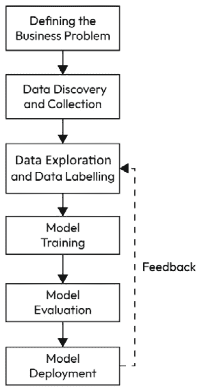

图 1.1 – 机器学习项目生命周期图

让我们详细看看它们。

## 定义业务问题

每个机器学习项目的第一步是理解业务问题并定义在项目结束时可以衡量的明确目标。

## 数据发现和数据收集

在这一步中，你将识别和收集可能与你的项目目标相关的潜在数据源。这包括找到数据集、数据库、API 或任何可能包含你分析建模所需数据的其他来源。

**数据发现**的目标是了解可用数据的格局，评估其质量、相关性和潜在限制。

数据发现也可能涉及与领域专家和利益相关者的讨论，以确定解决业务问题或实现项目目标所必需的数据。

在确定数据来源后，数据工程师将开发数据管道以提取和加载数据到目标数据湖，并执行一些数据预处理任务，例如数据清洗、去重以及使数据便于机器学习工程师和数据科学家进一步处理。

## 数据探索

**数据探索**紧随数据发现之后，主要关注理解数据、获取洞察力以及识别模式或异常。

在数据探索过程中，你可能需要进行基本的统计分析，创建数据可视化，并进行初步观察以了解数据的特征。

数据探索还可能包括识别缺失值、异常值和潜在的数据质量问题，但它通常不涉及对数据进行系统性的更改。

在数据探索过程中，你评估可用的标注数据，并确定它是否足够用于你的机器学习任务。如果你发现标注数据量小且不足以进行模型训练，你可能需要识别出需要额外标注数据的需求。

## 数据标注

**数据标注**涉及获取或生成更多标注示例以补充你的训练数据集。你可能需要手动标注额外的数据点或使用编程技术，如数据增强，来扩展你的标注数据集。将标签分配给数据样本的过程称为**数据标注**或数据标注。

大多数情况下，外包手动数据标注任务既昂贵又耗时。此外，由于数据隐私问题，数据通常不允许与外部第三方组织共享。因此，使用 Python 和内部开发团队自动化数据标注过程有助于快速且经济地标注数据。

市面上大多数数据科学书籍都缺乏关于这一重要步骤的信息。因此，本书旨在介绍使用 Python 编程以及市场上可用的标注工具对数据进行程序化标注的各种方法。

在获得足够数量的标注数据后，你将进行传统的数据预处理任务，例如处理缺失值、编码特征、缩放和特征工程。

## 模型训练

一旦数据准备充分，ML 工程师将数据集输入模型以进行模型训练。

## 模型评估

模型训练完成后，下一步是在验证数据集上评估模型，以了解模型的好坏，并避免偏差和过拟合。

你可以使用各种指标和技术来评估模型的表现，并根据需要迭代模型构建过程。

## 模型部署

最后，你将模型部署到生产环境中，并使用**机器学习操作**（**MLOps**）进行持续改进。MLOps 旨在简化将机器学习模型推向生产并维护和监控它们的过程。

在本书中，我们将重点关注数据标注。在实际项目中，为我们提供用于分析和机器学习的数据集通常是不干净且未标注的。因此，我们需要探索未标注数据以了解相关性和模式，并帮助我们使用 Python 标注函数定义数据标注的规则。数据探索帮助我们了解在开始数据标注和模型训练之前所需的清理和转换程度。

这就是 Python 如何帮助我们使用各种库（如 Pandas、Seaborn 和 ydata-profiling 库）探索和快速分析原始数据，这些库也被称为 EDA。

# 介绍 Pandas DataFrame

Pandas 是一个开源库，用于数据分析和处理。它提供了各种数据整理、清洗和合并操作的功能。让我们看看如何使用 `pandas` 库来探索数据。为此，我们将使用位于 GitHub 上的 *Income* 数据集，并探索它以找到以下见解：

+   在 *收入* 数据集中，年龄、教育和职业有多少个唯一值？每个唯一年龄的观测值是什么？

+   每个特征的均值和分位数等汇总统计信息。对于收入范围 > $50K 的成年人，平均年龄是多少？

+   如何使用双变量分析来了解收入与年龄、教育、职业等独立变量之间的关系？

让我们首先使用 `pandas` 库将数据读入 DataFrame。

DataFrame 是一种表示具有列和行的二维数据的结构，它类似于 SQL 表。要开始，请确保您创建了 `requirements.txt` 文件，并添加了所需的 Python 库，如下所示：

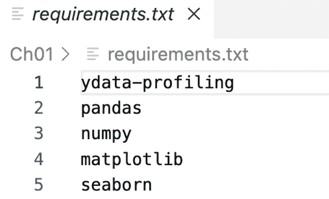

图 1.2 – requirements.txt 文件的内容

接下来，从您的 Python 笔记本单元格中运行以下命令以安装 `requirements.txt` 文件中添加的库：

```py
%pip install -r requirements.txt
```

现在，让我们使用以下 `import` 语句导入所需的 Python 库：

```py
# import libraries for loading dataset
import pandas as pd
import numpy as np
# import libraries for plotting
import matplotlib.pyplot as plt
import seaborn as sns
from matplotlib import rcParams
%matplotlib inline
plt.style.use('dark_background')
# ignore warnings
import warnings
warnings.filterwarnings('ignore')
```

在以下代码片段中，我们正在读取 `adult_income.csv` 文件并将其写入 DataFrame (`df`)：

```py
# loading the dataset
df = pd.read_csv("<your file path>/adult_income.csv", encoding='latin-1)'
```

现在数据已加载到 `df`。

让我们使用以下代码片段查看 DataFrame 的大小：

```py
df.shape
```

我们将看到以下结果作为 DataFrame 的形状：


图 1.3 – DataFrame 的形状

因此，我们可以看到数据集中有 32,561 个观测值（行）和 15 个特征（列）。

让我们打印数据集中的 15 个列名：

```py
df.columns
```

我们得到以下结果：


图 1.4 – 我们数据集中的列名

现在，让我们使用以下代码查看数据集中的前五行数据：

```py
df.head()
```

我们可以在 *图 1**.5* 中看到输出：

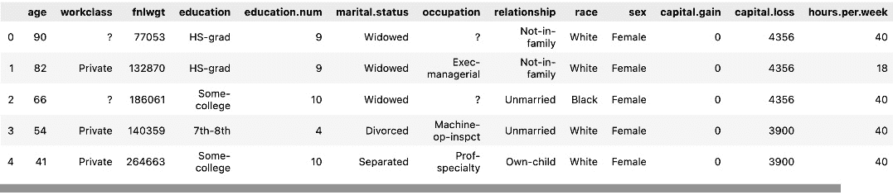

图 1.5 – 数据的前五行

让我们使用 `tail` 查看数据集的最后五行，如图所示：

```py
df.tail()
```

我们将得到以下输出。

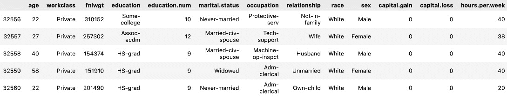

图 1.6 – 数据的最后五行

如我们所见，`education` 和 `education.num` 是冗余列，因为 `education.num` 只是 `education` 列的序数表示。因此，我们将从数据集中删除冗余的 `education.num` 列，因为一个列对于模型训练就足够了。我们还将使用以下代码片段从数据集中删除 `race` 列，因为我们在这里不会使用它：

```py
# As we observe education and education.num both are the same , so we can drop one of the columns
df.drop(['education.num'], axis = 1, inplace = True)
df.drop(['race'], axis = 1, inplace = True)
```

这里，`axis = 1` 指的是列轴，这意味着你指定要删除一列。在这种情况下，你正在删除标记为 `education.num` 和 `race` 的列。

现在，让我们使用 `info()` 打印列，以确保 `race` 和 `education.num` 列已从 DataFrame 中删除：

```py
df.info()
```

我们将看到以下输出：

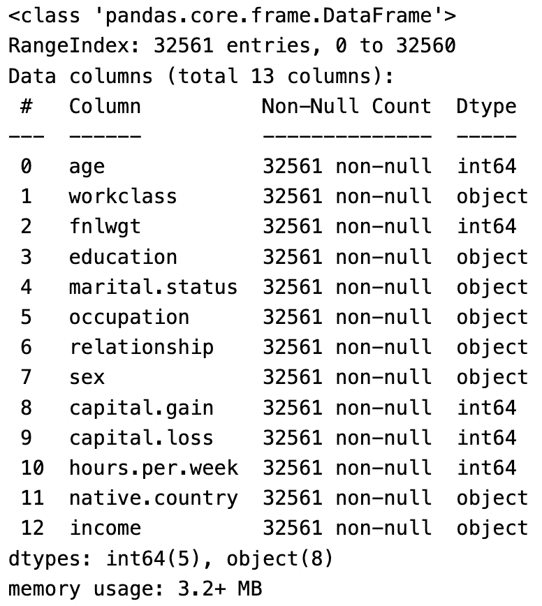

图 1.7 – DataFrame 中的列

我们可以看到，在前面数据中现在只有 13 列，因为我们从之前的 15 列中删除了 2 列。

在本节中，我们了解了 Pandas DataFrame 是什么，并将一个 CSV 数据集加载到一个 DataFrame 中。我们还看到了 DataFrame 中的各种列及其数据类型。在下一节中，我们将使用 Pandas 生成重要特征的摘要统计量。

# 摘要统计量和数据聚合

在本节中，我们将推导数值列的摘要统计量。

在生成摘要统计量之前，我们将识别数据集中的分类列和数值列。然后，我们将计算所有数值列的摘要统计量。

我们还将计算每个数值列针对目标类的平均值。摘要统计量对于了解每个特征的均值及其对目标标签类的影响非常有用。

让我们使用以下代码片段打印 `categorical` 列：

```py
#categorical column
catogrical_column = [column for column in df.columns if df[column].
dtypes=='object']
print(catogrical_column)
```

我们将得到以下结果：

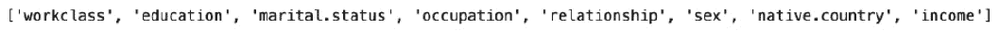

图 1.8 – 分类列

现在，让我们使用以下代码片段打印 `numerical` 列：

```py
#numerical_column
numerical_column = [column for column in df.columns if df[column].dtypes !='object']
print(numerical_column)
```

我们将得到以下输出：


图 1.9 – 数值列

## 摘要统计

现在，让我们使用以下代码片段生成摘要统计量（即平均值、标准差、最小值、最大值以及下限（25%）、中位数（50%）和上限（75%）分位数）：

```py
df.describe().T
```

我们将得到以下结果：

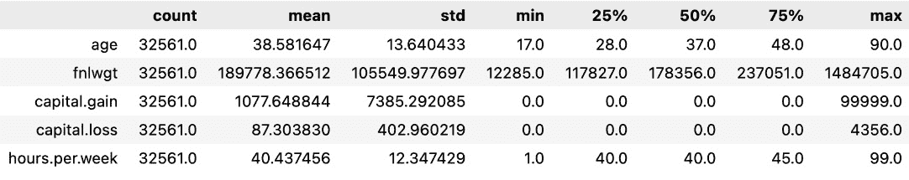

图 1.10 – 摘要统计

如结果所示，`age` 的平均值是 38.5 岁，最小年龄是 17 岁，最大年龄是 90 岁。由于数据集中只有五个数值列，因此在这个摘要统计表中我们只能看到五行。

## 特征针对每个目标类的数据聚合

现在，让我们使用以下代码片段计算每个收入组范围的平均年龄：

```py
df.groupby("income")["age"].mean()
```

我们将看到以下输出：

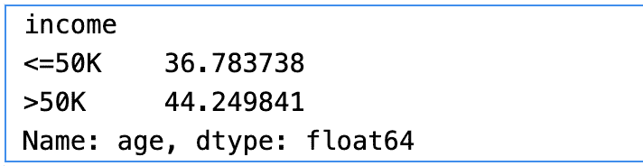

图 1.11 – 按收入组平均年龄

如结果所示，我们已经在目标变量上使用了`groupby`子句，并计算了每个组的年龄平均值。对于收入组小于或等于$50K 的人群，平均年龄是 36.78 岁。同样，对于收入组大于$50K 的人群，平均年龄是 44.2 岁。

现在，让我们使用以下代码片段计算每个收入组范围的每周平均小时数：

```py
df.groupby("income")["hours.per.week"]. mean()
```

我们将得到以下输出：

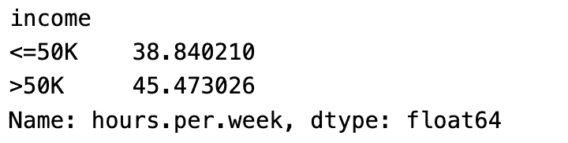

图 1.12 – 按收入组平均每周小时数

如结果所示，收入组=<= $50K 的每周平均小时数是 38.8 小时。同样，收入组> $50K 的每周平均小时数是 45.47 小时。

或者，我们可以编写一个通用的可重用函数，用于按`categorical`列对`numerical`列进行分组，如下所示：

```py
def get_groupby_stats(categorical, numerical):
    groupby_df = df[[categorical, numerical]].groupby(categorical). 
        mean().dropna()
    print(groupby_df.head)
```

如果我们想要为每个目标收入组获取多列的聚合，那么我们可以按以下方式计算聚合：

```py
columns_to_show = ["age", "hours.per.week"]
df.groupby(["income"])[columns_to_show].agg(['mean', 'std', 'max', 'min'])
```

我们得到以下结果：

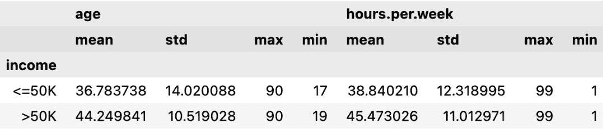

图 1.13 – 多列的聚合

如结果所示，我们已为每个收入组计算了年龄和每周小时数的汇总统计。

我们学习了如何使用可重用函数计算目标组的特征聚合值。这个聚合值为我们提供了这些特征与目标标签值之间的相关性。

# 使用 Seaborn 创建单变量和双变量分析的可视化

在本节中，我们将分别探索每个变量。我们将总结每个特征的数据，并分析其中存在的模式。

单变量分析是使用单个特征的分析。我们将在本节后面进行双变量分析。

## 单变量分析

现在，让我们对年龄、教育、工作类别、每周小时数和职业特征进行单变量分析。

首先，让我们使用以下代码片段获取每个列的唯一值计数：

```py
df.nunique()
```

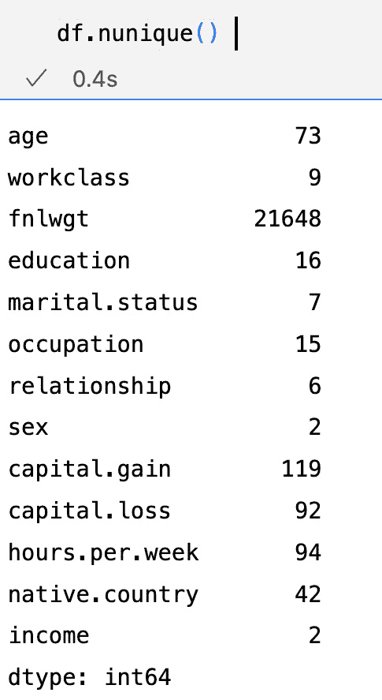

图 1.14 – 每个列的唯一值

如结果所示，`age`有 73 个唯一值，`workclass`有 9 个唯一值，`education`有 16 个唯一值，`occupation`有 15 个唯一值，等等。

现在，让我们看看 DataFrame 中`age`的唯一值计数：

```py
df["age"].value_counts()
```

结果如下：

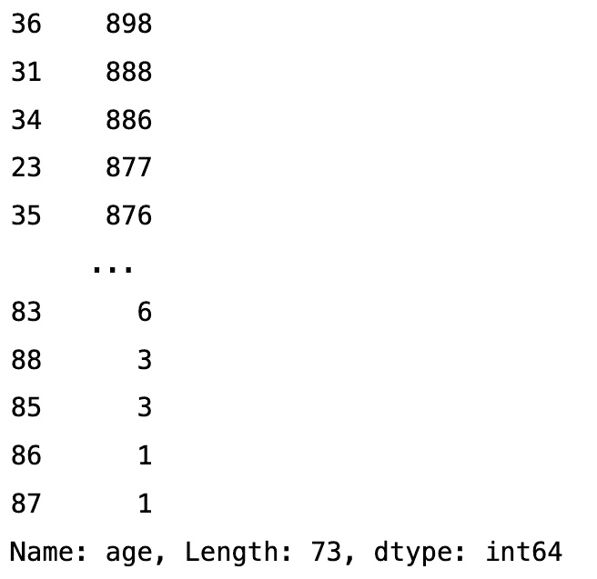

图 1.15 – 年龄值计数

我们可以在结果中看到，有 898 个观测值（行）的年龄为 36 岁。同样，有 6 个观测值的年龄为 83 岁。

### 年龄直方图

直方图用于可视化连续数据的分布。连续数据是可以取范围内任何值的（例如，年龄、身高、体重、温度等）。

让我们使用 Seaborn 绘制直方图来查看数据集中`age`的分布：

```py
#univariate analysis
sns.histplot(data=df['age'],kde=True)
```

我们得到以下结果：

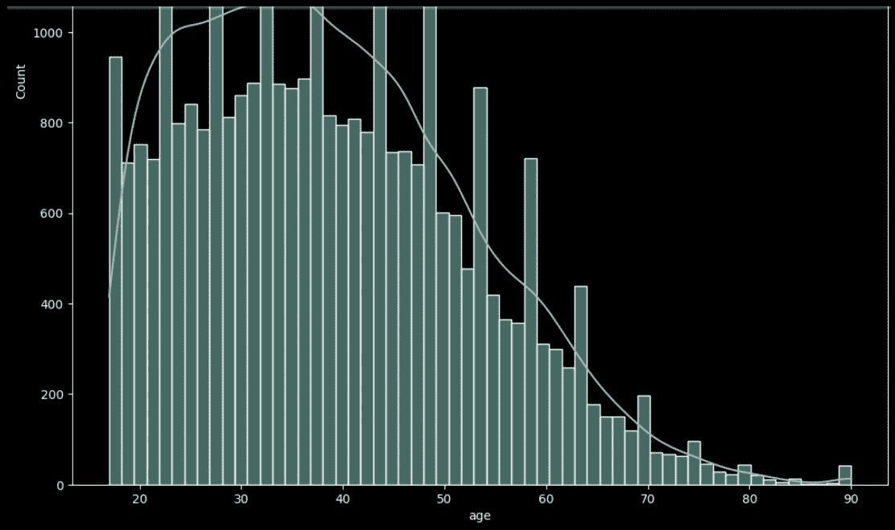

图 1.16 – 年龄直方图

如我们在年龄直方图中所见，在数据集中的给定观测值中，有很多人在 23 到 45 岁之间。

### `education`的条形图

现在，让我们检查给定数据集中`education`的分布情况：

```py
df['education'].value_counts()
Let us plot the bar chart for education.
colors = ["white","red", "green", "blue", "orange", "yellow", "purple"]
df.education.value_counts().plot.bar(color=colors,legend=True)
```


图 1.17 – `education`的柱状图

如我们所见，拥有`HS.grad`学位的人数高于拥有`Bachelors`学位的人数。同样，拥有`Masters`学位的人数少于拥有`Bachelors`学位的人数。

### `workclass`的柱状图

现在，让我们看看数据集中`workclass`的分布情况：

```py
df['workclass'].value_counts()
```

让我们绘制柱状图来可视化`workclass`不同值的分布：


图 1.18 – `workclass`的柱状图

如`workclass`柱状图所示，私营企业员工比其他类型的员工多。

### 收入柱状图

让我们查看`income`目标变量的唯一值，并查看`income`的分布：

```py
df['income'].value_counts()
```

结果如下：


图 1.19 – 收入分布

如结果所示，有 24,720 个收入超过$50K 的观测值，以及 7,841 个收入低于$50K 的观测值。在现实世界中，有更多的人收入超过$50K，而收入低于$50K 的人占少数，假设收入为美元，且为一年。由于这个比例紧密反映了现实世界的情况，我们不需要使用合成数据来平衡少数类数据集。

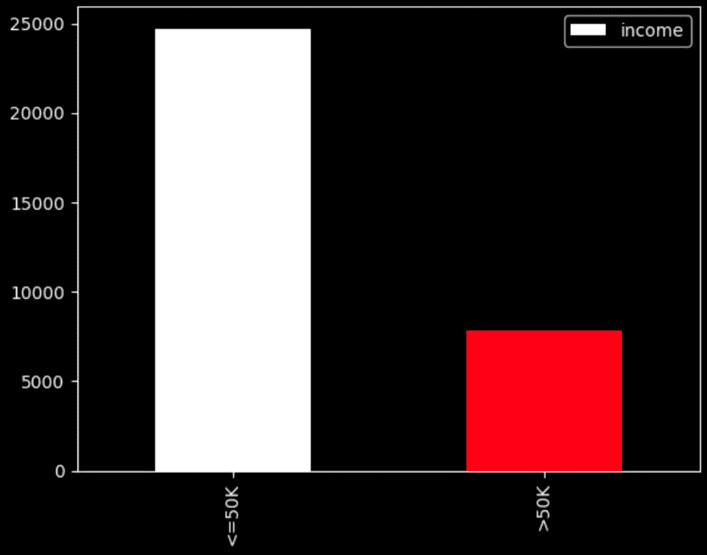

图 1.20 – 收入柱状图

在本节中，我们看到了数据的大小、列名和数据类型，以及数据集的前五行和最后五行。我们还删除了一些不必要的列。我们进行了单变量分析，以查看唯一值计数，并绘制柱状图和直方图来了解重要列的值分布。

## 双变量分析

让我们进行年龄和收入的双变量分析，以找出它们之间的关系。双变量分析是分析两个变量以找出它们之间关系的方法。我们将使用 Python Seaborn 库绘制直方图来可视化`age`和`income`之间的关系：

```py
#Bivariate analysis of age and income
sns.histplot(data=df,kde=True,x='age',hue='income')
```

图如下：

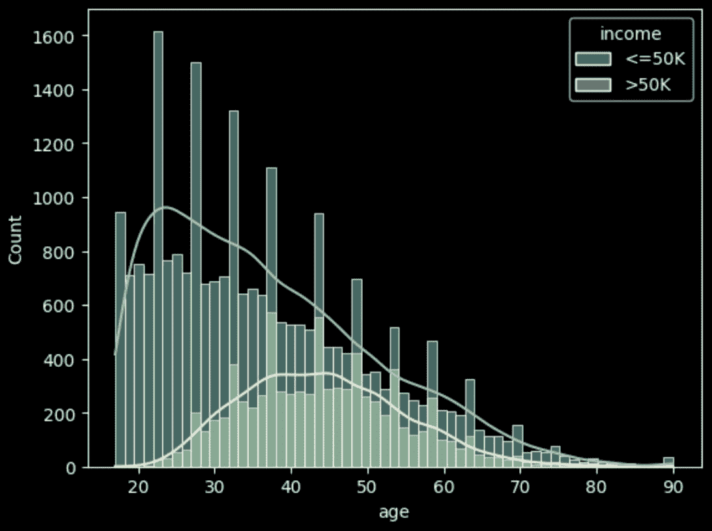

图 1.21 – 年龄与收入相关的直方图

从前面的直方图中，我们可以看到，在 30 至 60 岁的年龄组中，收入超过 50K 美元。同样，对于 30 岁以下的年龄组，收入低于 50K 美元。

现在让我们绘制直方图，对 `education` 和 `income` 进行双变量分析：

```py
#Bivariate Analysis of  education and Income
sns.histplot(data=df,y='education', hue='income',multiple="dodge");
```

下面是图表：

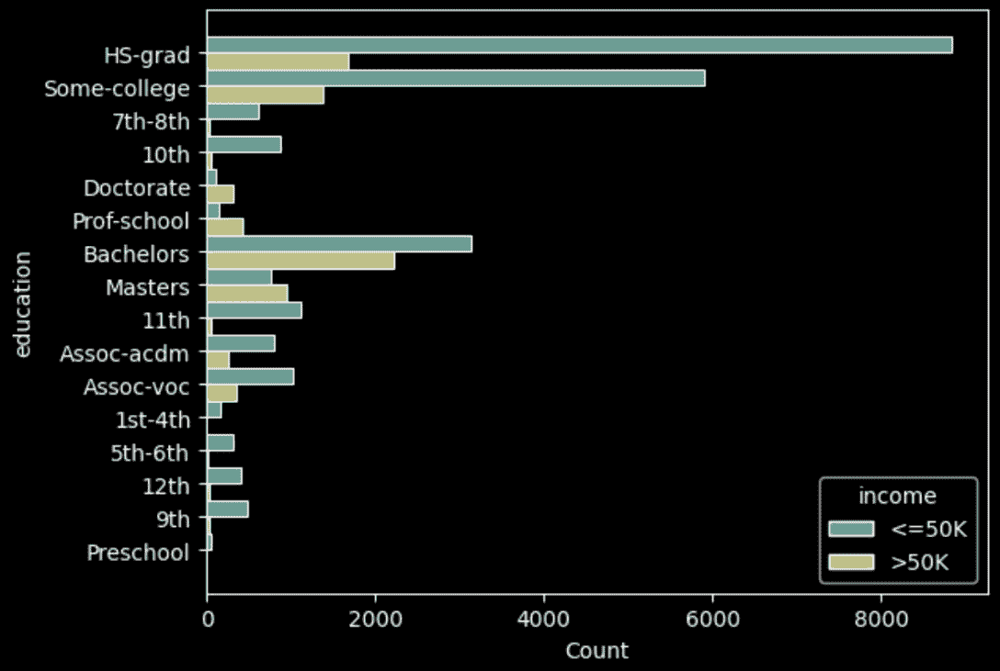

图 1.22 – 教育与收入直方图

从前面的直方图中，我们可以看到，对于大多数 `Masters` 教育成年人，收入超过 50K 美元。另一方面，对于大多数 `HS-grad adults`，收入低于 50K 美元。

现在，让我们绘制直方图，对 `workclass` 和 `income` 进行双变量分析：

```py
#Bivariate Analysis of work class and Income
sns.histplot(data=df,y='workclass', hue='income',multiple="dodge");
```

我们得到以下图表：

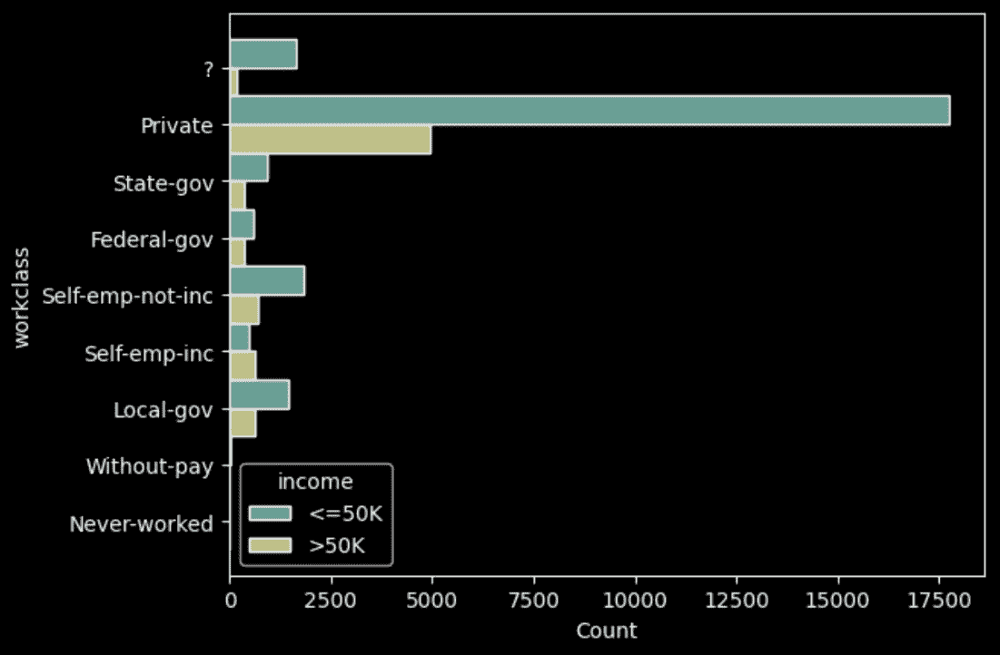

图 1.23 – 工作类别与收入直方图

从前面的直方图中，我们可以看到，对于 `Self-emp-inc` 成年人，收入超过 50K 美元。另一方面，对于大多数 `Private` 和 `Self-emp-not-inc` 员工，收入低于 50K 美元。

现在让我们绘制直方图，对 `sex` 和 `income` 进行双变量分析：

```py
#Bivariate Analysis of  Sex and Income
sns.histplot(data=df,y='sex', hue='income',multiple="dodge");
```

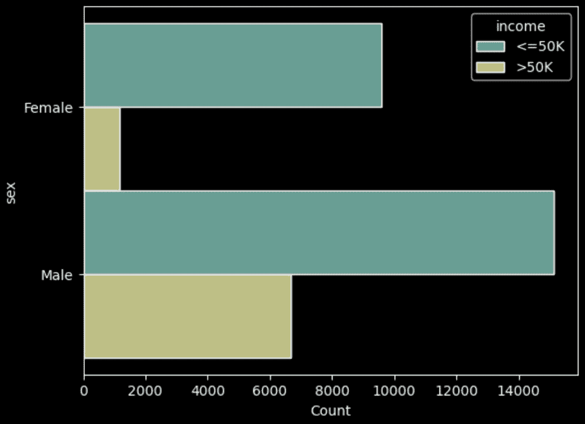

图 1.24 – 性别与收入直方图

从前面的直方图中，我们可以看到，对于男性成年人，收入超过 50K 美元，而对于大多数女性员工，收入低于 50K 美元。

在本节中，我们学习了如何使用 Seaborn 可视化库分析数据。

或者，我们可以使用几行代码通过 ydata-profiling 库探索数据。

# 使用 ydata-profiling 库进行数据配置文件分析

在本节中，让我们使用 `ydata-profiling` 库（[`docs.profiling.ydata.ai/4.5/`](https://docs.profiling.ydata.ai/4.5/)）来探索数据集并生成包含各种统计信息的配置文件报告。

`ydata-profiling` 库是一个用于轻松进行 EDA、配置文件和报告生成的 Python 库。

让我们看看如何使用 `ydata-profiling` 进行快速高效的 EDA：

1.  使用以下命令安装 `ydata-profiling` 库：

    ```py
    pip install ydata-profiling
    ```

1.  首先，让我们按照以下方式导入 Pandas profiling 库：

    ```py
    from ydata_profiling import ProfileReport
    ```

    然后，我们可以使用 Pandas profiling 生成报告。

1.  现在，我们将读取 *Income* 数据集到 Pandas DataFrame 中：

    ```py
    upgrade command to make sure we have the latest profiling library:

    ```

    %pip install ydata-profiling --upgrade

    ```py

    ```

1.  现在，让我们运行以下命令以生成配置文件报告：

    ```py
    report = ProfileReport(df)
    report
    ```

我们也可以使用 Pandas DataFrame 上的 `profile_report()` 函数生成报告。

执行前面的单元格后，`df` 中加载的所有数据将被分析，并生成报告。生成报告所需的时间取决于数据集的大小。

前一个单元格的输出是一个包含章节的报告。让我们了解生成的报告。

生成的配置文件报告包含以下部分：

+   **概述**

+   **变量**

+   **交互**

+   **相关性**

+   **缺失值**

+   **样本**

+   **重复行**

在报告的 **概述** 部分中，有三个标签页：

+   **概述**

+   **警报**

+   **繁殖**

如以下图所示，`数值` 和 `分类` 变量：

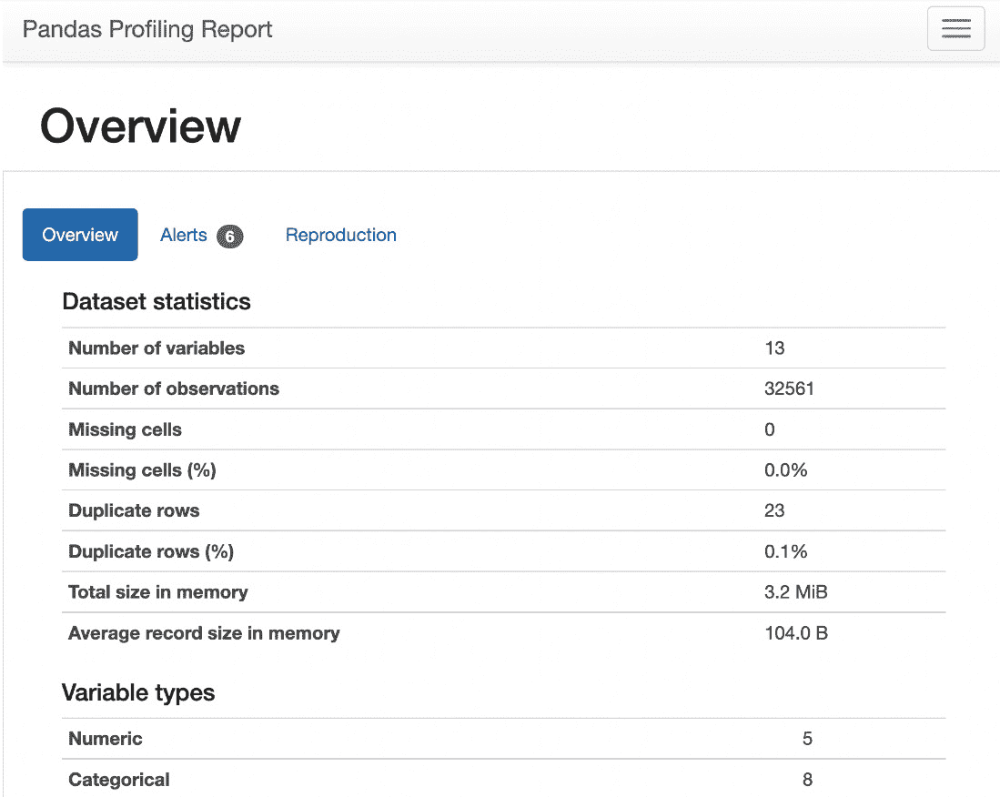

图 1.25 – 数据集的统计数据

在 **概述** 下的 **警报** 选项卡显示了高度相关的所有变量以及具有零值的单元格数量，如下所示：


图 1.26 – 警报

在 **概述** 下的 **繁殖** 选项卡显示了分析生成此报告所需的时间，如下所示：

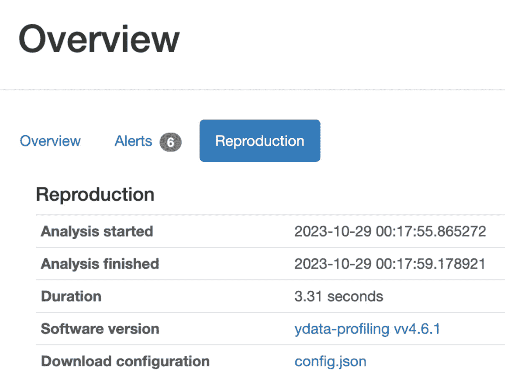

图 1.27 – 繁殖

## 变量部分

让我们浏览报告中的 **变量** 部分。

在 **变量** 部分下，我们可以在下拉菜单中选择数据集中的任何变量，并查看有关数据集的统计信息，例如该变量的唯一值数量、该变量的缺失值数量、该变量的大小等。

在以下图中，我们选择了下拉菜单中的 `age` 变量，并可以看到该变量的统计数据：

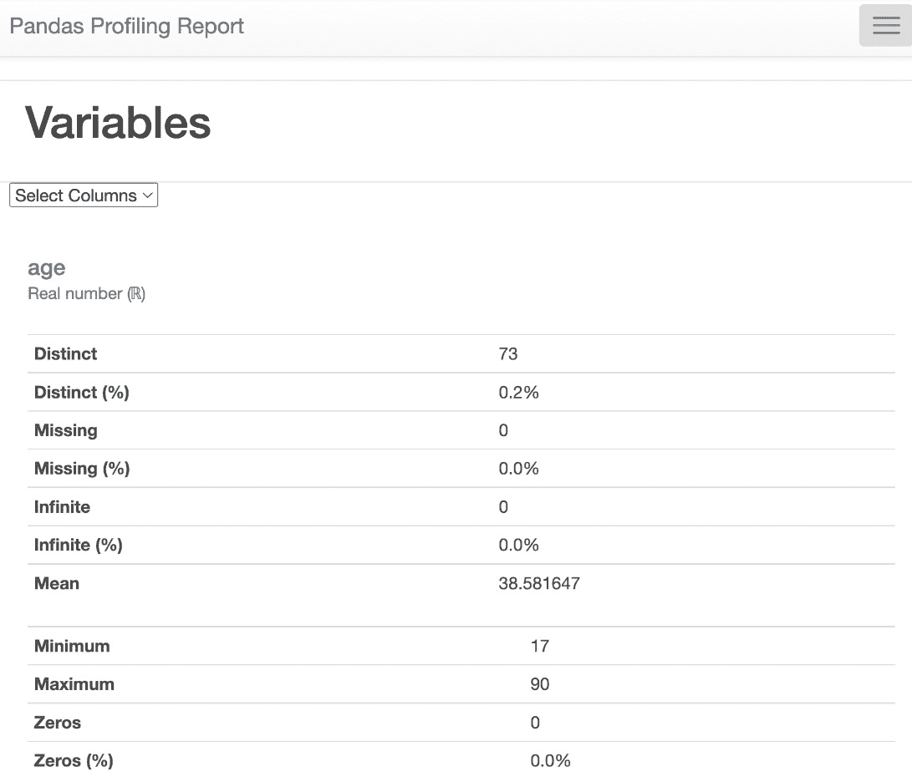

图 1.28 – 变量

## 交互部分

如以下图所示，此报告还包含 **交互** 图，以显示一个变量如何与另一个变量相关：

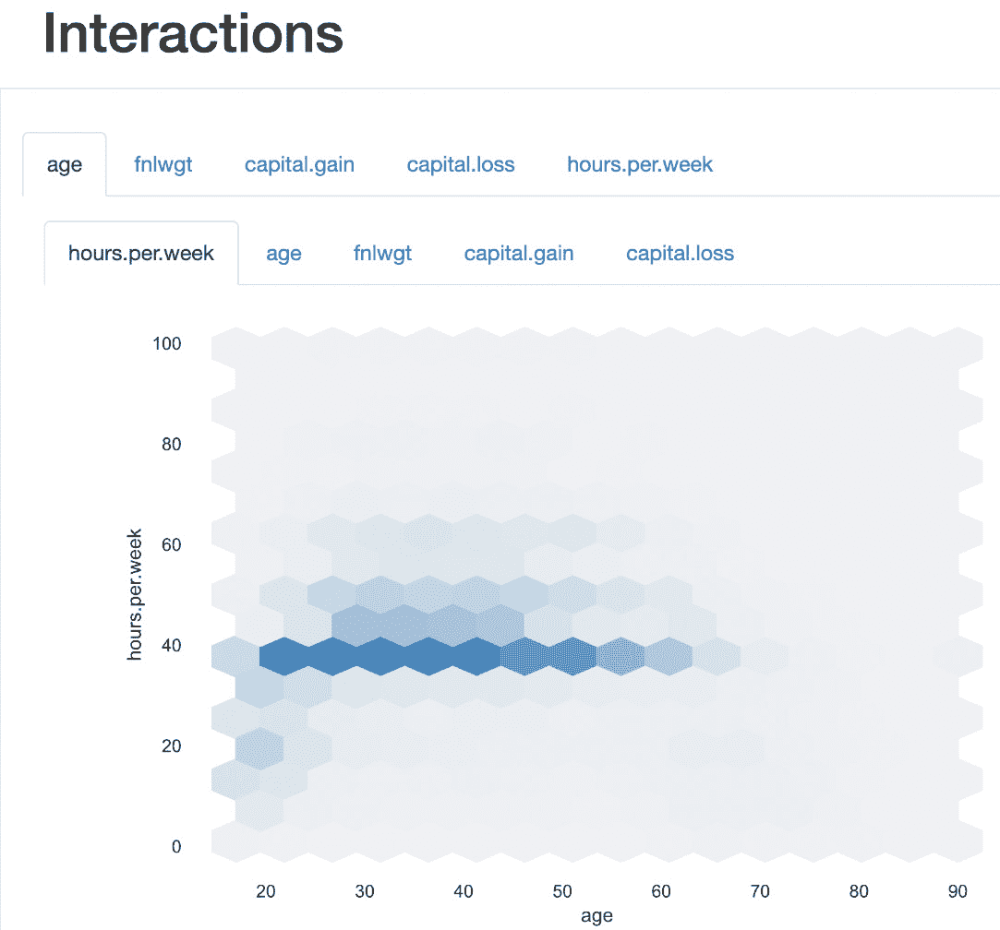

图 1.29 – 交互

## 相关性

现在，让我们看看报告中的 **相关性** 部分；我们可以在 **热图** 中看到各种变量之间的相关性。此外，我们还可以以 **表格** 形式看到各种相关系数。

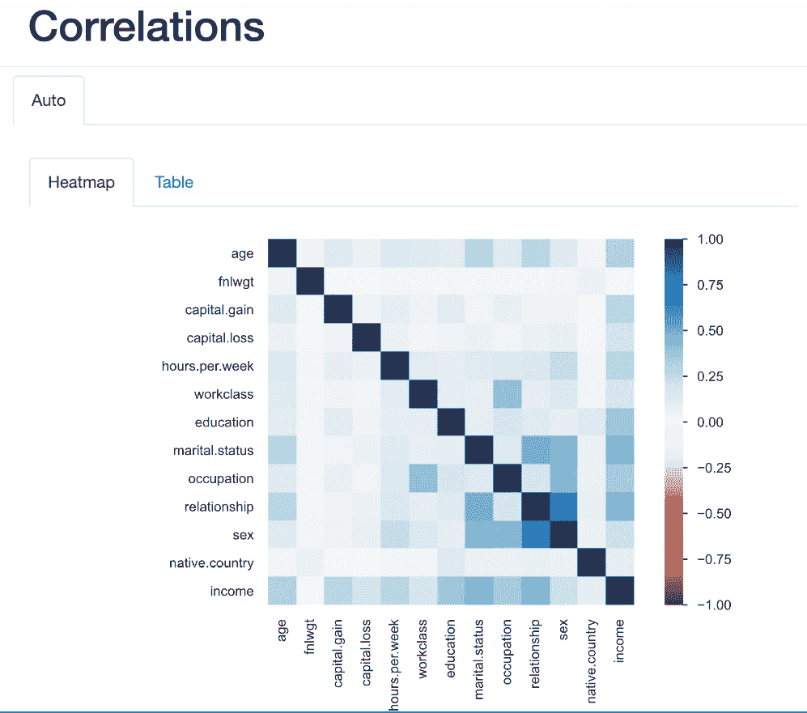

图 1.30 – 相关性

热图使用颜色强度来表示值。颜色通常从冷色调到暖色调，其中冷色（例如，蓝色或绿色）表示低值，暖色（例如，红色或橙色）表示高值。矩阵的行和列在热图的 *x* 轴和 *y* 轴上表示。矩阵交叉处的每个单元格代表数据中的特定值。

每个单元格的颜色强度对应于它所代表的值的幅度。较深的颜色表示较高的值，而较浅的颜色表示较低的值。

如前图所示，收入和每周小时数的交叉单元格显示高强度的蓝色，这表明收入和每周小时数之间存在高度相关性。同样，收入和资本收益的交叉单元格也显示高强度的蓝色，表明这两个特征之间存在高度相关性。

## 缺失值

报告的这一部分显示了数据中存在的总值的数量，并有助于了解是否存在任何缺失值。

在 **缺失值** 下，我们可以看到两个选项卡：

+   **计数** 图

+   **矩阵** 图

### 计数图

在**图 1.31**中，显示所有变量都有 32,561 个计数，这是数据集中行（观测值）的计数。这表明数据集中没有缺失值。

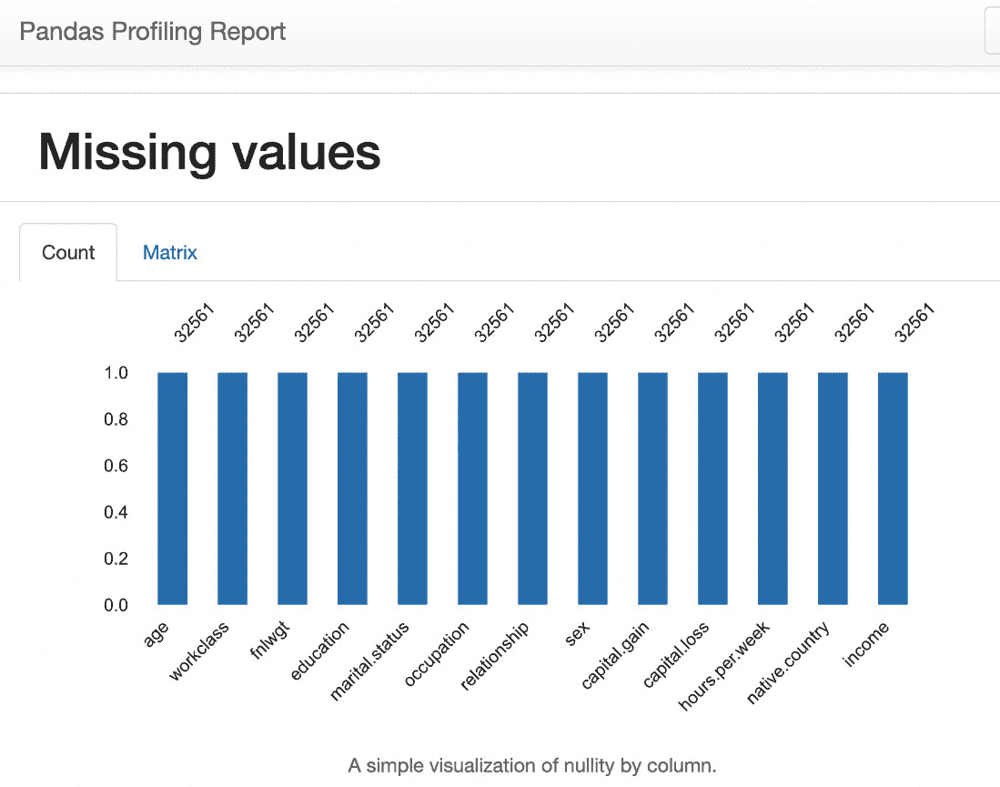

图 1.31 – 缺失值计数

### 矩阵图

下面的**矩阵**图表明缺失值的位置（如果数据集中有任何缺失值）：

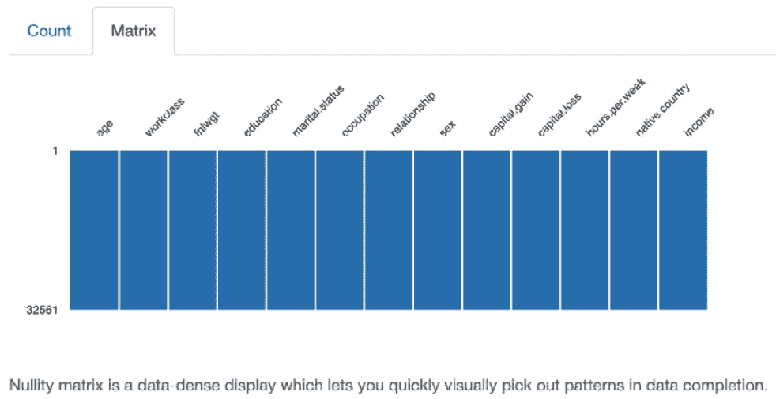

图 1.32 – 缺失值矩阵

## 样本数据

本节展示了数据集中前 10 行和最后 10 行的样本数据。

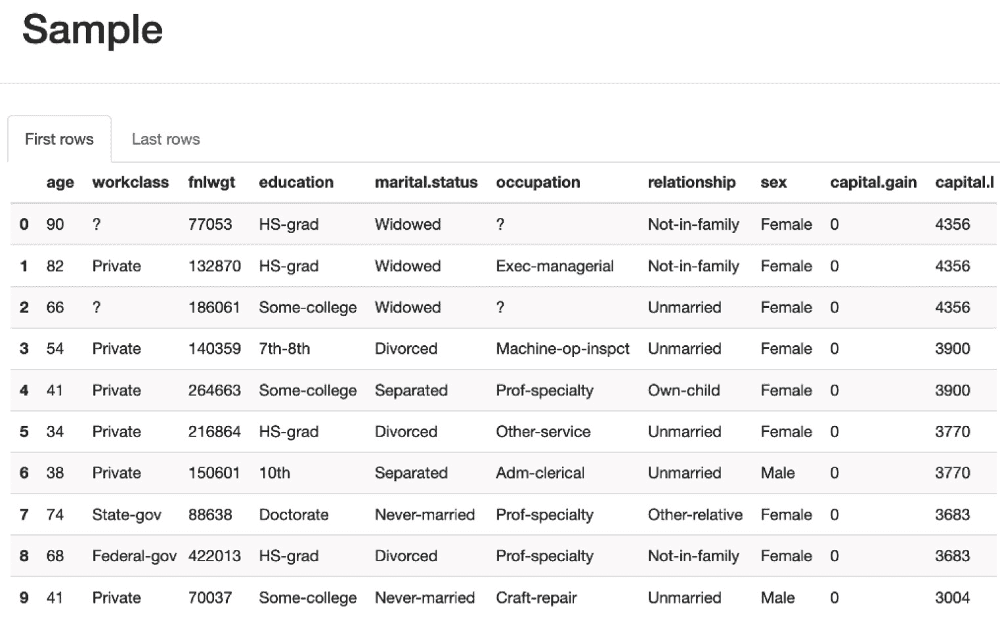

图 1.33 – 样本数据

本节展示了数据集中最常出现的行和重复的数量。

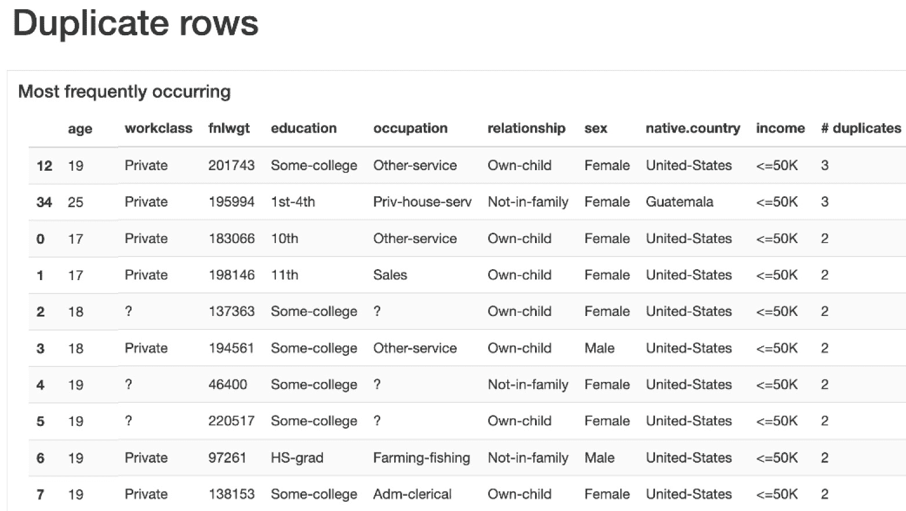

图 1.34 – 重复行

我们已经看到了如何使用 Pandas 分析数据，然后如何通过绘制各种图表，如条形图和直方图，使用 sns、seaborn 和 pandas-ydata-profiling 来可视化数据。接下来，让我们看看如何通过用自然语言提问来使用 OpenAI LLM 和 LangChain Pandas Dataframe 代理进行数据分析。

# 使用 OpenAI 和 LangChain 从数据中解锁见解

**人工智能**正在改变人们分析和解释数据的方式。令人兴奋的**生成式 AI**系统使任何人都能与他们的数据进行自然对话，即使他们没有编码或数据科学的专业知识。这种数据民主化承诺揭示可能之前一直隐藏的见解和模式。

这个领域的一个先驱系统是**LangChain**的**Pandas DataFrame 代理**，它利用了**大型语言模型**（**LLMs**）如**Azure OpenAI**的**GPT-4**的力量。LLMs 是在大量文本数据集上训练的 AI 系统，使它们能够生成类似人类的文本。LangChain 提供了一个框架来连接 LLMs 与外部数据源。

通过简单地用普通英语描述你想要了解的存储在 Pandas DataFrame 中的数据，这个代理可以自动用自然语言进行响应。

用户体验感觉就像魔法。你上传 CSV 数据集，通过键入或说话提问。例如，“去年销量前 3 名的产品是什么？”代理解释你的意图，编写并运行 Pandas 和 Python 代码来加载数据，分析它，并形成响应……所有都在几秒钟内完成。人类语言与数据分析之间的障碍消失了。

在幕后，LLM 根据你的问题生成 Python 代码，该代码被传递给 LangChain 代理以执行。代理处理运行代码对你的 DataFrame 进行操作，捕获任何输出或错误，并在必要时迭代以细化分析，直到达到准确的可读答案。

通过协作，代理和 LLM 消除了对语法、API、参数或调试数据分析代码的担忧。系统理解您想要了解的内容，并通过生成式 AI 的魔力自动实现。

这种数据分析的自然语言界面开启了颠覆性的潜力。没有编程技能的主题专家可以独立地从他们领域的资料中提取见解。数据驱动的决策可以更快地发生。探索性分析和创意构思变得简单。数据分析对所有 AI 助手都变得可用的未来已经到来。

让我们看看代理在幕后如何发送响应。

当用户向 LangChain 的`create_pandas_dataframe_agent`代理和语言模型发送查询时，幕后执行以下步骤：

1.  用户查询被 LangChain 代理接收。

1.  代理解释用户的查询并分析其意图。

1.  代理随后生成执行分析第一步所需的命令。例如，它可能生成一个 SQL 查询，并将其发送到代理已知可以执行 SQL 查询的工具。

1.  代理分析从工具收到的响应，并确定它是否是用户想要的。如果是，代理返回答案；如果不是，代理分析下一步应该是什么，并再次迭代。

1.  代理会持续生成它能够控制的工具的命令，直到获得用户期望的响应。它甚至能够解释发生的执行错误并生成修正后的命令。代理会迭代直到满足用户的问题或达到我们设定的限制。

我们可以用以下图表来表示这一点：

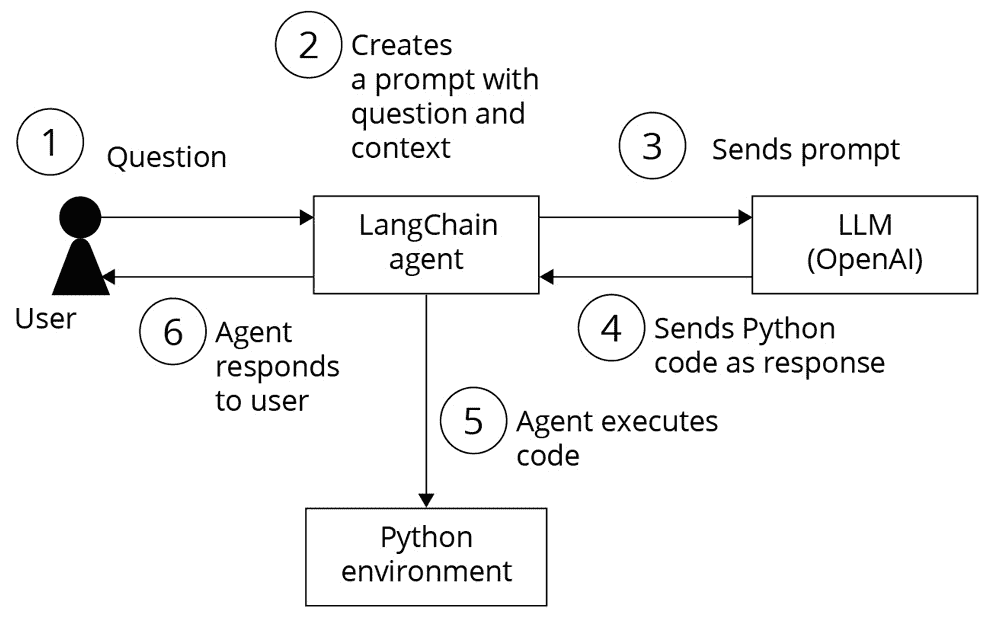

图 1.35 – LangChain Pandas 代理数据分析流程

让我们看看如何使用 LangChain 的`create_pandas_dataframe_agent`代理和 LLM 进行数据分析，并找到关于`income`数据集的见解。

关键步骤包括导入必要的 LangChain 模块、将数据加载到 DataFrame 中、实例化 LLM 以及通过传递所需对象创建 DataFrame 代理。现在，代理可以通过自然语言查询分析数据。

首先，让我们安装所需的库。要安装 LangChain 库，打开您的 Python 笔记本并输入以下内容：

```py
    %pip install langchain
    %pip install langchain_experimental
```

这将安装`langchain`和`langchain_experimental`包，以便您可以导入所需的模块。

让我们导入`AzureChatOpenAI`、Pandas DataFrame 代理和其他所需的库：

```py
from langchain.chat_models import AzureChatOpenAI
from langchain_experimental.agents import create_pandas_dataframe_agent
import os
import pandas as pd
import numpy as np
import seaborn as sns
import matplotlib.pyplot as plt
import openai
```

让我们配置 OpenAI 端点和密钥。您的 OpenAI 端点和密钥值可在 Azure OpenAI 门户中找到：

```py
openai.api_type = "azure"
openai.api_base = "your_endpoint"
openai.api_version = "2023-09-15-preview"
openai.api_key = "your_key"
# We are assuming that you have all model deployments on the same Azure OpenAI service resource above.  If not, you can change these settings below to point to different resources.
gpt4_endpoint = openai.api_base # Your endpoint will look something like this: https://YOUR_AOAI_RESOURCE_NAME.openai.azure.com/
gpt4_api_key = openai.api_key # Your key will look something like this: 00000000000000000000000000000000
gpt4_deployment_name="your model deployment name"
```

让我们将 CSV 数据加载到 Pandas DataFrame 中。

`adult.csv`数据集是我们想要分析的数据集，我们已将此 CSV 文件放置在我们运行此 Python 代码的同一文件夹中：

```py
df = pd.read_csv("adult.csv")
```

让我们实例化 GPT-4 语言模型。

假设您已根据*技术要求*部分在 Azure OpenAI Studio 中部署了 GPT-4 模型，这里我们传递`gpt4`端点、密钥和部署名称以创建 GPT-4 实例，如下所示：

```py
gpt4 = AzureChatOpenAI(
    openai_api_base=gpt4_endpoint,
    openai_api_version="2023-03-15-preview",
    deployment_name=gpt4_deployment_name,
    openai_api_key=gpt4_api_key,
    openai_api_type = openai.api_type,
)
```

将温度设置为`0.0`可以使模型返回最准确的结果。

让我们创建一个 Pandas DataFrame 代理。要创建 Pandas DataFrame 代理，我们需要传递`gpt4`模型实例和 DataFrame：

```py
    agent = create_pandas_dataframe_agent(gpt4, df, verbose=True)
```

将`gpt4` LLM 实例和 DataFrame 传递，并将`verbose`设置为`True`以查看输出。最后，让我们提出一个问题并运行代理。

如*图 1.36*所示，当我们向 Python 笔记本中的 LangChain 代理提出以下问题时，问题被传递给 LLM。LLM 为该查询生成 Python 代码，并将其发送回代理。然后代理在 Python 环境中执行此代码，使用 CSV 文件获得响应，LLM 将此响应转换为自然语言，然后再将其发送回代理和用户：

```py
agent("how many rows and how many columns are there?")
```

输出：

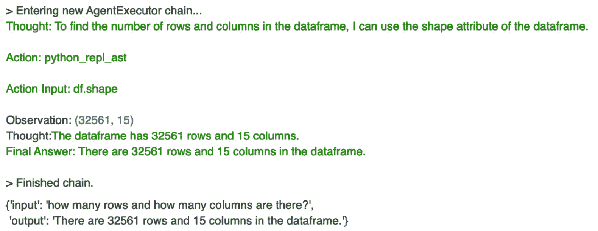

图 1.36 – 行和列计数代理响应

我们尝试下一个问题：

```py
agent("sample first 5 records and display?")
```

这里是输出：

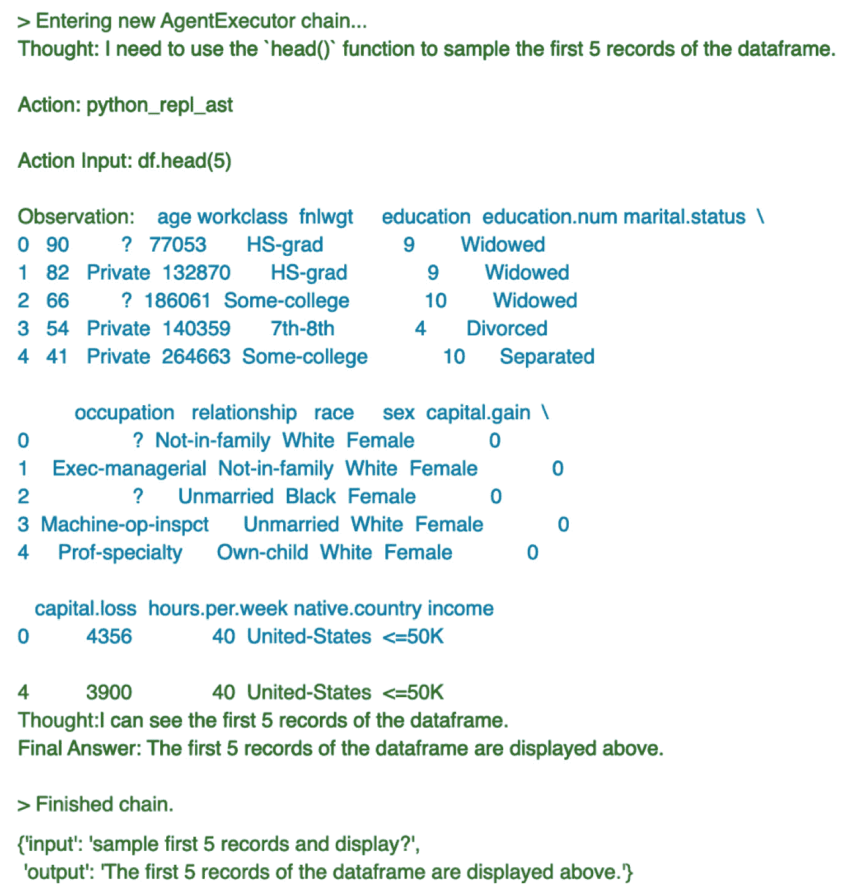

图 1.37 – 前五条记录的代理响应

这样，LangChain Pandas DataFrame 代理通过解释自然语言查询，生成相应的 Python 代码，并以人类可读的格式呈现结果，从而方便与 DataFrame 进行交互。

您可以尝试这些问题并查看代理的响应：

+   `query = "计算每个收入` `组的平均年龄?"`

+   `query = "提供此数据集的摘要统计信息?"`

+   `query = "提供每列唯一值的计数?"`

+   `query = "绘制` `年龄`的直方图"`

接下来，让我们尝试以下查询来绘制条形图：

```py
query = "draw the bar chart  for the column education"
results = agent(query)
```

Langchain 代理以条形图的形式响应，显示了不同教育水平的计数，如下所示。

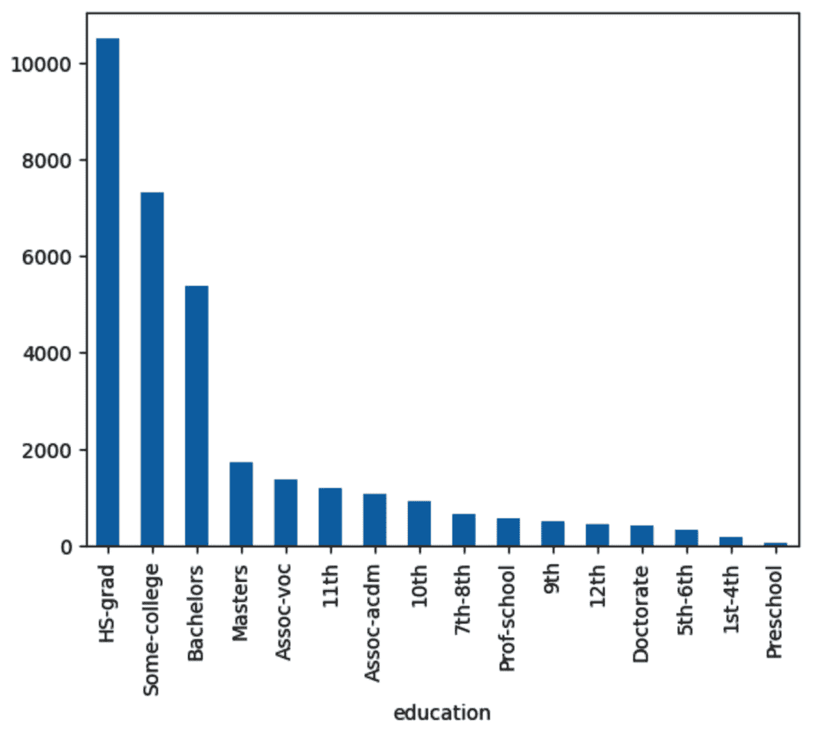

图 1.38 – 条形图代理响应

以下查询的绘图显示了不同教育水平（硕士和 HS-GRAD）的收入比较。我们可以看到，与高等教育相比，`education.num` 8 到 10 的收入低于 5,000 美元：

```py
query = "Compare the income of those have Masters with those have HS-grad using KDE plot"
results = agent(query)
```

这里是输出：

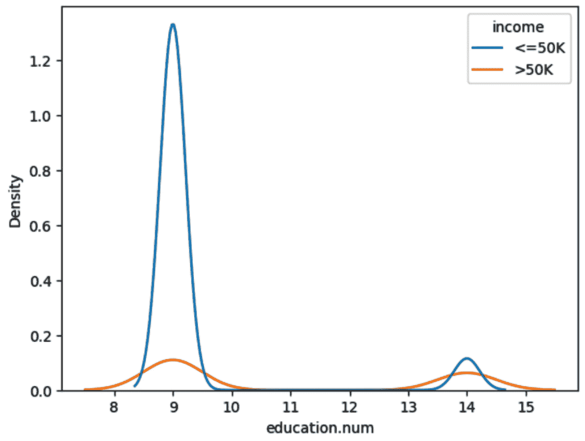

图 1.39 – 收入比较代理响应

接下来，让我们尝试以下查询以查找数据中的任何异常值：

```py
query = "Are there  any outliers in terms of age. Find out using Box plot."
results = agent(query)
```

此图显示了 80 岁以上的年龄异常值。

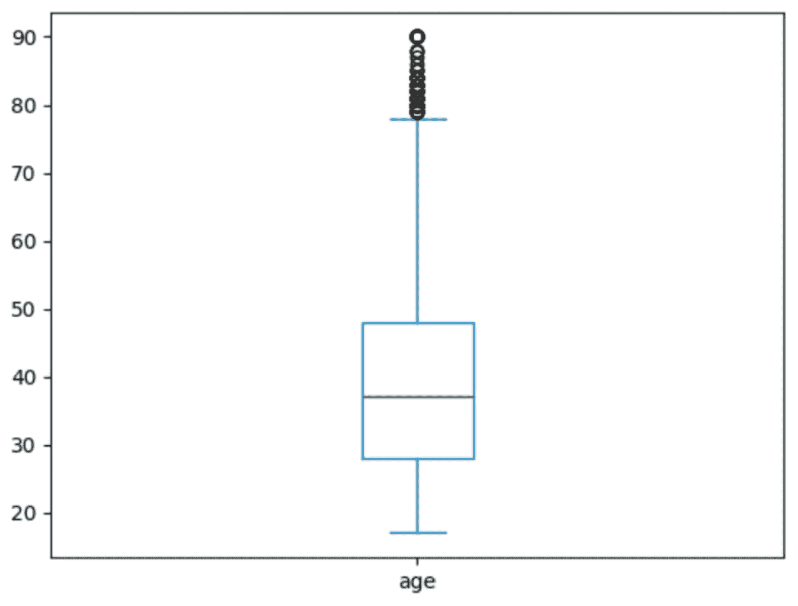

图 1.40 – 异常值代理响应

我们已经看到如何使用 LangChain 和 OpenAI LLM 的力量通过自然语言执行数据分析并找到关于`income`数据集的见解。

# 摘要

在本章中，我们学习了如何使用 Pandas 和 matplotlib 分析数据集，并理解各种特征之间的数据和相关性。在将原始数据用于训练机器学习模型和微调大型语言模型之前，理解数据和数据中的模式对于建立标记原始数据的规则是必需的。

我们还通过使用 `groupby` 和 `mean` 对列和分类值进行聚合的多个示例进行了学习。然后，我们创建了可重用的函数，这样只需通过调用并传递列名，就可以简单地重用这些函数来获取一个或多个列的聚合值。

最后，我们看到了如何使用 `ydata-profiling` 库通过简单的单行 Python 代码快速轻松地探索数据。使用这个库，我们不需要记住许多 Pandas 函数。我们可以简单地调用一行代码来执行数据的详细分析。我们可以为每个具有缺失值的变量创建详细的统计报告，包括相关性、交互作用和重复行。

一旦我们通过 EDA 对我们的数据有了良好的理解，我们就能为创建数据集标签的规则建立规则。

在下一章中，我们将看到如何使用 Python 库如 `snorkel` 和 `compose` 来构建这些规则，以对未标记的数据集进行标记。我们还将探索其他数据标记方法，例如伪标记和 K-means 聚类。
