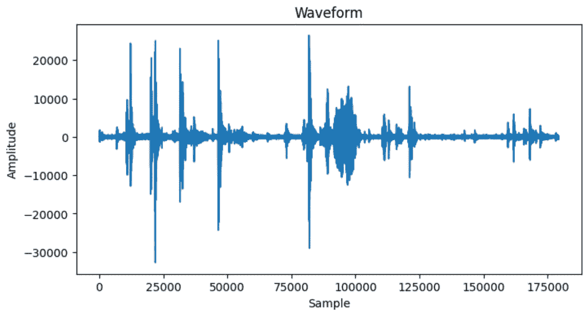
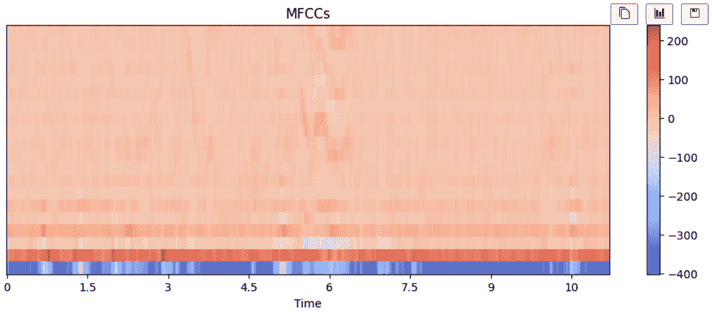
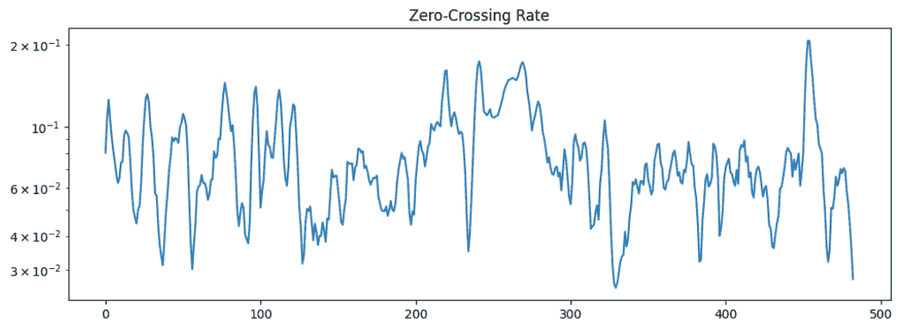
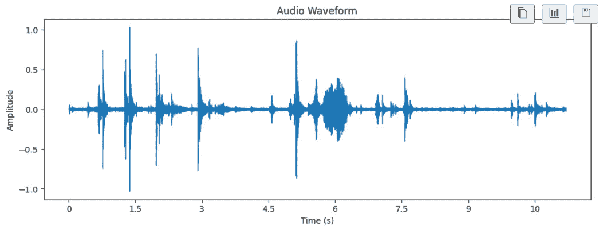
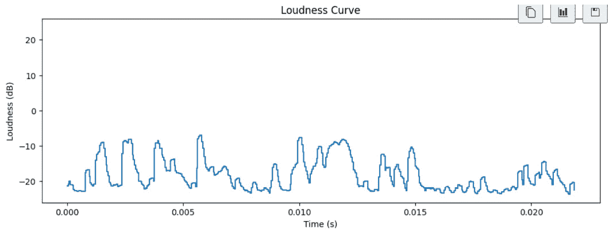
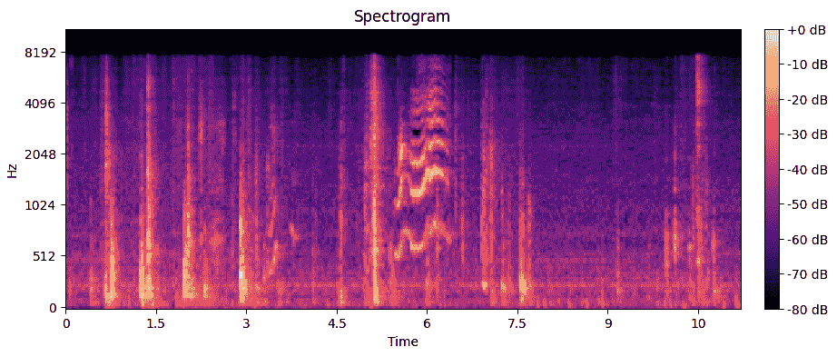
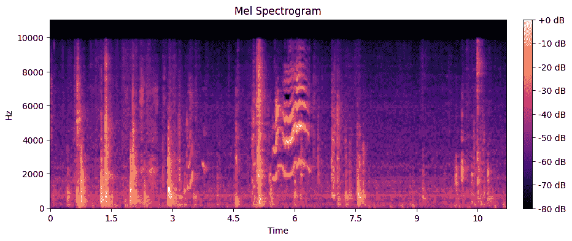

# 第十章：探索音频数据

想象一个没有音乐、没有您最喜欢的电影对白的配音，或者没有电话中朋友舒缓语调的世界。声音不仅仅是背景噪音；它是我们生活的一个基本组成部分，塑造着我们的情绪、经历和记忆。但您是否曾想过声音波涛中隐藏的未被发掘的潜力？

欢迎来到音频数据分析的领域，这是一段引人入胜的旅程，将您带入声音的核心。在本章中，我们将探讨机器学习背景下声音的力量。我们将揭示从音频中提取知识、将看似随机的空气振动转化为机器可以理解、解释甚至做出预测的结构化数据的秘密。

在人工智能和机器学习的时代，音频数据分析已成为一种变革力量。无论是识别智能手机上的语音命令、理解客户服务电话中的情感，还是对音乐库中的流派进行分类，音频数据分析都是幕后默默无闻的英雄。

本章是您了解将音频数据分析世界带入生活的核心概念、技术和工具的指南。我们将深入研究声音的基本要素，揭示如频谱图、梅尔频谱图和 MFCCs 等复杂术语，并探索将声音转化为有意义信息的艺术。

一起，我们将揭示从音频数据中提取模式、特征和洞察力的魔法，为从自动语音识别到音频指纹识别、音乐推荐等众多应用铺平道路。一个引人入胜的现实生活例子是记录医生和患者之间的对话。在录音上训练 AI 模型可以生成患者病史摘要，为医生提供方便的回顾和处方概述。理解音频数据的各种特征和模式对于音频数据的标注至关重要，我们将在下一章中看到。

在本章中，我们将涵盖以下主题：

+   标注音频数据的实际应用

+   音频数据基础

+   加载和分析音频数据

+   从音频数据中提取特征

+   可视化音频数据

到本章结束时，您将具备开始音频数据分析之旅所需的知识和实践技能。Librosa 将成为您在揭示声音领域奥秘中的可靠盟友，无论您是音乐爱好者、研究人员还是数据分析师。

让我们深入探索，用 Librosa 解锁音频数据的潜力！

# 技术要求

本章中使用的完整 Python 代码笔记本和数据集可在 GitHub 上找到：

+   [`github.com/PacktPublishing/Data-Labeling-in-Machine-Learning-with-Python/tree/main/code/Ch10`](https://github.com/PacktPublishing/Data-Labeling-in-Machine-Learning-with-Python/tree/main/code/Ch10)

+   [`github.com/PacktPublishing/Data-Labeling-in-Machine-Learning-with-Python/tree/main/datasets/Ch10`](https://github.com/PacktPublishing/Data-Labeling-in-Machine-Learning-with-Python/tree/main/datasets/Ch10)

让我们开始探索音频数据（`.wav` 或 `.mp3`）并了解音频工程的一些基本术语。

# 标注音频数据的实际应用

音频数据在各个行业的实际应用中得到了广泛应用。以下是一些音频数据在机器学习和人工智能中的应用示例：

+   **语音助手和语音识别**：Azure AI Speech、Amazon Alexa、Google Assistant 和苹果的 Siri 等平台利用音频数据进行自然语言处理和语音识别。用户可以通过语音命令与设备交互，实现设置提醒、播放音乐和控制智能家居设备等任务。

+   **医疗诊断**：音频数据分析在医疗保健中用于各种任务，如检测呼吸系统疾病。例如，分析咳嗽声音可以帮助诊断哮喘或肺炎等疾病。研究人员正在探索使用音频模式进行神经系统疾病的早期检测。

    学生研究员和 Rise 全球冠军 Chandra Suda 在 2023 年发明了一种用于通过咳嗽音频筛查结核病的工具，并发表了相关论文。该论文描述了一个机器学习模型，该模型分析智能手机麦克风的咳嗽音频样本以检测结核病。

+   **汽车安全和自动驾驶汽车**：在汽车行业，音频数据用于驾驶员监控和安全。系统可以分析驾驶员的语音以检测困倦或分心的迹象。此外，自动驾驶汽车利用音频传感器来解释环境中的声音，以提高情境意识。

+   **安全和监控**：音频数据在安全系统中用于检测和识别特定声音，如破碎玻璃声、枪声或异常噪音。这对于增强监控系统识别潜在威胁的能力至关重要。

+   **音乐和娱乐**：音乐推荐系统利用音频特征根据用户偏好进行个性化歌曲推荐。音频指纹技术用于在流媒体平台上识别和分类音乐。

+   **环境监测**：音频数据在环境监测中用于分析自然栖息地的声音。例如，监测森林中的鸟鸣声可以提供生物多样性的见解，分析水下声音可以帮助研究海洋生物。

+   **呼叫中心分析**：除了情感识别之外，呼叫中心使用音频数据分析进行各种目的，包括情感分析以了解客户满意度、识别趋势，以及优化客户互动以提供更好的服务。

+   **语言学习应用**：语言学习应用使用音频数据进行发音评估。机器学习模型可以分析用户的口语，提供发音反馈，并提供个性化的语言学习练习。

+   **欺诈检测**：在金融服务中，音频数据有时被用于欺诈检测。语音生物识别和行为分析可以帮助在电话交易中验证个人的身份。

+   **智能城市**：智能城市中的音频传感器可用于各种目的，例如监控交通模式、检测紧急情况（例如，警报声、枪声），以及分析城市噪音水平以进行环境规划。

这些例子展示了音频数据在各个领域的多功能性，突显了机器学习和人工智能提取有价值见解并增强我们生活各个方面潜力的可能性。让我们看看一些其他的应用，这些应用将音频数据与其他数据类型（如视频数据和文本数据）集成。

将音频分析与其他数据类型集成，可以开发出利用多种模态的综合人工智能应用。以下是一些音频分析与其他数据类型集成具有实际应用价值的真实世界案例：

+   **多模态情感识别**：应用包括客户服务和用户体验提升。

    **集成**：我们可以将语音语调分析和情感分析的音频分析结合面部表情的视频分析，以理解用户在客户服务互动中的情绪。这种集成有助于提供更个性化和同理心的响应。

+   **视听场景理解**：应用包括智能监控和安全。

    **集成**：我们可以将环境声音的音频分析结合视频分析，以检测和理解场景中的活动。例如，结合相应的视觉线索检测破碎玻璃的声音可以触发对潜在安全问题的警报。

+   **跨模态音乐推荐**：一个应用就是个性化内容推荐。

    **集成**：我们可以将用户所听音乐的音频特征与社交媒体帖子或评论中的文本数据结合，以提供个性化的音乐推荐。该系统考虑了用户的音乐偏好和文本数据中的上下文信息。

+   **语音驱动的智能助手**：一个应用就是虚拟助手。

    *集成*：我们可以将语音命令的音频分析结合文本数据的**自然语言处理（NLP**），以创建智能的语音驱动助手。这种集成使得交互更加自然和情境感知。

+   **医疗监控和诊断**：一个应用是远程健康监控。

    *集成*：我们可以将语音模式的音频分析结合电子健康记录中的文本数据，以远程监控患者。这种多模态方法有助于早期发现健康问题，并为医疗专业人员提供更全面的见解。

+   **多模态内容审核**：一个应用是社交媒体和内容平台。

    *集成*：我们可以将语音内容的音频分析结合文本和视觉数据，以增强内容审核的努力。这种方法有助于更有效地识别和审核有害或不适当的内容。

+   **自动驾驶汽车**：一个应用是智能交通。

    *集成*：我们可以将周围声音的音频分析（例如，警报声、喇叭声）与视频分析和传感器数据结合，以增强自动驾驶汽车的感觉能力。这种集成提高了安全性和情境意识。

+   **跨模态欺诈检测**：一个应用是金融服务。

    *集成*：我们可以将客户通话的音频分析结合交易日志中的文本数据，以检测潜在的欺诈活动。集成多种模态可以提高欺诈检测系统的准确性。

+   **教育技术**：一个应用是在线学习平台。

    *集成*：我们可以将教育视频中的语音内容音频分析结合讲座记录和用户交互的文本数据。这种集成增强了学生对参与和学习模式的理解。

+   **多模态人机交互**：应用包括游戏和虚拟现实。

    *集成*：我们可以将语音命令的音频分析和环境声音的音频分析结合视觉和传感器数据，以创建沉浸式和响应式的虚拟环境。这种集成增强了游戏和虚拟现实应用中的整体用户体验。

这些现实世界的应用展示了如何将音频分析与其他数据类型的集成，有助于构建跨各种领域的更智能和情境感知的 AI 系统。多模态的联合使用通常会产生更稳健和细致的 AI 解决方案。现在让我们学习音频数据分析的基础知识。

# 音频数据基础

首先，让我们了解一些音频数据分析的基本术语：

+   **振幅**：声音由波组成，这些波的振幅称为振幅。振幅越大，声音越响。振幅是指从平衡位置测量的振动或振荡的最大范围。想象一下摆动的钟摆。钟摆从其静止位置（中间点）到一端的距离是其振幅。想象一下在秋千上的人。他们摆得越高，他们的运动振幅就越大。

+   **均方根计算**：要使用均方根找到响度，我们平方声波的振幅值。这样做是因为它有助于我们关注正值（去除任何负值），因为响度应该反映声音的强度。

+   **平均功率**：在平方振幅之后，我们计算这些平方值的平均值。这就像寻找声音波形的典型大小。

+   **平方根**：为了得到最终的响度测量值，我们取平均功率的平方根。这就是均方根（RMS），它告诉我们声音的平均强度。

+   **均方根能量**：在实践中，当你看到以**分贝（dB**）给出的响度值时，它通常是从均方根能量计算出来的。较高的均方根值意味着较大的声音，而较低的均方根值意味着较小的声音。

    因此，均方根能量是一种将音频信号的原始振幅取平方，以关注其强度，计算这些平方值的平均值，然后取平方根以获得整体声音响度的方法。这是一个理解和比较不同音频信号响度的有用工具。

    **频率**：将频率视为某物振动的速度。在声音中，它是空气快速往返以产生音调的速度。高频意味着高音调的声音，例如口哨声，而低频意味着低音调的声音，例如低音鼓。想象一下海浪拍打海岸。在给定的时间框架内到达的波浪越多，频率就越高。

+   **频谱图**：频谱图就像一张显示声音中不同频率响度的图片。它通常用于音乐或语音分析。想象一下一个时间在*x*轴上，频率（音调）在*y*轴上，颜色代表在某一时刻每个频率的响度的图表。考虑一个带有时间音符的音乐乐谱。乐谱上音符的位置代表它们的频率，音符的强度代表它们的振幅。

+   **梅尔频谱图**：梅尔频谱图是一种特殊的频谱图，试图展示人类如何听到声音。它就像一张调整以匹配我们感知音调的声音图片。它在音乐和语音识别等任务中很有帮助。

+   **梅尔频率倒谱系数**（**MFCCs**）：MFCCs 是一种描述声音特征的特殊方式。它们将梅尔频谱图转换为计算机可以理解的数字集合。它们通常用于语音识别和音乐分析。|

+   **二元交叉熵**（**BCE**）：BCE 是衡量计算机在执行“是”或“否”任务（如判断图片中是否有猫）方面表现好坏的一种方法。它检查计算机的答案是否与真实答案相符，并给出分数。

+   `.95 f1`，`.96 acc`）：AMaxP 是在众多选择中找到最佳答案的一种方法。想象一下，你有一个包含多个问题的测试，你想要获得最高分。`.95 f1` 和 `.96 acc` 就像是告诉你表现如何的分数。`f1` 是在正确和不遗漏任何内容之间找到平衡，而 `acc` 则是关于你答对了多少个问题。

现在，让我们了解音频数据分析中最常用的库。

**Librosa** 是一个多功能的 Python 库，使研究人员、数据科学家和工程师能够轻松地探索和操作音频数据。它提供了一系列工具和函数，简化了音频分析的复杂性，使初学者和专家都能轻松使用。无论你是想识别音乐流派、检测语音模式，还是从音频记录中提取有意义的功能，Librosa 都是你在这一旅程上的首选伴侣。

除了 Librosa，还有其他几个库针对音频处理和分析的不同方面。以下是一些值得注意的音频分析库的简要比较：

| **库** | **焦点** | **功能** |
| --- | --- | --- |
| Librosa | Librosa 主要专注于音乐和音频分析任务，提供用于特征提取、信号处理和音乐信息检索（MIR）的工具。 | 为 MIR 任务提供全面的特征提取。支持加载音频文件和可视化。与 scikit-learn 集成以用于机器学习应用。 |
| pydub | pydub 是一个专门为音频处理任务设计的库，例如编辑、切片和格式转换。 | 简单直观的 API 用于常见的音频操作。支持多种音频格式。易于在不同音频表示之间进行转换。 |
| Essentia | Essentia 是一个具有 Python 绑定的 C++ 库，提供了一系列音频分析和处理算法，适用于音乐和通用音频。 | 拥有丰富的音频分析算法集合。支持特征提取、音频流和实时处理。与其他库（如 MusicBrainz）集成。 |
| MIDIUtil | MIDIUtil 是一个用于创建和操作 MIDI 文件的库，允许通过编程方式生成音乐。 | MIDI 文件创建和操作。控制音符、节奏和其他 MIDI 参数。提供 Pythonic 接口以生成音乐作品。 |
| TorchAudio (PyTorch) | TorchAudio 是 PyTorch 生态系统的一部分，旨在为深度学习工作流程中的音频处理提供支持。 | 与 PyTorch 的集成，实现无缝模型训练。提供音频预处理、数据增强和特征提取的工具。支持 GPU 加速。 |
| Aubio | Aubio 是一个具有 Python 绑定的 C 库，专注于音频分割和音高检测任务。 | 音高检测、节拍跟踪和其他分割算法。高效且轻量级，适用于实时应用。适用于音乐分析和交互式音频应用。 |

表 10.1 – 不同音频分析库特征的比较

选择最适合您特定需求和音频数据分析任务性质的库非常重要。根据应用，您可能需要使用多个库的组合来覆盖音频处理的各个方面，从基本操作到高级特征提取和机器学习集成。

# 实践音频数据分析

在本节中，我们将深入了解可以在音频数据上执行的各种操作，例如清理、加载、分析和可视化。

## 加载和分析示例音频文件的示例代码

在使用 Librosa 进行音频数据分析之前，您需要安装它。要安装 Librosa，您可以使用 `pip`，Python 的包管理器：

```py
pip install librosa
```

这将下载并安装 Librosa 及其依赖项。

现在您已经安装了 Librosa，让我们开始加载一个音频文件并对它进行一些基本分析。在这个例子中，我们将分析一个示例音频文件。我们可以使用 SciPy 读取音频文件，如下所示：

```py
from scipy.io import wavfile
import matplotlib.pyplot as plt
sample_rate, data = wavfile.read('cat_1.wav')
print(sample_rate)
print(data)
#Visulize the wave form
plt.figure(figsize=(8, 4))
plt.plot(data)
plt.title('Waveform')
plt.xlabel('Sample')
plt.ylabel('Amplitude')
plt.show()
```

我们得到以下结果：



图 10.1 – 波形可视化

提供的代码用于加载 WAV 格式的音频文件，提取音频信息，并使用 Python 可视化其波形。以下是代码的逐步解释。

### 导入库

`from scipy.io import wavfile`: 这行代码从 `scipy.io` 库中导入 `wavfile` 模块，用于读取 WAV 音频文件。

`import matplotlib.pyplot as plt`: 这行代码从 `matplotlib` 库中导入 `pyplot` 模块，用于创建图表和可视化。

`from IPython.display import Audio`: `IPython.display` 的 `Audio` 模块允许在 Jupyter 笔记本中集成音频播放。

### 加载音频文件

`sample_rate, data = wavfile.read('cat_1.wav')`: 这行代码加载了一个名为 `cat_1.wav` 的音频文件，并提取了两条信息：

+   `sample_rate`: 采样率，表示每秒采集多少个样本（音频信号的测量）。它告诉您音频是如何被表示的。

+   `data`: 音频数据本身，它是一个表示每个样本音频信号振幅的值数组的数组。

### 打印采样率和数据

`print(sample_rate)`: 这行代码将采样率打印到控制台。采样率通常以 **赫兹** （**Hz**） 表示。

`print(data)`: 这行代码打印音频数据，它是一个以给定采样率采样的幅度值数组。打印的数据可能看起来像一长串数字，每个数字代表音频在特定时间点的幅度。

### 可视化波形

`plt.figure(figsize=(8, 4))`: 这行代码设置了一个指定大小的新图（宽度为 8 英寸，高度为 4 英寸）。

`plt.plot(data)`: 这行代码创建了一个音频数据的线形图。 *x* 轴代表样本索引（时间），*y* 轴代表每个样本处的音频幅度。这个图被称为波形。

`plt.title('Waveform')`: 这行代码将图表的标题设置为 `Waveform`。

`plt.xlabel('Sample')`: 这行代码将 *x* 轴标记为 `Sample`，表示样本索引。

`plt.ylabel('Amplitude')`: 这行代码将 *y* 轴标记为 `Amplitude`，表示每个样本处的音频信号的强度或强度。

`plt.show()`: 这行代码将图表显示在屏幕上。

结果的可视化是一个波形图，显示了音频信号随时间变化的幅度。这是一种常见的获取音频数据视觉感觉的方法，让您可以看到音频信号中的模式、峰值和谷值。

让我们绘制音频播放器：

```py
#   Audio player
    audio_player = Audio(data=data, rate=sample_rate)
    display(audio_player)
```

我们已经加载了音频数据，并从音频文件中提取了两条信息（采样率和数据）。接下来，让我们看看如何从音频数据中提取其他重要属性。

## 音频格式转换的最佳实践

在工业界处理音频数据时，有几个常见的最佳实践用于将音频转换为正确的格式以及执行清洁或编辑任务。以下是一些步骤和建议。

+   **文件** **格式转换**:

    +   **使用常用格式**: 将音频文件转换为常用格式，如 WAV、MP3 和 FLAC。格式的选择取决于您应用程序的具体要求。

    +   **使用无损格式进行编辑**: 在编辑或处理音频时，考虑使用无损格式，如 WAV 和 FLAC，以在修改过程中保留原始质量。

    转换工具包括 FFmpeg，这是一个强大的多媒体处理工具，可用于音频格式转换，以及 Audacity，这是一款支持各种格式的开源音频编辑软件。

+   **音频清洁**:

    +   **降噪**: 应用降噪技术以去除不需要的背景噪声。Python 中的 Librosa 等库可能会有所帮助。

    +   **高通/低通滤波**: 使用滤波器去除所需范围之外的频率。这有助于去除低频嗡嗡声或高频噪声。

    +   **归一化**: 归一化音频级别以确保一致的响度。这可以防止失真并确保不同录音的音量一致。

    +   **编辑工具**：Audacity 提供了一个用户友好的界面，用于各种音频编辑任务，包括降噪和滤波。

+   **剪辑和分割**：

    +   **分割**：根据特定标准将较长的音频记录分割成段或片段。这可能基于时间或事件分割。

    +   **识别关键事件**：使用音频分析技术或手动检查来识别音频数据中的关键事件或边界。

    +   **音频剪辑工具**：这包括 Audacity，它允许用户轻松选择和剪切音频的某些部分，以及 Librosa，用于音频处理和分割。

+   **质量保证**：

    +   **监听输出**：在处理音频后，始终要监听音频，以确保修改符合预期的质量标准。

    +   **自动检查**：实施自动检查以识别处理过程中可能的问题，如削波或失真。

+   **文档**：

    +   **元数据**：跟踪元数据，如采样率、比特深度以及应用的任何处理步骤。这份文档对于可重复性至关重要。

    +   **版本控制**：使用版本控制系统跟踪音频文件和处理脚本的更改。

记住根据您项目的具体要求和您正在处理的音频数据的特征调整这些最佳实践。始终记录您的处理步骤，以保持透明性和可重复性。

## 音频数据清理示例代码

音频数据清理对于提高后续分析或应用的准确性和质量至关重要。它有助于去除不需要的伪迹、背景噪声或失真，确保处理后的音频更适合语音识别、音乐分析和其他基于音频的应用，从而提高整体性能和可解释性。

清理音频数据通常涉及背景噪声去除等技术。一种流行的方法是使用称为**频谱减法**的技术。Python 提供了几个用于音频处理的库，其中常用的一个是 Librosa。

以下代码利用 Librosa 库进行音频处理，以演示背景噪声去除。

### 加载音频文件

代码首先使用 Librosa 加载音频文件。文件路径指定为`audio_file_path`，`librosa.load`函数返回音频信号（`y`）和采样率（`sr`）：

```py
# Load the audio file
audio_file_path = "../PacktPublishing/DataLabeling/ch10/cats_dogs/cat_1.wav"
# Replace with the path to your audio file
y, sr = librosa.load(audio_file_path)
```

### 显示原始频谱图

使用`librosa.display.specshow`计算音频信号的原始频谱图。这提供了音频信号在频域中的视觉表示：

```py
D_original = librosa.amplitude_to_db(np.abs(librosa.stft(y)), ref=np.max)
plt.figure(figsize=(12, 8))
librosa.display.specshow(D_original,sr=sr, x_axis='time', y_axis='log')
plt.colorbar(format='%+2.0f dB')
plt.title('Original Spectrogram')
plt.show()
```

### 应用背景噪声去除

应用谐波-打击声源分离（`librosa.effects.hpss`）将音频信号分解为谐波和打击声成分。然后通过减去谐波成分来估计背景噪声，从而得到`y_noise_removed`：

```py
# Apply background noise removal
y_harmonic, y_percussive = librosa.effects.hpss(y)
y_noise_removed = y - y_harmonic
```

### 显示去除背景噪声后的频谱图

清洗后的音频的频谱图被计算并显示，允许与原始频谱图进行比较。这一步可视化地展示了去除背景噪声对音频信号频率内容的影响：

```py
# Display the spectrogram after background noise removal
D_noise_removed = librosa.amplitude_to_db( \
    np.abs(librosa.stft(y_noise_removed)), ref=np.max)
plt.figure(figsize=(12, 8))
librosa.display.specshow(D_noise_removed, sr=sr, \
    x_axis='time', y_axis='log')
plt.colorbar(format='%+2.0f dB')
plt.title('Spectrogram after Background Noise Removal')
plt.show()
```

### 保存清洗后的音频文件

使用`scipy.io.wavfile.write`函数将清洗后的音频信号（`y_noise_removed`）保存为一个新的 WAV 文件，该文件由`output_file_path`指定：

```py
# Convert the audio signal to a NumPy array
y_noise_removed_np = np.asarray(y_noise_removed)
# Save the cleaned audio file
output_file_path = "../PacktPublishing/DataLabeling/ch10/cleaned_audio_file.wav"
write(output_file_path, sr, y_noise_removed_np)
```

我们现在看到了一个例子，说明了 Librosa 如何被用于音频数据的预处理和清洗，特别是从音频信号中去除背景噪声。

# 从音频数据中提取属性

在本节中，我们将学习如何从音频数据中提取属性。Librosa 提供了许多从音频中提取特征的工具。这些特征对于音频数据分类和标记非常有用。例如，MFCCs 特征用于对咳嗽音频数据进行分类，并预测咳嗽是否表明肺结核。

## 节奏

在音频和音乐的上下文中，术语*tempo*指的是音乐作品的节奏或速度。它是音乐的基本特征，通常以**每分钟节拍数**（**BPM**）来衡量。

在使用 Librosa 进行音频数据分析的上下文中，当我们估计节奏时，我们使用数学技术来确定音乐作品的快慢，而不必亲自聆听并数节拍。例如，要提取音频的节奏，可以使用以下代码：

```py
import librosa
import librosa.display
import matplotlib.pyplot as plt
# Load an audio file
audio_file = "cat_1.wav"
y, sr = librosa.load(audio_file)
# Extract the tempo
tempo, _ = librosa.beat.beat_track(y=y, sr=sr)
print(f"Tempo: {tempo} BPM")
```

输出：

```py
Tempo: 89.10290948275862 BPM
```

此代码利用`librosa.beat.beat_track()`来估计音频的节奏。

**应用**：音乐流派分类。

**示例**：确定音乐轨道的节奏可以帮助将其分类到流派中。快速的节奏可能表明摇滚或舞曲流派，而较慢的节奏可能表明古典或氛围流派。

## 色度特征

色度特征代表音频信号中音高类别（音符）的能量分布。这可以帮助我们识别音乐作品的调式或调性内容。让我们计算音频的色度特征：

```py
# Calculate chroma feature
chroma = librosa.feature.chroma_stft(y=y, sr=sr)
# Display the chromagram
plt.figure(figsize=(12, 4))
librosa.display.specshow(chroma, y_axis='chroma', x_axis='time')
plt.title("Chromagram")
plt.colorbar()
plt.show()
```

这里是输出结果：


图 10.2 – 色度图

在此代码中，使用`librosa.feature.chroma_stft()`来计算色度特征，并使用`librosa.display.specshow()`来显示它。

**应用**：音乐中的和弦识别。

**示例**：色度特征代表 12 个不同的音高类别。分析色度特征可以帮助识别音乐作品中的和弦，有助于自动和弦转录等任务。

## 梅尔频率倒谱系数（MFCCs）

MFCCs 是音频分析中广泛使用的特征。它捕捉音频信号的频谱特性。在语音和音乐分析中，MFCCs 常用于语音识别等任务。以下是计算和可视化 MFCCs 的方法：

```py
# Calculate MFCC
mfccs = librosa.feature.mfcc(y=y, sr=sr)
# Display the MFCCs
plt.figure(figsize=(12, 4))
librosa.display.specshow(mfccs, x_axis='time')
plt.title("MFCCs")
plt.colorbar()
plt.show()
```

这里是输出结果：



图 10.3 – 绘制 MFCCs

`librosa.feature.mfcc()`计算 MFCCs，`librosa.display.specshow()`显示 MFCCs。

**应用**: 语音识别。

**示例**: 从音频信号中提取 MFCCs 在语音识别中很常见。MFCCs 中频谱特征的独特表示帮助我们识别语音或短语。

## 零交越率

零交越率衡量信号从正到负或反之的快速变化程度。它常用于表征音频中的噪声。以下是计算它的方法：

```py
# Calculate zero-crossing rate
zero_crossings_rate = librosa.feature.zero_crossing_rate(y)
plt.figure(figsize=(12, 4))
plt.semilogy(zero_crossings_rate.T)
plt.title("Zero-Crossing Rate")
plt.show()
```

这是输出：



图 10.4 – 零交越率图

在此代码中，`librosa.feature.zero_crossing_rate()`计算零交越率，我们使用`plt.semilogy()`来可视化它。

**应用**: 语音和音频分割

**示例**: 零交越率对于识别不同声音之间的转换很有用。在语音分析中，它可以应用于分割单词或短语。

## 光谱对比度

光谱对比度衡量音频频谱中峰值和谷值之间的振幅差异。它可以帮助识别音频信号的音色或纹理。以下是计算和显示它的方法：

```py
# Calculate spectral contrast
spectral_contrast = librosa.feature.spectral_contrast(y=y, sr=sr)
# Display the spectral contrast
plt.figure(figsize=(12, 4))
librosa.display.specshow(spectral_contrast, x_axis='time')
plt.title("Spectral Contrast")
plt.colorbar()
plt.show()
```

我们得到以下输出：


图 10.5 – 光谱对比度图

`librosa.feature.spectral_contrast()`计算光谱对比度，`librosa.display.specshow()`显示它。

在本节中，我们使用 Librosa 探索了更多的音频分析特性，包括音程特征、MFCCs、节奏估计、零交越率和光谱对比度。这些特性是理解和表征音频数据的基本工具，无论是用于音乐、语音还是其他与声音相关的应用。

随着你继续音频数据分析之旅，继续尝试这些特性并将它们组合起来解决有趣的问题。音频分析可用于音乐分类、语音识别、情感检测等。享受探索音频数据世界吧！在下一节中，让我们深入了解音频数据的可视化方面。

**应用**: 环境声音分类。

**示例**: 光谱对比度衡量频谱中峰值和谷值之间的振幅差异。它可以用于分类环境声音，例如区分鸟鸣和背景噪声。

另一个例子是我们使用特征组合进行情感识别。例如，节奏、MFCCs 和零交越率的结合被用来利用节奏模式、频谱特征和信号突变来增强对口语中情感状态的识别。

## 提取属性时的注意事项

**模型训练**：在现实世界的应用中，这些特征通常用作机器学习模型的输入特征。模型根据标记数据训练以识别这些特征中的模式。

**多模态应用**：这些功能可以与其他模态（文本、图像）结合，用于多模态应用，如视频内容分析，其中音频特征补充了视觉信息。

**实时处理**：某些应用需要实时处理，例如使用 MFCC 进行语音识别的语音助手或分析即时节奏和音色的音乐推荐系统。

这些示例展示了音频特征在各个领域的多功能性，展示了它们在从音乐分类到语音中的情感识别等任务中的重要性。

# 使用 matplotlib 和 Librosa 可视化音频数据

可视化在理解和解释音频数据中起着至关重要的作用。以下是不同类型音频数据可视化及其在不同场景中应用的比较。可视化的选择取决于分析的具体目标、音频数据的性质以及预期的应用。结合多种可视化可以提供对复杂音频信号的全面理解。

本节演示了如何可视化音频数据，这是音频分析中的一个基本技能。

## 波形可视化

波形图是一种简单的图表，显示了音频信号随时间的变化。这就像查看音频的起伏作为一个线形图。换句话说，波形图表示音频信号随时间的振幅：

```py
import librosa
import librosa.display
import matplotlib.pyplot as plt
# Load an audio file
audio_file = "sample_audio.wav"
y, sr = librosa.load(audio_file)
# Create a waveform plot
plt.figure(figsize=(12, 4))
librosa.display.waveshow(y, sr=sr)
plt.title("Audio Waveform")
plt.xlabel("Time (s)")
plt.ylabel("Amplitude")
plt.show()
```

在此代码中，我们使用 `librosa.load()` 加载音频文件。我们使用 `librosa.display.waveshow()` 创建波形图。*x* 轴代表秒数，*y* 轴代表音频信号的振幅。



图 10.6 – 音频波形

**用例**：一般信号概述

**目的**：提供音频信号振幅变化的视觉表示，对一般分析和识别模式很有用。

## 响度可视化

要可视化音频信号的响度，你可以创建一个响度曲线，它显示了响度随时间的变化。响度曲线基本上是响度与时间的图表。你可以使用 `librosa` 库计算响度，并使用 Matplotlib 进行可视化。以下是一个示例代码片段：

```py
import librosa
import librosa.display
import matplotlib.pyplot as plt
# Load an audio file
audio_file = "cat_1.wav"
y, sr = librosa.load(audio_file)
# Calculate loudness using the RMS (Root Mean Square) energy
loudness = librosa.feature.rms(y=y)
# Convert the loudness to dB (decibels)
loudness_db = librosa.power_to_db(loudness)
# Create a loudness curve plot
plt.figure(figsize=(12, 4))
librosa.display.waveshow(loudness_db, sr=sr, x_axis='time')
plt.title("Loudness Curve")
plt.xlabel("Time (s)")
plt.ylabel("Loudness (dB)")
plt.show()
```

在此代码中，我们使用 `librosa.load()` 加载音频文件。我们使用均方根能量计算响度，这提供了音频振幅或响度的度量。

为了使响度值更易于解释，我们使用 `librosa.power_to_db()` 将其转换为 dB。我们使用 `librosa.display.waveshow()` 创建响度曲线图。*x* 轴代表秒数，*y* 轴代表响度（dB）。

这个响度曲线可以帮助你可视化音频持续时间内的响度变化。它是理解音频信号动态和强度的宝贵工具。



图 10.7 – 响度可视化

响度可视化是一个多功能的工具，在一系列应用和场景中提供了有价值的见解和好处。

**场景**：音频制作和混音。

**目的**：帮助音频工程师理解和调整混音中不同元素的音量级别，以达到平衡和悦耳的声音。

**好处**：通过可视化响度动态，提高音频混音的质量和一致性。

## 频谱图可视化

**频谱图**是一种更高级的可视化，显示了音频的频率内容随时间的变化。它就像一个热图，不同的颜色代表不同的频率：

```py
# Generate a spectrogram
spectrogram = librosa.feature.melspectrogram(y=y, sr=sr)
db_spectrogram = librosa.power_to_db(spectrogram, ref=np.max)
# Create a spectrogram plot
# Create a spectrogram plot with the y_axis set to 'hz' for Hertz
plt.figure(figsize=(12, 4))
librosa.display.specshow(db_spectrogram, x_axis='time', y_axis='hz')
plt.title("Spectrogram")
plt.colorbar(format='%+2.0f dB')
plt.show()
```

在这段代码中，我们使用`librosa.feature.melspectrogram()`生成频谱图。我们使用`librosa.power_to_db()`将频谱图转换为 dB，以便更好地可视化。我们使用`librosa.display.specshow()`创建频谱图。*x*轴代表时间，*y*轴代表频率。

这些可视化帮助你看到音频数据，并可以揭示声音中的模式和结构。波形图对于理解振幅变化非常有用，而频谱图对于理解频率内容则非常出色，这对于音乐分析、语音识别和声音分类等任务特别有用。



图 10.8 – 频谱图

**场景**：频率分析。

**目的**：揭示信号中频率的分布。对于识别谐波和分析频率内容的变化非常有用。

## 梅尔频谱图可视化

**梅尔频谱图**是一种频谱图，它使用**梅尔尺度**来表示频率，这与人感知音高的方式非常相似。它是音频分析的一个强大工具，常用于语音和音乐处理。让我们创建一个梅尔频谱图并可视化它。

以下是一个使用 Librosa 生成梅尔频谱图的 Python 代码示例，以及每个步骤的解释：

```py
import librosa
import librosa.display
import matplotlib.pyplot as plt
# Load an audio file
audio_file = "sample_audio.wav"
y, sr = librosa.load(audio_file)
# Generate a mel spectrogram
spectrogram = librosa.feature.melspectrogram(y, sr=sr)
# Convert the spectrogram to decibels for better visualization
db_spectrogram = librosa.power_to_db(spectrogram, ref=np.max)
# Create a mel spectrogram plot
plt.figure(figsize=(12, 4))
librosa.display.specshow(db_spectrogram, x_axis='time', y_axis='mel')
plt.title("Mel Spectrogram")
plt.colorbar(format='%+2.0f dB')
plt.show()
```

现在，让我们一步一步地分解代码：

1.  我们使用`librosa.load()`加载一个音频文件。将`"sample_audio.wav"`替换为你的音频文件路径。

1.  我们使用`librosa.feature.melspectrogram()`生成梅尔频谱图。梅尔频谱图是不同频率带（在梅尔尺度上）的能量随时间演变的表示。

1.  为了增强可视化效果，我们使用`librosa.power_to_db()`将频谱图转换为分贝。这种转换压缩了动态范围，使得可视化更容易。

1.  我们使用 `librosa.display.specshow()` 创建梅尔频谱图。*x* 轴代表时间，*y* 轴代表梅尔频率带，颜色表示每个频带的强度或能量。



图 10.9 – 梅尔频谱图

梅尔频谱图在语音识别、音乐流派分类和音频场景分析等任务中特别有价值，因为它们以更符合人类听觉感知的方式捕捉了声学内容的核心。

通过可视化梅尔频谱图，您可以探索音频数据中的频率内容和模式，这对于许多音频分析应用至关重要。

梅尔（梅尔频率）和赫兹（赫兹）之间的主要区别在于它们如何表示频率，尤其是在音频和人类感知的背景下：

+   **赫兹 (Hz)**：赫兹是频率测量的标准单位。它表示每秒的周期或振动次数。在声音和音乐的背景下，赫兹用于描述音调的基本频率、音符的音高或音频信号的频率内容。例如，钢琴上的 A4 音符的基本频率为 440 Hz。

+   **梅尔（梅尔频率）**：梅尔尺度是一种与人类感知音调相关的音高感知尺度。它是一个非线性尺度，这意味着它不像赫兹那样线性地表示频率。相反，它被设计来模拟我们的耳朵如何感知音调的变化。梅尔尺度常用于音频处理和分析，以更好地匹配人类的听觉感知。

在梅尔频率中，较低的值代表感知到的音调变化较小，这对于语音和音乐分析很有用，因为它与我们听到的音调差异的方式更为接近。例如，在赫兹空间中，从 100 Hz 到 200 Hz 的变化比从 1,000 Hz 到 1,100 Hz 的变化在音调上更小，但在梅尔空间中，这些变化更为相等。

在音频分析中，当处理与人类听觉感知相关的任务，如语音识别和音乐分析时，人们通常更倾向于使用梅尔尺度，因为它与我们听声音的方式更吻合。梅尔频谱图是音频数据的一种常见表示形式，它利用梅尔尺度来表示其频带。

**场景**：语音和音乐分析。

**目的**：增强对人类感知重要的音频特征的表示，常用于语音和音乐分析。

## 可视化注意事项

**多模态集成**：可视化可以与其他模态（文本、图像）结合进行多模态分析，增强在不同背景下对音频数据的理解。

**实时应用**：某些可视化可能更适合实时处理，这对于实时性能分析或交互式系统等应用至关重要。

**特征提取**：可视化通常指导机器学习模型特征的选择，有助于捕捉数据中的相关模式。

**用户交互**：交互式可视化允许用户动态地探索和交互音频数据，促进深入分析。

# 音频数据的伦理影响

处理音频数据引发了许多伦理问题和挑战，并且负责任地解决这些问题至关重要。以下是一些关键考虑因素：

+   **隐私问题**：

    *音频监控*：音频数据的收集和处理，尤其是在语音录音或对话的背景下，可能带来重大的隐私风险。用户应被告知数据收集的目的，并且应获得明确的同意。

    *敏感信息*：音频录音可能无意中捕捉到敏感信息，如个人对话、医疗讨论或机密细节。对这类数据的谨慎处理和保护至关重要。

+   **知情同意**：

    *清晰沟通*：个人应被告知其音频数据的收集、存储和使用情况。关于数据如何处理以及目的的透明度对于获得知情同意至关重要。

    *选择加入机制*：用户应有权选择加入数据收集，并且他们应能够在任何时候撤回其同意。

+   **数据安全**：

    *存储和传输*：音频数据应安全存储和传输，以防止未经授权的访问或数据泄露。加密和安全的传输协议是数据安全的重要组成部分。

    *匿名化*：如果可能，应在音频数据中移除或匿名化个人标识符，以最大限度地降低重新识别的风险。

+   **偏见** **和公平性**：

    *训练数据偏差*：用于机器学习模型的训练数据中的偏差可能导致偏差的结果。必须注意确保训练数据的多样性和代表性，以避免强化现有偏差。

    *算法公平性*：音频处理算法的开发和部署应遵循公平原则，确保技术不会不成比例地影响某些群体或个人。

+   **可访问性**：

    *确保包容性*：音频应用程序和技术应考虑到包容性。应考虑有残疾或特殊需要的用户的需求。

+   **合规性**：

    *法律要求*：处理音频数据的组织应遵守相关的数据保护法律，例如欧盟的**通用数据保护条例**（**GDPR**）或美国的**健康保险可携带性和责任法案**（**HIPAA**）。

+   **双重用途问题**：

    *潜在滥用*: 如果音频技术被不负责任地使用，存在被滥用的潜在风险，例如未经授权的监视或窃听。需要强有力的伦理准则和法律框架来防止此类滥用。

+   **长期影响**:

    *长期后果*: 应考虑音频数据收集和分析对个人和社会的长期影响。这包括潜在的社会转变、行为变化以及隐私期望的演变。

解决这些伦理挑战需要涉及技术专家、政策制定者、伦理学家和公众的多方参与。在技术进步与保护个人权利和隐私之间取得平衡至关重要。持续的讨论、意识提升和伦理框架对于负责任地应对这些挑战至关重要。

# 最近在音频数据分析方面的进展

音频数据分析是一个快速发展的领域，最近的发展包括深度学习模型、迁移学习和神经网络在音频任务中的应用的进步。以下是音频数据分析中的一些高级主题和模型：

+   **音频的深度学习架构**:

    *WaveNet*: 由 DeepMind 开发，WaveNet 是一个用于原始音频波形的高级生成模型。它已被用于语音合成等任务，并展示了生成高质量、自然声音的能力。

    *VGGish*: 由谷歌开发，VGGish 是一个为音频分类任务设计的深度卷积神经网络架构。它从音频信号中提取嵌入，并已被用于音频事件检测等任务。

    *卷积循环神经网络（CRNN）*: 结合卷积和循环层，CRNNs 对于音频等序列数据非常有效。它们已被应用于音乐流派分类和语音情感识别等任务。

+   **音频分析中的迁移学习**:

    *OpenL3*: OpenL3 是一个开源的深度特征提取库，为音频信号提供预训练的嵌入。它使得各种音频任务，如分类和相似性分析，能够进行迁移学习。

    *VGGish + LSTM*: 将 VGGish 模型与**长短期记忆**（**LSTM**）网络相结合，允许在音频任务上进行有效的迁移学习。这种组合利用了频谱特征和序列信息

+   **环境声音分类**:

    *ESC-50 数据集*: 该数据集包含 50 个类别的 2,000 个环境音频录音。包括深度神经网络在内的先进模型已应用于此数据集，用于环境声音分类等任务。

    *声景和事件检测与分类（DCASE）*: DCASE 挑战集中在各种音频任务上，包括声音事件检测和声景分类。参与者使用高级模型在基准数据集上进行竞争。

+   **语音合成和声音克隆**：

    **基于 Tacotron 和 WaveNet 的模型*：Tacotron 及其变体，以及基于 WaveNet 的语音合成器，被用于端到端文本到语音合成。这些模型显著提高了合成语音的质量。

    *使用迁移学习进行声音克隆*：探索了迁移学习方法，如微调预训练模型，用于声音克隆任务。这允许在有限的数据下创建个性化的合成声音。

+   **音乐生成和风格迁移**：

    *Magenta Studio*：Magenta Studio 是谷歌的一个开源研究项目，探索创造力和人工智能的交汇点。Magenta Studio 包括音乐生成、风格迁移等模型。

    *音乐生成中的生成对抗网络（GANs）*：GANs 已被应用于音乐生成，使得创作逼真且新颖的音乐作品成为可能。

+   **语音增强和分离**：

    *语音增强生成对抗网络（SEGAN）*：SEGAN 使用生成对抗网络（GANs）进行语音增强，旨在去除语音信号中的噪声，同时保留语音的自然性。

    *深度聚类语音分离*：深度聚类技术涉及训练神经网络以分离混合信号中的源，解决语音分离和源定位的挑战。

+   **多模态方法**：

    *音频-视觉融合*：将音频和视觉信息结合在语音识别和情感识别等任务中显示出希望。多模态模型利用音频和视觉线索以改善性能。

    *跨模态学习*：跨模态学习涉及在不同模态（例如，音频和文本）之间训练模型，以增强特定任务的表现。

这些高级主题和模型代表了音频数据分析当前的状态。随着该领域的持续发展，研究人员正在探索新的架构、训练技术和音频相关任务的应用。

# 数据分析过程中常见问题的故障排除

故障排除音频数据分析过程中涉及识别和解决分析管道各个阶段可能出现的问题。以下是一些常见问题和故障排除的指导：

+   **数据预处理问题**：

    *问题*：音频质量嘈杂或不一致。

    *指导*：检查音频录制条件和设备。考虑使用降噪技术或应用过滤器来提高音频质量。如果可能，收集额外的优质样本。

+   **特征提取问题**：

    *问题*：提取的特征没有捕捉到相关信息。

    *指导*：审查特征提取方法。尝试不同的特征表示（例如，频谱图，MFCCs）和参数。确保所选特征与分析任务相关。

+   **模型训练问题**：

    *问题*：模型性能不佳。

    *指导*：分析训练数据中的类别不平衡、偏差或多样性不足。尝试不同的模型架构、超参数和优化算法。在训练期间监控损失曲线和验证指标。

+   **过拟合** **或欠拟合**：

    *问题*：过拟合（模型在训练数据上表现良好但在新数据上表现不佳）或欠拟合（模型在训练和新数据上都表现不佳）。

    *指导*：调整模型复杂度和正则化技术，或收集更多样化的训练数据。利用诸如 dropout、早停和交叉验证等技术来解决过拟合问题。

+   **数据** **标注问题**：

    *问题*：标签不正确或不充分。

    *指导*：仔细检查标注过程。如果可能，使用多个标注员进行质量控制。考虑完善标注指南或进行额外的标注以提高数据集质量。

+   **部署问题**：

    *问题*：模型对新数据的泛化能力不佳。

    *指导*：在多样化的测试数据上评估模型以确保泛化能力。如果需要，在额外的相关数据上微调模型。考虑将模型作为集成模型的一部分部署或采用迁移学习。

+   **解释** **模型决策**：

    *问题*：模型可解释性不足。

    *指导*：探索可解释性技术，如特征重要性分析、层间相关性传播或注意力机制。选择具有内在可解释性的模型或利用模型无关的可解释性方法。

+   **计算资源**：

    *问题*：计算能力或内存不足。

    *指导*：优化模型架构以提高效率。考虑使用模型量化、减少输入大小，并利用具有更多计算资源的云服务。

+   **软件/库兼容性**：

    *问题*：与音频处理库或版本不兼容。

    *指导*：确保软件库和依赖项是最新的。检查不同库版本之间的兼容性问题。参考文档或社区论坛以获取指导。

+   **伦理考量**：

    *问题*：关于数据隐私或偏差的伦理担忧。

    *指导*：审查你分析中的伦理影响。实施保护隐私的技术，解决数据或模型中的偏差，并考虑你工作的更广泛社会影响。

记住，故障排除可能涉及技术专长、领域知识和迭代实验的组合。此外，在音频数据分析过程中遇到挑战性问题时，寻求相关社区、论坛或专家的支持可能非常有价值。

# 故障排除音频库的常见安装问题

这里有一些关于 Librosa 和其他在 Python 中常用的音频库的常见安装问题的故障排除步骤：

+   `pip install numpy scipy` `numba audioread`。

+   `pip install librosa`。

+   **虚拟环境**：如果您正在使用虚拟环境，请在安装 Librosa 之前激活它。

+   `PATH`变量.*   `pip` `install pydub`.*   `pip` `install torchaudio`.*   `libsndfile` C 库。

    *故障排除步骤*：

    +   使用您的系统包管理器安装`libsndfile` C 库。

    +   `pip` `install soundfile`.*   `pip` `install cython`.*   `pip` `install aubio`.*   **一般提示**：

    +   **检查系统要求**：确保您的系统满足每个库指定的要求。

    +   **使用虚拟环境**：考虑使用虚拟环境来隔离库安装。

    +   **检查 Python 版本**：验证您正在使用与您要安装的库兼容的 Python 版本。

    +   **查阅文档**：参考每个库的文档以获取具体的安装说明和故障排除技巧。

    +   **社区论坛**：如果您遇到持续的问题，请检查社区论坛或 GitHub 存储库中的讨论和解决方案。

通过遵循这些故障排除步骤并注意库的特定要求，您可以解决与 Python 中音频库相关的常见安装问题。

# 摘要

在本章中，我们深入探讨了音频数据的基础知识，包括波形、采样率和音频的离散性概念。这些基础知识为音频分析提供了构建块。我们分析了音频分析中频谱图和梅尔频谱图之间的区别，并可视化了音频信号随时间的变化以及它们与人类感知的关系。可视化是深入了解音频结构和特征的有力方式。通过本章获得的知识和技术，我们更好地装备了自己去探索语音识别、音乐分类以及其他无数以声音为中心的应用领域。

在下一章中，我们将学习如何使用 CNN 和 Whisper 模型以及 Azure 认知服务来标记音频数据，并使用语音识别。
