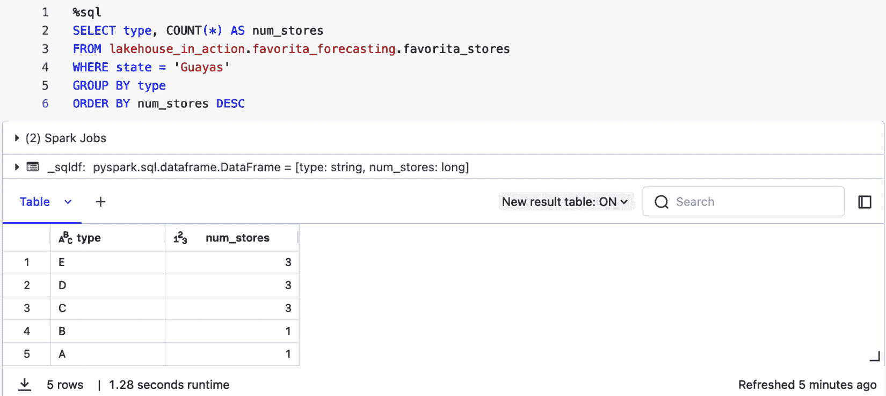

# 第四章：了解您的数据

“真理，就像金子一样，不是通过其增长，而是通过洗去其中所有非金子的东西来获得的。”

——列夫·托尔斯泰

在本章中，我们探讨了 Databricks DI 平台内的功能，这些功能有助于提高和监控数据质量，并促进数据探索。使用 Databricks 更好地了解您的数据有无数种方法。首先，我们将介绍如何使用 **Delta Live Tables** (**DLT**) 监督数据质量，以尽早发现质量问题并防止整个管道受到污染。我们将首先深入了解 Lakehouse Monitoring，它帮助我们分析数据随时间的变化，并可以提醒我们关注的变化。Lakehouse Monitoring 是一个节省大量时间的功能，让您能够专注于减轻或响应数据变化，而不是创建计算标准指标的笔记本。

探索数据，我们将探讨几种低代码方法：Databricks 助手和 **AutoML**。最后，我们将简要介绍嵌入。我们在 *第三章* 中从文本块中创建了嵌入，您将学习如何使用 Databricks **向量搜索** (**VS**) 来探索您的嵌入。

作为本章的一部分，您将学习以下内容：

+   使用 DLT 提高数据完整性

+   使用 Databricks Lakehouse 监控监控数据质量

+   使用 Databricks 助手探索数据

+   使用 AutoML 生成数据配置文件

+   准备数据以进行向量搜索和数据库索引

+   使用 Databricks 向量搜索增强数据检索

+   应用我们的学习

# 使用 DLT 提高数据完整性

在上一章中，我们介绍了 DLT 作为流数据管道开发的实用工具。在这里，我们专注于如何将 DLT 作为您的首选工具来积极跟踪数据质量。通常，数据集是动态的，不像在学校和培训中那样整洁有序。当然，您可以使用代码来清理数据，但有一个功能使清理过程更加容易：DLT 的预期。DLT 的预期捕获传入的数据质量问题，并自动验证传入数据是否通过指定的规则和质量检查。例如，您可能希望客户数据在年龄上有正值，或者日期遵循特定的格式。当数据不符合这些预期时，可能会对下游数据管道产生负面影响。实施预期后，您确保您的管道不会受到影响。

实施预期给我们更多的数据质量控制，提醒我们注意和采取行动的不寻常数据。在处理 DLT 中的错误数据时，有几个选项：

1.  首先，我们可以设置一个警告，该警告将报告未通过预期的记录数作为指标，但仍然将那些无效的记录写入目标数据集；请参阅 *图 4* 中的 `@dlt.expect()` 示例。1

1.  第二，我们可以丢弃无效记录，这样最终数据集只包含满足我们预期的记录；参见*图 4**.1*中的`@dlt.expect_or_drop()`。

1.  第三，我们可以完全失败操作，这样就不会写入任何新内容（请注意，此选项需要手动重新触发管道）。

1.  最后，我们可以将无效数据隔离到另一个表中以进一步调查。以下代码应该与*第三章*中的 DLT 代码相似，但现在增加了预期。

图 4.1 – 使用 DLT 预期来强制数据质量

让我们以我们的流式事务项目为例。在*第三章*中的*应用我们的学习*部分，我们使用 DLT 将交易数据写入表。利用相同的 DLT 代码，我们将通过在原始代码中添加一个预期来删除任何`CustomerID`为`null`的记录，从而节省手动清理`CustomerID`列的努力。我们还将设置另一个预期，如果`Product`字段为`null`，则发出警告。

现在，当我们调用`generate_table()`时，DLT 管道将自动清理我们的表，删除任何空`CustomerID`值，并标记没有`Product`值的记录。此外，DLT 将自动构建有用的可视化，以便立即调查数据的质量。

要自己尝试，请更新*第三章*中的 DLT 代码（这里提供笔记本路径作为提醒：`Chapter 3``: Building` `Out Our` `Bronze Layer/Project: Streaming Transactions/delta_live_tables/`），以匹配*图 4**.1，然后像之前一样重新运行 DLT 管道。一旦管道完成，它将生成 DAG。点击`synthetic_transactions_silver`表，然后从表详情中点击**数据质量**选项卡。这将显示有关已处理的记录的信息，例如有多少条记录因未通过特定预期而被写入或丢弃，如图*图 4**.2*所示。

图 4.2 – DLT 数据质量可视化

这些见解说明了预期如何帮助我们自动清理表并标记可能对下游使用此表的数据科学家有用的信息。在这个例子中，我们看到所有记录都通过了`valid_CustomerID`预期，因此现在我们知道我们不必担心表中存在空客户 ID。此外，近 80%的记录缺少`Product`值，这可能对使用此数据的数据科学和**机器学习**（**ML**）项目相关。

正如我们已经考虑了传入数据的正确性和一致性，我们还想考虑如何扩大我们的数据质量监督范围，包括数据漂移，例如，当您的数据分布随时间变化时。观察数据漂移是 Databricks Lakehouse 监控作为 DLT 的重要补充出现的地方，它提供了一个可配置的框架，以一致地观察和验证输入数据的统计特性和质量。

# 使用 Databricks Lakehouse 监控监控数据质量

使用 Databricks Lakehouse 监控来主动检测和应对数据分布中的任何偏差。随着时间的推移，数据可能在其基本模式上发生变化。这可能是特征漂移，即特征数据的分布随时间变化，或者是概念漂移，即模型输入和输出之间的关系发生变化。这两种类型的漂移都可能导致模型质量下降。这些变化可能在生产环境中缓慢或迅速发生，这就是为什么在数据成为您的机器学习模型和数据产品的输入之前监控数据至关重要。

## Lakehouse 监控的机制

要在 Databricks 中监控一个表，您需要创建一个附加到该表的监控。要监控机器学习模型的性能，您需要将监控附加到包含模型输入和相应预测的推理表。Databricks Lakehouse 监控提供以下配置文件类型的分析：快照、时间序列和推理。

除了选择要监控的表，称为**主表**，您还可以选择性地指定一个基线表以参考测量漂移或随时间变化的价值。当您有一个您期望数据看起来如何的样本时，基线表非常有用，例如，使用您训练模型的数据。Lakehouse 监控自动计算与基线表预期数据值和分布的漂移。

自动创建表监控会自动创建两个度量表，`profile_metrics` 和 `drift_metrics`。Lakehouse 监控在您创建监控时指定的表上计算度量值，包括时间窗口和数据子集或“切片”。您还可以添加自己的自定义度量；有关详细信息，请参阅*进一步阅读*。

## 可视化和警报

Lakehouse 监控为每个监控自动生成一个 SQL 仪表板。这些仪表板为检查指标和采取行动提供了一个关键平台。Databricks 的警报系统充当一个警惕的守护者，及时通知您订阅的数据质量或分布的重大变化。*图 4**.3* 展示了 Lakehouse 监控的所有组件如何协同工作，使用主表和可选的基线表中的数据生成配置文件度量表和漂移表，然后填充仪表板并触发警报。

图 4.3 – 输入表、指标表、监控器和仪表板之间的关系

## 创建监控器

您可以使用 **用户界面**（**UI**）或，为了更灵活和可编程的方法，您可以使用 API 来创建 Databricks Lakehouse 监控器。当您想要编写脚本来创建监控器并将其集成到自动化数据管道中时，API 方法特别有利。以下是用 API 创建 Lakehouse 监控器步骤的高级概述：

1.  `Snapshot`、`TimeSeries` 和 `Inference`。每种类型适用于不同的监控场景，其中 `TimeSeries` 和 `Inference` 类型需要时间戳列。推理配置文件还需要 `prediction_col` 和 `model_id_col`。

1.  使用 `lakehouse_monitoring` 模块调用 `create_monitor` 函数，提供您的表的目录模式、表名、选择的配置文件类型以及监控器结果的输出模式。

1.  `MonitorCronSchedule` 对象，它接受 cron 表达式和时间区域 ID。

1.  **控制访问**：创建监控器后，您可以使用 Unity Catalog 权限管理结果指标表和仪表板的访问权限。

1.  `run_refresh` 函数用于刷新和更新指标表。您还可以使用 `get_refresh` 函数检查特定运行的状况，并使用 `list_refreshes` 列出与监控器关联的所有刷新操作。

1.  `get_monitor` 函数允许您检索监控器的当前设置以供审查。

*图 4**.4* 展示了如何使用 Lakehouse 监控 API 创建 `TimeSeries` 配置文件监控器的示例：

图 4.4 – 创建简单的 TimeSeries 表监控器

在使用 Databricks Lakehouse 监控建立稳健的数据质量监控框架后，我们可以专注于增强我们的数据探索。这使我们转向 Databricks 助手，这是一个专门帮助开发者提高 Databricks 生产力功能。

# 使用 Databricks 助手探索数据

Databricks 助手是一个旨在提高你在 Databricks 中生产力的功能。它具有许多功能，包括从英语生成 SQL、解释代码、帮助调试错误和优化代码。随着更多功能的出现，Databricks 助手是一个令人兴奋的功能，我们希望让你体验一下这些可能性。由于本章是关于探索和监控数据，让我们看看你如何使用 Databricks 助手作为低代码解决方案来探索你的数据。假设你正在分析 Favorita 销售预测数据。你希望了解不同地区零售商店的分布情况。你心中有一个特定的查询：你想要了解瓜亚斯地区的商店格局。然而，SQL 查询并不是你的强项，也许编写完美的查询看起来很令人畏惧。为了探索你的数据，你可以使用 Databricks 助手。本节的项目仓库中没有笔记本，但我们鼓励你尝试在 Favorita 预测项目表上使用 Databricks 助手。任何 *第四章* 的 Favorita 笔记本都是一个很好的地方来访问 Databricks 助手。要访问它，点击笔记本左侧侧边栏中显示的图标（*图 4**.5*），点击图标将打开笔记本左侧的聊天界面，我们将在此处输入我们的问题。

图 4.5 – Databricks 助手图标

首先，我们向 Databricks 助手询问在 `favorita_stores` 表中（*图 4**.6*）有多少家商店和商店类型。请注意，Databricks 助手不需要 Unity Catalog，但使用 Unity Catalog 可以提供表信息。额外的信息使得 Databricks 助手的回答更加有用，并且更具体于你正在处理的表。这应该听起来类似于 **检索增强生成**（**RAG**）项目。我们通过提供相关信息来增强答案的生成。现在，让我们看看它是否可以帮助我们编写所需的 SQL 查询。记住，Databricks 助手由 **生成式 AI** 驱动，因此当你自己使用它时可能会看到不同的输出。

图 4.6 – 与 Databricks 助手的提问和回答交互

太好了！Databricks 助手给了我们一些 SQL 代码，可以直接粘贴到笔记本中并运行。然而，快速浏览查询后，我们发现我们只能得到商店和类型的唯一计数，而不是查看我们想要的商店类型分布。让我们完善我们的问题，然后再次尝试（*图 4**.7*）。

图 4.7 – 提交给 Databricks 助手的更新问题及其结果

在 *图 4.7* 中提交第二个问题后，Databricks 助手提供了一个新的查询，准确地捕捉了我们想要了解的内容。为了确保这一点，让我们复制提供的 SQL 代码，将其粘贴到笔记本中，并运行它。

图 4.8 – Databricks 助手生成的 SQL 查询结果

现在，我们看到瓜亚基尔地区的商店类型分布，正如我们希望的那样。Databricks 助手是一个实用的工具，我们可以确认玩弄它也是一件有趣的事情！我们鼓励您亲自尝试，看看您如何可以使用英语来探索您的数据。

Databricks 助手还为您的表格和字段生成注释建议。从之前探索的 `favorita_stores` 表格中，我们在 *图 4.9* 中看到 Databricks 助手为表格注释提出了建议，以帮助其他人理解表格的内容。

图 4.9 – Databricks 助手建议一个描述性的表格注释

Databricks 助手还可以通过在表格的“列”标签页右侧选择“**AI 生成**”按钮为表格中的每个字段生成描述性注释。您可以接受或编辑建议的注释。您可以通过选择“**隐藏 AI 建议**”按钮来关闭建议，如图 *图 4.10* 所示。10*。

图 4.10 – Databricks 助手为表格中的列建议注释

生成的注释可能看起来像是超出了了解您数据的范围，但文档对于使您的数据更容易被其他人发现至关重要（并且我们希望其他人也能使用生成的注释，这样您就可以更轻松地探索他们的数据集）。您越快了解一个数据集，就越容易进一步探索这些数据。

当您更喜欢用英语而不是直接编写代码来分析数据时，Databricks 助手是分析您数据的一个很好的方式，并且当您心中已有具体问题时。现在让我们讨论另一种更广泛的 **探索性数据分析**（**EDA**）方法：使用 AutoML 自动生成的笔记本。

# 使用 AutoML 生成数据概要

我们在*第一章*中介绍了 Databricks AutoML。这个工具自动化 ML 开发并增强数据科学工作流程。AutoML 最出名的是生成模型，但我们将会在*第六章*中讨论建模。由于我们正在讨论了解您的数据，我们首先想关注 AutoML 中内置的一个极其有用的功能，这个功能通常被忽视：自动生成的 Python 笔记本。除了为每个运行的实验提供笔记本代码外，AutoML 还提供了一个用于数据探索的笔记本。我们将直接进入创建 AutoML 实验，查看数据探索代码，然后稍后再返回探索建模部分。

我们将在 Favorita 项目笔记本中介绍如何通过 API 创建 AutoML 实验。我们鼓励您遵循这里的说明，使用 AutoML UI 设置一个简单的回归实验，这样我们可以查看创建的数据概要。在您开始之前，请确保您有一个 DBR ML 9.1+集群正在运行（您可以使用*第二章*中设置的**DBR ML 14.2**集群）：

1.  **启动实验**：导航到平台左侧导航栏上的**实验**标签页。点击**AutoML 实验**按钮以启动新实验。

1.  `ml_in_action.favorita_forecasting.favorite_train_set` 表，或您自己的数据（只需确保如果`Regression`不适用，更新问题类型）。

1.  **预测目标**：选择您数据集中想要预测的特定列。AutoML 过程将使用您数据集中的其他列来尝试预测目标列中的值。如果您正在跟随 Favorita 场景，请选择**销售**。

*图 4.11* 展示了使用`favorite_train_set`训练表进行 AutoML 实验的配置。它说明了您如何自定义 AutoML 过程以适应您 ML 任务的特定要求。通过选择适当的问题类型、数据集和预测目标，您指导 AutoML 系统如何进行模型构建过程。

图 4.11 – 使用 Favorita train_set 表的 AutoML 实验配置

一旦您填写了 UI 并指定了 Favorita 表（或您选择的另一个表）作为您的输入训练数据集，请点击屏幕底部的**开始 AutoML**。AutoML 实验可能需要数小时才能完成，因为评估指标的改进仍在继续，尽管您可以通过更改**超时**值（在**高级** **配置**下找到）为实验设置较短的时间限制。实验开始时，将打开一个新页面，显示进度更新。一旦实验完成，您将看到两个数据实体的链接：包含最佳模型代码的笔记本，标记为**查看最佳模型笔记本**，以及数据探索笔记本，标记为**查看数据探索笔记本**，如图*图 4.12*所示。

图 4.12 – 包含查看最佳模型笔记本和数据探索笔记本链接的 AutoML 实验页面

探索笔记本使用`ydata-profiling`（以前称为 pandas 的 profiler 库）生成统计数据并总结表中的所有字段数据。它还提供有关具有高度相关问题的字段的警报，这可能会对模型产生负面影响。这些警告也显示在 MLflow 实验 UI 中，如图*图 4.13*所示。

图 4.13 – 实验运行期间调用的 AutoML 警告

查看数据探索笔记本，以了解您数据的概览，从汇总统计到每个变量的详细配置文件。

我们现在已经探索了两种数据探索工具：Databricks Assistant 和`ydata-profiling`库。这些是许多经典机器学习项目开始的绝佳选择。接下来，我们将讨论更高级的数据格式以及如何使用 DI 平台来探索它：数据嵌入和向量搜索。嵌入是高级转换，将复杂、非结构化数据转换为有利于机器学习算法的数值格式，捕捉数据中的复杂关系，这对于复杂模型至关重要。

# 使用嵌入来理解非结构化数据

到目前为止，我们关注的是如何探索您的结构化数据。那么非结构化数据，如图像或文本呢？回想一下，我们在 *第三章* 的 RAG 聊天机器人项目工作中将 PDF 文本块转换为称为嵌入的特定格式。我们需要嵌入，即数据的数值向量表示，以在文本块之间执行相似性（或混合）搜索。这样，当有人向我们的聊天机器人提问，例如“使用 LLM 的自动化技术对经济有什么影响？”时，聊天机器人将能够搜索存储在 arXiv 文章中的文本块，检索最相关的块，并使用这些块更好地回答问题。对于更倾向于视觉阅读的读者，请参阅 *图 4**.14* 中的数据准备工作流程。我们在 *第三章* 中完成了 **数据准备** 步骤。现在我们将运行工作流程中的剩余设置步骤。

图 4.14 – 向量数据库设置是支持 RAG 检索步骤的先决过程

嵌入是构建任何聊天机器人的基本部分。请注意您的嵌入模型，确保它与任务相关。您不希望构建一个旨在用法语回答问题的聊天机器人，但使用一个只知道英语的嵌入模型——您的聊天机器人的响应质量肯定会受到影响！

捕捉语言细微差别的嵌入对于聊天机器人理解和生成上下文相关的响应至关重要。同样重要的是您应用于**向量数据库**本身的搜索和过滤技术。向量数据库类似于 SQL 数据库，但它存储的是向量嵌入，而不是表格数据。然后搜索算法可以搜索这些嵌入。在 RAG 项目的最终流程中，用户的提问也被转换为嵌入，搜索算法使用这些嵌入在向量数据库中找到相似的嵌入。聊天机器人从向量数据库中获取最相似的嵌入，以帮助它为用户的提问构建响应。

让我们考虑一个好的向量数据库解决方案的要求：

+   **检索质量**：搜索算法返回的作为相关内容的嵌入的正确性和完整性

+   **解决方案的可扩展性**：根据应用程序接收到的请求数量和动态流量进行扩展的能力

+   **可访问性**：能够轻松访问、实时读取、写入和使用应用程序的能力

+   **治理**：使用与创建向量嵌入和模型所使用的原始源相同的访问控制来管理向量存储的能力

+   **集成**：能够轻松集成当前市场技术并消除拼接技术和解决方案所需的时间

使用嵌入和向量搜索是改进各种机器学习项目的强大方式。向量数据库有许多用途，其中最常见的是以下几种：

+   **RAG 系统**：向量搜索促进了高效的数据检索，随后这些数据被用于增强**大型语言模型**（**LLM**）的响应。通过向量搜索的结果增强 LLM，可以导致聊天机器人响应更加准确，并最小化 LLM 输出中的幻觉等错误。

+   **推荐系统**：电子商务和流媒体平台使用向量搜索进行高效的最近邻搜索，将用户行为与相关建议相匹配。

+   **图像和视频识别**：向量搜索促进了在图像和视频中快速搜索相似特征。

+   **生物信息学**：向量搜索可用于 DNA 序列比对和蛋白质结构相似性搜索等任务，以提升临床研究。

# 使用 Databricks 向量搜索增强数据检索

Databricks VS 正在改变我们为 LLM 精炼和检索数据的方式。作为无服务器相似性搜索引擎，VS 允许在专用向量数据库中存储向量嵌入和元数据。通过 VS，您可以从 Unity Catalog 管理的**Delta**表中生成动态向量搜索索引。使用简单的 API，您可以通过查询检索最相似的向量。

这里是 Databricks VS 的一些关键优势：

+   **无缝集成**：VS 在 Databricks 生态系统内和谐工作，尤其是在 Delta 表方面。这种集成确保了您的数据始终保持最新，使其为机器学习应用做好准备。使用 VS，您可以从源 Delta 表创建向量搜索索引，并在源表更新时设置索引同步。

+   **简化操作**：VS 通过消除管理第三方向量数据库的需要，显著简化了操作复杂性。VS 在无服务器计算上运行，这意味着 Databricks 为您处理基础设施管理。

+   **增强的可扩展性**：与独立的向量库不同，VS 提供了无与伦比的可扩展性。VS 轻松处理大规模数据，自动扩展以满足您数据和查询负载的需求。这种可扩展性对于拥有大量数据且具有复杂搜索要求的企业至关重要。

+   **统一的数据资产管理**：VS 与 Unity Catalog 集成；Unity Catalog 处理数据治理和访问控制列表。为了防止生产数据泄露，您可以使用 Unity Catalog 管理对 Databricks VS API 和底层数据库的访问。

+   **模型服务集成**：模型服务自动化了模型服务端点的查询，以生成嵌入，无需用户承担任何开销。

## 支持嵌入模型的灵活性

VS 的一个主要优势是它支持你选择的任何嵌入模型。VS 支持托管或完全管理的嵌入。托管嵌入是自行管理的。你创建嵌入并将它们保存在 Delta 表中。对于完全管理的嵌入，准备好的文本保存在 Delta 表中，嵌入由 Databricks Model Serving 创建。Model Serving 将使用你选择的模型将你的传入数据转换为嵌入。Databricks VS 可以通过 Databricks Model Serving 端点、基础模型 API（如*第三章*中所述）或外部模型支持任何模型。外部模型包括 SaaS 模型，例如 OpenAI 的 ChatGPT 和 Anthropic 的 PaLM。你可以通过 Databricks 统一模型服务网关连接外部模型。有关更多信息，请参阅“进一步阅读”中的*“Databricks Model Serving 中的外部模型”*。

## 设置向量搜索

如前所述，VS 是一个无服务器产品。因此，我们需要与我们的聊天机器人应用程序到向量数据库中存储的相关内容保持实时连接。我们将在“应用我们的学习”，“项目 – RAG 聊天机器人”部分再次介绍这一点，但如果你准备好设置自己的端点，你只需要几行代码，如图*4.15*所示。

图 4.15 – 创建 Databricks VS 端点

一旦创建端点，你就可以在单个端点下托管多个向量搜索索引。端点将根据需求进行扩展。托管第一个索引的代码在*“应用我们的学习”*部分中展示）。

每个端点可以创建索引的数量和嵌入维度有限制。请查阅*“进一步阅读”*中链接的文档，因为随着产品的演变，Databricks 可能会删除或更新限制。

技术发展迅速，尤其是在生成式 AI 的世界里。Databricks VS 就是在撰写本书的同时被构建的，我们预计它将继续发展，未来不仅能够通过文本搜索，还能通过更强大的混合搜索引擎搜索图像和音频。

我们已经介绍了各种 Databricks 产品功能，旨在帮助你理解你的数据。准备好跟随我们在自己的 Databricks 工作区中工作，通过项目来执行*第四章*的代码，并将这些概念付诸实践。

# 应用我们的学习

是时候将这些概念应用到我们的示例项目中了。我们将利用所学知识来探索每个项目数据集，从使用 Databricks 助手到 AutoML，再到创建向量搜索索引和探索图像数据。

## 技术要求

在开始之前，请回顾并准备本章动手工作所需的技术要求：

+   我们使用`missingno`库来解决合成交易项目数据中的缺失值：[`pypi.org/project/missingno/`](https://pypi.org/project/missingno/)

+   对于 RAG 项目，你需要在你的集群或`CH4-01-Creating_VectorDB`笔记本中安装以下内容。如果你选择在笔记本中安装它们，代码已经为你准备好了：

    +   `typing_extensions==4.7.1`

    +   `transformers==4.30.2`

    +   `llama-index==0.9.3`

    +   `langchain==0.0.319`

    +   `unstructured[pdf,docx]==0.10.30`

## 项目 – Favorita Store Sales – 时间序列预测

对于 Favorita Store Sales 项目，我们使用许多简单的 DBSQL 查询进行数据探索，并了解数据集之间的关系。此外，我们使用`ydata_profiling`库以 HTML 格式生成数据配置文件，如图 4.19 所示。要在你的工作空间中跟随，请参考以下笔记本：

+   `CH4-01-Exploring_Favorita_Sales_Data`

+   `CH4-02-Exploring_Autogenerated_Notebook`

+   `CH4-03-Imputing_Oil_Data`

在上一章中，我们创建了 Kaggle 的 Favorita Sales Forecasting 数据集的表格。现在，是时候探索了！打开第一个笔记本，`CH4-01-Exploring_Favorita_Sales_Data`，在 SQL 中进行一些初步的数据探索：

1.  第一个单元是一个简单的`select *` SQL 命令。运行单元后，关注单元格内的**数据配置文件**和**可视化**选项。

图 4.16 – 你可以在笔记本中创建 SQL 查询结果的视觉化和数据配置文件

1.  选择**数据配置文件**并调查自动生成关于数据的信息。

1.  选择**可视化**。你可以创建一个以日期（月份）与销售额总和的折线图，并按系列分组。请注意，并非所有数据都用于生成可视化；我们最初只看到 1 月。一旦保存可视化，图表将显示在单元格中。可视化底部的**数据截断**消息应该存在。要增加图表中的记录数，请选择**在更多数据上聚合**。

1.  继续尝试不同的选项。在下一个单元中，我们将筛选出表现最好的产品系列。研究不同的图表看起来如何或有多相似。

现在我们已经对 Favorita 数据进行了初步探索，我们可以运行一个 Databricks AutoML 实验来生成一个基线模型。AutoML 可以在 UI 中启动，我们之前在本章的*使用 AutoML 生成数据配置文件*部分（*图 4.11*）中演示了这一点，或者你可以通过 API 创建一个实验，如图 4.17 所示。对于这个项目，我们将启动一个回归实验和一个预测实验。让我们从回归运行开始。

注意，在笔记本的顶部，默认语言是 SQL 而不是 Python。因此，当我们想要执行 Python 代码时，需要在单元格顶部包含`%python`。我们在第一个笔记本的最后一个单元格中使用 Python 进行 AutoML。我们将`timeout_minutes`变量设置为`30`，因此实验将运行最多 30 分钟。然而，如果验证指标不再提高，AutoML 将停止训练模型。在这种情况下，实验将提前完成。一旦运行完成，笔记本 UI 将显示链接到 MLflow 实验，其中可以访问模型版本，最佳试验笔记本包含最佳模型的代码，以及数据探索笔记本。由于本章重点在于探索数据，我们现在只打开数据探索笔记本。

图 4.17 – 从笔记本创建 AutoML 实验

### 数据探索的 AutoML

当你在`CH4-01-Exploring_Favorita_Sales_Data`中的最后一个单元格执行操作时，你会在结果中收到几个链接，如*图 4.17*所示。点击数据探索笔记本的链接（您也可以打开`CH4-02-Exploring_Autogenerated_Notebook`以查看我们在运行 AutoML 实验时自动生成的版本）。让我们看看这个笔记本。

图 4.18 – 使用 AutoML 创建的 EDA 笔记本

*图 4.18*显示了自动生成数据探索笔记本的一部分。该笔记本导入库并指向训练数据。它还自动将日期时间列转换为 pandas 日期时间。

该笔记本使用基于 pandas 的库，因此笔记本限制了数据为 10,000 行。

接下来，笔记本导入了`ydata_profiling`库，以及在此情况下添加的三个额外的相关性计算。`ydata_profiling`库提供了类似于使用`summary()`函数所获得的数据，例如关于缺失和相关性数据的详细信息。该库可以轻松导入笔记本以探索数据。一旦完成，您可以将其导出为 HTML 或 PDF 格式，以便轻松分享。在探索新数据集时，这是一个节省时间的好方法。

图 4.19 – AutoML 创建的笔记本中的 ydata_profiling

如*图 4.17*所示，我们通过调用`automl.regress()`通过 API 启动了一个回归实验。现在，我们使用 UI 创建另一个具有预测问题类型的实验。

图 4.20 – 在 UI 中创建 AutoML 预测实验

当我们创建一个 AutoML 预测实验时，我们可以在**高级配置**部分的**国家假日**选项中将一个国家的假日纳入模型。对于这个项目，我们将选择**NONE**，因为尽管在下拉菜单中有许多国家，但厄瓜多尔不在其中。**NONE**将确保假日不会被包括在模型的特征中。

图 4.21 – AutoML 预测实验高级配置

一旦所有字段都填写完毕，点击屏幕底部的**开始 AutoML**以运行实验（如果您想确保在给定时间内完成运行，请将**超时**变量调低）。当实验运行完成后，您将看到一个新屏幕，其中列出了生成的模型列表。

我们现在已经在笔记本中创建了一个 AutoML 实验，使用 AutoML 生成了一个用于 EDA 的笔记本，并使用 AutoML 进行时间序列分析。Databricks AutoML 通过最少的代码为 ML 和 EDA 做了很多繁重的工作。

The Favorita sales dataset contains oil prices, which we think could impact sales, so let’s augment the autogenerated data exploration with some of our own to explore the oil price data and see how we can use it.

### 探索和清理油价数据

要开始处理油价数据，请打开`CH4-03-Imputing_Oil_Data`笔记本。我们使用 Spark 上的 pandas API 查看数据（*图 4*.22）。我们重新索引数据，因为数据顺序混乱，并且某些日期的数据缺失。注意，最初数据从 2015 年 5 月开始，而不是从 2013 年 1 月开始。此外，5 月 9 日和 5 月 10 日似乎缺失。

图 4.22 – 在 Favorita 销售数据集中查看 Kaggle 提供的油价数据

如果我们将`date`列作为索引列，如图笔记本所示，您会看到行随后是有序的。然而，1 月 5 日和 1 月 6 日是缺失的。这是因为假日或周末没有提供股票价格。

图 4.23 – 通过重新索引包括所有日期并向前填充缺失的价格

我们使用`reindex()`命令根据油价数据的最早和最晚日期创建一个更新的索引。reindex 为所有缺失的日期创建行。当为缺失的日期创建新行时，价格是 NaN。我们使用`ffill()`函数，即前向填充，通过用前一天的价格填充没有价格的日期来更新 DataFrame。2013 年 1 月 1 日没有前一天的数据可以填充，所以它仍然是`NaN`。

现在，我们有一个干净且一致的油价银表，我们可以将其拉入我们的 Favorita 时间序列模型中。在下一章中，我们将使用 Favorita 销售数据进行特征工程。

## 项目 – 流式事务

合成数据集不需要清理（因为我们创建了它），但我们仍然可以探索数据以更好地理解它。要在您自己的工作区中跟随，请参考以下笔记本：

+   `CH4-01-Exploring_Synthetic_Transactions_Data`

打开笔记本，使用 `seaborn` 库生成如图 *4.24* 所示的视觉化。

图 4.24 – 合成事务数据的可视化

随意探索事务数据。接下来，我们将继续进行 RAG 聊天机器人。

## 项目 – RAG 聊天机器人

在上一章中，我们从我们的 PDF 文档中提取了文本块。我们使用 BGE 嵌入模型将这些块转换为嵌入。因此，我们现在已经准备好进行下一步，为检索准备我们的数据。要在您自己的工作区中跟随，请参考以下笔记本：

+   `CH4-01-Creating_VectorDB`

在 *使用 Databricks Vector Search 增强数据检索* 部分中，我们解释了 Databricks VS 是一个无服务器托管解决方案。换句话说，我们需要创建 VS 端点来托管我们的索引。

图 4.25 – 为 RAG 聊天机器人创建 Databricks VS 端点

作为提醒，我们将把我们在 *第三章* 中准备的源表导入索引，以便在聊天机器人应用程序中进行检索搜索。

图 4.26 – 读取包含文档文本的源表

我们从项目的 `utils` 文件夹导入函数，`mlia_utils.rag_funcs`。索引只需要创建一次。从现在起，我们只会写入它或从中读取。我们使用 `if`/`else` 语句来检查是否存在名为 `catalog.database.docs_vsc_idx_cont` 的索引。如果存在，我们只需将我们的 `catalog.database.pdf_documentation_text` 源表同步到它。

图 4.27 – 检查索引是否存在，如果需要则创建

在继续进行我们的聊天机器人项目之前，有几个关键点我们必须确保已经到位：

+   `catalog.database.pdf_documentation_text` 是您使用自管理的嵌入函数准备的 Delta 表，作为其向量搜索索引的主要数据存储库。

+   使用 Databricks VS 的 `catalog.database.docs_vsc_idx_cont`。此索引链接到源 Delta 表。索引基于触发器基础更新（`pipeline_type="TRIGGERED"`），这意味着对历史文本的任何修改或新增都需要手动同步到您的向量搜索索引。如果您希望更改自动反映在向量搜索索引中，请选择 `CONTINUOUS` 模式。这种连续更新机制确保数据始终是最新的，并准备好进行分析。

+   `text_chunks` 会自动通过 Databricks Model Serving 提供的模型转换为嵌入。这可以在设置中的 `embedding_model_endpoint_name` 参数下指定。这种集成保证了文本数据被高效地转换为向量，使其适合进行高级相似度搜索。

我们从 `utils` 文件夹导入 `wait_for_index_to_be_ready()` 函数。我们运行 *图 4**.28* 中的代码来反复检查索引的状态，直到它处于“在线”状态。由于 VS 索引只需要创建一次，这个函数在嵌入到达您的 VS 索引之前可能需要一些时间。一旦您的索引处于“就绪”状态，请继续操作。

图 4.28 – 索引等待函数检查索引状态，直到其上线并准备就绪

一旦索引上线，我们调用 `get_index()` 来执行相似度搜索。我们还调用 `describe()` 方法来展示您拥有的更广泛的 API 选项。

图 4.29 – 使用 get_index 和 describe 方法显示索引配置

由于我们使用自管理的嵌入，我们的 VS 索引没有连接到任何可以将我们的输入文本查询转换为嵌入并映射到数据库下的模型，因此我们需要先进行转换！这里我们再次利用 Foundational Model Serving API 中的 BGE 嵌入模型，然后将嵌入文本传递到我们的索引进行相似度搜索：

图 4.30 – 将我们的查询文本转换为嵌入并传递到索引进行相似度搜索

这里是检索查询的结果（仅显示找到的第一个，包含两列 `pdf_name` 和内容）：

图 4.31– 检索查询结果的样本

现在，我们的 VS 索引已准备好在我们的聊天机器人中使用。我们将在 *第六章* 中探讨如何连接所有工具以生成适当的人类可读答案！

## 项目 – 多标签图像分类

在上一章中，我们将图像数据保存到卷中。接下来，我们将探索数据。要在自己的工作区中跟随，请参考以下笔记本：

+   `CH4-01-Exploring_Dataset`

我们创建了图像训练数据集。打印标签和训练数据的一个样本，以便查看我们希望模型进行分类的内容。

图 4.32 – 加载并查看训练数据集

我们可以使用`display_image`来查看卷中的几张图片。

图 4.33 – 在笔记本中显示图像

了解我们数据不同标签的比例是很有帮助的。这样你可以查看训练数据集中数据的比例。无论你在哪里执行多标签分类，都要确保标签分布良好。否则，考虑训练单独的模型，这些模型可以组合或补充缺失的标签！

图 4.34 – 查看训练数据集中标签的比例

现在我们已经对图像分类数据集进行了高级探索。对于这个项目，不需要进行转换，因此我们接下来对这个数据的步骤将在*第六章*中。

# 摘要

在使用数据之前理解数据是至关重要的。本章强调了在 Databricks 生态系统中探索和分析我们数据的各种方法。

我们首先回顾了 DLT，这次我们关注的是如何使用一个名为**期望**的特征来监控和改进我们的数据质量。我们还介绍了 Databricks Lakehouse Monitoring 作为观察数据质量的另一个工具。在其众多功能中，Lakehouse Monitoring 可以检测数据分布的变化，并向用户发出异常警报，从而在整个生命周期中保持数据完整性。我们使用 Databricks Assistant 通过用英语编写的即席查询来探索数据，并展示了为什么 AutoML 是数据探索的一个极其有用的工具，因为它可以自动创建全面的数据探索笔记本。所有这些工具共同为您理解并探索数据提供了一个坚实的基础。最后，本章深入探讨了 Databricks VS，以及如何使用它来查找相似文档以改善聊天机器人的响应。

我们现在已经为数据旅程的下一阶段奠定了基础。*第五章*将专注于如何基于我们的青铜层数据构建丰富的特征集，用于数据科学和机器学习项目。

# 问题

以下问题旨在巩固需要记住的关键点，并将内容与你的个人经验联系起来：

1.  本章我们讨论了哪些低代码的数据探索选项？

1.  你可能在何时使用 Databricks Assistant 进行数据探索，何时使用 AutoML 的数据概览笔记本？

1.  你会如何以及为什么对你的数据进行预期设定？

1.  你会在什么情况下使用常规数据库而不是向量数据库？向量数据库的一些常见用例是什么？

# 答案

在思考过这些问题后，将你的答案与我们的答案进行比较：

1.  一些低代码数据探索选项包括使用`ydata`库、单元格数据概要、Databricks 助手和 AutoML。

1.  当你对想要构建的分析有很好的想法并且需要代码辅助时，Databricks 助手对数据探索很有用。Databricks 助手是加快编码过程或增强 SQL 知识的好方法。另一方面，AutoML 对于自动创建一个广泛涵盖你的数据集的概要笔记本非常有用。

1.  我们会使用 Delta Live Tables 来设定预期。预期是一种灵活处理数据异常并给出报告坏数据、丢弃该数据或完全失败管道的选项的方式。

1.  常规数据库，或关系数据库，是为表格形式的数据设计的，通常按行或列组织。向量数据库是为存储向量数据而设计的，例如嵌入和高维数据。向量数据库针对基于向量空间模型、相似性搜索、图像和视频分析以及其他机器学习问题进行优化。一些常见用例包括**检索增强生成**（**RAG**）系统、推荐系统和图像和视频识别。

# 进一步阅读

在本章中，我们指出了具体的技术、技术特性和选项。请查看这些资源，深入了解你最感兴趣的领域：

+   *在 DBSQL 中通过聚合启用可视化*：[`docs.databricks.com/sql/user/visualizations/index.html#enable-aggregation-in-a-visualization`](https://docs.databricks.com/sql/user/visualizations/index.html#enable-aggregation-in-a-visualization)

+   使用 ydata 分析器探索数据：[`ydata-profiling.ydata.ai/docs/master/index.html`](https://ydata-profiling.ydata.ai/docs/master/index.html)

+   *推进 Spark - 认识新的 Databricks* *助手*：[`youtu.be/Tv8D72oI0xM`](https://youtu.be/Tv8D72oI0xM)

+   *介绍 Databricks 助手，一个上下文感知的 AI* *助手*：[`www.databricks.com/blog/introducing-databricks-assistant`](https://www.databricks.com/blog/introducing-databricks-assistant)

+   *模型监控自定义指标* *创建*：[`docs.databricks.com/en/lakehouse-monitoring/custom-metrics.html`](https://docs.databricks.com/en/lakehouse-monitoring/custom-metrics.html)

+   Databricks 向量搜索：[`docs.databricks.com/en/generative-ai/vector-search.html`](https://docs.databricks.com/en/generative-ai/vector-search.html)

+   Databricks 模型服务中的外部模型：[`learn.microsoft.com/en-us/azure/databricks/generative-ai/external-models/`](https://learn.microsoft.com/en-us/azure/databricks/generative-ai/external-models/)
