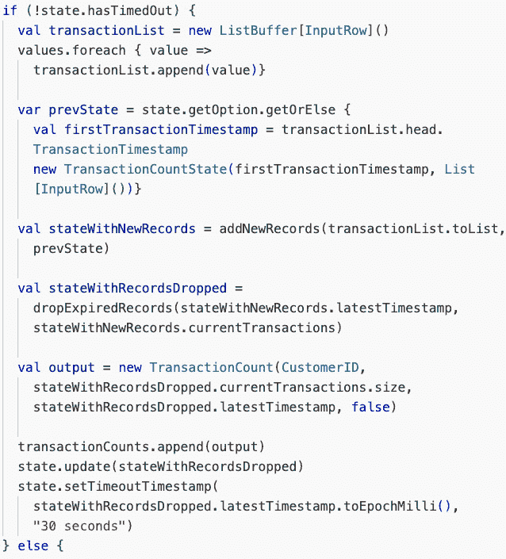

# 第五章：Databricks 上的特征工程

“应用机器学习基本上就是特征工程。”

– 安德鲁·吴

随着我们从*第四章*（我们利用 Databricks 探索和精炼我们的数据集）的进展，我们现在准备深入研究 Databricks 的组件，这些组件使下一步：特征工程成为可能。我们将首先介绍 Unity Catalog 中的**Databricks 特征工程**（**DFE**），向您展示您如何使用**Unity Catalog**（**UC**）高效地管理工程特征。了解如何在 UC 中利用 DFE 对于创建跨训练和推理的可重复和一致的特征至关重要。接下来，您将学习如何利用 Spark Structured Streaming 在流上计算特征，这允许您创建模型进行快速决策所需的状态化特征。特征工程是一个广泛的话题。我们将关注 DI 平台如何促进某些特征类别的开发，例如**时间点查找**和**按需功能**。您还将学习如何在模型推理期间实时计算特征，这对于需要即时数据处理的场景至关重要。我们将介绍的最后一个产品功能是**Databricks 在线商店**。您将了解如何使特征可用于实时访问，并增强低延迟应用中机器学习模型的响应性。

在本章中，您将学习以下内容：

+   Unity Catalog 中的 Databricks 特征工程

+   流式特征工程

+   使用时间点查找

+   计算按需特征

+   将特征发布到 Databricks 在线商店

+   应用我们的学习

# Unity Catalog 中的 Databricks 特征工程

在本章中，我们将关注几种类型的特征。特征类型可以根据它们相对于模型预测时间的计算时间大致分组。本章中我们涵盖的三种类型是批量、流式和按需：

+   在我们的*Favorita 销售预测*项目中，`holidays`字段，因为我们可以在需要之前计算它，并且不期望其值频繁变化。

+   **流式功能**：这些功能在数据管道中实时或接近实时地处理，作为源数据被摄取，允许连续和增量地创建特征。为了演示这一点，我们将使用 Spark Structured Streaming 为我们的*流式事务*项目计算一个流式特征。

+   **按需功能**：与批量或流式功能不同，按需功能仅在需要时计算，也就是说，在推理时。这些功能对于事先未知且必须实时计算的特征值场景至关重要。我们将深入探讨计算和存储这些功能的机制，展示它们的实现和集成到预测模型中。

任何具有定义好的主键约束的 Unity Catalog 表都可以是一个集中式仓库，用于存储和预计算（例如，批量或流式）的特征。这些类型的表，其明确目的是集中存储整个组织在分析、数据科学和机器学习项目中使用的特征，通常被称为**特征表**。特征表允许数据科学家共享他们构建的特征，并找到其他团队成员构建的特征。

它们是确保业务逻辑集中存储的绝佳方式，可以节省团队成员重新创建已创建的特征，并防止重复工作。此外，Unity Catalog 管理所有数据的可发现性、血缘和治理，因此您的特征表可以像任何其他表一样轻松管理。在 Databricks 中，任何具有非空主键的表都可以是特征表。虽然没有特定的 API 调用来列出所有有资格成为特征表的表或列出官方创建的特征表，但我们建议使用标签或命名约定来识别特征表。本书的示例项目将遵循在特征表名称末尾附加 `_ft` 的约定。Unity Catalog 中的特征工程提供了用于创建和更新特征表的 `FeatureEngineeringClient` Python 客户端（通常以别名 `fe` 导入）(*图 5.1*):

图 5.1 – 使用 FeatureEngineeringClient 创建特征表的示例

正如我们提到的，Delta、UC 和特征工程客户端的组合提供了相当大的好处。特征可以在团队间共享和重用，减少从头开始重新创建它们的需求。可重用性可以节省时间和资源，还可以帮助确保特征在不同团队间的一致性。集中式特征表确保相同的代码在训练和推理时计算特征值。这对于避免在线/离线偏差尤为重要——也就是说，当模型训练阶段（离线）使用的数据转换与模型部署和进行预测时（在线）使用的数据转换不同时，可能会出现的差异。*图 5.2* 展示了一个数据科学项目工作流程，并突出了必须匹配的离线和在线转换。

图 5.2 – 通过确保在训练数据和推理数据上执行的数据转换相同，你可以避免准确性问题

我们将通过将数据转换过程包装在 *第六章* (*Chapter 6*) 中的打包模型中来防止 *流式事务* 项目的在线/离线偏差。一致性可以提高模型的准确性，因为它确保相同的输入在生产环境中产生与训练时相同的输出。

注意

对于熟悉 Databricks Feature Store 的人来说，你可能想知道为什么我们在这章中没有使用它。在 Unity Catalog 之前，Databricks Feature Store 通过添加血缘和元数据细节提供了巨大的价值。随着 UC 的发展，而不是有一个单独的特征存储产品，每个使用 UC 的表都自动具有这些附加的好处。原始的 Databricks Feature Store 已经被吸收到 UC 中。

在前面的 *应用我们的学习* 部分中，我们将使用 SQL 和 `FeatureEngineeringClient` 将我们的特征保存到特征表中。一旦存储，Unity Catalog 就可以轻松跟踪创建特征所使用的数据源以及使用每个特征的下游工件（例如模型和笔记本）。更好的是，当你使用来自特征表的特征训练集记录模型时，特征元数据会与生成的模型一起打包。当我们在 *流式* *事务* 项目上工作时，请注意这一点。

# 流上的特征工程

在深入探讨流上的特征工程之前，我们想澄清 *流式管道* 和 *流数据* 之间的区别。如果你之前没有使用过 Spark Structured Streaming，它是一个建立在 Spark SQL 引擎之上的流处理引擎。它使得编写类似于为静态数据编写表达式的流计算或转换变得容易。结构化流管道可以处理批量或流数据。流管道具有检查点等元素来自动化数据流。然而，流管道并不一定总是运行；相反，它们只有在开发者选择时才会运行。相比之下，流数据（也称为 **实时数据**）是指持续生成并可实时或批量处理的数据。为了简化，可以将流管道想象成工厂中一系列自动化的传送带，用于处理（数据）物品。这些传送带可以根据需要打开或关闭。另一方面，流数据就像是一条不断堆积在生产线起点的物品的永不停止的流动。根据流量的多少，可能需要立即处理。在我们的 *应用我们的学习* 部分中的 *流式事务* 示例中，我们使用这些自动化的传送带（流管道）来有效地管理和转换这种连续流动的物品（流数据）成有用的形式。

流数据有多个好处：

+   **即时洞察**：流式数据允许您快速获得洞察力，并基于数据做出实时决策。速度对于时间至关重要的应用程序至关重要，例如金融交易或工业设备的实时监控。

+   **最新分析**：实时处理流式数据允许进行更当前的数据分析。实时分析可以帮助您在事件发生时发现模式和趋势，并采取主动措施解决潜在的数据质量问题。

+   **提高效率**：流式数据可以帮助组织通过快速响应事件并主动采取行动来提高效率。短响应时间可以提高客户满意度，减少停机时间，并提高生产力。

流式数据可以为那些需要快速处理大量数据并基于这些数据做出实时决策的组织提供显著的好处。然而，有一些转换需要更复杂的流式处理类型，特别是**有状态的流式处理**。有状态的流式处理是指消耗连续数据流并持久化过去事件状态的流处理。持久化状态使得流“知道”之前交易的信息。这在计算时间窗口内的聚合时特别有用，因为聚合需要从流中的上一个窗口中获取值。为了使这一点更清晰，我们在*流式事务*项目中提供了一个示例。在*进一步阅读*部分还有一个解释有状态流式处理的详细信息的视频链接。

注意

在开始向流式特征表写入之前，应该修改这些表。运行`ALTER TABLE`命令会导致流停止。但是，如果您必须修改表，您可以重新启动流。尽可能做好准备和提前规划！

DFE 客户端支持对基于时间的特征进行智能处理和查找，例如我们标记的时间流特征。接下来，让我们了解一下这个节省时间的产品特性。

# 使用时间序列特征表的时间点查找

时间序列特征表是 Unity Catalog 中具有`TIMESERIES`主键的任何表。这些表有资格进行时间点查找，这是一种查找正确特征值的机制。在`training_sets`之前，在*第六章*中，我们经常将表连接起来，将训练行与其特征值连接起来。然而，细粒度的事件时间戳不适合连接。这导致了将时间戳四舍五入到分钟、小时甚至天。根据用例，这种方法可能或可能不适用。例如，在*图 5**.3 中，基于`TransactionTimestamp`的连接在标准连接中是不现实的，因此可能会创建`TransactionMinute`或`TransactionHour`。

| **交易时间戳** | **交易分钟** | **交易小时** |
| --- | --- | --- |
| 2023-09-03 19:23:09.765676 | 2023-09-03 19:23:00 | 2023-09-03 19:00:00 |
| 2023-09-03 19:23:09.765821 | 2023-09-03 19:23:00 | 2023-09-03 19:00:00 |
| 2023-09-03 19:23:09.765899 | 2023-09-03 19:23:00 | 2023-09-03 19:00:00 |

图 5.3 – 时间戳舍入示例，便于连接

通过使用点时间查找，可以解决这个问题，因为它会为您处理时间匹配。对于那些熟悉*谁是价格先生*（The Price Is Right）的人来说，它是指不超过最近的特征值。更具体地说，它将与事件时间戳的最新特征值匹配，而不会提供事件之后计算的特征值。您无需担心训练过程中的数据泄露。如果没有`Timeseries`主键，特征的最新值将被匹配。

注意

建议在时间序列表上应用 Z 排序以在点时间查找中提高性能。Z 排序在*第七章*中有介绍。

查找特征非常好，通常是您用例的最佳选择。然而，在某些数据科学和机器学习任务中，我们需要在事先没有数据的情况下快速计算特征值。对于这些项目，我们需要按需特征。

# 按需计算特征

在短时间内计算每位客户的交易数量以流式处理方式工作，因为我们只需要使用历史数据。当我们想要使用仅在推理时间才可用的特征时，我们使用按需特征，直到推理时间之前其值未知。在 Databricks 中，您可以使用 Python `training_set`配置创建按需特征，以创建训练数据集，正如您将在*第六章*中看到的。

让我们再次考虑*流式事务*项目。我们希望添加一个功能，用于比较产品销售价格与其历史最高价格，并将其作为训练数据的一部分来预测生成的分类标签。在这种情况下，我们只有在收到交易后才知道购买价格。我们将在*应用我们的* *学习*部分中介绍如何为*流式事务*项目构建 Python UDF 以计算按需特征。

此外，我们建议您查看*如何通过实时计算提高 Databricks AI 模型准确性*和*在 Databricks 上实时特征计算的最佳实践*这两篇文章，以获取 Databricks 按需专家的深入建议；请参阅*进一步阅读*部分获取链接。

我们已经讨论了在 Unity Catalog 中保存功能到特征表，这是没有低延迟要求的应用的标准的“离线”模式。如果您的业务问题需要低延迟或快速结果，您需要在在线表中存储数据或实现 Databricks Feature Serving。特征服务可以提供函数以及预计算的特性。对于低延迟项目，我们推荐使用 Databricks 模型服务，因为它消除了对特征服务的任何需求。本书中我们不涉及特征服务，但如果您打算将模型外部发布到 Databricks，特征服务可能对您感兴趣。

接下来，我们将学习如何利用 Databricks 在线商店。

# 将功能发布到 Databricks 在线商店

如果您想使用实时服务功能，可以将功能发布到低延迟数据库，也称为在线商店。将特征表发布到低延迟数据库允许在模型推理期间自动查找特征。选择在线商店时有很多选项可供选择。典型的数据服务解决方案需要专家工程师选择合适的数据库进行在线访问，构建数据发布管道，并协调部署。部署后，有人需要监控、管理和优化向在线商店提供数据的管道。这就是为什么我们推荐 Databricks 自带的完全托管的无服务器在线商店，它直接集成到平台中。它自动将您的 Delta 特征表与在线商店同步，使得使用起来非常方便。Databricks 在线商店与 Databricks 模型服务集成，因此您无需离开 Databricks 就可以轻松设置在线商店。要创建在线商店，请转到**计算**标签页，选择**在线商店**，然后选择**创建商店**。下一步是输入您的在线商店名称，您可以根据每秒查找次数选择商店的大小，如图 *图 5**.4* 所示。

图 5.4 – 从计算屏幕创建在线商店

要将数据同步到您的在线商店，请转到商店中您想要的数据表格，然后从**创建**按钮左侧的热狗菜单中选择**同步到** **在线商店**。

图 5.5 – 从表格同步数据到您的在线商店

您需要指定用于查找的主键，如果需要，还需要指定时间戳列，然后确认同步您的数据。

图 5.6 – 使用其主键确认在线商店

您可以在**详情**标签页上检查您在线商店的同步状态。

图 5.7 – 查看实验运行的笔记本 UI

同步您的表很简单。不需要额外的工程！一旦您的特征表建立并准备好用于 Databricks 在线商店，只需通过提供主键、时间戳列（如果适用）以及同步频率（*图 5**.8*）来同步表。

图 5.8 – 同步特征表到 Databricks 在线商店的 UI

在线商店非常适合在低延迟速度下访问时仅存储记录的最新特征值。常见的用例包括需要快速特征查找和向应用程序提供数据的模型。您可以使用 Delta Lake **变更数据馈送**（**CDF**）充分利用 Databricks 在线商店，它跟踪 Delta 表中的行级更改。使用 CDF，您只需更新特征表中的更改值，而不是覆盖整个表或跟踪时间戳。因此，您需要与 Databricks 在线商店同步的数据更少。此外，我们可以在 Unity Catalog 中通过将特征表保存为具有主键的 Delta 表来声明特征表。此外，我们可以创建在线特征商店并将我们的表同步，以便在低延迟用例或向应用程序提供数据时使用特征。接下来，我们必须考虑如何在我们的训练数据集中使用特征。

我们已经介绍了保存特征表、构建流式特征、实现点时间查找、创建按需特征以及发布到 Databricks 在线商店的方法。现在是时候准备好在自己的 Databricks 工作区中跟随我们，在处理 *第五章* 项目代码时进行操作了。

# 应用我们的学习

现在我们已经了解了 DI 平台的特征工程组件，让我们将这些主题付诸实践，并在示例项目数据集上添加新特征，以增强数据科学项目。

## 技术要求

这里是需要完成本章动手实践所需的技术要求：

+   *流式事务* 项目需要的计算能力超过了单节点集群所能提供的。我们创建了一个多节点集群来解决这个问题。参见 *图 5**.9* 中我们使用的多节点 CPU 配置。

图 5.9 – 用于本书的多节点 CPU 集群配置（在 AWS 上）

+   我们将使用托管卷来存储清洗和特征化的数据。

## 项目 – 流式事务

如果您一直在跟踪前几章中的代码，那么现在，您已经有了所需的数据流。在本章中，我们将使用之前讨论的一些特征工程技术来增强这些数据。首先，我们将创建一个流式特征，用于计算每个客户在过去两分钟内到达的交易数量。

在我们深入之前，让我们回顾一下我们现在在哪里以及我们打算去哪里。

图 5.10 – Streaming Transactions 项目的项目管道

我们正在构建一个流式管道，将传入的交易处理成特征。我们将使用有状态的流式处理来计算在两分钟时间范围内每个客户的交易数量。由于流中的计算需要知道已经发生了多少交易以及何时交易超出了两分钟窗口，因此需要使用有状态的流式处理。这些信息被称为客户的“状态”。

流式特征和按需特征是在两个不同的笔记本中创建的。在代码仓库中，你有以下四个笔记本：

+   `CH5-01-生成记录`: 这个笔记本几乎与之前章节中使用的数据生成器相同。两个主要区别是现在记录中始终存在一个产品，并且总时间步数（即时间步的数量）已增加，以提供更长时间的流。

+   `CH5-02-自动加载器`: 对 `自动加载器` 笔记本唯一的更改是数据写入的位置。

+   `CH5-03-FE 使用 Spark Structured Streaming`: 这个笔记本在本项目的 *使用 Spark Structured Streaming 构建流式功能* 子节中进行了详细解释。代码是用 Scala 编写的。现在 PySpark 也支持有状态的流式处理。有关更多详细信息，请参阅本章末尾的 *进一步阅读* 部分。

+   `CH5-04-构建最大价格特征表`: 这个笔记本计算产品在时间窗口内的最大价格。计算出的价格将在本笔记本中创建的 Python UDF 推理时使用。

前两个笔记本几乎与上一章的对应笔记本相同，所以我们将不再介绍它们。我们从 `CH5-03-FE_Using_Spark_Structured_Streaming` 笔记本开始。

### 使用 Spark Structured Streaming 构建流式功能

我们计算过去两分钟内每个客户的交易数量，并将这个新特征称为 `transactionCount`，它在代码中是一个案例类。

| **客户 ID** | **交易时间戳** | **…** | **…** |
| --- | --- | --- | --- |
| 1 | 2023-09-03 19:23:09.765676 |  |  |
| 4 | 2023-09-03 19:23:09.765821 |  |  |
| 2 | 2023-09-03 19:23:09.765899 |  |  |

图 5.11 – 包含对应于 readStream 的示例数据的表

我们需要根据 `CustomerID` 字段聚合来自输入流的交易，`InputRow` 案例类。*图 5.11* 展示了输入流的示例表。此外，一旦交易超出指定窗口，我们必须删除这些交易；我们将这些称为“过期交易”。这意味着我们必须为每个客户创建并维护一个状态，即 `TransactionCountState` 案例类。每个客户状态由 `CustomerID`、`transactionCount` 和包含每个交易发生时间的 `transactionList` 组成。*图 5.12* 是客户状态的视觉表示。当客户交易到达时，它作为客户状态的一部分被添加到交易列表中。

图 5.12 – 每笔交易更新客户状态

状态是通过将状态流式逻辑应用于输入数据来创建的。然后，使用客户状态来写入如图 5.13 所示的特征表 `transaction_count_ft`：

| **CustomerID** | **transactionCount** | **eventTimestamp** | **isTimeout** |
| --- | --- | --- | --- |
| 5 | 3 | 2023-09-03T19:24:14.388 | `false` |
| 2 | 4 | 2023-09-03T19:24:16.721 | `true` |
| 3 | 0 | 2023-09-03T19:24:16.720 | `true` |

图 5.13 – 这是应用状态流式转换后的结果表

*图 5.13* 中显示的特征表包括 `CustomerID` 引用、该客户的 `transactionCount`、`eventTimestamp` 和一个布尔变量 `isTimeout`。`eventTimestamp` 是特征记录被写入的时间。我们称之为 `eventTimestamp`，因为新的交易或超时可能会触发对客户状态/事件的更新。为了知道它是哪种类型的事件，我们包括 `isTimeout`。当没有新的交易发生，但 `transactionCount` 的值已更改时，会发生超时——这是计数已减少的指示。

图 5.14 – 状态流式转换的逻辑流程

*图 5.14* 直观地表示了应用于客户状态的更新逻辑。逻辑路径可以分解为以下步骤：

1.  对于客户 `c` 的 `n` 个新交易，`transactionCount` 被增加 `n` 次。

1.  然后，对于 `transactionList` 中的每个 `transactionTimestamp`，`ti`，我们将当前时间与 `expirationTimestamp` (`ti+windowMinutes`) 进行比较，以确定 `transactionCount` 中记录的交易是否已过期：

    1.  如果有任何交易已过期，我们将 `transactionCount` 减少一次，并从 `transactionList` 中删除相应的 `transactionTimestamp`。

    1.  如果没有事务过期或已过期的交易中的`transactionTimestamp`已被删除，那么我们将新的`transactionTimestamp`添加到`transactionList`中，并写出客户记录。

既然我们已经概述了我们的转换目标，让我们看看代码。要在自己的工作空间中跟随，请参考以下笔记本：

+   `CH5-01-生成记录`

+   `CH5-02-自动加载器`

+   `CH5-03-FE 使用 Spark` `结构化流`

+   `CH5-04-构建最大价格` `特性表`

在开始执行*笔记本 3*之前，请打开*笔记本 1*和*笔记本 2*，并点击两个笔记本的**运行全部**。这两个笔记本重新启动我们需要运行的用于运行*笔记本 3*的数据流。然而，您不需要所有流都在运行才能运行*笔记本 4*。

我们将要跳入的代码位于`CH5-03-FE 使用 Spark Structured Streaming`笔记本中。我们从头开始，包括导入和 delta 配置，如下截图所示：

图 5.15 – 为优化写入和压缩设置 delta 配置

这些配置也可以在集群配置中设置，但我们已在*图 5.15*中明确指出。这些设置将自动将小文件集压缩成大文件，以便在写入时实现最佳读取性能。*图 5.16*主要显示了重置命令，这些命令可以在需要时从头开始：

图 5.16 – 将小部件值设置为 True 运行此单元格中的命令，删除输出数据，包括检查点，并删除表

在此代码片段中，我们定义必要的变量并创建我们的表。请注意，从设置文件传递的变量在 Python 和 SQL 中，这意味着它们在 Scala 中不可用。尽管所有三种语言都可以在笔记本中使用，但它们之间不共享常量或变量值。因此，我们在 Scala 中定义了我们需要的变量，以便在 Scala 笔记本中访问。我们设置了文件、输出路径和`inputTable`名称的卷位置：

图 5.17 – 在 Scala 中设置变量、常量和路径

注意，我们在*图 5.18*中启用了我们的流特性表`transaction_count_ft`的 CDF。如果需要，我们可以将此表发布到在线商店。此外，我们设置了要写入所有交易的表名`transaction_count_history`：

图 5.18 – 创建表并启用 CDF

接下来，`windowMinutes`常量是我们想要为每个客户聚合交易的分钟数，而`maxWaitMinutes`正如其名。这是流在写入状态前等待交易之前等待的分钟数。`maxWaitMinutes`的值应该始终小于`windowMinutes`的值：

图 5.19 – 为我们的流设置 windowMinutes 和 maxWaitMinutes

我们将启动`FeatureEngineeringClient`并设置特征表标签，这样我们就可以轻松地看到这些表与哪个项目相关联：

图 5.20 – 在我们的表上设置特征表标签

接下来，我们定义案例类结构。*图 5.21* 显示我们的案例类定义了我们的数据结构。这是因为 Scala 是一种静态类型语言。

图 5.21 – 定义支持每个客户 ID 聚合的类结构

在*图 5.22*中，我们看到`addNewRecords`函数。`latestTimestamp`是通过比较`transactionCountState`中的最新时间戳与新记录中的最新时间戳来计算的。这是以防我们收到数据顺序出错。最后，我们创建并返回新的`TransactionCountState`对象，包含新计算的`latestTimestamp`，并将两个记录列表合并：

图 5.22 – 定义添加新记录的函数

下一个函数，*图 5.23*，通过计算状态过期时间戳（最新时间戳减去交易计数分钟）从`TransactionCountState`中删除超过`windowMinutes`旧的记录。然后，它遍历当前交易的列表，并保留任何在过期时间戳之前发生的交易。这在上面的屏幕截图中有显示：

图 5.23 – 定义一个函数以删除过时的记录

`updateState`函数使用我们的辅助函数来更新客户状态。这是调用`flatMapGroupsWithState`的函数。`updateState`函数接收客户 ID、值和当前状态。`CustomerID`是我们分组的键。`values`是`InputRow`的迭代器。在*图 5.11*中，我们看到`InputRow`是一个包含`CustomerID`引用和交易发生时间的交易记录。`updateState`函数有两种行为。假设收到一个或多个针对给定`CustomerID`的`InputRow`记录。在这种情况下，它将那些记录添加到状态中，从状态中删除任何超过`windowMinutes`的记录，并计算交易计数。请参阅*图 5.18*中的笔记本代码。

图 5.24 – 如果状态未超时，updateState 函数接收并处理记录

另一方面，如**图 5**.25 所示，如果在调用此函数后的一个分钟内没有接收到针对特定 `CustomerID` 的记录，它将删除状态中任何早于 `windowMinutes` 的记录，并调整计数：

图 5.25 – 如果状态未超时，updateState 函数接收并处理记录

注意，在 `updateState` 函数开始时创建的 `transactionCounts` 列表缓冲区作为迭代器返回。在这种情况下，输出将包含一条记录：特定客户的交易计数记录。

接下来，当我们准备创建读取流时，我们定义我们需要的读取流输入模式；参见**图 5**.26：

图 5.26 – 读取流输入模式

我们现在必须创建流的读取和写入组件。读取流读取我们在 *第三章* 中创建的 Delta 表。回想一下，我们通过流式传输 JSON 文件并将它们写入我们的 `inputTable` 来创建 Bronze 层。`readStream` 和 `writeStream` 代码很长，所以我们将在以下步骤中将它们分成更小的部分：

1.  你应该从前面的章节中认出这一点。区别在于我们使用 `selectExpr` 来隔离 `CustomerID` 和 `TransactionTimestamp`。此外，我们特别设置了输出数据框的类型，使其符合 `flatMapGroupsWithState` 所期望的案例类：

图 5.27 – InputDF 是一个读取我们在第三章创建的表的读取流

1.  我们将水印和 `flatMapGroupsWithState` 函数应用于 `inputDf`。在 Spark Streaming 中，水印是一个时间阈值，用于确定允许的延迟事件的最大延迟。我们允许数据在丢弃之前晚到 30 秒（参见 Thomas Treml 的文章《Spark Structured Streaming 中的水印》：[`towardsdatascience.com/watermarking-in-spark-structured-streaming-9e164f373e9`](https://towardsdatascience.com/watermarking-in-spark-structured-streaming-9e164f373e9)）。`flatMapGroupsWithState` 函数是一个任意有状态的流聚合操作符。它将我们的 `updateState` 函数应用于每个事务的微批，同时维护每个客户 ID 的状态：

图 5.28 – 将水印和 flatMapGroupsWithState 函数应用于 inputDf

1.  我们为`foreachBatch`函数定义了`updateCounts`函数，用于更新写入流中的计数。它将新事务计数上提到`transaction_count_ft`表中；这是 CDC 组件：

图 5.29 – updateCounts 函数将新事务计数上提到 transaction_count_ft 表中

1.  流的最后一部分是写入，或者更确切地说，是更新。写入流应用`updateCounts`函数。Delta 表不支持直接进行流更新，因此我们需要使用`foreachBatch`函数。`foreachBatch`函数类似于流式`for`循环，将函数应用于流中的每个微批数据。这个写入流类似于`flatMapGroupsWithState`，但没有对数据进行分组或维护状态。我们只是在更新 CDC 结果表。请注意，检查点是由我们处理的，并且我们的流每 10 秒触发一次，这意味着每 10 秒是数据的新微批。查询名称是可选的。它会在 SparkUI 中显示。

图 5.30 – 写入流使用 foreachBatch 应用 updateCounts 函数

1.  除了写入 CDC 表之外，我们还想保留事务值的历史记录：

图 5.31 – 写入流将所有 transactionCounts 值记录到 Delta 表中

1.  在流运行期间，我们可以观察输出表，`transaction_count_ft`。当你的流运行时，刷新表视图，以便你可以随着输入数据的变化跟踪输出变化：

图 5.32 – transaction_count_ft 表的快照

1.  在流运行期间，你还可以观察流统计信息。这个视图可以通过展开结果部分找到。

图 5.33 – writeStream 的流实时统计

导航到目录视图，查看是否出现了两个新的表。这标志着我们的流功能完成。接下来，我们将构建一个 Python UDF。

### 使用 Python UDF 构建按需功能

让我们再创建一个使用按需特征工程的特征表。关注`CH5-04-Building_Maximum_Price_Feature_Table`笔记本。我们在本章早期部分简要介绍了一个场景，要求我们实时计算交易与最高价格之间的差异。这可能对建模很有用。为了将差异作为按需特征，我们执行以下操作：

1.  计算滚动窗口中每个产品的最大价格。我们首先创建`time_window`。我们想要过去三分钟内的最大价格：

1.  现在我们有了窗口，我们可以计算并将最大价格保存到 DataFrame 中。通常，最大价格的价值不会发生剧烈变化，所以每小时是一个合适的时间框架。我们添加一个名为`LookupTimestamp`的新时间列，用于连接。

1.  接下来，让我们从我们的 DataFrame 中创建一个新的特征表。我们将假设特定产品的最大价格变化不足以每小时计算此值，因此我们可以将此表设置为按固定时间表更新。在 GitHub 代码中，我们将实例化`FeatureEngineeringClient`。在*图 5*.36 中，我们使用它将新的特征表作为 Delta 表写入 Unity Catalog：

图 5.36 – 将我们的表写入 Unity Catalog 中的 Delta 表

1.  接下来，我们需要一个 Python UDF 来计算折扣或交易金额与产品最大价格之间的差异。我们将将其命名为`product_difference_ratio_on_demand_feature`。我们可以使用相同的笔记本在 Unity Catalog 中相同的目录和架构下构建和保存这个简单的函数。

1.  一旦我们运行此代码，我们就可以导航到 Unity Catalog 并看到`product_difference_ratio_on_demand_feature`被列出。它已准备好在训练集中使用！我们将在*第六章*中引用此函数。

有了这些，我们已经为我们的*流式交易数据集*构建了特征。我们通过一个名为`transactionCount`的流式特征和一个按需特征函数丰富了原始数据，我们将使用这些特征在下一章构建训练数据集。

在下一节中，我们将汇总商店销售数据并将其保存到特征表中。

## 项目 – Favorita 商店销售 – 时间序列预测

在*第四章*中，我们使用 AutoML 探索了*Favorita 销售数据集*并创建了一个预测销售的基线模型。要在您自己的工作空间中跟随，请参考以下笔记本：`CH5-01-Building –Favorita –``Feature Tables`。

要创建 Databricks 特征表，我们可以使用 Python（通过 `FeatureEngineeringClient`）或 SQL。本章主要使用 Python，但我们首先使用 SQL 创建一个 `stores_ft` 特征表：

图 5.39 – 使用 SQL 从 favorita_stores 表创建 stores_ft 特征表

执行 *图 5.39* 中的代码将创建一个名为 `stores_ft` 的特征表，我们将将其用作重要店铺细节的中心存储库。`store_nbr` 被设置为 `NOT NULL`，因为它是主键。该表不包含日期列，因此这个特征表不是一个时间序列特征表。如果它包含日期列，我们可以包括一个额外的 `TIMESERIES` 主键。请注意，当将主键添加到表中时，您可以根据文档中的说明为约束命名一个唯一名称。我们更喜欢让 DFE 客户端自动命名约束。您可以使用 `DESCRIBE TABLE EXTENDED` 来查看您的主键约束名称。

剩下的两个特征表是时间序列表。经过一些转换后，我们将使用 Python 和 DFE 客户端创建特征表。让我们首先关注节假日。

图 5.40 – 节假日事件表

我们创建的特征包括各自店铺的本地、区域和国家节假日。我们可以查看 *图 5.40* 来回忆节假日数据的样子。

关于我们的数据，有一点需要注意，那就是有几天对于同一店铺会发生多个节假日。我们非常相似地处理三种类型的节假日。由于不需要在区域上进行匹配，国家节假日的转换略有不同。所有节假日转换都在 GitHub 代码中。然而，在书中我们没有详细说明每个转换。

以下步骤将引导您完成用于节假日特征表的本地节假日类型的转换：

1.  我们通过单独识别本地区域并将类型重命名为 `holiday_type` 来开始本地节假日的 ETL：

图 5.41 – 隔离本地节假日

使用在 *步骤 1* 中创建的青铜表，我们构建一个银色表，包含日期、店铺编号和本地节假日类型。我们必须考虑到同一店铺在同一天发生多个本地节假日的问题。我们通过使用 `MIN` 函数进行分组来选择节假日类型。使用情况语句将本地节假日类型更改为 `Multiple`，而 `num_holidays` 负责这些实例：

图 5.42 – SQL 检查多个节假日实例，并为本地节假日识别新的节假日类型

结果银色表如图 *图 5.43* 所示：

图 5.43 – local_holidays_silver 表的前五行

1.  在前一步骤中完成区域和国家假日的相同过程后，我们将银色表格合并成一个 DataFrame。我们使用完全连接来包含所有假日。为了避免 `null` 日期并存储数字，我们链式使用两个 `ifnull()` 函数：

图 5.44 – 将所有三个银色表格合并成一个 DataFrame

1.  现在我们已经准备好了我们想要保存的特征 DataFrame，我们使用 DFE 的 `create_table` 方法将 DataFrame 保存为特征表。我们指定 `primary_keys`。请注意，我们**不**包括时间序列列。这是因为我们希望特征表查找仅匹配确切的日期。假日与点时间逻辑结合使用效果不佳。在下一章创建训练集时，主键也将是我们的查找键。一个最佳实践是包括一个深思熟虑的描述。

图 5.45 – 使用 DFE 客户端创建商店假日特征表

1.  注意，在我们的特征表 *图 5.46* 中，当没有特定类型的假日时，存在 `null` 值。当我们创建训练集时，特征查找功能将为不在表中的日期的值返回 `null`。我们不需要为每个非假日日期创建 `null` 行，从而节省预处理时间。

图 5.46 – store_holidays_ft 特征表

1.  除了假日和商店数据外，我们还提供了石油价格数据。我们可以使用这些数据作为经济的代理。让我们使用 `oil_price_silver` 表创建一个额外的特征表。与 `store_holidays_ft` 不同，在 `null` 的位置拥有股票价格的先前值将是有帮助的。这是一个使用点时间查找功能的合适示例。为此，需要一个第二个主键。因此，我们将日期作为主键，但不作为 `timeseries_column`，如图 *图 5.47* 所示：

图 5.47 – 从石油价格创建特征表

我们有多个特征表，我们可以使用 Kaggle 或任何其他相关训练数据提供的特定训练数据。例如，`oil_10d_lag_ft` 可以用作基于厄瓜多尔的任何数据集的经济代理。

为了未来的建模，使用 DFE 客户端将特征保存到特征表中将是有帮助的。这样做使得在推理时间查找特征与模型无缝对接。在下一章中，我们将使用 DFE 客户端将我们的特征表组合起来，为我们的模型创建训练集。

# 摘要

当我们总结 *第五章* 时，我们已经成功穿越了 Databricks 上特征工程的多元领域。我们学习了如何通过确保有一个非空主键，将我们的特征组织成特征表，无论是使用 SQL 还是 Python。Unity Catalog 提供了血缘和可发现性，这使得特征可重用。在继续进行流式项目时，我们还强调了使用有状态流创建流式特征。我们提到了 Databricks 最新的特征工程产品，如点时间查找、按需特征函数以及将表发布到 Databricks 在线商店。这些产品功能将缩短生产时间并简化生产流程。

你现在可以应对各种场景的特征工程了！接下来，我们将所学知识用于在 *第六章* 中构建训练集和机器学习模型。

# 问题

以下问题有助于巩固关键点并使内容与你的经验联系起来：

1.  Delta 格式的哪个元素有助于可重复性？

1.  你会选择将特征发布到在线商店的一些原因是什么？

1.  你会如何使用特征工程 API 创建训练集？

1.  在 Unity Catalog 中，特征表与任何其他表有什么区别？

1.  在 *应用我们的学习* 的 *流式事务数据集* 部分，我们创建了一个经过转换的流。创建此管道的业务驱动因素可能是什么？我们完成了 *如何做*；那么 *为什么* 呢？

# 答案

在思考了这些问题之后，比较你的答案和我们的答案：

1.  Delta 的时间旅行能力有助于可重复性。Delta 具有版本控制，允许我们进行点时间查找，查看我们的模型训练了哪些数据。对于长期版本控制，深度克隆或快照是合适的。

1.  将数据写入在线商店为实时推理模型提供实时特征查找。

1.  为你希望包含的每个特征表创建 `FeatureLookups`。然后，使用 `create_training_set`。

1.  特征表有一个唯一的主键，它表示特征所描述的对象或实体。

1.  可能性是无限的。一个例子是行为建模或客户细分以支持欺诈标记。

# 进一步阅读

在本章中，我们确定了特定的技术、技术特性和选项。请查看这些资源，深入了解你最感兴趣的领域：

+   *Databricks AI 如何通过实时* *计算* 提高模型精度：[`www.databricks.com/blog/how-lakehouse-ai-improves-model-accuracy-real-time-computations`](https://www.databricks.com/blog/how-lakehouse-ai-improves-model-accuracy-real-time-computations)

+   使用 *带时间点支持的* 时间序列特征表：[`docs.databricks.com/en/machine-learning/feature-store/time-series.html`](https://docs.databricks.com/en/machine-learning/feature-store/time-series.html)

+   *结构化流中的 Python 任意有状态处理 –* Databricks 博客：[`www.databricks.com/blog/2022/10/18/python-arbitrary-stateful-processing-structured-streaming.html`](https://www.databricks.com/blog/2022/10/18/python-arbitrary-stateful-processing-structured-streaming.html)

+   *Databricks 卷*：[`docs.databricks.com/en/sql/language-manual/sql-ref-volumes.html`](https://docs.databricks.com/en/sql/language-manual/sql-ref-volumes.html)

+   *在 Databricks 卷中进行实验*：[`medium.com/@tsiciliani/experimenting-with-databricks-volumes-5666cecb166`](https://medium.com/@tsiciliani/experimenting-with-databricks-volumes-5666cecb166)

+   *优化有状态结构化流* *查询*：[`docs.databricks.com/en/structured-streaming/stateful-streaming.html`](https://docs.databricks.com/en/structured-streaming/stateful-streaming.html)

+   Databricks 博客 – *介绍适用于大规模数据湖的 Delta 时间旅行*：[`www.databricks.com/blog/2019/02/04/introducing-delta-time-travel-for-large-scale-data-lakes.html`](https://www.databricks.com/blog/2019/02/04/introducing-delta-time-travel-for-large-scale-data-lakes.html)

+   YouTube 视频 – 由 Burak *Yavuz* 演讲的 *Apache Spark 中的结构化流任意有状态聚合*：[`youtu.be/JAb4FIheP28?si=BjoeKkxP_OUxT7-K`](https://youtu.be/JAb4FIheP28?si=BjoeKkxP_OUxT7-K)

+   Databricks 文档 – 使用 Python 用户定义的 *函数* 在需要时 *计算功能*：[`docs.databricks.com/en/machine-learning/feature-store/on-demand-features.html`](https://docs.databricks.com/en/machine-learning/feature-store/on-demand-features.html)

+   *Delta Lake 变化数据馈送（**CDF**）*：[`docs.databricks.com/en/delta/delta-change-data-feed.html`](https://docs.databricks.com/en/delta/delta-change-data-feed.html)
