# 第八章：监控、评估和更多

“关注最终用户客户如何看待你的创新的影响——而不是你，作为创新者，如何看待它。” —— 托马斯·A·爱迪生

恭喜，你已经到达了最后一章！我们已经走了很长的路，但在 Databricks 中仍有更多内容可以探索。在我们结束之前，我们将再次审视 Lakehouse Monitoring。我们将专注于监控模型推理数据。毕竟，你在构建一个健壮的模型并将其推入生产后投入了大量的工作，与广泛的受众分享学习成果、预测和其他结果至关重要。通过仪表板共享结果非常常见。我们将介绍如何在新的 Lakeview 仪表板和标准的 Databricks SQL 仪表板中创建仪表板可视化。部署的模型可以通过 Web 应用程序共享。因此，我们不仅将介绍 Hugging Face Spaces，还将通过 Gradio 应用程序在*应用我们的学习*中部署 RAG 聊天机器人。最后，我们将演示分析师如何通过 SQL AI 函数调用 LLMs！到本章结束时，你将准备好监控推理数据、创建可视化、部署 ML Web 应用程序，并使用突破性的 DBRX 开源 LLM 与 SQL 一起使用。

本章的路线图如下：

+   监控您的模型

+   构建金层可视化

+   连接您的应用程序

+   为分析师整合 LLMs

+   应用我们的学习

# 监控您的模型

机器学习生命周期并不在部署后结束。一旦模型投入生产，我们希望监控模型的输入数据和输出结果。在*第四章*中，我们探讨了与 Unity Catalog 集成的 Databricks Lakehouse Monitoring 的两个关键特性：快照和时序配置文件。快照配置文件旨在提供在特定时间点的数据集概览，捕捉其当前状态。这对于识别即时数据质量问题或变化特别有用。另一方面，时序配置文件专注于数据随时间的变化，因此它们非常适合跟踪趋势、模式和数据分布的渐进性变化。

在这些功能的基础上，Databricks 还提供了一种推理配置文件，专门用于监控生产中的机器学习模型。这个高级配置文件建立在时序配置文件的概念之上，增加了全面模型性能评估的关键功能。它包括模型质量指标，这对于跟踪预测的准确性和可靠性随时间的变化至关重要。它还记录预测，以及可选的地面真实标签，直接比较预期和实际结果。这一功能对于识别模型漂移至关重要，其中输入数据的变化或输入与输出之间的关系发生变化。

Databricks 中的推理表进一步增强了这种监控能力。它们包含模型预测、输入特征、时间戳以及可能的地面实标签等基本元素。在 InferenceTables 上构建具有相应 `InferenceLog` 的监控器，使我们能够持续监控模型性能和数据漂移。

在检测到漂移事件时，应立即采取行动 – 建议进行数据管道验证或模型重新训练和评估。这些步骤确保模型适应新的数据模式，保持准确性和有效性。持续监控基准和跨模型版本是尝试确保跨各种部署解决方案的稳定过程的一种策略。

*图 8**.1* 是使用 `InferenceLog` 配置文件类型创建具有模型质量指标的推理监控器的代码示例。这展示了这种监控设置的实用应用。我们指定 `schedule` 参数以确保这个监控器每小时刷新一次。

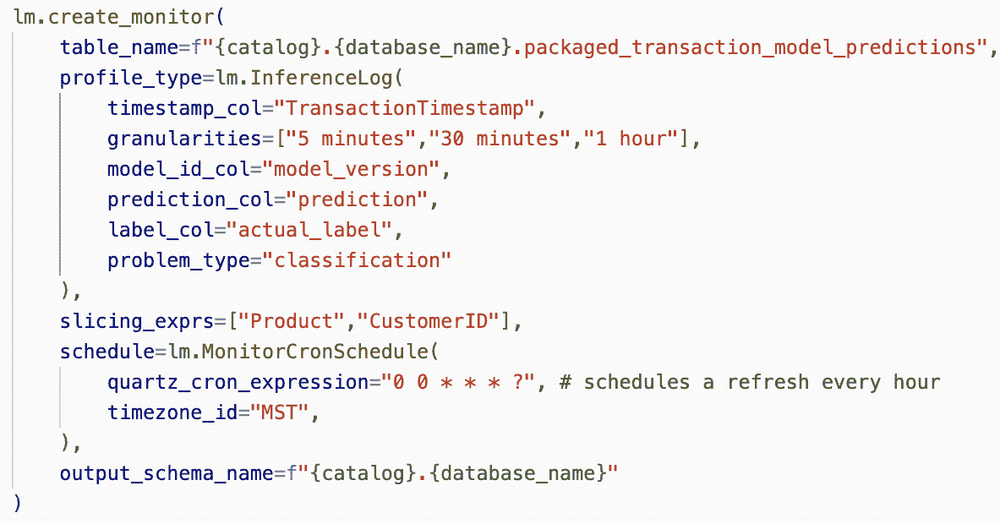

图 8.1 – 创建每小时刷新一次的推理配置文件监控器

模型监控是确保你的模型按预期为你工作的一种有效方式。我们希望这能让你思考你在 MLOPs 流程中使用监控的方式。

接下来，我们将了解创建仪表板的方法。

# 构建金层可视化

在你的数据湖中的金层是消费就绪层。在这个层中，最终转换和聚合使数据中的见解结晶，以便为报告和仪表板准备就绪。能够与受众分享你的数据至关重要，DI 平台提供了几种这样做的方式。事实上，Lakeview 和 Databricks SQL 仪表板都允许你在可视化中转换和聚合你的数据。让我们看看如何做到这一点。

## 利用 Lakeview 仪表板

在 Databricks 中的 Lakeview 仪表板是创建数据可视化和共享数据中隐藏的见解的有力工具。可视化可以使用英语进行，这使得仪表板创建对更多用户可用。要创建 Lakeview 仪表板，首先点击 `ml_in_action.favorita_forecasting.train_set` 表。这通过选择提供的表中的所有记录来创建一个数据集。注意我们不需要*必须*编写任何 SQL 或创建聚合来可视化数据聚合。

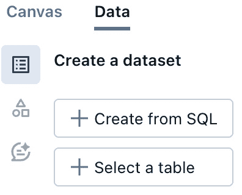

图 8.2 – 添加数据到 Lakeview 仪表板的“数据”选项卡

一旦你有了数据集，返回到 **画布** 选项卡。选择位于浏览器窗口底部蓝色栏上的 **添加可视化** 按钮。这为你提供了一个可以放置在仪表板上的小部件。放置后，你的小部件将类似于 *图 8**.3*。

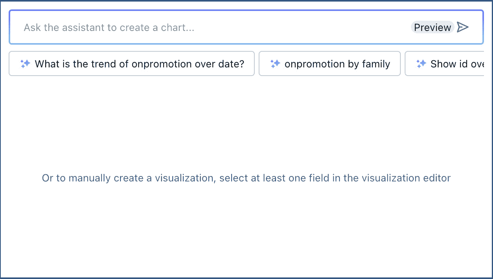

图 8.3 – 一个新的 Lakeview 小部件

在新的小部件中，您可以使用右侧菜单上的选项手动创建一个可视化。或者，Databricks 助手可以帮助您仅用英语快速构建图表。您可以写下自己的问题，或者探索建议的查询。我们选择了建议的问题“*按日期查看促销趋势是什么？*”来自动生成图表，以及“*图 8**.4*”的结果。

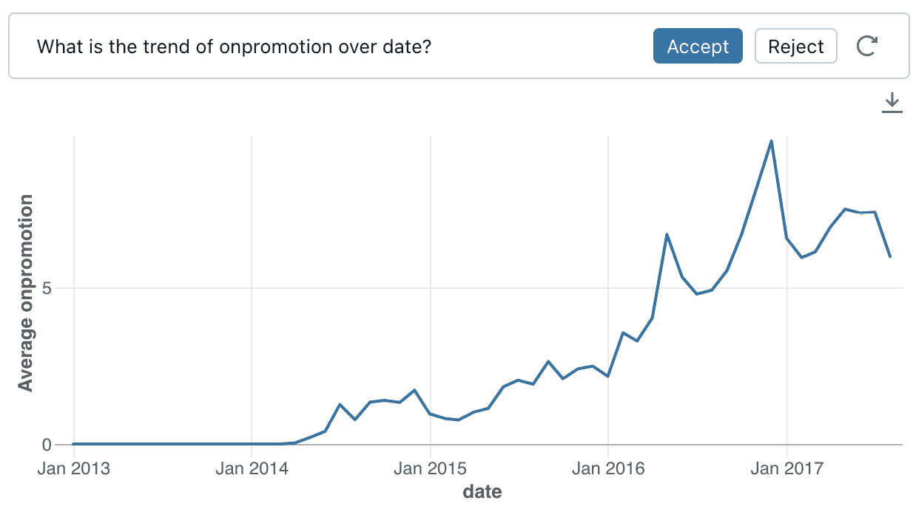


图 8.4 – English text generated Lakeview widget

当您准备好分享您的仪表板时，您可以发布它！Lakeview 仪表板背后的引擎针对性能进行了优化，可以提供更快的交互式图表。它也足够强大，可以处理流数据。此外，Lakeview 仪表板通过 Unity Catalog 与 DI 平台统一，提供数据血缘。它们旨在轻松跨工作区共享，这意味着其他工作区中的用户可以访问您精心制作的仪表板。

## 使用 Databricks SQL 仪表板可视化大数据

Lakeview 仪表板是 Databricks 的未来。然而，您也可以使用`select`语句构建仪表板，您可以生成数据并用于多个可视化。

注意

要在您自己的工作区中重新创建“*图 8**.5*”，您需要取消选中**LIMIT 1000**复选框。可视化仍有 64,000 行的限制。绕过这个限制的最好方法是过滤或聚合。

*图 8**.5*是我们从一个简单的 SQL 查询（针对*Favorita Store* *Sales*数据）创建的示例可视化。

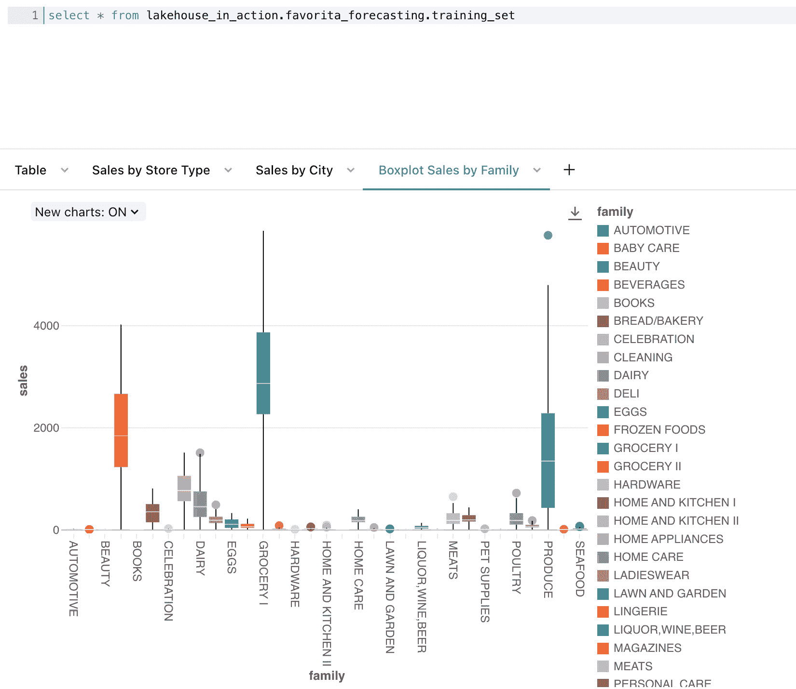


图 8.5 – 在 DBSQL 编辑器中执行选择语句后，我们创建可视化而无需编写任何代码

假设您的数据集包含您想要用于过滤和比较特征的分类变量，例如与*Favorita*销售数据一样。您可以在 DBSQL 编辑器中添加过滤器而无需修改查询。要添加过滤器，请点击**+**并选择**filter**或**parameter**。这两个选项都提供了用于过滤的小部件，如图*图 8**.6*所示。您可以使用这些小部件与任何与查询关联的可视化或仪表板。

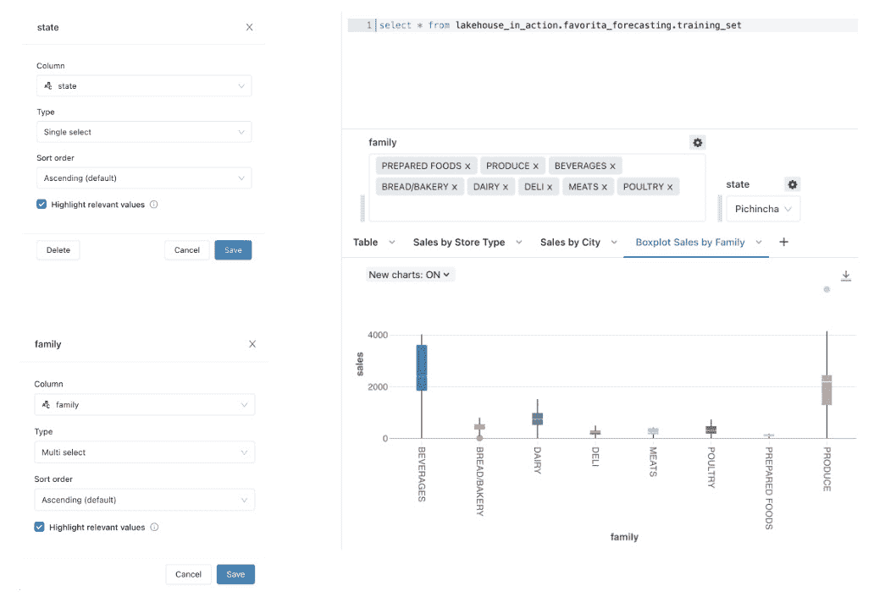


图 8.6 – (L) 状态和家庭过滤器配置； (R) 向 Favorita 销售查询添加两个过滤器后的结果

如*图 8**.7*所示的仪表板功能内置在 Databricks SQL 中，作为展示从单个或多个查询创建的图表和其他可视化的方式。

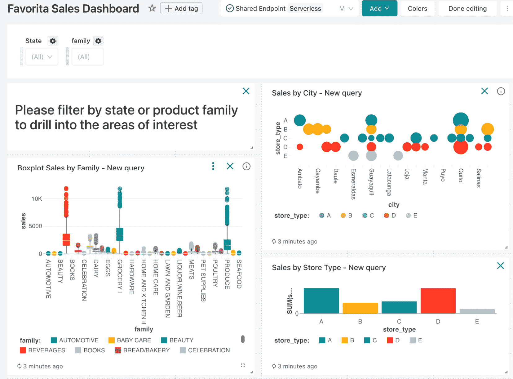


图 8.7 – 从 Favorita 销售数据查询创建的图表仪表板

DBSQL 内置的可视化功能是快速探索数据的一种方式，无需连接到外部仪表板或数据可视化工具。

接下来，我们将通过一个示例来了解如何在 DBSQL 中使用 Python **用户定义函数**（**UDFs**）进行可重用 Python 代码。

## Python UDFs

Python UDFs 是在 Python 中创建可重用代码片段的方法，这些代码片段可以在 DBSQL 中使用。在这个例子中，我们将为销售分析师创建一个用于在客户记录中编辑信息的 UDF。第五行指示函数的语言语法是在 `$$` 符号之间使用 Python：

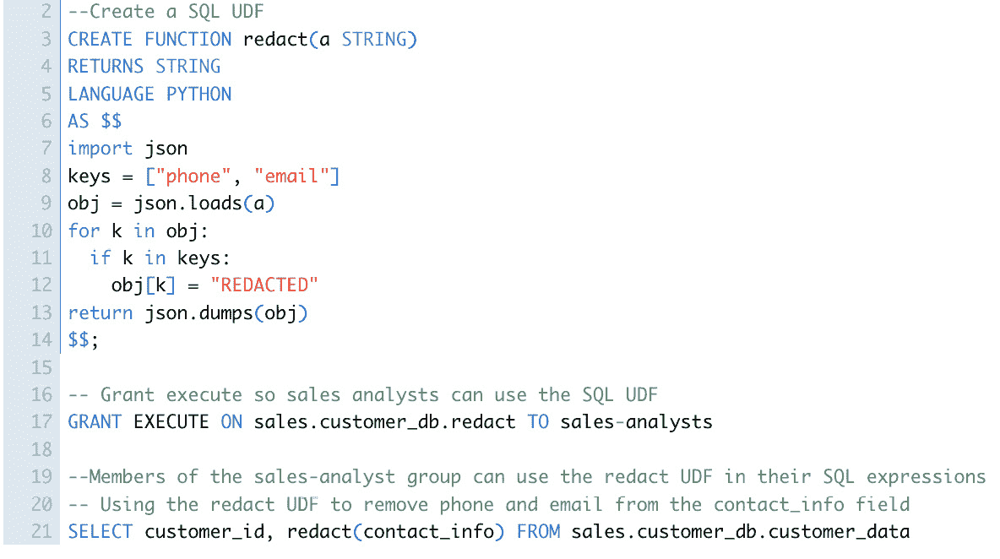

图 8.8 – 在 DBSQL 中创建 Python UDF

UDFs（用户定义函数）作为 Unity Catalog 的一部分进行定义和管理。一旦定义了 UDF，您可以使用 `GRANT EXECUTE` 授予团队执行 UDF 的能力。


图 8.9 – 授予销售分析师组执行 UDF 的权限

在这个 SQL 查询中，我们将 `redact` UDF 应用到 `contact_info` 字段。

.jpg)

图 8.10 – 在 SQL 查询中使用 Python UDF

现在我们已经了解了可视化数据和在 SQL 中应用 Python UDFs 的基础知识，接下来让我们介绍一些小贴士和技巧。

### 小贴士和技巧

本节涵盖了与 DBSQL 相关的小贴士和技巧。一些技巧适用于 DBSQL 和 Lakeview，但并非全部：

+   **尽可能使用托管计算（也称为无服务器计算）**：如 *第一章* (*Chapter 1*) 中提到的，使用 Databricks 的 SQL 仓库进行查询的性能创下了记录。DBSQL 的新托管计算将首次查询性能缩短到大约 10 秒。这意味着空闲时间大大减少，这转化为成本节约。

+   **使用子查询作为参数过滤器**：在您的查询可视化和仪表板中，您可以预先填充下拉筛选框。您可以通过在 SQL 编辑器中创建和保存查询来实现这一点。例如，您可以创建一个返回客户名称唯一列表的查询。在 *图 8*.11 中，我们选择了一个名为 **Customer Name Lookup Qry** 的查询作为子查询，以按客户名称筛选查询可视化。因此，我们可以使用下拉列表来筛选 **客户**。

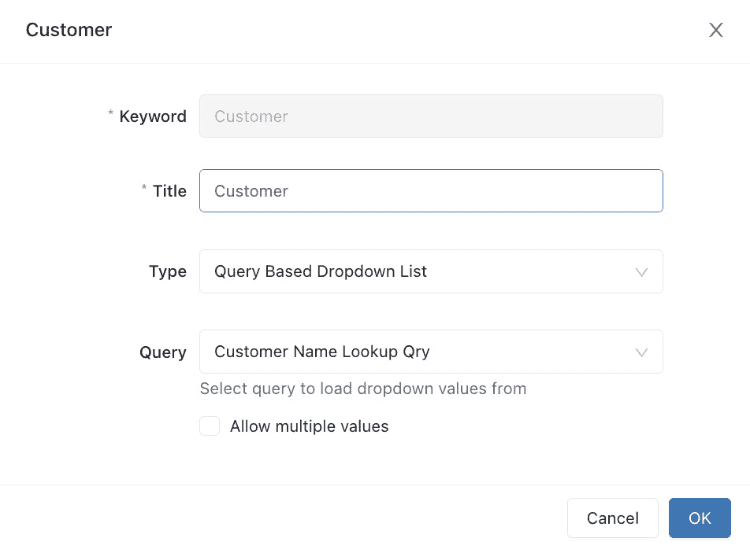

图 8.11 – 将子查询作为查询的参数使用

+   **安排报告交付**：如果您有希望定期收到最新仪表板的用户，您可以安排刷新并将其发送给订阅者。对于 DBSQL 仪表板，请记住在开发时关闭 **启用**，以免用户收到过多的更新。

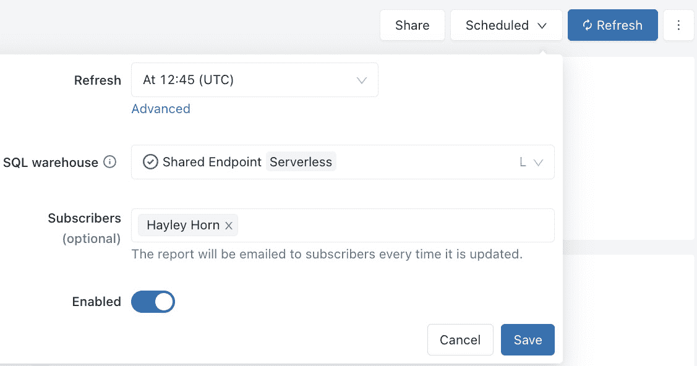![图 8.12 – 使用订阅者（T）DBSQL（B）Lakeview 计划仪表板报告

![图片 B16865_08_11.jpg]

图 8.12 – 使用订阅者（T）DBSQL（B）Lakeview 调度仪表板报告

+   **使用 Databricks Assistant 加速开发**：正如我们在*第四章*中所述，Databricks Assistant 是一个基于 AI 的界面，可以帮助生成、转换、修复和解释代码。助手是上下文感知的，这意味着它使用 Unity Catalog 来查看您环境中表和列的元数据，并为您个性化。在*图 8*.13 中，我们要求助手帮助编写一个使用分组语法的查询。它看到了**Favorita****Stores**表的元数据，并为该表和感兴趣的列提供了特定的代码。

![图 8.13 – 使用 Databricks Assistant 帮助编写查询

![图片 B16865_08_12.jpg]

图 8.13 – 使用 Databricks Assistant 帮助编写查询

+   **保持警觉**：通过警报关注重要数据变化。使用 SQL 调整警报，并通过*图 8*.14 中显示的 UI 在特定间隔内安排条件评估。您可以使用 HTML 创建格式化的警报电子邮件。

![图 8.14 – 当满足特定条件时触发调度警报

![图片 B16865_08_13.jpg]

图 8.14 – 当满足特定条件时触发调度警报

+   **使用标签跟踪使用情况**：在创建新的 SQL 仓库时，使用标签对您的仓库端点进行编码，以正确标记项目。标记是了解按项目或团队使用情况的好方法。系统表包含跟踪使用情况的信息。

![图 8.15 – 使用标签将端点连接到项目

![图片 B16865_08_14.jpg]

图 8.15 – 使用标签将端点连接到项目

接下来，您将学习如何将您的模型连接到应用程序。

# 连接您的应用程序

您可以使用 Databricks Model Serving 在任何地方部署您的模型，这是您在*第七章*中部署您的 RAG 聊天机器人模型的方式。在本节中，我们将介绍如何在**Hugging Face**（**HF**）中托管 ML 演示应用程序。拥有一种简单的方式来托管 ML 应用程序，让您能够构建您的 ML 投资组合，在会议或与利益相关者展示您的项目，并与 ML 生态系统中的其他人协作工作。使用 HF Spaces，您有多种选择来决定您使用哪个 Python 库来创建 Web 应用程序。其中两个常见的选择是 Streamlit 和 Gradio。

我们更喜欢 Gradio。它是一个开源的 Python 包，允许您快速为您的机器学习模型、API 或任何任意的 Python 函数构建演示或 Web 应用程序。然后，您只需使用 Gradio 内置的共享功能，在几秒钟内就可以分享您的演示或 Web 应用程序的链接。无需 JavaScript、CSS 或 Web 托管经验 – 我们非常喜欢它！

在*应用我们的学习*部分的 RAG 项目工作中，我们将向您展示如何将聊天机器人部署到 HF Space。

# 将 LLMs 与 SQL AI 函数结合为分析师

有许多用例可以集成 LLM，如 DBRX 或 OpenAI，以获得见解。使用 Databricks 数据智能平台，对于最舒适使用 SQL 的分析师来说，利用机器学习和人工智能的进步也是可能的。

在 Databricks 中，你可以使用**AI 函数**，这些是内置的 SQL 函数，可以直接访问 LLMs。AI 函数可用于 DBSQL 界面、SQL 仓库 JDBC 连接或通过 Spark SQL API。在*图 8*.16 中，我们正在利用 Databricks SQL 编辑器。

基础模型 API

Databricks 托管的基础模型的数据存储和处理完全在 Databricks 平台内部进行。重要的是，这些数据不会与任何第三方模型提供商共享。当使用连接到具有自己数据隐私政策的服务的 External Models API 时，这并不一定成立。当你关注数据隐私时，请记住这一点。你可能能够支付一个限制你数据使用的服务层级的费用。

让我们做一些简单的情绪分类。由于我们一直在使用的三个数据集都不包含任何自然语言，我们首先创建一个小数据集。你也可以下载一个数据集（如 Kaggle 的 Emotions 数据集）或使用你可用的任何其他自然语言来源：

1.  首先，让我们探索内置的`AI_QUERY` DBSQL 函数。此命令将我们的提示发送到远程配置的模型并检索结果。我们使用 Databricks 的 DBRX 模型，但你也可以使用各种其他开源和专有模型。打开 Databricks SQL 编辑器，并输入如图 8.16 所示的代码。让我们编写一个查询，以获取我们可以分类的样本句子。

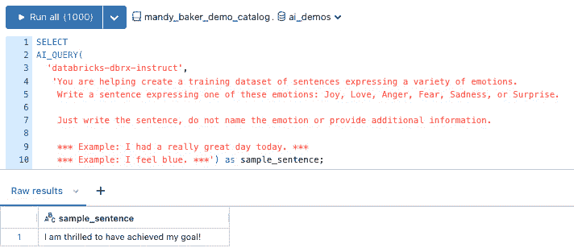

图 8.16 – 使用 AI_QUERY 函数构建提示

1.  如果你没有准备好数据集，也不想下载，你可以构建一个为你生成数据集的函数，如图所示。我们正在扩展*步骤 1*的提示，以获取几个 JSON 格式的句子。

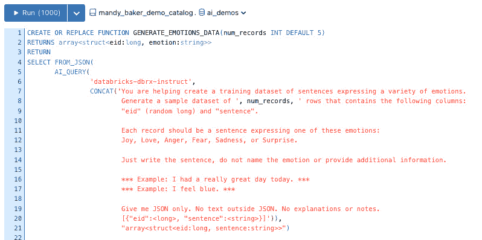

图 8.17 – 创建生成虚假数据的函数

1.  现在使用`GENERATE_EMOTIONS_DATA`函数构建一个小数据集。快速查看数据后，看起来我们有一个很好的情绪样本。

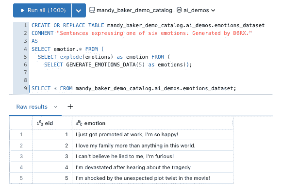

图 8.18 – 生成虚假情绪数据

1.  现在，我们将编写一个名为`CLASSIFY_EMOTION`的函数。我们再次使用 AI 函数`AI_QUERY`，但这个函数将使用一个新的提示，要求模型将给定的句子分类为六种情绪之一。

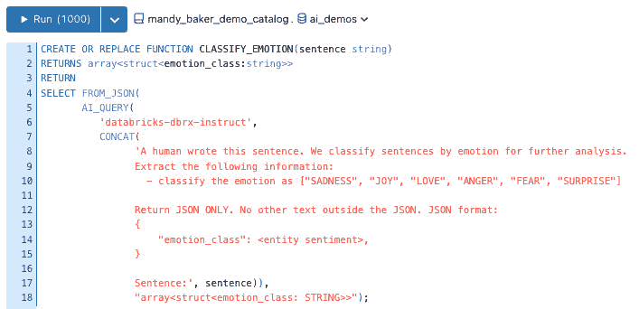

图 8.19 – 创建按情绪分类句子的函数

1.  让我们调用我们的函数来评估一个示例句子，并查看结果。

![图 8.20 – 调用 CLASSIFY_EMOTION 函数

![图片 B16865_08_19.jpg]

图 8.20 – 调用 CLASSIFY_EMOTION 函数

1.  最后，为了对表中的所有记录进行分类，我们在表中的记录上调用`CLASSIFY_EMOTION`函数并查看结果。

![图 8.21 – 在表上调用 CLASSIFY_EMOTION 函数

![图片 B16865_08_20.jpg]

图 8.21 – 在表上调用 CLASSIFY_EMOTION 函数

SQL AI 函数是将 LLM 的力量交到 SQL 用户手中的绝佳方式。像 SQL AI 函数这样的解决方案仍然需要一些技术知识。Databricks 正在研究允许业务用户直接访问数据的方法，这样就不需要太多的前期开发，以便让您的团队更快地运转。请密切关注令人兴奋的新产品功能，这些功能将消除编程经验障碍，释放您数据的价值！

# 应用我们的学习

让我们运用我们所学的知识，使用 Favorita 项目的表元数据构建一个 SQL 聊天机器人，监控流式事务项目的模型，并部署我们已组装和评估的聊天机器人。

## 技术要求

完成本章动手实践所需的技术要求如下：

+   SQLbot 将需要 OpenAI 凭证。

+   我们将使用 Databricks Secrets API 来存储我们的 OpenAI 凭证。

+   您需要**个人访问令牌**（**PAT**）才能将您的 Web 应用部署到 HF。请参阅*进一步阅读*以获取详细说明。

## 项目：Favorita 店铺销售

让我们使用 OpenAI 的 GPT 构建一个简单的 **SQLbot**，以询问有关我们的 Favorita 销售表的问题。请注意，尽管本节继续使用 *Favorita Store Sales* 数据，但它并不是早期项目工作的延续。在这个例子中，您将创建有关机器人如何请求表列表、从这些表中获取信息以及从表中采样数据的说明。SQLbot 将能够构建 SQL 查询并解释结果。要运行本例中的笔记本，您需要在 OpenAI 开发者网站上拥有一个账户，并请求 OpenAI API 的密钥。

要在自己的工作区中跟随，请打开以下笔记本：

`CH8-01-SQL Chatbot`

在 Databricks 笔记本中保留秘密 API 密钥绝不是最佳实践。您可以锁定笔记本访问并添加配置笔记本到您的 `.gitignore` 文件中。然而，您移除人们访问的能力可能不在您的控制之下，这取决于您的角色。通常，管理员权限包括查看所有代码的能力。OpenAI API 密钥与您的账户和信用卡相关联。请注意，运行笔记本一次花费了我们 $0.08。

我们将我们的 API 密钥添加到 Databricks 密钥中。Secrets API 需要使用 Databricks CLI。我们通过 Homebrew 设置了我们的 CLI。如果您还没有设置，我们建议为您的 workspace 设置 Secrets。这可能需要管理员协助。首先，安装或更新 Databricks CLI。当您获得版本 v0.2 或更高版本时，您就知道 CLI 已正确安装。我们正在使用 `Databricks` `CLI v0.208.0`。

我们遵循以下步骤设置我们的 API 密钥作为密钥：

1.  创建一个作用域：

    ```py
    databricks secrets create-scope dlia
    ```

1.  在作用域内创建一个密钥：

    ```py
    databricks secrets put-secret dlia OPENAI_API_KEY
    ```

1.  将您的 API 密钥粘贴到提示中。

一旦您的密钥成功保存，我们就可以通过笔记本中的 `dbutils.secrets` 访问它。

现在，我们已经设置好通过 API 使用 OpenAI。我们不必担心意外提交我们的 API 或同事运行代码，而不知道这会花费您金钱。

接下来，让我们一步一步地专注于创建我们的 SQLbot 笔记本，从设置开始：

1.  首先，我们安装了三个库：`openai`、`langchain_experimental` 和 `sqlalchemy-databricks`。

1.  要创建与 OpenAI 的连接，请传递之前设置的密钥并打开一个 `ChatOpenAI` 连接。

1.  在 **图 8**.22 中，我们创建了两个不同的模型。第一个是默认模型，第二个使用 GPT 3.5 Turbo。

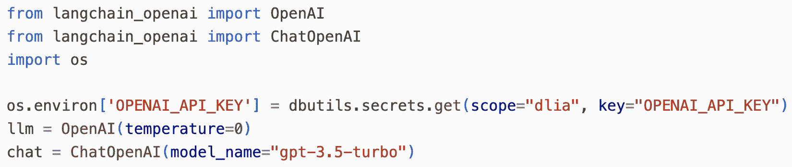

图 8.22 – OpenAI API 连接

1.  设置文件没有设置您的模式变量。定义您的模式；我们选择了 `favorita_forecasting`。我们一直使用 `database_name` 而不是模式。然而，我们指定了我们要对其提出 SQL 问题的数据库，这是不同的。

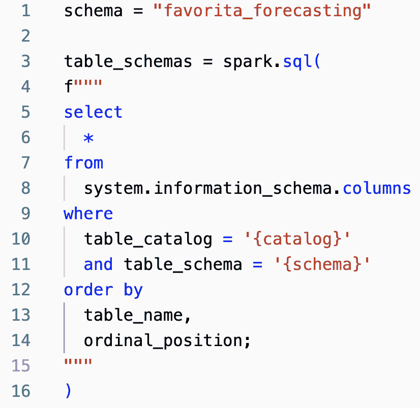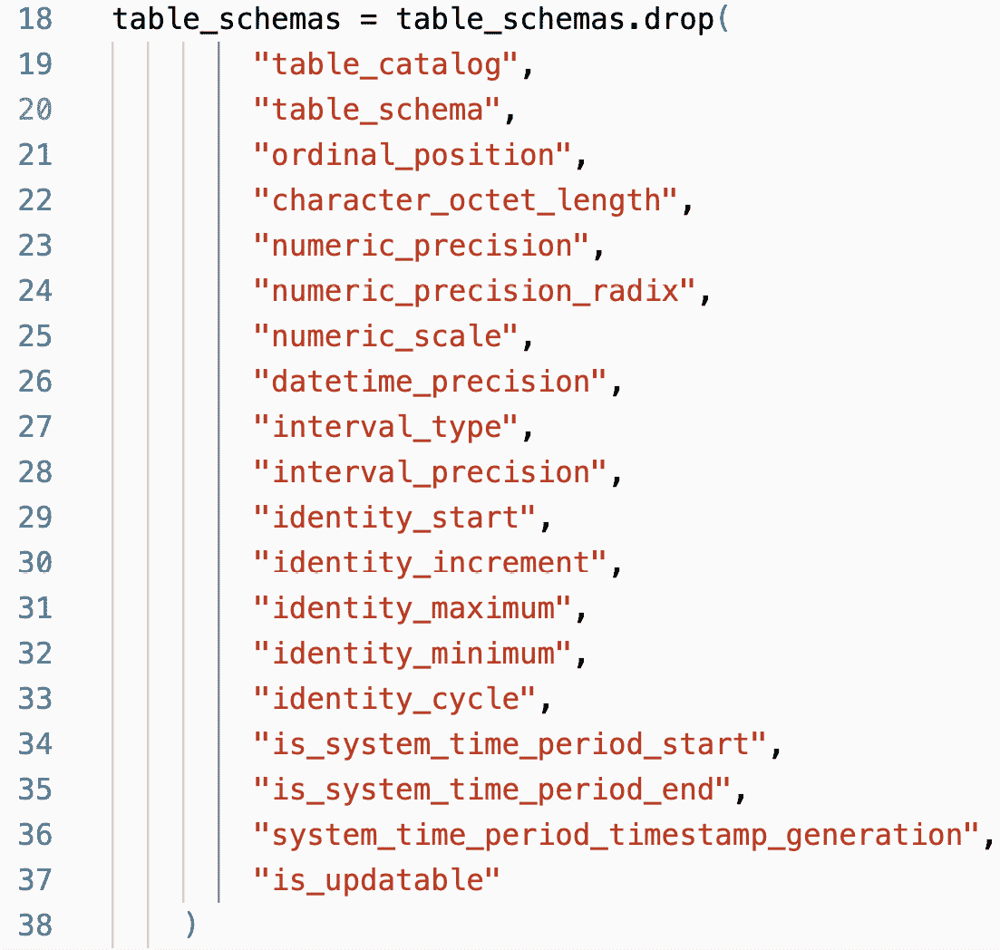

图 8.23 – (L) 收集表模式和系统信息模式； (R) 删除不必要的重复列

1.  接下来，我们创建了两个辅助函数。第一个函数组织提供的模式信息 `table_schemas`，创建一个表定义。第二个函数收集两行数据作为示例。

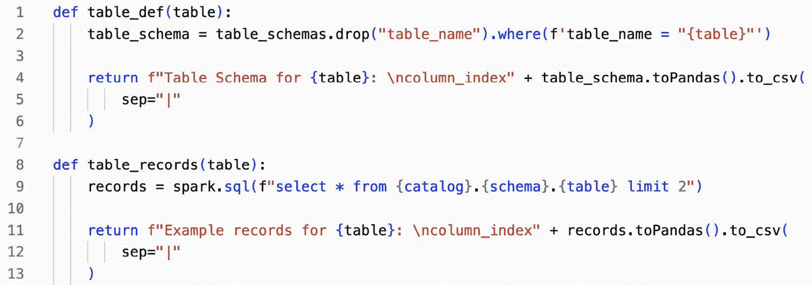

图 8.24 – 组织表格信息的辅助函数

1.  遍历表和列数据，利用我们的辅助函数格式化 SQL 数据库输入。

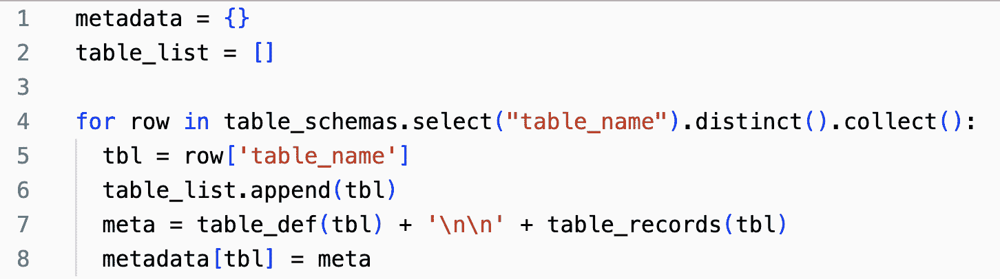

图 8.25 – 遍历表并利用辅助函数

1.  现在，我们所有的数据都已准备好，可以创建一个 SQL 数据库，以便 OpenAI 进行通信。您需要编辑 `endpoint_http_path` 以匹配您 workspace 中活动 SQL 仓库的路径。数据库被传递到默认的 OpenAI 模型和 GPT 3.5 模型。

![图 8.26 – 为 OpenAI 创建一个只包含我们提供的信息的查询数据库

![图片 B16865_08_26.jpg]

图 8.26 – 为 OpenAI 创建一个只包含我们提供的信息的查询数据库

设置完成后，我们现在可以与我们的 SQL 聊天机器人模型交互了！让我们从一个基本问题开始：*哪个商店销售* *最多？*

在*图 8**.27 中，我们对问题运行了两个模型并得到了两个不同的答案。

![图 8.27 – SQL 聊天机器人模型对我们问题“哪个商店销售最多？”的响应。（T）db_chain.run(question) （B）chat_chain.run(question）

![图片 B16865_08_27.jpg]

图 8.27 – SQL 聊天机器人模型对我们问题“哪个商店销售最多？”的响应。（T）db_chain.run(question) （B）chat_chain.run(question）

随着 OpenAI 的 GPT 模型新版本的发布，你的 SQLbot 的结果和行为可能会发生变化。随着新模型和方法的可用，测试它们并观察这些变化如何影响你的工作和聊天机器人的结果是一个好的实践。在 SQLbot 实验中利用 MLflow 将帮助你追踪和比较生产过程中的不同特性和配置。

## 项目 -流式传输事务

你已经准备好完成这个项目了。生产工作流程笔记本是工作流程作业中创建的`CH7-08-Production Generating Records`、`CH7-09-Production Auto Loader`和`CH7-10-Production Feature Engineering`组件。一旦新工作流程到位，你将运行相同的作业。要在自己的工作区中跟随，请打开以下笔记本：`CH8-05-Production Monitoring`

在`CH8-05-Production Monitoring`笔记本中，你创建了两个监控器 – 一个用于`prod_transactions`表，另一个用于`packaged_transaction_model_predictions`表。参见*图 8**.28*了解后者。

![图 8.28 – 推理表监控

![图片 B16865_08_28.jpg]

图 8.28 – 推理表监控

恭喜！流式传输项目已完成。我们鼓励你添加改进并将其提交回仓库。以下是一些可能的示例：向验证笔记本添加更多验证指标，将推理性能结果纳入重新训练的决定，并对数据生成的配置进行调整以模拟漂移。

## 项目：检索增强生成聊天机器人

要在自己的工作区中跟随，请打开以下笔记本和资源：

+   CH8-`app.py`

+   `CH8-01-Deploy Your Endpoint` `with SDK`

+   **Hugging Face** **Spaces** 页面

首先，我们需要确保我们的聊天机器人使用模型服务进行部署，如图 *图 8**.30* 所示。在这里，我们通过模型服务页面的 UI 使用最快的方式。为了跟随并服务，我们选择了我们在 *第七章* 中注册的已注册模型。选择最新版本 – 在我们的案例中，它是版本 4。对于这个演示项目，我们预计并发量最小，因此端点将只有四个可能的并发运行，并在没有流量时扩展到 0。我们正在同一目录下启用推理表以跟踪和可能进一步监控我们的有效载荷。我们不会在本章中演示如何为 RAG 项目设置监控器或数据质量管道，因为它已经在流项目中被演示过。我们鼓励您在自己的项目中应用它！


图 8.29 – 通过 UI 进行模型服务部署的示例

为了使您的应用程序能够连接到附加的资源，例如向量搜索，端点需要您在 **高级配置** 中为端点提供额外的配置，例如您的 PAT 和主机：

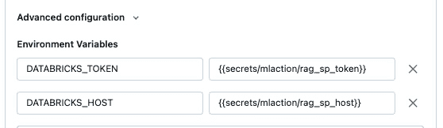

图 8.30 – 高级配置要求

注意

您还可以使用 Databricks SDK 服务来部署您的端点。如果您想了解如何使用 SDK 部署，请使用附在 `CH8 - 01 -Deploy Your Endpoint` 下的笔记本 `with SDK`。

跳转到 Hugging Face Spaces 网站。如何在 HF Spaces 中部署您的第一个 HF Space 的说明在 HF Spaces 的主页上有很好的解释，所以我们在这里不会重复它们。我们想强调的是，我们正在使用 Spaces 的免费部署选项，带有 2 个 CPU 和 16 GB 的内存。

当您部署您的 Space 时，它将看起来像这样：

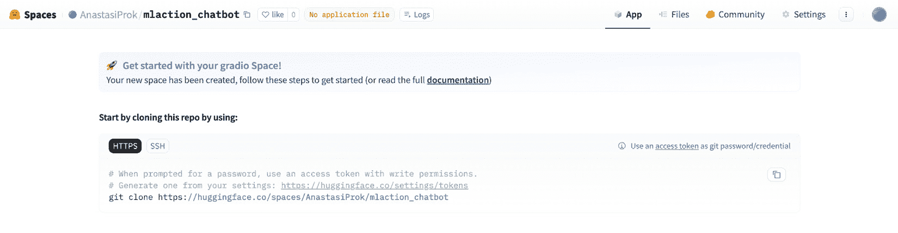

图 8.31 – 空的 Hugging Face Space

我们想强调一些重要的事情，以便连接到使用 Databricks 模型服务实时提供的聊天机器人。要将聊天机器人连接到您的 HF Space，您必须设置 `API_TOKEN` 和 `API_ENDPOINT`。以下是设置这些值的方法：

1.  前往您创建的 HF Space 的 **设置**。

1.  滚动到 **变量** **和秘密**。

1.  将您的 API_ENDPOINT 设置为 Databricks 模型服务页面上提供的 REST API 的 URL。

1.  使用 Databricks 生成的个人访问令牌设置您的 API_TOKEN。这是连接到端点所必需的。

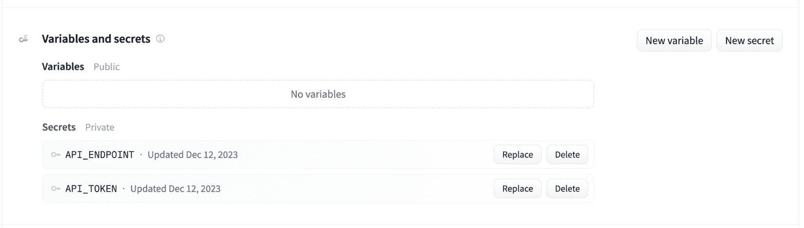

图 8.32 – HF Spaces 上的变量和秘密示例

1.  一旦设置完成，您就可以将您的 Gradio 网页应用脚本带入您的 HF Space。

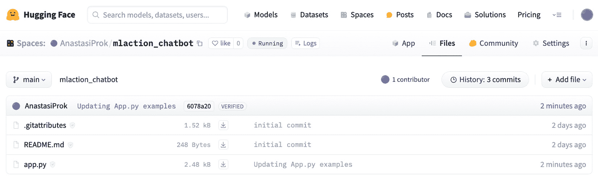

图 8.33 – HF 空间中变量和秘密的示例

1.  当您的端点准备好后，返回您的 HF 空间。

1.  在预先创建的空间下方的 **文件** 选项卡中点击 **+** 添加文件**。

1.  现在添加您得到的 `CH8-app.py` 文件 – 您可以创建自己的网络应用。根据您的业务需求，自由地尝试设计。

让我们简要谈谈 `CH8-app.py` 文件中的 `respond` 函数 – 见 *图 8.34*，它被传递到我们应用的 UI 聊天机器人。在这个例子中，`respond` 函数是您部署的端点的调用者，我们不仅发送和接收响应，还可以塑造输入或输出的格式。在我们的案例中，端点期望接收一个格式为 JSON 的请求，其中包含字段输入的列表中的问题，而输出是一个包含字段预测的 JSON。

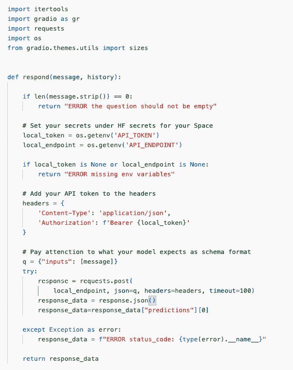

图 8.34 – 在 Gradio 应用中编写的响应函数

正如引言部分所述，要创建聊天机器人，我们使用了一个简单的 Gradio 示例，其中添加了诸如应用程序标题、描述和示例问题等选项。*图 8.35* 展示了完整的代码。

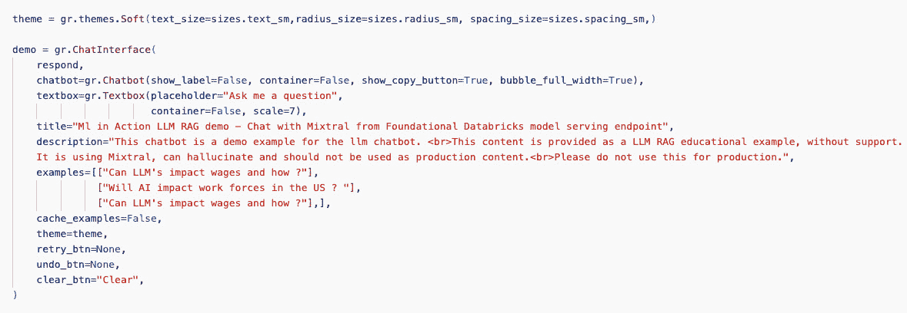

图 8.35 – 您 LLM 的 Gadio app.py 界面

聊天机器人现在拥有一个更用户友好的界面，如图 *图 8.36* 所示。

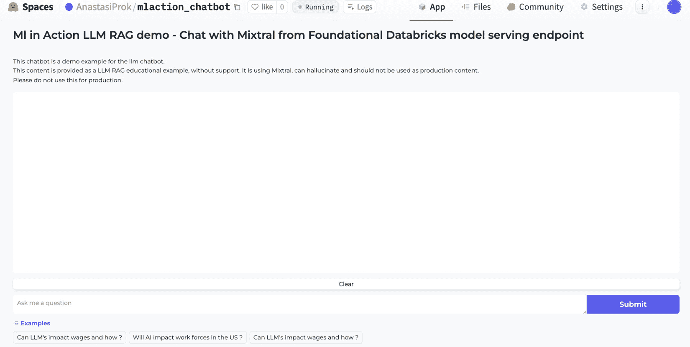

图 8.36 – 您聊天机器人应用的界面

让我们提出几个问题以确保我们的 RAG 聊天机器人提供正确的结果。

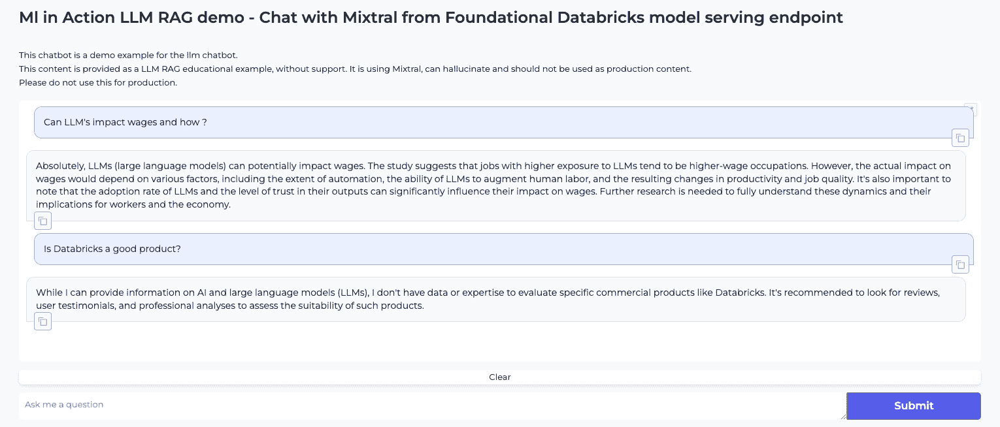

图 8.37 – 我们 RAG 应用中聊天机器人回答的示例

如果响应看起来不错，您的应用程序就准备好使用了！

# 摘要

从您的机器学习实践中获取价值的重要方式之一是分享您模型中的洞察。使用仪表板作为分享您信息的中介是一种便于与业务用户和数据科学团队之外的小组沟通洞察的方法。在本章中，我们讨论了如何构建黄金层，使用 DBSQL 仪表板展示数据的技巧，利用 DBSQL 中的创新，如 OpenAI 模型，以及您如何通过 Databricks 市场共享数据和 AI 艺术品，以从企业数据中获得最大价值。

我们希望您有机会亲自动手构建您的数据湖。从探索、清洗、构建管道、构建模型到发现数据中的隐藏洞察，再到分享洞察 – 所有这些都可以在 Databricks 平台上完成。我们鼓励您尝试使用笔记本进行实验！作者们很乐意听到您的反馈，以及这在本旅途中对您使用 Databricks 平台是否有帮助。

# 问题

让我们通过以下问题来测试一下我们所学的知识：

1.  金层和银层之间有哪些区别？

1.  你可以通过什么方式设置一个警报来识别一个表有无效值？

1.  你为什么会选择使用外部仪表盘工具？

1.  如果你通过 API（如 OpenAI）使用语言模型，你发送 API 的数据有哪些考虑因素？

1.  一家公司为什么会在 Databricks Marketplace 上共享数据？

# 答案

在思考了这些问题之后，比较你的答案和我们的答案：

1.  金层比银层更精细和聚合。银层为数据科学和机器学习提供动力，而金层为分析和仪表盘提供动力。

1.  你可以监控字段的值，并在值无效时发送电子邮件警报。

1.  有时公司会使用多个仪表盘工具。你可能需要提供团队习惯使用的仪表盘中的数据。

1.  如果我是一个通过 API 的语言模型，我会对发送敏感数据保持谨慎，包括 PII、客户信息或专有信息。

1.  一家公司可能会在 Databricks Marketplace 上共享数据，以便货币化数据或使其对外部人员易于使用且安全地使用。

# 进一步阅读

在本章中，我们指出了具体的技术、技术特性和选项。请查看这些资源，以深入了解你最感兴趣的领域：

+   *Databricks SQL 语句执行* *API*: [`www.databricks.com/blog/2023/03/07/databricks-sql-statement-execution-api-announcing-public-preview.html`](https://www.databricks.com/blog/2023/03/07/databricks-sql-statement-execution-api-announcing-public-preview.html)

+   *赋予 SQL 人群力量：介绍 Databricks SQL 中的 Python UDFs* *：[`www.databricks.com/blog/2022/07/22/power-to-the-sql-people-introducing-python-udfs-in-databricks-sql.html`](https://www.databricks.com/blog/2022/07/22/power-to-the-sql-people-introducing-python-udfs-in-databricks-sql.html)

+   *使用 Databricks SQL AI* *函数*在规模上执行客户评价*：[`www.databricks.com/blog/actioning-customer-reviews-scale-databricks-sql-ai-functions`](https://www.databricks.com/blog/actioning-customer-reviews-scale-databricks-sql-ai-functions)

+   *Databricks 创下了官方数据仓库性能* *记录*：https://dbricks.co/benchmark

+   *Databricks Lakehouse 和数据* *Mesh*：[`www.databricks.com/blog/2022/10/10/databricks-lakehouse-and-data-mesh-part-1.html`](https://www.databricks.com/blog/databricks-lakehouse-and-data-mesh-part-1)

+   *Hugging* *Face*: [`huggingface.co/spaces`](https://huggingface.co/spaces)

+   *Gradio*: [`www.gradio.app/`](https://www.gradio.app/)

+   *Hugging Face* *Spaces*: [`huggingface.co/docs/hub/en/spaces-overview`](https://huggingface.co/docs/hub/en/spaces-overview)

+   *Databricks Lakehouse 监控* 文档：[`api-docs.databricks.com/python/lakehouse-monitoring/latest/databricks.lakehouse_monitoring.html#module-databricks.lakehouse_monitoring`](https://api-docs.databricks.com/python/lakehouse-monitoring/latest/databricks.lakehouse_monitoring.html#module-databricks.lakehouse_monitoring)

+   Databricks 个人访问令牌认证 [`docs.databricks.com/en/dev-tools/auth/pat.html`](https://docs.databricks.com/en/dev-tools/auth/pat.html)
