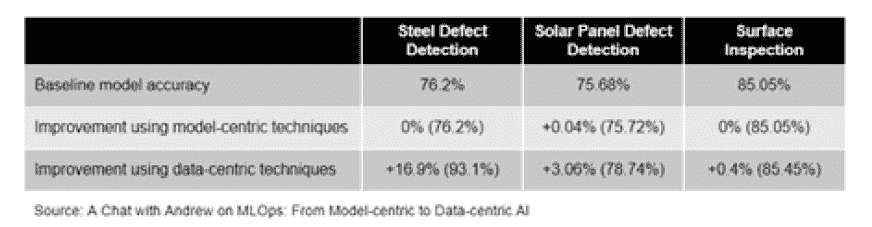
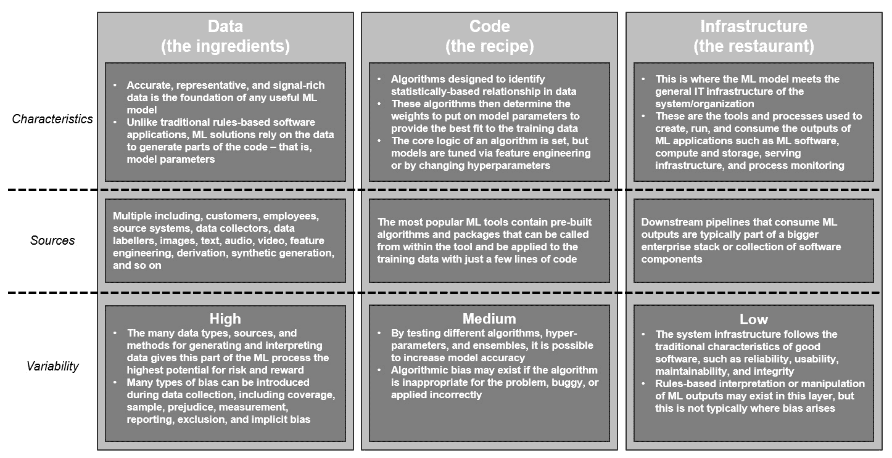
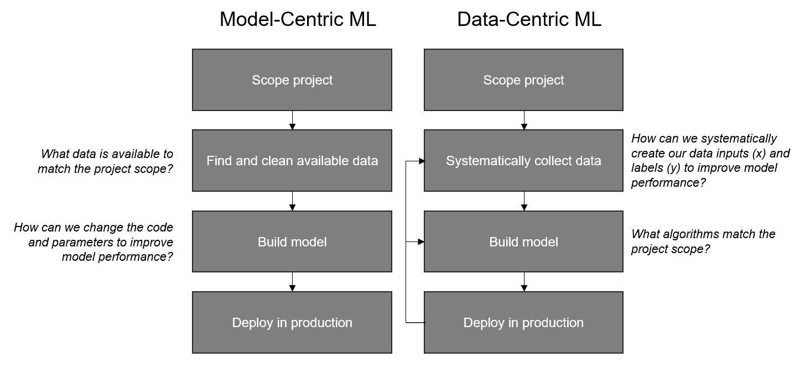
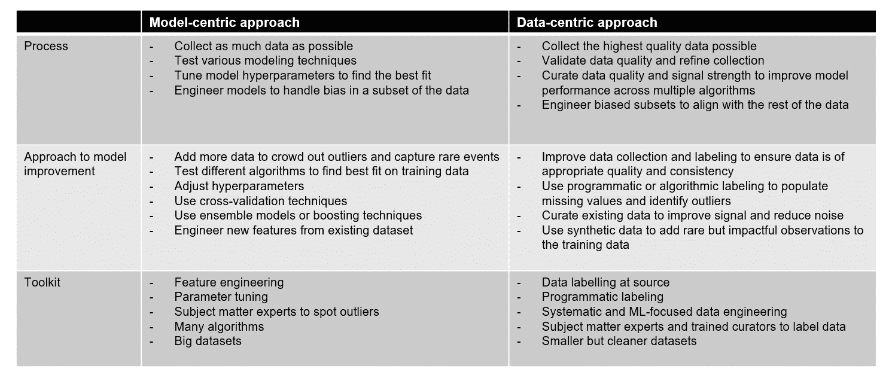
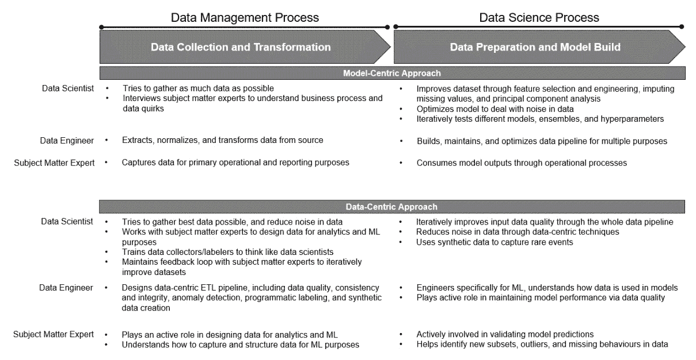
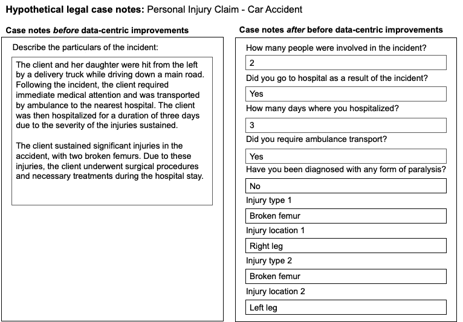

# 第一章：探索数据为中心的机器学习

本章提供了对数据为中心的**机器学习**（ML）的基础理解。我们还将对比数据中心性与模型中心性，并比较两种方法的性能，使用实际例子来说明关键点。通过这些实际例子，你将深刻理解数据中心性的潜力。

在本章中，我们将涵盖以下主要主题：

+   理解数据为中心的机器学习

+   以数据为中心与以模型为中心的机器学习

+   质量数据在机器学习中的重要性

# 理解数据为中心的机器学习

**以数据为中心的机器学习**是系统地构建机器学习和**人工智能**（AI）系统所使用数据的学科。

数据为中心的 AI 和 ML 运动基于这样的哲学：在构建高度信息模型时，数据质量比数据量更重要。换句话说，使用一个小但高质量的数据集比使用一个大但嘈杂的数据集能取得更多成果。对于大多数机器学习用例，基于非常大的数据集（比如数百万个观察值）构建模型是不切实际的，因为数据量根本不存在。换句话说，基于可用数据集太小而忽略机器学习作为解决某些问题的工具的潜在用途是很常见的。

但如果我们能够使用机器学习来解决基于更小数据集的问题，甚至小于 100 个观察值呢？这是数据中心运动试图通过系统性的数据收集和工程来解决的一个挑战。

对于大多数机器学习用例，你需要的算法已经存在。你输入数据（x）和依赖变量标签（y）的质量才是决定因素。传统上处理数据集中噪声的响应是尽可能获取更多数据以平均异常值。以数据为中心试图提高数据中的信号，这样就不需要更多的数据。

需要注意的是，数据中心性也为更大的数据解决方案标记了下一个前沿。无论你的数据集有多大或多小，它都是你机器学习解决方案的基础成分。让我们更深入地看看数据为中心的机器学习的不同方面。

## 数据中心性的起源

推动向更以数据为中心的机器学习开发方法迈进的是著名的数据科学先驱，安德鲁·吴博士。

吴博士是大型开放在线课程平台 Coursera 的联合创始人，同时也是斯坦福大学计算机科学系的兼职教授。他还是教育公司 DeepLearning.AI 和制造 AI 驱动的视觉检测平台 Landing AI 的创始人兼首席执行官。他之前在百度担任首席科学家，并曾是谷歌大脑团队的创始负责人。他在 Coursera 上关于各种机器学习主题的课程已被全球数百万学生完成。

尼古拉斯·吴博士和他的 Landing AI 团队构建了复杂的机器学习解决方案，例如用于检查制造质量的计算机视觉系统。通过这项工作，他们观察到以下特征是大多数机器学习机会的典型特征 3：

+   大多数潜在的机器学习用例依赖于小于 10,000 个观察值的数据集。通常很难或不可能添加更多数据以减少噪声的影响，因此提高数据质量对于这些用例至关重要。

+   即使在非常大的数据集中，数据子集也会表现出小型数据集的行为。例如，谷歌的搜索引擎每天生成数十亿次的搜索，但其中 95%的搜索是基于每月出现次数少于 10 次的关键词组合（在美国）。15%的每日关键词组合之前从未被搜索过 4。

+   当数据集较小时，通常比收集更多数据更快、更容易识别和去除数据中的噪声。例如，如果一个包含 500 个观察值的数据集有 10%的误标记观察值，通常比收集一组新的观察值更容易提高现有数据的数据质量。

+   机器学习解决方案通常建立在预训练模型和包的基础上，需要的调整或修改很少。通过提高数据质量来提高模型性能，通常比更改模型参数或添加更多数据产生更好的结果。

尼古拉斯·吴博士发布了一篇关于 Landing AI 成果的比较，阐述了我们刚才讨论的最后一点。

如*图 1**.1*所示，Landing AI 为他们的客户提供了三个缺陷检测解决方案。在所有三个案例中，团队创建了一个基线模型，然后分别尝试使用以模型为中心和以数据为中心的方法来改进这个模型：

图 1.1 – 应用以数据为中心的机器学习 – Landing AI 的结果（来源：与 Andrew 关于 MLOps 的对话：从以模型为中心到以数据为中心的 AI）

在所有三个例子中，Landing AI 团队通过采用以数据为中心的方法而不是以模型为中心的方法，能够实现最佳结果。在三个例子中的一个中，以模型为中心的技术在基线模型性能上实现了微小的 0.04%的提升，而在另外两个例子中，没有实现任何改进。

相反，提高数据质量始终会导致基线模型得到改善，在三个案例中的两个案例中，改善相当显著。Landing AI 团队花费大约两周时间迭代改进训练数据集，以实现这些结果。

尼古拉斯·吴博士的建议很明确：无论你的数据集大小如何，如果你想构建相关且具有影响力的机器学习模型，你必须投入大量精力系统地设计你的输入数据。

从逻辑上讲，更好的数据导致更好的模型是有道理的，Landing AI 的结果也为这一点提供了实证证据。现在，让我们来看看为什么数据中心性是机器学习发展的未来。

## 机器学习系统的组件

机器学习系统由三个主要部分组成：

以数据为中心的方法认为，系统性的数据工程是下一个机器学习突破的关键，原因有以下两点：

1.  首先，一个模型的训练数据通常具有最大的改进潜力，因为它是任何模型的基础成分。

1.  其次，机器学习系统的代码和基础设施组件比我们持续捕获高质量数据的方法和过程更先进。

在过去的几十年里，我们在机器学习算法、数据科学工具、计算和存储能力方面经历了巨大的演变，我们的数据科学解决方案的实施方法也通过诸如 **机器学习** **操作**（**MLOps**）等实践而成熟。

开源工具如 Python 和 R 使得几乎任何有电脑的人都能相对便宜且容易地学习如何生成、调整和验证机器学习模型。这些工具的流行得益于大量可免费从公共库中安装的预构建包。这些包允许用户仅用几行代码就使用常见的机器学习算法。

在工具谱的另一端，低代码和无代码的 **自动化机器学习**（**AutoML**）工具允许那些具有有限或没有编码经验的非专家通过几次鼠标点击来使用机器学习技术。

云计算的发展为我们提供了弹性计算和存储能力，当需求增加时可以相对容易地进行扩展或缩减（注意可变成本！）。

换句话说，我们已经解决了围绕机器学习模型的技术约束中的许多问题。现在最大的机会在于提高输入数据的可用性、准确性、一致性、完整性、有效性和唯一性。

让我们更深入地看看原因。

## 数据是基础成分

想象一下，一个厨师想要创建一家世界知名的米其林星级餐厅。这位厨师花费了很长时间学习如何将风味和质地结合成令人愉悦的食谱，让顾客满意。经过多年的实践和磨练技艺，他们准备开设自己的餐厅。他们知道如何让餐厅成功。

在餐厅的前端，他们必须有一个布置得体的餐厅，舒适的家具，以让客人享受彼此的陪伴。为了服务客人，他们需要优秀的服务员，他们会关注顾客的每一个需求，确保订单被接收，酒杯被填满，餐桌保持干净整洁。

但不仅如此。一家成功的餐厅还必须拥有一个配备齐全的商业厨房，能够快速且一致地制作出许多菜肴，无论同时处理多少订单。当然，还有食物。厨师创造了一份充满精心制作的食谱的菜单，将为他们的客人提供独特而令人愉悦的风味体验。他们一切准备就绪，即将开设即将获奖的餐厅。

然而，在首演之夜，出现了一个问题。一些蔬菜在储藏室里长出了霉斑，它们必须被扔掉。一些香草和香料已经缺货，难以轻易获得。最后，菜单上最受欢迎的菜肴含有红卷心菜，但供应商只送来了绿卷心菜。因此，这些菜肴并不是令人愉悦的风味感觉，而是平淡无奇。厨师已经建立了一个完美的运营和一份精彩的菜单，但过于忽略了最重要的、最难控制的元素：食材。

食材是在餐厅外生产的，由几个不同的供应商运送。如果供应链的某个或某些部分未能交付，那么最终输出将受到影响，无论厨师多么有才华。

这家餐厅的故事说明了为什么采用更系统的方法来构建高质量数据集是构建更好模型的关键。

就像超级明星厨师需要最好的食材来制作出卓越的菜肴一样，数据科学家往往因为输入数据不够好或不够容易获取而无法构建高度有影响力的模型。我们不是有腐烂的蔬菜，而是有误标记的观察结果。我们不是缺货的食材，而是缺失的值。我们不是错误的卷心菜种类，而是具有有限预测能力的通用或高级标签。我们不是食品供应商的网络，而是大量数据源和技术平台，这些平台很少专门为机器学习而构建。

这种数据收集不成熟的部分原因与机器学习作为计算机科学领域其他学科相对能力的成熟度有关。对于只有表面了解机器学习的人来说，他们通常会将机器学习系统视为与传统软件应用相同的方式。

然而，与传统的软件不同，机器学习系统产生的是可变输出，这些输出取决于一组不断变化的数据输入。在机器学习中，数据是代码的一部分。这很重要，因为数据是影响最终模型输出的最大潜在因素。输入特征和观察的广度、深度和准确性是构建有影响力和可靠模型的基础。如果数据集不能代表你试图预测的现实世界人口或场景，那么该模型可能没有用。

同时，数据集将决定模型的大部分潜在偏差；也就是说，模型更有可能产生结果，错误地偏向某一群体而不是另一群体。简而言之，输入数据是 ML 模型中变化最大的来源，我们希望利用这种变化来发挥优势，而不是让它成为风险或障碍。

随着我们从数据转向算法，再到系统基础设施，我们希望 ML 系统越来越标准化和统一。采用以数据为中心的方法，我们希望在数据中保持大量的正确类型的可变性（而非噪声！）同时保持我们的 ML 算法和整体运营基础设施的稳健和稳定。这样，我们可以通过提高数据质量来迭代提高模型精度，同时保持其他一切稳定。

*图 1.2* 提供了与 ML 系统三个组成部分（数据、代码和基础设施）相关的各个方面的概述：

图 1.2 – ML 系统的组成部分

在以数据为中心的方法下，高质量的数据是稳健 ML 系统的基石。提高 ML 模型的最大机会通常在于输入数据，而不是代码。

虽然在模型参数的更改上关注数据质量很有道理，但数据科学家往往更关注后者，因为这更容易在短期内实施。在采用传统的以模型为中心的方法后，通常可以在非常短的时间内测试多个模型和超参数，但增加建模数据集中的信号并减少噪声似乎是一项复杂且耗时的练习。

在一定程度上，这是因为系统性地改进数据收集通常涉及上游流程的改变以及组织中各种利益相关者的参与。这通常是数据科学家无法单独完成的，需要整个组织认识到数据科学的价值和潜力，投入适当的时间和资源以改善数据收集。不幸的是，大多数组织在基于不良数据构建和实施次优模型上浪费的资源比收集更好数据的资源要多。

在接下来的章节中，我们将了解到，精心设计的数据中心方法可以克服这一挑战，并且通常在组织内部解锁许多新的 ML 机会。这是因为数据中心 ML 要求所有参与数据管道的人都更全面地思考组织数据的结构和目的。

为了进一步理解和欣赏以数据为中心的方法在模型开发中的潜力，让我们将数据中心性与更占主导地位的模式中心方法进行比较。

# 数据中心与模式中心 ML

到目前为止，我们已经确定数据中心化是关于系统地构建机器学习模型所使用的数据。传统的、更普遍的以模型为中心的机器学习方法认为，优化模型本身是提高性能的关键。

如 *图 1**.3* 所示，以模型为中心的方法的核心目标是改进模型背后的代码。在以数据为中心的方法下，目标是找到在改进数据质量方面的更大提升空间：

图 1.3 – 通过以模型为中心和以数据为中心的工作流程构建机器学习解决方案

机器学习模型开发传统上主要关注通过优化代码来提高模型性能。在以数据为中心的方法下，重点转向通过迭代改进数据质量来实现更大的性能提升。需要注意的是，以数据为中心的方法建立在支撑以模型为中心的机器学习原则和技术之上，而不是取代它们。两种方法都将模型和数据视为机器学习解决方案的关键组成部分。如果其中任何一个配置不当、存在错误、有偏见或应用不当，解决方案就会失败。

在以数据为中心的方法下，模型配置是一个重要步骤，而在短期内，通过优化代码来寻求模型性能的增量提升无疑是更快的。然而，正如我们讨论的那样，如果你没有合适的原料，改变配方所能带来的提升是有限的。换句话说，两种方法之间的区别在于我们在迭代改进模型性能时，将重点放在哪里和投入多少努力。

如 *图 1**.4* 所示，以模型为中心的方法将数据视为固定的输入，并专注于模型选择、参数调整、特征工程以及添加更多数据作为提高模型性能的主要方式。以数据为中心的方法认为模型相对静态，并主要关注通过提高数据质量来改善性能。

采用以模型为中心的方法，我们试图收集尽可能多的数据，以消除数据中的任何异常值并减少偏差——数据集越大越好。然后，我们设计我们的模型（们）尽可能具有预测性，同时避免过拟合。

这与以数据为中心的方法形成对比，后者在模型选择和调整的基础上，在数据收集和标注方面做得更好。通过异常值检测、程序化标注、更系统的特征工程和合成数据创建（这些技术将在后续章节中深入解释），数据质量得到进一步改善：

图 1.4 – 比较以模型为中心和以数据为中心的机器学习方法

机器学习模型改进来自两个方面：改进代码和改进数据。虽然数据收集和工程过程听起来像是数据工程师的工作，但它们实际上应该是数据科学家工具箱的关键部分。

让我们来看看在数据中心化方法下，数据科学家、数据工程师和其他利益相关者需要做什么。

## 数据中心化是一项团队运动

虽然关注数据质量而不是模型参数的变化很有意义，但数据科学家往往更关注后者，因为这在短期内更容易实施。在传统的以模型为中心的方法之后，通常可以在非常短的时间内测试多个模型和超参数，但增加建模数据集中的信号并减少噪声似乎是一项复杂且耗时的工作，难以由小团队轻松处理。数据中心化的机器学习需要整个组织投入更多的努力，而以模型为中心的方法在很大程度上依赖于数据科学家的技能和工具来提高模型性能。

数据中心化是一项团队运动。数据中心化要求数据科学家和参与机器学习开发的其他人员掌握一套新的数据质量特定技能。这些新数据中心化技能和技术中最重要的，就是我们将在本书中向您传授的。

数据捕获和标注过程必须以数据科学为出发点，并由至少对机器学习开发有基础理解的专业人士执行。数据工程过程和 ETL 层必须结构化，以识别数据质量问题，并允许迭代改进机器学习输入数据。所有这些都需要数据科学家、数据收集者、领域专家、数据工程师、商业领袖以及将数据转化为洞察力的人员之间的持续协作。

为了说明这一点，*图 1**.5*比较了两种方法的数据到模型过程。根据您组织的规模和目的，可能涉及多种角色来交付机器学习解决方案，例如数据架构师、机器学习工程师、数据标注员、分析师、模型验证员、决策者、项目经理和产品所有者。

然而，在我们的简化图*图 1**.5*中，涉及三种类型的角色——数据科学家、数据工程师和领域专家：

图 1.5 – 数据中心化与模型中心化的角色和责任

数据管道顶部的利益相关者必须积极参与过程，以便组织在机器学习目的的数据收集和工程方面做得好。简而言之，数据中心化需要大量的团队合作。

在传统的以模型为中心的方法下，数据创建通常从数据收集过程开始，这可能包括自动化、手动或两者的混合。例如，客户在网页上输入详细信息，放射科医生进行 CT 扫描，或呼叫中心操作员接听录音电话。在这个阶段，数据已经为了其主要运营目的而被捕获，但通过数据工程师的工作，这些信息也可以被转换成分析数据集。典型的过程需要数据工程师从数据库、数据湖、数据仓库或等效系统中提取、转换和标准化数据。

一旦数据科学家掌握了数据，它通常会经过几个步骤以确保准确性、一致性、有效性和完整性得到保持。换句话说，数据应该准备好使用；然而，任何数据科学家都知道这很少是情况。

数据科学中的一个常见经验法则是，构建一个新的机器学习模型所需的时间的 80%用于寻找、清理和准备用于建模的数据，而只有 20%用于分析和模型构建。传统上，这被视为一个问题，因为数据科学家被支付工资来处理数据以构建模型和执行分析，而不是花大部分时间准备数据。

采用以数据为中心的方法，数据准备成为模型构建过程中的最重要部分。我们不是问“我们如何最小化数据准备所花费的时间？”，而是问“我们如何系统地优化数据收集和准备？”问题不在于数据科学家在学习和增强他们的数据集上花费了大量的时间。问题在于机器学习开发与其他上游数据活动之间的连接不足，这允许数据科学家、工程师和领域专家更快、更准确地共同创造结果。

从本质上讲，数据中心性是关于建立系统化执行这些工作的流程、工具和技术。领域专家积极参与机器学习开发的关键部分，包括识别异常值、验证数据标签和模型预测，以及开发应在数据中捕获的新特征和属性。

在以数据为中心的方法下，数据工程师和数据科学家也承担了额外的责任。数据工程师的责任必须从构建和维护数据管道扩展到更直接地参与开发和维护特定机器学习解决方案的高质量特征和标签。反过来，这要求数据工程师和数据科学家理解彼此的角色，并朝着共同的目标进行合作。

在下一节中，我们将通过应用实例来说明，以数据为中心的方法可以对机器学习机会产生的影响。

# 质量数据在机器学习中的重要性

到目前为止，我们已经定义了数据中心的机器学习是什么，以及它与传统的模型中心方法相比如何。在本节中，我们将探讨在实践中良好的数据是什么样的。

从数据中心的视角来看，良好的数据如下 5：

+   **一致捕捉**：独立变量（*x*）和依赖变量（*y*）被明确标记

+   **充满信号且无噪声**：输入数据覆盖了尽可能少的观察范围内的重要观察和事件

+   **针对商业问题设计**：数据是专门设计和收集的，用于解决使用机器学习（ML）的商业问题，而不是用现有数据解决任何问题

+   **及时且相关**：独立和依赖变量提供了对当前趋势的准确表示（无数据或概念漂移）

初看起来，这种系统性的数据收集似乎既昂贵又耗时。然而，根据我们的经验，高度审慎的数据收集通常是获得所需结果的机器学习的基础要求。

为了理解数据中心的必要性和潜力，让我们看看一些应用实例，了解数据质量和特征系统工程的系统性如何产生重大差异。

## 使用自然语言处理识别高价值法律案件

我们第一个关于数据质量关键重要性的例子来自乔纳斯和曼莫汉在一家大型澳大利亚法律服务公司构建的机器学习解决方案。

相比于银行、保险、公用事业和电信等类似服务行业，机器学习在法律服务中是一个新兴学科。这是由于法律服务中数据的性质和复杂性，以及在使用机器学习时的风险和伦理问题。

尽管法律服务行业数据极其丰富，但数据通常是通过人工收集的，以文本格式存储，并且高度依赖于具体法律案件的情况。这种文本数据可能以各种格式出现，例如医疗专业人士的信件、法律合同、交易对手通讯、律师与客户之间的电子邮件、案件笔记和音频录音。

此外，法律服务行业是一个高风险环境，其中任何一方犯的错误或遗漏都可能完全赢得或输掉案件。因此，法律专业人士往往花费大量时间和精力审查详细文件，并跟踪法律过程中的关键日期和步骤。魔鬼藏在细节中！

法律服务公司是一家无胜无费原告律师事务所，代表那些在身体或财务上受到伤害或被不公正对待的人。公司代表个人或团体对抗更强大的交易对手，如保险公司、疏忽的医疗或医生以及行为不端的公司。只有在客户获胜的情况下，客户才支付费用——否则，公司承担损失。

到 2022 年，业务部门发现了一个机会，可以利用数据科学来寻找罕见但高价值的案例，然后可以通过专业律师快速处理。越早识别这些高价值案例，效果越好。因此，目标是让它们在潜在客户的第一次面试中就被识别出来。

初始项目设计遵循了传统的以模型为中心的方法。数据科学团队收集了来自潜在客户访谈的两年案例笔记，并为后来证明是高价值案例的案例创建了标志（因变量，*y*）。团队还使用了主题建模来创建要包含在最终输入数据集中的新特征。**主题建模**是一种无监督机器学习技术，用于检测可以分组为*主题*的跨各种文档或文本片段的模式。然后，这些主题被直接输入到初始模型中，并作为解释模型预测的工具。

初始模型证明具有一定的预测能力，但团队面临了一些只能通过以数据为中心的方法才能解决的问题：

+   每年只开放不到一千个高价值案例，因此即使在过采样之后，这也是一个*小数据*问题。

+   主要预测因素来自案例笔记，这些笔记是半结构化或非结构化的格式，通常是自由文本。尽管案例笔记遵循某些标准，但每个记录者都使用了他们独特的词汇、缩写和格式，这使得创建标准化的建模数据集变得困难。

+   由于输入数据主要是自由文本格式，一些非常重要的信息对模型来说过于模糊，无法捕捉。例如，法律案件是否涉及多个人受伤这一点很重要，因为这可能会完全改变案件策略。有时，每个受伤方都会被明确指出，有时则只是被称作*他们*。

+   由于某些细节要么是法律专业人士假设的知识，要么是阅读整个文档的人显而易见的内容，因此这些细节被省略在案例笔记中。不幸的是，这对学习算法并没有帮助。

团队决定采取以数据为中心的方法，并组建了一个跨职能项目团队，包括一名技术高超的律师、一名数据科学家、一名数据工程师、一名运营经理和一名呼叫中心专家。团队中的每个人都精通整个流程的一部分，他们共同为客户体验、法律、数据和运营流程提供了广泛的深度和广度。

与通过特征工程提高模型精度不同，团队通过设计一套高度预测案件是否具有高价值的客户问题，完全改变了数据捕获方式。新问题的标准如下：

+   它必须提供关于案件是否具有高价值的非常具体的细节

+   格式必须易于人类和算法理解

+   必须让潜在客户容易回答新问题，并且呼叫中心操作员能够捕捉到信息

+   必须容易创建一个围绕捕获数据的分级流程，以便呼叫中心操作员可以立即采取正确的行动

之前提到的标准突出了在开发机器学习解决方案时涉及广泛领域专家的重要性。跨职能团队中的每个人都具有特定的知识，这些知识有助于整体解决方案的细节。

团队确定了一些关键问题，这些问题将高度预测一个案例是否为高价值案例。这些问题需要非常具体，以至于只能用是、否或数量来回答。例如，与其在自由文本字段中寻找单词*他们*，呼叫中心操作员可以简单地问*有多少人参与了事件？*并仅记录一个数字答案：

图 1.6 – 数据中心改进前后的假设案例笔记

回答了这些问题后，每个潜在案例都可以根据其成为高价值案例的高、中、低概率进行分组。然后，团队建立了一个简单的流程，允许呼叫中心操作员将高概率案例直接引导到由专业律师处理的高速通道流程。其他案例将继续使用机器学习模型进行监控，以检测可能将它们推入高价值领域的新的事实。

最终解决方案之所以成功，是因为它帮助更快、更准确地识别高价值病例，但采取以数据为中心的方法的好处远不止于此。对改进数据收集的关注不仅为机器学习创造了更好的数据，还促进了来自整个业务不同部门之间的一种不同类型的合作，最终导致了更明确的过程定义和对客户旅程关键时刻优化的更强关注。

## 预测紧急呼叫中的心脏骤停

另一个例子来自在丹麦哥本哈根的**紧急医疗调度中心（EMDC**）进行的实验研究 6。

由医学研究员*斯蒂格·布洛姆伯格*领导的一个团队致力于研究是否可以使用机器学习解决方案通过监听 EMDC 的电话来识别院外心脏骤停。

该团队使用 2014 年生成的紧急呼叫录音训练和测试了一个机器学习模型，主要目标是协助医疗调度员在早期检测心脏骤停呼叫。

研究发现，根据模型灵敏度测量的结果，机器学习解决方案在识别心脏骤停病例方面更快、更准确。然而，研究人员也发现，在采用以模型为中心的方法时存在以下局限性：

+   由于救护车医护人员和调度员之间没有结构化的反馈能力，系统中缺乏*学习*。例如，通过向呼叫者提出定制和更结构化的问题，如“*他看起来苍白吗？*”或“*他能* *动吗？*”，很可能会提高人类和机器对心脏骤停的预测。

+   非母语说话者的语言障碍影响了模型性能。机器学习解决方案在丹麦语说话者中表现最佳，在识别外国口音的电话中的心脏骤停方面不如可能说多种语言的人类调度员。

+   尽管该解决方案的敏感性（检测真实阳性）高于人类调度员，但不到五分之一的通知是真实阳性。这导致调度员中出现了高程度的警报疲劳，他们最终承担着根据机器学习建议行动或不行动的风险。

这个案例研究是机器学习用例的一个典型例子，它需要以数据为中心的方法来实现最佳结果，同时适当管理风险和伦理问题。

首先，由于底层问题的性质和复杂性，一个用于分类心脏骤停电话的机器学习解决方案将始终基于*少量数据*。在这种情况下，仅仅增加数据并不一定能提高模型性能。

在哥本哈根大区，每年大约有 1,000 起心脏骤停报告，而该地区的人口约为 180 万，即使是几年的通话录音也无法构成一个大数据集。一旦考虑到数据中的许多子集，如外语说话者和非母语口音的人，数据变得更加碎片化。

与生产错误预测（尤其是假阴性）相关的风险和伦理问题，尤其是在生死攸关的情况下，意味着数据标签必须经过仔细的整理，以确保任何偏差都降低到可接受的最低限度。这需要通过审查数据质量和增强模型功能来进行的迭代过程。

基于简短的电话对话对心脏骤停案例进行分类是一项复杂的任务。它需要专业知识，以及调度员和医护人员 alike 的培训和经验。为机器学习目的构建高质量的自然语言数据集主要关于减少对所寻找信号的解读的模糊性。这反过来又要求组织在设计中涉及专业知识专家，以确定建模过程中什么是重要的。您将在*第四章*，“数据标注是一个*协作过程*”，了解如何做到这一点。

在提问和回答的方式上具体明确，可以为人类代理（在这种情况下，是调度员）以及 ML 模型提供清晰性。这个例子突出了以数据为中心不仅关乎为 ML 模型收集更好的数据。这是一个黄金机会，可以更谨慎地定义和改进组织内部人们的工作和协作方式。

你刚刚阅读的两个案例研究突出了精心收集和整理数据集以保持高准确度、有效性和上下文相关性的重要性。在某些情况下，数据质量可能关乎生死！

正如你将在*第二章**从模型中心到数据中心 – ML 的演变*中了解到的那样，只要我们能管理好与数据质量相关的风险，ML 在法律服务和医疗保健等高风险领域有很大的潜力成为一款出色的工具。

现在我们已经讨论了数据为中心的 ML 的不同方面，让我们总结一下本章我们学到了什么。

# 摘要

在本章中，我们讨论了以数据为中心的机器学习（ML）的基本原理及其起源。我们还学习了以数据为中心与以模型为中心的区别，包括在典型组织中使用 ML 的关键利益相关者的角色和责任。到这一点，你应该对以数据为中心的 ML 及其与传统模型中心方法相比的额外潜力有一个扎实的理解。希望这能鼓励你在下一个项目中使用以数据为中心的 ML。

在下一章中，我们将探讨为什么 ML 开发至今一直以模型为中心，并进一步探讨为什么数据中心性是 AI 演变下一阶段的关键。

# 参考文献

1.  [`datacentricai.org/`](https://datacentricai.org/)，观看日期：2022 年 7 月 10 日

1.  [`www.andrewng.org/`](https://www.andrewng.org/) 和 [`www.coursera.org/instructor/andrewng`](https://www.coursera.org/instructor/andrewng)，观看日期：2022 年 7 月 6 日

1.  [`www.youtube.com/watch?v=06-AZXmwHjo`](https://www.youtube.com/watch?v=06-AZXmwHjo)，观看日期：2022 年 8 月 2 日

1.  [`ahrefs.com/blog/long-tail-keywords/`](https://ahrefs.com/blog/long-tail-keywords/)，观看日期：2022 年 8 月 2 日

1.  来自 *与 Andrew 关于 MLOps 的对话 – 从模型中心到数据中心 AI*：[`www.youtube.com/watch?v=06-AZXmwHjo`](https://www.youtube.com/watch?v=06-AZXmwHjo)，观看日期：2022 年 8 月 2 日

1.  Zicari 等人：*在医疗保健中评估可信 AI：作为识别紧急呼叫中心心脏骤停的支持工具的机器学习的最佳实践*。Frontiers in Human Dynamics (2021)
