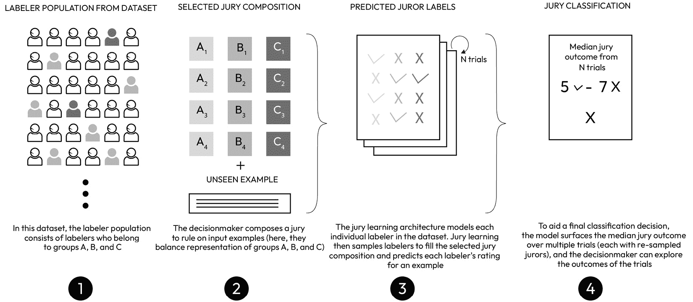
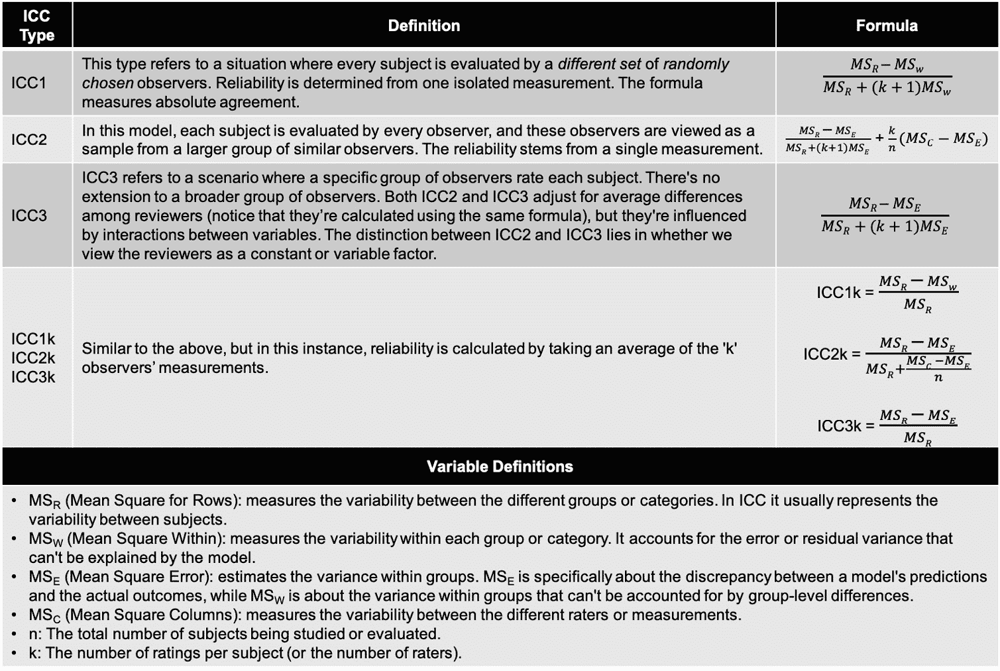
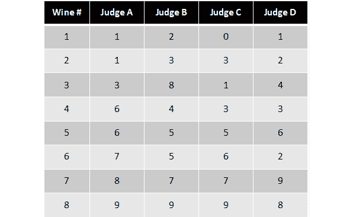
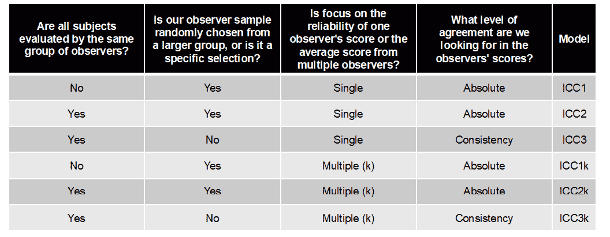
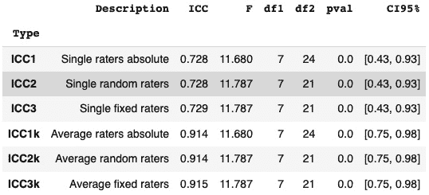

# 第四章：数据标注是一个协作过程

随着人工智能领域的发展，ChatGPT、**大型语言模型 Meta AI**（**LLaMA**）、Bard、Midjourney 等公开可用的工具为使用结构化和非结构化数据所能实现的可能性设定了新的基准。

这些模型显然依赖于先进的算法和大量数据，但许多人并不知道人类标注仍然是他们持续改进和发展的关键组成部分。例如，ChatGPT 的模型基础设施依赖于个人审查和标注数据样本，然后反馈给模型以改善其对自然语言和上下文的理解。

在本章中，我们将探讨如何充分利用涉及人类标注员的数据收集和标注任务。我们将涵盖以下一般主题：

+   我们为什么需要人类标注员

+   理解人类标注任务中出现的常见挑战

+   设计一个框架以实现高质量的标签

+   优化人类标注员激励措施、避免偏见以及处理标注模糊性的最佳实践方法

首先，让我们了解为什么人类输入是数据驱动**机器学习**（**ML**）的基石。

# 理解多样化人类标注的好处

在人类标注过程中纳入多样化的个人和观点提供了几个优势。人类在数据标注方面带来的精确度和准确性是机器难以匹敌的。尽管自动化系统可能难以处理模糊性或复杂性，但人类标注员可以利用他们的理解和推理能力做出明智的决策。

数据会随时间变化，新的场景可能会出现，而这些场景在原始训练数据中并不存在。人类标注员可以适应这些变化，提供反映新现实的更新标注。这确保了随着数据的发展，机器学习模型保持相关性和有效性。

人类标注员相对于程序化标注的一些关键优势包括以下内容：

+   **领域专业知识**：具有专业知识领域的标注员可以提供有价值的见解和标注，帮助模型更好地理解特定主题和领域。

+   **主动学习**：这种方法涉及优先处理模型认为模糊或具有挑战性的数据样本，使标注员能够专注于他们输入可以产生最大影响的领域。

+   **观点多样性**：多样化的标注员群体可以帮助减轻训练数据中的潜在偏见，从而实现更公平、更具包容性的 AI 模型。通过涉及来自不同背景和具有不同经验的人，模型可以接触到更广泛的语言细微差别、文化背景和观点，从而提高其整体性能。

+   **增强的上下文理解**：通过借鉴来自不同背景的标注员的经验和知识，模型可以更深入地理解语言细微差别、习语和文化参考。接触广泛的观点和输入可以使模型更具弹性和适应性，使其能够有效地处理更广泛的任务和场景。

+   **质量控制（QC）**：定期审计和评估标签器输出可以帮助确保标注质量的一致性和遵守指南，这对于有效的模型训练至关重要。

+   **遵守伦理规范**：基于伦理考虑，可能存在不应成为模型输入的数据或场景。在这些情况下，人类标注员在帮助模型满足伦理标准方面发挥着至关重要的作用。例如，ChatGPT 背后的公司 OpenAI 使用人类标注员进行审查、标注和过滤掉有害的“不适宜工作环境”数据。

虽然人类标注是数据为中心的模型开发的关键部分，但人类也会给任何机器学习项目带来新的行为、偏见和风险，这些必须得到管理。在我们介绍管理这些挑战的框架之前，我们将讨论这些典型的挑战。

# 理解由人类标注员产生的一般挑战

在我们深入探讨标注准确性和一致性的最佳实践之前，我们将定义我们必须通过我们的标注框架解决的常见挑战。标注不准确性和歧义通常是由以下七个原因之一或多个原因引起的：

+   **不明确的指示**：数据标注任务的不明确或不充分的指示会导致标注不一致。如果标注员没有收到明确的指南，他们可能会做出假设或猜测，导致不一致或不准确的标注。

+   **人类偏见**：当数据偏向于特定结果或结果时，偏见可能会引入歧义，导致不准确的理解。一个常见的解决方案是为同一数据分配多个标注员进行标注，选择最频繁出现的标签作为正确的标签。然而，这种聚合或投票方法有时可能会加剧偏见而不是纠正它。例如，如果大多数标注员存在特定的偏见，他们的共识可能反映了这种偏见而不是真实的数据。

+   **人类错误**：标注员是人，人都会犯错误。即使是最受培训、最投入和最专注的标注员，也可能因为一个打字错误或鼠标点击错误而应用错误的标签，导致数据集中出现随机噪声。这些错误确实会发生，但不太可能以系统化的方式发生。尽管如此，我们需要有一种方法来识别和纠正这些错误，以确保它们不会引入不必要的随机噪声。

+   **客观任务与主观任务**：每个任务都位于一个光谱上，从完全客观（只有一个正确答案）到高度主观（有多个可能的正确*解释*）。任务越主观，它倾向于在数据标注中引入的歧义就越多。正如你将在本章学到的那样，即使看似相对简单的任务也可能包含隐藏的主观性层次。

+   **难度**：本质复杂或难以理解的任务可能导致数据标注中的歧义。如果一个任务太难，标注者可能难以正确理解或完成它，从而导致不一致或不准确的标注。

+   **歧义**：某些任务或数据集本身具有歧义性，这意味着存在多个有效解释的空间。这种歧义可能导致数据标注的不一致性，因为不同的标注者可能会以不同的方式解释相同的数据。

+   **静态标注与可变标注**：在静态标注中，每个数据点被分配一个单一且不变的标签。相比之下，可变标注允许标签根据上下文或附加信息而变化。可变标注可能会引入歧义，因为同一数据点在不同的上下文中可能被标注为不同的标签。这种标注不一致性也可能随着标注者对任务越来越熟悉而出现，这导致他们改变对标签定义的认识。

现在我们将介绍我们实现准确和一致标签的框架。该框架专门设计用于识别或防止由这七个常见的标注挑战产生的问题。

# 设计高质量标签的框架

由人类进行的标注和审查可能劳动密集且容易受到人为错误和不一致性的影响。因此，目标是构建既准确又一致的语料库，要求标签达到准确度标准，同时确保不同标注者的结果处于同一范围内。

这些目标乍一看可能很明显，但现实中，让人类标注者达成一致意见可能非常棘手。除此之外，我们还需要验证共识意见没有受到某种形式的偏见。

我们实现高质量人工标注的框架由六个维度组成。在深入解释如何实现它们之前，我们将简要总结这些维度：

+   **清晰的指示**：为确保标签质量，标注任务的指示必须明确且无歧义。标注者应清楚地了解对他们期望的内容，包括关于任务、标注标准以及正确标注数据的示例的详细信息。

+   **动机一致**：标注者的动机应与获得高质量标签的目标一致。这可能包括奖励准确性、提供反馈以及创造鼓励细致工作的环境。当标注者感到他们的工作是宝贵的并且得到认可时，他们更有可能产生高质量的标签。

+   **主题专家（SMEs）**：利用对主题领域有专长的标注者可以显著提高标签的质量。这些人拥有对数据背后背景的深入知识和理解，使他们能够识别其他人可能错过的细微差别和细微之处。

+   **迭代协作**：通过迭代协作的过程可以实现高质量的标签。应鼓励标注者进行沟通和协作，根据集体反馈和讨论重新审视和改进他们的标签。

+   **思维多样性**：一个多元化的标注者群体会为任务带来不同的观点和解释，这可能导致更全面和稳健的标签。思维多样性有助于发现盲点并减少标注过程中的偏见。

+   **处理歧义**：由于歧义是任何数据标注任务固有的，因此对标注者进行如何处理模糊情况培训对于实现高质量标签至关重要。这可能包括寻求额外信息、咨询同行或主管或遵循预定义的模糊情况规则等策略。

让我们详细探讨这六个维度，以了解如何建立卓越的标注流程。这一切都始于确保我们对标注者的说明清晰明了。

## 设计清晰的说明

虽然看起来很明显，标注任务应该附带清晰的说明，但正如你将在本章中了解到的那样，这并不一定是一项容易的任务。分配不仅应该对创建它们的人清晰，而且更重要的是，对将执行它们的人也要清晰。

这个挑战有三个组成部分：首先，说明应包含执行任务所需的具体细节，无论谁执行这些任务。其次，指令设计应包括在分配过程中早期和持续地发现指令问题的方法。第三，我们必须确保我们的标注者具备足够的资格和动力来完成这项任务。

McInnis 等人（2016）1 研究了如果我们不管理一个或多个这些组成部分可能会出现的问题。研究人员检查了请求者和标注者之间指令不明确和动机不一致对**亚马逊机械 Turk**（**AMT**）的影响。

他们发现，经验丰富的标注者会使用各种工具和技术来评估作业的质量以及发布作业的请求者的可靠性，在承担新项目之前这样做。他们这样做是为了选择明确定义的作业，可以无障碍地完成，同时避免那些支付很少或影响他们声誉的任务。

基本上，好的标注者会绕过不明确的作业，以避免迭代任务或不公平拒绝已完成的工作（标注者的工作被拒绝会导致未支付工作费用）。作者发现，标注者在决定是否接受作业时，通常会在任务说明中寻找以下风险因素：

+   任务或界面设计中的缺陷

+   评价标准不明确

+   对拒绝的不响应、任意的解决方案

+   请求者信息不足

+   缺乏经验和不熟悉的请求者

+   返利差的任务

+   优先考虑效率而非质量

作为数据专业人员，我们的工作是提供减轻这些七个因素的作业说明，无论我们是在使用众包标注者还是在内部 SMEs。然而，有时你只有在实际使用中才会知道你的说明是否清晰。

因此，问题是：我们如何最好地在请求者和标注者之间对任务的理解进行对齐，同时确保我们有合适的人在工作？

Liu 等人（2016）2 为此目的开发了一种最佳实践方法，称为 **Gated Instruction**。这项技术用于培训标注者，在请求者和标注者之间对任务的理解进行对齐，并识别表现不佳的工人。

Gated Instruction 基于这样一个观点：当人们得到关于他们表现的反馈时，他们学得更好。这是通过提供一个交互式教学环境来实现的，用户可以在其中接收关于他们标注的反馈并相应地调整他们的方法。目标是创建一个系统，可以以最小的用户努力提供准确的标注。

Gated Instruction Crowdsourcing Protocol 是一个简单且可推广的三阶段流程，旨在确保数据标注的质量。它包括一个交互式教程、筛选问题和持续筛选的问题批次。作者如下描述了该协议：

### 第一阶段 – 交互式教程

这一阶段涉及一个全面的教程，解释手头的任务：

1.  工人被赋予了每个关系的明确定义和标记标准。

1.  工人通过标注说明每个关系的句子来练习。

1.  每个练习句子之后都提供即时反馈，以指导工人。

### 第二阶段 – 筛选问题

这一阶段旨在评估工人对任务的理解：

1.  工人被要求标注一组五个代表性的黄金标准问题。

1.  对每个问题提供反馈，以帮助工人了解他们的错误。

1.  在这些问题的多数失败者将被排除在剩余流程之外。

### 第三阶段 – 问题批次（持续筛选）

这一阶段专注于在任务执行过程中保持高质量的工作：

1.  金标准问题被包含在任务中，但没有提供反馈。

1.  每个包含 20 个问题的批次中包含 5 个金标准问题，其频率以指数级下降。

1.  在最后 10 个金标准问题中得分低于 80%的工人将被淘汰。

### 一般原则

这些原则确保了过程的完整性和效率：

1.  只有那些 AMT 声誉超过一定阈值的工人才能被接受。

1.  在整个任务中提供了关系的定义链接，以便快速参考。

1.  工人在继续之前必须纠正反馈中指出的任何错误。

1.  在每个批次之后，都会提供到目前为止的收入和金标准问题的表现反馈。

1.  工人在完成所有 10 个批次后都会得到奖金提醒，这鼓励他们持续保持高质量的工作。

Gated Instruction 比传统的指导和筛选方法提供更准确的结果，因为用户能够收到对其标注的反馈并根据此调整方法。使用这种方法，作者在同一数据集上提高了精确度从 0.50 到 0.77，召回率从 0.70 到 0.78。这是与传统指导方法相比的结果。

这两个研究使用了众包标注员来进行他们的研究，但当你的标注员不是众包工人，而是与你有更紧密工作关系的专家知识（SMEs）时，相同的框架仍然高度相关。

例如，如果你从内部同事的池中挑选标注员，你可能基于某人的特定专业知识、经验年限和对贡献项目的兴趣来做出选择。正如你将在下一节中了解到的那样，标注员完成任务的动力可以极大地影响数据的收集，以及最终你的模型在该数据上的表现。

当我们讨论如何激励标注员以及如何使用专家知识（SMEs）进行更复杂的标注任务时，让我们基于这些原则来展开。

## 对齐动机和使用专家知识（SMEs）

尽管技术在自动化数据收集方面取得了巨大进步，但人类数据收集者在各个领域仍然占据着至关重要的地位。他们带来了机器无法复制的理解力、同理心和判断力。例如，人类数据收集者和标注员可以解释语言、语境和情感中的细微差别。同样，他们可以与受访者互动，建立联系，并鼓励更开放和诚实的回答。

人类数据收集者面临的一个重大挑战是保持他们的动力和参与度与数据的次要用途保持一致。让我们讨论四个通常导致这一问题的因素。

### #1 – 缺乏目的

如果数据收集者不理解他们工作的意义，他们可能会感到与工作脱节且缺乏动力。数据收集者可能会问自己，“如果没有人会使用这些信息，我为什么要收集这些信息？”

**解决方案**：传达整体情况，并展示每个数据点如何成为机器学习解决方案的有价值构建块。

我们开始任何数据收集和标注练习时，都假设工作人员是聪明的，能够理解收集丰富、无偏见信息的重要性。他们明白，任何数据质量上的妥协都可能对其未来使用产生负面影响。我们的角色随后变为阐明良好数据收集的重要性，并解释其预期用途。这种阐述将显著减轻与数据质量相关的问题。

几年前，Manmohan 和 Jonas 进行了一系列需要一线员工通过客户访谈收集大量信息的机器学习项目。这些访谈已经进行了多年，所以我们已经收集了大量的数据，但这些信息是以对话格式以文本形式捕获的，因此难以进行统计分析。

我们希望使这些数据更容易用于机器学习目的，因此我们召集所有一线员工进行了一次关于数据质量重要性的演示和研讨会。在向这些数据收集者展示我们如何使用他们收集的数据来构建特定的机器学习解决方案后，他们惊讶地了解到他们的工作可以产生多么大的影响。

如一位团队成员所说，“如果我知道我收集到的信息可以帮助成千上万的客户，我会投入更多的精力去关注细节。”

在研讨会上，我们通过创建一系列模板化问题，让数据收集者承担起责任，这些问题将提高收集数据的准确性和信号。我们的一线同事为改善他们为公司及其客户收集数据的方式而感到自豪。他们对数据质量和“他们的数据”产生的结果有了转变后的所有权感。

我们也很高兴，因为数据质量的提升最终使我们的模型在某些情况下准确率提高了高达 40%。

### #2 – 数据任务的繁琐性质

数据收集和标注可能是重复和单调的，导致无聊和缺乏参与感。这创造了一种内在的激励，即以最小的努力完成任务。

**解决方案**：我们采用以下四种策略来减少数据收集和标注的枯燥部分：完善我们的问题、简化流程、消除不必要的数据，并在可能的情况下进行自动化。

有时候，通过教授数据收集者提出更好的问题，你可以产生巨大的影响。更具体和有针对性的问题通常会得到更有意义和吸引人的回答。这提高了数据质量，同时使数据收集过程更有趣且不那么重复。

简化流程可能意味着优化工作流程，使用更用户友好的软件，或为参与数据收集的人员提供清晰的指示和培训。通过使过程更加直接，我们可以减少个人的认知负荷，使任务不那么令人疲惫。

如果你像大多数数据专业人士一样，丢弃或限制数据收集的想法可能会引起一定程度的焦虑。然而，我们必须认识到，数据收集并不意味着囤积你遇到的每一份数据，尤其是如果它妨碍了保持良好的用户体验。实际上，收集不必要或不相关的数据可能会增加任务的单调性，并产生阻碍数据分析的杂乱。因此，识别并仅关注真正与你的研究问题或商业目标相关的数据至关重要。

我们最后的简化策略，即自动化，通常是解决数据收集繁琐问题的绝佳解决方案，但我们更倾向于在用尽其他三种策略之后再引入自动化。没有必要自动化那些应该以不同方式完成或根本不应该做的事情。

例如，抓取工具可以从网站或文档中自动提取大量数据，基于规则的逻辑或机器学习算法可以对数据进行标记和组织。你将在本书的编码章节中学习一些这些自动化技术。

不久前，我们与一家大型企业合作，构建了关于呼叫者购买投资产品倾向性的实时预测模型。该企业希望他们的呼叫中心工作人员在通话期间就能获得这一预测结果，以便他们能为呼叫者匹配到合适的投资专家。

这些筛选通话通常需要 15 到 20 分钟才能完成，呼叫中心工作人员会艰难地逐页浏览与呼叫者个人详情、人口统计、投资经验和风险偏好相关的问题。

虽然收集了大量的数据，但这些数据并不是构建预测所需的那种信息。我们确定了一些补充数据点，这些数据点对于可靠地确定某人的产品需求至关重要。然而，将这些数据点作为额外问题添加到数据收集过程中是不切实际的，因为筛选通话已经很长且很繁琐。为了获取所需的信息，我们必须为呼叫者、呼叫中心工作人员和数据科学家创造一个双赢的局面。

当我们与呼叫中心团队一起讨论这个挑战时，我们发现大约 20%的现有问题可以通过增强来使对话更加简洁，而另外 15%的问题可以完全删除，因为它们捕捉到了无关或重复的信息。最后，10%收集到的数据可以根据呼叫者的其他问题的答案预先填写或推导出来。

在实施这些变化后，即使我们在流程中增加了五个新问题，平均通话处理时间也下降了大约 30%。通话时间的缩短使得每天可以处理更多的通话，从而增加了转化为付费客户的机会——这对所有相关人员都是双赢。

### #3 – 缺乏激励

没有适当的奖励或认可，数据收集者可能缺乏最佳表现的动机。例如，如果一个人被收集到的数据点的**数量**而不是单个响应的**质量**所激励，可能会导致任务完成得更加肤浅。

**解决方案**：当我们专注于以下四个不同领域的激励数据收集者时，我们看到了最佳的结果：

1.  **展示什么是好的样子**：首先，设定清晰的高质量工作标准至关重要。大多数人都会为自己的工作感到自豪，并在理解他们的努力的价值和影响时努力表现良好。通过定义数据收集或标注任务的宗旨和重要性，并展示优秀工作的例子，你为团队提供了一个具体的目标。这种清晰度有助于确保收集到的数据是稳健的、相关的，并且富含有价值的见解，同时最大限度地减少噪音。

1.  **创造互利共赢**：其次，培养数据收集者和数据使用者之间的共享成功感至关重要。当数据收集者了解他们的努力如何对大局做出贡献——可能是推动关键业务决策或推动创新项目——他们更有可能感到对工作有所投入。这种所有权和贡献感可以显著提高数据收集的质量。

1.  **提供非货币奖励**：关注的第三个领域是非货币奖励。认可和感激是强大的激励因素。游戏化可以在这方面成为一个非常有效的工具，将数据收集过程转变为引人入胜的竞赛。实施如公开显示的排行榜、徽章或积分等特性，可以培养成就感，并在团队成员之间鼓励健康的竞争。长期存在的“月度员工”概念不仅奖励了卓越的表现，也为其他人树立了一个值得追求的标准。

1.  **提供经济奖励**：最后，经济奖励可以是一个强有力的激励因素。将薪酬与工作质量挂钩可以促使个人达到或超过设定的标准。然而，这种方法需要一个明确的框架来概述绩效期望和绩效的客观衡量标准。同时，你还需要有能力影响某人的薪酬，如果你的注释员和数据收集员是内部员工，这可能很困难。虽然并非总是可行，但在可用时，经济激励可以成为一个强大的动机因素。如果它们不是一种选择，那么在其他三个动机领域加倍努力仍然可以产生令人印象深刻的结果。

总之，激励数据收集员和注释员做好工作是多方面的。它需要清晰沟通、互利、认可和适当的补偿的混合。

### #4 – 工作环境

压力大或缺乏支持的工作环境也可能影响动机水平。如果一个数据收集员或注释员有许多相互竞争的优先事项，他们可能会对数据收集采取“差不多就可以了”的态度。

**解决方案**：为注释员和数据收集员创造一个适合专注于手头主要任务的合适工作环境基本上要求你移除任何不必要的任务或阻碍某人完成工作的摩擦。

我们通常拒绝参与数据科学项目，除非项目所需的所有人员都有动力参与，并在整个项目期间保持可用。这通常需要我们与小专家、数据收集员及其经理协商，在日历上预留专门的时间。

为数据收集员提供反馈机制也很重要。这样，他们可以参与到过程中，并指出不工作或可以做得更好的地方，例如可以以不同方式表述的问题，改变问题的顺序或任务，混淆的标签要求等。

为注释员和数据收集员提供必要的工具和资源，以便他们迅速有效地完成工作。例如，数字化数据收集，尽可能自动化数据录入，条件格式化下拉选项等。

项目参与者之间的持续和及时反馈也是至关重要的。在项目后期对工人进行负面反馈可能会令人沮丧，并产生反效果。相反，在整个过程中进行合作并提供反馈，以确保从一开始就保持一致。假设过程中可能会有一些小问题，并准备好积极引导团队通过这些问题。相反，如果你假设每个人都已经按照预期理解了每项指令，那么你就是在为自己设置失败。

有些人不认为这种工作属于数据科学领域。在我们看来，这正是许多数据专业人士的不足之处。重要的是要认识到人类行为和偏见可能是数据科学项目的严重限制因素，你希望尽可能减少这种影响。如果你不面对这些非技术障碍，你最终会得到更差的数据。

这将我们引向框架的下一个维度：迭代协作。

## 迭代协作

迭代协作应该是人类标注任务的核心策略。基本上，它包括创建一个持续的反馈和微调数据标注过程的流程。以下是实施数据标注协作方法的三个指导原则，这些原则得到了数据标注平台 SUPA 最佳实践方法的验证。

### 从小规模开始，尽早解决任何问题

使用较小的数据集启动数据标注过程是一种实用方法。与其从数千个观察值开始，不如从 50 个观察值的校准批次开始。这个可管理的数据集允许你审查标签，发现潜在问题，改进说明，并向标注员提供反馈。

重复此过程，直到你确信你已经遍历了整个数据集的代表性样本，已经识别出大多数边缘情况，并且你的标注员能够一致地完成任务。

相同观察中的标注不一致表明需要修订规则。如果标注员对指南有不同的理解，那么了解原因是否是不清晰的标注规则、个别标注员对理解和经验的差异，或者完全是其他原因，是值得的。换句话说，你的标注说明永远不会是一劳永逸的。它们应该始终处于监督之下，并随着项目需求的发展而演变。

### 可视化好的样子

标注规则有时可能含糊不清，导致主观解释和不一致。例如，在图像标注练习中，一条规则如“只有当大部分内容可见时才进行标注”可能被不同的标注员以不同的方式解释。因此，重要的是要直观地展示什么是好的。

可视化在数据标注过程中非常有价值，因为它们为标注员提供了明确的指导，说明标注对象应该如何呈现。我们建议展示如何正确执行标注任务的示例，同时也展示错误的示例。通过提供良好和不良标注规范的视觉说明，标注员能够更深入地理解任务，从而提高他们的生产力和精确度。

### 对边缘情况要非常具体

边界情况是指偏离常规的情况，由于主观意见可能导致标签不一致。例如，玩具车应该被标记为汽车吗？双人自行车是一辆还是两辆自行车，或者它属于一个单独的分类？

为了有效地管理边界情况，你需要有一个机制让标注者标记这些项目以供进一步考虑。如果你没有建立反馈机制，标注者很可能会现场自行做出判断以完成任务。

Pradhan 等人（2022）4 提出了一种所谓的 *FIND-RESOLVE-LABEL* 工作流程，用于众包标注，旨在解决这三个迭代步骤。FIND-RESOLVE-LABEL 工作流程是一种指导性标注过程，旨在揭示特定标注任务及其相关说明中的模糊性。

例如，一个标注任务可能是识别包含女性的图像。表面上，这个任务看起来相当简单，但现实中，标注者很快就会面临模糊性。例如，什么时候某人算作女性，什么时候算作女孩？这甚至重要吗？一个女性的雕像或《蒙娜丽莎》画作——这算数吗？如果女性只部分可见呢？

实际上，为特定的标注任务提供高质量的说明可能非常困难，因为可能有很多维度需要考虑。

FIND-RESOLVE-LABEL 工作流程旨在在标注练习的开始阶段发现并消除这些模糊性。它由三个关键组件组成，这些组件协同工作以简化数据标注过程：

1.  **发现**：在这个初始阶段，标注者会收到标注说明，并要求根据这些说明识别模糊的示例。对于每个识别出的示例，标注者还被要求提供一个概念标签，解释为什么选择了特定的标签。这允许收集标注决策背后的推理和概念思考，然后可以将其反馈到改进的标注说明中。

1.  **解决**：一旦确定了数据点，下一步就是解决数据中的任何模糊性或冲突。这可能需要领域专业知识来做出明智的决定，如何解决不一致或缺失信息。

1.  **标注**：最后，在解决任何问题后，数据点被适当地标注，确保高质量的标注，这些标注可以用于训练机器学习模型。

普拉德汉和他的团队发现，在标注过程中关注最不明确的数据点并澄清它们，可以大大提高数据质量。他们注意到，在某些模糊的场景中，许多标注者同意的答案与请求者认为正确的答案不同。这意味着即使使用智能答案聚合方法，也存在为这些任务获得错误标签的风险。

有趣的是，该研究还发现，工人可以正确地标注与主要概念密切相关的研究结果。这表明我们可能不需要在任务中解释每一个可能的歧义，因为精心挑选的一组例子可以帮助团队正确地标注其他不明确的例子。

考虑到这些发现，让我们以数据为中心的方式探讨如何处理标注员之间的歧义。

## 处理歧义和反映多样性

在人类标注员的帮助下，我们可以生成信息极其丰富的数据集，但有时这需要我们以创新的方式解决歧义。同时，歧义可能很难被发现。一个人认为明显的事情，另一个人可能觉得完全令人困惑。

公司和研究人员使用内部员工、志愿者或众包平台（如 AMT）以可承受的价格获取人类标注员。这些标签员来自不同的背景，携带不同的偏见，所有这些都可能影响标注的质量——尤其是在涉及判断因素时。

随着人工智能和机器学习被用于从可以根据上下文和解释者不同而具有不同解释的数据集中分类和生成新内容，这一挑战只会日益加剧。这一点在 Sap 等人（2019）的研究论文《仇恨言论检测中的种族偏见风险》中得到了体现，该论文调查了标注员对方言差异的敏感性不足如何导致自动化仇恨言论检测中的种族偏见。

论文指出，即使是专门为检测仇恨言论而设计的数据集，也包含对特定群体或少数族裔语言的固有偏见。这是因为底层参数是基于标注员的偏好创建的，而这些标注员可能没有意识到不同民族或语言之间细微差别的微妙之处。

例如，一些民族或社会群体可能使用一些口语，这些口语对其他群体的人来说可能显得粗鲁或冒犯。例如，研究人员发现，标签员倾向于将非裔美国英语中的短语标记为比使用通用美国英语的短语更具毒性。

这些固有的偏见难以避免，因为标注员很少是完全的领域专家，而是遵循一般指令的人。同时，标签员不太可能成为普通公众的代表样本。例如，AMT 参与者的大多数历史上是未婚且无子女的年轻人。绝大多数 Turkers 来自仅两个国家，即美国和印度，而来自全球南部的不到 2%。

这个问题不仅仅与仇恨言论的主题有关。因此，在确定任何需要主观解释的标签时，某些方言、生活方式、文化背景和世界观可能被过度代表，而其他则可能被代表性不足。由此导致的数据收集不佳可能导致标签与它们旨在代表的现实世界场景之间的差距增大。

数据标注中存在的失衡在一些全球最广泛使用的公共训练数据集中表现得非常明显。研究发现，其中两个最常用的数据库，*ImageNet* 和 *Open Images*，倾向于美国和欧洲，这一点从这些数据集创建的模型在来自全球南部的图像上的性能较差可以明显看出。

例如，当新郎的图片来自埃塞俄比亚或巴基斯坦时，与来自美国的相似图片相比，其准确性评级较低。这种特定的差异是由于“婚礼”和“香料”等物体根据其文化背景被解释的方式不同，公开可用的识别系统在来自美国或欧洲以外的国家时，往往难以正确分类它们。

## 理解处理标注中模糊性的方法

标签往往是绝对的，但观点不是。同时，人类在更抽象的标签应该是什么的问题上往往会意见不一。作为以数据为中心的从业者，我们应该预见标注者之间的模糊性和分歧，并制定管理它的计划。

值得注意的是，我们实际上*希望*出现模糊性，这样我们才能以正确的方式处理它。模糊场景可能源于标注指令不明确，但它们也可能揭示出必须包含在我们数据集中的新标签。因此，我们应该努力设计我们的标注团队，以最大化我们能够揭示出任何存在的分歧的可能性。

做这件事的一个好方法就是涉及一个更加多元化的标注者群体，他们更能适应语言和观点等元素之间的差异，但在这样做的同时，我们也希望提升少数群体的意见。斯坦福大学的研究人员 Gordon 等人（2022）8 提出了一种旨在实现此目的的方法，称为 *陪审团学习*。

在 Gordon 等人（2021）9 的先前研究中，发现当在评论毒性标注任务中考虑非多数群体的标签时，分类器的性能从 0.95 ROC AUC 下降到 0.73 ROC AUC。这意味着当应用于非多数群体的人的评论时，分类器并不那么有效。换句话说，不可能让每个人都达成一致，因此我们应该考虑我们听取的是谁——不一定只是简单的多数。

陪审团学习与更直接的汇总或多数投票方法形成对比。陪审团学习不是基于多数规则或概率来建立标签，而是积极使用不同的意见来挑选出潜在的偏见并压制少数意见。它被提出作为一种将不同意见的声音整合到机器学习系统中的方法，以防止它们过度依赖单一意见或观点。以下是它是如何工作的。

**陪审团学习**是一种**监督机器学习**（**SML**）方法，通过陪审团的隐喻明确解决分歧。这种方法允许实践者指定他们的分类器反映了哪些声音，以及以何种比例。陪审团学习的目标是定义哪些人或群体决定了系统的预测以及以何种比例，从而允许开发者分析——并可能减轻——模型中可能存在的任何潜在偏见。

为了有效地使用陪审团学习，实践者必须首先确定他们希望将其包括在模型中的陪审员。这可以通过选择代表手头问题不同视角的个人来完成。

例如，假设任务是标记电影是否好。实践者可以从不同的群体中选择陪审员（标记者），例如年龄、性别、种族、地点、政治倾向或社会经济地位。一旦选定了陪审员，他们就必须通过回答关于电影是否好以及为什么好的问题，向模型的预测提供输入。

一旦所有陪审员都向模型的预测提供了他们的意见，实践者就可以使用这些数据为每个个案创建一个汇总预测。通过考虑每个个案的多个视角，实践者可以确保他们的模型比仅依赖单一视角进行预测时更加准确和较少偏见。

最后，实践者还可以通过比较由不同背景或视角的个人组成的陪审团所做的汇总预测，使用陪审团学习来分析他们模型中存在的任何潜在偏见。这种比较有效地为我们提供了一个预测范围，而不是二元标签。分析可以帮助识别任何可能存在偏见的领域，并允许实践者相应地调整他们的模型，以减少任何潜在的偏见并提高整体准确性。这个过程在以下图中得到了说明：



图 4.1 – 来自 Gordon 等人（2022 年）的陪审团学习过程概述

到现在为止，你可能已经注意到陪审团学习并不简单。与许多以数据为中心的方法一样，陪审团学习需要广泛的规划和协调，以确保所有参与者都清楚地了解过程的期望和指南。这可能是一个耗时且资源密集的过程。

陪审团学习也需要一定规模的标注者池，以确保意见和观点的必要多样性。这可能会是一个挑战，尤其是对于资源有限的项目来说。

实施陪审团学习带来的另一个挑战是需要关于标注者的元信息。为了确保结果既准确又可靠，陪审团学习需要具有不同技能和背景的标注者。收集这些信息并开发符合要求标准的标注者池可能是一项困难的任务，这又需要提前规划。

尽管存在这些挑战，陪审团学习为从业者提供了一种创新且有效的方法，将不同意见的声音纳入机器学习模型，同时帮助他们识别和减轻模型中可能存在的任何潜在偏见。通过在做出预测和分析模型中存在的潜在偏见时考虑多个观点，从业者可以确保他们的机器学习模型在处理容易受到主观性影响的重要任务时既准确又无偏见。

为了结束这一章，让我们探讨如何从统计上衡量标注者之间的歧义或不一致。

# 衡量标注一致性

到目前为止，我们已经讨论了一系列创建一致性和高质量标注的工具和技术。虽然这些元素为良好的数据集奠定了基础，但我们还希望能够衡量我们的标注者是否表现出一贯性。

为了衡量标注者的一致性，我们建议使用两种标注一致性的度量，分别称为观察者内部和观察者之间的可变性。这些是临床研究中的标准术语，指的是同一观察者（内部）或不同观察者（外部）在不同测量或评估中的同意程度。为了简化解释，可以将“观察者”视为与“标注者”、“注释者”、“评分者”、“数据收集者”以及我们在本章中使用的任何其他类似术语可以互换。

虽然观察者内部和观察者之间的可变性都与测量一致性相关，但它们解决的是不同的方面。观察者内部的可变性指的是单个观察者在一段时间内的稳定性，而观察者之间的可变性指的是不同观察者之间的稳定性。诸如培训、经验和协议标准化等因素可以显著影响这两者。

跟踪观察者差异至关重要，因为它直接影响您输入数据集的质量和可靠性，从而影响您的模型。如果同一对象被不同的观察者（观察者间差异）或同一观察者在不同时间（观察者内差异）解释不同，可能会导致标签不一致，从而影响机器学习输出的整体质量。

几个因素导致了观察者之间的差异，包括测量技术缺乏标准化、观察者疲劳以及主观解释。例如，某人的判断可能受到其经验水平、个人偏见或甚至观察时的心理状态的影响。

重要的是要注意，两个或更多观察者之间的标签差异并不一定意味着其中一个观察者是正确的，而其他人是错误的。标签上的分歧可能仅仅意味着被标记的对象或情况是模糊的或短暂的，因此难以给出明确的标签。

例如，两位医生可能会根据医学影像或症状描述对疾病的相对进展意见不一致。这可能是因为诊断不确定，而不是一位医生比另一位医生更正确。

测量差异的常见技术是**类内相关系数**（**ICC**）。ICC 是一种统计工具，用于评估一个或多个观察者对同一实体进行标注的一致性或一致性。与常用的皮尔逊相关系数不同，后者测量变量之间的线性关系，ICC 评估同一组数据中评分的可靠性。当我们想知道同一组别中的单位之间相似性有多强时，它特别有用。

一个接近 1 的高 ICC 值表明同一组别中的值之间具有高度相似性。相反，一个低的 ICC 值表明评分之间的一致性较低。

ICC 有不同的形式，每种形式适用于特定的情况。例如，某些形式更适合当我们从每个受试者那里得到单一测量时，而其他形式更适合于几个测量的平均值。形式的选择取决于您研究的性质和您拥有的数据类型。

以下截图显示了 Shrout 和 Fleiss（1979）10 提出的六种常见定义：



图 4.2 – 六种常见的 ICC

为了让我们对 ICC 分数的使用有更直观的理解，让我们通过使用**Pingouin** Python 包的实例来实际操作。Pingouin 是一个开源包，具有大量有用的统计功能。它主要利用 pandas 和 NumPy，所以请确保您已经安装了这些。

对于我们的示例场景，假设我们有四位品酒评委通过给八种不同的葡萄酒评分 0 到 9 来评价其质量。我们想知道这些评委是否对葡萄酒的评分是一致的。评委的评分显示在以下屏幕截图：



图 4.3 – 来自四位不同评委的品酒评分

+   一般而言，可能发生三种类型的变异性：

+   由于评估对象之间的差异引起的变异性（假设两种不同的同一种葡萄酒样本有略微不同的口感）

+   由观察者的评估引起的变异性，例如，评委 B 和 C 对葡萄酒 *#3* 评分的差异

+   标签使用的变化；例如，每个人都认为葡萄酒 *#1* 是最差的，但已经使用了三种不同的评分来对其进行评价

ICC 计算将考虑所有这些因素，因为它基于 **方差分析**（ANOVA）分析。在我们计算 ICC 之前，我们必须首先确定我们追求的是哪种类型的衡量标准。我们可以使用以下屏幕截图作为选择我们情况中正确 ICC 形式的指南：



图 4.4 – ICC 模型选择指南

在我们的场景中，以下适用：

+   每位评委都只对每款葡萄酒进行过一次评分，因此我们可以确定所有受试者都由同一组观察者进行了评估

+   在这种情况下，我们将假设四位评委是从更大的潜在评委池中随机选择的

+   我们对个别观察者的可靠性感兴趣，而不是平均可靠性

*因此，我们正在寻找使用 ICC2 计算来确定我们的* *可靠性分数*。

我们随后使用以下脚本在我们的葡萄酒评分上运行 ICC 函数。Pingouin ICC 操作符 `intraclass_corr` 将计算并展示所有六种常见的 ICC 衡量指标，但我们只对 ICC2 感兴趣：

```py
import pingouin as pg
data = pg.read_dataset('icc')
icc = pg.intraclass_corr(data=data, targets='Wine', raters='Judge',
                         ratings='Scores').round(3)
icc.set_index("Type")
```

这会产生以下输出。我们的 ICC 分数为 0.728，这意味着我们的评委在评分上达成中等程度的共识：



图 4.5 – 输出表

重要的是要理解，没有严格的阈值来界定“可接受”的 ICC 分数。虽然没有固定的基准，但一些一般性指南可以帮助解释 ICC 分数。这些范围不是绝对的，应该根据你具体的研究或分析来解释：

+   **ICC 小于 0.5**：这个范围通常被认为是表明可靠性差。例如，如果你有一组评分的 ICC 为 0.3，这表明评分者之间达成一致的程度较低。

+   **ICC 在 0.5 到 0.75 之间**：这个范围内的分数通常被认为是表现出中等可靠性。

+   **ICC 在 0.75 到 0.9 之间**：这些分数表明良好的可靠性。例如，如果你达到 ICC 为 0.8，这表明你的评分者之间达成高度的一致。

+   **ICC 大于 0.90**：这个范围表示出色的可靠性。例如，ICC 为 0.95 表示评分者之间几乎完全一致。

在解释 ICC 分数时，考虑几个可能影响其可靠性的因素也同样重要。这些因素包括以下内容：

+   **样本大小**：与许多统计指标一样，ICC 对样本大小也很敏感。较大的样本大小往往能提供更可靠的 ICC 估计。

+   **数据结果范围**：ICC 分数也可能受到被评估结果的可能范围以及确定注释的难度的影响。例如，如果我们的葡萄酒评委只能将葡萄酒标注为“好”或“坏”（1，0），而不是一个范围（0–9），那么这可能会改变最终的 ICC 分数。

+   **受试者变异性**：ICC 也受到受试者之间变异性的影响。即使评分者在评分上保持一致，高变异性也可能导致 ICC 值降低。

在实践中，解释 ICC 分数需要理解你的研究背景、数据性质以及所使用的特定 ICC 形式。在解释和传达你的结果时，始终考虑这些因素。

记住——ICC 分数只是拼图中的一块。它们应该与其他统计指标和见解结合使用，以提供对数据的全面理解。让我们总结一下本章到目前为止所涵盖的内容。

# 摘要

在本章中，我们考察了人类在确保数据质量方面发挥的关键作用，尤其是在数据标注的初始阶段。我们认识到，虽然人类标注者是不可或缺的，但他们也带来了一些挑战，包括偏见和不一致性。

为了解决这些问题，我们探索了各种策略来有效地训练标注者以开发高质量的数据库。关键要点是，经过良好训练且拥有明确指示的标注者可以显著提高数据的整体质量。

改进任务说明成为了一个反复出现的主题，强调了其在促进标注过程中的重要性。迭代协作也被强调为一种基本实践，通过反馈和改进促进持续改进。

到本章结束时，你应该已经全面理解了为什么在以数据为中心的模型构建中，人类参与至关重要，人类标注者所面临的挑战，以及克服这些挑战的实际方法。更重要的是，你将学会如何使用特定的框架来实现高质量的标注，为成功的 ML 项目打下坚实的基础。

在下一章中，我们将在这些技能的基础上进一步深入探讨数据清洗和增强的技术方面，然后再探讨第六章中程序化标注技术，即*机器学习中的程序化标注技术*。现在是深入代码的时候了！

# 参考文献

1.  *McInnis B.*, *Cosley D.*, *Nam C.*, *Leshed G.*, *围绕拒绝、不信任、风险和亚马逊机械师图灵平台工人体验进行设计*，*信息科学法学院*，*康奈尔大学*。[`dl.acm.org/doi/epdf/10.1145/2858036.2858539`](https://dl.acm.org/doi/epdf/10.1145/2858036.2858539)

1.  *Liu A.*, *Soderland S.*, *Bragg J.*, *Lin C. H.*, *Ling X.*, *Weld D. S.*, *有效的大规模标注用于关系抽取*，*图灵中心*，*华盛顿大学计算机科学与工程学院*。[`aclanthology.org/N16-1104.pdf`](https://aclanthology.org/N16-1104.pdf)

1.  [`www.supa.so/post/iteration-a-key-data-labeling-process-often-overlooked`](https://www.supa.so/post/iteration-a-key-data-labeling-process-often-overlooked)，2023 年 7 月 30 日查阅。

1.  *Pradhan V. K.*, *Schaekerman M.*, *Lease M.*, *2022*，*寻找歧义：为众包工人澄清标注指南的三阶段工作流程设计*，*前沿人工智能*，2022 年 5 月 18 日，*机器学习与人工智能卷 5*。 [`doi.org/10.3389/frai.2022.828187`](https://doi.org/10.3389/frai.2022.828187)

1.  *Sap, M.*, *Card, D.*, *Gabriel, S.*, *Choi, Y.*, *Smith, N. A.*, *仇恨言论检测中的种族偏见风险*，*保罗·G·艾伦计算机科学与工程学院*，*华盛顿大学*，*西雅图*，*美国*，*机器学习系*，*卡内基梅隆大学*，*匹兹堡*，*美国*，*艾伦人工智能研究所*，*西雅图*，*美国*

1.  [`venturebeat.com/business/the-ai-industry-is-built-on-geographic-and-social-inequality-research-shows/`](https://venturebeat.com/business/the-ai-industry-is-built-on-geographic-and-social-inequality-research-shows/)，2023 年 4 月 22 日查阅。

1.  [`venturebeat.com/ai/mit-researchers-find-systematic-shortcomings-in-imagenet-data-set/`](https://venturebeat.com/ai/mit-researchers-find-systematic-shortcomings-in-imagenet-data-set/)，2023 年 4 月 22 日查阅。

1.  *Gordon M. L.*, *Lam M. S.*, *Park J. S.*, *Patel K.*, *Hancock J.*, *Hashimoto T.*, *Bernstein M. S.*, *2022*. *陪审团学习：将不同意见融入机器学习模型*. 在 *CHI 计算机系统人因工程会议 (CHI ‘22)*，2022 年 4 月 29 日至 5 月 5 日，*新奥尔良*，*LA*，*美国*. *ACM*，*纽约*，*NY*，*美国*

1.  *Gordon M. L.*, *Zhou K.*, *Patel K.*, *Hashimoto T.*, *Bernstein M.S.*, *2021*，*不一致解卷积：将机器学习性能指标与现实对齐*，在 *CHI 计算机系统人因工程会议 (CHI ‘21)*，2021 年 5 月 8 日至 13 日，*横滨*，*日本*. *ACM*，*纽约*，*NY*，*美国*，14 页。[`doi.org/10.1145/3411764.3445423`](https://doi.org/10.1145/3411764.3445423)

1.  *Shrout, P. E.* & *Fleiss, J. L.* (*1979*), *Intraclass correlations: uses in assessing rater reliability*, *Psychological Bulletin*, *86(2)*, *420.* [`psycnet.apa.org/doi/10.1037/0033-2909.86.2.420`](https://psycnet.apa.org/doi/10.1037/0033-2909.86.2.420)，2023 年 7 月 30 日查阅。

# 第三部分：提高数据质量的技术方法

在本部分，我们探讨了提高机器学习中数据质量和管理的技术方法。我们涵盖了从数据清洗、程序化标注、合成数据使用，到解决偏差和处理罕见事件等主题。每一章都为你提供了在机器学习中高效工作所需的基本技能和知识，强调了高质量数据在构建稳健的机器学习系统中的重要性。

本部分包含以下章节：

+   *第五章**，数据清洗的技术*

+   *第六章**，机器学习中程序化标注的技术*

+   *第七章**，在数据为中心的机器学习中使用合成数据*

+   *第八章**，识别和消除偏差的技术*

+   *第九章**，处理机器学习中的边缘情况和罕见事件*
