# 第五章：数据清洗技术

在本章中，我们将介绍数据质量的六个关键维度及其提高数据质量的相关技术，这些技术通常被称为机器学习中的数据清洗技术。简单来说，数据清洗是通过实施技术来修复数据中的错误或删除错误数据，以提高数据质量的过程。正如第一章和第二章所涵盖的，减少数据中的错误是提高模型质量的一种非常高效和有效的方法，比使用以模型为中心的技术，如添加更多数据或实施复杂算法，更为有效。

在高层次上，数据清洗技术包括修复或删除不正确、不完整、无效、有偏见、不一致、过时或损坏的数据。由于数据是从多个来源捕获的，由于不同的注释者根据他们的判断或由于系统设计不良，将这些来源结合起来通常会导致数据被错误标记、不一致、重复或不完整。正如前几章所发现的，错误的数据会使算法和结果不可靠。因此，为了在机器学习系统中实现可靠性，重要的是帮助数据科学家和数据工程师质疑数据，并使用数据清洗技术系统地提高数据质量。

本章将涵盖以下主题：

+   数据质量的六个关键维度

+   测量数据质量

+   提高数据质量所需的六个维度的数据清洗技术

# 数据质量的六个关键维度

我们可以使用六个关键维度来检查数据的整体健康状况。确保数据整体健康可以确保我们能够构建可靠的系统并做出更好的决策。例如，如果 20%的调查数据是重复的，并且大多数重复数据是由男性候选人填写的，我们可以想象，如果数据重复未被检测到，决策者的行动将有利于男性候选人。因此，了解数据的整体健康状况对于做出可靠且无偏见的决策非常重要。为了衡量数据质量或查看数据的整体健康状况，我们可以将数据质量分解为以下维度：

+   **一致性**：这指的是对于给定的列或特征，同一数据是否在行之间保持一致。一个例子可能是男性性别标签是否一致。标签可以取“1”、“男性”、“M”或“male”等值，但如果数据有多个值来表示男性，那么算法将单独处理每个标签，这可能导致随机性和错误。因此，确保一致性的目标是确保标签在整个数据集中定义一致。

+   **唯一性**：这指的是每条记录是否可以唯一识别。如果系统中有重复值，模型将因为那些记录而变得有偏见。例如，如果一个地区有高贷款批准率，由于系统故障，该地区的记录被重复，算法将偏向于批准更多该地区的贷款。

+   **完整性**：这指的是给定列或特征的数据在行之间是否完整，以及数据是否由于系统错误或未捕获而缺失，尤其是在该信息将被用于机器学习系统时。

+   如果一个或几个标注者认为某些郊区既不是城市也不是乡村，并违反了数据规则输入了`semi_urban`，那么`semi_urban`可能无效。这可能会在数据中引入噪声，因此确保数据符合业务规则非常重要。

+   **准确性**：这指的是数据最初是否被正确输入，并且可以从内部或外部来源进行验证。在医疗保健环境中，一个例子可能是如果入院日期和时间输入了不同的时区，那么分析和洞察将是不准确的。如果入院时间是护理质量的预测因子，那么时区的不匹配可能会导致错误的结论。

+   **新鲜度**：这指的是可用的数据是否是最近的并且是最新的，以满足数据需求。某些应用程序需要数据是实时的——也就是说，每秒更新一次——而其他应用程序需要数据每月或每几个月可用一次。昨天的事实可能因为法规、天气条件、趋势、竞争、业务变化等因素的变化而改变。

接下来，我们将安装各种 Python 包，然后深入到数据修复和质量测量的工作。在每个部分，我们将深入探讨不同的数据清洗技术以及如何提高数据质量。

# 安装所需的包

对于本章，我们需要以下 Python 包或库：

+   `pandas` 版本 1.5.3

+   `numpy` 版本 1.22.4

+   `scikit-learn` 版本 1.2.1

+   `jupyter` 版本 1.0.0

+   `alibi` 版本 0.9.0

+   `alibi-detect` 版本 0.10.4

+   `seaborn` 版本 0.12.2

+   `matplotlib` 版本 3.6.3

+   `missingno` 版本 0.5.1

+   `feature-engine` 版本 1.5.2

接下来，我们将简要介绍数据集并开始探索数据。

# 介绍数据集

首先，让我们介绍我们的问题陈述。对于贷款提供者来说，确保获得贷款的人能够还款并且不会违约是很重要的。然而，同样重要的是，人们不应因为基于低质量数据训练的模型而被拒绝贷款。这就是以数据为中心的方法帮助使世界变得更美好的地方——它为数据科学家和数据工程师提供了一个质疑数据质量的框架。

对于本章，我们将使用 Analytics Vidhya 的贷款预测数据集。您可以从 [`datahack.analyticsvidhya.com/contest/practice-problem-loan-prediction-iii/#ProblemStatement`](https://datahack.analyticsvidhya.com/contest/practice-problem-loan-prediction-iii/#ProblemStatement) 下载数据集。有两个文件——一个用于训练，一个用于测试。测试文件不包含任何标签。对于本章，我们将利用训练文件，该文件已下载并保存为 `train_loan_prediction.csv`。

首先，我们将查看数据集并检查前五行。为此，我们必须导入以下必要的包：

```py
import pandas as pd
import numpy as np
import missingno as msno
import matplotlib.pyplot as plt
```

接下来，我们将读取数据：

```py
df = pd.read_csv('train_loan_prediction.csv')
df.head().T
```

我们将使用 pandas 的 `read_csv` 方法读取数据。然后，我们将使用 `.head()` 方法可视化数据集的前五行。如果我们有一个大的特征集，我们可以在 `.head()` 方法的末尾应用 `.T` 方法。这将表示列作为行，行作为列，其中列名不会超过 5 个，因为我们想可视化前五行。

我们得到以下输出：

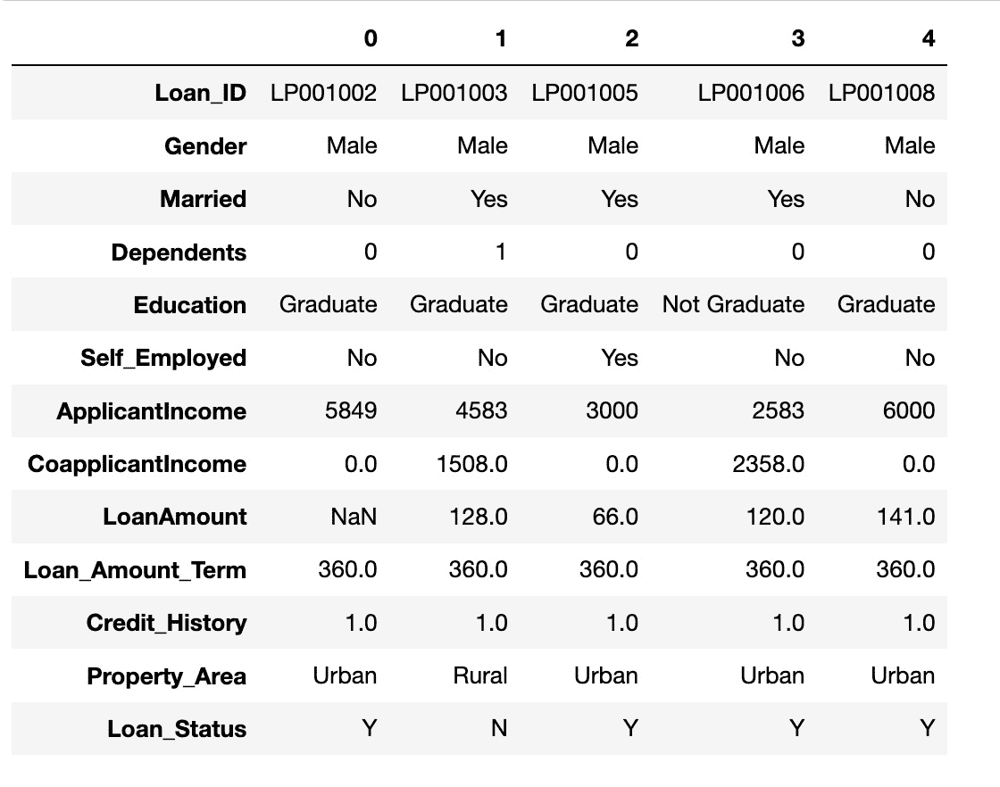

图 5.1 – 我们 df 数据集的前五行

如我们所见，列名之间存在一些不一致。所有列都遵循驼峰命名法，除了 `Loan_ID`，而长列名由 `_` 分隔，除了 `LoanAmount`、`CoapplicantIncome` 和 `ApplicantIncome`。这表明列名存在不一致的命名约定。在数据中，我们还可以看到一些列具有驼峰命名法的数据，但 `Loan_ID` 的所有值都是大写。在 `Education` 列中，`Not Graduate` 值由空格分隔。在机器学习中，确保数据的一致性非常重要；否则，模型可能会产生不一致的结果。例如，如果 `Gender` 列有两个不同的男性客户值——`Male` 和 `male`，会发生什么？如果我们不处理这个问题，那么我们的机器学习模型将把 `male` 数据点视为与 `Male` 分离的，模型将不会得到准确的信号。

接下来，我们将从数据中提取列名列表，将它们全部转换为小写，并确保单词之间由一个独特的字符 `_` 分隔。我们还将遍历分类列的数据值，在将所有特殊字符替换为 `_` 并使我们的数据一致之前，将它们全部转换为小写。

# 确保数据的一致性

为了确保数据的一致性，我们必须检查 DataFrame 中列的名称：

```py
column_names = [cols for cols in df]
print(column_names)
['Loan_ID', 'Gender', 'Married', 'Dependents', 'Education', 'Self_Employed', 'ApplicantIncome', 'CoapplicantIncome', 'LoanAmount', 'Loan_Amount_Term', 'Credit_History', 'Property_Area', 'Loan_Status']
```

接下来，我们必须获取所有不包含下划线的列名：

```py
num_underscore_present_columns = [cols for cols in column_names if '_' not in cols]
num_underscore_present_columns
['Gender',
 'Married',
 'Dependents',
 'Education',
 'ApplicantIncome',
 'CoapplicantIncome',
 'LoanAmount']
```

由于一些列的名称中有两个大写字母，我们必须在第二个大写字母之前添加下划线。接下来，我们创建一个布尔映射，针对每个列字母的索引，将大写字母的位置映射为`True`，这样我们就可以定位第二个大写字母的位置，并在其前面加上下划线：

```py
cols_mappings = {}
for cols in num_underscore_present_columns:
    uppercase_in_cols = [val.isupper() for val in cols]
    num_uppercase_letters = sum(uppercase_in_cols)
    cols_mappings[cols] = {
        "is_uppercase_letter": uppercase_in_cols,
        "num_uppercase_letters": num_uppercase_letters,
        "needs_underscore": (num_uppercase_letters > 1)
    }
```

然后，我们遍历映射并打印需要下划线的列名，以及打印第二个大写字母的位置：

```py
for key in cols_mappings.keys():
    if cols_mappings[key]['needs_underscore']:
        print()
        print(f'{key} need the underscore at location ', cols_mappings[key]['is_uppercase_letter'].index(True, 1))
ApplicantIncome need the underscore at location  9
CoapplicantIncome need the underscore at location  11
LoanAmount need the underscore at location  4
```

使用这些信息，我们为`ApplicantIncome`列构建了一些逻辑：

```py
'ApplicantIncome'[:9] + '_' + 'ApplicantIncome'[9:]
'Applicant_Income'
```

接下来，我们将前面的步骤结合起来，遍历需要下划线的列，构建映射。然后，我们打印需要下划线的列名。最后，我们创建旧列名和新列名的映射：

```py
cols_mappings = {}
for cols in num_underscore_present_columns:
    uppercase_in_cols = [val.isupper() for val in cols]
    num_uppercase_letters = sum(uppercase_in_cols)
    if num_uppercase_letters > 1:
        underscore_index = uppercase_in_cols.index(True, 1)
        updated_column_name = cols[:underscore_index] + "_" + cols[underscore_index:]
    else:
        updated_column_name = cols
    cols_mappings[cols] = {
        "is_uppercase_letter": uppercase_in_cols,
        "num_uppercase_letters": num_uppercase_letters,
        "needs_underscore": (num_uppercase_letters > 1),
        "updated_column_name": updated_column_name
    }
    if cols_mappings[cols]['needs_underscore']:
        print(f"{cols} will be renamed to {cols_mappings[cols]['updated_column_name']}")
column_mappings = {key: cols_mappings[key]["updated_column_name"] for key in cols_mappings.keys()}
column_mappings
ApplicantIncome will be renamed to Applicant_Income
CoapplicantIncome will be renamed to Coapplicant_Income
LoanAmount will be renamed to Loan_Amount
{'Gender': 'Gender',
 'Married': 'Married',
 'Dependents': 'Dependents',
 'Education': 'Education',
 'ApplicantIncome': 'Applicant_Income',
 'CoapplicantIncome': 'Coapplicant_Income',
 'LoanAmount': 'Loan_Amount'}
```

最后，我们将列映射应用于更新列名并打印新的列名：

```py
df = df.rename(columns=column_mappings)
column_names = [cols for cols in df]
print(column_names)
['Loan_ID', 'Gender', 'Married', 'Dependents', 'Education', 'Self_Employed', 'Applicant_Income', 'Coapplicant_Income', 'Loan_Amount', 'Loan_Amount_Term', 'Credit_History', 'Property_Area', 'Loan_Status']
```

尽管前面的代码可以通过手动选择列来简单地更新，但通过这种方式编程化，我们可以确保数据遵循编程规则。为了提高一致性，我们将所有列名转换为小写。首先，我们创建一些简单的单行逻辑来将列名转换为小写：

```py
print([cols.lower() for cols in df])
['loan_id', 'gender', 'married', 'dependents', 'education', 'self_employed', 'applicant_income', 'coapplicant_income', 'loan_amount', 'loan_amount_term', 'credit_history', 'property_area', 'loan_status']
```

然后，我们通过传递前面的逻辑来更新列名：

```py
df.columns = [cols.lower() for cols in df]
print(df.columns)
Index(['loan_id', 'gender', 'married', 'dependents', 'education',
       'self_employed', 'applicant_income', 'coapplicant_income',
       'loan_amount', 'loan_amount_term', 'credit_history', 'property_area',
       'loan_status'],
      dtype='object')
```

通过这样，我们已经确保了列名的一致性。但更重要的是，我们必须确保分类值的一致性，以便我们可以使机器学习系统免受不一致数据的影响。首先，我们提取`id`和`target`列，然后识别分类列。这些列包含非数值数据：

```py
id_col = 'loan_id'
target = 'loan_status'
cat_cols = [cols for cols in df if df[cols].dtype == 'object' and cols not in [id_col, target]]
cat_cols
['gender',
 'married',
 'dependents',
 'education',
 'self_employed',
 'property_area']
```

我们遍历每个列，检查唯一值以确保值是独特的且没有拼写错误。我们还检查相同的值是否以不同的方式表示，例如以不同的形式或缩写：

```py
for cols in cat_cols:
    print(cols)
    print(df[cols].unique())
    print()
gender
['Male' 'Female' nan]
married
['No' 'Yes' nan]
dependents
['0' '1' '2' '3+' nan]
education
['Graduate' 'Not Graduate']
self_employed
['No' 'Yes' nan]
property_area
['Urban' 'Rural' 'Semiurban']
```

观察数据，似乎值是独特的，没有缩写或拼写错误。但机器学习系统可以被设计成面向未来。例如，如果我们将所有值都转换为小写，那么在未来，如果相同的值以不同的形式出现，在进入系统之前，它将被转换为小写。我们还可以看到，一些字符串，如`Not Graduate`，占用空间。就像我们确保列名的一致性一样，我们必须将所有空白替换为下划线。首先，我们创建一个新的 DataFrame 名为`df_consistent`；然后，我们将所有分类值转换为小写，并将所有空格替换为下划线：

```py
df_consistent = df.copy()
for col in cat_cols:
    df_consistent[col] = df_consistent[col].apply(lambda val: val.lower() if isinstance(val, str) else val)
    df_consistent[col] = df_consistent[col].apply(lambda val: val.replace(' ','_') if isinstance(val, str) else val)
for cols in cat_cols:
    print(cols)
    print(df_consistent[cols].unique())
    print()
gender
['male' 'female' nan]
married
['no' 'yes' nan]
dependents
['0' '1' '2' '3+' nan]
education
['graduate' 'not_graduate']
self_employed
['no' 'yes' nan]
property_area
['urban' 'rural' 'semiurban']
```

通过这样，我们确保了数据的一致性，并且所有值都被转换为小写。

如我们所见，`dependents`列包含数值信息。然而，由于存在`3+`这样的值，列值被编码为字符串。我们必须移除特殊字符，然后将此值编码回数值，因为该列是序数的：

```py
df_consistent.dependents = df_consistent.dependents.apply(lambda val: float(val.replace('+','')) if isinstance(val, str) else float(val))
```

接下来，我们查看`已婚`和`自雇`列，因为这些是二进制列，必须编码为`1`和`0`。`性别`列有两个值，也可以进行二进制编码——例如，我们可以将`男性`编码为`1`，将`女性`编码为`0`。`教育`列也有两个值，我们可以将`毕业生`编码为`1`，将`非毕业生`编码为`0`：

```py
for cols in ['married', 'self_employed']:
    df_consistent[cols] = df_consistent[cols].map({"yes": 1, "no": 0})
df_consistent.education = df_consistent.education.map({
    'graduate': 1,
    'not_graduate': 0
})
df_consistent.gender = df_consistent.gender.map({
    'male': 1,
    'female': 0
})
for cols in cat_cols:
    print(cols)
    print(df_consistent[cols].unique())
    print()
gender
[ 1.  0\. nan]
married
[ 0.  1\. nan]
dependents
[ 0.  1.  2.  3\. nan]
education
[1 0]
self_employed
[ 0.  1\. nan]
property_area
['urban' 'rural' 'semiurban']
```

现在数据已经一致并且正确编码，我们必须创建一个预处理数据的函数，以便我们可以一致地处理任何未来的分类标签变化。然后，我们将该函数应用于 DataFrame，并打印值以确保函数被正确应用：

```py
def make_data_consistent(df, cat_cols) -> pd.DataFrame:
    """Function to make data consistent and meaningful"""
    df = df.copy()
    for col in cat_cols:
        df[col] = df[col].apply(lambda val: val.lower() if isinstance(val, str) else val)
        df[col] = df[col].apply(lambda val: val.replace(' ','_') if isinstance(val, str) else val)
    df['dependents'] = df['dependents'].apply(lambda val: float(val.replace('+','')) if isinstance(val, str) else float(val))
    for cols in ['married', 'self_employed']:
        df[cols] = df[cols].map({"yes": 1, "no": 0})
    df['education'] = df['education'].map({
        'graduate': 1,
        'not_graduate': 0
    })
    df['gender'] = df['gender'].map({
        'male': 1,
        'female': 0
    })
    return df
df_consistent = df.copy()
df_consistent = make_data_consistent(df=df_consistent, cat_cols=cat_cols)
for cols in cat_cols:
    print(cols)
    print(df_consistent[cols].unique())
    print()
gender
[ 1.  0\. nan]
married
[ 0.  1\. nan]
dependents
[ 0.  1.  2.  3\. nan]
education
[1 0]
self_employed
[ 0.  1\. nan]
property_area
['urban' 'rural' 'semiurban']
```

现在我们已经确保了数据的一致性，因此如果分类值在未来用空格代替`_`或以不同的案例输入，我们可以使用我们在这里创建的功能来清理数据并使其一致，在它进入我们的模型之前：

接下来，我们将探索数据唯一性，以确保没有提供重复记录以在数据中造成偏差。

# 检查数据是否唯一

现在我们已经确保了数据的一致性，我们必须在它进入机器学习系统之前确保它的唯一性。

在本节中，我们将调查数据并检查`loan_id`列中的值是否唯一，以及某些列的组合是否可以确保数据的唯一性。

在 pandas 中，我们可以利用`.nunique()`方法来检查列的唯一记录数，并将其与行数进行比较。首先，我们将检查`loan_id`是否唯一，以及是否没有输入重复的申请：

```py
df.loan_id.nunique(), df.shape[0]
(614, 614)
```

通过这种方式，我们已经确保了贷款 ID 的唯一性。然而，我们可以更进一步，确保不会将错误数据添加到另一个贷款申请中。我们相信贷款申请不太可能需要超过一种收入和贷款金额的组合。我们必须检查我们是否可以使用列值的组合来确保这些列之间的唯一性：

```py
df[['applicant_income', 'coapplicant_income', 'loan_amount']].value_counts().reset_index(name='count')
     applicant_income  coapplicant_income  loan_amount  count
0                4333              2451.0        110.0      2
1                 150              1800.0        135.0      1
2                4887                 0.0        133.0      1
3                4758                 0.0        158.0      1
4                4817               923.0        120.0      1
..                ...                 ...          ...    ...
586              3166              2985.0        132.0      1
587              3167                 0.0         74.0      1
588              3167              2283.0        154.0      1
589              3167              4000.0        180.0      1
590             81000                 0.0        360.0      1
[591 rows x 4 columns]
```

如我们所见，在第一行中，有两个具有相同收入变量和贷款金额的申请。让我们通过使用第一行的值来过滤数据集，以找到这些被认为是重复的记录：

```py
df[(df.applicant_income == 4333) & (df.coapplicant_income == 2451) & (df.loan_amount == 110)]
      loan_id  gender married dependents education self_employed  \
328  LP002086  Female     Yes          0  Graduate            No
469  LP002505    Male     Yes          0  Graduate            No
     applicant_income  coapplicant_income  loan_amount  loan_amount_term  \
328           4333              2451.0        110.0             360.0
469          4333              2451.0        110.0             360.0
     credit_history property_area loan_status
328             1.0         Urban           N
469             1.0         Urban           N
```

观察这个子集，很明显数据包含重复项或有两个不同的申请——一个是丈夫做的，另一个是妻子做的。这些数据除了表明一个男性候选人提交了一个申请，另一个女性候选人提交了一个申请之外，没有提供更多信息。我们可以删除其中一个数据点，但男性和女性申请的比例不平衡。此外，如果第二个申请是真实的，那么我们应该保留这个数据点：

```py
df.gender.value_counts(normalize=True)
Male      0.813644
Female    0.186356
Name: gender, dtype: float64
```

基于此，我们已经理解了什么使数据点独特——那就是`性别`、`申请人收入`、`共同申请人收入`和`贷款金额`的组合。作为数据科学家和数据工程师，我们的目标是确保一旦定义了唯一性规则，进入机器学习系统的数据都符合这些唯一性检查。

在下一节中，我们将讨论数据完整性或数据不完整的问题，以及如何处理不完整的数据。

# 确保数据完整且无缺失

现在我们已经实现了数据的一致性和唯一性，是时候识别和解决其他质量问题了。其中一个问题是数据中的缺失信息或不完整数据。缺失数据是真实数据集中常见的问题。随着数据集大小的增加，数据点在数据中缺失的可能性也会增加。缺失记录可以以多种方式发生，其中包括：

+   **源数据集的合并**：例如，当我们尝试根据出生日期或邮编匹配记录以丰富数据时，如果这些信息在一个数据集中缺失或不准确，那么这种情况将产生 NA 值。

+   **随机事件**：这在调查中很常见，其中受访者可能不知道所需信息是否为必填项，或者他们可能不知道答案。

+   **测量失败**：例如，一些特征，如血压，在传统方式（即使用血压计）测量时，已知具有很大的随机误差成分。如果两个人几乎同时测量一个受试者的血压，或者一个人在短时间内两次快速测量一个受试者的血压，测量的值可以很容易地相差 10 毫米汞柱（https://dept.stat.lsa.umich.edu/~kshedden/introds/topics/measurement/）。如果一个人意识到这些误差，他们可能会决定省略这些信息；对于一些患者，这些数据将产生 NA 值。在金融领域，一个重要的测量比率是确定个人或公司的信用价值，即债务收入比。在某些情况下，收入未申报，在这种情况下，将债务除以 0 或缺失数据会导致比率缺失信息。

+   **数据收集过程中的设计不当**：例如，在健康调查中，人们经常被问及他们的 BMI，并不是每个人都了解自己的 BMI 或理解测量方法。如果我们要求提供身高和体重会简单得多，因为人们更有可能知道这些信息。当有人被问及他们的体重测量时，有些人可能会省略或谎报这些信息。如果在收集数据时无法理解或测量 BMI，数据将产生 NA 值。

当训练数据集包含缺失值时，机器学习模型可能会产生不准确的预测或由于信息不完整而无法正确训练。在本节中，我们将讨论以下处理缺失数据的技术：

+   删除数据

+   缺失值编码

+   填充方法

一种处理缺失数据的方法是通过删除缺失的记录。这也被称为**完整案例分析**（**CCA**）方法。如果少于 5%的行包含缺失值，这通常是可行的，但删除更多记录可能会降低模型的效力，因为样本量会变小。由于这种技术假设数据是完整随机缺失的，因此可能存在系统偏差，但违反了其他假设，例如当数据是**随机缺失**（**MAR**）或**非随机缺失**（**MNAR**）时。因此，盲目删除数据可能会使模型更加有偏差。例如，如果一个少数群体在过去没有申报收入或没有持有信用，他们可能没有信用评分。如果我们不了解缺失的原因而盲目删除这些数据，算法可能会更有利于向有信用信息的多数群体提供贷款，而少数群体将失去机会，尽管其中一些成员有稳定的收入和信用。

让我们使用 CCA 技术来探索数据集，删除所有缺失信息的行，并找出丢失了多少数据量：

```py
remaining_rows = df_consistent.dropna(axis=0).shape[0]
total_records = df_consistent.shape[0]
perc_dropped = ((total_records - remaining_rows)/total_records)*100
print("By dropping all missing data, only {:,} records will be left out of {:,}, a reduction by {:,.3f}%".format(remaining_rows, total_records, perc_dropped))
By dropping all missing data, only 480 records will be left out of 614, a reduction by 21.824%
```

由于 21%几乎占数据集的四分之一，这不是一个可行的方法。因此，在本节中，我们将探讨如何识别缺失数据，揭示数据缺失的模式或原因，并发现处理缺失数据的技术，以便数据集可以用于机器学习。

首先，我们将提取分类特征、二元特征和数值特征。为此，我们必须分离标识符和目标标签：

```py
id_col = 'loan_id'
target = 'loan_status'
feature_cols = [cols for cols in df_consistent if cols not in [id_col, target]]
binary_cols = [cols for cols in feature_cols if df_consistent[cols].nunique() == 2]
cat_cols = [cols for cols in feature_cols if (df_consistent[cols].dtype == 'object' or df_consistent[cols].nunique() <= 15)]
num_cols = [cols for cols in feature_cols if cols not in cat_cols]
cat_cols
['gender',
 'married',
 'dependents',
 'education',
 'self_employed',
 'loan_amount_term',
 'credit_history',
 'property_area']
binary_cols
['gender', 'married', 'education', 'self_employed', 'credit_history']
num_cols
['applicant_income', 'coapplicant_income', 'loan_amount']
```

要检查数据集中是否存在缺失数据，pandas 提供了一个方便的方法叫做`.info()`。此方法显示总记录中完整行数有多少。该方法还显示每列的数据类型：

```py
df_consistent.info()
<class 'pandas.core.frame.DataFrame'>
RangeIndex: 614 entries, 0 to 613
Data columns (total 13 columns):
 #   Column              Non-Null Count  Dtype
---  ------              --------------  -----
 0   loan_id             614 non-null    object
 1   gender              601 non-null    float64
 2   married             611 non-null    float64
 3   dependents          599 non-null    float64
 4   education           614 non-null    int64
 5   self_employed       582 non-null    float64
 6   applicant_income    614 non-null    int64
 7   coapplicant_income  614 non-null    float64
 8   loan_amount         592 non-null    float64
 9   loan_amount_term    600 non-null    float64
 10  credit_history      564 non-null    float64
 11  property_area       614 non-null    object
 12  loan_status         614 non-null    object
dtypes: float64(8), int64(2), object(3)
memory usage: 62.5+ KB
```

pandas 库还有一个方便的方法叫做`.isnull()`，用来检查某一列的哪些行缺失数据，哪些行是完整的。通过将`.sum()`与`.isnull()`结合使用，我们可以得到每个列的缺失记录总数：

```py
df_consistent.isnull().sum()
loan_id                0
gender                13
married                3
dependents            15
education              0
self_employed         32
applicant_income       0
coapplicant_income     0
loan_amount           22
loan_amount_term      14
credit_history        50
property_area          0
loan_status            0
dtype: int64
```

如我们所见，`credit_history`、`self_employed`和`loan_amount`列有最多的缺失数据。原始值有时难以理解，知道每个列缺失数据的百分比更有用。在下一步中，我们将创建一个函数，该函数将接受 DataFrame 并打印出每个列的缺失数据百分比。然后，我们将按缺失度降序排序数据：

```py
def missing_data_percentage(df: pd.DataFrame):
    """Function to print percentage of missing values"""
    df = df.copy()
    missing_data = df.isnull().sum()
    total_records = df.shape[0]
    perc_missing = round((missing_data/total_records)*100, 3)
    missing_df = pd.DataFrame(data={'columm_name':perc_missing.index, 'perc_missing':perc_missing.values})
    return missing_df
missing_data_percentage(df_consistent[feature_cols]).sort_values(by='perc_missing', ascending=False)
           columm_name  perc_missing
9       credit_history         8.143
4        self_employed         5.212
7          loan_amount         3.583
2           dependents         2.443
8     loan_amount_term         2.280
0               gender         2.117
1              married         0.489
3            education         0.000
5     applicant_income         0.000
6   coapplicant_income         0.000
10       property_area         0.000
```

现在，我们可以提取缺失数据的量级。然而，在我们深入处理缺失数据之前，了解缺失数据的模式非常重要。通过理解这些关系，我们将能够采取适当的步骤。这是因为填补缺失数据可能会改变数据的分布，这可能会进一步影响变量交互。

我们将利用`missingno`库和其他可视化工具来了解数据缺失的位置，在没有主题专家的情况下，我们将对缺失数据的原因做出一些假设。

为了查看值缺失和数据中存在差距的位置，我们将利用矩阵图。当数据集具有深度或数据包含与时间相关的信息时，矩阵图非常有用。数据的存在用灰色表示，而缺失数据用白色显示：

```py
msno.matrix(df_consistent[feature_cols], figsize=(35, 15))
<AxesSubplot: >
```

这里是输出：

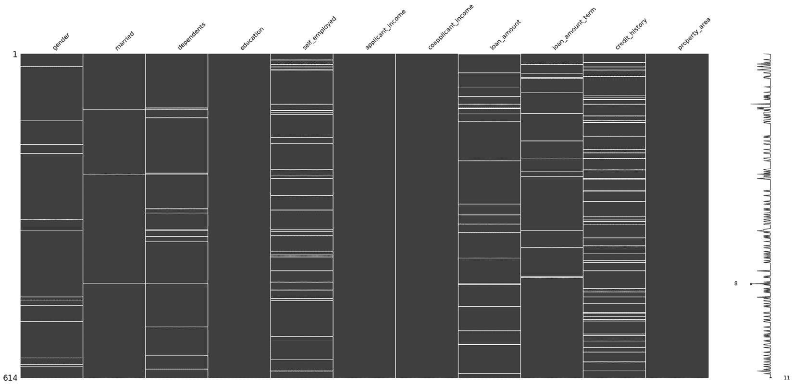

图 5.2 – 矩阵图

仔细观察，我们可以看到`credit_history`列有很多缺失点，缺失的发生在整个数据中分布，而不是在某个特定的时间点。

正如我们之前提到的，了解数据缺失的原因可以帮助我们选择正确的技术来处理缺失数据。从高层次上讲，我们可以将这些缺失数据的机制称为，并将它们分为三类：

+   **完全随机缺失**（MCAR）

+   **非随机缺失**（MNAR）

+   **随机缺失**（MAR）

数据在缺失数据对所有观测值的可能性相同，并且缺失数据与数据集中任何其他特征之间没有关系时，被认为是完全随机缺失（MCAR）。例如，一封邮件问卷可能在邮寄过程中丢失，或者如果一个人匆忙，他们可能忘记回答一个问题。在这种情况下，数据缺失与问题的类型、年龄组或性别（与其他变量的关系）无关，我们可以将这些特征或数据点归类为 MCAR。删除这些数据点或将这些实例的值更改为 0 不会对预测造成偏差。

另一方面，当数据点的缺失可能性取决于其他现有数据点时，数据被认为是随机缺失（MAR）。例如，如果男性平均有 5%的时间不披露他们的体重，而女性有 15%的时间不披露他们的体重，我们可以假设数据缺失是由性别偏见引起的。这将导致女性比男性有更高比例的数据缺失。对于这种机制，我们可以使用统计技术或机器学习来预测缺失值，利用数据集中的其他特征。

第三个机制，MNAR，通常容易与 MCAR 混淆，但略有不同。在这种情况下，可以明确地假设为什么数据不是随机缺失的。例如，如果我们试图了解导致抑郁（结果）的因素，那么抑郁的人可能更不愿意回答问题或更不可能被联系。由于缺失与结果相关，这些缺失记录可以标记为“缺失”，对于数值特征，我们可以使用机器学习结合其他特征来估计缺失数据，并通过创建另一个变量来标记数据缺失的点。

现在我们已经了解了不同类型的缺失数据，我们将利用 `missingno` 中的 `heatmap` 函数，它将创建一个关联热图。可视化显示了数据集列之间的空值相关系数。它显示了某个特征的存在或缺失如何强烈地影响其他特征。

空值相关系数范围从 -1 到 1：

+   -1 表示如果一个列（属性）存在，另一个几乎肯定不存在

+   0 表示列（属性）之间没有依赖关系

+   1 表示如果一个列（属性）存在，另一个也肯定存在

与标准的关联热图不同，以下可视化是关于缺失数据特征之间的关系，因为其中许多特征几乎没有缺失数据。那些始终完整或始终为空的列没有有意义的关联，并且被从可视化中移除。

这个热图有助于识别属性对之间的数据完整性相关系数，但它对更广泛关系的解释能力有限：

```py
msno.heatmap(df_consistent[feature_cols], labels=True)
```

这导致了以下热图：

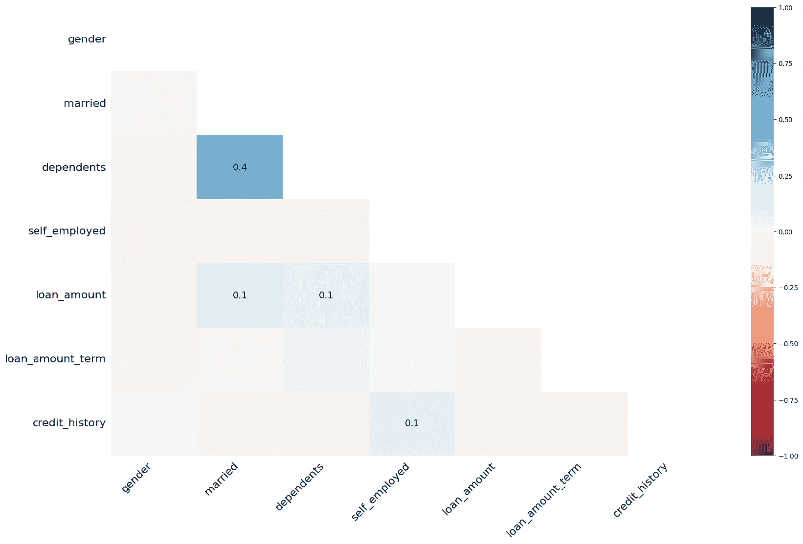

图 5.3 – 热图

从这个图中，我们可以解释几个变量之间的缺失关系。`dependents` 和 `married` 之间存在 0.4 的相关性，这是有道理的，因为大多数情况下，人们先结婚再成为有依赖的人。

接下来，我们将提取包含缺失数据的列，并使用这些列进行下一个可视化。`dendrogram` 方法使用层次聚类，将属性分组在一起，其中缺失与另一个变量的缺失相关联，或完整性与其他变量的完整性相关联：

```py
missing_cols = [cols for cols in feature_cols if df_consistent[cols].isnull().sum() > 0]
msno.dendrogram(df_consistent[missing_cols])
```

输出如下：

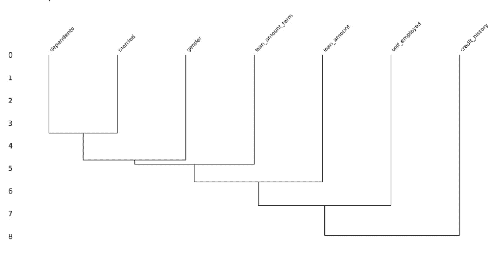

图 5.4 – 系谱图

我们根据自上而下的方法来解释系谱图 – 即，我们关注任何两个列在空值问题上的连接高度。高度越大，关系越小，反之亦然。例如，`credit_history` 中的数据缺失与任何其他变量的缺失或完整性没有关系。

这样，我们已经了解了缺失数据的模式，以及缺失数据列之间是否存在关系。接下来，我们将探索缺失数据与结果之间的关系。在我们决定删除缺失数据或进行插补之前，我们还应该看看变量的缺失是否与结果相关联——也就是说，数据可能存在 MNAR 的机会吗？

首先，我们将可视化缺失分类数据中的这种关系：

```py
cat_missing = [cols for cols in cat_cols if df_consistent[cols].isnull().sum() > 0]
def cat_missing_association_with_outcome(data, missing_data_column, outcome):
    """Function to plot missing association of categorical varibles with outcome"""
    df = data.copy()
    df[f"{missing_data_column}_is_missing"] = df[missing_data_column].isnull().astype(int)
    df.groupby([outcome]).agg({f"{missing_data_column}_is_missing": 'mean'}).plot.bar()
for cols in cat_missing:
    cat_missing_association_with_outcome(df_consistent, cols, target)
```

这将创建一些图表，展示分类特征与目标变量之间的关系：

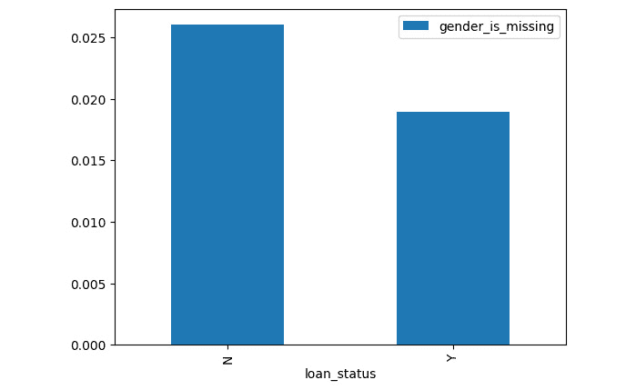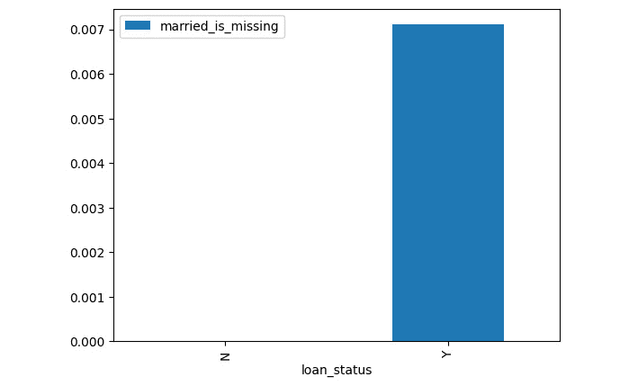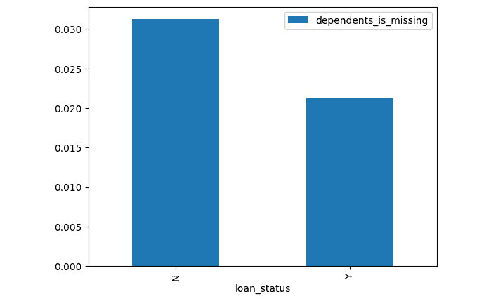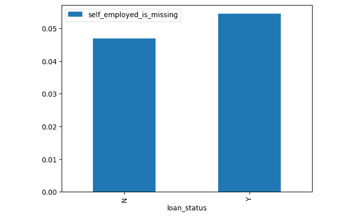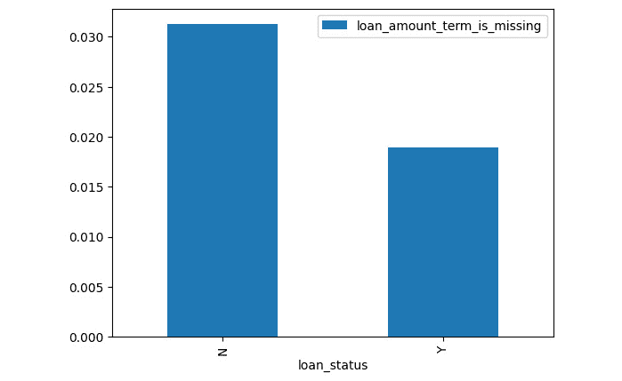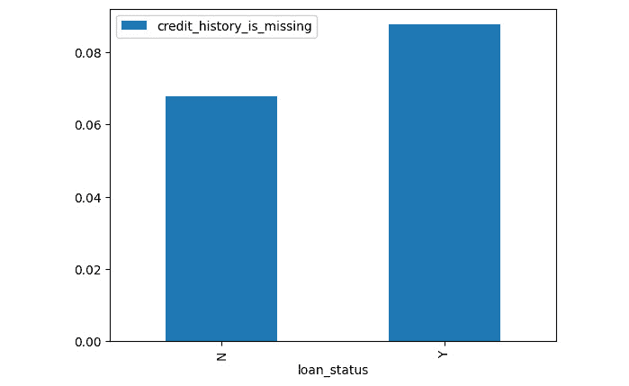

图 5.5 - 显示分类特征与目标变量关联的输出图表

在高层次上，我们可以假设对于`married`、`dependents`、`loan_amount_term`、`gender`和`credit_history`等变量，数据的缺失与贷款批准状态相关联。因此，我们可以认为这些变量的数据是 MNAR（Missing Not At Random，非随机缺失）。对于这三个变量，我们可以用“missing”这个词来编码缺失数据，因为这个信号将有助于预测结果。`credit_history`的缺失或完整性略与`self_employed`状态相关，如热图所示，这表明数据可能随机缺失。同样，`married`状态的缺失与`dependents`和`loan_amount`的缺失相关。

对于所有数据缺失的二进制变量，我们可以假设数据不是 MCAR（Missing Completely At Random，完全随机缺失），而是假设数据是 MNAR，因为缺失信息与结果之间存在某种关系，或者 MAR（Missing At Random，随机缺失），因为缺失与其他变量的存在或不存在相关，如树状图所示。

编码缺失值的一种方法是将这些值编码为最频繁的值，或者去除缺失值，或者创建一个额外的列，用 1 或 0 表示缺失。然而，对于 MAR 场景，这并不是最佳技术。如前所述，数据中心方法的目标是提高数据质量和减少偏差。因此，我们不应使用频率插补方法或仅删除记录，而应考虑要求注释者提供缺失数据的信息，或者进行系统修复以恢复缺失信息。如果这不可能，我们应该考虑使用机器学习技术或概率技术来确定可能的值，而不是简单的众数、均值和中位数插补方法。然而，当缺失超过一定阈值时，即使是高级技术也不可靠，最好是删除该特征。对于剩余的变量，我们将使用机器学习技术来确定缺失值，因为我们无法获得注释者的帮助来提供完整信息。

既然我们已经确定了分类值缺失与结果之间的关联，接下来，我们将研究缺失数值数据与结果之间的关系：

```py
num_missing = [cols for cols in num_cols if df_consistent[cols].isnull().sum() > 0]
def num_missing_association_with_outcome(data, missing_data_column, outcome):
    """Function to plot missing association of categorical varibles with outcome"""
    df = data.copy()
    df[f"{missing_data_column}_is_missing"] = df[missing_data_column].isnull().astype(int)
    df.groupby([outcome]).agg({f"{missing_data_column}_is_missing": 'mean'}).plot.bar()
for cols in num_missing:
    num_missing_association_with_outcome(df, cols, target)
```

这将显示以下图表：

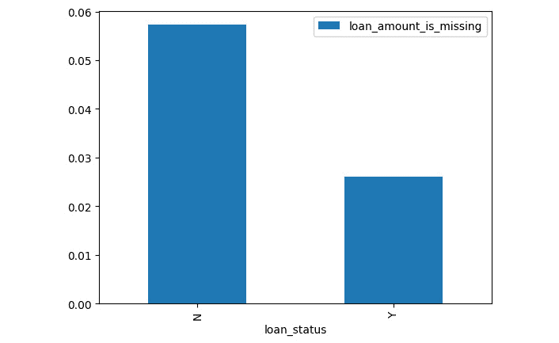

图 5.6 – 贷款金额缺失与目标的相关性

对于`loan_amount`，可以假设数据是 MNAR 以及 MAR，因为`married`和`dependents`变量中的数据缺失或完成与`loan_amount`的数据缺失和完整性略有关联，如热图中所示。因此，我们选择使用机器学习来插补缺失值，并创建一个额外的列来指示缺失，这将为我们模型提供更好的信号。

接下来，我们将深入研究各种数据插补方法，并进行比较，同时讨论每种方法的不足。我们还将讨论机器学习在以数据为中心的机器学习中插补缺失数据的影响。

采用以模型为中心的方法，插补数值变量的标准规则是，当 5%的数据缺失时，使用均值、中位数或众数进行插补。这种方法假设数据是随机缺失的。如果这个假设不成立，这些简单的插补方法可能会掩盖数据中的分布和关系。

首先，我们将探索未插补和用中位数插补的`loan_amount`的分布。当我们用中位数插补 6%的值时，分布会发生变化：

```py
df_consistent.loan_amount.plot.kde(color='orange', label='loan_amount', legend=True)
df_consistent.loan_amount.fillna(value=df.loan_amount.median()).plot.kde(color='b', label='loan_amount_imputed', alpha=0.5, figsize=(9,7), legend=True)
```

以下图表是输出显示：

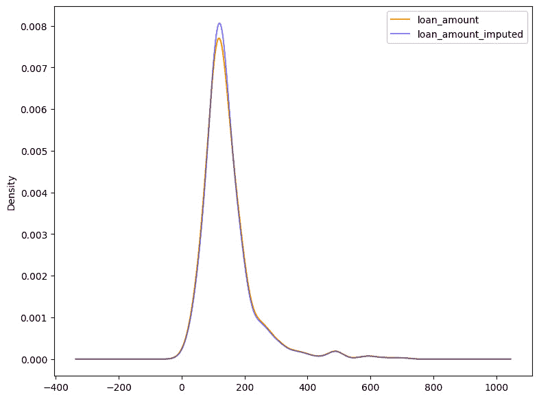

图 5.7 – 使用中位数的简单密度图插补

接下来，我们比较插补前后贷款金额的标准差：

```py
round(df_consistent.loan_amount.std(),2), round(df_consistent.loan_amount.fillna(value=df_consistent.loan_amount.median()).std(),2)
(85.59, 84.11)
```

上一段代码展示了简单的插补方法如何掩盖数据的分布。为了抵消这些影响并保持分布，我们将使用随机样本插补方法。

首先，我们提取所有`loan_amount`缺失的行。然后，我们计算与`loan_amount`相关的变量，并使用这些值来设置种子。这是因为，如果我们对所有值使用相同的种子，那么将生成相同的随机数，该方法的行为将与任意值插补类似，这将与均值和中位数等简单插补方法一样无效。

随机样本分布的缺点是协方差将受到影响，我们需要一种同时保持协方差的方法。

首先，我们检查哪个特征与`loan_amount`高度相关：

```py
df_consistent[num_cols].corr()
                    applicant_income  coapplicant_income  loan_amount
applicant_income            1.000000           -0.116605     0.570909
coapplicant_income         -0.116605            1.000000     0.188619
loan_amount                 0.570909            0.188619     1.000000
```

在这里，我们可以看到`loan_amount`与`applicant_income`高度相关，因此在这个例子中，我们使用这个变量来设置种子。首先，我们提取`loan_amount`缺失的索引。然后，我们使用缺失位置的`applicant_income`值，并使用这个值来设置种子。接下来，我们使用这个种子从`loan_amount`生成一个随机值来插补缺失的行。我们使用这种方法来插补`loan_amount`的所有缺失数据：

```py
observation = df_consistent[df_consistent.loan_amount.isnull()]
imputed_values = []
for idx in observation.index:
    seed = int(observation.loc[idx,['applicant_income']])
    imputed_value = df_consistent['loan_amount'].dropna().sample(1, random_state=seed)
    imputed_values.append(imputed_value)
df_consistent.loc[df_consistent['loan_amount'].isnull(),'loan_amount_random_imputed']=imputed_values
df_consistent.loc[df['loan_amount'].isnull()==False,'loan_amount_random_imputed']=df_consistent[df_consistent['loan_amount'].isnull()==False]['loan_amount'].values
```

接下来，我们比较`loan_amount`的分布与随机样本插补的`loan_amount`和中位数插补的`loan_amount`：

```py
df_consistent.loan_amount.plot.kde(color='orange', label='loan_amount', legend=True, linewidth=2)
df_consistent.loan_amount_random_imputed.plot.kde(color='g', label='loan_amount_random_imputed', legend=True, linewidth=2)
df_consistent.loan_amount.fillna(value=df_consistent.loan_amount.median()).plot.kde(color='b', label='loan_amount_median_imputed', linewidth=1, alpha=0.5, figsize=(9,7), legend=True)
<AxesSubplot: ylabel='Density'>
```

这将输出以下图表：

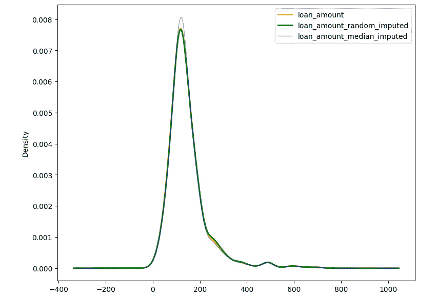

图 5.8 – 显示随机和中位数插补的密度图

现在，我们比较预先插补的贷款的标准差与随机样本插补方法和中位数插补方法：

```py
round(df_consistent.loan_amount.std(),2), round(df_consistent.loan_amount_random_imputed.std(),2), round(df_consistent.loan_amount.fillna(value=df_consistent.loan_amount.median()).std(),2)
(85.59, 85.57, 84.11)
```

随机样本插补方法在分布和标准差上与预先插补的`loan_amount`方法比中位数插补的`loan_amount`方法更接近。接下来，我们检查随机样本插补方法是否与其他方法相比保留了与其他变量的相关性：

```py
df_consistent['loan_amount_median_imputed'] = df_consistent['loan_amount'].fillna(value=df_consistent['loan_amount'].median())
df_consistent[['loan_amount', 'loan_amount_median_imputed','loan_amount_random_imputed', 'applicant_income']].corr()
```

得到的 DataFrame 如下：

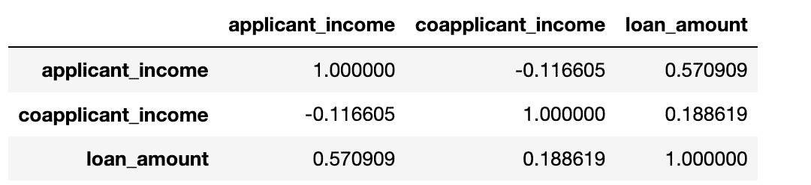

图 5.9 – 相关性 DataFrame

从这一点来看，很明显，随机插补方法可以保留分布，但可能会掩盖与其他变量的相互关系。我们需要一种可以保留分布并保持与其他变量相互关系的方法。我们将使用机器学习来帮助我们实现这一点。在我们转向机器学习之前，我们首先将讨论简单插补对分类/二进制变量的影响。我们使用最频繁的值插补`credit_history`二进制列，并比较插补前后的分布：

```py
df_consistent.credit_history.value_counts(normalize=True)
1.0    0.842199
0.0    0.157801
Name: credit_history, dtype: float64
df_consistent.credit_history.fillna(value=df_consistent.credit_history.mode()[0]).value_counts(normalize=True)
1.0    0.855049
0.0    0.144951
Name: credit_history, dtype: float64
```

通过用最频繁的值插补`credit_history`，我们使数据偏向于`credit_history`状态。正如我们之前发现的，`credit_history`的缺失与任何其他变量都不相关，但它可能与结果相关。

前面的例子表明，如果我们使用简单的插补方法，那么我们可能会对数据进行偏差，分布也会相应改变，而如果我们使用随机方法，分布将得以保留，但数据关系可能会改变，数据方差可能会增加。因此，当数据是 MAR（完全随机应答）或 MNAR（非随机应答）时，为了在数据偏差和数据方差之间取得平衡，我们可以使用机器学习模型。

为了利用机器学习进行数值插补，我们将利用`scikit-learn`库中可用的最近邻插补方法`KNNImputer`。这个插补器的一个问题是，我们只能传递一个 DataFrame 给它，而不能传递列的列表。因此，我们将使用`SklearnTransformerWrapper`模块，它是`feature-engine`库的一部分，来传递列的列表。由于 KNN 是一个基于距离的算法，为了确保模型收敛并且一个变量不会压倒另一个变量，我们必须在使用此算法之前对数据进行缩放。

另一种用于插补数据的技术被称为**链式方程多重插补**（**MICE**）。MICE 通过使用均值、中位数或众数来插补所有数据。然后，对于将要插补的变量，初始插补的值被转换回缺失值。接着，使用其他变量作为预测变量，利用机器学习模型预测缺失值。之后，以类似的方式插补下一个变量，其中初始插补的值被转换回缺失值，并使用包括最近插补的变量在内的其他变量作为预测变量来插补缺失值。一旦所有带有缺失值的变量都被建模，并且使用预测值插补了值，第一次插补轮次就完成了。这个过程重复*n*次（理想情况下为 10 次），从第二轮开始，使用第一轮的预测来预测最初缺失的记录。

使用多轮的原因是，最初我们使用其他也包含 NA 值的变量来模拟缺失数据，而初始的插补策略使用的是次优方法，如均值、中位数或众数，这些方法可能会对预测产生偏差。随着我们继续进行多轮回归，预测将趋于稳定并减少偏差。

MICE 的一个问题是，我们必须选择用于任务的机器学习模型。我们将使用随机森林算法实现 MICE，在 R 语言中这被称为`[missForest]`。

在我们实现的 MICE 中，我们将称之为`missForest`，因为它将复制 R 语言中实现的方式（[R 语言中的 MissForest](https://rpubs.com/lmorgan95/MissForest#:~:text=MissForest%20is%20a%20random%20forest,then%20predicts%20the%20missing%20part)）。为了对抗选择算法的影响，我们鼓励实践者利用自动化机器学习，对于每一次插补和迭代，都会选择一个新的算法。这种方法的一个缺点是，当用于大数据集时，它计算量大且耗时。

首先，我们导入必要的包：

```py
from sklearn.impute import KNNImputer
from feature_engine.wrappers import SklearnTransformerWrapper
from sklearn.preprocessing import StandardScaler
```

接下来，我们通过过滤掉可能包含超过 15 个类别的任何列，同时过滤`id`列和结果列，以及使用插补方法过滤新创建的变量来提取数值列：

```py
num_cols = [cols for cols in df_consistent if df_consistent[cols].nunique() > 15 and cols not in [id_col, target] and not cols.endswith('imputed')]
```

接下来，我们创建包含数值变量的 DataFrame 并可视化它：

```py
df_num = df_consistent[num_cols].copy()
df_num.head()
   applicant_income  coapplicant_income  loan_amount
0              5849                 0.0          NaN
1              4583              1508.0        128.0
2              3000                 0.0         66.0
3              2583              2358.0        120.0
4              6000                 0.0        141.0
```

接下来，我们构建一个函数，该函数接受缩放器（标准缩放器或任何其他缩放器）和 DataFrame，并返回缩放后的数据和经过处理的缩放器。在应用 KNN 估计器之前，我们必须缩放数据集，因为基于距离的方法需要数据处于相同的尺度。一旦我们缩放了数据，我们就应用 KNN 估计器来估计数据，然后使用函数返回的经过处理的缩放器来反缩放数据。完成这些后，我们可以比较机器学习估计的数据与中位数和随机估计方法：

```py
def scale_data(df, scaler, columns):
    """Function to scale the data"""
    df_scaled = df.copy()
    if columns:
        df_scaled[columns] = scaler.fit_transform(df_scaled[columns])
    else:
        columns = [cols for cols in df_scaled]
        df_scaled[columns] = scaler.fit_transform(df_scaled[columns])
    return df_scaled, scaler
```

接下来，我们定义缩放器并调用`scale_data`函数：

```py
scaler = StandardScaler()
df_scaled, scaler = scale_data(df_num, scaler=scaler, columns=num_cols)
```

然后，我们使用 10 个邻居的参数应用 KNN 估计器来估计数据。我们利用`weights='distance'`参数，以便在预测结果时，更重视靠近邻居的投票，而不是远离邻居的投票。

首先，我们初始化估计器：

```py
knn_imputer = SklearnTransformerWrapper(
    transformer = KNNImputer(n_neighbors=10, weights='distance'),
    variables = num_cols
)
```

然后，我们应用估计：

```py
df_imputed = knn_imputer.fit_transform(df_scaled)
```

接下来，我们通过调用缩放器对象的`inverse_transform`方法来反缩放数据，并用未缩放值覆盖`df_imputed` DataFrame：

```py
df_imputed = pd.DataFrame(columns=num_cols, data=scaler.inverse_transform(df_imputed))
df_imputed.head()
   applicant_income  coapplicant_income  loan_amount
0            5849.0                 0.0   149.666345
1            4583.0              1508.0   128.000000
2            3000.0                 0.0    66.000000
3            2583.0              2358.0   120.000000
4            6000.0                 0.0   141.000000
```

接下来，我们比较预先估计的`loan_amount`的分布，并将其与机器学习估计的方法进行比较。然后，我们检查机器学习估计方法与申请者收入的关联性，并将其与其他估计方法进行比较：

```py
df_imputed['loan_amount'].plot.kde(color='orange', label='loan_amount_knn_imputed',linewidth=2, legend=True)
df_consistent['loan_amount'].plot.kde(color='b', label='loan_amount', legend=True, linewidth=2, figsize=(9,7), alpha=0.5)
```

结果图如下：

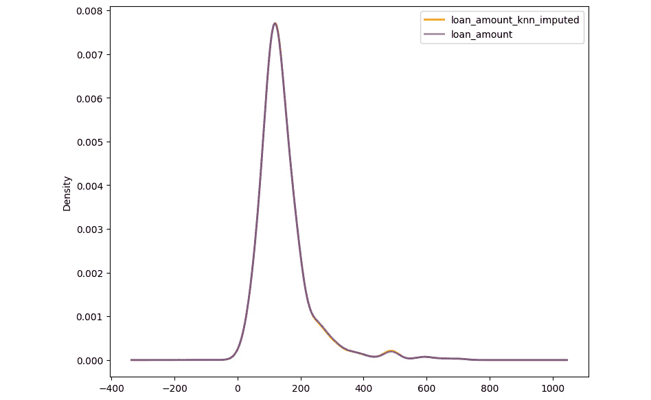

图 5.10 – 贷款金额 KNN 估计

接下来，我们比较预先估计的贷款金额的标准差与所有估计方法：

```py
round(df_consistent.loan_amount.std(),2), round(df_consistent.loan_amount_random_imputed.std(),2), round(df_consistent.loan_amount_median_imputed.std(),2), round(df_imputed.loan_amount.std(),2)
(85.59, 85.57, 84.11, 85.59)
```

然后，我们将检查当使用机器学习来估计`loan_amount`时，相关性是否保持不变：

```py
df_consistent['loan_amount_knn_imputed'] = df_imputed.loan_amount
df_consistent[['loan_amount', 'loan_amount_median_imputed','loan_amount_random_imputed', 'loan_amount_knn_imputed', 'applicant_income']].corr()
```

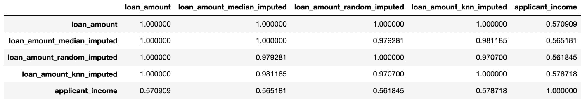

图 5.11 – 贷款金额估计后的相关性

机器学习估计的方法几乎与原始数据具有相同的分布。然而，与预先估计的`loan_amount`相比，与`applicant_income`的相关性略高。我们现在已经看到了如何使用现成的技术来估计缺失数据。这种方法的一个优点是易于实现。然而，缺点是我们不能选择另一个算法。

因此，在下一步中，我们更进一步，使用随机森林构建一个 MICE 实现。首先，我们使用独热编码将分类数据转换为数值数据。然后，我们使用`RandomForestClassifier`的 MICE 实现来估计缺失的分类数据。

一旦分类数据被估计，我们使用分类和数值数据，通过利用 MICE 与`RandomForestRegressor`来估计数值缺失值。

为了构建 MICE 实现，我们使用 scikit-learn 中的`IterativeImputer`，它可以帮助进行 10 轮 MICE。为了利用`IterativeImputer`，我们必须从 scikit-learn 的实验包中导入`enable_iterative_imputer`，如文档所述：[`scikit-learn.org/stable/modules/generated/sklearn.impute.IterativeImputer.html`](https://scikit-learn.org/stable/modules/generated/sklearn.impute.IterativeImputer.html)。

首先，我们导入必要的包：

```py
from sklearn.ensemble import ExtraTreesRegressor, ExtraTreesClassifier
from sklearn.experimental import enable_iterative_imputer
from sklearn.impute import IterativeImputer
from feature_engine.encoding import OneHotEncoder
```

接下来，我们提取字符串编码的分类列，以便我们可以对这些列进行独热编码：

```py
ohe_cols = [cols for cols in cat_cols if df_consistent[cols].dtype == 'object']
ohe_cols
['property_area']
```

然后，我们对分类列进行独热编码：

```py
df_ohe_encoded = df_consistent.copy()
ohe = OneHotEncoder(variables=ohe_cols)
df_ohe_encoded = ohe.fit_transform(df_ohe_encoded)
```

之后，我们可视化独热编码数据的前五个结果：

```py
df_ohe_encoded[[cols for cols in df_ohe_encoded if 'property_area' in cols]].head()
   property_area_urban  property_area_rural  property_area_semiurban
0                    1                    0                        0
1                    0                    1                        0
2                    1                    0                        0
3                    1                    0                        0
4                    1                    0                        0
```

接下来，我们提取二进制编码的分类变量，包括已经独热编码的数据：

```py
cat_cols = [cols for cols in df_ohe_encoded if df_ohe_encoded[cols].nunique() <= 15 and cols not in [id_col, target]]
cat_cols
['gender',
 'married',
 'dependents',
 'education',
 'self_employed',
 'loan_amount_term',
 'credit_history',
 'property_area_urban',
 'property_area_rural',
 'property_area_semiurban']
```

然后，我们使用随机森林构建 MICE 实现以填充分类数据：

```py
miss_forest_classifier = IterativeImputer(
    estimator=ExtraTreesClassifier(n_estimators=100,
                                   random_state=1,
                                   bootstrap=True,
                                   n_jobs=-1),
    max_iter=10,
    random_state=1,
    add_indicator=True,
    initial_strategy='median')
df_cat_imputed = miss_forest_classifier.fit_transform(df_ohe_encoded[cat_cols])
```

接下来，我们将填充的数值通过将 NumPy 数组转换为名为`df_cat_imputed`的 DataFrame 来提取特征：

```py
df_cat_imputed = pd.DataFrame(
    columns=miss_forest_classifier.get_feature_names_out(),
    data=df_cat_imputed,
    index=df_ohe_encoded.index)
```

让我们确保分类器没有创建任何新的意外值。为此，我们遍历所有列并打印每列的唯一值：

```py
for cols in cat_cols:
    print(cols)
    print(df_cat_imputed[cols].unique())
    print()
gender
[1\. 0.]
married
[0\. 1.]
dependents
[0\. 1\. 2\. 3.]
education
[1\. 0.]
self_employed
[0\. 1.]
loan_amount_term
[360\. 120\. 240\. 180.  60\. 300\. 480.  36.  84.  12.]
credit_history
[1\. 0.]
property_area_urban
[1\. 0.]
property_area_rural
[0\. 1.]
property_area_semiurban
[0\. 1.]
```

现在，我们将分类填充数据与数值数据合并。然后，我们使用所有数据来填充数值数据：

```py
num_cols = [cols for cols in df_consistent if cols not in df_cat_imputed and cols not in [id_col, target] + ohe_cols
            and not cols.endswith("imputed")]
df_combined = pd.concat([df_consistent[num_cols], df_cat_imputed], axis=1)
feature_cols = [cols for cols in df_combined]
feature_cols
['applicant_income',
 'coapplicant_income',
 'loan_amount',
 'gender',
 'married',
 'dependents',
 'education',
 'self_employed',
 'loan_amount_term',
 'credit_history',
 'property_area_urban',
 'property_area_rural',
 'property_area_semiurban',
 'missingindicator_gender',
 'missingindicator_married',
 'missingindicator_dependents',
 'missingindicator_self_employed',
 'missingindicator_loan_amount_term',
 'missingindicator_credit_history']
```

接下来，我们使用随机森林实现 MICE 填充以填充数值数据：

```py
miss_forest_regressor = IterativeImputer(
    estimator=ExtraTreesRegressor(n_estimators=100,
                                  random_state=1,
                                  bootstrap=True,
                                  n_jobs=-1),
    max_iter=10,
    random_state=1,
    add_indicator=True,
    initial_strategy='median')
df_imputed = miss_forest_regressor.fit_transform(df_combined[feature_cols])
```

现在，我们将填充的数值通过将 NumPy 数组转换为 DataFrame 来提取特征：

```py
df_imputed
df_imputed = pd.DataFrame(data=df_imputed,
                           columns=miss_forest_regressor.get_feature_names_out(),
                           index=df_combined.index)
```

然后，我们检查是否所有列都已填充并且没有缺失值：

```py
df_imputed.isnull().sum()
applicant_income                     0
coapplicant_income                   0
loan_amount                          0
gender                               0
married                              0
dependents                           0
education                            0
self_employed                        0
loan_amount_term                     0
credit_history                       0
property_area_urban                  0
property_area_rural                  0
property_area_semiurban              0
missingindicator_gender              0
missingindicator_married             0
missingindicator_dependents          0
missingindicator_self_employed       0
missingindicator_loan_amount_term    0
missingindicator_credit_history      0
missingindicator_loan_amount         0
dtype: int64
```

接下来，我们比较预填充的`loan_amount`的分布，并将其与 MICE 填充方法进行比较。然后，我们检查 MICE 填充方法与申请者收入的关联性，并将其与其他填充方法进行比较：

```py
df_imputed['loan_amount'].plot.kde(color='orange', label='loan_amount_miss_forest_imputed',linewidth=2, legend=True)
df_consistent['loan_amount'].plot.kde(color='b', label='loan_amount', legend=True, linewidth=2, figsize=(9,7), alpha=0.5)
<AxesSubplot: ylabel='Density'>
```

输出结果如下：

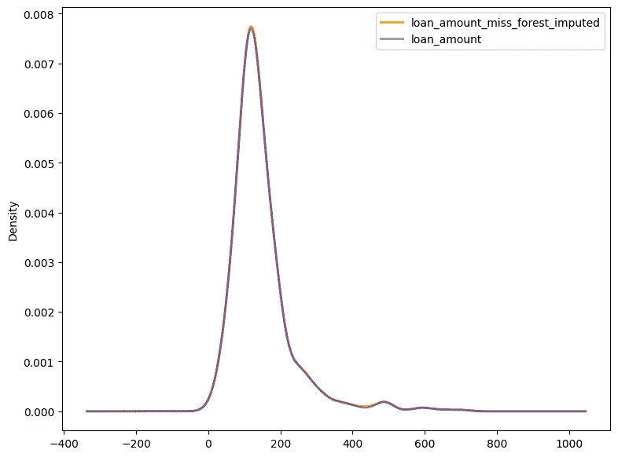

图 5.12 – loan_amount_miss_forest_imputed

接下来，我们比较预填充贷款金额的标准差与所有填充方法，包括 MICE 填充方法：

```py
round(df_consistent.loan_amount.std(),2), round(df_consistent.loan_amount_random_imputed.std(),2), round(df_consistent.loan_amount_median_imputed.std(),2), round(df_imputed.loan_amount.std(),2)
(85.59, 85.57, 84.11, 85.41)
```

然后，我们检查当使用 MICE 填充方法填充`loan_amount`时，与其他方法相比，相关性是否保持不变：

```py
df_consistent['loan_amount_miss_forest_imputed'] = df_imputed.loan_amount
df_consistent[['loan_amount', 'loan_amount_median_imputed','loan_amount_random_imputed', 'loan_amount_miss_forest_imputed', 'applicant_income']].corr()
```

输出的 DataFrame 如下：

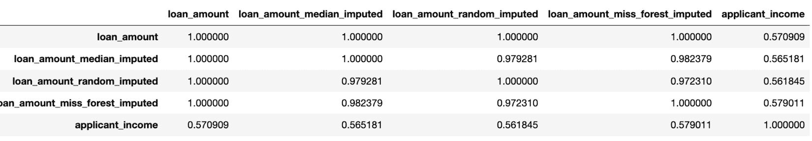

图 5.13 – 使用 MICE 填充方法填充 loan_amount 后的相关性

标准差略低于随机填充，但高于中位数填充方法。正如我们所见，与随机填充方法或中位数填充方法相比，与`applicant_income`的相关性没有改善。因此，为了测试 MICE 与随机森林是否是此用例的更好实现，我们可以比较当使用 MICE 时和当使用中位数填充时机器学习模型的评估指标。

但在我们这样做之前，我们希望机器学习从业者使用 MICE 插补框架探索**自动化机器学习**（**AutoML**）。机器学习可能是一个繁琐的过程，它包括试错，这就是为什么 AutoML 框架在减少人工时间方面越来越受欢迎。这些框架自动化特征工程、交叉验证、模型选择和模型调优。MICE 当前实现的一个问题是，我们必须选择用于任务的机器学习模型。如果我们想尝试多个算法，看看哪个提供了最佳的插补任务预测，并且在尝试过程中确保预测具有可推广性，并且模型没有过拟合或欠拟合，会怎样呢？我们可以想象其复杂性。为了解决这个问题，我们将结合 AutoML 和 MICE。

这种方法的优点是，在每次迭代中，AutoML 将选择一个新的模型，从而让机器学习从业者从繁琐的任务中解放出来。然而，这种方法的缺点是，当数据量增加时，需要更多的资源，这可能不可行。另外，一些开源的 AutoML 框架的另一个缺点是，在某些操作系统上，完整功能可能会出现错误。例如，在 Mac 电脑上，TPOT 和 AutoSklearn 框架在并行处理时都会出现错误。因此，我们将让您探索使用 MICE 的 AutoML 的个性化版本。

接下来，我们将实现一个包含 MICE 实现和随机森林的 scikit-learn 流水线。然后，我们使用交叉验证训练决策树模型，并使用准确率和 ROC 评估模型。完成这些后，我们创建另一个流水线，它将使用简单的插补方法，并比较评估结果。最后，我们探索进一步改进数据以提高模型性能的技术。

我们将把这些步骤转换成 scikit-learn 流水线，因为通过使用流水线，我们可以定义步骤的顺序，并将这些步骤保存为 pickle 对象。通过利用这种做法，我们保持机器学习系统的最佳实践，并可以确保可靠性及可重复性，而无需在推理环境中重复编写代码。

首先，让我们删除`df_consistent` DataFrame 中所有以`_imputed`结尾的新创建的列：

```py
df_consistent.drop([cols for cols in df_consistent if cols.endswith('imputed')], axis=1, inplace=True)
```

接下来，我们将导入所有必要的包和模块，以帮助将数据分为训练集和测试集，评估模型的性能，并创建机器学习流水线：

```py
from sklearn.model_selection import train_test_split, GridSearchCV
from sklearn.metrics import roc_auc_score, accuracy_score, confusion_matrix, ConfusionMatrixDisplay
from typing import List
from sklearn.tree import DecisionTreeClassifier
from sklearn.preprocessing import StandardScaler
from sklearn.pipeline import Pipeline
from sklearn.compose import ColumnTransformer
from sklearn.impute import SimpleImputer
```

现在，我们提取模型所需的特征，并将数据分为训练集和测试集，其中 10%的数据保留用于测试：

```py
feature_cols = [cols for cols in df_consistent if cols not in [target, id_col]]
X_train, X_test, y_train, y_test = train_test_split(df_consistent[feature_cols],
                                                    df_consistent[target].map({'Y':1, 'N':0}),
                                                    test_size=0.1,
                                                    random_state=1,
                                                    stratify=df_consistent[target].map({'Y':1, 'N':0}))
feature_cols
['gender',
 'married',
 'dependents',
 'education',
 'self_employed',
 'applicant_income',
 'coapplicant_income',
 'loan_amount',
 'loan_amount_term',
 'credit_history',
 'property_area']
```

接下来，我们将提取分类数据和数值数据到单独的列表中，以便我们可以使用这些数据为每种类型的数据设置流水线：

```py
cat_cols = [cols for cols in X_train if X_train[cols].nunique() <= 15]
num_cols = [cols for cols in X_train if cols not in cat_cols]
```

现在，我们创建一个函数，该函数将返回用于分类数据的管道。首先，该管道将`ohe_cols`变量中的列列表进行独热编码，其中包括`property_area`。然后，该管道使用随机森林的 MICE 实现来填充缺失数据。该函数将返回转换器，以便当我们传递分类数据时，转换器将独热编码数据并填充缺失数据。转换器将首先在训练数据上运行，以便了解数据并保存所有元数据，以便用新数据运行相同的步骤。然后，转换器可以用来转换测试数据：

```py
def miss_forest_categorical_transformer():
    """Function to define categorical pipeline"""
    cat_transformer = Pipeline(
        steps=[
            ("one_hot_encoding",
             OneHotEncoder(variables=ohe_cols)
            ),
            ("miss_forest_classifier",
             IterativeImputer(
                 estimator=ExtraTreesClassifier(
                     n_estimators=100,
                     random_state=1,
                     bootstrap=True,
                     n_jobs=-1),
                max_iter=10,
                random_state=1,
                initial_strategy='median',
                add_indicator=True)
            )
        ]
    )
    return cat_transformer
```

接下来，我们创建一个函数，该函数返回用于用 MICE 实现填充数值缺失数据的管道转换器。与分类转换器类似，数值转换器将针对训练数据进行训练，然后应用于测试数据以填充训练和测试数据中的缺失值：

```py
def miss_forest_numerical_transformer():
    """Function to define numerical pipeline"""
    num_transformer = Pipeline(
        steps=[
            ("miss_forest",
             IterativeImputer(
                estimator=ExtraTreesRegressor(n_estimators=100,
                                              random_state=1,
                                              bootstrap=True,
                                              n_jobs=-1),
                max_iter=10,
                random_state=1,
                initial_strategy='median',
                add_indicator=True)
            )
        ]
    )
    return num_transformer
```

然后，我们初始化分类和数值转换器，然后转换训练和测试数据。在转换数值数据之前，将转换后的分类数据与数值数据合并。这个输出的结果是填充后的训练和测试数据框：

```py
cat_transformer = miss_forest_categorical_transformer()
num_transformer = miss_forest_numerical_transformer()
X_train_cat_imputed = cat_transformer.fit_transform(X_train[cat_cols])
X_test_cat_imputed = cat_transformer.transform(X_test[cat_cols])
X_train_cat_imputed_df = pd.DataFrame(data=X_train_cat_imputed,
                                      columns=cat_transformer.get_feature_names_out(),
                                      index=X_train.index)
X_test_cat_imputed_df = pd.DataFrame(data=X_test_cat_imputed,
                                     columns=cat_transformer.get_feature_names_out(),
                                     index=X_test.index)
X_train_cat_imputed_df = pd.concat([X_train_cat_imputed_df, X_train[num_cols]], axis=1)
X_test_cat_imputed_df = pd.concat([X_test_cat_imputed_df, X_test[num_cols]], axis=1)
X_train_imputed = num_transformer.fit_transform(X_train_cat_imputed_df)
X_test_imputed = num_transformer.transform(X_test_cat_imputed_df)
X_train_transformed = pd.DataFrame(data=X_train_imputed,
                                   columns=num_transformer.get_feature_names_out(),
                                   index=X_train.index)
X_test_transformed = pd.DataFrame(data=X_test_imputed,
                                  columns=num_transformer.get_feature_names_out(),
                                  index=X_test.index)
```

在将完整数据集传递给机器学习模型之前，我们检查训练和测试标签是否具有相似的贷款批准率：

```py
y_train.mean(), y_test.mean()
(0.6865942028985508, 0.6935483870967742)
```

由于类别略微不平衡，我们可以使用`class_weight='balanced'`选项，因为这个选项使用`y`的值在训练算法时自动调整与输入数据中类别频率成反比的权重。问题的目标是识别出优于可能获得贷款的人类。由于大多数类别是在收到贷款的人身上训练的，因此模型将偏向于给某人发放贷款。通过使用`class_weight='balanced'`，算法将更多地强调类别标签 0，因为它是一个少数类别。

我们定义了决策树分类器的网格搜索以执行交叉验证，以确保模型具有泛化能力：

```py
d_param_grid = {
    'max_features': [None, 'sqrt', 'log2'],
    'max_depth' : [4,5,6,7,8,10,20],
    'min_samples_leaf' : [1,3,5,8,10,12,15],
    'min_samples_split': [2,6,10,16,20,24,30],
    'criterion' : ['gini', 'entropy'],
    'random_state' : [1],
    'class_weight' : ['balanced']
}
d_clf = DecisionTreeClassifier()
```

接下来，我们创建一个自定义函数，该函数将接受训练数据、测试数据、分类器和网格搜索参数。该函数执行 10K 交叉验证以找到最佳超参数，并在最佳参数上训练模型。然后，该函数返回模型、预测、训练和测试准确率以及 ROC-AUC 分数：

```py
def train_custom_classifier(X_train, y_train, X_test, y_test, clf, params):
    """Function to train the decision tree classifier and return some metrics"""
    d_clf_cv = GridSearchCV(estimator=d_clf, param_grid=d_param_grid, cv=10, scoring='roc_auc')
    d_clf_cv.fit(X_train_transformed, y_train)
    print("Decision tree optimised")
    d_best_params = d_clf_cv.best_params_
    print(f"Getting the best params which are {d_best_params}")
    model = DecisionTreeClassifier(**d_best_params)
    model.fit(X_train_transformed, y_train)
    training_predictions_prob = model.predict_proba(X_train_transformed)
    testing_predictions_prob = model.predict_proba(X_test_transformed)
    training_predictions = model.predict(X_train_transformed)
    testing_predictions = model.predict(X_test_transformed)
    training_roc_auc = roc_auc_score(y_train, training_predictions_prob[:,1])
    testing_roc_auc = roc_auc_score(y_test, testing_predictions_prob[:,1])
    training_acc = accuracy_score(y_train, training_predictions)
    testing_acc = accuracy_score(y_test, testing_predictions)
    print(f"Training roc is {training_roc_auc}, and testing roc is {testing_roc_auc} \n \
            training accuracy is {training_acc}, testing_acc as {testing_acc}")
    return model, testing_predictions, training_roc_auc, testing_roc_auc, training_acc, testing_acc
```

接下来，我们运行自定义分类器并计算模型性能：

```py
model, test_predictions, train_roc, test_roc, train_acc, test_acc  = train_custom_classifier(
    X_train=X_train_transformed,
    y_train=y_train,
    X_test=X_test_transformed,
    y_test=y_test,
    clf=d_clf,
    params=d_param_grid
)
Decision tree optimised
Getting the best params which are {'class_weight': 'balanced', 'criterion': 'entropy', 'max_depth': 8, 'max_features': None, 'min_samples_leaf': 1, 'min_samples_split': 30, 'random_state': 1}
Training roc is 0.8763326063416048, and testing roc is 0.7858017135862914
             training accuracy is 0.8152173913043478, testing_acc as 0.7903225806451613
```

测试准确率略低于 80%。让我们通过观察混淆矩阵来查看模型在哪些方面表现不佳：

```py
cm = confusion_matrix(y_test, test_predictions, labels=model.classes_, normalize='true')
disp = ConfusionMatrixDisplay(confusion_matrix=cm, display_labels=model.classes_)
disp.plot()
```

这将输出以下混淆矩阵：

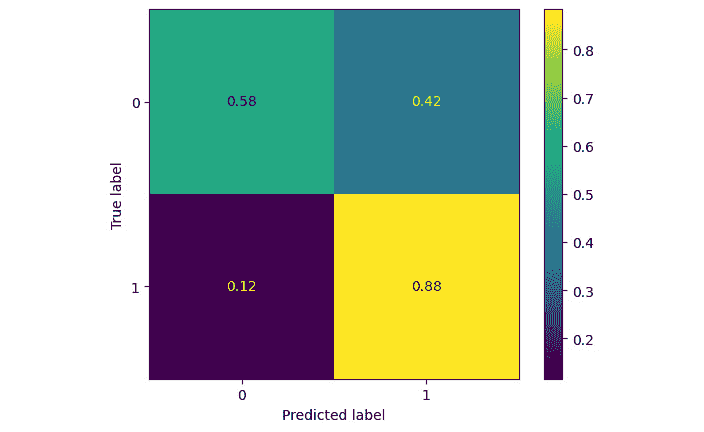

图 5.14 – 混淆矩阵

我们现在已应用了带有 MICE 插补的机器学习管道来创建机器学习模型。为了证明 MICE 插补技术比简单插补技术更好，我们将使用简单插补方法重新创建机器学习管道并评估模型性能。

一旦我们创建了管道步骤，我们将在将其传递给决策树分类器和自定义分类器函数以衡量模型性能之前，对训练数据和测试数据进行转换：

```py
cat_transformer = Pipeline(
    steps=[
        ("one_hot_encoding",
         OneHotEncoder(variables=ohe_cols)
        )
    ]
)
impute_transformer = Pipeline(
    steps=[
        ("simple_imputer",
         SimpleImputer(strategy='median',
                       add_indicator=True)
        )
    ]
)
X_train_ohe = cat_transformer.fit_transform(X_train)
X_test_ohe = cat_transformer.transform(X_test)
X_train_imputed = impute_transformer.fit_transform(X_train_ohe)
X_test_imputed = impute_transformer.transform(X_test_ohe)
X_train_transformed = pd.DataFrame(data=X_train_imputed,
                                   columns=impute_transformer.get_feature_names_out(),
                                   index=X_train.index)
X_test_transformed = pd.DataFrame(data=X_test_imputed,
                                  columns=impute_transformer.get_feature_names_out(),
                                  index=X_test.index)
```

接下来，我们运行自定义分类器并提取模型性能：

```py
model, test_predictions, train_roc, test_roc, train_acc, test_acc = train_custom_classifier(
    X_train=X_train_transformed,
    y_train=y_train,
    X_test=X_test_transformed,
    y_test=y_test,
    clf=d_clf,
    params=d_param_grid
)
```

测试准确率下降到低于 67%，下降了 12%，ROC-AUC 下降了 6%。接下来，我们回顾混淆矩阵：

```py
cm = confusion_matrix(y_test, test_predictions, labels=model.classes_, normalize='true')
disp = ConfusionMatrixDisplay(confusion_matrix=cm, display_labels=model.classes_)
disp.plot()
```

这是输出：

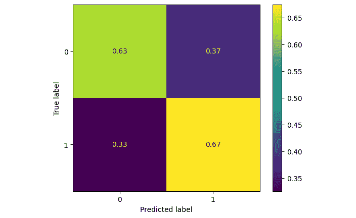

图 5.15 – 混淆矩阵

真阳性类的准确率从 88% 下降到 67%，而阴性类的准确率从 58% 上升到 63%。通过使用基本的插补技术，我们可以得出结论，该模型更有可能存在偏差，模型性能可能不够准确。

在以数据为中心的机器学习中，目标是改进数据并调整它，而不是改进算法和调整模型。但如何确定一个数据集是否包含标签错误的数据、缺失特征或其他数据相关的问题？我们将在*第六章*中介绍如何识别数据标签错误并应用技术来改进错误标记的数据，*机器学习中的程序化标签技术*。

为了找出是否需要更多特征或更多数据，我们利用一种称为错误分析的技术。在机器学习中，错误分析用于通过关注模型表现良好和表现不佳的数据区域来识别和诊断错误的预测。尽管模型的总体性能可能为 79%，但这种性能可能不会在整个数据区域中均匀分布，这些高低起伏可能是由某些区域存在的输入和在其他区域缺失的输入造成的。

为了识别数据问题，我们将使用 10% 的数据进行模型训练，并在每次迭代中增加 10%。然后，我们绘制训练 ROC 曲线和测试 ROC 曲线，以测试数据规模增加的情况。如果图表似乎收敛并表明数据规模增加，这将导致测试 ROC 的提高，此时我们将生成合成数据以增加数据规模。这项技术将在*第七章*中介绍，*以数据为中心的机器学习中的合成数据使用*。

如果图表似乎没有收敛，并表明数据增加，它将对提高测试 ROC 产生最小的影响。在这种情况下，我们可以观察到模型表现不佳的数据点，并可能利用特征工程生成新的列。尽管特征工程可能是一种迭代方法，但就本章的范围而言，我们只涵盖添加一个或两个特征。

要运行错误分析，首先，我们创建从 0.1 到 1.0 的数据截止点，其中 0.1 表示 10% 的训练数据，1.0 表示 100% 的训练数据：

```py
data_cutoff_points = np.linspace(start=0.1, stop=1, num=10)
data_cutoff_points
array([0.1, 0.2, 0.3, 0.4, 0.5, 0.6, 0.7, 0.8, 0.9, 1\. ])
```

接下来，我们创建一个名为 `scores` 的空列表，并对每个数据截止点进行数据预处理、模型训练和评估。如果截止点小于 1.0，我们将子集训练数据；否则，我们将所有数据传递用于训练。在每个迭代结束时，我们将截止点、训练和测试评估指标保存到 `scores` 中，通过将指标追加到 `scores` 列表：

```py
scores = []
for cutoff in data_cutoff_points:
    if cutoff < 1.0:
        X_train_subset, X_train_rem, y_train_subset, y_train_rem = train_test_split(X_train,
                     y_train,
                          random_state=1,
                             train_size=cutoff,
                        stratify=y_train)
    else:
        X_train_subset = X_train.copy()
        y_train_subset = y_train.copy()
    print(f"Model will be trained on {X_train_subset.shape[0]} rows out of {X_train.shape[0]}")
    cat_transformer = miss_forest_categorical_transformer()
    num_transformer = miss_forest_numerical_transformer()
    X_train_cat_imputed = cat_transformer.fit_transform(X_train_subset[cat_cols])
    X_test_cat_imputed = cat_transformer.transform(X_test[cat_cols])
    X_train_cat_imputed_df = pd.DataFrame(data=X_train_cat_imputed,
                                          columns=cat_transformer.get_feature_names_out(),
                                          index=X_train_subset.index)
    X_test_cat_imputed_df = pd.DataFrame(data=X_test_cat_imputed,
                                         columns=cat_transformer.get_feature_names_out(),
                                         index=X_test.index)
    X_train_cat_imputed_df = pd.concat([X_train_cat_imputed_df, X_train_subset[num_cols]], axis=1)
    X_test_cat_imputed_df = pd.concat([X_test_cat_imputed_df, X_test[num_cols]], axis=1)
    X_train_imputed = num_transformer.fit_transform(X_train_cat_imputed_df)
    X_test_imputed = num_transformer.transform(X_test_cat_imputed_df)
    X_train_transformed = pd.DataFrame(data=X_train_imputed,
                                       columns=num_transformer.get_feature_names_out(),
                                       index=X_train_subset.index)
    X_test_transformed = pd.DataFrame(data=X_test_imputed,
                                      columns=num_transformer.get_feature_names_out(),
                                      index=X_test.index)
    model, test_predictions, train_roc, test_roc, train_acc, test_acc = train_custom_classifier(
        X_train=X_train_transformed,
        y_train=y_train_subset,
        X_test=X_test_transformed,
        y_test=y_test,
        clf=d_clf,
        params=d_param_grid)
    scores.append((cutoff, train_roc, test_roc, train_acc, test_acc))
Model will be trained on 55 rows out of 552
Training roc is 0.9094427244582044, and testing roc is 0.5917992656058751
             training accuracy is 0.7454545454545455, testing_acc as 0.5806451612903226
Model will be trained on 110 rows out of 552
Training roc is 0.901702786377709, and testing roc is 0.7552019583843328
             training accuracy is 0.7272727272727273, testing_acc as 0.6290322580645161
Model will be trained on 165 rows out of 552
Training roc is 0.8986555479918311, and testing roc is 0.7099143206854346
             training accuracy is 0.7696969696969697, testing_acc as 0.5967741935483871
Model will be trained on 220 rows out of 552
Training roc is 0.8207601497264613, and testing roc is 0.8084455324357405
             training accuracy is 0.8318181818181818, testing_acc as 0.8064516129032258
Model will be trained on 276 rows out of 552
Training roc is 0.8728942407103326, and testing roc is 0.7906976744186047
             training accuracy is 0.822463768115942, testing_acc as 0.7419354838709677
Model will be trained on 331 rows out of 552
Training roc is 0.9344501863774991, and testing roc is 0.7753977968176254
             training accuracy is 0.8368580060422961, testing_acc as 0.7419354838709677
Model will be trained on 386 rows out of 552
Training roc is 0.8977545610478715, and testing roc is 0.7184822521419829
             training accuracy is 0.7849740932642487, testing_acc as 0.6612903225806451
Model will be trained on 441 rows out of 552
Training roc is 0.8954656335198737, and testing roc is 0.7429620563035496
             training accuracy is 0.81859410430839, testing_acc as 0.7258064516129032
Model will be trained on 496 rows out of 552
Training roc is 0.9102355500898685, and testing roc is 0.7441860465116278
             training accuracy is 0.8266129032258065, testing_acc as 0.7258064516129032
Model will be trained on 552 rows out of 552
Training roc is 0.8763326063416048, and testing roc is 0.7858017135862914
             training accuracy is 0.8152173913043478, testing_acc as 0.7903225806451613
```

接下来，我们从 `scores` 列表创建一个 DataFrame，并传递相关的列名：

```py
df = pd.DataFrame(data=scores, columns=['data_size', 'training_roc', 'testing_roc', "training_acc", "testing_acc"])
```

然后，我们绘制训练和测试 ROC 与每个截止点的对比图：

```py
plt.plot(df.data_size, df.training_roc, label='training_roc')
plt.plot(df.data_size, df.testing_roc, label='testing_roc')
plt.xlabel("Data Size")
plt.ylabel("ROC")
plt.title("Error Analysis")
plt.legend()
```

这将输出以下图表：

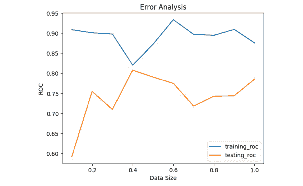

图 5.15 – 错误分析训练和测试 ROC

接下来，绘制训练和测试准确率与每个截止点的对比图：

```py
plt.plot(df.data_size, df.training_acc, label='training_acc')
plt.plot(df.data_size, df.testing_acc, label='testing_acc')
plt.xlabel("Data Size")
plt.ylabel("Accuracy")
plt.title("Error Analysis")
plt.legend()
```

这将输出以下图表：

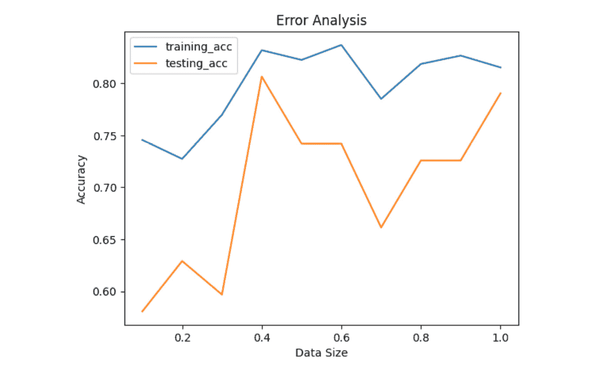

图 5.17 – 错误分析训练和测试准确率

测试 ROC 和测试准确率似乎显示出与训练 ROC 和训练准确率收敛的迹象，这表明如果提供更多的数据点，模型性能可能会得到提升。这就是为什么我们将在下一章生成模拟数据（模仿真实数据的数据）并使用添加的数据重新训练模型以获得更好的模型性能。

正如我们在前面的章节中学到的，数据为中心的机器学习的原则之一是让人类参与其中。让我们想象我们与领域专家进行了交谈，他们提到，一个人能否获得贷款的关键决定因素之一是收入与债务比率——即总收入除以贷款金额。这决定了一个人是否能够偿还贷款。收入与贷款比率较低的申请更有可能被拒绝。在数据集中，有两个收入变量——申请人收入和共同申请人收入。此外，贷款金额以千位表示——即数据中的贷款金额 66 代表 66,000。为了创建这个比率，我们将贷款金额乘以 1,000，然后结合申请人和共同申请人的收入。完成这些后，我们将合并的收入除以贷款金额以获得收入与贷款比率。领域专家还提到，**等额本息还款**（**EMIs**）也可以决定候选人的还款能力。EMI 越低，贷款被接受的可能性越大，而 EMI 越高，贷款被拒绝的可能性越大。为了在没有利率的情况下计算这个值，我们可以使用贷款期限和贷款金额来得到每月的近似 EMI 金额。

对于收入与贷款比率，我们将创建一个自定义转换器，将贷款金额乘以 1,000，以便我们可以在管道中使用它。

这个转换器是一个 Python 类，我们可以用它来覆盖管道所需的 fit 和 transform 函数。这个类将继承自`BaseEstimator`和`TransformerMixin`类，这两个类都可以在`sklearn.base`模块中找到。这个类将用于实现 fit 和 transform 方法。这些方法应该包含`X`和`y`参数，transform 方法应该返回一个 pandas DataFrame 以确保与 scikit-learn 管道的兼容性。

为了创建完整的收入列，我们利用`feature_engine`库，因为它已经与 scikit-learn 管道兼容，并且有应用于其他变量的数学运算方法。首先，我们求和收入变量。这个转换的输出将除以`loan_amount`变量以创建收入与贷款比率。

为了创建 EMI，我们利用`feature_engine`库，将`loan_amount`除以`loan_amount_term`。一旦我们创建了这些特征，我们就移除了两个收入变量，因为我们已经创建了这两个变量的组合。对于这一步，我们使用`feature_engine`库中的`DropFeatures`类。所有这些特征工程步骤将组合在一个新的名为`feature-transformer`的管道中，并在数据插补后应用。

我们相信，通过添加这些额外特征，决策树算法的模型性能将得到提高。让我们在特征工程后运行算法并评估结果。

首先，我们创建用于特征工程步骤的自定义变量，它将接受一个变量列表：

```py
income_variables = ['applicant_income', 'coapplicant_income']
loan_variable = ['loan_amount']
loan_term_variable = ['loan_amount_term']
```

接下来，我们从 `feature_engine` 导入相关包以执行特征工程步骤，并导入 `BaseEstimator` 和 `TransformerMixin` 类：

```py
from feature_engine.creation.math_features import MathFeatures
from feature_engine.creation.relative_features import RelativeFeatures
from sklearn.base import BaseEstimator, TransformerMixin
from feature_engine.selection import DropFeatures
```

然后，我们创建一个自定义转换器，它将接受变量名和一个将被每个变量乘以的值。默认情况下，每个变量将被乘以 1：

```py
class MultiplyColumns(BaseEstimator, TransformerMixin):
    """Custom pipeline class to multiply columns passed in a DataFrame with a value"""
    def __init__(self, multiply_by=1, variables=None):
        self.multiply_by = multiply_by
        self.variables = variables
    def fit(self, X, y=None):
        return self
    def transform(self, X, y=None):
        if self.variables:
            X[self.variables] = X[self.variables] * self.multiply_by
        return X
```

接下来，我们调用之前创建的 `missForest` 类别和数值转换器。完成此操作后，我们创建一个特征转换器管道，利用之前创建的自定义转换器将 `loan_amount` 乘以 1,000。新的管道然后将收入变量添加到一个收入变量中，即收入与贷款比率，以及 EMI 特征。最后，管道删除了两个收入变量，因为将创建新的收入变量。通过使用转换器管道，训练和测试数据将被转换，并创建新特征。这一步骤的输出将完全转换为训练和测试数据，以便可以传递给自定义分类器：

```py
cat_transformer = miss_forest_categorical_transformer()
num_transformer = miss_forest_numerical_transformer()
feature_transformer = Pipeline(
    steps=[
        ("multiply_by_thousand",
         MultiplyColumns(
             multiply_by=1000,
             variables=loan_variable
         )
        ),
        ("add_columns",
         MathFeatures(
             variables=income_variables,
             func='sum'
         )
        ),
        ("income_to_loan_ratio",
         RelativeFeatures(variables=[f"sum_{income_variables[0]}_{income_variables[1]}"],
                          reference=loan_variable,
                          func=["div"]
                         )
        ),
        ("emi",
         RelativeFeatures(variables=loan_variable,
                          reference=loan_term_variable,
                          func=["div"])
        ),
        ("drop_features",
         DropFeatures(features_to_drop=income_variables
          ))
    ]
)
```

接下来，我们创建用于插补的类别转换器：

```py
X_train_cat_imputed = cat_transformer.fit_transform(X_train[cat_cols])
X_test_cat_imputed = cat_transformer.transform(X_test[cat_cols])
X_train_cat_imputed_df = pd.DataFrame(data=X_train_cat_imputed,
                                      columns=cat_transformer.get_feature_names_out(),
                                      index=X_train.index)
X_test_cat_imputed_df = pd.DataFrame(data=X_test_cat_imputed,
                                     columns=cat_transformer.get_feature_names_out(),
                                     index=X_test.index)
X_train_cat_imputed_df = pd.concat([X_train_cat_imputed_df, X_train[num_cols]], axis=1)
X_test_cat_imputed_df = pd.concat([X_test_cat_imputed_df, X_test[num_cols]], axis=1)
```

然后，我们添加数值插补并完成插补步骤：

```py
X_train_imputed = num_transformer.fit_transform(X_train_cat_imputed_df)
X_test_imputed = num_transformer.transform(X_test_cat_imputed_df)
X_train_imputed_df = pd.DataFrame(data=X_train_imputed,
                                   columns=num_transformer.get_feature_names_out(),
                                   index=X_train.index)
X_test_imputed_df = pd.DataFrame(data=X_test_imputed,
                                  columns=num_transformer.get_feature_names_out(),
                                  index=X_test.index)
```

接下来，我们使用之前创建的特征插补管道对缺失数据进行转换：

```py
X_train_transformed = feature_transformer.fit_transform(X_train_imputed_df)
X_test_transformed = feature_transformer.transform(X_test_imputed_df)
```

在这一点上，我们调用自定义分类器函数，通过添加特征工程步骤来评估模型性能：

```py
model, test_predictions, train_roc, test_roc, train_acc, test_acc = train_custom_classifier(
    X_train=X_train_transformed,
    y_train=y_train,
    X_test=X_test_transformed,
    y_test=y_test,
    clf=d_clf,
    params=d_param_grid)
Training roc is 0.8465996614150411, and testing roc is 0.8188494492044063
             training accuracy is 0.8206521739130435, testing_acc as 0.8225806451612904
```

接下来，我们调用混淆矩阵：

```py
cm = confusion_matrix(y_test, test_predictions, labels=model.classes_, normalize='true')
disp = ConfusionMatrixDisplay(confusion_matrix=cm, display_labels=model.classes_)
disp.plot()
```

生成的混淆矩阵如下：

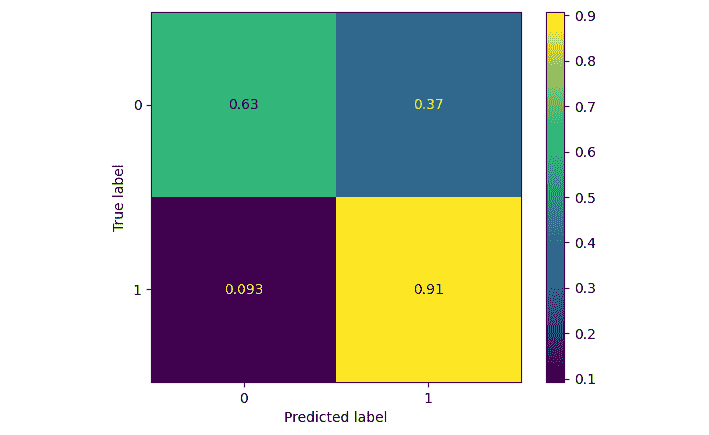

图 5.18 – 使用自定义特征工程时的混淆矩阵

我们的测试准确率从 79% 提高到 82%，ROC 从 78.5% 提高到 81.8%。前面的混淆矩阵显示，正类准确率从 88% 提高到 91%，而负类准确率从 58% 提高到 63%。

通过这种方式，我们已经证明了通过使用以数据为中心的方法，我们可以遍历数据而不是遍历多个算法，并设法提高模型性能。我们将在下一章探讨如何添加一些合成数据，并进一步提高模型性能。

# 确保数据有效

到目前为止，我们已经确保我们的数据是一致的、唯一的和完整的。但我们是否知道我们拥有的数据是有效的？数据标签是否符合规则？例如，如果数据集中的属性区域不符合规则，`semi_urban`是无效的怎么办？如果一位或几位标注者认为一些郊区既不是城市也不是乡村，并且违反了规则，输入了`semi_urban`怎么办？为了衡量有效性，我们可能需要查看业务规则并检查符合这些业务规则的数据百分比。让我们假设`semi_urban`是一个无效值。在 Python 中，我们可以检查无效标签的百分比，然后联系标注者纠正数据。我们也可以通过使用用于生成标签的数据来实现这一点。如果我们有`suburb_name`到`property_area`的数据映射，并且`suburb_name`在数据集中可用，那么我们可以利用这个映射来捕获无效值，以及通过编程方式编码标签。在系统中构建业务规则，以便自动编码即将到来的数据，这被称为编程标签。我们将在接下来的章节中深入探讨编程标签，我们将探讨在数据捕获时使数据一致和有效的技术，这样当数据到来时，它已经是纯净的，并且一些数据清理过程将是多余的。

首先，我们创建一个包含 10 行数据的假数据集，并编写一个业务规则。它将包含一个`id`列，其值为 1 到 10，一个`population`列，包含 1,000 到 100,000 之间的 10 个随机值，以及一个`property_area`列，其中四个值设置为`urban`，五个值设置为`semi_urban`，一个值设置为`rural`：

```py
np.random.seed(1)
data = {
    "id": np.linspace(start=1, stop=10, num=10, dtype=int),
    "population" : np.random.randint(low=1000, high=100000, size=10),
    "property_area": ["urban"]*4 + ["semi_urban"]*5 + ["rural"]*1
}
df = pd.DataFrame(data=data)
```

接下来，我们打印前五行：

```py
df.head()
   id  population property_area
0   1       99539         urban
1   2       78708         urban
2   3        6192         urban
3   4       99047         urban
4   5       51057    semi_urban
```

假设业务规则说，当人口超过 20,000 时，郊区或`property_area`被归类为城市；否则，被归类为乡村。在这种情况下，验证规则应该检查`property_area`是否只包含`urban`或`rural`值。

在 Python 中检查这一点的简单方法是在`value_counts()`方法旁边使用`normalize=True`参数。这个输出的结果将显示 50%的数据是无效的：

```py
df.property_area.value_counts(normalize=True)
semi_urban    0.5
urban         0.4
rural         0.1
Name: property_area, dtype: float64
```

接下来，我们可以对每一行运行检查，并在值位于预期值列表中时标记，以及当值不在预期值集中时标记：

```py
df.property_area.isin(['rural', 'urban']) == False
0    False
1    False
2    False
3    False
4     True
5     True
6     True
7     True
8     True
9    False
Name: property_area, dtype: bool
```

现在，我们将违反数据验证规则的数据行求和，并将无效行数除以总行数，以提供一个指标——即无效标签的百分比：

```py
sum(df.property_area.isin(['rural', 'urban']) == False) / df.shape[0]
0.5
```

无效数据必须通知数据源提供者，并且必须进行清理；否则，这些数据可能会悄悄进入，机器学习模型将学习这些无效标签。当使用有效数据进行训练时，模型的学习能力显著提高，因为它提供了更强的标签信号，与无效数据相比，无效数据由于对有效标签点的接触减少而削弱了这些信号。

# 确保数据准确

即使数据是有效的，它可能也不准确。数据准确性衡量的是与真实世界数据或可验证来源匹配的数据百分比。考虑到前面的`property_area`示例，为了衡量数据准确性，我们可能需要查找一个可靠的已发布数据集，并检查该地区的人口和地区类型。假设人口与可验证的数据源匹配，但地区类型来源不可用。使用定义农村地区和城市地区的规则，我们可以衡量数据准确性。

使用这个业务规则，我们将创建一个新的标签`true_property_area`，当人口在 20,000 人或以下时，其值为`rural`；否则，其值为`urban`：

```py
df['true_property_area'] = df.population.apply(lambda value: 'rural' if value <= 20000 else 'urban')
```

接下来，我们将打印数据集的行以查看`property_area`和`true_property_area`之间是否存在任何不匹配：

```py
df[['true_property_area', 'property_area', 'population']]
  true_property_area property_area  population
0              urban         urban       99539
1              urban         urban       78708
2              rural         urban        6192
3              urban         urban       99047
4              urban    semi_urban       51057
5              urban    semi_urban       74349
6              urban    semi_urban       22440
7              urban    semi_urban       99448
8              urban    semi_urban       21609
9              urban         rural       50100
```

然后，我们将匹配`property_area`值与真实值的行求和，然后除以总行数以计算数据准确性：

```py
sum(df.property_area == df.true_property_area) / df.shape[0]
0.3
```

我们可以不创建一个函数来计算准确性，而是利用 scikit-learn 中的`accuracy_score`：

```py
accuracy_score(y_pred=df.property_area, y_true=df.true_property_area)
0.3
```

如我们所见，两种方法都返回了相同的分数。如果错误的数据进入系统，模型可能会对半城市和农村地区学习不准确，并在推理时产生不理想的结果。

# 确保数据新鲜

数据新鲜度是衡量数据质量的一个重要方面，它对机器学习应用的质量和鲁棒性有影响。让我们想象一下，我们有一个在 2019 年和 2020 年客户行为上训练的机器学习应用，并用于预测到 2021 年 4 月的酒店房间预订。也许一月份和二月份的数字相当准确，但当三月份和四月份到来时，准确性下降。这可能是由于 COVID-19，这是数据未看到的情况，其影响没有被捕捉到。在机器学习中，这被称为数据漂移。这种情况正在发生；三月份和四月份的数据分布与 2019 年和 2020 年的数据分布有很大不同。通过确保数据新鲜且更新，我们可以更频繁地训练模型，或者在检测到数据漂移时立即训练。

为了测量数据漂移，我们将使用`alibi` Python 包。然而，还有更多广泛的 Python 包可以帮助完成这项工作。我们推荐 Evidently AI ([`www.evidentlyai.com/`](https://www.evidentlyai.com/))，这是一个数据与机器学习模型监控工具包，或者 WhyLogs ([`whylabs.ai/whylogs`](https://whylabs.ai/whylogs))，这是 WhyLabs 的一个开源倡议，用于监控模型降级和数据漂移。

让我们假设，当模型在超过 5 天的旧数据上训练时，模型准确性开始下降，而当数据超过 10 天时，模型表现不佳并开始给企业带来成本。我们希望能够在这种情况发生时发出警报并捕获它。为了演示这个场景，我们将创建一个包含日期列的样本数据集，并定义错误和警告阈值——也就是说，如果数据是 5 天前的，我们打印警告；如果数据超过 10 天，我们阻止应用程序。在实践中，建议使用最新的可用数据进行模型训练。遵循以数据为中心的方法，我们必须鼓励从业者与数据提供者定义阈值和**服务级别协议**（**SLAs**），以便他们有机制来请求最新的数据，当 SLA 被违反时进行处罚，当 SLA 得到满足时进行奖励（鼓励保持高质量数据的重要性）。

现在，我们将生成 100 个样本数据点，并演示如何使用日期变量来识别数据是否过时。

我们使用`alibi`包来检测`loan_prediction`数据集中的漂移。我们将通过比较漂移前后的准确率来展示不检测和采取数据漂移措施的危害。

首先，我们导入`datetime`和`warning`包：

```py
from datetime import datetime, timedelta
import warnings
```

接下来，我们生成一个基准日期——比如说我们运行代码的日期——然后从基准日期开始，通过每天减去一天来生成 100 个过去的日期：

```py
numdays = 100
base = datetime.today()
date_list = [base - timedelta(days=day) for day in range(numdays)] # Subracting values from 1 to 100 from todays date
```

然后，我们按生成日期的顺序打印前 10 个日期，最近的日期是第一个日期：

```py
[date.date().strftime('%Y-%m-%d') for date in date_list[0:10]]
['2023-02-04',
 '2023-02-03',
 '2023-02-02',
 '2023-02-01',
 '2023-01-31',
 '2023-01-30',
 '2023-01-29',
 '2023-01-28',
 '2023-01-27',
 '2023-01-26']
```

接下来，我们创建一个包含 100 行的 DataFrame，通过创建四个列来实现。它将包含一个`id`列，其值为 1 到 100，一个`date_loaded`列，包含我们之前创建的 100 个日期，一个`population`列，包含 100 个介于 1,000 到 100,000 之间的随机值，以及一个`property_area`列，其中 40 个值设置为`urban`，50 个值设置为`semi_urban`，10 个值设置为`rural`：

```py
np.random.seed(1)
data = {
    "id": np.linspace(start=1, stop=100, num=100, dtype=int),
    "population" : np.random.randint(low=1000, high=100000, size=100),
    "property_area": ["urban"]*40 + ["semi_urban"]*50 + ["rural"]*10,
    "date_loaded": date_list
}
df = pd.DataFrame(data=data)
```

现在，我们可视化前五个数据点：

```py
df.head()
   id  population property_area                date_loaded
0   1       99539         urban 2023-02-04 11:18:46.771142
1   2       78708         urban 2023-02-03 11:18:46.771142
2   3        6192         urban 2023-02-02 11:18:46.771142
3   4       99047         urban 2023-02-01 11:18:46.771142
4   5       51057         urban 2023-01-31 11:18:46.771142
```

接下来，我们编写一行代码来演示从今天日期减去任何日期并提取两个日期之间天数的方法：

```py
(datetime.now() - df.date_loaded.max()).days
0
```

然后，我们创建一个函数，该函数将接受一个 DataFrame 及其日期列，默认情况下，如果数据超过 5 天，将发出警告；如果数据超过 10 天，将阻止应用程序：

```py
def check_data_recency_days(df: pd.DataFrame, loaded_at_column: str, warning_at: int=5, error_at: int=10):
    """Function to detect data freshness"""
    df = df.copy()
    days_since_data_refreshed = (datetime.now() - df[loaded_at_column].max()).days
    if days_since_data_refreshed < warning_at:
        print(f"Data is fresh and is {days_since_data_refreshed} days old")
    elif error_at > days_since_data_refreshed >= warning_at:
        warnings.warn(f"Warning: Data is not fresh, and is {days_since_data_refreshed} days old")
    else:
        raise ValueError(f"Date provided is too old and stale, please contact source provider: {days_since_data_refreshed} days old")
```

接下来，我们使用之前创建的样本 DataFrame 运行该函数。该函数将声明数据是新鲜的，只有 0 天：

```py
check_data_recency_days(df, "date_loaded")
Data is fresh and is 0 days old
```

为了展示函数在数据过时时的警告或错误输出能力，我们通过删除 6 天和 12 天内的数据来对数据进行子集划分。我们创建了两个 DataFrame——一个删除了 6 天内的数据，另一个删除了 12 天内的数据。然后，我们在这些 DataFrame 上运行`check_data_recency_day`函数。我们看到，当我们用 6 天前的数据运行函数时，函数将发出警告，但当我们用 12 天前的数据运行函数时，函数将发出一个`Value`错误。

让我们创建两个 DataFrame：

```py
df_filter_6_days = df[df.date_loaded <= (datetime.today() -  timedelta(days=6))]
df_filter_12_days = df[df.date_loaded <= (datetime.today() -  timedelta(days=12))]
```

接下来，我们对 6 天前的数据进行函数运行：

```py
check_data_recency_days(df_filter_6_days, "date_loaded")
/var/folders/6f/p7312_7n4nq5hp35rfymms1h0000gn/T/ipykernel_5374/1750573000.py:11: UserWarning: Warning: Data is not fresh, and is 6 days old
  warnings.warn(f"Warning: Data is not fresh, and is {days_since_data_refreshed} days old")
```

您也可以对 12 天前的数据进行函数运行；它将生成类似的输出。

有了这些，我们已经展示了如何测量数据的新鲜度，捕捉警告，并在数据极度过时时阻止应用程序。接下来，我们将展示数据新鲜度对实际数据集的影响。

在现实生活中，我们不会期望一家公司不改变其产品，或者消费者行为不会随着市场上新产品的出现而改变。公司必须不断研究消费者行为的变化；否则，他们的业绩会下降。机器学习系统面临着市场力量变化、数据变化和数据分布变化相同的问题。如果新数据与训练数据大相径庭，这将对模型性能产生影响。

这在机器学习中被称为漂移，如果未检测到且未得到处理，它会导致模型退化。

让我们探索如何检测漂移。

首先，我们从`alibi-detect`包中导入`TabularDrift`：

```py
import alibi
from alibi_detect.cd import TabularDrift
```

接下来，我们展示`TabularDrift`参考数据，这是机器学习系统训练的数据——在我们的案例中，是在我们将数据传递给决策树分类器之前转换的贷款预测数据。我们还为 p 值测试传递了一个值为`0.05`的值。如果测试数据分布违反了此值，该包将通知我们测试数据已从训练数据中漂移：

```py
cd = TabularDrift(x_ref=X_train_transformed.to_numpy(), p_val=.05 )
```

现在，我们运行`predict`方法来检查测试数据是否发生了漂移。`alibi`包使用`Kolmogorov-Smirnov`测试来确定两个分布是否不同。如果 p 值超过 0.05，则拒绝零假设，可以推断出`test`数据分布与`train`数据分布不同。这一步骤的输出将是`No`：

```py
preds = cd.predict(X_test_transformed.to_numpy())
labels = ['No', 'Yes']
print('Drift: {}'.format(labels[preds['data']['is_drift']]))
Drift: No
```

现在，让我们假设房价开始飙升，而收入并没有以相同的速度增长。为了模拟这种情况，我们将贷款金额增加到原始测试集的 1.5 倍，但将总收入增加到测试集的 1.2 倍。然后，我们更新依赖于`loan_amount`和`income`变量的新特征值：

```py
 X_test_transformed['loan_amount'] = X_test_transformed['loan_amount']*1.5
X_test_transformed['sum_applicant_income_coapplicant_income'] = X_test_transformed['sum_applicant_income_coapplicant_income']*1.2
X_test_transformed.sum_applicant_income_coapplicant_income_div_loan_amount = X_test_transformed.sum_applicant_income_coapplicant_income/X_test_transformed.loan_amount
X_test_transformed.loan_amount_div_loan_amount_term = X_test_transformed.loan_amount/X_test_transformed.loan_amount_term
```

接下来，我们再次运行 TabularDrift 的`predict`方法来检查是否检测到漂移。这一步骤的输出是`Yes`：

```py
preds = cd.predict(X_test_transformed.to_numpy())
labels = ['No', 'Yes']
print('Drift: {}'.format(labels[preds['data']['is_drift']]))
Drift: Yes
```

然后，我们对由漂移引起的测试数据进行重新预测，并检查准确率和 ROC 是否受到影响：

```py
testing_predictions_prob = model.predict_proba(X_test_transformed)
testing_predictions = model.predict(X_test_transformed)
testing_roc_auc = roc_auc_score(y_test, testing_predictions_prob[:,1])
testing_acc = accuracy_score(y_test, testing_predictions)
print(f"Testing roc is {testing_roc_auc} and testing_acc as {testing_acc}")
Testing roc is 0.747858017135863 and testing_acc as 0.6935483870967742
```

如我们所见，模型在训练过程中所看到的分布与真实数据不同，其影响是模型性能显著下降。ROC 值从 0.82 降至 0.74，准确率从 82%降至 70%。因此，确保数据新鲜非常重要，一旦检测到数据漂移，就需要用新数据重新训练模型，以确保模型性能不会下降。

# 摘要

在本章中，我们深入了解了数据质量的六个关键维度以及为什么提高数据质量对于提高模型性能至关重要。我们进一步探讨了通过迭代数据来提高模型性能的数据中心方法，而不是迭代各种算法（模型中心方法），通过提高数据的整体健康状况来实现。

接下来，我们学习了如何确保数据的一致性、唯一性、准确性、有效性、新鲜性和完整性。我们深入探讨了各种填充缺失值的技巧以及何时应用哪种方法。我们得出结论，使用机器学习填充缺失值可能比使用简单的填充方法更好，尤其是在数据是 MAR 或 MNAR 的情况下。我们还展示了如何进行错误分析，以及如何利用这些结果通过执行特征工程（涉及构建新特征）或通过创建合成数据来增加数据量，从而进一步提高模型性能，这些内容将在下一章中介绍。

我们还讨论了为什么确保数据新鲜且未从原始训练集中漂移很重要，并得出结论，漂移数据可能会损害模型性能。

现在我们已经理解了确保数据质量在数据质量的六个关键维度中的重要性，在下一章中，我们将深入探讨使用合成数据来进一步提高模型性能，特别是在边缘情况中。我们还将深入探讨数据增强技术，这是一种用于为图像创建合成数据的技术，以便算法可以从更多更好的数据中学习，尤其是在这些新示例可以以各种形式出现时。
