# 第七章：在以数据为中心的机器学习中使用合成数据

在前面的章节中，我们讨论了通过更好的收集和标注来提高机器学习目的数据质量的各种方法。

尽管人类标注者、数据所有权和技术数据质量改进实践对于数据中心化至关重要，但个人或通过经验观察所能执行的数据标注和数据创建类型是有局限性的。

合成数据有潜力填补这些空白，并以其他方法成本和时间的一小部分产生全面训练数据。

本章介绍了合成数据生成。我们将涵盖以下主要主题：

+   合成数据是什么以及为什么它对数据中心化很重要

+   合成数据如何被用来生成更好的模型

+   常用的生成合成数据的技术

+   使用合成数据的风险和挑战

让我们先定义一下什么是合成数据。

# 理解合成数据

合成数据是人工创建的数据，如果做得正确，它包含了生产数据的所有特征。

它被称为合成数据的原因是它没有物理存在——也就是说，它不是来自我们为了收集数据而创建的真实生活观察或实验。

机器学习的一个基本原理是你需要大量的数据，从几千到几十亿个观测值不等。所需的数据量取决于你的模型。

正如我们已经多次概述的那样，当所需的数据量难以获得时，一种方法是提高你数据中的信号，使其能够在较小的数据集上产生准确和相关的输出。

另一个选择是创建合成数据来填补空白。合成数据的一个主要优点是其可扩展性。真实训练数据的收集是线性的，一次收集一个示例，这既耗时又昂贵。

相比之下，合成数据可以在相对较短的时间内以非常大的数量生成，并且通常成本较低。例如，如果从标注服务中获得，一个训练图像可能需要花费 5 美元，但如果人工生成，可能只需 0.05 美元。

合成数据被誉为解决更强大的机器学习和 AI 解决方案开发中许多挑战的答案。从解决隐私问题到以低成本生成建模和训练数据中罕见但重要的观察结果，合成数据可以填补现实世界数据不足的空白。

根据 Gartner 的预测 2，到 2024 年，用于 AI 和数据分析项目中 60%的数据将是合成的，而不是通过现实世界的观察收集的。

传统上，用于分析目的的数据使用是由我们拥有的数据和其局限性所驱动的。我们可能会想象一个完美的数据解决方案，但通常，数据集的深度、广度、可靠性和隐私限制会限制我们在现实中能做的事情。在很大程度上，这就是合成数据旨在解决的问题。

创建合成数据有不同的方法，在某种程度上，数据的创建技术是最不复杂的部分。验证一个合成数据集是否是潜在真实世界场景的相关反映，以及防御不希望的偏差可能既耗时又具有挑战性。

如果你选择为你的下一个项目使用合成数据，最重要的第一个问题总是，“*你打算用这些数据做什么？*”这个问题的答案决定了你的数据需求，反过来，这将突出你的数据空白。

让我们更深入地了解使用合成数据的典型原因，并探讨一些常见的使用场景。

## 合成数据的使用场景

使用合成数据的原因通常可以分为以下四个类别：

+   **可用性**：合成数据创建用于弥补某个领域数据不足的问题。可能的情况是，与现实生活中的分布相比，数据集中存在不平衡的类别，因此为了使这些类别平衡，我们创建合成数据来补偿。

+   **成本**：收集某些类型的数据可能非常昂贵且耗时，在这种情况下，生成合成数据以减少项目在时间和成本上的投入可能是有用的。

+   **风险管理**：在某些情况下，合成数据也可以用来降低人类或财务损失的风险。一个例子是飞行模拟器，它被用来在各种情况下训练新飞行员和经验丰富的飞行员。在模拟环境中训练飞行员使我们能够安全且有意识地引入在自然环境中难以创建且风险不可接受的事件。

+   **安全和法律合规性**：你可能已经拥有了所需的数据，但出于机器学习目的使用它可能是不安全或不合法的。例如，某些法规，如欧洲的**通用数据保护条例**（**GDPR**），禁止在没有底层个人明确同意的情况下使用某些类型的数据。或者，在你的组织中获取批准可能过于缓慢和繁琐。

下面是一些合成数据常见和潜在使用场景的例子：

+   计算机视觉和图像及视频处理

+   自然语言处理

+   隐私保护

+   **纠正偏差**（在第八章中讨论，*识别和移除偏差的技术*）

+   提高数据质量或填补数据空白（更便宜）

+   增加罕见事件建模数据量（在第九章中讨论，*处理机器学习中的边缘情况和罕见事件*）

+   模拟

我们将在本章中探讨一些这些主题，以说明合成数据如何作为您模型开发策略的一部分被使用。

为了设定场景，让我们看看合成数据在正确设置下可以有多强大，这得益于世界上领先的计算机游戏软件开发公司 Unity Technologies。作为背景，Unity 平台被用于创建 2021 年排名前 1000 的移动游戏的 72%以及移动、PC 和游戏机上的所有电脑游戏的 50%。

Unity 技术的用户通过仅通过将合成数据添加到现实世界数据中，就将物体识别率从 70%提高到几乎 100%。合成数据为训练数据增加了更多的多样性和更多的场景，使得物体可以从多个角度被识别。

Unity 人工智能和机器学习副总裁 David Lange 表示如下：

“*我们使用 Unity 引擎来重新创建包含物体的三维世界。然后，我们可以生成看起来非常像在现实世界中的合成图像，**标签完美。*”

“*现实世界的数据实际上只是对情况的快照。你可以通过添加合成数据来增强现实世界，包括特殊用例、特殊情况和特殊事件。你可以在你的数据集中添加合成数据来提高你数据的多样性。*”

“*我们可以创建不可能的情况，因为这不会在毫秒内给我们带来任何成本，而不是试图在现实中安排它们。你可以轻松创建所有这些场景的便利性正在推动合成数据的使用。*”

David Lange 与 Gartner 的观点一致，认为合成数据将成为未来机器学习的主要原材料：

“*我相信大部分的训练数据将是合成数据。你必须有一个现实世界作为基准，但合成数据消除了隐私问题，因为没有涉及真实的人。你可以消除偏见。你可以进行数据分析，并确保你的数据以非常均匀的方式代表现实世界，比现实世界做得更好。*”

注意 David Lange 提到的合成数据的益处：

+   物体可以被完美地标记，从而避免在前面章节中讨论的标签模糊性

+   数据集的多样性可以大幅增加，以覆盖可能的场景的微小变化，以及罕见事件和边缘情况

+   数据集可以快速且便宜地扩展

+   由于数据更干净且去个性化，可以减少偏见和隐私问题

让我们更深入地探讨合成数据的各种用途，以了解与之相关的可能性、好处、风险和限制。

## 用于计算机视觉、图像和视频处理的合成数据

在撰写本文时，合成数据在计算机视觉问题中最普遍的使用。这是因为我们通常可以以有限的风险创建这类数据，而异常值（通常是罕见但影响重大的事件）在图像数据中尤其难以获取。

计算机视觉（以及大多数其他机器学习问题）的一个共同挑战是，现实世界的数据通常包含大量描述最可能场景的观察，而罕见事件几乎没有或没有例子。

同时，收集现实世界数据可能很困难、昂贵，甚至直接危险。例如，自动驾驶汽车模型不能通过将真实汽车置于危险情况来训练以避免车祸。相反，这些车祸和其他罕见但重要的事件必须进行模拟。

图像分类算法的一个常见问题是识别在略微不熟悉的位置或环境中的熟悉物体。由于机器学习算法不是通过逻辑或抽象进行推理，即使模型在训练和测试数据集上都表现良好，也往往无法推广到分布外的观察。无论这些观察是作为对模型性能的对抗性测试引入，还是自然发生，都是如此。

*图 7.1*提供了一个这种现象的简化示例。一个旋转 45 度的正方形可能被一些人——包括人类和算法——解释为钻石，而不仅仅是与侧置的正方形具有相同尺寸的倾斜正方形：

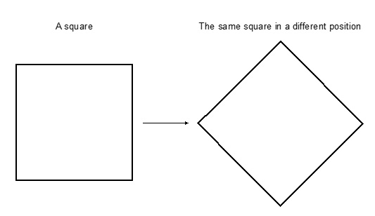

图 7.1 – 这两个正方形要么相同，要么不同，这取决于我们用来解释它们的规则

这种偏差的影响往往是重大的。在分析 ImageNet 数据集上的图像的深度神经网络性能时，Alcorn 等人（2019）5 描述了常见的图像分类器*Google Inception-v3*、*AlexNet*和*ResNet-50*如何能轻易被图像中物体位置的一点点变化所欺骗。

在*图 7.2*中，列（d）中的图像是从互联网上收集的真实照片，而列（a）到（c）是同一物体在不寻常位置中的分布外图像。图像中的主要物体被翻转和旋转，但背景保持不变：

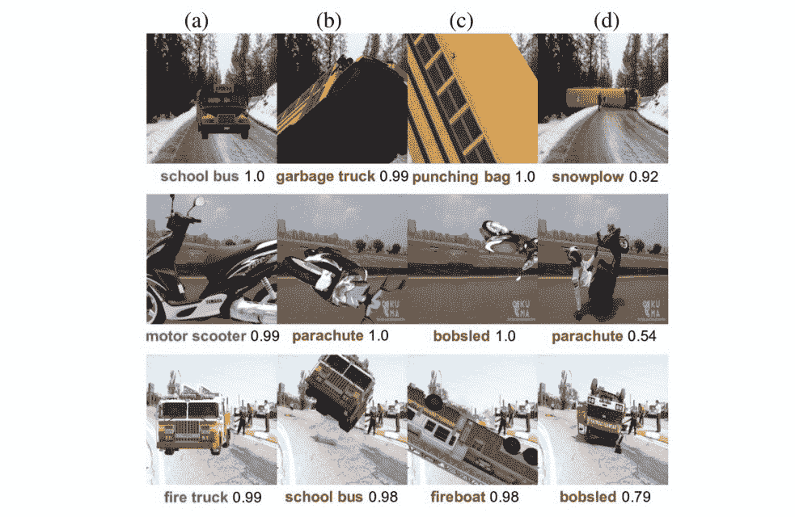

图 7.2 – 当熟悉物体处于不常见位置时，深度神经网络很容易被欺骗。列（d）代表真实图像，而列（a）到（c）是合成的

作者随后使用*Inception-v3*对这些图像进行分类，每个图像下的标签和置信度得分被描绘出来。在这些例子中，当物体在现实场景中的常见位置时，算法能够以高精度和置信度进行分类。然而，当物体被翻转、旋转或非常接近移动时，算法会以高置信度错误地分类图像。

该算法不仅错误地分类了物体，而且还自信地将它们错误地标记为它们不是的物体。一辆滚动的公交车和一个沙袋就像白垩和奶酪一样，而一辆翻倒的滑板车与降落伞相差甚远。

能够在陌生位置识别熟悉物体对于观察和分类移动物体尤为重要。在自动驾驶汽车的例子中，算法的错误解读会将新颖且意外的事件引入交通环境，尽管这些车辆在统计数据上比人类驾驶员更安全 6。

以下图片是从台湾的交通摄像头中捕捉到的，展示了这个问题的一个例子。一辆卡车在繁忙的高速公路上翻车，一辆自动驾驶的特斯拉轿车没有将卡车识别为路上的障碍物，并以高速撞向了卡车：


图 7.3 – 一辆自动驾驶汽车高速撞上一辆翻车的图片。可以使用合成数据训练算法来处理这种新颖的情况

在这种极不可能但非常危险的场景中，汽车的算法没有装备正确评估前方物体阻挡道路的统计概率。

这是一种合成数据证明非常有价值的情况。正如我们刚刚学到的，即使是最好的计算机视觉算法对常见物体位置的变化也具有高度敏感性。因此，必须在训练数据中引入各种位置和光照条件，以覆盖所有可能的组合，特别是高度不可能的组合。

当我们使用机器学习来分析图像中的情况时，我们正在提取图像中的凹凸曲线，也称为深度神经网络中的特征。

从合成数据的角度创建这些曲线，你实际上是在图像中重新创建那些形态。这通常包括翻转、旋转、缩放、裁剪、调整光线变化以及调整图像大小以在相同场景中创建轻微的变化。

在特斯拉事故的例子中，我们可能会创建卡车正常行驶、侧翻、仰翻、逆向行驶、在黑暗中、部分被其他物体覆盖等图像。这些场景在现实生活中的图像中很难获得，但它们在出现这种情况时非常重要。

## 使用生成对抗网络（GANs）生成合成数据

GANs 是生成具有类似真实世界数据特性的合成图像数据的常用工具。GANs 由计算机科学家伊恩·古德费洛（Ian Goodfellow）于 2014 年发明，并自此以来导致了能够创建各种内容的生成模型爆炸式增长，包括文本、艺术、视频和图像。

GANs 是一种无监督学习形式，其中生成器模型与判别器模型相对抗（因此有“对抗”这一方面）。这两个模型都是神经网络，它们相互竞争，将练习变成一个“伪监督”学习问题。

生成器识别原始数据集中的模式，然后使用这些模式生成可能存在于输入数据中的合成输出。生成的示例成为判别器模型的负训练样本。

判别器的任务是分类新生成数据为虚假或真实。这种零和竞赛持续进行，直到判别器将*虚假*观察结果作为*真实*的接近 50%的时间。

从数学上讲，GAN 的训练过程可以被视为最小化一个损失函数，该函数衡量生成示例与真实示例之间的差异。这个损失函数通常是两个术语的组合：一个衡量生成模型产生与真实示例相似的示例的能力，另一个衡量判别模型区分真实和生成示例的能力。

通过以这种方式训练 GAN 的两个部分，生成模型可以学习训练数据集中真实示例的模式和特征，然后使用这些信息生成与真实示例相似的新示例。这使得 GANs 可以用于广泛的用途，包括图像生成、文本生成等。

*图 7**.4*提供了一个概念图，说明了 GANs 如何通过大量的小型竞赛迭代，最终到达一个可以生成非常逼真输出的模型：

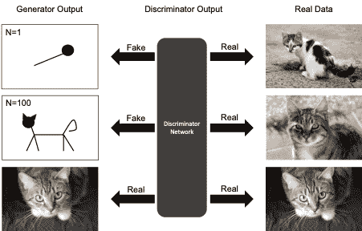

图 7.4 – GAN 工作原理的概念图

生成器最初以一些非常基本的输出形式开始，但随着它通过许多示例进行迭代，它欺骗判别器的技巧会变得更好。当判别器难以识别真实与虚假时，训练完成。

### GANs 的渐进式增长

如你所想，生成器最初创建的几个示例对判别器来说相对容易识别。生成器模型有很多要学习的东西，并且使 GAN 遵循我们希望其采取的学习路径可能具有挑战性。

GANs 本质上是具有不稳定性的模型，尤其是在生成复杂结构，如图像时。为了欺骗判别器，生成器必须捕捉到图像的细节和较大结构，这在高分辨率图像上可能很困难。如果生成器做不到这一点，它将陷入一个无法欺骗判别器的无人地带。

另一个挑战是，大图像需要大量的计算机内存。因此，批大小（每次训练迭代中用于更新模型权重的图像数量）必须经常减少，以确保图像可以装入内存。这再次使得训练过程变得不稳定。

解决这些问题的方法是通过逐步增加模型输入和输出的细节和复杂性。渐进增长最早由 NVIDIA 研究人员 Karras 等人于 2017 年提出，是一种训练 GANs 的技术，允许模型在多次迭代中逐渐增加生成图像的分辨率。

在渐进增长过程中，模型使用逐步方法进行训练。首先，生成器和判别器模型使用低分辨率图像进行训练，并通过改变参数以优化损失函数来提高图像质量。然后，在基于初始训练阶段收集的理解的基础上进行微调，同时提高生成图像的分辨率，直到达到所需的分辨率。换句话说，模型是分步骤学习的，而不是一次性学习。

Karras 等人提出使用一批 4x4 像素的低分辨率图像来训练生成器和判别器。然后，使用一个新的采样层逐渐增加图像的复杂度到 8x8，采用最近邻插值。

逐渐引入新的网络层以在分辨率层之间创建最小的干扰。这种方法允许新组件平滑且无缝地集成到现有基础设施中。

通过向现有的输入或输出层添加更高分辨率的输入来实现新的一层层的逐渐引入。新输出的相对影响通过一个权重α来控制，其中原始输出的权重为 1 - α。随着α的增加，旧层逐渐淡出，而新层接管。

此过程一直持续到达到所需的图像分辨率。*图 7.5*，来自 Kerras 等人，突出了从 4x4 到 1,024x1,024 像素图像的渐进增长过程：

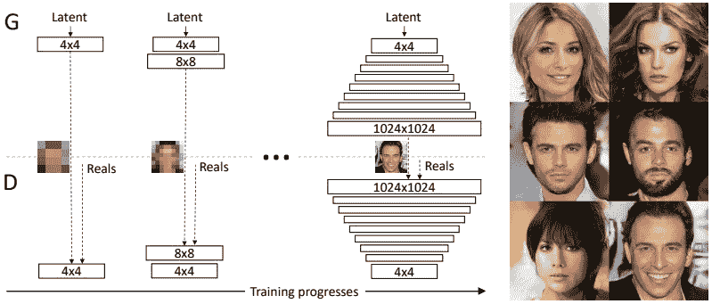

图 7.5 – 来自 Kerras 等人（2017）的 GAN 渐进增长可视化

这意味着模型可以先了解图像的整体情况，然后专注于更小的细节。这种方法通常比一次性学习所有内容要产生更好的结果。通过利用这种方法，GAN 可以掌握低分辨率数据集的基本架构和特征，从而以更高的精度创建出更高质量的图像。

### 使用 StyleGANs 实现更高的精度

英伟达的研究团队在其渐进式 GAN 架构的基础上，于 2018 年 12 月推出了第一个 StyleGAN。从那时起，已经发布了 StyleGAN-2 和 StyleGAN-3 架构。这些增量升级解决了原始 StyleGAN 输出中的一些系统性问题，但在结构上基本相似。

StyleGAN 的主要创新是能够控制生成模型创建的输出**风格**。新的架构允许生成模型自动将图像中的更广泛特征与随机/随机特征分开。广泛特征的例子包括一个人的姿态和身份；头发和雀斑被认为是随机的。

在 StyleGANs 引入之前，图像生成器的内部工作原理部分是神秘的，因此难以控制。没有有效的比较不同模型产生的不同图像的方法，以及对特征起源的有限理解，原始 GAN 生成器是黑盒。

让我们看看图 7.6 中**渐进式 GAN**（**ProGAN**）和 StyleGAN 架构的比较，以了解为什么 StyleGAN 在生成高度逼真的合成图像方面如此成功：

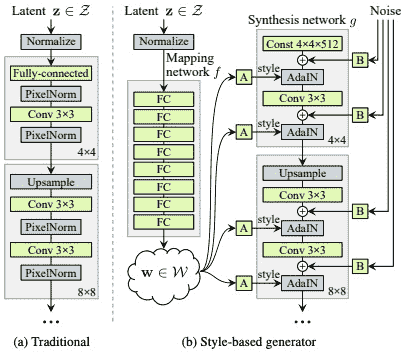

图 7.6 – Kerras 等人（2018）中 ProGAN（a）和 StyleGAN（b）的比较

虽然 ProGAN 使用渐进式训练方法逐层提升生成图像的分辨率，但 StyleGAN 通过使用映射网络和综合网络，使用户能够对生成图像有更多的控制。

StyleGAN 的映射网络是一种神经网络，它将低维向量 *z* 映射到中间潜在空间 *w*。这被称为解耦表示学习。通过解耦这两个空间中的特征，用户可以更容易地控制生成图像的不同方面，例如其生理结构、发型或服装。简单来说，它允许对图像的高级特征进行分离控制，而不是具体的像素值。

综合网络是一种深度卷积神经网络，它通过接收风格向量 *w* 作为输入并返回输出图像来工作。在合成逼真图像时，特征从特征向量中提取并逐层应用于图像层，从最低层开始，每次只提升一层到更高的分辨率。

综合网络与一个学习到的**自适应实例归一化**（**AdaIN**）模块交互，该模块通过调整图像特征的比例和偏差来重新缩放图像特征，以增加图像输出的多样性。该模块接受特征向量和风格向量作为输入，通过减去特征图的均值并除以标准差来调整图像特征的缩放和偏差。因此，StyleGAN 可以通过关注特定的特征，如发型或眼睛颜色，来产生高度详细的图像。

### 理解 GAN 的挑战

尽管 GAN 是机器学习工具箱中的一个美妙补充，但它们并非没有挑战。

GAN 基于零和博弈理论。本质上，如果一个玩家获胜，那么另一个玩家就会失败。这种情况也被称为最小-最大：你的对手寻求最大化其输出，而你寻求最小化它。GAN 背后的理论表明，生成器和判别器模型之间的游戏将继续进行，直到达到纳什均衡。

纳什均衡是经济学、政治学和进化生物学中的一个重要解决方案概念，可以在各种现实场景中看到。纳什均衡是一种情况，其中没有任何玩家有激励去做与他们目前所做的事情不同的任何事情。这是因为他们已经考虑了其他人正在做的事情，并且他们认为他们当前的策略是最佳可能的选择。

在这种情况下，所有玩家都被说是在均衡状态，因为他们没有激励去改变他们的行为，因为任何由一个玩家做出的改变都可能使该特定玩家的结果变得更糟。因此，在这种情况下不做出任何突然的改变符合每个个体的最佳利益。

例如，考虑一个竞争公司试图为其产品或服务设定价格的场景。如果每家公司都将价格设定得太高，它可能会失去竞争对手的客户。然而，如果每家公司都将价格设定得太低，它将无法覆盖其成本并获得利润。因此，这种情况下的纳什均衡是每家公司都将价格设定在一个足够低的水准，以阻止客户从竞争对手那里购买，同时又不会低到无法获得利润。

尽管这个理论可以工作，但在实践中往往很难实现。没有保证成本函数会*收敛*并找到一个纳什均衡。在这种情况下，游戏会无限期地继续。

此外，当一个代理在力量和效力方面优于另一个代理时，其对应方的学习信号就变得毫无价值；因此，双方都没有获得任何知识。最常见的情况是，判别器在挑选生成器的错误方面变得如此出色，以至于生成器从未学会如何在游戏中前进。

GANs 的一个主要挑战被称为模式崩溃。像任何其他统计模型一样，GANs 倾向于找到通过底层数据的最简单路径，这可能导致模态观察结果的过度表示。

当生成器产生一个特别可信的输出时，模式崩溃是另一个常见问题，这会导致它只产生那个输出。一旦发生这种情况，判别器更有可能陷入局部最小值，无法找到它认为有效的更好输出。

因此，生成器被驱动着调整其输出以符合这个静态判别器使用的标准，而不是试图创建真实或动态的输出。因此，生成器往往会对由其单个判别器确定的特定结果进行“过度优化”。

*图 7.7* 中的模式崩溃示例如图所示，来自 Metz 等人（2017）的研究。在这个例子中，研究人员使用了手写数字的 MNIST 数据集来训练两个不同的 GAN。MNIST 数据集包含 10 种不同的模式，代表数字 0-9。

数字的前四个象限已经成功生成（使用展开的 GAN 训练方法），看起来像真实的手写数字，并代表所有可能的数字。另一方面，底部的四个象限（使用原始 GAN 架构生成）在早期过程中就出现了模式崩溃，只产生了数字 6 的表示：

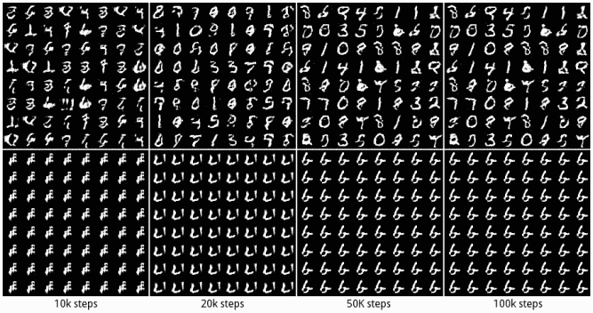

图 7.7 – 来自 Metz 等人（2017）的 MNIST 数据集上训练的两个不同的 GAN 架构

自从 2014 年原始 GAN 架构的开发以来，已经引入了几个新的 GAN 变体来处理模式崩溃。因此，这现在是一个较少见的问题，但始终需要注意。

在 MNIST 示例中，模式崩溃相对容易发现，但重要的是要注意，GANs 可能会以更微妙的方式潜在地保留和加剧现有的偏见。

在 2021 年的一项研究中（Jain 等人，2021 年），亚利桑那州立大学和伦斯勒理工学院的研究人员评估了 GAN 在生成合成面部数据方面的性能。研究人员想测试 GAN 是否会加剧（自然）有偏见的输入数据集的模态面部特征，从而增加合成输出中最常见的特征。

比较了两种模型架构：**深度卷积 GAN**（**DCGAN**）和 ProGAN。实验涉及来自美国大学的 17,245 张工程教授的图像数据集，其中 80%被归类为男性，76%被归类为白人。实验使用了人类分类器（Turkers）来对原始数据集和 GAN 生成的面部进行分类。

*图 7.8*显示了两个测试的 GAN 与原始数据集相比的结果。DCGAN 模型导致了严重偏差的数据生成，合成图像中男性和白人比例过高。虽然 ProGAN 模型的偏差较小，但它仍然不是原始数据集中特征的合理表示。

DCGAN 和 ProGAN 都对具有女性特征的图像进行了惩罚。DCGAN 生成了最偏差的输出，将女性面孔的比例从 20%降低到 6.67%。

与原始数据集中的 24%非白色面孔相比，DCGAN 和 ProGAN 都显著降低了这一比率——DCGAN 为 1.33%，ProGAN 为 11.33%：

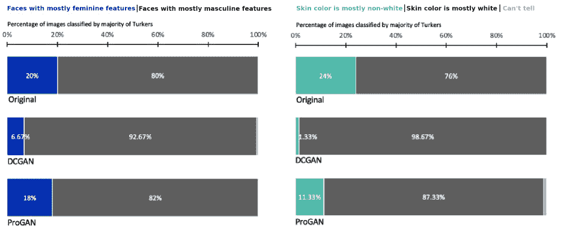

图 7.8 – 通过 GANs 生成的合成面部图像与原始数据集中性别和肤色分布的比较。来源：Jain 等人，2021 年

换句话说，GANs 可以生成高度逼真的合成数据集，但这些数据集可能仍然是原始数据集中潜在特征的偏代表性。讽刺的是，这种部分模式崩溃可能产生更逼真的图像，因为 GAN 已经专门化以在特定维度上表现良好。

根据以数据为中心的机器学习原则，识别合成数据集所有维度的模态偏差对于确保其对您的目的有用且符合道德规范至关重要。通常，这是一个试错过程，以经验验证并消除 GAN 输出中的偏差。

最后，GANs 的一个显著弱点是生成高质量输出需要大量的计算资源，没有这些资源，生成的图像可能看起来模糊或不真实。此外，如果没有经验的人选择适当的图像生成方向，使用 GANs 可能不会产生预期的结果。

## 通过实用例子探索图像增强

尽管合成图像数据生成涉及复杂性，但我们希望以一个实用的例子结束本节，激发您在工作中应用这些技术的灵感。

在本节中，我们将介绍数据增强，这是一种为图像数据生成合成数据的方法。我们将使用在 ImageNet 数据上训练的预训练 Xception 模型，并将其微调以适应服装示例。我们将通过应用迁移学习来微调服装示例，然后生成合成数据以增强其性能。通过迁移学习，我们可以冻结网络的预训练层，并通过更新最终输出仅训练新层。这有助于模型快速适应新数据集，同时减少训练时间。

通过在预训练的 Xception 模型之上应用迁移学习和图像增强技术，我们可以生成可以提升模型在新数据上性能的合成数据。这种方法在包括图像分类、目标检测和分割在内的各种应用中得到了广泛应用。

首先，我们需要使用 TensorFlow 库加载预训练的 Xception 模型。我们可以通过简单地从 TensorFlow 模块导入 Xception 模型，并将`include_top`参数设置为`False`来排除模型的顶层来实现这一点。

接下来，我们必须在预训练的 Xception 模型之上添加一个自定义分类器。我们可以通过添加几个密集层和一个最终输出层来实现，输出层的类别数等于我们想要分类的服装类别数量。

为了进一步提高模型性能，我们将使用 TensorFlow 的现成功能应用图像增强。这可以包括旋转、缩放、翻转和其他技术，以在训练数据中创建变化，并使模型更加鲁棒。

最后，我们将使用增强的训练数据训练模型，并在验证集上评估其性能。我们可以微调模型的超参数和增强技术以实现更高的准确率。

注意

此示例已改编自《机器学习 Bookcamp》*第七章*，该书可在[`livebook.manning.com/book/machine-learning-bookcamp/chapter-7/`](http://book/machine-learning-bookcamp/chapter-7/)找到，并且该书作者通过其公司 DataTalks Club（https://github.com/alexeygrigorev/mlbookcamp-code）提供的相关课程中也有提供。

首先，我们将导入所有必要的库：

```py
import tensorflow as tf
from tensorflow.keras.applications.xception import Xception, preprocess_input, decode_predictions
from tensorflow.keras.preprocessing.image import load_img, ImageDataGenerator
import numpy as np
from tensorflow import keras
import matplotlib.pyplot as plt
2024-01-29 17:34:32.614910: I tensorflow/core/util/util.cc:169] oneDNN custom operations are on. You may see slightly different numerical results due to floating-point round-off errors from different computation orders. To turn them off, set the environment variable `TF_ENABLE_ONEDNN_OPTS=0`.
```

接下来，我们将通过克隆数据集从其各自的 GitHub 仓库下载数据：

```py
!git clone git@github.com:alexeygrigorev/clothing-dataset-small.git
```

接下来，我们将加载从服装数据集仓库下载的裤子图像。为了加载图像，我们将使用`load_img`函数：

```py
path = './clothing-dataset-small/train/pants/12bfe0f0-accc-4539-ab51-53f63534938e.jpg'
load_img(path)
```

这将显示以下输出：

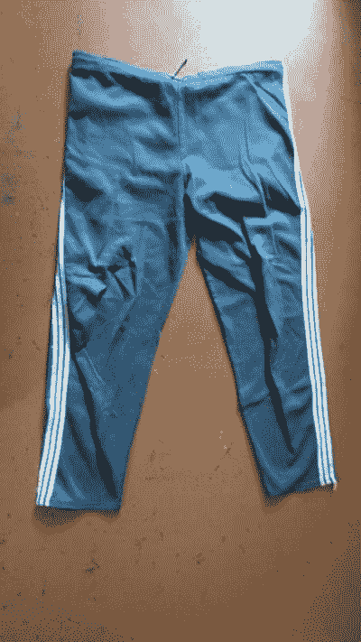

图 7.9 – load_img 函数的输出结果，一对裤子的图像

接下来，我们将图像表示为 NumPy 数组，因为这是模型期望的图像格式。我们还需要确保所有图像都以相同的尺寸传递给模型，因此我们将选择标准尺寸(299, 299, 3)，这意味着从上到下 299 像素，从左到右 299 像素，以及三个颜色通道，分别是红色、绿色和蓝色。每个像素将用每个颜色通道的 0-255 值表示三次。

现在，我们必须以(299,299)的目标大小加载前面的图像：

```py
img = load_img(path=path, target_size=(299,299))
img_input = np.array(img)
img_input.shape
(299, 299, 3)
```

让我们看看我们的新尺寸图像：

```py
img
```

输出如下：

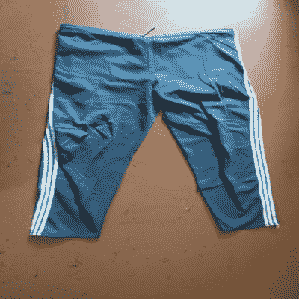

图 7.10 – 我们的一对裤子图像，已调整大小为 299x299 像素

现在我们已经确保了维度，我们将加载预训练的 Xception 模型并指定输入格式，这与之前指定图像的维度相同。一旦我们加载了模型，我们将对图像进行评分并检查预测：

```py
model = Xception(weights='imagenet', input_shape=(299,299,3))
```

模型期望图像列表以特定格式；因此，我们将传递之前的图像作为列表，并将其转换为 NumPy 数组。然后，我们将使用`preprocess_input`对图像进行预处理，并对其进行评分。预测将存储在`pred`中：

```py
img_preprocessed = preprocess_input(np.array([img_input]))
pred = model.predict(img_preprocessed)
pred.shape
1/1 [==============================] - 3s 3s/step
(1, 1000)
```

`preprocess_input`函数是必需的，因为它需要预处理模型所需的图像数据。由于 Xception 模型在训练时，输入值从 0-255 转换并缩放到-1 和 1 之间。这一点很重要，因为颜色尺度的分布可能会影响预测。想象一下，红色颜色尺度在 0-100 之间，而蓝色颜色尺度在 200-300 之间；这可能导致模型不稳定。因此，缩放很重要。如果没有正确的预处理，预测将没有意义。

接下来，我们将使用一个便捷函数来解码这些预测。由于 Xception 模型被训练来预测 1,000 个标签，因此模型将提供 1,000 个不同类别中前五个标签的概率。我们不相信目标标签包含服装示例，所以在接下来的几个步骤之后，我们将转向迁移学习。为了解码预测，我们将使用`decode_predictions`函数。`decode_predictions`是一个便捷函数，它以易于理解的方式提供预测：

```py
decode_predictions(pred)
[[('n03594734', 'jean', 0.651147),
  ('n04371430', 'swimming_trunks', 0.22369406),
  ('n03710637', 'maillot', 0.004711655),
  ('n04525038', 'velvet', 0.0038891942),
  ('n03595614', 'jersey', 0.003085624)]]
```

很明显，裤子的图像与`jean`标签最接近，然后是`swimming_trunks`标签，这是根据 Xception 模型中使用的标签。然而，在训练数据中，没有`jean`或`swimming_trunks`标签。接下来，我们将提取训练数据并确保在传递给训练之前对其进行预处理。

为了做到这一点，我们将使用迁移学习并利用整个训练数据。我们将使用`ImageDataGenerator`来帮助处理模型所需输入数据，然后创建训练和验证数据集。训练数据将包括 3,041 张图像，而验证数据将包括 341 张图像。对于预处理，我们将使用 150x150 像素而不是 299x299 像素，以减少训练时间：

```py
train_gen = ImageDataGenerator(preprocessing_function=preprocess_input)
```

接下来，我们将使用`flow_from_directory`属性来处理整个训练和验证数据集。我们将使用`seed=42`来确保数据被传递到网络中，它以相同的随机化方式传递，并且每个训练层的预测结果是可重复的。对于验证数据，我们将使用`shuffle=False`以确保在每一步训练中没有随机化，但数据是顺序传递的：

```py
train_ds = train_gen.flow_from_directory(directory='./clothing-dataset-small/train/', target_size=(150,150), batch_size=32, seed=42)
validation_ds = train_gen.flow_from_directory(directory="./clothing-dataset-small/validation/", target_size=(150,150), batch_size=32, shuffle=False)
Found 3081 images belonging to 10 classes.
Found 341 images belonging to 10 classes.
```

现在，我们可以查看我们数据集的目标类别：

```py
train_ds.class_indices
{'dress': 0,
 'hat': 1,
 'longsleeve': 2,
 'outwear': 3,
 'pants': 4,
 'shirt': 5,
 'shoes': 6,
 'shorts': 7,
 'skirt': 8,
 't-shirt': 9}
```

接下来，我们将应用迁移学习。为此，我们必须首先提取基础层——换句话说，我们必须提取 Xception 模型的卷积层并确保它被冻结。这将确保我们能够访问超过 100 万张图像的图像数据的特征图。为此，我们将使用`include_top=False`参数，这将忽略密集层并返回卷积神经网络的最底层。接下来，我们将构建一个定制的密集层，其中突出显示之前提到的 10 个类别标签，并为我们用例训练密集层：

```py
base_cnn_model = Xception(weights='imagenet', include_top=False, input_shape=(150,150,3))
base_cnn_model.trainable = False
```

接下来，我们将构建密集层的架构，并将其与基础层结合。首先，我们将定义输入标准，以便基础模型可以提供适合相同标准的向量。我们将使用(150,150,3)，这样模型可以更快地训练，因为更多的像素可能会减慢训练过程。接下来，我们将从基础层转换向量到二维数组。为此，我们将使用一种称为池化的方法，这有助于减少特征图的空间大小，但仍然保留关于基础层的关键信息。之后，我们将创建一个密集层，其中指定输出数量，在本例中为 10，并应用 softmax 激活来返回概率。

在这一点上，我们可以定义损失函数，使用学习率为 0.005 的 Adam 优化器，并选择精度作为指标：

```py
inputs = keras.Input(shape=(150,150,3))
base = base_cnn_model(inputs)
vectors = keras.layers.GlobalAveragePooling2D()(base)
inner = keras.layers.Dense(100, activation='relu')(vectors)
drop = keras.layers.Dropout(rate=0.2)(inner)
outputs = keras.layers.Dense(10, activation='softmax')(drop)
model = keras.Model(inputs, outputs)
learning_rate = 0.005
optimizer = keras.optimizers.Adam(learning_rate=learning_rate)
loss = keras.losses.CategoricalCrossentropy()
```

接下来，我们将使用优化器和损失函数来编译模型，以实现最佳精度：

```py
model.compile(optimizer=optimizer, loss=loss, metrics=["accuracy"])
```

现在，我们将使用服装数据集来训练网络：

```py
model.fit(train_ds, validation_data=validation_ds, epochs=10)
Epoch 1/10
97/97 [==============================] - 18s 156ms/step - loss: 1.1373 - accuracy: 0.6228 - val_loss: 0.7507 - val_accuracy: 0.7830
...
Epoch 10/10
97/97 [==============================] - 12s 118ms/step - loss: 0.1951 - accuracy: 0.9289 - val_loss: 0.7641 - val_accuracy: 0.7918
```

观察这些结果，很明显模型已经过拟合，因为模型在训练数据上达到了 92.7%的精度，而在验证数据上只有 81.52%的精度，在 10 个 epoch 结束时几乎相差 10-11%。

我们可以尝试使用不同的学习率来训练密集层，以获得一个更通用的模型。学习率控制我们希望模型从训练数据中学习多快，并调整其权重以适应数据。

低学习率就像以慢速观看视频，以确保覆盖大多数细节，而高学习率则像以较快的速度观看视频，可能会错过一些细节。优化的学习率对于成功的训练至关重要，但通常需要调整以在收敛速度和精度之间找到平衡。

另一种减少过拟合的方法是通过调整 dropout 率，这是一种正则化技术，其中随机省略了一定比例的数据。这两种调整都需要实验，并且更侧重于模型本身的方法。

采用以数据为中心的方法，我们希望测试更多的数据示例或更好的数据示例。我们需要那些模型不会试图记住特定像素的示例，这样如果它在第 130 个像素位置看到 120 个红色，它就开始相信这张图片是裤子。因此，为了确保模型具有良好的泛化能力，我们可以利用数据增强。

关于以数据为中心的人工智能，数据增强可以被视为一种通过将各种变换应用于现有数据来人为增加训练数据集大小和多样性的技术。这些变换可以包括旋转、缩放、裁剪、翻转、添加噪声等等，具体取决于增强的数据类型。

存在一些常见的增强技术，例如创建图像的不同角度，移动图像，放大和缩小图像，翻转图像，等等。然而，在应用增强技术之前，我们必须首先考虑数据将如何生成。例如，如果用户不会生成颠倒的图片，那么为了创建翻转的图片而增强图像可能只会增加噪声，而不是为模型提供良好的信号。对于以下示例，我们将应用缩放增强，其中图像将被稍微放大和缩小，一些偏移使得图像中的衣物会移向边缘，并应用垂直翻转，这样如果某些图像是使用镜子拍摄的，我们就可以为每个场景捕获额外的数据。我们将通过更新图像生成器函数，添加这些额外的参数，然后在最佳参数上训练模型来实现这一点。

我们将应用旋转范围为 10 度，剪切范围为 10 度，宽度和高度偏移范围为 0.2，缩放范围为 0.1，以及垂直翻转。为了实现这一点，我们将调整`ImageDataGenerator`函数，这样将在幕后创建更多训练数据的示例：

```py
train_gen = ImageDataGenerator(preprocessing_function=preprocess_input,
                               rotation_range=10,
                               shear_range=10,
                               width_shift_range=0.2,
                               height_shift_range=0.2,
                               zoom_range=0.1,
                               vertical_flip=True)
train_ds = train_gen.flow_from_directory(directory='./clothing-dataset-small/train/', target_size=(150,150), batch_size=32, seed=42)
val_gen = ImageDataGenerator(preprocessing_function=preprocess_input)
validation_ds = val_gen.flow_from_directory(directory="./clothing-dataset-small/validation/", target_size=(150,150), batch_size=32, shuffle=False)
Found 3081 images belonging to 10 classes.
Found 341 images belonging to 10 classes.
```

我们还将创建一个函数，该函数将接受学习率作为输入，并返回模型及其参数：

```py
def make_fashion_classification_model(learning_rate: float=0.1):
    """Function to create a dense custom model"""
    #### Base model ####
    inputs = keras.Input(shape=(150,150,3))
    base = base_cnn_model(inputs)
    vectors = keras.layers.GlobalAveragePooling2D()(base)
    #### Dense model ####
    outputs = keras.layers.Dense(10, activation='softmax')(vectors)
    model = keras.Model(inputs, outputs)
    #### Optimizing the model ####
    optimizer = keras.optimizers.Adam(learning_rate=learning_rate)
    loss = keras.losses.CategoricalCrossentropy()
    model.compile(optimizer=optimizer, loss=loss, metrics=["accuracy"])
    return model
```

接下来，我们将使用这个函数，并将`0.005`作为学习率传递，并添加 50 个 epoch，因为我们已经为增强生成了更多的数据：

```py
model = make_fashion_classification_model(learning_rate=0.005)
model_run = model.fit(train_ds, validation_data=validation_ds, epochs=50)
Epoch 1/50
97/97 [==============================] - 28s 266ms/step - loss: 1.5281 - accuracy: 0.4920 - val_loss: 0.9664 - val_accuracy: 0.6686
...
Epoch 32/50
97/97 [==============================] - 25s 253ms/step - loss: 0.7445 - accuracy: 0.7491 - val_loss: 0.6161 - val_accuracy: 0.8123
```

模型的训练准确率有所降低，但模型的泛化能力更强，并没有过拟合。此外，请注意，最佳验证准确率是在第 32 个 epoch 时达到的。然而，很难确定模型将在哪个 epoch 达到最佳准确率。

为了实现这一点，我们可以进一步利用模型检查点功能，以确保只有在一个给定 epoch 达到至少 78%的验证准确率的模型将被创建和保存，并且只有当之前的最佳准确率被超越时，才会创建新的模型。然后我们可以使用这些保存的模型来评分测试数据。

在下一步中，我们将添加一个 0.2 的 dropout 率和一个 50 的内层。我们将更新训练网络的函数并添加检查点功能。一旦创建检查点，我们将将其作为回调添加到`fit`函数中。

我们鼓励您在使用检查点以确保最佳准确率的同时，利用学习率、dropout 率和内部层进行超参数化。

首先，我们将定义一个函数，该函数接受三个输入 – 学习率、内部层和 dropout 率：

```py
def make_fashion_classification_model(learning_rate: float=0.001, inner_layer: int=50, drop_rate: float=0.2):
    """Function to create a dense custom model with learning rate, inner layer and dropout rate"""
    #### Base model ####
    inputs = keras.Input(shape=(150,150,3))
    base = base_cnn_model(inputs)
    vectors = keras.layers.GlobalAveragePooling2D()(base)
    #### Dense model layers ####
    inner = keras.layers.Dense(inner_layer, activation='relu')(vectors)
    drop = keras.layers.Dropout(rate=drop_rate)(inner)
    outputs = keras.layers.Dense(10, activation='softmax')(drop)
    model = keras.Model(inputs, outputs)
    #### Optimizing the model ####
    optimizer = keras.optimizers.Adam(learning_rate=learning_rate)
    loss = keras.losses.CategoricalCrossentropy()
    model.compile(optimizer=optimizer, loss=loss, metrics=["accuracy"])
    return model
```

接下来，我们将定义检查点。这是我们将保存所有模型的地方，这些模型在各个 epoch 中验证准确率达到了至少 78%。然后，我们将此检查点添加到拟合函数的回调中：

```py
checkpoint_model = keras.callbacks.ModelCheckpoint(
    filepath="xception_v1_{epoch:02d}_{val_accuracy:.4f}.h5",
    monitor="val_accuracy",
    save_best_only=True,
    initial_value_threshold=0.8,
    mode="max")
model = make_fashion_classification_model()
model.fit(train_ds, validation_data=validation_ds, epochs=50, callbacks=[checkpoint_model])
Epoch 1/50
97/97 [==============================] - 28s 266ms/step - loss: 1.4822 - accuracy: 0.5138 - val_loss: 0.8920 - val_accuracy: 0.7155
...
Epoch 37/50
97/97 [==============================] - 24s 250ms/step - loss: 0.5789 - accuracy: 0.7916 - val_loss: 0.5809 - val_accuracy: 0.8123
```

现在最佳模型已经训练并保存，我们将导入保存的模型，对所有数据进行评分，并计算测试准确率：

```py
model = keras.models.load_model('xception_v1_37_0.8123.h5')
test_gen = ImageDataGenerator(preprocessing_function=preprocess_input)
test_ds = test_gen.flow_from_directory(directory="./clothing-dataset-small/test/", target_size=(150,150), batch_size=32, shuffle=False, seed=42)
accuracy = model.evaluate(test_ds)[1]
print(f"accuracy on train data was 79.16, where as validation accuracy was 81.23, but test accuracy is {accuracy*100:.2f}")
Found 372 images belonging to 10 classes.
12/12 [==============================] - 2s 94ms/step - loss: 0.6317 - accuracy: 0.7715
accuracy on train data was 79.16, whereas validation accuracy was 81.23, but test accuracy is 77.15
```

我们用来预测测试数据的模型在训练中的准确率为 79.16%，在验证中的准确率为 81.23%。我们实现的测试准确率仅为 77.15%，这可以通过迭代改进 – 但超出了本例的范围 – 通过利用数据增强参数和模型中心参数的超参数调整，这在现实生活中是鼓励的。然而，由于计算和时间限制，这超出了本书的范围。

接下来，我们将提取目标标签并构建一个函数，以提供预测概率分数以及相关类别。首先，我们将加载图像并对其进行预处理，然后对其进行评分：

```py
labels = [i for i in train_ds.class_indices.keys()]
def preprocess_image(path: str, target_size: tuple):
    """Function to preprocess image"""
    img = load_img(path=path, target_size=target_size)
    img_input = np.array([np.array(img)])
    preprocessed_image = preprocess_input(img_input)
    return preprocessed_image
def decode_predictions(pred):
    """Function to decode prediction"""
    result = {c: format(float(p), '.8f') for c, p in zip(labels, pred)}
    final_prediction = sorted(result.items(), key=lambda x:x[1],  reverse=True)[0]
    return final_prediction
```

接下来，我们将提取一条随机裤子图像并通过模型进行预测：

```py
path = './clothing-dataset-small/train/pants/188eaa2d-1a69-49b1-a9fb-7b3789ac93b4.jpg'
load_img(path)
```

这将产生以下输出：

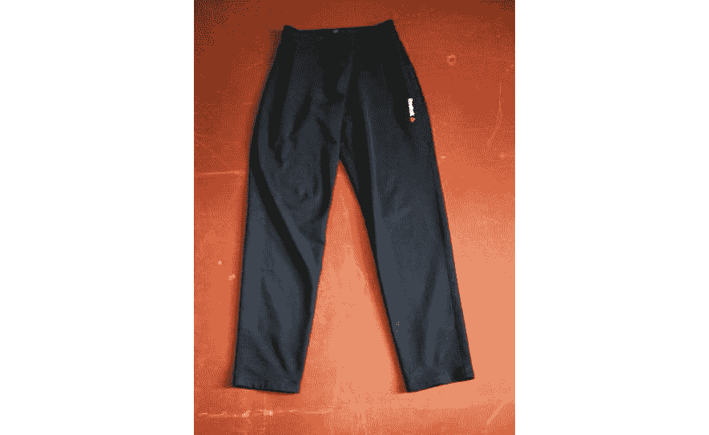

图 7.11 – 从服装数据集中随机选择的裤子对

接下来，我们将在评分之前加载和预处理图像。最后，我们将解码预测结果以提取最终的预测。为此，我们将利用我们之前创建的函数：

```py
preprocessed_image = preprocess_image(path=path, target_size=(150,150))
preds = model.predict(preprocessed_image)
results = decode_predictions(preds[0])
results
1/1 [==============================] - 0s 26ms/step
('pants', '0.99980551')
```

根据模型，该图像有 99%的概率被分类为裤子，这相当准确。

在本节中，我们通过数据增强的数据中心技术，展示了如何泛化模型。我们相信，通过迭代数据增强参数，我们可以进一步提高模型的质量。一旦参数已经调整，我们建议实践者结合以模型为中心的技术，如正则化、学习率、内部层和 dropout 率，以进一步调整和改进模型。

我们现在将转向探索另一个依赖于非结构化数据的话题：用于文本和自然语言处理的合成数据。

## 自然语言处理

合成文本数据通常用于增加与现实生活中观察到的类似语义意义的单词和句子的深度和广度。

用于创建自然语言处理合成数据的最常见的增强技术包括用同义词替换单词、随机打乱句子中单词的位置，以及在句子中插入或删除单词。

例如，句子“我喜欢喝茶”可以转换为“我非常享受喝茶”，而不会失去陈述的上下文意义。这是一个*同义词替换*的例子，其中“喜欢”被替换为“非常享受”，而“喝茶”被替换为“消费。”

*回译*是另一种 NLP 技术，它涉及将一个句子的语言翻译成另一种语言，然后再翻译回原始语言。通常，这将生成具有相似语义意义的略微不同的句子结构，这使得它成为对抗过拟合并增加训练数据量的绝佳方式。

我们将通过一个简单的例子来说明如何使用*Hugging Face Transformers*进行回译——具体来说，是*MarianMT*语言模型套件。MarianMT 模型最初由 Jörg Tiedemann 创建，使用 Marian C++库进行快速训练和翻译，但现在通过 Hugging Face 的 Python 库套件提供。

在撰写本文时，该资源提供了 1,440 个 transformer 编码器-解码器模型，每个模型有六个层。这些模型支持基于芬兰赫尔辛基大学语言技术研究组开发的*Helsinki-NLP*框架的各种语言对。

在这个例子中，我们想将以下三个句子从英语翻译成西班牙语，然后使用相同的技巧将西班牙语句子回译成英语：

+   那个男人怀疑地看着门

+   彼得认为他看起来非常酷

+   大多数人相当和善

目标是生成具有相同语义意义但措辞略有不同的句子，这样合成数据将为我们最终模型提供更多学习数据。

首先，我们将安装所需的 Python 库：

```py
pip install transformers sentencepiece
pip install mosestokenizer sacremoses
```

然后，我们将从`transformers`库中导入`MarianMTModel`和`MarianTokenizer`包，并将我们的输入文本字符串定义为`src_text`：

```py
from transformers import MarianMTModel, MarianTokenizer
src_text = ['The man glanced suspiciously at the door', 'Peter thought he looked very cool', 'Most individuals are rather nice']
```

现在，我们将使用`Helsinki-NLP/opus-mt-en-es`语言模型定义我们的`translator`模型，该模型将英语翻译成西班牙语。`MarianTokenizer`和`MarianMTModel`函数用于定义和执行我们的标记器和翻译模型。

最终输出存储为`trans_out`，然后用作我们回译模型的输入：

```py
translator = 'Helsinki-NLP/opus-mt-en-es'
tokenizer = MarianTokenizer.from_pretrained(translator)
model = MarianMTModel.from_pretrained(translator)
translated = model.generate(**tokenizer(src_text, return_tensors="pt", padding=True))
trans_out = [tokenizer.decode(t, skip_special_tokens=True) for t in translated]
```

在这个基本示例中，我们简单地反向重复相同的建模练习，以产生原始输入句子的略微修改版本。我们使用‘`Helsinki-NLP/opus-mt-es-en`’将它们回译成英语：

```py
back_translator = 'Helsinki-NLP/opus-mt-es-en'
tokenizer = MarianTokenizer.from_pretrained(back_translator)
model_es = MarianMTModel.from_pretrained(back_translator)
back_translated = model_es.generate(**tokenizer(trans_out, return_tensors="pt", padding=True))
[tokenizer.decode(t, skip_special_tokens=True) for t in back_translated]
```

下表显示了原始输入句子与模型的输出。生成的句子措辞略有不同，但总体上与原始句子具有相同的语义意义。为了将这些句子用于监督模型的训练数据集，它们必须继承其原始“父”句子的标签：

| **输入句子** | **回译** |
| --- | --- |
| 男人怀疑地看着门 | 男人怀疑地看着门 |
| 彼得认为他看起来很酷 | 彼得认为他看起来很棒 |
| 大多数人相当和善 | 大多数人相当和善 |

表 7.1 – 使用 Hugging Face Transformers 进行回译的示例

## 隐私保护

合成数据对于保护个人隐私和身份也非常有用。使用合成数据保护隐私的主要目的是在保持原始数据集的统计特性（接近）完整的同时，使数据集中的个人无法被识别。

由于合成数据允许在不透露私人或敏感信息的情况下共享信息，因此它是隐私保护的一个优秀选择。为了实现这一点，我们必须创建与原始数据相似但不包含任何可识别个人信息的数据。

使用合成数据允许组织在研究或其他目的下共享数据，而不损害个人的隐私。使用合成数据保护隐私的好处有很多——例如，你可以降低数据泄露的风险，因为数据中不包含任何个人或敏感信息。

随着全球数据隐私法规的日益增多，使用消费者数据进行分析时保护个人隐私已成为强制性的。合成数据可用于遵守隐私法规，例如欧盟的 GDPR 或美国的 HIPAA 隐私规则，这些规则为保护个人数据和防止未经同意共享设定了标准。

通常，合成数据是保护隐私的有用工具，因为它允许组织在不透露敏感或个人信息的情况下共享数据。它在管理机器学习中数据质量与个人隐私之间的权衡方面特别有用，使其成为以数据为中心的工具箱的组成部分。

例如，考虑一家银行，它希望使用敏感的客户数据进行分析活动，如客户流失建模、欺诈检测和信用评估。通常，使用客户数据进行这些活动会带来许多合规风险和必须管理的强制要求，以避免隐私泄露和监管机构的重罚。

通过拥有预先生成的合成数据集，业务各个部分的数据科学家可以快速且安全地构建模型，这些模型将产生与基于真实世界数据构建的模型相似的结果。通过使用*适当构建*的合成数据，组织避免了每次构建和投产新模型时都必须经历繁琐的合规和治理流程。

然而，这并不意味着使用隐私保护数据没有风险。例如，生成模型可能会过度拟合原始数据，并产生与原始数据过于接近的合成实例。

此外，尽管合成数据可能看起来是匿名的，但可能存在一些情况，复杂的黑客攻击可以揭示个人的身份。隐私保护合成数据的目标是限制这种情况发生的风险。

让我们探讨一些常见的隐私披露场景，以了解这些风险以及我们可能如何限制它们。

### 隐私披露的类型

为了进一步理解和欣赏合成数据在隐私保护方面的有用性，让我们看看可能发生的三种不同类型的隐私披露。这不是潜在披露事件的详尽列表，但它确实有助于理解使用合成数据进行此目的的潜力和局限性。

**直接身份披露**是最明显的隐私披露类型。这是指外部对手，如黑客，通过将个人的身份与私人信息的记录相匹配来获取信息。这种例子可以是将一个人的身份与医疗记录相匹配。

**推断性身份披露**是一种数据隐私泄露形式，其中某些个人信息可以从公开可用的数据中推导出来，而不需要明确揭示个人的身份。这种隐私泄露发生在攻击者通过分析数据集中的模式和相关性，使用统计分析推断有关个人的特征时。例如，攻击者可能能够通过分析特定特征与相应性别之间的模式来确定个人的性别。

按设计，完全合成数据使得直接身份披露几乎不可能。然而，攻击者可能通过分析合成数据集来推断有关特定人群的信息，尽管他们无法识别数据集中的个人。

例如，假设原始数据集包含敏感的医疗信息。该数据的合成版本保留了与原始数据相同的统计特性。使用基本的统计方法或更高级的机器学习模型，对手可以识别具有相似特征的人群，并推断他们患某种疾病的风险。然后，对手可以利用这些知识推断具有相同特征的个人风险，而无需进行任何直接的身份披露。

另一个推断性披露的例子是，攻击者可以根据某些行为，如购物习惯或信用卡使用模式，推断某人的财务状况或收入水平。此外，攻击者可能通过分析医疗保险索赔和其他相关记录来确定某人的医疗史。这可能导致严重后果，如歧视或利用敏感信息。因此，组织必须采取适当的措施来保护其数据免受推断性披露，以确保其不会被用于恶意目的。

**成员推理攻击**与推断性披露类似，但并不完全相同。它们不是基于具有相似特征的人群来推断个人的个人信息，而是旨在推断原始数据集中是否存在某个个体被用于创建合成数据集。这带来了巨大的隐私风险，例如，可能揭示某人患有某种疾病，而他们从未公开过他们的医疗信息。由于原始数据集的统计属性已被保留，因此通过合成数据预防这些攻击是困难的。

换句话说，合成数据是直接身份披露的有力武器，但并不完全消除身份披露的风险。让我们来看看为什么合成数据仍然优于传统的身份掩码技术。

### 我们为什么需要合成数据来保护隐私

传统数据去标识化技术依赖于两种主要方法：

+   **匿名化**：这是去标识化的最简单形式，涉及删除包含直接标识符（客户 ID、姓名、地址）和准标识符（邮政编码、出生日期）以及其他敏感信息的列，这些信息可能被哈希处理、加密或屏蔽。随后，使用诸如 k-匿名性、l-多样性和 t-接近性等指标来验证给定数据集中隐私保护的水平。

+   **差分隐私**：差分隐私算法使用高斯和拉普拉斯等统计分布，向数据集中的标识特征添加随机生成的噪声。因此，个人的隐私将得到保护，因为标识信息被隐藏在噪声之后。

尽管这些技术降低了个人直接被识别的风险，但它们并不一定足以完全消除这种风险。

Rocher 等人于 2019 年进行的一项研究表明，基于马萨诸塞州人口样本的大小，99.98%的美国人可以通过不超过 15 个人口统计属性被重新识别。作者得出结论：“*高度样本化的匿名化数据集不太可能满足 GDPR 设定的现代匿名化标准，并严重挑战了去标识化* *发布并忘记模型*的技术和法律充分性。”

另一项研究，由 Sweeney 在 2000 年进行，发现美国 87%的人口报告了基于 ZIP 代码、性别和出生日期的特征，这些特征可能使他们仅凭这些信息就能被识别。美国 53%的人口仅凭位置、性别和出生日期即可识别，其中“位置”是指个人居住的城市、镇或市镇。18%的人口可以根据他们的县、性别和出生日期的组合来识别。

换句话说，仅根据少数准标识符就有可能识别出独特的个体。通过使用合成的数据，我们可以从数据集中移除这些个体组合，同时保留数据的整体统计特性。

让我们来探讨一下这是如何实现的。

## 生成用于隐私保护的合成数据

当我们创建用于隐私保护的合成数据时，我们有三个目标：

+   通过在合成数据集中反映其统计特性来保持原始数据的效用。

+   确保数据结构与原始数据相同。这意味着我们可以在合成数据上使用与原始数据相同的代码和工具，而无需进行任何更改。

+   使用隐私保护合成数据时，不应能够识别出原始数据集中哪些现实世界个体参与了其中。

值得注意的是，创建合成数据的方法有很多种。部分合成数据只是用合成数据替换了部分数据，而完全合成信息则是从头开始创建，没有任何原始数据。

根据采用的方法，完全合成信息可以在不牺牲太多可用性和便利性的情况下，提供更强的保障以防止个人身份泄露。

通过**合成数据宝库**（**SDV**）项目创建的工具开始练习合成数据生成是一个很好的方法。该项目最初由麻省理工学院的 Data to AI 实验室在 2016 年成立，是一个综合性的 Python 库生态系统，允许用户学习单表、多表和时间序列数据集，这些数据集随后可以用作生成合成数据的基础，这些合成数据能够复制原始数据的格式和统计特性。

多亏了这个项目，在训练机器学习模型时，可以轻松地补充、增强，甚至在某些情况下用合成数据替换真实数据。此外，它还使得机器学习模型或其他数据依赖型软件系统可以在不承担分享实际数据带来的风险的情况下进行测试。

SDV 套件由几个基于概率图模型和深度学习的技术组成。它们用于生成分层生成模型和递归采样算法，这些算法能够生成各种数据结构的合成版本。

我们将使用 SDV 套件中的两种不同技术 – `GaussianCopula` 和 `CopulaGAN` – 来说明如何为隐私保护目的生成合成数据。然后，我们将简要介绍如何使用指标和图表来衡量 *质量* 和 *得分*。

### GaussianCopula

Copula 是一种用于测量随机变量之间依赖性的工具。`GaussianCopula` 是多个（即多元）正态分布数据片段的集合。作为一个整体，copula 允许我们通过展示集合中一个元素的变化如何影响其他元素来描述这些独立正态分布之间的关系 – 即它们的 *边缘分布*。这一点很重要，因为这项练习的目的是增强任何独特的变量组合，同时保留数据集的整体统计特性。

### GaussianCopula Python 程序示例

现在，我们将编写一个示例程序来展示它是如何工作的。它将执行以下操作：

1.  加载一个样本数据集，然后计算 `GaussianCopula` 模型。

1.  使用 `GaussianCopula` 模型生成一些样本数据。

1.  可视化输出及其统计特性，以了解我们的模型表现如何。

首先，我们必须安装必要的 Python 包 – `sdv` 和 `pandas`：

```py
pip install sdv
pip install pandas
```

对于这项练习，我们将使用公开可用的 *Adult* 数据集，也称为 *Census Income* 数据集。要开始，请从 [`archive.ics.uci.edu/ml/machine-learning-databases/adult/adult.data`](http://ml/machine-learning-databases/adult/adult.data) 下载它。

我们将使用标准的 `pandas` 函数从前面的 URL 创建一个 DataFrame，`df`：

```py
names = ['age', 'workclass', 'fnlwgt', 'education', 'education-num',
                 'marital-status', 'occupation', 'relationship', 'race', 'sex',
                 'capital-gain', 'capital-loss', 'hours-per-week',
                 'native-country', 'income']
url = 'https://archive.ics.uci.edu/ml/machine-learning-databases/adult/adult.data'
df = pd.read_csv(url, header=None, names=names, na_values=['?', ' ?'])
```

这将输出以下 DataFrame：

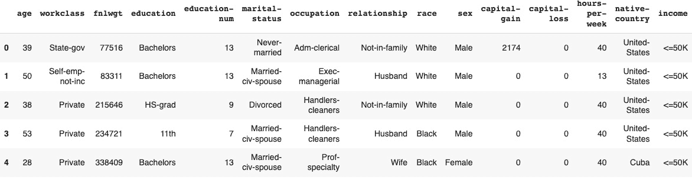

图 7.12 – Adult 数据集的前五行 – 我们用于生成合成数据的输入数据集

我们的 DataFrame 创建完成后，我们将导入 `SingleTableMetadata` 类，这是一个提供管理单个数据表元数据的方法的类，例如列的名称和类型、列之间的关系等。SDV 的建模套件需要这个元数据对象作为输入。

然后，我们将使用 `detect_from_dataframe()` 方法分析 pandas `df` DataFrame，并自动检测和设置表的元数据。

最后，我们将从 SDV 加载适当的 API 和对象，并实例化 `GaussianCopula` 模型。然后，我们将使用 `fit()` 方法生成模型：

```py
from sdv.metadata import SingleTableMetadata
metadata = SingleTableMetadata()
metadata.detect_from_dataframe(df)
from sdv.single_table import GaussianCopulaSynthesizer
gc_model = GaussianCopulaSynthesizer(metadata)
gc_model.fit(df)
```

通常，我们会从输入数据集中抽取一个比完整输入数据集小的样本来生成模型，但在这个案例中，我们将使用整个输入数据，因为它并不太大。

现在，让我们生成合成数据集：

```py
gc_synthetic = gc_model.sample(num_rows=df.shape[0] )
```

一旦我们生成了合成数据，我们可以通过将其与真实数据的属性进行比较来评估其质量。这可以通过使用几个质量指标来完成。

让我们继续进行。

### 计算质量分数

为了衡量合成数据的质量，我们可以使用*SDV*包中的各种*分数*指标。分数的定义和解释取决于我们查看的指标。

让我们看看一些相关的指标，用于衡量原始和合成数据之间的统计相似性，以及推断攻击成功的风险。分数介于 0 到 1 之间。0 或 1 的解释取决于你使用的指标：

+   `BoundaryAdherence`：这描述了合成数据是否位于真实数据某一列的最大和最小值范围内。1 表示是，0 表示否。

+   `StatisticSimilarity`：这比较了真实和合成数据中某一列的平均值、中位数和标准差。

+   `CategoricalCAP`：这是使用推断攻击泄露私人信息的风险——也就是说，黑客知道一些真实数据并能将其与合成数据匹配起来。分数为 1 表示风险很高。

+   `Data Likelihood`：这计算数据与原始数据中的观察结果匹配的可能性。这与`Detection`指标类似，该指标询问机器学习模型能否区分原始数据集和伪造的数据集。

+   `KSComplement`：这使用**Kolmogorov-Smirnov**（**K-S**）测试显示真实和合成数据的列形状是否相同。K-S 测试衡量两个数据集的**累积分布函数**（**CDF**）之间的最大距离。然而，它使用其补数（1 - KS 统计量）。

+   `MissingValueSimilarity`：这衡量真实和合成数据集中缺失数据的比例。

显示所有这些指标的代码几乎相同。只需调用适当的包，然后运行`compute`方法：

```py
from sdmetrics.single_column import CategoryCoverage
CategoryCoverage.compute(
    real_data=df['workclass'],
    synthetic_data=synthetic['workclass']
)
```

这里是`MissingValueSimilarity`的一个示例：

```py
from sdmetrics.single_column import MissingValueSimilarity
MissingValueSimilarity.compute(
    real_data=df['marital-status'],
    synthetic_data=synthetic['marital-status']
)
```

输出分数等于 1.0，这意味着模型已成功匹配合成数据集中缺失值的比例。

### 量化并可视化数据质量

我们还希望量化并可视化我们的合成数据与原始数据集相比的质量。为此，我们将使用 SDV 库中的*诊断*和*质量*报告。

诊断报告应始终产生 100%的分数，这告诉我们主键是唯一的且非空的，合成数据中的连续值遵循原始数据中的最小/最大范围，离散值与真实和合成数据中的相同类别对齐，并且列名相同：

```py
from sdv.evaluation.single_table import run_diagnostic
diagnostic = run_diagnostic(
    real_data=df,
    synthetic_data=gc_synthetic,
    metadata=metadata
)
```

这里是我们的输出：

```py
Overall Score: 100.0%
Properties:
- Data Validity: 100.0%
- Data Structure: 100.0%
```

SDV 质量报告评估你的合成数据捕捉我们原始真实数据的数学特性的程度。它是通过一系列衡量两个数据集之间*保真度*的各个方面来做到这一点的。**数据保真度**指的是数据集在表示其源特征方面的准确性。

报告提供了结果的概述，以及每个指标的详细可视化说明，以便您可以快速了解合成数据的优缺点。通过了解您的合成数据如何捕捉真实数据的数学属性，您可以在需要时采取措施来改进它。

SDMetrics 质量报告是一个非常有价值的工具，可以帮助您确保您的合成数据尽可能准确和可靠。以下是我们可以如何使用它：

```py
from sdv.evaluation.single_table import evaluate_quality
quality_report = evaluate_quality(
    real_data=df,
    synthetic_data=gc_synthetic,
    metadata=metadata
)
```

上述代码生成一个包含各种指标和可视化的质量报告，显示了原始数据和合成数据之间的整体相似性：

```py
Overall Score: 84.6%
Properties:
- Column Shapes: 87.57%
- Column Pair Trends: 81.63%
```

这里有一些重要的指标需要了解：

+   `列形状`：一列的形状告诉我们数据是如何分布的。得分越高，表示实际数据和合成数据越相似。为每一列计算一个单独的列形状得分，但最终得分是所有列的平均值。

+   `列对趋势`：两个列之间的相关性表明它们的趋势如何相互比较；得分越高，这些趋势越相似。为数据中的每一对列生成一个得分，而最终得分是所有列的平均值。这是一个重要的得分，告诉我们我们的合成数据是否捕捉到了原始数据集中变量之间的关系。

我们还可以使用`get_visualization`命令来可视化这些指标维度：

```py
fig = quality_report.get_visualization(property_name='Column Pair Trends')
fig.show()
```

这将生成以下图表：

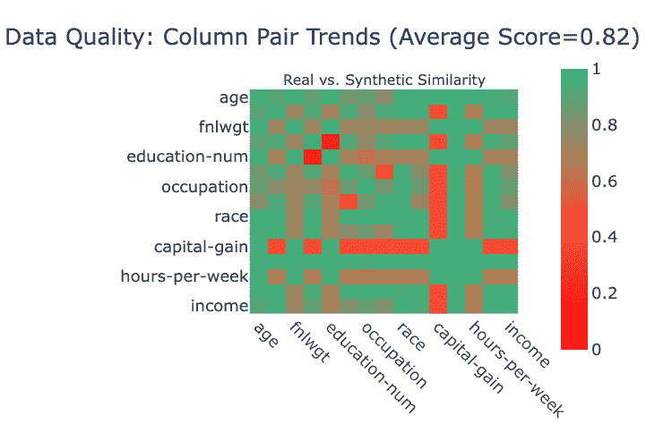

图 7.13 – 比较原始和合成数据集列对趋势的相关矩阵

如您所见，大多数列对具有很高的相似度得分，但“资本收益”列却相距甚远。我们可以使用以下代码来并排可视化实际和合成的“资本收益”列分布：

```py
from sdv.evaluation.single_table import get_column_plot
fig = get_column_plot(
    real_data=df,
    synthetic_data=gc_synthetic,
    metadata=metadata,
    column_name='capital-gain'
)
fig.show()
```

输出如下生成：

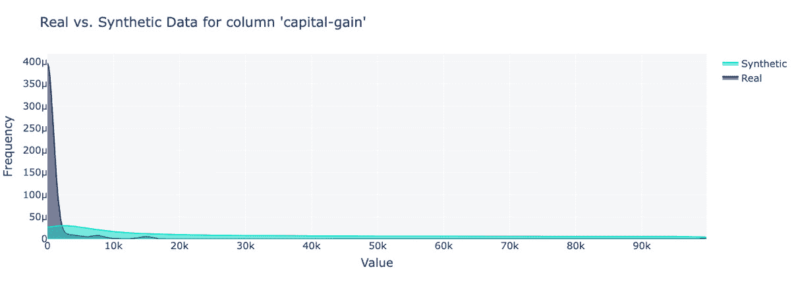

图 7.14 – 实际和合成资本收益列分布的比较。高斯 Copula 模型在匹配分布方面做得并不好

在这种情况下，我们会测试各种列分布函数，以找到更适合这个特定列的匹配。在这个例子中，我们使用了`GaussianCopula`函数来创建合成数据集。然而，SDV 库包含其他几个可能对您的原始数据集特征有用的分布。让我们探索如何更改默认分布。

### 列分布函数的变化

`GaussianCopula`函数确定哪个统计分布最能描述每个 Copula，但它并不总是正确。幸运的是，我们可以覆盖预选择并选择我们首选的分布。

我们有以下选择：

+   **高斯（正态）分布**：如果你的数据是连续的并且围绕均值对称分布，请使用此分布。它通常用于自然发生的数据，例如人口的高度或体重。

+   **Gamma 分布**：用于仅正数的偏斜数据。它通常用于等待时间或服务时间等。

+   **Beta 分布**：用于介于 0 和 1 之间的变量，例如比例或概率。

+   **学生 t 分布**：这与高斯分布类似，但尾部更重。当样本量小或标准差未知时，通常使用此分布。

+   **高斯核密度估计（KDE）**：用于非参数数据 – 即当你不知道或不想假设特定分布时。KDE 使用数据本身来估计其分布。

+   **截断高斯分布**：当你的数据遵循高斯分布但被限制在特定范围内时，请使用此分布。

首先，这是如何显示它计算出的分布的方法：

```py
gc_model.get_learned_distributions()
```

此语句生成一个详细列出了数据集中所有列的列表。而不是在这里显示输出，模型默认为所有列使用 Beta 分布。

要更改给定列的分布函数，只需再次创建一个模型，但这次明确地将特定分布应用于该列。在这种情况下，我们将对`capital-gain`列应用伽马分布：

```py
gc_model2 = GaussianCopulaSynthesizer(
    metadata,
    numerical_distributions={
        'capital-gain': 'gamma',
    })
gc_model2.fit(df)
```

结果输出是一个新的合成数据集，其`capital-gain`列的分布与真实数据非常接近：

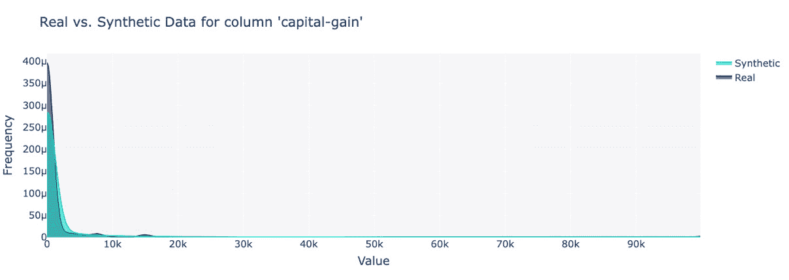

图 7.15 – 对资本收益列的新比较。在此列上使用伽马分布提高了合成数据和原始数据之间的相似性

SDV 库中另一个有用的包是`CopulaGAN`。此算法是`GaussianCopula`和`CTGAN`算法的结合。让我们比较`CopulaGAN`和`GaussianCopula`在*Adult*数据集上的性能。

### CopulaGAN 代码示例

`CopulaGAN`是`GaussianCopula`的一种变体，可以使用简化的 GAN 模型产生更好的结果。我们将在本节中比较这两个模型，但首先，这是使用相同的输入数据集和元数据对象生成`CopulaGAN`的代码：

```py
from sdv.single_table import CopulaGANSynthesizer
cg_model = CopulaGANSynthesizer(metadata)
cg_model.fit(df)
```

### 从 CopulaGAN 测量数据质量

现在，让我们看看关于`CopulaGAN`模型的数据质量，重复使用我们在`GaussianCopula`中使用的某些技术：

```py
quality_report = evaluate_quality(
    real_data=df,
    synthetic_data=cg_synthetic,
    metadata=metadata
)
Overall Score: 87.39%
Properties:
- Column Shapes: 91.75%
- Column Pair Trends: 83.04%
```

*图 7.16*提供了原始和合成数据集列对趋势的视觉表示：

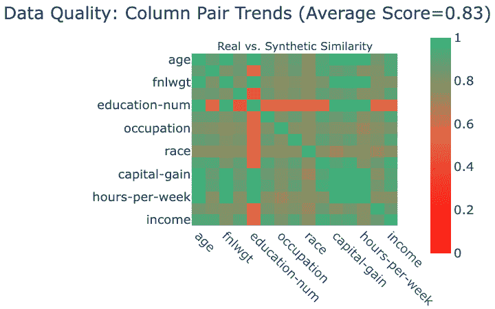

图 7.16 – 使用 CopulaGAN 对 Adult 数据集的列对趋势

### 理解 GaussianCopula 和 CopulaGAN 之间的区别

`CopulaGAN` 是一种混合 AI 模型，它结合了高斯 Copula 的人性化易用性和 GANs 的鲁棒准确性。

GAN 是一种深度学习算法。如果您与神经网络合作过，您知道它们是一种黑盒，这意味着网络中节点的系数是函数而不是数字。与多项式或线性模型相比，它们很难解释或理解。

`GaussianCopula` 更容易解释。它通过尝试不同的已知统计分布（正态分布、威布尔分布等），这对于已知或容易观察到的分布非常有用。然后，对于每一列，它选择最接近的一个。

SDV 项目背后的团队开发了 `CopulaGAN` 以获得两者的最佳效果：一个更准确的模型，同时仍然可解释。

下表比较了前例中我们两个模型的结果。`CopulaGAN` 由于能够更好地匹配列形状，因此实现了更高的整体质量评分：

|  | **高斯 Copula** | **CopulaGAN** |
| --- | --- | --- |
| **整体质量评分** | 84.6% | 87.39% |
| **列形状** | 87.57% | 91.75% |
| **列对趋势** | 81.63% | 83.04% |

表 7.2 – GaussianCopula 和 CopulaGAN 算法在 Adult 数据集上的数据质量比较

当然，质量是一个高度复杂的话题，我们的例子在这方面并不全面。您需要查看所有列和所有不同类型的评分，以验证合成数据的准确性。换句话说，如果没有对数据集中的变量进行更深入的审查，就不能断定`CopulaGAN`在所有情况下都更准确。这在处理高风险数据集和用例时尤为重要。

另一个需要考虑的额外指标是运行速度。据我们所知，当我们编写这个例子时，`CopulaGAN` 需要 1 小时才能完成，而 `GaussianCopula` 需要 15 秒才能完成。

### 验证我们新数据集的隐私性

现在我们已经为我们用例构建了一个合成数据集，我们需要确保我们已经阻止了从原始数据集中重新识别个人的能力。

要了解个人可以被重新识别的可能性，我们需要一个准确衡量原始和合成记录之间差异或“距离”的度量。两者之间的距离越远，它们被识别为同一实体的可能性就越小。如果我们讨论的是表格形式的个人信息，我们需要一种方法来衡量定性和定量属性之间的距离。

为了准确测量包含定性和定量信息的数据集中两行之间的接近程度，我们可以利用一个称为 Gower 距离的相似系数。

Gower 距离是一种独特的距离度量，与距离度量不同。它在计算具有数值和分类值的两个实体之间的差异方面脱颖而出。这很重要，因为许多常见的聚类算法，如 K-means 聚类，只有在所有变量都是数值时才工作。

Gower 距离返回一个介于 0（表示相同的观测值）和 1（表示它们处于最大距离）之间的相似系数。

假设我们在原始（*o*）和合成（*s*）数据集中有一组*p*个特征：

+   对于有序数，一个特征到另一个特征的距离只是它们差异的绝对值除以该变量的范围。我们除以范围以归一化数据，这样大数就不会比小数得到更大的权重。

+   将分类变量转换为数字，以便我们可以进行数学运算。公式很简单 – 如果这些值相同，它们的距离是 0；否则，它是 1。

Gower 距离是距离的总和除以特征的数量 – 项的平均值。由于我们把这些差异除以特征的数量，所以这相当于说 Gower 距离是平均距离。

然后，我们为**接近度**下定义，并称之为**最近记录的距离**。对于*s*中的每个元素，*o*中最接近的行是具有最小 Gower 距离的行。距离为 0 表示两行数据相同，而距离为 1 表示在所使用的观测值中，两行尽可能不同。

让我们练习使用`Gower` Python 包应用 Gower 距离。

### Gower 距离 Python 示例

在我们的 Gower 距离实践示例中，我们将使用*Adult*数据集，并将`CopulaGAN`生成的合成输出与原始数据进行比较。我们建议使用*Adult*数据集的小子集（例如，1,000 行）进行练习，因为 Gower 矩阵的计算在较大的数据集上可能需要很长时间。

首先，我们将根据现有的`df` DataFrame 中的前 1,000 行创建我们的模型 DataFrame，该 DataFrame 包含完整的*Adult*数据集。然后，我们将在这个数据集上拟合一个`GaussianCopula`模型，并生成一个新的合成数据集，称为`synthetic`：

```py
new_df = df.head(1000)
model = GaussianCopulaSynthesizer(metadata)
model.fit(new_df)
synthetic = model.sample(num_rows=df.shape[0] )
```

接下来，我们将安装`Gower`包并计算两个数据集之间的 Gower 距离矩阵：

```py
pip install gower
import gower
gowerMatrix=gower.gower_matrix(new_df, synthetic)
print(gowerMatrix)
```

这将生成类似以下的结果，其中计算了数据集中每行之间的距离：

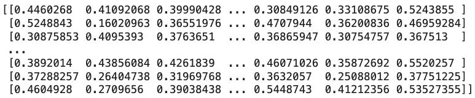

图 7.17 – 结果的 gowerMatrix

现在，我们将使用`gower_topn()`函数来找到最接近的*n*（在这种情况下，10）行。

为了确保合成数据集通过我们的测试，我们必须确保其没有任何值等于 0；否则，这表明合成数据中的某些行与原始数据中的行相似。一般来说，我们希望最高值与 0 的距离足够远，这样可以降低重新识别的风险：

```py
gower.gower_topn(df.iloc[:,], synthetic.iloc[:,], n = 10)
```

结果是前 10 个最近行及其 Gower 距离的索引。在这种情况下，我们数据集中两行之间的最小距离是 0.02205，这意味着我们的合成数据集在单个行级别上与原始数据集差异不足：

```py
{'index': array([26320, 29200, 18735, 24149, 18316, 22925,  4836, 15360, 42, 3523]),'values': array([0.02205753, 0.02578343, 0.03649067, 0.0374441 , 0.03785798, 0.04503146, 0.06345809, 0.08126822, 0.08237292, 0.08368524], dtype=float32)}
```

在这种情况下，我们需要做更多的工作来减少集合之间的相似性。以下是一些你可以用来实现这一目标的技巧：

+   在 SDV 目录中测试`GaussianCopula`或其他合成器，例如 CTGAN 或`CopulaGAN`。

+   **添加噪声**：你可以在合成数据中添加随机噪声。这将使合成数据与原始数据相比更加“独特”。

+   **执行特征转换**：将某种类型的转换（例如，对数、平方根、指数等）应用于合成数据集中的特征。

+   **执行数据增强**：生成新的合成数据点，这些数据点不是真实数据的直接副本。你可以通过使用**合成少数过采样技术**（**SMOTE**）或**自适应合成采样**（**ADASYN**）等技术来实现，这两者我们将在本章后面讨论。

记住，虽然你的目标是减少相似性，但你同样希望合成数据是有用且能代表真实数据的。如果你使合成数据过于不同，它可能无法达到预期的目的。

作为旁注，Gower 距离也可以用来找到彼此非常相似的数据行，这在创建类似受众、聚类或识别风险群体等任务中很有用。

例如，假设你刚刚对一组客户进行了一次非常成功的电子邮件营销活动，并且你希望将活动扩展到看起来像原始目标组中的客户。

要这样做，只需计算原始目标组中的客户与整个客户群其他客户的 Gower 距离，并根据最低的 Gower 距离选择一个目标组。

## 使用合成数据提高模型性能

在*第五章**数据清洗技巧*和*第六章**机器学习中程序化标注技巧*中，我们讨论了通过提高数据质量来提高模型性能。然而，有时提高数据质量可能不足以解决问题，尤其是在数据集较小的情况下。在这种情况下，我们可以利用生成合成数据来提高模型性能。

正如我们在本章前面所讨论的，合成数据可以帮助生成更多的训练示例，并通过提供更多不同变异和数据分布的示例来泛化模型的性能。这两种用途都可以使模型更稳健，并减少模型对训练数据的过拟合风险。

在不平衡数据集中，模型会偏向多数类，因为一个类别的示例比另一个类别的多。这是贷款预测数据集的问题，其中 30% 的数据属于少数类。

在本节中，我们将介绍为少数类生成合成数据，以便模型可以进一步泛化，并且模型性能指标可以提升。我们将继续使用决策树模型，并使用合成数据生成来进一步提高数据的信号强度。我们将使用 Python 的 `imblearn` 库来生成合成数据。

让我们导入库和两种过采样方法，`SMOTE` 和 `ADASYN`，以过采样少数类。我们还将利用 `Counter` 方法来统计在合成数据生成前后的数据样本：

```py
import imblearn
from imblearn.over_sampling import SMOTE, ADASYN
from collections import Counter
print(imblearn.__version__)
0.10.1
```

SMOTE 和 ADASYN 算法都用于生成合成数据。然而，ADASYN 更稳健，因为它考虑了点的密度来生成合成数据。SMOTE 可能会在少数类周围生成合成数据，但它这样做是均匀的，不考虑数据点的稀有程度。

SMOTE 通过随机选择少数类样本对并围绕现有样本插值新样本来创建合成样本。这种技术进一步扩展到空间中，以增加少数类样本的数量。然而，由于样本是随机选择的，因此没有对稀有样本点进行加权。

另一方面，ADASYN 通过计算少数类样本的密度分布来考虑特征空间中的稀有数据点。它在特征空间密度低的区域生成合成样本，以确保在数据集最需要的地方生成合成样本以平衡数据集。ADASYN 使用 k 近邻算法来估计少数类样本的密度分布。对于每个少数类样本，ADASYN 根据属于少数类的 k 近邻点的数量来计算密度。k 的值是一个用户定义的参数，通常设置为较小的值，如 5 到 10。密度是 k 个最近点平均距离。平均距离越高，密度越低，反之亦然。

我们遍历算法参数的不同阈值，例如最近邻的数量和数据过采样的百分比。这有助于我们找到最佳参数，以生成最佳样本数量，从而使测试 ROC 和测试准确率得到最大提升。然后，我们将这些结果组合到一个 DataFrame 中，并选择最佳参数。这样做是为了衡量使用合成数据生成技术的模型性能。

对于我们的示例，我们只会使用 ADASYN，但我们鼓励你尝试不同的技术，包括 SMOTE，来解决当前的问题：

```py
results = []
over_sampling = [0.65,0.7, 0.75, 0.8, 'auto']
n_neighbours = [1,3,5,7,9,10]
for os in over_sampling:
    for k in n_neighbours:
        oversample = ADASYN(random_state=1, sampling_strategy=os, n_neighbors=k)
        counter = Counter(y_train)
        print(f"data size before applying smote technique is {counter}")
        X_train_synthetic, y_train_synthetic = oversample.fit_resample(X_train_transformed, y_train)
        counter = Counter(y_train_synthetic)
        print(f"data size after applying smote technique is {counter}")
        model, test_predictions, train_roc, test_roc, train_acc, test_acc = train_custom_classifier(
        X_train=X_train_synthetic,
        y_train=y_train_synthetic,
        X_test=X_test_transformed,
        y_test=y_test,
        clf=d_clf,
        params=d_param_grid)
        results.append((os, k, train_roc, test_roc, train_acc, test_acc))
synthetic_df = pd.DataFrame(columns=['os_strategy', "n_neighbours", "train_roc", "test_roc", "train_acc", "test_acc"], data=results)
```

接下来，我们必须生成一个包含我们生成的模型参数组合和模型性能指标的 DataFrame，并按测试准确率对其进行排序。DataFrame 表明，对于少数派到多数派的类别，采用 75%的过采样策略，以及 7 个最近邻值，将提供最佳准确率和 ROC 分数：


图 7.18 – 输出 DataFrame

现在，我们必须应用我们最高效的过采样策略的参数，并重新训练决策树模型：

```py
counter = Counter(y_train)
print(f"data size before applying smote technique {tech_name} is {counter}")
# transform the dataset
oversample = ADASYN(random_state=1, n_neighbors=7, sampling_strategy=0.75)
X_train_synthetic, y_train_synthetic = oversample.fit_resample(X_train_transformed, y_train)
counter = Counter(y_train_synthetic)
print(f"data size after applying smote technique {tech_name} is {counter}")
model, test_predictions, train_roc, test_roc, train_acc, test_acc = train_custom_classifier(
X_train=X_train_synthetic,
y_train=y_train_synthetic,
X_test=X_test_transformed,
y_test=y_test,
clf=d_clf,
params=d_param_grid)
data size before applying smote technique adasyn is Counter({1: 379, 0: 173})
data size after applying smote technique adasyn is Counter({1: 379, 0: 321})
Decision tree optimised
Getting the best params which are {'class_weight': 'balanced', 'criterion': 'entropy', 'max_depth': 6, 'max_features': 'sqrt', 'min_samples_leaf': 3, 'min_samples_split': 30, 'random_state': 1}
Training roc is 0.8816528164788466, and testing roc is 0.8629130966952264
             training accuracy is 0.8371428571428572, testing_acc as 0.8387096774193549
```

通过合成数据生成，ADASYN 将少数派类别的样本数量从 173 增加到 321，将测试准确率提升到 83.8%。这几乎提高了 2%的准确率。ROC 分数也提升到 86.2%，进一步增加了 4.4%。

这些结果表明，合成数据生成可以在模型性能上提供显著的提升，即使是对于小数据集也是如此。然而，重要的是要注意，这并不总是如此，特别是如果错误分析表明添加新数据不会提高模型性能的话。在这种情况下，你可能会在转向合成数据生成之前，收集更多数据或特征，甚至进行特征工程。

## 你应该在什么情况下使用合成数据？

到目前为止，我们已经确定合成数据可以用于多个目的，但你是如何决定是否在你的项目中使用合成数据的呢？

对于寻求通过创新或非常规方法在竞争对手中取得优势的企业，合成数据在实验和现实之间提供了一个可访问的中间地带。对于想要从其庞大的人口数据存储中学习的政府机构，合成数据允许分析高度敏感的数据集，而不会损害个人隐私。

实验和探索你数据（合成或真实）的边界可能非常有价值，但引入合成数据的收益应该始终与使用相同数据进行有害预测的成本和风险进行评估。

核心问题是，“*实验的可接受成本是什么？*”，尤其是如果它包括人类附带损害或声誉或财务损失的话。

在我们看来，当获取真实世界数据可能困难、昂贵或不道德时，应该使用合成数据。合成数据最常见和实用的用例是保护个人隐私，以及创建在传统测试环境中非常困难或不可能进行的模拟。对于这些用例，使用合成数据的益处更有可能超过风险，但这并不是保证，所以请确保适当管理风险。

需要缓解的主要风险是偏见的持续和加剧。机器学习模型天生容易过拟合和找到数据中的“最容易”路径，因此合成数据集应该经过严格测试，以确保它们适合用途。

合成数据也可以加速测试和训练机器学习模型的过程，从而在开发和部署周期中为公司节省时间和金钱。此外，合成数据是创建在传统测试环境中不可能进行的模拟的有用工具。

请记住，使用合成数据通常是构建模型或提高预测准确性的许多途径之一。它只应在了解并适当管理潜在风险和对受影响者的潜在影响时使用。另一方面，如果您可以缓解这种风险——在某些情况下，甚至完全避免“现实世界”的风险——那么它将是您工具箱中的一个奇妙工具。

# 摘要

在本章中，我们提供了合成数据及其常见用途的入门介绍。合成数据是数据为中心工具包的关键部分，因为它为我们提供了另一个途径来获得更好的输入数据，尤其是在收集新数据不可行时。

到现在为止，您应该已经清楚地理解了合成数据的基本原理及其潜在应用。合成数据通常用于计算机视觉、自然语言处理和隐私保护应用。然而，合成数据的潜力远远超出了这三个领域。

已经有整本书籍专门讨论合成数据这一主题，我们建议如果您想成为合成数据生成的真正专家，应该深入研究这一领域。

在下一章中，我们将探讨另一种无需收集新数据即可改进数据的有力技术：程序化标注。

# 参考文献

1.  [`datagen.tech/guides/synthetic-data/synthetic-data`](https://datagen.tech/guides/synthetic-data/synthetic-data)，于 2022 年 11 月 12 日查看

1.  [`blogs.gartner.com/andrew_white/2021/07/24/by-2024-60-of-the-data-used-for-the-development-of-ai-and-analytics-projects-will-be-synthetically-generated/`](https://blogs.gartner.com/andrew_white/2021/07/24/by-2024-60-of-the-data-used-for-the-development-of-ai-and-analytics-projects-will-be-synthetically-generated/)

1.  [`unity.com/our-company`](https://unity.com/our-company)，于 2022 年 11 月 15 日查看

1.  https://venturebeat.com/ai/unitys-danny-lange-explains-why-synthetic-data-is-better-than-the-real-thing-at-transform-2021-2/, 查阅于 2022 年 11 月 15 日

1.  Alcorn, M A 等人 2019, *摆出奇怪姿势：神经网络容易被熟悉物体的奇怪姿势欺骗*，查阅于 2022 年 11 月 13 日: [`arxiv.org/pdf/1811.11553.pdf`](http://pdf/1811.11553.pdf)

1.  [`www.tesla.com/VehicleSafetyReport`](https://www.tesla.com/VehicleSafetyReport), 查阅于 2022 年 11 月 13 日

1.  Karras T, Aila T, Laine S, Lethtinen J, 2017, *渐进式增长 GANs 以提高质量、稳定性和* *多样性*: [`arxiv.org/abs/1710.10196`](https://arxiv.org/abs/1710.10196)

1.  Karras T, Aila T, Laine S 2018, *生成对抗网络的风格化生成器架构*: [`arxiv.org/pdf/1812.04948.pdf`](https://arxiv.org/pdf/1812.04948.pdf)

1.  Metz L, Poole B, Pfau D, Sohl-Dickstein J 2017, *展开生成对抗网络*，ICLR 2017: [`arxiv.org/pdf/1611.02163.pdf`](https://arxiv.org/pdf/1611.02163.pdf)

1.  Jain N, Olmo A, Sengupta S, Manikonda L, Kambhampati S, 2021, *Imperfect ImaGANation：GANs 加剧面部数据偏差的影响*，ICLR 2021 工作坊——合成数据生成——质量、隐私、偏差：[`arxiv.org/pdf/2001.09528.pdf`](https://arxiv.org/pdf/2001.09528.pdf )

1.  Rocher L, Hendrickx J M, de Montjoye Y A 2019, *使用生成模型估计不完整数据集中重新识别的成功率*: [`www.nature.com/articles/s41467-019-10933-3`](https://www.nature.com/articles/s41467-019-10933-3 )

1.  L. Sweeney, *简单的统计数据通常能唯一识别个人，卡内基梅隆大学*，数据隐私工作论文 3\. 匹兹堡 2000: [`dataprivacylab.org/projects/identifiability/paper1.pdf`](https://dataprivacylab.org/projects/identifiability/paper1.pdf)

1.  [`mobile.twitter.com/sdv_dev/status/1519747462088507393`](https://mobile.twitter.com/sdv_dev/status/1519747462088507393), 查阅于 2023 年 1 月 25 日
