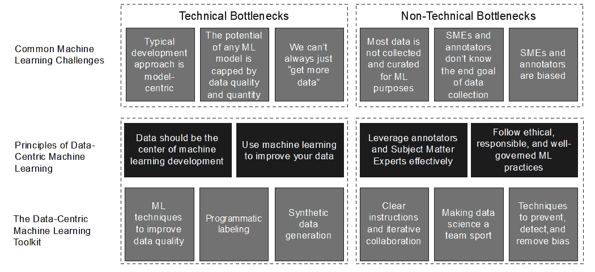

# 第十章：启动你在数据为中心的机器学习之旅

以数据为中心的**机器学习**（**ML**）方法是为了应对以模型为中心的范式局限性而创建的。尽管以数据为中心的视角为机器学习在新的和现有领域中的应用开辟了令人难以置信的机会，但这并不意味着它容易实施。

以模型为中心的方法的吸引力在于其相对简单性。它在该领域的统治地位并不一定是因为它更优越，而是因为它更直接。它主要关注改进模型、调整算法和增强计算能力。然而，这种方法往往忽视了机器学习的一个基本方面——为这些模型提供的数据的质量和相关性。

与此相反，以数据为中心的方法优先考虑提高数据质量而不是完善模型。它认识到，即使是最复杂的模型，如果建立在质量低劣或无关的数据的脆弱基础上，也可能失败。

你将面临的挑战是，采用以数据为中心的机器学习方法可能需要大量的努力。

在本章的结尾，我们将集中讨论如何有效地实施你在本书中学到的知识。我们将涵盖以下主题：

+   如何通过以数据为中心的方法解决六个常见的机器学习挑战

+   在你的组织中倡导数据质量的重要性

+   聚集人员以帮助你实施以数据为中心的方法

+   对人工智能伦理和公平性负责

让我们从探讨以数据为中心的方法如何提供工具来消除机器学习开发中的常见瓶颈开始。

# 解决六个常见的机器学习挑战

我们编写这本书是为了提供克服通常成为机器学习模型开发瓶颈的六个常见挑战所需的工具和技术。这六个挑战如下：

+   **典型的开发方法是模型为中心的**：在传统的机器学习中，重点是模型——选择正确的算法、调整超参数和优化性能指标。这种以模型为中心的方法通常涉及无数次的调整模型，以挤出更多的准确性。然而，虽然模型无疑很重要，但这种方法有时会导致忽视其他同样重要的方面，例如为这些模型提供的数据的质量和相关性。

+   **任何机器学习模型的可能性都受限于数据质量和数量**：无论机器学习模型多么复杂，其性能最终都是由其训练所使用的数据的质量和数量决定的。低质量的数据可能导致预测不准确，而数据不足可能导致过拟合，即模型过度学习训练数据，在未见过的数据上表现不佳。

+   **我们并不总能“获取更多数据”**：虽然拥有更多数据可以帮助提高模型性能，但获取额外数据并不总是可行的。这可能是因为成本高昂、耗时，或者由于隐私问题或某些事件的罕见性而变得不可能。

+   **大多数数据并非为机器学习目的收集和整理**：数据通常出于各种原因被收集，如报告、**商业智能**（**BI**）或记录保存，但并非专门为机器学习。这可能导致数据对我们特定的机器学习任务来说是不相关的、不完整的或噪声的。

+   **中小企业和标注员不了解数据收集的最终目标**：在许多情况下，收集或标注数据的人并不完全清楚机器学习项目的最终目标。这种缺乏理解可能导致数据标注或收集的不一致性，因为不同的人可能会对指令有不同的解释。

+   **中小企业和标注员存在偏见**：每个人都有偏见，中小企业和标注员也不例外。这些偏见可能会无意中影响他们收集或标注数据的方式，导致数据集偏差。

为了解决这六个挑战或瓶颈，我们向你介绍了数据为中心的机器学习的四个原则（在*第三章**，数据为中心的机器学习原则*）和一个由一系列技术和非技术工具和方法组成的数据为中心的机器学习工具包。

*图 10.1* 展示了这些原则、工具和方法如何为你提供克服这些挑战并取得更多成果的工具：

图 10.1 – 机器学习模型开发中六个常见挑战或瓶颈的概述；本书为你提供了四个原则和一系列以数据为中心的工具和技术来克服这些挑战

然而，知识只有当它被应用时才有用。随着我们接近对以数据为中心的机器学习的探索，是时候你反思一下，为了应用你在本书中学到的知识，你将不得不做哪些不同的改变。

不可避免地，你将不得不改变一些自己的方法和习惯，并重塑你与同事之间的某些互动。正如我们多次提到的，数据科学是一项团队运动，现在是时候你成为以数据为中心的机器学习团队的队长了。

为了成功地扮演这个角色，有三个关键领域你需要关注：

+   成为数据质量的倡导者

+   聚集人们来帮助你

+   对人工智能伦理和公平性负责

让我们详细地逐一探讨这些领域。

## 成为数据质量的倡导者

任何成功的数据中心化机器学习倡议的基础是高质量的数据。作为这个领域的专家，你有责任倡导并维护严格的数据质量标准。这包括确保数据收集、清洗和标注过程是稳健和一致的。然而，有时可能会感觉整个宇宙都在与你作对，不断地向你提供糟糕的数据。这可能确实是真的！

热力学第二定律表明，能量倾向于扩散，如果得不到积极的管理，系统自然会向无序或“熵”的增加方向发展。

这种现象几乎在你能想到的任何有序系统中都会发生，包括商业。从本质上讲，一家企业是由一群人、技术和流程系统地组织起来，以实现一系列共同目标。

但随着时间的推移，人们会进出企业，技术堆栈在规模和复杂性上会增长，流程可能会变得冗余或被人们的个人兴趣所取代。

让我们将这个概念应用到这样一个商业场景中，即随着时间的推移，一个组织的科技堆栈在增长。随着技术堆栈的扩展，添加更多的软件、平台和基础设施，就像向系统中添加更多的能量一样。如果没有适当的管理和组织，这可能会导致复杂性和“无序”的增加。系统可能无法高效互动，可能存在冗余，或者关键流程可能会被忽视——这就是我们场景中的“熵”。

我们在与每个组织的互动中都看到了这一场景的发生。尽管任何组织都是从零开始的，但典型的中等到大型企业将在任何给定时间运行数百甚至数千个技术应用程序，生成一个日益复杂的数据网络。

2022 年对北美至少有 1000 名员工的 200 多名 IT 和数据专业人士的调查证实了这一点 1。调查发现，这些组织平均管理着 400 个数据源，20%的受访者从 1000 个或更多的数据源中提取数据来喂养他们的分析系统。

换句话说，数据无序并不是随机事件，而是默认结果。除非投入大量努力来保持秩序，否则混乱的数据*将会*出现。作为数据专业人士，你的任务是识别并逆转这种数据熵，在组织的其他部分的帮助下。如果你不这样做，随着时间的推移，你的工作将变得更难，而不是更容易。

要管理和逆转数据熵，你首先需要对其进行测量。市场上有一些用于此目的的复杂工具，但如果你的组织无法并愿意投资这些工具，那么就从简单的数据质量措施开始，倡导数据质量。如果你的组织没有有效的数据质量测量协议，你可以成为激发行动的人。

提倡数据质量意味着向他人展示如何做到这一点。在这本书中，我们已经为你提供了采取以数据为中心的方法进行机器学习的工具。现在，轮到你通过展示这种方法的可能性来激励你的同事了。慷慨地分享你在本书中学到的知识。

提倡数据质量还意味着创造一个重视并优先考虑数据准确性的环境。鼓励你的团队永远不要对数据的状态做出假设。通过这样做，你将为可靠、准确和有效的机器学习模型奠定基础。

为了做到这一点，你需要将来自整个业务部门的人聚集在一起。

## 聚集人群

数据科学在本质上是一门协作学科。它需要来自不同背景和技能集的个人的投入和专业知识。作为任何机器学习项目中心的专家，你的一个主要角色是促进这种协作。

这里是挑战：大多数数据科学家都好奇、技术精湛、自主性强、高度智能的系统思考者。我们喜欢解决复杂问题，并且喜欢独自解决这些问题。我们喜欢独自工作。我们沉迷于细节。我们习惯于人们向我们寻求帮助，而不是反过来。我们是问题解决者，而不是问题制造者。

对于具有这些行为特征的人来说，聚集人群和管理从群体动态中产生的不可避免的人际复杂性可能非常困难。这可能需要大量的精力，并推动我们超越我们的舒适区。在我们这本书中涵盖的所有内容中，学习如何聚集人群可能是最困难的部分。

同时，我们的利益相关者通常对机器学习没有深入的技术理解。他们可能甚至不感兴趣了解这一切是如何运作的——他们只想看到业务成果。他们想看到结果，而不是数据质量问题。这是一个难以激发的群体。

要营造一个开放沟通、思想共享和建设性反馈成为常态的环境并不容易。要打破壁垒并鼓励跨职能协作也不容易。但如果你想要最大化构建有影响力的机器学习解决方案的机会，这是必须做到的。

你通过将其与业务问题联系起来，而不是通过描述技术复杂性，来激发非技术利益相关者对数据质量的兴趣。这要求你了解业务，比要求业务利益相关者了解数据更为重要。

因此，我们鼓励你走出舒适区，尽你所能将数据科学变成一项团队运动，即使这真的很困难，感觉不舒服。当你成功时，这将是非常有回报的。记住——最具创新性的解决方案通常来自汇聚不同视角和方法的多元化团队。

最后，采用以数据为中心的方法不仅限于优化机器学习性能。它还涉及使用数据时必须遵守的伦理和公平的重要责任。

## 对人工智能的伦理和公平性负责

随着机器学习和人工智能的持续增长，这些技术在伦理和公平性方面的重要性也在增加。作为该领域的专家，你有责任确保你构建模型所依据的数据尽可能公平和无偏见。

机器学习是一种创造行为。它是一个塑造我们周围世界的流程，影响着我们与产品、服务甚至彼此的互动方式。机器学习模型具有塑造行为、塑造感知和建立规范的力量。

这种力量可以用于善行，创造提升生活质量和解决紧迫社会问题的产品。但也可以被滥用，导致有害的结果。作为机器学习解决方案的设计者，我们对自己设计及其对世界的影响负有责任至关重要。仅仅创建功能准确或技术先进的东西是不够的。

这意味着要主动识别潜在的偏见来源并采取措施减轻它们。这也意味着要透明地说明模型的构建和使用方式，并对它们的成果负责。通过承担这一责任，你将有助于建立对机器学习系统的信任，并确保它们以公平和有益于所有人的方式使用。

# 让数据成为每个人的业务——我们的经验

几年前，我（乔纳斯）接管了一个由数据工程师、BI 开发者、数据分析师和数据科学家组成的高技能团队的领导工作。

尽管这是一个非常胜任的团队，对他们的业务有坚实的理解，但他们很难发挥全部潜力。我迅速确定了团队的首要挑战：来自组织各处的利益相关者不断向团队提出基本的数据请求，这使得每个人都非常忙碌，但影响并不大。

简而言之，利益相关者习惯于请求原始数据或最少加工的数据，以便他们可以找到自己的见解，而团队则被培养成不情愿地接受这种操作模式。

数据和分析的零散使用表明，该组织没有认识到数据质量的重要性。他们还错过了通过更有组织地使用高级分析来大幅提升业务绩效的机会。

我们希望扭转这种局面，以便能够建立一个更结构化、更高效的用数据和分析方法。我们的目标是强调数据质量的重要性及其推动业务绩效提升的潜力。我们旨在改变从自助式原始数据到通过精心策划、高级分析提供有价值的见解的方法，从而将操作模式从被动转变为主动。

我们有三个重点领域：

+   我们希望让人们意识到数据质量的重要性。我们成功定义是看到关键业务利益相关者转变为自荐的数据质量倡导者。

+   我们希望提供能够创造持久业务价值的高级数据产品。我们成功定义是看到我们的团队和业务利益相关者共同定义、构建和使用数据驱动的业务工具和产品。

+   我们希望数据成为公司和其客户的资产。我们成功定义是团队提供的数据驱动解决方案为客户和员工创造了持久的价值。

我们首先举办了全公司教育会议，强调数据质量的重要性以及使用机器学习改善业务绩效的潜力。人们点头表示同意，并称赞团队使复杂信息对普通观众易于理解。但我们没有看到我们希望的行为改变。

随着利益相关者受到启发，开始使用数据来指导他们的决策，基本请求的数量急剧增加。团队比以往任何时候都忙，试图从这些设计不佳的请求中找到最佳方案。

我们迅速决定改变我们的方法。首先，我们引入了一个要求，在承诺任何需要超过半天时间完成的新工作之前，必须先建立业务案例。

其次，我们与高级利益相关者进行了一系列研讨会，以确定和排名公司最大的痛点，这些痛点可以通过提供更好的高级分析来解决。

从这些研讨会中产生了三个主要项目，涉及组织各方的利益相关者：为面向客户的员工提供新的投资组合管理系统、为后台员工提供任务管理系统，以及一个流程自动化项目。所有三个项目都依赖于基于规则的机器学习算法，并需要提高对数据质量的关注。

项目依赖于业务利益相关者负责数据质量，并创建确保数据质量始终符合我们标准的流程。我们的团队与业务利益相关者紧密合作，确保业务问题和数据采集之间始终存在清晰的联系。

让我们非常兴奋的是，在很短的时间内，公司的会议议程中就包括了数据质量问题和发展计划。我们的高级利益相关者已经承担起倡导数据质量的职责，并对其团队负责。

这三个项目都取得了显著的成功，在同时增强跨职能协作的同时产生了稳健的数据产品。这些项目推动了数据驱动决策的转变，并在公司范围内强化了数据作为战略资产的认识。

这种重大转变之所以成为可能，仅仅是因为我的团队中的数据专业人士勇敢地走出他们的舒适区，使数据成为每个人的业务。

# 摘要

在本书中，你已经获得了宝贵的技能，现在你拥有了以数据为中心的方法达到机器学习下一个前沿的知识。然而，这些知识只有在你应用它们时才有用，而这需要努力。

这需要你使用本书中概述的工具和技术。它还要求你走出舒适区，在数据质量、跨职能协作和数据伦理方面发挥主导作用。你不能独自改变世界，所以把这本书交给同事，并让他们加入数据为中心的行列。

在我们结束之际，请记住，开始这段以数据为中心的机器学习之旅不是一个终点，而是一个持续的过程。数据和人工智能的领域始终在不断发展，我们自己也必须不断进步。让我们继续学习、创新，共同塑造数据科学和机器学习的未来。你的数据为中心的旅程才刚刚开始。

# 参考文献

1.  [`www.matillion.com/blog/matillion-and-idg-survey-data-growth-is-real-and-3-other-key-findings`](https://www.matillion.com/blog/matillion-and-idg-survey-data-growth-is-real-and-3-other-key-findings)，查看日期：2023 年 8 月 30 日
