# 第一章：机器学习和预测分析简介

随着人工智能和大数据已成为我们日常生活的普遍部分，基于云的机器学习服务已成为一个崛起的百亿美元产业。在市场上目前提供的多种服务中，亚马逊机器学习因其简单性而脱颖而出。亚马逊机器学习于 2015 年 4 月推出，其明确的目标是通过提供一项无需高度技术资源的公司即可访问的服务，降低预测分析的门槛。

这章是亚马逊机器学习服务的一般介绍，以及它可以解决的预测分析问题类型。亚马逊机器学习平台以其简单性和直接性而区别于其他平台。然而，简单性往往意味着做出了艰难的选择。我们解释了牺牲了什么，为什么这些选择是有意义的，以及如何通过 AWS 丰富的数据导向生态系统中的其他服务来扩展这种简单性。

我们探讨了亚马逊机器学习平台可以解决哪些类型的预测分析项目，以及它是如何使用简单的线性模型来解决回归和分类问题的。在开始一个预测分析项目之前，了解适当的上下文和构成良好结果的因素非常重要。我们介绍了使用**亚马逊机器学习**（**Amazon ML**）进行成功预测的上下文。

读者将了解亚马逊机器学习可以解决哪些类型的问题，以及关于底层数据的假设。我们展示了亚马逊机器学习如何使用简单的线性模型解决线性回归和分类问题，以及为什么这样做是有意义的。最后，我们介绍了该平台的局限性。

本章讨论以下主题：

+   机器学习即服务（MLaaS）是什么，为什么它很重要？

+   亚马逊机器学习如何成功利用线性回归，一个简单而强大的模型

+   预测分析是什么，它可以解决哪些类型的回归和分类问题？

+   数据必须满足的必要条件，以获得可靠的预测

+   亚马逊机器学习服务缺少了什么？

# 介绍亚马逊机器学习

在新兴的机器学习即服务（MLaaS）行业中，亚马逊机器学习在多个方面脱颖而出。其简单性与 AWS 生态系统的强大功能相结合，降低了公司进入机器学习的门槛，同时平衡了性能和成本。

# 机器学习即服务

亚马逊机器学习是亚马逊网络服务（**Amazon Web Services**，**AWS**）提供的在线服务，用于进行预测分析的监督学习。

2015 年 4 月在 AWS 峰会上推出的 Amazon ML，加入了云计算机器学习服务日益增长的名单，例如 Microsoft Azure、Google 预测、IBM Watson、Prediction IO、BigML 以及许多其他服务。这些在线机器学习服务共同构成了一个通常被称为**机器学习即服务**或**MLaaS**的提供方案，遵循其他基于云服务的类似命名模式，如**SaaS**、**PaaS**和**IaaS**，分别代表软件、平台或基础设施即服务。

研究表明，MLaaS 是一个潜在的巨大商业趋势。商业智能咨询公司 ABI Research 估计，基于机器学习的数据分析工具和服务收入将在 2021 年达到近 200 亿美元，正如本商业报告中概述的那样，MLaaS 服务将起飞：[`iotbusinessnews.com/2016/08/01/39715-machine-learning-iot-enterprises-spikes-advent-machine-learning-service-models/`](http://iotbusinessnews.com/2016/08/01/39715-machine-learning-iot-enterprises-spikes-advent-machine-learning-service-models/)

*ABI Research 的研究分析师 Eugenio Pasqua* 表示以下内容：

"机器学习即服务（MLaaS）模型的出现对市场来说是个好消息，因为它降低了实施机器学习的复杂性和时间，从而打开了增加其采用率的门户，尤其是在中小企业领域。"

增加的可访问性是使用基于 API 的基础设施来构建机器学习模型而不是从头开发应用程序的直接结果。提供高效的预测分析模型，无需编码、托管和维护复杂的代码库，降低了门槛，使 ML 对小型企业和机构变得可用。

Amazon ML 通过显著简化预测分析过程及其实施，比该领域的其他参与者更进一步地推进了这种民主化方法。这种简化围绕四个嵌入到平台中的设计决策：

+   有限的任务集：二元分类、多分类和回归

+   单一的线性算法

+   有限的指标选择来评估预测的质量

+   基于底层预测算法的一组简单的调整参数

这个相对受限的环境在解决与商业相关的多数预测分析问题时足够简单。它可以被应用于众多不同的行业和用例中。

# 利用完整的 AWS 集成

AWS 数据生态系统，包括管道、存储、环境和人工智能（AI），也是选择 Amazon ML 作为业务平台以解决其预测分析需求的有力论据。尽管 Amazon ML 很简单，但一旦集成到 AWS 数据相关服务的更大结构中，该服务就会向更复杂的复杂性和更强大的功能发展。

AWS 已经是云计算的主要参与者。以下是《经济学人》2016 年 8 月的一篇摘录对 AWS 的评价 ([`www.economist.com/news/business/21705849-how-open-source-software-and-cloud-computing-have-set-up-it-industry`](http://www.economist.com/news/business/21705849-how-open-source-software-and-cloud-computing-have-set-up-it-industry))：

AWS 在向云计算广阔的天空全面主导的进程中没有显示出放缓的迹象。据咨询公司 Gartner 称，AWS 的计算能力是下一个 14 家云服务提供商总和的十倍。AWS 过去一个季度的销售额大约是其最接近的竞争对手微软 Azure 的三倍。

这使得 Amazon ML 在许多使用云服务的公司中具有优势，因为这些公司很可能已经在使用 AWS。将简单高效的机器学习工具添加到产品组合中，预示着预测分析功能作为网络服务标准组件的兴起。与其他 AWS 服务无缝集成是使用 Amazon ML 的一个强有力的论据，尽管它看起来很简单。

以下架构是一个案例研究，摘自 AWS 于 2016 年 1 月发布的名为 *Big Data Analytics Options on AWS ([`d0.awsstatic.com/whitepapers/Big_Data_Analytics_Options_on_AWS.pdf`](http://d0.awsstatic.com/whitepapers/Big_Data_Analytics_Options_on_AWS.pdf)) 的白皮书，展示了社交媒体情感分析潜在的 AWS 架构。它展示了 Amazon ML 如何成为 AWS 服务更复杂架构的一部分：

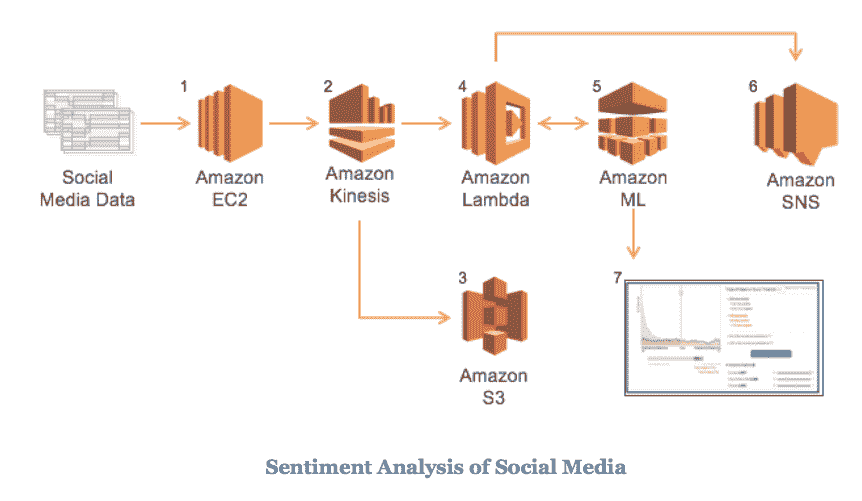

# 比较性能

保持系统和应用程序简单始终是困难的，但这对商业来说通常值得。例如，过载的用户界面会导致用户体验下降，而具有简单、优雅界面和最少功能的产物却受到广泛欢迎。"简单至上"的格言在预测分析这样的环境中，性能至关重要的背景下，更是难以坚持。这正是亚马逊在它的 Amazon ML 服务中面临的挑战。

典型的预测分析项目是一系列复杂的操作：获取数据、清理数据、选择、优化和验证模型，最后进行预测。在脚本方法中，数据科学家使用机器学习库（如 Python 的 **scikit-learn** 库或 **R** 包）开发代码库，以处理从数据收集到生产中的预测的所有步骤。随着开发者将必要的步骤分解成模块以提高可维护性和可测试性，Amazon ML 将预测分析项目分解成不同的实体：数据源、模型、评估和预测。正是这些步骤的简单性使得 AWS 在实施成功的预测分析项目中如此强大。

# 工程数据与模型多样性

对于预测来说，拥有大量算法始终是一件好事，但最终，领域知识和从干净数据中提取有意义特征的能力往往是赢得比赛的关键。

**Kaggle** 是一个知名的预测分析竞赛平台，全球最优秀的数据科学家在这里竞争，对复杂数据集进行预测。在这些预测竞赛中，预测分数上增加几个小数点就能区分获奖者或只是成千上万名竞争者中公共排行榜上的额外一行。Kagglers 很快就会学到，选择和调整模型只是战斗的一半。特征提取或如何从数据集中提取相关预测因子往往是赢得比赛的关键。

在现实生活中，当处理与业务相关的问题时，数据处理阶段的质量和从原始数据中提取有意义信号的能力是构建高效预测模型最重要的和耗时最多的部分。众所周知，“*数据准备占数据科学家工作的约 80%*” (*[`www.forbes.com/sites/gilpress/2016/03/23/data-preparation-most-time-consuming-least-enjoyable-data-science-task-survey-says/`](http://www.forbes.com/sites/gilpress/2016/03/23/data-preparation-most-time-consuming-least-enjoyable-data-science-task-survey-says/))。模型选择和算法优化仍然是工作的一个重要部分，但在实施方面往往不是决定性因素。

一个坚实且稳健的实现，易于维护且无缝连接到您的生态系统，通常比内部开发和编码的过于复杂的模型更受欢迎，尤其是当脚本模型与基于服务的实现相比只能带来微小收益时。

# 亚马逊的专业知识和梯度下降算法

亚马逊一直在其商业的零售方面使用机器学习，并在预测分析方面建立了深厚的专业知识。这种专业知识转化为选择驱动亚马逊机器学习服务的算法。

**随机梯度下降**（**SGD**）算法是驱动亚马逊机器学习线性模型的算法，并最终负责服务生成的预测的准确性。SGD 算法是最稳健、最具有弹性和最优化算法之一。自 20 世纪 60 年代以来，它已在许多不同的环境中使用，从信号处理到深度学习，以及各种问题，都取得了巨大的成功。SGD 还催生了许多高度高效的变体，适应了广泛的数据环境。我们将在后面的章节中回到这个重要的算法；在此阶段，只需说 SGD 算法是所有可能的预测分析算法中的瑞士军刀即可。

亚马逊机器学习服务的多个基准测试和评估可以在网络上找到（亚马逊、谷歌和 Azure：[`blog.onliquid.com/machine-learning-services-2/`](https://blog.onliquid.com/machine-learning-services-2/) 和亚马逊与**scikit-learn**的对比：[`lenguyenthedat.com/minimal-data-science-2-avazu/`](http://lenguyenthedat.com/minimal-data-science-2-avazu/))。总体结果表明，亚马逊机器学习的表现与其他 MLaaS 平台相当，同时也与基于流行机器学习库（如`scikit-learn`）的脚本解决方案相当。

在特定情境下的特定问题，以及可用的数据集和特定的评分指标选择，可能使用适当的库编写预测模型，并可能获得比使用亚马逊机器学习更好的性能。但亚马逊机器学习提供的是稳定性、无需编码、非常坚实的基准记录，以及与亚马逊云服务生态系统无缝集成的优势，该生态系统已经为互联网的很大一部分提供动力。

# 定价

与其他机器学习即服务（MLaaS）提供商和 AWS 服务一样，亚马逊机器学习只对您使用的部分收费。

成本分解如下：

+   用于构建预测模型所使用的计算时间的每小时费用

+   每千个预测样本的预测费用

+   在实时（流式）预测的背景下，基于模型预先分配的内存的费用

计算时间随着以下因素增加：

+   模型的复杂性

+   输入数据的大小

+   属性的数量

+   应用转换的数量和类型

在撰写本文时，这些费用如下：

+   每小时 0.42 美元的数据分析和模型构建费用

+   批量预测每 1000 次预测 0.10 美元

+   实时预测每次预测 0.0001 美元

+   为您的模型提供的每 10 MB 内存每小时 0.001 美元

这些价格不包括与数据存储（S3、Redshift 或 RDS）相关的费用，这些费用将单独收费。

在创建您的模型时，亚马逊机器学习根据所选的数据源为您提供成本估算。

亚马逊机器学习服务不属于 AWS 免费层，这是一个为期 12 个月的优惠，在某些条件下，某些 AWS 服务可以免费使用。

# 理解预测分析

数据科学、预测分析、机器学习——这些术语被广泛使用，有时甚至相互重叠。它们实际上所指的内容并不总是显而易见。

数据科学是最受欢迎的技术领域之一，其趋势在 2012 年 10 月发布的经常引用的《哈佛商业评论》文章《数据科学家：21 世纪最性感的工作》发表后爆发（[`hbr.org/2012/10/data-scientist-the-sexiest-job-of-the-21st-century`](https://hbr.org/2012/10/data-scientist-the-sexiest-job-of-the-21st-century)）。数据科学可以看作是数据挖掘和数据分析的一种演变。数据挖掘是关于探索数据以发现可能导致商业层面决策和行动的模式。数据科学涵盖了数据分析和重新组合更广泛的领域，如统计学、数据可视化、预测分析、软件工程等，在非常广泛的领域下。

预测分析是基于过去观察预测未来事件的艺术。它要求你的数据以某种方式组织，具有明确的预测变量和结果。正如丹麦政治家*卡尔·克里斯蒂安·斯坦克*曾说过，“*预测是困难的，尤其是关于未来的预测。*”（这句话也被归功于尼尔斯·玻尔、尤吉·贝拉和其他人，参见[`quoteinvestigator.com/2013/10/20/no-predict/`](http://quoteinvestigator.com/2013/10/20/no-predict/))。预测分析应用广泛，包括预测消费者行为、自然事件（天气、地震等）、人们的行为或健康、金融市场、工业应用等。预测分析依赖于监督学习，其中数据和标签被提供给训练模型。

机器学习包括计算机用于预测分析或其他目标的模型优化所需的工具、方法和概念。

机器学习的范围比预测分析要大得多。通常考虑三种不同的机器学习类型：

+   **监督学习**：假设有已知结果的训练数据可用，并可用于训练模型。预测分析是监督学习的一部分。

+   **无监督学习**：关于在不知道结果的情况下在现有数据中寻找模式。例如，聚类客户行为或为了可视化目的降低数据集的维度是无监督学习的例子。

+   **强化学习**：是机器学习的第三种类型，其中代理在给定一组规则和特定的奖励方案后，学会自行行动。强化学习应用的例子包括**AlphaGo**，谷歌的世界冠军围棋算法，自动驾驶汽车和半自主机器人。AlphaGo 从数千场过去的比赛中学习，并在 2016 年 3 月击败了世界围棋冠军（[`www.wired.com/2016/03/go-grandmaster-lee-sedol-grabs-consolation-win-googles-ai/`](https://www.wired.com/2016/03/go-grandmaster-lee-sedol-grabs-consolation-win-googles-ai/)）。经典的强化学习实现遵循以下方案，其中代理根据产生的奖励在其环境中调整其行为：

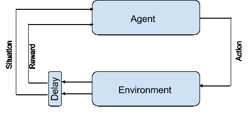

在二元分类和聚类的背景下，监督学习和无监督学习之间的区别在下述两个图中得到说明：

+   对于**监督学习**，原始数据集由两个类别（正方形和圆形）组成，并且我们从一开始就知道每个样本属于哪个类别。将此信息提供给二元分类算法允许对两个类别进行某种优化的分离。一旦知道了分离前沿，模型（即线）就可以用来根据样本最终落在哪一侧来预测新样本的类别：

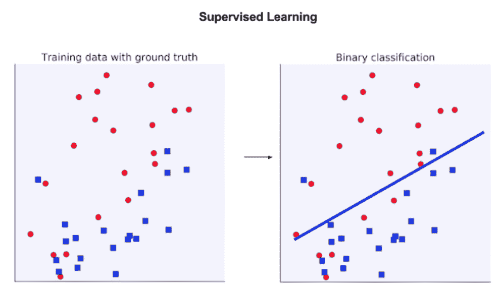

+   在**无监督学习**中，不同的类别是未知的。没有基准事实。数据被提供给算法，并附带一些参数，例如要找到的类别数量，算法根据定义的标准或指标在原始数据集中找到最佳聚类集。结果可能非常依赖于初始化参数。没有事实，没有准确性，只是对数据的解释。以下图显示了要求在原始数据中找到三个类别的聚类算法得到的结果：

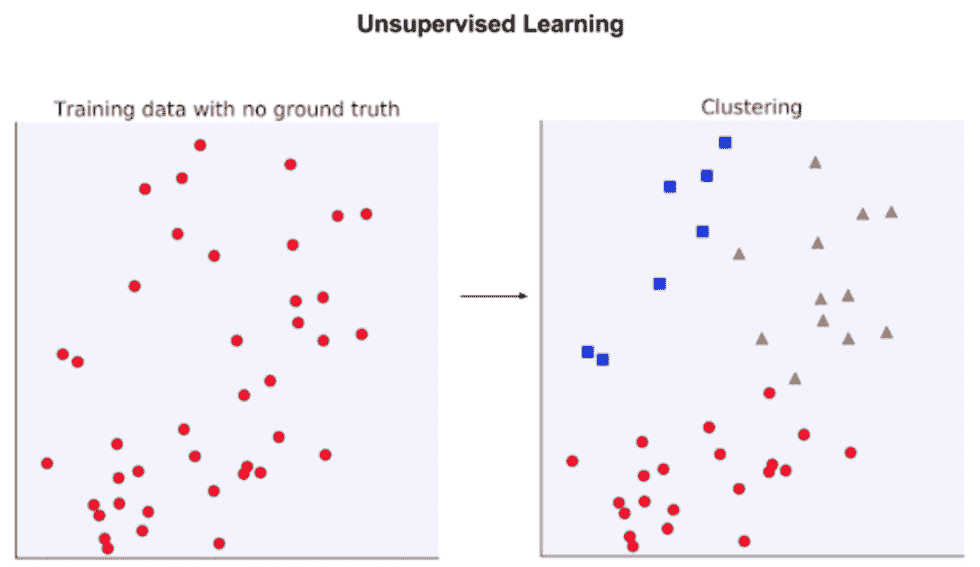

读者此时会注意到，这本书的标题是《亚马逊机器学习》而不是《亚马逊预测分析》。这有点误导，因为机器学习涵盖了除了预测分析之外许多应用和问题。然而，将服务称为机器学习为亚马逊推出未来不专注于预测分析的服务留下了空间。以下图展示了数据科学术语之间的关系：

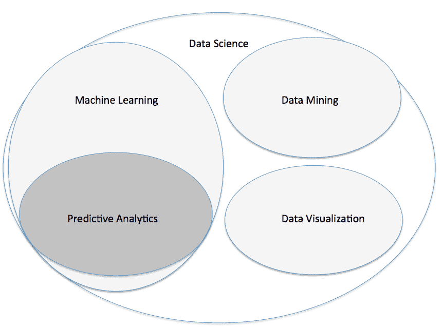

# 构建最简单的预测分析算法

预测分析可以非常简单。我们介绍了一个基于简单阈值的二元分类背景下的预测模型的一个非常简单的例子。

想象一下，一辆运输小橙子和大葡萄柚的卡车偏离了道路；所有的水果箱都打开了，所有的水果都混合在一起。装备了简单的秤和将水果从卡车中滚出来的方法，你希望能够根据它们的重量自动将它们分开。你有一些关于小橙子平均重量（96 克）和大葡萄柚平均重量（166 克）的信息。

根据美国农业部（USDA）的数据，中等大小橙子的平均重量为 131 克，较大的橙子重量约为 184 克，较小的橙子约为 96 克。

+   大葡萄柚（直径约 4-1/2 英寸）166 克

+   中等葡萄柚（直径约 4 英寸）128 克

+   小葡萄柚（直径约 3-1/2 英寸）100 克

你的预测模型如下：

+   你随意设置了一个 130 克的阈值

+   你称量每个水果

+   如果水果重量超过 130 克，则是葡萄柚；否则是橙子

好了！你已经有了一个健壮、可靠的预测模型，可以应用于所有混合在一起的水果，以将它们分开。注意，在这种情况下，你是通过有根据的猜测来设置阈值的。这里没有涉及机器学习。

在机器学习中，模型是自行学习的。你不需要自己设置阈值，而是让你的程序自行进化，并计算水果的重量分离阈值。

为了这个目的，你需要留出一部分橙子和葡萄柚。这被称为训练数据集。重要的是这个训练数据集中橙子和葡萄柚的数量大致相同。

你让机器自行决定阈值值。一个可能的算法可能是这样的：

1.  将原始重量估计设置为`w_0 = 100g`以初始化，并设置计数器`k = 0`

1.  对于训练数据集中每个新的水果，根据以下方法调整权重估计：

```py
        For each new fruit_weight:
            w(k+1) = (k*w(k) + fruit_weight)/ (k+1)
            k = k+1

```

假设你的训练数据集代表了所有剩余的水果，并且你有足够的水果，阈值在一定的条件下会收敛到所有水果重量的最佳平均值。这个值用于根据你估计的阈值将其他水果分开，判断它们是重于还是轻于这个阈值。以下图表显示了该粗略算法估计水果平均重量的收敛情况：

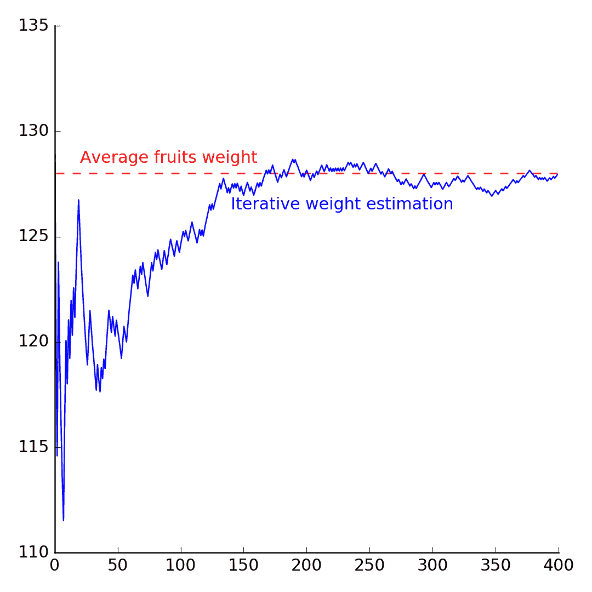

这个问题是一个典型的二元分类模型。如果我们有两种以上的水果类型（柠檬、橙子和葡萄柚），那么我们就会有一个多类分类问题。

在这个例子中，我们只有一个预测因子：水果的重量。我们可以添加另一个预测因子，例如直径。这将导致所谓的多元分类问题。

在实践中，机器学习使用更复杂的算法，如 SGD（随机梯度下降），这是 Amazon ML 使用的线性算法。其他经典的预测算法包括支持向量机、贝叶斯分类器、随机森林等等。每种算法都有其优势和针对数据集的假设。

# 回归与分类

Amazon ML 进行两种类型的预测分析：分类和**回归**。

如前一段所述，分类是关于预测给定样本集的有限标签或类别的。

+   在两个类别的情况下，问题被称为二元分类。

+   当有超过两个类别且类别互斥时，问题是一个多类分类问题。

+   如果样本可以同时属于多个类别，我们谈论多标签分类问题。

简而言之，分类是对有限集合的类别、标签、类别的预测。

+   二元分类的例子包括：购买结果（是/否）、生存结果（是/否）、异常检测（垃圾邮件、机器人）等等。

+   多类分类的例子包括：在图像中分类对象（水果、汽车等）、根据智能手机传感器识别音乐流派或运动、文档分类等等。

在回归问题中，结果具有连续值。预测年龄、体重、股价、薪水、降雨量、温度等等都是回归问题。当有多个预测因子时，我们谈论多重回归；当预测为每个样本预测多个值时，我们谈论多元回归。Amazon ML 进行单变量回归和分类，包括二元和多类，但不进行多标签分类。

# 使用逻辑回归将回归扩展到分类

Amazon ML 使用线性回归模型进行回归、二元和多类预测。使用**逻辑回归**模型将连续回归扩展到分类问题。

具有一个预测因子的简单回归模型建模如下：

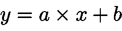

在这里，*x*是预测因子，*y*是结果，(a, b)是模型参数。每个预测值*y*是连续的且无界。我们如何使用该模型来预测那些按定义是分类值的类别呢？

以二元预测为例。方法是将连续的、无界的预测转换为概率，这些概率都在 0 和 1 之间。然后我们使用一个预定义的阈值将这些概率与两个类别之一关联。这个模型被称为**逻辑回归**模型——名称误导，因为逻辑回归是一个分类模型，而不是回归模型。

为了将连续的无界值转换为概率，我们使用以下定义的`sigmoid`函数：

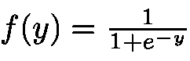

此函数将任何实数转换为*[0,1]*区间的值。因此，其输出可以解释为概率：

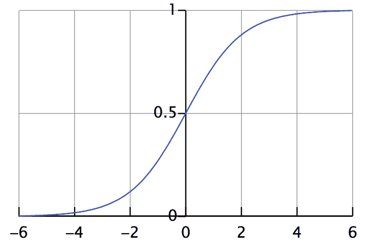

总之，使用回归模型进行二元分类的方法如下：

1.  建立回归模型，并估计实值结果 *y*。

1.  使用预测值 *y* 作为 `sigmoid` 函数的参数。结果 *f(y)* 是属于两个类别之一的概率度量。

1.  设置一个阈值 *T* 在 [0,1] 范围内。所有预测样本中概率 *f(y) > T* 的属于一个类别，其他属于另一个类别。默认值 *T = 0.5*。

逻辑回归本质上是一种二元分类器。有几种策略可以将二元分类器转换为多类分类器。

**一对所有（OvA）** 技术在于选择一个类别作为正类，所有其他类别作为负类，以回到二元分类问题。一旦对第一个类别进行了分类，就选择第二个类别作为正类，所有其他类别作为负类。当有 N 个类别需要预测时，这个过程重复 N-1 次。以下一系列图表显示：

+   原始数据集和所有样本的类别

+   第一次二元分类（圆形与其他所有类别）

+   第二次分类的结果，将正方形和三角形分开

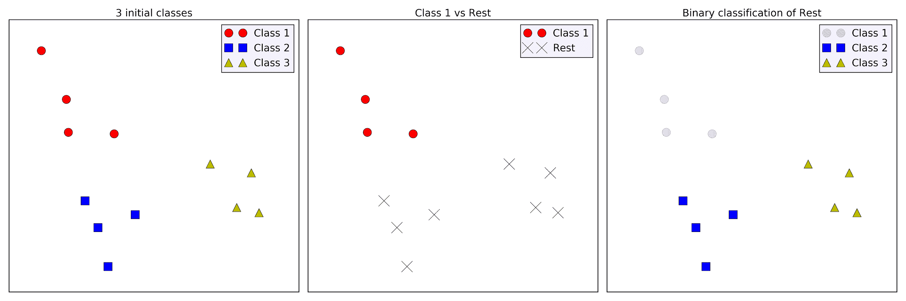

# 提取特征以预测结果

可用数据需要易于访问且具有意义，以便算法能够提取信息。

让我们考虑一个简单的例子。想象一下，我们想要预测一个特定城市的房屋市场价格。我们可以想到许多可能成为房屋价格预测指标的变量：房间数量或浴室数量、社区、面积、供暖系统等等。这些变量被称为特征、属性或预测指标。我们想要预测的值被称为结果或目标。

如果我们想要我们的预测是可靠的，我们需要几个特征。仅基于房屋面积预测房价将不会非常有效。许多其他因素会影响房价，并且我们的数据集应该尽可能包含这些因素（满足条件）。

通常可以向模型添加大量属性以尝试提高预测的准确性。例如，在我们的房价预测中，我们可以添加房屋的所有特征（浴室、面积、供暖系统、窗户数量）。其中一些变量会向我们的定价模型提供更多信息，从而提高预测的准确性，而其他变量只会增加噪声并混淆算法。向预测模型添加新变量并不总是能提高预测的准确性。

为了做出可靠的预测，你带到模型中的每个新特征都必须带来一些有价值的信息。然而，这并不总是如此。正如我们将在第二章“机器学习定义和概念”中看到的，相关的预测变量可能会损害模型的性能。

预测分析建立在几个假设和条件之上：

+   你试图预测的值是可以预测的，而不仅仅是随机噪声。

+   你可以访问与目标有一定关联的数据。

+   可用的数据集足够大。从太小的数据集中无法推断出可靠的预测。（例如，你可以定义并因此预测一条直线，但你不能从只有两个点中推断出遵循正弦曲线的数据。）

+   你将基于的新数据与你参数化和训练模型的数据相似。

你可能有一个很好的数据集，但这并不意味着它对预测是有效的。

这些数据条件非常通用。在 SGD 的情况下，条件更为约束。

# 深入探讨用于预测的线性建模

Amazon ML 基于线性建模。回想一下平面上一条直线的方程：


这个具有系数 (*a, b*) 的线性方程可以解释为一个预测线性模型，其中 *x* 是预测变量，*y* 是结果。在这个简单的情况下，我们有两个参数 (*a, b*) 和一个预测变量 *x*。一个例子可以是预测孩子的身高与体重之间的关系，并找到一些 a 和 b 使得以下方程成立：

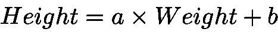

让我们考虑经典的 *Lewis Taylor (1967)* 数据集，其中包含 237 个孩子的年龄、体重、身高和性别样本 ([`v8doc.sas.com/sashtml/stat/chap55/sect51.htm`](https://v8doc.sas.com/sashtml/stat/chap55/sect51.htm))，并关注孩子的身高与体重之间的关系。在这个数据集中，最佳回归线遵循以下方程：

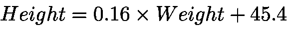

下图展示了身高与体重数据集及其相关的线性回归：

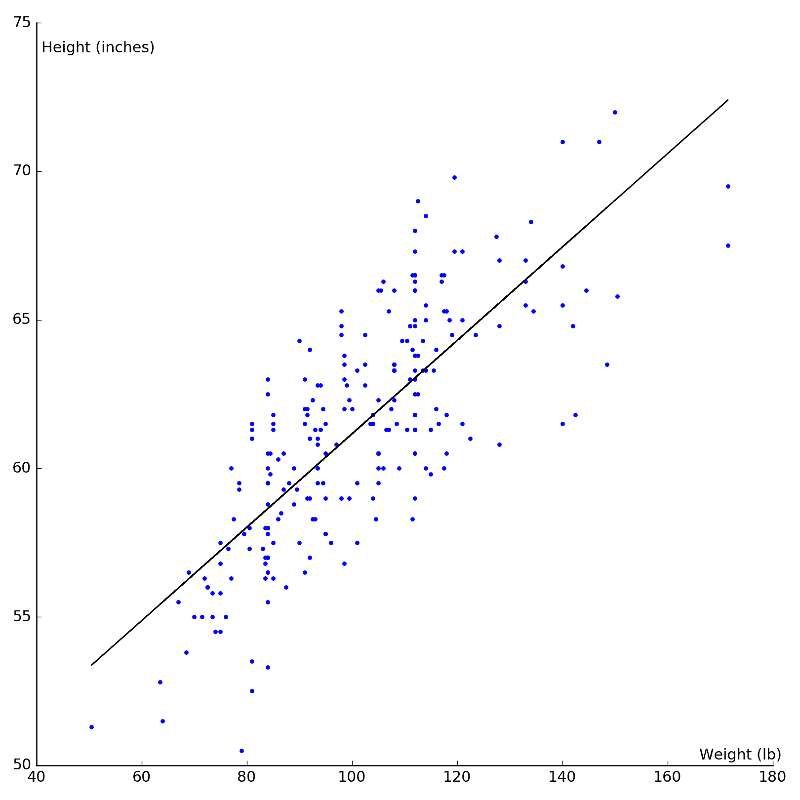

现在假设我们不止有一个预测变量，而是有多个，让我们将前面的线性方程推广到 N 个预测变量，用 *{x[1], . . . , x[n]}* 表示，以及 *N +1* 个系数或 *{w[o], w[1], . . ., w[n]}* 权重。线性模型可以写成以下形式：

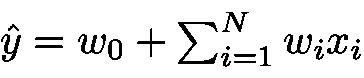

在这里，*ŷ* 表示预测值，（*y* 将对应于要预测的真实值）。为了简化符号，我们将假设本书的其余部分系数 *w[o] = 0*。

该方程可以重写为以下矢量形式：

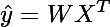

其中 *T* 是转置算子，X = *{x[1], . . ., x[n]}* 和 W= {*w[1], . . .,w[n]*} 分别是预测变量和模型权重的向量。在特定条件下，系数 *w[i]* 可以精确计算。然而，对于大量样本 *N*，这些计算在计算量上非常昂贵，因为它们涉及到 *N* 维矩阵的求逆，对于大数据集来说，这是昂贵且缓慢的。随着样本数量的增加，通过迭代过程估计这些模型系数变得更加高效。

随机梯度下降算法迭代地估计模型的系数 *{w[o], w[1], . . ., w[n]}*。在每次迭代中，它使用训练数据集的一个随机样本，其中已知实际结果值。SGD 算法通过最小化预测误差的函数来工作：

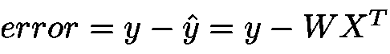

将预测误差作为参数的函数也称为**损失函数**。不同的损失函数导致不同的算法。凸损失函数有一个唯一的极小值，这对应于回归问题的最优权重集。我们将在后面的章节中详细介绍 SGD 算法。现在只需说，SGD 算法特别适合处理大数据集。

有许多理由可以证明选择 SGD 算法用于通用预测分析问题的合理性：

+   它是鲁棒的

+   其收敛性质已被广泛研究，并且众所周知

+   它非常适合优化技术

+   它有许多扩展和变体

+   它的计算成本较低

+   它可以应用于回归、分类和流数据

一些弱点包括以下内容：

+   需要正确初始化其参数

+   依赖于称为学习率的参数的收敛速率

# 验证数据集

并非所有数据集都适合线性建模。对于您的线性模型有意义，样本必须满足几个条件。有些条件是严格的，而有些则可以放宽。

通常，线性建模假设以下条件([`www.statisticssolutions.com/assumptions-of-multiple-linear-regression/`](http://www.statisticssolutions.com/assumptions-of-multiple-linear-regression/))：

+   **归一化/标准化**：线性回归可能对表现出非常不同尺度的预测变量敏感。这对于所有依赖于样本间距离度量或样本标准差的损失函数都是正确的。具有更高平均值和标准差的预测变量对模型的影响更大，可能潜在地掩盖了具有更好预测能力但值域更受限制的预测变量。预测变量的标准化将所有预测变量置于同一水平。

+   **独立同分布（i.i.d.）**：假设样本之间相互独立，并且遵循相似的分布。即使样本之间并不那么独立，这个属性也经常被假设。在时间序列的情况下，样本依赖于先前值，使用样本到样本的差异作为数据通常足以满足独立性假设。正如我们将在第二章，“机器学习定义和概念”中看到的，混淆因素和噪声也会对线性回归产生负面影响。

+   **无多重共线性**：线性回归假设数据中几乎没有多重共线性，这意味着一个预测变量不是其他预测变量的线性组合。可以通过其他预测变量的线性组合来近似预测变量的预测将使模型混淆。

+   **异方差性**：预测变量的标准差在其所有值范围内是恒定的。

+   **残差的正态分布**：这不仅仅是事后验证线性回归的有效性。残差是真实值与其线性估计之间的差异。如果这些残差遵循正态分布，则认为线性回归是相关的。

这些假设在现实生活中的数据集中很少完美满足。正如我们将在第二章，“机器学习定义和概念”中看到的，有一些技术可以检测线性建模假设是否没有得到尊重，并随后转换数据以更接近理想的线性回归环境。

# 亚马逊机器学习（Amazon ML）中缺少的功能

亚马逊机器学习提供监督学习预测，用于分类（二分类和多分类）和回归问题。它提供了一些原始数据的基本可视化，并有一个预设的数据转换列表，例如分箱或数据归一化。它是高效且简单的。然而，一些对数据科学家来说非常重要的功能却不幸地缺失在这个平台上。缺少这些功能可能不是决定性的，但它确实限制了亚马逊机器学习可以应用的问题范围。

亚马逊机器学习不提供的一些常见机器学习功能如下：

+   **无监督学习**：无法对数据进行聚类或降维。

+   **除线性模型之外的选择模型**：非线性支持向量机、任何类型的贝叶斯分类、神经网络以及基于树的算法（决策树、随机森林或提升树）都是缺失的模型。所有预测、所有实验都将建立在基于 SGD 的线性回归和逻辑回归之上。

+   数据可视化功能仅限于直方图和密度图。

+   **指标的选择**：Amazon ML 使用 F1 分数和 ROC-AUC 指标进行分类，使用 MSE 进行回归。无法使用任何其他指标来评估模型性能。

+   你不能下载你的训练模型，在其他地方（除了 Amazon ML）使用它。

最后，尽管在 Amazon ML 平台上无法直接使用自己的脚本（R、Python、Scala 等），但使用其他 AWS 服务，如 AWS Lambda，来预处理数据集是可能的，也是推荐的。如果你的数据存储在 AWS 启用了 SQL 的服务之一（Athena、RDS、Redshift 等），还可以使用 SQL 进行超出 Amazon ML 中可用转换的数据操作。

# 统计方法与机器学习方法

在 2001 年，*Leo Breiman*发表了一篇题为《统计建模：两种文化》（[*http://projecteuclid.org/euclid.ss/1009213726*](http://projecteuclid.org/euclid.ss/1009213726)）的论文，强调了关注数据中底层过程验证和解释的统计方法与更关注结果的机器学习方法之间的差异。

简而言之，经典统计分析遵循以下步骤：

1.  提出了一个称为零假设的假设。这个零假设通常表明观察结果是随机的。

1.  然后计算零假设下事件的概率（或 p 值）。

1.  如果这个概率低于某个阈值（通常 p < 0.05），则拒绝零假设，这意味着观察结果不是随机事件。

`p> 0.05`并不意味着零假设是真的。它仅仅意味着你不能拒绝它，因为观察结果偶然发生的概率并不大。

这种方法旨在解释和发现现象的影响因素。目标是在这里建立一个相对静态且完全已知的模型，使其尽可能符合观察结果，因此能够预测未来的模式、行为和观察。

在机器学习方法中，在预测分析中，模型的显式表示并不是重点。目标是构建适合预测期的最佳模型，模型从观察中自行构建。模型的内部结构并不明确。这种机器学习方法被称为黑盒模型。

通过消除对数据进行显式建模的需求，机器学习方法在预测方面具有更强的潜力。机器学习专注于通过最小化模型的预测误差来做出尽可能准确的预测，而牺牲可解释性。

# 摘要

在本章中，我们介绍了 Amazon ML 服务所使用的技巧。尽管 Amazon ML 提供的功能比其他机器学习工作流程要少，但 Amazon ML 建立在坚实的基础之上，一个简单而非常高效的算法驱动其预测。

亚马逊机器学习（Amazon ML）并不提供解决任何类型的自动化学习问题，并且在某些情境和某些数据集中可能不够充分。然而，其简单的方法和设计对于许多预测分析项目来说是足够的，前提是初始数据集经过适当的预处理，并包含可以进行预测的相关信号。

在第二章《机器学习定义与概念》中，我们将进一步探讨在预测分析中使用的技巧和概念。

更具体地说，我们将介绍用于提高原始数据质量的最常见技术；我们将识别并纠正数据集中常见的异常；我们将学习如何训练和验证预测模型，以及如何在预测性能不佳时改进预测。
