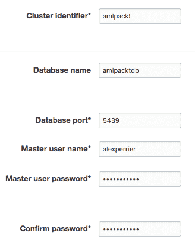
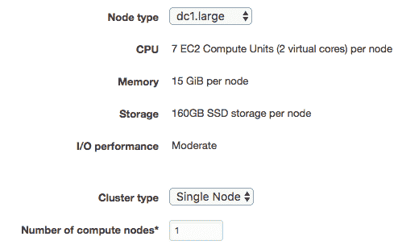

# 第八章：从 Redshift 创建数据源

在本章中，我们将利用 SQL 查询的力量来处理非线性数据集。在创建数据源之前，在 Redshift 或 RDS 中创建数据源为我们提供了上游基于 SQL 的特征工程潜力。我们在第四章，*加载数据集和准备数据*中实施了一种类似的方法，通过利用新的 AWS Athena 服务在创建数据源之前对数据进行初步转换。

这使我们能够通过创建新的特征，如“甲板”号，用其对数替换“票价”，或替换“年龄”变量的缺失值来扩展“泰坦尼克”数据集。SQL 转换很简单，但使我们能够非常灵活地扩展原始数据集。**AWS Athena**服务是基于 S3 的。它允许我们在 S3 上托管的数据集中运行 SQL 查询，并将结果存储在 S3 桶中。我们仍然从 S3 创建亚马逊 ML 数据源，但只是添加了一个额外的数据预处理层来整理数据集。

AWS 还提供了另外两种 SQL 服务，可以从这些服务中创建数据源：RDS 和 Redshift。RDS 和 Redshift 的数据源创建非常相似，我们将重点介绍通过 Python SDK `Boto3`在 Redshift 中创建数据源。对我们来说，关键点是基于 RDS/Redshift 的数据源是通过 SQL 查询直接创建的，这为我们提供了进一步的特征工程的机会。Redshift 还与 AWS Kinesis 无缝集成，我们将在[第九章](https://cdp.packtpub.com/effective_amazon_machine_learning/wp-admin/post.php?post=1053)，*构建流数据分析管道*中探讨该服务。

亚马逊机器学习建立在本质上线性的模型之上，利用良好的结果量级分箱数据转换作为处理数据集中非线性的一种方法。多项式回归是另一种重要的机器学习方法，用于处理非线性数据集。我们将利用我们新的 SQL 功能，通过亚马逊 ML 实现多项式回归。

在本章中，你将学习以下内容：

+   在 RDS 和 Redshift 之间进行选择

+   如何使用 PostgreSQL 创建 Redshift 数据库

+   如何将您的 S3 数据加载到 Redshift

+   如何从 Redshift 创建数据源

+   什么是多项式回归

+   如何使用亚马逊 ML 进行多项式回归

# 在 RDS 和 Redshift 之间进行选择

AWS 提供了不少于六种不同的云数据库和 SQL/NoSQL 服务：RDS、Aurora、DynamoDB、Redshift、Athena 和 AWS 数据库迁移服务！在所有这些服务中，只有两个与亚马逊机器学习兼容：RDS 和 Redshift。您可以在任一服务中存储数据，并从这些来源创建数据源。这两个服务的源数据创建方法具有类似的参数，但在底层 AWS 服务通信方面差异很大。

RDS 和 Redshift 是两种非常不同的服务。Redshift 是一个数据仓库，用于在大数据集上回答一些复杂且运行时间较长的查询，而 RDS 是为频繁、小规模和快速查询而设计的。Redshift 更适合进行大规模并行处理，以最小延迟执行数百万行数据的操作，而 RDS 提供了一个运行特定数据库的服务器实例。RDS 提供多种不同的数据库类型——MySQL、PostgreSQL、MariaDB、Oracle、SQL Server 和 Amazon Aurora，而 Redshift 是基于**ParAccel**技术的亚马逊自己的分析数据库，运行的是 PostgreSQL 的一个分支。您可以使用标准的 ODBC 和 JDBC 连接连接到 Redshift。

在您在 Redshift 中构建数据库时，亚马逊 Redshift 和 PostgreSQL 之间存在许多非常重要的差异，您必须注意。许多函数、数据类型和 PostgreSQL 功能在亚马逊 Redshift 中不受支持。更多信息可在[`docs.aws.amazon.com/redshift/latest/dg/c_redshift-and-postgres-sql.html`](http://docs.aws.amazon.com/redshift/latest/dg/c_redshift-and-postgres-sql.html)找到。

关于 RDS 和 Redshift 之间差异的更深入解释，可以在本线程中找到：[`www.quora.com/What-is-the-difference-between-redshift-and-RDS`](https://www.quora.com/What-is-the-difference-between-redshift-and-RDS)

在亚马逊机器学习（Amazon ML）的背景下，这两种服务之间的重要区别在于，亚马逊机器学习 Web 控制台仅允许从 S3 和 Redshift 创建数据源，但不能从 RDS 创建，如本截图所示：


然而，Python SDK 和 AWS CLI 都允许从 RDS 和 Redshift 创建数据源。

**SDK**：

+   `create_data_source_from_rds()`：[`boto3.readthedocs.io/en/latest/reference/services/machinelearning.html#MachineLearning.Client.create_data_source_from_rds`](http://boto3.readthedocs.io/en/latest/reference/services/machinelearning.html#MachineLearning.Client.create_data_source_from_rds)

+   `create_data_source_from_redshift()`：[`boto3.readthedocs.io/en/latest/reference/service/machinelearning.html#MachineLearning.Client.create_data_source_from_redshift`](http://boto3.readthedocs.io/en/latest/reference/services/machinelearning.html#MachineLearning.Client.create_data_source_from_redshift)

**CLI**：

+   `create-data-source-from-rds`：[`docs.aws.amazon.com/cli/latest/reference/machinelearning/create-data-source-from-rds.html`](http://docs.aws.amazon.com/cli/latest/reference/machinelearning/create-data-source-from-rds.html)

+   `create-data-source-from-redshift`：[`docs.aws.amazon.com/cli/latest/reference/machinelearning/create-data-source-from-redshift.html`](http://docs.aws.amazon.com/cli/latest/reference/machinelearning/create-data-source-from-redshift.html)

现在我们比较 Python SDK 连接到任一服务所需的参数：

+   Redshift 参数：

```py
        {
            "DatabaseInformation": {
              "DatabaseName": "string",
              "ClusterIdentifier": "string"
            },
            "SelectSqlQuery": "string",
            "DatabaseCredentials": {
              "Username": "string",
              "Password": "string"
            },
            "S3StagingLocation": "string",
            "DataRearrangement": "string",
            "DataSchema": "string",
            "DataSchemaUri": "string"
        }

```

+   RDS 参数：

```py
        {
            "DatabaseInformation": {
              "DatabaseName": "string"
              "InstanceIdentifier": "string",
            },
            "SelectSqlQuery": "string",
            "DatabaseCredentials": {
              "Username": "string",
              "Password": "string"
            },
            "S3StagingLocation": "string",
            "DataRearrangement": "string",
            "DataSchema": "string",
            "DataSchemaUri": "string",
            "ResourceRole": "string",
            "ServiceRole": "string",
            "SubnetId": "string",
            "SecurityGroupIds": ["string", ...]
        }

```

这两组参数之间的区别在于我们允许访问数据存储的方式。两组都包括 `DatabaseInformation`、`DatabaseCredentials`、`SelectSqlQuery`、`DataSchema` 和 `DataRearrangement`。RDS 还需要手动设置两个具有正确策略的角色：`ResourceRole: DataPipelineDefaultRole` 和 `ServiceRole:DataPipelineDefaultResourceRole`。

RDS 更适合我们的数据量，我们应该在机器学习项目中使用 RDS 而不是 Redshift。然而，我们之前发现手动创建 RDS 的角色和策略需要深入了解 AWS 内部权限的工作方式，这对于本书来说过于复杂。尽管从 RDS 和 Redshift 创建数据源时的参数和概念非常相似，但在后台，它们有很大的不同。RDS 数据源创建涉及创建 AWS 数据管道，这是另一个 AWS 服务，允许您在不同 AWS 计算和存储服务之间处理和移动数据。必须设置数据管道为整个项目增加了非平凡的复杂性层。

另一方面，Redshift 不需要构建数据管道和设置权限、角色和策略来创建数据源。最终，这种额外的简单性使 Redshift 更适合本书，因为我们希望保持对机器学习方面的关注，而不是深入研究 AWS 访问角色和策略的复杂性，尽管 RDS 对于我们低数据量来说可能更合适。

**Redshift**：深入介绍 Redshift 超出了本书的范围。我们推荐阅读由 *Stefan Bauer, Packt* 编写的 *《Amazon Redshift 入门》* 书籍 ([`www.packtpub.com/big-data-and-business-intelligence/getting-started-amazon-redshift)`](https://www.packtpub.com/big-data-and-business-intelligence/getting-started-amazon-redshift))，AWS 文档 ([`aws.amazon.com/redshift/getting-started/`](https://aws.amazon.com/redshift/getting-started/)) 以及这篇关于集群配置的博客文章 ([`www.periscopedata.com/amazon-redshift-guide/cluster-configuration`](https://www.periscopedata.com/amazon-redshift-guide/cluster-configuration))，以获得对集群配置的良好介绍。

让我们从 Redshift 开始，使用 AWS Redshift 控制台创建一个基于 PostgreSQL 的实例，并加载我们已经在 S3 存储桶中可用的 `Titanic` 数据集。

# 创建 Redshift 实例

登录您的 AWS 账户，并转到 Redshift 仪表板，链接为 [`console.aws.amazon.com/redshift/`](https://console.aws.amazon.com/redshift/)。

在 Redshift 中创建数据库非常简单，并且由 AWS Redshift 向导很好地处理。首先，点击“启动集群”按钮。在第一个屏幕中，我们定义集群标识符*为 `amlpackt`，数据库名称为 `amlpacktdb`，以及主用户名，如以下截图所示：



在下一屏幕中，我们选择默认参数来配置节点，如下面的截图所示：



在下一个配置屏幕中选择默认设置，但请确保集群是公开可访问的。您不需要公共 IP：


选择机器学习/RDS VPC 安全组：


在启动集群之前的最终验证屏幕将显示相关的成本，如下所示：


点击最终的启动集群按钮后，集群准备就绪可能需要几分钟。我们将使用 Psql 连接到新创建的数据库。其他外部连接类型可通过 JDBC 和 ODBC 获得。集群信息页面显示了您需要连接到新创建数据库的端点 URL：


# 通过命令行连接

Psql 是一个命令行程序，充当 PostgreSQL 数据库的主要前端。它提供了一系列的 shell 命令（例如，`pg_dump` 用于转储数据库内容，`createdb` 用于创建数据库，以及其他许多命令）。它还具有许多元命令来列出元素和显示信息（请参阅 **Psql 快速参考** 信息框）。

**Psql 快速参考**：

`q`: 退出/退出

`d __table__`: 显示表定义，包括触发器

`dt` : 列出表

`df`: 列出函数

`dv`: 列出视图

`x`: 以更美观的格式显示查询结果，而不是不那么有用的 ASCII 表

`connect __database__`: 连接到数据库

`l`: 列出数据库

在 `d` 命令上添加一个 `+` 将显示更多结果：例如，比较 `d titanic` 与 `d+ titanic`

有关 Psql 的更多信息，请参阅[`postgresguide.com/utilities/psql.html`](http://postgresguide.com/utilities/psql.html)

您现在可以使用以下命令从终端连接到您的数据库使用 **Psql**，使用端点 URL (`amlpackt.cenllwot8v9r.us-east-1.redshift.amazonaws.com`) 作为主机：

```py
$ psql --host=amlpackt.cenllwot8v9r.us-east-1.redshift.amazonaws.com --port=5439 --username=alexperrier --password --dbname=amlpacktdb

```

当然，`amlpacktdb` 数据库是空的：

```py
alexperrier@amlpacktdb=> dt
 No relations found.

```

我们有多种方式可以将数据导入 Redshift 数据库。为了简化，我们将使用复制命令将 S3 上可用的 CSV 文件上传到 Redshift 表，如下所示：

```py
alexperrier@amlpacktdb=> copy <table name> from '<s3 path to csv file>' CREDENTIALS 'aws_access_key_id=<aws access key id>;aws_secret_access_key=<aws secret access key>' CSV;

```

当使用复制命令时，Redshift 需要与 S3 服务进行认证。AWS 服务之间的认证可以通过两种方式实现：

+   **基于用户的**：通过传递用户访问密钥进行认证。这是一种在 AWS 服务之间授予访问权限的更简单方式，但它并不总是可用。

+   **基于角色的**：认证需要创建具有正确策略和权限的角色。与基于用户的认证相比，这是一种更受欢迎且更安全的认证方式。然而，它需要额外的角色和策略创建步骤，并且设置起来不太直接。

关于 AWS 服务的用户与基于角色的身份验证的更多信息，请参阅[`docs.aws.amazon.com/redshift/latest/mgmt/redshift-iam-authentication-access-control.html`](http://docs.aws.amazon.com/redshift/latest/mgmt/redshift-iam-authentication-access-control.html)。在我们的复制示例中，我们计划使用我们主要 AWS 用户的 aws 访问密钥。但在我们可以将数据复制到表中之前，我们首先需要使用 SQL 查询创建它。对于我们一直在工作的`Titanic` CSV 文件，创建表的查询如下：

```py
CREATE TABLE IF NOT EXISTS titanic (
  id integer primary key,
  pclass integer,
  survived boolean,
  name varchar(255),
  sex varchar(255),
  age real,
  sibsp integer,
  parch integer,
  ticket varchar(255),
  fare real,
  cabin varchar(255),
  embarked char(1),
  boat varchar(8),
   body varchar(8),
  home_dest varchar(255)
);

```

如`dt`命令所示，该表现在存在于我们的 Redshift 数据库中：

```py
alexperrier@amlpacktdb=> dt
 List of relations
 Schema | Name | Type | Owner
 --------+---------+-------+-------------
 public | titanic | table | alexperrier
 (1 row)

```

表结构如预期所示，如`d+`命令所示：

```py
alexperrier@amlpacktdb=> d+ titanic
 Table "public.titanic"
 Column | Type | Modifiers | Storage | Stats target | Description
 -----------+------------------------+------------------------------------------------------+----------+--------------+-------------
 id | integer | not null default nextval('titanic_id_seq'::regclass) |
 plain | | pclass | integer | | plain | |
 survived | boolean | | plain | |
 name | character varying(255) | | extended | |
 sex | character varying(255) | | extended | |
 age | real | | plain | |
 sibsp | integer | | plain | |
 parch | integer | | plain | |
 ticket | character varying(255) | | extended | |
 fare | real | | plain | |
 cabin | character varying(255) | | extended | |
 embarked | character(1) | | extended | |
 boat | character varying(8) | | extended | |
 body | character varying(8) | | extended | |
 home_dest | character varying(255) | | extended | |
 Indexes:
 "titanic_pkey" PRIMARY KEY, btree (id)

```

我们现在可以将 CSV 文件上传到 S3，并从终端运行以下命令来填充我们的表：

```py
# Load file on S3
$ aws s3 cp data/titanic.csv s3://aml.packt/data/ch9/
# connect to database via psql
$ psql --host=amlpackt.cenllwot8v9r.us-east-1.redshift.amazonaws.com --port=5439 --username=alexperrier --password --dbname=amlpacktdb
# upload data from your S3 location into the titanic table
$ copy titanic from 's3://aml.packt/data/ch9/titanic.csv' CREDENTIALS 'aws_access_key_id=<access key id>;aws_secret_access_key=<access secret key>' CSV;

```

注意，CSV 文件不应包含 CSV 标题。为了验证复制命令是否成功，我们可以通过运行以下查询来计算`titanic`表中的记录数：

```py
alexperrier@amlpacktdb=> select count(*) from titanic;
 -[ RECORD 1 ]
 count | 1309

```

结果显示，我们现在在`titanic`表中有了 1309 条记录。

# 使用 Psql 执行 Redshift 查询

我们已经看到我们可以使用以下`Psql`命令连接到我们的数据库：

```py
$ psql -h amlpackt.cenllwot8v9r.us-east-1.redshift.amazonaws.com -p 5439 -U alexperrier --password -d amlpacktdb

```

然后，我们需要输入我们的密码。为了缩短行并避免每次都输入密码，我们可以将连接字符串和密码都设置为 shell 环境变量。在你的终端中，执行以下命令以创建全局`REDSHIFT_CONNECT` shell 变量：

```py
$ export REDSHIFT_CONNECT='-h amlpackt.cenllwot8v9r.us-east-1.redshift.amazonaws.com -p 5439 -U alexperrier -d amlpacktdb'

```

对于密码，执行以下命令：

```py
$ export PGPASSWORD=your_password

```

从现在开始，你可以使用以下简单命令连接到数据库：

```py
$ psql $REDSHIFT_CONNECT

```

注意，`REDSHIFT_CONNECT`是我们选择的变量名，而`PGPASSWORD`是一个由 Psql 识别的预定义 shell 变量名。

我们现在可以选择在 Redshift 数据库上运行查询的方式。我们可以执行以下步骤中的任何一个：

+   使用`Psql`进入数据库 shell 并输入一些 SQL 查询：

```py
 $ psql $REDSHIFT_CONNECT
 alexperrier@amlpacktdb=> select count(*) from titanic;

```

+   将 SQL 查询写入文件（例如，`my_file.sql`），然后从终端运行以下命令：

```py
 $ psql $REDSHIFT_CONNECT -f my_file.sql

```

+   使用`Psql`命令直接运行查询：

```py
 $ psql $REDSHIFT_CONNECT -c 'SELECT count(*) FROM my_table'

```

我们现在可以开始处理我们的数据集了。由于我们已经对泰坦尼克号数据集进行了广泛的研究，我们将使用另一个数据集来完成本章的剩余部分。让我们创建一个表现出强烈非线性模式的合成数据集。

# 创建我们自己的非线性数据集

创建非线性数据集的一个好方法是混合不同相位的正弦波。我们将在本章中使用以下 Python 脚本创建数据集，并将其导出为 CSV 文件：

```py
import numpy as np
n_samples = 1000
de_linearize = lambda X: np.cos(1.5 * np.pi * X) + np.cos( 5 * np.pi * X )
X = np.sort(np.random.rand(n_samples)) * 2
y = de_linearize(X) + np.random.randn(n_samples) * 0.1

```

如常，*X*是预测变量，*y*是结果。你可以通过修改该脚本轻松生成其他非线性数据集。注意，我们使用了`lambda`函数，这是一种在需要时即时声明函数的 Python 方式。然后我们通过随机排序（`np.random.rand(n_samples)`）对数据集进行洗牌。然后我们使用**Pandas**数据框将数据保存到 CSV 文件（`nonlinear.csv`）中：

```py
import pandas as pd
df = pd.DataFrame( {'X':X, 'y': y} )
df = df.sample(frac=1) # shuffles the entire dataframe
df.to_csv('data/nonlinear.csv', index = False)

```

绘制数据给出以下图表：


显然不是线性的。一条线根本无法近似，更不用说从预测变量*X*预测结果*y*了。现在我们有一个高度非线性的数据集可用，我们需要将其上传到 Redshift。

# 将非线性数据上传到 Redshift

我们首先需要创建一个将托管数据的表。我们将把这个表称为`nonlinear`。它只有三个列：一个索引，预测变量`X`和结果`y`：

```py
CREATE TABLE IF NOT EXISTS nonlinear (
 id integer primary key,
 x1 real,
 y real
);

```

一旦创建了表，我们就可以将 CSV 文件上传到 S3，连接到数据库，并使用以下命令将数据导入非线性表：

```py
copy nonlinear from 's3://aml.packt/data/ch9/nonlinear.csv' CREDENTIALS 'aws_access_key_id=<access key id>;aws_secret_access_key=<access secret key>' CSV;

```

我们可以通过查询来验证`nonlinear`表现在有一千行：

```py
$ psql $REDSHIFT_CONNECT -c "select count(*) from nonlinear"
 > count
> 1000
 >(1 row)

```

我们的数据已经上传到 Redshift。我们准备创建数据源并训练和评估模型！但在我们深入到这个数据集上的模型构建之前，让我们介绍多项式回归方法，这将使我们能够处理这个高度非线性的数据集。

# 介绍多项式回归

在二维空间中，我们有一个预测变量和一个结果，线性建模就是找到最佳直线来近似你的数据。在三维空间（两个预测变量和一个结果）中，想法是找到最佳平面，或者最佳平坦表面，来近似你的数据。在`N`维空间中，表面变成了超平面，但目标始终相同——找到维度为*N-1*的超平面，以给出回归的最佳近似或最好地分离类。那个超平面总是平坦的。

回到我们创建的非常非线性二维数据集，很明显，没有任何一条线能够恰当地近似预测变量和结果之间的关系。有许多不同的方法可以用来建模非线性数据，包括多项式回归、阶梯函数、样条曲线和**广义加性模型**（**GAM**）。参见由 James, Witten, Hastie 和 Tibshirani 编写的《统计学习引论》的第七章，那里对这些方法有很好的介绍。这本书的 PDF 版本可在[`www-bcf.usc.edu/~gareth/ISL/`](http://www-bcf.usc.edu/~gareth/ISL/)找到。我们将应用多项式回归方法。

多项式回归包括用标准线性模型替换：


在这里，*ŷ*是预测结果，*x*是预测变量，(*w[0], w[1]*)是线性模型的系数。通过一个阶数为*k*的多项式函数：


多项式回归方法的优势在于我们可以使用与线性模型相同的线性建模方法，因此我们仍然可以使用 Amazon ML SGD 来找到多项式回归方程的系数{*w[k]*}。在下一节中，我们将通过增加多项式的次数来训练连续的模型。

# 建立基线

我们首先需要建立一个基准。Amazon ML 的量级分箱转换是处理数据集中非线性问题的 Amazon 机器学习首选方法。让我们看看一个简单的线性模型使用 Amazon 的默认配方表现如何。我们将使用常规的 AWS 控制台工具创建一个基准分数。这次，我们选择从 Redshift 而不是 S3 创建数据源。填写下一张截图所示的信息，然后点击“测试访问”以检查您的访问权限，同时让 Amazon ML 创建必要的 IAM 角色。完成后，点击“验证”：


Amazon ML 通过创建以下资源在后台处理所有角色和策略的创建：

+   一个新角色：AmazonMLRedshift_us-east-1_amlpackt。我们将使用与此角色相关的 arn 在 Python SDK 创建数据源时使用。

+   附属于此角色的两个新策略：

    +   `AmazonMLS3LocationAccess_aml.packt`

    +   `AmazonMLRedshiftAccess_us-east-1_amlpackt`

+   AWS 还设置了`信任关系`，使得`roleAmazonMLRedshift_us-east-1_amlpackt`能够承担`machinelearning`服务角色。

手动创建这些角色和策略需要深入了解 AWS 中服务之间的访问权限。使用控制台创建它们可以节省大量时间。接下来的步骤是标准模式和目标定义，以及数据源创建。Amazon ML 生成的默认模式如下：

```py
{
  "version" : "1.0",
  "rowId" : null,
  "rowWeight" : null,
  "targetAttributeName" : "y",
  "dataFormat" : "CSV",
  "dataFileContainsHeader" : false,
  "attributes" : [ {
    "attributeName" : "x",
    "attributeType" : "NUMERIC"
  }, {
    "attributeName" : "y",
    "attributeType" : "NUMERIC"
  } ],
  "excludedAttributeNames" : [ ]
}

```

我们稍后通过将 JSON 字符串保存到`data/nonlinear.schema`文件并将它上传到 S3（使用`aws s3 cp data/nonlinear.schema s3://aml.packt/data/ch9/`）来重用该模式。

一旦数据源可用，我们就可以通过控制台创建和评估一个模型。Amazon ML 在模型创建期间生成的配方对预测变量使用 500 个分箱的量级分箱转换，这可能看起来像是一个很大的值，因为我们只有 700 个训练数据集样本。自动生成的 Amazon ML 配方如下：

```py
{
  "groups": {
    "NUMERIC_VARS_QB_500": "group('x')"
  },
  "assignments": {},
  "outputs": [
    "ALL_CATEGORICAL",
    "quantile_bin(NUMERIC_VARS_QB_500,500)"
  ]
}

```

我们使用 L2 轻微正则化和 100 次迭代训练一个模型，并在我们数据集的 30%上评估该模型。我们得到了以下结果：

+   使用量级分箱

    +   RMSE：0.1540

    +   基准 RMSE：1.034

+   不使用量级分箱

    +   RMSE：1.0207

    +   基准 RMSE：1.025

量级分箱正确处理了非线性，并得到了相当不错的分数，而原始线性模型的表现并没有比基准好多少。在线性回归的情况下，Amazon ML 的基准仅仅是训练数据集中结果的平均值。

让我们看看我们是否能通过多项式回归击败这些结果。

# Amazon ML 中的多项式回归

我们将使用`Boto3`和 Python SDK，并遵循我们在*[第七章](https://cdp.packtpub.com/effective_amazon_machine_learning/wp-admin/post.php?post=609)，命令行和 SDK*中使用的方法来生成数据源的参数，进行**蒙特卡洛**验证：我们将生成对应于*x*的 2 次幂到*x*的`P`次幂的特征，并运行`N`次蒙特卡洛交叉验证。伪代码如下：

```py
for each power from 2 to P:
    write sql that extracts power 1 to P from the nonlinear table
    do N times
        Create training and evaluation datasource
        Create model
        Evaluate model
        Get evaluation result
        Delete datasource and model
    Average results

```

在这个练习中，我们将从*x*的 2 次幂到 5 次幂进行，并为每个模型进行 5 次试验。使用`create_data_source_from_rds()`从 Redshift 创建数据源的 Python 代码如下：

```py
response = client.create_data_source_from_redshift(
    DataSourceId='string',
    DataSourceName='string',
    DataSpec={
        'DatabaseInformation': {
            'InstanceIdentifier': 'amlpackt',
            'DatabaseName': 'amlpacktdb'
        },
        'SelectSqlQuery': 'select x, y from nonlinear order by random()',
        'DatabaseCredentials': {
            'Username': 'alexperrier',
            'Password': 'my_password'
        },
    'S3StagingLocation': 's3://aml.packt/data/ch9/',
    'DataRearrangement': '{"splitting":{"percentBegin":0,"percentEnd":70 }
  }',
    'DataSchemaUri': 's3://aml.packt/data/ch9/nonlinear.csv.schema'
 },
 RoleARN='arn:aws:iam::178277513911:role/service-role/AmazonMLRedshift_us-east-1_amlpackt',
 ComputeStatistics=True
)

```

除了明显的参数（`数据库信息`、`数据模式 URI`、`数据源 ID`和`数据源名称`）之外，你还需要找到 Role ARN 标识符的值。转到 IAM 控制台，点击角色，然后点击 AmazonMLRedshift_us-east-1_amlpackt 角色，以找到 Role ARN 字符串：


`DataRearrangement`字符串将取决于数据源的性质，训练数据源为 0%到 70%的分割，评估数据源为 70%到 100%。`SelectSqlQuery`是我们将要进行特征工程并创建新的变量作为*x*的幂的地方。

例如，以下查询生成一个*x*的 2 次幂变量：

```py
select x, power(x,2) as x2, y from nonlinear order by random()

```

这个查询还生成一个*x*的三次幂变量：

```py
select x, power(x,2) as x2, power(x,3) as x3, y from nonlinear order by random()

```

除了为每个新的集合或变量生成新的查询之外，我们还需要生成一个新的模式。原始的非线性数据集模式如下：

```py
{
  "version" : "1.0",
  "rowId" : null,
  "rowWeight" : null,
  "targetAttributeName" : "y",
  "dataFormat" : "CSV",
  "dataFileContainsHeader" : false,
  "attributes" : [ {
    "attributeName" : "x",
    "attributeType" : "NUMERIC"
  }, {
    "attributeName" : "y",
    "attributeType" : "NUMERIC"
  } ],
  "excludedAttributeNames" : [ ]
}

```

我们通过向每个新的*x*变量幂的模式属性列表中添加以下元素来修改这个原始模式：

```py
{ 
    "attributeName" : "x{N}", 
    "attributeType" : "NUMERIC"
}

```

为了运行我们的试验，比较不同的特征集，并进行交叉验证以选择最佳模型，我们需要编写一组 Python 函数。

# 在 Python 中驱动试验

到目前为止，我们已经在 Python 中编写了顺序代码。最终编写简单的面向对象代码总是节省时间。代码更组织化，易于维护，并且不太可能在一段时间后变得不可用。花时间编写具有清晰初始化、实例和类方法的简单类，最终会使你的代码更加简单和健壮。考虑到这一点，我们现在将为我们的实验编写一个`NonLinear`类。

让我们先写下那个类中不同的函数，这些函数生成一些依赖于多项式回归幂的域：

+   这个函数接受一个幂`p`并返回一个 SQL 查询：

```py
      def generate_sql(self, p):
        powers = [ 'power(x,{0}) as x{0}'.format(i) for i in range(1,p+1) ]
        return 'select ' + ','.join(powers) + ', y from nonlinear order by
        random()'

```

+   这个函数接受数据分割的名称（训练与评估），并返回一个格式为 JSON 的字符串，这在数据源创建过程中是必需的：

```py
      def generate_data_rearrangement(self,split):
           if split == 'training':
              pct_begin = 0
              pct_end = 70
           else:
              pct_begin = 70
              pct_end = 100
       return json.dumps( { "splitting": 
       {"percentBegin":pct_begin,"percentEnd":pct_end } } )

```

+   最后，以下函数接受幂`p`并返回模式 JSON 字符串：

```py
      def generate_schema(self, p):
      attributes = [ { "attributeName" : "x{0}".format(i), "attributeType"
      : "NUMERIC" } for i in range(1,p+1) ]
     attributes.append({ "attributeName" : "y", "attributeType" : "NUMERIC"  
     })
     return json.dumps({ "version" : "1.0",
         "rowId" : None,
         "rowWeight" : None,
         "targetAttributeName" : "y",
         "dataFormat" : "CSV",
         "dataFileContainsHeader" : False,
         "attributes" : attributes,
         "excludedAttributeNames" : [ ]
     })

```

下面的三个函数使用机器学习客户端来创建数据源、模型和评估。它们与我们写的[C](https://cdp.packtpub.com/effective_amazon_machine_learning/wp-admin/post.php?post=609)[hapter](https://cdp.packtpub.com/effective_amazon_machine_learning/wp-admin/post.php?post=609) *[7](https://cdp.packtpub.com/effective_amazon_machine_learning/wp-admin/post.php?post=609), 命令行和 SDK*中的脚本非常相似。

+   数据源创建接受一个幂`p`和一个交叉验证的索引`k`，并分割创建的数据源的性质。脚本调用`generate_sql`和`generate_data_rearrangement`方法：

```py
      def create_datasource(self, p, k, split ):
        print("Create datasource {0} {1} {2} {3}".format(p,k,split, 
        self.prefix))
        return self.client.create_data_source_from_redshift(
        DataSourceId = "ds_{2}_{3}_p{0}_{1}".format(p,k,split, self.prefix),
        DataSourceName = "DS {2} {3} p{0} {1}".format(p,k,split, 
         self.prefix),
        DataSpec = {
          'DatabaseInformation': {
            'DatabaseName': 'amlpacktdb',
            'ClusterIdentifier': 'amlpackt'
           },
           'SelectSqlQuery': self.generate_sql(p),
           'DatabaseCredentials': {
             'Username': 'alexperrier',
             'Password': 'password'
            },
            'S3StagingLocation': 's3://aml.packt/data/ch9/',
            'DataRearrangement': self.generate_data_rearrangement(split),
            'DataSchema': self.generate_schema(p)
          },
          RoleARN='arn:aws:iam::178277513911:role/service-role
          /AmazonMLRedshift_us-east-1_amlpackt',
          ComputeStatistics=True
        )

```

+   创建模型方法也接受幂`p`和索引`k`：

```py
      def create_model(self, p, k):
        print("Create model {0} {1} {2}".format(p, k, self.prefix))
        return self.client.create_ml_model(
        MLModelId = "mdl_{2}_p{0}_{1}".format(p,k, self.prefix),
        MLModelName = "MDL {2} p{0} {1}".format(p,k, self.prefix),
        MLModelType = 'REGRESSION',
        Parameters = self.sgd_parameters,
        TrainingDataSourceId = self.ds_training['DataSourceId'] ,
        Recipe = json.dumps(self.recipe)
      )

```

+   最后，创建评估方法如下：

```py
      def create_evaluation(self, p, k):
      print("Create evaluation {0} {1} {2}".format(p, k, self.prefix))

      return self.client.create_evaluation(
      EvaluationId = "eval_{2}_p{0}_{1}".format(p,k, self.prefix),
      EvaluationName = "EVAL {2} p{0} {1}".format(p,k, self.prefix),
      MLModelId = self.model['MLModelId'],
      EvaluationDataSourceId= self.ds_evaluation['DataSourceId']
      )

```

我们使用`create_sql(p)`和`create_schema(p)`在创建数据源时渲染`SelectSqlQuery`和`Data.Schema`字段。模型创建函数使用两个尚未初始化的类项：`sgd_parameters`和`recipe`。数据源创建函数返回 Amazon ML 的`create_data_source_from_redshift`函数的响应。我们将响应保存在`ds_training`和`ds_evaluation`中，并使用这些项在模型和评估创建函数中传递适当的`DataSourceId`。

运行所有不同评估的全局代码如下：

```py
# Initialize the object 
nl = NonLinear(max_p, n_crossval, prefix)
# Run all the datasources, models and evaluations creation  
nl.run_all_trials()
# Wait until the evaluations are finished and get the results
nl.get_results()
# Export the results to a csv file
nl.to_csv(filename)
# Free the resources
nl.delete_resources()

```

这些函数由以下定义：

```py
import pandas as pd
import boto3
import json
import csv

class NonLinear():

 def __init__(self, max_p, n_crossval, prefix):
 self.trials = []
 self.max_p = max_p
 self.n_crossval = n_crossval
 self.prefix = prefix
 self.client = boto3.client('machinelearning')
 self.sgd_parameters = {
 "sgd.shuffleType": "auto",
 "sgd.l2RegularizationAmount": "1.0E-06",
 "sgd.maxPasses": "100"
 }

 self.recipe = {
 "groups" : {},
 "assignments" : { },
 "outputs": ["ALL_INPUTS"]
 # "outputs": ["quantile_bin(ALL_NUMERIC,200)"]
 }

 def run_all_trials(self):
 for p in range(1,self.max_p+1):
 for k in range(self.n_crossval):
 self.trials.append( self.run_trial(p,k) )

 def run_trial(self, p, k ):
 self.ds_training = self.create_datasource(p, k, 'training')
 self.ds_evaluation = self.create_datasource(p, k, 'evaluation')
 self.model = self.create_model(p,k)
 self.evaluation = self.create_evaluation(p,k)
 return {
 "p": p,
 "k": k,
 "ds_training_id": self.ds_training['DataSourceId'],
 "ds_evaluation_id": self.ds_evaluation['DataSourceId'],
 "model_id": self.model['MLModelId'],
 "evaluation_id": self.evaluation['EvaluationId'],
 "rmse": None
 }

 def get_results(self):
 results = []
 for trial in self.trials:

 waiter = self.client.get_waiter('evaluation_available')
 print("Waiting on evaluation {0} to finish ".format( trial['evaluation_id'] ) )
 waiter.wait(FilterVariable='DataSourceId', EQ=trial['ds_evaluation_id'] )

 response = self.client.get_evaluation( EvaluationId=trial['evaluation_id'] )
 rmse = float(response['PerformanceMetrics']['Properties']['RegressionRMSE'])
 trial["rmse"] = rmse
 results.append(trial)
 print("Evaluation score {0}".format(rmse))
 self.trials = results

 def delete_resources(self):
 # Now delete the resources
 print("Deleting datasources and model")
 for trial in self.trials:
 response = self.client.delete_data_source(
 DataSourceId = trial['ds_training_id']
 )
 response = self.client.delete_data_source(
 DataSourceId = trial['ds_evaluation_id']
 )
 response = self.client.delete_ml_model(
 MLModelId = trial['model_id']
 )

 def to_csv(self, filename):
 print("exporting to csv {0}".format(filename))
 keys = self.trials[0].keys()
 with open(filename, 'w') as output_file:
 dict_writer = csv.DictWriter(output_file, keys)
 dict_writer.writeheader()
 dict_writer.writerows(self.trials)

```

整个代码在 GitHub 上可用，地址为[`github.com/alexperrier/packt-aml`](https://github.com/alexperrier/packt-aml)。

# 解释结果

下面的图表显示了五次交叉验证和不同多项式度（1 到 5）获得的不同 RMSE：


我们看到，对于三次和四次多项式，最佳拟合效果最好。最后，我们基于多项式回归模型的模型整体 RMSE 与使用分位数分箱获得的 RMSE 相比并不好。多项式回归的最佳 RMSE 值约为 0.85，而分位数分箱的 RMSE 发现约为 0.15。分位数分箱，如 Amazon ML 所做的那样，比多项式回归好得多。

# 摘要

在本章中，我们看到了如何将 Redshift 用作 Amazon ML 的数据源。尽管 RDS 也可以用来创建数据源，但与 Amazon ML 相比，Redshift 更容易使用，因为所有访问配置都由 AWS 向导处理。

我们展示了如何使用 Redshift 上的简单 SQL 查询进行特征工程，并在高度非线性数据集上实现多项式回归方法。我们还展示了如何生成所需的 SQL 查询、模式和配方以执行蒙特卡洛交叉验证。

在下一章中，我们将基于我们的 Redshift 集成，并开始使用 AWS Kinesis 服务进行数据流。
