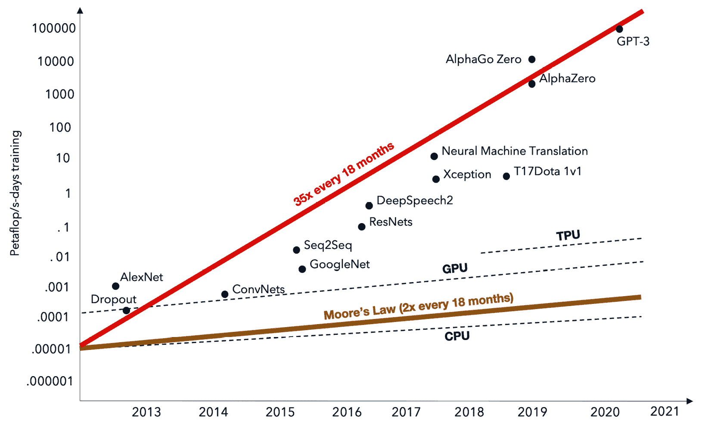
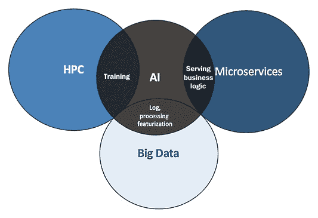
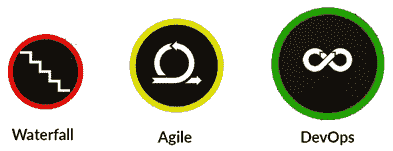
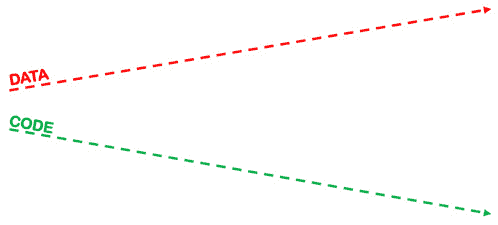
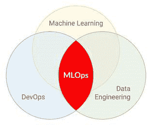
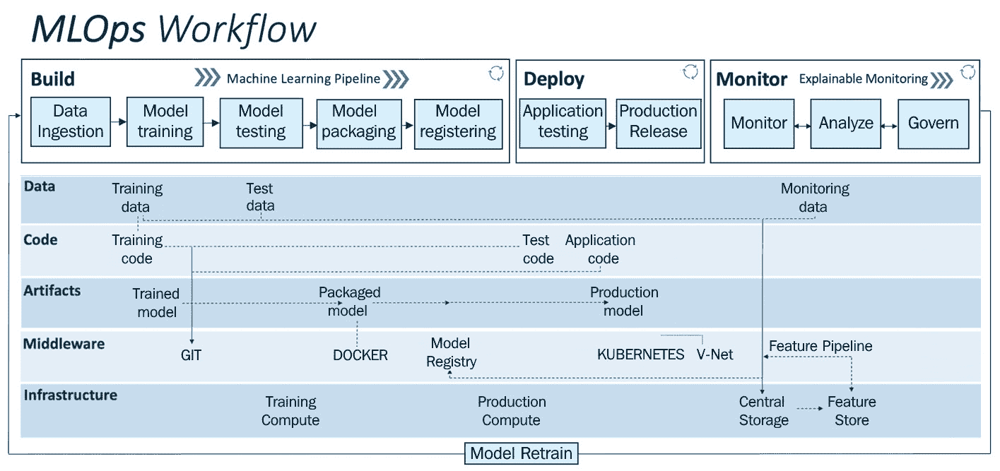
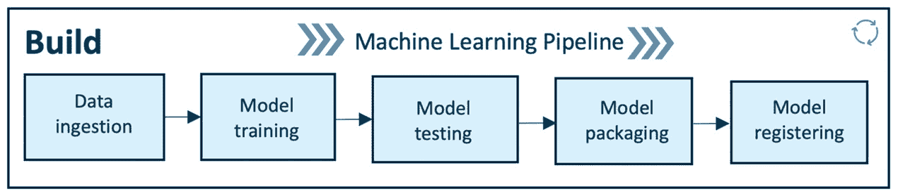
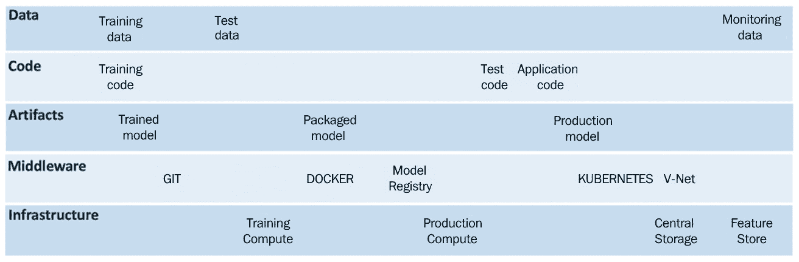

# 第一章：MLOps 工作流程的基础

**机器学习**（**ML**）正从研究走向应用商业解决方案。然而，残酷的现实是，只有 2%使用机器学习的企业成功地将模型部署到生产环境中以增强其业务流程，这是由 DeepLearning.AI 报告的（[`info.deeplearning.ai/the-batch-companies-slipping-on-ai-goals-self-training-for-better-vision-muppets-and-models-china-vs-us-only-the-best-examples-proliferating-patents`](https://info.deeplearning.ai/the-batch-companies-slipping-on-ai-goals-self-training-for-better-vision-muppets-and-models-china-vs-us-only-the-best-examples-proliferating-patents)）。这为什么会如此困难？我们还需要做什么来改善这种情况？

为了对这个问题及其解决方案有一个扎实的理解，在本章中，我们将深入探讨软件开发与机器学习（ML）的演变和交汇。我们将从传统的瀑布模型开始，反思传统软件开发的一些趋势，到敏捷开发再到 DevOps 实践，以及这些实践如何演变以实现以机器学习为中心的应用的工业化。您将了解到使用**机器学习操作**（**MLOps**）实现 AI 运营的系统方法。到本章结束时，您将对 MLOps 有一个扎实的理解，并准备好实施一个通用的 MLOps 工作流程，该工作流程可用于构建、部署和监控各种机器学习应用。

在本章中，我们将涵盖以下主要主题：

+   基础设施和软件开发的发展

+   传统软件开发挑战

+   软件开发中机器学习采用的趋势

+   理解 MLOps

+   MLOps 的概念和工作流程

# 基础设施和软件开发的发展

随着现代互联网时代的起源（大约在 1995 年），我们见证了软件应用的兴起，从 Windows 95 这样的操作系统到 Linux 操作系统，再到 Google 和 Amazon 等网站，这些网站已经为世界（在线）服务了二十多年。这导致了通过收集、存储和处理来自用户交互的大量数据来不断改进服务的文化。这些发展正在塑造 IT 基础设施和软件开发的发展。

自本世纪初以来，IT 基础设施的转型步伐加快。从那时起，企业越来越多地采用云计算，因为它为企业在外包 IT 基础设施维护的同时，提供了必要的 IT 资源，如存储和计算资源以及运行和扩展其运营所需的服务。

云计算提供了按需提供和 IT 资源（如数据存储和计算资源）的可用性，无需用户对 IT 资源进行主动管理。例如，提供计算和存储资源的公司无需直接管理这些资源，也不负责保持它们运行——维护工作外包给了云服务提供商。

使用云计算的企业可以从中获益，因为它们无需购买和维护 IT 资源；这使它们在 IT 资源维护方面的内部专业知识需求减少，从而允许企业优化成本和资源。云计算使按需扩展成为可能，用户按资源使用量付费。因此，我们看到许多公司已经开始将云计算作为其业务和 IT 基础设施的一部分。

从 2006 年开始，云计算在业界变得流行，当时太阳微系统公司在 2006 年 3 月推出了 Sun Grid。这是一个硬件和数据资源共享服务。这项服务被甲骨文公司收购，后来更名为 Sun Cloud。同时，在同年（2006 年），亚马逊推出了另一项名为弹性计算云（Elastic Compute Cloud）的云计算服务。这为企业在按需提供计算、存储和扩展能力方面开辟了新的可能性。从那时起，各行业向采用云计算的转变已经是有机发生的。

在过去十年中，许多全球和区域性的公司推动了云转型，例如谷歌、IBM、微软、UpCloud、阿里巴巴等公司都在云计算服务的研发上进行了大量投资。因此，由于强大的可扩展云服务的可用性，从本地化计算（公司拥有自己的服务器和数据中心）向按需计算转变已经发生。现在，企业和组织能够在云上按需提供资源，以满足他们的数据处理需求。

随着这些发展，我们见证了**摩尔定律**在发挥作用，该定律指出，每两年微芯片上的晶体管数量翻一番——尽管计算机的成本减半，但这至今一直如此。随后，一些趋势正在如下发展。

## 机器学习和深度学习的兴起

在过去十年中，我们见证了机器学习在日常生活中的应用。不仅限于像**Dota**或**AlphaGo**这样的专业应用，机器学习也进入了相当标准的应用，如机器翻译、图像处理和语音识别。

这种采用得益于基础设施的发展，特别是在计算能力的利用方面。它释放了深度学习和机器学习的潜力。我们可以从*图 1.1*（来源：OpenAI：[`openai.com/blog/ai-and-compute`](https://openai.com/blog/ai-and-compute)）中观察到与计算发展相关的深度学习突破：

图 1.1 – 随时间推移由计算支持的深度学习需求

深度学习领域的这些突破得益于计算能力的指数级增长，大约每 18 个月增长 35 倍。展望未来，面对这样的需求，我们可能会在扩大 CPU、GPU 或 TPU 的中心计算规模方面遇到瓶颈。这迫使我们考虑替代方案，例如**分布式学习**，其中数据处理计算分布在多个计算节点上。我们已经看到了分布式学习的一些突破，例如联邦学习和边缘计算方法。分布式学习有望满足深度学习不断增长的需求。

## 摩尔定律的终结

在 2012 年之前，AI 的结果与摩尔定律紧密相关，计算能力每两年翻一番。2012 年之后，计算能力每 3.4 个月翻一番（来源：2019 年 AI 指数 – [`hai.stanford.edu/research/ai-index-2019`](https://hai.stanford.edu/research/ai-index-2019)）。从*图 1.1*中我们可以观察到，深度学习和高性能计算（HPC）的需求正以每 18 个月约 35 倍的速度呈指数增长，而摩尔定律似乎已经落后（每 18 个月翻一番）。摩尔定律仍然适用于 CPU（单核性能）的情况，但不适用于 GPU 和 TPU 等新的硬件架构。这使得摩尔定律在当前需求和趋势面前变得过时和落后。

## 以 AI 为中心的应用程序

应用程序正变得越来越以 AI 为中心——我们在多个行业中都能看到这一点。几乎每个应用程序都开始使用 AI，并且这些应用程序正在分布式工作负载上分别运行，如图*图 1.2*所示：**高性能计算**（HPC）、**微服务**和**大数据**：

图 1.2 – 在分布式工作负载上运行的应用程序

通过结合高性能计算（HPC）和人工智能（AI），我们可以实现训练深度学习（deep learning）和机器学习（ML）模型所需的计算优势。随着大数据和 AI 的融合，我们可以利用大规模提取所需数据来训练 AI 模型，并且随着微服务（microservices）和 AI 的融合，我们可以为推理服务 AI 模型，以增强业务运营和影响。这样，分布式应用已成为新的常态。在规模上开发以 AI 为中心的应用需要分布式应用（HPC、微服务和大数据）的协同作用，为此，需要一种新的软件开发方式。

## 软件开发演变

软件开发与基础设施的发展同步演变，以促进使用该基础设施高效地开发应用程序。传统上，软件开发从瀑布模型开始，开发是线性的，从收集需求到设计和开发。瀑布模型有许多局限性，这导致了多年来软件开发以敏捷方法（Agile methodologies）和 DevOps 方法的形式演变，如图*图 1.3*所示：

图 1.3 – 软件开发演变

### 瀑布模型

**瀑布模型**从互联网时代开始（约 1995 年）就被用来开发软件。这是一种非迭代的软件开发方式。它以单向的方式交付。每个阶段都是预先组织和执行的，从需求收集到软件设计、开发和测试。当需求明确、具体且不随时间变化时，瀑布模型是可行且合适的。因此，它不适合需求会变化和根据用户需求演变的动态项目。在这种情况下，如果存在持续的修改，就不能使用瀑布模型来开发软件。这些都是瀑布开发方法的主要缺点：

+   在开始开发之前必须给出整个需求集；在项目开发期间或之后修改它们是不可能的。

+   很少有机会创建或实现可重用的组件。

+   测试只能在开发完成后进行。测试不是可迭代的；一旦完成，就无法回去修复任何东西。此外，客户验收测试经常引入变化，导致交付延迟和成本高昂。这种开发和测试方式可能会对项目交付时间表和成本产生负面影响。

+   大多数情况下，系统的用户都是基于开发者的理解来配置的，这种系统不是以用户为中心的，可能无法满足他们的需求。

### 敏捷方法

**敏捷方法**促进了软件开发的迭代和渐进式方法。与瀑布方法不同，敏捷方法精确且以用户为中心。该方法是双向的，通常涉及最终用户或客户参与开发和测试过程，以便他们在项目开发过程和阶段中有机会测试、提供反馈和提出改进建议。敏捷方法相对于瀑布方法有以下几个优点：

+   在开始开发之前定义需求，但它们可以在任何时候进行修改。

+   有可能创建或实现可重用组件。

+   解决方案或项目可以通过将项目划分为不同的模块并定期交付来模块化。

+   用户或客户可以通过定期测试和评估开发解决方案模块来共同创造，以确保满足业务需求。这样的以用户为中心的过程确保了关注满足客户和业务需求的质量结果。

下面的图表显示了**瀑布**和**敏捷**方法之间的差异：

![图 1.4 – 瀑布模型与敏捷方法之间的差异

![img/B16572_01_004.jpg]

图 1.4 – 瀑布模型与敏捷方法之间的差异

### DevOps 方法

**DevOps 方法**通过进一步简化软件变更在**构建**、**测试**、**部署**和**交付**阶段之间的流动，扩展了敏捷开发实践。DevOps 赋予跨职能团队执行由持续集成、持续部署和持续交付驱动的软件应用的自主权。它鼓励软件开发人员和 IT 操作人员之间的协作、集成和自动化，以提高以客户为中心的软件交付的效率、速度和质量。DevOps 为设计、测试、部署和监控生产环境中的系统提供了一个简化的软件开发框架。DevOps 使得软件能够在几分钟内发布到生产环境，并保持其稳定运行。

# 传统软件开发挑战

在上一节中，我们观察了传统软件开发从瀑布模型向敏捷和 DevOps 实践的转变。敏捷和 DevOps 实践使公司能够可靠地发布软件。DevOps 使得软件能够在几分钟内发布到生产环境，并保持其稳定运行。这种方法如此成功，以至于许多公司已经开始采用它，那么为什么我们不能继续为机器学习应用做同样的事情呢？

主要原因是机器学习开发与传统软件开发之间存在根本性的差异：*机器学习不仅仅是代码；它是代码加上数据*。一个机器学习模型是通过应用算法（通过代码）来拟合数据，从而生成一个机器学习模型，如图*1.5*所示：

![图 1.5 – 机器学习 = 数据 + 代码

![img/B16572_01_005.jpg]

图 1.5 – 机器学习 = 数据 + 代码

在开发环境中，代码被精心制作，而数据则来自多个来源，用于训练、测试和推理。数据在体积、速度、真实性和多样性方面随着时间的推移而变得强大且不断变化。为了跟上数据的发展，代码也会随着时间的推移而演变。为了有更直观的了解，它们之间的关系可以观察为代码和数据生活在不同的平面上，这些平面共享时间维度，但在所有其他方面都是独立的。ML 开发过程的挑战在于以受控的方式在这两个平面之间建立桥梁：

图 1.6 – 随时间推移的数据和代码进展

随着时间的推移，数据和代码最终走向两个方向，目标都是构建和维护一个强大且可扩展的 ML 系统。这种脱节导致了许多挑战，任何试图将 ML 模型投入生产的人都必须解决这些挑战。它带来了诸如缓慢、脆弱、碎片化和不一致的部署，以及缺乏可重复性和可追溯性的挑战。

为了克服这些挑战，MLOps 通过在时间进程中将数据和代码结合起来，提供了一种系统性的方法。这是解决传统软件开发方法在 ML 应用方面所提出的挑战的解决方案。使用 MLOps 方法，数据和代码随着时间的推移在一个方向上进步，目标是构建和维护一个强大且可扩展的 ML 系统：

图 1.7 – MLOps – 数据和代码共同进步

MLOps 通过一种简化和系统化的方法促进 ML 模型的发展、部署和监控。它使数据科学和 IT 团队能够协作、验证和治理他们的操作。团队执行的所有操作都被记录或审计，端到端可追溯且可重复。在接下来的章节中，我们将学习 MLOps 如何使数据科学和 IT 团队能够构建和维护强大且可扩展的 ML 系统。

# 软件开发中机器学习采用的趋势

在我们深入探讨 MLOps 方法和工作流程之前，了解 MLOps 在全球范围内如何颠覆以及其大图景和趋势是有益的。由于许多应用正变得以 AI 为中心，软件开发正在演变以促进 ML。ML 将越来越多地成为软件开发的一部分，主要原因如下：

+   **投资**：2019 年，全球私人人工智能投资超过 700 亿美元，其中与人工智能相关的初创企业投资超过 370 亿美元，并购投资 340 亿美元，首次公开募股（IPO）50 亿美元，以及约 20 亿美元的少数股权。全球人工智能的市场价值预测显示，随着 2018 年人工智能达到 95 亿美元，预计到 2025 年将达到 1180 亿美元。据评估，到 2030 年，由人工智能引发的经济活动增长将具有很高的价值和意义。目前，美国吸引了约 50%的全球风险投资（VC），中国约 39%，11%流向欧洲。

+   **大数据**：数据在量、速度、真实性和多样性方面呈指数级增长。例如，观察表明，在欧洲，数据量每年增长 61%，预计到 2025 年，将比现在多出四倍的数据。数据是开发人工智能的必需原材料。

+   **基础设施发展和采用**：摩尔定律一直被密切关注，并在 2012 年之前得以实现。2012 年之后，计算能力每 3.4 个月翻一番。

+   **研发增长**：人工智能研究在质量和数量上都在蓬勃发展。从 1998 年到 2018 年，同行评审的人工智能论文数量增长了 300%，总计占已发表会议论文的 9%和同行评审期刊发表的 3%。

+   **产业**：根据一份调查报告，47%的大公司报告称至少在一个职能或业务单元中采用了人工智能。到 2019 年，这一比例上升至 58%，预计还将继续增长。

    信息

    这些观点来源于对可信赖人工智能的政策和投资建议——欧洲委员会([`ec.europa.eu/digital-single-market/en/news/policy-and-investment-recommendations-trustworthy-artificial-intelligence`](https://ec.europa.eu/digital-single-market/en/news/policy-and-investment-recommendations-trustworthy-artificial-intelligence))和 AI 指数 2019([`hai.stanford.edu/research/ai-index-2019`](https://hai.stanford.edu/research/ai-index-2019))。

所有这些发展都表明，人工智能的工业化进程正在加速，这是通过连接产业和研究实现的。MLOps 将在人工智能的工业化中扮演关键角色。如果你投资学习这种方法，它将使你在公司或团队中领先一步，你可能会成为实现机器学习和工业化的催化剂。

到目前为止，我们已经了解了 IT、软件开发和人工智能的一些挑战和发展。接下来，我们将从概念上深入了解 MLOps，并详细学习一个通用的 MLOps 工作流程，该流程可以用于任何用例。这些基础知识将帮助你牢固掌握 MLOps。

# 理解 MLOps

软件开发是跨学科的，并且正在不断发展以促进机器学习。MLOps 是一种新兴的方法，通过整合多个领域（MLOps 结合了机器学习、DevOps 和数据工程），将机器学习与软件开发融合，旨在在生产环境中可靠且高效地构建、部署和维护机器学习系统。因此，MLOps 可以通过这种交叉点来阐述。

图 1.8 – MLOps 交叉点

为了使这个交叉点（MLOps）能够运行，我遵循了 Wieringa 提出的系统化**设计科学方法**([`doi.org/10.1007/978-3-662-43839-8`](https://doi.org/10.1007/978-3-662-43839-8))设计了一个模块化框架，以开发一个工作流程，将这三个领域（数据工程、机器学习和 *DevOps*）结合起来。设计科学伴随着将设计应用于问题和情境。在这个案例中，工件是 MLOps 工作流程，它是通过迭代与问题情境（AI 应用案例的行业用例）交互而设计的。设计科学是在情境中对工件的设计和研究。在这个案例中，工件是 MLOps 工作流程，它是通过迭代与问题情境（AI 应用的行业用例）交互而设计的：

图 1.9 – 设计科学工作流程

采用结构化和迭代的方法，通过迭代对 MLOps 工作流程设计进行了定性和定量分析，包括两个周期（设计周期和经验周期）。这些周期导致开发并验证了一个 MLOps 工作流程，通过将其应用于多个问题情境，即跨多个行业的数十个机器学习用例（例如，异常检测、实时交易、预测性维护、推荐系统、虚拟助手等）。我已经在多个行业的多个项目中成功应用并验证了这个 MLOps 工作流程，以实施机器学习。在下一节中，我们将探讨设计科学过程的结果所设计的 MLOps 工作流程的概念。

# MLOps 的概念和工作流程

在本节中，我们将了解一个通用的 MLOps 工作流程；它是通过前述章节中讨论的许多设计周期迭代的结果。它以简化的方式将数据工程、机器学习和 DevOps 结合起来。*图 1.10* 是一个通用的 MLOps 工作流程；它是模块化和灵活的，可用于构建概念验证或在任何商业或行业中实施机器学习解决方案：

图 1.10 – MLOps 工作流程

此工作流程分为两个模块：

+   **MLOps 管道**（构建、部署和监控）– 上层

+   **驱动因素**：数据、代码、工件、中间件和基础设施 – 中下层

上层是 MLOps 管道（构建、部署和监控），它由数据、代码、工件、中间件和基础设施等驱动程序启用。MLOps 管道由一系列服务、驱动程序、中间件和基础设施提供动力，并构建 ML 驱动的解决方案。通过使用此管道，企业或个人可以快速进行原型设计、测试和验证，并以经济高效的方式将模型（s）部署到生产环境中。

为了理解 MLOps 工作流程的运作和实现，我们将通过一个比喻性的商业案例来查看每一层和每一步的实现。

## 讨论用例

在这个用例中，我们需要将（原型设计和部署到生产环境）一个图像分类服务进行运营，以对位于西班牙巴塞罗那的宠物公园中的猫和狗进行分类。该服务将实时从安装在宠物公园的监控摄像头中获取的推理数据中识别猫和狗。

宠物公园为您提供访问数据和基础设施的权限，以实现服务的运营：

+   **数据**: 宠物公园已经为您提供了访问其数据湖的权限，其中包含 10 万张标记好的猫和狗的图片，我们将使用这些图片来训练模型。

+   **基础设施**: 公共云（IaaS）。

这个用例类似于实际生活中的 ML 运营用例，用于解释 MLOps 工作流程的运作和实现。请记住，在每个 MLOps 工作流程的每个部分和步骤中寻找对这个用例实现的解释。现在，让我们详细查看每一层和每一步的运作。

### MLOps 管道

MLOps 管道是上层，执行构建、部署和监控等操作，这些操作以模块化方式相互同步。让我们深入了解每个模块的功能。

#### 构建

构建模块包含核心 ML 管道，这纯粹是为了训练、打包和版本控制 ML 模型。它由运行 ML 训练和管道所需的计算资源（例如，云或分布式计算中的 CPU 或 GPU）提供动力：

图 1.11 – MLOps – 构建管道

管道从左到右工作。让我们详细查看每一步的功能：

+   **数据摄取**: 这一步是 ML 管道的触发步骤。它通过从各种数据源（例如，数据库、数据仓库或数据湖）提取数据，并摄取模型训练步骤所需的必要数据来处理数据的量、速度、真实性和多样性。连接到多个数据源的健壮数据管道能够执行**提取、转换和加载**（**ETL**）操作，为 ML 训练提供必要的数据。在这一步中，我们可以根据所需格式（例如，训练集或测试集）对数据进行拆分和版本控制。因此，任何实验（即模型训练）都可以进行审计，并且可以回溯。

    为了更好地理解数据摄取步骤，以下是之前描述的用例实现：

    *用例实现*

    由于你有访问宠物公园数据湖的权限，你现在可以获取数据以开始。使用数据管道（数据摄取步骤的一部分），你执行以下操作：

    1. 提取、转换并加载 10 万张猫和狗的图片。

    2. 将这些数据分割并版本化为训练集和测试集（80%和 20%的分割）。

    对数据进行版本控制将使训练的模型实现端到端的可追溯性。

    恭喜——现在你已准备好开始使用这些数据训练和测试机器学习模型。

+   **模型训练**：在上一步骤中获取了用于机器学习模型训练所需的数据后，这一步骤将启用模型训练；它包含模块化脚本或代码，执行机器学习中的所有传统步骤，例如在训练或重新训练任何模型之前进行数据预处理、特征工程和特征缩放。随后，在执行超参数调整以使模型适应数据集（训练集）的过程中进行机器学习模型的训练。这一步骤可以手动完成，但存在如**网格搜索**或**随机搜索**等高效且自动的解决方案。因此，所有重要的机器学习模型训练步骤都通过这一步骤以机器学习模型作为输出执行。

    *用例实现*

    在这一步骤中，我们实现了训练图像分类模型的所有重要步骤。目标是训练一个机器学习模型来对猫和狗进行分类。为此案例，我们为图像分类服务训练了一个**卷积神经网络**（**CNN** – [`towardsdatascience.com/wtf-is-image-classification-8e78a8235acb`](https://towardsdatascience.com/wtf-is-image-classification-8e78a8235acb)）。以下步骤得到实现：训练前的数据预处理、特征工程和特征缩放，随后通过超参数调整训练模型。结果，我们得到了一个 97%准确率的 CNN 模型来对猫和狗进行分类。

+   **模型测试**：在这一步骤中，我们评估训练的模型在分离的数据点集（测试数据，在数据摄取步骤中分割并版本化）上的性能。根据用例选择指标评估训练模型的推理。这一步骤的输出是关于训练模型性能的报告。

    *用例实现*

    我们在测试数据上测试训练的模型（我们在*数据摄取*步骤中较早分割了数据）以评估训练模型的性能。在这种情况下，我们寻找精确率和召回率来验证模型在分类猫和狗时的性能，以评估假阳性和真阳性，从而对模型性能有一个现实的理解。如果我们对结果满意，我们可以进入下一步，否则重复之前的步骤以获得一个适合宠物公园图像分类服务的良好性能模型。

+   **模型打包**：在前面步骤中对训练好的模型进行测试后，模型可以被序列化到文件或容器化（使用 Docker）以导出到生产环境。

    *用例实现*

    在前面的步骤中训练和测试的模型被序列化为 ONNX 文件，并准备好在生产环境中部署。

+   **模型注册**：在这个步骤中，前面步骤中序列化或容器化的模型被注册并存储在模型注册表中。一个注册的模型是一个逻辑集合或包，它组装、表示和执行你的机器学习模型。例如，多个文件可以注册为一个模型。例如，一个分类模型可以由一个向量器、模型权重和序列化模型文件组成。所有这些文件都可以注册为一个单一模型。注册后，模型（所有文件或单个文件）可以根据需要下载和部署。

    *用例实现*

    在前面的步骤中序列化的模型已在模型注册表中注册，并可用于快速部署到宠物公园生产环境。

    通过实施前面的步骤，我们成功执行了为我们的用例设计的机器学习流程。因此，我们在模型注册表中训练了模型，准备在生产设置中部署。接下来，我们将探讨部署流程的工作原理。

#### 部署

部署模块使我们能够将前面模块（构建）中开发的机器学习模型进行操作化。在这个模块中，我们在生产环境或类似生产环境（测试）中对模型性能和行为进行测试，以确保机器学习模型在生产使用中的鲁棒性和可扩展性。*图 1.12* 描述了部署流程，该流程有两个组件 – 生产测试和生产发布 – 并且部署流程通过连接开发到生产环境的简化 CI/CD 管道来实现：

![Figure 1.12 – MLOps – deploy pipeline

![img/B16572_01_12.jpg]

图 1.12 – MLOps – 部署流程

它从左到右工作。让我们详细看看每个步骤的功能：

+   **应用测试**：在将机器学习模型部署到生产环境之前，通过测试来检验其鲁棒性和性能至关重要。因此，我们有一个“应用测试”阶段，在这个阶段，我们严格测试所有训练好的模型在类似生产环境的测试环境中对鲁棒性和性能。在应用测试阶段，我们在测试环境（预生产）中部署模型，该环境复制了生产环境。

    测试用的机器学习模型作为 API 或流式服务部署在测试环境中的部署目标，如 Kubernetes 集群、容器实例、可扩展的虚拟机或边缘设备，具体取决于需求和用例。在模型部署用于测试后，我们使用测试数据（这些数据未用于训练模型；测试数据是从生产环境中的样本数据）对部署的模型进行预测，在此期间对测试环境中部署的模型进行批量或定期推理以测试其鲁棒性和性能。

    性能结果由质量保证专家自动或手动审查。当机器学习模型的性能达到标准时，则批准其在生产环境中部署，在该环境中模型将被用于批量或实时推理以做出业务决策。

    *用例实现*

    我们将模型作为 API 服务部署在宠物公园的本地计算机上，该计算机是为测试目的而设置的。该计算机连接到公园的 CCTV 摄像头，以获取实时推理数据来预测视频帧中的猫或狗。模型部署由 CI/CD 管道启用。在此步骤中，我们在类似生产的环境中测试模型的鲁棒性，即模型是否始终如一地进行推理，以及准确性、公平性和错误分析。在此步骤结束时，如果模型符合标准，则质量保证专家对模型进行认证。

+   **生产发布**：之前测试和批准的模型部署在生产环境中进行模型推理以生成业务或运营价值。此生产发布由 CI/CD 管道部署到生产环境。

    *用例实现*

    我们将之前经过测试和批准的模型（由质量保证专家进行）作为 API 服务部署在连接到宠物公园 CCTV 的计算机上（生产环境）。该部署模型对来自宠物公园 CCTV 摄像头的实时视频数据进行机器学习推理，以实时分类猫或狗。

#### 监控

监控模块与部署模块同步工作。使用可解释监控（将在*第十一章*，*监控您的机器学习系统的关键原则*）中详细讨论），我们可以监控、分析和治理部署的机器学习应用程序（机器学习模型和应用程序）。首先，我们可以监控机器学习模型（使用预定义的指标）和部署的应用程序（使用遥测数据）。其次，可以使用预定义的可解释性框架分析模型性能，最后，可以使用基于模型的质量保证和控制警报和操作来治理机器学习应用程序。这确保了生产系统的强大监控机制：

图 1.13 – MLOps – 监控管道

让我们详细看看监控模块的每个能力：

+   **监控**：监控模块捕获关键信息以监控数据完整性、模型漂移和应用性能。可以使用遥测数据来监控应用性能。它描绘了生产系统在一段时间内的设备性能。通过加速度计、陀螺仪、湿度、磁力计、压力和温度等遥测数据，我们可以监控生产系统的性能、健康和寿命。

    *用例实现*

    在实时监控中，我们将监控公园计算机上部署的 API 服务的三个关键指标——数据完整性、模型漂移和应用性能。如准确性、F1 分数、精确率和召回率等指标被跟踪以评估数据完整性和模型漂移。我们通过跟踪运行部署的机器学习模型的生产系统（公园中的本地计算机）的遥测数据来监控应用性能，以确保生产系统的正常运行。遥测数据被监控以预见任何异常或潜在的故障，并提前修复。遥测数据被记录，可以用来评估生产系统性能随时间的变化，以检查其健康和寿命。

+   **分析**：分析在生产系统中部署的机器学习模型的性能对于确保与业务决策或影响相关的最佳性能和治理至关重要。我们使用模型可解释性技术来实时衡量模型性能。利用这一点，我们评估模型公平性、可信度、偏差、透明度和错误分析等重要方面，目的是改善与业务相关的模型。

    随着时间的推移，我们试图预测的目标变量的统计特性可能会以不可预见的方式发生变化。这种变化被称为“模型漂移”，例如，在我们部署推荐系统模型以向用户推荐合适的项目的情况下。由于无法观察到用于训练模型的历史数据中的不可预见趋势，用户行为可能会发生变化。考虑到这些不可预见因素，确保部署的模型提供最佳和最相关的业务价值至关重要。当观察到模型漂移时，应执行以下任何一项操作：

    a) 产品负责人或质量保证专家需要被通知。

    b) 需要切换或更新模型。

    c) 应触发管道的重新训练，以便根据最新的数据或需求重新训练和更新模型。

    *用例实现*

    我们监控在生产系统中部署的模型的表现（一个连接到宠物公园 CCTV 的电脑）。我们将定期（每天一次）分析模型的准确率、精确率和召回率，以确保模型的表现不会低于阈值。当模型的表现低于阈值时，我们将启动系统治理机制（例如，触发重新训练模型）。

+   **治理**：监控和分析是为了治理部署的应用程序，以驱动业务（或机器学习系统的目的）的最佳性能。在监控和分析生产数据后，我们可以生成某些警报和行动来治理系统。例如，当模型的表现低于预先定义的阈值（例如，低准确率、高偏差等）时，产品负责人或质量保证专家会收到警报。产品负责人启动一个触发器来重新训练和部署替代模型。最后，治理的一个重要方面是“合规”与当地和全球的法律和规则。为了合规，模型的可解释性和透明度至关重要。为此，进行模型审计和报告，以提供生产模型端到端的可追溯性和可解释性。

    *用例实现*

    我们监控和分析在生产系统中部署的模型的表现（一个连接到宠物公园 CCTV 的电脑）。基于对部署模型准确率、精确率和召回率的分析，定期（每天一次），当模型的表现低于预先定义的阈值时，会生成警报。公园的产品负责人会采取行动，这些行动基于警报。例如，生成一个警报通知产品负责人，生产模型检测狗比猫的偏差高达 30%。然后，产品负责人触发模型重新训练流程，使用最新数据更新模型以减少偏差，从而在生产中实现公平且稳健的模型。这样，巴塞罗那宠物公园的机器学习系统得到了良好的治理，以满足业务需求。

这就带我们来到了 MLOps 管道的尽头。所有使用 MLOps 方法训练、部署和监控的模型都是端到端可追溯的，并且它们的血缘记录在案，以便追踪模型的起源，包括模型用于训练的源代码、用于训练和测试模型的数据以及用于收敛模型的参数。完整的血缘记录对于审计操作或复制模型非常有用，或者在遇到阻塞时，记录的 ML 模型血缘记录有助于回溯模型的起源或观察和调试阻塞的原因。由于机器学习模型在推理过程中在生产中生成数据，这些数据可以与模型训练和部署血缘记录相关联，以确保端到端血缘记录，这对于某些合规性要求非常重要。接下来，我们将探讨使 MLOps 管道得以实现的关键驱动因素。

### 驱动因素

这些是 MLOps 管道的驱动因素：数据、代码、工件、中间件和基础设施。让我们深入了解每个驱动因素，以了解它们如何使 MLOps 管道得以实现：

图 1.14 – MLOps 驱动因素

MLOps 管道的关键驱动因素如下定义：

+   **数据**：数据可以以多种形式存在，例如文本、音频、视频和图像。在传统的软件应用中，数据往往是有结构的，而对于机器学习应用来说，它可以是结构化的或非结构化的。为了管理机器学习应用中的数据，数据在这些步骤中处理：数据采集、数据标注、数据编目、数据准备、数据质量检查、数据抽样和数据增强。每个步骤都涉及它自己的生命周期。这使得为机器学习应用需要一套全新的流程和工具。为了使机器学习管道高效运行，数据被分割和版本化为训练数据、测试数据和监控数据（例如在生产中收集的模型输入、输出和遥测数据）。这些数据操作是 MLOps 管道的一部分。

+   **代码**：推动 MLOps 管道的三个基本代码模块是：训练代码、测试代码和应用代码。这些脚本或代码通过 CI/CD 和数据管道执行，以确保 MLOps 管道的稳健运行。源代码管理系统（例如，使用 Git 或 Mercurial）将启用编排，并在管理和无缝集成 CI、CD 和数据管道中发挥关键作用。所有代码都在源代码管理设置中阶段化和版本化（例如，Git）。

+   **工件**：MLOps 管道生成诸如数据、序列化模型、代码片段、系统日志、机器学习模型训练和测试指标信息等工件。所有这些工件都对 MLOps 管道的成功运行非常有用，确保其可追溯性和可持续性。这些工件通过使用中间件服务（如模型注册、工作区、日志服务、源代码管理服务、数据库等）进行管理。

+   **中间件**：中间件是向软件应用程序提供比操作系统提供的更多服务的计算机软件。中间件服务确保多个应用程序自动化和编排 MLOps 管道的过程。我们可以根据用例使用各种中间件软件和服务，例如，Git 用于源代码管理，VNets 用于启用所需的网络配置，Docker 用于将我们的模型容器化，以及 Kubernetes 用于容器编排以自动化应用程序的部署、扩展和管理。

+   **基础设施**：为了确保 MLOps 管道的成功运行，我们需要必要的计算和存储资源来训练和部署机器学习模型。计算资源使我们能够训练、部署和监控我们的机器学习模型。有两种类型的存储资源可以促进机器学习操作，即中心存储和特征存储。中心存储存储日志、工件、训练、测试和监控数据。特征存储是可选的，与中心存储互补。它使用特征管道提取、转换和存储机器学习模型训练和推理所需的特征。在基础设施方面，有多种选择，例如本地资源或**基础设施即服务（IaaS）**，即云服务。如今，有许多云服务提供商提供 IaaS，例如亚马逊、微软、谷歌、阿里巴巴等。为您的用例选择合适的基础设施将使您的团队和公司能够进行稳健、高效和节约的操作。

    通过智能优化和所有这些驱动因素与 MLOps 管道的协同作用，可以实现完全自动化的工作流程。实施自动化 MLOps 工作流程的一些直接优势是提高 IT 团队的效率（通过减少数据科学家和开发人员在日常和重复性任务上的时间）和资源的优化，从而降低成本，这对任何企业来说都是非常好的。

# 摘要

在本章中，我们了解了软件开发和基础设施的演变，以促进机器学习的发展。我们深入探讨了 MLOps 的概念，随后熟悉了一个通用的 MLOps 工作流程，该工作流程可以应用于多个行业中的广泛机器学习解决方案。

在下一章中，你将学习如何将任何机器学习问题转化为由 MLOps 驱动的解决方案，并开始使用 MLOps 工作流程来开发它。
