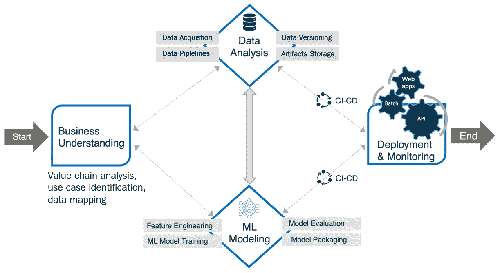
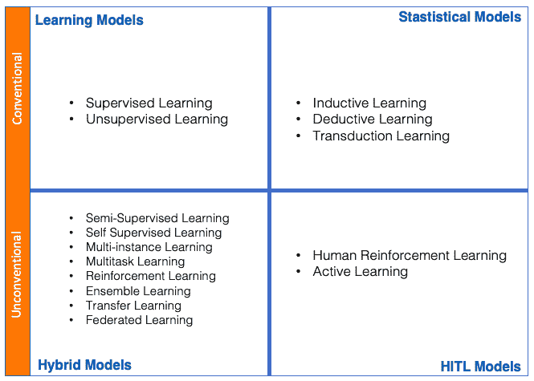
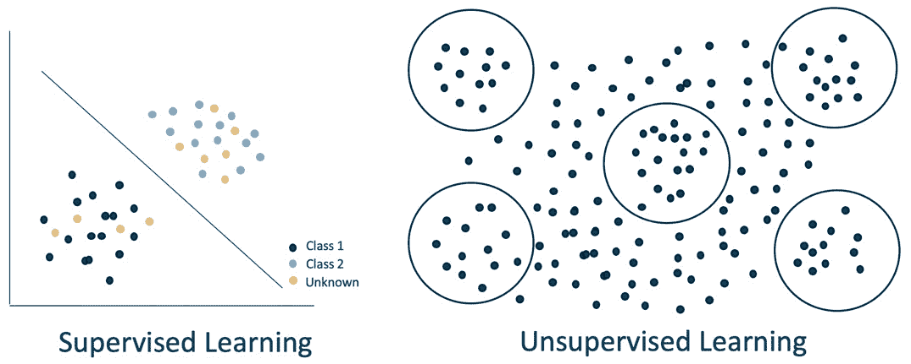
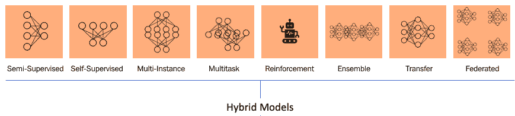
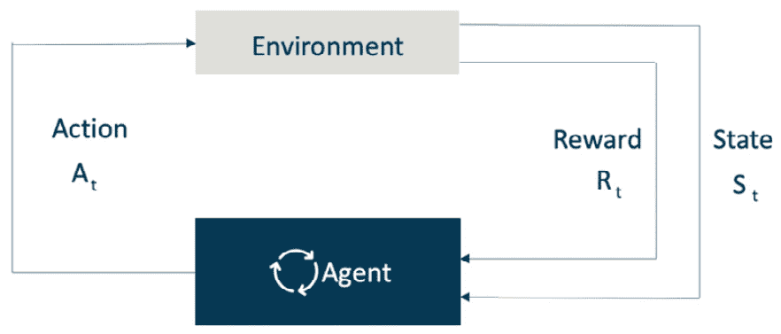
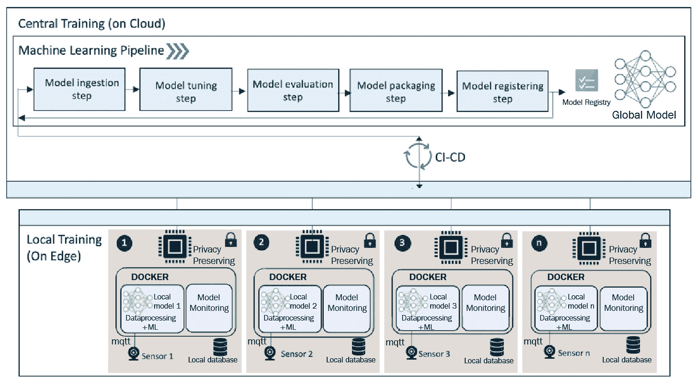
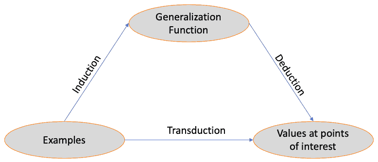
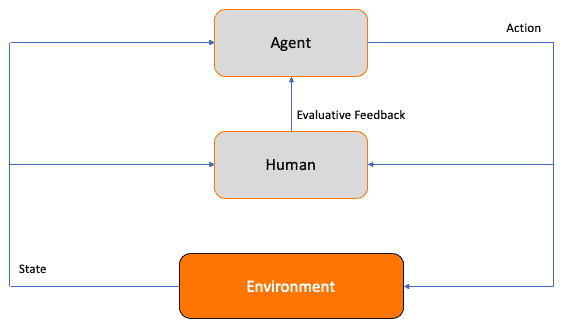
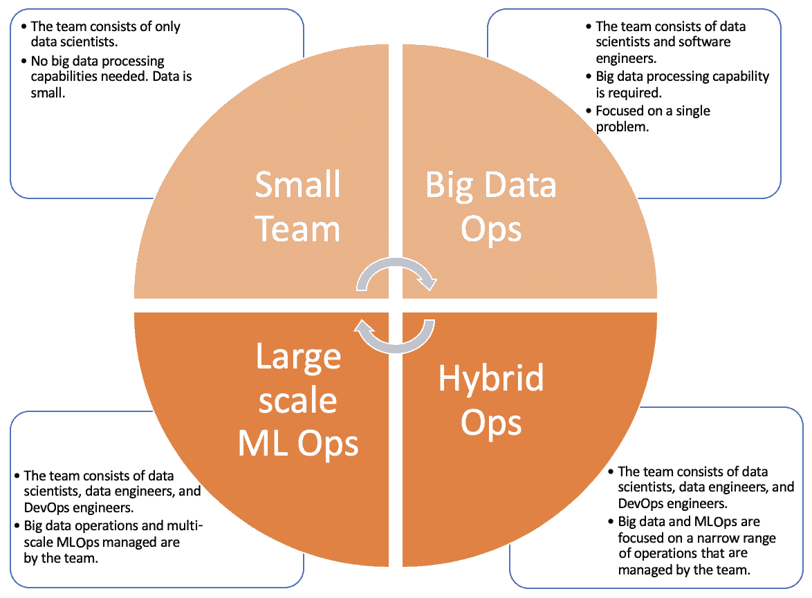
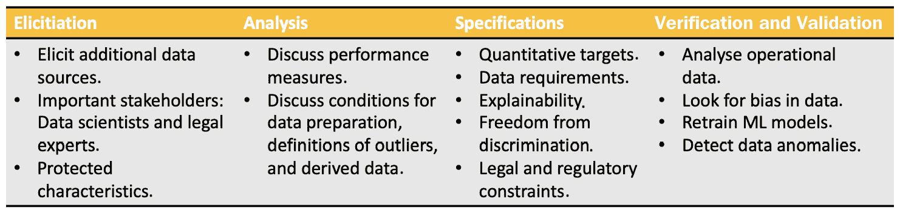

# 第二章：描述你的机器学习问题

在本章中，你将获得对可用于生产的各种类型**机器学习**（**ML**）解决方案的基本理解，并将学会根据你组织的商业和技术需求对相关操作进行分类。你将学习如何制定实现路线图以使机器学习解决方案投入运营，然后获取任何给定问题的必要工具和基础设施。到本章结束时，你将牢固地理解如何构建稳健且可扩展的机器学习解决方案，并获取实施这些解决方案所需的数据和工具。

**机器学习运维**（**MLOps**）旨在利用最先进的工程原理将学术界与工业界连接起来，我们将探讨来自学术界和工业界的不同元素，以获得对可能性的全面理解和认识。在开始构建你的 MLOps 解决方案之前，了解解决面向商业问题的各种可能性、设置、问题、解决方案和方法论是很重要的。为了达到这种理解，我们将在本章中涵盖以下主要主题：

+   机器学习解决方案开发过程

+   机器学习模型类型

+   描述你的 MLOps

+   解决方案的实现路线图

+   获取必要的数据、工具和基础设施

+   介绍一个现实生活中的商业问题

不再拖延，让我们深入探讨机器学习解决方案开发过程，并检查不同类型的机器学习模型以解决商业问题所提供的可能性。

# 机器学习解决方案开发过程

机器学习提供了许多增强和自动化业务的可能性。为了从机器学习中获得最佳效果，参与机器学习驱动的业务转型的团队和个人需要理解机器学习本身以及业务本身。有效的业务转型始于对业务的初步了解，包括价值链分析、用例识别、数据映射和业务模拟以验证业务转型。*图 2.1* 展示了开发机器学习解决方案以增强或自动化业务运营的过程：

图 2.1 – 机器学习解决方案开发过程

商业理解是开发机器学习解决方案的起点。在具备良好的商业理解之后，我们进入数据分析阶段，在此阶段获取、版本控制和存储正确的数据。使用数据管道消耗数据以进行机器学习建模，其中进行特征工程以获取训练模型所需的正确特征。我们评估训练好的模型并将它们打包以供部署。部署和监控使用利用**持续集成/持续部署**（**CI/CD**）功能的管道进行，这些功能使实时和持续部署成为可能，以便将训练好的机器学习模型服务于用户。此过程确保了稳健和可扩展的机器学习解决方案。

# 机器学习模型的类型

由于有选择性的机器学习和深度学习模型可以解决相同的企业问题，因此为了进行有效的算法选择，了解机器学习模型的全景至关重要。大约有 15 种机器学习技术，这些技术被分为 4 个类别，即**学习模型**、**混合模型**、**统计模型**和**人机交互**（**HITL**）模型，如以下矩阵所示（其中每个网格方格反映这些类别之一）在*图 2.2*中。值得注意的是，还有其他可能的分类机器学习模型的方法，并且它们都不是完全完整的，因此这些分类在某些场景中是合适的，而在其他场景中则不合适。以下是我们的推荐分类，用于查看机器学习模型：

图 2.2 – 机器学习模型的类型

## 学习模型

首先，我们将探讨两种标准学习模型，**监督学习**和**无监督学习**：

图 2.3 – 监督学习与无监督学习对比

### 监督学习

监督学习模型或算法是基于标记数据进行训练的。在训练数据中，输入的结果是标记或已知的。因此，模型被训练来预测当给定输入时基于其学习的标记数据的结果，并且你告诉系统哪个输出与系统中的给定输入相对应。

监督学习模型在窄人工智能案例和定义明确的任务上非常有效，但只能在有足够和全面标记数据的情况下发挥作用。我们可以在*图 2.3*中看到，在监督学习的情况下，模型已经学会了预测和分类输入。

考虑一个图像分类模型的例子，该模型用于对猫和狗的图像进行分类。一个监督学习模型在包含数千张正确标记的猫和狗图像的标记数据上训练。训练好的模型随后学会将给定的输入图像分类为包含狗或猫。

### 无监督学习

无监督学习与机器在没有人类监督的情况下四处运行并执行事情无关。无监督学习模型或算法从未标记的数据中学习。无监督学习可以用于从未标记数据中挖掘见解和识别模式。无监督算法广泛用于聚类或异常检测，而不依赖于任何标签。这些算法可以是模式发现算法；当数据被输入到这样的算法中时，它将识别模式，并将这些模式转化为一个新数据输入的配方，无需标签，并对其应用正确的标签。

无监督学习主要用于分析，尽管你也可以用它进行自动化和机器学习。由于这些算法的动态性质，它们会在每个训练周期中改变输出，因此建议不要在生产中使用这些算法。然而，它们可以用于自动化某些过程，例如分割传入数据或在实时中识别异常。 

让我们讨论一个将新闻文章聚类到相关组中的例子。假设你拥有数千篇没有标签的新闻文章，而你希望识别文章的类型或类别。要对这些文章执行无监督学习，我们可以将一系列文章输入到算法中，并使其收敛到将相似事物组合在一起（即聚类）的四个组中。然后，我们查看这些聚类，发现相似的文章已经被分组到政治、体育、科学和健康等类别中。这是在数据中挖掘模式的一种方式。

## 混合模型

通过结合传统方法开发混合模型来解决各种商业和研究问题，机器学习（ML）已经取得了快速发展。让我们了解一下一些混合模型及其工作原理。*图 2.4* 展示了各种混合模型：

图 2.4 – 混合模型类型

### 半监督学习

**半监督学习**是监督学习和无监督学习的一种混合，用于只有少量样本被标记而大量样本未被标记的情况。半监督学习使得对可用数据进行有效利用（尽管并非所有数据都被标记）成为可能，包括未标记的数据。例如，文本文档分类器是半监督学习程序的一个典型例子。在这种情况下，很难找到大量标记的文本文档，因此半监督学习是理想的。这是因为让某人阅读整个文本文档只是为了分配一个基本的分类是不高效的。因此，半监督学习使得算法能够从有限数量的标记文本文档中学习，同时分类训练数据中存在的大量未标记文本文档。

### 自监督学习

**自监督学习**问题是无监督学习问题，其中数据未标记；这些问题被转换为监督学习问题，以便应用监督学习算法来持续解决它们。通常，自监督算法用于解决一个替代任务，在这个任务中它们自我监督以解决问题或生成输出。自监督学习的一个例子是**生成对抗网络**（GANs）；这些通常通过在标记和/或未标记数据上训练来生成合成数据。经过适当的训练，GAN 模型可以以自监督的方式生成相关输出。例如，一个 GAN 可以根据文本描述输入生成人脸，例如*性别：男性，年龄：30，颜色：棕色*等等。

### 多实例学习

**多实例学习**是一个监督学习问题，其中数据不是由单个数据样本标记，而是在类别或类别中累积标记。与典型的监督学习相比，其中每个数据样本都会进行标记，例如新闻文章被标记在政治、科学和体育等类别中，而在多实例学习中，标记是按类别进行的。在这种情况下，单个样本在多个类别中集体标记，并且通过使用监督学习算法，我们可以进行预测。

### 多任务学习

**多任务学习**是监督学习的一种体现，涉及在一个数据集上训练模型，并使用该模型来解决多个任务或问题。例如，对于自然语言处理，我们使用词嵌入或**双向编码器表示从转换器**（BERT）嵌入模型，这些模型在一个大型数据语料库上进行了训练。（BERT 是一个预训练模型，在大型文本语料库上进行了训练。该模型对给定的人类语言如何工作有深刻的理解。）这些模型可以用于解决许多监督学习任务，如文本分类、关键词提取、情感分析等。

### 强化学习

**强化学习**是一种学习类型，其中代理，如机器人系统，学习在定义的环境中操作以执行顺序决策任务或实现预定义的目标。同时，代理根据从环境中持续评估的反馈和奖励进行学习。反馈和奖励都用于塑造代理的学习，如图*图 2.5*所示。一个例子是谷歌的 AlphaGo，它最近击败了世界顶尖的围棋选手。经过 40 天的自我训练，使用反馈和奖励，AlphaGo 能够击败世界上最优秀的围棋选手：

图 2.5 – 强化学习

### 集成学习

**集成学习**是一种混合模型，涉及在相同数据上训练的两个或多个模型。使用每个模型单独进行预测，并通过结合所有输出并平均它们来确定最终结果或预测来做出集体预测。这种方法的例子是随机森林算法，它是一种用于分类或回归任务的集成学习方法。它在训练过程中组合多个决策树，并通过平均所有决策树的预测来创建输出预测。

### 迁移学习

我们人类天生具有将知识从一个人转移到另一个人的能力。这个相同的原理被应用到机器学习中，其中模型被训练来执行一个任务，并将其作为训练或微调以执行另一个任务的起点转移到另一个模型。这种学习在深度学习中很受欢迎，其中使用预训练模型通过微调或使用预训练模型进行训练来解决计算机视觉或自然语言处理问题。从预训练模型中学习可以提供一个巨大的起点，因为模型不需要从头开始训练，从而节省了大量训练数据。例如，我们可以使用仅包含少量标记数据样本的训练数据来训练一个情感分类器模型。这是通过使用预训练的 BERT 模型（在大量标记数据语料库上训练）进行迁移学习来实现的。这使得将学习从一个模型转移到另一个模型成为可能。

### 联邦学习

**联邦学习**是一种以协作方式执行机器学习（云与边缘之间的协同）的方法。训练过程分布在多个设备上，只存储数据的本地样本。数据既不在设备之间也不在设备与云之间交换或传输，以维护数据隐私和安全。不是共享数据，而是共享本地训练的模型，以便相互学习以训练全局模型。让我们讨论一个医院中的联邦学习示例（如图 *图 2.6* 所示），其中患者数据是保密的，不能与第三方共享。在这种情况下，机器学习训练是在医院（边缘）本地进行的，全局模型是在中心（云上）集中训练的，而不共享数据。本地训练的模型经过微调以产生全局模型。不是在中心机器学习管道中摄取数据，而是摄取本地训练的模型。全局模型通过调整其参数从本地模型中学习，以收敛到最佳性能，连接本地模型的 学习：

图 2.6 – 联邦学习架构

## 统计模型

在某些情况下，统计模型在做出决策方面非常高效。了解统计模型在何处使用可以获得最佳价值或决策至关重要。统计模型主要有三种类型：归纳学习、演绎学习和迁移学习。*图 2.7*展示了这些类型之间的相互关系：

图 2.7 – 三种统计模型之间的关系

**归纳学习**是一种从训练数据中的具体例子进行推广的统计方法，使用这些证据来确定最可能的输出。它涉及通过例子学习的过程，其中系统试图从一组观察到的实例中推广一个通用函数或规则。例如，当我们拟合一个机器学习模型时，这是一个归纳的过程。机器学习模型是对训练数据集中具体例子的推广。例如，在将线性回归模型拟合到训练数据时，通过函数*Y = a + bX*推广了训练数据中的具体例子。这种推广是在归纳学习中进行的。

**演绎学习**是指使用通用规则来确定特定结果。演绎学习的输出是确定性和具体的，而归纳推理的结论则是概率性的或概括性的。从某种意义上说，演绎是归纳的反面。如果归纳是从具体到一般，那么演绎就是从一般到具体。

**迁移学习**是一种基于特定训练数据样本（在训练数据集中）推理结果的方法。这种方法与归纳学习不同，归纳学习是对训练数据进行推广的预测。在迁移学习中，将训练数据中的具体或相似数据样本进行比较，以推理或预测结果。例如，在*k*最近邻算法的案例中，它使用具体的数据样本来基于其结果，而不是推广结果或使用训练数据进行建模。

## HITL 模型

有两种类型的**HITL**模型：**以人为中心的强化学习**模型和**主动学习**模型。在这些模型中，人机协作使算法能够模仿类似人类的行为和结果。这些机器学习解决方案的关键驱动因素是*人机交互（因此称为 HITL）*。人类验证、标记和重新训练模型以保持模型的准确性：

图 2.8 – 以人为中心的强化学习的工作流程

**以人为中心的强化学习**是强化学习的一种混合形式，因为它涉及人类在循环中监控代理的学习并提供评估反馈以塑造代理的学习。以人为中心的强化学习也被称为*交互式强化学习*。每次代理采取行动时，观察的人类专家都可以提供评估反馈，描述代理根据人类专家的知识所采取的选定行动的质量，如图*图 2.8*所示。

根据从任务环境和人类专家那里收到的反馈，代理增强其行为和行动。在代理必须学习或模仿人类行为的环境中，人类强化学习非常高效。想了解更多信息，请阅读论文*以人为中心的强化学习：综述*([`ieeexplore.ieee.org/abstract/document/8708686`](https://ieeexplore.ieee.org/abstract/document/8708686))。

**主动学习**是一种方法，其中训练好的模型在推理过程中可以向 HITL（人类用户）查询，以解决学习过程中的不确定性。例如，这可能是一个问答聊天机器人通过提出是或否的问题来请求人类用户的验证。

这些是在生产中可以构建的 ML 解决方案的类型，以解决现实世界中的问题。现在您已经了解了构建 ML 解决方案的可能性，作为下一步，根据您的业务和技术需求对您的 MLOps 进行分类至关重要。您能够识别出支持您的业务和 MLOps 所需的要求、工具、方法和基础设施非常重要，因此我们将在下一节中探讨 MLOps 的结构。

# 构建您的 MLOps 结构

MLOps 的主要目标是使组织或一组个人能够高效协作，构建数据驱动和机器学习驱动的资产来解决他们的业务问题。因此，整体性能和透明度得到提升。在孤岛中工作或重复开发功能可能会非常昂贵且耗时。

在本节中，我们将探讨如何在组织中构建 MLOps 的结构。正确实施 MLOps 流程至关重要。通过选择适合您 MLOps 的正确流程和工具，您和您的团队就准备好实施一个强大、可扩展、节俭且可持续的 MLOps 流程。例如，我最近帮助一位来自医疗行业的客户构建和优化他们的 MLOps，这比他们之前传统的运营降低了 76%的成本（针对存储和计算资源）。

客户的数据科学家团队见证了 30%的时间从日常和重复的任务中解放出来（例如，数据整理、机器学习管道和超参数调整）——这可能是高效 MLOps 流程的影响。通过实施高效的 MLOps，您的团队可以确保效率、高性能和出色的协作，这些协作在组织内部是可重复和可追踪的。

MLOps 可以分为**小数据操作**、**大数据操作**、**大规模 MLOps**和**混合 MLOps**（这种分类基于作者的经验，是团队和组织推荐的方法来处理 MLOps）：

图 2.9 – MLOps 的类别

如*图 2.9*所示，根据团队规模、机器学习应用、商业模式、数据规模、执行操作所使用的工具和基础设施，组织内的 MLOps 可以大致分为四个不同的类别。在数据方面，许多场景不需要大数据（任何超过 1 TB 的数据）操作，因为简单的操作对于小型或中型数据是有效的。数据规模之间的差异如下：

+   **大数据**：无法适应单个典型计算机内存的数据量；例如，> 1 TB

+   **中型数据**：可以适应单个服务器内存的数据量；例如，从 10 GB 到 1 TB

+   **小规模数据**：可以轻松适应笔记本电脑或 PC 内存的数据量；例如，< 10 GB

考虑到这些因素，让我们来看看 MLOps 类别，以确定适合您业务问题或组织的实施 MLOps 的过程和规模。

## 小数据操作

一个由数据科学家组成的初创团队，寻求为狭窄和定义明确的问题构建机器学习模型，可以灵活且高度协作。通常，在这种情况下，机器学习模型是在各自的数据科学家计算机上本地训练的，然后被遗忘，或者扩展并部署到云上进行推理。在这些场景中，可能会出现一些一般性的陷阱，例如团队缺乏用于部署模型的简化 CI/CD 方法。然而，他们可能设法拥有由团队精心管理的中心或分布式数据源，并且训练代码可以在中心仓库中进行版本控制和维护。当操作开始扩展时，这样的团队容易遇到以下情况：

+   遇到许多工作被多个人重复进行的情况，包括诸如制作数据、执行相同工作的机器学习管道或训练类似类型的机器学习模型等任务。

+   在孤岛中工作，对队友的并行工作了解最少。这导致透明度较低。

+   由于日常和重复的工作，造成巨大的成本或高于预期的成本。

+   代码和数据开始独立增长。

+   由于未经审计，因此工件不可重复。

任何这些问题都可能对团队造成高昂的成本和不可持续的影响。如果你在一个团队中工作或拥有以下设置，你可以将你的操作归类为小数据操作：

+   团队仅由数据科学家组成。

+   你只使用 Python 环境，并在 Python 框架中管理一切。选择 Python 可能是由于有许多机器学习库和工具可以快速原型设计和构建解决方案。例如，与 Python 相比，Java 等语言的机器学习库数量要少得多。

+   由于数据科学家使用的是小数据（<10 GB），因此几乎不需要大数据处理。

+   快速的机器学习模型开发从本地计算机开始，然后扩展到云端以获取大量的计算资源。

+   对于任何类型的机器学习，从经典学习到深度、监督和无监督学习，开源技术如 PyTorch、TensorFlow 和 scikit-learn 的支持要求很高。

## 大数据操作

这可能是一个由经验丰富的数据科学家和工程师组成的团队，他们在初创公司或中小企业工作，需要大规模的大数据处理来执行机器学习训练或推理。他们使用如**Kafka**、**Spark**或**Hadoop**等大数据工具来构建和编排他们的数据处理流程。在这种情况下，使用高性能处理器如 GPU 或 TPU 来加速数据处理和机器学习训练。机器学习模型的开发由数据科学家领导，模型的部署由数据/软件工程师编排。在模型开发上给予了强烈的关注，而对模型监控的重要性则相对较低。随着他们继续进行操作，这类团队容易出现以下问题：

+   对于模型训练和监控缺乏可追溯性。

+   缺乏可重复的成果物。

+   由于日常和重复性的工作，产生巨大的成本或超出预期的成本。

+   代码和数据开始独立增长。

任何这些问题都可能对团队造成高昂的成本和不可持续的影响。

如果你在一个团队中工作或拥有以下描述的设置，你可以将你的操作归类为大数据操作：

+   团队由数据科学家/工程师组成。

+   对大数据处理能力的要求很高。

+   Databricks 是一个关键的框架，用于团队内部和组织之间的共享和协作。

+   机器学习模型开发通过利用许多机器学习工作流程管理工具之一，如**Spark MLlib**，在云端进行。

+   对于深度学习等开源技术如 PyTorch 和 TensorFlow 的支持要求较低。

## 混合 MLOps

混合团队由经验丰富的数据科学家、数据工程师和 DevOps 工程师组成，并利用机器学习能力来支持他们的业务运营。他们在实施 MLOps 方面比其他团队更先进。他们使用大数据和开源软件工具，如 PyTorch、TensorFlow 和 scikit-learn，因此需要高效的协作。他们通常通过实施稳健和可扩展的软件工程实践来解决定义明确的问题。然而，这个团队仍然容易遇到以下挑战：

+   由于数据科学家需要进行的日常和重复性工作，如重复数据清洗或特征工程，导致产生巨大的成本，或超出预期。

+   不高效的模型监控和重新训练机制。

这些操作中的任何一项都可能对团队造成高昂的成本，且不可持续。

如果你在一个团队工作，或者拥有以下所述的设置，你可以将你的操作归类为混合操作：

+   团队由数据科学家、数据工程师和 DevOps 工程师组成。

+   对高效和有效协作的高要求。

+   对大数据处理能力的高要求。

+   对开源技术，如 PyTorch、TensorFlow 和 scikit-learn 的高支持要求，用于任何类型的机器学习，从经典到深度学习，从监督学习到无监督学习。

## 大规模 MLOps

在大型公司中，大规模操作很常见，这些公司拥有由数据科学家、数据工程师和 DevOps 工程师组成的大型或中型工程团队。他们拥有大数据规模的数据操作，或者在不同规模、真实性和速度上的各种类型的数据。通常，他们的团队需要管理多个遗留系统来支持他们的业务运营。这样的团队或组织容易遇到以下问题：

+   由于日常和重复性工作，导致产生巨大的成本，或超出预期。

+   代码和数据开始独立增长。

+   拥有官僚和高度规范化的流程和质量检查。

+   高度纠缠的系统和处理过程——当一件事情出错时，一切都会出错。

这些操作中的任何一项都可能对团队造成高昂的成本，且不可持续。

如果你在一个团队工作，或者拥有以下所述的设置，你可以将你的操作归类为大规模操作：

+   团队由数据科学家、数据工程师和 DevOps 工程师组成。

+   大规模推理和操作。

+   大数据操作。

+   在多个资源上管理机器学习模型。

+   大型或多个团队。

+   多个用例和模型。

一旦根据你的商业和技术需求对 MLOps 进行了特征化，一个稳固的实施路线图确保了组织开发和管理一个鲁棒且可扩展的 MLOps 解决方案的顺利实施。例如，一个每天处理 0-1,000 笔交易量的金融科技初创公司需要小规模的数据操作，而一个需要大规模 MLOps 的大型金融机构则不同。这种分类使团队或组织更加高效和稳健。

# 你的解决方案的实施路线图

拥有一个明确的方法和里程碑确保了所需 ML 解决方案（使用 MLOps 方法）的成功交付。在本节中，我们将详细讨论一个通用的实施路线图，该路线图可以促进任何 ML 问题的 MLOps。这个路线图的目标是使用正确的解决方案解决问题：

![Figure 2.10 – Implementation roadmap for an MLOps-based solution]

![img/B16572_02_10.jpg]

图 2.10 – 基于 MLOps 解决方案的实施路线图

使用前面的路线图，我们可以通过这三个阶段清晰地实现 MLOps 的实施，从而从 ML 开发过渡到 MLOps。现在，让我们更详细地看看这个路线图的这三个阶段。值得注意的是，在接下来的理论部分之后，我们将进入路线图的实际实施，并针对一个真实世界的商业用例进行工作。

## 第一阶段 – ML 开发

这是为你的问题实施 MLOps 框架的起点；在开始实施需求之前，问题和解决方案必须清晰明确。在这个阶段，我们考虑系统需求来设计和实施一个鲁棒且可扩展的 MLOps 框架。我们首先选择实施 MLOps 所需的正确工具和基础设施（存储、计算等）。

当基础设施设置好时，我们应该配备必要的 workspace 和开发及测试环境来执行 ML 实验（训练和测试）。我们使用开发环境训练 ML 模型，并根据工作流程或需求，使用开发或测试环境中的测试数据来测试模型的功能和性能。当基础设施设置好，并且第一个 ML 模型被训练、测试、序列化和打包后，你的 MLOps 框架的第一阶段就设置好了，并且经过了鲁棒性的验证。序列化和容器化是一个重要的过程，用于标准化模型并使其准备好部署。

接下来，我们进入实施第二阶段。

## 第二阶段 – 转向运营

第二阶段是关于过渡到运营阶段，这包括将第一阶段训练好的模型进行序列化和容器化，并使其准备好部署。这可以实现标准化、高效的部署。模型以 API 或独立工件的形式提供批量推理服务。当一个模型打包并准备好提供服务时，它将通过经过质量保证检查的简化 CI/CD 管道在生产环境中部署。到第二阶段结束时，你将拥有打包好的模型，这些模型在生产环境中实时执行推理并部署。

## 第三阶段 – 运营

第三阶段是第二阶段部署模型的运营核心阶段。在这个阶段，我们根据模型漂移、偏差或其他指标（我们将在接下来的章节中深入探讨这些术语和指标）来监控部署模型的性能。根据模型的表现，我们可以通过定期重新训练模型来实现持续学习，并启用警报和操作。同时，我们监控生产环境的遥测数据中的日志，以检测任何可能的错误，并即时解决它们，以确保生产系统的连续运行。我们还即时管理数据管道、机器学习平台和安全。通过成功实施这一阶段，我们可以以健壮、可扩展和安全的 manner 监控部署的模型并重新训练它们。

在大多数情况下，需要实现所有三个阶段以支持你的机器学习解决方案，但在某些情况下，仅第一阶段和第二阶段就足够了；例如，当机器学习模型进行批量推理且不需要实时推理时。通过实现这些里程碑并实施所有三个阶段，我们系统地、可持续地建立了一个健壮且可扩展的机器学习生命周期。

# 获取数据、需求和工具

实施成功的 MLOps 取决于某些因素，例如获取适当的训练数据，并拥有高标准、适当的需求、工具和基础设施。

在本节中，我们将深入探讨这些使 MLOps 健壮和可扩展的因素。

## 数据

我曾经认为，了解数据意味着掌握 Python、SQL 和回归等工具。工具的好坏取决于使用它的人及其对周围环境的理解。环境和领域很重要，从数据清洗到建模到解释。世界上最好的工具也无法修复一个糟糕的问题定义（或缺乏定义）。知道要解决什么问题是一个非常具体和业务依赖的决定。一旦你意识到问题和环境，它就能帮助你辨别解决问题所需的正确训练数据。

训练数据是机器学习系统的重要组成部分。与传统的软件系统相比，它在开发机器学习系统中起着至关重要的作用。正如我们在上一章中看到的，代码和训练数据并行工作以开发和维护机器学习系统。这不仅仅是关于算法，也是关于数据。有两个方面可以确保你有适合算法训练的正确数据，即提供正确数量和质量的数据：

+   **数据数量**：数据科学家们对他们的模型提出了一个常见的论点，即模型性能不佳是因为他们得到的数据量不足以产生良好的模型性能。如果他们有更多的数据，性能会更好——你熟悉这样的论点吗？在大多数情况下，更多的数据可能真的不会有所帮助，因为质量也是一个重要因素。例如，如果你为每个类别有更多的样本，你的模型可以从你的数据中学习到更多的见解和特征。例如，如果你分析数据中的许多样本的异常金融交易，你将发现更多类型的异常交易。如果只有一个异常案例，那么机器学习就不再有用。

    机器学习项目的数据需求不应仅仅关注数据数量本身，而应同时关注数据质量，这意味着关注点不应在于数据样本的数量，而应在于数据样本的多样性。然而，在某些情况下，由于某些问题的数据可用性受到限制，数据数量上可能存在约束。例如，假设我们正在为一家保险公司预测客户流失率的工作模型。在这种情况下，由于数据在一定时间段内的可用性，我们可能只能考虑有限时间段内的数据或使用有限数量的样本；例如，5 年（而保险公司可能已经运营了 50 年）。目标是获取尽可能多和高质量的数据来训练表现最佳的机器学习模型。

+   **数据质量**：数据质量是训练机器学习模型的重要因素；它影响模型性能。数据的全面性或质量越高，机器学习模型或应用的表现就越好。因此，在训练之前的过程很重要：数据清洗、增强和缩放。需要考虑一些重要的数据质量维度，例如一致性、正确性和完整性。

    数据一致性指的是数据样本在整个数据集中的对应性和连贯性。数据正确性是指数据的准确性以及你可以依赖数据真实反映事件的程度。数据正确性取决于数据是如何收集的。每个特征的数据稀疏性（例如，数据是否覆盖了反映事件的可能值的全面范围）反映了数据的完整性。

    在拥有适当数量高质量数据的情况下，您可以确信您的机器学习模型和应用将超出所需标准的表现。因此，拥有正确的标准对于应用以最有效的方式执行和解决业务问题至关重要。

## 需求

产品或业务/技术问题所有者通过识别需求并根据数据范围、数据收集和所需数据格式进行定制，在高效构建健壮的机器学习系统方面发挥着关键作用。这些需求对于机器学习系统的开发者，如数据科学家或机器学习工程师，来说是至关重要的输入，他们可以根据需求分析并关联给定的数据集来开始设计解决方案以解决问题。机器学习解决方案的需求应包括全面的数据需求。数据需求规范包括有关数据质量和数量的信息。需求可以更广泛；例如，它们可以包含关于预期或预期预测性能的估计，这些性能指标是在需求分析和收集过程中确定的。

可以制定细致的规范，例如，对训练数据上预期或预期的性能进行规范，因为这些规范可以在模型训练过程之后迅速得到验证。而基于训练性能，推理或运行时（包括在生产环境和运营中）的性能可以在运营期间进行评估。产品所有者或业务所有者提出的需求应考虑重要因素，如伦理和可解释性因素。歧视或偏见（如预测或分类的对象）对于应用至关重要，以及哪些属性应作为数据隐私的一部分被保留（例如，某些属性不应用于预测或分类，如种族、年龄或性别）。必须明确考虑可解释性需求，以向系统用户解释机器学习解决方案或系统的情境和决策。最后，需求必须规定有关数据使用和验证机器学习系统做出的决策的法规和限制。以下表格显示了确保您构建一个健壮且可扩展的机器学习解决方案需要考虑的一些需求：

图 2.11 – 机器学习解决方案的需求映射

*图 2.11*中的表格说明了需求特征化过程的流程，从收集到分析，再到规范，以及系统的验证和验证。这个过程确保获取最佳资源来构建和部署高效的机器学习系统以解决您的问题。当需求定义良好时，选择支持既定流程并确保满足标准的正确工具和基础设施至关重要。

# 工具和基础设施

过去两年中，MLOps 领域发展迅速；许多工具和框架作为基础设施提供的一部分得到了发展。您可以访问[`landscape.lfai.foundation/`](https://landscape.lfai.foundation/)查看已经开发了多少主流选项来编排机器学习、深度学习、强化学习、开发环境、数据管道、模型管理、可解释人工智能、安全和分布式计算。

流行云服务提供商如微软、AWS 和谷歌提供的服务激增，这些服务由 Airflow、Databricks 和 Data Lake 等数据处理工具补充。这些工具旨在使机器学习和深度学习成为可能，为此，有许多优秀的框架可用，如 scikit-learn、Spark MLlib、PyTorch、TensorFlow、MXNet 和 CNTK 等。工具和框架众多，但获取正确的工具是选择的问题，以及你的 ML 解决方案和操作设置的环境。拥有正确的工具将确保你的 MLOps 工作流程具有高效率和自动化。选项很多，天高任鸟飞，但我们必须从某个地方开始，才能达到天空的高度。因此，我们将从现在开始为您提供一些实际操作经验。从现实生活中的问题中学习总是更好的，我们将通过使用下一节中描述的现实生活中的商业问题来实现这一点。

# 讨论现实生活中的商业问题

我们将实施以下商业问题以获得实际操作经验。我建议您多次阅读本节，以便更好地理解商业问题；这有助于更容易地实现它。

重要提示

问题背景：

你在芬兰图尔库港口的一家货运公司的小团队中担任数据科学家，与另外三名数据科学家一起工作。90%的进入芬兰的商品都是通过全国各港口的货轮运输的。对于货运来说，港口的天气条件和物流有时可能会很具挑战性。雨天可能会扭曲港口的操作和物流，从而影响供应链操作。提前预测雨天条件为优化港口供应链操作的人力资源、物流和运输资源提供了可能性。从商业角度来看，提前预测雨天条件可以使港口通过有效规划和调度人力资源、物流和运输资源来降低运营成本，最多可达 20%。

任务：

作为数据科学家，你被分配开发一个 ML 驱动的解决方案，以提前 4 小时预测芬兰图尔库港的天气状况。这将使港口能够优化其资源，从而实现高达 20%的成本节约。为了开始，你将获得一个覆盖 10 年时间的图尔库港历史天气数据集（数据集将在下一章中提供）。你的任务是构建一个持续学习驱动的 ML 解决方案，以优化图尔库港的运营。

为了解决这个问题，我们将使用微软 Azure，这是最广泛使用的云服务之一，以及开源 ML 开发工具 MLflow，以亲身体验使用资源。这样，我们将获得在云上和开源软件上工作的经验。在下一章开始动手实施之前，请确保完成以下操作：

1.  从[`azure.microsoft.com/`](https://azure.microsoft.com/)（仅需 5 分钟）创建一个免费的 Azure 订阅。

1.  创建一个名为`MLOps_WS`的 Azure 机器学习服务应用。这可以通过点击 Azure 门户中的搜索字段中的`Machine Learning`并选择`MLOps_WS`来完成。

现在，有了这些，你们都准备好动手实现一个针对先前商业问题的 MLOps 框架了。

# 摘要

在本章中，我们学习了 ML 解决方案的开发过程，如何识别适合问题的 ML 解决方案，以及如何对操作进行分类以实现合适的 MLOps。我们了解了一般的实施路线图，并看到了一些获取基本要素（如工具、数据和基础设施）以实现您的 ML 应用的技巧。最后，我们通过实施 MLOps 工作流程（在第*第一章*，*MLOps 工作流程基础*)来了解下一章要解决的商业问题，这将让我们在 MLOps 中获得一些实践经验。

在下一章中，我们将从理论转向实际实施。当我们开始设置 Azure 上的 MLOps 工具并开始编写代码来清理数据以解决商业问题并获得大量实践经验时，这一章将变得实用。
