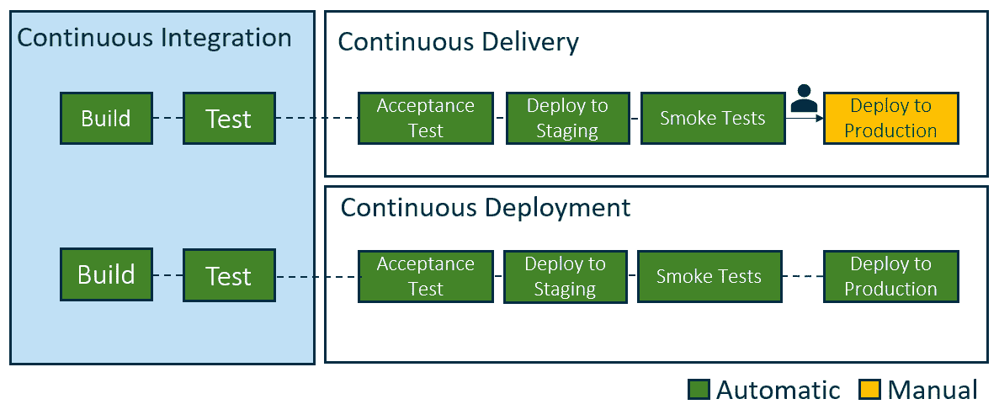
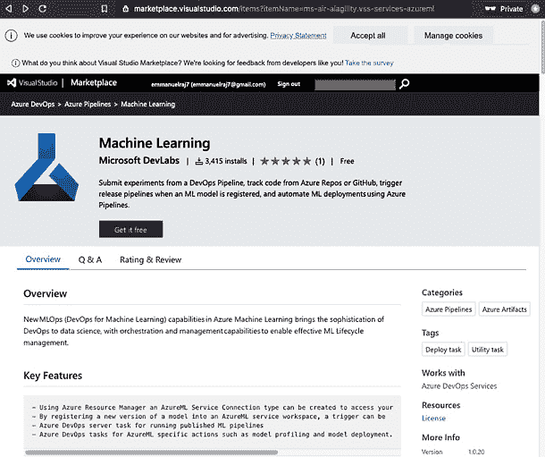
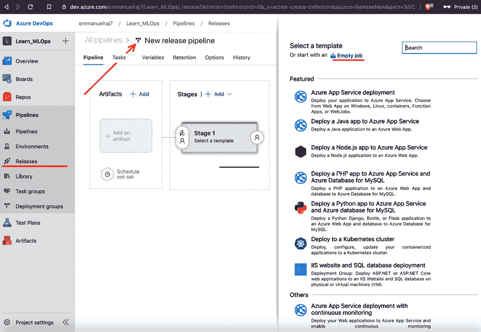
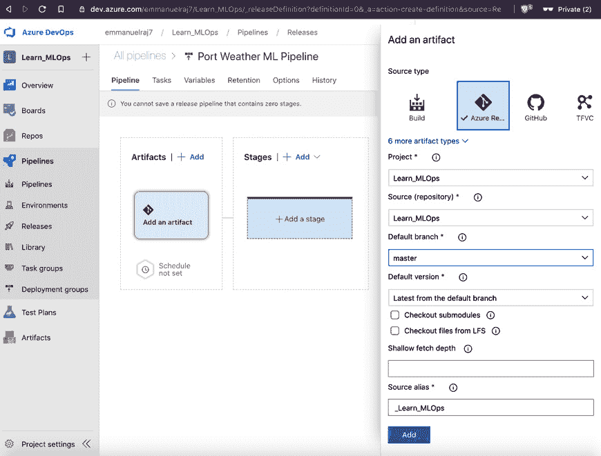
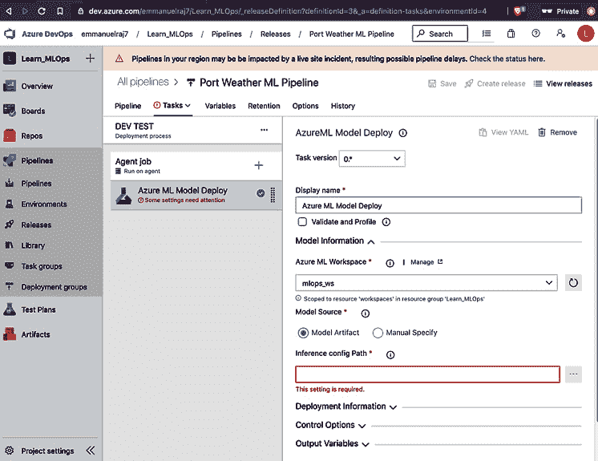
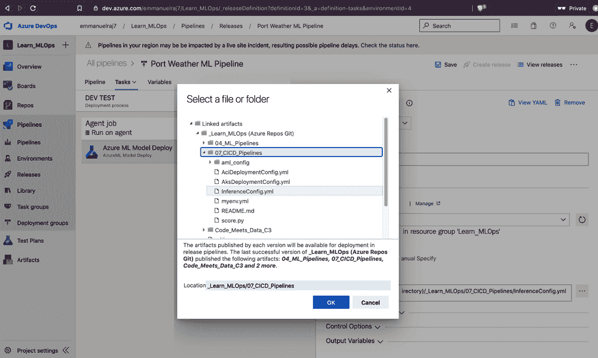
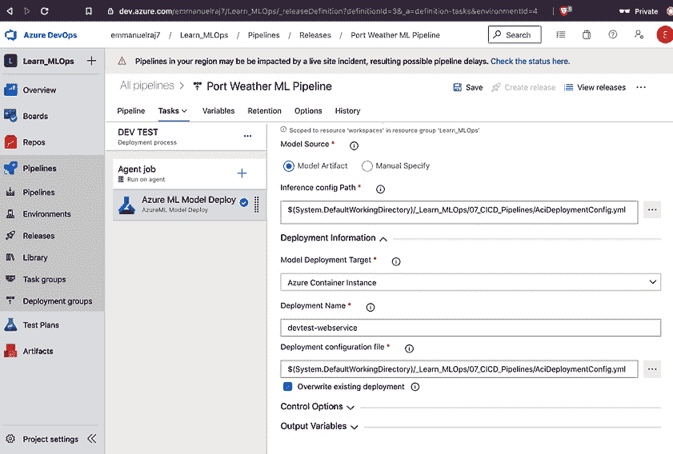
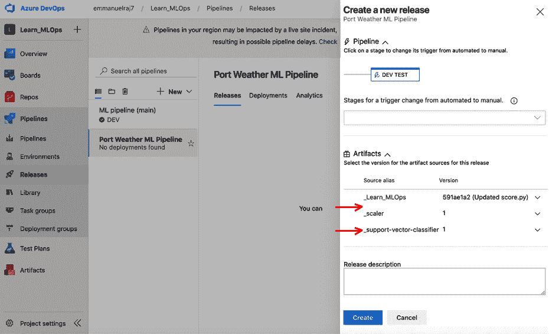
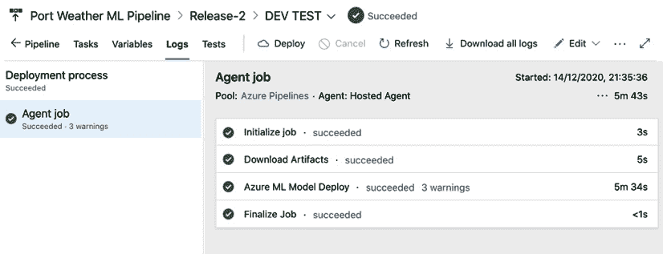
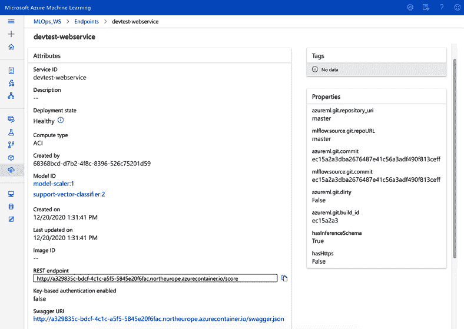

# 第七章：构建健壮的 CI/CD 管道

在本章中，你将了解 MLOps 管道中的持续操作。本章中你将学习的原则对于在业务环境中推动持续部署至关重要。为了获得全面的理解和第一手经验，我们将同时探讨概念和动手实施。在学习**持续集成**（**CI**）和**持续部署**（**CD**）、管道测试以及发布和触发器类型的同时，我们将为测试环境设置 CI/CD 管道。这将使你具备在云上为任何给定场景自动部署具有持续学习能力**机器学习**（**ML**）模型所需的技能，并与业务保持一致。让我们首先看看为什么我们需要在 MLOps 中使用 CI/CD。接下来，我们将继续探讨以下其他主题：

+   MLOps 中的持续集成、交付和部署

+   设置 CI/CD 管道和测试环境（使用 Azure DevOps）

+   管道执行和测试

+   管道执行触发器

# MLOps 中的持续集成、交付和部署

**自动化**是 MLOps 工作流程中 CI/CD 的主要原因。启用持续向 ML 服务交付的目标是维护模型的数据和源代码版本，启用触发器并行执行必要的作业，构建工件，并发布生产部署。一些云服务提供商正在推广 DevOps 服务以监控生产中的 ML 服务和模型，以及与云上的其他服务进行编排。使用 CI 和 CD，我们可以启用持续学习，这对于 ML 系统的成功至关重要。没有持续学习，ML 系统被认为最终会以失败的**概念验证**（**PoC**）告终。

只有部署了持续学习能力模型的模型才能带来商业价值。

为了学习如何使用持续学习能力在生产中部署模型，我们将探索 CI、CD 和持续交付方法。

如你在*图 7.1*中看到的，CI 是 CD 和持续交付的关键。让我们看看这三个是如何相互关联的：



图 7.1 – 持续集成、交付和部署管道

## 持续集成

CI（持续集成）旨在实时同步应用程序（机器学习管道和应用程序）与开发者。开发者在提交或合并中的更改将通过创建应用程序构建和针对构建执行自动化测试来得到验证。CI 强调自动化测试，重点关注在将新提交合并到主分支或主分支时检查应用程序的健壮性（如果它没有损坏或出现错误）。每当向主分支提交新的提交时，就会创建一个新的构建版本，并使用自动化测试对其进行健壮性测试。通过自动化此过程，我们可以避免软件延迟交付和其他可能导致用户等待数天的集成挑战。自动化和测试是 CI 的核心。

## 持续交付

持续交付从 CI 扩展，以确保新的更改或发布被部署并高效地带给用户；这通过自动化测试和发布流程来实现。自动化测试和发布流程使开发者和产品经理能够通过一键操作部署更改，并在过程的任何阶段实现无缝控制和监督能力。在持续交付过程中，通常会有一个人工代理（来自质量保证团队）参与批准构建（通过或失败），在将其部署到生产环境中之前（如图 7.1 所示，在持续交付管道中）。在一个典型的持续交付管道中，构建在部署到预发布阶段之前会经过初步的验收测试，在这个阶段，人工代理会使用烟雾测试和其他合适的测试来监督性能。

一旦通过了烟雾测试，人工代理会将构建版本传递到生产环境中部署。自动化构建和发布流程，并让人工代理参与其中，可以确保生产质量，我们还可以避免一些在完全自动化管道中可能被忽视的陷阱。使用持续交付，企业可以对其发布流程拥有完全的控制权，并可以分批次（在出现阻塞或错误时易于调试）发布新的构建版本，或者在一个必要的时间框架内（每日、每周或每月）进行完整发布。

## 持续部署

CD（持续部署）实现了完全自动化，并且比持续交付更进一步。将构建和发布到生产环境的所有阶段都完全自动化，没有任何人工干预，这与持续交付不同。在这样的自动化管道中，只有失败的测试才能阻止新的更改部署到生产环境中。持续部署减轻了团队维护发布管道的压力，并加速了直接向客户部署，通过客户反馈循环实现持续学习。

通过这样的自动化，开发者不再有发布日。这减轻了他们的压力，他们可以专注于构建软件，而无需担心测试和发布管理。开发者可以在方便的时候构建、测试和部署软件，可以在几分钟内上线，而不是等待发布日或人工审批，这可能会延迟软件向用户发布几天甚至几周。持续部署确保了部署和服务的完全自动化，向用户提供强大且可扩展的软件。

# 设置 CI/CD 管道和测试环境（使用 Azure DevOps）

在上一节中，我们介绍了 CI、持续交付和持续部署的理论，现在是时候看到它在实践中是如何应用的。使用 Azure DevOps，我们将为之前一直在工作的业务问题（天气预测）设置一个简单的 CI/CD 管道，我们之前在 *第六章* 的“关键部署原则”部分（针对业务问题）中已经讨论过。

Azure DevOps 是由微软提供的一项服务，它简化了源代码管理（版本控制）、项目管理、CI（持续集成）、持续交付和持续部署（自动化构建、测试和发布功能）。它还使软件应用程序的生命周期管理成为可能。我们将使用 Azure DevOps 进行实战培训，因为它与 Azure ML 服务无缝集成，我们之前在 *第六章* 中已经使用过。您将体验这两种服务的集成和同步，以便轻松进行部署。让我们开始吧。

前往您的 Azure DevOps 项目，`Learn_MLOps`。进入克隆的仓库并访问 `07_CICD_Pipeline` 文件夹。我们将使用这些文件（在名为 `07_CICD_Pipeline` 的文件夹中）作为驱动程序来构建发布管道：

```py
Learn_MLOps
├──07_CICD_Pipeline
│   ├── AciDeploymentconfig.yml
    ├── AksDeploymentconfig.yml
    └── InferenceConfig.yml
    └── myenv.yml
    └── score.py
```

我们将在两个部署目标上部署之前训练的 ML 模型（来自 *第四章*，*机器学习管道*），一个是 `AciDeployment.yml` 文件包含 ACI 部署目标的配置，另一个是 `AksDeployment.yml` 文件包含 AKS 集群的配置。`InferenceConfig.yml` 指向推理工件，如 `score.py` 和 `myenv.yml`。

在 `score.py` 中定义的函数将用于预处理传入的数据，并使用 ML 模型推断预处理后的数据以进行预测。`myenv.yml` 文件是推理环境的配置，例如，环境中的 Python 版本和要安装的包。这些文件将用作驱动程序，以简化发布管道。现在您已经熟悉了这些文件，让我们开始通过使用服务主体连接 Azure ML 服务和 Azure DevOps 项目。

## 创建服务主体

我们需要同步 Azure ML 服务和 Azure DevOps，以便在两者之间方便地进行 CI。之前（在 *第四章*，*机器学习管道*）我们使用 Azure ML 服务开发和管理工作流模型，并使用了 `Learn_MLOps` 工作区。现在，我们将使用服务主体将 Azure ML 工作区（命名为 `Learn_MLOps`）与 Azure DevOps 项目（命名为 `Learn_MLOps`）连接起来。

服务主体是为应用程序间通信创建的标识；它是访问 Azure 资源的连接自动化工具。服务主体还负责应用程序的网络和连接方面。执行以下步骤来设置用于管道的服务主体：

1.  前往**项目设置**（位于屏幕左下角）并选择**服务连接**。点击**新建服务连接**选项/按钮以显示新建服务连接窗口，如图 *图 7.2* 所示：![图 7.2 – 新的服务主体连接

    ![img/B16572_07_02.jpg]

    图 7.2 – 新的服务主体连接

1.  选择**Azure 资源管理器**作为连接类型，然后点击**下一步**。选择**服务主体（自动**）并继续创建服务主体的最后一步。

1.  您将提示创建新的服务连接。将范围设置为**机器学习工作区**并指向**订阅**、**资源组**和**机器学习工作区**，如图 *图 7.3* 所示：![图 7.3 – 创建服务主体的最后一步

    ![img/B16572_07_03.jpg]

    图 7.3 – 创建服务主体的最后一步

1.  在 `mlops_sp` 中命名服务主体，如图 *图 7.3* 所示）。最后，勾选复选框（**授予所有管道访问权限**）并点击**保存**以创建服务主体。

这样，具有给定名称（例如，`mlops_sp`）的服务主体就准备好用于编排 CI/CD 管道。接下来，我们将安装用于管道的扩展。

## 安装扩展以连接到 Azure ML 工作区

微软开发了一个名为 **Machine Learning** 的扩展。它在 Azure DevOps 市场 place 中可用。它用于编排我们所需的 Azure ML 工作区中的模型和工件。它允许我们将工作区中的模型部署到我们想要的部署目标，如 ACI 或 AKS。我们将安装 ML 扩展并使用它来编排 CI/CD 管道。执行以下步骤来安装扩展：

1.  前往市场以查找**机器学习**扩展。要进入市场，点击屏幕右上角的购物袋图标，如图 *图 7.4* 所示：![图 7.4 – 查找 Azure DevOps 市场 place

    ![img/B16572_07_04.jpg]

    图 7.4 – 查找 Azure DevOps 市场 place

    进入市场后，您将看到多个扩展选项，可以添加到您的 Azure DevOps 项目中。接下来，我们将搜索**机器学习**扩展。

1.  搜索**机器学习**扩展，免费安装扩展。点击**免费获取**按钮，如图*图 7.5*所示安装扩展：



图 7.5 – 安装机器学习扩展

点击**免费获取**按钮后，将安装**机器学习**扩展。安装成功后，您可以使用**机器学习**扩展在 CI/CD 管道中编排作业。具备这些先决条件后，您就可以配置持续部署或持续交付管道。

## 为测试环境设置持续集成和部署管道

在本节中，我们将为预发布环境（也称为测试环境）配置 CI/CD 管道。我们将使用此管道促进持续学习和自动化部署。让我们按照*图 7.6*所示，通过**管道**>>**发布**开始操作：



图 7.6 – 设置您的 CI/CD 管道

在`Port Weather ML Pipeline`中创建一个新的管道。接下来，我们将开始连接必要的工件以启用管道，例如包含代码的仓库和包含要部署的模型的 Azure ML 工作区。

## 将工件连接到管道

连接到您的 Azure DevOps 仓库。Azure DevOps 仓库作为中央代码仓库，用于在 Azure DevOps 上协调部署和操作。因此，让我们将仓库（`Learn_MLOps`）连接到发布管道：

1.  如*图 7.7*所示，转到`Learn_MLOps`以连接到发布管道：

    图 7.7 – 将 Azure DevOps 仓库作为工件连接

1.  在**工件**部分选择默认分支（例如，`Learn_MLOps`）和图标。

1.  连接到您的 Azure ML 工作区。要将您的 Azure ML 工作区连接到发布管道，请转到之前在*第四章*中注册的`scaler`工件，*机器学习管道*，以使用标准缩放传入数据：

    图 7.8 – 将缩放器作为工件连接

1.  在选择`model_scaler`工件后，通过点击`model_scaler`工件将其添加到发布管道中，你将能够在`support_vector_classifier`模型中看到模型名称（`model_scaler`）和模型图标。首先点击`mlops_sp`并选择在*第四章*，*机器学习流水线*中训练的`support_vector_classifier`模型。通过点击**添加**按钮将模型工件添加到管道中：

![图 7.9 – 连接的工件

![img/B16572_07_09.jpg]

图 7.9 – 连接的工件

在添加`support_vector_classifier`模型后，你将在**工件**部分看到模型名称（`support_vector_classifier`）和模型图标，如图*图 7.9*所示。

恭喜！我们已经将三个所需的工件（`Learn_MLOps`、`scaler`和**support_vector_classifier**）连接到发布管道中。我们可以使用这些工件来编排管道中的部署。接下来，准备好配置 Staging/TEST 环境！

## 设置测试环境

让我们在管道中为 TEST 环境设置一个持续集成和持续部署流水线。在这个阶段，我们测试服务的鲁棒性并执行各种测试以验证服务对生产的准备情况：

1.  要开始，点击`DEV` `TEST`。我们将该阶段命名为`DEV` `TEST`，因为这将是我们的开发和测试环境。理想情况下，DEV 和 TEST 是不同的阶段，但为了简单和避免重复实现，我们将它们合并。请参阅以下*图 7.10*：![图 7.10 – 设置 DEV TEST 阶段

    ![img/B16572_07_10.jpg]

    图 7.10 – 设置 DEV TEST 阶段

1.  在命名阶段后，通过点击顶部的**保存**按钮保存阶段。每个阶段都是由一系列步骤或作业组成的，用于检查阶段的鲁棒性。接下来，我们将配置**DEV TEST**阶段内的作业。简单来说，CI/CD 作业是一个执行或测试部署（例如，在 Kubernetes 集群上部署模型的作业）的过程或脚本。要配置作业，点击**DEV TEST**阶段中的**1 作业，0 任务**链接，如图*图 7.11*所示：![图 7.11 – 配置 DEV TEST 作业

    ![img/B16572_07_11.jpg]

    图 7.11 – 配置 DEV TEST 作业

    在点击**DEV TEST**阶段的**1 作业，0 任务**链接后，你必须添加代理作业。

1.  通过点击`AzureML 模型部署`将任务添加到代理作业中，如图*图 7.12*所示：![图 7.12 – 添加作业 – AzureML 模型部署

    ![img/B16572_07_12.jpg]

    图 7.12 – 添加作业 – AzureML 模型部署

    添加`inferenceconfig`文件后。

1.  接下来，您将被提示输入部署信息。如图 *图 7.13* 所示，指向您的 Azure ML 工作区（例如，`mlops_ws`）并将 `模型源` 选项设置为 **模型工件**（因为我们正在使用之前在训练和打包模型时生成的模型工件）：



图 7.13 – 添加作业 – Azure ML 模型部署

接下来，我们将查看 `inferenceConfig` 文件及其功能。以下代码片段来自 `inferenceConfig.yml`（在仓库中）。以下是 `inferenceConfig.yml` 的快照：

`inferenceConfig.yml`

```py
entryScript: score.py
runtime: python
condaFile: myenv.yml
```

它表示我们将部署模型的自定义环境的设置。它指向 `score.py` 文件（在 *第六章*，*部署您的 ML 系统的关键原则*）和 `conda` 文件 `myenv.yml`，该文件定义了 `conda` 环境（要安装的包和依赖项）。以下是 `myenv.yml` 的快照：

`myenv.yml`

```py
name: project_environment
dependencies:
  # The python interpreter version.
  # Currently Azure ML only supports 3.5.2 and later.
- python=3.6.2
- pip:
  - numpy
  - onnxruntime
  - joblib
  - azureml-core~=1.10.0
  - azureml-defaults~=1.10.0
  - scikit-learn==0.20.3
  - inference-schema
  - inference-schema[numpy-support]
  - azureml-monitoring
channels:
- anaconda
- conda-forge
```

`score.py` 和 `myenv.yml` 文件都与 `inferenceConfig.yml` 文件相关联，以简化机器学习模型的部署和推理。按照图 *图 7.14* 所示，选择您的推理配置文件（`inferenceConfig.yml`）：



图 7.14 – 选择您的推理配置文件

在您的 Azure DevOps 仓库中指向 `inferenceConfig.yml` 文件后，您的部署基本配置已完成。最后，我们将通过指向 `AciDeploymentConfig.yml`) 为 ACI 配置部署信息：

`AciDeploymentConfig.yml`

```py
computeType: ACI
containerResourceRequirements:
    cpu: 1
    memoryInGB: 1
authEnabled: False
sslEnabled: False
appInsightsEnabled: True
```

它包含为部署提供所需计算的基础设施定义，例如 CPU 单位、内存（以 GB 计）以及其他身份验证或安全定义。让我们选择此部署配置文件以设置预发布环境的发布管道，如图 *图 7.15* 所示：



图 7.15 – 添加部署信息

添加部署配置文件后，通过点击屏幕右上角的 **保存** 按钮保存作业，然后转到 **管道** >> **发布**（位于您的屏幕左侧）以查看您的管道成功设置。让我们从这里继续测试管道。

# 管道执行和测试

现在，是时候测试您的管道了。为此，我们将创建一个发布版本并验证管道发布是否成功执行。以下步骤将帮助您测试您的管道：

1.  点击 **创建发布** 按钮以执行管道上配置的作业。屏幕右侧将出现一个弹出窗口（如图 *图 7.16* 所示），用于查看和选择在预发布环境中部署的工件。

1.  选择工件（`_scaler`和`_support-vector-classifier`）并选择它们的版本。为了简单起见，推荐两个都使用版本 1。

    如果你想选择模型或缩放器的另一个版本，请确保在`score.py`文件中更改你的模型和缩放器的路径（即在`scaler`和`model`路径`model-scaler/{版本号}/modelscaler.pkl`和`support-vector-classifier/{版本号}/svc.onnx`中插入适当的版本号。如果你选择版本 1，你不需要担心更改`score.py`文件中的代码，因为路径包含版本 1。

1.  在选择工件和所需版本（推荐版本 1）后，点击**创建**按钮以创建所选工件的发布：

    图 7.16 – 创建发布

1.  现在，发布管道（CI/CD 管道）被触发执行。管道中定义的所有步骤都将执行，例如下载工件、为部署提供 ACI 计算实例以及部署 Web 服务。在成功执行后，你将在发布上收到一个绿色的勾号通知，如图 7.17 所示：

    图 7.17 – 监控发布

1.  你可以在`scaler`和`_support-vector-classifier`中监控所有你的发布，它们已作为 Web 服务部署在 ACI 上，如图 7.18 所示：

    图 7.18 – 发布中的成功作业（测试环境）

1.  最后，前往检查你的 Azure ML 工作区（从**端点**部分），查看已部署的 Web 服务，如图 7.19 所示：



图 7.19 – 部署在 Azure ML 工作区的 Web 服务

我们已在测试环境中成功部署了一个 Web 服务。我们可以看到 REST 端点和服务名称**devtest-webservice**。这标志着测试环境的 CI/CD 管道构建和测试的成功完成。管道可以通过触发器驱动，在下一节中，我们将探讨触发器的类型以及如何使用它们构建最优的 CI/CD 管道。

# 管道执行触发器

在一个有效的 CI/CD 管道中，通过多种事件或触发器执行流程应该是可能的。只有通过常规事件（如代码仓库或推送或拉取请求）触发管道的选项可能会成为系统的障碍或限制。通过使用多个事件触发管道流程的选项可以增强 CI/CD 管道的灵活性和功能性。让我们看看一些可以增加 CI/CD 管道流程价值的触发器类型：

+   **Artifactory 触发器**

    在管道和开发过程的各个阶段都会生成工件。生成的工件，如训练好的模型、元数据、上传的 Docker 镜像或任何已上传的文件，都可以触发在 CI/CD 管道中执行某个过程。拥有这样的选项可以为 CI/CD 管道提供极大的灵活性和功能性。

+   **Docker Hub 触发器**

    每当你将新的 Docker 镜像推送到你选择的 Docker Hub 仓库时，CI/CD 管道中的触发器可以按照需求执行。例如，当你将新的 Docker 镜像上传到 Docker Hub（或 Azure 容器注册表）时，管道被触发以部署 Docker 镜像作为 Web 服务。

+   **计划触发器**

    管道过程可以按照特定的时间表触发。这种类型的触发器对于计划清理、cron 作业或任何需要按时间间隔运行的流程非常有用；例如，每天中午 12:00 重新训练 ML 模型的触发器。

+   在开发者的平台上进行 `retrain`，管道可以被触发以重新训练现有的已部署模型。这些触发器是通过 API 调用来实现的。

+   **Git 触发器**

    Git 触发器通常用于触发管道执行，例如当新代码提交到分支或创建新的拉取请求时。当对仓库进行更改时，可以根据需求在管道中触发某些过程。

Azure DevOps 提供了多种触发选项（以上所有选项）。现在，让我们基于对仓库提交的 Git 提交来设置一个 Git 触发器：

1.  前往屏幕右上角的 `编辑`（Edit）来编辑现有的管道。

1.  点击仓库工件（命名为 `_Learn_MLOps`），如图 *图 7.20* 所示，并通过点击切换开关启用（启用）持续部署触发器。

1.  通过包含 develop 分支添加分支过滤器。这将触发管道在仓库的 develop 分支上发生更改或提交时执行。对于测试或预发布阶段，只为 develop 分支配置 Git 触发器（而不是 master 或其他分支）。对于生产，我们可以为 master 分支配置 Git 触发器。这样，我们可以为测试和生产阶段分离 Git 触发器分支：![图 7.20 – 启用测试环境的 Git 触发器

    ![img/B16572_07_20.jpg]

    图 7.20 – 启用测试环境的 Git 触发器

1.  点击顶部的 **保存** 按钮来配置 Git 触发器。恭喜！您已成功为测试环境设置了一个持续部署 Git 触发器。每当仓库的 develop 分支有更改时，管道将被触发以在测试（**DEV TEST**）环境中部署 Web 服务。

# 摘要

在本章中，我们学习了 MLOps 中持续操作的关键原则，主要是持续集成、交付和部署。我们通过在 Azure DevOps 上设置 CI/CD 管道和测试环境的实际操作来学习这一点。我们测试了管道的执行稳健性，并最终探讨了增强管道功能的一些触发器，并为测试环境设置了 Git 触发器。本章是 MLOps 持续操作的基础，并为您提供了在云上自动化部署任何给定场景的 ML 模型部署管道的技能，这些技能与您的业务持续学习能力相匹配。

在下一章中，我们将探讨 API、微服务和它们为基于 MLOps 的解决方案提供的功能。
