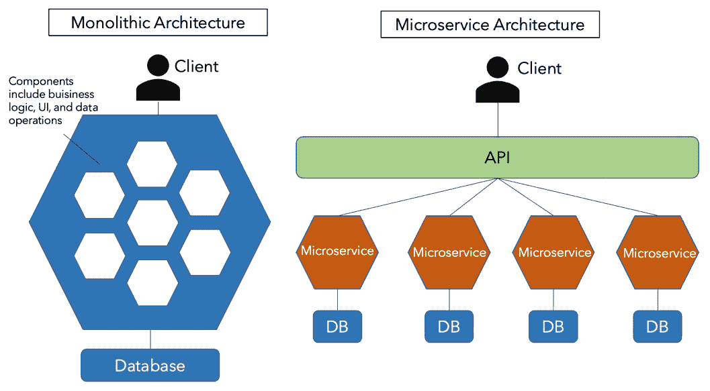
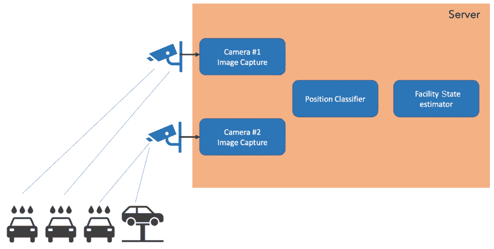
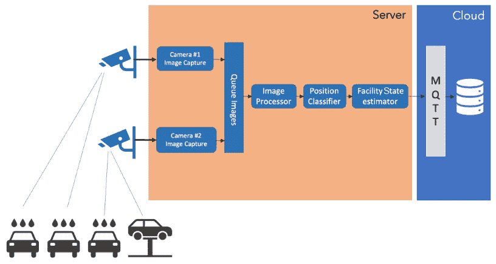
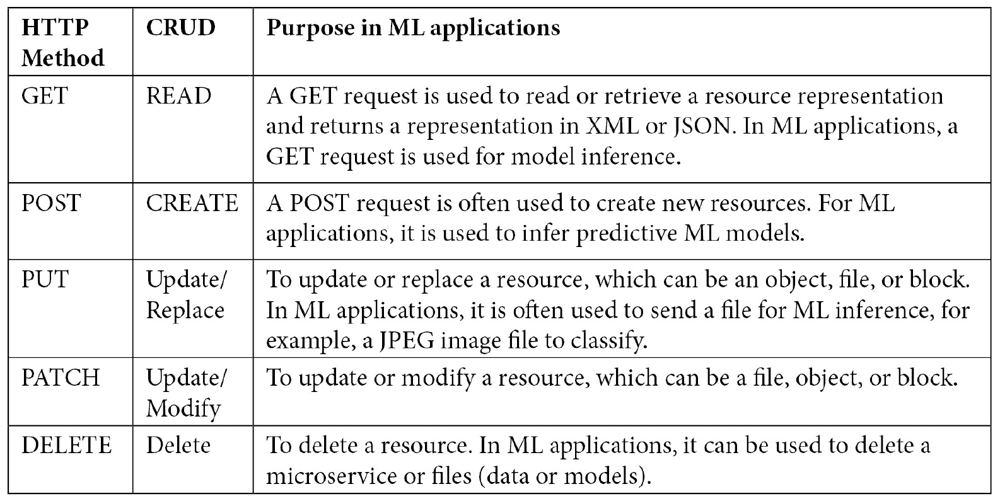
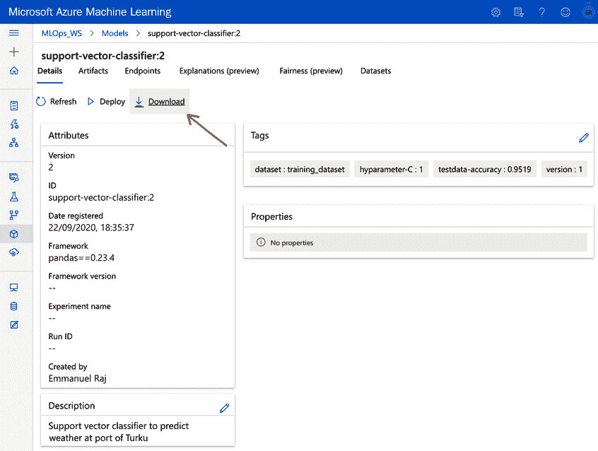
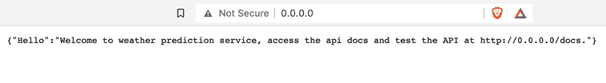
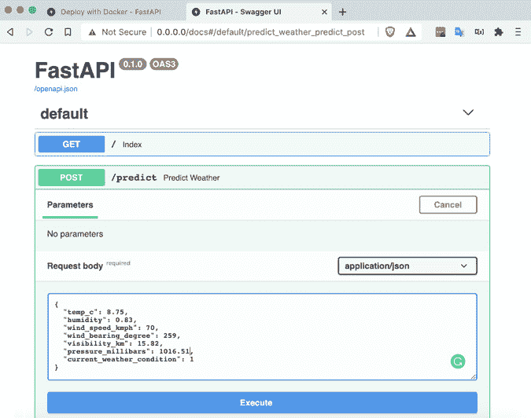
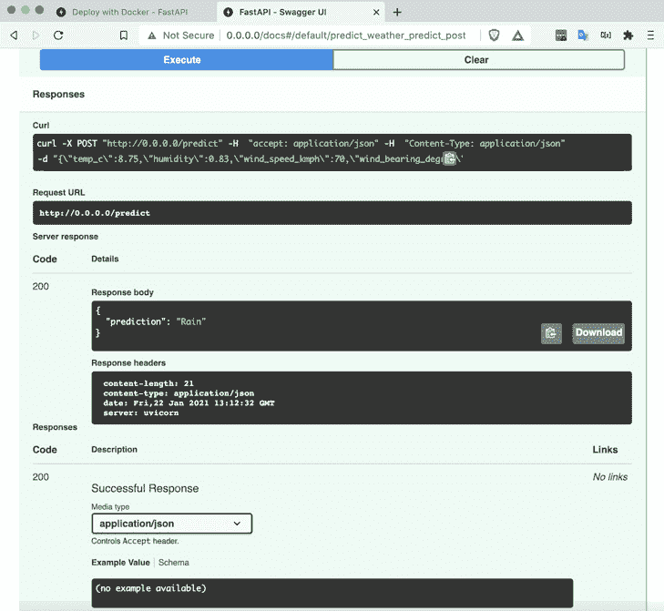

# 第八章：API 和微服务管理

在本章中，你将了解 API 和微服务管理。到目前为止，我们已经部署了作为 API 提供服务的 ML 应用程序。现在我们将探讨如何开发、组织、管理和提供 API。你将学习 API 和微服务设计的原理，以便你可以设计自己的定制 ML 解决方案。

在本章中，我们将通过构建使用 FastAPI 和 Docker 的微服务并将其作为 API 提供服务来实践学习。为此，我们将学习设计用于之前训练的 ML 模型（在*第四章*，*机器学习管道*）的 API 和微服务的基础知识。最后，我们将反思一些关键原则、挑战和技巧，以设计一个健壮且可扩展的微服务和 API，用于测试和生产环境。本章将涵盖以下主题：

+   API 和微服务的介绍

+   ML 对微服务的需求

+   旧的是金子 - 基于 REST API 的微服务

+   实践实现将 ML 模型作为 API 提供服务

+   使用 Docker 开发微服务

+   测试 API 服务

# API 和微服务的介绍

API 和微服务是强大的工具，有助于使你的**ML**（**ML**）模型在生产或遗留系统中变得有用，用于提供模型或与系统的其他组件进行通信。使用 API 和微服务，你可以设计一个健壮且可扩展的 ML 解决方案，以满足你的业务需求。让我们看看 API 和微服务是什么，以及它们如何实现你的模型在现实世界中的潜力。

## 什么是应用程序编程接口（API）？

**API**是开发者与应用程序通信的网关。API 使开发者能够实现两件事：

+   访问应用程序的数据

+   使用应用程序的功能

通过访问和与应用程序数据和功能进行通信，API 已经使世界的电子设备、应用程序和网页能够相互通信，以便共同完成以业务或运营为中心的任务。

![图 8.1 – API 的工作原理

![img/B16572_08_01.jpg]

图 8.1 – API 的工作原理

在*图 8.1*中，我们可以看到 API 的作用，它使得访问应用程序数据（来自数据库）以及与第三方或其他应用程序（如移动应用程序[为移动用户]，天气应用程序[在移动或网页上]，电动汽车等）进行通信成为可能。API 自计算机诞生以来一直在运行，旨在实现应用程序间的通信。随着时间的推移，我们在 21 世纪初看到了开发者就**简单对象访问协议**（**SOAP**）和**表示状态转换**（**REST**）等协议达成共识。近年来，一代新的 API 协议类型被开发出来，如**远程过程调用**（**RPC**）和 GraphQL，如下表所示：


表 8.1 – API 协议比较

如果你是应用开发者（托管在云端或与其他服务进行通信），了解主流的 API 协议是非常有价值的。这有助于你根据你的业务或功能需求来设计你的 API。作为一名程序员，你应该感到幸运，因为现在你有许多 API 协议可供选择，而在 20 年前，只有 SOAP 和 REST 可用。现在，根据你的需求，你可以选择各种协议，例如 GraphQL、Thrift 和 JSON-RPC。这些协议各有优缺点，使得找到最适合你情况的协议变得容易。

## 微服务

微服务是一种现代的设计和部署应用程序以运行服务的方式。微服务使分布式应用程序成为可能，而不是一个大的单体应用程序，其中功能被分解成更小的片段（称为微服务）。微服务是微服务架构中的一个独立应用程序。这与集中式或单体架构相反，在集中式或单体架构中，所有功能都绑定在一个大应用程序中。由于**面向服务的架构**（**SOA**）的出现，微服务因其作为传统单体（单一且自给自足）应用程序的替代方案而越来越受欢迎。

微服务因其使开发者能够轻松地开发、集成和维护应用程序而得到了广泛的应用。最终，这归结于这样一个事实：单个功能被独立对待，最初允许你逐步开发服务的一个单独功能。最后，它允许你在整合整个系统以协调服务的同时，独立地工作在每个功能上。这样，你可以添加、改进或修复它，而不会风险破坏整个应用程序。对于大型公司来说，微服务非常有价值，因为它们允许团队在没有复杂组织的情况下独立工作。在*图 8.2*中，我们可以看到单体和微服务之间的区别。与单体（非分布式应用程序）相比，微服务使分布式应用程序成为可能：




图 8.2 – 微服务与单体架构

软件开发团队被赋予了独立工作和在明确的服务责任范围内工作的能力。基于微服务的架构鼓励软件开发团队对其服务或模块负责。基于微服务的架构的一个可能的缺点是，如果你将应用程序分解成部分，那么这些部分之间需要有效地沟通，以便保持服务的运行。

API 与微服务之间的关系非常有趣，因为它有两个方面。由于基于微服务的架构，API 是你在应用程序中实施该架构的直接结果。同时，API 是微服务架构中服务之间高效通信的必要工具。让我们看看下一节，我们将浏览一些机器学习应用的示例。

# 机器学习对微服务的需求

为了了解基于微服务的架构对于机器学习应用的需求，让我们看看一个假设用例，并探讨开发该用例的机器学习应用的各个阶段。

## 假设用例

一个大型汽车维修设施需要一个解决方案来估计设施中的汽车数量及其准确位置。在维修站安装了一堆 IP 摄像头以监控设施。设计一个机器学习系统来监控和管理汽车维修设施。

## 第 1 阶段 – 概念验证（单体）

在典型情况下，通过使用可用数据点和应用机器学习来展示和验证用例，并向业务利益相关者证明机器学习可以解决他们的问题或改善他们的业务，快速开发了一个 PoC。

在我们的假设用例中，开发了一个单体 Python 应用程序，执行以下操作：

+   从所有摄像头获取流

+   从每个摄像头确定汽车的位置（头部或尾部）

+   将所有估计汇总到设施状态估计器

我们可以在*图 8.3*中看到，应用程序已经容器化并部署到服务器上：



![图 8.3 – 单体机器学习应用（假设用例的 PoC）所有摄像头都通过本地网络连接到这台服务器。汽车位置估计算法和设施状态估计器正在工作，但需要进一步改进，总体上 PoC 是有效的。由于摄像头、本地网络和其他错误的不稳定性，这个单体应用程序非常容易崩溃。微服务可以更好地处理这种不稳定性。让我们在第二阶段看看实际情况。## 第 2 阶段 – 生产（微服务）在这个阶段，一个不太容易崩溃的应用程序对于持续运行汽车维修设施的监控操作至关重要。因此，将单体应用程序替换为如*图 8.4*所示基于微服务的架构：

图 8.4 – 微服务（假设用例的生产就绪应用程序）

应用程序以下列方式分解为多个服务：

+   视频流收集器。

+   **图像处理器**：此处理器汇总图像 – 它接收、处理和缓存图像，并为进一步处理生成数据包。

+   **位置分类器**：估计停放在维修设施中的汽车的位置（头部或尾部）。

+   **设施设置估算器**：它异步接收汽车位置估算并校准设施设置，然后将实时数据发送到云端。

+   云使用 MQTT（一种标准轻量级、发布/订阅网络协议，用于在设备之间传输消息）收集和存储数据。数据在仪表板上呈现，供汽车设施操作员分析操作。

所有微服务之间的通信都通过 API 进行。微服务架构的优势在于，如果任何服务崩溃或发生错误，将启动特定的微服务来替换失败的服务，以保持整个服务的运行。其次，每个微服务都可以由一个专门的团队（数据科学家、开发人员和 DevOps 工程师）持续维护和改进，而不是协调团队来工作于一个单体系统。

# 旧的就是好的 – 基于 REST API 的微服务

旧的就是好的。此外，最好从有各种 API 协议的地方开始。多年来，**表示状态转移**（**REST**）协议已成为许多应用的黄金标准，对于今天的机器学习应用来说也并不那么不同。大多数公司更倾向于基于 REST API 协议开发他们的机器学习应用。

REST API 或 RESTful API 基于 REST，这是一种用于主要是 Web 服务开发的架构方法。

RESTful API 被广泛使用；例如，亚马逊、谷歌、领英和推特等公司都在使用它们。通过 RESTful API 提供我们的机器学习模型有许多好处，例如以下：

+   为多个用户提供即时预测服务。

+   向负载均衡器后面的应用程序添加更多实例以进行扩展。

+   可能需要使用不同的 API 端点来组合多个模型。

+   将我们的模型操作环境与用户界面环境分开。

+   启用基于微服务的架构。因此，团队可以独立工作以开发和增强服务。

RESTful API 使用由 RFC 2616 协议定义的现有 HTTP 方法。*表 8.2*总结了 HTTP 方法及其在机器学习应用中的 CRUD 操作和目的。



表 8.2 – REST API HTTP 方法

基本的 HTTP 方法有`GET`、`POST`、`PUT`、`PATCH`和`DELETE`。这些方法对应于`创建`、`读取`、`更新`和`删除`。使用这些方法，我们可以开发 RESTful API 来服务机器学习模型。由于 OpenAPI 等驱动因素，RESTful API 得到了广泛的应用。OpenAPI 规范是一种标准化的 REST API 描述格式。它已成为人类和机器的标准格式；它使 REST API 易于理解，并提供了扩展的工具，如 API 验证、测试和交互式文档生成器。在实践中，OpenAPI 文件使您能够描述整个 API，包括以下关键信息：

+   可用端点（`/names`）以及每个端点的操作（`GET /names`，`POST /names`）

+   每个操作的输入和输出（操作参数）

+   认证方法

+   开发者文档

+   使用条款、许可和其他信息

您可以在此网站上了解更多关于 OpenAPI 的信息：[`swagger.io/specification/`](https://swagger.io/specification/).

在下一节中，我们将开发一个 RESTful API 来提供 ML 模型，并使用基于 OpenAPI 的界面 Swagger UI 进行测试。

# 实践操作：将 ML 模型作为 API 提供服务

在本节中，我们将应用之前学到的 API 和微服务原则（在*API 和微服务简介*部分中），并开发一个 RESTful API 服务来提供 ML 模型。我们将提供的 ML 模型是之前我们工作的业务问题（使用 ML 进行天气预测）。我们将使用 FastAPI 框架将模型作为 API 提供服务，并使用 Docker 将 API 服务容器化为微服务。

FastAPI 是一个用于部署 ML 模型的框架。它易于编码且速度快，具有异步调用和数据完整性检查等特性，可实现高性能。FastAPI 易于使用，遵循 OpenAPI 规范，使其易于测试和验证 API。更多关于 FastAPI 的信息请访问：[`fastapi.tiangolo.com/.`](https://fastapi.tiangolo.com/.)

## API 设计和开发

我们将开发 API 服务并在本地计算机上运行它。（这也可以在我们在 Azure 机器学习工作区中创建的虚拟机上开发。为了学习，建议在本地练习以便于操作。）

要开始，请在您的 PC 或笔记本电脑上克隆本书的仓库，并转到`08_API_Microservices`文件夹。我们将使用这些文件来构建 API 服务：

```py
Learn_MLOps
├──08_API_Microservices
│   ├── Dockerfile
    ├── app
            └── variables.py
            └── weather_api.py
            └── requirements.txt
            └── artifacts
                       └── model-scaler.pkl
                       └── svc.onnx
```

文件夹`08_API_Microservices`中的目录树列出的文件包括一个 Dockerfile（用于从`FASTAPI`服务构建 Docker 镜像和容器）和一个名为`app`的文件夹。`app`文件夹包含`weather_api.py`文件（包含 API 端点定义的代码），`variables.py`文件（包含输入变量定义），以及`requirements.txt`文件（包含运行 API 服务所需的 Python 包），以及包含模型工件（如用于缩放传入数据的模型缩放器）和序列化模型文件（`svc.onnx`）的文件夹。

模型之前已在模型训练和评估阶段进行了序列化，如*第五章*中所述，“模型评估和打包”。模型从 Azure 机器学习工作区（`Learn_MLOps`）中的模型注册表中下载并放置在文件夹中，如图*图 8.3*所示：



图 8.5 – 下载序列化的模型文件

您可以将 `svc.onnx` 和 `model-scalar.pkl` 文件替换为您在 Azure Machine learning 工作区中训练的文件，或者继续使用这些文件进行快速实验。现在我们将查看每个文件中的代码。让我们从 `variables.py` 开始。

### variables.py

我们仅使用一个包来定义输入变量。我们使用的包名为 `pydantic`；它是一个使用 Python 类型注解进行数据验证和设置管理的包。使用 `pydantic`，我们将在用于 `fastAPI` 服务的名为 `WeatherVariables` 的类中定义输入变量：

```py
from pydantic import BaseModel
class WeatherVariables(BaseModel):
                        temp_c: float 
                        humidity: float 
                        wind_speed_kmph: float 
                        wind_bearing_degree: float
                        visibility_km: float 
                        pressure_millibars: float 
                        current_weather_condition: float
```

在 `WeatherVariables` 类中，定义变量及其类型，如前述代码所示。用于训练模型相同的变量将用于推理。我们在这里定义这些输入变量为 `temp_c`、`humidity`、`wind_speed_kmph`、`wind_bearing_degree`、`visibility_km`、`pressure_millibars` 和 `current_weather_condition`。这些变量的数据类型定义为 `float`。我们将导入 `WeatherVariables` 类并在 `fastAPI` 服务中使用定义的输入变量。让我们看看如何使用 `WeatherVariables` 类中定义的变量在 `fastAPI` 服务中使用 `Weather_api.py` 文件。

### Weather_api.py

此文件用于定义 `fastAPI` 服务。所需的模型工件被导入并用于提供 API 端点以推理模型，用于实时或生产中的预测：

1.  我们首先按照以下方式导入所需的包：

    ```py
    import uvicorn
    from fastapi import FastAPI
    from variables import WeatherVariables
    import numpy
    import pickle
    import pandas as pd
    import onnxruntime as rt
    ```

    我们导入了所需的包，例如 `uvicorn`（一个 ASGI 服务器实现包）、`fastapi`、`numpy`、`pickle`、`pandas` 和 `onnxruntime`（用于反序列化和推理 `onnx` 模型）。

    注意

    我们之前在 `variables.py` 文件中导入了 `WeatherVariables` 类。我们将使用此文件中定义的变量为 `fastAPI` 服务获取输入数据。

1.  接下来，我们创建一个 `app` 对象。您将注意到 `fastAPI` 与 Flask 网络框架（如果您曾经使用过 Flask）在语法上有一些相似之处。

    例如，在下一步中，我们使用 `FastAPI()` 函数创建 `app` 对象。创建 `app` 对象的方式类似于我们在 `Flask` 示例中做的那样：从 Flask 导入 `Flask`，然后使用 `Flask` 函数以 `app = Flask()` 的方式创建 `app` 对象。您将会注意到我们在使用 `fastAPI` 构建 API 端点时存在这样的相似性：

    ```py
    app = FastAPI()
    # Load model scalar
    pickle_in = open("artifacts/model-scaler.pkl", "rb")
    scaler = pickle.load(pickle_in)
    # Load the model
    sess = rt.InferenceSession("artifacts/svc.onnx")
    input_name = sess.get_inputs()[0].name
    label_name = sess.get_outputs()[0].name
    ```

1.  在创建 `app` 对象后，我们将导入在端点中进行推理所需的必要模型工件。使用 `Pickle` 反序列化数据缩放文件 `model-scaler.pkl`。此文件用于训练模型（在 *第四章*，*机器学习管道*），现在我们将使用它来在模型推理之前缩放传入的数据。我们将使用之前训练的支持向量机分类器模型，该模型被序列化到名为 `scv.onnx` 的文件中（我们可以像 *图 8.3* 所示那样访问和下载该文件）。

1.  使用 `ONNX` 运行时将序列化的模型加载到推理会话（`input_name` 和 `label_name`）中，以进行机器学习模型的预测。接下来，我们可以转向定义 API 端点的核心部分，以推断机器学习模型。首先，我们使用包装函数 `@app.get('/')` 向索引路由发出一个 `GET` 请求：

    ```py
    @app.get('/')
    def index():
        return {'Hello': 'Welcome to weather prediction service, access the api     docs and test the API at http://0.0.0.0/docs.'}
    ```

    为索引路由定义了一个名为 `index()` 的函数。它返回指向文档链接的欢迎信息。此信息旨在指导用户访问和测试 API 端点。

1.  接下来，我们将定义核心 API 端点 `/predict`，该端点用于推断机器学习模型。使用包装函数 `@app.post('/predict')` 发出 `POST` 请求：

    ```py
    @app.post('/predict')
    def predict_weather(data: WeatherVariables):
        data = data.dict()
        # fetch input data using data varaibles
        temp_c = data['temp_c']
        humidity = data['humidity']
        wind_speed_kmph = data['wind_speed_kmph']
        wind_bearing_degree = data['wind_bearing_degree']
        visibility_km = data['visibility_km']
        pressure_millibars = data['pressure_millibars']
        current_weather_condition = data['current_weather_condition']
    ```

    为 `/predict` 端点启动了一个名为 `predict_weather()` 的函数。在函数内部，我们创建了一个名为 `data` 的变量，该变量将捕获输入数据；这个变量捕获通过 `POST` 请求获取的 `JSON` 数据，并指向 `WeatherVariables`。一旦我们发出 `POST` 请求，传入数据中的所有变量都将映射到 `variables.py` 文件中的 `WeatherVariables` 类中的变量。

1.  接下来，我们将数据转换为字典，从字典中获取每个输入变量，并将它们压缩成一个名为 `data_to_pred` 的 `numpy` 数组变量。我们将使用这个变量来缩放数据并推断机器学习模型：

    ```py
        data_to_pred = numpy.array([[temp_c, humidity, wind_speed_kmph,         
    wind_bearing_degree,visibility_km, pressure_millibars, 
    current_weather_condition]])
        # Scale input data
        data_to_pred = scaler.fit_transform(data_to_pred.reshape(1, 7))
      # Model inference
        prediction = sess.run(
            [label_name], {input_name: data_to_pred.astype(numpy.float32)})[0]
    ```

    使用之前加载的缩放器通过 `fit_transform()` 函数对数据 (`data_to_pred`) 进行重塑和缩放。

1.  接下来，执行模型推理步骤，这是关键步骤，通过将缩放数据推断到模型中完成，如前面的代码所示。从模型推断出的预测随后作为输出返回到 `prediction` 变量：

    ```py
    if(prediction[0] > 0.5):
            prediction = "Rain"
        else:
            prediction = "No_Rain"
        return {
            'prediction': prediction
        }    
    ```

    最后，我们将模型推理转换为人类可读的格式，根据机器学习模型的预测建议 `rain` 或 `no_rain`，并将 `prediction` 返回给 `/predict` 端点的 `POST` 调用。这标志着 `weather_api.py` 文件的结束。当通过传递输入数据发出 `POST` 请求时，服务以 `0` 或 `1` 的形式返回模型预测。根据模型预测，服务将返回 `rain` 或 `not_rain`。当你得到这样的预测时，你的服务正在运行，并且足够健壮，可以满足生产需求。

### Requirement.txt

此文本文件包含运行 `fastAPI` 服务所需的所有软件包：

```py
numpy
fastapi
uvicorn
scikit-learn==0.20.3
pandas
onnx
onnxruntime
```

这些软件包应该安装在你希望运行 API 服务的环境中。我们将使用 `numpy`、`fastapi`（一个用于创建健壮 API 的机器学习框架）、`uvicorn`（一个 ASGI 服务器）、`scikit-learn`、`pandas`、`onnx` 和 `onnxruntime`（用于反序列化和推理 `onnx` 模型）来运行 FastAPI 服务。为了以标准化的方式部署和运行 API 服务，我们将使用 Docker 在 Docker 容器中运行 FastAPI 服务。

接下来，让我们看看如何为服务创建 Dockerfile。

# 使用 Docker 开发微服务

在本节中，我们将使用 Docker 以标准化的方式打包 FastAPI 服务。这样，我们可以在大约 5 分钟内将 Docker 镜像或容器部署到您选择的部署目标。

Docker 有许多优点，例如可复制性、安全性、开发简单性等。我们可以使用 Docker Hub 上的官方 `fastAPI` 镜像（`tiangolo/uvicorn-gunicorn-fastapi`）。以下是 Dockerfile 的一个片段：

```py
FROM tiangolo/uvicorn-gunicorn-fastapi:python3.7
COPY ./app /app
RUN pip install -r requirements.txt
EXPOSE 80
CMD ["uvicorn", "weather_api:app", "--host", "0.0.0.0", "--port", "80"]
```

首先，我们使用 Docker Hub 上的官方 `fastAPI` Docker 镜像，通过使用 `FROM` 命令并指向镜像 – `tiangolo/uvicorn-gunicorn-fastapi:python3.7`。该镜像使用 Python 3.7，与 `fastAPI` 兼容。接下来，我们将 `app` 文件夹复制到 Docker 镜像/容器内的 `app` 目录中。在将文件夹 `app` 复制到 Docker 镜像/容器内之后，我们将使用 `RUN` 命令安装文件 `requirements.txt` 中列出的必要软件包。

由于 `uvicorn` 服务器（ASGI 服务器）默认使用端口 `80`，我们将为 Docker 镜像/容器 `EXPOSE` 端口 `80`。最后，我们将使用命令 `CMD "uvicorn weather_api:app –host 0.0.0.0 –port 80"` 在 Docker 镜像/容器内启动服务器。此命令指向 `weather_api.py` 文件以访问服务的 `fastAPI` 应用程序对象，并在镜像/容器的端口 `80` 上托管。

恭喜，你几乎完成了。现在我们将测试微服务的就绪状态，并查看它是否以及如何工作。

# 测试 API

要测试 API 的就绪状态，我们将执行以下步骤：

1.  让我们从构建 Docker 镜像开始。为此，先决条件是安装 Docker。转到您的终端或命令提示符，将存储库克隆到您希望的位置，并访问文件夹 `08_API_Microservices`。执行以下 Docker 命令以构建 Docker 镜像：

    ```py
    build command will start building the Docker image following the steps listed in the Dockerfile. The image is tagged with the name fastapi. After successful execution of the build command, you can validate whether the image is built and tagged successfully or not using the docker images command. It will output the information as follows, after successfully building the image:

    ```

    (base) 用户 ~ docker images

    REPOSITORY   标签       镜像 ID       创建时间          大小

    fastapi      latest    1745e964f57f   56 秒前   1.31GB

    ```py

    ```

1.  在本地运行 Docker 容器。现在，我们可以从之前创建的 Docker 镜像启动一个正在运行的 Docker 容器。要运行 Docker 容器，我们使用 `RUN` 命令：

    ```py
    fastapi Docker image. The name of the running container is weathercontainer and its port 80 is mapped to port 80 of the local computer. The container will run in the background as we have used -d in the RUN command. Upon successfully running a container, a container ID is output on the terminal, for example, 2729ff7a385b0a255c63cf03ec9b0e1411ce4426c9c49e8db 4883e0cf0fde567.
    ```

1.  使用样本数据测试 API 服务。我们将检查容器是否成功运行。要检查这一点，请使用以下命令：

    ```py
    fastapi is mapped and successfully running on port 80 of the local machine. We can access the service and test it from the browser on our local machine at the address 0.0.0.0:80.NoteIf you have no response or errors when you run or test your API service, you may have to disable CORS validation from browsers such as Chrome, Firefox, and Brave or add an extension (for example, go to the Chrome Web Store and search for one) that will disable CORS validation for running and testing APIs locally. By default, you don't need to disable CORS; do it only if required.You will see the message that follows:Figure 8.6 – FastAPI service running on local port 80FastAPI uses the OpenAPI (read more: [`www.openapis.org/`](https://www.openapis.org/), [`swagger.io/specification/`](https://swagger.io/specification/)) Specification to serve the model. The `0.0.0.0:80/docs` and it will direct you to a Swagger-based UI (it uses the OAS) to test your API. 
    ```

1.  现在，使用您选择的数据测试 `/predict` 端点（通过选择端点并点击**尝试它**按钮），如图 *图 8.6* 所示：

    图 8.7 – FastAPI 服务的请求体输入

1.  点击`POST`调用并测试端点。输入由服务中的模型推断，模型预测`Rain`或`No_Rain`是`POST`调用的输出，如图 *图 8.7* 所示：



图 8.8 – POST 调用的输出（/predict 端点）

`/predict` API 的`POST`调用成功执行将导致输出模型预测，如图 *图 8.6* 所示。运行在 Docker 容器中的模型在`POST`调用中将天气条件输出为`Rain`。恭喜你，你已经成功启动了一个`fastAPI`容器并对其进行了测试。这个练习应该已经让你具备了构建、部署和测试基于 ML 的 API 服务以供你使用的能力。

# 摘要

在本章中，我们学习了 API 设计和生产中微服务部署的关键原则。我们简要介绍了 API 设计方法的基础，并了解了 FastAPI。对于我们的业务问题，我们在*动手实现将 ML 模型作为 API 提供服务*部分通过 FastAPI 和 Docker 进行了实际实施。利用本章获得的实际知识，你可以设计和开发健壮的 API 服务来服务于你的 ML 模型。为 ML 模型开发 API 服务是将 ML 模型推向生产的一个步骤。

在下一章中，我们将深入探讨测试和安全性的概念。我们将使用 Locust 实现一种测试方法来测试 API 服务的健壮性。让我们开始吧！
