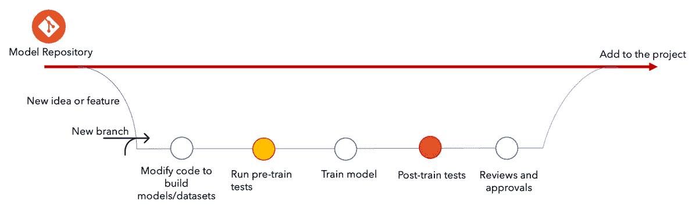
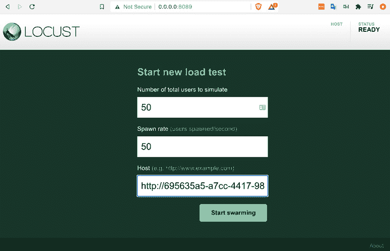
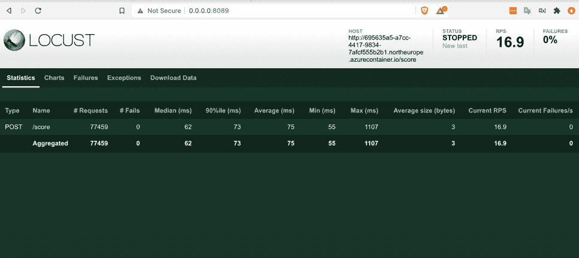
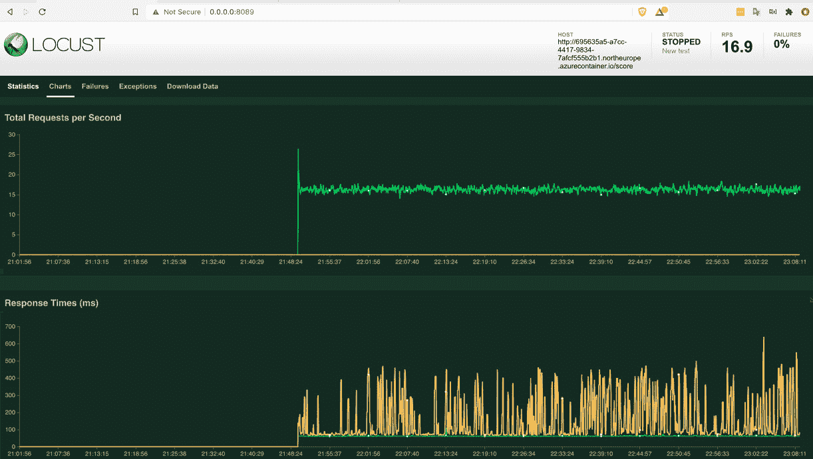

# 第九章：测试和确保你的机器学习解决方案安全

在本章中，我们将深入探讨**机器学习**（**ML**）解决方案的测试和安全方面。您可以期待获得关于测试您机器学习解决方案的鲁棒性和可扩展性的各种测试类型的入门知识，以及确保您的机器学习解决方案所需的知识。我们将探讨对机器学习解决方案的多种攻击以及防御您的机器学习解决方案的方法。

在本章中，我们将通过执行我们之前一直在工作的天气预测业务用例的负载测试和安全测试来通过示例学习。我们将从反思测试和确保你的机器学习解决方案的需求开始，然后继续探索本章中的其他以下主题：

+   理解测试和确保你的机器学习应用程序的需求

+   通过设计测试你的机器学习解决方案

+   通过设计确保你的机器学习解决方案安全

# 理解测试和确保你的机器学习应用程序的需求

数据驱动和基于机器学习的解决方案的日益普及导致企业必须处理不断增长的工作负载，使它们面临额外的复杂性和漏洞。

网络安全是 AI 开发者和采用者面临的最令人担忧的风险。根据德勤发布的调查（[`www2.deloitte.com/us/en/insights/focus/cognitive-technologies/state-of-ai-and-intelligent-automation-in-business-survey.html`](https://www2.deloitte.com/us/en/insights/focus/cognitive-technologies/state-of-ai-and-intelligent-automation-in-business-survey.html)），2020 年 7 月，62%的采用者认为网络安全风险是一个重大或极端威胁，但只有 39%的人表示他们认为自己有准备应对这些风险。

在本节中，我们将探讨确保基于机器学习的系统和解决方案安全的需求。我们将反思一些机器学习系统更广泛面临的挑战，如偏差、伦理和可解释性。我们还将研究在机器学习生命周期的每个阶段与机密性、完整性和可用性相关的挑战，这些挑战将使用机器学习测试和设计安全的指南来研究。

# 通过设计测试你的机器学习解决方案

除了执行常规的软件开发测试，如单元测试、集成测试、系统测试和验收测试之外，机器学习解决方案还需要额外的测试，因为数据与机器学习模型都随时间动态变化。以下是一些设计测试的概念；将这些概念应用于您的用例可以确保产生健壮的机器学习解决方案。 

## 数据测试

测试数据的目的是确保数据对于机器学习模型训练来说质量足够高。数据质量越好，为给定任务训练的模型就越好。那么我们如何评估数据的质量呢？可以通过检查以下五个数据因素来完成：

+   准确性

+   完整性（无缺失值）

+   一致性（在预期的数据格式和数量方面）

+   相关性（数据应满足预期的需求和需求）

+   及时性（最新或最新数据）

基于这些因素，如果一家公司能够在接收或创建每个数据集时管理其数据质量，则数据质量得到保证。以下是一些您的团队或公司可以用来作为数据质量保证措施的数据步骤：

1.  **细致的数据目录和输入数据的控制**：数据目录（以所需格式或模式记录和存储数据）和控制功能的组合可以确保输入数据的高质量。数据目录和控制可以通过监控数据因素，如数据格式和模式、值分布和异常、完整性和一致性来实现，这有助于提供良好的输入数据质量。

1.  **精心管理数据管道以避免重复数据**：当重复数据由相同的数据源生成，并且由不同的人使用相同的逻辑时，管理血缘、真实性和数据完整性可能会变得复杂。这可能会在多个系统或数据库中产生级联效应。尽可能避免重复数据会更好。

1.  **强制执行数据治理的完整性**：在当今世界，维护数据完整性变得至关重要。没有强制执行数据完整性的心态可能会对一个组织造成损失。数据最终可能会变得不完整、延迟或过时，导致严重的数据质量问题。

1.  **维护端到端的可追溯性和血缘关系**：通过智能使用元数据和数据本身，可以实现数据血缘和可追溯性。使用两者，我们可以记录关键信息，如每个数据集的唯一键、为每条记录添加时间戳以及记录数据变更。确保数据血缘和端到端可追溯性被启用，可以给我们提供重现模型和调试错误和管道的可能性。

## 模型测试

模型测试需要涵盖以下服务器问题：

+   评估机器学习模型的准确性或关键指标

+   在随机数据点上测试

+   测试任务的可接受损失或性能

+   使用真实数据进行模型鲁棒性的单元测试

这些测试可以分为两个阶段：预训练和后训练。在流程中实施这些测试可以产生适合生产的稳健模型。让我们看看预先设计和后训练测试可以做什么。

## 预训练测试

在我们进入训练阶段之前，可以通过测试来捕捉缺陷。这些缺陷可能存在于数据、管道或参数中。*图 9.1*建议将预训练和后训练测试作为开发高质量模型所提出的流程的一部分：



图 9.1 – 开发高质量模型所提出的流程

这里有一些使用预训练测试来检测和避免预训练缺陷的方法：

+   通过处理任何数据泄漏、边缘情况和优化以使管道时间效率和资源效率来消除数据管道债务

+   确保您的模型输出形状与数据集中的标签匹配

+   检查输出范围以确保它们符合我们的预期（例如，检查分类模型的输出是一个分布，其类概率之和为 1）

+   检查您的训练和验证数据集是否存在标签泄漏

+   确保 ETL 管道以所需格式输出或获取数据

预训练测试不需要参数运行，但它们在运行模型训练之前捕捉错误非常有用。

## 训练后测试

训练后测试使我们能够调查模型性能和模型预测背后的逻辑，并在将模型部署到生产之前预见模型中可能存在的任何缺陷。训练后测试使我们能够检测模型性能和功能中的缺陷。训练后测试包括模型性能评估测试、不变性测试和最小功能测试。以下是一篇推荐的阅读材料，以了解更多关于训练后测试的信息：*超越准确性：使用 CheckList 对 NLP 模型进行行为测试* ([`homes.cs.washington.edu/~marcotcr/acl20_checklist.pdf`](https://homes.cs.washington.edu/~marcotcr/acl20_checklist.pdf))

部署和推理测试

部署测试包括测试**持续集成/持续交付**（**CI/CD**）管道交付、集成测试以及测试部署是否成功。测试已部署的模型至关重要，这就是推理测试介入以压力或负载测试已部署模型并测试其在实时数据上的性能的原因。

在下一节中，我们将对之前部署的模型进行负载测试（针对一个用例）。

# 实践部署和推理测试（一个业务用例）

当您的服务（无论是 API 还是 ML）准备就绪，您即将向用户提供服务，但您对它实际上可以处理多少用户以及当许多用户同时访问时它将如何反应没有任何头绪时，这就是负载测试有用之处，可以基准测试您的服务可以服务多少用户，并验证该服务是否能够满足业务需求。

我们将对之前部署的服务进行负载测试（在*第七章*，*构建健壮的 CI 和 CD 管道*）。将使用`Locust.io`进行负载测试。`locust.io`是一个开源的负载测试工具。为此，我们将使用`pip`安装`locust`，并使用 locust.io SDK 编写一个 Python 脚本来测试一个端点。让我们从安装`locust`开始：

1.  安装`locust`：转到您的终端并执行以下命令：

    ```py
    pip, locust will be installed – it takes around a minute to install. After installation is successful it's time to curate the Python script using the locust.io SDK to test an endpoint.
    ```

1.  精炼 `load_test.py` 脚本：前往您的首选 IDE 并开始精炼脚本，或者遵循预先制作脚本中的步骤。要访问预先制作的脚本，请前往之前克隆的 *Engineering MLOps* 仓库，访问 `09_Testing_Security` 文件夹，然后转到 `load_test.py` 文件。让我们揭开 `load_test.py` 中的代码之谜——首先，所需的库如下导入：

    ```py
    import time
    import json
    from locust import HttpUser, task, between
    ```

    我们导入了 `time`、`json` 和 `locust` 库，然后从 `locust` 中导入了以下所需的功能：`HttpUser`（一个可以访问不同端点的用户代理）、`task` 和 `between`。

1.  创建一个 `test_data` 变量，包含用于负载测试中推断机器学习模型的样本测试数据。定义我们将在负载测试中使用的 `headers`：

    ```py
    test_data = json.dumps({"data": [[8.75, 0.83, 70, 259, 15.82, 1016.51, 1.0]]})
    headers = {'Content-Type': 'application/json'}
    ```

1.  接下来，我们将通过扩展 `HttpUser` 来实现负载测试的核心功能，作为 `MLServiceUser` 类（您可以取任何名字）的一部分。`HttpUser` 是一个用户代理，可以访问不同的端点：

    ```py
    class MLServiceUser(HttpUser):
        wait_time = between(1, 5)
        @task
        def test_weather_predictions(self):
            self.client.post("", data=test_data, headers=headers)
    ```

    我们使用 `between()` 函数创建了一个 `wait_time` 变量，该变量指定了完成测试一个端点后切换到测试下一个端点所需的时间。因此，我们在 `between(1,5)` 函数中将 `wait_time` 指定为 `1` 到 `5` 秒。下一个部分是定义测试端点的任务的核心。

    对于此，我们使用 `@task` 包装器或装饰器来开始定义我们的任务，以使用自定义函数测试我们选择的端点。定义一个自定义函数 `def test_weather_predictions()`，并使用之前定义的 `test_data` 和 `headers` 向端点发送 `post` 请求。现在，我们已经准备好运行负载测试了！

1.  运行 `locust.io` 服务器：前往您的终端并切换到您有 `load_test.py` 文件的位置（例如，在本书中使用的克隆仓库的 `09_Testing_Security` 文件夹中），然后运行以下命令来启动一个 `locust.io` 服务器：

    ```py
    Locust -f load_test-py
    ```

    执行上一条命令将在端口 `8089` 启动 `locust` 服务器。我们可以在由 `locust.io` 渲染的 Web 界面上执行负载测试。要访问 Web 服务，打开您选择的浏览器并访问以下 Web 地址：`http://0.0.0.0:8089/`，如图 *图 9.2* 所示：

    

    图 9.2 – 访问 Locust.io Web 服务

1.  运行负载测试：打开 Web 服务将提示您指定选项，如用户数量、生成速率和主机（要测试的端点）。根据您的需求指定要模拟的用户数量和生成速率（每秒将生成多少用户），以验证您的端点是否能够满足您的业务/用户需求，例如，50 个用户和 50 的生成速率。

1.  最后，输入您想要进行负载测试的端点或主机，并点击**开始 swarming**以开始执行负载测试。在*第七章* *构建健壮的 CI/CD 管道*中，我们部署了一个端点。建议测试已部署的端点。

1.  前往您的 Azure ML 工作区，访问**端点**部分，访问名为**dev-webservice**的已部署端点，并将端点 Web 地址复制并粘贴到主机文本框中。

1.  接下来，点击**开始** **swarming**以开始对端点进行负载测试。这将启动负载测试并打开一个新页面，您可以在其中实时监控您的负载测试，如图*图 9.3*所示：

    图 9.3 – 实时监控负载测试

1.  分析负载测试结果：您可以在实时监控统计数据、图表、故障和异常。例如，在*图 9.3*中，我们正在监控带有测试数据的`POST`请求的负载测试。监控的项目包括请求数量（**77459**）、失败次数（**0**）、平均响应时间（**75ms**）以及其他信息。检查是否存在故障以及平均响应时间是否在满足您的业务/用户需求的有效范围内或没有速度瓶颈是很重要的。

    如果您没有失败的请求，并且平均响应时间在所需范围内，则您的端点已通过负载测试并准备好供用户使用。在负载测试之后或期间，您可以通过图表查看负载测试性能，包括每秒总请求数、响应时间和随时间推移的用户数量等关键信息。我们可以在*图 9.4*和*图 9.5*中实时查看这些信息：



图 9.4 – 显示每秒总请求数和响应时间的图表

在*图 9.4*中，我们可以注意到，当`locust.io`的模拟用户发起请求时，每秒请求数量在 18-22 之间，某些情况下响应时间在 70 到 500 毫秒之间变化，最小和最大响应时间之间的差异为 430 毫秒。平均请求时间为 75 毫秒（如图*图 9.3*所示）。

请注意，这种性能可能或可能不适合特定的用例，这取决于您的业务或用户需求。更稳定的响应时间更可取；例如，最小和最大响应时间之间的响应时间变化不超过 50ms 可能更适合稳定性能。为了实现这种性能，建议根据需要部署到高端基础设施上，例如 GPU 或高端 CPU，而不是在 Azure 容器实例上的 CPU 上部署。同样，在*图 9.5*中，我们可以看到响应时间与用户数量的关系：

![图 9.5 – 显示每秒总请求次数和用户数量的图表

![img/B16572_09_05.jpg]

图 9.5 – 显示每秒总请求次数和用户数量的图表

我们可以看到，每秒产生的用户数量为 50，如（*图 9.2*）中所述。随着时间的推移，产生率保持恒定，响应时间在 70-500ms 之间变化，平均响应时间为 75ms。

1.  文档或下载结果：负载测试成功执行后，您可以使用测试报告记录或向相关利益相关者（QA/产品经理）展示负载测试的结果。要下载或访问测试报告，请访问如图*图 9.6*所示的`.csv`文件：

![图 9.6 – 下载测试结果

![img/B16572_09_06.jpg]

图 9.6 – 下载测试结果

根据您的需求下载所需的统计数据或故障报告，并请注意，您可以通过点击**下载报告**来访问完整的测试报告，如图*图 9.7*所示：

![图 9.7 – 下载测试结果

![img/B16572_09_07.jpg]

图 9.7 – 下载测试结果

提供了包含关键信息的全面测试报告，例如端点推断的平均请求时间和最小/最大请求时间，这些信息也以可视化的图表形式呈现，如图*图 9.7*所示。您还可以下载此完整报告以向您的相关利益相关者展示。

恭喜您，您已经进行了手动负载测试以验证您的端点，并检查您的机器学习服务是否能够以高效的方式满足您的业务或用户需求。

# 通过设计确保机器学习解决方案的安全

由于人工智能在提供智能应用方面的日益普及，确保您的机器学习应用安全比以往任何时候都更重要。在设计和发展机器学习系统时，如果不考虑安全性，可能会因暴露系统给黑客而造成损失，导致操纵、数据泄露和不合规。鲁棒性和安全性在确保人工智能系统值得信赖方面发挥着重要作用。为了构建值得信赖的机器学习应用，考虑安全性是至关重要的，以确保不留任何遗漏。

*图 9.8* 展示了一个通过设计创建安全机器学习应用的框架。该框架针对机器学习生命周期的关键区域，确保在这些特定阶段中的机密性、完整性和可用性。让我们反思机器学习生命周期的每个区域，并针对每个区域解决机密性、完整性和可用性问题：

![图 9.8 – 通过设计确保机器学习生命周期的框架

![img/B16572_09_08.jpg]

图 9.8 – 通过设计确保机器学习生命周期的框架

在查看不同类型的攻击的同时，让我们反思机器学习生命周期的每个区域，并解决每个区域的机密性、完整性和可用性问题。

## 攻击类型

我们将探讨一些最常见针对机器学习系统的攻击。从高层次来看，黑客的攻击可以分为四个类别：中毒、输入攻击和规避、逆向工程和后门攻击。让我们看看攻击者是如何通过这些攻击渗透机器学习系统的。

### 中毒

在中毒攻击中，黑客或攻击者试图破坏 AI 模型。中毒攻击可以在任何阶段发生（训练、部署或实时推理）。它们通常发生在训练和推理阶段。让我们看看中毒攻击是如何以三种典型方式实施的：

+   **数据集中毒**：训练数据集包含模型训练所依据的知识。攻击者可以通过渗透训练数据集来操纵这种知识。在这里，攻击者将错误标记或错误的数据引入训练数据集，从而扭曲整个学习过程。这是直接中毒模型的一种方式。训练数据集可以在数据收集和整理阶段中毒，由于训练数据集可能来自多个来源，可能很大，而且攻击者可以在数据分布中渗透，因此可能很难注意到或检测到它。

+   **算法中毒**发生在攻击者干预用于训练模型的算法时。这可以简单到渗透超参数或篡改算法架构。例如，让我们以联邦学习（旨在保护个人数据的隐私）为例，在多个私有数据子集（如来自多家医院的医疗数据，同时保护患者的机密信息）上完成模型训练。从每个子集中衍生出多个模型，然后组合成一个最终模型。在这个过程中，攻击者可以操纵任何数据子集并影响最终生成的模型。攻击者还可以从伪造数据创建一个假模型，并将其与从多个私有数据子集的训练中产生的模型连接起来，以生成一个偏离高效执行任务或服务于攻击者动机的最终模型。

+   **模型中毒**发生在攻击者用替代模型替换已部署模型时。这种攻击与典型的网络攻击相同，其中包含模型的电子文件可能被修改或替换。

### 输入攻击和规避

当攻击者以某种方式修改输入到机器学习系统，导致系统故障（或给出错误预测）时，就会发生输入或规避攻击。这些扰动或变化可能很难检测，因为这些变化非常微妙或微小。

例如，输入攻击在计算机视觉算法中很受欢迎。这可以通过仅更改输入图像中的几个像素来实现。结果，系统可能会以它不应该的方式识别图像，或者做出错误的预测。这种微小的变化可以有效地操纵预测，导致系统采取错误的行为。因此，ML 系统表现得像它应该的那样，而输出被操纵。

ML 系统高度容易受到输入攻击。因此，拥有一个异常检测器来监控传入数据可以非常方便，以避免传入数据中的这种扰动。无论输入数据如何，大多数分类模型都会从它们的训练中选择一个有效类别。保护 ML 系统的另一种方法是在将图像发送到最终图像分类器之前，使用代理二进制模型对输入进行预处理，该模型告诉你，例如，输入图像是人的图像还是动物的图像。

### 逆向工程

对于一个 AI 系统的用户来说，它可能是一个黑盒或是不透明的。在 AI 系统中，接受输入以生成输出而不透露内部情况（无论是逻辑还是算法）是很常见的。训练数据集，它实际上包含了所有训练系统的知识，通常也保持机密。从理论上讲，这使得外部人士无法预测特定输出产生的原因或 AI 系统在算法、训练数据或逻辑方面的内部情况。然而，在某些情况下，这些系统可能容易受到逆向工程的影响。逆向工程攻击的攻击者或黑客的目标是复制作为服务部署的原始模型，并利用它为自己谋利。

在一篇题为《针对循环神经网络的后门提取攻击》的论文中（[`arxiv.org/pdf/2002.00123.pdf`](https://arxiv.org/pdf/2002.00123.pdf)），该论文于 2020 年 2 月发表，研究人员对使用公开可用的学术数据集训练的 RNN 和 LSTM 进行了模型提取攻击实验。研究人员通过模型提取攻击有效地复制了 ML 系统的功能。他们证明，高精度的模型提取攻击可以有效地提取，主要是通过复制或配置目标模型中的损失函数或架构。

在另一个例子中，2018 年，马克斯·普朗克信息学研究所的研究人员展示了他们如何通过一系列输入-输出查询从不可见模型中推断信息。

### 后门攻击

在后门攻击中，攻击者可以在训练或推理阶段将他们选择的模式嵌入到模型中，并使用预先准备好的输入来推断部署的模型，从而产生意外的输出或触发 ML 系统。因此，后门攻击可以在训练和推理阶段发生，而逃避和中毒攻击可以在训练或推理的单个阶段发生。

毒化攻击可以用作后门攻击的一部分，在某些情况下，学生模型可以通过迁移学习从教师模型中学习到一些后门。

后门攻击可能会引起完整性挑战，尤其是在训练阶段，如果攻击者成功利用毒化攻击渗透训练数据并触发模型或系统的更新。此外，后门攻击可能旨在降低性能，耗尽或重定向可能导致系统故障的资源，或者尝试从人工智能系统中引入特殊的行为和输出。

# 摘要

在本章中，我们通过设计测试和安全性的关键原则进行了学习。我们探讨了测试机器学习解决方案的各种方法以确保其安全性。为了获得全面的理解和动手经验，我们实施了对之前部署的机器学习模型（来自*第七章*，*构建健壮的 CI/CD 管道*）进行负载测试，以预测天气。有了这个，您就准备好应对各种测试和安全场景，这些场景将会出现在您的面前。

在下一章中，我们将深入探讨在生产环境中部署和维护健壮的机器学习服务的秘密。这将使您能够在生产环境中部署健壮的机器学习解决方案。让我们深入探讨。
