# 第十三章：治理持续学习的机器学习系统

在本章中，我们将反思机器学习（**ML**）解决方案中持续学习的必要性。适应是机器智能的核心。适应得越好，系统就越好。持续学习专注于外部环境并适应它。为机器学习系统启用持续学习可以带来巨大的好处。我们将探讨在探索持续学习和研究可解释监控框架的治理组件时，成功治理机器学习系统所需的内容，该框架帮助我们控制和治理机器学习系统以实现最大价值。

我们将深入探讨通过启用警报和操作功能来实现治理的实战实施。接下来，我们将探讨确保模型质量和控制部署的方法，以及我们将学习生成模型审计和报告的最佳实践。最后，我们将了解使模型重新训练和维护 CI/CD 管道的方法。

让我们先反思一下持续学习的必要性，然后继续探讨本章中的以下主题：

+   理解持续学习的必要性

+   使用可解释监控来治理机器学习系统

+   启用模型重新训练

+   维护 CI/CD 管道

# 理解持续学习的必要性

当我们在*第一章*，“MLOps 工作流程基础”中开始时，我们了解到为什么人工智能在组织中的采用受到阻碍。其中一个原因是机器学习系统中缺乏持续学习。是的，持续学习！我们将在本章中解决这个挑战，并确保我们能够在本章结束时学会如何启用这种功能。现在，让我们来看看持续学习。

## 持续学习

持续学习建立在持续从数据、人类专家和外部环境中学习的原则之上。持续学习使终身学习成为可能，其核心是适应。它使机器学习系统能够随着时间的推移变得智能，以适应手头的任务。它是通过监控和学习环境和协助机器学习系统的人类专家来做到这一点的。持续学习可以是一个强大的机器学习系统附加功能。它可以让你随着时间的推移实现人工智能系统的最大潜力。持续学习非常值得推荐。让我们来看一个例子：

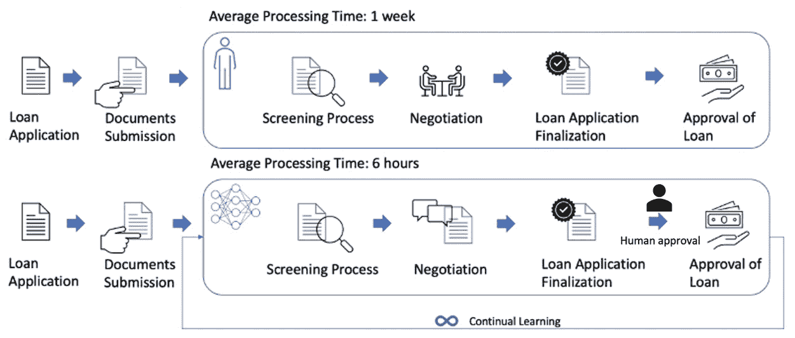

图 13.1 – 贷款发放场景 – 传统系统与由人类辅助的机器学习系统

与组织中的传统流程（完全依赖人类员工）相比，部署一个模型（由持续学习驱动）具有几个优势。例如，在前面的图表中，我们可以看到银行贷款审批流程的两个案例。第一种场景是由人类专家（例如在传统银行设置中）驱动的。第二种场景是使用机器学习系统自动化或增强流程，以筛选申请、谈判、提供贷款申请最终审批（在此过程中，人类专家审查机器学习系统的决策并批准或拒绝它），以及批准贷款。传统设置的审批时间为一周，而机器学习系统（与人类专家合作）的审批时间为 6 小时。

由于机器学习系统在人类助理的帮助下持续学习和改进，因此它对银行来说更快且更具可持续性。人类员工在公司或工作中有固定的雇佣期限。当他们离开时，他们的领域专业知识也随之消失，培训新员工或为同一任务招聘新员工是昂贵的。另一方面，随着时间推移，与人类专家合作或由人类专家辅助的机器学习模型能够随着时间的推移不断学习并保留知识（就时间而言）。与传统的、人类员工不断变化的方法相比，机器学习系统（与人类专家一起）获得的持续学习可以永久保留。从长远来看，持续学习可以为机器学习系统和业务释放巨大价值。

## 持续学习的需求

以下图表展示了为什么需要持续学习以及它如何增强您的机器学习系统以最大化您的商业价值：

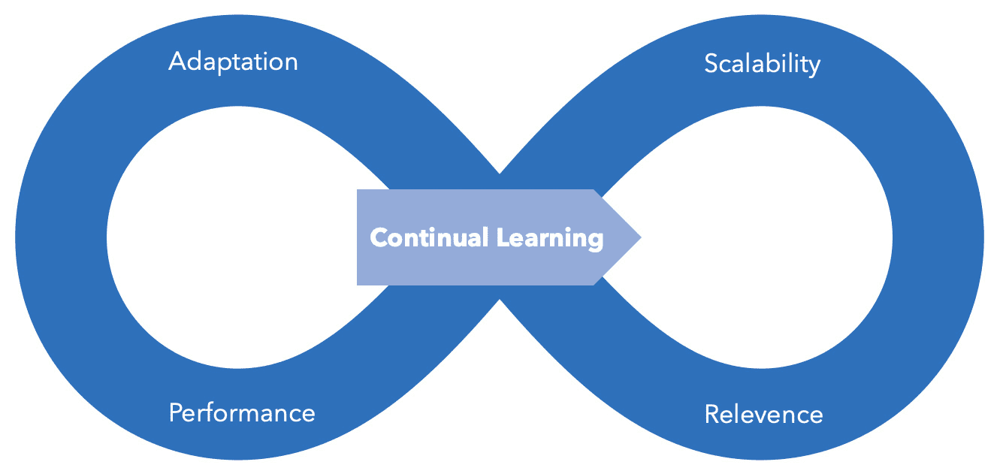

图 13.2 – 持续学习的益处

让我们详细探讨持续学习的益处：

+   **适应性**：在大多数直接应用中，数据漂移可能随着数据的持续流入而保持不变。然而，许多应用具有动态变化的数据漂移，例如推荐系统或异常检测系统，其中数据持续流动。在这些情况下，持续学习对于适应和准确预测至关重要。因此，适应数据和环境的不断变化性质是很重要的。

+   **可扩展性**：由 IDC 发布的白皮书（[`www.seagate.com/files/www-content/our-story/trends/files/idc-seagate-dataage-whitepaper.pdf`](https://www.seagate.com/files/www-content/our-story/trends/files/idc-seagate-dataage-whitepaper.pdf)）指出，到 2025 年，数据生成的速度将增长到每年 160 ZB，我们将无法存储所有这些数据。该论文预测，我们只能存储 3%到 12%的数据。数据需要即时处理；否则，由于存储基础设施无法跟上产生的数据，数据将会丢失。这里的诀窍是只处理一次传入的数据，只存储必要的信息，然后丢弃其余部分。

+   **相关性**：ML 系统的预测需要具有相关性并适应不断变化的环境。持续学习是保持 ML 系统在变化的环境和环境中高度相关和有价值的必要条件。

+   **性能**：持续学习将使 ML 系统具有高性能，因为它通过适应不断变化的数据和环境来使 ML 系统保持相关性。换句话说，更具相关性将提高 ML 系统的性能，例如，在准确性或其他指标方面，通过提供更有意义或更有价值的预测。

由于这些原因，在 ML 系统中需要持续学习，否则我们无法达到 ML 系统所能提供的最大价值。换句话说，项目注定会失败。持续学习是 AI 项目成功的关键。作为可解释监控的一部分，有效的治理策略可以促进持续学习。持续学习的一个重要部分是模型重新训练，这样我们才能应对不断变化的数据并做出相关决策。为此，我们可以将可解释监控和模型重新训练结合起来，以实现持续学习：

**可解释监控 + 模型重新训练 = 持续学习**

接下来，我们将深入探讨持续学习的应用。现在，让我们探讨如何将有效的管理制度引入 ML 系统。

# 可解释的监控 – 管理制度

在本节中，我们将实现我们在*第十一章*“监控您的 ML 系统的关键原则”中学习到的治理机制，应用于我们一直在工作的业务案例。我们将深入研究管理 ML 系统的三个组成部分，如下面的图所示：

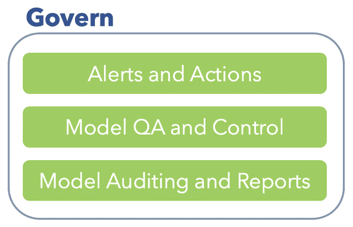

图 13.3 – 管理您的 ML 系统的组件

机器学习系统的有效性取决于它们如何被管理以最大化商业价值。为了实现端到端的可追踪性和符合法规，系统治理需要质量保证和监控、模型审计和报告。我们可以通过监控和分析模型输出来规范和规则机器学习系统。智能警告和行为指导治理以优化商业价值。让我们看看机器学习系统的治理是如何通过警告和行为、模型质量保证和控制、模型审计和报告来编排的。

## 警报和操作

警报是通过执行计划检查来检测条件生成的。一旦满足条件，就会生成警报。基于生成的警报，我们可以执行操作。在本节中，我们将了解这些元素以及它们是如何编排来管理机器学习系统的。

### 什么是警报？

警报是一个在后台运行的计划任务，用于监控应用程序以检查是否检测到特定条件。警报由以下三个因素驱动：

+   **计划**：我们应该多久检查一次条件？

+   **条件**：需要检测什么？

+   **操作**：当检测到条件时，我们应该做什么？

我们可以根据应用程序性能创建警报来监控以下方面：

+   基于阈值的可用性警报

+   基于阈值的失败请求警报

+   基于阈值的响应时间警报

+   基于阈值的服务器异常警报

+   基于数据漂移阈值的警报

+   基于模型漂移阈值的警报

+   基于错误或异常的警报

管理机器学习系统的一个重要领域是处理错误，因此让我们将注意力转向错误处理。

### 处理错误

在应用程序中，潜在的错误总是可能的。我们可以通过解决我们机器学习应用程序的所有可能的边缘情况来预见它们。使用以下图表中显示的框架，我们可以解决这些错误。这个框架的目的是识别边缘情况和自动调试方法来处理可能的错误。这将使机器学习服务保持运行：

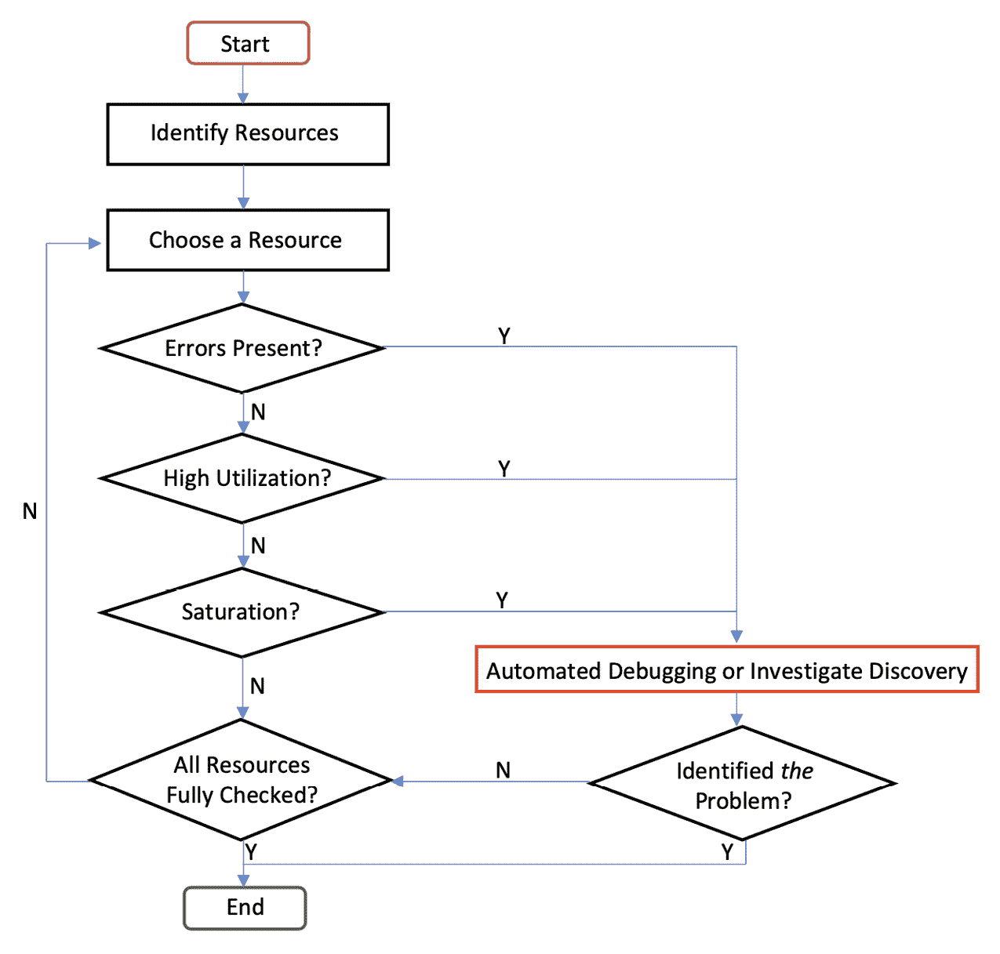

图 13.4 – 调试和调查错误的框架

如前图所示，我们首先识别可能存在错误的地方，并选择一个资源来处理该错误。选择资源后，我们通过检查资源的高利用率以及资源饱和度（资源饱和是指其容量已完全利用或超过设定的阈值）来检查错误。在出现任何问题的情况下，我们通过检查日志和制定解决方案来处理任何错误。最终，我们通过使用预先编写的脚本来处理任何问题（例如，通过重启资源或重新加载一个函数或文件，以使资源在健康状态下运行）来自动化调试。

通过解决所有可能的边缘情况并制定自动错误处理或调试，我们可以使我们的应用程序无故障，以服务于我们的用户。拥有无故障的应用程序可以确保用户在使用机器学习应用程序时获得无缝的体验和价值。一旦你识别出错误，通过调查或创建自动调试过程来解决它。毕竟，预防胜于治疗。因此，检查所有可能的边缘情况并在事先解决它们是有益的。

我们可以通过使用异常处理功能来处理潜在的错误。异常处理是一种编程技术，用于处理需要特殊关注的情况。在 Python 中，实现广泛的错误类型的异常处理很容易。我们可以使用 `try`、`except`、`else` 和 `finally` 功能来处理错误和异常，如下图所示：

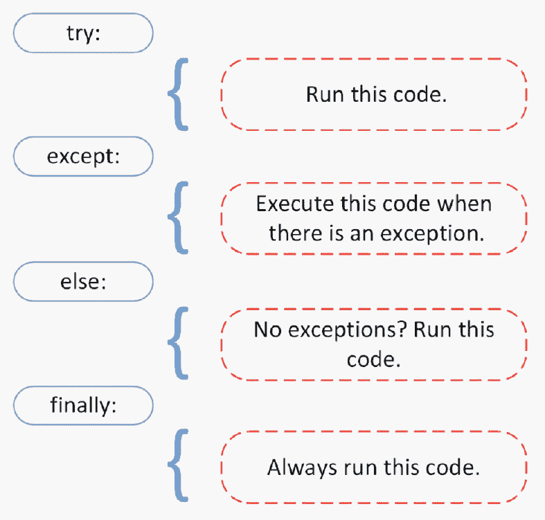

图 13.5 – 处理异常和边缘情况

在 `try` 子句中遇到异常之前，所有语句都会被执行。在 `try` 子句中找到的异常会被 `except` 块捕获和处理。`else` 块允许你编写只有在 `try` 子句中没有异常时才能运行的代码。使用 `finally`，无论之前是否遇到过异常，都可以运行应该始终运行的代码部分。

这里列出了一些可能常见的异常或错误，需要注意：

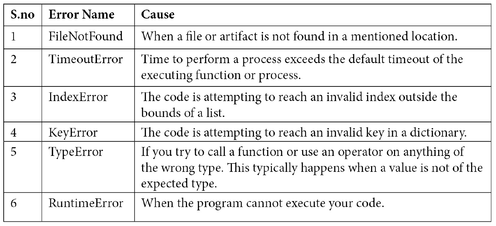

这些边缘情况或错误很常见，可以通过在应用程序中使用 `try` 和 `exception` 技术来解决。策略是减轻用户可能会觉得你的机器学习系统非常基础或天真的情况；例如，一个在聊天中发送错误信息的聊天机器人。在这种情况下，错误的代价很高，用户可能会失去对机器学习系统的信任。

我们将为我们一直在实施的业务用例实现一些自定义异常和错误处理，并根据生成的警报执行操作。让我们开始吧：

1.  在您的 Azure DevOps 项目中，前往我们的 `13_Govenance_Continual_Learning`。从那里，访问 `score.py` 文件。我们将首先导入所需的库。这次，我们将使用 `applicationinsights` 库来跟踪与端点连接的 Application Insights 的自定义事件或异常：

    ```py
    import json
    import numpy as np
    import os
    import pickle
    import joblib
    import onnxruntime
    import logging
    import time
    from azureml.core.model import Model
    from applicationinsights import TelemetryClient
    from azureml.monitoring import ModelDataCollector
    from inference_schema.schema_decorators import input_schema, output_schema
    from inference_schema.parameter_types.numpy_parameter_type import NumpyParameterType
    ```

    如前述代码所示，我们已经从 `applicationinsights` 库中导入了 `TelemetryClient` 函数。我们将使用 `TelemetryClient` 函数来访问连接到我们端点的 Application Insights。将 Application Insights 的仪表化密钥提供给 `TelemetryClient` 函数。

1.  此 **Instrumentation Key** 可从您的 Application Insights 访问，它应连接到机器学习应用程序，如下面的截图所示：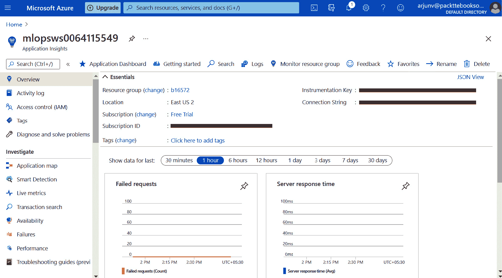

    图 13.6 – 从 Application Insights 获取仪表化密钥

1.  在获取您的 `TelemetryClient` 函数后，如下述代码所示。在这里，我们在 `tc` 变量中创建了一个 `TelemetryClient` 对象，用于跟踪自定义事件：

    ```py
    def init():
        global model, scaler, input_name, label_name, inputs_dc, prediction_dc, tc
            init function to monitor whether a FileNotFound error occurs when we load the scaler and model artifacts. If a file is not found, the tc.track_events() function will log the error message that's generated by the exception and tag the custom code 101. 
    ```

1.  同样，我们将在 `run` 函数中实现一些其他自定义事件 – 即，`ValueNotFound`、`OutofBoundsException` 和 `InferenceError` –：

    ```py
    @input_schema('data', NumpyParameterType(np.array([[34.927778, 0.24, 7.3899, 83, 16.1000, 1016.51, 1]])))
    @output_schema(NumpyParameterType(np.array([0])))
    def run(data):
                try:              
                    inputs_dc.collect(data)
                except Exception as e:
                    try and except to collect incoming data using the model data collector function. This collects the incoming data and stores it in the blob storage connected to the Azure ML service. If the incoming data contains some anomalous data or a missing value, an exception is raised. We will raise a ValueNotFound error using the track_event function so that we can log the exception message and custom code (in this case, a random or custom number of 201 is given to track the error). After collecting the incoming data, we will attempt to scale the data before inference:

    ```

    try:

    # 缩放传入数据

    data = scaler.transform(data)

    except Exception as e:

    在此情况下，`try` 和 `except` 可能很有用，因为我们正在尝试使用在 `init` 函数中加载的缩放器文件来缩放数据。如果缩放数据不成功，则会引发异常。在这里，我们使用 `track_event` 函数在 Application Insights 上跟踪异常。如果生成异常，我们将生成一个名为 `ScalingError` 的自定义事件。在 Application Insights 上记录一个异常消息和错误代码 `301`。同样，处理评分文件的最重要步骤 – 模型推理 – 需要细致入微地进行。现在，我们将再次使用 `try` 和 `except` 来确保推理成功且没有任何异常。让我们看看我们如何处理这种情况下的异常。请注意，我们正在访问 `model.run` 函数的元素编号 `2`。这导致模型推理时出现错误，因为我们正在引用列表中的错误或不存在的元素：

    ```py
                try:        
                    # model inference
                    result = model.run([label_name], {input_name: 
    data.astype(np.float32)})[2]
    # this call is saving model output data into Azure Blob
                    prediction_dc.collect(result)
                    if result == 0:
                        output = "Rain"                 
                    else: 
                        output = "No Rain"
                    return output
                except Exception as e:
    track_event() function to generate a custom event called InferenceError. This will be logged on Application Insights with an error message and a custom error code of 401. This way, we can log custom errors and exceptions on Application Insights and generate actions based on these errors and exceptions. 
    ```

    ```py

    ```

现在，让我们看看如何使用错误日志在 Application Insights 中调查这些错误并为其生成操作。

### 设置操作

我们可以根据之前创建的异常事件（在 *处理错误* 部分中）设置警报和操作。在本节中，我们将根据我们生成的警报设置一个电子邮件通知形式的操作。每当在 Application Insights 中生成异常或警报时，我们都会通过电子邮件收到通知。然后，我们可以进行调查并解决它。

通过访问应用洞察（Application Insights），我们可以设置一个动作（电子邮件）来接收警报，该应用洞察应连接到您的机器学习系统端点。您可以通过 Azure ML 工作区访问应用洞察。让我们开始吧：

1.  前往`端点`并检查应用洞察。一旦您访问了应用洞察仪表板，点击`事务搜索`，如下面的截图所示，以检查您的自定义事件日志（例如，推理异常）：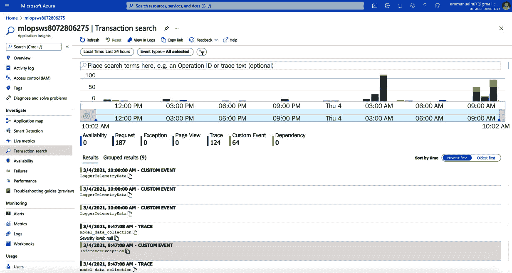

    图 13.7 – 检查自定义事件日志

1.  您可以通过日志检查在异常和错误发生时生成的自定义事件，然后为这些自定义事件设置警报和动作。要设置警报和动作，请转到**监控** > **警报**部分并点击**新建警报规则**，如下面的截图所示：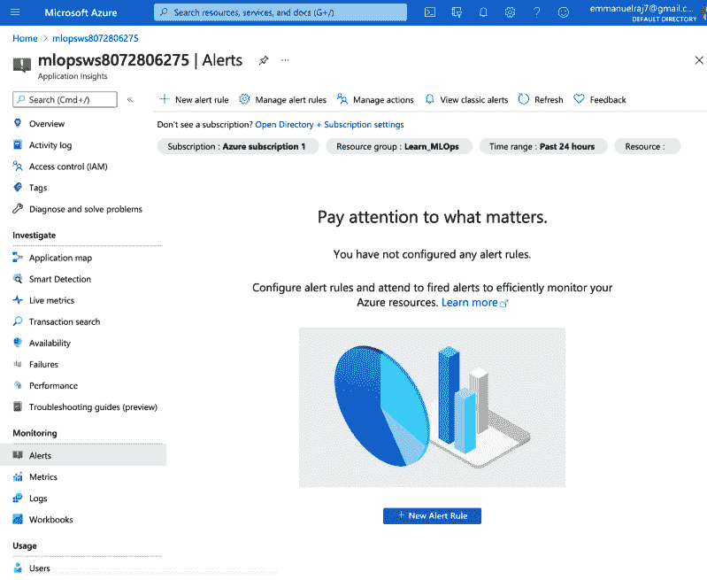

    图 13.8 – 设置新的警报规则

1.  在这里，您可以根据警报创建动作的条件。要设置条件，请点击**添加条件**。您将看到一个可以用来创建条件的信号或日志事件的列表。选择**InferenceError**，如下面的截图所示：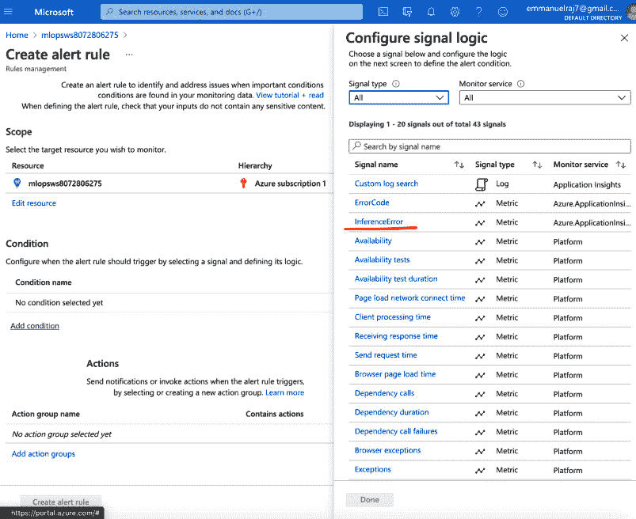

    图 13.9 – 配置条件

1.  选择您选择的信号或事件后，您将可以配置其条件逻辑，如下面的截图所示。通过设置一个阈值来配置条件。在这种情况下，我们将提供一个阈值为`400`，因为错误会引发一个值为`401`（因为我们为`InferenceError`事件提供了一个自定义的值为`401`）。当发生推理异常时，它会引发一个值高于`400`的`InferenceError`（确切地说是`401`）：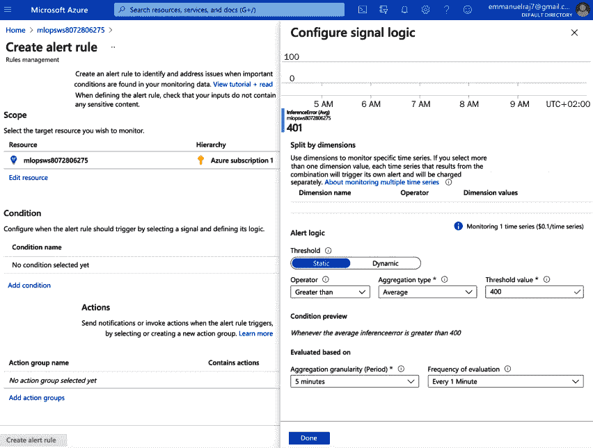

    图 13.10 – 配置条件逻辑和阈值

1.  设置阈值后，您将需要配置其他动作，例如运行**自动化运行手册**、**Azure Function**、**逻辑应用**或**安全 Webhook**，如下面的截图所示。目前，我们不会提示这些动作，但了解我们有这些动作是好的，因为我们可以运行一些脚本或应用程序作为备份机制来自动化错误调试：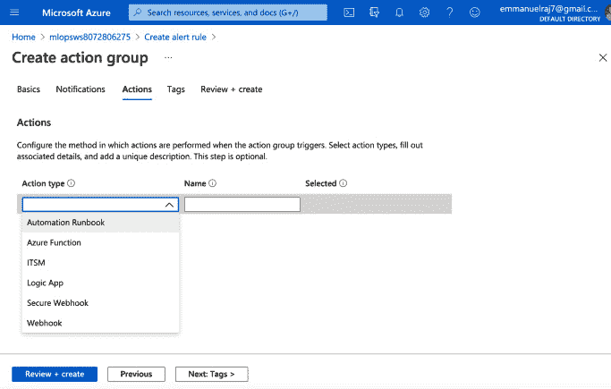

    图 13.11 – 自动化调试的动作（可选）

    这样，我们就可以通过预先配置的脚本或应用程序来自动化调试，以防发生错误或防止错误。毕竟，预防胜于治疗！

1.  最后，我们将创建一个条件。点击**审查和创建**以创建条件，如前面的截图所示。一旦创建了此条件，您将在**创建警报规则**面板中看到它，如下面的截图所示。接下来，通过点击**添加动作组**然后**创建动作组**来设置一个动作：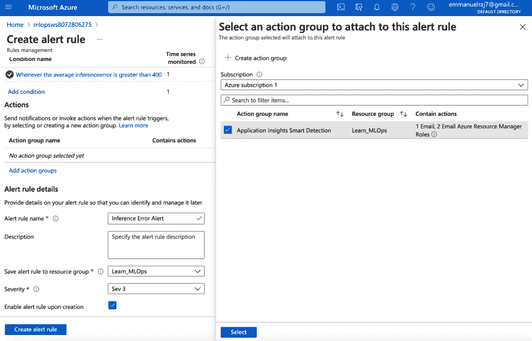

    图 13.12 – 创建动作组

1.  提供一个电子邮件地址，以便您可以接收通知，如下面的截图所示。在这里，您可以在**警报规则名称**字段中命名您的通知，并提供设置电子邮件警报动作所需的信息：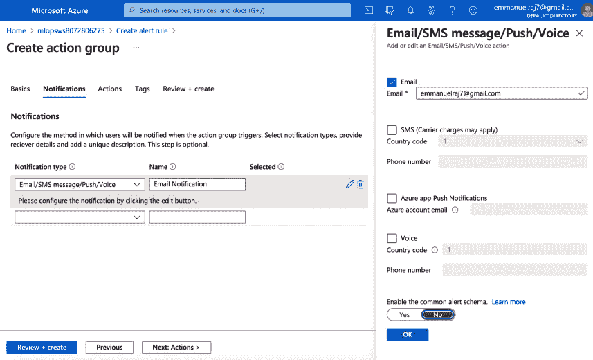

    图 13.13 – 配置电子邮件通知

    在提供所有必要信息，包括电子邮件后，点击**审查 + 创建**按钮来配置动作（基于错误的电子邮件）。最后，提供如**警报规则名称**、**描述**和**严重性**之类的警报规则详细信息，如下面的截图所示：

    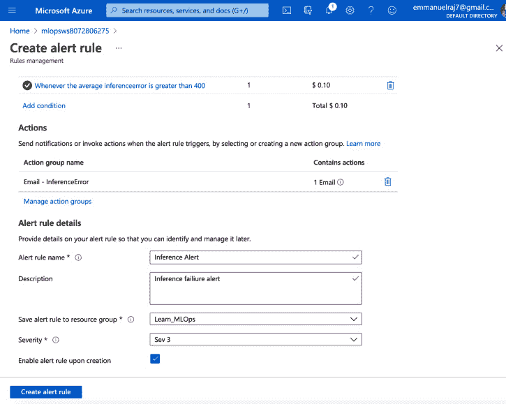

    图 13.14 – 配置电子邮件通知

1.  点击`InferenceError`)。有了这个，您已经创建了一个警报，现在是时候测试它了。转到`13_Govenance_Continual_Learning`文件夹，访问`test_inference.py`脚本（将 URL 替换为您的端点链接）。然后，通过运行以下命令来运行脚本：

    ```py
    python3 test_inference.py
    ```

1.  运行脚本将输出错误。在执行一些推理后停止脚本。在错误发生后的 5-10 分钟内，您将通过电子邮件收到错误通知，如下面的截图所示：

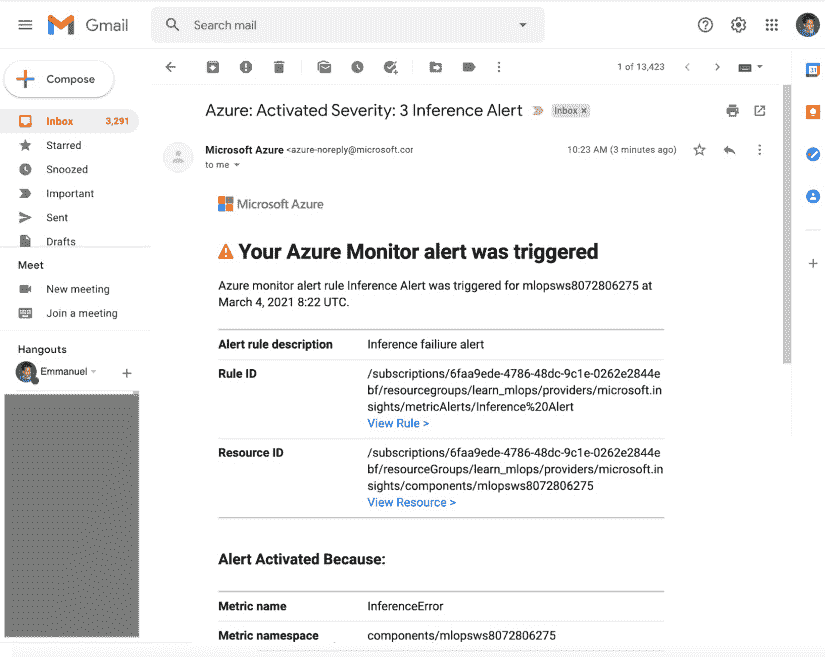

图 13.15 – 生产中的错误电子邮件通知

恭喜您 – 您已成功设置了一个错误的电子邮件动作警报！这样，您就可以在发现错误时进行调查，以便解决它并使系统恢复正常运行。

接下来，让我们看看如何确保我们有模型的质量保证，并且可以控制它们以最大化商业价值。

## 模型问答和控制

数据的演变或动态变化导致预测错误率增加。这可能是由于业务和外部环境的变化导致的数据漂移，或者可能是由于数据中毒攻击。预测错误率的增加导致在重新训练（手动或自动）时必须重新评估机器学习模型，从而发现比之前更准确的新算法。以下是一些使用新数据测试机器学习模型的指南：

+   通过重新训练模型并评估其性能来启用持续学习。

+   在定期间隔内评估所有模型在新的数据集上的性能。

+   当替代模型开始提供比现有模型更好的性能或更高的准确性时，发出警报。

+   维护包含最新性能细节和报告的模型注册表。

+   维护所有模型的端到端血缘，以便重现它们或向利益相关者解释其性能。

## 模型审计和报告

建立 MLOps 的定期审计和报告系统是一种良好的做法，因为它使组织能够端到端地跟踪其运营，并遵守法律，在需要时向利益相关者解释其运营。我们可以确保机器学习系统符合在社会和政府层面已经建立和审议的惯例。为了审计和报告 MLOps，建议审计员检查以下图像所示的审计基础：

![Figure 13.16 – ML Operations 审计报告的基本要素]

![img/B16572_13_016.jpg]

Figure 13.16 – ML Operations 审计报告的基本要素

### 数据审计

数据是驱动许多机器学习系统决策的因素。因此，审计员在审计和报告中需要考虑数据，检查训练数据，测试数据，推断数据，并监控数据。这是至关重要的，并且对于 MLOps 来说，拥有端到端的可追溯性以跟踪数据的使用（例如，哪个数据集用于训练哪个模型）是必要的。拥有类似“数据 Git”的机制，可以对数据进行版本控制，可以使得审计员能够引用、检查和记录数据。

### 模型审计（公平性和性能）

机器学习系统的审计员需要具备黑客心态，以识别模型可能失败的不同方式以及无法给出公平预测的情况。首先，审计员会检查训练数据，并使用可解释人工智能技术将其与推理数据进行比较。这有助于审计员对每个模型及其每个预测在个体层面上做出公平的判断。为了对每个模型进行公平性和性能评估，我们可以使用数据切片技术，这可以揭示对评估有价值的宝贵信息。因此，审计员请求所需人口统计数据和数据切片的数据切片结果是有价值的。为了进行集体评估，我们可以比较模型并评估其性能。这可以揭示关于公平性和性能评估的另一个信息角度。

如果进行模型审计，它将评估模型的输入（训练数据）、模型本身及其输出。需要评估数据的一致性和训练数据中可能存在的偏差。例如，如果简历筛选模型是在候选人收到工作邀请和工人晋升的先前或历史决策上训练的，我们想确保训练数据没有受到过去招聘人员和经理的隐含偏见的影响。与竞争模型进行基准测试、执行统计测试以确保模型从训练推广到未知结果，以及使用最先进的技术以允许模型可解释性，都是模型评估过程的一部分。

### 项目和治理审计

审计算法是否需要深入了解 AI 模型？当然不是。对 AI 系统进展的审计就像项目管理审计一样。是否有明确的期望成果目标？如果政府实体在特定环境中实施了 AI，这是一个很好的、直接的问题。此外，如果外部开发者被应用于 AI 系统，在开发者离开后，是否有可行的框架来管理模型？为了减少对专业知识的需要，公司必须对概念创建有广泛的文档记录，并拥有熟悉该模型的员工。因此，审计开发和治理实践从长远来看是有益的。

审计数据考虑因素、模型公平性和性能，以及 ML 系统的项目管理与治理，可以提供一个全面的 MLOps 视图。使用错误警报和操作，我们可以及时调查错误，使系统恢复正常运行，在某些情况下，我们甚至可以进行自动化调试以自动化错误解决和 MLOps。最后，通过进行模型质量保证、控制和审计，我们可以确保 MLOps 的有效治理。接下来，我们将探讨如何启用模型重新训练，以便我们的 ML 系统具有持续学习的能力。

# 启用模型重新训练

到目前为止，我们已经讨论了什么是模型漂移以及如何识别它。那么，问题来了，我们应该如何应对它？如果一个模型的预测性能由于环境变化而下降，解决方案是使用代表当前情况的新训练集重新训练模型。你的模型应该重新训练多少次？你如何选择你的新训练计划？以下图表显示了基于**模型重新训练**功能触发的**构建**模块，该模块基于**监控**模块的结果。有两种方式可以触发模型重新训练功能。一种是通过手动操作，另一种是通过自动化模型重新训练功能。让我们看看我们如何启用这两种方式：

![图 13.17 – 在 MLOps 工作流程中启用模型重新训练

![img/B16572_13_017.jpg]

图 13.17 – 在 MLOps 工作流程中启用模型重新训练

## 手动模型重新训练

产品负责人或质量保证经理有责任确保手动模型重新训练成功。手动模型触发步骤包括评估模型漂移，如果它超过了一个阈值（你需要确定一个漂移阈值，以触发模型重新训练），那么他们必须通过使用新的数据集（这可以是之前的训练数据集和最新的推理数据）来训练模型来触发模型训练过程。这样，产品负责人或质量保证经理对整个过程有完全的控制权，并且知道何时以及如何触发模型重新训练，以从机器学习系统中获得最大价值。

## 自动化模型重新训练

如果你想要完全自动化 MLOps 管道，自动化模型漂移管理可以是一个重新训练生产模型的理想方法。自动化模型漂移管理是通过配置监控应用程序诊断和模型性能的批量作业来完成的。然后，你必须激活模型重新训练。自动化模型漂移管理的关键部分是设置将自动触发重新训练模型功能的阈值。如果漂移监控阈值设置得太低，你可能会面临需要频繁重新训练的风险，这会导致高昂的计算成本。如果阈值设置得太高，你可能会面临不够频繁地重新训练的风险，导致生产模型次优。确定正确的阈值比看起来要复杂，因为你必须确定你需要多少额外的训练数据来反映这一新现实。即使环境已经改变，用一个非常小的训练集替换现有模型也是没有意义的。一旦你确定了阈值，你就可以有作业（例如，作为 CI/CD 管道的一部分）定期比较实时数据集的特征分布与训练数据上的特征分布（正如我们在*第十二章*，*模型服务和监控*中所做的那样）。当检测到大的偏差（或超过定义的阈值）时，系统可以安排模型重新训练并自动部署新模型。这可以通过使用工作调度程序（例如，Jenkins 或 Kubernetes 作业或 CI/CD 管道 cron 作业）来完成。这样，你可以完全自动化 MLOps 管道和模型重新训练部分。

注意，在数据流入量低或你偶尔进行批量推理（例如，每 6 个月一次）的情况下重新训练模型是没有意义的。你可以在推理之前或在你需要的时候定期训练模型。

# 维护 CI/CD 管道

如您所忆，在*第十章*“生产发布要素”中，我们提到*模型不是产品；管道才是产品*。因此，在设置自动化或半自动化 CI/CD 管道后，监控我们管道的性能至关重要。我们可以通过检查 Azure DevOps 中的发布来实现这一点，如下面的截图所示：

![图 13.18 – 维护 CI/CD 管道发布

![img/B16572_13_018.jpg]

图 13.18 – 维护 CI/CD 管道发布

检查的目标是保持 CI/CD 管道处于健康和稳健的状态。以下是一些保持 CI/CD 管道健康和稳健的指南：

+   如果构建失败，团队应实施**立即修复**的政策。

+   集成自动化验收测试。

+   需要提交拉取请求。

+   对每个故事或功能进行同行代码审查。

+   定期审计系统日志和事件（建议）。

+   定期向所有团队成员公开报告指标（例如，通过 slackbot 或电子邮件通知）。

通过实施这些实践，我们可以避免高失败率，并使 CI/CD 管道对所有团队成员来说都稳健、可扩展和透明。

# 摘要

在本章中，我们学习了 ML 解决方案持续学习的核心原则。我们通过实际错误处理和配置使用电子邮件通知提醒开发者的操作，学习了可解释监控（治理组件）。最后，我们探讨了启用模型重新训练以及维护 CI/CD 管道的方法。这样，您已经具备了自动化和治理 MLOps 的关键技能，以应对您的用例。

恭喜您完成这本书！MLOps 的世界正在不断进化，变得越来越好。您现在已经准备好利用 MLOps 来帮助您的业务繁荣。希望您在完成动手实践 MLOps 实现的过程中享受阅读和学习。走出舒适区，成为您希望看到的改变。祝您在 MLOps 的努力中一切顺利！
